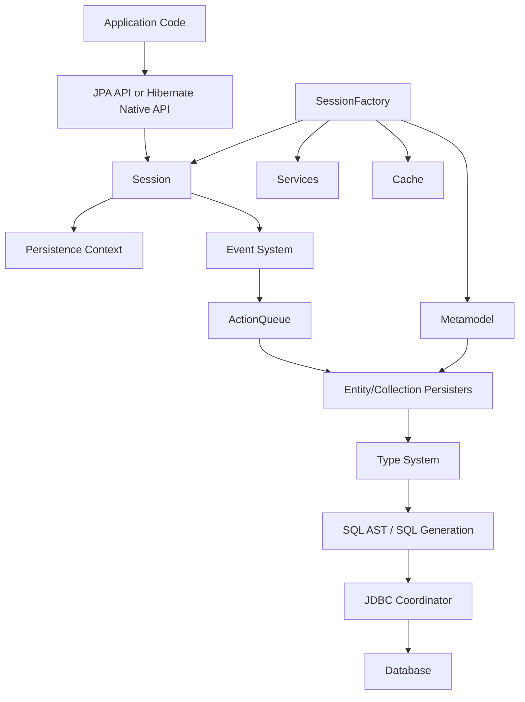
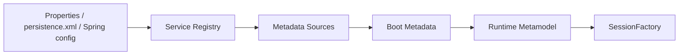
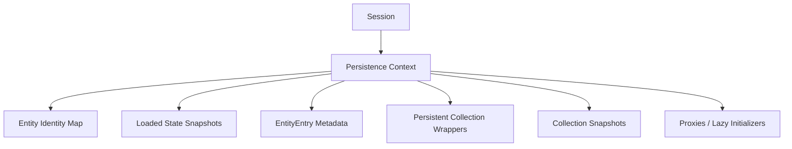
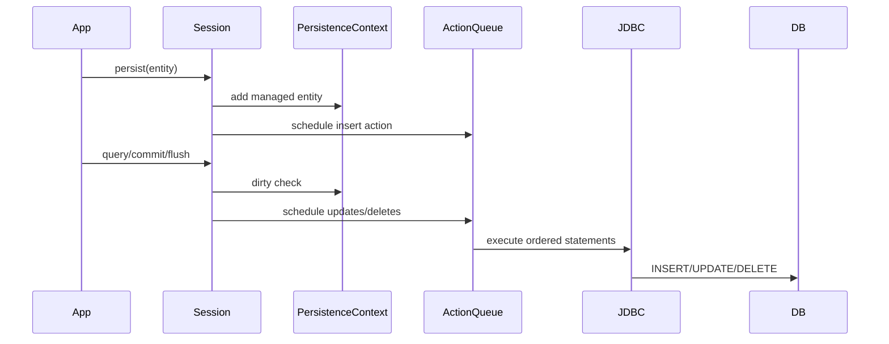
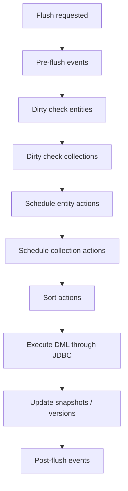
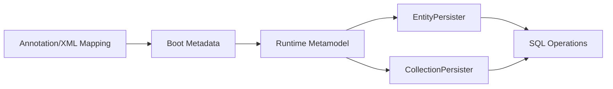
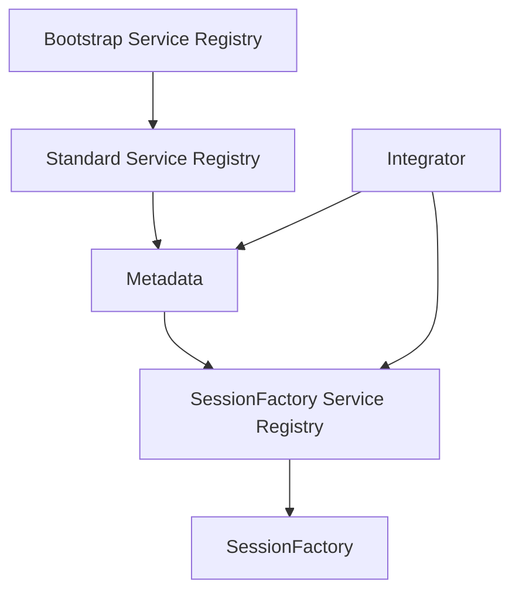

# Part 025 — Hibernate ORM Deep Dive: Session, ActionQueue, Types, Events

> Target part ini: kamu bisa melihat Hibernate bukan sebagai “implementasi JPA”, tetapi sebagai runtime ORM dengan beberapa subsystem eksplisit: `SessionFactory`, `Session`, persistence context, `ActionQueue`, persister, type system, event system, service registry, SQL generation, dan integration SPI.

Part sebelumnya membahas extension matrix. Sekarang kita masuk lebih dalam ke provider yang paling banyak dipakai di ekosistem Java enterprise: **Hibernate ORM**.

Tujuan kita bukan menghafal internal class. Tujuannya adalah membangun kemampuan ini:

1. membaca stack trace Hibernate tanpa panik,
2. tahu subsystem mana yang sedang bekerja,
3. tahu extension point mana yang aman dipakai,
4. bisa membedakan API publik, SPI, dan internal implementation,
5. bisa memprediksi akibat dari custom listener/type/interceptor terhadap correctness dan performance.

Hibernate memberi dua wajah utama:

- **Jakarta Persistence facade**: `EntityManagerFactory`, `EntityManager`, `Query`, `TypedQuery`, `EntityGraph`.
- **Native Hibernate API**: `SessionFactory`, `Session`, `StatelessSession`, `Transaction`, `MutationQuery`, `SelectionQuery`, `NativeQuery`, `Filter`, `Cache`, `HibernateCriteriaBuilder`, `SchemaManager`.

Sejak Hibernate 5.2, `Session` memperluas `EntityManager`, dan `SessionFactory` memperluas `EntityManagerFactory`. Artinya, kamu tidak sedang berpindah ke dunia berbeda saat melakukan `unwrap(Session.class)`; kamu sedang membuka surface area native yang lebih kaya.

---

## 1. Mental Model Besar: Hibernate sebagai Runtime Pipeline

Saat aplikasi menjalankan operasi ORM, Hibernate tidak langsung “menyimpan objek”. Ia menjalankan pipeline.



Beberapa hal penting:

- `SessionFactory` adalah runtime immutable-ish dan mahal dibuat.
- `Session` adalah unit-of-work stateful, murah dibuat, tidak thread-safe.
- Persistence context menyimpan entity managed dan snapshot/change state.
- `ActionQueue` menyimpan rencana SQL mutation sampai flush.
- Persister tahu mapping entity/collection ke table/column.
- Type system tahu cara mengubah Java value menjadi JDBC value dan sebaliknya.
- Event system menghubungkan operasi tingkat API dengan lifecycle internal.

Kalau terjadi bug, tanya:

> “Bug ini terjadi di layer apa?”

Bukan langsung:

> “Hibernate error, annotation apa yang salah?”

---

## 2. Public API vs SPI vs Internal Implementation

Hibernate punya tiga kategori surface area.

| Kategori | Contoh | Boleh dipakai aplikasi? | Stabilitas |
|---|---|---:|---|
| Public API | `Session`, `SessionFactory`, `StatelessSession`, `Query`, `Filter`, `Cache` | Ya | Relatif stabil |
| SPI | `Integrator`, `EventListenerRegistry`, `JavaType`, `JdbcType`, custom generator/type interfaces | Ya, untuk integrasi advanced | Lebih sensitif versi |
| Internal | package `org.hibernate.internal`, internal action queue implementation, internal persister implementation | Hindari | Tidak dijamin stabil |

Rule sederhana:

> Kalau kamu harus mengimpor package dengan `.internal.`, anggap itu alarm arsitektur.

Bukan berarti tidak pernah boleh untuk debugging, tetapi jangan jadikan kontrak produksi tanpa wrapper dan compatibility test.

---

## 3. `SessionFactory`: Runtime Root dan Metadata Hub

`SessionFactory` adalah hasil final dari bootstrapping Hibernate. Ia menggabungkan:

- mapping metadata,
- runtime metamodel,
- service registry,
- connection provider,
- transaction coordinator strategy,
- second-level cache integration,
- query engine,
- type registry,
- entity/collection persister,
- event listener registry,
- statistics.

Secara mental:

```java
SessionFactory sessionFactory = new MetadataSources(serviceRegistry)
    .addAnnotatedClass(CaseFile.class)
    .addAnnotatedClass(Party.class)
    .buildMetadata()
    .buildSessionFactory();
```

Dalam Spring Boot, kamu biasanya tidak menulis kode ini. Tetapi pipeline-nya tetap ada:



### 3.1 Invariant `SessionFactory`

`SessionFactory` harus diperlakukan sebagai:

- singleton per persistence unit/provider configuration,
- long-lived,
- thread-safe,
- expensive to create,
- closed only during application shutdown or controlled reload.

Jangan membuat `SessionFactory` per request.

### 3.2 Kapan Butuh Akses Native `SessionFactory`

Contoh legitimate:

```java
SessionFactory sessionFactory = entityManagerFactory.unwrap(SessionFactory.class);
Statistics statistics = sessionFactory.getStatistics();
Cache cache = sessionFactory.getCache();
```

Gunakan untuk:

- membaca Hibernate statistics,
- mengelola second-level cache,
- membuka `StatelessSession`,
- mengakses native query/fetch/filter facility,
- test/diagnostics.

Jangan gunakan untuk bypass transaction boundary framework tanpa alasan kuat.

---

## 4. `Session`: Stateful Unit of Work

`Session` adalah pusat operasi runtime Hibernate.

Ia melakukan:

- entity lookup,
- persistence context management,
- dirty checking,
- lazy loading coordination,
- action scheduling,
- flush,
- query execution,
- transaction synchronization,
- JDBC access coordination.

Contoh:

```java
Session session = entityManager.unwrap(Session.class);

CaseFile file = session.find(CaseFile.class, caseId);
file.escalate("SLA_BREACH");

// Belum tentu SQL UPDATE terjadi di sini.
// UPDATE biasanya terjadi saat flush/commit.
```

### 4.1 Session Bukan Repository

`Session` terlalu kuat untuk dibocorkan ke semua layer. Ia bisa:

- flush manual,
- clear context,
- enable filter,
- create native query,
- access JDBC connection,
- detach entity,
- set read-only mode.

Dalam aplikasi besar, gunakan boundary eksplisit:

```java
public interface CasePersistencePort {
    Optional<CaseFile> findForCommand(CaseId id);
    void save(CaseFile aggregate);
    boolean existsOpenCaseForParty(PartyId partyId);
}
```

Implementasi boleh memakai Hibernate native API, tetapi port tidak perlu tahu.

---

## 5. Stateful `Session` vs `StatelessSession`

Hibernate 7 memperkuat posisi `StatelessSession`. Ini penting untuk high-volume read/write path.

| Aspek | `Session` | `StatelessSession` |
|---|---|---|
| Persistence context | Ada | Tidak ada first-level cache |
| Dirty checking | Ada | Tidak otomatis seperti stateful session |
| Cascading entity lifecycle | Natural dalam persistence context | Lebih eksplisit |
| Lazy loading/proxy behavior | Didukung melalui context | Terbatas/berbeda |
| Batch processing | Bisa, tapi perlu flush/clear | Sangat cocok |
| Memory growth risk | Ada | Lebih rendah |
| Entity identity guarantee dalam unit-of-work | Ya | Tidak sama |

Gunakan `Session` untuk command transaction berbasis aggregate.

Gunakan `StatelessSession` untuk:

- massive import,
- reconciliation job,
- read-transform-write pipeline,
- ETL internal,
- archival/purge,
- bulk denormalization.

Contoh:

```java
try (StatelessSession stateless = sessionFactory.openStatelessSession()) {
    Transaction tx = stateless.beginTransaction();

    for (CaseSnapshot snapshot : snapshots) {
        stateless.insert(snapshot);
    }

    tx.commit();
}
```

Rule:

> Jangan memakai `StatelessSession` jika correctness kamu bergantung pada managed graph, automatic dirty checking, cascade lifecycle, atau first-level identity map.

---

## 6. Persistence Context Internal View

Dalam `Session`, persistence context kira-kira menyimpan struktur seperti:

```txt
EntityKey -> managed entity instance
EntityKey -> loaded state snapshot
Entity instance -> EntityEntry
CollectionKey -> PersistentCollection wrapper
CollectionKey -> collection snapshot
Proxy -> target key / initializer
```

Secara konseptual:



Ketika kamu melakukan:

```java
CaseFile a = session.find(CaseFile.class, id);
CaseFile b = session.find(CaseFile.class, id);
```

Dalam session yang sama:

```java
a == b // true
```

Itu bukan karena Java cache global, tetapi karena identity map persistence context.

### 6.1 EntityEntry sebagai Runtime Metadata

Secara konseptual, untuk setiap managed entity Hibernate perlu tahu:

- status: managed, read-only, deleted, loading, gone,
- loaded state,
- version,
- persister,
- identifier,
- lock mode,
- exists in database or not,
- dirty checking baseline.

Ini menjelaskan kenapa persistence context bisa mahal pada unit-of-work yang terlalu panjang.

---

## 7. `ActionQueue`: Write-Behind yang Sering Tidak Terlihat

Hibernate tidak langsung mengeksekusi semua mutation saat kamu memanggil method entity.

Saat entity berubah, Hibernate akan mendeteksi perubahan dan menjadwalkan tindakan. `ActionQueue` adalah struktur internal yang menampung operasi DML yang akan dieksekusi saat flush.

Jenis tindakan konseptual:

- entity insert,
- entity update,
- entity delete,
- collection recreate,
- collection remove,
- collection update,
- orphan removal,
- queued collection operation,
- after-transaction completion process.



### 7.1 Kenapa Action Queue Ada?

Karena Hibernate perlu:

- mengurutkan statement agar constraint FK lebih aman,
- batching statement sejenis,
- menghindari SQL terlalu dini,
- mengumpulkan perubahan dari banyak entity,
- menyelaraskan lifecycle entity dan collection,
- menjalankan event callback secara konsisten.

### 7.2 ActionQueue dan Constraint Violation

Constraint violation sering bukan karena SQL “salah”, tetapi karena ordering tidak sesuai dengan model kamu.

Contoh hazard:

```java
parent.removeChild(oldChild);
parent.addChild(new Child(oldChild.getBusinessKey()));
```

Jika ada unique constraint pada `(parent_id, business_key)`, urutan `INSERT` sebelum `DELETE` bisa menyebabkan violation.

Solusi possible:

- flush setelah delete sebelum insert,
- ubah mutation semantics,
- gunakan surrogate row version,
- hindari replacement dengan natural key sama dalam satu flush,
- review unique constraint dan lifecycle.

```java
parent.removeChild(oldChild);
entityManager.flush();
parent.addChild(newChild);
```

Manual flush bukan default pattern, tetapi kadang menjadi boundary eksplisit untuk constraint ordering.

---

## 8. Flush Event Pipeline

Flush bukan satu operasi sederhana. Secara konseptual:



Flush bisa dipicu oleh:

- transaction commit,
- query execution under `AUTO` flush mode,
- explicit `flush()`,
- provider/framework synchronization point.

Hibernate punya event listener untuk beberapa fase seperti persist, merge, delete, load, flush, dirty check, pre/post insert, pre/post update, pre/post delete.

### 8.1 Flush Mode dan Query Surprise

```java
caseFile.changeStatus(Status.CLOSED);

List<CaseFile> open = entityManager
    .createQuery("select c from CaseFile c where c.status = :status", CaseFile.class)
    .setParameter("status", Status.OPEN)
    .getResultList();
```

Dengan flush mode default, Hibernate bisa flush pending update sebelum query agar query melihat data konsisten dengan persistence context.

Kalau query mendadak mengeluarkan `UPDATE`, bukan berarti query melakukan update. Query memicu flush.

### 8.2 Read-Only Optimization

Hibernate memiliki mode read-only pada query/session/entity tertentu. Ini bisa mengurangi dirty checking cost.

```java
List<CaseFile> files = session
    .createSelectionQuery("from CaseFile c where c.status = :status", CaseFile.class)
    .setParameter("status", Status.ARCHIVED)
    .setReadOnly(true)
    .getResultList();
```

Read-only harus dipakai hanya jika kamu benar-benar tidak akan mutate entity.

---

## 9. Entity Persister dan Collection Persister

Hibernate tidak menyimpan mapping sebagai annotation mentah saat runtime. Annotation/XML diubah menjadi metamodel dan persister.

Persister bertanggung jawab atas:

- table/column mapping,
- identifier mapping,
- version mapping,
- discriminator/inheritance,
- SQL insert/update/delete/select generation,
- cache access strategy,
- lazy property metadata,
- cascade and collection handling integration.

Mental model:



Kenapa ini penting?

Karena banyak error Hibernate sebenarnya error metadata/persister:

- duplicate column mapping,
- unknown entity,
- repeated association ownership,
- invalid discriminator,
- unsupported id generator,
- collection table mismatch,
- custom type mismatch.

Saat stack trace menyebut persister, pikirkan:

> “Mapping runtime apa yang sedang dipakai Hibernate untuk entity/collection ini?”

---

## 10. Hibernate Type System: Java Value ke JDBC Value

ORM bukan cuma entity ke table. ORM juga perlu tahu bagaimana setiap value dikonversi.

Contoh problem:

- `Money` harus disimpan sebagai amount + currency atau JSON?
- `CaseStatus` disimpan sebagai enum name, code, atau numeric ordinal?
- `Instant` disimpan sebagai timestamp with timezone atau timestamp UTC?
- `JsonNode` disimpan sebagai JSONB, CLOB, atau VARCHAR?
- `UUID` disimpan sebagai native UUID, binary, atau char?

Hibernate type system modern memisahkan beberapa concern:

| Concern | Contoh |
|---|---|
| Java-side semantics | `JavaType` |
| JDBC-side representation | `JdbcType` |
| Combined basic mapping | `BasicType` |
| Conversion layer | `AttributeConverter`, custom converter |
| SQL type code | `SqlTypes.JSON`, `SqlTypes.UUID`, etc. |

### 10.1 Portable First: `AttributeConverter`

```java
@Converter(autoApply = false)
public class CasePriorityConverter implements AttributeConverter<CasePriority, String> {
    @Override
    public String convertToDatabaseColumn(CasePriority attribute) {
        return attribute == null ? null : attribute.code();
    }

    @Override
    public CasePriority convertToEntityAttribute(String dbData) {
        return dbData == null ? null : CasePriority.fromCode(dbData);
    }
}
```

```java
@Convert(converter = CasePriorityConverter.class)
@Column(name = "priority_code", length = 20, nullable = false)
private CasePriority priority;
```

Gunakan converter untuk domain value yang bisa direpresentasikan sebagai satu kolom sederhana.

### 10.2 Hibernate-Specific: JSON

```java
@JdbcTypeCode(SqlTypes.JSON)
@Column(name = "payload", columnDefinition = "jsonb")
private CasePayload payload;
```

Ini powerful, tetapi provider-specific dan database-specific.

Gunakan jika:

- payload memang semi-structured,
- query shape terhadap field JSON jelas,
- indexing JSON sudah dipikirkan,
- migration strategy ada,
- projection/reporting tidak bergantung pada full entity hydration.

### 10.3 Custom Type Rule

Sebelum menulis custom Hibernate type, tanyakan:

1. Apakah `AttributeConverter` cukup?
2. Apakah built-in Hibernate type cukup?
3. Apakah database column type sebenarnya tepat?
4. Apakah custom type akan dipakai lintas entity?
5. Apakah testing sudah mencakup bind/extract/null/dirty checking?

Custom type yang buruk bisa menyebabkan:

- dirty checking selalu true,
- query parameter binding salah,
- cache serialization salah,
- timezone drift,
- migration impossible,
- dialect-specific SQL rusak.

---

## 11. Event System: Hibernate sebagai Lifecycle Engine

Hibernate memakai event system untuk mengimplementasikan operasi seperti:

- load,
- persist,
- merge,
- delete,
- flush,
- dirty check,
- lock,
- refresh,
- replicate,
- auto flush,
- pre/post insert,
- pre/post update,
- pre/post delete,
- post load,
- collection recreate/remove/update.

Event system adalah extension point kuat, tetapi berbahaya jika dipakai sebagai tempat business logic utama.

### 11.1 Contoh Integrator untuk Register Listener

```java
public final class AuditIntegrator implements Integrator {
    @Override
    public void integrate(
            Metadata metadata,
            BootstrapContext bootstrapContext,
            SessionFactoryImplementor sessionFactory) {

        EventListenerRegistry registry = sessionFactory
            .getServiceRegistry()
            .getService(EventListenerRegistry.class);

        registry.appendListeners(
            EventType.PRE_UPDATE,
            new CaseAuditPreUpdateListener()
        );
    }

    @Override
    public void disintegrate(
            SessionFactoryImplementor sessionFactory,
            SessionFactoryServiceRegistry serviceRegistry) {
        // cleanup if needed
    }
}
```

Konfigurasi bisa melalui Java service loader atau framework-specific boot integration.

### 11.2 Listener untuk Audit Teknis, Bukan Workflow Utama

Good use cases:

- populate technical audit columns,
- validate cross-cutting mapping invariant,
- collect metrics,
- enforce tenant guard,
- inspect dirty properties for audit log,
- integrate with outbox carefully.

Bad use cases:

- mengirim email dari listener,
- memanggil remote service,
- menjalankan workflow escalation,
- melakukan query kompleks yang memicu recursive flush,
- mengubah aggregate lain secara diam-diam.

Rule:

> Listener boleh memperkaya persistence behavior. Listener tidak boleh menjadi hidden application service.

---

## 12. Interceptor vs Event Listener vs StatementInspector

Hibernate punya beberapa hook yang sering tertukar.

| Hook | Level | Cocok untuk | Hindari untuk |
|---|---|---|---|
| `StatementInspector` | SQL string sebelum execution | SQL tagging, tenant comment, diagnostics | Mengubah SQL secara kompleks |
| Interceptor | Session/entity lifecycle broader hook | legacy integration, audit sederhana | business logic besar |
| Event listener | Hibernate event pipeline | precise lifecycle customization | remote side effects |
| Integrator | boot-time registration | module/plugin integration | request-level behavior |
| `AttributeConverter`/type | value conversion | domain value mapping | side effects |

### 12.1 StatementInspector

```java
public final class CorrelationStatementInspector implements StatementInspector {
    @Override
    public String inspect(String sql) {
        String correlationId = CorrelationContext.currentIdOr("unknown");
        return "/* correlation_id=" + correlationId + " */ " + sql;
    }
}
```

Manfaat:

- query traceability,
- correlation with logs/traces,
- debugging production SQL.

Bahaya:

- jangan parse SQL besar-besaran,
- jangan inject user input,
- jangan mengubah semantic SQL tanpa test kuat.

---

## 13. Service Registry dan Integrator Pattern

Hibernate bootstrapping dibangun di atas service model.



Integrator dipakai oleh library/framework seperti:

- Bean Validation integration,
- Envers,
- custom event listener module,
- custom type contributor,
- naming strategy integration,
- metrics integration.

Untuk aplikasi enterprise, pola aman:

```txt
infrastructure-hibernate-extension
  ├── AuditIntegrator
  ├── TenantGuardListener
  ├── SqlCommentStatementInspector
  ├── CustomTypeContributor
  └── compatibility tests
```

Jangan menyebar extension Hibernate di semua module domain.

---

## 14. Custom Generator dan ID Strategy Extension

Identifier generator termasuk area sensitif.

Contoh kebutuhan:

- ID harus sortable,
- ID harus mengandung shard/tenant prefix,
- ID harus compatible dengan legacy sequence,
- ID harus bisa dibuat sebelum insert,
- ID harus tidak membunuh JDBC batching.

Hibernate punya generator infrastructure, tetapi untuk banyak kasus modern, kamu bisa mulai dari:

- database sequence + pooled optimizer,
- UUID/time-ordered UUID,
- application-generated ID sebelum persist.

Contoh application-generated ID:

```java
@Entity
class CaseFile {
    @Id
    private UUID id;

    protected CaseFile() {
    }

    public CaseFile(UUID id, CaseNumber number) {
        this.id = Objects.requireNonNull(id);
        this.number = Objects.requireNonNull(number);
    }
}
```

Keuntungan:

- ID tersedia sebelum persist,
- mudah untuk domain event/outbox correlation,
- insert batching tidak tergantung identity generated key.

Risiko:

- collision strategy,
- index locality,
- storage size,
- ordering semantics.

---

## 15. Filters sebagai Runtime Predicate Extension

Hibernate filters memungkinkan predicate dinamis pada entity/collection.

Contoh soft boundary:

```java
@FilterDef(name = "tenantFilter", parameters = @ParamDef(name = "tenantId", type = String.class))
@Filter(name = "tenantFilter", condition = "tenant_id = :tenantId")
@Entity
class CaseFile {
    @Id
    private UUID id;

    @Column(name = "tenant_id", nullable = false, updatable = false)
    private String tenantId;
}
```

```java
session.enableFilter("tenantFilter")
    .setParameter("tenantId", currentTenantId);
```

Filter berguna untuk:

- tenant scoping,
- effective-date scoping,
- soft boundary query,
- archival partition access.

Namun filter bukan pengganti authorization.

Filter hazard:

- lupa enable filter,
- native SQL bypass,
- cache interaction,
- background job context hilang,
- admin use case butuh deliberate bypass.

---

## 16. Safe Native API Usage Pattern

Gunakan native Hibernate API dengan isolasi.

### 16.1 Jangan Bocorkan `Session` ke Domain

Buruk:

```java
class CaseFile {
    public void close(Session session) {
        session.createMutationQuery("...").executeUpdate();
    }
}
```

Baik:

```java
class CaseFile {
    public void close(ClosingReason reason) {
        this.status = CaseStatus.CLOSED;
        this.closedAt = Instant.now();
        this.closingReason = reason;
    }
}
```

Hibernate API tetap di infrastructure layer.

### 16.2 Encapsulate Provider-Specific Query

```java
@Repository
class HibernateCaseReadRepository implements CaseReadRepository {
    @PersistenceContext
    private EntityManager entityManager;

    @Override
    public List<CaseSummary> findOpenCasesForDashboard(String tenantId) {
        Session session = entityManager.unwrap(Session.class);

        return session.createSelectionQuery("""
                select new com.acme.caseapp.CaseSummary(
                    c.id, c.number, c.priority, c.status, c.assignedTeamId
                )
                from CaseFile c
                where c.tenantId = :tenantId
                  and c.status in :statuses
                order by c.priority desc, c.createdAt asc
                """, CaseSummary.class)
            .setParameter("tenantId", tenantId)
            .setParameter("statuses", List.of(CaseStatus.OPEN, CaseStatus.ESCALATED))
            .setReadOnly(true)
            .getResultList();
    }
}
```

Kalau nanti provider diganti, surface yang terdampak jelas.

---

## 17. Debugging dengan Hibernate Statistics

Aktifkan statistics di lingkungan test/staging/performance lab.

```properties
hibernate.generate_statistics=true
```

Contoh inspeksi:

```java
Statistics stats = sessionFactory.getStatistics();
stats.clear();

runUseCase();

System.out.println("Entity load count = " + stats.getEntityLoadCount());
System.out.println("Query execution count = " + stats.getQueryExecutionCount());
System.out.println("Flush count = " + stats.getFlushCount());
System.out.println("Second-level cache hit count = " + stats.getSecondLevelCacheHitCount());
```

Gunakan untuk regression test:

```java
assertThat(stats.getPrepareStatementCount()).isLessThanOrEqualTo(5);
```

Tetapi jangan membuat test terlalu rapuh terhadap SQL count jika query plan memang bisa berubah karena fetch strategy legitimate.

---

## 18. Failure Mode Catalog: Hibernate Internals Edition

### 18.1 “Update keluar padahal tidak panggil save”

Kemungkinan:

- entity managed berubah field-nya,
- dirty checking mendeteksi perubahan,
- query/commit memicu flush,
- setter dipanggil mapper/serializer,
- mutable value changed in place.

Debug:

- cek entity managed/detached,
- enable SQL + bind log,
- cek dirty properties via event/listener/log,
- cek mapper/serialization side effect.

### 18.2 “Constraint violation saat ganti child”

Kemungkinan:

- collection remove/insert ordering,
- unique constraint conflict dalam satu flush,
- orphan removal belum dieksekusi sebelum insert,
- owning side tidak konsisten.

Debug:

- lihat SQL order,
- cek `equals/hashCode`,
- cek owning side helper method,
- pertimbangkan flush boundary.

### 18.3 “N+1 muncul setelah listener ditambahkan”

Kemungkinan:

- listener mengakses lazy association,
- `toString()`/logging memicu lazy load,
- audit logic membaca graph terlalu dalam.

Debug:

- cek event listener code,
- cek SQL stack trace/log category,
- jangan akses association dari listener kecuali eksplisit.

### 18.4 “Custom type selalu dirty”

Kemungkinan:

- equality Java type salah,
- mutable value tidak deep copied,
- converter membuat instance baru dengan equality buruk,
- JSON object tidak immutable.

Debug:

- test round-trip conversion,
- test equality/hashCode,
- prefer immutable value object,
- cek dirty checking behavior.

### 18.5 “Second-level cache stale”

Kemungkinan:

- native SQL bypass cache invalidation,
- bulk update tidak evict region,
- wrong concurrency strategy,
- mutable cached entity,
- cluster invalidation missing.

Debug:

- cek cache region,
- cek update path,
- evict after bulk/native mutation,
- add integration test multi-session.

---

## 19. Extension Design Review Checklist

Sebelum memakai Hibernate-specific extension, jawab ini:

1. Apakah kebutuhan ini domain concern atau persistence concern?
2. Apakah Jakarta Persistence portable API cukup?
3. Apakah extension ini punya behavior jelas saat flush/rollback?
4. Apakah extension ini mempengaruhi cache?
5. Apakah extension ini mempengaruhi batch write?
6. Apakah extension ini aman terhadap lazy loading?
7. Apakah extension ini aman di background job?
8. Apakah extension ini aman di multi-tenant context?
9. Apakah ada test provider-specific?
10. Apakah ada wrapper agar lock-in tidak bocor?

Kalau jawaban nomor 1 adalah domain concern, jangan mulai dari Hibernate listener. Mulai dari domain service/application service.

---

## 20. Practice: Build a Hibernate Internal Diagnostic Harness

Buat test fixture dengan entity:

- `CaseFile`
- `CaseParty`
- `CaseTask`
- `EvidenceItem`
- `CaseAuditEntry`

Lalu buat skenario:

1. insert aggregate dengan children,
2. update scalar field,
3. replace child collection element,
4. remove orphan,
5. query dengan lazy association,
6. query DTO projection,
7. run bulk update,
8. evict cache,
9. execute stateless batch insert,
10. inspect statistics.

Untuk setiap skenario, tulis tabel:

| Scenario | Expected SQL | Expected flush count | Expected entity load | Expected collection load | Notes |
|---|---:|---:|---:|---:|---|
| Update scalar field | 1 update | 1 | 1 | 0 | dirty checking |
| Lazy collection loop | 1 + N select | 0 | N | N | fix via fetch plan |
| Stateless insert batch | batched insert | explicit tx | 0 managed | 0 | no first-level cache |

Skill yang dilatih:

> Melihat Hibernate sebagai deterministic runtime dengan rules, bukan magic.

---

## 21. Architecture Guidance

Gunakan Hibernate native API ketika:

- performance/correctness butuh provider feature,
- JPA portable API tidak cukup ekspresif,
- extension bisa diisolasi di infrastructure module,
- ada test yang mengunci behavior,
- migration cost diterima secara sadar.

Hindari native API ketika:

- hanya karena autocomplete,
- business logic jadi tersembunyi di listener,
- query portability masih penting,
- tim belum punya diagnostic discipline,
- kamu belum tahu efek terhadap flush/cache/transaction.

---

## 22. Summary

Hibernate ORM adalah runtime kompleks, tetapi bisa dipahami lewat beberapa komponen inti:

- `SessionFactory` adalah root runtime dan metadata hub.
- `Session` adalah stateful unit-of-work dan native facade di atas persistence context.
- `StatelessSession` adalah pilihan kuat untuk high-volume work tanpa first-level cache.
- Persistence context menjaga identity, snapshot, entity entry, collection wrapper, dan proxy.
- `ActionQueue` mengimplementasikan write-behind dan DML ordering.
- Type system mengontrol Java value ↔ JDBC value mapping.
- Event system memberi hook kuat, tetapi harus dipakai untuk persistence concern, bukan workflow tersembunyi.
- Integrator/service registry memungkinkan module-level extension.
- Semua provider-specific extension harus dibungkus, diuji, dan diputuskan secara sadar.

Top engineer tidak memakai Hibernate sebagai black box. Ia bisa berkata:

> “Perubahan ini akan menjadi dirty entity, dijadwalkan sebagai update action, dieksekusi saat flush karena query berikutnya memicu auto-flush, dan custom type ini harus punya equality yang benar agar tidak selalu dirty.”

Itulah level kontrol yang kita kejar.

---

## References

- Hibernate ORM Documentation: https://hibernate.org/orm/documentation/
- Hibernate ORM User Guide: https://docs.hibernate.org/stable/orm/userguide/html_single/
- Hibernate ORM 7 Javadocs: https://docs.hibernate.org/orm/7.0/javadocs/
- Jakarta Persistence 3.2 Specification: https://jakarta.ee/specifications/persistence/3.2/
