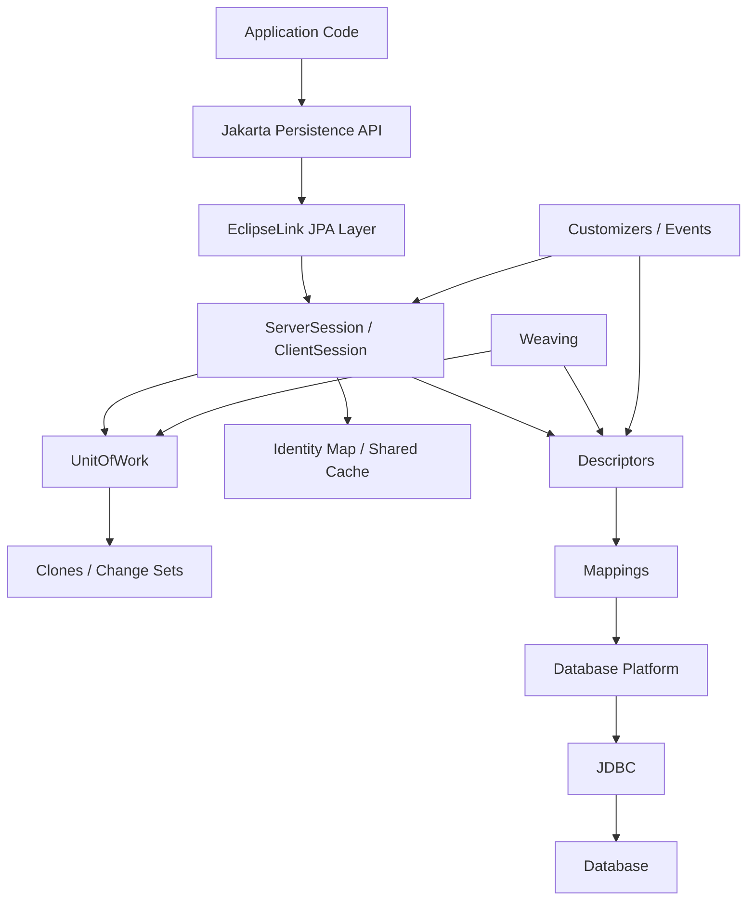
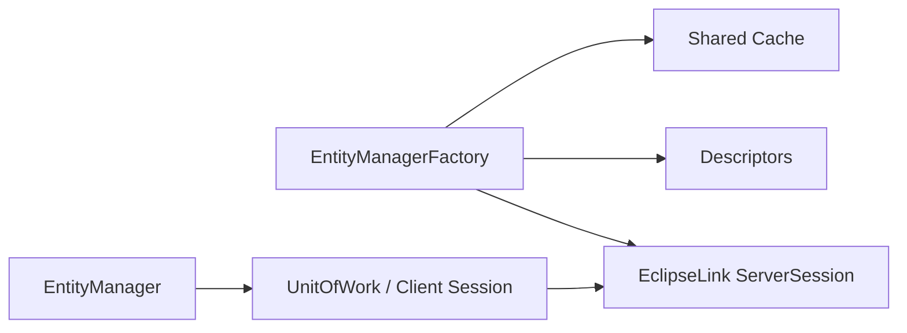
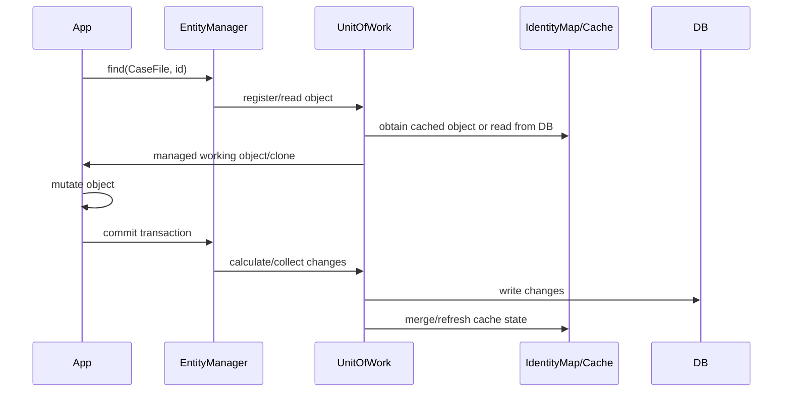
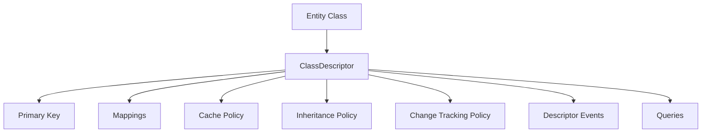
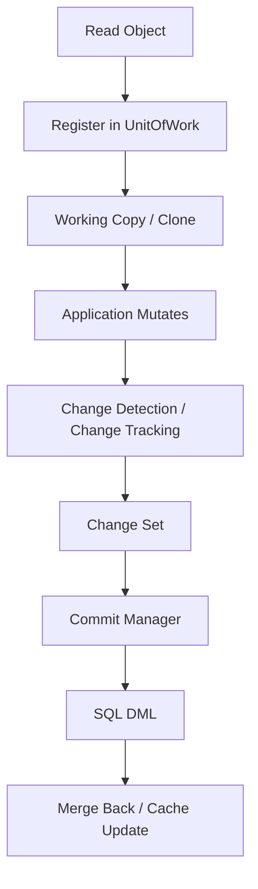
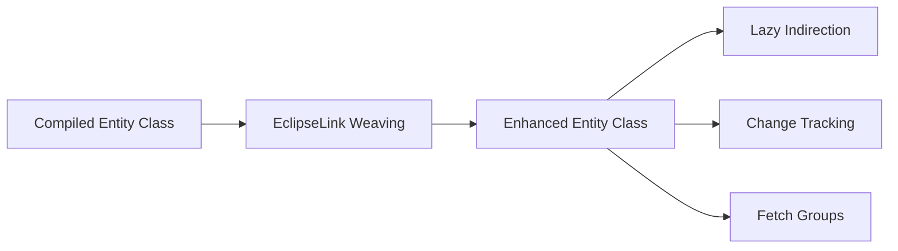
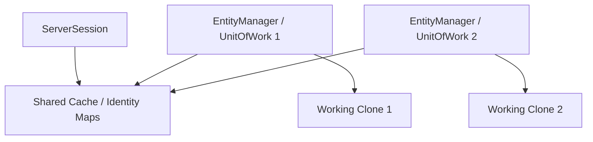

# Part 026 — EclipseLink Deep Dive: Sessions, Descriptors, Weaving, UnitOfWork

> Target part ini: kamu bisa memahami EclipseLink sebagai runtime persistence yang dibangun di sekitar **Session**, **Descriptor**, **Identity Map / Cache**, **UnitOfWork**, **Mapping**, **Platform**, **Weaving**, dan **Customizer** — bukan sekadar “provider JPA selain Hibernate”.

EclipseLink sering terlihat lebih jarang dibahas dibanding Hibernate di komunitas Spring-centric. Tetapi di ekosistem Jakarta EE, Payara, GlassFish, WebLogic/TopLink heritage, dan sistem enterprise lama, EclipseLink sangat relevan.

Jika Hibernate mental model sering terasa seperti:

> `Session` + persistence context + action queue + persister + type system

EclipseLink mental model lebih terasa seperti:

> `Session` + descriptors + identity map + UnitOfWork clone/change set + query/database platform + weaving/indirection

Perbedaan vocabulary ini penting. Jika kamu membaca stack trace EclipseLink dengan kosakata Hibernate, kamu akan salah mendiagnosis.

---

## 1. Big Picture: EclipseLink Runtime Pipeline



EclipseLink punya beberapa konsep utama:

| Konsep | Arti praktis |
|---|---|
| Session | Runtime access point ke datasource, metadata, cache, query, transaction coordination |
| ServerSession | Session utama untuk aplikasi server, mengelola shared cache dan resource |
| ClientSession | Session per client/request/transaction context yang memakai resource ServerSession |
| UnitOfWork | Transactional working copy mechanism untuk perubahan object |
| Descriptor | Metadata runtime untuk persistent class |
| Mapping | Descriptor-level mapping attribute ke column/relationship/converter |
| Identity Map | Cache object identity, sering terkait shared cache |
| Weaving | Bytecode instrumentation untuk lazy loading, change tracking, fetch groups, indirection |
| Platform | Abstraksi database/vendor behavior |
| Customizer | Extension point untuk mengubah descriptor/session metadata secara programmatic |

---

## 2. JPA Layer vs Native EclipseLink Runtime

Aplikasi modern biasanya mulai dari Jakarta Persistence:

```java
@PersistenceContext
private EntityManager entityManager;
```

Tetapi EclipseLink memiliki native runtime di bawahnya.

Secara konseptual:



Ketika memakai `EntityManager`, EclipseLink tetap menggunakan session, descriptor, query, cache, dan UnitOfWork internal.

### 2.1 Kapan Native EclipseLink API Diperlukan?

- descriptor customization,
- session customization,
- advanced cache coordination,
- profiling,
- query hints/advanced query object,
- custom converter/mapping,
- tenant/cache/session diagnostics,
- integration dengan legacy TopLink-style configuration.

Tetapi rule-nya sama seperti Hibernate:

> Native API boleh dipakai di infrastructure layer, bukan dibocorkan ke domain model.

---

## 3. Session Types: ServerSession, ClientSession, DatabaseSession, UnitOfWork

EclipseLink documentation historically menjelaskan beberapa tipe session. Untuk aplikasi JPA server modern, yang paling penting adalah:

- `ServerSession`
- `ClientSession`
- `UnitOfWork`

### 3.1 ServerSession

`ServerSession` adalah session utama untuk aplikasi server.

Ia mengelola:

- datasource login/platform,
- connection pools,
- descriptors,
- shared object cache,
- sequencing,
- query execution infrastructure,
- session event listeners,
- transaction integration.

Mental model:

```txt
ServerSession = runtime application-wide persistence engine
```

Dalam JPA, kamu biasanya tidak membuatnya manual. Provider membuatnya saat persistence unit bootstrap.

### 3.2 ClientSession

`ClientSession` memberi akses kepada client/request/transaction ke `ServerSession`.

Ia bisa:

- memakai shared resources,
- berpartisipasi dalam transaction,
- menyediakan access isolation tertentu,
- menjadi basis UnitOfWork.

Mental model:

```txt
ClientSession = contextual access channel to ServerSession
```

### 3.3 UnitOfWork

`UnitOfWork` adalah konsep sentral EclipseLink untuk perubahan transactional.

Ia bekerja dengan ide:

- object dari shared cache/database bisa dibuat clone untuk dimodifikasi,
- perubahan direkam sebagai change set,
- saat commit, change set diterjemahkan menjadi SQL,
- setelah commit, cache/object state diselaraskan.



Perhatikan istilah **clone** dan **change set**. Ini sering muncul dalam dokumentasi dan stack trace EclipseLink.

---

## 4. Descriptor: Runtime Metadata untuk Persistent Class

EclipseLink descriptor adalah metadata runtime untuk class persisten.

Descriptor tahu:

- Java class,
- primary table,
- primary key,
- inheritance policy,
- optimistic locking policy,
- cache policy,
- query keys,
- mappings,
- events,
- history policy,
- additional criteria,
- fetch group behavior,
- change tracking policy.

Dalam Hibernate, kamu sering berpikir “entity persister”. Dalam EclipseLink, berpikir “descriptor”.



### 4.1 Kenapa Descriptor Penting?

Karena banyak extension EclipseLink dilakukan dengan mengubah descriptor.

Misalnya:

- custom converter,
- additional criteria,
- cache policy,
- history policy,
- optimistic locking policy,
- query redirection,
- mapping tweak yang tidak tersedia di annotation portable.

---

## 5. Mappings: Attribute-Level Persistence Metadata

Descriptor berisi mappings.

Jenis mapping konseptual:

- direct-to-field mapping,
- one-to-one mapping,
- one-to-many mapping,
- many-to-many mapping,
- aggregate/embedded mapping,
- transformation mapping,
- object type converter,
- structure/object-relational mapping,
- variable one-to-one,
- serialized object mapping.

JPA annotation menyembunyikan banyak detail ini. Tetapi saat debugging EclipseLink, mapping-level vocabulary sangat membantu.

Contoh mental mapping:

```java
@Entity
class CaseFile {
    @Id
    private UUID id;

    @Column(name = "case_number")
    private String number;

    @ManyToOne(fetch = FetchType.LAZY)
    private Party primaryParty;
}
```

Runtime descriptor kira-kira punya:

```txt
CaseFile descriptor
  - id -> direct mapping / primary key
  - number -> direct-to-field mapping
  - primaryParty -> one-to-one/foreign reference mapping with indirection
```

---

## 6. DescriptorCustomizer: Per-Class Metadata Surgery

`DescriptorCustomizer` memungkinkan kamu mengubah descriptor untuk satu class.

Contoh pola:

```java
public final class CaseFileDescriptorCustomizer implements DescriptorCustomizer {
    @Override
    public void customize(ClassDescriptor descriptor) {
        descriptor.setAlias("case_file");
        // configure descriptor-level advanced behavior here
    }
}
```

```java
@Entity
@Customizer(CaseFileDescriptorCustomizer.class)
class CaseFile {
    @Id
    private UUID id;
}
```

Gunakan untuk:

- mapping behavior yang tidak bisa diekspresikan via annotation portable,
- descriptor events,
- custom converter low-level,
- cache or locking policy override,
- history/additional criteria advanced setup.

Jangan gunakan untuk:

- business rule,
- transaction-specific condition,
- user-context-dependent behavior kecuali lewat mekanisme resmi seperti session/query property,
- remote call.

Rule:

> Descriptor customizer adalah metadata customization, bukan runtime workflow.

---

## 7. SessionCustomizer: Persistence Unit-Level Customization

`SessionCustomizer` bekerja pada level session/persistence unit.

Contoh:

```java
public final class CaseSessionCustomizer implements SessionCustomizer {
    @Override
    public void customize(Session session) {
        session.getEventManager().addListener(new CaseSessionEventListener());

        for (ClassDescriptor descriptor : session.getDescriptors().values()) {
            // inspect or apply cross-cutting descriptor policies
        }
    }
}
```

Konfigurasi via property:

```xml
<property name="eclipselink.session.customizer"
          value="com.acme.persistence.CaseSessionCustomizer" />
```

Gunakan untuk:

- install profiler/listener,
- enforce descriptor convention,
- configure platform/session policy,
- register global customization,
- validate metadata at startup.

Bahaya:

- terlalu banyak logic tersembunyi,
- environment-specific behavior tidak terdokumentasi,
- customizer order tidak jelas,
- coupling ke internal metadata terlalu kuat.

---

## 8. UnitOfWork: Change Tracking dan Commit Model

EclipseLink `UnitOfWork` adalah mekanisme perubahan transactional.

Secara sederhana:

1. object dibaca dari database/shared cache,
2. object didaftarkan ke UnitOfWork,
3. working copy/clone dimodifikasi,
4. perubahan dideteksi atau direkam,
5. commit menghasilkan SQL,
6. cache diselaraskan.



### 8.1 Deferred vs Attribute Change Tracking

EclipseLink mendukung beberapa mode change tracking, termasuk:

- deferred/object comparison,
- attribute-level tracking,
- object-level notification,
- auto selection.

Konsekuensi:

| Mode | Kelebihan | Risiko |
|---|---|---|
| Deferred comparison | Tidak butuh setter notification | Commit/flush lebih mahal untuk object besar |
| Attribute tracking | Lebih efisien untuk update detection | Butuh weaving/notification support |
| Object change tracking | Bisa explicit notification | Lebih intrusive |
| Auto | Provider memilih | Perlu observability agar tahu behavior aktual |

### 8.2 Dirty Checking Hazard

Seperti Hibernate, mutable value object bisa menjadi masalah.

Contoh buruk:

```java
caseFile.getTags().add("fraud");
```

Jika collection/mutable value tidak dipantau dengan benar, perubahan bisa:

- tidak terdeteksi,
- selalu dianggap berubah,
- menghasilkan update terlalu banyak,
- membuat cache stale.

Preferensi engineering:

- immutable value object,
- controlled mutation method,
- explicit replacement untuk embeddable/value,
- test dirty detection.

---

## 9. Weaving: Fitur Kunci EclipseLink

Weaving adalah bytecode instrumentation. EclipseLink menggunakannya untuk banyak fitur runtime.

Fungsi weaving:

- lazy loading,
- indirection,
- change tracking,
- fetch groups,
- internal optimization,
- relationship management tertentu.



### 9.1 Dynamic vs Static Weaving

| Mode | Kapan | Kelebihan | Risiko |
|---|---|---|---|
| Dynamic weaving | runtime/class loading | Mudah di app server/JPA environment yang support | Butuh agent/classloader support |
| Static weaving | build time | Deterministic, cocok restricted runtime | Build lebih kompleks |
| No weaving | disabled/not available | Simpler startup | Lazy/change tracking/fetch group behavior bisa berubah |

Konfigurasi umum:

```xml
<property name="eclipselink.weaving" value="true" />
<property name="eclipselink.weaving.lazy" value="true" />
<property name="eclipselink.weaving.changetracking" value="true" />
<property name="eclipselink.weaving.fetchgroups" value="true" />
```

Dalam beberapa runtime modern, dynamic weaving bisa bermasalah karena:

- JPMS/module path,
- native image,
- restricted classloader,
- test runner isolation,
- container instrumentation policy.

Jika lazy loading atau change tracking EclipseLink “aneh”, cek weaving lebih dulu.

### 9.2 Weaving Diagnostic Checklist

1. Apakah property weaving aktif?
2. Apakah Java agent dibutuhkan?
3. Apakah runtime app server mendukung dynamic weaving?
4. Apakah test memakai environment berbeda dari production?
5. Apakah entity final/method final menghambat enhancement?
6. Apakah logs menunjukkan weaving disabled?
7. Apakah lazy relationship benar-benar memakai indirection?

---

## 10. Indirection: Lazy Loading ala EclipseLink

EclipseLink sering menggunakan istilah **indirection** untuk representasi lazy reference/collection.

Lazy association tidak selalu berupa proxy class seperti yang biasa dibahas di Hibernate. Ia bisa memakai indirection object/value holder.

Mental model:

```txt
CaseFile.primaryParty -> indirection holder -> loads Party when accessed
CaseFile.tasks        -> indirect collection -> loads tasks when accessed
```

Konsekuensi:

- lazy access masih butuh active context/session semantics,
- serialization bisa memicu lazy loading,
- logging/toString bisa memicu query,
- fetch planning tetap harus eksplisit,
- weaving/indirection configuration mempengaruhi behavior.

### 10.1 Lazy Boundary Rule

Jangan biarkan entity EclipseLink keluar dari transaction boundary lalu berharap lazy relationship aman.

Lebih baik:

```java
public CaseDetailDto getCaseDetail(UUID id) {
    return entityManager.createQuery("""
        select new com.acme.CaseDetailDto(
            c.id, c.number, c.status, p.name
        )
        from CaseFile c
        join c.primaryParty p
        where c.id = :id
        """, CaseDetailDto.class)
      .setParameter("id", id)
      .getSingleResult();
}
```

Entity bukan API response contract.

---

## 11. Identity Map dan Shared Cache

EclipseLink memiliki cache identity map yang sangat sentral.

Konsep:

- object identity dipertahankan melalui identity map,
- shared cache bisa dipakai lintas `EntityManager`,
- UnitOfWork bekerja dengan clones/change set,
- cache policy bisa diatur per descriptor/entity.



### 11.1 Cache Correctness Risk

Shared cache berguna tetapi berbahaya jika:

- database dimodifikasi oleh aplikasi lain,
- native SQL bypass provider cache update,
- bulk update tidak diikuti invalidation,
- tenant isolation salah,
- authorization-sensitive data dicache global,
- cache coordination cluster tidak aktif.

Rule:

> Cache policy adalah correctness decision, bukan hanya performance tuning.

---

## 12. Database Platform: Vendor Behavior Abstraction

EclipseLink memakai platform untuk memahami database-specific behavior.

Platform mempengaruhi:

- SQL dialect,
- pagination syntax,
- sequence behavior,
- locking syntax,
- batch writing capability,
- native function support,
- JDBC type handling,
- DDL generation.

Konfigurasi:

```xml
<property name="eclipselink.target-database" value="PostgreSQL" />
```

Dalam environment modern, provider sering bisa auto-detect. Tetapi untuk production, pastikan:

- database platform benar,
- JDBC driver benar,
- test database sama semantics-nya dengan production,
- H2 tidak dipakai sebagai oracle kebenaran untuk PostgreSQL/Oracle/SQL Server.

---

## 13. Sequencing dan ID Generation

EclipseLink punya sequencing infrastructure.

Strategy bisa terkait:

- database sequence,
- table sequencing,
- identity,
- native sequencing,
- UUID/application assigned.

Hal yang harus diuji:

- allocation size,
- insert batching,
- sequence contention,
- rollback gap expectation,
- cross-node uniqueness,
- migration dari legacy sequence,
- schema-per-tenant sequence policy.

ID bukan kosmetik. ID strategy mempengaruhi throughput, index locality, batch write, dan replication.

---

## 14. Query Runtime: JPA Query, DatabaseQuery, Expression

EclipseLink JPA query di bawahnya bisa diterjemahkan ke query object internal seperti object-level read/write query.

Yang penting untuk engineer:

- query hint EclipseLink dapat mengubah fetch/cache/refresh behavior,
- query bisa memakai fetch group,
- query bisa bypass/refresh cache,
- query bisa memakai batch reading/join fetch provider extension,
- native SQL harus dipahami efeknya terhadap cache dan UnitOfWork.

Contoh query hint pattern:

```java
List<CaseFile> result = entityManager
    .createQuery("select c from CaseFile c where c.status = :status", CaseFile.class)
    .setParameter("status", CaseStatus.OPEN)
    .setHint("eclipselink.read-only", "true")
    .setHint("eclipselink.refresh", "true")
    .getResultList();
```

Jangan menyebar string hint mentah di seluruh codebase. Bungkus:

```java
public final class EclipseLinkHints {
    public static final String READ_ONLY = "eclipselink.read-only";
    public static final String REFRESH = "eclipselink.refresh";

    private EclipseLinkHints() {}
}
```

---

## 15. Descriptor Events dan Session Events

EclipseLink menyediakan event mechanism pada descriptor/session.

Use cases bagus:

- audit technical metadata,
- invariant validation saat startup,
- logging/profiling,
- cache event diagnostics,
- cross-cutting descriptor policy,
- tenant guard.

Use cases buruk:

- workflow orchestration,
- remote API call,
- sending notification,
- mutation entity lain secara diam-diam,
- query besar dari callback.

### 15.1 Descriptor Event Adapter Pattern

```java
public final class CaseDescriptorEventListener extends DescriptorEventAdapter {
    @Override
    public void preUpdate(DescriptorEvent event) {
        Object object = event.getObject();
        if (object instanceof CaseFile caseFile) {
            // technical audit validation only
        }
    }
}
```

Install via customizer:

```java
public final class CaseFileDescriptorCustomizer implements DescriptorCustomizer {
    @Override
    public void customize(ClassDescriptor descriptor) {
        descriptor.getEventManager().addListener(new CaseDescriptorEventListener());
    }
}
```

### 15.2 Hidden Callback Risk

Callback yang terlihat kecil bisa membuat sistem sulit diprediksi.

Jika callback:

- melakukan query,
- mengakses lazy relationship,
- mengubah aggregate lain,
- membuat entity baru,
- mengirim message,
- membaca thread-local tenant/user tanpa fallback,

maka ia harus masuk architecture review.

---

## 16. Profiling dan Diagnostics

EclipseLink memiliki logging/profiling facilities.

Properties yang sering relevan:

```xml
<property name="eclipselink.logging.level" value="FINE" />
<property name="eclipselink.logging.parameters" value="true" />
<property name="eclipselink.profiler" value="PerformanceProfiler" />
```

Gunakan di test/staging/performance lab, bukan sembarangan di production high-throughput tanpa sampling.

Yang perlu diamati:

- jumlah query,
- query parameter,
- cache hit/miss behavior,
- batch writing,
- lazy loads,
- refresh/cache bypass,
- commit/flush timing,
- UnitOfWork change set size.

Diagnostic mindset:

> “Apakah bottleneck ada di query count, rows returned, object hydration, change tracking, cache coordination, atau database plan?”

---

## 17. Batch Writing di EclipseLink

EclipseLink punya property batch writing:

```xml
<property name="eclipselink.jdbc.batch-writing" value="JDBC" />
<property name="eclipselink.jdbc.batch-writing.size" value="100" />
```

Batch writing membantu high-volume DML, tetapi tetap harus diuji dengan:

- ID strategy,
- FK constraint ordering,
- optimistic locking,
- generated columns,
- trigger behavior,
- driver support,
- transaction size,
- deadlock risk.

Batch bukan sekadar menaikkan angka. Batch adalah desain write path.

---

## 18. EclipseLink vs Hibernate: Deep Runtime Vocabulary

| Concern | Hibernate vocabulary | EclipseLink vocabulary |
|---|---|---|
| Runtime root | `SessionFactory` | `ServerSession` / persistence unit session |
| Unit of work | `Session` + persistence context | `UnitOfWork` |
| Metadata class mapping | Persister/metamodel | Descriptor |
| Lazy mechanism | Proxy/bytecode enhancement | Weaving/indirection |
| Change detection | Snapshot/enhanced dirty tracking | Deferred/attribute/object change tracking |
| Shared cache | Second-level cache | Shared cache / identity map |
| Custom metadata | annotations/type/event/integrator | descriptor/session customizer |
| Event hooks | event listener registry | descriptor/session events |
| SQL/platform | dialect | database platform |

Ini bukan cuma beda nama. Beda vocabulary mencerminkan beda desain internal.

---

## 19. Safe EclipseLink Extension Architecture

Struktur module yang sehat:

```txt
persistence-eclipselink/
  src/main/java/
    com.acme.persistence.eclipselink/
      EclipseLinkHints.java
      CaseSessionCustomizer.java
      CaseFileDescriptorCustomizer.java
      TenantDescriptorPolicy.java
      EclipseLinkDiagnostics.java
  src/test/java/
    ... provider-specific behavior tests
```

Aplikasi domain tidak tahu:

- `DescriptorCustomizer`,
- `SessionCustomizer`,
- EclipseLink hints,
- native session APIs,
- cache coordination internals.

Application service hanya tahu port:

```java
interface CaseRepository {
    Optional<CaseFile> findForCommand(CaseId id);
    void save(CaseFile file);
}
```

EclipseLink-specific detail ada di adapter.

---

## 20. Failure Mode Catalog: EclipseLink Internals Edition

### 20.1 Lazy tidak bekerja seperti expected

Kemungkinan:

- weaving disabled,
- dynamic weaving tidak aktif di test/runtime,
- relationship tidak dikonfigurasi lazy secara efektif,
- entity keluar transaction boundary,
- serialization memicu access.

Debug:

- cek log weaving,
- cek property `eclipselink.weaving.*`,
- coba static weaving,
- cek query count,
- gunakan DTO boundary.

### 20.2 Perubahan tidak tersimpan

Kemungkinan:

- object detached/non-managed,
- mutation terjadi di luar UnitOfWork,
- change tracking tidak mendeteksi mutable field,
- transaction tidak commit,
- read-only query/entity,
- clone/original confusion.

Debug:

- cek entity lifecycle,
- cek transaction boundary,
- cek change tracking mode,
- cek mutable value object,
- test minimal mutation.

### 20.3 Cache stale

Kemungkinan:

- shared cache aktif untuk data volatile,
- external writer mengubah database,
- native/bulk update tanpa invalidation,
- cluster cache coordination tidak aktif,
- tenant/user-specific data dicache global.

Debug:

- disable shared cache per entity sebagai test,
- use refresh hint,
- inspect cache policy,
- add invalidation after bulk write,
- test multi-EntityManager scenario.

### 20.4 Descriptor customizer merusak mapping

Kemungkinan:

- customizer order problem,
- mapping cast salah,
- descriptor tidak sesuai inheritance subclass,
- provider version berubah,
- metadata override tidak terdokumentasi.

Debug:

- log descriptor state saat startup,
- isolate customizer test,
- fail fast jika expected mapping tidak ditemukan,
- hindari hard-coded internal class jika portable alternative ada.

### 20.5 Batch writing tidak memberi improvement

Kemungkinan:

- driver tidak mendukung optimal batching,
- identity/generator behavior menghambat,
- flush terlalu sering,
- transaction terlalu kecil,
- SQL shape tidak seragam,
- constraints/deadlock membuat retry mahal.

Debug:

- lihat SQL/batch logs,
- ukur prepared statement count,
- test batch size berbeda,
- cek database wait events/locks.

---

## 21. Practice: Build EclipseLink Diagnostic Harness

Buat persistence unit khusus test dengan EclipseLink.

Entity:

- `CaseFile`
- `CaseParty`
- `CaseTask`
- `EvidenceItem`
- `CaseAuditEntry`

Skenario:

1. lazy to-one access,
2. lazy one-to-many access,
3. update scalar field,
4. update mutable embeddable,
5. batch insert 1.000 row,
6. query read-only + refresh hint,
7. external database update + shared cache behavior,
8. descriptor customizer install event listener,
9. session customizer validates descriptors,
10. compare dynamic vs static weaving behavior.

Tabel observasi:

| Scenario | Expected Behavior | Logs to Check | Failure Signal | Fix |
|---|---|---|---|---|
| Lazy to-one | no join until access | SQL + weaving log | eager select | weaving/fetch config |
| Mutable value update | update emitted | SQL update | no update | change tracking/value design |
| External DB update | stale if cache not refreshed | cache/log | old value | refresh/evict/cache policy |
| Batch insert | batched statements | JDBC batch log | one-by-one insert | batch-writing/id strategy |

---

## 22. Architecture Guidance

Pakai EclipseLink native extension ketika:

- aplikasi berjalan di Jakarta EE environment yang memang distandardisasi di EclipseLink,
- descriptor/session customization memberi solusi lebih bersih daripada hack di domain,
- weaving/change tracking/fetch group memberi performance benefit yang terbukti,
- shared cache/coordination dipahami sebagai correctness mechanism,
- provider-specific behavior sudah ditest.

Hindari native extension ketika:

- hanya karena annotation portable terasa kurang familiar,
- logic domain disembunyikan di descriptor/session event,
- cache policy belum dipahami,
- runtime weaving tidak reliable di semua environment,
- provider migration masih realistic requirement.

---

## 23. EclipseLink Engineering Checklist

Sebelum production:

1. Apakah weaving behavior sama di local/test/staging/prod?
2. Apakah lazy loading sudah diuji dengan query count?
3. Apakah shared cache aktif hanya untuk entity yang aman?
4. Apakah external writer/native SQL/bulk job punya invalidation strategy?
5. Apakah descriptor/session customizer terdokumentasi?
6. Apakah customizer punya startup validation?
7. Apakah batch writing diuji dengan database production-like?
8. Apakah query hints dibungkus dalam utility/adapter?
9. Apakah tenant/security boundary tidak bergantung pada cache global?
10. Apakah provider-specific tests berjalan di CI?

---

## 24. Summary

EclipseLink harus dipahami dengan vocabulary-nya sendiri:

- `Session` adalah runtime access point.
- `ServerSession` mengelola resource, descriptors, shared cache, dan platform.
- `ClientSession` memberi contextual access.
- `UnitOfWork` mengelola working copy, clone, change set, dan commit.
- Descriptor adalah metadata runtime untuk persistent class.
- Mapping adalah descriptor-level relation antara attribute dan database/storage.
- Weaving adalah kunci lazy loading, change tracking, fetch groups, dan indirection.
- Shared cache/identity map adalah correctness-sensitive.
- Descriptor/session customizer adalah metadata extension point, bukan tempat business workflow.
- Query hints, profiling, batch writing, cache coordination, dan platform config harus dibungkus dan diuji.

Top engineer tidak berkata:

> “EclipseLink mirip Hibernate.”

Ia berkata:

> “Di Hibernate saya melihat `Session` dan `ActionQueue`; di EclipseLink saya melihat `ServerSession`, descriptor, UnitOfWork clone/change set, indirection, dan identity map. Diagnosis harus mengikuti model provider yang sedang berjalan.”

Itulah perbedaan antara sekadar bisa memakai JPA dan mampu mengendalikan provider ORM di production.

---

## References

- EclipseLink Project: https://eclipse.dev/eclipselink/
- EclipseLink Documentation: https://eclipse.dev/eclipselink/documentation/
- EclipseLink JPA Extensions Reference: https://eclipse.dev/eclipselink/documentation/4.0/jpa/extensions/jpa-extensions.html
- EclipseLink Solutions Guide: https://eclipse.dev/eclipselink/documentation/4.0/solutions/solutions.html
- EclipseLink Session Concepts: https://wiki.eclipse.org/Introduction_to_EclipseLink_Sessions_(ELUG)
- Jakarta Persistence 3.2 Specification: https://jakarta.ee/specifications/persistence/3.2/
