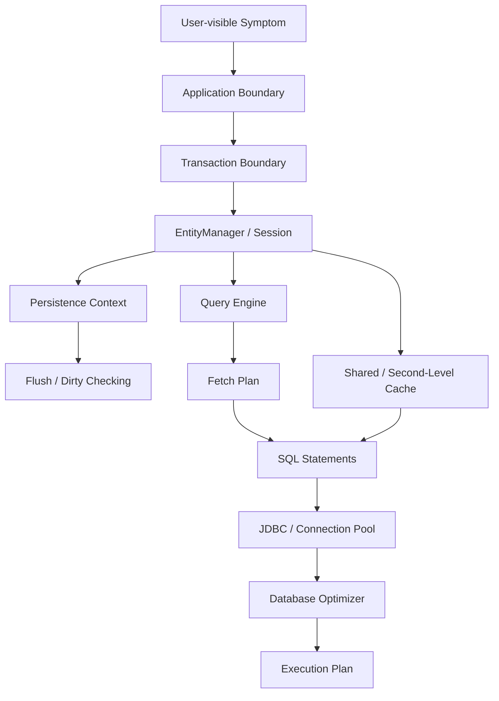
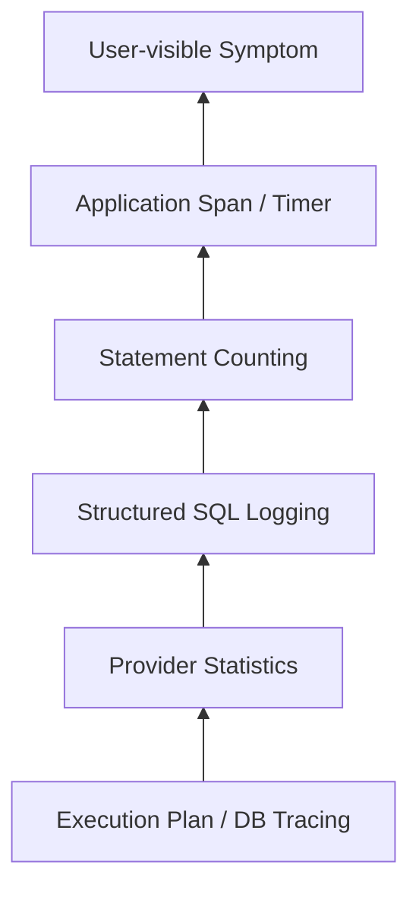
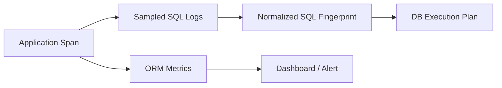

# Part 027 — Provider Diagnostics: Logs, Statistics, Metrics, and Execution Plans

> Target part ini: kamu bisa melakukan diagnosis ORM secara sistematis: dari gejala aplikasi, ke sinyal ORM, ke SQL aktual, ke execution plan database, lalu kembali ke mapping/fetch/transaction/cache yang perlu diperbaiki.

Di level basic, developer biasanya menyalakan SQL log, melihat query panjang, lalu menebak-nebak.

Di level senior, diagnosis ORM harus punya bentuk seperti ini:

```txt
symptom -> signal -> hypothesis -> isolation -> evidence -> fix -> regression guard
```

Contoh:

```txt
endpoint lambat
-> jumlah SELECT naik dari 4 ke 241
-> kemungkinan lazy loading dalam loop
-> isolate endpoint + reset statistics + capture SQL
-> entity load count tinggi, collection fetch count tinggi
-> tambahkan explicit fetch plan / DTO projection
-> tambahkan test query-count supaya N+1 tidak balik lagi
```

Materi ini bukan tentang “cara print SQL”. Itu terlalu dangkal. Tujuannya adalah membangun **diagnostic operating system** untuk Hibernate dan EclipseLink.

---

## 1. Diagnostic Mental Model

ORM adalah layer translasi. Karena itu, diagnosis tidak boleh berhenti pada satu layer.



Kalau endpoint lambat, penyebabnya bisa berada di salah satu titik berikut:

| Layer | Contoh penyebab |
|---|---|
| Application boundary | endpoint melakukan terlalu banyak use case dalam satu request |
| Transaction boundary | transaction terlalu panjang, lock terlalu lama, flush terjadi terlalu sering |
| Persistence context | terlalu banyak entity managed, dirty checking mahal, stale state |
| Query engine | JPQL menghasilkan join tidak terduga, projection buruk, query plan cache miss |
| Fetch plan | N+1, cartesian explosion, lazy load di serializer |
| JDBC | statement terlalu banyak, batching tidak aktif, fetch size salah |
| Database | index salah, join order buruk, statistics DB stale, lock wait |
| Cache | hit ratio rendah, stale data, invalidation salah, query cache misuse |

Prinsipnya:

> Jangan langsung mengoptimasi mapping. Pertama buktikan di layer mana biaya muncul.

---

## 2. Diagnostic Questions yang Harus Selalu Dijawab

Untuk setiap masalah ORM production, jawab pertanyaan ini secara berurutan.

### 2.1 Apa unit kerja yang sedang didiagnosis?

Jangan ukur seluruh aplikasi. Pilih satu unit:

- satu repository method,
- satu application service,
- satu endpoint,
- satu message handler,
- satu scheduled job chunk,
- satu transaction.

Unit yang terlalu besar membuat sinyal bercampur.

### 2.2 Berapa statement yang dieksekusi?

Minimal pisahkan:

- SELECT,
- INSERT,
- UPDATE,
- DELETE,
- DDL jika terjadi tidak sengaja,
- sequence calls,
- lock/select-for-update,
- cache-triggered DB fallback.

### 2.3 Berapa entity dan collection yang dihydrate?

Query count rendah tidak selalu cepat. Satu query join fetch bisa mengembalikan 500.000 row duplikat dan membuat hydration mahal.

Perhatikan:

- entity load count,
- entity fetch count,
- collection load count,
- collection fetch count,
- rows returned,
- object count setelah deduplication.

### 2.4 Kapan flush terjadi?

Unexpected flush sering menjadi penyebab:

- query tiba-tiba lambat,
- constraint violation muncul sebelum commit,
- update terjadi meskipun service terlihat read-only,
- batch insert pecah menjadi statement kecil.

### 2.5 Apakah cache membantu atau menyembunyikan bug?

Cache metrics perlu dibaca bersama query behavior.

| Sinyal | Kemungkinan arti |
|---|---|
| hit tinggi, DB rendah | cache efektif untuk read-mostly data |
| miss tinggi, put tinggi | cache churn, region mungkin salah kandidat cache |
| hit tinggi, data salah | invalidation / isolation bug |
| query cache hit rendah | query cache tidak cocok untuk workload |
| cache bypass di beberapa path | consistency path sengaja atau konfigurasi tidak seragam |

### 2.6 Apakah database execution plan masuk akal?

ORM SQL yang “kelihatan benar” belum tentu plan-nya benar.

Cek:

- index usage,
- scan vs seek,
- join algorithm,
- estimated rows vs actual rows,
- sort/hash aggregate memory,
- lock wait,
- parameter sniffing,
- missing composite index,
- stale database statistics.

---

## 3. Instrumentation Pyramid

Jangan mulai dari tool paling berat. Mulai dari sinyal murah, naik ketika butuh detail.



| Level | Biaya | Kapan dipakai |
|---|---:|---|
| Timer endpoint/service | rendah | selalu |
| Query count | rendah-sedang | test dan profiling dev |
| SQL logging | sedang | dev/debug, sampling production terbatas |
| Provider statistics | sedang | profiling, CI guard, staging, controlled prod |
| DB execution plan | sedang-tinggi | query lambat, index decision |
| Full DB tracing | tinggi | incident serius / deep bottleneck |

Rule:

> Production observability harus cukup untuk menemukan kelas masalah, bukan selalu mencetak semua SQL mentah.

---

## 4. SQL Logging: Useful, but Not Sufficient

SQL logging menjawab:

- statement apa yang dikirim,
- urutan statement,
- apakah ada N+1,
- apakah flush terjadi sebelum query,
- apakah join/fetch sesuai ekspektasi.

SQL logging tidak otomatis menjawab:

- berapa row yang dibaca database,
- apakah index dipakai,
- apakah statement menunggu lock,
- berapa object yang dihydrate,
- apakah cache hit/miss,
- berapa biaya dirty checking,
- apakah batching benar-benar terjadi.

Karena itu SQL log adalah **entry point**, bukan akhir diagnosis.

---

## 5. Hibernate Diagnostics

Hibernate menyediakan beberapa level diagnostic:

- SQL logging,
- bind parameter logging,
- `StatementInspector`,
- statistics via `SessionFactory.getStatistics()`,
- cache statistics,
- query statistics,
- query plan cache statistics,
- session event logs,
- custom event listener/interceptor jika perlu.

### 5.1 Hibernate SQL Visibility

Konfigurasi development yang umum:

```properties
hibernate.show_sql=false
hibernate.format_sql=true
hibernate.highlight_sql=true
hibernate.use_sql_comments=true
hibernate.generate_statistics=true
```

Untuk logging framework, lebih baik log category daripada `show_sql` console output.

Contoh Logback/Spring-style intent:

```properties
logging.level.org.hibernate.SQL=DEBUG
logging.level.org.hibernate.orm.jdbc.bind=TRACE
logging.level.org.hibernate.stat=DEBUG
```

`show_sql` berguna untuk eksperimen kecil, tetapi buruk sebagai observability serius karena:

- output ke console sulit dikorelasikan,
- tidak punya request correlation id,
- tidak mudah difilter,
- tidak mudah disampling,
- bisa bocor data sensitif jika bind values ditampilkan.

### 5.2 SQL Comments

`hibernate.use_sql_comments=true` membantu menghubungkan SQL dengan HQL/JPQL atau operation tertentu.

Contoh SQL yang lebih mudah ditelusuri:

```sql
/* select c from CaseFile c join fetch c.assignee where c.status = :status */
select ...
from case_file c
join officer o on ...
where c.status = ?
```

SQL comments berguna di development/staging. Di production, aktifkan dengan hati-hati karena:

- bisa memperbesar SQL text,
- bisa memengaruhi statement cache di sebagian setup,
- bisa membocorkan nama query/use case,
- bisa memperbanyak cardinality di telemetry jika tidak dinormalisasi.

### 5.3 StatementInspector

`StatementInspector` adalah hook Hibernate untuk menginspeksi SQL sebelum dikirim ke JDBC.

Gunakan untuk:

- menghitung statement per test,
- menambahkan komentar korelasi yang aman,
- mendeteksi SQL pattern berbahaya,
- menyimpan normalized SQL untuk assertion,
- audit internal di dev/test.

Jangan gunakan untuk:

- business rule,
- tenant security utama,
- mengganti query secara rapuh,
- parsing SQL kompleks dengan regex berbahaya,
- masking data tanpa memahami bind parameter.

Contoh sederhana untuk test query count:

```java
public final class SqlCaptureInspector implements StatementInspector {
    private static final ThreadLocal<List<String>> SQL =
        ThreadLocal.withInitial(ArrayList::new);

    @Override
    public String inspect(String sql) {
        SQL.get().add(sql);
        return sql;
    }

    public static List<String> statements() {
        return List.copyOf(SQL.get());
    }

    public static void clear() {
        SQL.get().clear();
    }
}
```

Konfigurasi:

```properties
hibernate.session_factory.statement_inspector=com.acme.persistence.SqlCaptureInspector
```

Assertion:

```java
@Test
void listOpenCases_shouldNotHaveNPlusOne() {
    SqlCaptureInspector.clear();

    caseQueryService.listOpenCases();

    List<String> sql = SqlCaptureInspector.statements();
    long selectCount = sql.stream()
        .filter(s -> s.stripLeading().toLowerCase(Locale.ROOT).startsWith("select"))
        .count();

    assertThat(selectCount).isLessThanOrEqualTo(3);
}
```

Batasan:

- satu logical query bisa menghasilkan lebih dari satu SQL,
- batch statements mungkin perlu dihitung dari JDBC layer,
- sequence calls juga statement,
- SQL comments dapat mengubah prefix statement,
- native query ikut tertangkap.

### 5.4 Hibernate Statistics

Statistics adalah sinyal yang jauh lebih kuat daripada sekadar SQL log.

Aktifkan:

```properties
hibernate.generate_statistics=true
hibernate.statistics.query_max_size=5000
```

Akses:

```java
SessionFactory sessionFactory = entityManagerFactory.unwrap(SessionFactory.class);
Statistics stats = sessionFactory.getStatistics();

stats.clear();

// run unit of work

long queryCount = stats.getQueryExecutionCount();
long preparedStatements = stats.getPrepareStatementCount();
long flushCount = stats.getFlushCount();
long entityLoads = stats.getEntityLoadCount();
long collectionFetches = stats.getCollectionFetchCount();
long optimisticFailures = stats.getOptimisticFailureCount();
```

Metrics penting:

| Metric | Pertanyaan yang dijawab |
|---|---|
| `getPrepareStatementCount()` | Berapa statement JDBC disiapkan? |
| `getQueryExecutionCount()` | Berapa query entity/native yang dieksekusi? |
| `getFlushCount()` | Berapa kali flush terjadi? |
| `getEntityLoadCount()` | Berapa entity dihydrate dari DB? |
| `getEntityFetchCount()` | Berapa entity fetched lazily? |
| `getCollectionLoadCount()` | Berapa collection initialized? |
| `getCollectionFetchCount()` | Berapa collection fetched lazily? |
| `getEntityInsertCount()` | Berapa insert entity? |
| `getEntityUpdateCount()` | Berapa update entity? |
| `getEntityDeleteCount()` | Berapa delete entity? |
| `getSecondLevelCacheHitCount()` | Berapa cache hit L2? |
| `getSecondLevelCacheMissCount()` | Berapa cache miss L2? |
| `getQueryCacheHitCount()` | Apakah query cache benar-benar dipakai? |
| `getQueryPlanCacheHitCount()` | Apakah query plan cache efektif? |
| `getOptimisticFailureCount()` | Apakah ada optimistic conflict? |

### 5.5 Per-Request Hibernate Diagnostic Snapshot

Untuk debugging staging, buat snapshot sebelum/sesudah unit kerja.

```java
public record HibernateStatsSnapshot(
    long preparedStatements,
    long queryExecutions,
    long flushes,
    long entityLoads,
    long entityFetches,
    long collectionLoads,
    long collectionFetches,
    long secondLevelCacheHits,
    long secondLevelCacheMisses,
    long queryCacheHits,
    long queryCacheMisses
) {
    static HibernateStatsSnapshot from(Statistics s) {
        return new HibernateStatsSnapshot(
            s.getPrepareStatementCount(),
            s.getQueryExecutionCount(),
            s.getFlushCount(),
            s.getEntityLoadCount(),
            s.getEntityFetchCount(),
            s.getCollectionLoadCount(),
            s.getCollectionFetchCount(),
            s.getSecondLevelCacheHitCount(),
            s.getSecondLevelCacheMissCount(),
            s.getQueryCacheHitCount(),
            s.getQueryCacheMissCount()
        );
    }

    HibernateStatsSnapshot delta(HibernateStatsSnapshot before) {
        return new HibernateStatsSnapshot(
            preparedStatements - before.preparedStatements,
            queryExecutions - before.queryExecutions,
            flushes - before.flushes,
            entityLoads - before.entityLoads,
            entityFetches - before.entityFetches,
            collectionLoads - before.collectionLoads,
            collectionFetches - before.collectionFetches,
            secondLevelCacheHits - before.secondLevelCacheHits,
            secondLevelCacheMisses - before.secondLevelCacheMisses,
            queryCacheHits - before.queryCacheHits,
            queryCacheMisses - before.queryCacheMisses
        );
    }
}
```

Gunakan untuk log terstruktur:

```java
HibernateStatsSnapshot before = HibernateStatsSnapshot.from(stats);
try {
    return action.get();
} finally {
    HibernateStatsSnapshot after = HibernateStatsSnapshot.from(stats);
    HibernateStatsSnapshot delta = after.delta(before);
    log.info("orm.stats unit={} delta={}", unitName, delta);
}
```

Catatan production:

- jangan selalu aktifkan detail tinggi tanpa mengukur overhead,
- sampling lebih aman daripada full capture,
- jangan log bind value sensitif,
- reset/global statistics harus hati-hati di aplikasi multi-thread.

### 5.6 Interpreting Hibernate Statistics

#### Case A — Query count rendah, entity load tinggi

Kemungkinan:

- join fetch terlalu besar,
- query membaca aggregate terlalu lebar,
- projection seharusnya DTO,
- pagination dilakukan setelah join explosion,
- filter kurang selektif.

Fix candidates:

- DTO projection,
- split query dengan controlled batch fetch,
- limit association fetched,
- tambahkan index/filter,
- desain read model.

#### Case B — Query count tinggi, entity load rendah per query

Kemungkinan:

- N+1,
- lazy load dalam loop,
- serializer menyentuh association,
- template/view mengakses property entity,
- equals/toString mengakses association.

Fix candidates:

- explicit fetch plan,
- batch fetch,
- entity graph,
- DTO boundary,
- hindari entity di serialization boundary.

#### Case C — Flush count tinggi

Kemungkinan:

- query interleaved dengan mutation,
- `AUTO` flush sebelum query,
- transaction terlalu besar,
- repository melakukan query setelah setiap mutation,
- event listener memicu query.

Fix candidates:

- reorder operation: read first, mutate later,
- gunakan flush mode sesuai konteks,
- chunking,
- pisahkan read transaction dan write transaction,
- hindari query dalam entity callback.

#### Case D — Update count tinggi tanpa perubahan bisnis

Kemungkinan:

- mutable embeddable/value type false dirty,
- setter dipanggil dengan value sama tapi type mutable,
- collection diganti total,
- bidirectional association tidak stabil,
- bytecode enhancement/change tracking mismatch,
- lifecycle callback mengubah timestamp setiap load/flush.

Fix candidates:

- immutable value object,
- setter idempotent,
- collection mutation method bukan replacement,
- review `equals/hashCode`,
- cek callback.

#### Case E — L2 cache hit tinggi tapi data salah

Kemungkinan:

- native SQL/bulk update tidak evict cache,
- cache region dipakai untuk mutable data,
- invalidation cluster lambat,
- tenant/authorization boundary salah,
- external writer mengubah database.

Fix candidates:

- evict affected regions,
- cache hanya reference/read-mostly data,
- gunakan cache mode BYPASS untuk sensitive path,
- tenant-aware cache key,
- disable query cache untuk mutable query.

---

## 6. EclipseLink Diagnostics

EclipseLink diagnostic vocabulary berbeda dari Hibernate. Fokusnya:

- session logging,
- SQL/logging categories,
- profiler,
- performance monitor,
- identity map/cache diagnostics,
- UnitOfWork/change set behavior,
- descriptor/session events,
- query hints.

### 6.1 EclipseLink Logging Properties

Contoh konfigurasi development:

```xml
<property name="eclipselink.logging.level" value="FINE"/>
<property name="eclipselink.logging.level.sql" value="FINE"/>
<property name="eclipselink.logging.parameters" value="true"/>
<property name="eclipselink.logging.thread" value="true"/>
<property name="eclipselink.logging.session" value="true"/>
<property name="eclipselink.logging.timestamp" value="true"/>
```

Gunakan bind parameter logging hanya di environment aman.

Di production:

- parameter logging biasanya harus off,
- gunakan sampling/correlation,
- log SQL lambat di DB/proxy layer jika mungkin,
- hindari volume log tinggi dari query frekuensi besar.

### 6.2 EclipseLink Profiler

EclipseLink memiliki profiler untuk melihat waktu query dan breakdown internal.

Konfigurasi:

```xml
<property name="eclipselink.profiler" value="PerformanceProfiler.logProfiler"/>
```

Performance profiler memberi sinyal seperti:

- query class,
- domain class,
- total time,
- SQL prepare,
- SQL execute,
- row fetch,
- cache time,
- object build time,
- SQL generation time.

Interpretasi:

| Dominan | Kemungkinan masalah |
|---|---|
| SQL execute | DB/index/lock/query plan |
| Row fetch | result set besar/network/fetch size |
| Object build | hydration terlalu besar, fetch over-wide |
| Cache | cache lookup/coordination overhead |
| SQL generation | query dynamic terlalu kompleks |
| Logging | logging terlalu verbose |

### 6.3 EclipseLink Performance Monitor

Untuk server/multi-threaded environment, gunakan performance monitor:

```xml
<property name="eclipselink.profiler" value="PerformanceMonitor"/>
```

Performance monitor lebih cocok untuk:

- long-running process,
- server workload,
- cumulative counters,
- periodic dump,
- cache hit/query execution trend.

Jangan aktifkan secara permanen tanpa observability policy.

### 6.4 SessionCustomizer untuk Diagnostics

Jika butuh diagnostic hook programmatic:

```java
public final class DiagnosticSessionCustomizer implements SessionCustomizer {
    @Override
    public void customize(Session session) {
        session.setProfiler(new PerformanceProfiler());
        session.getSessionLog().setLevel(SessionLog.FINE);
    }
}
```

Konfigurasi:

```xml
<property name="eclipselink.session.customizer"
          value="com.acme.persistence.DiagnosticSessionCustomizer"/>
```

Gunakan untuk:

- memasang profiler custom,
- mengubah logging level di test profile,
- menambahkan event listener,
- dump descriptor/cache metadata di startup.

### 6.5 UnitOfWork Diagnostics

Banyak masalah EclipseLink muncul sebagai UnitOfWork/change set behavior.

Sinyal yang perlu dicari:

- object clone dibuat terlalu banyak,
- change set lebih besar dari ekspektasi,
- commit order tidak sesuai constraint,
- object registered unexpectedly,
- cache identity conflict,
- relationship indirection trigger tidak terduga.

Checklist:

```txt
[ ] Entity mana yang registered dalam UnitOfWork?
[ ] Apakah object berasal dari shared cache atau baru dibaca?
[ ] Apakah relationship lazy/indirection ter-trigger?
[ ] Apakah change set hanya berisi field yang memang berubah?
[ ] Apakah commit order sesuai FK/constraint?
[ ] Apakah cache invalidation terjadi setelah commit?
```

---

## 7. Statement Counting as Regression Guard

N+1 adalah bug yang sering balik lagi. Solusinya bukan hanya memperbaiki fetch plan, tapi menambahkan guard.

### 7.1 Query Count Budget

Setiap use case penting harus punya budget.

Contoh:

| Use case | Budget |
|---|---:|
| `GET /cases/{id}` detail summary | <= 3 SELECT |
| `GET /cases?status=OPEN&page=0` | <= 2 SELECT |
| case transition command | <= 1 SELECT + <= 3 DML |
| nightly assignment batch per 100 cases | <= 10 SELECT + batched DML |

Budget bukan angka magis. Budget adalah kontrak performa.

### 7.2 Budget Harus Stabil terhadap Data Shape

Test yang hanya berisi satu child tidak menangkap N+1.

Gunakan fixture dengan:

- 3 parent,
- setiap parent punya 2-3 child,
- variasi optional association,
- data tenant berbeda,
- data soft-deleted,
- data authorization boundary.

Jika query count berubah linear terhadap jumlah parent, itu N+1.

```txt
parents=1  -> 2 SELECT
parents=3  -> 4 SELECT
parents=10 -> 11 SELECT
```

Pattern di atas biasanya lazy load dalam loop.

---

## 8. Execution Plan Diagnostics

ORM engineer top-level harus bisa membaca SQL plan minimal cukup untuk tahu apakah bottleneck ada di ORM atau DB.

### 8.1 Kapan Harus Ambil Execution Plan?

Ambil plan jika:

- query lambat meskipun statement count rendah,
- query membaca tabel besar,
- pagination lambat,
- sorting lambat,
- join banyak,
- filter menggunakan kolom status/date/tenant,
- ada lock wait/deadlock,
- index baru sedang dipertimbangkan,
- query berbeda performanya antar tenant.

### 8.2 Informasi Plan yang Harus Dibaca

| Informasi | Kenapa penting |
|---|---|
| access method | index seek vs table scan |
| join algorithm | nested loop/hash/merge join |
| estimated rows | prediksi optimizer |
| actual rows | real cardinality |
| estimated vs actual delta | tanda statistik/index buruk |
| sort/hash memory | potensi spill |
| predicate pushdown | filter diterapkan awal atau akhir |
| lock/wait info | bottleneck concurrency |

### 8.3 ORM-Specific Plan Hazards

#### Hazard 1 — Implicit join tidak terlihat di code review

JPQL:

```java
select c from CaseFile c
where c.assignee.department.code = :code
```

Bisa menghasilkan join chain. Reviewer yang hanya melihat Java path expression bisa meremehkan join cost.

#### Hazard 2 — Entity query mengambil semua kolom

Entity query biasanya hydrate seluruh entity state yang dibutuhkan provider, bukan hanya field yang dipakai setelahnya.

Jika use case hanya butuh 5 kolom, DTO projection sering lebih tepat.

#### Hazard 3 — Fetch join membuat row explosion

```java
select c from CaseFile c
join fetch c.tasks
join fetch c.evidences
```

Jika satu case punya 20 tasks dan 10 evidences, result set bisa menjadi 200 row untuk satu case.

#### Hazard 4 — Pagination + collection fetch

Pagination terhadap parent + collection fetch join bisa menghasilkan semantics buruk, warning provider, atau pagination in-memory tergantung query/provider/version.

Strategi aman:

1. page parent IDs,
2. fetch detail by IDs dengan controlled fetch plan,
3. preserve ordering di application/query.

---

## 9. Diagnostic Playbooks

### 9.1 Playbook: Endpoint Lambat

```txt
1. Reproduce dengan dataset representatif.
2. Catat request time dan transaction time.
3. Reset provider statistics.
4. Jalankan satu request.
5. Catat statement count, entity load, collection fetch, flush count.
6. Capture SQL normalized.
7. Identifikasi top repeated SQL.
8. Ambil execution plan untuk SQL termahal.
9. Klasifikasikan: N+1, overfetch, missing index, lock, cache miss, flush issue.
10. Fix satu penyebab terbesar.
11. Tambahkan regression test query-count/plan-sensitive assertion jika layak.
```

### 9.2 Playbook: Unexpected UPDATE

```txt
1. Aktifkan SQL log + bind log di environment aman.
2. Catat stack/use case yang mengeluarkan UPDATE.
3. Cek flush trigger sebelum UPDATE.
4. Cek entity yang managed di persistence context.
5. Cek setter/callback yang dipanggil.
6. Cek mutable embeddable/value object.
7. Cek collection replacement.
8. Cek @PreUpdate atau listener.
9. Cek enhanced dirty tracking vs snapshot dirty tracking.
10. Tambahkan test "no update when no business change".
```

Test guard:

```java
@Test
void readingAndMappingToDto_shouldNotUpdateCaseFile() {
    sql.clear();

    service.getCaseSummary(caseId);

    assertThat(sql.statements()).noneMatch(s ->
        s.stripLeading().toLowerCase(Locale.ROOT).startsWith("update")
    );
}
```

### 9.3 Playbook: N+1

```txt
1. Jalankan use case dengan 1 parent, 3 parent, 10 parent.
2. Bandingkan SELECT count.
3. Cari SQL yang sama berulang dengan parameter berbeda.
4. Temukan property access yang memicu lazy load.
5. Pilih fix: DTO projection, join fetch, batch fetch, entity graph, split query.
6. Validasi tidak menciptakan cartesian explosion.
7. Tambahkan query count budget test.
```

### 9.4 Playbook: Constraint Violation saat Flush

```txt
1. Ingat: flush != commit.
2. Cari query yang memicu AUTO flush sebelum commit.
3. Lihat DML order.
4. Cek owning side association.
5. Cek nullable FK/unique constraint.
6. Cek orphan removal dan cascade remove.
7. Cek collection replacement.
8. Reorder mutation atau explicit flush chunk jika perlu.
```

### 9.5 Playbook: Cache Stale Data

```txt
1. Identifikasi cache region/entity/query yang terlibat.
2. Reproduce dengan dua transaction/persistence context.
3. Cek apakah update dilakukan lewat ORM, bulk JPQL, native SQL, atau external writer.
4. Cek cache mode retrieve/store.
5. Cek invalidation/coordination antar node.
6. Cek tenant/authorization key.
7. Evict region atau disable cache untuk data mutable.
8. Tambahkan two-transaction cache correctness test.
```

### 9.6 Playbook: Batch Insert Tidak Batching

```txt
1. Cek identifier strategy: IDENTITY sering menghambat insert batching.
2. Cek hibernate.jdbc.batch_size atau EclipseLink batch writing.
3. Cek flush frequency.
4. Cek apakah insert diselingi query.
5. Cek order_inserts/order_updates untuk Hibernate jika relevan.
6. Cek statement shape sama atau berbeda.
7. Cek driver/database batch support.
8. Cek log JDBC/proxy, bukan hanya ORM statistics.
```

---

## 10. Observability in Production

Production ORM observability harus menjawab:

- endpoint/use case mana yang menghasilkan statement terbanyak,
- query mana yang paling lambat,
- query mana yang paling sering,
- berapa cache hit/miss ratio per region,
- berapa flush per transaction,
- berapa optimistic lock conflict,
- berapa connection acquisition latency,
- apakah DML batch efektif,
- apakah DB lock wait meningkat.

### 10.1 Minimal Production Metrics

| Metric | Label penting |
|---|---|
| ORM statement count | use case, repository/query name, operation type |
| Query latency | normalized SQL/query name, DB, tenant class jika aman |
| Entity load count | use case/entity name |
| Collection fetch count | use case/collection role |
| Flush count | use case/transaction name |
| Cache hit/miss/put | cache region |
| Optimistic lock failures | entity/use case |
| Transaction duration | use case/result |
| Connection acquisition time | datasource/pool |
| Slow SQL count | normalized SQL/query name |

### 10.2 Logging vs Metrics vs Tracing

| Mechanism | Cocok untuk | Tidak cocok untuk |
|---|---|---|
| Logs | forensic detail, SQL sample, incident timeline | high-cardinality aggregate dashboard |
| Metrics | trend, alert, SLO, regression | menjelaskan satu SQL detail |
| Traces | request-level correlation | full SQL volume tanpa sampling |

ORM telemetry yang baik biasanya menggabungkan ketiganya:



### 10.3 Sensitive Data Policy

Bind parameter logging bisa membocorkan:

- PII,
- account number,
- case number,
- legal/regulatory identifiers,
- access token,
- email/phone,
- internal status reason.

Policy aman:

```txt
[ ] Default production: bind value logging off.
[ ] Debug window harus time-bound.
[ ] Logs harus masuk secure sink.
[ ] Masking dilakukan sebelum keluar process.
[ ] Correlation id boleh, sensitive value tidak.
[ ] SQL fingerprint lebih aman daripada full SQL + bind.
```

---

## 11. Diagnostic Decision Matrix

| Symptom | First signal | Likely next action |
|---|---|---|
| endpoint latency naik | query count + slow SQL | capture SQL + plan top query |
| CPU app tinggi | entity load + hydration count | projection/fetch review |
| DB CPU tinggi | slow SQL + plan | index/query rewrite |
| DB connection pool exhausted | transaction duration + statement latency | find long transactions/lock wait |
| unexpected update | DML log + dirty checking | inspect setters/callbacks/mutable values |
| stale data | cache hit/miss + transaction timeline | cache mode/invalidation review |
| deadlock | DB deadlock graph + DML order | reorder mutation/index/lock scope |
| N+1 | repeated SQL + collection/entity fetch count | fetch plan/DTO/batch fetch |
| batch job slow | batch effectiveness + flush count | chunking/batch config/id strategy |
| memory pressure | persistence context size/entity loads | stream/chunk/clear/projection |

---

## 12. Diagnostic Smells

### 12.1 “SQL log looks fine”

SQL log tanpa execution plan hanya menunjukkan teks SQL, bukan cost.

### 12.2 “Only one query”

Satu query bisa lebih buruk dari 20 query jika menghasilkan row explosion dan object hydration besar.

### 12.3 “Cache hit ratio tinggi, jadi aman”

Cache hit tinggi bisa berarti data stale tersebar cepat.

### 12.4 “It works in H2”

H2 tidak merepresentasikan optimizer, locking, JSON/index behavior, isolation semantics, atau SQL dialect production database.

### 12.5 “Repository method cepat di unit test”

Repository method isolated sering tidak menunjukkan transaction boundary/fetch behavior sebenarnya di application service.

### 12.6 “Kita sudah pakai lazy semua”

Lazy tanpa explicit fetch boundary sering hanya memindahkan query ke tempat yang lebih tidak terlihat.

---

## 13. Provider-Aware Diagnostic Checklist

### Hibernate Checklist

```txt
[ ] org.hibernate.SQL aktif di dev/staging?
[ ] bind logging aman dan terbatas?
[ ] hibernate.generate_statistics aktif untuk profiling/test?
[ ] SessionFactory.getStatistics() digunakan untuk query-count guard?
[ ] StatementInspector tersedia untuk test capture?
[ ] entity load/fetch dan collection load/fetch dibaca, bukan hanya query count?
[ ] L2/query cache metrics dipantau per region?
[ ] query plan cache hit/miss diamati untuk dynamic Criteria-heavy workload?
[ ] flush count dicek untuk service yang lambat?
[ ] optimistic failure count dipantau untuk workflow kompetitif?
```

### EclipseLink Checklist

```txt
[ ] eclipselink.logging.level.sql bisa diaktifkan di diagnostic profile?
[ ] parameter logging tidak aktif default production?
[ ] PerformanceProfiler tersedia untuk deep profiling?
[ ] PerformanceMonitor tersedia untuk server workload?
[ ] SessionCustomizer bisa memasang profiler/logging/event hook?
[ ] identity map/shared cache behavior diuji dua transaction?
[ ] UnitOfWork/change set behavior dicek untuk unexpected update?
[ ] descriptor/session customizer tidak menyembunyikan mapping behavior?
[ ] query hints terdokumentasi dan diuji?
```

---

## 14. Practice Lab

Gunakan domain kecil:

```txt
CaseFile
- id
- status
- assignee -> Officer
- tasks -> List<CaseTask>
- evidences -> List<Evidence>
- version

Officer
- id
- department -> Department

Department
- id
- code
```

### Lab 1 — Detect N+1

1. Buat 10 case.
2. Setiap case punya 3 task.
3. Query semua open case.
4. Dalam loop, akses `case.getTasks().size()`.
5. Capture SELECT count.
6. Fix dengan batch fetch/entity graph/DTO.
7. Buktikan query count stabil.

Expected lesson:

> Lazy loading bukan bug. Lazy loading tanpa boundary adalah bug waiting to happen.

### Lab 2 — Detect Cartesian Explosion

1. Query `CaseFile` dengan join fetch tasks dan evidences.
2. Buat 1 case dengan 20 tasks dan 20 evidences.
3. Lihat row returned.
4. Bandingkan dengan split query.

Expected lesson:

> N+1 dan cartesian explosion adalah dua sisi dari fetch planning yang buruk.

### Lab 3 — Unexpected Flush

1. Load entity.
2. Ubah field.
3. Jalankan query read sebelum commit.
4. Lihat UPDATE muncul sebelum SELECT atau sebelum commit tergantung flush mode/query overlap/provider behavior.

Expected lesson:

> Query dapat menjadi flush trigger. Commit bukan satu-satunya titik DML.

### Lab 4 — Cache Stale Read

1. Aktifkan shared/L2 cache untuk reference entity.
2. Transaction A baca entity.
3. Native SQL update entity di luar ORM.
4. Transaction B baca entity.
5. Amati apakah cache mengembalikan stale data.
6. Evict region atau bypass cache.

Expected lesson:

> Cache correctness harus diuji dengan writer selain ORM normal path.

---

## 15. Engineering Standard

Untuk sistem enterprise, tetapkan standard berikut.

### 15.1 Every Critical Query Has an Owner

Setiap query penting harus punya:

- use case owner,
- expected cardinality,
- expected query count,
- expected indexes,
- expected fetch plan,
- allowed cache behavior,
- regression test.

### 15.2 Every Critical Use Case Has Query Budget

Contoh:

```txt
Use case: list open cases for dashboard
Expected:
- max 2 SELECT
- no entity graph exposing tasks/evidences
- DTO projection only
- index: tenant_id, status, priority, created_at
- no second-level cache required
- p95 under 150ms at 100k open cases per tenant
```

### 15.3 ORM Diagnostics Are Part of Definition of Done

Untuk PR persistence-sensitive:

```txt
[ ] SQL shape reviewed.
[ ] Query count checked against fixture with multiple parents/children.
[ ] Fetch plan explicit.
[ ] No entity leaked to serialization boundary.
[ ] Flush behavior understood.
[ ] Cache interaction documented.
[ ] Execution plan checked for high-cardinality query.
[ ] Regression test added for query count or behavior.
```

---

## 16. Key Takeaways

- SQL logging penting, tetapi tidak cukup.
- Provider statistics memberi sinyal tentang load/fetch/flush/cache yang tidak terlihat dari SQL text saja.
- Hibernate diagnostic center adalah `SessionFactory.getStatistics()`, SQL logging, `StatementInspector`, cache/query statistics, dan query plan cache metrics.
- EclipseLink diagnostic center adalah session logging, profiler, performance monitor, UnitOfWork/change set reasoning, dan session/descriptor customizer.
- Execution plan database wajib dibaca untuk query yang lambat meskipun query count rendah.
- N+1 harus dicegah dengan regression guard, bukan hanya diperbaiki sekali.
- Production observability harus structured, sampled, secure, dan correlation-friendly.
- Diagnostic skill terbaik adalah kemampuan menghubungkan symptom aplikasi dengan mapping/fetch/flush/cache/DB plan secara evidence-based.

---

## 17. References

- Hibernate ORM User Guide 7.4.x — Statistics, caching statistics, `StatementInspector`, SQL settings, fetching, flushing, batching, events.
- Jakarta Persistence 3.2 Specification — standard persistence semantics, cache modes, query/entity graph APIs, transaction and locking behavior.
- EclipseLink Documentation — logging, profiling, performance monitor, session customization, cache/identity map concepts.
- Testcontainers for Java Documentation — disposable real database testing for integration tests.

