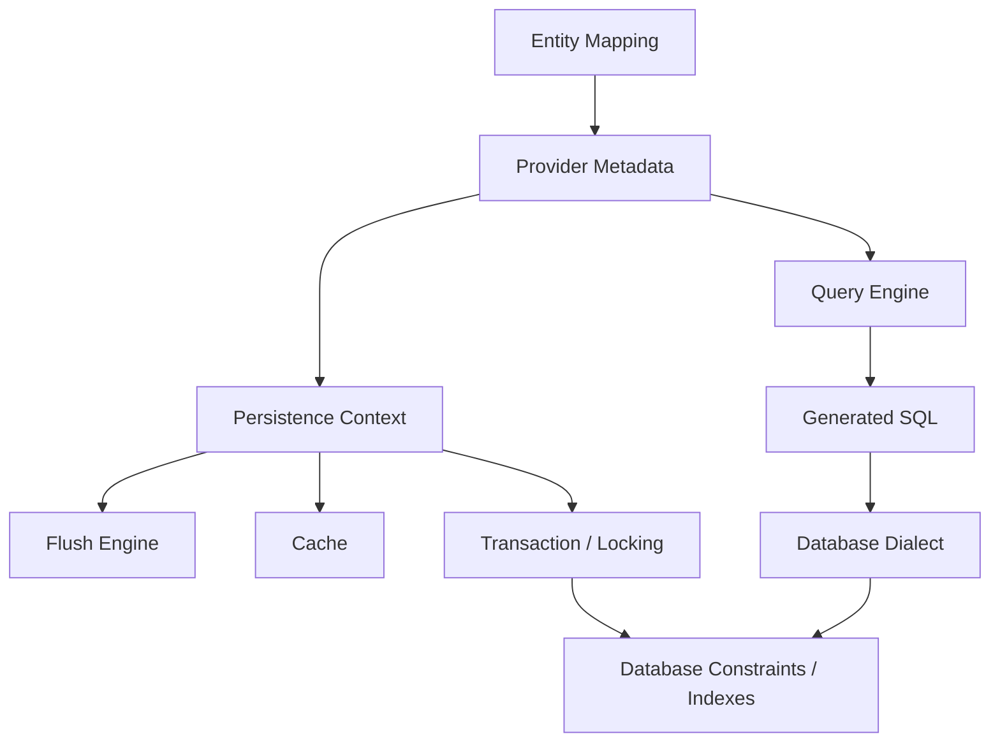
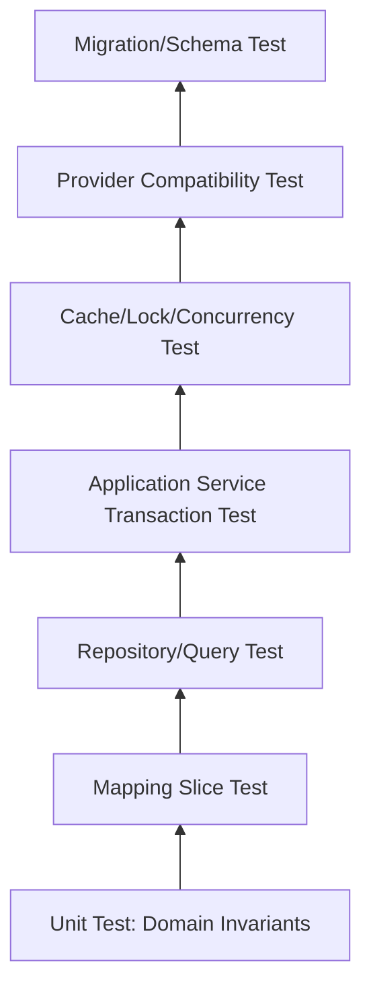
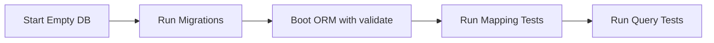

# Part 028 — Testing ORM Behavior: Beyond Repository Happy Path

> Target part ini: kamu bisa membuat test suite yang membuktikan behavior ORM yang benar: mapping, SQL shape, fetch plan, flush, transaction, locking, cache, batch, dan provider-specific behavior. Bukan hanya “repository method return data”.

ORM bug jarang muncul sebagai compile error. Ia muncul sebagai:

- query terlalu banyak,
- query terlalu besar,
- update tidak sengaja,
- stale cache,
- lost update,
- deadlock,
- constraint violation saat flush,
- data tenant bocor,
- pagination salah,
- audit bolong,
- behavior beda antara Hibernate dan EclipseLink.

Karena itu, test ORM tidak boleh hanya:

```java
assertThat(repository.findById(id)).isPresent();
```

Test seperti itu hanya membuktikan happy path paling dangkal.

Test ORM yang kuat harus membuktikan **behavioral contract**.

---

## 1. Mental Model: Apa yang Sebenarnya Dites?

ORM test bukan hanya test Java code. ORM test adalah test interaksi antara:



Setiap test harus jelas membuktikan salah satu kontrak ini:

| Contract | Contoh pembuktian |
|---|---|
| Mapping correctness | column, FK, unique, enum, converter, custom type benar |
| Persistence context behavior | entity managed/detached/dirty sesuai ekspektasi |
| Flush behavior | DML terjadi pada waktu dan urutan benar |
| SQL shape | jumlah dan bentuk SQL sesuai budget |
| Fetch behavior | tidak ada N+1, tidak overfetch, lazy boundary aman |
| Transaction behavior | rollback, isolation, lock, version conflict benar |
| Cache behavior | hit/miss/invalidation/stale behavior benar |
| Batch behavior | high-volume write benar-benar batching/chunking |
| Provider compatibility | behavior tidak bergantung extension tanpa sadar |
| Migration safety | schema dan mapping tetap kompatibel |

---

## 2. Test Taxonomy for ORM

Gunakan beberapa layer test. Jangan memaksa satu jenis test menjawab semua hal.



### 2.1 Domain Unit Test

Tanpa ORM. Fokus:

- aggregate invariant,
- state transition,
- value object equality,
- collection mutation method,
- business rule.

Contoh:

```java
@Test
void assigningOfficer_shouldRecordAssignmentAndUpdateState() {
    CaseFile c = CaseFile.open("CASE-001");
    Officer officer = Officer.ref(officerId);

    c.assignTo(officer, actor, clock.instant());

    assertThat(c.getAssignee()).isEqualTo(officer);
    assertThat(c.getStatus()).isEqualTo(CaseStatus.ASSIGNED);
    assertThat(c.domainEvents()).hasSize(1);
}
```

Ini tidak membuktikan mapping. Itu memang bukan tugasnya.

### 2.2 Mapping Slice Test

Fokus:

- entity bisa persist/load,
- converter benar,
- embeddable benar,
- FK dan unique constraint bekerja,
- orphan removal/cascade sesuai kontrak,
- enum/custom type tidak corrupt.

Test ini harus memakai database nyata atau container database yang sama family dengan production.

### 2.3 Query/Repository Test

Fokus:

- JPQL/Criteria/native SQL benar,
- filter tenant/status benar,
- pagination benar,
- sorting deterministik,
- query count sesuai budget,
- projection shape benar.

### 2.4 Application Service Transaction Test

Fokus:

- transaction boundary benar,
- flush timing benar,
- rollback benar,
- entity tidak bocor ke luar boundary,
- command menghasilkan DML minimal dan benar,
- event/outbox/audit benar.

### 2.5 Concurrency/Locking Test

Fokus:

- optimistic lock conflict,
- pessimistic lock behavior,
- deadlock risk,
- timeout,
- lost update prevention,
- idempotency under retry.

### 2.6 Cache Correctness Test

Fokus:

- read-through behavior,
- invalidation,
- cache bypass,
- stale read,
- bulk/native update interaction,
- multi-tenant cache isolation.

### 2.7 Provider Compatibility Test

Fokus:

- test yang sama dijalankan dengan Hibernate dan EclipseLink,
- extension usage jelas,
- behavior portability diketahui,
- migration risk terlihat.

---

## 3. Why H2 Is Not Enough

H2 berguna untuk smoke test cepat, tetapi tidak cukup untuk ORM correctness production.

Masalah umum:

| Area | Kenapa H2 bisa menipu |
|---|---|
| Dialect | SQL function, pagination, lock syntax, generated IDs berbeda |
| Constraint | FK/unique/check behavior bisa berbeda |
| Type | JSON, array, enum, timestamp, UUID behavior berbeda |
| Locking | isolation/deadlock/timeout tidak setara production DB |
| Optimizer | execution plan/index cost tidak representatif |
| Case sensitivity | identifier quoting bisa berbeda |
| Sequence/identity | ID allocation behavior berbeda |

Rule praktis:

> H2 boleh untuk fast feedback, tetapi persistence behavior penting harus diuji dengan database family production.

Jika production PostgreSQL, gunakan PostgreSQL container. Jika Oracle, gunakan Oracle-compatible test strategy. Jika SQL Server, test minimal harus menyentuh SQL Server semantics untuk query/locking/pagination penting.

---

## 4. Testcontainers Strategy

Testcontainers memudahkan test integration dengan database disposable.

Contoh PostgreSQL:

```java
@Testcontainers
@SpringBootTest
class CaseRepositoryIT {

    @Container
    static PostgreSQLContainer<?> postgres = new PostgreSQLContainer<>("postgres:16")
        .withDatabaseName("cases")
        .withUsername("test")
        .withPassword("test");

    @DynamicPropertySource
    static void datasource(DynamicPropertyRegistry registry) {
        registry.add("spring.datasource.url", postgres::getJdbcUrl);
        registry.add("spring.datasource.username", postgres::getUsername);
        registry.add("spring.datasource.password", postgres::getPassword);
    }
}
```

Prinsip desain:

- container per test class untuk speed,
- clean database per test method melalui transaction rollback/truncate/Flyway clean,
- migration production dijalankan di test,
- seed data kecil tapi representative,
- jangan bergantung pada test order,
- jangan pakai generated schema provider sebagai pengganti migration validation.

---

## 5. Mapping Correctness Tests

### 5.1 Test Converter / Custom Type

Misalnya value object `CaseNumber`:

```java
@Embeddable
public record CaseNumber(String value) {
    public CaseNumber {
        if (value == null || value.isBlank()) {
            throw new IllegalArgumentException("case number is required");
        }
    }
}
```

Test:

```java
@Test
void caseNumber_shouldRoundTrip() {
    CaseFile saved = entityManager.persistAndFlush(
        CaseFile.open(new CaseNumber("REG-2026-0001"))
    );

    entityManager.clear();

    CaseFile reloaded = entityManager.find(CaseFile.class, saved.getId());

    assertThat(reloaded.getCaseNumber().value()).isEqualTo("REG-2026-0001");
}
```

Test ini membuktikan:

- mapping column benar,
- constructor/record/embeddable path berjalan,
- provider bisa instantiate value object,
- database value tidak corrupt.

### 5.2 Test Constraint, Not Just Annotation

Jangan hanya percaya `@Column(nullable=false)`.

```java
@Test
void caseNumber_shouldBeUnique() {
    entityManager.persist(CaseFile.open(new CaseNumber("DUP")));
    entityManager.flush();

    entityManager.persist(CaseFile.open(new CaseNumber("DUP")));

    assertThatThrownBy(() -> entityManager.flush())
        .isInstanceOf(PersistenceException.class);
}
```

Ini membuktikan database constraint, bukan hanya metadata Java.

### 5.3 Test Owning Side

Bidirectional association harus punya invariant method.

```java
public void addTask(CaseTask task) {
    tasks.add(task);
    task.assignToCase(this);
}
```

Test:

```java
@Test
void addingTask_shouldPersistFkOnOwningSide() {
    CaseFile c = CaseFile.open(new CaseNumber("C-1"));
    c.addTask(CaseTask.todo("Review evidence"));

    entityManager.persist(c);
    entityManager.flush();
    entityManager.clear();

    CaseFile reloaded = entityManager.find(CaseFile.class, c.getId());

    assertThat(reloaded.getTasks()).hasSize(1);
}
```

Jika test gagal, biasanya owning side tidak diset.

### 5.4 Test Orphan Removal

```java
@Test
void removingTask_shouldDeleteOrphan() {
    CaseFile c = fixture.caseWithTasks(2);
    entityManager.flush();
    entityManager.clear();

    CaseFile managed = entityManager.find(CaseFile.class, c.getId());
    CaseTask removed = managed.getTasks().get(0);

    managed.removeTask(removed);
    entityManager.flush();
    entityManager.clear();

    assertThat(entityManager.find(CaseTask.class, removed.getId())).isNull();
}
```

Ini membuktikan lifecycle ownership, bukan sekadar collection mutation.

---

## 6. Generated SQL and Query Count Tests

### 6.1 Why Query Count Tests Matter

Query count adalah regression guard untuk:

- N+1,
- unexpected eager loading,
- broken entity graph,
- accidental lazy access,
- batch setting regression,
- framework upgrade behavior change.

Test query count harus menggunakan fixture yang membuat N+1 terlihat.

### 6.2 Hibernate Statistics-Based Query Count

```java
@Component
public class HibernateStatisticsProbe {
    private final SessionFactory sessionFactory;

    public HibernateStatisticsProbe(EntityManagerFactory emf) {
        this.sessionFactory = emf.unwrap(SessionFactory.class);
    }

    public void clear() {
        sessionFactory.getStatistics().clear();
    }

    public Statistics statistics() {
        return sessionFactory.getStatistics();
    }
}
```

Test:

```java
@Test
void listOpenCases_shouldStayWithinQueryBudget() {
    fixture.openCases(10, eachCaseHasTasks(3));
    stats.clear();

    List<CaseSummary> result = service.listOpenCases();

    Statistics s = stats.statistics();

    assertThat(result).hasSize(10);
    assertThat(s.getPrepareStatementCount()).isLessThanOrEqualTo(3);
    assertThat(s.getCollectionFetchCount()).isZero();
}
```

Makna assertion:

- `PrepareStatementCount <= 3`: query tidak linear terhadap jumlah parent,
- `CollectionFetchCount == 0`: tidak ada lazy collection fetch tersembunyi.

### 6.3 StatementInspector-Based SQL Assertion

Jika perlu melihat bentuk SQL:

```java
@Test
void caseDashboardQuery_shouldNotJoinEvidenceBlobTable() {
    sql.clear();

    service.dashboard();

    assertThat(sql.normalizedStatements())
        .noneMatch(s -> s.contains("case_evidence_blob"));
}
```

Ini berguna untuk memastikan read model ringan tidak membawa table berat.

### 6.4 Avoid Over-Specifying SQL

Jangan assert full SQL string kecuali untuk native query yang memang contract-nya SQL.

Buruk:

```java
assertThat(sql).containsExactly("select c1_0.id,c1_0.status from case_file c1_0 ...");
```

Masalah:

- alias provider bisa berubah,
- upgrade Hibernate mengubah SQL formatting,
- dialect bisa mengubah pagination syntax,
- test jadi rapuh.

Lebih baik assert property struktural:

```java
assertThat(normalizedSql).anySatisfy(statement -> {
    assertThat(statement).contains("from case_file");
    assertThat(statement).contains("where");
    assertThat(statement).contains("status");
    assertThat(statement).doesNotContain("case_task");
});
```

---

## 7. Fetch Plan Tests

Fetch plan test membuktikan bahwa boundary read benar.

### 7.1 Test DTO Query Does Not Initialize Entity Graph

```java
@Test
void dashboardProjection_shouldNotHydrateCaseTasks() {
    fixture.openCases(5, eachCaseHasTasks(3));
    stats.clear();

    List<CaseDashboardRow> rows = query.dashboardRows();

    assertThat(rows).hasSize(5);
    assertThat(stats.statistics().getCollectionLoadCount()).isZero();
    assertThat(stats.statistics().getEntityLoadCount()).isLessThanOrEqualTo(5);
}
```

Jika DTO projection benar-benar scalar/constructor projection, entity load bisa lebih rendah lagi tergantung provider/query.

### 7.2 Test Entity Detail Explicitly Fetches Required Data

```java
@Test
void caseDetail_shouldFetchAssigneeAndTasksInBudget() {
    CaseFile c = fixture.caseWithAssigneeAndTasks(3);
    stats.clear();

    CaseFile detail = repository.findDetail(c.getId()).orElseThrow();

    assertThat(detail.getAssignee().getName()).isNotBlank();
    assertThat(detail.getTasks()).hasSize(3);
    assertThat(stats.statistics().getPrepareStatementCount()).isLessThanOrEqualTo(2);
}
```

Tujuan test ini bukan memaksa satu query. Tujuannya memastikan tidak linear terhadap jumlah task.

### 7.3 Test Serialization Boundary

Jika entity pernah keluar ke JSON boundary, test harus gagal.

Lebih baik policy-nya:

```txt
Controller tidak boleh return entity.
Controller hanya return DTO/API model.
```

ArchUnit-style rule:

```java
noClasses()
    .that().resideInAPackage("..web..");
    .should().dependOnClassesThat().areAnnotatedWith(Entity.class);
```

Atau minimal code review rule:

```txt
[ ] REST response type bukan @Entity.
[ ] GraphQL resolver tidak menerima managed entity sebagai response model.
[ ] Async event payload bukan entity.
```

---

## 8. Flush and Dirty Checking Tests

### 8.1 Test No Accidental Update

```java
@Test
void loadingAndMappingToDto_shouldNotDirtyEntity() {
    CaseFile c = fixture.openCase();
    entityManager.flush();
    entityManager.clear();

    stats.clear();

    service.getCaseSummary(c.getId());
    entityManager.flush();

    assertThat(stats.statistics().getEntityUpdateCount()).isZero();
}
```

Jika gagal, cari:

- mapper memanggil setter,
- `@PostLoad` mengubah field,
- derived field disimpan ulang,
- mutable value object berubah,
- collection wrapper diganti,
- timestamp callback salah.

### 8.2 Test Flush Timing

```java
@Test
void queryAfterMutation_shouldFlushBeforeQueryWhenNeeded() {
    CaseFile c = fixture.openCase();

    c.escalate(actor, clock.instant());

    queryService.countEscalatedCases();

    assertThat(stats.statistics().getFlushCount()).isGreaterThanOrEqualTo(1);
}
```

Test seperti ini membantu menjelaskan mengapa query read bisa melempar constraint violation sebelum commit.

### 8.3 Test Collection Replacement Hazard

Buruk:

```java
caseFile.setTasks(newTasks);
```

Lebih aman:

```java
caseFile.replaceTasksByDiff(newTasks);
```

Test:

```java
@Test
void replacingTasksByDiff_shouldNotDeleteAndReinsertUnchangedRows() {
    CaseFile c = fixture.caseWithTasks(3);
    entityManager.flush();
    entityManager.clear();
    stats.clear();

    CaseFile managed = entityManager.find(CaseFile.class, c.getId());
    managed.replaceTasksByDiff(List.of(
        existingTaskWithEditedTitle(managed.getTasks().get(0)),
        managed.getTasks().get(1),
        newTask("New task")
    ));
    entityManager.flush();

    assertThat(stats.statistics().getCollectionRecreateCount()).isZero();
}
```

Exact metric bisa berbeda tergantung mapping/provider. Yang penting adalah guard terhadap delete-all/reinsert-all yang tidak disengaja.

---

## 9. Transaction and Rollback Tests

### 9.1 Rollback Must Undo Database Changes

```java
@Test
void failedTransition_shouldRollbackCaseAndAudit() {
    CaseFile c = fixture.openCase();

    assertThatThrownBy(() -> service.transitionAndFail(c.getId()))
        .isInstanceOf(RuntimeException.class);

    entityManager.clear();

    CaseFile reloaded = entityManager.find(CaseFile.class, c.getId());
    assertThat(reloaded.getStatus()).isEqualTo(CaseStatus.OPEN);
    assertThat(auditRepository.findByCaseId(c.getId())).isEmpty();
}
```

Pastikan test tidak tertipu oleh persistence context yang masih menyimpan object lama. Clear context sebelum assert database state.

### 9.2 Read-Only Transaction Must Not Write

```java
@Test
void readOnlyUseCase_shouldNotFlushUpdates() {
    stats.clear();

    service.readOnlyDashboard();

    assertThat(stats.statistics().getEntityUpdateCount()).isZero();
    assertThat(stats.statistics().getFlushCount()).isLessThanOrEqualTo(1);
}
```

Catatan:

- read-only semantics berbeda antara framework/provider/database,
- jangan hanya mengandalkan annotation,
- test behavior aktual.

---

## 10. Locking and Concurrency Tests

Concurrency test harus memakai transaction terpisah. Satu `EntityManager` tidak cukup.

### 10.1 Optimistic Lock Conflict

```java
@Test
void concurrentUpdate_shouldFailWithOptimisticLock() {
    CaseFile c = fixture.openCase();

    EntityManager em1 = emf.createEntityManager();
    EntityManager em2 = emf.createEntityManager();

    em1.getTransaction().begin();
    em2.getTransaction().begin();

    CaseFile a = em1.find(CaseFile.class, c.getId());
    CaseFile b = em2.find(CaseFile.class, c.getId());

    a.assignTo(Officer.ref("A"), actor, clock.instant());
    em1.getTransaction().commit();

    b.assignTo(Officer.ref("B"), actor, clock.instant());

    assertThatThrownBy(() -> em2.getTransaction().commit())
        .isInstanceOfAny(OptimisticLockException.class, RollbackException.class);

    em1.close();
    em2.close();
}
```

Tujuan:

- membuktikan `@Version` ada dan efektif,
- lost update dicegah,
- service siap retry/idempotency.

### 10.2 Pessimistic Lock Test

Pessimistic lock test lebih sulit karena timing/DB behavior.

Pattern:

1. Transaction A lock row.
2. Transaction B mencoba lock row yang sama dengan timeout pendek.
3. Assert timeout/exception sesuai provider/database.

Pseudo:

```java
@Test
void secondTransaction_shouldTimeoutWhenCaseIsPessimisticallyLocked() {
    CaseFile c = fixture.openCase();

    CountDownLatch locked = new CountDownLatch(1);
    CountDownLatch release = new CountDownLatch(1);

    Future<?> txA = executor.submit(() -> txTemplate.executeWithoutResult(tx -> {
        entityManager.find(
            CaseFile.class,
            c.getId(),
            LockModeType.PESSIMISTIC_WRITE
        );
        locked.countDown();
        await(release);
    }));

    locked.await(5, TimeUnit.SECONDS);

    assertThatThrownBy(() -> txTemplate.executeWithoutResult(tx -> {
        Map<String, Object> hints = Map.of("jakarta.persistence.lock.timeout", 100);
        entityManager.find(
            CaseFile.class,
            c.getId(),
            LockModeType.PESSIMISTIC_WRITE,
            hints
        );
    })).isInstanceOf(PersistenceException.class);

    release.countDown();
    txA.get(5, TimeUnit.SECONDS);
}
```

Catatan:

- exception type bisa dibungkus framework,
- timeout semantics database-specific,
- test ini lebih cocok integration suite, bukan unit suite cepat.

---

## 11. Cache Correctness Tests

Cache test harus selalu memakai dua persistence context atau dua transaction. Kalau tidak, kamu hanya menguji first-level cache.

### 11.1 L2/Shared Cache Hit Test

```java
@Test
void referenceData_shouldBeServedFromSecondLevelCache() {
    Department d = fixture.department("ENFORCEMENT");

    stats.clear();

    tx(() -> entityManager.find(Department.class, d.getId()));
    long afterFirstLoadMisses = stats.statistics().getSecondLevelCacheMissCount();

    tx(() -> entityManager.find(Department.class, d.getId()));
    long hits = stats.statistics().getSecondLevelCacheHitCount();

    assertThat(afterFirstLoadMisses).isGreaterThanOrEqualTo(1);
    assertThat(hits).isGreaterThanOrEqualTo(1);
}
```

### 11.2 Stale Cache After Native Update

```java
@Test
void nativeUpdate_shouldRequireCacheEvictionForCachedEntity() {
    Department d = fixture.department("OLD");

    tx(() -> entityManager.find(Department.class, d.getId()));

    jdbc.update("update department set code = ? where id = ?", "NEW", d.getId());

    tx(() -> {
        Department reloaded = entityManager.find(Department.class, d.getId());
        // This assertion documents actual behavior.
        // If cache returns OLD, test should force explicit eviction policy.
        assertThat(reloaded.getCode()).isEqualTo("NEW");
    });
}
```

Jika test gagal karena cache stale, bukan berarti provider salah. Itu berarti architecture perlu evict/bypass rule.

### 11.3 Tenant Cache Isolation Test

```java
@Test
void cache_shouldNotLeakDataAcrossTenants() {
    txAsTenant("tenant-a", () -> fixture.caseWithExternalNumber("CASE-1"));
    txAsTenant("tenant-b", () -> fixture.caseWithExternalNumber("CASE-1"));

    CaseSummary a = txAsTenant("tenant-a", () -> service.findByExternalNumber("CASE-1"));
    CaseSummary b = txAsTenant("tenant-b", () -> service.findByExternalNumber("CASE-1"));

    assertThat(a.tenantId()).isEqualTo("tenant-a");
    assertThat(b.tenantId()).isEqualTo("tenant-b");
}
```

Cache isolation bug adalah security bug.

---

## 12. Batch and Bulk Operation Tests

### 12.1 Batch Insert Test

Test high-volume write path jangan hanya assert row count.

```java
@Test
void importingCases_shouldFlushAndClearInChunks() {
    List<CaseImportRow> rows = fixture.importRows(1_000);

    stats.clear();

    importService.importCases(rows);

    assertThat(caseRepository.count()).isEqualTo(1_000);
    assertThat(stats.statistics().getFlushCount()).isBetween(5L, 50L);
}
```

Untuk memastikan batching aktual, provider statistics kadang tidak cukup. Gunakan JDBC proxy/logging atau database metrics jika perlu.

### 12.2 Bulk Update Persistence Context Test

Bulk JPQL bypass persistence context synchronization.

```java
@Test
void bulkCloseCases_shouldClearPersistenceContextBeforeReadingAgain() {
    CaseFile c = fixture.openCase();

    CaseFile managed = entityManager.find(CaseFile.class, c.getId());

    repository.bulkCloseAllOpenCases();

    entityManager.clear();

    CaseFile reloaded = entityManager.find(CaseFile.class, c.getId());
    assertThat(reloaded.getStatus()).isEqualTo(CaseStatus.CLOSED);
}
```

Tanpa `clear`, assertion bisa membaca managed object lama.

---

## 13. Provider Compatibility Tests

Jika ingin menjaga opsi Hibernate/EclipseLink, buat test matrix.

```txt
Profile: orm-hibernate
- provider: org.hibernate.jpa.HibernatePersistenceProvider
- dialect: PostgreSQL
- enhancement: Hibernate enhancement config

Profile: orm-eclipselink
- provider: org.eclipse.persistence.jpa.PersistenceProvider
- target-database: PostgreSQL
- weaving: configured appropriately
```

Test yang harus masuk compatibility suite:

```txt
[ ] basic persist/load
[ ] embeddable/value object round trip
[ ] enum/converter round trip
[ ] one-to-many ownership
[ ] orphan removal
[ ] optimistic lock conflict
[ ] pagination query
[ ] entity graph/fetch plan
[ ] bulk update + clear
[ ] cache bypass/retrieve/store mode if used
```

Pisahkan test:

| Test type | Harus portable? |
|---|---|
| Jakarta Persistence behavior | ya |
| Hibernate extension | tidak, tagged Hibernate-only |
| EclipseLink extension | tidak, tagged EclipseLink-only |
| Database-specific native SQL | tidak, tagged dialect-specific |

Rule:

> Extension boleh dipakai, tapi test harus membuat lock-in terlihat eksplisit.

---

## 14. Schema Migration + ORM Validation Tests

ORM mapping dan schema migration harus diuji bersama.

Pipeline ideal:



Jangan gunakan provider `update` sebagai migrasi production.

Test boot:

```java
@Test
void ormShouldBootAgainstMigratedSchema() {
    assertThat(entityManagerFactory).isNotNull();
}
```

Terdengar trivial, tetapi menangkap:

- missing column,
- wrong column type,
- missing sequence,
- wrong table name,
- naming strategy mismatch,
- migration tidak sinkron dengan entity.

### 14.1 Backward-Compatible Migration Test

Untuk zero-downtime deployment, test versi lama dan baru terhadap schema transisi.

Pattern:

```txt
1. Migrate schema to expand phase.
2. Run old app compatibility smoke test.
3. Run new app compatibility smoke test.
4. Backfill data.
5. Run contract test.
6. Migrate contract phase.
```

ORM sering gagal di zero-downtime karena mapping menganggap schema berubah atomik.

---

## 15. Test Data Design

Test data harus memaksa ORM menunjukkan behavior asli.

### 15.1 Dataset Shape

Gunakan minimal:

```txt
Tenant A
- 3 open cases
- 2 closed cases
- each open case has 3 tasks
- one case has 0 evidence
- one case has 10 evidence
- one deleted/soft-deleted case
- one case assigned to officer in another department

Tenant B
- same external case number as Tenant A
- different ownership/access
```

Kenapa?

- multiple parents menangkap N+1,
- varied children menangkap join explosion,
- tenant duplicate menangkap tenant isolation,
- soft-deleted row menangkap filter leak,
- optional association menangkap join type bug.

### 15.2 Avoid Perfect Data

Perfect data menyembunyikan bug.

Tambahkan:

- null optional value,
- inactive reference data,
- old version row,
- soft-deleted child,
- same timestamp rows untuk pagination tie-breaker,
- long text/blob row yang tidak boleh ikut dashboard query.

---

## 16. CI Strategy

Tidak semua ORM test harus jalan di setiap commit dengan biaya sama.

| Suite | Frekuensi | Isi |
|---|---|---|
| Fast unit | setiap commit | domain invariant, mapper pure function |
| ORM slice | setiap commit/PR | mapping, repository, query count kecil |
| Integration DB | PR/main | Testcontainers DB production-like |
| Concurrency/cache | PR/nightly | locking, cache invalidation, multi-tx |
| Provider matrix | nightly/release | Hibernate vs EclipseLink compatibility |
| Performance regression | nightly/release | query budget, batch throughput, plan review |

Rule:

> Query-count regression harus cepat. Full performance benchmark boleh lebih jarang.

---

## 17. Production Regression Harness

Untuk sistem besar, buat harness khusus persistence behavior.

### 17.1 Query Budget Registry

```yaml
useCases:
  case-dashboard:
    maxSelects: 2
    maxEntityLoads: 0
    maxCollectionFetches: 0
    notes: DTO projection only

  case-detail:
    maxSelects: 3
    maxEntityLoads: 20
    maxCollectionFetches: 0
    notes: entity graph or split query allowed

  case-transition:
    maxSelects: 2
    maxUpdates: 2
    maxFlushes: 1
    notes: optimistic lock expected
```

Test runner membaca registry dan menjalankan scenario fixture.

### 17.2 SQL Fingerprint Snapshot

Simpan normalized SQL fingerprint, bukan raw SQL penuh.

```txt
select case_file where tenant_id=? and status=? order by priority, created_at limit ?
select case_task where case_id in (?)
```

Gunakan snapshot untuk mendeteksi:

- join baru,
- table berat ikut query,
- filter tenant hilang,
- sort berubah,
- query count naik.

Jangan terlalu ketat terhadap alias/format.

---

## 18. Common Testing Anti-Patterns

### 18.1 Testing Repository Only, Ignoring Service Transaction

Repository method bisa benar, tetapi service salah karena:

- memanggil repository dalam loop,
- membuka transaction terlalu lama,
- membaca lazy association setelah transaction,
- menggabungkan read/write secara buruk.

### 18.2 Asserting Managed Object After Rollback

Setelah rollback/commit, clear context sebelum assert database state.

### 18.3 Single-Row Fixture

Single-row fixture tidak menangkap N+1, pagination tie-breaker, tenant collision, atau join explosion.

### 18.4 Mocking EntityManager for ORM Behavior

Mock `EntityManager` tidak bisa membuktikan mapping, flush, dirty checking, query translation, cache, atau lock.

Mock hanya cocok untuk application service branch logic jika persistence behavior tidak relevan.

### 18.5 Ignoring Provider Upgrade Regression

Hibernate/EclipseLink upgrade bisa mengubah:

- generated SQL,
- fetch behavior,
- query parser strictness,
- batching behavior,
- caching behavior,
- DDL validation,
- type mapping.

Query-count dan mapping tests adalah safety net saat upgrade.

---

## 19. Review Checklist for ORM Tests

Gunakan checklist ini saat PR persistence-sensitive.

```txt
[ ] Test memakai DB production-like untuk behavior penting.
[ ] Migration dijalankan sebelum ORM boot.
[ ] Mapping round-trip diuji untuk custom value/type.
[ ] Constraint diuji di DB, bukan hanya annotation.
[ ] Query count budget ada untuk use case penting.
[ ] Fixture punya multiple parents/children.
[ ] Fetch plan diuji tidak N+1 dan tidak overfetch.
[ ] No accidental update test ada untuk read path sensitif.
[ ] Bulk operation test clear persistence context.
[ ] Locking test memakai dua transaction/entity manager.
[ ] Cache test memakai dua transaction/entity manager.
[ ] Tenant/access isolation diuji jika multi-tenant/regulated data.
[ ] Provider-specific extension diberi tag dan dokumentasi.
[ ] SQL assertion tidak rapuh terhadap alias/format provider.
```

---

## 20. Practice Lab

### Lab 1 — Build a Query Count Guard

1. Aktifkan Hibernate statistics.
2. Buat fixture 10 case, masing-masing 3 task.
3. Buat query dashboard DTO.
4. Assert `PrepareStatementCount <= 2`.
5. Ubah service agar akses `case.getTasks().size()` dalam loop.
6. Pastikan test gagal.
7. Fix dengan projection/entity graph/batch fetch.

### Lab 2 — Prove Orphan Removal

1. Buat `CaseFile` dengan 2 task.
2. Remove 1 task via domain method.
3. Flush + clear.
4. Assert row child hilang.
5. Ubah hanya inverse side.
6. Pastikan test menangkap bug.

### Lab 3 — Prove Lost Update Prevention

1. Buat entity dengan `@Version`.
2. Buka dua transaction.
3. Update dari dua transaction.
4. Commit pertama sukses.
5. Commit kedua gagal.
6. Tambahkan retry/idempotency test di service.

### Lab 4 — Prove Cache Stale Behavior

1. Cache reference entity.
2. Load entity di transaction A.
3. Update via JDBC/native SQL.
4. Load di transaction B.
5. Dokumentasikan actual behavior.
6. Tambahkan evict/bypass policy.

### Lab 5 — Provider Matrix Smoke

1. Jalankan test mapping dasar di Hibernate profile.
2. Jalankan test yang sama di EclipseLink profile.
3. Catat perbedaan behavior.
4. Pisahkan test extension-specific.

---

## 21. Key Takeaways

- ORM test yang baik membuktikan behavior, bukan hanya return value repository.
- Mapping, fetch, SQL count, flush, transaction, lock, cache, batch, dan provider compatibility perlu test berbeda.
- H2 tidak cukup untuk behavior production-critical; gunakan database family production via container atau environment integration.
- Query-count budget adalah regression guard paling efektif untuk N+1 dan accidental fetch regression.
- Cache dan locking test harus memakai transaction/persistence context terpisah.
- Bulk operation test harus membuktikan persistence context dibersihkan atau disinkronkan.
- Provider-specific extension boleh dipakai, tetapi harus diberi test/tag agar lock-in sadar.
- Test data harus punya shape yang memunculkan bug: multiple parent/children, tenant collision, soft delete, optional association, large child count, dan pagination tie-breaker.

---

## 22. References

- Hibernate ORM User Guide 7.4.x — statistics, SQL logging settings, `StatementInspector`, fetching, flushing, batching, locking, cache statistics.
- Jakarta Persistence 3.2 Specification — persistence context, cache modes, locking, entity graph, query behavior, transaction semantics.
- EclipseLink Documentation — logging, profiler, performance monitor, UnitOfWork/session behavior, cache behavior.
- Testcontainers for Java Documentation — disposable real database testing with JUnit and JDBC/database modules.

