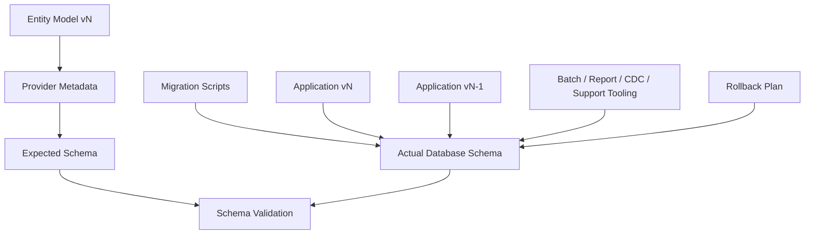
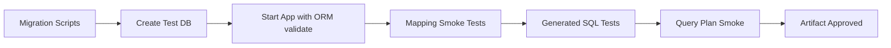
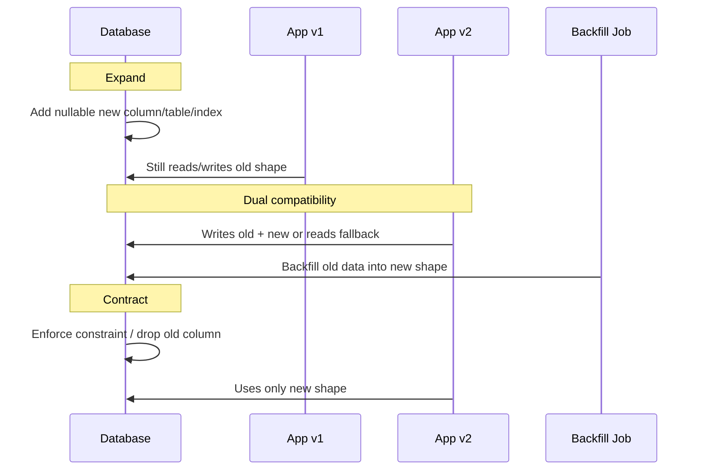
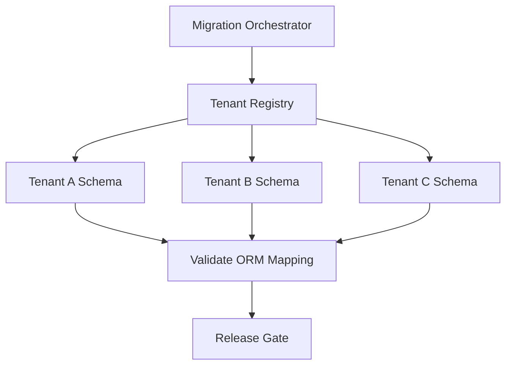
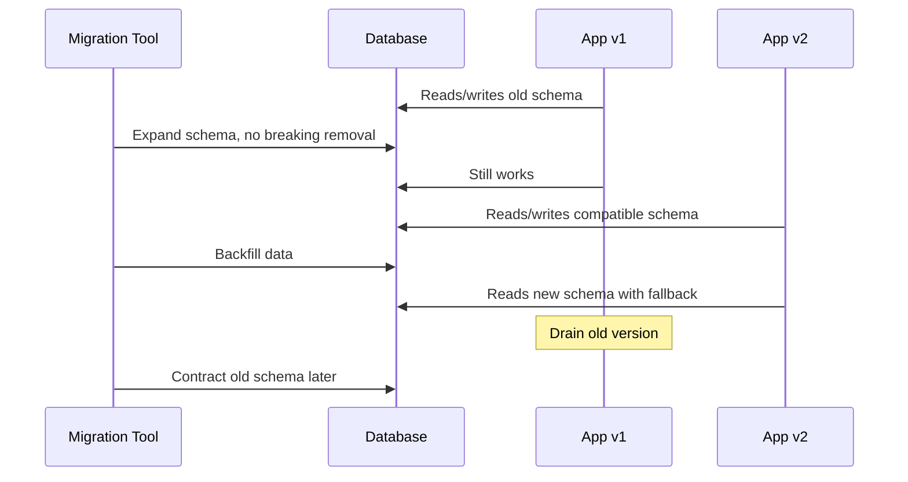
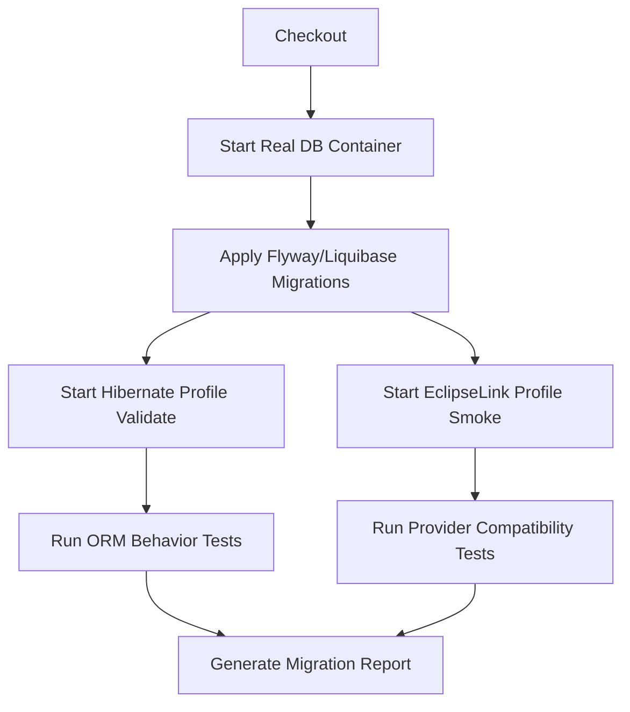

# Part 029 — Schema Evolution with Hibernate and EclipseLink

> Target part ini: kamu bisa mengelola evolusi schema database di sistem Hibernate/EclipseLink secara aman, repeatable, backward-compatible, dan production-grade. Fokusnya bukan “bagaimana create table dari entity”, tetapi bagaimana menjaga **contract antara entity model, provider metadata, migration script, database aktual, dan versi aplikasi yang sedang berjalan**.

ORM sering membuat schema terasa seperti detail implementasi. Ini berbahaya.

Di sistem produksi, schema adalah **shared operational contract**. Ia dipakai oleh:

- aplikasi versi lama dan versi baru selama rolling deployment,
- batch job,
- reporting query,
- audit pipeline,
- CDC/outbox,
- BI/export,
- manual remediation,
- support tooling,
- migration tool,
- database optimizer,
- replication/logical decoding,
- backup/restore process.

Entity mapping hanyalah salah satu consumer schema.

Kalau schema evolution salah, dampaknya bukan hanya exception. Dampaknya bisa berupa:

- deployment gagal start karena schema validation gagal,
- aplikasi baru menulis data yang tidak bisa dibaca aplikasi lama,
- rolling deployment corrupt karena dua versi app punya asumsi column berbeda,
- backfill mengunci table terlalu lama,
- foreign key baru membuat import batch gagal,
- enum baru tidak dikenali consumer lama,
- index baru menyebabkan write path melambat,
- migration irreversible mempersulit rollback,
- cache stale karena native migration/update tidak diketahui ORM,
- audit trail bolong karena bulk DML bypass lifecycle callback.

---

## 1. Mental Model: Schema Evolution adalah Versioned Contract

Jangan mulai dari annotation. Mulai dari kontrak.



Schema evolution yang aman menjawab lima pertanyaan:

| Pertanyaan | Mengapa penting |
|---|---|
| Apa expected schema menurut mapping? | Provider harus bisa membaca/menulis sesuai metadata. |
| Apa actual schema di database? | Database adalah source of truth runtime. |
| Bagaimana perubahan diterapkan? | Harus repeatable, versioned, reviewable. |
| Apakah app lama dan baru bisa hidup bersamaan? | Rolling deployment dan rollback membutuhkan kompatibilitas. |
| Bagaimana data lama ditransformasi? | DDL tanpa data migration sering tidak cukup. |

Prinsip senior: **ORM boleh membantu mendeteksi drift, tetapi tidak boleh menjadi migration authority di produksi**.

---

## 2. Tiga Peran yang Sering Dicampur

Dalam proyek ORM, ada tiga aktivitas berbeda:

| Aktivitas | Tujuan | Tool yang tepat |
|---|---|---|
| Schema generation | Membuat DDL dari mapping | Hibernate/EclipseLink/Jakarta Persistence schema generation, terutama dev/test |
| Schema validation | Memastikan mapping cocok dengan database | Hibernate validate / provider validation / startup checks |
| Schema migration | Mengubah database antar versi | Flyway, Liquibase, internal migration pipeline, reviewed SQL |

Kesalahan umum: memakai **generation** sebagai **migration**.

Generated DDL menjawab pertanyaan:

> “Kalau schema kosong, seperti apa schema yang kira-kira cocok untuk mapping ini?”

Migration menjawab pertanyaan:

> “Bagaimana database yang sudah punya data, traffic, lock, index, constraint, dan consumer lain dipindahkan dari state A ke state B tanpa merusak sistem?”

Itu dua problem berbeda.

---

## 3. Jakarta Persistence Schema Generation Baseline

Jakarta Persistence menyediakan property schema generation standar. Secara konsep, provider dapat diberi instruksi untuk:

- tidak melakukan apa-apa,
- membuat schema,
- drop schema,
- drop lalu create,
- memakai metadata, script, atau kombinasi.

Contoh property portable:

```xml
<property name="jakarta.persistence.schema-generation.database.action" value="none" />
<property name="jakarta.persistence.schema-generation.scripts.action" value="create" />
<property name="jakarta.persistence.schema-generation.scripts.create-target" value="target/create.sql" />
```

Gunakan ini terutama untuk:

- generate initial DDL candidate,
- dokumentasi mapping expectation,
- test fixture database,
- membandingkan mapping drift.

Jangan perlakukan output generated DDL sebagai migration final tanpa review. Provider tidak tahu konteks operasional seperti:

- ukuran table,
- index lock behavior,
- online DDL support database,
- replication lag,
- partial backfill,
- release choreography,
- consumer non-ORM,
- rollback plan.

---

## 4. Hibernate Schema Tooling: Gunakan dengan Batas yang Jelas

Hibernate menyediakan schema tooling melalui konfigurasi seperti `hibernate.hbm2ddl.auto` atau property Jakarta schema generation.

Mode yang umum kamu temui:

| Mode | Makna operasional | Aman untuk produksi? |
|---|---|---|
| `none` | Tidak melakukan schema action | Ya |
| `validate` | Validasi schema terhadap mapping | Ya, sebagai guard |
| `update` | Coba mengubah schema agar cocok | Tidak untuk produksi |
| `create` | Create schema dari metadata | Tidak untuk production data |
| `create-drop` | Create saat start, drop saat shutdown | Hanya dev/test ephemeral |
| `drop` | Drop schema | Tidak untuk produksi |

Konfigurasi produksi yang defensible:

```properties
hibernate.hbm2ddl.auto=validate
# atau gunakan Jakarta property equivalent sesuai framework
jakarta.persistence.schema-generation.database.action=none
```

Konfigurasi development yang boleh dipakai dengan sadar:

```properties
hibernate.hbm2ddl.auto=create-drop
hibernate.format_sql=true
hibernate.show_sql=false
```

Konfigurasi yang harus dicurigai:

```properties
hibernate.hbm2ddl.auto=update
```

`update` terlihat nyaman, tetapi ia tidak cukup sebagai migration system karena:

- tidak mendesain data migration,
- tidak menangani rename dengan semantic intent,
- tidak memberi review SQL sebelum deploy,
- tidak memberi rollback plan,
- behavior detail bergantung provider/dialect,
- bisa menghasilkan perubahan schema tidak sesuai strategi operasional,
- tidak mengerti rolling deployment compatibility.

### 4.1 Hibernate Validate sebagai Safety Net

`validate` berguna karena ia menghentikan aplikasi saat mapping dan schema tidak cocok. Tetapi `validate` bukan pengganti test migration.

Ia bagus untuk menangkap:

- missing table,
- missing column,
- type mismatch tertentu,
- sequence/table generator mismatch tertentu,
- join table/foreign key expectation yang tidak terpenuhi.

Ia tidak cukup untuk membuktikan:

- index optimal,
- constraint naming sesuai governance,
- partial index benar,
- trigger benar,
- check constraint semantik benar,
- data lama valid,
- query plan stabil,
- migration online-safe,
- compatibility dengan versi aplikasi lama.

Prinsip:

> Migration tool mengubah schema. Hibernate `validate` memastikan aplikasi tidak jalan di atas schema yang jelas salah.

---

## 5. EclipseLink DDL Generation: Useful, but Not Migration Authority

EclipseLink menyediakan property seperti:

```xml
<property name="eclipselink.ddl-generation" value="none" />
<property name="eclipselink.ddl-generation.output-mode" value="database" />
```

Nilai yang umum:

| Value | Makna |
|---|---|
| `none` | Tidak generate/drop table. Ini default yang paling aman. |
| `create-tables` | Attempt create table untuk mapping persistence unit. |
| `drop-and-create-tables` | Drop lalu create table. Hanya dev/test. |
| `create-or-extend-tables` | Buat table jika belum ada dan tambah missing column; provider docs membatasi kemampuan ini, misalnya bukan rename/delete existing column. |
| `drop-tables` | Drop table. Hindari di lingkungan data nyata. |

Output mode:

| Output mode | Makna |
|---|---|
| `database` | Generate dan execute ke database. |
| `sql-script` | Generate ke file SQL. |
| `both` | Generate ke database dan file. |

Contoh generate script untuk review:

```xml
<property name="eclipselink.ddl-generation" value="create-tables" />
<property name="eclipselink.ddl-generation.output-mode" value="sql-script" />
<property name="eclipselink.application-location" value="target/ddl" />
<property name="eclipselink.create-ddl-jdbc-file-name" value="createDDL.sql" />
```

Gunakan generated script sebagai **input review**, bukan sebagai final migration.

---

## 6. Production Policy yang Saya Rekomendasikan

Untuk sistem enterprise, policy default:

```txt
Development local:
  - create-drop boleh untuk sandbox ephemeral.
  - update boleh hanya untuk eksperimen pribadi, bukan branch bersama.

CI integration test:
  - migration tool apply dari baseline kosong.
  - ORM validate setelah migration.
  - query/fetch/cache/lock regression test jalan.

Staging:
  - migration tool apply seperti production.
  - ORM validate enabled.
  - representative data volume test.

Production:
  - migration tool only.
  - ORM schema generation disabled.
  - ORM validation enabled atau controlled startup validation.
  - migration reviewed, versioned, observable, reversible/forward-fixable.
```

Konfigurasi production anti-pattern:

```properties
spring.jpa.hibernate.ddl-auto=update
```

atau:

```xml
<property name="eclipselink.ddl-generation" value="create-or-extend-tables" />
```

di database production yang memiliki data nyata.

---

## 7. Drift: Musuh Utama Mapping dan Database

Drift terjadi ketika mapping dan actual database schema mulai berbeda.

Contoh drift:

```java
@Column(name = "status", nullable = false, length = 32)
private String status;
```

Tetapi database:

```sql
status varchar(16) null
```

Dampaknya bisa berbeda:

- aplikasi bisa start jika validation tidak ketat,
- insert status panjang gagal di runtime,
- database menerima null yang domain anggap mustahil,
- query plan berbeda karena collation/type berbeda,
- provider binding type tidak optimal.

Drift juga bisa terjadi pada:

- sequence allocation size,
- enum representation,
- FK nullable-ness,
- unique constraint,
- index existence,
- column default,
- timezone/timestamp type,
- JSON type,
- generated column,
- trigger-maintained column,
- soft delete predicate column,
- tenant discriminator column.

### Drift Guard Pipeline



---

## 8. Naming Strategy dan Migration Stability

Salah satu sumber drift paling menyebalkan adalah naming strategy.

Contoh:

```java
@Entity
class CaseAssignment {
  @ManyToOne
  private CaseFile caseFile;
}
```

Provider/framework dapat menghasilkan nama default seperti:

- `case_file_id`,
- `caseFile_id`,
- `CASEFILE_ID`,
- `case_file_case_id`,
- atau variasi dialect/naming strategy.

Senior rule:

> Untuk schema yang hidup lama, explicit naming lebih murah daripada surprise.

Contoh:

```java
@ManyToOne(fetch = FetchType.LAZY, optional = false)
@JoinColumn(
    name = "case_file_id",
    nullable = false,
    foreignKey = @ForeignKey(name = "fk_case_assignment_case_file")
)
private CaseFile caseFile;
```

Dan migration:

```sql
alter table case_assignment
  add constraint fk_case_assignment_case_file
  foreign key (case_file_id) references case_file(id);
```

Keuntungan explicit naming:

- migration script stabil,
- error message readable,
- cross-provider migration lebih mudah,
- rollback/drop constraint lebih mudah,
- governance database lebih jelas.

---

## 9. Type Mapping Drift

Provider mapping type bukan hanya detail Java.

Contoh problem:

| Java type | Risiko schema |
|---|---|
| `BigDecimal` | precision/scale salah menyebabkan rounding atau insert failure |
| `Instant` | timestamp with/without timezone mismatch |
| `OffsetDateTime` | database support berbeda |
| `String enum` | length terlalu pendek untuk value baru |
| ordinal enum | reorder enum menghancurkan data meaning |
| UUID | `uuid` native vs `char(36)` vs `binary(16)` |
| JSON | `json`, `jsonb`, `clob`, `text` berbeda semantik/index |
| array | native array vs join table vs JSON |
| boolean | native bool vs numeric/string mapping |

Contoh `BigDecimal` yang defensible:

```java
@Column(name = "amount", nullable = false, precision = 19, scale = 4)
private BigDecimal amount;
```

Contoh enum yang migration-aware:

```java
@Enumerated(EnumType.STRING)
@Column(name = "case_status", nullable = false, length = 40)
private CaseStatus status;
```

Untuk enum yang stabil lintas sistem, lebih defensible memakai explicit code:

```java
public enum CaseStatus {
    DRAFT("DRAFT"),
    UNDER_REVIEW("UNDER_REVIEW"),
    ESCALATED("ESCALATED"),
    CLOSED("CLOSED");

    private final String dbCode;

    CaseStatus(String dbCode) {
        this.dbCode = dbCode;
    }

    public String dbCode() {
        return dbCode;
    }
}
```

Dengan converter:

```java
@Converter(autoApply = false)
public class CaseStatusConverter implements AttributeConverter<CaseStatus, String> {
    @Override
    public String convertToDatabaseColumn(CaseStatus status) {
        return status == null ? null : status.dbCode();
    }

    @Override
    public CaseStatus convertToEntityAttribute(String code) {
        if (code == null) return null;
        return Arrays.stream(CaseStatus.values())
                .filter(s -> s.dbCode().equals(code))
                .findFirst()
                .orElseThrow(() -> new IllegalArgumentException("Unknown case status: " + code));
    }
}
```

---

## 10. The Expand–Migrate–Contract Pattern

Zero-downtime schema evolution biasanya memakai pola:

```txt
1. Expand   : tambah schema baru yang backward-compatible.
2. Migrate  : isi/backfill/sinkronkan data baru dan lama.
3. Contract : hapus schema lama setelah tidak ada consumer.
```

Diagram:



Ini lebih lambat daripada satu migration besar, tetapi jauh lebih aman.

---

## 11. Pattern: Add New Nullable Column

### Goal

Tambahkan column baru tanpa menghentikan aplikasi lama.

### Step 1 — Expand

```sql
alter table case_file
  add column risk_score integer null;
```

Mapping baru:

```java
@Column(name = "risk_score")
private Integer riskScore;
```

Pada fase ini:

- app lama tidak tahu column baru,
- app baru bisa membaca null,
- tidak ada constraint `not null` dulu,
- tidak ada assumption bahwa data lama sudah lengkap.

### Step 2 — Backfill

```sql
update case_file
set risk_score = 0
where risk_score is null;
```

Untuk table besar, jangan satu transaksi besar. Gunakan chunk:

```sql
update case_file
set risk_score = 0
where risk_score is null
  and id between ? and ?;
```

### Step 3 — Enforce

Setelah semua versi aplikasi kompatibel dan data sudah terisi:

```sql
alter table case_file
  alter column risk_score set not null;
```

Mapping final:

```java
@Column(name = "risk_score", nullable = false)
private int riskScore;
```

### Failure Mode

Langsung menambahkan `not null` tanpa default/backfill dapat:

- gagal saat migration karena existing rows,
- lock table lama,
- membuat app lama gagal insert,
- membuat rollback sulit.

---

## 12. Pattern: Rename Column

Column rename tidak backward-compatible jika dilakukan langsung.

Bad migration:

```sql
alter table case_file rename column owner_id to assignee_id;
```

Masalah:

- app lama masih query `owner_id`,
- app baru query `assignee_id`,
- rolling deployment gagal,
- rollback butuh rename balik dan data mungkin sudah berubah.

Production-safe pattern:

### Step 1 — Expand

```sql
alter table case_file add column assignee_id uuid null;
```

### Step 2 — Dual Write

App v2:

```java
@Column(name = "owner_id")
private UUID ownerIdLegacy;

@Column(name = "assignee_id")
private UUID assigneeId;

public void assignTo(UUID userId) {
    this.ownerIdLegacy = userId;
    this.assigneeId = userId;
}
```

Atau lebih baik, dual write dilakukan di service/migration boundary, bukan domain model permanen.

### Step 3 — Backfill

```sql
update case_file
set assignee_id = owner_id
where assignee_id is null;
```

### Step 4 — Read New with Fallback

```java
public UUID effectiveAssigneeId() {
    return assigneeId != null ? assigneeId : ownerIdLegacy;
}
```

### Step 5 — Contract

Setelah app lama hilang dan semua data terisi:

```sql
alter table case_file alter column assignee_id set not null;
alter table case_file drop column owner_id;
```

Mapping final hanya punya `assignee_id`.

---

## 13. Pattern: Split Table

Misalnya `case_file` terlalu besar dan bagian regulatory detail dipisah ke `case_regulatory_profile`.

### Existing

```sql
case_file(
  id,
  status,
  subject,
  regulator_code,
  risk_band,
  supervision_level
)
```

### Target

```sql
case_file(
  id,
  status,
  subject
)

case_regulatory_profile(
  case_file_id primary key references case_file(id),
  regulator_code,
  risk_band,
  supervision_level
)
```

### Safe Sequence

1. Create new table nullable/compatible.
2. Add mapping optional one-to-one.
3. Backfill rows from old columns.
4. Dual write old + new during transition.
5. Change reads to prefer new table with fallback.
6. Remove old columns after all consumers migrate.

Mapping transition:

```java
@OneToOne(fetch = FetchType.LAZY, cascade = CascadeType.ALL, orphanRemoval = true)
@JoinColumn(name = "id", referencedColumnName = "case_file_id", insertable = false, updatable = false)
private CaseRegulatoryProfile regulatoryProfile;
```

Be careful: shared primary key one-to-one mapping can be elegant, but migration phase may require nullable/optional behavior before final invariant is enforced.

---

## 14. Pattern: Merge Tables

Misalnya `case_metadata` ingin digabung ke `case_file` untuk mengurangi join di read path.

Safe sequence:

1. Add new columns to `case_file`.
2. Backfill from `case_metadata`.
3. App writes both tables.
4. App reads from merged columns with fallback.
5. Stop writes to old table.
6. Verify no consumer reads old table.
7. Drop old table.

Hazard:

- ORM association removal dapat trigger cascade/delete tidak sengaja.
- Cache region untuk old entity harus di-evict atau disabled selama transition.
- Native backfill bypass lifecycle hooks.
- Query plans berubah karena table width dan index selectivity berubah.

---

## 15. Pattern: Change Enum Safely

Enum change terlihat kecil, tetapi bisa breaking.

### Dangerous

```java
enum CaseStatus {
    DRAFT,
    REVIEW,
    CLOSED
}
```

Lalu rename `REVIEW` menjadi `UNDER_REVIEW` tanpa data migration.

Kalau memakai `EnumType.STRING`, database lama berisi `REVIEW`; app baru tidak bisa parse.

Safe pattern:

1. Tambah enum baru di Java sambil tetap mengenali old code.
2. Ubah writer agar menulis code baru.
3. Backfill data lama.
4. Setelah tidak ada old code, hapus compatibility.

Converter transitional:

```java
@Override
public CaseStatus convertToEntityAttribute(String code) {
    return switch (code) {
        case "REVIEW", "UNDER_REVIEW" -> CaseStatus.UNDER_REVIEW;
        case "DRAFT" -> CaseStatus.DRAFT;
        case "CLOSED" -> CaseStatus.CLOSED;
        default -> throw new IllegalArgumentException("Unknown case status: " + code);
    };
}
```

Migration:

```sql
update case_file
set case_status = 'UNDER_REVIEW'
where case_status = 'REVIEW';
```

---

## 16. Pattern: Change Column Type

Column type change sering mahal.

Contoh: `varchar` ke native `jsonb`.

Bad:

```sql
alter table case_event alter column payload type jsonb using payload::jsonb;
```

Ini mungkin lock besar, gagal pada data invalid, dan susah rollback.

Safe pattern:

1. Add `payload_jsonb` nullable.
2. App v2 writes both `payload_text` and `payload_jsonb`.
3. Backfill valid rows in chunks.
4. Quarantine invalid rows.
5. Change reads to new column with fallback.
6. Add constraint/index.
7. Drop old column later.

Mapping transition dapat memakai dua field internal:

```java
@Column(name = "payload_text")
private String payloadTextLegacy;

@JdbcTypeCode(SqlTypes.JSON) // Hibernate-specific
@Column(name = "payload_jsonb")
private JsonNode payloadJson;
```

Untuk provider portability, isolasi mapping JSON di repository/read-model boundary atau gunakan converter + database-specific migration script.

---

## 17. Pattern: Add Foreign Key to Existing Data

Menambahkan FK pada table besar bukan sekadar DDL.

Checklist:

```txt
[ ] Apakah orphan rows ada?
[ ] Apakah child column nullable?
[ ] Apakah parent key unique/indexed?
[ ] Apakah FK validation bisa online?
[ ] Apakah delete behavior restrict/cascade/set null jelas?
[ ] Apakah ORM cascade sesuai database cascade?
[ ] Apakah batch job lama masih menulis orphan?
```

Sequence:

1. Detect orphan:

```sql
select child.case_file_id
from case_task child
left join case_file parent on parent.id = child.case_file_id
where child.case_file_id is not null
  and parent.id is null;
```

2. Repair/quarantine orphan.
3. Add index on child FK column if needed.
4. Add FK using database-specific online/not-valid mode if available.
5. Validate FK after data clean.
6. Align ORM mapping optional/cascade/orphan policy.

Mapping final:

```java
@ManyToOne(fetch = FetchType.LAZY, optional = false)
@JoinColumn(
    name = "case_file_id",
    nullable = false,
    foreignKey = @ForeignKey(name = "fk_case_task_case_file")
)
private CaseFile caseFile;
```

---

## 18. Pattern: Add Index without Breaking Writes

ORM mapping can imply query shape, but index design is database engineering.

Example read path:

```java
select c
from CaseFile c
where c.tenantId = :tenantId
  and c.status = :status
  and c.createdAt >= :from
order by c.createdAt desc, c.id desc
```

Potential index:

```sql
create index concurrently idx_case_file_tenant_status_created_id
on case_file (tenant_id, status, created_at desc, id desc);
```

Database-specific online syntax matters. Hibernate/EclipseLink generated DDL usually does not know your deployment lock budget.

Index migration review must ask:

- Will creation block writes?
- How large is table?
- Is sort direction useful in target database?
- Is index too wide?
- Does it duplicate existing index prefix?
- Does it match tenant/access predicate?
- Is it needed for FK enforcement?
- What is write amplification impact?

---

## 19. Pattern: Change Relationship Cardinality

Example: one owner becomes multiple assignees.

Old:

```java
@ManyToOne(fetch = FetchType.LAZY)
@JoinColumn(name = "owner_id")
private User owner;
```

New:

```java
@OneToMany(mappedBy = "caseFile")
private Set<CaseAssignment> assignments = new HashSet<>();
```

Migration path:

1. Create `case_assignment` table.
2. Backfill one row per existing `owner_id`.
3. App writes both `owner_id` and assignment table.
4. Reads use assignment table with fallback to owner.
5. Remove old owner column after old app retired.

Backfill:

```sql
insert into case_assignment(id, case_file_id, user_id, role, created_at)
select gen_random_uuid(), id, owner_id, 'OWNER', now()
from case_file
where owner_id is not null;
```

Caution:

- A `@OneToMany` collection can create write amplification.
- If assignment count is large, avoid loading full collection for membership checks.
- Add uniqueness constraint for invariant:

```sql
alter table case_assignment
  add constraint uk_case_assignment_case_user_role
  unique (case_file_id, user_id, role);
```

---

## 20. Migration and ORM Cache Interaction

Database migration often uses SQL outside ORM. That bypasses:

- first-level cache,
- second-level/shared cache invalidation,
- query cache invalidation,
- entity lifecycle callbacks,
- Envers auditing,
- EclipseLink history/event hooks,
- domain event publishing.

If migration runs while app is online:

```txt
Migration updates DB directly.
ORM cache may still hold old values.
App reads stale entity from cache.
App writes stale entity back.
Migration effect may be overwritten.
```

Mitigations:

| Scenario | Mitigation |
|---|---|
| Reference data changed | Evict cache region or disable cache for migration window |
| Query cache enabled | Evict query cache after migration |
| Shared cache in EclipseLink | Invalidate affected descriptors/classes |
| Bulk native update | Clear persistence context in same process |
| Multi-node cluster | Broadcast cache invalidation or restart nodes |
| Critical transition | Run migration during controlled deployment phase |

Hibernate-style action:

```java
entityManagerFactory.unwrap(SessionFactory.class)
    .getCache()
    .evictEntityData(CaseFile.class);
```

EclipseLink-style idea:

```java
JpaEntityManagerFactory emf = entityManagerFactory.unwrap(JpaEntityManagerFactory.class);
emf.getCache().evict(CaseFile.class);
```

Exact API depends on version/integration, but the principle is stable: **schema/data migration must coordinate with cache state**.

---

## 21. Migration and Lifecycle Callback/Audit Hazard

ORM callbacks do not run for external SQL migration.

This code:

```java
@PreUpdate
void preUpdate() {
    updatedAt = Instant.now();
}
```

will not run for:

```sql
update case_file set status = 'CLOSED' where retention_expired = true;
```

Same issue for:

- Hibernate Envers revisions,
- domain event outbox,
- `@PrePersist` defaulting,
- validation in entity methods,
- tenant/user actor stamping,
- EclipseLink descriptor events.

Migration must explicitly handle audit:

```sql
update case_file
set status = 'CLOSED',
    updated_at = now(),
    updated_by = 'migration:2026-06-close-expired'
where retention_expired = true;
```

Jika audit history wajib:

```sql
insert into case_audit_log(
  id, case_file_id, action, actor, occurred_at, details
)
select gen_random_uuid(), id, 'MIGRATION_CLOSE_EXPIRED', 'migration:2026-06', now(), '{}'
from case_file
where retention_expired = true;
```

---

## 22. Sequence and Identifier Migration

Identifier strategy drift sangat berbahaya.

Contoh Hibernate sequence mapping:

```java
@SequenceGenerator(
    name = "case_file_seq",
    sequenceName = "case_file_seq",
    allocationSize = 50
)
@GeneratedValue(strategy = GenerationType.SEQUENCE, generator = "case_file_seq")
private Long id;
```

Database sequence harus kompatibel dengan allocation strategy.

Hazard:

- allocation size berubah tanpa memahami pooled optimizer,
- multiple apps memakai allocation berbeda,
- manual insert memakai ID yang bentrok,
- sequence value lebih rendah dari max table ID,
- migration restore database tanpa reset sequence.

After manual load:

```sql
select setval('case_file_seq', (select max(id) from case_file));
```

Tetapi untuk pooled allocation, next value expectation bisa berbeda. Test insert setelah migration, bukan hanya test sequence exists.

Checklist:

```txt
[ ] Sequence/table generator exists.
[ ] Increment/allocation expectation documented.
[ ] Manual import cannot collide.
[ ] Restore process resets generator state.
[ ] Multi-node app uses same mapping.
[ ] Hibernate/EclipseLink behavior compared if provider migration is possible.
```

---

## 23. Multi-Tenant Schema Evolution

Multi-tenant system menambah dimensi migration.

| Model | Migration challenge |
|---|---|
| Shared table + tenant column | One migration affects all tenants; data isolation predicates must remain intact. |
| Schema per tenant | Migration must run per schema; partial failure creates tenant version skew. |
| Database per tenant | Migration orchestration, inventory, retries, and drift detection menjadi major system. |

Tenant-aware migration table harus bisa menjawab:

```txt
tenant_id | schema_version | migration_status | started_at | completed_at | error
```

For schema-per-tenant:



Rules:

- Jangan deploy app yang membutuhkan schema vN+1 ke tenant yang masih vN.
- App harus mampu menolak tenant dengan schema incompatible secara eksplisit.
- Migration harus idempotent per tenant.
- Observability harus per tenant, bukan global only.

---

## 24. Provider Migration: Hibernate ↔ EclipseLink dan Schema

Kalau provider bisa berubah, schema governance harus lebih eksplisit.

Provider dapat berbeda dalam:

- default column names,
- join table names,
- discriminator values,
- sequence names,
- DDL type choice,
- enum mapping details,
- timestamp precision,
- LOB mapping,
- JSON support,
- generated constraint names,
- inheritance DDL,
- collection table naming,
- schema validation strictness.

Jangan mengandalkan default jika provider migration mungkin.

Bad:

```java
@ManyToMany
private Set<Tag> tags;
```

Better:

```java
@ManyToMany
@JoinTable(
    name = "case_file_tag",
    joinColumns = @JoinColumn(name = "case_file_id"),
    inverseJoinColumns = @JoinColumn(name = "tag_id"),
    uniqueConstraints = @UniqueConstraint(
        name = "uk_case_file_tag_case_tag",
        columnNames = {"case_file_id", "tag_id"}
    )
)
private Set<Tag> tags = new HashSet<>();
```

Provider migration test:

```txt
[ ] Apply migrations to empty DB.
[ ] Start Hibernate profile with validate.
[ ] Start EclipseLink profile with validation/smoke.
[ ] Run mapping smoke test.
[ ] Run key query/fetch tests.
[ ] Compare generated SQL only where relevant, not alias formatting.
```

---

## 25. Version Skew During Rolling Deployment

Production release rarely changes everything atomically.

During rolling deployment:

```txt
Time T0: App v1 nodes running, DB schema v1.
Time T1: DB migrates to schema v2-compatible.
Time T2: App v1 and App v2 nodes both running.
Time T3: App v2 only.
Time T4: Contract migration removes old compatibility.
```

Therefore migration must be compatible with both app versions during T2.

### Safe Deployment Choreography



Bad deployment:

```txt
1. Rename/drop column.
2. Deploy new app.
```

This breaks rolling deployment and rollback.

---

## 26. Rollback vs Forward Fix

Not every migration is reversible.

| Migration type | Rollback difficulty |
|---|---|
| Add nullable column | Easy |
| Add index | Usually easy, but may be costly |
| Add constraint | Medium; data may now depend on it |
| Backfill derived data | Medium; must track source of truth |
| Drop column | Hard/impossible without backup |
| Merge/split table | Hard |
| Destructive enum rewrite | Hard |

Production-grade migration plan should state:

```txt
Rollback strategy:
  - app rollback compatible until contract phase
  - no destructive migration before old app retired
  - destructive change only after backup/snapshot and verification
  - forward fix preferred for data transformation after commit
```

A useful rule:

> The expand phase should be rollback-friendly. The contract phase should happen only when rollback to old app is no longer needed.

---

## 27. Migration Script Review Checklist

Use this checklist before merging migration scripts.

```txt
Schema Compatibility
[ ] Does old app still run after this migration?
[ ] Does new app run before/after this migration as expected?
[ ] Are nullable/default constraints staged safely?
[ ] Are column/table/constraint names explicit?

Data Safety
[ ] Is existing data valid for new constraints?
[ ] Is backfill idempotent?
[ ] Is backfill chunked for large tables?
[ ] Is invalid data quarantined or reported?

Lock/Performance
[ ] Does DDL lock table or block writes?
[ ] Is online/concurrent syntax needed?
[ ] Are indexes reviewed against query shape?
[ ] Is write amplification acceptable?

ORM Interaction
[ ] Does mapping match final and transition schema?
[ ] Is ORM validation expected to pass?
[ ] Are caches invalidated if data changes outside ORM?
[ ] Are lifecycle/audit callbacks bypassed intentionally handled?

Operational
[ ] Is rollback/forward-fix plan documented?
[ ] Is migration observable?
[ ] Is there a timeout/retry plan?
[ ] Is tenant/schema version tracked if multi-tenant?
```

---

## 28. CI Pipeline for Schema Evolution

A strong CI pipeline should prove:

1. migrations apply from empty database,
2. migrations apply from previous version snapshot,
3. ORM validates against migrated database,
4. app can execute key repository/query paths,
5. generated SQL/query count regression does not explode,
6. provider-specific behavior is covered.

Example pipeline:



Testing from empty schema is not enough. Also test from a representative vN snapshot:

```txt
v27 schema + data fixture -> apply v28 migration -> start app v28 -> run smoke
```

---

## 29. Handling Generated DDL as Review Artifact

Generated DDL is useful as a diff signal.

Workflow:

1. Generate DDL from Hibernate/EclipseLink metadata.
2. Compare to actual migration script.
3. Investigate differences.
4. Decide intentionally.

Example differences:

| Generated DDL says | Migration script says | Decision |
|---|---|---|
| `varchar(255)` | `varchar(40)` | Migration wins if domain limit is 40. Update mapping length. |
| no index | add index | Migration wins because ORM DDL does not know query plan. |
| generated FK name | explicit FK name | Migration wins. Update mapping if needed. |
| `timestamp` | `timestamp with time zone` | Decide based on temporal model and database. |
| create join table | existing normalized table | Mapping/migration must be reconciled. |

Generated DDL is not authority; it is a smoke detector.

---

## 30. Example: Full Migration from Direct Status Column to Status History

### Problem

Current model:

```java
@Entity
class CaseFile {
    @Id
    private UUID id;

    @Enumerated(EnumType.STRING)
    @Column(name = "status", nullable = false, length = 40)
    private CaseStatus status;
}
```

Need:

- preserve current status for fast query,
- add status history for audit,
- support future temporal reconstruction.

### Expand Migration

```sql
create table case_status_history (
  id uuid primary key,
  case_file_id uuid not null,
  from_status varchar(40),
  to_status varchar(40) not null,
  changed_at timestamp with time zone not null,
  changed_by varchar(100) not null,
  reason varchar(500),
  constraint fk_case_status_history_case
    foreign key (case_file_id) references case_file(id)
);

create index idx_case_status_history_case_changed
  on case_status_history(case_file_id, changed_at desc, id desc);
```

### Backfill

```sql
insert into case_status_history(
  id, case_file_id, from_status, to_status, changed_at, changed_by, reason
)
select gen_random_uuid(), id, null, status, created_at, 'migration:status-history-v1', 'Initial history backfill'
from case_file
where not exists (
  select 1
  from case_status_history h
  where h.case_file_id = case_file.id
);
```

### Mapping

```java
@Entity
@Table(name = "case_status_history")
public class CaseStatusHistory {
    @Id
    private UUID id;

    @ManyToOne(fetch = FetchType.LAZY, optional = false)
    @JoinColumn(name = "case_file_id", nullable = false)
    private CaseFile caseFile;

    @Enumerated(EnumType.STRING)
    @Column(name = "from_status", length = 40)
    private CaseStatus fromStatus;

    @Enumerated(EnumType.STRING)
    @Column(name = "to_status", nullable = false, length = 40)
    private CaseStatus toStatus;

    @Column(name = "changed_at", nullable = false)
    private Instant changedAt;

    @Column(name = "changed_by", nullable = false, length = 100)
    private String changedBy;
}
```

`CaseFile` should not blindly load full history for normal dashboard queries. Prefer repository method for history:

```java
select h
from CaseStatusHistory h
where h.caseFile.id = :caseFileId
order by h.changedAt desc, h.id desc
```

Do not add `@OneToMany(fetch = EAGER)` to `CaseFile` just because history exists.

---

## 31. Schema Evolution for Regulated Systems

Dalam sistem regulated/case-management, migration harus defensible.

Additional requirements:

- setiap migration punya ID dan owner,
- business reason dicatat,
- data transformation bisa diaudit,
- destructive change butuh retention approval,
- pre/post count reconciliation,
- failed rows disimpan sebagai exception report,
- migration result bisa dijelaskan ke auditor.

Example reconciliation:

```sql
select count(*) from case_file where status is not null;
select count(distinct case_file_id) from case_status_history;
```

Migration report:

```txt
Migration: V2026_06_30_01__case_status_history.sql
Rows scanned: 2,431,992
History rows inserted: 2,431,992
Invalid rows: 0
Started: 2026-06-30T02:10:00Z
Completed: 2026-06-30T02:19:32Z
Actor: migration-runner-prod
Checksum: ...
```

---

## 32. Common Anti-Patterns

### Anti-Pattern 1 — `ddl-auto=update` in Production

Looks convenient, but hides migration intent and review.

Fix: use migration scripts + validate.

### Anti-Pattern 2 — Rename/Drop in Same Release

Breaks rolling deployment.

Fix: expand–migrate–contract.

### Anti-Pattern 3 — Entity Annotation as Only Schema Documentation

Annotation often lacks index, partial index, online DDL, data migration, and operational semantics.

Fix: migration script is schema history; mapping is runtime contract.

### Anti-Pattern 4 — Backfill One Giant Transaction

Can lock table, bloat logs, exhaust replication, and block writes.

Fix: chunked idempotent backfill.

### Anti-Pattern 5 — Ignoring Cache after Migration

Data changed outside ORM can leave stale cache.

Fix: evict/disable cache regions or coordinate deployment.

### Anti-Pattern 6 — H2 Migration Confidence

H2 may accept DDL/type behavior unlike production DB.

Fix: test against production-family database.

### Anti-Pattern 7 — Adding FK Without Cleaning Orphans

Migration fails or blocks.

Fix: pre-check orphan, repair/quarantine, then add constraint.

---

## 33. Practical Decision Matrix

| Change | Preferred strategy |
|---|---|
| Add optional field | Add nullable column, deploy app, optionally backfill |
| Add required field | Add nullable/default, backfill, enforce not null later |
| Rename field | Add new column, dual write/read fallback, backfill, drop old later |
| Drop field | Stop reading, stop writing, verify, drop in later contract release |
| Change enum code | Compatibility converter, dual recognition, backfill, remove old code later |
| Add association | Add FK/join table after orphan check; stage constraint |
| Change one-to-many shape | Create new table, backfill, dual write, contract old column/table |
| Change type | Add new typed column, dual write, backfill, switch read, drop old later |
| Add index | Use online/concurrent creation if needed; validate query plan |
| Add cache to entity | Treat as runtime behavior change; add invalidation and stale test |

---

## 34. Exercise: Design a Safe Migration Plan

Given:

```java
@Entity
class EnforcementCase {
    @Id
    UUID id;

    @Column(name = "assigned_officer_id")
    UUID assignedOfficerId;

    @Enumerated(EnumType.STRING)
    @Column(name = "status", length = 20)
    CaseStatus status;
}
```

New requirement:

- one case can have multiple officers,
- each officer has role `PRIMARY`, `SECONDARY`, `OBSERVER`,
- preserve current officer as `PRIMARY`,
- audit all assignment changes,
- support rolling deployment.

Expected plan:

1. Create `case_assignment` table nullable-compatible.
2. Create `case_assignment_audit` or outbox/audit strategy.
3. Backfill current `assigned_officer_id` as `PRIMARY`.
4. App v2 writes both old column and new table.
5. Read path uses assignment table with fallback.
6. Verify all cases with assigned officer have assignment row.
7. Drain app v1.
8. Stop writing old column.
9. Drop `assigned_officer_id` in contract migration.
10. Keep audit continuity documented.

---

## 35. Key Takeaways

- Schema is a versioned operational contract, not just output of entity annotation.
- Hibernate/EclipseLink schema generation is useful for dev, tests, and review artifacts, but production migration should be explicit and versioned.
- `validate` is a guard, not a migration system.
- Avoid `update`/`create-or-extend` as production schema authority.
- Use expand–migrate–contract for rolling deployment and rollback safety.
- Data migration must handle cache, audit, lifecycle callback bypass, tenant version skew, and query plan impact.
- Explicit names for tables, columns, constraints, join tables, and sequences reduce provider drift.
- Migration tests should apply real scripts to a real production-family database, then start ORM with validation.
- Backfills should be idempotent, chunked, observable, and auditable.
- Destructive contract migrations should happen only after old app versions and consumers are gone.

---

## 36. References

- Jakarta Persistence 3.2 Specification — schema generation properties, mapping metadata, persistence provider contract.
- Hibernate ORM User Guide 7.4.x — schema tooling, `hbm2ddl`, validation, DDL generation, type mapping, identifier generation, batching, cache interaction.
- Hibernate ORM Javadocs — schema tooling settings and native schema management APIs.
- EclipseLink JPA Extensions Reference — `eclipselink.ddl-generation`, `ddl-generation.output-mode`, DDL file generation, and provider-specific schema properties.
- EclipseLink Solutions Guide — create-or-extend tables behavior and limitations.
- Flyway and Liquibase documentation — versioned migration, repeatable migration, checksums, rollback/change-set governance.
