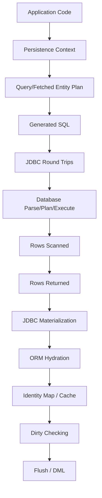
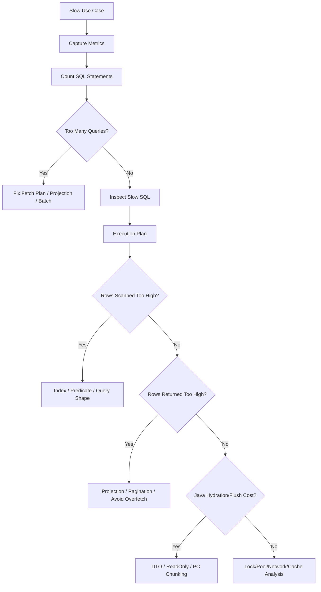

# Part 030 — Performance Engineering Playbook

> Target part ini: kamu bisa menganalisis, mengukur, dan memperbaiki performa Hibernate/EclipseLink secara sistematis. Fokusnya bukan “tambahkan cache” atau “pakai lazy”, tetapi membangun model biaya: **round trip, rows scanned, rows returned, objects hydrated, dirty checked, locks held, cache hit/miss, and memory pressure**.

ORM performance problem jarang disebabkan oleh satu hal. Biasanya kombinasi:

- query terlalu banyak,
- query terlalu besar,
- fetch plan salah,
- object graph terlalu luas,
- dirty checking terlalu mahal,
- batching tidak aktif,
- pagination salah,
- cache dipakai tanpa model invalidation,
- database index tidak cocok dengan query shape,
- transaction terlalu lama,
- serialization boundary memicu lazy load,
- report query memakai entity hydration,
- migration mengubah plan tanpa regression guard.

Senior engineer tidak “menebak tuning”. Senior engineer mengukur, membuat hipotesis, membuktikan dengan data, lalu menjaga regression.

---

## 1. Performance Mental Model

Setiap request ORM bisa dianalisis sebagai pipeline biaya:



Biaya utama:

| Cost | Contoh gejala |
|---|---|
| Round trips | N+1, loop lazy loading, no batching |
| Rows scanned | missing/wrong index, predicate tidak sargable |
| Rows returned | overfetching, join fetch cartesian explosion |
| Object hydration | entity query untuk report/projection |
| Dirty checking | persistence context terlalu besar |
| Flush cost | accidental update, large collection replacement |
| Lock cost | transaction panjang, pessimistic lock, DDL/backfill |
| Cache cost | low hit rate, stale invalidation, memory pressure |
| Serialization cost | entity graph bocor ke JSON/API layer |

Tuning tanpa mengetahui cost yang dominan biasanya salah arah.

---

## 2. Golden Rule: Measure Before Tuning

Pertanyaan pertama bukan “pakai cache apa?” tetapi:

```txt
Berapa query?
Query apa?
Berapa rows scanned?
Berapa rows returned?
Berapa entity hydrated?
Berapa collection fetched?
Berapa cache hit/miss?
Berapa flush?
Berapa update/delete/insert?
Berapa waktu di DB vs waktu di Java?
```

Minimal instrumentation:

- SQL logs with bind values in lower environment,
- Hibernate statistics or equivalent counters,
- EclipseLink profiler/performance monitor/logging,
- database execution plan,
- application timer around service method,
- connection pool metrics,
- JVM allocation/GC signals,
- query count regression tests.

Without measurement, “optimization” can become random mutation.

---

## 3. Query Count Budget

Setiap use case penting harus punya query budget.

Example:

```txt
Use case: Case dashboard page
Expected:
  - 1 query for case summary rows
  - 1 query for aggregated SLA counters
  - 0 lazy queries during JSON serialization
Budget: <= 3 SQL statements
```

Query count budget menangkap:

- N+1 regression,
- accidental lazy loading,
- entity graph regression,
- changed serialization behavior,
- new association access in mapper,
- cache dependency yang tidak disengaja.

Hibernate example:

```java
SessionFactory sessionFactory = entityManagerFactory.unwrap(SessionFactory.class);
Statistics stats = sessionFactory.getStatistics();
stats.clear();

service.loadDashboard(tenantId);

assertThat(stats.getPrepareStatementCount()).isLessThanOrEqualTo(3);
```

Jangan assert exact count untuk semua test; gunakan budget yang meaningful dan tidak terlalu rapuh.

---

## 4. N+1 Taxonomy

N+1 bukan satu bug. Ada beberapa bentuk.

| Type | Example | Fix candidate |
|---|---|---|
| To-one lazy N+1 | loop `task.getAssignee().getName()` | join fetch, batch fetch, DTO projection |
| To-many lazy N+1 | loop `case.getTasks().size()` | DTO aggregate, batch fetch, separate query |
| Serialization N+1 | JSON serializer touches lazy graph | DTO boundary, disable entity serialization |
| Mapper N+1 | MapStruct/manual mapper accesses association | projection or explicit fetch plan |
| Validation N+1 | business rule checks collection per entity | set-based query |
| Authorization N+1 | per-row access check loads owner/tenant | join predicate/read model |
| Cache-masked N+1 | works in warm cache, fails in cold cache | test cold cache, query budget |

N+1 fix is not always `JOIN FETCH`.

---

## 5. Join Fetch: Powerful but Dangerous

`JOIN FETCH` reduces round trips by loading association in same query.

```java
select c
from CaseFile c
join fetch c.owner
where c.id = :id
```

Good for:

- bounded to-one associations,
- small bounded collections,
- detail screen that genuinely needs the graph,
- avoiding lazy load after transaction boundary.

Dangerous for:

- multiple to-many collections,
- paginated parent queries,
- large collections,
- dashboard/report queries,
- high-cardinality associations.

### Cartesian Explosion

```java
select c
from CaseFile c
join fetch c.tasks
join fetch c.comments
where c.id = :id
```

If a case has 20 tasks and 30 comments, SQL may return 600 joined rows for one parent.

The ORM deduplicates parent entity identity, but it cannot erase the database/network/hydration cost.

Better:

```txt
Query 1: load case + to-one details
Query 2: load tasks
Query 3: load comments paginated or separately
```

One bigger query is not always faster than several bounded queries.

---

## 6. Batch Fetching: Fix Lazy N+1 Without Huge Join

Batch fetching loads multiple lazy associations by IDs in one query.

Hibernate:

```java
@BatchSize(size = 50)
@ManyToOne(fetch = FetchType.LAZY)
private User assignee;
```

or global:

```properties
hibernate.default_batch_fetch_size=50
```

Conceptual result:

```sql
select *
from users
where id in (?, ?, ?, ?, ...)
```

EclipseLink has batch reading/fetch hints such as batch fetching strategies depending on mapping/query.

Good for:

- repeated lazy access over many parents,
- to-one association lists,
- bounded collection loading,
- avoiding cartesian explosion.

Trade-offs:

- still lazy; access pattern matters,
- `IN` list size can become too large,
- database parameter limits matter,
- query plan can vary by list length,
- may hide poor read model design if used everywhere.

Rule:

> Batch fetch is a round-trip optimizer. It does not reduce total data needed; it changes how data is grouped.

---

## 7. Subselect Fetching

Hibernate subselect fetching can load collections for all parent rows returned by a previous query using a subselect.

Good for:

- one page/list of parents,
- same collection accessed for many parents,
- avoiding N+1 without join exploding parent rows.

Hazard:

- depends on previous query context,
- can load more than expected,
- may be hard to reason about in generic repository code,
- not portable across providers.

Use when query shape is stable and tested.

---

## 8. DTO Projection: Often the Fastest Read Path

Entity loading is expensive because ORM must:

- instantiate entity,
- hydrate fields,
- register in persistence context,
- maintain identity map,
- maybe create snapshot,
- maybe manage associations/proxies,
- possibly dirty-check later.

For read-only list/report/dashboard, DTO projection often wins.

```java
public record CaseDashboardRow(
    UUID id,
    String referenceNo,
    CaseStatus status,
    Instant createdAt,
    String assigneeName,
    long openTaskCount
) {}
```

JPQL constructor projection:

```java
select new com.acme.caseapp.CaseDashboardRow(
    c.id,
    c.referenceNo,
    c.status,
    c.createdAt,
    u.displayName,
    count(t.id)
)
from CaseFile c
left join c.assignee u
left join c.tasks t with t.status = 'OPEN'
where c.tenantId = :tenantId
group by c.id, c.referenceNo, c.status, c.createdAt, u.displayName
order by c.createdAt desc, c.id desc
```

Use DTO projection when:

- you do not intend to modify entity,
- screen needs subset/aggregate,
- result count is large,
- API boundary should not expose entity,
- query shape is part of use-case contract.

---

## 9. Read-Only Entity Queries

Sometimes you need entities but do not want dirty checking overhead.

Hibernate options include read-only query/session hints/modes. Conceptually:

```java
var query = entityManager.createQuery("select c from CaseFile c where c.status = :status", CaseFile.class);
query.setHint("org.hibernate.readOnly", true);
```

EclipseLink has read-only query hints and cache-related options.

Use read-only carefully:

- It is a performance hint/behavior, not domain permission.
- Do not mutate objects loaded read-only and expect update.
- Test provider-specific behavior.
- Prefer DTO for read models where possible.

---

## 10. Persistence Context Size

A large persistence context increases:

- memory usage,
- identity map lookup cost,
- dirty checking cost,
- flush cost,
- accidental update risk,
- GC pressure.

Bad batch import:

```java
for (CaseEvent event : events) {
    entityManager.persist(event);
}
entityManager.flush();
```

If `events` has 500,000 rows, the persistence context holds too much.

Better:

```java
int batchSize = 1000;
for (int i = 0; i < events.size(); i++) {
    entityManager.persist(events.get(i));

    if (i > 0 && i % batchSize == 0) {
        entityManager.flush();
        entityManager.clear();
    }
}
entityManager.flush();
entityManager.clear();
```

But `clear()` detaches entities. Do not use it blindly if later logic expects managed references.

---

## 11. Flush Cost and Accidental Updates

Flush checks pending changes and emits DML.

Unexpected flush can happen before query execution under AUTO flush mode.

Example:

```java
caseFile.setStatus(CaseStatus.ESCALATED);

List<CaseTask> tasks = entityManager.createQuery("""
    select t from CaseTask t where t.caseFile.id = :caseId
""", CaseTask.class).getResultList();
```

Provider may flush status update before running query to preserve query consistency.

Performance issue:

- write happens earlier than expected,
- locks may be acquired earlier,
- dirty checking happens before read query,
- failure appears in unrelated query line.

Mitigations:

- keep transactions short,
- separate read/write paths,
- avoid mutating managed entities before read-only queries,
- use flush mode intentionally,
- inspect flush count/statistics.

---

## 12. Collection Mutation Performance

Collections are common write amplification source.

Bad pattern:

```java
caseFile.setTasks(new HashSet<>(newTasks));
```

Depending on mapping/provider, replacing collection can cause:

- delete all join rows,
- insert all new rows,
- orphan deletes,
- unnecessary updates,
- version increment,
- cache invalidation.

Better domain methods:

```java
public void addTask(CaseTask task) {
    tasks.add(task);
    task.assignToCase(this);
}

public void removeTask(CaseTask task) {
    tasks.remove(task);
    task.unassignFromCase();
}
```

For large collections, do not model every operation as load-whole-collection.

Instead:

```java
@Modifying
@Query("""
    update CaseTask t
    set t.status = :newStatus
    where t.caseFile.id = :caseId
      and t.status = :oldStatus
""")
int transitionTasks(UUID caseId, TaskStatus oldStatus, TaskStatus newStatus);
```

Remember: bulk update bypasses persistence context synchronization and lifecycle callbacks. Clear/evict as needed.

---

## 13. Batching Writes

JDBC batching reduces round trips for similar DML.

Hibernate common settings:

```properties
hibernate.jdbc.batch_size=50
hibernate.order_inserts=true
hibernate.order_updates=true
```

Caveats:

- identity generator can prevent insert batching,
- mixed entity types reduce batching efficiency,
- flush order matters,
- versioned update batching requires provider settings/version support,
- database driver must support batching effectively,
- errors in batch can be harder to isolate.

EclipseLink supports batch writing configuration through persistence properties/session settings.

Batching is useful when:

- many inserts/updates/deletes,
- same SQL shape repeated,
- network round trip dominates,
- persistence context is chunked.

Batching will not fix:

- bad index,
- lock contention,
- trigger overhead,
- huge row payload,
- per-row business query inside loop.

---

## 14. Bulk JPQL and Native SQL

Bulk operations can be much faster than entity-by-entity mutation.

```java
int updated = entityManager.createQuery("""
    update CaseFile c
    set c.status = :closed
    where c.retentionExpiresAt < :now
      and c.status <> :closed
""")
.setParameter("closed", CaseStatus.CLOSED)
.setParameter("now", Instant.now())
.executeUpdate();
```

Cost advantage:

- no entity hydration,
- set-based database execution,
- fewer round trips.

Hazards:

- persistence context stale,
- lifecycle callbacks not called,
- Envers/domain events not automatic,
- optimistic lock/version not automatically handled the same way as entity updates,
- second-level/query cache invalidation needed,
- audit must be explicit.

Safe pattern:

```java
int updated = query.executeUpdate();
entityManager.clear();
cacheEvictionService.evictCaseFileRegions();
auditService.recordBulkTransition(...);
```

---

## 15. JDBC Fetch Size

JDBC fetch size controls how many rows the driver retrieves per network round trip/cursor fetch. It is different from ORM batch fetch.

| Setting | Meaning |
|---|---|
| JDBC fetch size | How rows are fetched from ResultSet |
| ORM batch fetch size | How lazy entities/collections are grouped by IDs |
| JDBC batch size | How repeated DML statements are sent |

Hibernate property:

```properties
hibernate.jdbc.fetch_size=1000
```

Query-level hint may also be possible depending on provider/integration.

Use fetch size for:

- streaming/reporting large result sets,
- reducing memory/network pressure,
- driver cursor behavior.

Caveats:

- driver behavior varies,
- some databases require transaction/cursor settings,
- too small causes many round trips,
- too large can increase memory pressure,
- does not reduce total rows returned.

---

## 16. Streaming Large Reads

Large read path should not load everything into persistence context.

Bad:

```java
List<CaseEvent> events = entityManager.createQuery("select e from CaseEvent e", CaseEvent.class)
        .getResultList();
```

Better options:

- keyset pagination,
- streaming query with periodic detach/clear,
- DTO/scalar projection,
- native cursor/fetch size,
- batch export table,
- database-side copy/export for massive jobs.

Hibernate example concept:

```java
try (Stream<CaseEvent> stream = entityManager
        .createQuery("select e from CaseEvent e order by e.id", CaseEvent.class)
        .setHint("org.hibernate.fetchSize", 1000)
        .getResultStream()) {

    AtomicInteger count = new AtomicInteger();
    stream.forEach(event -> {
        export(event);
        if (count.incrementAndGet() % 1000 == 0) {
            entityManager.detach(event);
        }
    });
}
```

For very large exports, DTO projection is usually safer:

```java
select new com.acme.ExportRow(e.id, e.type, e.occurredAt, e.payloadHash)
from CaseEvent e
where e.occurredAt >= :from
order by e.occurredAt, e.id
```

---

## 17. Pagination Correctness and Performance

Offset pagination:

```sql
limit 50 offset 100000
```

Problems:

- database may scan/sort many skipped rows,
- results shift while data changes,
- deep pages get slower,
- not stable without deterministic order.

Always include tie-breaker:

```java
order by c.createdAt desc, c.id desc
```

Keyset pagination:

```java
select c
from CaseFile c
where c.tenantId = :tenantId
  and (
    c.createdAt < :lastCreatedAt
    or (c.createdAt = :lastCreatedAt and c.id < :lastId)
  )
order by c.createdAt desc, c.id desc
```

Good for:

- infinite scroll,
- large datasets,
- operational inboxes,
- audit/event logs.

Harder for:

- random page number navigation,
- arbitrary sort columns,
- complex aggregated result.

Fetch join + pagination is dangerous when joining to-many collections because DB paginates rows, while ORM deduplicates parent entities after row retrieval. Use two-step pagination:

1. Query parent IDs for page.
2. Fetch details by IDs with explicit order.

```java
List<UUID> ids = entityManager.createQuery("""
    select c.id
    from CaseFile c
    where c.tenantId = :tenantId
    order by c.createdAt desc, c.id desc
""", UUID.class)
.setMaxResults(50)
.getResultList();

List<CaseFile> cases = entityManager.createQuery("""
    select distinct c
    from CaseFile c
    left join fetch c.assignee
    where c.id in :ids
""", CaseFile.class)
.setParameter("ids", ids)
.getResultList();
```

Then restore ordering in memory based on ID order, or use database-specific ordering expression.

---

## 18. Index-Aware ORM Query Design

ORM query must be written with index shape in mind.

Example index:

```sql
create index idx_case_inbox
on case_file (tenant_id, status, created_at desc, id desc);
```

Matching query:

```java
select c
from CaseFile c
where c.tenantId = :tenantId
  and c.status = :status
order by c.createdAt desc, c.id desc
```

Bad query shape:

```java
where lower(c.referenceNo) = lower(:referenceNo)
```

Unless functional index exists, this can defeat normal index.

Bad dynamic predicate:

```java
where (:status is null or c.status = :status)
```

This can produce weaker plans. For critical query paths, build different query shapes for different filter combinations.

Good mindset:

```txt
Query shape is an API contract between application and optimizer.
```

---

## 19. Sargability and Function Use

A predicate is sargable when the database can use an index efficiently.

Less sargable:

```sql
where date(created_at) = ?
```

Better:

```sql
where created_at >= ?
  and created_at < ?
```

Less sargable:

```sql
where lower(email) = lower(?)
```

Better if supported:

- normalized column `email_normalized`,
- functional index on `lower(email)`,
- case-insensitive column type/collation.

In JPQL, be careful with functions:

```java
where function('date', c.createdAt) = :date
```

This may be correct semantically but expensive operationally.

---

## 20. Cache as Performance Tool: Use After Correctness Model

Cache can reduce database load. Cache can also return wrong data faster.

Before enabling second-level/shared cache, define:

```txt
[ ] Data volatility
[ ] Staleness tolerance
[ ] Invalidation source
[ ] Cluster coordination
[ ] Multi-tenant isolation
[ ] Authorization boundary
[ ] Bulk/native update behavior
[ ] Region size/TTL
[ ] Hit/miss metrics
```

Good cache candidates:

- country/reference table,
- stable product/config lookup,
- permission-independent metadata,
- small mostly-read entities.

Bad cache candidates:

- case file with frequent workflow transitions,
- user-specific authorization-dependent projection,
- high-cardinality low-reuse data,
- data updated by external systems without invalidation,
- tenant-sensitive data without cache key isolation.

Measure:

```txt
hit rate, miss rate, put count, eviction count, stale incident count, memory footprint
```

A cache with low hit rate and high invalidation cost is negative performance.

---

## 21. Query Cache Skepticism

Hibernate query cache caches query result identifiers, not the full arbitrary result as many people imagine. It also depends on invalidation of affected regions.

Query cache can help when:

- exact same query repeats often,
- parameters repeat,
- underlying data changes rarely,
- result set is bounded,
- entity regions are also cache-friendly.

Query cache hurts when:

- parameters are high-cardinality,
- data changes frequently,
- invalidation is broad,
- result set is large,
- cache memory pressure increases,
- stale tolerance is misunderstood.

For dashboards, often better:

- materialized read model,
- precomputed counters,
- targeted index,
- explicit application cache with domain invalidation.

---

## 22. Connection Pool and Transaction Time

ORM performance is also constrained by connection pool.

Symptoms:

- threads wait for connection,
- DB CPU low but app latency high,
- long transactions hold connections while doing remote calls,
- pool exhausted during report/export,
- leak detection fires.

Bad:

```java
@Transactional
public void processCase(UUID id) {
    CaseFile c = repository.getReferenceById(id);
    externalRiskApi.call(c.getSubject()); // remote call inside transaction
    c.escalate();
}
```

Better:

```txt
1. Read required data.
2. End transaction.
3. Call external service.
4. Start short transaction.
5. Re-read/lock/version-check.
6. Apply mutation.
```

Transaction time affects:

- connection occupancy,
- lock duration,
- persistence context size,
- stale data probability,
- deadlock risk.

---

## 23. Optimistic Locking Performance

Optimistic locking prevents lost updates, but conflicts can increase retry cost.

High conflict entity:

```java
@Entity
class CaseFile {
    @Version
    long version;

    int openTaskCount;
    Instant lastViewedAt;
    CaseStatus status;
}
```

If many unrelated updates touch same row, version conflicts rise.

Solutions:

- move noisy fields to separate table,
- avoid updating `lastViewedAt` on hot aggregate row,
- use append-only event table,
- use atomic SQL update for counters,
- partition aggregate responsibilities,
- use pessimistic lock only for short critical sections.

Performance problem is often aggregate design problem.

---

## 24. Pessimistic Locking and Deadlock

Pessimistic locks can be necessary, but they amplify latency.

Rules:

```txt
[ ] Lock in consistent order.
[ ] Keep transaction short.
[ ] Avoid user/remote call while lock held.
[ ] Set lock timeout.
[ ] Monitor deadlock/timeout metrics.
[ ] Prefer set-based invariant where possible.
```

Example:

```java
CaseFile c = entityManager.find(
    CaseFile.class,
    id,
    LockModeType.PESSIMISTIC_WRITE,
    Map.of("jakarta.persistence.lock.timeout", 1000)
);
```

If lock contention is high, ask:

- Is aggregate too coarse?
- Can transition be idempotent?
- Can command be queued/serialized per aggregate?
- Can invariant be enforced by unique constraint?
- Can event sourcing/outbox reduce row mutation?

---

## 25. Hydration Cost and Entity Width

Wide entity is expensive even when query is selective.

Example entity:

```java
@Entity
class CaseFile {
    UUID id;
    String referenceNo;
    String subject;
    String description;
    String legalNarrative;
    String internalMemo;
    JsonNode riskPayload;
    byte[] attachmentPreview;
}
```

List page needs only:

```txt
id, referenceNo, subject, status, createdAt
```

Loading full entity hydrates unnecessary columns.

Fixes:

- DTO projection,
- split large rarely-used fields to secondary table/entity,
- lazy basic fields where provider/enhancement supports and is tested,
- read model table,
- avoid LOB in hot entity.

Be skeptical of `@Basic(fetch = LAZY)` unless bytecode weaving/enhancement is configured and verified.

---

## 26. Large Collections

Large `@OneToMany` is a performance trap.

Problem:

```java
caseFile.getEvents().size();
```

This may load huge collection or trigger count depending on provider/collection state/mapping.

Better:

```java
select count(e)
from CaseEvent e
where e.caseFile.id = :caseId
```

For timeline:

```java
select e
from CaseEvent e
where e.caseFile.id = :caseId
order by e.occurredAt desc, e.id desc
```

with pagination.

Rule:

> If a collection can grow without a small upper bound, do not treat it as in-memory object collection for normal operations.

Model it as queryable child resource.

---

## 27. Entity Graph Performance

Entity graph is useful to control fetch per use case.

```java
EntityGraph<CaseFile> graph = entityManager.createEntityGraph(CaseFile.class);
graph.addAttributeNodes("assignee", "regulatoryProfile");

CaseFile c = entityManager.find(
    CaseFile.class,
    id,
    Map.of("jakarta.persistence.fetchgraph", graph)
);
```

Benefits:

- avoids hardcoding fetch into mapping,
- use-case-specific loading,
- can reduce lazy boundary issues.

Hazards:

- graph can become too broad,
- provider interpretation can differ,
- nested collection graph can explode rows/queries,
- hard to see SQL without logging/tests.

Always pair entity graph with query count/SQL shape test.

---

## 28. Native SQL for Performance-Critical Paths

Native SQL is not failure. Native SQL is sometimes the correct abstraction.

Use native SQL when:

- window functions are central,
- recursive CTE needed,
- database-specific index/operator needed,
- report query does not map naturally to entity graph,
- bulk operation needs database feature,
- query plan must be hand-shaped.

Example:

```sql
select *
from (
  select c.id,
         c.reference_no,
         c.status,
         row_number() over (
           partition by c.tenant_id
           order by c.created_at desc, c.id desc
         ) as rn
  from case_file c
  where c.tenant_id = ?
) x
where x.rn <= 100;
```

Keep native SQL disciplined:

- isolate in repository/read model class,
- map to DTO, not managed entity unless needed,
- integration test against production DB,
- document database dependency,
- monitor plan after database upgrades.

---

## 29. Performance Triage Workflow

Use a repeatable triage sequence.



Do not start by changing random annotations.

---

## 30. Scenario Playbooks

### Scenario A — Dashboard Suddenly Slow

Check:

```txt
[ ] Query count changed?
[ ] Mapper accesses new lazy association?
[ ] Entity graph changed?
[ ] New join fetch added?
[ ] Query plan changed after migration?
[ ] Index missing in staging/prod?
[ ] Cache cold after deploy?
```

Likely fixes:

- DTO projection,
- two-step pagination,
- add/review index,
- remove broad fetch graph,
- aggregate counters into read model.

### Scenario B — Batch Import Too Slow

Check:

```txt
[ ] JDBC batching enabled?
[ ] Identifier strategy prevents batching?
[ ] Persistence context cleared periodically?
[ ] Per-row select inside loop?
[ ] Unique constraint checks causing random lookup?
[ ] Indexes too many for write-heavy table?
[ ] Transaction too large?
```

Likely fixes:

- sequence/pooled IDs,
- `hibernate.jdbc.batch_size`,
- flush/clear chunks,
- prefetch reference data map,
- bulk insert/native loader,
- idempotent chunking.

### Scenario C — Memory Spikes During Export

Check:

```txt
[ ] getResultList loads all rows?
[ ] Managed entities retained in persistence context?
[ ] LOB/JSON columns loaded unnecessarily?
[ ] Fetch size configured?
[ ] Serialization buffers too large?
```

Likely fixes:

- streaming/keyset pagination,
- DTO projection,
- detach/clear,
- JDBC fetch size,
- database-native export.

### Scenario D — Deadlocks after New Feature

Check:

```txt
[ ] New transaction touches rows in inconsistent order?
[ ] New FK/index changed lock order?
[ ] Pessimistic lock added?
[ ] Batch update order random?
[ ] Long transaction includes remote call?
```

Likely fixes:

- consistent ordering,
- shorter transaction,
- ordered updates,
- retry policy,
- reduce aggregate hot row,
- unique constraint instead of explicit lock.

---

## 31. Hibernate-Specific Performance Levers

Common Hibernate levers:

| Lever | Use |
|---|---|
| `hibernate.generate_statistics` | collect performance counters |
| `hibernate.jdbc.batch_size` | DML batching |
| `hibernate.order_inserts` | improve insert batch grouping |
| `hibernate.order_updates` | improve update batch grouping and reduce deadlock risk |
| `hibernate.default_batch_fetch_size` | reduce lazy N+1 |
| `@BatchSize` | targeted batch fetch |
| `@Fetch(SUBSELECT)` | collection fetch by previous parent query |
| `@Immutable` | reduce dirty checking/update expectation for immutable entity |
| read-only query hint | avoid dirty tracking for read path |
| `StatelessSession` | high-volume stream/batch without persistence context semantics |
| second-level cache | repeated reference entity reads |
| query cache | repeated stable query result IDs; use carefully |
| `StatementInspector` | SQL annotation/inspection |

Do not enable all levers globally. Each lever should map to a measured problem.

---

## 32. EclipseLink-Specific Performance Levers

Common EclipseLink levers:

| Lever | Use |
|---|---|
| logging/profiler/performance monitor | observe query/build/cache timings |
| batch reading/fetch hints | reduce N+1 |
| join fetch hints | explicit join fetching |
| fetch groups | partial object loading/read use case shaping |
| shared cache settings | reference/stable entity caching |
| isolated cache | correctness for sensitive/volatile data |
| batch writing | reduce DML round trips |
| weaving/indirection | lazy loading and change tracking support |
| descriptor/session customizers | provider-level behavior tuning |
| database platform settings | database-specific SQL generation behavior |

As with Hibernate, provider-specific performance optimization must be tested and documented because portability cost is real.

---

## 33. Performance Regression Harness

A good regression harness has:

```txt
[ ] query count budgets for critical use cases
[ ] max row count/fixture shape that reveals N+1
[ ] cache cold and warm tests
[ ] pagination correctness tests
[ ] generated SQL smoke tests for key paths
[ ] execution plan checks for top queries where possible
[ ] batch job throughput smoke
[ ] memory/GC guard for export/import
[ ] provider-specific tagged tests
```

Test fixture must be shaped to reveal problems:

```txt
Tenant A: 50 cases
Each case: 5 tasks, 3 comments, 2 assignments
Tenant B: same IDs impossible but similar data
Some cases: no assignee
Some cases: 1000 events
Some users: inactive/deleted
Some statuses: rare/high cardinality
```

A fixture with one parent and one child hides N+1 and cartesian explosion.

---

## 34. Capacity Thinking

Performance target must be tied to traffic and data growth.

Example:

```txt
Use case: regulatory case inbox
Current: 200k cases, 2M tasks
Growth: 20k cases/month
SLO: p95 < 300ms
Traffic: 50 rps peak
Access: tenant-scoped
Sort: created_at desc
Filters: status, assignee, risk band
```

From this, derive:

- index strategy,
- query shape,
- pagination strategy,
- DTO projection,
- cache/no-cache decision,
- max result size,
- backfill/index maintenance budget,
- test data volume.

ORM performance cannot be separated from product access pattern.

---

## 35. Performance Review Checklist

Use this before approving ORM-heavy code.

```txt
Use Case Shape
[ ] Is this read, write, report, export, or batch path?
[ ] Expected row count and cardinality known?
[ ] Entity graph truly needed or DTO enough?

SQL / Fetch
[ ] Query count budget defined?
[ ] N+1 tested?
[ ] Join fetch does not create cartesian explosion?
[ ] Pagination deterministic and safe?
[ ] Query shape matches indexes?

Persistence Context
[ ] Read-only path avoids unnecessary dirty checking?
[ ] Batch path flushes/clears safely?
[ ] Large collection not loaded accidentally?

Write Path
[ ] JDBC batching considered for high volume?
[ ] Identifier strategy compatible with batching?
[ ] Bulk update clears context and handles audit/cache?
[ ] Lock order and transaction length reviewed?

Cache
[ ] Cache has correctness model?
[ ] Hit/miss observable?
[ ] Invalidation path exists?
[ ] Tenant/security boundary safe?

Operations
[ ] Metrics/logging enough for incident triage?
[ ] Regression test covers query count/fetch plan?
[ ] Execution plan reviewed for top queries?
```

---

## 36. Practice Lab

### Lab 1 — Catch N+1 with Query Budget

1. Create 20 `CaseFile` rows.
2. Each has 3 `CaseTask` rows and one assignee.
3. Implement dashboard mapper that accesses assignee name.
4. Assert query count budget.
5. Break it with lazy access in loop.
6. Fix with DTO projection or batch fetch.

### Lab 2 — Compare Join Fetch vs DTO Projection

1. Create case with 20 tasks and 30 comments.
2. Query with two join fetch collections.
3. Count returned SQL rows/logs.
4. Replace with separate DTO queries.
5. Compare latency and object hydration.

### Lab 3 — Batch Insert Throughput

1. Insert 50,000 events with identity ID.
2. Measure time and statement count.
3. Switch to sequence/pooled strategy where database supports it.
4. Enable JDBC batching.
5. Flush/clear every 1000 rows.
6. Compare throughput.

### Lab 4 — Keyset Pagination

1. Create 100,000 case rows.
2. Implement offset pagination deep page.
3. Implement keyset pagination.
4. Compare execution plan and latency.
5. Add deterministic tie-breaker.

### Lab 5 — Cache Correctness Before Performance

1. Cache a reference entity.
2. Update it via native SQL.
3. Observe stale read.
4. Add eviction.
5. Measure hit/miss after fix.

---

## 37. Key Takeaways

- ORM performance must be explained by cost model: round trips, rows scanned, rows returned, hydration, dirty checking, flush, locks, cache, and memory.
- Query count budget is one of the most effective guards against ORM regressions.
- N+1 has multiple forms; `JOIN FETCH` is only one fix and can create cartesian explosion.
- DTO projection is often the correct read model for dashboards/reports/API lists.
- Large persistence contexts create dirty-checking, memory, and accidental update costs.
- JDBC fetch size, ORM batch fetch size, and JDBC batch size solve different problems.
- Bulk operations are fast but bypass persistence context, callbacks, audit, and cache invalidation.
- Pagination must be deterministic; deep offset pagination often needs keyset pagination.
- Cache should be introduced only after correctness, invalidation, tenant/security, and observability are clear.
- Provider-specific levers are powerful but must be tested and documented.
- Performance engineering is a loop: measure, hypothesize, change one thing, verify, and guard with regression tests.

---

## 38. References

- Hibernate ORM User Guide 7.4.x — fetching, batching, statistics, second-level cache, query cache, flush, JDBC settings, `StatelessSession`, fetch profiles, SQL logging.
- Hibernate ORM Javadocs — `SessionFactory`, `Statistics`, `StatementInspector`, query/session APIs, `@BatchSize`.
- Jakarta Persistence 3.2 Specification — query execution, pagination, locking, entity graph, persistence context, cache modes, bulk operations.
- EclipseLink Documentation — logging, profiling, performance monitor, batch reading, join fetching, fetch groups, shared cache, batch writing, weaving.
- Database vendor documentation — execution plans, online index creation, cursor/fetch behavior, lock behavior, transaction isolation.
