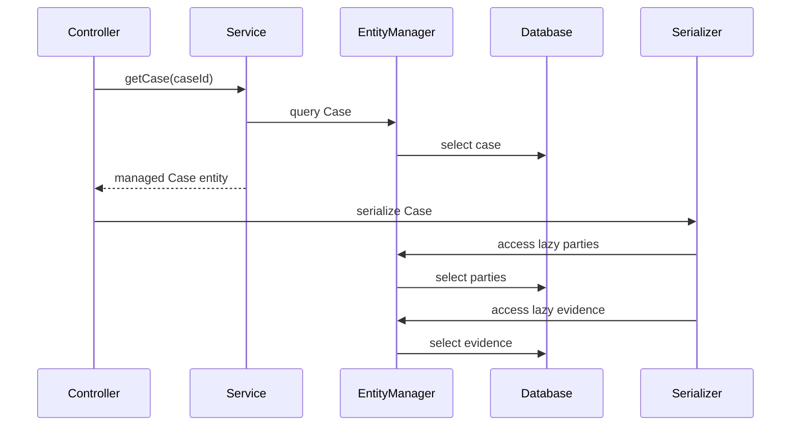
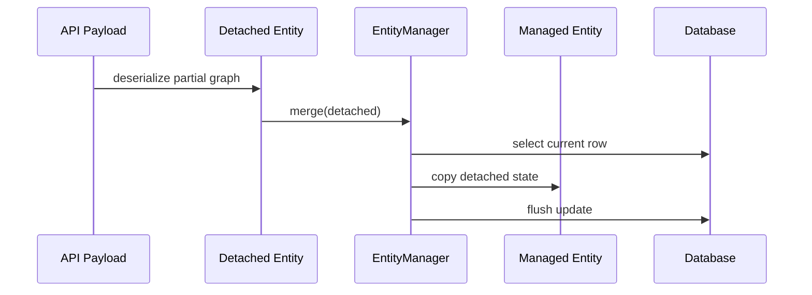

# Part 031 — Failure Modes and Anti-Patterns Catalog

> Target part ini: kamu bisa mengenali failure mode ORM dari gejala production, menelusuri akar masalahnya ke mapping/fetch/transaction/cache/provider behavior, lalu memilih remediation yang aman. Ini bukan daftar “jangan lakukan X” secara dogmatis. Ini katalog diagnosis untuk engineer yang harus menjaga sistem nyata.

ORM jarang gagal sebagai “ORM error” yang jelas. Ia lebih sering muncul sebagai:

- latency naik perlahan setelah data membesar,
- endpoint kadang menembak ratusan query,
- update tidak tersimpan walau object berubah,
- data terlihat stale setelah bulk operation,
- audit hilang untuk beberapa update,
- deadlock hanya terjadi di jam sibuk,
- optimistic lock exception muncul di workflow tertentu,
- JSON serialization tiba-tiba melakukan query,
- cache membuat authorization boundary bocor,
- migration provider membuat query berubah bentuk.

Senior engineer tidak hanya hafal anti-pattern. Senior engineer tahu **invariant yang dilanggar**, **bagaimana membuktikannya**, dan **remediation yang tidak memindahkan masalah ke tempat lain**.

---

## 1. Failure Mode Taxonomy

```mermaid
flowchart TD
  A[ORM Failure Mode] --> B[Mapping Shape]
  A --> C[Fetch Shape]
  A --> D[State / Dirty Checking]
  A --> E[Transaction Boundary]
  A --> F[Cache Correctness]
  A --> G[Provider Extension]
  A --> H[Testing Blind Spot]
  A --> I[Database Interaction]

  B --> B1[Wrong ownership]
  B --> B2[Cascade abuse]
  B --> B3[Large collection mapping]

  C --> C1[N+1]
  C --> C2[Cartesian explosion]
  C --> C3[Pagination hazard]

  D --> D1[Detached merge hazard]
  D --> D2[Mutable value false negative]
  D --> D3[Accidental update]

  E --> E1[OSIV]
  E --> E2[Transaction leakage]
  E --> E3[Lock held too long]

  F --> F1[Stale reads]
  F --> F2[Query cache lies]
  F --> F3[Tenant/auth leakage]

  G --> G1[Hibernate-only behavior]
  G --> G2[EclipseLink-only behavior]

  H --> H1[H2 false confidence]
  H --> H2[No SQL count assertions]
  H --> H3[No concurrency tests]

  I --> I1[Wrong index]
  I --> I2[Flush order constraint]
  I --> I3[Batch disabled]
```



A practical triage question:

> Is the problem caused by **too many database interactions**, **wrong database interactions**, **wrong object state**, or **wrong consistency boundary**?

That question prevents random tuning.

---

## 2. Anti-Pattern: Open Session in View / Open EntityManager in View

### What it looks like

A web request keeps the persistence context open until response rendering is finished. Lazy associations can load during controller serialization, template rendering, JSON conversion, logging, or mapper execution.

Symptoms:

- SQL queries appear after service method returns.
- Controller or JSON serializer triggers lazy loading.
- Query count depends on response shape.
- Latency is unstable because view/model traversal performs database calls.
- Transaction boundary and read boundary become unclear.
- `LazyInitializationException` disappears, but hidden database access grows.

### Broken invariant

A service boundary should define what data is loaded and why. OSIV breaks this invariant:

> Data access becomes an accidental side effect of object traversal.



The controller did not intentionally query parties/evidence. It merely touched fields.

### Hibernate-specific failure

Hibernate often exposes this through `LazyInitializationException` when the persistence context is closed. OSIV avoids the exception by keeping the session open, but this may hide the design failure.

### EclipseLink-specific note

EclipseLink uses weaving/indirection to support lazy relationships. Keeping a context/session boundary too wide still allows late database access through indirection values.

### Detection

Add tests that assert:

- query count inside service method,
- no SQL during serialization,
- DTO contains only explicitly loaded fields,
- lazy access after service boundary fails in test unless explicitly initialized.

### Better pattern

Use explicit read boundaries:

```java
public CaseDetailView getCaseDetail(CaseId id) {
    CaseDetailView view = caseQueries.fetchCaseDetail(id);
    return view;
}
```

The output shape is now a query contract.

### Remediation strategy

1. Disable OSIV for new services/endpoints.
2. Identify endpoints depending on lazy serialization.
3. Replace entity response with DTO/read model.
4. Add SQL-count regression tests.
5. Use entity graphs/fetch joins/projections deliberately.
6. Fail fast at the boundary when a lazy field is accessed unexpectedly.

---

## 3. Anti-Pattern: `EAGER` by Default

### What it looks like

Associations are marked `FetchType.EAGER` because developers want to avoid lazy-loading errors.

```java
@ManyToOne(fetch = FetchType.EAGER)
private Customer customer;

@OneToMany(mappedBy = "caseFile", fetch = FetchType.EAGER)
private List<Evidence> evidence;
```

Symptoms:

- Simple query loads large graph.
- Query shape changes when adding a field to entity.
- Pagination becomes unstable or expensive.
- DTO endpoint hydrates entities it never uses.
- Memory spikes on list endpoints.

### Broken invariant

Default mapping should not encode one use case's fetch requirement globally.

Fetch requirement belongs to a use case, not the entity class.

### Why it is dangerous

`EAGER` is not equivalent to “join fetch once”. Providers may satisfy eager fetching with joins, additional selects, batch loading, or provider-specific plans. You lose precise query-shape control.

### Better pattern

Default to lazy for associations where provider can support it, then use per-query fetch planning:

```java
@Query("""
    select c
    from CaseFile c
    join fetch c.primaryParty
    where c.id = :id
""")
CaseFile findDetail(@Param("id") UUID id);
```

or DTO projection:

```java
select new com.acme.CaseSummary(c.id, c.referenceNo, p.name)
from CaseFile c
join c.primaryParty p
where c.status = :status
```

### Decision rule

Use eager only when all are true:

- association is always needed with parent,
- cardinality is small and bounded,
- lifecycle is tightly coupled,
- query shape remains stable under list endpoints,
- performance tests prove it does not overfetch.

In real enterprise systems, that set is rare.

---

## 4. Anti-Pattern: Cascade Everywhere

### What it looks like

```java
@OneToMany(mappedBy = "caseFile", cascade = CascadeType.ALL)
private List<Task> tasks;

@ManyToOne(cascade = CascadeType.ALL)
private Officer assignedOfficer;
```

Developers add cascade to make persistence “just work”.

Symptoms:

- saving one aggregate accidentally saves unrelated reference data,
- deleting a parent deletes shared child/reference entities,
- detached graph merge updates more rows than expected,
- transaction flush touches huge object graphs,
- audit shows unrelated updates in same request.

### Broken invariant

Cascade should represent lifecycle ownership.

It should not represent convenience.

### Cascade correctness table

| Association | Cascade likely? | Reason |
|---|---:|---|
| `Order -> OrderLine` | Yes | Child has no independent lifecycle |
| `CaseFile -> Evidence` | Maybe | Depends on retention/legal lifecycle |
| `Task -> Officer` | No | Officer is shared identity/reference |
| `Invoice -> Currency` | No | Reference data |
| `Customer -> Address` | Maybe | Depends whether address is value-like or shared |

### Safer mapping

```java
@OneToMany(mappedBy = "caseFile", cascade = {PERSIST, MERGE}, orphanRemoval = true)
private List<CaseNote> notes = new ArrayList<>();

@ManyToOne(fetch = LAZY, optional = false)
private Officer assignedOfficer;
```

Reference entities should usually be attached by ID/reference:

```java
Officer officerRef = entityManager.getReference(Officer.class, command.officerId());
task.assignTo(officerRef);
```

### Debugging checklist

- Which entity owns the lifecycle?
- Can the child exist without the parent?
- Is the child shared by another aggregate?
- Does delete mean physical delete, soft delete, archival, or legal retention?
- Does merge traverse a graph that includes this association?
- Is cascade needed for persist only, merge only, remove, refresh, detach?

---

## 5. Anti-Pattern: `merge` as Generic Update API

### What it looks like

```java
@Transactional
public CaseFile update(CaseFile detached) {
    return entityManager.merge(detached);
}
```

The app accepts detached entity graphs from API/UI/messaging and calls `merge`.

Symptoms:

- fields overwritten with `null`,
- child collections replaced,
- stale detached data wins over current managed data,
- unexpected cascade merge,
- optimistic lock exceptions occur late,
- authorization is bypassed because graph carries fields the user should not modify.

### Broken invariant

Update APIs should express intent. A detached entity graph does not distinguish:

- field intentionally changed,
- field omitted by client,
- field stale,
- field unauthorized,
- collection intentionally replaced,
- collection not loaded.

### Why `merge` is tricky

`merge` copies detached state into a managed instance. The detached instance itself does not become managed. If cascades exist, merge can traverse associations and copy a much wider graph than intended.



### Better pattern: command-based update

```java
@Transactional
public void changeCasePriority(ChangePriorityCommand command) {
    CaseFile caseFile = caseRepository.getForUpdate(command.caseId());
    caseFile.changePriority(command.newPriority(), command.reason(), command.actor());
}
```

Benefits:

- managed entity is loaded inside transaction,
- update is intentional,
- authorization can be checked before mutation,
- version check is meaningful,
- audit can capture command reason,
- associations are not accidentally overwritten.

### When `merge` is acceptable

`merge` is acceptable when:

- detached graph is complete and trusted,
- ownership and cascade are deliberate,
- version field is present,
- update semantics are replacement semantics,
- tests cover lost update and collection replacement.

That is narrower than many teams assume.

---

## 6. Anti-Pattern: Exposing Entities over REST/GraphQL/Messaging

### What it looks like

```java
@GetMapping("/cases/{id}")
public CaseFile get(@PathVariable UUID id) {
    return caseRepository.findById(id).orElseThrow();
}
```

Symptoms:

- lazy loading during serialization,
- infinite recursion in bidirectional associations,
- provider proxy types leak to JSON,
- internal fields become API contract,
- API changes when mapping changes,
- clients can infer fields they should not know,
- patch/update endpoints deserialize entities and call merge.

### Broken invariant

Persistence model is not API model.

An entity is a mutable persistence boundary. An API response is a stable external contract.

### Better pattern

```java
public record CaseDetailResponse(
    UUID id,
    String referenceNo,
    String status,
    List<PartySummary> parties,
    List<TaskSummary> openTasks
) {}
```

Use query/projection/entity graph to fill the response deliberately.

### Risk in regulated systems

In case-management, enforcement, banking, or telecom domains, entity leakage can expose:

- internal workflow state,
- audit fields,
- risk score components,
- internal notes,
- soft-deleted data,
- cross-tenant identifiers,
- enforcement strategy metadata.

That is not a serialization problem. It is a boundary failure.

---

## 7. Anti-Pattern: Wrong `equals` / `hashCode` on Entities

### What it looks like

```java
@Override
public boolean equals(Object o) {
    if (this == o) return true;
    if (!(o instanceof CaseFile other)) return false;
    return Objects.equals(id, other.id);
}

@Override
public int hashCode() {
    return Objects.hash(id);
}
```

This seems reasonable, but fails when `id` is generated after persist.

Symptoms:

- entity disappears from `HashSet`,
- duplicate children in collection,
- `remove` fails from `Set`,
- proxy equality behaves unexpectedly,
- transient entities with null IDs compare equal if implemented poorly.

### Broken invariant

Hash code must not change while object is inside a hash-based collection.

Generated ID appears after persist/flush. Therefore ID-based hash can change during entity lifecycle.

### Safer options

Option A: use immutable natural key when it truly exists.

```java
@Override
public boolean equals(Object o) {
    if (this == o) return true;
    if (!(o instanceof Country other)) return false;
    return code.equals(other.code);
}

@Override
public int hashCode() {
    return code.hashCode();
}
```

Option B: avoid entity equality for mutable aggregate entities and prefer `List` or domain-specific identity checks.

Option C: use provider-safe pattern with stable class handling and non-changing hash strategy, but validate carefully with proxies.

### Senior-level rule

Do not design entity equality casually. It affects:

- collections,
- dirty checking,
- orphan removal,
- caching,
- merge,
- proxy comparisons,
- test stability.

---

## 8. Anti-Pattern: Large `@OneToMany` Collections

### What it looks like

```java
@Entity
class CaseFile {
    @OneToMany(mappedBy = "caseFile")
    private List<AuditEvent> auditEvents;
}
```

At small data sizes, this is convenient. At production scale, a case may have thousands or millions of audit events.

Symptoms:

- loading parent risks loading huge collection accidentally,
- collection dirty checking is expensive,
- pagination over children is difficult,
- delete/orphan operations are expensive,
- memory spikes,
- join fetch is impossible safely,
- serialization accidentally returns massive graph.

### Broken invariant

A collection property implies the collection is a manageable part of the object graph. Very large child sets are not object graph state; they are queryable datasets.

### Better pattern

Model child table as independent query boundary:

```java
public interface AuditEventQueries {
    Page<AuditEventRow> findByCaseId(UUID caseId, PageRequest pageRequest);
}
```

Entity may keep no collection or only a bounded current subset:

```java
@OneToMany(mappedBy = "caseFile")
@Where(clause = "status = 'OPEN'") // Hibernate-specific example; use carefully
private Set<OpenTask> openTasks;
```

But provider-specific filters should be isolated and tested.

### Decision rule

Use parent collection when:

- cardinality is bounded by business invariant,
- collection is part of aggregate mutation,
- loading it is usually intentional,
- write amplification is acceptable.

Use query boundary when:

- cardinality grows over time,
- collection is mostly read/report/history,
- pagination is required,
- retention/audit rules apply.

---

## 9. Anti-Pattern: `@ManyToMany` as Domain Shortcut

### What it looks like

```java
@ManyToMany
@JoinTable(name = "case_officer")
private Set<Officer> officers;
```

Symptoms:

- cannot store assignment reason/date/role/status,
- removal semantics are unclear,
- audit trail is weak,
- unique constraints are under-modeled,
- lifecycle of relationship is invisible,
- bulk association changes delete/insert join rows without domain events.

### Broken invariant

If the relationship has meaning, it is an entity.

### Better pattern

```java
@Entity
class CaseAssignment {
    @ManyToOne(fetch = LAZY, optional = false)
    private CaseFile caseFile;

    @ManyToOne(fetch = LAZY, optional = false)
    private Officer officer;

    @Enumerated(STRING)
    private AssignmentRole role;

    private Instant assignedAt;
    private Instant revokedAt;
}
```

Now the relationship can carry:

- effective dates,
- role,
- source command,
- audit metadata,
- status,
- version,
- soft delete,
- constraints.

This is essential in regulated systems.

---

## 10. Anti-Pattern: Collection Replacement Instead of Mutating Owned Children

### What it looks like

```java
caseFile.setTasks(newTasksFromRequest);
```

Symptoms:

- delete-all/insert-all behavior,
- orphan removal surprises,
- child IDs lost,
- audit history unclear,
- optimistic locking conflicts increase,
- Hibernate collection wrapper replaced,
- EclipseLink indirection collection behavior changes.

### Broken invariant

Persistent collections are provider-managed structures. Replacing the collection object is not the same as applying a domain diff.

### Better pattern

Apply explicit diff:

```java
public void replaceTasks(List<TaskCommand> commands) {
    Map<UUID, Task> existing = tasks.stream()
        .filter(t -> t.id() != null)
        .collect(toMap(Task::id, identity()));

    for (TaskCommand command : commands) {
        Task task = existing.remove(command.id());
        if (task == null) {
            addTask(Task.create(command));
        } else {
            task.updateFrom(command);
        }
    }

    existing.values().forEach(this::removeTask);
}
```

This preserves identity, audit, and lifecycle rules.

---

## 11. Anti-Pattern: Hidden N+1 in Loops

### What it looks like

```java
List<CaseFile> cases = caseRepository.findOpenCases();
for (CaseFile c : cases) {
    log.info("{} {}", c.getReferenceNo(), c.getPrimaryParty().getName());
}
```

Symptoms:

- query count equals `1 + N`,
- endpoint performance degrades with page size,
- DB CPU/network increases,
- caches hide issue in dev but not production,
- batch fetch improves but does not solve wrong boundary.

### Broken invariant

A loop over result rows should not accidentally create per-row database access.

### Detection

SQL-count test:

```java
@Test
void openCaseListUsesConstantQueryCount() {
    statistics.clear();

    service.getOpenCaseList();

    assertThat(statistics.getPrepareStatementCount())
        .isLessThanOrEqualTo(2);
}
```

### Remediation options

| Option | Use when | Risk |
|---|---|---|
| `JOIN FETCH` | small to-one or bounded collection needed | duplicates/cartesian explosion |
| Batch fetch | many lazy to-one/to-many accessed later | still multiple queries |
| Entity graph | use-case fetch plan wants provider-managed loading | provider differences |
| DTO projection | read endpoint needs fixed shape | not for mutation |
| Separate query | child collection is large/paged | more code, clearer model |

### Senior-level rule

N+1 is not solved by “make everything eager”. It is solved by making query shape explicit per use case.

---

## 12. Anti-Pattern: Fetch Join + Pagination on Collections

### What it looks like

```java
select c
from CaseFile c
join fetch c.tasks
where c.status = :status
order by c.createdAt desc
```

Then pagination is applied.

Symptoms:

- fewer parent rows than page size,
- duplicate parents,
- huge row result before in-memory deduplication,
- provider warning/error,
- unstable pages when child cardinality changes.

### Broken invariant

Pagination should apply to parent rows, not exploded parent-child rows.

### Better pattern: two-step page

```java
List<UUID> ids = entityManager.createQuery("""
    select c.id
    from CaseFile c
    where c.status = :status
    order by c.createdAt desc, c.id desc
""", UUID.class)
.setFirstResult(offset)
.setMaxResults(limit)
.getResultList();

List<CaseFile> cases = entityManager.createQuery("""
    select distinct c
    from CaseFile c
    left join fetch c.tasks
    where c.id in :ids
""", CaseFile.class)
.setParameter("ids", ids)
.getResultList();
```

Then restore original order in memory.

For large list views, DTO projection is usually better.

---

## 13. Anti-Pattern: Bulk Update Without Persistence Context and Cache Cleanup

### What it looks like

```java
entityManager.createQuery("""
    update CaseFile c
    set c.status = :closed
    where c.expiryDate < :today
""")
.executeUpdate();
```

Symptoms:

- managed entities still show old state,
- second-level/shared cache returns stale data,
- lifecycle callbacks do not run,
- audit hooks do not fire,
- version field is not automatically handled unless explicitly updated,
- business invariants inside entity methods are bypassed.

### Broken invariant

Bulk DML operates on database rows, not managed entities.

### Correct operational pattern

```java
int updated = entityManager.createQuery("""
    update CaseFile c
    set c.status = :closed,
        c.version = c.version + 1
    where c.expiryDate < :today
      and c.status <> :closed
""")
.setParameter("closed", CaseStatus.CLOSED)
.setParameter("today", today)
.executeUpdate();

entityManager.clear();
entityManager.getEntityManagerFactory().getCache().evict(CaseFile.class);
```

Provider-specific cache eviction may be needed for second-level/shared cache regions.

### Use bulk when

- you intentionally bypass entity lifecycle,
- command is set-based,
- audit/retention is handled separately,
- persistence context is cleared/synchronized,
- cache invalidation is explicit,
- version semantics are designed.

---

## 14. Anti-Pattern: Second-Level Cache Without Ownership of Invalidation

### What it looks like

A team enables cache because reference data reads are slow:

```properties
hibernate.cache.use_second_level_cache=true
hibernate.cache.use_query_cache=true
```

Symptoms:

- stale values after admin update,
- cache hit ratio is high but data is wrong,
- query cache returns IDs for stale predicate result,
- tenant/user authorization leakage,
- bulk/native update bypasses invalidation,
- incident fixed by “restart app”.

### Broken invariant

A cache is a replica. A replica requires invalidation/consistency semantics.

### Safe cache candidates

| Data | Cache suitability |
|---|---|
| ISO country/currency codes | High |
| Static product taxonomy | Medium/high |
| User permissions | Dangerous unless invalidation is strong |
| Workflow/case status | Usually low |
| Large mutable aggregate | Low |
| Query result with user filters | Usually low |

### Design checklist

- What invalidates this cache?
- Who can update underlying rows?
- Are native/bulk operations used?
- Is data tenant-specific?
- Is data authorization-sensitive?
- What is acceptable staleness?
- Is query cache needed, or entity cache only?
- How do we observe hit/miss/stale incidents?

### Senior-level rule

Do not enable query cache globally. Treat each cached query as a correctness contract.

---

## 15. Anti-Pattern: Native SQL Bypassing ORM Assumptions

### What it looks like

```java
jdbcTemplate.update("update case_file set status = 'CLOSED' where ...");
```

Symptoms:

- managed entity stale,
- cache stale,
- version not incremented,
- audit callback not called,
- soft delete filters not respected,
- tenant discriminator omitted,
- application invariants bypassed.

### Broken invariant

If ORM owns consistency, native SQL must participate in that consistency model.

### Better pattern

Native SQL is fine when deliberate:

```java
@Transactional
public int expireCases(LocalDate today) {
    entityManager.flush();

    int updated = jdbcTemplate.update(/* set-based SQL with version/tenant/audit */);

    entityManager.clear();
    cacheEvictor.evictCaseRegions();
    auditWriter.recordBulkExpiry(today, updated);

    return updated;
}
```

Native SQL must declare:

- tenant predicate,
- version behavior,
- audit behavior,
- cache eviction,
- persistence context synchronization,
- lock/deadlock strategy,
- migration compatibility.

---

## 16. Anti-Pattern: Transaction Boundary Leakage

### What it looks like

```java
@Transactional
public CaseFile getCase(UUID id) {
    return repository.findById(id).orElseThrow();
}
```

The managed entity escapes transaction boundary.

Symptoms:

- lazy loading outside transaction,
- detached mutation silently not persisted,
- later merge of stale entity,
- API layer sees provider proxies,
- domain object lifecycle is ambiguous.

### Broken invariant

A transaction should own the read/mutation lifecycle of managed entities.

### Better pattern

For reads:

```java
@Transactional(readOnly = true)
public CaseDetailView getCase(UUID id) {
    return caseQueries.findDetail(id);
}
```

For writes:

```java
@Transactional
public void approveCase(ApproveCase command) {
    CaseFile caseFile = repository.get(command.caseId());
    caseFile.approve(command.actor(), command.reason());
}
```

Return DTOs/events, not managed entities.

---

## 17. Anti-Pattern: Long Transactions Holding Locks and Persistence Context

### What it looks like

```java
@Transactional
public void processLargeImport(File file) {
    for (Row row : parse(file)) {
        upsert(row);
        callExternalService(row);
    }
}
```

Symptoms:

- lock waits,
- deadlocks,
- memory growth,
- transaction timeout,
- connection pool exhaustion,
- slow flush at commit,
- partial retry impossible.

### Broken invariant

Transaction duration should match the consistency window, not the entire job duration.

### Better pattern

Chunk work:

```java
public void processLargeImport(File file) {
    for (List<Row> chunk : chunks(parse(file), 500)) {
        transactionTemplate.executeWithoutResult(tx -> processChunk(chunk));
    }
}
```

Inside chunk:

```java
for (Row row : chunk) {
    upsert(row);
}
entityManager.flush();
entityManager.clear();
```

Add idempotency key so retries are safe.

---

## 18. Anti-Pattern: Read-Only Query That Still Dirty-Checks Huge Context

### What it looks like

A transaction loads thousands of entities for reading. Some objects may become managed and checked at flush/commit.

Symptoms:

- commit is slow despite no intended writes,
- memory high,
- dirty checking expensive,
- accidental updates due to setters/mappers.

### Broken invariant

Read model queries should not pay write model cost.

### Options

- DTO projection,
- Hibernate read-only query/session hints,
- EclipseLink read-only/cache hints where appropriate,
- transaction marked read-only at Spring/provider level,
- streaming with periodic clear,
- native SQL for large report/export.

### Reminder

Read-only hints are optimization and guardrail, not authorization or correctness boundary. Still design output shape deliberately.

---

## 19. Anti-Pattern: Entity Listeners with Hidden Dependencies

### What it looks like

```java
@PreUpdate
void beforeUpdate() {
    auditService.writeAudit(this); // hidden injection/static access
}
```

Symptoms:

- callbacks behave differently in tests,
- bulk updates bypass listener,
- listener triggers lazy loading,
- ordering is unclear,
- transaction side effects occur during flush,
- retry semantics are weak.

### Broken invariant

Flush should not run unpredictable business workflows.

### Better pattern

Use entity callback for local metadata only:

```java
@PrePersist
void created() {
    this.createdAt = Instant.now();
}

@PreUpdate
void updated() {
    this.updatedAt = Instant.now();
}
```

Use application service/domain event/outbox for cross-aggregate side effects.

---

## 20. Anti-Pattern: Soft Delete Without Query, Constraint, Cache, and Restore Semantics

### What it looks like

```java
@Column(name = "deleted")
private boolean deleted;
```

Symptoms:

- deleted rows appear in some queries,
- unique constraint blocks re-create,
- cache returns deleted entity,
- joins include deleted children,
- restore violates invariants,
- bulk delete path bypasses soft-delete rule.

### Broken invariant

Soft delete is not a column. It is a lifecycle state.

### Design checklist

- What queries exclude deleted rows?
- Is deletion global or per tenant?
- Are unique constraints partial/filtered?
- Can deleted rows be restored?
- Are child rows soft-deleted too?
- Does cache know deletion state?
- Are native queries audited?
- Does retention/purge eventually remove rows?
- Is authorization affected by deleted state?

### Provider notes

Hibernate has provider-level support for soft delete in recent versions. EclipseLink commonly uses descriptor customization/additional criteria patterns. Either way, test generated SQL and cache behavior.

---

## 21. Anti-Pattern: H2-Only ORM Testing

### What it looks like

Repository tests run only against H2 because it is fast.

Symptoms:

- production PostgreSQL/Oracle/MySQL fails with SQL dialect issue,
- sequence/identity behavior differs,
- locking behavior differs,
- JSON/array/custom types differ,
- pagination/order behavior differs,
- constraint timing differs,
- execution plans not comparable.

### Broken invariant

ORM behavior is provider + dialect + database. Testing only provider + fake dialect is incomplete.

### Better pattern

- Unit tests for domain logic without database.
- ORM integration tests with real target DB via Testcontainers or equivalent.
- Dedicated fast smoke suite for mapping validation.
- SQL-count regression tests.
- Concurrency tests on target database.
- H2 only for simple tests where database behavior is irrelevant.

---

## 22. Anti-Pattern: Missing Query Count and SQL Shape Regression Tests

### What it looks like

Tests assert returned data, not how it was fetched.

Symptoms:

- PR adds association access and introduces N+1,
- fetch graph changes silently,
- cache hides query explosion,
- performance regression discovered in production only.

### Broken invariant

For critical read paths, query shape is part of the contract.

### Better pattern

Test observable behavior:

```java
@Test
void caseSummaryListUsesBoundedQueries() {
    sqlCounter.reset();

    caseService.listOpenCases(PageRequest.of(0, 50));

    assertThat(sqlCounter.count()).isLessThanOrEqualTo(3);
    assertThat(sqlCounter.sql()).noneMatch(sql -> sql.contains("select *"));
}
```

Do not assert every SQL string in brittle form for all queries. Assert shape where it matters:

- query count,
- joins present/absent,
- no select in serialization,
- no collection fetch join with pagination,
- expected tenant predicate,
- expected soft-delete predicate,
- version update behavior.

---

## 23. Anti-Pattern: Provider Extension Without Boundary

### What it looks like

Hibernate/EclipseLink annotations appear everywhere across domain and application code.

Symptoms:

- migration is impossible,
- developers do not know which behavior is spec vs provider,
- tests only run on one provider,
- extension leaks into business semantics,
- conflicting annotations accumulate.

### Broken invariant

Provider extension should be an explicit architectural choice.

### Better pattern

Create a provider extension register:

| Extension | Provider | Entity/query | Why needed | Portable fallback | Test coverage | Migration risk |
|---|---|---|---|---|---|---|
| `@Formula` | Hibernate | CaseSummary | computed display field | DB view/projection | SQL shape test | Medium |
| `@AdditionalCriteria` | EclipseLink | Tenant entities | tenant isolation | explicit predicate | negative tenant test | High |
| `@SoftDelete` | Hibernate | Archive records | deletion lifecycle | manual predicate | cache/delete tests | Medium |

Architecture rule:

> Provider extension is acceptable when its benefit exceeds migration cost and its behavior is covered by tests.

---

## 24. Anti-Pattern: Treating Provider Migration as Dependency Upgrade

### What it looks like

A team changes provider from Hibernate to EclipseLink or vice versa and expects standard JPA code to behave identically.

Symptoms:

- fetch behavior changes,
- query parsing differs,
- lazy loading/weaving changes,
- cache semantics differ,
- ID allocation changes,
- locking SQL differs,
- custom annotations break,
- native provider APIs disappear.

### Broken invariant

Jakarta Persistence standardizes contract, not every operational behavior.

Provider migration is a behavior migration.

### Better pattern

Before migration:

- inventory provider-specific annotations,
- inventory native API usage,
- inventory query hints,
- inventory custom types/converters,
- inventory cache settings,
- inventory weaving/enhancement requirements,
- run SQL-shape tests,
- run concurrency tests,
- run cache correctness tests,
- compare generated DDL only as diagnostic, not source of truth.

Part 032 will go deeper into this.

---

## 25. Anti-Pattern: Repository as a Bag of Accidental Queries

### What it looks like

```java
interface CaseRepository extends JpaRepository<CaseFile, UUID> {
    List<CaseFile> findByStatus(CaseStatus status);
    List<CaseFile> findByAssignedOfficerId(UUID officerId);
    List<CaseFile> findByStatusAndCreatedAtBetween(...);
}
```

Over time, each caller assumes different fetch needs.

Symptoms:

- same method used by list, detail, export, job,
- fetch plan is wrong for most callers,
- changing repository method breaks unrelated endpoint,
- query count is unpredictable.

### Broken invariant

A query should be owned by a use case or read model shape.

### Better pattern

Separate command repository from query/read model:

```java
interface CaseCommandRepository {
    CaseFile getForMutation(CaseId id);
}

interface CaseListQueries {
    Page<CaseListRow> findOpenCases(CaseListFilter filter, PageRequest page);
}

interface CaseDetailQueries {
    CaseDetailView findDetail(CaseId id);
}
```

This is not ceremony. It prevents query shape reuse bugs.

---

## 26. Incident Playbook: Latency Spike on List Endpoint

### Symptoms

- `/cases/open` p95 jumps from 120ms to 2s.
- DB shows many small selects.
- CPU on app nodes rises.

### Likely causes

- hidden N+1,
- serializer lazy loading,
- new field in response touches association,
- cache disabled/evicted,
- batch fetch removed,
- page size increased.

### Steps

1. Enable SQL count for one request.
2. Compare query count with previous release.
3. Identify repeated SQL pattern.
4. Trace object access that triggers it.
5. Decide remediation:
   - DTO projection for list,
   - join fetch to-one association,
   - batch fetch bounded association,
   - remove field from list response,
   - separate endpoint for detail.
6. Add regression test with query count budget.

---

## 27. Incident Playbook: Unexpected Updates on Read Request

### Symptoms

- read endpoint updates `updated_at`, version, or child rows.
- audit logs show modification by read path.

### Likely causes

- mapper mutates managed entity,
- lazy collection initialized and modified,
- bidirectional association helper called,
- entity listener updates fields,
- dirty checking sees mutable value changed,
- `equals/hashCode` side effect in collection.

### Steps

1. Identify transaction and flush trigger.
2. Enable SQL update logging.
3. Find dirty entity through provider statistics/listeners if possible.
4. Mark query/read transaction read-only where supported.
5. Replace entity response with DTO.
6. Avoid mutating managed entity in mapper.
7. Add test asserting no DML in read path.

---

## 28. Incident Playbook: Deadlocks During Batch Job

### Symptoms

- job fails intermittently,
- database reports deadlock,
- failures rise with concurrency.

### Likely causes

- inconsistent update order,
- large transactions,
- missing index on FK/predicate,
- pessimistic locks held too long,
- batch updates by unordered IDs,
- foreign key checks blocked.

### Steps

1. Capture deadlock graph from database.
2. Identify tables and order of locks.
3. Sort batch keys deterministically.
4. Reduce transaction chunk size.
5. Add/review indexes for predicates/FKs.
6. Avoid mixing parent/child updates in inconsistent order.
7. Use retry with idempotency.
8. Monitor lock wait time.

---

## 29. Incident Playbook: Stale Data After Admin Update

### Symptoms

- admin changes reference data,
- user sees old value,
- restart fixes it.

### Likely causes

- second-level/shared cache stale,
- query cache stale,
- native update bypassed cache invalidation,
- cache coordination missing between nodes,
- persistence context in long-running job still holds old entity.

### Steps

1. Verify whether stale value is in first-level context, shared cache, or DB.
2. Evict relevant cache region.
3. Confirm update path invalidates cache.
4. Disable query cache for mutable data.
5. Add admin-update cache eviction test.
6. Add metrics for cache hit/miss/eviction.

---

## 30. Pre-Merge ORM Risk Checklist

Before approving a PR touching entity/mapping/query/transaction/cache:

- Does this change alter generated SQL?
- Does it introduce new lazy access in loop/serialization?
- Does it add `EAGER` or broad cascade?
- Does it replace a persistent collection?
- Does it expose entity outside boundary?
- Does it rely on `merge` for partial update?
- Does it add provider-specific annotation?
- Does it bypass ORM via native SQL/bulk DML?
- Does it require cache eviction?
- Does it affect tenant/soft-delete predicates?
- Does it change locking/version semantics?
- Does it need migration/backfill compatibility?
- Are there SQL-count/fetch/cache/concurrency tests?

---

## 31. Practice Drills

### Drill A — Identify the hidden query

Given:

```java
@Transactional(readOnly = true)
public List<CaseRow> list() {
    return repository.findByStatus(OPEN).stream()
        .map(c -> new CaseRow(
            c.getId(),
            c.getReferenceNo(),
            c.getAssignedOfficer().getDisplayName(),
            c.getOpenTasks().size()
        ))
        .toList();
}
```

Questions:

1. Which access may trigger N+1?
2. Is `openTasks.size()` safe?
3. What query shape would you design?
4. Would DTO projection or entity graph be better?
5. What test would protect this method?

Expected reasoning:

- `assignedOfficer` may be lazy to-one.
- `openTasks` may initialize collection per case.
- For a list view, DTO projection with aggregate count is usually better.

### Drill B — Explain accidental delete

Given:

```java
@OneToMany(mappedBy = "caseFile", cascade = ALL, orphanRemoval = true)
private List<Evidence> evidence;

public void replaceEvidence(List<Evidence> newEvidence) {
    this.evidence = newEvidence;
}
```

Questions:

1. Why can this delete existing evidence?
2. Why is replacing the collection wrapper dangerous?
3. What if evidence has retention policy?
4. What helper methods should exist?

### Drill C — Diagnose stale cache

Given:

```java
jdbcTemplate.update("update country set name = ? where code = ?", name, code);
```

`Country` is second-level cached.

Questions:

1. Which cache is stale?
2. Does first-level context matter?
3. What must native update do after execution?
4. Should `Country` be cached at all?

---

## 32. Mental Model Summary

The most dangerous ORM bugs are not syntax mistakes. They are boundary mistakes.

| Boundary | Failure when unclear |
|---|---|
| Fetch boundary | N+1, overfetch, serialization SQL |
| Transaction boundary | detached mutation, lazy failure, lock duration |
| Aggregate boundary | cascade abuse, collection replacement, accidental graph persistence |
| Cache boundary | stale read, tenant/auth leakage |
| Provider boundary | migration failure, hidden extension behavior |
| API boundary | entity leakage, lazy proxy exposure |
| Testing boundary | production-only SQL/performance bugs |

Top engineers treat ORM as a deterministic runtime with observable contracts:

- mapping contract,
- query shape contract,
- transaction consistency contract,
- cache invalidation contract,
- provider behavior contract.

When these contracts are explicit, Hibernate and EclipseLink become powerful tools. When they are implicit, they become invisible distributed-state machines attached to your database.

---

## 33. References

- Hibernate ORM 7.4 documentation and user guide: https://hibernate.org/orm/releases/7.4/
- Hibernate ORM stable user guide: https://docs.hibernate.org/stable/orm/userguide/html_single/
- Hibernate ORM migration guides: https://docs.hibernate.org/orm/7.0/migration-guide/
- Jakarta Persistence 3.2 specification: https://jakarta.ee/specifications/persistence/3.2/
- EclipseLink 5.0 release information: https://eclipse.dev/eclipselink/releases/5.0.html
- EclipseLink JPA Extensions Reference: https://eclipse.dev/eclipselink/documentation/4.0/jpa/extensions/jpa-extensions.html
- EclipseLink Solutions Guide: https://eclipse.dev/eclipselink/documentation/4.0/solutions/solutions.html

---

## 34. What Comes Next

Part 032 akan membahas **Provider Migration and Compatibility: Hibernate ↔ EclipseLink**.

Kita akan membuat migration model yang defensible:

- mana yang benar-benar portable,
- mana yang provider-specific,
- query behavior apa yang harus dibandingkan,
- cache/fetch/locking/weaving difference apa yang berbahaya,
- bagaimana membuat dual-provider regression suite,
- kapan migrasi provider layak dan kapan lebih baik mengisolasi provider yang sudah ada.
