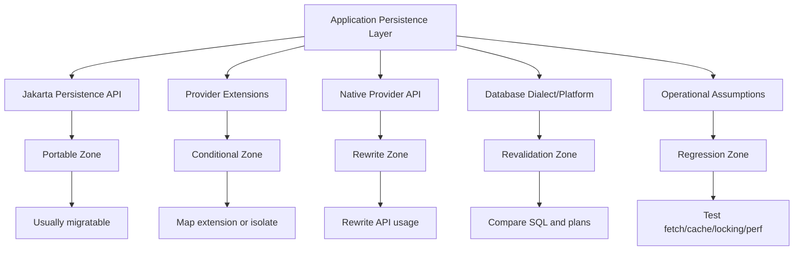
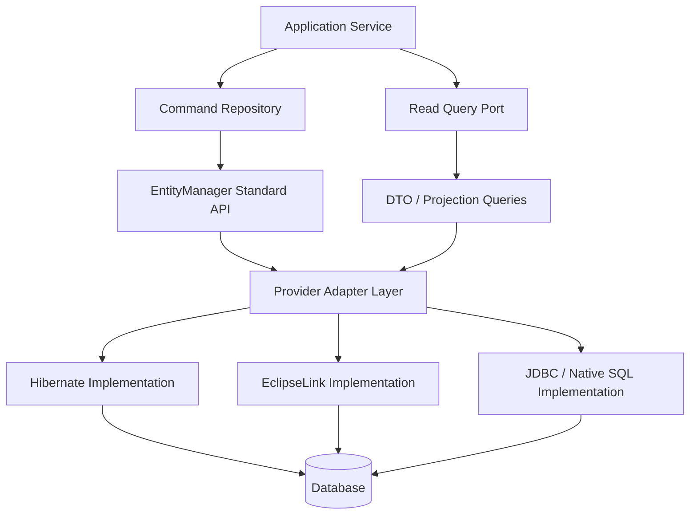

# Part 032 — Provider Migration and Compatibility: Hibernate ↔ EclipseLink

> Target part ini: kamu bisa menilai, merencanakan, dan menguji migrasi provider ORM antara Hibernate dan EclipseLink secara defensible. Fokusnya bukan “ganti dependency lalu run test”, tetapi memahami portability boundary, extension surface, runtime behavior, query/fetch/cache/locking differences, dan strategi migration yang aman.

Jakarta Persistence memberi kontrak standar. Tetapi Hibernate dan EclipseLink bukan engine identik. Mereka berbeda pada:

- bootstrapping,
- metadata model,
- bytecode enhancement/weaving,
- lazy loading implementation,
- change tracking,
- SQL generation,
- query hints,
- cache design,
- ID generation,
- locking SQL,
- provider annotations,
- native APIs,
- diagnostics,
- schema tooling.

Karena itu, provider migration bukan dependency upgrade. Provider migration adalah **behavior migration**.

---

## 1. Migration Mental Model



Migration effort depends less on entity count and more on **how much behavior is implicit**.

High-risk signs:

- entities use many Hibernate/EclipseLink-specific annotations,
- code unwraps `Session` or EclipseLink `Session`,
- query hints are provider-specific,
- lazy loading relies on enhancement/weaving behavior,
- cache is enabled without strong tests,
- bulk/native SQL depends on provider synchronization,
- H2-only tests,
- no query count or SQL shape regression tests,
- `merge` used broadly,
- entity serialization used in API.

---

## 2. Compatibility Layers

### Layer 1 — Jakarta Persistence API

Generally portable:

- `EntityManager`,
- `EntityTransaction`,
- `@Entity`, `@Table`, `@Column`,
- standard associations,
- standard inheritance annotations,
- standard JPQL,
- Criteria API,
- standard entity graphs,
- lifecycle callbacks,
- optimistic/pessimistic lock modes,
- standard cache API,
- standard schema generation properties.

But “standard” does not mean identical performance or SQL shape.

### Layer 2 — Standard API with provider interpretation

Partially portable:

- lazy loading for to-one associations,
- generated SQL join ordering,
- implicit joins,
- entity graph interpretation,
- pagination SQL,
- bulk update synchronization expectations,
- DDL generation,
- sequence allocation behavior,
- lock timeout hints,
- query plan caching,
- flush timing around queries.

### Layer 3 — Provider extensions

Not portable without mapping:

- Hibernate `@Formula`, `@Filter`, `@Where`-style filtering patterns, `@BatchSize`, `@Fetch`, `@NaturalId`, `@SoftDelete`, custom Hibernate type APIs,
- EclipseLink `@AdditionalCriteria`, `@BatchFetch`, `@JoinFetch`, `@Cache`, `@Converter`, `@Transformation`, `@Multitenant`, descriptor/session customizers.

### Layer 4 — Native provider APIs

Rewrite likely required:

- Hibernate `Session`, `SessionFactory`, `StatelessSession`, `Query` extensions, `StatementInspector`, event listener APIs, statistics APIs,
- EclipseLink `Session`, `UnitOfWork`, `DescriptorCustomizer`, `SessionCustomizer`, query monitor/profiler APIs.

---

## 3. Migration Is Not Symmetric

Migrating Hibernate → EclipseLink and EclipseLink → Hibernate have different pain points.

| Direction | Common pain |
|---|---|
| Hibernate → EclipseLink | Hibernate annotations, HQL extensions, custom types, `Session` API, `StatelessSession`, Hibernate fetch modes, Envers, `@Formula`, filters |
| EclipseLink → Hibernate | Weaving assumptions, descriptor customizers, EclipseLink converters, `@AdditionalCriteria`, `@Multitenant`, EclipseLink cache coordination, batch/join fetch hints |

A neutral Jakarta Persistence codebase is easier to migrate, but most production systems are not neutral. They encode provider decisions gradually through annotations, hints, and operational habits.

---

## 4. Build a Provider Inventory

Before migration, create an inventory. Do not start by changing dependencies.

### 4.1 Annotation inventory

Search for imports:

```bash
rg "org\.hibernate|org\.eclipse\.persistence" src/main/java
```

Classify each usage:

| Usage | Provider | Purpose | Replacement | Risk |
|---|---|---|---|---|
| `@Formula` | Hibernate | computed column | DB view / projection / EclipseLink transformation | Medium |
| `@BatchSize` | Hibernate | reduce N+1 | EclipseLink `@BatchFetch` / query hint | Medium |
| `@AdditionalCriteria` | EclipseLink | soft delete / tenant filter | Hibernate filter / explicit predicate | High |
| `@Converter` provider-specific | EclipseLink | value conversion | Jakarta `AttributeConverter` / Hibernate type | Medium |

### 4.2 Query inventory

Search for:

- JPQL/HQL strings,
- Criteria usage,
- native SQL,
- named queries,
- query hints,
- `unwrap(...)`,
- repository methods with implicit query derivation.

For each critical query, record:

- business use case,
- expected cardinality,
- expected SQL count,
- required fetch shape,
- pagination behavior,
- locking behavior,
- cache behavior,
- tenant/soft-delete predicate requirements.

### 4.3 Runtime inventory

Look for:

- bytecode enhancement plugin,
- EclipseLink weaving configuration,
- provider cache properties,
- batch writing settings,
- JDBC batch settings,
- SQL logging settings,
- statistics/profiler integration,
- schema generation configuration,
- custom dialect/platform,
- interceptors/listeners/customizers.

### 4.4 Operational inventory

Document:

- migration tool ownership,
- production database dialect/version,
- rolling deployment model,
- blue-green/canary model,
- cache provider/cluster coordination,
- background job behavior,
- audit requirements,
- tenant isolation requirements,
- data retention constraints.

Provider migration fails when these are left implicit.

---

## 5. Mapping Compatibility

### 5.1 Basic entity and column mapping

Usually portable:

```java
@Entity
@Table(name = "case_file")
class CaseFile {
    @Id
    private UUID id;

    @Column(nullable = false, unique = true)
    private String referenceNo;
}
```

Still validate:

- column names,
- quoted identifiers,
- reserved words,
- enum mapping,
- temporal precision,
- UUID mapping,
- database-specific type mapping.

### 5.2 Embeddables and records

Jakarta Persistence 3.2 supports modernized features including record support for embeddables in compatible providers. But provider implementation details, enhancement/weaving, constructor access, and column override behavior should be tested.

### 5.3 Associations

Standard association annotations are portable, but behavior can differ around:

- lazy to-one support,
- proxy vs weaving/indirection,
- collection wrapper behavior,
- cascade traversal details,
- orphan removal SQL ordering,
- join table DDL,
- map key mapping,
- ordered collection updates.

Regression tests should assert:

- SQL generated for association mutation,
- orphan removal semantics,
- collection replacement behavior,
- bidirectional helper correctness,
- lazy access boundaries.

### 5.4 Inheritance

`SINGLE_TABLE`, `JOINED`, and `TABLE_PER_CLASS` are standard, but providers may differ in generated SQL, discriminator handling, outer join strategy, and polymorphic query performance.

Migration test:

```java
@Test
void polymorphicQueryReturnsSameSemanticRows() {
    List<EnforcementAction> actions = repository.findRecentActions();
    assertThat(actions).extracting(EnforcementAction::id).containsExactly(...);
    assertSqlShapeDoesNotExplode();
}
```

Do not compare only row count. Compare type resolution, discriminator behavior, sort order, and performance plan.

---

## 6. Identifier Generation Compatibility

ID generation is a high-risk migration area because it affects write throughput and database sequence state.

### 6.1 Sequence allocation

Potential differences:

- allocation size default/interpretation,
- pooled optimizer behavior,
- sequence preallocation,
- sequence naming defaults,
- database sequence increment mismatch,
- insert batching compatibility.

### 6.2 Identity generation

Identity columns often reduce insert batching opportunities because ID is obtained on insert. Provider support and batching behavior should be tested under actual database dialect.

### 6.3 UUID generation

Jakarta Persistence supports UUID generation, but database column type and provider-generated vs database-generated UUID strategy need validation.

### 6.4 Composite IDs

Composite ID migration risks:

- equals/hashCode correctness,
- derived identity mapping,
- generated columns inside composite keys,
- association-valued IDs,
- provider-specific workarounds.

### Migration checklist

- Freeze writes or use controlled migration window if sequence behavior changes.
- Compare generated IDs in staging.
- Validate sequence increment/allocation alignment.
- Run concurrent insert tests.
- Verify batch insert count.
- Verify rollback does not assume gapless IDs.

---

## 7. Query Compatibility

### 7.1 JPQL portability

JPQL is standard, but edge cases differ:

- implicit joins,
- function support,
- enum literal handling,
- parameter coercion,
- `IN` with empty lists,
- null comparison behavior in generated SQL,
- pagination translation,
- ordering with `distinct`,
- group-by strictness,
- constructor expressions,
- provider-specific functions.

### 7.2 HQL is not JPQL

Hibernate HQL includes features beyond JPQL. If a query relies on HQL extension, it must be rewritten or isolated.

Examples of risk areas:

- non-standard functions,
- vendor functions registered via Hibernate,
- syntax accepted by HQL but not EclipseLink JPQL,
- Hibernate-specific collection functions,
- CTE/window support depending on version/dialect/provider path.

### 7.3 Criteria API migration

Hibernate 7 moved to Jakarta Persistence 3.2 and its migration guide notes disruptive type-parameter changes around Criteria and Entity Graph APIs. If your codebase uses advanced Criteria APIs heavily, compile-time breakage may appear even before runtime behavior differences.

### 7.4 Native SQL

Native SQL is provider-portable only at the JDBC/database level, not mapping level.

Validate:

- result set mapping,
- entity hydration from native result,
- scalar type inference,
- pagination wrapper SQL,
- lock hints,
- stored procedure behavior,
- cache synchronization.

### Query regression harness

For every critical query:

```java
record QueryExpectation(
    String name,
    int maxSqlStatements,
    boolean requiresTenantPredicate,
    boolean requiresSoftDeletePredicate,
    boolean allowsCollectionJoinFetchWithPagination,
    Duration maxP95InStaging
) {}
```

Use the same test dataset and assert semantic results plus SQL shape.

---

## 8. Fetch Compatibility

Fetch behavior is one of the hardest migration areas.

### 8.1 Lazy loading mechanism

Hibernate commonly uses proxies and bytecode enhancement. EclipseLink commonly uses weaving and indirection. Both can implement lazy loading, but object class, initialization behavior, and boundary failure can differ.

Test:

- lazy to-one access,
- lazy basic fields if used,
- lazy collection initialization,
- detached access failure mode,
- serialization boundary,
- equality with proxies/indirection,
- no SQL after service boundary.

### 8.2 Join fetch

Standard JPQL supports fetch joins, but providers may differ in:

- duplicate handling,
- `distinct` behavior,
- pagination warnings/failures,
- generated SQL aliases,
- join ordering,
- multiple collection fetch handling.

### 8.3 Batch fetch

Hibernate `@BatchSize` / batch fetch settings and EclipseLink `@BatchFetch` / query hints are not identical. Treat them as equivalent intent, not equivalent behavior.

Compare:

- number of queries,
- `IN` list shape,
- batch size,
- ordering,
- cache interaction,
- memory footprint.

### 8.4 Entity graphs

Entity graphs are standard, but provider interpretation may differ in edge cases. Migration tests should verify actual SQL count and loaded associations rather than assuming semantic identity.

---

## 9. Dirty Checking and Change Tracking Compatibility

Hibernate and EclipseLink differ internally:

- Hibernate commonly uses snapshot comparison and can use bytecode-enhanced dirty tracking.
- EclipseLink supports change tracking modes including deferred/object/attribute approaches through weaving/descriptor behavior.

Migration risks:

- mutable value types,
- embeddable changes,
- collection changes,
- field vs property access,
- direct field mutation,
- bytecode enhancement/weaving not active,
- read-only hints,
- detached merge behavior.

Test cases:

```java
@Test
void changingEmbeddableFieldIsPersisted() {}

@Test
void replacingCollectionDoesNotDeleteUnexpectedChildren() {}

@Test
void directFieldMutationIsDetectedOnlyIfSupported() {}

@Test
void readOnlyQueryDoesNotFlushAccidentalMutation() {}
```

Do not assume provider change tracking sees every mutation the same way.

---

## 10. Cache Compatibility

### 10.1 Hibernate cache model

Hibernate distinguishes first-level persistence context from optional second-level cache and optional query cache. Cache regions and concurrency strategies matter.

### 10.2 EclipseLink cache model

EclipseLink has a shared object cache/identity map model with configuration around cache isolation and coordination.

### 10.3 Migration risks

- cache isolation defaults differ,
- query cache behavior differs,
- shared cache vs second-level region semantics differ,
- cache eviction APIs differ,
- cluster invalidation differs,
- tenant-sensitive cache configuration differs,
- native/bulk SQL invalidation differs.

### Cache migration rule

During migration, disable non-essential shared/second-level/query cache first. Make behavior correct. Then re-enable cache one region/use case at a time with tests.

### Cache tests

- update through ORM invalidates/refreshes correctly,
- update through native SQL has explicit eviction,
- bulk update clears/evicts relevant data,
- tenant A cannot observe tenant B data,
- authorization-sensitive data is not cached incorrectly,
- admin update visible within accepted staleness window.

---

## 11. Locking and Transaction Compatibility

Standard lock modes exist, but SQL emitted by providers/dialects may differ.

Migration risks:

- optimistic version update timing,
- detached merge conflict behavior,
- pessimistic lock SQL,
- lock timeout hint behavior,
- deadlock likelihood due to update ordering,
- flush before query/lock,
- isolation-level assumptions.

Test cases:

```java
@Test
void concurrentUpdateThrowsOptimisticLock() {}

@Test
void pessimisticLockBlocksCompetingWriterOrTimesOut() {}

@Test
void lockTimeoutIsHandledAsExpected() {}

@Test
void bulkUpdateVersionPolicyIsExplicit() {}
```

Run these tests against the target database, not H2-only.

---

## 12. Lifecycle Callback and Listener Compatibility

Jakarta Persistence lifecycle callbacks are portable in concept. Provider-specific listeners/customizers are not.

Migration inventory:

- `@PrePersist`, `@PreUpdate`, `@PostLoad`, etc.,
- Hibernate event listeners,
- Hibernate interceptors,
- `StatementInspector`,
- EclipseLink descriptor event listeners,
- session customizers,
- descriptor customizers.

Risk questions:

- Does listener rely on provider event order?
- Does listener trigger lazy loading?
- Does bulk operation bypass it?
- Does listener write audit data?
- Does listener use dependency injection safely?
- Does it behave under retry/rollback?

Migration rule:

Keep local metadata callbacks portable; move cross-aggregate/process side effects to application service/outbox when possible.

---

## 13. Schema Generation and DDL Compatibility

Do not treat generated DDL as portable.

Potential differences:

- column type selection,
- identifier length/truncation,
- constraint names,
- sequence/table generator DDL,
- FK creation order,
- index generation,
- enum/UUID/JSON type mapping,
- quoted identifiers,
- join table names,
- discriminator column definitions.

Production rule:

Use explicit migration tools for production schema. Use provider schema validation/generation as diagnostic support, not as the source of production truth.

Migration validation:

1. Run current app against migrated schema.
2. Run target provider validation against same schema.
3. Compare generated DDL diff as diagnostic.
4. Review data type mismatches.
5. Test read/write paths.
6. Test rolling deployment compatibility if both app versions may run at once.

---

## 14. Weaving and Enhancement Migration

### Hibernate enhancement

Hibernate supports bytecode enhancement for lazy loading, dirty tracking, and association management depending on configuration.

### EclipseLink weaving

EclipseLink uses weaving to implement features such as lazy relationships, change tracking, and indirection.

### Migration risks

- build plugin missing,
- Java agent required but not configured,
- container disables weaving,
- module path/classloader issue,
- native image/AOT constraint,
- final classes/methods interfere,
- tests do not use same enhancement path as production.

### Tests

- verify lazy association actually lazy,
- verify change tracking works,
- verify class enhancement/weaving active in test and production,
- verify failure mode when enhancement disabled,
- inspect logs during bootstrap.

---

## 15. Provider-Specific Feature Mapping

### 15.1 Fetch tuning

| Intent | Hibernate | EclipseLink | Migration note |
|---|---|---|---|
| Batch association fetch | `@BatchSize`, settings | `@BatchFetch`, query hints | Same goal, different SQL shape |
| Join fetch hint | HQL/JPQL fetch join, fetch profiles | `@JoinFetch`, hints | Test pagination and duplicates |
| Lazy loading internals | proxies/enhancement | weaving/indirection | Boundary behavior differs |

### 15.2 Filtering and soft delete

| Intent | Hibernate | EclipseLink | Migration note |
|---|---|---|---|
| Static computed predicate | `@Where`-style patterns / soft delete support | `@AdditionalCriteria` | Test all queries/native/bulk/cache |
| Dynamic filter | Hibernate filters | session/query-level criteria/custom patterns | High-risk migration |
| Soft delete | Hibernate provider support in recent versions | descriptor criteria/customizer patterns | Define restore/cache semantics |

### 15.3 Computed values

| Intent | Hibernate | EclipseLink | Migration note |
|---|---|---|---|
| SQL computed property | `@Formula` | transformation/read-only mapping/customizer | Consider DB view/DTO projection |
| Generated column | provider/dialect support | database platform mapping | Test insert/update/refresh |

### 15.4 Custom types and conversion

| Intent | Hibernate | EclipseLink | Migration note |
|---|---|---|---|
| Simple value conversion | Jakarta `AttributeConverter` | Jakarta `AttributeConverter` | Most portable |
| Database-specific type | Hibernate type system | EclipseLink converter/platform/custom mapping | High test requirement |
| JSON/array/range | Hibernate type/JDBC mapping support varies by version/dialect | converter/native/platform mapping | Prefer query boundary if provider-specific |

---

## 16. Migration Strategy Patterns

### Pattern A — Big Bang Provider Switch

Change provider dependency and fix all failures.

Use only when:

- small codebase,
- little provider extension usage,
- strong test suite,
- low production risk,
- no complex cache/multi-tenancy/locking.

Usually risky for enterprise systems.

### Pattern B — Compatibility Hardening First

Before switching provider, reduce provider-specific surface.

Steps:

1. Inventory provider extensions.
2. Replace unnecessary extensions with standard API.
3. Move read paths to DTO/query boundaries.
4. Remove entity serialization.
5. Add SQL-count/fetch/cache/locking tests.
6. Introduce provider abstraction for diagnostics/custom behavior.
7. Only then switch provider.

This is the safest general approach.

### Pattern C — Dual-Provider Test Harness

Run the same persistence tests against Hibernate and EclipseLink.

```java
@ParameterizedTest
@EnumSource(ProviderUnderTest.class)
void caseLifecycleWorksOnProvider(ProviderUnderTest provider) {
    withProvider(provider, em -> {
        CaseFile c = createCase(em);
        approveCase(em, c.id());
        assertApproved(em, c.id());
    });
}
```

Use for:

- mapping portability,
- query semantics,
- locking behavior,
- cache off baseline,
- provider extension alternatives.

### Pattern D — Strangler Migration by Module

Use when modular monolith or bounded contexts can migrate independently.

Rules:

- do not let two providers manage same entity classes in same persistence unit,
- avoid two providers writing same tables concurrently unless schema contracts are explicit,
- coordinate cache invalidation,
- isolate transaction boundaries,
- use database migration compatibility.

### Pattern E — Stay on Provider, Encapsulate Extensions

Sometimes the right decision is not migration.

Choose this when:

- provider-specific features are deeply valuable,
- migration risk exceeds benefit,
- operational team understands provider,
- test suite is good,
- extension usage is documented.

Vendor/provider lock-in is not automatically bad. **Unintentional lock-in** is bad.

---

## 17. Migration Execution Plan

### Phase 0 — Define why

Do not migrate for vague reasons.

Valid drivers:

- platform standardization,
- app server/container requirement,
- licensing/support policy,
- performance feature,
- Jakarta EE version alignment,
- bug/security/maintenance pressure,
- operational tooling requirement,
- team expertise consolidation.

Create decision record:

```md
# ADR: ORM Provider Migration

## Decision
Migrate persistence provider from X to Y for bounded context Z.

## Drivers
- ...

## Non-goals
- not changing schema ownership
- not redesigning domain model
- not enabling query cache during migration

## Risks
- fetch behavior
- cache behavior
- custom types
- locking SQL

## Validation
- dual-provider test suite
- SQL shape comparison
- staging canary
```

### Phase 1 — Freeze high-risk changes

During migration, avoid unrelated persistence changes:

- no new cascade behavior,
- no new inheritance mapping,
- no major schema refactor,
- no cache redesign,
- no broad repository rewrite unless planned.

### Phase 2 — Create baseline observations

On current provider, capture:

- critical query SQL count,
- SQL examples,
- p95 latency,
- cache hit/miss,
- flush count,
- entity load count,
- batch count,
- lock behavior,
- memory footprint for batch jobs.

### Phase 3 — Make behavior explicit

Add tests before switching:

- mapping tests,
- query semantic tests,
- SQL-count tests,
- no-SQL-after-boundary tests,
- cache tests,
- concurrency tests,
- bulk/native synchronization tests,
- tenant isolation tests.

### Phase 4 — Switch provider in branch

Change dependency/configuration:

- provider class,
- persistence properties,
- weaving/enhancement setup,
- logging/profiler setup,
- cache setup disabled initially,
- dialect/platform settings,
- schema validation setting.

### Phase 5 — Fix compile-time failures

Expected categories:

- provider imports,
- native API usage,
- query hints,
- Criteria API type changes,
- custom type/converter APIs,
- listener/customizer APIs.

### Phase 6 — Fix runtime mapping failures

Run mapping validation and integration tests.

Common issues:

- unknown annotation ignored or failing,
- access strategy difference,
- converter mismatch,
- enum/UUID/JSON type mismatch,
- sequence/table generator mismatch,
- lazy loading not active,
- entity listener behavior differs.

### Phase 7 — Fix query/fetch behavior

Run query harness.

Compare:

- number of SQL statements,
- row counts,
- duplicate parents,
- pagination correctness,
- generated joins,
- bind parameter types,
- execution plans.

### Phase 8 — Re-enable performance features deliberately

Only after correctness passes:

- batching,
- fetch tuning,
- second-level/shared cache,
- query cache if still justified,
- provider-specific optimizations,
- statement inspectors/profilers.

### Phase 9 — Canary and monitor

Canary checks:

- query count drift,
- slow query log,
- cache hit/miss anomaly,
- lock wait/deadlock rate,
- optimistic lock rate,
- transaction duration,
- connection pool usage,
- memory/GC during batch jobs,
- error types related to lazy loading/weaving.

---

## 18. SQL Shape Comparison Method

For critical operations, compare old vs new provider:

```txt
Operation: Case detail view
Dataset: 1 case, 3 parties, 5 tasks, 20 evidence rows
Current provider: Hibernate
Target provider: EclipseLink

Assertions:
- max 3 SQL statements
- no SQL during JSON serialization
- tenant_id predicate present in every table access
- deleted=false predicate present for soft-deleted tables
- no collection fetch join with pageable parent query
- p95 under 150ms in staging baseline
```

Record diff:

| Aspect | Old provider | New provider | Accept? | Action |
|---|---|---|---:|---|
| Query count | 2 | 5 | No | add batch fetch/projection |
| Parent rows | 1 | 1 | Yes | none |
| Child rows | 28 | 28 | Yes | none |
| Tenant predicate | yes | yes | Yes | none |
| Soft delete predicate | provider filter | missing in native query | No | rewrite query |

Do not require byte-for-byte identical SQL. Require equivalent semantics and acceptable cost.

---

## 19. Compatibility Test Matrix

| Test category | Hibernate → EclipseLink | EclipseLink → Hibernate |
|---|---|---|
| Mapping validation | Required | Required |
| Sequence/ID generation | Required | Required |
| Lazy to-one | High priority | High priority |
| Collection mutation | High priority | High priority |
| Entity graph/fetch join | High priority | High priority |
| Provider-specific hints | Rewrite/replace | Rewrite/replace |
| Cache behavior | Disable then reintroduce | Disable then reintroduce |
| Locking | Required with real DB | Required with real DB |
| Bulk/native DML | Required | Required |
| Multi-tenancy | Critical if used | Critical if used |
| Soft delete/filtering | Critical if used | Critical if used |
| Audit/listeners | Critical if used | Critical if used |

---

## 20. Migration Example: Hibernate `@Formula` to Provider-Neutral Read Model

### Before

```java
@Formula("(select count(t.id) from task t where t.case_id = id and t.status = 'OPEN')")
private int openTaskCount;
```

### Risk

- Hibernate-specific,
- embedded SQL fragment,
- difficult to tune globally,
- may be executed differently per query,
- migration to EclipseLink requires alternative mapping.

### Provider-neutral option

```java
public record CaseListRow(
    UUID id,
    String referenceNo,
    long openTaskCount
) {}
```

```java
select new com.acme.CaseListRow(c.id, c.referenceNo, count(t.id))
from CaseFile c
left join c.tasks t on t.status = com.acme.TaskStatus.OPEN
group by c.id, c.referenceNo
```

Alternative: database view/materialized view if used broadly.

### Migration judgment

If formula is used only in list views, read model is usually better than provider-specific computed property.

---

## 21. Migration Example: EclipseLink `@AdditionalCriteria` to Explicit Boundary

### Before

```java
@AdditionalCriteria("this.deleted = false")
@Entity
class CaseFile { ... }
```

### Risk

- EclipseLink-specific,
- predicate hidden from query authors,
- native/bulk queries may bypass it,
- migration to Hibernate needs filter/soft-delete/provider-specific mapping or explicit predicates.

### Option A — Hibernate provider support

Use Hibernate soft-delete/filter support where behavior matches. Test cache/native/bulk/restore semantics.

### Option B — Explicit query boundary

```java
select c
from CaseFile c
where c.id = :id
  and c.deleted = false
```

### Option C — Database view

Map active entity to view:

```sql
create view active_case_file as
select * from case_file where deleted = false;
```

### Migration judgment

If `deleted=false` is a strict global invariant, provider-level filtering may be useful. If queries need explicit lifecycle states including deleted/restored/archived, explicit query boundary is safer.

---

## 22. Migration Example: Hibernate `StatelessSession`

### Before

```java
try (StatelessSession session = sessionFactory.openStatelessSession()) {
    Transaction tx = session.beginTransaction();
    for (ImportRow row : rows) {
        session.insert(map(row));
    }
    tx.commit();
}
```

### Risk

`StatelessSession` is Hibernate-native. EclipseLink does not expose the same API semantics.

### Migration options

- Use standard `EntityManager` with chunked flush/clear.
- Use JDBC for pure bulk insert path.
- Use EclipseLink batch writing configuration.
- Split import into provider-specific adapter.

### Adapter boundary

```java
interface BulkCaseImporter {
    ImportResult importCases(Stream<CaseImportRow> rows);
}
```

Implementations:

- `HibernateBulkCaseImporter`,
- `EclipseLinkBulkCaseImporter`,
- `JdbcBulkCaseImporter`.

This isolates non-portable throughput optimization.

---

## 23. Migration Example: EclipseLink Descriptor Customizer

### Before

```java
public class CaseDescriptorCustomizer implements DescriptorCustomizer {
    @Override
    public void customize(ClassDescriptor descriptor) {
        descriptor.getQueryManager().setAdditionalJoinExpression(...);
    }
}
```

### Risk

Descriptor APIs are EclipseLink-specific and may encode critical behavior invisibly.

### Migration options

- Rewrite as standard mapping/query predicate if possible.
- Use Hibernate event/filter/custom type extension if truly provider-level.
- Move behavior to repository/query layer.
- Move behavior to database view/constraint/trigger if database-owned.

### Decision rule

If descriptor customizer implements domain/business filtering, make it explicit and testable. If it implements low-level performance mapping, isolate it behind provider configuration.

---

## 24. Choosing Portability vs Provider Leverage

Portability has cost. Provider leverage has cost.

### Prefer portability when

- domain is long-lived,
- provider may change due to platform policy,
- code is shared across products,
- team expertise varies,
- use case does not need provider-specific behavior,
- standard API expresses the requirement cleanly.

### Prefer provider-specific feature when

- it materially improves correctness/performance/maintainability,
- portable alternative is much worse,
- migration probability is low,
- behavior is tested,
- extension is documented,
- extension is isolated where possible.

### Avoid both extremes

Bad portability:

> Avoiding useful provider features while writing slow, unclear, fragile persistence code.

Bad lock-in:

> Using provider-specific feature casually because it was convenient today.

Top engineer posture:

> Use the standard where it is sufficient. Use provider power where it is justified. Document and test the boundary.

---

## 25. Migration Decision Matrix

Score each from 1 low to 5 high.

| Factor | Score | Notes |
|---|---:|---|
| Business driver strength |  | Why migrate? |
| Provider-specific annotation count |  | Higher means harder |
| Native API usage |  | Higher means harder |
| Cache complexity |  | Higher means higher risk |
| Multi-tenancy complexity |  | Higher means higher risk |
| Locking/concurrency complexity |  | Higher means higher risk |
| Query shape test coverage |  | Higher means safer |
| Real DB test coverage |  | Higher means safer |
| Operational observability |  | Higher means safer |
| Team expertise in target provider |  | Higher means safer |

Interpretation:

- Strong driver + strong tests + low extension surface: migrate.
- Weak driver + high extension surface + weak tests: do not migrate yet.
- Strong driver + high risk: harden compatibility first.
- Weak driver + high risk: document current provider and isolate future changes.

---

## 26. Provider Compatibility Architecture

A persistence architecture that can survive provider differences usually has:



Important boundaries:

- domain service does not unwrap provider session,
- API does not expose entity,
- read models are explicit,
- provider-specific optimizations live in adapters/configuration,
- tests assert behavior at ports.

You do not need this abstraction everywhere. Use it where migration/optimization risk exists.

---

## 27. Red Flags That Migration Is Not Ready

Do not proceed to production if:

- cache behavior is untested,
- lazy loading works only because OSIV is enabled,
- provider-specific annotations have no inventory,
- query count regression is unknown,
- critical workflows have no concurrency tests,
- production uses native SQL but cache eviction is unclear,
- tenant/soft-delete predicates are hidden and untested,
- ID generation sequence behavior differs but sequence state is not planned,
- schema validation fails and is ignored,
- rollback plan is “revert deployment” but data writes are incompatible.

---

## 28. Rollback Planning

Provider migration rollback is not always trivial.

Questions:

- Did target provider write data differently?
- Did sequence allocation advance differently?
- Did schema change?
- Did cache contain target-provider-specific serialized data?
- Did soft-delete/audit behavior differ?
- Did background jobs run during canary?
- Can old provider read data written by new provider?

Safe rollout:

1. No schema-incompatible changes in provider switch release.
2. Cache cleared between provider switch and rollback.
3. Sequence behavior validated both ways.
4. Canary with limited tenant/user subset.
5. Background jobs disabled or isolated during canary if high-risk.
6. Old provider compatibility test run against data written by new provider.

---

## 29. Production Migration Checklist

Before production:

- [ ] Provider inventory complete.
- [ ] Extension mapping complete.
- [ ] Native API usage removed or adapted.
- [ ] Mapping validation passes.
- [ ] Real DB integration suite passes.
- [ ] Query semantic tests pass.
- [ ] SQL-count tests pass for critical endpoints.
- [ ] Fetch boundary tests pass.
- [ ] Cache disabled or cache correctness tests pass.
- [ ] Locking/concurrency tests pass.
- [ ] Bulk/native synchronization tests pass.
- [ ] Tenant isolation tests pass.
- [ ] Soft-delete/audit tests pass.
- [ ] Sequence/ID behavior validated.
- [ ] Performance baseline acceptable.
- [ ] Observability dashboard ready.
- [ ] Rollback plan tested.
- [ ] ADR approved.

---

## 30. Practice Drills

### Drill A — Classify provider-specific usage

Given:

```java
@Entity
@org.hibernate.annotations.BatchSize(size = 50)
@org.hibernate.annotations.SoftDelete
class CaseFile {
    @Formula("(select count(*) from task t where t.case_id = id)")
    private int taskCount;
}
```

Questions:

1. Which annotations are provider-specific?
2. Which can be replaced by standard API?
3. Which should become DTO/read model instead?
4. Which require behavior tests?
5. What is the EclipseLink migration strategy?

Expected reasoning:

- `@BatchSize`, `@SoftDelete`, and `@Formula` are Hibernate-specific.
- `taskCount` is likely better as projection/view.
- Soft delete requires explicit lifecycle/cache/native/bulk/restore tests.
- Batch fetch intent can map to EclipseLink batch fetch, but SQL count must be compared.

### Drill B — Query migration hazard

Given HQL:

```java
select c
from CaseFile c
where function('jsonb_extract_path_text', c.metadata, 'risk') = :risk
```

Questions:

1. Is this portable JPQL?
2. Which layer owns this behavior?
3. Should it become native SQL, database view, generated column, or provider function registration?
4. How do you test migration?

Expected reasoning:

- It is database/provider-specific.
- If it is performance-critical, use database-supported indexed expression/generated column/view and query boundary.

### Drill C — Sequence mismatch

Current provider uses sequence allocation size 50. Target provider appears to request IDs differently.

Questions:

1. What production risk exists?
2. What staging test proves safety?
3. What database sequence settings must be checked?
4. Can rollback break?

---

## 31. Mental Model Summary

Provider migration is the process of converting implicit behavior into explicit contracts, then proving the target provider satisfies those contracts.

The essential contracts:

| Contract | How to prove |
|---|---|
| Mapping contract | mapping validation + CRUD tests |
| Query contract | semantic result + SQL shape tests |
| Fetch contract | query count + no lazy boundary leak |
| State contract | dirty checking/merge/flush tests |
| ID contract | concurrent insert + sequence validation |
| Cache contract | stale read/invalidation tests |
| Lock contract | real DB concurrency tests |
| Extension contract | inventory + replacement/adaptation tests |
| Operational contract | metrics/canary/rollback plan |

A good migration may decide not to migrate. That is a valid engineering outcome when the migration cost is higher than the benefit.

What matters is that the decision is explicit, tested, and defensible.

---

## 32. References

- Hibernate ORM 7.4 release and documentation: https://hibernate.org/orm/releases/7.4/
- Hibernate ORM documentation index and migration guides: https://hibernate.org/orm/documentation/
- Hibernate ORM 7.0 migration guide, including Jakarta Persistence 3.2 migration notes: https://docs.hibernate.org/orm/7.0/migration-guide/
- Hibernate ORM stable user guide: https://docs.hibernate.org/stable/orm/userguide/html_single/
- Jakarta Persistence 3.2 specification: https://jakarta.ee/specifications/persistence/3.2/
- EclipseLink 5.0 release information: https://eclipse.dev/eclipselink/releases/5.0.html
- EclipseLink 5.0.0 project release record: https://projects.eclipse.org/projects/ee4j.eclipselink/releases/5.0.0
- EclipseLink JPA Extensions Reference: https://eclipse.dev/eclipselink/documentation/4.0/jpa/extensions/jpa-extensions.html
- EclipseLink Solutions Guide: https://eclipse.dev/eclipselink/documentation/4.0/solutions/solutions.html
- EclipseLink/Oracle guide for Hibernate-to-EclipseLink migration concepts: https://docs.oracle.com/en/middleware/fusion-middleware/toplink/12.2.1.4/solutions/migrhib.html

---

## 33. What Comes Next

Part 033 akan membahas **Architecture Patterns for Enterprise ORM Systems**.

Fokusnya akan naik dari provider mechanics ke arsitektur:

- persistence boundary architecture,
- repository vs DAO vs domain service,
- entity model vs API model,
- write model vs read model,
- transaction script vs aggregate mutation,
- domain events and outbox,
- ORM di modular monolith dan microservices,
- regulatory/audit-heavy case management systems,
- ADR untuk keputusan ORM.
