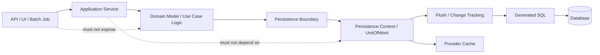
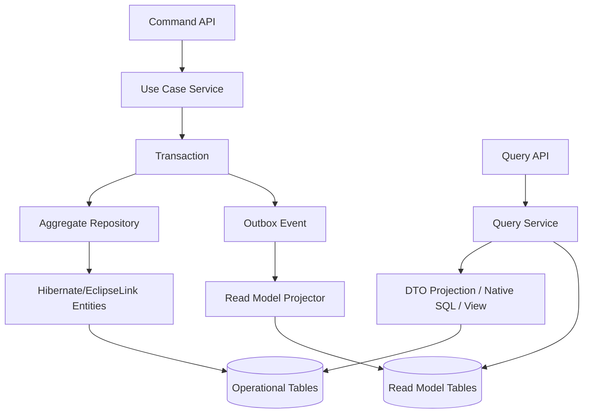
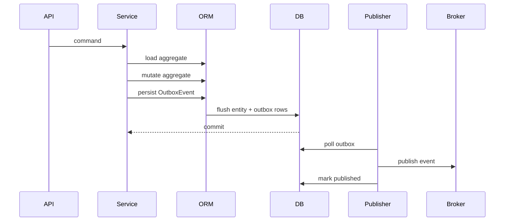
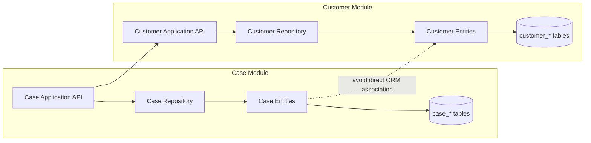
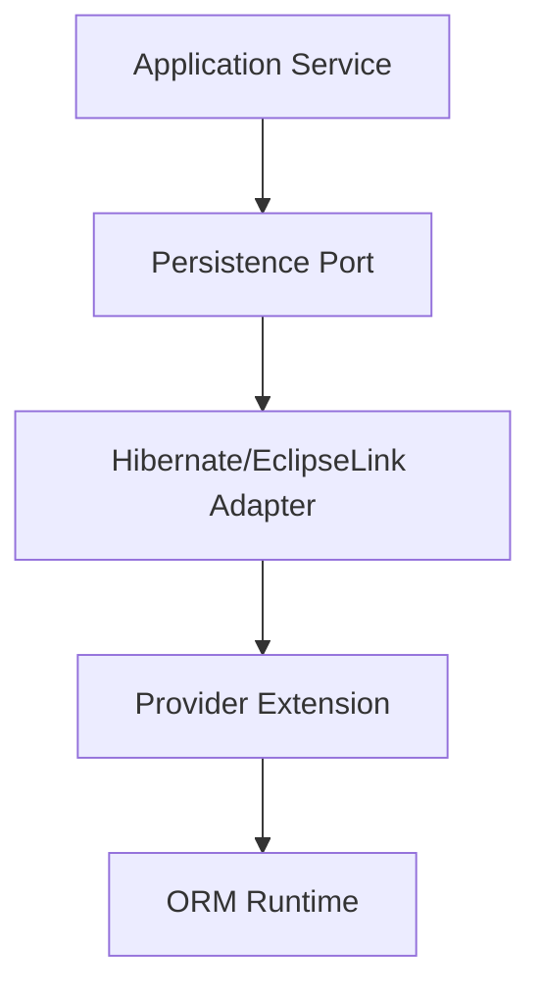
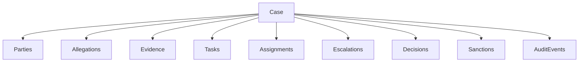
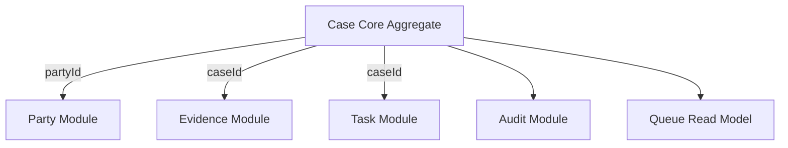

# Part 033 — Architecture Patterns for Enterprise ORM Systems

ORM architecture is not about where to put `@Repository`.
It is about controlling how state, identity, transactions, SQL, cache, audit, and domain rules move through a system without becoming accidental global behavior.

A top engineer treats Hibernate ORM or EclipseLink as a powerful but dangerous state machine. The goal is not to hide ORM completely. The goal is to place it behind boundaries where its semantics are explicit, observable, testable, and defensible.

This part is the architectural bridge between provider-level mastery and system design.

---

## 1. What This Part Covers

We will focus on patterns that determine whether ORM stays maintainable at enterprise scale:

- persistence boundary architecture
- repository, DAO, and domain-service placement
- entity model versus API model
- write model versus read model
- transaction script versus aggregate mutation
- ORM inside modular monoliths
- ORM inside microservices
- outbox and domain events with ORM
- regulatory/audit-heavy persistence design
- case lifecycle and escalation-oriented systems
- architecture decision records for provider choices

We will not repeat JPA basics, Spring Data basics, SQL fundamentals, or generic DDD definitions.

---

## 2. Kaufman Framing: Deconstruct the Real Skill

Following Josh Kaufman's learning method, we split the big skill into subskills that can be practiced independently.

### 2.1 Target Performance Level

You should be able to look at a business workflow and decide:

- which state transitions deserve a transaction boundary
- which data should be loaded as entities and which should be projected
- where lazy loading is allowed and where it is forbidden
- which relationships should be object references and which should remain ID references
- how audit, authorization, and tenant boundaries interact with cache
- when provider-specific Hibernate or EclipseLink features are worth the lock-in
- how to explain the decision in an architecture review

### 2.2 Decompose the Skill

| Subskill | What you must be able to do |
|---|---|
| Boundary placement | Place ORM access where persistence semantics are not leaked everywhere |
| Transaction design | Align transaction boundary with consistency boundary |
| Model separation | Separate entity, command, API, event, and read models when necessary |
| Query shape design | Choose entity load, projection, native SQL, or read model intentionally |
| Provider isolation | Encapsulate Hibernate/EclipseLink extensions behind explicit ports |
| Failure modeling | Predict stale state, N+1, accidental flush, lock contention, and cache leakage |
| Governance | Capture decisions in ADRs and enforce them with tests and reviews |

### 2.3 Remove Barriers

The biggest barriers are usually not syntax. They are hidden assumptions:

- “Repository means the ORM is abstracted.” Usually false.
- “Entity equals domain model.” Sometimes useful, often dangerous.
- “Lazy loading is an implementation detail.” False; it changes runtime behavior.
- “Transaction boundary belongs around each repository call.” Usually wrong.
- “Provider-specific annotations are bad.” Too simplistic; unmanaged lock-in is bad.

### 2.4 Practice Loop

For each architecture pattern, use this loop:

1. Draw the state boundary.
2. Draw the transaction boundary.
3. Predict entity loads and flushes.
4. Predict SQL count and row shape.
5. Identify stale/cache/locking failure modes.
6. Write an ADR.
7. Encode the invariant in a test.

---

## 3. Core Mental Model: ORM as a Local State Coordinator

Hibernate and EclipseLink are not only SQL generators. At runtime, they coordinate:

- identity
- object graphs
- lifecycle state
- snapshots or change tracking
- flush ordering
- lazy loading
- optimistic locking
- cache behavior
- transaction synchronization

That means the ORM sits at the intersection of domain behavior and database behavior.



The persistence context is local to a use case. It should not become an ambient global state bag.

### Architectural invariant

> The longer an ORM-managed object escapes the persistence boundary, the less predictable the system becomes.

This is why exposing entities to controllers, serializers, messaging payloads, or frontend contracts is usually a boundary violation.

---

## 4. Persistence Boundary Architecture

A persistence boundary is the part of the system allowed to:

- create an `EntityManager`, Hibernate `Session`, or EclipseLink `UnitOfWork`
- load managed entities
- rely on lazy loading
- trigger flush
- attach provider-specific hints
- interpret optimistic lock exceptions
- manage cache-specific behavior

Everything outside the boundary should operate on explicit application-level models.

### 4.1 Boundary Styles

| Style | Description | Best for | Risk |
|---|---|---|---|
| Repository boundary | Repositories hide query and persistence details | Standard CRUD and aggregate loading | Can leak entities everywhere |
| Application service boundary | Use case owns transaction and persistence sequence | Business workflows | Can become procedural if domain is weak |
| Domain aggregate boundary | Aggregate methods enforce invariants; repository loads/saves aggregate | Rich consistency rules | Large aggregates can become ORM traps |
| Query service boundary | Separate read queries/projections from write entities | Reporting, dashboards, API reads | Can duplicate mapping logic |
| Persistence adapter boundary | Hexagonal adapter encapsulates provider-specific ORM | Multi-provider or strict architecture | More boilerplate |

### 4.2 Recommended Default

For enterprise systems, a strong default is:

```txt
Controller / Message Consumer / Batch Trigger
  -> Application Service / Use Case Handler
    -> Transaction Boundary
      -> Repository / Query Service
        -> ORM Provider
          -> Database
```

Domain entities may be rich, but persistence entities should not be blindly exposed as API contracts.

---

## 5. Repository, DAO, Query Service, and Domain Service

These terms are often mixed. Precision matters.

### 5.1 DAO

A DAO is data-access oriented. It typically expresses storage operations:

```java
interface CaseDao {
    CaseEntity findById(UUID id);
    void insert(CaseEntity entity);
    void updateStatus(UUID id, CaseStatus status);
}
```

DAO is useful when storage shape is the main concern.

### 5.2 Repository

A repository is domain-collection oriented. It usually exposes aggregate retrieval and persistence intent:

```java
interface CaseRepository {
    Optional<RegulatoryCase> findCaseForCommand(CaseId id);
    void save(RegulatoryCase regulatoryCase);
}
```

Repository should avoid becoming a generic SQL bag.

Bad repository smell:

```java
interface CaseRepository {
    List<CaseEntity> findEverythingWithAllChildrenAndSortAndFilters(...);
    List<Object[]> weirdReport(...);
    void updateOneColumn(...);
    void callStoredProcedure(...);
}
```

This mixes aggregate loading, reporting, partial update, and operational commands.

### 5.3 Query Service

A query service is read-shape oriented. It returns DTOs, not managed entities.

```java
interface CaseDashboardQueryService {
    Page<CaseQueueRow> findQueue(CaseQueueFilter filter, PageRequest page);
    CaseTimelineView findTimeline(CaseId id);
}
```

This is where projection, native SQL, window functions, denormalized read tables, and database-specific query tuning belong.

### 5.4 Domain Service

A domain service expresses domain logic that does not naturally belong to one entity.

```java
final class EscalationPolicy {
    EscalationDecision evaluate(RegulatoryCase caze, Clock clock) {
        // Pure domain policy; no EntityManager here.
    }
}
```

A domain service should not secretly call repositories unless it is intentionally an application service. Mixing these roles hides transaction and loading behavior.

---

## 6. Entity Model vs Domain Model vs API Model

The word “model” is overloaded. In ORM systems, collapsing all model roles into one class is a common source of pain.

### 6.1 Four Model Roles

| Model | Purpose | Should it be managed by ORM? |
|---|---|---|
| Persistence entity | Maps relational state to object state | Yes |
| Domain model | Enforces business invariants | Sometimes |
| API DTO | External contract | No |
| Read model | Efficient query result | No, usually projection/table/view |

### 6.2 When Entity and Domain Model Can Be the Same

It can work when:

- aggregate is small
- invariants fit within one transaction
- associations are limited and explicit
- no direct JSON serialization of entities
- no many-context reuse of the same entity class
- entity lifecycle and business lifecycle align

Example:

```java
@Entity
class CaseNote {
    @Id
    private UUID id;

    @Version
    private long version;

    private String body;

    private Instant createdAt;

    protected CaseNote() {
    }

    CaseNote(UUID id, String body, Instant createdAt) {
        if (body == null || body.isBlank()) {
            throw new IllegalArgumentException("Note body is required");
        }
        this.id = id;
        this.body = body;
        this.createdAt = createdAt;
    }
}
```

This is acceptable because the object is small and lifecycle is simple.

### 6.3 When Entity and Domain Model Should Split

Split them when:

- persistence shape is optimized for legacy schema
- domain state machine is more important than table shape
- API model has incompatible lifecycle/versioning
- entity has many ORM-specific annotations and provider extensions
- multi-tenancy/security concerns are embedded in persistence
- audit/history model differs from current-state model
- you need multiple read representations

Example split:

```java
@Entity
@Table(name = "reg_case")
class CaseRecordEntity {
    @Id
    UUID id;

    @Version
    long version;

    @Enumerated(EnumType.STRING)
    CaseStatus status;

    String assignedUnit;
    Instant openedAt;
    Instant closedAt;
}
```

```java
record RegulatoryCase(
        CaseId id,
        CaseVersion version,
        CaseStatus status,
        AssignedUnit assignedUnit,
        CaseTimeline timeline
) {
    RegulatoryCase escalate(EscalationDecision decision) {
        if (!status.allowsEscalation()) {
            throw new IllegalStateException("Case cannot be escalated from " + status);
        }
        return new RegulatoryCase(id, version, CaseStatus.ESCALATED, decision.targetUnit(), timeline);
    }
}
```

A mapper then becomes an anti-corruption layer between ORM mechanics and domain behavior.

---

## 7. Write Model vs Read Model

ORM is strongest when updating a small, coherent consistency boundary. It is often weak when powering large read screens with many optional filters, joins, aggregates, and authorization rules.

### 7.1 Write Model

A write model should be optimized for:

- invariant enforcement
- optimistic locking
- state transitions
- small graph mutation
- audit correctness
- transaction clarity

### 7.2 Read Model

A read model should be optimized for:

- query shape
- pagination
- filtering
- sorting
- aggregation
- authorization projection
- stable API response

### 7.3 Architecture



The key rule:

> Do not load an entity graph just to produce a read screen when a stable projection would be cheaper and safer.

### 7.4 Practical Heuristic

Use entity loading for:

- commands
- state transitions
- invariant checks
- small current-state edits

Use DTO projection or read model for:

- dashboards
- queues
- reports
- search screens
- cross-aggregate views
- timeline feeds
- export jobs

---

## 8. Transaction Script vs Aggregate Mutation

Both patterns are valid. The mistake is using one accidentally.

### 8.1 Transaction Script

A transaction script places workflow logic in the application service.

```java
@Transactional
public void assignCase(AssignCaseCommand command) {
    CaseEntity caze = caseRepository.getForUpdate(command.caseId());

    if (caze.getStatus() != CaseStatus.OPEN) {
        throw new InvalidCaseStateException();
    }

    caze.setAssignedOfficer(command.officerId());
    caze.setStatus(CaseStatus.ASSIGNED);

    auditLog.recordAssignment(command.caseId(), command.officerId());
}
```

Good when:

- logic is simple
- state transition is procedural
- domain model is thin by design
- the organization prefers explicit use-case scripts

Risk:

- invariants get duplicated across services
- entity setters become unrestricted mutation API
- tests focus on services rather than domain behavior

### 8.2 Aggregate Mutation

Aggregate mutation moves invariants into the aggregate.

```java
@Transactional
public void assignCase(AssignCaseCommand command) {
    RegulatoryCase caze = caseRepository.findCaseForCommand(command.caseId())
            .orElseThrow(CaseNotFoundException::new);

    caze.assignTo(command.officerId(), command.assignmentReason(), clock.instant());

    caseRepository.save(caze);
}
```

Good when:

- invariants are complex
- lifecycle state matters
- the same transition can be triggered from multiple channels
- audit/event production should be consistent

Risk:

- aggregate grows too large
- ORM mapping becomes tangled with business behavior
- lazy associations get touched inside domain methods

### 8.3 Decision Matrix

| Condition | Prefer transaction script | Prefer aggregate mutation |
|---|---:|---:|
| Very simple CRUD | Yes | No |
| Complex state machine | No | Yes |
| Multiple entry points for same rule | No | Yes |
| Legacy database with awkward mapping | Yes | Maybe, with split model |
| Need pure domain testing | No | Yes |
| High-performance bulk update | Yes | No |

---

## 9. Transaction Boundary Design

A transaction boundary should represent a business consistency boundary, not a controller method by default and not every repository method by default.

### 9.1 Good Transaction Boundary

A good boundary:

- starts at a use case
- includes all reads needed for decisions
- includes all writes needed for invariant preservation
- ends before serialization or external I/O
- has explicit retry behavior for optimistic conflicts
- emits durable events through outbox or equivalent

```java
@Transactional
public EscalateCaseResult escalate(EscalateCaseCommand command) {
    RegulatoryCase caze = repository.findForEscalation(command.caseId())
            .orElseThrow(CaseNotFoundException::new);

    EscalationDecision decision = escalationPolicy.evaluate(caze, clock.instant());
    caze.escalate(decision);

    repository.save(caze);
    outbox.enqueue(CaseEscalatedEvent.from(caze, decision));

    return EscalateCaseResult.accepted(caze.id(), caze.version());
}
```

### 9.2 Bad Transaction Boundary

```java
@Transactional
public CaseDto getCase(UUID id) {
    CaseEntity caze = repository.findById(id);
    return jsonMapper.convertValue(caze, CaseDto.class);
}
```

This looks harmless but may trigger lazy loading during mapping, expose ORM-specific object graph behavior, and couple API shape to entity shape.

### 9.3 External Calls Inside Transactions

Avoid calling external systems while holding ORM transaction resources.

Bad:

```java
@Transactional
public void closeCase(CloseCaseCommand command) {
    CaseEntity caze = repository.get(command.caseId());
    caze.close();
    regulatorGateway.notifyClosed(caze); // network call inside DB transaction
}
```

Better:

```java
@Transactional
public void closeCase(CloseCaseCommand command) {
    CaseEntity caze = repository.get(command.caseId());
    caze.close();
    outbox.enqueue(CaseClosedEvent.of(caze.getId()));
}
```

Then a separate worker publishes the event.

---

## 10. Domain Events and Outbox with ORM

Domain events are often produced in the same transaction as entity mutation. But publishing them directly to a broker inside the transaction creates dual-write risk.

### 10.1 Outbox Pattern



The outbox row should be written using the same transaction as the business state change.

### 10.2 ORM Mapping for Outbox

```java
@Entity
@Table(name = "outbox_event")
class OutboxEventEntity {
    @Id
    UUID id;

    String aggregateType;
    UUID aggregateId;
    String eventType;

    @Column(columnDefinition = "jsonb")
    String payload;

    Instant occurredAt;
    Instant publishedAt;

    @Version
    long version;
}
```

For high-volume outbox processing, use projection/native SQL rather than loading full entity graphs.

### 10.3 Domain Event Placement

Do not let entities publish directly to Kafka, RabbitMQ, HTTP, or email.

Allowed:

- entity records domain events internally
- application service collects events
- outbox persists events
- publisher sends after commit

Forbidden:

- entity uses `EntityManager`
- entity calls network
- lifecycle callback publishes external event
- event depends on lazy loading outside transaction

---

## 11. ORM in a Modular Monolith

A modular monolith can use ORM effectively if each module has explicit persistence ownership.

### 11.1 Module Ownership Rules

Each module should own:

- its tables
- its entity mappings
- its repositories/query services
- its migration files
- its transaction use cases
- its internal provider extensions

Other modules should access it through application APIs, not through entity associations.

### 11.2 Avoid Cross-Module Entity Graphs

Bad:

```java
@Entity
class EnforcementCaseEntity {
    @ManyToOne(fetch = FetchType.LAZY)
    CustomerEntity customer; // owned by Customer module
}
```

Better:

```java
@Entity
class EnforcementCaseEntity {
    @Column(nullable = false)
    UUID customerId;
}
```

Then use a module API or read projection when customer details are needed.

### 11.3 Module Boundary Diagram



### 11.4 Why This Matters

Cross-module entity associations create:

- hidden dependency cycles
- accidental fetch chains
- impossible module extraction
- cache invalidation ambiguity
- schema migration coupling
- security boundary confusion

For modular systems, references by ID are often more stable than cross-module object references.

---

## 12. ORM in Microservices

ORM should not cross service boundaries.

A microservice owns its database. Its ORM mappings are private implementation details.

### 12.1 Never Share Entities Across Services

Do not publish entity classes as shared libraries. Do not let another service rely on your ORM annotations, lazy loading, or table shape.

Bad:

```txt
service-a-domain.jar contains @Entity Customer
service-b imports service-a-domain.jar
```

Better:

```txt
service-a publishes CustomerChanged event / Customer API DTO
service-b owns its own local representation if needed
```

### 12.2 Service Boundary Rule

| Thing | May cross service boundary? |
|---|---:|
| Entity class | No |
| Hibernate proxy | No |
| EclipseLink woven object | No |
| Lazy collection | No |
| DTO | Yes |
| Event payload | Yes |
| ID/reference | Yes |
| Schema migration | No |

### 12.3 Distributed Invariants

ORM cannot enforce invariants across services. If a business rule spans services, use:

- saga/process manager
- outbox/inbox
- idempotent commands
- compensating actions
- read-your-own-write design where necessary
- explicit consistency documentation

Do not fake a distributed aggregate with ORM associations.

---

## 13. Provider Extension Encapsulation

Hibernate and EclipseLink extensions are useful. Architecture fails when those extensions spread everywhere without ownership.

### 13.1 Encapsulation Pattern



Application code should depend on intent, not provider syntax.

Example:

```java
interface CaseQueryPort {
    List<CaseQueueRow> findQueue(CaseQueueFilter filter);
}
```

Hibernate implementation may use HQL, fetch profile, read-only hints, or `StatementInspector`.
EclipseLink implementation may use query hints, fetch groups, or descriptor-level settings.

The rest of the application does not need to know.

### 13.2 Provider Extension ADR Questions

Before adopting a provider extension, answer:

- What problem does the standard API fail to solve?
- Is this extension on a hot path or critical correctness path?
- Can the usage be isolated in one module?
- How will we test it?
- What is the migration cost?
- What is the fallback strategy?
- Does this create schema assumptions?
- Does this affect cache, lazy loading, or transaction semantics?

---

## 14. Authorization and ORM

Authorization bugs often appear when entity graphs are loaded before permission is checked.

### 14.1 Bad Pattern

```java
@Transactional(readOnly = true)
public CaseDetailsDto getCase(UUID caseId, User user) {
    CaseEntity caze = caseRepository.findWithAllDetails(caseId);
    authorization.checkCanView(user, caze);
    return mapper.toDto(caze);
}
```

This loads sensitive data before permission is established.

### 14.2 Safer Pattern

```java
@Transactional(readOnly = true)
public CaseDetailsDto getCase(UUID caseId, User user) {
    AccessScope scope = authorizationScopeResolver.resolve(user);
    return caseQueryService.findDetailsWithinScope(caseId, scope)
            .orElseThrow(NotFoundOrNotAuthorizedException::new);
}
```

The authorization scope participates in the query shape.

### 14.3 Cache Warning

If cache keys do not include authorization or tenant dimensions, do not cache authorization-dependent results in provider-level cache.

Entity cache is not a substitute for authorization cache.

---

## 15. Regulatory and Audit-Heavy Systems

In regulatory systems, the question is not only “what is the current state?”
It is also:

- who changed it
- when it changed
- why it changed
- what rule allowed it
- what evidence was available at the time
- what previous value existed
- whether the change was visible to the user
- whether later correction preserves historical truth

### 15.1 Regulatory Persistence Invariants

For audit-heavy ORM systems, define these invariants explicitly:

1. Current-state tables are not the only source of truth.
2. Every business state transition has an actor, reason, timestamp, and correlation ID.
3. Bulk operations must produce equivalent audit records.
4. Soft delete must not erase legal history.
5. Cache must not hide revoked authorization.
6. Data retention/purge must be modeled separately from ordinary delete.
7. Reprocessing must be idempotent.
8. Temporal reads must specify an as-of time.

### 15.2 Recommended Data Shapes

| Need | Recommended shape |
|---|---|
| Current state | Normal ORM entity |
| Change history | Audit table or Envers-like revision model |
| Business event | Outbox/domain event table |
| Legal evidence | Immutable object/document reference |
| Effective dating | Valid-from/valid-to columns or temporal table |
| Queue/dashboard | Projection/read model |
| Full-text search | Search index, not entity graph traversal |

---

## 16. Case Management Architecture Example

Consider an enforcement lifecycle platform.

Main concepts:

- case
- party
- allegation
- evidence
- task
- assignment
- escalation
- decision
- sanction
- audit event

A naïve ORM model would connect everything with bidirectional associations.



This looks convenient but is dangerous. It invites giant aggregate loading.

### 16.1 Better Boundary Design



Case core owns lifecycle state.
Evidence owns evidence metadata and document references.
Task owns work assignment.
Audit owns history.
Queue owns operational read shape.

The persistence model follows ownership, not diagram convenience.

### 16.2 Case Core Entity

```java
@Entity
@Table(name = "case_core")
class CaseCoreEntity {
    @Id
    UUID id;

    @Version
    long version;

    @Enumerated(EnumType.STRING)
    CaseStatus status;

    @Column(nullable = false)
    UUID primaryPartyId;

    @Column(nullable = false)
    String owningUnit;

    Instant openedAt;
    Instant closedAt;

    protected CaseCoreEntity() {
    }
}
```

No `@OneToMany` to every evidence, task, note, and audit row by default.

### 16.3 Case Command Flow

```java
@Transactional
public void escalate(EscalateCaseCommand command) {
    CaseCoreEntity caze = caseRepository.findForUpdate(command.caseId())
            .orElseThrow(CaseNotFoundException::new);

    EscalationDecision decision = escalationPolicy.decide(caze, command.reason(), clock.instant());

    caze.status = CaseStatus.ESCALATED;
    caze.owningUnit = decision.targetUnit();

    auditRepository.append(CaseAuditEvent.escalated(command, decision));
    outboxRepository.append(CaseEscalatedIntegrationEvent.from(command, decision));
}
```

This flow has one transaction boundary, explicit audit, explicit outbox, and no accidental graph traversal.

---

## 17. Architecture Review Checklist

Use this checklist before approving ORM architecture.

### 17.1 Boundary Checklist

- [ ] Are entities prevented from leaking to API responses?
- [ ] Are lazy associations forbidden outside persistence boundary?
- [ ] Are transaction boundaries use-case scoped?
- [ ] Are repository methods named by business intent or query shape?
- [ ] Are read models separated from write models where needed?
- [ ] Are provider-specific extensions isolated?
- [ ] Are bulk operations documented with cache/audit consequences?
- [ ] Are multi-tenant/authorization dimensions part of query/cache design?

### 17.2 Mapping Checklist

- [ ] Does each association have an owner for lifecycle and mutation?
- [ ] Are large collections avoided on aggregate roots?
- [ ] Are cross-module associations by ID rather than ORM graph?
- [ ] Is cascade limited to true lifecycle containment?
- [ ] Is orphan removal used only for private children?
- [ ] Are `equals`/`hashCode` safe for entity lifecycle?

### 17.3 Performance Checklist

- [ ] Is query count measured in tests?
- [ ] Are fetch plans explicit for critical paths?
- [ ] Are dashboards using projection/read models?
- [ ] Are batch jobs using chunked flush/clear or stateless/bulk paths?
- [ ] Are caches measurable and invalidation-safe?
- [ ] Are execution plans reviewed for high-volume queries?

### 17.4 Correctness Checklist

- [ ] Is optimistic locking applied to mutable business aggregates?
- [ ] Are stale reads and refresh behavior understood?
- [ ] Are rollback semantics tested?
- [ ] Are audit records transactionally written?
- [ ] Are outbox events written in the same transaction?
- [ ] Are retries idempotent?

---

## 18. ADR Template for ORM Decisions

Use this template to avoid tribal-memory architecture.

```md
# ADR: <Decision Title>

## Status
Proposed | Accepted | Superseded | Deprecated

## Context
What persistence problem are we solving?
What are the domain, performance, audit, and operational constraints?

## Decision
What are we choosing?
Which provider features are used?
Where is the boundary?

## Alternatives Considered
- Portable Jakarta Persistence only
- Hibernate-specific extension
- EclipseLink-specific extension
- Native SQL / read model
- Different schema shape

## Consequences
Positive:
- ...

Negative:
- ...

Operational risks:
- ...

## Testing and Observability
How do we prove this works?
How do we monitor it in production?

## Migration / Rollback
How hard is it to reverse?
```

---

## 19. Common Architecture Smells

### 19.1 Entity as API Contract

Symptoms:

- JSON serialization triggers lazy loading
- API response changes when mapping changes
- circular references
- security fields accidentally exposed

Fix:

- use DTOs/projections
- map inside transaction only if data shape is controlled
- forbid entity serialization in code review

### 19.2 Generic Repository Everywhere

Symptoms:

- every entity has `save`, `delete`, `findAll`
- business workflows update entities from many services
- invariants are not centralized

Fix:

- intent-based repository methods
- application services own workflows
- aggregates own important invariants

### 19.3 ORM Graph as Module Boundary

Symptoms:

- modules reference each other's entities
- one query loads half the system
- migrations across modules must be synchronized

Fix:

- references by ID across modules
- module APIs
- read models for cross-module views

### 19.4 Cache as Authorization Shortcut

Symptoms:

- cached entity reused across different authorization contexts
- tenant filtering depends on application code after load
- revoked access still sees cached data

Fix:

- authorization in query predicate
- tenant-aware cache isolation
- avoid provider cache for authorization-sensitive shapes

---

## 20. Decision Table: Pattern Selection

| Problem | Recommended pattern |
|---|---|
| Simple CRUD admin screen | Transaction script + entity repository |
| Complex lifecycle command | Use-case transaction + aggregate mutation |
| Dashboard with many filters | Query service + DTO projection/read model |
| Cross-module reference | ID reference + module API |
| Event publishing after mutation | Transactional outbox |
| High-volume import | Chunked ORM batch or stateless/bulk path |
| Audit-heavy transitions | Explicit audit table + outbox + versioning |
| Multi-tenant data isolation | Tenant-aware schema/key/cache/query strategy |
| Provider extension needed | Persistence adapter + ADR + test harness |
| Potential provider migration | Portable core + isolated provider extensions |

---

## 21. Practice Exercises

### Exercise 1 — Boundary Refactoring

Given a controller returning an entity, redesign it into:

- command service
- query service
- DTO
- repository
- transaction boundary

Document what lazy loading is allowed to happen and where.

### Exercise 2 — Aggregate Size Audit

Pick one aggregate root and list every association.

Classify each association:

- private lifecycle child
- external reference
- read-only lookup
- cross-module reference
- reporting-only data

Remove or redesign at least one relationship.

### Exercise 3 — Provider Extension ADR

Choose one provider-specific feature such as Hibernate filter, Hibernate soft delete, EclipseLink additional criteria, or EclipseLink history policy.

Write the ADR:

- why standard Jakarta Persistence is insufficient
- where the extension is isolated
- how it is tested
- how migration would work

### Exercise 4 — Transaction Failure Simulation

For one workflow, simulate:

- optimistic lock conflict
- database constraint violation
- broker outage after commit
- rollback before outbox write
- lazy loading after transaction close

Write expected behavior and test strategy.

---

## 22. Summary

Production ORM architecture is not about eliminating ORM complexity. It is about containing it.

The central rules are:

1. Place the ORM behind explicit persistence boundaries.
2. Align transaction boundaries with business consistency boundaries.
3. Use entities for mutation, projections/read models for complex reads.
4. Keep entities out of API, message, and frontend contracts.
5. Use provider extensions intentionally and isolate them.
6. Treat cache, lazy loading, and transaction scope as architecture concerns.
7. Encode critical ORM assumptions in tests and ADRs.

The best ORM systems are not the ones with the fewest annotations. They are the ones where every mapping, query, transaction, and cache decision has a clear reason.

---

## References

- Hibernate ORM Documentation: https://hibernate.org/orm/documentation/
- Hibernate ORM User Guide: https://docs.hibernate.org/stable/orm/userguide/html_single/
- Jakarta Persistence 3.2 Specification: https://jakarta.ee/specifications/persistence/3.2/
- EclipseLink Documentation: https://eclipse.dev/eclipselink/documentation/
- EclipseLink JPA Extensions Reference: https://eclipse.dev/eclipselink/documentation/4.0/jpa/extensions/jpa-extensions.html
