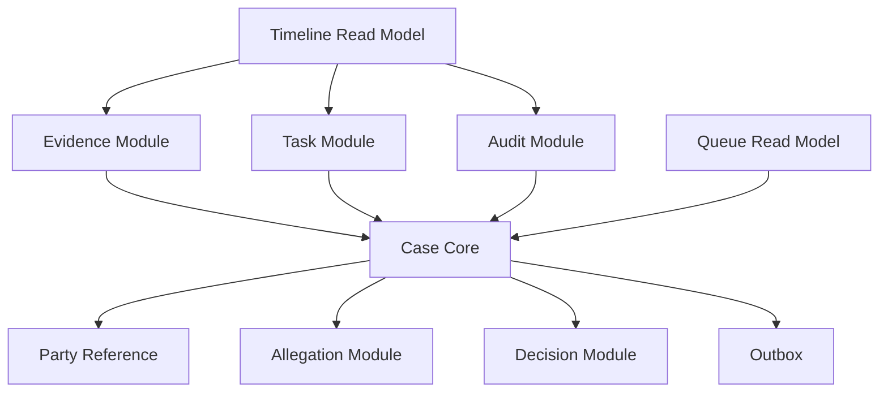
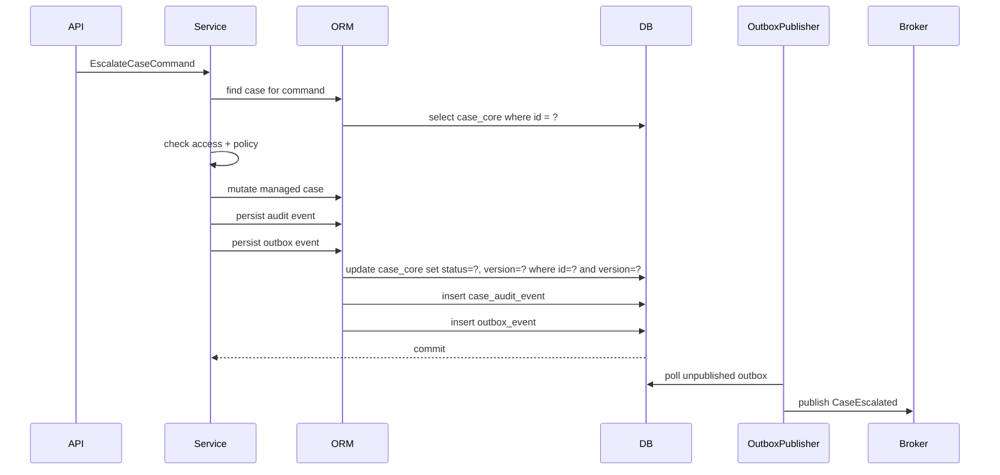
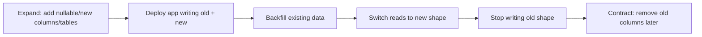
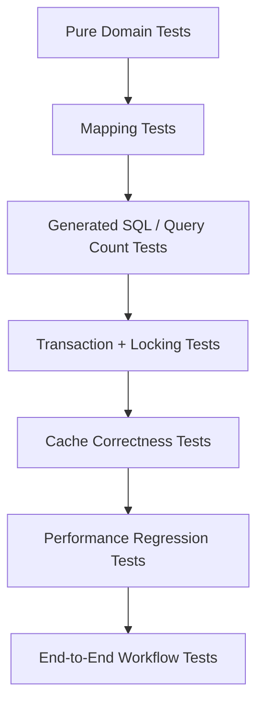

# Part 034 — Capstone: Production-Grade ORM Case Study and Final Review

This is the final part of the series.

The goal is to combine everything into one concrete production-grade design. We will build a mental architecture for a regulatory case lifecycle platform using Hibernate ORM and EclipseLink as alternative providers.

The point is not to show every possible annotation. The point is to make correct trade-offs:

- entity boundary versus read model
- aggregate consistency versus query performance
- provider portability versus provider leverage
- audit correctness versus write throughput
- cache benefit versus stale/authorization risk
- ORM convenience versus operational predictability

---

## 1. Case Study: Regulatory Case Lifecycle Platform

We will model a platform that manages enforcement cases from intake to closure.

### 1.1 Core Business Capabilities

The system supports:

- case intake
- party association
- allegation registration
- evidence collection
- officer assignment
- task orchestration
- escalation
- supervisory review
- decision recording
- sanction recommendation
- closure
- audit trail
- dashboard and queue views
- integration events for downstream systems

### 1.2 Non-Functional Requirements

| Requirement | Implication for ORM design |
|---|---|
| Regulatory defensibility | Audit history must be durable and queryable |
| High read volume dashboards | DTO/read model preferred over entity graph traversal |
| Concurrent case work | Optimistic locking and retry strategy required |
| Strict authorization | Query predicates and projection must include access scope |
| Multi-tenant deployment option | Tenant isolation must be explicit in key/cache/schema design |
| Long lifecycle | Avoid giant aggregates that grow forever |
| Integration with downstream systems | Outbox pattern required |
| Operational debugging | SQL/query/cache/flush metrics must be observable |
| Zero-downtime release | Schema evolution must follow expand-migrate-contract |

---

## 2. Domain Boundary Design

A naïve model would make `Case` the root of everything:

```java
class Case {
    List<Party> parties;
    List<Allegation> allegations;
    List<Evidence> evidence;
    List<Task> tasks;
    List<Assignment> assignments;
    List<Escalation> escalations;
    List<Decision> decisions;
    List<AuditEvent> auditEvents;
}
```

This is not a good ORM aggregate. It grows indefinitely, causes large collection hazards, and encourages accidental full-graph loading.

### 2.1 Better Boundary Split



### 2.2 Ownership Rules

| Area | Owner | ORM relationship style |
|---|---|---|
| Case lifecycle state | Case core | Entity root |
| Party profile | Party module | Reference by `partyId` |
| Allegation | Case/allegation module | Private child if bounded |
| Evidence | Evidence module | Reference by `caseId`; avoid giant collection |
| Task | Task module | Reference by `caseId`; separate lifecycle |
| Audit event | Audit module | Append-only table; no mutable child collection |
| Queue view | Read model | Projection/table/view, not entity graph |
| Timeline view | Read model | Projection assembled from events |
| Integration event | Outbox module | Transactional row |

The principle:

> The business concept “belongs to the case” does not automatically mean it should be a `@OneToMany` collection on `CaseEntity`.

---

## 3. Persistence Model

### 3.1 Case Core Entity

```java
@Entity
@Table(name = "case_core")
class CaseCoreEntity {
    @Id
    private UUID id;

    @Version
    private long version;

    @Enumerated(EnumType.STRING)
    @Column(nullable = false)
    private CaseStatus status;

    @Column(nullable = false)
    private UUID primaryPartyId;

    @Column(nullable = false)
    private String owningUnit;

    @Column(nullable = false)
    private Instant openedAt;

    private Instant escalatedAt;
    private Instant closedAt;

    protected CaseCoreEntity() {
    }

    void escalate(String targetUnit, Instant now) {
        if (!status.canEscalate()) {
            throw new InvalidCaseStateException(status);
        }
        this.status = CaseStatus.ESCALATED;
        this.owningUnit = targetUnit;
        this.escalatedAt = now;
    }

    void close(Instant now) {
        if (!status.canClose()) {
            throw new InvalidCaseStateException(status);
        }
        this.status = CaseStatus.CLOSED;
        this.closedAt = now;
    }
}
```

### 3.2 Allegation as Bounded Child

If allegations are small and lifecycle-contained, they may be mapped as children.

```java
@Entity
@Table(name = "case_allegation")
class CaseAllegationEntity {
    @Id
    private UUID id;

    @Column(nullable = false)
    private UUID caseId;

    @Enumerated(EnumType.STRING)
    private AllegationType type;

    private String summary;
}
```

Even here, avoid default bidirectional collection if command paths do not require loading all allegations through case root.

### 3.3 Evidence as Separate Lifecycle

Evidence often has separate retention, storage, classification, security, and chain-of-custody requirements.

```java
@Entity
@Table(name = "evidence_item")
class EvidenceItemEntity {
    @Id
    private UUID id;

    @Column(nullable = false)
    private UUID caseId;

    @Column(nullable = false)
    private String storageObjectKey;

    @Enumerated(EnumType.STRING)
    private EvidenceClassification classification;

    private Instant receivedAt;
}
```

This should not be a large lazy collection hanging from `CaseCoreEntity`.

### 3.4 Audit Event

```java
@Entity
@Table(name = "case_audit_event")
class CaseAuditEventEntity {
    @Id
    private UUID id;

    @Column(nullable = false)
    private UUID caseId;

    @Column(nullable = false)
    private String eventType;

    @Column(nullable = false)
    private String actorId;

    @Column(nullable = false)
    private Instant occurredAt;

    @Column(nullable = false)
    private String reasonCode;

    @Column(columnDefinition = "jsonb")
    private String payload;
}
```

Audit is append-only. Do not hide audit creation inside arbitrary entity callbacks if the audit must include actor, reason, correlation ID, and command context.

### 3.5 Outbox Event

```java
@Entity
@Table(name = "outbox_event")
class OutboxEventEntity {
    @Id
    private UUID id;

    @Column(nullable = false)
    private String aggregateType;

    @Column(nullable = false)
    private UUID aggregateId;

    @Column(nullable = false)
    private String eventType;

    @Column(nullable = false)
    private Instant occurredAt;

    @Column(nullable = false)
    private String payload;

    private Instant publishedAt;
}
```

The outbox event is written in the same transaction as the case mutation.

---

## 4. Command Flow: Escalate Case

### 4.1 Application Service

```java
@Transactional
public EscalateCaseResult escalate(EscalateCaseCommand command) {
    CaseCoreEntity caze = caseRepository.findForEscalation(command.caseId())
            .orElseThrow(CaseNotFoundException::new);

    AccessDecision access = authorizationService.checkEscalate(command.actor(), caze);
    EscalationDecision escalation = escalationPolicy.decide(caze, command.reason(), clock.instant());

    caze.escalate(escalation.targetUnit(), clock.instant());

    auditRepository.append(CaseAuditEventEntity.escalated(command, escalation, access));
    outboxRepository.append(OutboxEventEntity.caseEscalated(command.caseId(), escalation));

    return new EscalateCaseResult(caze.id(), caze.version());
}
```

### 4.2 Expected Runtime Behavior

Inside one transaction:

1. load case row
2. check authorization
3. compute escalation
4. mutate managed entity
5. append audit row
6. append outbox row
7. flush update + inserts
8. commit



### 4.3 Correctness Invariants

- Case row is versioned.
- Escalation checks current state inside transaction.
- Audit and outbox are written atomically with the case update.
- External broker publication occurs after commit.
- Lazy associations are not needed for this command.
- Failure before commit leaves no partial external event.
- Failure after commit can be recovered by outbox polling.

---

## 5. Hibernate Implementation Path

Hibernate-specific implementation can use provider extensions where they provide measurable value.

### 5.1 Recommended Hibernate Choices

| Concern | Hibernate option |
|---|---|
| Core persistence | Jakarta Persistence API with Hibernate provider |
| Dirty tracking | Build-time enhancement for large mutable models where justified |
| JSON payload | `@JdbcTypeCode(SqlTypes.JSON)` if database supports JSON well |
| Soft delete | Hibernate `@SoftDelete` for simple cases; explicit model for audit-heavy cases |
| Bulk outbox publishing | Native SQL or `StatelessSession` for high-volume publisher updates |
| Diagnostics | `StatementInspector`, statistics, SQL comments, slow query logging |
| Cache | Second-level cache only for immutable/reference data unless carefully governed |
| Fetch tuning | batch fetch, subselect fetch, entity graph, fetch profiles where isolated |

### 5.2 Hibernate Repository Example

```java
@Repository
class HibernateCaseRepository implements CaseRepository {
    @PersistenceContext
    private EntityManager em;

    @Override
    public Optional<CaseCoreEntity> findForEscalation(UUID id) {
        return em.createQuery("""
                select c
                from CaseCoreEntity c
                where c.id = :id
                """, CaseCoreEntity.class)
            .setParameter("id", id)
            .setLockMode(LockModeType.OPTIMISTIC)
            .getResultStream()
            .findFirst();
    }
}
```

For high-contention cases, pessimistic lock may be chosen intentionally:

```java
.setLockMode(LockModeType.PESSIMISTIC_WRITE)
.setHint("jakarta.persistence.lock.timeout", 500)
```

Do not use pessimistic locking by default. Use it when contention pattern and database behavior justify it.

### 5.3 Hibernate Diagnostics Configuration Concept

```properties
hibernate.generate_statistics=true
hibernate.session_factory.statement_inspector=com.example.orm.SqlShapeInspector
hibernate.default_batch_fetch_size=32
hibernate.jdbc.batch_size=50
hibernate.order_inserts=true
hibernate.order_updates=true
```

Treat these as environment-sensitive. Benchmark and verify behavior before production rollout.

---

## 6. EclipseLink Implementation Path

EclipseLink has a different vocabulary: sessions, descriptors, UnitOfWork, weaving, indirection, query hints, shared cache, and descriptor customizers.

### 6.1 Recommended EclipseLink Choices

| Concern | EclipseLink option |
|---|---|
| Core persistence | Jakarta Persistence API with EclipseLink provider |
| Lazy loading | Weaving/indirection enabled and verified in tests |
| Change tracking | Attribute/object/deferred change tracking when justified |
| Query tuning | EclipseLink query hints and batch fetching |
| Shared cache | Explicit cache isolation policy; avoid for authorization-sensitive data |
| Multi-tenancy | EclipseLink multitenant support when model matches tenant strategy |
| Descriptor customization | Descriptor customizer for isolated provider behavior |
| Diagnostics | EclipseLink logging/profiler/performance monitor |

### 6.2 EclipseLink Repository Example

```java
@Repository
class EclipseLinkCaseRepository implements CaseRepository {
    @PersistenceContext
    private EntityManager em;

    @Override
    public Optional<CaseCoreEntity> findForEscalation(UUID id) {
        TypedQuery<CaseCoreEntity> query = em.createQuery("""
                select c
                from CaseCoreEntity c
                where c.id = :id
                """, CaseCoreEntity.class);

        query.setParameter("id", id);
        query.setLockMode(LockModeType.OPTIMISTIC);

        return query.getResultStream().findFirst();
    }
}
```

Provider hints belong in adapter-level code, not business services.

### 6.3 EclipseLink Diagnostics Configuration Concept

```properties
eclipselink.logging.level=FINE
eclipselink.logging.parameters=true
eclipselink.profiler=PerformanceProfiler
eclipselink.weaving=true
eclipselink.cache.shared.default=false
```

The exact configuration depends on runtime container, deployment model, and performance/security requirements.

---

## 7. Fetch Plan Comparison

### 7.1 Case Command Fetch

For `escalateCase`, do not fetch everything.

Needed:

- case core status
- version
- owning unit
- primary party ID if authorization requires it

Not needed:

- evidence list
- audit history
- task list
- full party profile
- timeline

Use a narrow entity load.

### 7.2 Case Details Read

For case details screen, entity graph may still be too broad. Prefer a query service returning DTOs.

```java
record CaseDetailsView(
        UUID caseId,
        CaseStatus status,
        String owningUnit,
        PartySummary party,
        List<AllegationSummary> allegations,
        List<EvidenceSummary> evidence,
        List<TaskSummary> openTasks
) {}
```

This can be assembled from multiple targeted queries, projections, or a read model.

### 7.3 Queue Read

For queue pages, never hydrate full entities.

```java
record CaseQueueRow(
        UUID caseId,
        CaseStatus status,
        String owningUnit,
        String primaryPartyName,
        Instant openedAt,
        Instant lastActionAt,
        int openTaskCount
) {}
```

Use projection or read-model table.

### 7.4 Fetch Strategy Table

| Use case | Recommended strategy |
|---|---|
| Escalate case | Narrow entity load with version |
| Close case | Narrow entity load + required checks |
| Case details | DTO projection or explicit entity graph if bounded |
| Timeline | Read model/projection from audit/evidence/task events |
| Queue | Read model/projection, keyset pagination if needed |
| Export | Streaming/native SQL/projection; avoid persistence context growth |

---

## 8. Cache Strategy

### 8.1 What Can Be Cached

Good candidates:

- immutable reference data
- code tables
- static policy lookup
- tenant-independent configuration if safe

Dangerous candidates:

- authorization-sensitive case entities
- mutable workflow state
- task assignment state
- evidence metadata with classification rules
- query results filtered by user scope

### 8.2 Cache Decision

| Data | Provider cache? | Reason |
|---|---:|---|
| Case core | Usually no | mutable, authorization-sensitive, workflow-critical |
| Code tables | Yes | stable, low risk |
| User access scope | No, not ORM cache | authorization semantics separate from entity identity |
| Queue rows | No provider cache | query/read-model cache if needed |
| Audit events | Rarely | append-only but high volume and query-specific |

### 8.3 Cache Invariant

> A cached entity must not allow a user to observe data they could not have loaded from the database under the current tenant and authorization scope.

If you cannot prove this, do not cache it at provider level.

---

## 9. Transaction and Locking Strategy

### 9.1 Optimistic Locking Default

Use `@Version` on mutable aggregate roots.

```java
@Version
private long version;
```

Expected update shape:

```sql
update case_core
set status = ?, owning_unit = ?, version = ?
where id = ? and version = ?
```

If zero rows are updated, the version was stale and the command should fail or retry according to policy.

### 9.2 Pessimistic Locking for Hot Cases

Use only when:

- multiple officers frequently modify same case concurrently
- conflict retry is more expensive than waiting
- database deadlock behavior is understood
- lock timeout is set
- operational metrics exist

### 9.3 Isolation Reasoning

ORM does not remove the need to understand database isolation.

Examples:

- optimistic locking prevents lost update on versioned row
- it does not prevent all write skew scenarios
- read-only projections may observe different committed states depending on isolation
- bulk updates can bypass persistence context and optimistic checks

---

## 10. Audit and Temporal Strategy

### 10.1 Audit Types

| Type | Purpose |
|---|---|
| Technical audit | who changed which column |
| Business audit | what business event occurred and why |
| Temporal validity | what was true at a given effective time |
| Integration audit | what was published/received externally |

Do not confuse them.

### 10.2 Hibernate Envers vs Explicit Audit

Hibernate Envers is useful for revision history of entity state.

Use explicit audit when:

- audit event must include business reason
- actor/correlation/authorization context matters
- event must be understandable by non-engineers
- bulk operations must be represented as business events
- history must outlive entity mapping changes

### 10.3 EclipseLink HistoryPolicy vs Explicit Audit

EclipseLink history support can help with historical row tracking, but business audit still often deserves explicit modeling.

### 10.4 Final Recommendation

For regulatory lifecycle systems:

- use explicit business audit event table
- optionally use provider revision/history feature for technical diffs
- keep audit append-only
- keep audit write in same transaction as state change
- expose audit through read model/projection, not entity graph traversal

---

## 11. Schema Evolution Plan

### 11.1 Expand-Migrate-Contract



### 11.2 Example: Split Case Owner

Old:

```sql
case_core(owning_unit)
```

New:

```sql
case_assignment(case_id, owning_unit, assigned_officer_id, valid_from, valid_to)
```

Migration path:

1. create `case_assignment`
2. dual-write current owner to both places
3. backfill assignment history
4. read from `case_assignment`
5. stop using `case_core.owning_unit`
6. remove column in later release

Do not rely on ORM auto-update for this kind of production migration.

---

## 12. Performance Test Plan

### 12.1 What to Measure

| Dimension | Metric |
|---|---|
| Query count | SQL statements per use case |
| Row volume | rows read/written per use case |
| Hydration | entities/collections loaded |
| Flush | flush count and action count |
| Dirty checking | persistence context size |
| Cache | hit/miss/put/eviction |
| Locking | lock wait, timeout, deadlock |
| Batch | batch size and round trips |
| Pool | connection acquisition time |
| Database | execution plan, index use, buffer reads |

### 12.2 Performance Scenarios

Test at least:

- escalate case under low contention
- escalate same case under high contention
- queue page with filters and pagination
- case details with many evidence items
- audit timeline for long-lived case
- bulk import of evidence metadata
- outbox publisher under backlog
- schema migration backfill

### 12.3 Query Count Budget Example

| Use case | Budget |
|---|---:|
| Escalate case | 1 select + 1 update + 2 inserts |
| Close case | 1 select + 1 update + audit/outbox inserts |
| Queue page | 1 query for rows, optional 1 count query |
| Case details | bounded number of projection queries |
| Timeline | 1-3 projection queries, no entity graph explosion |

Budgets should be enforced in integration tests for critical paths.

---

## 13. Testing Strategy

### 13.1 Test Pyramid for ORM



### 13.2 Required Test Classes

| Test | Purpose |
|---|---|
| Mapping test | provider boots with mappings and schema validation |
| SQL prediction test | critical use cases stay within query budget |
| Fetch test | no hidden N+1 or accidental eager graph |
| Flush test | writes occur only when expected |
| Optimistic conflict test | stale command fails correctly |
| Audit atomicity test | audit row commits/rolls back with case state |
| Outbox atomicity test | outbox row commits/rolls back with case state |
| Cache isolation test | tenant/authorization stale data not leaked |
| Migration compatibility test | old/new app versions tolerate expanded schema |

### 13.3 Dual-Provider Test Harness

If portability between Hibernate and EclipseLink matters, run core tests against both providers.

```txt
same domain tests
same repository contract tests
same schema validation tests
same command-flow tests
provider-specific diagnostics tests separated
```

Do not pretend provider portability exists unless it is continuously tested.

---

## 14. Failure Simulation

### 14.1 Optimistic Conflict

Scenario:

- Officer A loads case version 10
- Officer B escalates and commits version 11
- Officer A tries to close version 10

Expected:

- update affects zero rows or provider raises optimistic lock exception
- service returns conflict response
- no audit/outbox row is committed for failed close

### 14.2 Broker Down After Commit

Scenario:

- case escalated
- transaction commits
- broker unavailable

Expected:

- case state and outbox row exist
- publisher retries later
- event is eventually published once

### 14.3 Lazy Loading Outside Transaction

Scenario:

- controller returns entity
- serializer touches lazy collection

Expected in good architecture:

- impossible because entity is never returned
- test/code review forbids entity response

### 14.4 Bulk Operation Bypasses Audit

Scenario:

```java
em.createQuery("update CaseCoreEntity c set c.status = CLOSED where c.closedAt < :cutoff")
  .executeUpdate();
```

Expected in good architecture:

- forbidden unless an explicit audit/backfill strategy exists
- persistence context cleared after bulk update
- cache eviction strategy applied

### 14.5 Cache Leakage

Scenario:

- case loaded by supervisor
- cached at provider level
- later accessed by officer without permission

Expected in good architecture:

- authorization-sensitive case entity not provider-cached
- query predicates enforce access scope
- cache tests prove isolation

---

## 15. Production Readiness Checklist

### 15.1 Mapping

- [ ] No accidental entity exposure in API/message contracts
- [ ] Large collections avoided on aggregate roots
- [ ] Cascade only used for true lifecycle containment
- [ ] Cross-module references use IDs or module APIs
- [ ] `@Version` exists on mutable aggregate roots
- [ ] `equals`/`hashCode` tested for persistence lifecycle

### 15.2 Query and Fetch

- [ ] Critical use cases have SQL count budgets
- [ ] Fetch plans are explicit for hot paths
- [ ] Queue/dashboard uses projection or read model
- [ ] Pagination does not combine unsafe fetch join with large collections
- [ ] N+1 regression tests exist
- [ ] Native SQL usage has mapping and migration tests

### 15.3 Transaction and Consistency

- [ ] Transaction boundaries are use-case scoped
- [ ] External network calls are outside DB transaction
- [ ] Outbox is transactional
- [ ] Optimistic conflicts have user/business-level handling
- [ ] Pessimistic locks have timeout and metrics
- [ ] Bulk operations document audit/cache/context effects

### 15.4 Cache

- [ ] Provider cache disabled by default for mutable sensitive entities
- [ ] Reference-data cache has invalidation policy
- [ ] Query cache use is justified and measured
- [ ] Tenant and authorization isolation are proven
- [ ] Cache metrics are exported

### 15.5 Observability

- [ ] SQL logging available safely in lower environments
- [ ] Bind logging policy avoids sensitive data leakage
- [ ] Hibernate statistics or EclipseLink profiler available when needed
- [ ] Slow query and execution plan workflow exists
- [ ] Connection pool metrics are monitored
- [ ] ORM incident runbook exists

### 15.6 Schema Evolution

- [ ] ORM auto-update disabled for production schema changes
- [ ] Migrations are explicit and reviewed
- [ ] Expand-migrate-contract is used for breaking changes
- [ ] Backfill jobs are idempotent and chunked
- [ ] Old/new app versions are compatibility-tested

---

## 16. Final Skill Assessment

You have reached a high level of ORM fluency when you can answer these without guessing.

### 16.1 Mapping

- Which side owns each association?
- Which mutations cause which SQL statements?
- Which cascades are lifecycle-correct and which are dangerous?
- Which collections can grow without bound?
- Which relationships cross module boundaries and should become ID references?

### 16.2 Runtime

- What is in the persistence context at each point in the use case?
- When will flush happen?
- Which objects are dirty and why?
- Which queries may trigger flush?
- Which lazy associations can be accessed safely?

### 16.3 Query and Performance

- How many SQL statements does the use case execute?
- How many rows are read and hydrated?
- Is the database optimizer likely to use the expected index?
- Is this an entity-load problem or a projection problem?
- Is batching actually happening?

### 16.4 Consistency

- What prevents lost update?
- What happens on optimistic conflict?
- What happens if the transaction rolls back after audit creation?
- What happens if broker publication fails after commit?
- Is the cache allowed to serve this data?

### 16.5 Provider Mastery

- Which behavior is Jakarta Persistence portable?
- Which behavior is Hibernate-specific?
- Which behavior is EclipseLink-specific?
- How is provider-specific logic isolated?
- How would a provider migration be tested?

---

## 17. Series Recap

This series covered:

1. Kaufman skill map for ORM provider mastery
2. provider mental model
3. bootstrap, metadata, and enhancement
4. entity state machine
5. persistence context and UnitOfWork
6. flush mechanics
7. dirty checking and change tracking
8. identifier generation
9. aggregate boundary mapping
10. advanced associations
11. inheritance mapping
12. embeddables and custom types
13. query engine internals
14. lazy loading, proxies, and weaving
15. fetch planning
16. SQL prediction
17. transaction, locking, and isolation
18. cache correctness
19. production cache design
20. batching and bulk operations
21. read models and DTO projections
22. multi-tenancy
23. auditing, temporal models, and soft delete
24. provider extension matrix
25. Hibernate internals
26. EclipseLink internals
27. diagnostics
28. ORM testing
29. schema evolution
30. performance engineering
31. failure modes
32. provider migration
33. enterprise ORM architecture patterns
34. capstone and final review

---

## 18. What To Learn Next

After this series, the most valuable follow-up areas are:

### 18.1 Database Internals for Java Engineers

Focus:

- MVCC
- locking
- query optimizer
- indexes
- execution plans
- statistics
- deadlocks
- partitioning
- vacuum/maintenance behavior

Why:

ORM mastery is incomplete without database execution literacy.

### 18.2 Advanced Transaction and Consistency Patterns

Focus:

- sagas
- outbox/inbox
- idempotency
- exactly-once illusion
- retry semantics
- compensating actions
- distributed consistency modeling

Why:

ORM handles local consistency. Enterprise systems need cross-boundary consistency design.

### 18.3 Event-Sourced and Temporal Systems

Focus:

- event modeling
- snapshots
- projections
- temporal queries
- bitemporal data
- audit defensibility

Why:

Regulatory systems often require historical truth, not only current-state mutation.

### 18.4 Java Persistence Performance Lab

Build a lab with:

- PostgreSQL or another real target database
- Hibernate and EclipseLink profiles
- Testcontainers
- query-count assertions
- execution-plan capture
- cache metrics
- contention tests
- bulk import scenarios

Why:

The final step is turning mental models into repeatable measurement.

---

## 19. Final Conclusion

Hibernate ORM and EclipseLink are not merely persistence libraries. They are runtime engines for coordinating object identity, database state, transactions, queries, cache, and change tracking.

A top-level engineer does not ask, “Which annotation should I use?” first.

They ask:

- What is the consistency boundary?
- What is the state transition?
- What is the query shape?
- What data must be loaded?
- What SQL should be generated?
- What can go stale?
- What is cached?
- What is audited?
- What happens under concurrency?
- What happens during migration?
- What does the provider guarantee and what does it merely happen to do?

That is the difference between using ORM and engineering with ORM.

**This is the final part of the series. The series `learn-java-hibernate-orm-eclipselink` is complete.**

---

## References

- Hibernate ORM Documentation: https://hibernate.org/orm/documentation/
- Hibernate ORM User Guide: https://docs.hibernate.org/stable/orm/userguide/html_single/
- Hibernate ORM Javadocs: https://docs.hibernate.org/orm/7.0/javadocs/
- Jakarta Persistence 3.2 Specification: https://jakarta.ee/specifications/persistence/3.2/
- EclipseLink Documentation: https://eclipse.dev/eclipselink/documentation/
- EclipseLink JPA Extensions Reference: https://eclipse.dev/eclipselink/documentation/4.0/jpa/extensions/jpa-extensions.html
