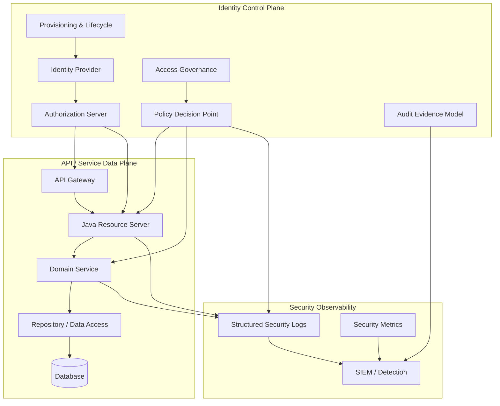
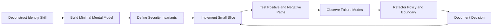
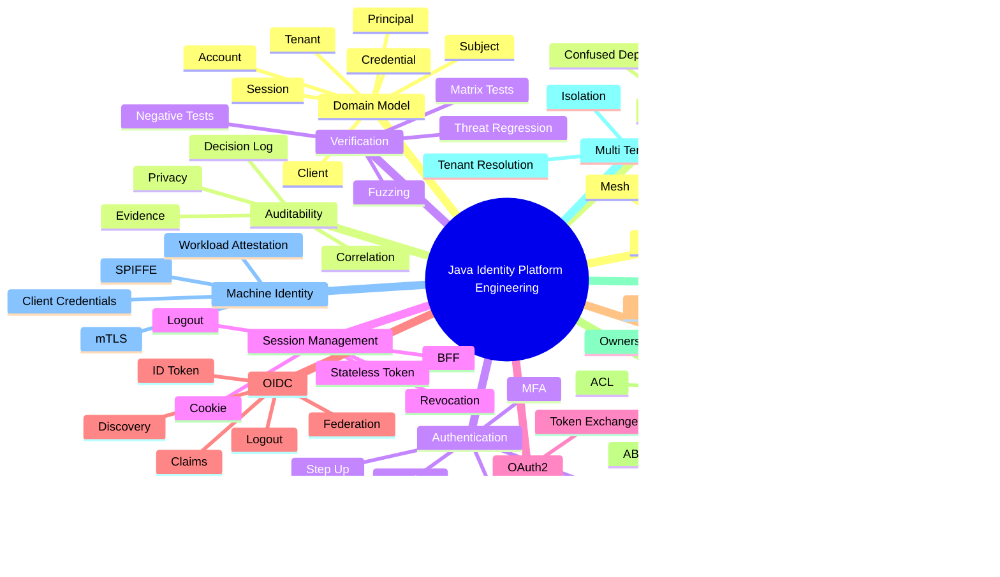
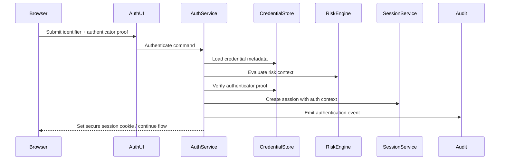
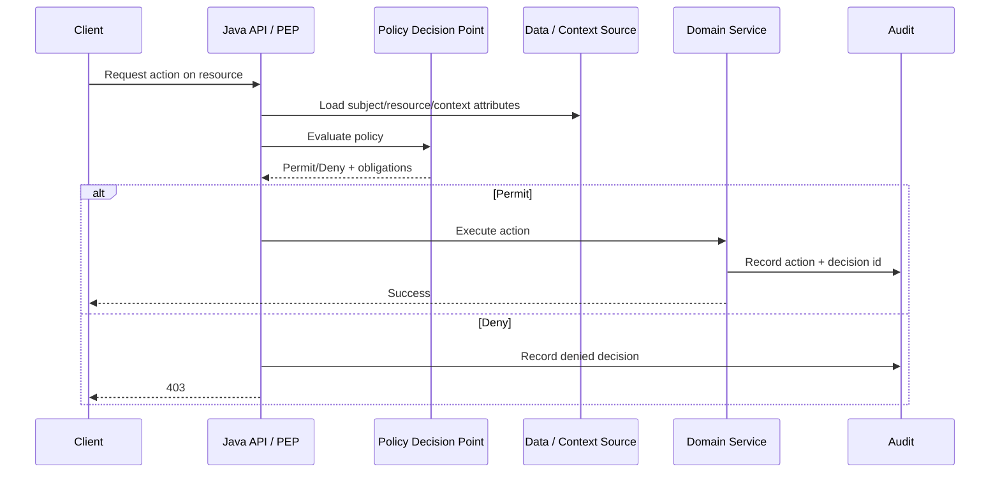
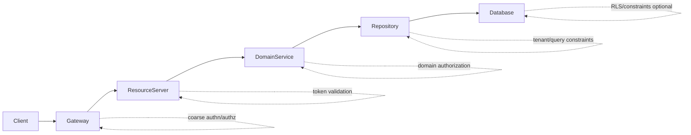
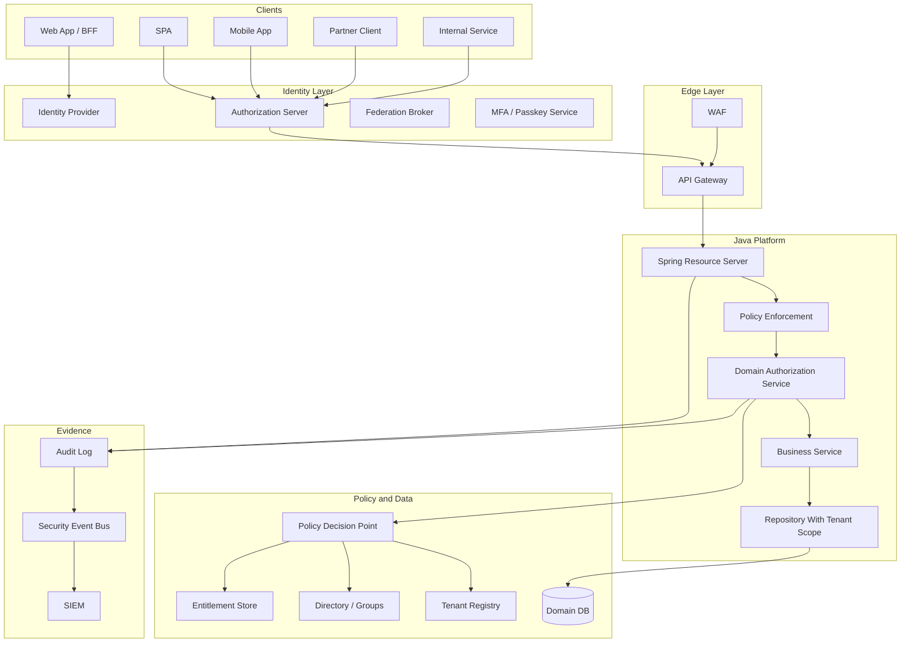

------
title: Learn Java Identity, Authentication & Authorization for Secure Enterprise API Platform - Part 001
description: Kaufman-style skill map untuk membangun kemampuan enterprise identity engineering di Java: authentication, authorization, OAuth/OIDC, API security, tenant isolation, auditability, dan secure platform thinking.
series: learn-java-identity-authentication-authorization-api-platform
seriesTitle: Learn Java Identity, Authentication & Authorization for Secure Enterprise API Platform
order: 1
partTitle: Kaufman Skill Map for Enterprise Identity Engineering
tags:
- java
- identity
- authentication
- authorization
- oauth
- oidc
- api-security
- enterprise-architecture
date: 2026-06-28
---

# Part 001 — Kaufman Skill Map for Enterprise Identity Engineering

Tujuan part ini bukan mengajarkan “cara menambahkan login” ke aplikasi Java.
Itu terlalu dangkal.

Tujuan part ini adalah membangun **peta skill** untuk menjadi engineer yang mampu mendesain, mengimplementasikan, menguji, mengoperasikan, dan mempertanggungjawabkan **identity-aware secure enterprise API platform**.

Dalam platform enterprise, identity bukan fitur UI. Identity adalah **control plane** yang menentukan:

- siapa actor yang sedang bertindak,
- atas nama siapa tindakan dilakukan,
- dari client atau workload mana request berasal,
- dalam tenant atau boundary organisasi mana request berlaku,
- assurance level apa yang mendukung keputusan tersebut,
- resource/action apa yang boleh disentuh,
- bukti apa yang dapat diaudit ketika keputusan dipertanyakan,
- bagaimana sistem tetap aman ketika token bocor, user pindah role, tenant salah resolve, service compromised, atau policy berubah.

Kita akan memakai pendekatan Josh Kaufman dalam *The First 20 Hours*: pecah skill menjadi subskill kecil, pelajari cukup untuk self-correction, hilangkan hambatan praktik, lalu lakukan latihan terarah. Namun karena target seri ini bukan pemula, kita akan menaikkan kualitas praktiknya menjadi setara **internal engineering handbook**: invariants, decision record, failure mode, design review, testing oracle, dan operational readiness.

> Fokus utama: bukan hafal OAuth, bukan hafal annotation Spring Security, bukan hafal JWT claim. Fokus utama adalah mampu membuat **keputusan desain identity/security yang benar di bawah constraint produksi**.

---

## 1. Target Performa Seri Ini

Setelah menyelesaikan seri ini, kamu harus mampu melakukan minimal enam hal berikut.

### 1.1 Mendesain identity model yang tidak rancu

Kamu harus bisa membedakan:

- human user,
- legal person / party,
- account,
- principal,
- subject,
- credential,
- authenticator,
- session,
- token,
- client,
- workload,
- service account,
- role assignment,
- entitlement,
- tenant membership,
- delegation,
- impersonation,
- audit actor.

Jika semua itu dimodelkan sebagai `User`, sistem akan cepat membusuk. Banyak bug authorization bukan berasal dari crypto lemah, tetapi dari model domain yang salah.

### 1.2 Mendesain authentication flow yang sesuai risiko

Kamu harus bisa memutuskan kapan cukup memakai session cookie, kapan perlu OAuth/OIDC, kapan perlu MFA, kapan perlu step-up, kapan refresh token boleh diberikan, kapan harus menggunakan BFF, kapan SPA tidak boleh memegang token sensitif, dan kapan authentication harus dianggap tidak cukup kuat untuk operasi tertentu.

### 1.3 Mendesain authorization yang benar pada object/action/resource level

Kamu harus bisa menjawab pertanyaan seperti:

- apakah role cukup?
- apakah scope cukup?
- apakah claim token boleh dipakai sebagai sumber otoritas?
- di layer mana object-level authorization ditegakkan?
- bagaimana memastikan query database tidak membocorkan object tenant lain?
- bagaimana menghindari BOLA/IDOR?
- bagaimana menguji negative path authorization secara sistematis?

### 1.4 Mendesain enterprise API security platform

Kamu harus bisa membagi tanggung jawab antara:

- identity provider,
- authorization server,
- API gateway,
- resource server,
- service mesh,
- policy decision point,
- policy enforcement point,
- audit/event pipeline,
- admin console,
- provisioning system,
- incident response process.

### 1.5 Membuat desain yang operable dan auditable

Sistem identity yang bagus bukan hanya “request sukses/ditolak”. Sistem harus bisa menjawab:

- siapa yang membuat keputusan?
- input keputusan apa saja?
- policy version mana yang aktif?
- apakah keputusan dibuat dari claim token, lookup database, atau policy engine?
- apakah user sedang impersonated?
- apakah action dilakukan oleh human, automation, workload, atau delegated client?
- bagaimana membuktikan bahwa tenant isolation tidak dilanggar?

### 1.6 Mengenali failure mode sebelum incident

Kamu harus bisa melihat desain dan menemukan risiko seperti:

- token dipakai sebagai session tanpa revocation model,
- API gateway dipercaya sebagai satu-satunya enforcement boundary,
- role terlalu coarse sehingga privilege membesar,
- permission dikodekan di JWT lalu tidak bisa dicabut cepat,
- object-level check hanya ada di controller,
- tenant ID diterima dari client tanpa binding,
- support staff bisa impersonate tanpa audit kuat,
- service account dipakai bersama banyak service,
- refresh token rotation tidak atomik,
- audit log mencatat PII/token.

---

## 2. Mental Model Besar: Identity Adalah Control Plane

Dalam banyak sistem, engineer memperlakukan identity sebagai middleware:

```text
request -> auth filter -> controller -> service -> database
```

Model ini terlalu sempit.

Untuk enterprise platform, identity harus dipahami sebagai **control plane** yang menghasilkan sinyal dan keputusan untuk seluruh data plane.



Beberapa konsekuensi penting:

1. **Authentication bukan authorization.** Authentication menjawab “siapa/apa actor ini dan seberapa kuat buktinya”. Authorization menjawab “apakah actor ini boleh melakukan action tertentu pada resource tertentu dalam context ini”.
2. **Token bukan user.** Token adalah artefak pembawa assertion/claim/authorization grant, bukan representasi lengkap actor.
3. **Scope bukan permission domain.** Scope sering berarti delegation boundary antara client dan resource server, bukan otomatis object-level permission.
4. **Gateway bukan pengganti resource server security.** Gateway bisa melakukan coarse-grained enforcement, tetapi service tetap harus memvalidasi token dan menegakkan authorization domain.
5. **Identity berubah sepanjang lifecycle.** Role berubah, account dinonaktifkan, session harus dicabut, credential hilang, tenant membership dipindah, consent ditarik, client dirotasi.
6. **Audit bukan logging biasa.** Audit adalah evidence model untuk membuktikan keputusan dan tindakan.

---

## 3. Framework Kaufman yang Kita Pakai

Josh Kaufman mengusulkan pola akuisisi skill yang sangat praktis:

1. deconstruct the skill,
2. learn enough to self-correct,
3. remove practice barriers,
4. practice deliberately for at least 20 hours.

Untuk seri ini, kita adaptasi menjadi engineering loop berikut.



Perbedaannya dengan belajar biasa:

- Kita tidak mulai dari library.
- Kita mulai dari **security outcome**.
- Kita tidak hanya membuat flow yang sukses.
- Kita membangun cara untuk membuktikan flow gagal secara aman.
- Kita tidak hanya menulis kode.
- Kita menulis invariant, test oracle, audit expectation, dan operational checklist.

---

## 4. Deconstruct the Skill: 14 Subskill Inti

Skill identity enterprise bisa dipetakan menjadi 14 subskill.



Kita akan mengerjakan subskill ini secara bertahap sepanjang 35 part.

---

## 5. Skill 1 — Identity Domain Modeling

Domain model adalah fondasi. Salah model akan menghasilkan bug yang sulit diperbaiki.

### 5.1 Pertanyaan yang harus bisa dijawab

- Apakah `userId` merepresentasikan person, account, subject, atau principal?
- Apakah satu orang boleh punya beberapa account?
- Apakah satu account boleh login dari beberapa external IdP?
- Apakah service account adalah user?
- Apakah workload identity sama dengan client credential?
- Apakah tenant membership melekat ke account atau ke subject?
- Apakah email boleh menjadi primary key identity?
- Bagaimana account disabled memengaruhi session/token yang masih hidup?

### 5.2 Invariant awal

- Stable identity identifier tidak boleh memakai email/username yang mutable.
- Account bukan credential.
- Credential bukan authenticator event.
- Subject bukan role.
- Principal dalam request adalah hasil authentication, bukan master data user.
- Tenant context harus dibuktikan, bukan hanya diterima dari header client.

### 5.3 Practice drill

Ambil sistem yang pernah kamu bangun. Tulis ulang model `User` menjadi minimal:

- `Subject`
- `Account`
- `Credential`
- `TenantMembership`
- `Session`
- `ClientApplication`
- `AuthorizationGrant`

Lalu jawab: operasi mana yang berubah ketika user mengganti email? operasi mana yang berubah ketika account disabled? operasi mana yang berubah ketika tenant membership dicabut?

---

## 6. Skill 2 — Threat Modeling for Identity

Identity system gagal ketika attacker bisa membuat sistem salah mengenali actor, salah mengikat context, atau salah memberi akses.

### 6.1 Threat utama

| Threat | Contoh | Dampak |
|---|---|---|
| Credential theft | Password/phishing/session cookie dicuri | Account takeover |
| Token replay | Bearer token dipakai ulang oleh attacker | Unauthorized API access |
| Authorization code interception | Code OAuth dicuri di redirect | Token issuance ke attacker |
| Confused deputy | Service melakukan action atas nama actor yang salah | Privilege escalation |
| Broken Object Level Authorization | User mengubah `/accounts/{id}` ke ID milik orang lain | Data breach |
| Tenant escape | Tenant A membaca data tenant B | Cross-tenant incident |
| Stale entitlement | Role dicabut, token masih berisi role lama | Access continues after revocation |
| Session fixation | Attacker mengikat korban ke session yang dikontrol | Account compromise |
| Impersonation abuse | Support staff acting-as tanpa audit | Insider risk |

### 6.2 Invariant threat model

- Semua ID dari client adalah hostile sampai dibuktikan oleh authorization check.
- Semua bearer token adalah transferable jika tidak sender-constrained.
- Semua claim dalam token hanya valid setelah issuer, signature, audience, expiry, dan intended use diverifikasi.
- Semua authorization decision harus mengikat subject, action, resource, tenant, dan context.
- Semua privileged support/admin flow harus menghasilkan evidence yang lebih kuat daripada request user biasa.

---

## 7. Skill 3 — Assurance Thinking

Enterprise identity tidak cukup dengan “login berhasil”. Kita perlu tahu **seberapa kuat** bukti identity.

NIST SP 800-63-4 membagi digital identity guidance ke area seperti identity proofing, authentication, dan federation assurance. Dalam desain platform, ini bisa diterjemahkan menjadi tiga pertanyaan engineering:

1. **Identity proofing:** seberapa yakin kita bahwa account ini terkait dengan orang/organisasi yang benar?
2. **Authentication:** seberapa kuat bukti bahwa request saat ini dibuat oleh pemegang account/credential yang sah?
3. **Federation:** seberapa kuat kita mempercayai assertion dari identity provider lain?

### 7.1 Contoh risk-tiering

| Operation | Minimum assurance | Tambahan |
|---|---:|---|
| Read public profile sendiri | Low | Authenticated session cukup |
| Update email | Medium | Re-authentication / step-up |
| Create payment beneficiary | High | MFA/passkey + device/risk check |
| Approve enforcement decision | High | Strong auth + role + SoD + audit reason |
| Break-glass admin access | Very high | Approval + time-bound access + immutable audit |

### 7.2 Invariant

- Authentication strength harus menjadi bagian dari context authorization.
- Operasi high-risk tidak boleh hanya mengandalkan session lama.
- Federation trust harus dikonfigurasi eksplisit per issuer/tenant/client.

---

## 8. Skill 4 — Authentication Architecture

Authentication menjawab: **apakah actor dapat membuktikan kontrol atas authenticator yang terkait dengan identity tertentu?**

Yang harus dikuasai:

- password storage dan verification boundary,
- passkey/WebAuthn mental model,
- MFA enrollment dan recovery,
- brute-force protection,
- anti-enumeration,
- account lockout vs throttling,
- re-authentication,
- step-up authentication,
- credential rotation,
- compromised credential response.

### 8.1 Anti-pattern

```java
if (user.getPassword().equals(request.password())) {
    login(user);
}
```

Masalahnya bukan hanya password plaintext. Masalahnya adalah model mentalnya: authentication diperlakukan sebagai perbandingan string, bukan sebagai proses verifikasi credential dengan throttling, audit, risk evaluation, password hashing, breach detection, dan session establishment.

### 8.2 Model yang lebih benar



---

## 9. Skill 5 — Session Management

Session adalah continuity mechanism. Ia menghubungkan request-request setelah authentication.

Kamu harus bisa membedakan:

- server-side session,
- browser cookie,
- OAuth access token,
- refresh token,
- ID token,
- API key,
- device credential,
- workload certificate.

### 9.1 Decision point

| Scenario | Bias desain |
|---|---|
| Server-rendered web app | Secure cookie + server-side session |
| SPA public client | Authorization Code + PKCE, hati-hati token storage |
| Browser + sensitive API | BFF pattern sering lebih aman |
| Mobile app | Authorization Code + PKCE + secure OS storage |
| Service-to-service | mTLS/workload identity/client credentials |
| High-risk operation | Step-up + short-lived proof/context |

### 9.2 Invariant

- Logout harus jelas scope-nya: local session, IdP session, refresh token, semua device, atau federated logout.
- Session harus punya idle timeout dan absolute timeout.
- Session creation harus terjadi setelah authentication berhasil dan session ID harus dirotasi setelah login.
- Token expiration bukan pengganti revocation model untuk kasus high-risk.

---

## 10. Skill 6 — OAuth 2.x Mental Model

OAuth adalah delegation framework, bukan authentication protocol. Untuk login, kita menggunakan OpenID Connect di atas OAuth.

### 10.1 Komponen inti

| Komponen | Makna |
|---|---|
| Resource Owner | Pemilik resource, sering human user |
| Client | Aplikasi yang meminta akses |
| Authorization Server | Pihak yang mengeluarkan token |
| Resource Server | API yang menerima dan memvalidasi token |
| Scope | Batas akses yang diminta/diberikan kepada client |
| Grant | Mekanisme client memperoleh token |
| Access Token | Token untuk mengakses resource server |
| Refresh Token | Token untuk memperoleh access token baru |

### 10.2 Kesalahan umum

- Menggunakan OAuth sebagai login tanpa OIDC.
- Menganggap scope sama dengan role user.
- Mengirim access token ke frontend tanpa threat model.
- Tidak memvalidasi audience.
- Menerima token dari issuer yang salah.
- Menggunakan implicit flow/ROPC pada sistem modern.
- Menggunakan redirect URI wildcard.

RFC 9700 memformalkan praktik keamanan modern OAuth dan mendepresiasi beberapa pola lama yang dianggap tidak aman.

---

## 11. Skill 7 — OpenID Connect

OIDC menambahkan identity layer di atas OAuth.

Yang harus dipahami:

- ID token bukan access token.
- ID token ditujukan untuk client/RP, bukan resource server umum.
- `nonce` mencegah replay dalam flow tertentu.
- `sub` adalah stable subject identifier dalam issuer tertentu.
- Claim mapping harus hati-hati, terutama email dan group.
- Federation perlu issuer trust, key validation, client registration, dan logout semantics.

### 11.1 Invariant

- Resource server tidak boleh menerima ID token sebagai access token kecuali desainnya eksplisit dan aman.
- `email_verified=true` bukan bukti bahwa user berhak mengakses tenant tertentu.
- `groups` claim bukan selalu source of truth untuk entitlement high-risk.

---

## 12. Skill 8 — Token Engineering

Token adalah artefak. Token bukan otoritas mutlak.

### 12.1 JWT vs opaque token

| Aspek | JWT | Opaque Token |
|---|---|---|
| Validasi lokal | Bisa | Tidak |
| Revocation cepat | Sulit tanpa tambahan mekanisme | Lebih mudah via introspection/store |
| Ukuran | Bisa besar | Kecil |
| Data exposure | Claim terlihat oleh holder | Minimal |
| Coupling | Resource server tahu struktur claim | Resource server bergantung introspection |
| Cocok untuk | High scale, low revocation pressure | High control, high revocation pressure |

### 12.2 Invariant JWT

- Validasi signature saja tidak cukup.
- Harus validasi issuer, audience, expiry, not-before, algorithm, key, dan token use.
- JWKS cache harus punya strategy saat key rotation dan outage.
- Claim authorization yang berubah cepat tidak ideal ditanam di long-lived JWT.

---

## 13. Skill 9 — Authorization Model

Authorization adalah keputusan:

```text
Can subject S perform action A on resource R in context C?
```

Kita akan memakai vocabulary:

- PEP: Policy Enforcement Point.
- PDP: Policy Decision Point.
- PIP: Policy Information Point.
- PAP: Policy Administration Point.



### 13.1 Authorization model spectrum

| Model | Cocok untuk | Risiko |
|---|---|---|
| RBAC | Simple enterprise roles | Role explosion, overprivilege |
| ABAC | Context-rich policy | Complexity, debugging sulit |
| ReBAC | Relationship-heavy systems | Graph complexity |
| ACL | Resource-specific grants | Hard to govern at scale |
| Capability | Delegated limited access | Revocation/modeling complexity |
| Policy engine | Cross-service consistency | Latency, availability, policy lifecycle |

---

## 14. Skill 10 — Object-Level Authorization

OWASP API Security 2023 menempatkan Broken Object Level Authorization sebagai risiko utama API. Ini masuk akal: API sering menerima object identifier dari URL, query, header, atau body, lalu lupa membuktikan bahwa actor boleh mengakses object tersebut.

### 14.1 Wrong pattern

```java
@GetMapping("/cases/{caseId}")
public CaseDto getCase(@PathVariable UUID caseId) {
    return caseRepository.findById(caseId)
        .map(CaseDto::from)
        .orElseThrow(NotFoundException::new);
}
```

Masalahnya: endpoint authenticated, tetapi object belum authorized.

### 14.2 Better shape

```java
@GetMapping("/cases/{caseId}")
public CaseDto getCase(@AuthenticationPrincipal PlatformPrincipal principal,
                       @PathVariable CaseId caseId) {
    CaseView view = caseAccessService.loadViewableCase(principal, caseId);
    return CaseDto.from(view);
}
```

`loadViewableCase` harus memastikan:

- case berada dalam tenant yang benar,
- principal punya relationship atau entitlement yang benar,
- action `case:read` valid untuk state case tersebut,
- denial tidak membocorkan keberadaan resource bila itu requirement,
- decision dapat diaudit.

---

## 15. Skill 11 — Multi-Tenant Identity Isolation

Tenant isolation bukan hanya filter database. Tenant identity harus jelas di semua layer:

- tenant resolution,
- tenant binding ke token/session,
- tenant membership,
- tenant-scoped roles,
- tenant-scoped clients,
- tenant-specific issuer atau shared issuer,
- tenant-aware audit,
- tenant-safe admin/support flows.

### 15.1 Invariant

- Tenant ID dari request tidak boleh dipercaya tanpa binding ke authenticated subject/client.
- Query database harus tenant-constrained by construction.
- Cross-tenant admin access harus explicit, time-bound, dan auditable.
- Tenant context tidak boleh disimpan di `ThreadLocal` tanpa lifecycle yang jelas, terutama dalam async/reactive flow.

---

## 16. Skill 12 — Machine-to-Machine and Workload Identity

Human identity dan workload identity tidak boleh dicampur.

Service-to-service security harus menjawab:

- service apa yang memanggil?
- instance/workload mana?
- environment mana?
- tenant mana, jika applicable?
- action apa yang diminta?
- apakah request ini delegated dari user atau murni service action?

### 16.1 Pola utama

| Pola | Kegunaan | Catatan |
|---|---|---|
| Client Credentials | M2M OAuth sederhana | Secret management menjadi isu |
| Private Key JWT | Client authentication kuat | Perlu key lifecycle |
| mTLS | Sender-constrained channel | Operasional cert penting |
| SPIFFE/SPIRE | Workload identity portable | Butuh trust domain dan attestation model |
| Token Exchange | Propagasi delegated context | Harus cegah confused deputy |

---

## 17. Skill 13 — Platform Boundary Design

Enterprise API security tidak boleh bergantung pada satu lapisan.



### 17.1 Pembagian tanggung jawab yang sehat

| Layer | Tanggung jawab wajar | Jangan dijadikan satu-satunya |
|---|---|---|
| Gateway | TLS, routing, coarse policy, rate limit, token precheck | Object-level auth |
| Resource server | Token validation, request principal, endpoint guard | Full governance |
| Domain service | Business authorization, state/action rules | Crypto/token parsing |
| Repository | Query scoping, tenant predicate | Complex policy decision |
| Policy service | Central policy decision | Domain state mutation |
| Audit pipeline | Evidence collection | Runtime authorization decision |

---

## 18. Skill 14 — Testing and Verification

Authorization bug sering tidak terlihat karena happy path selalu lulus.

Testing harus mencakup:

- unauthenticated request,
- authenticated but unauthorized request,
- wrong tenant,
- wrong role,
- stale role,
- revoked membership,
- disabled account,
- expired token,
- wrong issuer,
- wrong audience,
- manipulated object ID,
- support impersonation misuse,
- service account overreach,
- missing audit event.

### 18.1 Authorization matrix

| Subject | Action | Resource | Context | Expected |
|---|---|---|---|---|
| Case owner | read | own case | active tenant | permit |
| Case owner | approve | own case | pending approval | deny if SoD applies |
| Supervisor | approve | subordinate case | same tenant | permit |
| Supervisor | approve | other tenant case | different tenant | deny |
| Support | view | customer case | active impersonation reason | permit + audit |
| Support | update | customer case | no approval | deny |
| Service A | read | internal resource | mTLS identity valid | permit |
| Service A | write | admin resource | no explicit grant | deny |

---

## 19. 20-Hour Practice Plan ala Kaufman

Seri 35 part ini jauh lebih besar dari 20 jam. Namun Kaufman berguna untuk fase awal: **mencapai kemampuan self-correction cepat**.

Berikut rencana 20 jam pertama.

### 19.1 Jam 0–2 — Build vocabulary map

Output:

- glossary identity internal,
- diagram subject/account/principal/session/token,
- daftar invariant awal.

Practice:

- Ambil aplikasi yang ada.
- Tandai semua tempat yang memakai `userId`.
- Klasifikasikan: apakah itu subject, account, owner, actor, principal, tenant member, atau audit actor?

### 19.2 Jam 2–5 — Threat model first API

Output:

- daftar endpoint high-risk,
- threat table,
- positive/negative access matrix.

Practice:

- Pilih satu endpoint `GET /resources/{id}`.
- Buat test untuk wrong owner, wrong tenant, revoked role, disabled account.
- Jangan ubah production code dulu; lihat failure-nya.

### 19.3 Jam 5–8 — Implement resource server slice

Output:

- token validation config,
- principal mapper,
- audience/issuer validation,
- authority normalization.

Practice:

- Buat Spring Boot resource server kecil.
- Validasi JWT dari test issuer.
- Tolak token dengan issuer/audience salah.
- Jangan membuat authorization domain dulu.

### 19.4 Jam 8–12 — Implement object-level authorization

Output:

- domain authorization service,
- repository query scoping,
- denial behavior,
- audit decision event.

Practice:

- Tambahkan endpoint case/task/order.
- Implement `canRead`, `canUpdate`, `canApprove`.
- Pastikan wrong tenant tidak bisa membedakan 403 vs 404 jika requirement-nya non-enumeration.

### 19.5 Jam 12–15 — Session/token lifecycle drill

Output:

- session model,
- refresh token rotation sketch,
- revocation scenario,
- logout semantics.

Practice:

- Gambar sequence login → access token → refresh → logout → revoke.
- Tulis invariant untuk race condition refresh token.

### 19.6 Jam 15–18 — Multi-tenant drill

Output:

- tenant resolution model,
- tenant-bound principal,
- tenant-aware entitlement lookup,
- cross-tenant admin constraints.

Practice:

- Tambahkan dua tenant.
- Pastikan user yang sama bisa punya role berbeda per tenant.
- Pastikan service tidak menerima `X-Tenant-Id` begitu saja tanpa membership/token binding.

### 19.7 Jam 18–20 — Design review

Output:

- 2-page architecture decision record,
- failure mode list,
- readiness checklist,
- test gap list.

Practice:

- Review desain seperti incident postmortem sebelum incident terjadi.
- Cari minimal 10 cara sistem bisa gagal.

---

## 20. Learning Path 35 Part

Seri lengkap bergerak dari vocabulary ke architecture.

```mermaid
flowchart TD
    P1[001 Skill Map] --> P2[002 Domain Model]
    P2 --> P3[003 Threat Model]
    P3 --> P4[004 Assurance]
    P4 --> P5[005 Authentication]
    P5 --> P6[006 Sessions]
    P6 --> P7[007 OAuth Mental Model]
    P7 --> P8[008 Secure OAuth Flows]
    P8 --> P9[009 OIDC]
    P9 --> P10[010 Token Models]
    P10 --> P11[011 JWT Validation]
    P11 --> P12[012 Spring Security Core]
    P12 --> P13[013 Resource Server]
    P13 --> P14[014 Authorization Mental Model]
    P14 --> P15[015 Policy Models]
    P15 --> P16[016 Object Authorization]
    P16 --> P17[017 Method/Domain Authz]
    P17 --> P18[018 Data Boundary]
    P18 --> P19[019 Multi-Tenancy]
    P19 --> P20[020 Delegation]
    P20 --> P21[021 M2M]
    P21 --> P22[022 Workload Identity]
    P22 --> P23[023 Gateway Boundaries]
    P23 --> P24[024 Authorization Server]
    P24 --> P25[025 Build vs Buy]
    P25 --> P26[026 FAPI]
    P26 --> P27[027 Token Lifecycle]
    P27 --> P28[028 Provisioning]
    P28 --> P29[029 Governance]
    P29 --> P30[030 Audit]
    P30 --> P31[031 Testing]
    P31 --> P32[032 Reference Architecture]
    P32 --> P33[033 Failure Modes]
    P33 --> P34[034 Capstone]
    P34 --> P35[035 Operational Playbook]
```



---

## 21. Engineering Standard yang Akan Kita Pakai

Setiap desain dalam seri ini akan dievaluasi menggunakan lima lensa.

### 21.1 Correctness

Apakah sistem memberi akses tepat kepada actor yang tepat, terhadap resource yang tepat, pada context yang tepat?

Checklist:

- Token divalidasi lengkap.
- Subject/context dimodelkan eksplisit.
- Authorization deny-by-default.
- Object-level authorization ada di boundary yang tepat.
- Tenant isolation tidak bergantung pada discipline manual.

### 21.2 Security

Apakah sistem aman ketika input hostile, token bocor, credential compromised, role berubah, atau service gagal?

Checklist:

- Tidak ada trust pada client-supplied identity/tenant/role.
- Privilege minimal.
- Sensitive operation butuh assurance lebih tinggi.
- Revocation model jelas.
- Secret/key lifecycle jelas.

### 21.3 Operability

Apakah sistem bisa dipantau, di-debug, dirotasi, di-recover, dan di-scale?

Checklist:

- JWKS/introspection outage strategy.
- Rate limit dan abuse detection.
- Audit event structured.
- Metrics untuk auth failure/deny/spike.
- Runbook incident token compromise.

### 21.4 Evolvability

Apakah model bisa berkembang tanpa rewrite besar?

Checklist:

- Principal model tidak hardcoded ke satu IdP.
- Policy bisa berubah tanpa menyebar ke semua controller.
- Tenant model tidak dikunci oleh email domain semata.
- Role assignment punya lifecycle.
- Token claim schema versioned.

### 21.5 Defensibility

Apakah keputusan bisa dijelaskan kepada auditor, regulator, security reviewer, dan incident commander?

Checklist:

- Ada evidence decision.
- Ada policy version.
- Ada actor/effective actor.
- Ada reason untuk privileged action.
- Ada trace correlation.
- Tidak mencatat secrets/token/PII berlebihan.

---

## 22. Baseline Reference Architecture untuk Seri Ini

Nanti kita akan membangun architecture penuh di Part 032, tetapi sejak awal kita butuh gambaran.



### 22.1 Prinsip desain

- Identity provider menangani user authentication dan federation.
- Authorization server mengeluarkan token berdasarkan grant, client, consent, dan policy issuance.
- API gateway melakukan coarse filtering, bukan menggantikan domain authorization.
- Resource server memvalidasi token secara mandiri.
- Domain service menegakkan business authorization.
- Repository membatasi query agar tenant/resource boundary tidak bocor.
- Audit system mencatat evidence, bukan sekadar log text.

---

## 23. Invariants yang Akan Berulang Sepanjang Seri

Simpan invariant ini. Kita akan kembali ke daftar ini berkali-kali.

### 23.1 Identity invariants

- `subjectId` harus stable dan non-meaningful.
- Email, username, phone number, display name adalah attribute, bukan identity key.
- Account lifecycle harus eksplisit: pending, active, suspended, disabled, deleted/archived.
- Credential lifecycle harus terpisah dari account lifecycle.
- External identity link harus punya issuer + subject pair.

### 23.2 Authentication invariants

- Authentication event harus menghasilkan context: method, time, strength, device/risk signal bila ada.
- Session harus dirotasi setelah privilege boundary berubah.
- Recovery flow adalah authentication flow dengan risiko tinggi, bukan fitur bantuan biasa.
- MFA enrollment sama sensitifnya dengan login.

### 23.3 Token invariants

- Access token harus punya intended audience.
- Token dari issuer tak dikenal harus ditolak.
- Token expired harus ditolak.
- Token dengan algorithm tidak diizinkan harus ditolak.
- Refresh token harus diperlakukan seperti credential.
- JWT claim bukan pengganti lookup authorization high-risk.

### 23.4 Authorization invariants

- Default decision adalah deny.
- Authorization decision harus mengikat subject, action, resource, context.
- Object-level authorization harus ada di setiap path yang mengakses object by ID.
- Tenant boundary harus ditegakkan by construction.
- Admin/support override harus explicit, time-bound, dan audited.

### 23.5 Audit invariants

- Deny penting sama pentingnya dengan permit untuk audit/security detection.
- Audit log tidak boleh menyimpan token/secret.
- Audit harus mencatat actor asli dan effective actor ketika ada delegation/impersonation.
- Audit event harus bisa dikorelasikan dengan request, decision, policy version, dan resource.

---

## 24. Common Misconceptions yang Harus Dibuang dari Awal

### 24.1 “JWT sudah signed, berarti aman”

Salah. Signature hanya membuktikan token tidak dimodifikasi dan ditandatangani oleh key tertentu. Kamu masih harus memvalidasi issuer, audience, expiry, algorithm, key trust, intended use, dan semantic claim.

### 24.2 “User punya role ADMIN, berarti boleh semua”

Salah. Role adalah input authorization, bukan keputusan akhir. Banyak operasi butuh tenant, state, SoD, ownership, risk, approval, atau time-bound constraint.

### 24.3 “API gateway sudah validasi token, service tidak perlu”

Berbahaya. Gateway adalah perimeter/logical edge, bukan satu-satunya trust boundary. Service tetap harus memvalidasi context yang dibutuhkannya, minimal terhadap request identity yang diterima dari gateway dengan mekanisme trusted propagation.

### 24.4 “Scope OAuth sama dengan permission user”

Sering salah. Scope adalah delegated access boundary untuk client. Permission user biasanya domain-specific dan perlu evaluasi resource/context.

### 24.5 “403 cukup untuk authorization”

Tidak cukup. Authorization harus punya test matrix, audit event, consistent denial semantics, dan tidak membocorkan resource existence jika itu requirement.

---

## 25. Apa yang Tidak Akan Kita Lakukan

Agar seri tetap efisien, kita tidak akan menghabiskan waktu untuk:

- membahas ulang dasar Java,
- membahas ulang hash/encryption primitive secara akademik,
- membuat tutorial login form sederhana,
- mengandalkan copy-paste konfigurasi Spring Security tanpa mental model,
- membahas semua IdP vendor satu per satu,
- membuat daftar annotation tanpa failure mode,
- menganggap security selesai dengan dependency.

Kita akan memakai library/framework sebagai alat, bukan sebagai pusat pembelajaran.

---

## 26. Minimal Vocabulary untuk Part Berikutnya

Sebelum masuk Part 002, pegang vocabulary ringkas ini.

| Istilah | Definisi kerja dalam seri ini |
|---|---|
| Actor | Entity yang menyebabkan action terjadi: human, client, service, automation, support admin. |
| Subject | Stable identifier untuk entity yang dikenali dalam security domain. |
| Principal | Representasi subject yang sudah diautentikasi dalam request runtime. |
| Account | Container aplikasi untuk lifecycle, profile, status, dan link identity. |
| Credential | Data/proof yang dipakai untuk membuktikan kontrol authenticator. |
| Authenticator | Faktor/proses yang membuktikan identity: password, passkey, OTP device, private key. |
| Session | Continuity state setelah authentication. |
| Token | Artefak pembawa assertion/grant/claim untuk protokol tertentu. |
| Client | Aplikasi yang meminta token atau akses. |
| Resource Server | API yang menerima token dan melayani protected resource. |
| Tenant | Boundary organisasi/isolasi data/policy dalam platform multi-tenant. |
| Entitlement | Hak akses spesifik yang diberikan atau dihitung. |
| Policy | Aturan yang menentukan permit/deny. |
| Decision | Hasil evaluasi authorization untuk subject-action-resource-context. |

---

## 27. Practice: Membuat Personal Identity Engineering Notebook

Mulai sekarang, buat satu notebook/repository kecil untuk seri ini.

Struktur minimal:

```text
identity-platform-lab/
  docs/
    glossary.md
    threat-model.md
    authorization-matrix.md
    adr/
  src/
    main/java/...
    test/java/...
  scripts/
  README.md
```

Isi awal `glossary.md`:

```md
# Identity Glossary

## Subject
Stable identifier for an entity recognized in this platform.

## Principal
Runtime authenticated representation of a subject in a request.

## Account
Application-level lifecycle container associated with one or more identities.

## Tenant Membership
Relationship between account/subject and tenant with roles/entitlements.
```

Isi awal `authorization-matrix.md`:

```md
# Authorization Matrix

| Subject | Action | Resource | Context | Expected | Test |
|---|---|---|---|---|---|
| owner | case:read | own case | same tenant | permit | TODO |
| owner | case:read | other case | same tenant | deny | TODO |
| owner | case:read | other tenant case | different tenant | deny | TODO |
```

---

## 28. Self-Assessment Rubric

Gunakan rubric ini untuk mengukur apakah kamu benar-benar naik level.

| Level | Ciri |
|---:|---|
| 1 | Bisa menambahkan login dasar dengan framework. |
| 2 | Bisa memvalidasi JWT dan mengamankan endpoint. |
| 3 | Bisa membedakan authentication, session, token, dan authorization. |
| 4 | Bisa mendesain RBAC/ABAC sederhana dengan object-level checks. |
| 5 | Bisa membuat multi-tenant authorization yang aman dan testable. |
| 6 | Bisa mendesain token lifecycle, revocation, step-up, dan audit. |
| 7 | Bisa membagi boundary gateway/resource server/domain/repository dengan benar. |
| 8 | Bisa melakukan threat model dan design review untuk regulated platform. |
| 9 | Bisa membangun identity-aware platform yang operable dan evolvable. |
| 10 | Bisa menjadi reviewer utama untuk identity/security architecture across organization. |

Target seri ini adalah level 8–10.

---

## 29. Red Flags Saat Membaca Desain Identity

Jika kamu melihat hal-hal berikut di design doc, berhenti dan review lebih dalam.

- Semua entity disebut `User`.
- Email dipakai sebagai primary key authorization.
- JWT berisi semua permission dan hidup lama.
- Authorization hanya di controller.
- Repository tidak tenant-aware.
- Gateway menjadi satu-satunya token validator.
- Resource server tidak validasi audience.
- Logout tidak menjelaskan refresh token/session revocation.
- Service account dipakai bersama banyak service.
- Admin impersonation tidak mencatat original actor.
- Role `SUPER_ADMIN` dipakai untuk semua exception.
- Test authorization hanya happy path.
- 403/404 behavior tidak diputuskan.
- Audit log menyimpan token.
- Policy berubah tanpa versioning.

---

## 30. Ringkasan Part 001

Kita telah menetapkan peta skill untuk seri ini.

Inti yang harus dibawa:

- Identity adalah control plane, bukan middleware login.
- Authentication, session, token, authorization, tenant, dan audit adalah subdomain berbeda.
- OAuth/OIDC penting, tetapi bukan pengganti domain authorization.
- API security kuat membutuhkan enforcement berlapis: gateway, resource server, domain service, repository, policy, audit.
- Belajar identity harus berbasis invariant dan failure mode, bukan template framework.
- Target kita adalah kemampuan design review dan production platform engineering, bukan sekadar implementasi login.

Part berikutnya akan membakukan domain model: **Subject, Principal, Account, Credential, Session, Client, Tenant, Entitlement, Policy, dan Actor**.

---

## 31. Referensi Utama

- NIST SP 800-63-4 Digital Identity Guidelines: https://pages.nist.gov/800-63-4/
- RFC 9700 — Best Current Practice for OAuth 2.0 Security: https://www.rfc-editor.org/rfc/rfc9700.html
- OWASP API Security Top 10 2023: https://owasp.org/API-Security/editions/2023/en/0x11-t10/
- OWASP API1:2023 Broken Object Level Authorization: https://owasp.org/API-Security/editions/2023/en/0xa1-broken-object-level-authorization/
- Spring Security OAuth2 Resource Server Reference: https://docs.spring.io/spring-security/reference/servlet/oauth2/resource-server/index.html
- Spring Authorization Server Reference: https://docs.spring.io/spring-authorization-server/reference/
- SPIFFE Concepts: https://spiffe.io/docs/latest/spiffe-about/spiffe-concepts/
