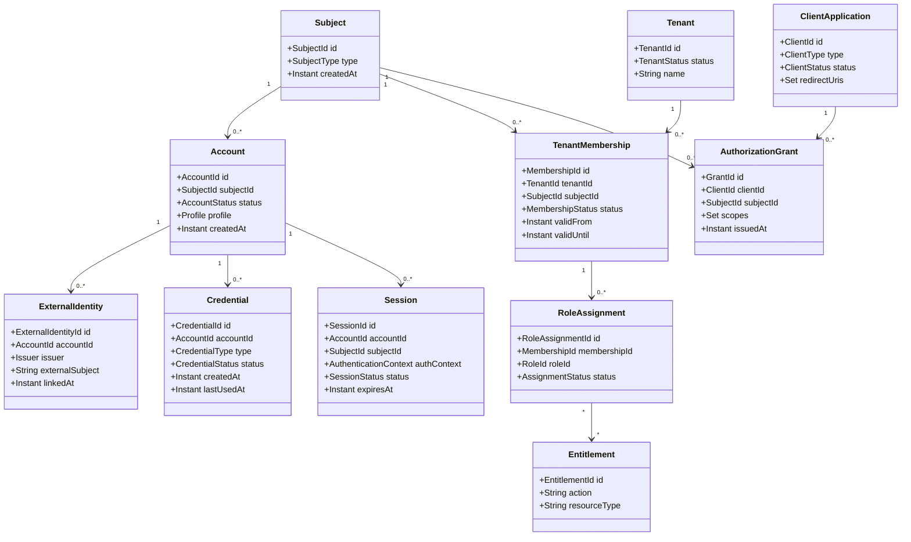
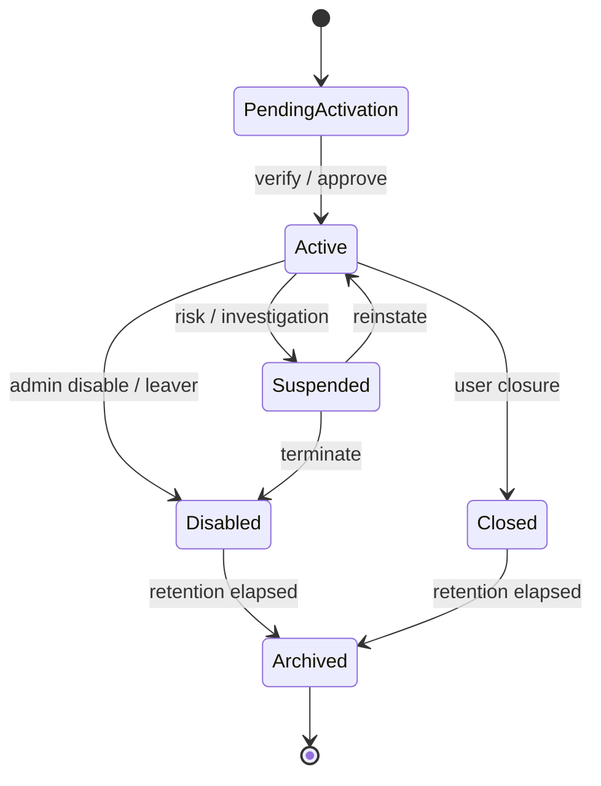
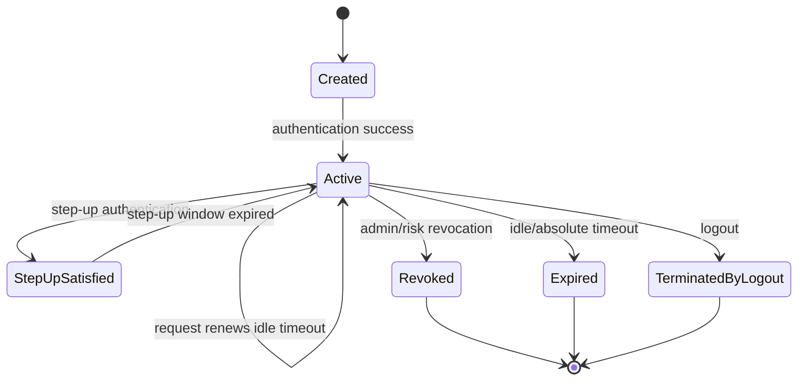
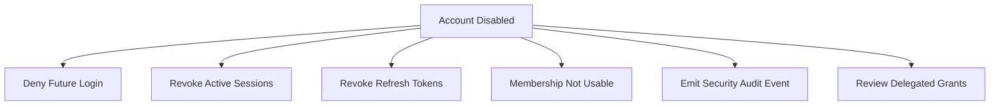
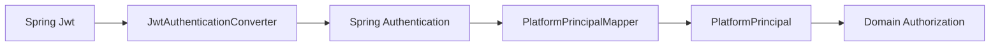

------
title: Learn Java Identity, Authentication & Authorization for Secure Enterprise API Platform - Part 002
description: Domain model mendalam untuk identity platform: subject, principal, account, credential, authenticator, session, token, client, tenant, membership, entitlement, policy, actor, dan audit identity.
series: learn-java-identity-authentication-authorization-api-platform
seriesTitle: Learn Java Identity, Authentication & Authorization for Secure Enterprise API Platform
order: 2
partTitle: Identity Domain Model: Subject, Principal, Account, Credential, Session, Client, Tenant
tags:
- java
- identity
- domain-modeling
- authentication
- authorization
- oauth
- oidc
- multi-tenancy
- api-security
date: 2026-06-28
---

# Part 002 — Identity Domain Model: Subject, Principal, Account, Credential, Session, Client, Tenant

Part ini membahas masalah yang sering diremehkan: **vocabulary identity yang salah**.

Banyak sistem Java enterprise mengalami security debt karena hampir semua hal dinamai `User`:

- orang yang memakai aplikasi,
- akun login,
- row database,
- principal runtime,
- role holder,
- tenant member,
- service account,
- OAuth client,
- support admin yang sedang impersonate,
- audit actor,
- external IdP profile.

Awalnya terlihat sederhana. Setelah sistem berkembang, model seperti itu menghasilkan bug:

- user mengganti email lalu authorization rusak,
- account disabled tetapi refresh token masih hidup,
- support staff impersonate tetapi audit hanya mencatat customer,
- tenant membership dicabut tetapi JWT lama masih punya role,
- service account dianggap sama dengan human user,
- client OAuth dianggap sama dengan resource owner,
- `sub` dari issuer A bertabrakan dengan `sub` dari issuer B,
- API menerima `tenantId` dari header tanpa binding ke authenticated subject.

Di part ini kita akan membangun domain model yang lebih aman.

> Prinsip utama: identity model harus bisa menjawab “siapa bertindak, atas nama siapa, menggunakan credential apa, dari client mana, dalam tenant mana, dengan hak apa, dan bukti apa yang tertinggal?”

---

## 1. Problem Framing

Dalam secure enterprise API platform, request tidak hanya membawa “user”. Request membawa beberapa dimensi identity sekaligus.

Contoh request:

```http
POST /tenants/t-001/cases/c-992/approve HTTP/1.1
Authorization: Bearer eyJ...
X-Correlation-Id: req-123
```

Pertanyaan security yang benar bukan hanya:

```text
Is the user logged in?
```

Pertanyaan yang benar:

```text
Who is the authenticated subject?
Which account does it map to?
Which tenant context is being used?
Is the tenant bound to the subject/client?
Which client obtained the token?
Was this direct user action, delegation, or impersonation?
What authentication strength supports this request?
What action is being attempted?
Which resource is targeted?
Is the resource in the same tenant?
Which policy version permits or denies it?
What audit evidence must be emitted?
```

Jika domain model tidak menyediakan tempat untuk pertanyaan-pertanyaan itu, engineer akan menyisipkan logic di sembarang tempat: controller, annotation, JWT mapper, repository, atau bahkan frontend.

---

## 2. Identity Vocabulary Map

Kita mulai dengan definisi kerja.

| Istilah | Definisi | Contoh |
|---|---|---|
| Actor | Entity yang menyebabkan action terjadi. Bisa human, service, job, client, admin. | Alice, billing-service, support-agent-17 |
| Subject | Identifier stabil untuk entity dalam security domain. | `sub_01J...` |
| Principal | Representasi runtime dari subject setelah authentication. | `PlatformPrincipal` dalam request Spring |
| Account | Container lifecycle aplikasi untuk profile, status, dan link identity. | account Alice di platform X |
| Credential | Data/proof yang dipakai untuk authentication. | password hash, passkey credential, public key |
| Authenticator | Mekanisme/faktor yang dipakai claimant untuk membuktikan kontrol. | password, FIDO key, OTP device |
| Session | State continuity setelah authentication. | browser session `sid=...` |
| Token | Artefak protokol untuk membawa assertion/grant/claim. | access token, ID token, refresh token |
| Client | Aplikasi yang meminta akses/token. | mobile app, web BFF, partner app |
| Resource Owner | Pihak yang memiliki/memberi akses ke resource. | user Alice dalam OAuth delegated flow |
| Authorization Server | Server yang mengeluarkan token. | internal auth server / IdP authorization service |
| Resource Server | API yang menerima token. | case-management-api |
| Tenant | Boundary isolasi organisasi/data/policy. | regulator A, bank B, customer tenant C |
| Membership | Relasi subject/account dengan tenant. | Alice sebagai investigator di tenant A |
| Role | Nama grouping tanggung jawab. | `CASE_SUPERVISOR` |
| Entitlement | Hak akses spesifik. | `case:approve`, `report:export` |
| Policy | Aturan yang menentukan permit/deny. | supervisor boleh approve case subordinate |
| Decision | Hasil evaluasi authorization. | permit/deny + obligations |
| Assertion | Pernyataan identity/authentication dari authority. | OIDC ID token claim |
| Claim | Key-value statement dalam token/assertion. | `sub`, `iss`, `aud`, `scope` |
| Effective Actor | Actor yang tercatat sebagai pelaku efektif ketika ada delegation/impersonation. | support acting as customer |
| Original Actor | Actor asli yang memulai tindakan. | support-agent-17 |

---

## 3. The Dangerous `User` Blob

Model yang sering ditemukan:

```java
public class User {
    private Long id;
    private String email;
    private String password;
    private String role;
    private String tenantId;
    private boolean active;
}
```

Model ini tampak sederhana, tetapi mencampur minimal delapan konsep:

- account identity,
- login identifier,
- credential,
- role assignment,
- tenant membership,
- status lifecycle,
- authorization input,
- profile attribute.

### 3.1 Dampak buruk

| Masalah | Penyebab |
|---|---|
| Email change memengaruhi authorization | Email dipakai sebagai identity key |
| Multi-tenant role tidak bisa dimodelkan | Role disimpan di user global |
| Satu user tidak bisa punya beberapa IdP | External identity tidak dipisahkan |
| Password reset mengubah account state | Credential dan account dicampur |
| Service account terlihat seperti human user | Actor type tidak eksplisit |
| Impersonation audit lemah | Original/effective actor tidak dibedakan |
| Disabled account tidak revoke session | Account lifecycle dan session lifecycle tidak terhubung |
| Tenant escape | Tenant ID dianggap attribute user tunggal |

### 3.2 Rule of thumb

Jika class `User` punya field `password`, `role`, `tenantId`, `provider`, `session`, dan `permissions`, kemungkinan besar modelnya salah.

---

## 4. Domain Model yang Lebih Aman

Kita pecah model menjadi entity dan relationship yang lebih eksplisit.



Model ini belum final untuk semua organisasi, tetapi cukup kuat sebagai baseline.

---

## 5. Subject

`Subject` adalah identifier stabil untuk entity yang dikenali oleh sistem security.

### 5.1 Subject bukan account

Subject menjawab:

```text
Entity apa yang dikenali oleh security domain ini?
```

Account menjawab:

```text
Bagaimana entity ini direpresentasikan dalam aplikasi dan lifecycle bisnis?
```

Dalam beberapa sistem sederhana, subject dan account 1:1. Dalam enterprise, jangan mengunci desain pada asumsi itu terlalu awal.

### 5.2 Subject type

```java
public enum SubjectType {
    HUMAN,
    WORKLOAD,
    SERVICE_ACCOUNT,
    DEVICE,
    ORGANIZATION,
    AUTOMATION,
    EXTERNAL_PARTNER
}
```

### 5.3 Stable ID

```java
public record SubjectId(String value) {
    public SubjectId {
        if (value == null || value.isBlank()) {
            throw new IllegalArgumentException("subject id is required");
        }
    }
}
```

Gunakan ID yang:

- stable,
- non-meaningful,
- tidak memakai email,
- tidak memakai username,
- tidak memakai nomor identitas nasional,
- tidak bergantung pada tenant display name,
- tidak berubah ketika account profile berubah.

### 5.4 Issuer-scoped subject

Dalam OIDC/OAuth, `sub` hanya unik dalam konteks issuer. Maka identity external harus disimpan sebagai pair:

```text
(issuer, external_subject)
```

Bukan hanya `sub`.

```java
public record ExternalSubject(Issuer issuer, String subject) {
    public ExternalSubject {
        if (issuer == null) throw new IllegalArgumentException("issuer is required");
        if (subject == null || subject.isBlank()) throw new IllegalArgumentException("subject is required");
    }
}
```

### 5.5 Anti-pattern

```java
String userId = jwt.getClaim("email");
```

Masalah:

- email bisa berubah,
- email bisa tidak verified,
- email bisa sama di issuer berbeda,
- email bukan authorization key yang baik,
- email adalah PII.

Lebih baik:

```java
ExternalSubject externalSubject = new ExternalSubject(
    new Issuer(jwt.getIssuer().toString()),
    jwt.getSubject()
);

SubjectId subjectId = identityLinkService.resolveSubject(externalSubject);
```

---

## 6. Account

`Account` adalah container lifecycle aplikasi.

```java
public record Account(
    AccountId id,
    SubjectId subjectId,
    AccountStatus status,
    Profile profile,
    Instant createdAt
) {}
```

```java
public enum AccountStatus {
    PENDING_ACTIVATION,
    ACTIVE,
    SUSPENDED,
    DISABLED,
    CLOSED,
    ARCHIVED
}
```

### 6.1 Account status bukan authorization detail

`ACTIVE` tidak berarti “boleh melakukan semua”. Itu hanya syarat awal bahwa account dapat dipakai.

Authorization tetap perlu mengevaluasi:

- tenant membership,
- role/entitlement,
- resource state,
- risk context,
- assurance level,
- SoD,
- approval,
- policy.

### 6.2 Account disabled harus punya efek sistemik

Saat account disabled:

- login baru harus ditolak,
- session aktif mungkin harus direvoke,
- refresh token harus dicabut,
- API token delegated dari account tersebut perlu dievaluasi,
- tenant membership bisa tetap historis tetapi tidak aktif,
- audit tetap menyimpan account reference,
- pending approval atas nama account perlu aturan bisnis.



### 6.3 Jangan hapus account secara fisik terlalu cepat

Untuk sistem regulated, deletion harus memikirkan:

- audit retention,
- legal hold,
- non-repudiation,
- referential integrity,
- privacy erasure request,
- anonymization/pseudonymization.

Bias desain: gunakan `CLOSED`/`ARCHIVED` dengan retention strategy, bukan hard delete tanpa model.

---

## 7. Credential dan Authenticator

Credential adalah data/proof yang terkait dengan account. Authenticator adalah faktor/mekanisme yang claimant kontrol.

Contoh:

| Mechanism | Credential data | Authenticator |
|---|---|---|
| Password | password hash + metadata | secret yang user tahu |
| Passkey/WebAuthn | public key credential | private key di authenticator/device |
| TOTP | shared secret | authenticator app/device |
| Client private key JWT | public key/JWK | private key client |
| mTLS client auth | certificate/public key metadata | private key workload/client |

### 7.1 Credential model

```java
public record Credential(
    CredentialId id,
    AccountId accountId,
    CredentialType type,
    CredentialStatus status,
    Instant createdAt,
    Instant lastUsedAt,
    CredentialMetadata metadata
) {}

public enum CredentialType {
    PASSWORD,
    PASSKEY,
    TOTP,
    RECOVERY_CODE,
    CLIENT_SECRET,
    CLIENT_PRIVATE_KEY,
    MTLS_CERTIFICATE
}

public enum CredentialStatus {
    ACTIVE,
    PENDING_VERIFICATION,
    COMPROMISED,
    REVOKED,
    EXPIRED
}
```

### 7.2 Invariant credential

- Credential tidak boleh menjadi sumber authorization domain.
- Credential compromise harus bisa memicu revocation session/token.
- Credential enrollment high-risk harus diaudit.
- Recovery code harus diperlakukan seperti credential sensitif.
- Client secret untuk OAuth client adalah credential, bukan config biasa.

### 7.3 Anti-pattern

```java
user.setMfaEnabled(true);
```

Terlalu miskin informasi. Pertanyaan yang hilang:

- MFA type apa?
- Kapan didaftarkan?
- Apakah sudah diverifikasi?
- Kapan terakhir dipakai?
- Apakah device hilang?
- Apakah faktor ini cukup untuk high-risk action?
- Apakah recovery flow pernah dipakai?

Lebih baik punya model credential/authenticator yang eksplisit.

---

## 8. Principal

`Principal` adalah representasi runtime dari hasil authentication.

Dalam Spring Security, principal biasanya berada dalam `Authentication` di `SecurityContext`. Namun untuk platform enterprise, jangan biarkan semua domain logic membaca object framework mentah.

Buat principal internal yang stabil.

```java
public record PlatformPrincipal(
    SubjectId subjectId,
    AccountId accountId,
    SubjectType subjectType,
    TenantContext tenantContext,
    ClientContext clientContext,
    AuthenticationContext authenticationContext,
    ActorContext actorContext,
    Set<Authority> authorities
) {}
```

### 8.1 Principal bukan database user

Principal harus cukup untuk request context, tetapi bukan aggregate master data.

Principal boleh memuat:

- subject id,
- account id,
- authentication method/strength,
- token issuer,
- client id,
- tenant context,
- authorities hasil mapping awal,
- actor/delegation context.

Principal sebaiknya tidak memuat:

- password hash,
- full profile PII,
- semua permission detail,
- semua tenant membership,
- mutable domain state besar,
- secrets/token mentah.

### 8.2 Mapping dari JWT ke principal

```java
public final class JwtPlatformPrincipalMapper {

    public PlatformPrincipal map(Jwt jwt) {
        Issuer issuer = new Issuer(jwt.getIssuer().toString());
        ExternalSubject externalSubject = new ExternalSubject(issuer, jwt.getSubject());

        SubjectId subjectId = resolveSubject(externalSubject);
        AccountId accountId = resolveAccount(subjectId);
        ClientContext client = resolveClient(jwt);
        AuthenticationContext authn = resolveAuthenticationContext(jwt);
        TenantContext tenant = resolveTenantContext(jwt, subjectId, client);

        return new PlatformPrincipal(
            subjectId,
            accountId,
            SubjectType.HUMAN,
            tenant,
            client,
            authn,
            ActorContext.direct(subjectId),
            mapAuthorities(jwt)
        );
    }
}
```

### 8.3 Invariant principal

- Principal harus berasal dari token/session yang sudah divalidasi.
- Principal tidak boleh dibuat langsung dari request body/header biasa.
- Principal harus explicit tentang tenant dan client bila request butuh itu.
- Principal harus membedakan original actor dan effective actor.

---

## 9. Authentication Context

Authentication context menjelaskan kualitas dan kondisi authentication.

```java
public record AuthenticationContext(
    Instant authenticatedAt,
    AuthenticationMethod method,
    AssuranceLevel assuranceLevel,
    boolean mfaSatisfied,
    Optional<Instant> stepUpAt,
    Optional<String> sessionId,
    Optional<String> identityProvider,
    Map<String, String> riskSignals
) {}
```

```java
public enum AuthenticationMethod {
    PASSWORD,
    PASSWORD_PLUS_TOTP,
    PASSKEY,
    FEDERATED_OIDC,
    MTLS_CLIENT_AUTH,
    CLIENT_PRIVATE_KEY_JWT,
    SPIFFE_SVID
}
```

### 9.1 Mengapa auth context penting?

Karena authorization untuk operasi sensitif sering butuh authentication strength.

Contoh:

```java
public Decision canChangePayoutAccount(PlatformPrincipal principal, PayoutAccount target) {
    if (!principal.authenticationContext().mfaSatisfied()) {
        return Decision.deny("MFA_REQUIRED");
    }

    if (principal.authenticationContext().stepUpAt().isEmpty()) {
        return Decision.deny("STEP_UP_REQUIRED");
    }

    if (!target.owner().equals(principal.subjectId())) {
        return Decision.deny("NOT_OWNER");
    }

    return Decision.permit();
}
```

### 9.2 Anti-pattern

```java
@PreAuthorize("hasRole('USER')")
@PostMapping("/payout-accounts")
public void changePayoutAccount(...) { ... }
```

Role `USER` tidak menjawab apakah authentication cukup kuat untuk operasi high-risk.

---

## 10. Session

Session menyimpan continuity state setelah authentication.

```java
public record Session(
    SessionId id,
    SubjectId subjectId,
    AccountId accountId,
    SessionStatus status,
    AuthenticationContext authenticationContext,
    Instant createdAt,
    Instant lastSeenAt,
    Instant idleExpiresAt,
    Instant absoluteExpiresAt
) {}

public enum SessionStatus {
    ACTIVE,
    EXPIRED,
    REVOKED,
    TERMINATED_BY_LOGOUT,
    TERMINATED_BY_RISK
}
```

### 10.1 Session lifecycle



### 10.2 Session vs token

| Aspek | Session | Token |
|---|---|---|
| Tujuan | Continuity state | Protocol artifact/access grant/assertion |
| Storage | Server/client cookie/mixed | Client, gateway, service |
| Revocation | Biasanya lebih langsung | Bergantung jenis token |
| Audience | Aplikasi/session boundary | Resource server/client tertentu |
| Format | Opaque ID atau server state | JWT/opaque/reference |

### 10.3 Invariant

- Session ID harus dirotasi setelah login.
- Session harus bisa direvoke saat account disabled atau credential compromised.
- Step-up state harus punya expiry pendek.
- Session tidak boleh disamakan dengan access token OAuth.

---

## 11. Token

Token adalah artefak protokol. Dalam OAuth/OIDC, token bisa punya jenis berbeda.

| Token | Audience utama | Dipakai untuk | Catatan |
|---|---|---|---|
| Access token | Resource server | Mengakses API | Harus validasi audience/issuer/expiry |
| Refresh token | Authorization server | Mendapat access token baru | Treat like credential |
| ID token | Client/RP | Login identity assertion | Bukan access token API umum |
| Authorization code | Authorization server | Ditukar menjadi token | Short-lived, one-time |
| Device code | Authorization server | Device flow | Butuh polling/rate semantics |
| Session cookie | Web app | Browser session continuity | CSRF/SameSite/security flags |

### 11.1 Token bukan sumber kebenaran mutlak

Misalnya JWT berisi:

```json
{
  "iss": "https://id.example.com",
  "sub": "00u123",
  "aud": "case-api",
  "scope": "case.read case.write",
  "tenant": "t-001",
  "exp": 1780000000
}
```

Ini belum menjawab:

- apakah subject masih aktif?
- apakah tenant membership masih aktif?
- apakah case target berada di tenant `t-001`?
- apakah `case.write` berlaku untuk action `approve`?
- apakah user boleh approve case miliknya sendiri?
- apakah account sedang suspended?
- apakah token sudah direvoked karena incident?

### 11.2 Token validation minimal

```java
public record TokenValidationResult(
    Issuer issuer,
    Audience audience,
    SubjectId subjectId,
    ClientId clientId,
    Instant issuedAt,
    Instant expiresAt,
    Set<Scope> scopes,
    Map<String, Object> claims
) {}
```

Validation harus mencakup:

- signature/key trust,
- issuer,
- audience,
- expiry,
- not-before jika ada,
- algorithm allowlist,
- token type/use,
- client binding bila ada,
- tenant/client constraints bila dipakai.

---

## 12. Client Application

OAuth client adalah aplikasi yang meminta token, bukan selalu user.

```java
public record ClientApplication(
    ClientId id,
    ClientType type,
    ClientStatus status,
    Set<RedirectUri> redirectUris,
    Set<GrantType> allowedGrantTypes,
    Set<Scope> allowedScopes,
    ClientAuthenticationMethod authenticationMethod
) {}
```

```java
public enum ClientType {
    PUBLIC,
    CONFIDENTIAL,
    FIRST_PARTY,
    THIRD_PARTY,
    PARTNER,
    INTERNAL_SERVICE
}
```

### 12.1 Public vs confidential client

| Client | Bisa menyimpan secret? | Contoh |
|---|---|---|
| Public | Tidak aman diasumsikan | SPA, mobile app |
| Confidential | Bisa menjaga credential | Backend web app, BFF, server-side app |

### 12.2 Client bukan subject human

Dalam client credentials flow:

```text
client == actor
resource owner human == tidak ada
```

Dalam authorization code flow:

```text
client == aplikasi
resource owner == user
subject == user yang authenticated
```

Dalam token exchange/on-behalf-of:

```text
client/service == immediate caller
subject/effective actor == user atau service asal
delegation chain == perlu dimodelkan
```

### 12.3 Invariant client

- Client ID bukan secret.
- Redirect URI harus exact/predictable, bukan wildcard sembarangan.
- Public client harus memakai PKCE dalam authorization code flow.
- Client allowed scopes harus dibatasi per client.
- Client credentials flow tidak boleh menghasilkan token dengan human user identity palsu.

---

## 13. Tenant

Tenant adalah boundary isolasi. Dalam platform enterprise, tenant bisa berarti:

- customer organization,
- regulatory agency,
- business unit,
- environment partition,
- data isolation boundary,
- policy boundary,
- billing boundary,
- administration boundary.

Jangan menganggap tenant selalu sama dengan company domain email.

```java
public record Tenant(
    TenantId id,
    TenantStatus status,
    String displayName,
    TenantIsolationMode isolationMode
) {}

public enum TenantIsolationMode {
    SHARED_DATABASE_SHARED_SCHEMA,
    SHARED_DATABASE_SEPARATE_SCHEMA,
    SEPARATE_DATABASE,
    SEPARATE_ACCOUNT_OR_CLUSTER
}
```

### 13.1 Tenant membership

```java
public record TenantMembership(
    MembershipId id,
    TenantId tenantId,
    SubjectId subjectId,
    MembershipStatus status,
    Instant validFrom,
    Optional<Instant> validUntil
) {}

public enum MembershipStatus {
    INVITED,
    ACTIVE,
    SUSPENDED,
    REVOKED,
    EXPIRED
}
```

### 13.2 Tenant role assignment

Role hampir selalu harus tenant-scoped.

```java
public record RoleAssignment(
    RoleAssignmentId id,
    MembershipId membershipId,
    RoleId roleId,
    AssignmentStatus status,
    Instant assignedAt,
    Optional<Instant> expiresAt
) {}
```

### 13.3 Anti-pattern

```java
public class User {
    private String tenantId;
    private String role;
}
```

Ini gagal ketika:

- user bekerja di beberapa tenant,
- role berbeda per tenant,
- tenant membership sementara,
- user pindah organisasi,
- admin global butuh cross-tenant access,
- tenant merge/split,
- invitation pending,
- membership revoked tetapi account tetap aktif.

### 13.4 Tenant context harus bound

Request path:

```http
GET /tenants/t-001/cases/c-123
```

Tidak berarti user boleh memakai `t-001`.

Tenant context harus dibuktikan:

```java
public TenantContext resolveTenant(PlatformPrincipal principal, TenantId requestedTenant) {
    if (!membershipService.isActiveMember(principal.subjectId(), requestedTenant)) {
        throw new AccessDeniedException("tenant membership not active");
    }

    return new TenantContext(requestedTenant, TenantBinding.MEMBERSHIP_VERIFIED);
}
```

---

## 14. Role, Permission, Entitlement, Scope

Empat istilah ini sering dicampur.

| Istilah | Level | Contoh | Catatan |
|---|---|---|---|
| Role | Organizational responsibility | `CASE_SUPERVISOR` | Coarse grouping |
| Permission | Allowed operation concept | `case.approve` | Bisa derived dari role/policy |
| Entitlement | Granted right to subject/account/client | Alice punya `case.approve` di tenant A | Biasanya lifecycle-governed |
| Scope | OAuth delegated boundary for client/token | `case.read` | Tidak otomatis object-level permission |

### 14.1 Role sebagai input, bukan decision

```java
public Decision canApproveCase(PlatformPrincipal principal, CaseFile caseFile) {
    if (!principal.tenantContext().tenantId().equals(caseFile.tenantId())) {
        return Decision.deny("CROSS_TENANT");
    }

    if (!principal.hasRole(Role.CASE_SUPERVISOR)) {
        return Decision.deny("MISSING_ROLE");
    }

    if (caseFile.createdBy().equals(principal.subjectId())) {
        return Decision.deny("SEGREGATION_OF_DUTIES");
    }

    if (!caseFile.status().equals(CaseStatus.PENDING_APPROVAL)) {
        return Decision.deny("INVALID_CASE_STATE");
    }

    return Decision.permit();
}
```

Role sendiri tidak cukup. Kita butuh tenant, resource state, relationship, dan SoD.

### 14.2 Scope sebagai delegated client boundary

Access token dengan scope `case.write` berarti client mendapat grant untuk mencoba operasi write terhadap case API. Namun resource server tetap harus mengevaluasi user/tenant/resource policy.

```text
scope permits client-to-API boundary
policy permits subject-to-resource boundary
```

---

## 15. Actor Context: Direct, Delegated, Impersonated

Audit yang benar membutuhkan actor model yang eksplisit.

```java
public sealed interface ActorContext permits DirectActor, DelegatedActor, ImpersonatedActor {
    SubjectId effectiveSubject();
    SubjectId originalSubject();
    ActorMode mode();
}

public record DirectActor(SubjectId subjectId) implements ActorContext {
    @Override public SubjectId effectiveSubject() { return subjectId; }
    @Override public SubjectId originalSubject() { return subjectId; }
    @Override public ActorMode mode() { return ActorMode.DIRECT; }
}

public record ImpersonatedActor(
    SubjectId originalAdmin,
    SubjectId effectiveCustomer,
    String reason,
    Instant approvedAt
) implements ActorContext {
    @Override public SubjectId effectiveSubject() { return effectiveCustomer; }
    @Override public SubjectId originalSubject() { return originalAdmin; }
    @Override public ActorMode mode() { return ActorMode.IMPERSONATION; }
}
```

```java
public enum ActorMode {
    DIRECT,
    DELEGATED,
    IMPERSONATION,
    BREAK_GLASS,
    SYSTEM
}
```

### 15.1 Mengapa penting?

Jika support staff mengubah data customer, audit harus bisa menjawab:

- customer mana yang menjadi effective subject,
- admin mana yang bertindak,
- alasan impersonation,
- approval/ticket apa,
- durasi akses,
- action apa saja selama sesi,
- apakah ada data export,
- apakah customer-visible atau internal-only.

### 15.2 Anti-pattern

```java
auditLog.setUserId(principal.getUserId());
```

Ini kehilangan original/effective actor distinction.

Lebih baik:

```java
public record AuditActor(
    SubjectId originalActor,
    SubjectId effectiveActor,
    ActorMode mode,
    Optional<String> reason
) {}
```

---

## 16. External Identity and Account Linking

Enterprise platform sering menerima identity dari banyak sumber:

- internal username/password,
- Google Workspace,
- Microsoft Entra ID,
- Okta,
- Keycloak,
- government IdP,
- partner IdP,
- SAML federation,
- OIDC federation.

Model external identity harus memuat issuer.

```java
public record ExternalIdentity(
    ExternalIdentityId id,
    AccountId accountId,
    Issuer issuer,
    String externalSubject,
    ExternalIdentityStatus status,
    Instant linkedAt,
    Optional<Instant> unlinkedAt
) {}
```

### 16.1 Account linking invariant

- `(issuer, externalSubject)` harus unique.
- Linking external identity ke account existing harus high-risk operation.
- Jika email sama tetapi issuer berbeda, jangan auto-link tanpa proof yang cukup.
- Unlinking identity bisa menyebabkan account lockout; butuh recovery path.
- External IdP logout belum tentu sama dengan local session logout.

### 16.2 Shadow account

Dalam enterprise SSO, user dari IdP eksternal sering dibuat sebagai shadow account di aplikasi lokal.

Shadow account berguna untuk:

- local lifecycle,
- tenant membership,
- app-specific preferences,
- audit references,
- entitlement assignment,
- deactivation independent dari IdP.

Namun jangan menganggap shadow account sebagai bukti identity proofing yang sama dengan IdP. Ia adalah representasi lokal dari external assertion.

---

## 17. Service Account dan Workload Identity

Service account sering disalahgunakan sebagai “user tanpa manusia”. Lebih baik modelkan eksplisit.

```java
public record ServiceAccount(
    SubjectId subjectId,
    ServiceAccountId serviceAccountId,
    ServiceAccountStatus status,
    OwnerTeam ownerTeam,
    Set<TenantId> allowedTenants,
    Instant createdAt
) {}
```

### 17.1 Service account invariant

- Service account harus punya owner team.
- Harus ada purpose dan allowed scopes.
- Secret/key harus punya rotation policy.
- Tidak boleh dipakai bersama banyak service tanpa alasan kuat.
- Access harus auditable sebagai non-human actor.
- Jika action dilakukan on-behalf-of user, user context harus eksplisit.

### 17.2 Workload identity

Workload identity mengidentifikasi running workload, bukan sekadar logical service account.

Contoh SPIFFE ID:

```text
spiffe://prod.example.com/ns/payments/sa/reconciler
```

Konsep penting:

- trust domain,
- workload attestation,
- SVID sebagai dokumen verifiable,
- X.509 atau JWT SVID,
- short-lived credential,
- mTLS/service authentication.

Dalam Java service, workload identity bisa masuk sebagai:

- mTLS client certificate,
- sidecar-provided identity,
- JWT SVID,
- exchanged OAuth token.

---

## 18. Authorization Decision Model

Authorization decision harus menjadi object eksplisit, bukan boolean anonim.

```java
public record AuthorizationRequest(
    SubjectId subjectId,
    Action action,
    ResourceRef resource,
    TenantId tenantId,
    ClientId clientId,
    AuthenticationContext authenticationContext,
    ActorContext actorContext,
    Map<String, Object> attributes
) {}

public record AuthorizationDecision(
    DecisionEffect effect,
    String reasonCode,
    String policyId,
    String policyVersion,
    List<Obligation> obligations
) {
    public boolean permitted() {
        return effect == DecisionEffect.PERMIT;
    }
}

public enum DecisionEffect {
    PERMIT,
    DENY
}
```

### 18.1 Mengapa bukan boolean?

Boolean tidak cukup untuk:

- audit reason,
- debugging,
- metrics,
- policy version,
- denial handling,
- obligations seperti “mask field” atau “require step-up”,
- security analytics.

### 18.2 Contoh obligation

```java
public sealed interface Obligation permits MaskFields, RequireStepUp, EmitAuditEvent {}

public record MaskFields(Set<String> fieldNames) implements Obligation {}
public record RequireStepUp(AuthenticationMethod requiredMethod) implements Obligation {}
public record EmitAuditEvent(String eventType) implements Obligation {}
```

---

## 19. Resource Reference

Authorization perlu resource. Namun resource bisa belum di-load.

```java
public record ResourceRef(
    ResourceType type,
    String id
) {}
```

Contoh:

```java
ResourceRef ref = new ResourceRef(ResourceType.CASE_FILE, caseId.toString());
```

Untuk object-level authorization, sering perlu load minimal metadata:

```java
public record CaseSecurityView(
    CaseId id,
    TenantId tenantId,
    SubjectId ownerId,
    CaseStatus status,
    Optional<SubjectId> assignedSupervisor
) {}
```

### 19.1 Jangan load full aggregate jika tidak perlu

Authorization sering hanya butuh security view:

- tenant id,
- owner id,
- status,
- classification,
- assignment,
- organization unit,
- sensitivity level.

Ini mengurangi:

- over-fetching,
- PII exposure,
- accidental side effects,
- performance cost.

---

## 20. Tenant-Aware Repository Boundary

Object-level authorization tidak boleh hanya bergantung pada service method check. Repository/query boundary harus membantu mencegah cross-tenant leakage.

Wrong:

```java
Optional<CaseFile> findById(CaseId id);
```

Better:

```java
Optional<CaseFile> findByTenantIdAndId(TenantId tenantId, CaseId id);
```

Even better for read views:

```java
Optional<CaseSecurityView> findSecurityView(TenantId tenantId, CaseId id);
```

### 20.1 Pattern

```java
public CaseSecurityView loadCaseSecurityView(PlatformPrincipal principal, CaseId caseId) {
    TenantId tenantId = principal.tenantContext().tenantId();

    return caseSecurityViewRepository
        .findByTenantIdAndId(tenantId, caseId)
        .orElseThrow(() -> new NotFoundOrForbiddenException());
}
```

### 20.2 Invariant

- Query terhadap tenant-owned resource harus membawa tenant predicate.
- Jangan load by global ID lalu cek tenant setelah data sensitif sudah masuk memory/log.
- Untuk high-risk multi-tenant systems, pertimbangkan database-level constraints/RLS sebagai defense-in-depth.

---

## 21. Lifecycle Interactions

Model identity harus menjelaskan efek perubahan lifecycle.

### 21.1 Account disabled



### 21.2 Tenant membership revoked

Efek yang mungkin:

- role assignments inactive,
- tenant-scoped tokens invalidated or rejected at runtime,
- active sessions may remain but cannot access tenant,
- cached entitlements must be evicted,
- future authorization denies,
- audit event emitted.

### 21.3 Credential compromised

Efek yang mungkin:

- credential status `COMPROMISED`,
- password/passkey reset required,
- session revocation,
- refresh token revocation,
- risk-based notification,
- step-up required for next login,
- incident event emitted.

---

## 22. Java Package Structure

Salah satu struktur package untuk identity platform module:

```text
com.example.identity
  subject/
    SubjectId.java
    SubjectType.java
    Subject.java
  account/
    Account.java
    AccountStatus.java
    AccountService.java
  credential/
    Credential.java
    CredentialType.java
    CredentialVerifier.java
  session/
    Session.java
    SessionService.java
  principal/
    PlatformPrincipal.java
    AuthenticationContext.java
    ActorContext.java
  tenant/
    Tenant.java
    TenantMembership.java
    TenantContext.java
  client/
    ClientApplication.java
    ClientCredential.java
  authorization/
    AuthorizationRequest.java
    AuthorizationDecision.java
    PolicyDecisionService.java
  audit/
    AuditActor.java
    SecurityAuditEvent.java
```

### 22.1 Package smell

Hindari package seperti:

```text
com.example.security
  User.java
  JwtUtil.java
  AuthHelper.java
  SecurityConstants.java
```

Package seperti ini sering menjadi tempat semua konsep dicampur.

---

## 23. Spring Security Integration Boundary

Spring Security object jangan bocor terlalu jauh ke domain.

### 23.1 Adapter pattern



### 23.2 Controller shape

```java
@GetMapping("/tenants/{tenantId}/cases/{caseId}")
public CaseDto getCase(
    @AuthenticationPrincipal PlatformPrincipal principal,
    @PathVariable TenantId tenantId,
    @PathVariable CaseId caseId
) {
    PlatformPrincipal tenantBoundPrincipal = tenantContextService.bind(principal, tenantId);
    CaseView view = caseAccessService.loadReadableCase(tenantBoundPrincipal, caseId);
    return CaseDto.from(view);
}
```

### 23.3 Service shape

```java
public CaseView loadReadableCase(PlatformPrincipal principal, CaseId caseId) {
    CaseSecurityView securityView = caseSecurityRepository
        .findByTenantIdAndId(principal.tenantContext().tenantId(), caseId)
        .orElseThrow(NotFoundOrForbiddenException::new);

    AuthorizationDecision decision = authorizationService.decide(
        AuthorizationRequest.forResource(
            principal,
            Action.CASE_READ,
            securityView.toResourceRef(),
            securityView.toAttributes()
        )
    );

    if (!decision.permitted()) {
        auditDenied(principal, decision, securityView.toResourceRef());
        throw new AccessDeniedException(decision.reasonCode());
    }

    auditPermitted(principal, decision, securityView.toResourceRef());
    return caseRepository.loadView(securityView.id());
}
```

---

## 24. Identity Model for Audit

Audit membutuhkan identity yang stabil dan bisa dijelaskan.

```java
public record SecurityAuditEvent(
    String eventId,
    String eventType,
    Instant occurredAt,
    String correlationId,
    AuditActor actor,
    Optional<ClientId> clientId,
    Optional<TenantId> tenantId,
    Optional<ResourceRef> resource,
    Optional<AuthorizationDecision> decision,
    Map<String, String> safeAttributes
) {}
```

### 24.1 Audit actor

```java
public record AuditActor(
    SubjectId originalSubject,
    SubjectId effectiveSubject,
    ActorMode mode,
    SubjectType subjectType,
    Optional<String> reason
) {}
```

### 24.2 Jangan audit ini

- raw access token,
- refresh token,
- password,
- credential secret,
- full ID document,
- unnecessary PII,
- OTP/recovery code,
- private key material.

### 24.3 Audit harus mencatat ini

- event type,
- original actor,
- effective actor,
- actor mode,
- client id,
- tenant id,
- resource ref,
- action,
- decision effect,
- reason code,
- policy id/version,
- correlation id,
- time,
- source system.

---

## 25. Identity Modeling Anti-Patterns

### 25.1 Email as identity key

Email adalah attribute. Ia bisa berubah, bisa tidak verified, bisa didaur ulang, dan merupakan PII.

### 25.2 Global role without tenant

`ADMIN` tanpa tenant/context menghasilkan overprivilege.

### 25.3 Service account as human user

Jika service account bisa login di UI atau punya password seperti human, desain perlu direview.

### 25.4 Token claim as permanent entitlement

Claim dalam JWT bisa stale. Untuk entitlement yang berubah cepat atau high-risk, lakukan lookup/evaluation runtime.

### 25.5 Controller-only authorization

Authorization di controller mudah terlewat oleh path lain: batch job, event handler, GraphQL resolver, internal API, scheduled task.

### 25.6 ThreadLocal tenant without lifecycle

Dalam async/reactive execution, ThreadLocal bisa bocor atau hilang. Tenant context harus dipropagasikan secara eksplisit atau via mechanism yang benar.

### 25.7 Impersonation without original actor

Audit yang hanya mencatat effective user membuat insider action tidak bisa ditelusuri.

### 25.8 One table to rule them all

Satu tabel `users` untuk human, service, client, tenant membership, credentials, dan roles akan menjadi bottleneck correctness.

---

## 26. Design Questions for Real Projects

Gunakan daftar ini saat mereview sistem existing.

### 26.1 Subject/account

- Apa primary identifier identity?
- Apakah identifier immutable?
- Apakah email/phone dipakai untuk authorization?
- Apakah account bisa punya beberapa external identity?
- Apa efek account disabled?

### 26.2 Credential/session

- Credential type apa yang didukung?
- Apakah credential lifecycle terpisah?
- Apakah session bisa direvoke?
- Apakah step-up state tersimpan?
- Apakah password reset mencabut session?

### 26.3 Token/client

- Siapa issuer yang dipercaya?
- Apakah audience divalidasi?
- Apakah client type jelas?
- Apakah refresh token rotation ada?
- Apakah client credentials flow menciptakan human identity palsu?

### 26.4 Tenant/authorization

- Bagaimana tenant resolved?
- Apakah tenant ID dibuktikan terhadap membership?
- Apakah role tenant-scoped?
- Apakah object-level check ada di semua path?
- Apakah repository query tenant-aware?

### 26.5 Audit

- Apakah original/effective actor dicatat?
- Apakah decision reason dicatat?
- Apakah policy version dicatat?
- Apakah deny event dicatat?
- Apakah log mengandung secrets/PII berlebihan?

---

## 27. Minimal Implementation Skeleton

Berikut skeleton kecil untuk memulai lab.

```java
public record TenantContext(
    TenantId tenantId,
    TenantBinding binding
) {}

public enum TenantBinding {
    TOKEN_BOUND,
    MEMBERSHIP_VERIFIED,
    CLIENT_ALLOWED,
    SYSTEM_INTERNAL
}
```

```java
public record ClientContext(
    ClientId clientId,
    ClientType clientType,
    Set<Scope> scopes
) {}
```

```java
public record Authority(String value) {
    public Authority {
        if (value == null || value.isBlank()) {
            throw new IllegalArgumentException("authority is required");
        }
    }
}
```

```java
public record Action(String value) {
    public static final Action CASE_READ = new Action("case:read");
    public static final Action CASE_APPROVE = new Action("case:approve");
}
```

```java
public interface AuthorizationService {
    AuthorizationDecision decide(AuthorizationRequest request);
}
```

```java
public final class DenyByDefaultAuthorizationService implements AuthorizationService {
    @Override
    public AuthorizationDecision decide(AuthorizationRequest request) {
        return new AuthorizationDecision(
            DecisionEffect.DENY,
            "NO_POLICY_MATCHED",
            "default-deny",
            "1",
            List.of()
        );
    }
}
```

Default deny bukan slogan; ia harus terlihat di implementasi.

---

## 28. Testing the Domain Model

### 28.1 Subject external identity uniqueness

```java
@Test
void externalSubjectMustBeScopedByIssuer() {
    ExternalSubject google = new ExternalSubject(new Issuer("https://accounts.google.com"), "123");
    ExternalSubject entra = new ExternalSubject(new Issuer("https://login.microsoftonline.com/tenant"), "123");

    assertNotEquals(google, entra);
}
```

### 28.2 Tenant membership required

```java
@Test
void cannotBindTenantWithoutActiveMembership() {
    PlatformPrincipal principal = Fixtures.principalForSubject("sub-1");
    TenantId tenant = new TenantId("t-001");

    when(membershipService.isActiveMember(principal.subjectId(), tenant)).thenReturn(false);

    assertThrows(AccessDeniedException.class, () -> tenantContextService.bind(principal, tenant));
}
```

### 28.3 Impersonation audit keeps original actor

```java
@Test
void impersonationAuditMustRecordOriginalAndEffectiveActor() {
    SubjectId admin = new SubjectId("sub-admin");
    SubjectId customer = new SubjectId("sub-customer");

    ActorContext actor = new ImpersonatedActor(admin, customer, "ticket-123", Instant.now());

    assertEquals(admin, actor.originalSubject());
    assertEquals(customer, actor.effectiveSubject());
    assertEquals(ActorMode.IMPERSONATION, actor.mode());
}
```

---

## 29. Production Checklist

Sebelum memakai domain model identity di production, cek ini.

### 29.1 Data model

- [ ] Subject ID immutable dan non-PII.
- [ ] Account lifecycle eksplisit.
- [ ] Credential lifecycle terpisah.
- [ ] External identity memakai `(issuer, subject)`.
- [ ] Tenant membership terpisah dari account.
- [ ] Role assignment tenant-scoped.
- [ ] Client application terpisah dari human account.
- [ ] Service account/workload identity punya owner/purpose.

### 29.2 Runtime model

- [ ] Principal internal tidak bocor raw framework object ke domain.
- [ ] Principal memuat auth context yang cukup.
- [ ] Tenant context dibuktikan.
- [ ] Actor context membedakan direct/delegated/impersonated.
- [ ] Authorization decision object bukan boolean kosong.

### 29.3 Security behavior

- [ ] Account disabled memblokir login.
- [ ] Account disabled memicu session/token review.
- [ ] Membership revoked memblokir tenant access.
- [ ] Credential compromised memicu revocation path.
- [ ] Service account tidak bisa menyamar sebagai human tanpa delegation explicit.

### 29.4 Audit

- [ ] Original actor dicatat.
- [ ] Effective actor dicatat.
- [ ] Client ID dicatat bila ada.
- [ ] Tenant ID dicatat bila relevant.
- [ ] Authorization decision reason dicatat.
- [ ] Token/secret tidak dicatat.

---

## 30. Practice Drill

Ambil modul user/auth di sistem yang pernah kamu bangun atau bayangkan. Buat tabel berikut.

```md
| Existing field/concept | Actually means | New model location | Risk if unchanged |
|---|---|---|---|
| user.id | account id? subject id? | TBD | ambiguous audit |
| user.email | login identifier/profile | Account/Profile | mutable identity |
| user.role | tenant role? global role? | RoleAssignment | overprivilege |
| user.tenantId | membership? default tenant? | TenantMembership | tenant escape |
| jwt.sub | external subject | ExternalIdentity | issuer collision |
```

Lalu buat minimal tiga refactor target:

1. Pisahkan subject/account.
2. Pisahkan tenant membership/role assignment.
3. Buat `PlatformPrincipal` internal.

---

## 31. Ringkasan Part 002

Kita telah membangun domain model identity yang lebih aman.

Poin utama:

- Jangan memodelkan semua sebagai `User`.
- `Subject` adalah stable security identifier.
- `Account` adalah lifecycle container aplikasi.
- `Credential` dan `Authenticator` harus terpisah dari account.
- `Principal` adalah runtime authenticated representation, bukan database aggregate.
- `Session` dan `Token` adalah konsep berbeda.
- OAuth `Client` bukan human user.
- Tenant membership harus eksplisit dan tenant-scoped role harus dimodelkan.
- Role, permission, entitlement, dan scope tidak sama.
- Actor context harus membedakan direct, delegated, impersonated, break-glass, dan system action.
- Authorization decision harus object eksplisit dengan reason/policy/obligation.
- Audit identity harus mencatat original actor dan effective actor.

Part berikutnya akan membahas **Threat Model for Identity & API Security**: token theft, confused deputy, BOLA, tenant escape, stale entitlement, session fixation, replay, dan failure mode authorization.

---

## 32. Referensi Utama

- NIST SP 800-63-4 Digital Identity Guidelines: https://pages.nist.gov/800-63-4/
- RFC 9700 — Best Current Practice for OAuth 2.0 Security: https://www.rfc-editor.org/rfc/rfc9700.html
- OWASP API Security Top 10 2023: https://owasp.org/API-Security/editions/2023/en/0x11-t10/
- OWASP API1:2023 Broken Object Level Authorization: https://owasp.org/API-Security/editions/2023/en/0xa1-broken-object-level-authorization/
- Spring Security OAuth2 Resource Server Reference: https://docs.spring.io/spring-security/reference/servlet/oauth2/resource-server/index.html
- Spring Authorization Server Core Model/Components: https://docs.spring.io/spring-authorization-server/reference/core-model-components.html
- SPIFFE Concepts: https://spiffe.io/docs/latest/spiffe-about/spiffe-concepts/
