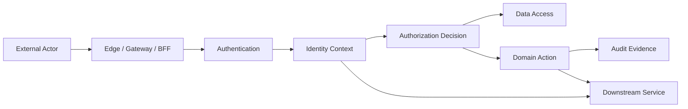
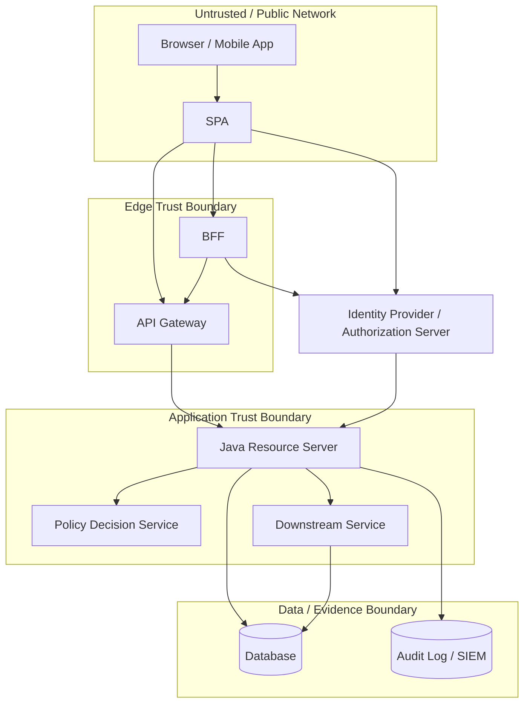
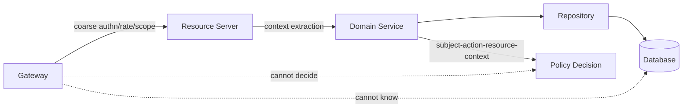
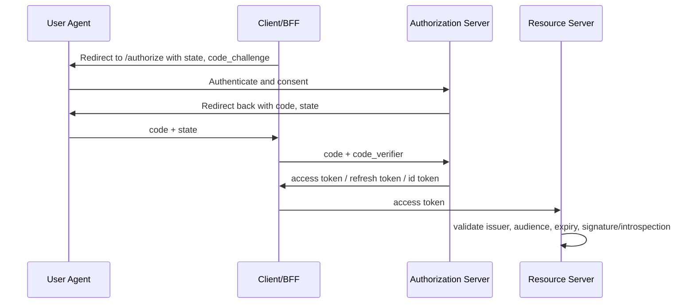

------
title: Learn Java Identity, Authentication & Authorization for Secure Enterprise API Platform - Part 003
description: Threat model untuk identity system dan enterprise API platform: assets, actors, trust boundaries, abuse cases, OAuth/OIDC failure modes, BOLA, tenant escape, dan security invariants yang dapat diuji.
series: learn-java-identity-authentication-authorization-api-platform
seriesTitle: Learn Java Identity, Authentication & Authorization for Secure Enterprise API Platform
order: 3
partTitle: Threat Model for Identity & API Security
tags:
- java
- identity
- authentication
- authorization
- api-security
- threat-modeling
- oauth
- oidc
- spring-security
date: 2026-06-28
---

# Part 003 — Threat Model for Identity & API Security

Part ini menjawab pertanyaan inti: **apa yang sebenarnya sedang kita lindungi ketika membangun identity, authentication, authorization, dan secure enterprise API platform?**

Banyak sistem Java terlihat "secure" karena sudah memakai OAuth, JWT, Spring Security, API gateway, TLS, WAF, dan IdP enterprise. Namun serangan identity jarang gagal karena tidak ada library. Serangan sering berhasil karena **model ancaman salah**, trust boundary kabur, authorization dianggap selesai di gateway, token dianggap bukti permission, object ownership tidak diuji, dan tenant isolation hanya menjadi konvensi aplikasi.

Di level top engineer, threat model bukan dokumen formalitas. Threat model adalah **peta kontrol keputusan**:

- aset apa yang bernilai;
- siapa actor yang boleh menyentuhnya;
- boundary mana yang harus tidak dipercaya;
- keputusan security mana yang harus eksplisit;
- kegagalan apa yang harus terdeteksi;
- bukti apa yang harus tersisa untuk audit, incident response, dan regulatory defensibility.

Kita tidak akan mengulang cryptography primitive atau basic REST security. Fokus part ini adalah membangun **cara berpikir ancaman** untuk identity-aware API platform.

---

## 1. Target Pembelajaran ala Kaufman

Dalam kerangka Josh Kaufman, kita tidak mulai dari membaca semua standar security. Kita mulai dari performa konkret.

Setelah menyelesaikan part ini, kamu harus bisa:

1. Membuat threat model ringkas untuk satu API enterprise dalam 30–60 menit.
2. Mengidentifikasi trust boundary antara browser, SPA, BFF, API gateway, resource server, service internal, IdP, policy service, database, dan audit pipeline.
3. Membedakan authentication threat, authorization threat, token threat, tenant isolation threat, session threat, dan operational threat.
4. Menulis security invariants yang bisa diuji otomatis.
5. Mengubah threat model menjadi backlog engineering: filter, validator, policy guard, test case, log event, alert, dan runbook.

Ukuran keberhasilan bukan "hafal OWASP". Ukuran keberhasilan adalah ketika melihat endpoint seperti ini:

```http
PATCH /tenants/{tenantId}/cases/{caseId}/assignments/{assignmentId}
Authorization: Bearer eyJ...
Content-Type: application/json

{
  "assigneeUserId": "u_9821",
  "reason": "escalation"
}
```

kamu langsung bertanya:

- Apakah `{tenantId}` dipercaya dari URL, token, session, atau database relationship?
- Apakah `caseId` memang milik tenant itu?
- Apakah `assignmentId` bagian dari case tersebut?
- Apakah caller boleh melakukan action `assign` pada case ini dalam state sekarang?
- Apakah `assigneeUserId` berada di tenant/organization yang valid?
- Apakah assignment ke diri sendiri punya aturan SoD?
- Apakah token audience cocok dengan API ini?
- Apakah actor adalah user asli, admin impersonation, service account, atau delegated client?
- Apakah keputusan ini terekam untuk audit?
- Apa yang terjadi jika event audit gagal?

Itulah thinking pattern yang kita cari.

---

## 2. Core Mental Model: Identity Security = Controlled Trust Propagation

Security pada identity/API bukan sekadar "memblokir attacker". Lebih tepatnya:

> Sistem menerima sinyal dari dunia luar, mengubahnya menjadi identity context, lalu mempropagasikan context itu ke keputusan authorization, data access, audit, dan downstream services tanpa kehilangan makna atau memperluas privilege secara tidak sah.

Alur sederhana:



Setiap panah adalah peluang kegagalan:

- External actor bisa memalsukan sinyal.
- Gateway bisa meneruskan header yang seharusnya dibuang.
- Authentication bisa menerima token dari issuer salah.
- Identity context bisa kehilangan tenant, assurance, atau delegation context.
- Authorization bisa hanya mengecek role global, bukan object-level permission.
- Data access bisa mengambil object sebelum authorization.
- Audit bisa mencatat subject salah.
- Downstream service bisa mempercayai caller secara berlebihan.

Threat model yang baik tidak hanya menanyakan "bagaimana attacker masuk?" tetapi juga "di mana trust berubah bentuk?".

---

## 3. Istilah Dasar yang Harus Konsisten

Kita gunakan vocabulary berikut sepanjang seri:

| Istilah | Makna | Threat utama |
|---|---|---|
| Subject | Entitas yang diklaim sebagai pelaku: user, workload, client, admin acting-as | Subject spoofing, ambiguous subject |
| Principal | Subject yang sudah diautentikasi dalam runtime security context | Principal injection, stale context |
| Account | Representasi subject dalam sistem/domain tertentu | Account takeover, orphaned account |
| Credential | Faktor/sarana pembuktian: password, key, passkey, cert, assertion | Theft, replay, phishing |
| Session | State interaksi authenticated antara actor dan sistem | Fixation, hijack, CSRF, stale session |
| Token | Artefak authorization/delegation yang dibawa request | Replay, audience confusion, expired token reuse |
| Client | Aplikasi yang meminta token atau akses | Client impersonation, secret leakage |
| Resource | Object/API/data yang dilindungi | BOLA/IDOR, excessive exposure |
| Tenant | Boundary organisasi/isolasi data/policy | Tenant escape, confused tenant |
| Policy | Aturan keputusan akses | Policy drift, bypass, overbroad grants |
| Claim | Pernyataan dalam token/assertion | Over-trust, stale claim, injection |
| Scope | Delegated capability pada OAuth | Scope inflation, action ambiguity |
| Role | Kumpulan entitlement/policy shortcut | Role explosion, god role |

Satu prinsip penting:

> Token membuktikan bahwa authorization server mengeluarkan artefak tertentu. Token tidak otomatis membuktikan bahwa caller boleh melakukan semua action pada semua object.

Authorization tetap harus menjawab pertanyaan domain:

```text
Can subject S, acting through client C, under tenant T, with assurance A,
perform action X on resource R in state RS, at time N, from context K?
```

---

## 4. Asset Inventory: Apa yang Sebenarnya Bernilai?

Threat model dimulai dari asset, bukan dari teknologi.

Dalam enterprise API platform, asset biasanya terbagi menjadi beberapa kelas.

### 4.1 Identity Assets

| Asset | Contoh | Dampak jika bocor/rusak |
|---|---|---|
| User account | employee, customer, investigator, officer | Account takeover, unauthorized action |
| Authenticator binding | passkey, MFA device, recovery factor | Persistent compromise |
| Credential secret | password hash, client secret, private key | Token minting, impersonation |
| Session state | browser session, refresh token state | Session hijack, replay |
| Identity proofing evidence | KYC documents, verification status | Privacy breach, false identity |
| Federation binding | external IdP subject mapping | Account linking attack |

### 4.2 Authorization Assets

| Asset | Contoh | Dampak jika salah |
|---|---|---|
| Role assignment | `CASE_MANAGER`, `SUPERVISOR` | Privilege escalation |
| Entitlement | `case:approve`, `payment:release` | Unauthorized action |
| Policy rule | ABAC/ReBAC decision | Silent policy bypass |
| Resource ownership | account owner, case owner, team assignment | BOLA/IDOR |
| Tenant membership | user-to-tenant relationship | Cross-tenant data leak |
| Delegation grant | consent, acting-as, admin support | Untraceable impersonation |

### 4.3 Token and Protocol Assets

| Asset | Contoh | Dampak jika disalahgunakan |
|---|---|---|
| Authorization code | OAuth auth code | Code interception/token theft |
| Access token | JWT/opaque token | API access replay |
| Refresh token | long-lived credential-like artifact | Persistent access |
| ID token | OIDC login assertion | Login CSRF, wrong audience use |
| JWK/private signing key | IdP key material | Token forgery |
| Client registration metadata | redirect URI, grant type, auth method | Redirect abuse, malicious client |

### 4.4 Business and Regulatory Assets

| Asset | Contoh | Dampak |
|---|---|---|
| Protected data | PII, case data, health/financial info | Breach notification, legal exposure |
| Decision trail | who approved, why, when | Non-defensible enforcement decision |
| Evidence | documents, attachments, history | Tampering, chain-of-custody issue |
| Workflow state | escalation, sanction, appeal | Unauthorized state transition |
| Audit logs | immutable event stream | Loss of accountability |

Di sistem regulasi/enforcement, audit dan decision trail sering sama pentingnya dengan data utama. Access yang tidak sah bukan hanya confidentiality issue, tetapi juga dapat merusak validity of decision.

---

## 5. Actor Model: Siapa yang Bisa Menyerang?

Threat modelling yang naif hanya membayangkan attacker anonim dari internet. Dalam identity/API platform, actor lebih beragam.

| Actor | Capability | Contoh ancaman |
|---|---|---|
| Anonymous internet attacker | Mengirim request tanpa credential | Enumeration, credential stuffing, token endpoint abuse |
| Authenticated normal user | Punya token valid untuk dirinya | BOLA, horizontal privilege escalation |
| Overprivileged employee | Punya akses internal terlalu luas | Data browsing, SoD violation |
| Malicious tenant admin | Admin di tenant sendiri | Tenant escape, role assignment abuse |
| Compromised user | Token/session valid tapi dicuri | Replay, silent action |
| Compromised client app | Client secret/token bocor | Token minting, delegated abuse |
| Compromised service | Workload internal terkena breach | Lateral movement, service-to-service privilege escalation |
| Misconfigured gateway | Boundary melemah | Header spoofing, route bypass |
| Third-party IdP | Federation source bermasalah | Wrong identity mapping, stale deprovisioning |
| Insider operator | Akses database/log/admin console | Audit tampering, manual privilege changes |

Satu insight penting:

> Banyak vulnerability authorization hanya dapat dieksploitasi oleh user yang sudah login. Karena itu "semua endpoint memerlukan token" bukan bukti API aman.

---

## 6. Trust Boundary Map

Trust boundary adalah tempat di mana sistem harus menurunkan asumsi dan melakukan verifikasi eksplisit.

Contoh architecture enterprise API:



Boundary penting:

1. **User agent boundary** — browser/mobile tidak dipercaya penuh.
2. **Edge boundary** — gateway/BFF boleh membantu, tetapi bukan satu-satunya enforcement.
3. **Token boundary** — token dari luar harus divalidasi terhadap issuer, audience, expiry, signature/introspection, dan client context.
4. **Application boundary** — resource server tetap harus melakukan authorization domain.
5. **Data boundary** — database query harus menjaga tenant/object constraints.
6. **Service boundary** — service internal tidak otomatis trusted.
7. **Audit boundary** — event audit harus tahan manipulasi dan cukup kaya konteks.

Rule of thumb:

> Semakin dekat komponen ke data atau domain action, semakin sedikit ia boleh bergantung pada asumsi security dari lapisan luar.

---

## 7. Threat Taxonomy untuk Identity dan API

Kita gunakan taxonomy yang practical, bukan akademik panjang.

### 7.1 Authentication Threats

Authentication threat terjadi ketika sistem salah menerima atau mempertahankan identity actor.

Contoh:

- Credential stuffing.
- Password spraying.
- Phishing credential/MFA.
- Weak account recovery.
- Session fixation.
- Session hijacking.
- Login CSRF.
- Account enumeration.
- Federation account linking error.
- MFA fatigue/push bombing.
- Stale deprovisioned account masih bisa login.

Pertanyaan desain:

- Apakah login endpoint membedakan "user tidak ada" vs "password salah"?
- Apakah recovery flow lebih lemah dari login utama?
- Apakah MFA bisa di-reset oleh support tanpa evidence cukup?
- Apakah session renewal mempertahankan AAL yang benar?
- Apakah perubahan credential mencabut session/token lama?

### 7.2 Authorization Threats

Authorization threat terjadi ketika subject valid melakukan action yang tidak seharusnya.

Contoh:

- Broken object-level authorization.
- Broken function-level authorization.
- Privilege escalation via role assignment.
- Policy bypass through alternate endpoint.
- Missing tenant predicate.
- Mass assignment of protected fields.
- State transition without permission/state check.
- Approve own request despite segregation-of-duties.

Pertanyaan desain:

- Apakah semua endpoint punya subject-action-resource decision?
- Apakah object relationship diverifikasi dari database, bukan dari request?
- Apakah authorization ada di service/domain layer, bukan hanya controller?
- Apakah list endpoint dan detail endpoint punya policy konsisten?
- Apakah action endpoint memvalidasi workflow state?

### 7.3 Token Threats

Token threat terjadi ketika artefak token diterima, disimpan, diteruskan, atau ditafsirkan dengan salah.

Contoh:

- Token replay.
- Token substitution.
- Audience confusion.
- Issuer confusion.
- Algorithm confusion.
- Long-lived access token.
- Refresh token reuse after theft.
- JWT accepted without revocation path for high-risk operation.
- ID token dipakai sebagai access token.
- Access token dikirim ke API yang bukan audience-nya.

Pertanyaan desain:

- Siapa issuer yang dipercaya?
- Apakah audience API divalidasi?
- Apakah `azp`/authorized party relevan?
- Apakah token sender-constrained atau bearer?
- Apakah token expiry sesuai risk?
- Bagaimana revoke/rotate saat incident?

### 7.4 Protocol Threats OAuth/OIDC

OAuth/OIDC memberikan standar, tetapi protokol salah implementasi bisa membuka serangan.

Contoh:

- Redirect URI wildcard terlalu luas.
- Authorization code interception tanpa PKCE.
- State parameter hilang atau tidak diikat ke session.
- Nonce hilang di OIDC login.
- Mix-up attack di multi-IdP.
- Confused client antara public dan confidential client.
- Implicit flow di SPA modern.
- Resource owner password credentials flow masih dipakai.
- Client secret tertanam di mobile/SPA.
- Refresh token untuk public client tanpa rotation/protection.

Pertanyaan desain:

- Client type public/confidential benar?
- PKCE selalu digunakan untuk authorization code?
- Redirect URI exact match?
- Apakah state dan nonce disimpan dan divalidasi?
- Apakah metadata issuer dipin/dikontrol?
- Apakah flow yang deprecated sudah dimatikan?

### 7.5 Tenant Isolation Threats

Tenant threat terjadi ketika boundary organisasi/data bocor.

Contoh:

- `tenantId` dari path langsung dipercaya.
- User memilih tenant aktif tanpa membership check.
- Token tenant claim tidak cocok dengan resource tenant.
- Query repository tidak menambahkan tenant predicate.
- Cache key tidak memasukkan tenant.
- Background job memproses data lintas tenant dengan principal salah.
- Admin tenant A bisa assign role di tenant B.

Pertanyaan desain:

- Apa source of truth tenant membership?
- Apakah tenant di token hanya hint atau authoritative?
- Apakah resource tenant diverifikasi dari database?
- Apakah semua cache key tenant-aware?
- Apakah audit event selalu punya tenant resolved?

### 7.6 API Abuse and Business Logic Threats

Tidak semua ancaman berupa bypass login. Banyak API disalahgunakan secara sah dari perspektif teknis.

Contoh:

- Excessive data exposure.
- Bulk export tanpa throttling atau approval.
- Enumeration via predictable IDs.
- Workflow abuse: draft → approved tanpa reviewer.
- Race condition double approval.
- Replay command idempotency tidak aman.
- Overposting/mass assignment.
- File upload dengan metadata authorization lemah.

Pertanyaan desain:

- Apakah endpoint mengembalikan field lebih banyak dari kebutuhan UI?
- Apakah high-risk action perlu step-up auth?
- Apakah idempotency key scoped per subject/action/resource?
- Apakah state transition atomic dengan authorization?
- Apakah pagination/rate limits mencegah scraping internal?

### 7.7 Operational Threats

Security gagal bukan hanya karena kode.

Contoh:

- Signing key bocor.
- JWKS cache tidak refresh saat rotation.
- IdP outage membuat API fail-open.
- Policy service outage membuat API fail-open.
- Audit pipeline down dan action tetap jalan tanpa compensating control.
- Misconfigured client registration di production.
- Admin console tanpa strong auth.
- Break-glass account tidak diaudit.

Pertanyaan desain:

- Untuk setiap dependency security, fail-open atau fail-closed?
- Siapa boleh rotate key/client secret?
- Bagaimana emergency revoke?
- Apa alert untuk token validation failure spike?
- Apakah audit log loss terdeteksi?

---

## 8. STRIDE Applied to Identity/API Platform

STRIDE masih berguna jika diterjemahkan ke identity/API domain.

| STRIDE | Identity/API interpretation | Contoh |
|---|---|---|
| Spoofing | Actor berpura-pura menjadi subject/client/service lain | Forged header `X-User-Id`, stolen token, fake service cert |
| Tampering | Data/token/policy berubah tanpa hak | Modify JWT alg, tamper role assignment, alter audit log |
| Repudiation | Actor menyangkal action karena evidence lemah | Audit tidak mencatat acting-as/admin delegation |
| Information Disclosure | Data/claim/secret bocor | BOLA, excessive data exposure, token in logs |
| Denial of Service | Security/control plane tidak tersedia | IdP token endpoint flood, JWKS outage, policy service down |
| Elevation of Privilege | Actor mendapatkan capability lebih tinggi | Role escalation, tenant admin to platform admin, scope inflation |

Contoh penggunaan STRIDE pada endpoint:

```http
POST /cases/{caseId}/approve
Authorization: Bearer <access-token>
```

| Category | Threat | Control |
|---|---|---|
| Spoofing | Access token dari issuer lain diterima | Issuer allowlist, signature/introspection validation |
| Tampering | Body mengubah field protected | DTO allowlist, command model, server-side state calculation |
| Repudiation | Approval tidak bisa dibuktikan | Audit event with subject, tenant, case, decision, reason, correlation ID |
| Information Disclosure | Response mengembalikan full case including hidden evidence | Response projection by policy |
| DoS | Approval flood/race | Idempotency, optimistic locking, rate limits |
| Elevation | User approve case milik tim lain/diri sendiri | Object-level authorization + SoD + state guard |

---

## 9. Abuse Case Catalogue

Threat model yang baik menulis abuse case sebagai narasi attacker.

### 9.1 Abuse Case: Horizontal Case Access

**As an authenticated user in Tenant A, I change `caseId` in the URL to access another user's case.**

Attack path:

1. Login normally.
2. Capture request `GET /cases/case_123`.
3. Replace with `GET /cases/case_124`.
4. API validates token but does not check object ownership/team assignment.
5. Sensitive case data leaks.

Required invariant:

```text
For every case read/update/delete/action,
resource.case.tenantId must equal resolvedTenantId,
and subject must be authorized for the specific case relationship/action.
```

Engineering controls:

- Avoid repository methods like `findById(caseId)` in protected flows.
- Use `findAuthorizedCase(subject, tenant, action, caseId)` or policy guard.
- Regression test ID substitution.
- Audit denied attempts.

### 9.2 Abuse Case: Tenant Escape Through Path Tenant

**As a tenant admin, I call `/tenants/{otherTenantId}/users` and manage another tenant.**

Attack path:

1. User has `TENANT_ADMIN` role in Tenant A.
2. Endpoint checks `hasRole('TENANT_ADMIN')` only.
3. URL tenant ID is trusted.
4. User creates role assignment in Tenant B.

Required invariant:

```text
A tenant-scoped role only grants permissions inside tenants where the subject has active membership.
```

Engineering controls:

- Resolve tenant membership server-side.
- Check role assignment includes tenant dimension.
- Never treat global role names as tenant-scoped authority without tenant binding.

### 9.3 Abuse Case: Gateway Header Spoofing

**As an external attacker, I send `X-User-Id: admin` and bypass application auth because service trusts gateway headers.**

Attack path:

1. Public request includes identity headers.
2. Gateway forwards headers instead of stripping/re-signing.
3. Application accepts header identity.
4. Attacker becomes admin.

Required invariant:

```text
Application identity context must originate from validated token/session/mTLS assertion,
not from untrusted inbound headers.
```

Engineering controls:

- Strip inbound identity headers at gateway.
- Only accept signed internal identity headers from trusted proxy network plus mTLS.
- Prefer token validation in resource server.
- Add integration test that spoofed headers are ignored.

### 9.4 Abuse Case: ID Token as API Bearer Token

**As a client developer or attacker, I send an OIDC ID token to an API and the API accepts it as access token.**

Attack path:

1. Client obtains ID token for login.
2. API validates signature and issuer only.
3. API ignores token type/audience.
4. API treats identity login token as delegated API access.

Required invariant:

```text
Resource servers must accept only tokens intended for that resource server audience and token use.
```

Engineering controls:

- Validate `aud` and issuer.
- Separate ID token handling from access token handling.
- Use introspection/reference tokens where revocation/token type matters.

### 9.5 Abuse Case: Stale Claim Authorization

**As a user whose access was removed, I keep using an unexpired JWT that still contains old roles.**

Attack path:

1. User receives JWT with role `CASE_APPROVER`.
2. Admin removes role.
3. JWT remains valid for 1 hour.
4. API trusts role claim only.
5. User approves cases after removal.

Required invariant:

```text
High-risk authorization decisions must not rely solely on stale long-lived claims.
```

Engineering controls:

- Short access token lifetime.
- Introspection/reference token for high-risk APIs.
- Policy lookup for critical actions.
- Role version/security stamp check.
- Event-driven revocation for critical access changes.

### 9.6 Abuse Case: Support Impersonation Without Accountability

**As support staff, I impersonate a customer and perform sensitive action that appears as the customer.**

Attack path:

1. Support uses admin console "login as user".
2. System replaces subject with customer.
3. Audit records customer only.
4. No evidence of support actor or reason.

Required invariant:

```text
Impersonation must preserve both effective subject and initiating actor.
```

Engineering controls:

- Represent `actor` and `subject` separately.
- Require reason/ticket reference.
- Block high-risk actions under impersonation unless explicitly allowed.
- Audit `initiator`, `effectiveSubject`, `delegationType`, `reason`.

---

## 10. Threat Model Template for One API

Gunakan template ini setiap kali mendesain endpoint baru.

```mdx
## API Threat Model: <Endpoint / Capability>

### 1. Business Capability
- What user/business outcome does this endpoint enable?
- What damage occurs if abused?

### 2. Actors
- Human users:
- Service clients:
- Admin/support actors:
- Tenant roles:

### 3. Assets
- Data read:
- Data changed:
- Tokens/sessions involved:
- Audit/evidence required:

### 4. Trust Boundaries
- Public edge:
- Gateway/BFF:
- Resource server:
- Downstream service:
- Database/cache:
- Audit pipeline:

### 5. Security Decisions
- Authentication required:
- Token/session requirements:
- Tenant resolution:
- Object-level authorization:
- State transition rules:
- Step-up/MFA requirement:
- SoD/delegation rules:

### 6. Abuse Cases
- ID substitution:
- Tenant substitution:
- Role/scope abuse:
- Replay/race:
- Excessive data exposure:
- Audit evasion:

### 7. Invariants
- Invariant 1:
- Invariant 2:
- Invariant 3:

### 8. Tests
- Positive tests:
- Negative tests:
- Cross-tenant tests:
- Expired/revoked/stale token tests:
- Audit tests:

### 9. Operational Signals
- Logs:
- Metrics:
- Alerts:
- Runbooks:
```

---

## 11. Making Threats Executable in Java

A common failure is writing threat model as prose only. Top-level teams convert threat models into executable constraints.

### 11.1 Represent Security Context Explicitly

Avoid scattering raw `Authentication` access everywhere. Create an application-level context.

```java
public record ActorContext(
        String subjectId,
        SubjectType subjectType,
        String clientId,
        String tenantId,
        Set<String> scopes,
        Set<TenantRole> tenantRoles,
        AssuranceLevel assuranceLevel,
        DelegationContext delegation,
        Instant authenticatedAt,
        String correlationId
) {
    public boolean isDelegated() {
        return delegation != null && delegation.type() != DelegationType.NONE;
    }
}

public enum SubjectType {
    HUMAN_USER,
    SERVICE_ACCOUNT,
    WORKLOAD,
    SUPPORT_ADMIN
}

public record TenantRole(String tenantId, String role) {}

public enum AssuranceLevel {
    UNKNOWN,
    SINGLE_FACTOR,
    MULTI_FACTOR,
    PHISHING_RESISTANT
}

public record DelegationContext(
        DelegationType type,
        String initiatingActorId,
        String effectiveSubjectId,
        String reason,
        String ticketRef
) {}

public enum DelegationType {
    NONE,
    CONSENT_DELEGATION,
    ON_BEHALF_OF,
    SUPPORT_IMPERSONATION,
    BREAK_GLASS
}
```

Benefit:

- tenant tidak hilang;
- delegation tidak hilang;
- assurance dapat dipakai untuk step-up;
- audit tidak perlu menebak actor;
- downstream propagation lebih terkontrol.

### 11.2 Centralize Context Extraction

```java
@Component
public final class ActorContextResolver {

    public ActorContext resolve(Authentication authentication, HttpServletRequest request) {
        if (!(authentication.getPrincipal() instanceof Jwt jwt)) {
            throw new AuthenticationCredentialsNotFoundException("JWT principal required");
        }

        String subject = jwt.getSubject();
        String clientId = jwt.getClaimAsString("azp");
        String tenantId = jwt.getClaimAsString("tenant_id");
        List<String> scopeClaim = jwt.getClaimAsStringList("scope");

        if (subject == null || subject.isBlank()) {
            throw new BadCredentialsException("Missing subject");
        }
        if (tenantId == null || tenantId.isBlank()) {
            throw new BadCredentialsException("Missing tenant context");
        }

        return new ActorContext(
                subject,
                SubjectType.HUMAN_USER,
                clientId,
                tenantId,
                scopeClaim == null ? Set.of() : Set.copyOf(scopeClaim),
                Set.of(),
                mapAssurance(jwt),
                mapDelegation(jwt),
                jwt.getIssuedAt(),
                resolveCorrelationId(request)
        );
    }

    private AssuranceLevel mapAssurance(Jwt jwt) {
        String acr = jwt.getClaimAsString("acr");
        if ("phishing-resistant".equals(acr)) return AssuranceLevel.PHISHING_RESISTANT;
        if ("mfa".equals(acr)) return AssuranceLevel.MULTI_FACTOR;
        return AssuranceLevel.UNKNOWN;
    }

    private DelegationContext mapDelegation(Jwt jwt) {
        String actor = jwt.getClaimAsString("act_sub");
        if (actor == null) return null;
        return new DelegationContext(
                DelegationType.ON_BEHALF_OF,
                actor,
                jwt.getSubject(),
                jwt.getClaimAsString("act_reason"),
                jwt.getClaimAsString("act_ticket")
        );
    }

    private String resolveCorrelationId(HttpServletRequest request) {
        String value = request.getHeader("X-Correlation-Id");
        return value == null || value.isBlank() ? UUID.randomUUID().toString() : value;
    }
}
```

Threat model mapping:

- missing tenant claim becomes authentication/context failure;
- unsupported principal type fails closed;
- assurance is explicit;
- delegated actor is preserved.

### 11.3 Model Authorization as Decision, Not Annotation Only

Annotations are useful, but domain actions need structured decisions.

```java
public record AuthorizationRequest(
        ActorContext actor,
        String action,
        ResourceRef resource,
        Map<String, Object> context
) {}

public record ResourceRef(
        String type,
        String id,
        String tenantId
) {}

public record AuthorizationDecision(
        boolean allowed,
        String policyId,
        String reasonCode,
        Map<String, Object> evidence
) {
    public static AuthorizationDecision allow(String policyId, Map<String, Object> evidence) {
        return new AuthorizationDecision(true, policyId, "ALLOW", evidence);
    }

    public static AuthorizationDecision deny(String policyId, String reasonCode, Map<String, Object> evidence) {
        return new AuthorizationDecision(false, policyId, reasonCode, evidence);
    }
}
```

Why this matters:

- denial reasons can be logged safely;
- policy version can be audited;
- tests can assert decisions;
- downstream systems can reason over consistent structure;
- controller annotations do not become the only security layer.

### 11.4 Enforce Object Authorization Before Mutation

```java
@Service
public class CaseAssignmentService {

    private final CaseRepository caseRepository;
    private final AuthorizationService authorizationService;
    private final AuditPublisher auditPublisher;

    public CaseAssignmentService(
            CaseRepository caseRepository,
            AuthorizationService authorizationService,
            AuditPublisher auditPublisher
    ) {
        this.caseRepository = caseRepository;
        this.authorizationService = authorizationService;
        this.auditPublisher = auditPublisher;
    }

    @Transactional
    public void assignCase(ActorContext actor, String caseId, String assigneeUserId, String reason) {
        CaseRecord caseRecord = caseRepository.findByIdForUpdate(caseId)
                .orElseThrow(() -> new NotFoundException("Case not found"));

        ResourceRef resource = new ResourceRef("case", caseRecord.id(), caseRecord.tenantId());

        AuthorizationDecision decision = authorizationService.decide(new AuthorizationRequest(
                actor,
                "case.assign",
                resource,
                Map.of(
                        "caseState", caseRecord.state().name(),
                        "assigneeUserId", assigneeUserId
                )
        ));

        if (!decision.allowed()) {
            auditPublisher.publishDenied(actor, "case.assign", resource, decision);
            throw new AccessDeniedException("Not authorized");
        }

        caseRecord.assignTo(assigneeUserId, reason);
        caseRepository.save(caseRecord);

        auditPublisher.publishAllowed(actor, "case.assign", resource, decision);
    }
}
```

Key details:

- object is loaded and locked before mutation;
- resource tenant comes from database, not URL;
- authorization decision sees action/resource/context;
- denied attempts are auditable;
- mutation and authorization are in one transactional flow.

### 11.5 Avoid the Dangerous Repository Pattern

Dangerous:

```java
Optional<CaseRecord> findById(String caseId);
```

Safer for read paths:

```java
@Query("""
    select c
    from CaseRecord c
    join CaseAssignment a on a.caseId = c.id
    where c.id = :caseId
      and c.tenantId = :tenantId
      and a.userId = :subjectId
      and a.active = true
""")
Optional<CaseRecord> findAssignedCase(
        @Param("tenantId") String tenantId,
        @Param("subjectId") String subjectId,
        @Param("caseId") String caseId
);
```

But be careful: query-time authorization is not always enough for complex actions. It is excellent for filtering but should be combined with explicit decision logic for high-risk mutations.

---

## 12. Gateway Is Not Enough

Gateway can enforce coarse controls:

- TLS termination.
- Route-level authentication.
- Rate limiting.
- Request size limits.
- JWT signature validation.
- Basic scope checks.
- Header normalization.
- Bot/WAF integration.

But gateway usually cannot safely enforce:

- object ownership;
- workflow-state-specific permission;
- segregation of duties;
- domain-specific delegation;
- tenant relationship derived from database;
- field-level response filtering;
- business-context-sensitive step-up auth.

Mermaid view:



Engineering rule:

> Gateway can reduce attack surface, but domain authorization must live where domain facts are known.

---

## 13. Security Invariants

Security invariants are concise statements that must always hold. They are more useful than vague requirements like "API must be secure".

### 13.1 Authentication Invariants

```text
AUTHN-001: Every protected API request must be associated with exactly one authenticated principal or fail closed.
AUTHN-002: Public endpoints must be explicitly listed; unknown endpoints are not public by default.
AUTHN-003: Identity headers from external requests must be ignored unless produced by a trusted, authenticated edge component.
AUTHN-004: Session renewal must not increase assurance level without fresh authentication.
AUTHN-005: Credential reset must invalidate sessions and refresh tokens issued before reset.
```

### 13.2 Token Invariants

```text
TOKEN-001: Resource servers must validate issuer, audience, expiry, signature or introspection status.
TOKEN-002: ID tokens must never be accepted as API access tokens.
TOKEN-003: Access tokens must not be logged in plaintext.
TOKEN-004: High-risk APIs must have revocation or freshness strategy.
TOKEN-005: Public clients must not rely on embedded client secrets.
```

### 13.3 Authorization Invariants

```text
AUTHZ-001: Every object-level action must verify subject-to-resource relationship.
AUTHZ-002: Tenant-scoped roles apply only inside the tenant where assigned.
AUTHZ-003: Resource tenant must come from trusted data relationship, not only from request path.
AUTHZ-004: Deny is the default when policy input is missing or ambiguous.
AUTHZ-005: Scope grants client capability but does not replace domain authorization.
AUTHZ-006: A subject must not approve, review, or release its own high-risk request unless policy explicitly permits it.
```

### 13.4 Audit Invariants

```text
AUDIT-001: Every high-risk allowed action must produce an audit event.
AUDIT-002: Every high-risk denied action should produce a security event without leaking sensitive data.
AUDIT-003: Delegated/impersonated actions must record both initiating actor and effective subject.
AUDIT-004: Audit events must include correlation ID, tenant, action, resource reference, decision, and policy version when available.
AUDIT-005: Audit pipeline failure must be observable and have an explicit fail-open/fail-closed decision by action risk.
```

---

## 14. Turning Invariants into Tests

### 14.1 BOLA Regression Test

```java
@SpringBootTest
@AutoConfigureMockMvc
class CaseAccessAuthorizationTest {

    @Autowired MockMvc mvc;

    @Test
    void userCannotReadCaseFromAnotherTenant() throws Exception {
        String token = jwtFor("user-a", "tenant-a", "case:read");

        mvc.perform(get("/tenants/tenant-b/cases/case-owned-by-tenant-b")
                        .header("Authorization", "Bearer " + token))
                .andExpect(status().isForbidden());
    }

    @Test
    void userCannotReadUnassignedCaseInSameTenant() throws Exception {
        String token = jwtFor("user-a", "tenant-a", "case:read");

        mvc.perform(get("/tenants/tenant-a/cases/case-not-assigned-to-user-a")
                        .header("Authorization", "Bearer " + token))
                .andExpect(status().isForbidden());
    }
}
```

### 14.2 Token Audience Test

```java
@Test
void rejectsTokenForDifferentAudience() throws Exception {
    String token = jwt()
            .issuer("https://idp.example.com")
            .audience("payments-api")
            .subject("user-123")
            .sign();

    mvc.perform(get("/cases/case-123")
                    .header("Authorization", "Bearer " + token))
            .andExpect(status().isUnauthorized());
}
```

### 14.3 Header Spoofing Test

```java
@Test
void ignoresSpoofedIdentityHeader() throws Exception {
    mvc.perform(get("/admin/users")
                    .header("X-User-Id", "platform-admin"))
            .andExpect(status().isUnauthorized());
}
```

### 14.4 Impersonation Audit Test

```java
@Test
void supportImpersonationAuditContainsBothActors() {
    ActorContext actor = new ActorContext(
            "customer-123",
            SubjectType.HUMAN_USER,
            "support-console",
            "tenant-a",
            Set.of("case:read"),
            Set.of(),
            AssuranceLevel.MULTI_FACTOR,
            new DelegationContext(
                    DelegationType.SUPPORT_IMPERSONATION,
                    "support-agent-9",
                    "customer-123",
                    "customer support ticket",
                    "TICKET-991"
            ),
            Instant.now(),
            "corr-1"
    );

    AuditEvent event = AuditEvent.allowed(actor, "case.read", "case-1", "policy-2");

    assertThat(event.initiatingActorId()).isEqualTo("support-agent-9");
    assertThat(event.effectiveSubjectId()).isEqualTo("customer-123");
    assertThat(event.delegationType()).isEqualTo("SUPPORT_IMPERSONATION");
}
```

---

## 15. Risk Rating: Not All Threats Are Equal

Gunakan rating sederhana yang berguna untuk engineering planning.

| Dimension | Low | Medium | High | Critical |
|---|---|---|---|---|
| Data sensitivity | public metadata | internal business | PII/financial/case | regulated evidence/secrets |
| Action impact | read-only | update draft | approval/release | irreversible/legal/financial |
| Actor exposure | internal only | authenticated users | internet clients | public unauthenticated |
| Exploitability | needs insider | complex chain | simple parameter change | automated at scale |
| Detectability | obvious | logged | subtle | silent/no audit |
| Blast radius | one record | one user/team | one tenant | all tenants/platform |

Example:

```text
Threat: authenticated user changes caseId to view another user's case.
Data sensitivity: High
Action impact: High if evidence exposed
Actor exposure: High
Exploitability: Critical, simple ID substitution
Detectability: Medium if denied logs exist, Low if allowed silently
Blast radius: High within tenant or Critical cross-tenant
Priority: Critical
```

Do not over-engineer low-risk endpoints while under-testing object authorization in high-value APIs.

---

## 16. Threat Modelling OAuth/OIDC Flows

### 16.1 Authorization Code + PKCE

Flow:



Threat points:

| Step | Threat | Control |
|---|---|---|
| Authorization request | CSRF/login confusion | `state` bound to session |
| Authorization response | Code interception | PKCE, TLS, exact redirect URI |
| Token exchange | Stolen code replay | one-time code, PKCE verifier |
| Token use | Audience confusion | validate `aud` |
| Token storage | Browser token theft | BFF/session pattern or hardened storage |
| Logout | Session/token mismatch | coordinated logout/revocation strategy |

### 16.2 Client Credentials

Threats:

- client secret leak;
- overbroad machine scopes;
- no service identity proof beyond static secret;
- token reused across services;
- workload not tied to deployment identity.

Controls:

- prefer private key JWT or mTLS for confidential clients where appropriate;
- short token lifetime;
- audience per API;
- least-privilege scopes;
- workload identity/SPIFFE for internal services;
- rotation and emergency disable.

### 16.3 Federation Login

Threats:

- wrong external subject mapped to local account;
- email claim trusted as stable identifier;
- tenant selected by request instead of federation relationship;
- stale deprovisioning from enterprise IdP;
- weak IdP used for high-risk action.

Controls:

- map by issuer + stable subject, not email alone;
- tenant membership from controlled directory/provisioning;
- assurance-aware access;
- account linking step-up;
- deprovisioning hooks and periodic reconciliation.

---

## 17. Secure Defaults Matrix

| Area | Unsafe default | Safer default |
|---|---|---|
| Unknown endpoint | public unless secured | deny unless explicitly public |
| Token validation | signature only | issuer + audience + expiry + algorithm + key trust |
| Authorization | role-only | subject-action-resource-context |
| Tenant | request path trusted | tenant resolved and cross-checked |
| Claims | long-lived claims trusted | claims as hints; critical decisions refreshed |
| Gateway | only enforcement point | coarse at gateway, domain in service |
| Service calls | internal network trusted | workload identity + least privilege |
| Audit | best-effort invisible | risk-based fail strategy + alert |
| Admin | global admin role | scoped admin + SoD + step-up + audit |
| Impersonation | replace user identity | preserve initiator and effective subject |

---

## 18. Common Anti-Patterns

### 18.1 `hasRole('ADMIN')` Everywhere

Problem:

- global role ignores tenant;
- does not encode action;
- does not encode resource;
- encourages god permissions;
- hard to audit why access was allowed.

Better:

```text
Subject has permission case.assign in tenant T for case C because:
- active tenant membership;
- role grants action;
- case belongs to tenant;
- case state allows assignment;
- subject is not prohibited by SoD;
- policy version P evaluated at time N.
```

### 18.2 Scope as Domain Permission

OAuth scope tells what a client/token is allowed to request from an API at a coarse level. It does not mean the user can access all resources.

Bad:

```java
@PreAuthorize("hasAuthority('SCOPE_case:read')")
@GetMapping("/cases/{caseId}")
CaseDto getCase(@PathVariable String caseId) { ... }
```

Better:

```java
@PreAuthorize("hasAuthority('SCOPE_case:read')")
@GetMapping("/cases/{caseId}")
CaseDto getCase(@AuthenticationPrincipal Jwt jwt, @PathVariable String caseId) {
    ActorContext actor = actorContextResolver.resolve(jwt);
    return caseQueryService.getAuthorizedCase(actor, caseId);
}
```

The scope gates API capability. Domain service checks object authorization.

### 18.3 Trusting `tenantId` from UI

Bad:

```java
caseRepository.findByTenantIdAndId(requestTenantId, caseId);
```

Safer:

- resolve active tenant from authenticated membership;
- load resource tenant from database;
- ensure membership/action relationship;
- treat path tenant as routing hint, not authority.

### 18.4 Token Payload as Database

JWT claims are not a replacement for domain state.

Danger:

- roles stale;
- tenant membership stale;
- account disabled after token issue;
- risk posture changed;
- emergency revocation not reflected.

Use claims for stable low-risk attributes and routing hints. Use authoritative lookup or introspection for high-risk decisions.

### 18.5 No Negative Authorization Tests

Teams often test:

- admin can create user;
- user can read own data.

But they forget:

- user cannot read another user's data;
- tenant admin cannot manage another tenant;
- user cannot approve own request;
- expired token rejected;
- ID token rejected;
- missing audit event fails test.

Security correctness is mostly proven by negative tests.

---

## 19. Observability for Identity Threats

Security controls without observability become silent failure points.

### 19.1 Logs to Capture

For authentication failures:

- timestamp;
- client ID if known;
- username/account identifier hash if appropriate;
- reason code, not raw secret;
- source IP/device risk signals;
- correlation ID.

For authorization decisions:

- subject ID;
- tenant ID;
- client ID;
- action;
- resource type/id;
- allow/deny;
- policy ID/version;
- reason code;
- delegation context;
- correlation ID.

For token validation failures:

- failure category: expired, invalid issuer, invalid audience, invalid signature, introspection inactive;
- token hash/fingerprint, not token;
- API route;
- source.

### 19.2 Metrics

Examples:

```text
auth.login.failure.count{reason="bad_credentials"}
auth.login.failure.count{reason="mfa_required"}
token.validation.failure.count{reason="invalid_audience"}
authz.decision.count{decision="deny", action="case.assign"}
authz.cross_tenant_denied.count
audit.publish.failure.count
policy.decision.latency.p95
jwks.refresh.failure.count
```

### 19.3 Alerts

Alert candidates:

- spike in invalid audience tokens;
- repeated cross-tenant denied attempts;
- sudden increase in token introspection failures;
- audit publish failure for high-risk action;
- admin role assignment outside change window;
- service account token from unusual network;
- many object IDs requested sequentially.

---

## 20. Failure Mode Table

| Failure mode | Symptom | Root cause | Prevention |
|---|---|---|---|
| API accepts token from wrong issuer | External IdP token works | issuer not pinned | issuer allowlist |
| API accepts ID token | Login token accesses API | audience/token-use ignored | aud validation + token type discipline |
| Cross-tenant read | Tenant A reads Tenant B | path tenant trusted | tenant resolved from membership/resource |
| Stale role access | removed user still acts | long-lived JWT roles | short TTL + policy lookup/revocation |
| Gateway bypass | direct service route works | app trusts gateway only | resource server validation |
| Support abuse invisible | action appears as customer | actor overwritten | dual actor/effective subject audit |
| JWKS rotation outage | valid users rejected | bad cache/refresh strategy | cache with safe refresh, monitoring |
| Policy service fail-open | unauthorized action allowed | availability prioritized blindly | risk-based fail mode |
| Object authorization missing on one endpoint | alternate endpoint leaks | duplicated checks | central domain guard + tests |
| Audit gap | action no evidence | async failure ignored | durable outbox or risk-based blocking |

---

## 21. Mini Design Review Example

Endpoint:

```http
POST /tenants/{tenantId}/cases/{caseId}/sanctions
```

Business capability:

- Create sanction proposal for enforcement case.

Assets:

- case data;
- sanction proposal;
- evidence references;
- workflow state;
- audit trail.

Actors:

- investigator;
- supervisor;
- legal reviewer;
- service account for workflow automation.

Threats:

1. Investigator creates sanction for case outside assignment.
2. User changes tenant path to create sanction cross-tenant.
3. User creates sanction in closed case.
4. User assigns sanction to self for review.
5. Client sends protected fields like `approved=true`.
6. API returns hidden evidence in response.
7. Audit event missing if transaction rolls back.
8. Workflow service replays command.

Controls:

- token issuer/audience validation;
- tenant membership check;
- case loaded by ID and tenant from DB;
- policy decision: `case.sanction.create`;
- workflow state guard;
- SoD rule;
- command DTO allowlist;
- response projection;
- transactional outbox for audit/domain event;
- idempotency key scoped by actor + action + case.

Invariants:

```text
SANCTION-001: Only assigned investigator or authorized supervisor can create sanction proposal.
SANCTION-002: Case must belong to resolved tenant.
SANCTION-003: Case state must be INVESTIGATION_OPEN or ENFORCEMENT_REVIEW.
SANCTION-004: Creator cannot be first approver unless emergency override policy allows.
SANCTION-005: Client cannot set approval fields during creation.
SANCTION-006: Audit event must be emitted for every successful proposal creation.
```

Negative tests:

- cross-tenant case ID;
- unassigned case;
- closed case;
- payload includes `approved=true`;
- token for wrong audience;
- support impersonation without reason;
- replay same idempotency key with different payload.

---

## 22. Practice Drill

Ambil satu API nyata atau imajiner:

```http
PATCH /tenants/{tenantId}/users/{userId}/roles
```

Lakukan dalam 25 menit:

1. Tulis assets.
2. Tulis actors.
3. Tulis trust boundaries.
4. Tulis minimal 8 abuse cases.
5. Tulis 6 invariants.
6. Tulis 6 negative tests.
7. Tentukan audit event schema.

Expected direction:

- role assignment adalah high-risk;
- tenant admin role harus scoped;
- platform admin berbeda dari tenant admin;
- cannot grant role you do not possess/administer;
- cannot modify own critical role without step-up and SoD;
- deprovisioning and token revocation must be considered;
- audit event is mandatory.

---

## 23. Checklist Produksi

Sebelum API identity-sensitive masuk production:

- [ ] Endpoint protected by default.
- [ ] Public endpoints explicitly documented.
- [ ] Token/session validation includes issuer, audience, expiry, and appropriate key/introspection trust.
- [ ] Actor context has subject, client, tenant, assurance, delegation, correlation ID.
- [ ] Tenant resolution is server-side and cross-checked with resource ownership.
- [ ] Object-level authorization is implemented for read, update, delete, action, export.
- [ ] Scope checks are not used as substitute for domain authorization.
- [ ] High-risk actions define step-up/SoD/delegation rules.
- [ ] Repository/query layer prevents accidental cross-tenant fetch where practical.
- [ ] Negative tests cover ID substitution and tenant substitution.
- [ ] Token failure tests cover wrong issuer, wrong audience, expired token, malformed token.
- [ ] Audit event exists for high-risk allow and deny.
- [ ] Audit logs do not leak tokens/secrets.
- [ ] Gateway strips spoofable identity headers.
- [ ] Service-to-service calls have explicit workload identity plan.
- [ ] Operational alerts exist for abnormal deny/token/audit patterns.

---

## 24. Key Takeaways

Threat modelling untuk identity/API harus menjawab **bagaimana trust dibentuk, dipropagasikan, dipersempit, dan dibuktikan**.

Poin utama:

1. Authentication hanya menjawab siapa actor; authorization menjawab apa yang boleh dilakukan pada resource tertentu.
2. Token valid bukan bukti object-level permission.
3. Gateway bukan pengganti domain authorization.
4. Tenant boundary harus menjadi invariant eksplisit, bukan convention.
5. Delegation/impersonation harus menyimpan actor asli dan subject efektif.
6. Security requirements harus ditulis sebagai invariants yang bisa diuji.
7. Negative tests adalah fondasi authorization correctness.
8. Audit bukan afterthought; audit adalah bagian dari security model.

Di part berikutnya, kita akan membahas **Digital Identity Assurance**: bagaimana menilai tingkat kepercayaan terhadap identity proofing, authenticator, federation, dan bagaimana konsep IAL/AAL/FAL memengaruhi desain Java API platform.

---

## References

- NIST SP 800-63-4 Digital Identity Guidelines: https://pages.nist.gov/800-63-4/
- RFC 9700 Best Current Practice for OAuth 2.0 Security: https://www.rfc-editor.org/rfc/rfc9700.html
- OWASP API Security Top 10 2023: https://owasp.org/API-Security/editions/2023/en/0x11-t10/
- OWASP API1:2023 Broken Object Level Authorization: https://owasp.org/API-Security/editions/2023/en/0xa1-broken-object-level-authorization/
- OWASP Application Security Verification Standard: https://owasp.org/www-project-application-security-verification-standard/
- Spring Security OAuth2 Resource Server JWT: https://docs.spring.io/spring-security/reference/servlet/oauth2/resource-server/jwt.html
- Spring Security Method Security: https://docs.spring.io/spring-security/reference/servlet/authorization/method-security.html
