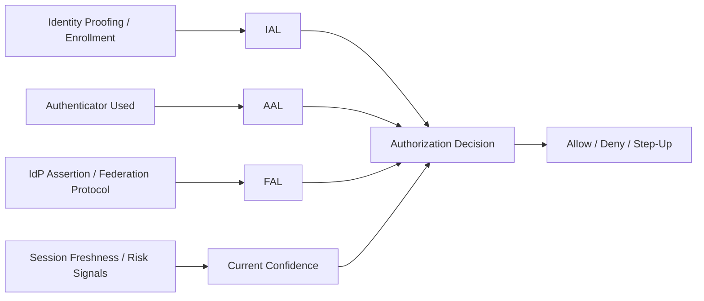
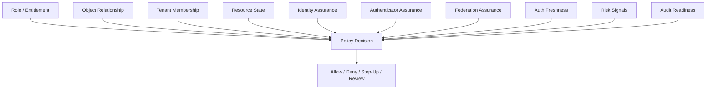
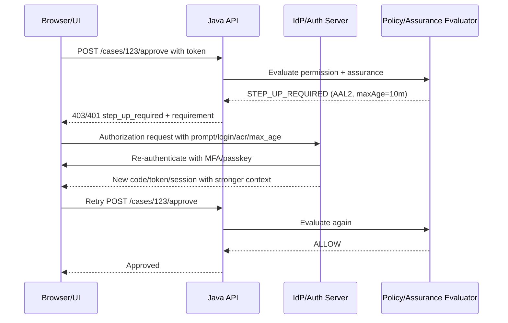

------
title: Learn Java Identity, Authentication & Authorization for Secure Enterprise API Platform - Part 004
description: Digital identity assurance untuk enterprise Java platform: IAL, AAL, FAL, risk tiering, step-up authentication, federation trust, dan bagaimana assurance masuk ke authorization, audit, dan API design.
series: learn-java-identity-authentication-authorization-api-platform
seriesTitle: Learn Java Identity, Authentication & Authorization for Secure Enterprise API Platform
order: 4
partTitle: Digital Identity Assurance: IAL, AAL, FAL, Risk, and Trust
tags:
- java
- identity
- authentication
- authorization
- nist-800-63
- assurance
- aal
- ial
- fal
- api-security
date: 2026-06-28
---

# Part 004 — Digital Identity Assurance: IAL, AAL, FAL, Risk, and Trust

Part ini menjawab pertanyaan yang sering diabaikan dalam platform engineering:

> **Seberapa percaya sistem terhadap identity yang sedang melakukan action ini?**

Banyak desain authorization hanya bertanya:

```text
Apakah user punya role X?
```

Untuk enterprise API platform yang menangani data sensitif, proses regulasi, financial action, case management, evidence, atau enforcement lifecycle, pertanyaan itu tidak cukup. Kita perlu bertanya:

```text
Apakah identity ini cukup kuat untuk action ini?
Apakah actor benar-benar dibuktikan sebagai orang/entity itu?
Apakah authenticator yang dipakai cukup kuat?
Apakah federation assertion dari IdP cukup dipercaya?
Apakah session ini masih fresh?
Apakah operasi ini memerlukan step-up?
```

Inilah domain **digital identity assurance**.

NIST SP 800-63 memecah assurance menjadi beberapa dimensi, terutama:

- **IAL — Identity Assurance Level**: seberapa kuat proses identity proofing/enrollment.
- **AAL — Authenticator Assurance Level**: seberapa kuat authentication event.
- **FAL — Federation Assurance Level**: seberapa kuat federation assertion dari identity provider ke relying party.

Tujuan part ini bukan membuatmu menghafal tabel standar. Tujuannya adalah membangun mental model yang bisa diterapkan di sistem Java: kapan memakai MFA, kapan step-up, kapan token claim tidak cukup, kapan federation perlu dibatasi, kapan account recovery menjadi titik terlemah, dan bagaimana assurance masuk ke policy decision.

---

## 1. Target Pembelajaran ala Kaufman

Setelah part ini, kamu harus bisa:

1. Membedakan authentication sukses dari authentication yang cukup kuat.
2. Memetakan action bisnis ke assurance requirement.
3. Mendesain step-up authentication untuk high-risk API.
4. Memahami IAL/AAL/FAL sebagai dimensi berbeda, bukan satu angka global.
5. Membawa assurance ke Java authorization decision dan audit event.
6. Menghindari anti-pattern: "MFA once at login means all actions are safe forever".

Deliberate practice target:

> Ambil 10 action di platform enterprise, beri risk tier, tentukan required assurance, tentukan fallback/step-up, lalu tulis invariant dan test case-nya.

---

## 2. Core Mental Model: Assurance Is Not Identity; Assurance Is Confidence

Identity context biasanya menjawab:

```text
subject = user-123
client = case-management-ui
tenant = regulator-a
roles = investigator, case-reviewer
```

Assurance menambahkan pertanyaan:

```text
How confident are we that subject user-123 is really the actor right now,
and that the account was originally bound to the correct real-world/entity identity?
```

Model sederhana:



Identity assurance is multi-dimensional:

- Kamu bisa punya user yang identity proofing-nya kuat, tetapi login saat ini lemah.
- Kamu bisa punya MFA kuat, tetapi account awalnya dibuat tanpa proofing.
- Kamu bisa punya IdP enterprise tepercaya, tetapi federation assertion untuk aplikasi ini lemah.
- Kamu bisa punya login kuat 8 jam lalu, tetapi action sekarang high-risk dan butuh freshness.

Prinsip:

> Authorization untuk high-risk action harus mempertimbangkan not only who, but how strongly that who is known right now.

---

## 3. IAL, AAL, FAL dalam Bahasa Engineer

### 3.1 Identity Assurance Level — IAL

IAL berkaitan dengan **identity proofing**: bagaimana account dikaitkan ke identity nyata atau entity organisasi.

Dalam sistem enterprise, IAL bisa berasal dari:

- employee onboarding HR;
- contractor verification;
- customer KYC;
- regulator officer appointment;
- government identity proofing;
- enterprise directory lifecycle;
- manual admin enrollment;
- self-service signup.

Contoh internal classification:

| Internal IAL | Arti Praktis | Contoh |
|---|---|---|
| `IAL0_UNKNOWN` | Tidak ada proofing bermakna | anonymous signup, test user |
| `IAL1_SELF_ASSERTED` | Attribute user sebagian besar self-asserted | email-verified user |
| `IAL2_VERIFIED` | Identity diverifikasi dengan proses organisasi/KYC | employee verified, customer KYC passed |
| `IAL3_HIGH_ASSURANCE` | Proofing sangat kuat, controlled enrollment, strong evidence | privileged regulator officer, high-value financial signer |

Tidak semua organisasi perlu menamai persis seperti ini di kode. Tetapi sistem harus punya cara untuk membedakan **account created** dari **identity verified**.

Danger:

```text
User exists in database = identity verified
```

Itu salah. Account existence hanya berarti sistem punya record. IAL berbicara tentang kualitas binding antara record dan real-world entity.

### 3.2 Authenticator Assurance Level — AAL

AAL berkaitan dengan **authentication event**: bagaimana subject membuktikan dirinya saat login/step-up.

Contoh internal classification:

| Internal AAL | Arti Praktis | Contoh |
|---|---|---|
| `AAL0_NONE` | Tidak authenticated | public request |
| `AAL1_SINGLE_FACTOR` | Satu faktor | password only, magic link only |
| `AAL2_MULTI_FACTOR` | MFA dengan faktor berbeda | password + TOTP, password + push, passkey + local unlock depending deployment |
| `AAL3_PHISHING_RESISTANT` | Hardware-backed/phishing-resistant stronger auth | FIDO2/passkey with strong policy, smartcard/PIV, mTLS client cert in managed environment |

Nuansa penting:

- Tidak semua MFA sama.
- SMS OTP memiliki risiko berbeda dari FIDO2/passkey.
- Push MFA rentan fatigue jika tidak dilindungi number matching/risk controls.
- AAL harus mempertimbangkan authenticator lifecycle: enrollment, reset, recovery, revocation.

### 3.3 Federation Assurance Level — FAL

FAL berkaitan dengan **seberapa kuat relying party mempercayai assertion dari IdP**.

Federation terjadi ketika aplikasi Java menerima identity dari pihak lain:

- OIDC enterprise IdP;
- SAML IdP;
- government identity provider;
- B2B partner IdP;
- workforce directory;
- customer identity provider.

FAL bukan sekadar "pakai OIDC". Pertanyaannya:

- Apakah issuer dipin?
- Apakah signing key dikelola benar?
- Apakah assertion audience tepat?
- Apakah assertion expired?
- Apakah subject identifier stabil?
- Apakah assertion encrypted/signed sesuai kebutuhan?
- Apakah RP menerima claim hanya dari IdP yang dipercaya untuk tenant tersebut?
- Apakah account linking aman?

Internal classification:

| Internal FAL | Arti Praktis | Contoh |
|---|---|---|
| `FAL0_LOCAL_ONLY` | Tidak ada federation | local login |
| `FAL1_BASIC_FEDERATION` | Signed assertion, standard validation | OIDC with issuer/audience/signature validation |
| `FAL2_MANAGED_FEDERATION` | Federation metadata/keys/clients governed | enterprise IdP contract, tenant binding, JIT restrictions |
| `FAL3_HIGH_ASSURANCE_FEDERATION` | Strong assertion protection + high-value controls | regulated partner federation, signed/encrypted assertions, strong client auth, monitored trust relationship |

---

## 4. Assurance as Policy Input

Assurance harus masuk authorization decision.

Bad model:

```text
hasRole('APPROVER') => allow approvePayment
```

Better model:

```text
allow approvePayment if:
- subject has approver entitlement for tenant;
- payment belongs to tenant;
- payment state is PENDING_APPROVAL;
- subject is not requester;
- subject IAL >= VERIFIED;
- current AAL >= MULTI_FACTOR;
- authentication age <= 10 minutes;
- federation/source is allowed for this action;
- no active account risk hold;
- audit event can be durably recorded.
```

Mermaid:



Top-level pattern:

```text
Authorization = Permission + Context + Assurance + Risk + Evidence
```

---

## 5. Risk Tiering for Enterprise Actions

Tidak semua action butuh assurance yang sama. Risk-tiering mencegah dua kesalahan:

1. Semua action dibuat terlalu berat sehingga UX buruk.
2. High-risk action dilindungi seperti read-only action.

### 5.1 Example Risk Tiers

| Tier | Action Type | Example | Typical Requirement |
|---|---|---|---|
| T0 Public | public/no account | health check, public docs | no auth, rate limits |
| T1 Basic Authenticated | low-risk self-service | view own profile, view assigned task list | authenticated session/token |
| T2 Sensitive Read | regulated/internal data read | view case evidence, export own report | MFA or trusted enterprise session, object auth |
| T3 Sensitive Write | meaningful state/data change | update case, assign user, submit filing | MFA, fresh auth for some actions, audit |
| T4 High-Risk Decision | legal/financial/regulatory impact | approve sanction, release payment, close case | strong MFA/step-up, SoD, fresh auth, durable audit |
| T5 Privileged Platform | broad/system-wide control | grant admin, rotate keys, change policy | phishing-resistant auth, break-glass controls, dual control where needed |

### 5.2 Action-to-Assurance Matrix

| Action | Required IAL | Required AAL | Required Freshness | Notes |
|---|---|---|---|---|
| View own profile | self-asserted+ | single factor | session valid | low risk |
| View assigned case | verified employee/contractor | MFA or managed SSO | session valid, maybe risk-based | sensitive read |
| Export case evidence | verified | MFA | <= 15 minutes or risk-based | high data exposure |
| Assign case | verified | MFA | <= 30 minutes | SoD/team rules |
| Approve sanction | verified/high | MFA or phishing-resistant | <= 10 minutes | SoD mandatory |
| Grant tenant admin | verified/high | phishing-resistant preferred | <= 5 minutes | audit + possible dual control |
| Rotate signing key | high | phishing-resistant | <= 5 minutes | platform privileged |
| Break-glass access | high | phishing-resistant or equivalent emergency policy | immediate | alert + post-review |

Important:

> Assurance requirement belongs to action policy, not to UI button visibility.

UI may hide buttons, but backend must enforce.

---

## 6. Java Domain Model for Assurance

### 6.1 Assurance Value Objects

```java
public enum IdentityAssuranceLevel {
    UNKNOWN(0),
    SELF_ASSERTED(1),
    VERIFIED(2),
    HIGH_ASSURANCE(3);

    private final int rank;

    IdentityAssuranceLevel(int rank) {
        this.rank = rank;
    }

    public boolean atLeast(IdentityAssuranceLevel required) {
        return this.rank >= required.rank;
    }
}

public enum AuthenticatorAssuranceLevel {
    NONE(0),
    SINGLE_FACTOR(1),
    MULTI_FACTOR(2),
    PHISHING_RESISTANT(3);

    private final int rank;

    AuthenticatorAssuranceLevel(int rank) {
        this.rank = rank;
    }

    public boolean atLeast(AuthenticatorAssuranceLevel required) {
        return this.rank >= required.rank;
    }
}

public enum FederationAssuranceLevel {
    LOCAL_OR_UNKNOWN(0),
    BASIC_FEDERATION(1),
    MANAGED_FEDERATION(2),
    HIGH_ASSURANCE_FEDERATION(3);

    private final int rank;

    FederationAssuranceLevel(int rank) {
        this.rank = rank;
    }

    public boolean atLeast(FederationAssuranceLevel required) {
        return this.rank >= required.rank;
    }
}
```

Ranked enums are simple and testable. Do not overcomplicate until policy needs it.

### 6.2 Authentication Event

```java
public record AuthenticationEventContext(
        String subjectId,
        String issuer,
        String clientId,
        Instant authenticatedAt,
        IdentityAssuranceLevel ial,
        AuthenticatorAssuranceLevel aal,
        FederationAssuranceLevel fal,
        Set<String> authenticationMethods,
        String acr,
        String amr,
        boolean stepUp,
        String sessionId
) {
    public Duration ageAt(Instant now) {
        return Duration.between(authenticatedAt, now);
    }

    public boolean freshEnough(Duration maxAge, Instant now) {
        return !ageAt(now).minus(maxAge).isPositive();
    }
}
```

Notes:

- `acr` often represents authentication context class/reference from IdP.
- `amr` often represents authentication methods used.
- Treat these claims as IdP-specific until mapped by controlled trust configuration.
- Never let arbitrary tenant IdP invent assurance semantics without mapping.

### 6.3 Action Assurance Requirement

```java
public record AssuranceRequirement(
        IdentityAssuranceLevel minimumIal,
        AuthenticatorAssuranceLevel minimumAal,
        FederationAssuranceLevel minimumFal,
        Duration maximumAuthenticationAge,
        boolean allowStepUp,
        boolean requirePhishingResistantForPrivilegedAdmin
) {
    public static AssuranceRequirement basicAuthenticated() {
        return new AssuranceRequirement(
                IdentityAssuranceLevel.SELF_ASSERTED,
                AuthenticatorAssuranceLevel.SINGLE_FACTOR,
                FederationAssuranceLevel.LOCAL_OR_UNKNOWN,
                Duration.ofHours(12),
                true,
                false
        );
    }

    public static AssuranceRequirement highRiskDecision() {
        return new AssuranceRequirement(
                IdentityAssuranceLevel.VERIFIED,
                AuthenticatorAssuranceLevel.MULTI_FACTOR,
                FederationAssuranceLevel.BASIC_FEDERATION,
                Duration.ofMinutes(10),
                true,
                false
        );
    }

    public static AssuranceRequirement platformPrivileged() {
        return new AssuranceRequirement(
                IdentityAssuranceLevel.HIGH_ASSURANCE,
                AuthenticatorAssuranceLevel.PHISHING_RESISTANT,
                FederationAssuranceLevel.MANAGED_FEDERATION,
                Duration.ofMinutes(5),
                true,
                true
        );
    }
}
```

### 6.4 Assurance Decision

```java
public sealed interface AssuranceDecision permits AssuranceDecision.Satisfied,
        AssuranceDecision.StepUpRequired,
        AssuranceDecision.Denied {

    record Satisfied(Map<String, Object> evidence) implements AssuranceDecision {}

    record StepUpRequired(
            AuthenticatorAssuranceLevel requiredAal,
            Duration maximumAuthenticationAge,
            String reasonCode
    ) implements AssuranceDecision {}

    record Denied(String reasonCode, Map<String, Object> evidence) implements AssuranceDecision {}
}
```

Why sealed interface?

- Callers must handle allow vs step-up vs deny.
- Step-up is not the same as deny.
- Evidence is structured for audit.

### 6.5 Assurance Evaluator

```java
@Component
public class AssuranceEvaluator {

    public AssuranceDecision evaluate(
            AuthenticationEventContext auth,
            AssuranceRequirement requirement,
            Instant now
    ) {
        Map<String, Object> evidence = new LinkedHashMap<>();
        evidence.put("ial", auth.ial().name());
        evidence.put("aal", auth.aal().name());
        evidence.put("fal", auth.fal().name());
        evidence.put("authenticatedAt", auth.authenticatedAt().toString());
        evidence.put("acr", auth.acr());
        evidence.put("amr", auth.amr());

        if (!auth.ial().atLeast(requirement.minimumIal())) {
            return new AssuranceDecision.Denied("IAL_TOO_LOW", evidence);
        }

        if (!auth.fal().atLeast(requirement.minimumFal())) {
            return new AssuranceDecision.Denied("FAL_TOO_LOW", evidence);
        }

        boolean aalOk = auth.aal().atLeast(requirement.minimumAal());
        boolean freshOk = auth.freshEnough(requirement.maximumAuthenticationAge(), now);

        if (aalOk && freshOk) {
            return new AssuranceDecision.Satisfied(evidence);
        }

        if (requirement.allowStepUp()) {
            String reason = !aalOk ? "AAL_TOO_LOW" : "AUTHENTICATION_TOO_OLD";
            return new AssuranceDecision.StepUpRequired(
                    requirement.minimumAal(),
                    requirement.maximumAuthenticationAge(),
                    reason
            );
        }

        return new AssuranceDecision.Denied(
                !aalOk ? "AAL_TOO_LOW" : "AUTHENTICATION_TOO_OLD",
                evidence
        );
    }
}
```

This evaluator is intentionally boring. Security-critical code should often be boring: explicit, deterministic, testable, and easy to audit.

---

## 7. Step-Up Authentication Pattern

Step-up means the user is already authenticated, but the current session/token is insufficient for a specific action.

Example:

- User logs in with SSO 3 hours ago.
- User tries to approve sanction.
- API requires MFA within 10 minutes.
- API returns step-up required.
- UI redirects to IdP with prompt/acr/max_age requirements.
- User completes stronger authentication.
- New token/session includes stronger/fresher authentication context.
- API retries action.

### 7.1 Sequence



### 7.2 API Response Contract

Avoid returning vague `403 Forbidden` if step-up can fix it.

```json
{
  "error": "step_up_required",
  "reason": "AUTHENTICATION_TOO_OLD",
  "required": {
    "minimumAal": "MULTI_FACTOR",
    "maximumAuthenticationAgeSeconds": 600
  },
  "correlationId": "corr-8ad7"
}
```

Status code depends on your platform convention:

- `401` when authentication is insufficient and client should obtain stronger authentication;
- `403` when authenticated but not enough for this action;
- some platforms use `403` with machine-readable error.

Consistency matters more than dogma.

### 7.3 Controller Example

```java
@PostMapping("/cases/{caseId}/approve")
public ResponseEntity<?> approveCase(
        @PathVariable String caseId,
        @RequestBody ApproveCaseRequest request,
        Authentication authentication,
        HttpServletRequest httpRequest
) {
    ActorContext actor = actorContextResolver.resolve(authentication, httpRequest);

    try {
        caseApprovalService.approve(actor, caseId, request.reason());
        return ResponseEntity.noContent().build();
    } catch (StepUpRequiredException ex) {
        return ResponseEntity.status(HttpStatus.FORBIDDEN)
                .body(new StepUpRequiredResponse(
                        "step_up_required",
                        ex.reasonCode(),
                        ex.requiredAal().name(),
                        ex.maximumAuthenticationAge().toSeconds(),
                        actor.correlationId()
                ));
    }
}
```

### 7.4 Service-Level Enforcement

Do not put step-up only in controller. Controllers are easy to bypass via alternate path/internal call.

```java
@Transactional
public void approve(ActorContext actor, String caseId, String reason) {
    CaseRecord caseRecord = caseRepository.findByIdForUpdate(caseId)
            .orElseThrow(() -> new NotFoundException("Case not found"));

    AuthorizationDecision authz = authorizationService.decide(
            AuthorizationRequest.forAction(actor, "case.approve", caseRecord.resourceRef())
    );

    if (!authz.allowed()) {
        audit.denied(actor, "case.approve", caseRecord.resourceRef(), authz);
        throw new AccessDeniedException("Not authorized");
    }

    AssuranceDecision assurance = assuranceEvaluator.evaluate(
            actor.authenticationEvent(),
            AssuranceRequirement.highRiskDecision(),
            clock.instant()
    );

    switch (assurance) {
        case AssuranceDecision.Satisfied satisfied -> {
            caseRecord.approve(actor.subjectId(), reason);
            audit.allowed(actor, "case.approve", caseRecord.resourceRef(), authz, satisfied.evidence());
        }
        case AssuranceDecision.StepUpRequired stepUp -> {
            audit.stepUpRequired(actor, "case.approve", caseRecord.resourceRef(), stepUp.reasonCode());
            throw new StepUpRequiredException(
                    stepUp.requiredAal(),
                    stepUp.maximumAuthenticationAge(),
                    stepUp.reasonCode()
            );
        }
        case AssuranceDecision.Denied denied -> {
            audit.denied(actor, "case.approve", caseRecord.resourceRef(), denied.reasonCode(), denied.evidence());
            throw new AccessDeniedException("Assurance requirement not met");
        }
    }
}
```

---

## 8. Mapping OIDC Claims to Assurance

OIDC tokens may contain claims such as `acr`, `amr`, `auth_time`, `iss`, `aud`, `azp`, and tenant-specific claims. But a resource server should not blindly trust the semantic meaning of `acr` values unless mapped by configuration.

### 8.1 Example Token Claims

```json
{
  "iss": "https://idp.example.com/realms/regulator-a",
  "sub": "248289761001",
  "aud": "case-api",
  "azp": "case-ui",
  "exp": 1782630000,
  "iat": 1782626400,
  "auth_time": 1782629700,
  "acr": "urn:example:aal:2",
  "amr": ["pwd", "otp"],
  "tenant_id": "regulator-a",
  "scope": "case:read case:approve"
}
```

### 8.2 Controlled Mapping

```java
@ConfigurationProperties(prefix = "security.assurance")
public record AssuranceMappingProperties(
        Map<String, IssuerAssuranceMapping> issuers
) {}

public record IssuerAssuranceMapping(
        String issuer,
        Map<String, AuthenticatorAssuranceLevel> acrToAal,
        Map<String, IdentityAssuranceLevel> tenantDefaultIal,
        FederationAssuranceLevel federationAssuranceLevel
) {}
```

Example YAML:

```yaml
security:
  assurance:
    issuers:
      regulator-a:
        issuer: "https://idp.example.com/realms/regulator-a"
        federation-assurance-level: MANAGED_FEDERATION
        acr-to-aal:
          "urn:example:aal:1": SINGLE_FACTOR
          "urn:example:aal:2": MULTI_FACTOR
          "urn:example:aal:3": PHISHING_RESISTANT
        tenant-default-ial:
          "regulator-a": VERIFIED
```

Mapper:

```java
@Component
public class OidcAssuranceMapper {

    private final AssuranceMappingProperties properties;

    public OidcAssuranceMapper(AssuranceMappingProperties properties) {
        this.properties = properties;
    }

    public AuthenticationEventContext map(Jwt jwt) {
        String issuer = jwt.getIssuer().toString();
        IssuerAssuranceMapping mapping = findMapping(issuer);

        String acr = jwt.getClaimAsString("acr");
        AuthenticatorAssuranceLevel aal = mapping.acrToAal()
                .getOrDefault(acr, AuthenticatorAssuranceLevel.SINGLE_FACTOR);

        String tenantId = jwt.getClaimAsString("tenant_id");
        IdentityAssuranceLevel ial = mapping.tenantDefaultIal()
                .getOrDefault(tenantId, IdentityAssuranceLevel.UNKNOWN);

        Instant authTime = jwt.getClaimAsInstant("auth_time");
        if (authTime == null) {
            authTime = jwt.getIssuedAt();
        }

        return new AuthenticationEventContext(
                jwt.getSubject(),
                issuer,
                jwt.getClaimAsString("azp"),
                authTime,
                ial,
                aal,
                mapping.federationAssuranceLevel(),
                Set.copyOf(jwt.getClaimAsStringList("amr") == null ? List.of() : jwt.getClaimAsStringList("amr")),
                acr,
                String.valueOf(jwt.getClaim("amr")),
                false,
                jwt.getId()
        );
    }

    private IssuerAssuranceMapping findMapping(String issuer) {
        return properties.issuers().values().stream()
                .filter(m -> m.issuer().equals(issuer))
                .findFirst()
                .orElseThrow(() -> new BadCredentialsException("Untrusted issuer for assurance mapping"));
    }
}
```

Security point:

> `acr = mfa` means nothing unless your system knows which issuer produced it and what that issuer means by it.

---

## 9. Assurance and Account Lifecycle

Assurance is not static. It changes with lifecycle events.

### 9.1 Events That Should Lower or Reset Assurance

| Event | Impact |
|---|---|
| Password reset | invalidate sessions/tokens issued before reset |
| MFA device reset | require re-verification/step-up before high-risk actions |
| Account recovery | lower temporary trust until confirmed |
| Email/phone change | require confirmation and reauth |
| Role elevation | require step-up and possibly approval |
| Tenant membership change | revoke or refresh authorization context |
| HR termination/deactivation | immediate session/token invalidation where possible |
| Federation unlink/relink | require strong account linking ceremony |
| Suspicious login | increase step-up requirement or block |

### 9.2 Account Security Stamp Pattern

A common pattern is `securityVersion` or `securityStamp`.

```java
public record AccountSecurityState(
        String subjectId,
        long securityVersion,
        Instant credentialsChangedAt,
        Instant mfaChangedAt,
        Instant rolesChangedAt,
        boolean disabled,
        boolean riskHold
) {}
```

JWT can include:

```json
{
  "sub": "user-123",
  "security_version": 42,
  "iat": 1782626400
}
```

Resource server/policy service can check:

```java
public void validateSecurityState(Jwt jwt, AccountSecurityState state) {
    Long tokenVersion = jwt.getClaim("security_version");
    if (tokenVersion == null || tokenVersion < state.securityVersion()) {
        throw new BadCredentialsException("Token security version is stale");
    }

    if (state.disabled() || state.riskHold()) {
        throw new BadCredentialsException("Account disabled or on risk hold");
    }
}
```

Trade-off:

- Checking on every request adds latency/load.
- Checking only high-risk actions reduces cost.
- Short token TTL reduces stale window.
- Opaque tokens/introspection centralize freshness.

There is no universal answer. Choose based on risk tier.

---

## 10. Authentication Freshness

AAL alone is insufficient. MFA from 12 hours ago may not be enough for high-risk action.

Freshness inputs:

- `auth_time` from OIDC;
- session last reauthentication time;
- step-up event timestamp;
- risk-based reauth timestamp;
- device posture timestamp.

Policy examples:

```text
VIEW_CASE: authenticated session valid.
EXPORT_EVIDENCE: MFA within 15 minutes if outside managed network.
APPROVE_SANCTION: MFA within 10 minutes always.
GRANT_ADMIN: phishing-resistant auth within 5 minutes.
ROTATE_SIGNING_KEY: phishing-resistant auth within 5 minutes + second approver.
```

Avoid this anti-pattern:

```text
User did MFA at login this morning, therefore all privileged actions today are safe.
```

A better model:

```text
Privileged actions require recent proof of possession/presence appropriate to risk.
```

---

## 11. Assurance and Federation

Federation creates a powerful trust dependency. Your platform becomes only as strong as the federation relationship for certain actions.

### 11.1 Federation Trust Configuration

For each tenant/IdP:

```yaml
tenants:
  regulator-a:
    allowed-issuers:
      - "https://idp.regulator-a.example"
    subject-mapping: "issuer+sub"
    allowed-clients:
      - "case-ui"
      - "case-bff"
    federation-assurance: MANAGED_FEDERATION
    allowed-acr-values:
      - "urn:regulator-a:aal2"
      - "urn:regulator-a:aal3"
    jit-provisioning: false
    require-directory-membership: true
```

### 11.2 Subject Mapping Rule

Bad:

```text
local account = email claim
```

Problems:

- email can change;
- email may not be verified;
- email can be reassigned;
- same email claim from two issuers is not same subject;
- tenant-specific identity collisions.

Better:

```text
local federated identity binding = issuer + stable subject + tenant relationship
```

Model:

```java
public record FederatedIdentityBinding(
        String localSubjectId,
        String tenantId,
        String issuer,
        String issuerSubject,
        String displayEmail,
        FederationAssuranceLevel fal,
        Instant linkedAt,
        Instant lastSeenAt,
        boolean active
) {}
```

### 11.3 JIT Provisioning Risk

Just-in-time provisioning is convenient: first login creates user automatically.

Risks:

- wrong tenant membership;
- role assignment from untrusted claim;
- stale external group mapping;
- attacker with compromised IdP account gets automatic access;
- hard to enforce approval before first access.

Safer pattern:

- JIT creates minimal inactive or low-privilege profile;
- access requires directory membership or invitation;
- roles are mapped from governed groups only;
- high-risk role requires approval/certification;
- first login audit event is generated.

---

## 12. Assurance and Recovery: The Weakest Link

Account recovery often bypasses strong authentication.

Example failure:

```text
Login requires passkey + MFA.
Recovery only requires email link.
Attacker compromises email.
Attacker resets authenticator.
Attacker gains high-assurance account.
```

Recovery controls must match account/action risk.

### 12.1 Recovery Risk Matrix

| Account type | Recovery requirement |
|---|---|
| Low-risk consumer | email verification + risk checks may be acceptable |
| Enterprise employee | enterprise helpdesk + directory verification + session invalidation |
| Tenant admin | step-up/manager approval + recovery audit |
| Platform admin | break-glass process + dual approval + phishing-resistant re-enrollment |
| Regulated signer/officer | identity re-proofing or high-assurance support process |

### 12.2 Recovery Invariants

```text
RECOVERY-001: Recovery flow must not create stronger access than the evidence collected.
RECOVERY-002: Authenticator reset must invalidate old sessions and refresh tokens.
RECOVERY-003: High-privilege account recovery must generate security alert and audit event.
RECOVERY-004: Newly recovered account may require cool-down or step-up before high-risk actions.
RECOVERY-005: Support-assisted recovery must record operator, reason, evidence reference, and approval path.
```

---

## 13. Assurance-Aware Authorization Example

### 13.1 Policy Definition

```java
public enum ActionRiskTier {
    T1_BASIC,
    T2_SENSITIVE_READ,
    T3_SENSITIVE_WRITE,
    T4_HIGH_RISK_DECISION,
    T5_PLATFORM_PRIVILEGED
}

public record ActionPolicy(
        String action,
        ActionRiskTier riskTier,
        AssuranceRequirement assuranceRequirement,
        boolean requireAudit,
        boolean requireSegregationOfDuties,
        boolean allowImpersonation
) {}
```

Registry:

```java
@Component
public class ActionPolicyRegistry {

    private final Map<String, ActionPolicy> policies = Map.of(
            "case.read", new ActionPolicy(
                    "case.read",
                    ActionRiskTier.T2_SENSITIVE_READ,
                    new AssuranceRequirement(
                            IdentityAssuranceLevel.VERIFIED,
                            AuthenticatorAssuranceLevel.SINGLE_FACTOR,
                            FederationAssuranceLevel.BASIC_FEDERATION,
                            Duration.ofHours(8),
                            true,
                            false
                    ),
                    true,
                    false,
                    true
            ),
            "case.approve", new ActionPolicy(
                    "case.approve",
                    ActionRiskTier.T4_HIGH_RISK_DECISION,
                    AssuranceRequirement.highRiskDecision(),
                    true,
                    true,
                    false
            ),
            "platform.key.rotate", new ActionPolicy(
                    "platform.key.rotate",
                    ActionRiskTier.T5_PLATFORM_PRIVILEGED,
                    AssuranceRequirement.platformPrivileged(),
                    true,
                    true,
                    false
            )
    );

    public ActionPolicy get(String action) {
        ActionPolicy policy = policies.get(action);
        if (policy == null) {
            throw new IllegalArgumentException("Unknown action policy: " + action);
        }
        return policy;
    }
}
```

### 13.2 Full Decision Flow

```java
@Service
public class EnterpriseAuthorizationService {

    private final ActionPolicyRegistry actionPolicyRegistry;
    private final PermissionEvaluator permissionEvaluator;
    private final AssuranceEvaluator assuranceEvaluator;
    private final Clock clock;

    public EnterpriseAuthorizationService(
            ActionPolicyRegistry actionPolicyRegistry,
            PermissionEvaluator permissionEvaluator,
            AssuranceEvaluator assuranceEvaluator,
            Clock clock
    ) {
        this.actionPolicyRegistry = actionPolicyRegistry;
        this.permissionEvaluator = permissionEvaluator;
        this.assuranceEvaluator = assuranceEvaluator;
        this.clock = clock;
    }

    public EnterpriseDecision decide(AuthorizationRequest request) {
        ActionPolicy policy = actionPolicyRegistry.get(request.action());

        PermissionDecision permission = permissionEvaluator.evaluate(request);
        if (!permission.allowed()) {
            return EnterpriseDecision.deny("PERMISSION_DENIED", permission.evidence());
        }

        AssuranceDecision assurance = assuranceEvaluator.evaluate(
                request.actor().authenticationEvent(),
                policy.assuranceRequirement(),
                clock.instant()
        );

        return switch (assurance) {
            case AssuranceDecision.Satisfied satisfied ->
                    EnterpriseDecision.allow(policy.action(), merge(permission.evidence(), satisfied.evidence()));
            case AssuranceDecision.StepUpRequired stepUp ->
                    EnterpriseDecision.stepUpRequired(stepUp.reasonCode(), stepUp.requiredAal(), stepUp.maximumAuthenticationAge());
            case AssuranceDecision.Denied denied ->
                    EnterpriseDecision.deny(denied.reasonCode(), denied.evidence());
        };
    }

    private Map<String, Object> merge(Map<String, Object> a, Map<String, Object> b) {
        Map<String, Object> result = new LinkedHashMap<>(a);
        result.putAll(b);
        return result;
    }
}
```

This design makes assurance first-class. It is not hidden in UI code or scattered across annotations.

---

## 14. API Design for Step-Up and Assurance

### 14.1 Machine-Readable Error Codes

Define stable error codes:

| Error | Meaning | Client behavior |
|---|---|---|
| `authentication_required` | no valid authentication | login/token acquisition |
| `invalid_token` | token invalid/expired/wrong audience | obtain new token |
| `insufficient_assurance` | identity/federation too weak | cannot self-fix unless account/IdP upgraded |
| `step_up_required` | stronger/fresher auth needed | trigger step-up flow |
| `permission_denied` | actor lacks permission | do not retry with same actor |
| `segregation_of_duties_violation` | actor conflicts with policy | use different approver |
| `risk_hold` | account/session under risk hold | contact support/security |

### 14.2 Response Example

```json
{
  "error": "insufficient_assurance",
  "reason": "IAL_TOO_LOW",
  "message": "This action requires a verified identity.",
  "correlationId": "corr-019a"
}
```

For step-up:

```json
{
  "error": "step_up_required",
  "reason": "AUTHENTICATION_TOO_OLD",
  "required": {
    "minimumAal": "MULTI_FACTOR",
    "maxAgeSeconds": 600,
    "acrValues": ["urn:example:aal:2"]
  },
  "correlationId": "corr-019b"
}
```

### 14.3 Avoid Leaking Policy Internals

Do not expose:

- exact role missing if attacker can enumerate privileges;
- internal policy engine names;
- sensitive resource existence across tenant boundary;
- security hold details.

Internal logs can be detailed. External response should be stable and safe.

---

## 15. Assurance in Audit Events

High-risk audit must include assurance evidence.

```java
public record SecurityAuditEvent(
        String eventId,
        Instant occurredAt,
        String tenantId,
        String initiatingActorId,
        String effectiveSubjectId,
        String clientId,
        String action,
        String resourceType,
        String resourceId,
        String decision,
        String reasonCode,
        String policyId,
        String policyVersion,
        IdentityAssuranceLevel ial,
        AuthenticatorAssuranceLevel aal,
        FederationAssuranceLevel fal,
        Instant authenticatedAt,
        String acr,
        Set<String> amr,
        String correlationId
) {}
```

Audit question this enables:

```text
For sanction approval S-123, who approved it, under which tenant,
using what authentication strength, how fresh was authentication,
was this delegated/impersonated, and which policy version allowed it?
```

That is the level of evidence needed for defensible systems.

---

## 16. Testing Assurance

### 16.1 Unit Test: Step-Up Required

```java
@Test
void highRiskActionRequiresFreshMfa() {
    AuthenticationEventContext auth = new AuthenticationEventContext(
            "user-123",
            "https://idp.example.com",
            "case-ui",
            Instant.now().minus(Duration.ofHours(2)),
            IdentityAssuranceLevel.VERIFIED,
            AuthenticatorAssuranceLevel.MULTI_FACTOR,
            FederationAssuranceLevel.MANAGED_FEDERATION,
            Set.of("pwd", "otp"),
            "urn:example:aal:2",
            "pwd otp",
            false,
            "sid-1"
    );

    AssuranceDecision decision = evaluator.evaluate(
            auth,
            AssuranceRequirement.highRiskDecision(),
            Instant.now()
    );

    assertThat(decision).isInstanceOf(AssuranceDecision.StepUpRequired.class);
    AssuranceDecision.StepUpRequired stepUp = (AssuranceDecision.StepUpRequired) decision;
    assertThat(stepUp.reasonCode()).isEqualTo("AUTHENTICATION_TOO_OLD");
}
```

### 16.2 Unit Test: IAL Too Low Cannot Be Self-Fixed by Step-Up

```java
@Test
void lowIdentityProofingDeniesHighRiskAction() {
    AuthenticationEventContext auth = authContextBuilder()
            .ial(IdentityAssuranceLevel.SELF_ASSERTED)
            .aal(AuthenticatorAssuranceLevel.PHISHING_RESISTANT)
            .fal(FederationAssuranceLevel.MANAGED_FEDERATION)
            .authenticatedAt(Instant.now())
            .build();

    AssuranceDecision decision = evaluator.evaluate(
            auth,
            AssuranceRequirement.highRiskDecision(),
            Instant.now()
    );

    assertThat(decision).isInstanceOf(AssuranceDecision.Denied.class);
    assertThat(((AssuranceDecision.Denied) decision).reasonCode()).isEqualTo("IAL_TOO_LOW");
}
```

Key point:

- Step-up can improve current authentication strength/freshness.
- Step-up cannot magically improve identity proofing unless the step-up flow includes proofing/enrollment process.

### 16.3 Integration Test: API Returns Step-Up Contract

```java
@Test
void approveCaseReturnsStepUpRequiredWhenMfaTooOld() throws Exception {
    String token = jwt()
            .subject("approver-1")
            .tenant("tenant-a")
            .scope("case:approve")
            .acr("urn:example:aal:2")
            .authTime(Instant.now().minus(Duration.ofHours(1)))
            .build();

    mvc.perform(post("/cases/case-123/approve")
                    .header("Authorization", "Bearer " + token)
                    .contentType(MediaType.APPLICATION_JSON)
                    .content("{\"reason\":\"complete review\"}"))
            .andExpect(status().isForbidden())
            .andExpect(jsonPath("$.error").value("step_up_required"))
            .andExpect(jsonPath("$.required.minimumAal").value("MULTI_FACTOR"));
}
```

### 16.4 Audit Test

```java
@Test
void approvalAuditIncludesAssuranceEvidence() {
    SecurityAuditEvent event = auditEvents.last();

    assertThat(event.action()).isEqualTo("case.approve");
    assertThat(event.aal()).isEqualTo(AuthenticatorAssuranceLevel.MULTI_FACTOR);
    assertThat(event.ial()).isEqualTo(IdentityAssuranceLevel.VERIFIED);
    assertThat(event.authenticatedAt()).isNotNull();
    assertThat(event.policyVersion()).isNotBlank();
}
```

---

## 17. Operational Controls

### 17.1 Metrics

```text
assurance.step_up.required.count{action="case.approve", reason="AUTHENTICATION_TOO_OLD"}
assurance.denied.count{reason="IAL_TOO_LOW"}
assurance.denied.count{reason="FAL_TOO_LOW"}
assurance.mapping.unknown_acr.count{issuer="..."}
account.recovery.completed.count{account_type="tenant_admin"}
privileged.action.count{aal="PHISHING_RESISTANT"}
```

### 17.2 Alerts

Alert on:

- many high-risk denials due to low assurance;
- unknown `acr` values from trusted issuer;
- spike in account recovery for privileged users;
- high-risk action performed with unexpected AAL;
- disabled/risk-held account attempting action;
- federated login from issuer not configured for tenant.

### 17.3 Runbook Questions

When incident occurs:

- What IAL did compromised account have?
- What authenticator was used?
- Was MFA/phishing-resistant auth present?
- Was action performed after account recovery?
- Was federation assertion from expected issuer?
- Was `auth_time` fresh enough?
- Were tokens revoked after detection?
- Which high-risk actions happened under this identity context?

---

## 18. Common Anti-Patterns

### 18.1 Treating MFA as a Boolean

Bad:

```text
mfa_enabled = true
```

Better:

```text
authentication event used method X at time T with assurance level Y,
and high-risk action requires level Z within duration D.
```

MFA enabled on account does not prove MFA was used for current session.

### 18.2 Trusting `acr` Without Issuer Mapping

Bad:

```java
if ("mfa".equals(jwt.getClaimAsString("acr"))) allow();
```

Better:

```java
AAL = assuranceMapping.forIssuer(jwt.getIssuer()).mapAcr(jwt.getClaimAsString("acr"));
```

### 18.3 One Assurance Level for Whole Account

Bad:

```text
user.assuranceLevel = HIGH
```

Better:

```text
account IAL = VERIFIED
current session AAL = MULTI_FACTOR
authenticatedAt = 2026-06-28T10:01:00Z
federation trust = MANAGED_FEDERATION
```

### 18.4 Recovery Flow Stronger Than Login Flow

If recovery is weak, attacker does not need to defeat MFA. They defeat recovery.

### 18.5 Step-Up Only in Frontend

Bad:

```text
Hide approve button unless MFA recent.
```

Better:

```text
Backend policy returns step_up_required or deny regardless of UI behavior.
```

### 18.6 Ignoring Service Accounts

Assurance also applies to machine identity:

- How was client/service registered?
- Is it using static secret, private key JWT, mTLS, workload identity?
- Who owns it?
- What is its rotation policy?
- Can it perform high-risk actions without human approval?

Human assurance and workload assurance differ, but both are trust questions.

---

## 19. High-Assurance Admin Actions

Privileged platform actions deserve special handling.

Examples:

- create platform admin;
- modify authorization policy;
- register OAuth client;
- add redirect URI;
- rotate signing key;
- disable audit pipeline;
- export all tenant data;
- approve break-glass access.

Suggested controls:

| Control | Why |
|---|---|
| Phishing-resistant authentication | reduces credential phishing risk |
| Fresh reauthentication | prevents stale session abuse |
| Dual control for destructive/broad actions | reduces single-account compromise blast radius |
| Change ticket/reference | creates governance trace |
| Immutable audit | supports accountability |
| Out-of-band alert | fast detection |
| Temporary privilege | limits duration |
| Session/token revocation after role change | reduces stale privilege |

Example invariant:

```text
ADMIN-001: Platform signing key rotation requires phishing-resistant authentication within 5 minutes and records operator, approver, reason, key ID, and correlation ID.
```

---

## 20. Assurance and User Experience

A secure system that constantly interrupts users will be bypassed or misconfigured. Assurance should be risk-based.

Good UX patterns:

- Ask for step-up only when needed.
- Preserve the intended action after reauth.
- Explain requirement without exposing internals.
- Use passkeys/phishing-resistant authenticators where possible.
- Avoid repeated MFA prompts in short windows.
- Use device/session risk signals carefully.
- Support accessibility and recovery without creating weak bypass.

Engineering principle:

> Friction should follow risk, not developer convenience.

---

## 21. Practical Assurance Policy Table

A starting point for regulated enterprise API:

| Capability | Risk | IAL | AAL | Freshness | Federation | Extra |
|---|---|---|---|---|---|---|
| Search assigned cases | T2 | verified | single/MFA based on org | 8h | managed/basic | object auth |
| View evidence | T2/T3 | verified | MFA if remote/high sensitivity | 30m–8h | managed | audit read |
| Update case notes | T3 | verified | MFA | 30m | managed | object auth |
| Assign case | T3 | verified | MFA | 30m | managed | team policy |
| Submit recommendation | T4 | verified | MFA | 10m | managed | SoD |
| Approve sanction | T4 | verified/high | MFA/phishing-resistant | 10m | managed/high | SoD + durable audit |
| Create tenant admin | T5 | high | phishing-resistant | 5m | managed/high | dual control |
| Register OAuth client | T5 | high | phishing-resistant | 5m | managed/high | security review |
| Break-glass access | T5 | high | strongest available | immediate | controlled | alert + post-review |

Treat this as a baseline, not universal truth. Calibrate to business/regulatory risk.

---

## 22. Design Review Questions

Use these in architecture review:

1. Which actions require only authentication, and which require assurance?
2. Where is `auth_time` stored and validated?
3. How are `acr`/`amr` mapped per issuer?
4. Can a low-IAL account perform high-risk action after MFA?
5. What happens after account recovery?
6. Does role elevation revoke stale tokens/sessions?
7. Are tenant admins required to step up before granting roles?
8. Are support impersonation actions allowed for high-risk actions?
9. Is assurance included in audit events?
10. What fails open if IdP, policy service, or audit service is down?
11. Can service accounts perform human approval actions?
12. Are federation issuers scoped per tenant?
13. Are unknown acr/amr values denied, downgraded, or accepted?
14. Does frontend handle `step_up_required` consistently?
15. Are there negative tests for insufficient assurance?

---

## 23. Practice Drill

Take the following actions:

```text
1. view own profile
2. update own email
3. view assigned enforcement case
4. export case evidence
5. assign case to investigator
6. submit sanction recommendation
7. approve sanction
8. grant tenant admin
9. register OAuth client
10. rotate signing key
```

For each action, write:

- risk tier;
- required IAL;
- required AAL;
- authentication freshness;
- whether step-up can fix insufficiency;
- whether impersonation is allowed;
- audit requirement;
- one negative test.

Expected findings:

- email update should trigger reauth and session/security-state changes;
- evidence export often needs stronger control than normal read;
- approval needs SoD and fresh authentication;
- tenant admin grant should be T5 or near T5;
- OAuth client registration is security-critical;
- signing key rotation needs strongest controls.

---

## 24. Production Checklist

- [ ] Action risk tiers are defined.
- [ ] IAL/AAL/FAL or equivalent internal assurance model exists.
- [ ] Assurance is evaluated server-side for high-risk actions.
- [ ] Step-up response is machine-readable.
- [ ] Step-up is enforced in service/domain layer, not only UI.
- [ ] `auth_time` or equivalent freshness signal is available.
- [ ] `acr`/`amr` claims are mapped per trusted issuer.
- [ ] Unknown assurance claims fail safely or downgrade.
- [ ] Account recovery invalidates sessions/tokens and lowers trust as needed.
- [ ] Role elevation triggers token/session freshness strategy.
- [ ] Federated subject mapping uses issuer + stable subject, not email alone.
- [ ] Tenant-to-issuer trust is configured.
- [ ] High-risk audit events include IAL/AAL/FAL/freshness evidence.
- [ ] Negative tests cover low IAL, low AAL, stale auth, wrong issuer, insufficient federation.
- [ ] Privileged admin actions require fresh strong authentication.

---

## 25. Key Takeaways

1. Authentication success is not the same as sufficient assurance.
2. IAL, AAL, and FAL answer different trust questions.
3. High-risk authorization needs permission plus assurance plus freshness plus audit.
4. Step-up is a first-class API pattern, not a frontend trick.
5. `acr` and `amr` need issuer-specific mapping.
6. Account recovery can undermine MFA if not designed carefully.
7. Federation trust must be scoped, governed, and audited.
8. Assurance evidence should appear in audit events for high-risk actions.
9. Service accounts also need trust modelling, even if they do not use human MFA.
10. The safest design makes assurance explicit, boring, testable, and reviewable.

Next, Part 005 will move from assurance into **Authentication Architecture in Java Systems**: password/passkey/MFA, adaptive auth, account recovery, anti-enumeration, session invalidation, and practical authentication architecture choices.

---

## References

- NIST SP 800-63-4 Digital Identity Guidelines: https://pages.nist.gov/800-63-4/
- NIST SP 800-63A Identity Proofing and Enrollment: https://pages.nist.gov/800-63-4/sp800-63a.html
- NIST SP 800-63B Authentication and Authenticator Management: https://pages.nist.gov/800-63-4/sp800-63b.html
- NIST SP 800-63C Federation and Assertions: https://pages.nist.gov/800-63-4/sp800-63c.html
- OpenID Connect Core: https://openid.net/specs/openid-connect-core-1_0.html
- RFC 9700 Best Current Practice for OAuth 2.0 Security: https://www.rfc-editor.org/rfc/rfc9700.html
- Spring Security OAuth2 Resource Server JWT: https://docs.spring.io/spring-security/reference/servlet/oauth2/resource-server/jwt.html
- Spring Security Method Security: https://docs.spring.io/spring-security/reference/servlet/authorization/method-security.html
