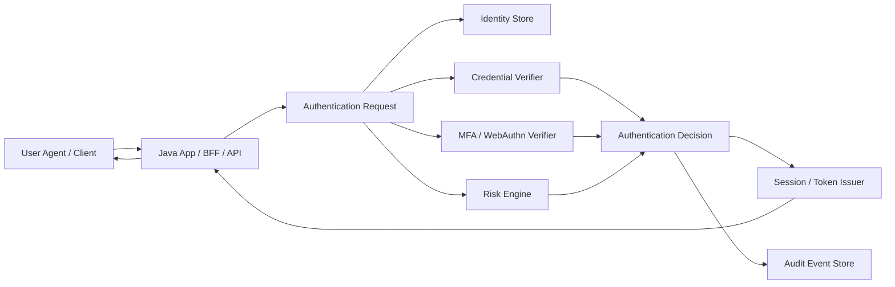
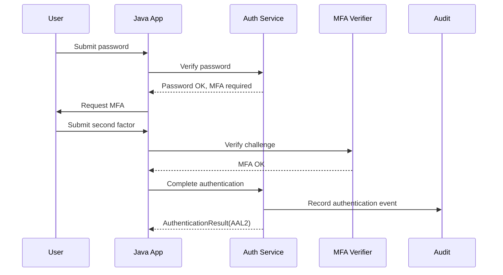
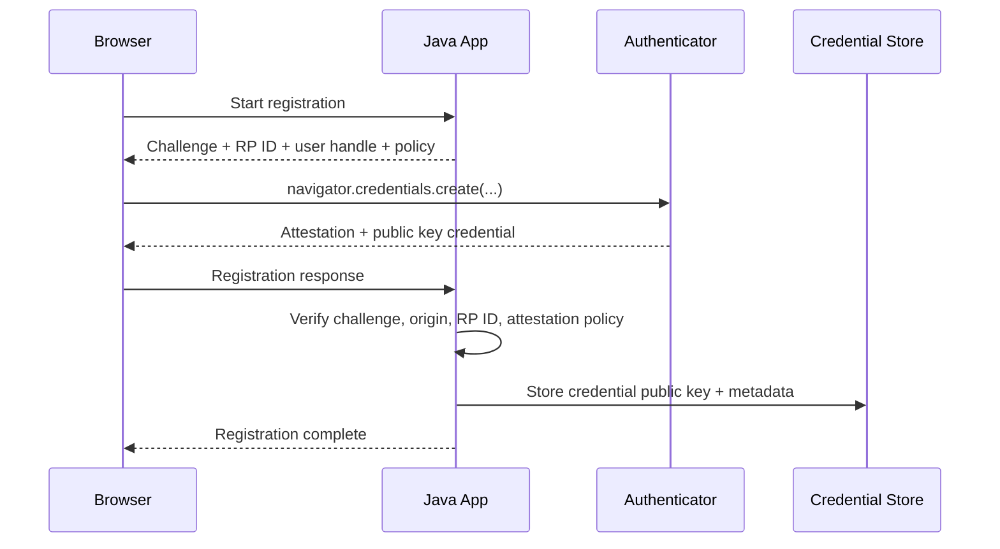
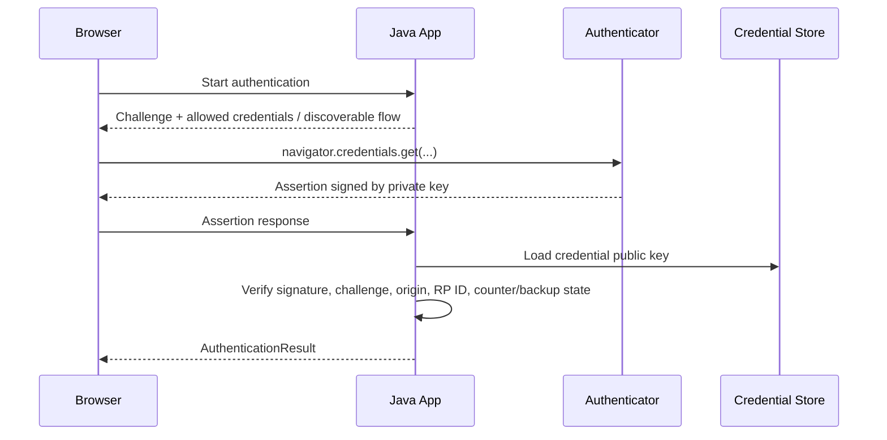
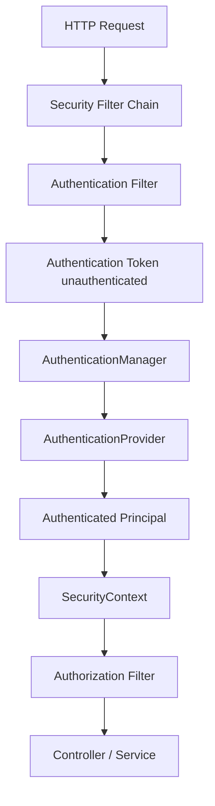

------
title: Learn Java Identity, Authentication & Authorization for Secure Enterprise API Platform - Part 005
description: Authentication architecture untuk sistem Java enterprise: password, passkey/WebAuthn, MFA, step-up, risk-based authentication, account recovery, anti-enumeration, dan implementasi Spring Security yang defensible.
series: learn-java-identity-authentication-authorization-api-platform
seriesTitle: Learn Java Identity, Authentication & Authorization for Secure Enterprise API Platform
order: 5
partTitle: Authentication Architecture in Java Systems
tags:
- java
- identity
- authentication
- spring-security
- passkeys
- webauthn
- mfa
- api-security
date: 2026-06-28
---

# Part 005 — Authentication Architecture in Java Systems

Authentication sering direduksi menjadi “cek username dan password”. Itu berbahaya.

Dalam platform enterprise, authentication adalah proses **membuktikan bahwa actor yang mengendalikan request memang menguasai authenticator yang terikat pada identity tertentu**, lalu menghasilkan state yang dapat dipakai oleh authorization, audit, fraud/risk, dan incident response.

Part ini membahas authentication sebagai arsitektur, bukan sebagai form login.

Kita akan fokus pada desain yang bisa dipertanggungjawabkan di sistem Java modern:

- password authentication yang aman,
- MFA dan step-up authentication,
- passkey/WebAuthn sebagai phishing-resistant authentication,
- adaptive/risk-based authentication,
- account recovery,
- anti-enumeration,
- Spring Security authentication pipeline,
- observability dan test strategy.

> Prinsip utama: authentication tidak boleh hanya menjawab “password benar atau salah”. Authentication harus menghasilkan **authentication result** yang menjelaskan siapa subject-nya, bagaimana subject itu diautentikasi, assurance level-nya, kapan terjadi, faktor apa yang dipakai, risiko apa yang terdeteksi, dan batas kepercayaannya.

---

## 1. Kaufman Objective

Target 20 jam untuk subskill ini:

> Kamu mampu mendesain dan mengimplementasikan authentication layer untuk Java enterprise API platform yang mendukung password, MFA/passkey, step-up authentication, session issuance, anti-enumeration, audit event, dan failure handling tanpa mencampur authentication dengan authorization.

### 1.1 Skill yang harus dikuasai

| Subskill | Target kemampuan |
|---|---|
| Authentication model | Membedakan credential, authenticator, authentication event, session, token, dan assurance. |
| Password security | Membuat password login yang aman tanpa komposisi rules usang, tanpa plaintext leak, dan tanpa enumeration. |
| MFA design | Memilih faktor autentikasi berdasarkan risiko, bukan sekadar menambah OTP. |
| Passkey/WebAuthn mental model | Memahami registration ceremony, authentication ceremony, challenge, origin binding, public-key credential. |
| Step-up authentication | Meminta autentikasi tambahan ketika action berisiko tinggi, bukan setiap request. |
| Account recovery | Mendesain recovery sebagai high-risk authentication path, bukan bypass keamanan. |
| Spring Security implementation | Memetakan domain authentication ke `AuthenticationProvider`, `AuthenticationManager`, `SecurityContext`, dan session/token issuer. |
| Failure modelling | Mengantisipasi brute force, credential stuffing, replay, MFA fatigue, recovery abuse, session fixation, dan stale assurance. |

### 1.2 Batas scope

Part ini tidak membahas detail kriptografi primitive. Itu sudah menjadi seri security/cryptography.

Part ini juga tidak membahas OAuth/OIDC flows secara detail. OAuth dan OIDC akan masuk mulai Part 007 sampai Part 011.

Di sini kita membahas **bagaimana actor masuk ke sistem dan bagaimana hasil authentication direpresentasikan secara aman**.

---

## 2. Authentication Bukan Authorization

Authentication menjawab:

> Apakah actor ini berhasil membuktikan kendali atas authenticator yang valid untuk identity tertentu?

Authorization menjawab:

> Dengan identity, context, assurance, dan policy ini, apakah actor boleh melakukan action terhadap resource tertentu?

Kesalahan umum engineer adalah membuat authentication langsung menghasilkan role/permission final.

Contoh buruk:

```java
if (passwordMatches(user, password)) {
    return new UserSession(user.id(), user.roles());
}
```

Mengapa buruk?

- Authentication dicampur dengan authorization.
- Tidak ada informasi assurance.
- Tidak ada informasi faktor autentikasi.
- Tidak ada risk signal.
- Tidak ada timestamp autentikasi untuk step-up.
- Role disalin ke session dan bisa stale.
- Tidak ada cara membedakan login normal vs recovery vs admin impersonation.

Model yang lebih defensible:

```java
public record AuthenticationResult(
        SubjectId subjectId,
        AccountId accountId,
        TenantId tenantId,
        AuthenticationMethod method,
        AuthenticationAssuranceLevel aal,
        Instant authenticatedAt,
        boolean phishingResistant,
        boolean userVerified,
        RiskAssessment risk,
        List<AuthnEventId> evidenceEvents
) {}
```

Authentication result bukan izin. Ia adalah **evidence** yang akan dipakai authorization dan audit.

---

## 3. Authentication Architecture Mental Model

Authentication architecture harus dilihat sebagai pipeline.



Pipeline ini harus menjaga beberapa invariant:

1. **Credential verification** tidak boleh membuka informasi apakah account ada.
2. **Risk evaluation** tidak boleh menjadi satu-satunya faktor penentu untuk high-risk action.
3. **MFA success** tidak boleh menutupi password compromise tanpa risk handling.
4. **Session issuance** hanya boleh terjadi setelah authentication decision final.
5. **Audit event** harus ditulis untuk success dan failure penting.
6. **Authorization** tidak boleh diasumsikan hanya karena authentication sukses.

---

## 4. Domain Model Authentication

Gunakan domain model eksplisit. Jangan biarkan framework class menjadi model bisnis.

```java
public enum AuthenticationMethod {
    PASSWORD,
    PASSWORD_PLUS_TOTP,
    PASSWORD_PLUS_PUSH,
    PASSKEY_SYNCABLE,
    PASSKEY_DEVICE_BOUND,
    HARDWARE_SECURITY_KEY,
    RECOVERY_CODE,
    FEDERATED_OIDC,
    ADMIN_IMPERSONATION
}

public enum AuthenticationAssuranceLevel {
    AAL1,
    AAL2,
    AAL3
}

public record AuthenticatedPrincipal(
        SubjectId subjectId,
        AccountId accountId,
        TenantId tenantId,
        AuthenticationMethod method,
        AuthenticationAssuranceLevel aal,
        Instant authenticatedAt,
        Instant expiresAt,
        boolean phishingResistant,
        boolean userPresence,
        boolean userVerification,
        Map<String, Object> attributes
) {}
```

Bedakan minimal entitas berikut:

| Entitas | Makna |
|---|---|
| Subject | Entity yang menjadi subject keamanan. Bisa human, workload, service account. |
| Account | Representasi subject dalam sistem tertentu. Satu subject bisa punya banyak account. |
| Credential | Secret atau key material yang didaftarkan, misalnya password hash, public key credential. |
| Authenticator | Faktor yang dikendalikan subject, misalnya password, passkey, OTP device, hardware key. |
| Authentication Event | Kejadian pembuktian identity. |
| Session | State login setelah authentication. |
| Token | Bearer/sender-constrained artifact yang merepresentasikan hasil auth/federation/delegation. |
| Assurance | Kualitas dan kekuatan authentication event. |

---

## 5. Authentication Factors

Faktor autentikasi biasanya diklasifikasikan menjadi:

| Faktor | Contoh | Risiko umum |
|---|---|---|
| Something you know | Password, PIN | Phishing, reuse, brute force, credential stuffing. |
| Something you have | OTP device, passkey, hardware key | Device loss, SIM swap, push fatigue, sync trust. |
| Something you are | Biometric lokal | Presentation attack, privacy, tidak boleh dijadikan shared secret. |

Namun klasifikasi ini belum cukup.

Untuk arsitektur modern, pertanyaan yang lebih penting:

1. Apakah faktor ini **phishing-resistant**?
2. Apakah faktor ini **replay-resistant**?
3. Apakah faktor ini **bound to origin**?
4. Apakah faktor ini **bound to device** atau syncable?
5. Apakah faktor ini membuktikan **user presence**?
6. Apakah faktor ini membuktikan **user verification**?
7. Apakah faktor ini cocok untuk **step-up**?
8. Apakah faktor ini punya jalur **recovery** yang tidak lebih lemah dari faktor utamanya?

Contoh penilaian:

| Mechanism | Phishing-resistant | Replay-resistant | Catatan |
|---|---:|---:|---|
| Password only | Tidak | Tidak kuat | Tetap perlu untuk sebagian sistem, tapi harus dilindungi rate limit, blocklist, hash kuat. |
| SMS OTP | Tidak | Terbatas | Rentan SIM swap, interception, phishing proxy. Jangan jadikan high-assurance default. |
| TOTP | Tidak penuh | Terbatas | Lebih baik dari SMS, tapi tetap bisa diphish real-time. |
| Push MFA | Tidak otomatis | Terbatas | Rentan MFA fatigue jika tidak pakai number matching dan risk controls. |
| WebAuthn/passkey | Ya, jika origin-bound dan challenge valid | Ya | Cocok untuk phishing-resistant authentication. |
| Hardware security key | Ya | Ya | Cocok untuk high assurance dan admin access. |

---

## 6. Password Authentication yang Defensible

Password belum mati di enterprise. Tapi password harus diperlakukan sebagai **legacy-compatible authenticator**, bukan fondasi high assurance.

### 6.1 Password rules yang sehat

Aturan yang defensible:

- minimum length yang masuk akal,
- allow long passwords/passphrases,
- block breached/common/password-list candidates,
- tidak memaksa komposisi aneh seperti “harus ada huruf besar, angka, simbol” sebagai satu-satunya kontrol,
- tidak memaksa periodic password reset tanpa indikasi compromise,
- rate limit dan throttle login attempts,
- hash dengan password hashing algorithm yang tepat,
- jangan simpan plaintext,
- jangan log password,
- jangan kirim password ke downstream service,
- jangan pakai password sebagai API credential machine-to-machine.

### 6.2 Password storage

Java implementation harus memakai `PasswordEncoder`, bukan manual hash.

Contoh konfigurasi Spring Security:

```java
@Configuration
class PasswordConfig {

    @Bean
    PasswordEncoder passwordEncoder() {
        return PasswordEncoderFactories.createDelegatingPasswordEncoder();
    }
}
```

`DelegatingPasswordEncoder` memungkinkan format seperti:

```text
{bcrypt}$2a$10$...
{argon2}$argon2id$v=19$...
```

Keuntungannya:

- algorithm bisa dimigrasikan bertahap,
- hash lama tetap bisa diverifikasi,
- sistem tahu encoder mana yang dipakai,
- tidak perlu flag schema tambahan yang rawan mismatch.

### 6.3 Password verification service

Jangan menyebar logic password ke controller.

```java
public final class PasswordAuthenticationService {

    private final AccountRepository accounts;
    private final PasswordEncoder passwordEncoder;
    private final LoginAttemptLimiter limiter;
    private final AuthenticationAudit audit;
    private final Clock clock;

    public PasswordAuthenticationService(
            AccountRepository accounts,
            PasswordEncoder passwordEncoder,
            LoginAttemptLimiter limiter,
            AuthenticationAudit audit,
            Clock clock
    ) {
        this.accounts = accounts;
        this.passwordEncoder = passwordEncoder;
        this.limiter = limiter;
        this.audit = audit;
        this.clock = clock;
    }

    public PasswordVerificationResult verify(LoginIdentifier identifier, char[] password, RequestContext context) {
        String normalizedIdentifier = identifier.normalized();

        limiter.assertAllowed(normalizedIdentifier, context.clientFingerprint());

        Account account = accounts.findByLoginIdentifier(normalizedIdentifier)
                .orElse(null);

        // Dummy hash avoids materially different timing for unknown accounts.
        String encodedPassword = account != null
                ? account.passwordHash()
                : PasswordHashes.DUMMY_BCRYPT_HASH;

        boolean passwordMatches = passwordEncoder.matches(CharBuffer.wrap(password), encodedPassword);
        clear(password);

        if (account == null || !passwordMatches || account.isDisabled()) {
            limiter.recordFailure(normalizedIdentifier, context.clientFingerprint());
            audit.authenticationFailed(normalizedIdentifier, context, FailureReason.INVALID_CREDENTIALS);
            return PasswordVerificationResult.failed();
        }

        limiter.recordSuccess(normalizedIdentifier, context.clientFingerprint());
        audit.passwordVerified(account.accountId(), context, clock.instant());

        return PasswordVerificationResult.success(account.accountId(), account.subjectId(), account.tenantId());
    }

    private static void clear(char[] password) {
        Arrays.fill(password, '\0');
    }
}
```

Catatan:

- API menerima `char[]`, bukan `String`, untuk mengurangi lifetime secret di heap. Ini bukan jaminan sempurna, tapi lebih baik dari immutable `String`.
- Dummy hash membantu mengurangi perbedaan timing antara account ada dan tidak ada.
- Error response harus generik.
- Audit internal boleh mencatat reason, tapi user-facing message tidak boleh membedakan “user tidak ada”, “password salah”, “account disabled”.

### 6.4 Response anti-enumeration

Jangan lakukan ini:

```text
Email is not registered.
```

Jangan juga ini:

```text
Password is incorrect.
```

Lebih baik:

```text
The credentials are invalid or the account cannot be used.
```

Untuk forgot password:

```text
If an account exists for this email, we will send recovery instructions.
```

Anti-enumeration bukan hanya pesan. Ia juga mencakup:

- timing,
- response status,
- email side effect,
- rate limit behavior,
- audit visibility,
- customer support tooling.

---

## 7. Login Attempt Limiting

Rate limiting login tidak boleh hanya global.

Gunakan beberapa dimensi:

| Dimensi | Tujuan |
|---|---|
| Account identifier | Mencegah brute force terhadap satu account. |
| Source IP / ASN | Mendeteksi stuffing dari lokasi tertentu. |
| Device/browser fingerprint kasar | Mendeteksi abuse tanpa bergantung penuh pada IP. |
| Tenant | Mencegah satu tenant diserang tanpa mematikan tenant lain. |
| Credential pair hash | Mendeteksi credential stuffing pattern. |
| Risk score | Menyesuaikan challenge. |

Contoh interface:

```java
public interface LoginAttemptLimiter {
    void assertAllowed(String loginIdentifier, ClientFingerprint fingerprint);
    void recordFailure(String loginIdentifier, ClientFingerprint fingerprint);
    void recordSuccess(String loginIdentifier, ClientFingerprint fingerprint);
}
```

Failure mode yang sering terjadi:

- limiter hanya by IP, sehingga mudah dilewati botnet,
- limiter hanya by username, sehingga bisa dipakai untuk account lockout DoS,
- lockout permanen tanpa recovery path,
- tidak ada tenant dimension,
- tidak ada observability untuk melihat credential stuffing wave.

Desain yang lebih baik adalah **progressive friction**:

1. normal login,
2. soft delay,
3. CAPTCHA atau proof-of-work ringan untuk low-value endpoint,
4. mandatory MFA/passkey,
5. temporary block,
6. alert dan incident workflow untuk abnormal campaign.

Jangan jadikan CAPTCHA sebagai security boundary utama. CAPTCHA adalah friction, bukan authentication.

---

## 8. MFA Architecture

MFA bukan “tambahkan OTP lalu selesai”. MFA adalah mekanisme menaikkan assurance bahwa actor benar-benar mengendalikan authenticator tambahan.

### 8.1 MFA enrollment

Enrollment adalah momen berbahaya.

Jika attacker sudah menguasai password, mereka bisa mendaftarkan MFA milik mereka sendiri bila enrollment tidak dilindungi.

Aturan defensible:

- enrollment MFA harus membutuhkan fresh authentication,
- high-risk enrollment perlu step-up,
- recovery codes dibuat sekali, ditampilkan sekali, disimpan sebagai hash,
- perubahan MFA harus menghasilkan audit event,
- user diberi notifikasi out-of-band,
- admin enrollment harus dibatasi dan diaudit.

### 8.2 MFA challenge



### 8.3 MFA fatigue

Push-based MFA sering gagal bukan karena cryptography, tetapi karena human fatigue.

Mitigasi:

- number matching,
- rate limit challenge,
- suspicious prompt detection,
- geovelocity/risk signal,
- deny-by-default after repeated ignored prompts,
- require phishing-resistant factor untuk admin/high-risk roles.

### 8.4 MFA recovery codes

Recovery code harus diperlakukan seperti password sekali pakai.

```java
public record RecoveryCode(
        AccountId accountId,
        String codeHash,
        boolean used,
        Instant createdAt,
        Instant usedAt
) {}
```

Aturan:

- simpan hash, bukan plaintext,
- one-time use,
- tampilkan hanya saat dibuat,
- rate limit penggunaan,
- pakai audit event,
- regenerate harus invalidate semua kode lama,
- recovery menggunakan code harus menghasilkan assurance lebih rendah daripada passkey/hardware key kecuali ada kontrol tambahan.

---

## 9. Passkey dan WebAuthn Mental Model

Passkey/WebAuthn berbeda secara fundamental dari password.

Password:

- user dan server berbagi secret,
- secret bisa diphish,
- secret bisa reuse,
- server menyimpan verifier hash,
- attacker bisa membuat situs palsu untuk menangkap password.

WebAuthn/passkey:

- authenticator membuat key pair,
- server menyimpan public key credential,
- private key tidak dikirim ke server,
- login memakai challenge yang ditandatangani,
- credential terikat pada relying party ID/origin,
- phishing resistance berasal dari origin binding dan challenge verification.

### 9.1 Registration ceremony



### 9.2 Authentication ceremony



### 9.3 What Java must verify

A Java WebAuthn verifier must verify at least:

- challenge matches pending authentication request,
- origin matches allowed origins,
- RP ID hash matches configured relying party,
- signature validates against stored public key,
- credential belongs to expected account/tenant,
- user presence flag if required,
- user verification flag if required,
- authenticator policy if high assurance requires it,
- replay is impossible because challenge is one-time,
- registration/authentication ceremony is bound to session/request context.

### 9.4 Passkey domain model

```java
public record WebAuthnCredential(
        CredentialId credentialId,
        AccountId accountId,
        TenantId tenantId,
        byte[] credentialPublicKeyCose,
        long signatureCounter,
        boolean discoverable,
        boolean backupEligible,
        boolean backedUp,
        boolean userVerificationCapable,
        Instant registeredAt,
        Instant lastUsedAt,
        String relyingPartyId,
        String nickname
) {}
```

Important design decision:

- Syncable passkeys improve usability and recovery.
- Device-bound hardware keys can support higher assurance for privileged access.
- Enterprise admins may require hardware-backed keys for break-glass or production access.
- Do not treat every “passkey” as equivalent assurance without policy.

---

## 10. Step-Up Authentication

Step-up authentication adalah meminta authentication yang lebih kuat ketika action lebih berisiko.

Contoh action yang biasanya perlu step-up:

- transfer dana,
- mengubah email utama,
- menambah MFA device,
- melihat data sensitif,
- export mass data,
- grant admin role,
- disable audit integration,
- impersonate customer,
- create API credential,
- approve enforcement action.

### 10.1 Step-up bukan login ulang biasa

Step-up harus mempertimbangkan:

- kapan user terakhir diautentikasi,
- metode authentication terakhir,
- assurance level,
- phishing resistance,
- risk score,
- action sensitivity,
- tenant policy,
- regulatory requirement.

Contoh policy:

```java
public record StepUpRequirement(
        AuthenticationAssuranceLevel minimumAal,
        boolean phishingResistantRequired,
        Duration maxAuthenticationAge,
        Set<AuthenticationMethod> acceptedMethods
) {}
```

Evaluation:

```java
public final class StepUpEvaluator {

    public StepUpDecision evaluate(
            AuthenticatedPrincipal principal,
            SensitiveAction action,
            Instant now
    ) {
        StepUpRequirement req = action.stepUpRequirement();

        if (principal.aal().ordinal() < req.minimumAal().ordinal()) {
            return StepUpDecision.required("insufficient_aal");
        }

        if (req.phishingResistantRequired() && !principal.phishingResistant()) {
            return StepUpDecision.required("phishing_resistant_required");
        }

        Duration age = Duration.between(principal.authenticatedAt(), now);
        if (age.compareTo(req.maxAuthenticationAge()) > 0) {
            return StepUpDecision.required("authentication_too_old");
        }

        if (!req.acceptedMethods().contains(principal.method())) {
            return StepUpDecision.required("method_not_accepted");
        }

        return StepUpDecision.notRequired();
    }
}
```

### 10.2 Step-up result must be persisted carefully

Setelah step-up sukses, jangan memberi “super session” tanpa batas.

Lebih baik:

```java
public record AuthenticationContext(
        AuthenticationAssuranceLevel aal,
        AuthenticationMethod method,
        Instant authenticatedAt,
        Instant stepUpAt,
        Instant stepUpExpiresAt,
        Set<String> stepUpPurposes
) {}
```

Step-up bisa dibatasi untuk purpose tertentu:

- `change_email`,
- `create_api_key`,
- `approve_payment`,
- `impersonate_user`.

Ini mengurangi blast radius bila session dicuri setelah step-up.

---

## 11. Adaptive / Risk-Based Authentication

Risk-based authentication menilai apakah login attempt normal atau mencurigakan.

Sinyal risiko umum:

| Signal | Contoh |
|---|---|
| Device familiarity | Device baru, browser baru, cookie hilang. |
| Network | Tor, VPN, risky ASN, impossible travel. |
| Location | Negara baru, geovelocity impossible. |
| Behavior | Login jam tidak biasa, typing pattern berubah. |
| Account state | Baru reset password, baru recovery, baru ditambah MFA. |
| Tenant state | Tenant sedang diserang credential stuffing. |
| Credential intelligence | Password ditemukan di breach corpus. |

Decision tidak boleh berupa boolean sederhana.

```java
public enum RiskLevel {
    LOW,
    MEDIUM,
    HIGH,
    CRITICAL
}

public record RiskAssessment(
        RiskLevel level,
        List<String> reasons,
        Map<String, Object> signals
) {}
```

Mapping risk ke action:

| Risk | Action |
|---|---|
| Low | Allow normal authentication. |
| Medium | Require MFA or fresh passkey. |
| High | Require phishing-resistant factor and notify user. |
| Critical | Block, create security event, require support/security workflow. |

Caution:

- Risk engine tidak boleh menjadi black box yang tidak bisa diaudit.
- Risk score tidak boleh override explicit tenant policy.
- Jangan mengunci user sah tanpa recovery path.
- Jangan memasukkan data sensitif ke log risk event.

---

## 12. Account Recovery adalah Authentication Path

Account recovery sering menjadi titik terlemah identity system.

Jika recovery lebih lemah dari login, attacker akan menyerang recovery.

### 12.1 Recovery threat model

Serangan umum:

- email account takeover,
- SIM swap,
- helpdesk social engineering,
- leaked recovery code,
- support admin abuse,
- email enumeration,
- token replay,
- stale recovery links,
- tenant admin takeover.

### 12.2 Recovery design rules

- Recovery link harus short-lived.
- Recovery token harus one-time use.
- Recovery token disimpan sebagai hash.
- Recovery flow harus rate-limited.
- Jangan mengungkap account existence.
- Recovery success harus revoke atau rotate sessions sesuai risiko.
- Recovery harus menghasilkan audit event.
- User harus mendapat notifikasi perubahan credential.
- High-privilege account perlu stronger recovery process.

Contoh token model:

```java
public record RecoveryToken(
        RecoveryTokenId id,
        AccountId accountId,
        String tokenHash,
        Instant issuedAt,
        Instant expiresAt,
        boolean used,
        RequestContext issuedFrom
) {}
```

Verification:

```java
public RecoveryDecision verifyRecoveryToken(String rawToken, RequestContext context) {
    RecoveryToken token = repository.findByTokenHash(hash(rawToken))
            .orElse(null);

    if (token == null || token.used() || token.expiresAt().isBefore(clock.instant())) {
        audit.recoveryFailed(context);
        return RecoveryDecision.failed();
    }

    repository.markUsed(token.id(), clock.instant());
    audit.recoveryTokenAccepted(token.accountId(), context);
    return RecoveryDecision.accepted(token.accountId());
}
```

### 12.3 Recovery should downgrade trust

Setelah recovery, jangan langsung memberi full trust.

Bisa gunakan state:

```java
public enum AccountTrustState {
    NORMAL,
    RECENTLY_RECOVERED,
    PASSWORD_COMPROMISE_SUSPECTED,
    ADMIN_REVIEW_REQUIRED
}
```

Policy contoh:

- setelah recovery, revoke existing sessions,
- require MFA enrollment ulang jika factor berubah,
- block high-risk action selama 24 jam,
- require step-up untuk export data,
- notify tenant admin untuk privileged account.

---

## 13. Spring Security Authentication Pipeline

Spring Security memakai chain filter dan model authentication yang kuat, tetapi mudah disalahgunakan bila domain model tidak jelas.

Pipeline konseptual:



### 13.1 Key abstractions

| Spring abstraction | Domain meaning |
|---|---|
| `Authentication` | Request atau result authentication. Bisa unauthenticated atau authenticated. |
| `AuthenticationManager` | Orchestrator yang mencoba provider. |
| `AuthenticationProvider` | Verifier untuk mechanism tertentu. |
| `UserDetailsService` | Adapter untuk load user details. Jangan jadikan domain model utama. |
| `PasswordEncoder` | Password verifier/hasher. |
| `SecurityContext` | Request/session-local security state. |
| `GrantedAuthority` | Authority yang dikenal Spring. Jangan samakan otomatis dengan domain permission final. |

### 13.2 Custom authentication token

```java
public final class LoginPasswordAuthenticationToken extends AbstractAuthenticationToken {

    private final LoginIdentifier identifier;
    private final char[] password;
    private final AuthenticatedPrincipal principal;

    private LoginPasswordAuthenticationToken(
            LoginIdentifier identifier,
            char[] password,
            AuthenticatedPrincipal principal,
            Collection<? extends GrantedAuthority> authorities,
            boolean authenticated
    ) {
        super(authorities);
        this.identifier = identifier;
        this.password = password;
        this.principal = principal;
        setAuthenticated(authenticated);
    }

    public static LoginPasswordAuthenticationToken unauthenticated(
            LoginIdentifier identifier,
            char[] password
    ) {
        return new LoginPasswordAuthenticationToken(identifier, password, null, List.of(), false);
    }

    public static LoginPasswordAuthenticationToken authenticated(
            AuthenticatedPrincipal principal,
            Collection<? extends GrantedAuthority> authorities
    ) {
        return new LoginPasswordAuthenticationToken(null, null, principal, authorities, true);
    }

    @Override
    public Object getCredentials() {
        return password;
    }

    @Override
    public Object getPrincipal() {
        return principal;
    }

    public LoginIdentifier identifier() {
        return identifier;
    }

    @Override
    public void eraseCredentials() {
        if (password != null) {
            Arrays.fill(password, '\0');
        }
        super.eraseCredentials();
    }
}
```

### 13.3 Custom authentication provider

```java
@Component
public final class LoginPasswordAuthenticationProvider implements AuthenticationProvider {

    private final PasswordAuthenticationService passwordAuth;
    private final AuthorityMapper authorityMapper;
    private final RequestContextProvider contextProvider;

    public LoginPasswordAuthenticationProvider(
            PasswordAuthenticationService passwordAuth,
            AuthorityMapper authorityMapper,
            RequestContextProvider contextProvider
    ) {
        this.passwordAuth = passwordAuth;
        this.authorityMapper = authorityMapper;
        this.contextProvider = contextProvider;
    }

    @Override
    public Authentication authenticate(Authentication authentication) throws AuthenticationException {
        LoginPasswordAuthenticationToken token = (LoginPasswordAuthenticationToken) authentication;

        PasswordVerificationResult result = passwordAuth.verify(
                token.identifier(),
                (char[]) token.getCredentials(),
                contextProvider.current()
        );

        if (!result.success()) {
            throw new BadCredentialsException("Invalid credentials");
        }

        AuthenticatedPrincipal principal = new AuthenticatedPrincipal(
                result.subjectId(),
                result.accountId(),
                result.tenantId(),
                AuthenticationMethod.PASSWORD,
                AuthenticationAssuranceLevel.AAL1,
                Instant.now(),
                Instant.now().plus(Duration.ofHours(8)),
                false,
                true,
                false,
                Map.of()
        );

        return LoginPasswordAuthenticationToken.authenticated(
                principal,
                authorityMapper.mapForAuthenticatedPrincipal(principal)
        );
    }

    @Override
    public boolean supports(Class<?> authentication) {
        return LoginPasswordAuthenticationToken.class.isAssignableFrom(authentication);
    }
}
```

Catatan penting:

- Provider hanya membuktikan authentication.
- Authority mapping boleh minimal, misalnya `AUTHENTICATED_USER`.
- Domain authorization detail tetap dilakukan di policy layer/service layer.

---

## 14. Session Issuance Setelah Authentication

Authentication success biasanya menghasilkan session atau token.

Jangan membuat session sebelum decision final.

Bad pattern:

```java
session.setAttribute("loginIdentifier", identifier);
// lalu verifikasi credential di step berikutnya tanpa state lifecycle jelas
```

Lebih baik:

- pre-authentication challenge state disimpan terpisah,
- pending login state memiliki TTL pendek,
- final session baru dibuat setelah semua required factors selesai,
- session ID dirotasi setelah login,
- authentication context disimpan minimal.

Session akan dibahas lebih detail di Part 006.

---

## 15. Audit Events untuk Authentication

Authentication event bukan hanya log teks.

Gunakan struktur event.

```java
public record AuthenticationAuditEvent(
        AuthnEventId eventId,
        Instant occurredAt,
        TenantId tenantId,
        AccountId accountId,
        SubjectId subjectId,
        AuthenticationEventType type,
        AuthenticationMethod method,
        AuthenticationAssuranceLevel aal,
        boolean success,
        FailureReason failureReason,
        String sourceIpHash,
        String userAgentHash,
        RiskLevel riskLevel,
        List<String> riskReasons,
        CorrelationId correlationId
) {}
```

Event types:

- `PASSWORD_VERIFICATION_FAILED`,
- `PASSWORD_VERIFICATION_SUCCEEDED`,
- `MFA_CHALLENGE_SENT`,
- `MFA_CHALLENGE_FAILED`,
- `MFA_CHALLENGE_SUCCEEDED`,
- `PASSKEY_REGISTERED`,
- `PASSKEY_AUTHENTICATION_SUCCEEDED`,
- `RECOVERY_STARTED`,
- `RECOVERY_TOKEN_ACCEPTED`,
- `SESSION_ISSUED`,
- `STEP_UP_SUCCEEDED`,
- `AUTHENTICATION_BLOCKED_BY_RISK`.

Privacy rule:

- Jangan log raw password.
- Jangan log OTP.
- Jangan log recovery token.
- Jangan log raw credential ID jika itu dianggap sensitive dalam threat model.
- Hash IP/user-agent bila perlu untuk privacy-preserving correlation.

---

## 16. Security Invariants

Gunakan invariant berikut saat design review.

1. **No secret leaves the authentication boundary unnecessarily.**
2. **Authentication success does not imply authorization success.**
3. **Unknown account and wrong password look equivalent to the caller.**
4. **Recovery is not weaker than login for privileged accounts.**
5. **MFA enrollment requires fresh authentication.**
6. **Step-up has TTL and purpose.**
7. **Authentication method and assurance are explicit.**
8. **Risk engine can add friction, but cannot silently reduce mandatory policy.**
9. **Audit is written for meaningful success/failure paths.**
10. **Session/token issuance happens only after all required factors succeed.**
11. **Password hash algorithm is migration-friendly.**
12. **Passkey/WebAuthn challenge is one-time and bound to context.**
13. **Admin/support authentication paths are stricter, not weaker.**
14. **Every authentication bypass has an owner, expiry, and audit trail.**

---

## 17. Failure Modes

### 17.1 Authentication succeeds but wrong tenant is selected

Cause:

- login identifier globally unique assumption,
- tenant inferred from email domain incorrectly,
- tenant switch after login without revalidating membership.

Mitigation:

- bind account to tenant,
- include tenant in authentication result,
- require explicit tenant selection if account belongs to multiple tenants,
- authorization always checks tenant boundary.

### 17.2 Password reset becomes account takeover

Cause:

- long-lived reset token,
- reset token stored plaintext,
- no rate limit,
- support can reset MFA without dual control.

Mitigation:

- short TTL,
- hashed one-time token,
- risk-aware recovery,
- session revocation,
- audit and notification.

### 17.3 MFA bypass through remember-device cookie

Cause:

- remember-device cookie not device-bound,
- no rotation,
- no risk invalidation,
- cookie valid after password reset.

Mitigation:

- sign and bind remember-device token,
- invalidate on password/MFA changes,
- limit TTL,
- require step-up for sensitive actions anyway.

### 17.4 Passkey accepted for wrong RP/origin

Cause:

- verifier skips origin/RP ID validation,
- staging/prod origin confusion,
- wildcard origin allowed.

Mitigation:

- explicit allowed origins,
- environment-specific RP ID,
- strict challenge store,
- WebAuthn library configured with production origin policy.

### 17.5 Admin login uses same assurance as normal user

Cause:

- role assigned after login without step-up,
- admin action protected only by role,
- no phishing-resistant requirement.

Mitigation:

- admin policy requires AAL2/AAL3 depending risk,
- production admin requires hardware/security key or passkey with user verification,
- separate break-glass flow with audit.

---

## 18. Anti-Patterns

| Anti-pattern | Why dangerous | Better approach |
|---|---|---|
| `if password then role` | Mixes authn and authz. | Emit `AuthenticationResult`, evaluate authorization separately. |
| User-facing “email not found” | Enables enumeration. | Generic error and uniform behavior. |
| SMS OTP as high assurance | SIM swap/phishing risk. | Prefer WebAuthn/passkey/security key for high-risk. |
| MFA enrollment after password only for admin | If password compromised, attacker enrolls MFA. | Require fresh strong auth or admin-reviewed recovery. |
| Recovery bypasses MFA silently | Recovery becomes weakest link. | Treat recovery as high-risk auth path. |
| Permanent account lockout | Enables DoS. | Progressive friction and risk-based controls. |
| Long-lived step-up | Session theft gets elevated rights. | Purpose-bound, short TTL step-up. |
| Logging raw identifiers/secrets | Privacy/security leak. | Structured audit with minimization. |
| Trusting framework defaults blindly | Defaults may not match domain risk. | Explicit security invariants and tests. |

---

## 19. Testing Strategy

Authentication testing must include negative tests.

### 19.1 Unit tests

Test password verification:

- valid password succeeds,
- invalid password fails,
- unknown account fails generically,
- disabled account fails generically,
- failure recorded in limiter,
- success resets limiter,
- password char array cleared,
- audit written.

Test step-up evaluator:

- insufficient AAL requires step-up,
- stale authentication requires step-up,
- non-phishing-resistant method rejected for high-risk action,
- accepted method passes,
- purpose and TTL enforced.

### 19.2 Integration tests

- Login success rotates session ID.
- Login failure response does not reveal account state.
- MFA required after password when policy says so.
- Recovery token one-time use.
- Recovery token expired rejected.
- Passkey challenge replay rejected.
- Admin action requires fresh step-up.

### 19.3 Security regression tests

```java
@Test
void unknownAccountAndWrongPasswordReturnSamePublicError() {
    LoginResponse unknown = client.login("missing@example.com", "Password123!");
    LoginResponse wrong = client.login("alice@example.com", "wrong-password");

    assertThat(unknown.status()).isEqualTo(wrong.status());
    assertThat(unknown.publicErrorCode()).isEqualTo(wrong.publicErrorCode());
}
```

```java
@Test
void highRiskActionRequiresFreshPhishingResistantAuthentication() {
    AuthenticatedPrincipal passwordOnly = principal(
            AuthenticationMethod.PASSWORD,
            AuthenticationAssuranceLevel.AAL1,
            false,
            Instant.now().minus(Duration.ofMinutes(5))
    );

    StepUpDecision decision = evaluator.evaluate(passwordOnly, SensitiveAction.CREATE_API_KEY, Instant.now());

    assertThat(decision.required()).isTrue();
    assertThat(decision.reason()).isEqualTo("insufficient_aal");
}
```

---

## 20. Production Readiness Checklist

Sebelum authentication layer dianggap production-ready:

- [ ] Password disimpan dengan password hashing yang tepat dan migration-friendly.
- [ ] Login error tidak memungkinkan enumeration.
- [ ] Rate limiter punya dimensi account, IP/network, tenant, dan risk.
- [ ] MFA enrollment dilindungi fresh authentication.
- [ ] Recovery token short-lived, one-time, dan hashed.
- [ ] Recovery success memicu audit dan session invalidation sesuai policy.
- [ ] Passkey/WebAuthn verifier memvalidasi challenge, origin, RP ID, signature, user verification, dan credential binding.
- [ ] Authentication result menyimpan method, AAL, timestamp, risk, dan tenant.
- [ ] Step-up policy purpose-bound dan TTL-bound.
- [ ] Audit event terstruktur dan privacy-safe.
- [ ] Admin/support flows lebih ketat dari user flow biasa.
- [ ] Negative tests mencakup bypass, replay, stale assurance, dan enumeration.
- [ ] Incident response punya cara revoke session/token setelah credential compromise.

---

## 21. Practice Drill

Desain authentication untuk platform berikut:

> Enterprise regulatory case management system dengan user internal regulator, user eksternal perusahaan, service account integrasi, dan admin support. Ada action high-risk: export evidence bundle, approve enforcement recommendation, create API key, dan impersonate tenant user.

Tugas:

1. Tentukan authentication methods untuk tiap actor.
2. Tentukan minimum AAL untuk login normal.
3. Tentukan action mana yang butuh step-up.
4. Tentukan MFA/passkey enrollment policy.
5. Tentukan account recovery flow.
6. Tentukan audit events.
7. Tuliskan 10 negative tests.

Expected answer outline:

- Internal regulator: password + passkey/MFA, high-risk action butuh phishing-resistant step-up.
- External company user: password + MFA/passkey tergantung tenant policy.
- Service account: no password, gunakan client credentials/workload identity.
- Admin support: hardware security key/passkey, all impersonation audited, purpose-bound, approval if high risk.
- Recovery: short-lived token, revoke sessions, block high-risk action sementara.

---

## 22. Summary

Authentication architecture yang matang tidak berhenti pada credential check.

Ia harus menghasilkan evidence yang dapat dipakai oleh seluruh platform:

- subject/account/tenant,
- authentication method,
- assurance level,
- timestamp,
- phishing resistance,
- risk signal,
- audit trail,
- session/token issuance boundary.

Mental model penting:

> Authentication adalah evidence pipeline. Authorization adalah decision pipeline. Session/token adalah propagation mechanism. Audit adalah accountability layer.

Di part berikutnya kita akan membahas **session management**: bagaimana hasil authentication dipertahankan di browser, BFF, SPA, dan API platform tanpa membuka CSRF, fixation, replay, stale session, atau token leakage.

---

## References

- NIST SP 800-63B Revision 4, *Authentication and Authenticator Management*: https://pages.nist.gov/800-63-4/sp800-63b.html
- OWASP Authentication Cheat Sheet: https://cheatsheetseries.owasp.org/cheatsheets/Authentication_Cheat_Sheet.html
- OWASP Session Management Cheat Sheet: https://cheatsheetseries.owasp.org/cheatsheets/Session_Management_Cheat_Sheet.html
- Spring Security Reference: https://docs.spring.io/spring-security/reference/index.html
- Spring Security Password Storage: https://docs.spring.io/spring-security/reference/features/authentication/password-storage.html
- W3C Web Authentication: https://www.w3.org/TR/webauthn-3/
