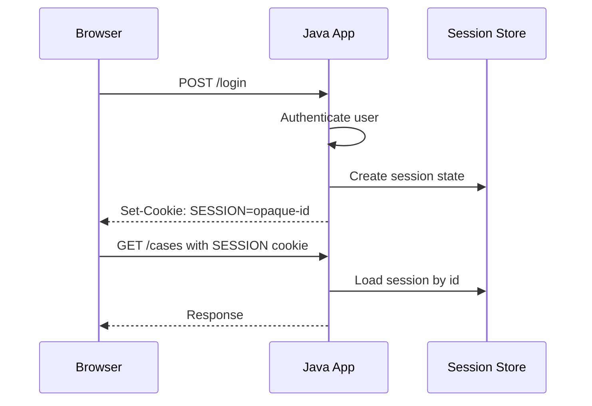
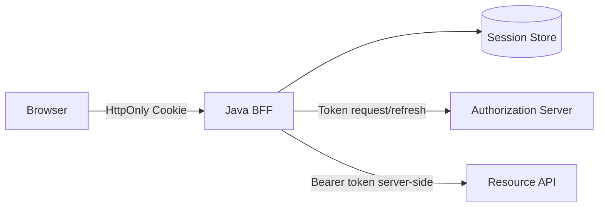
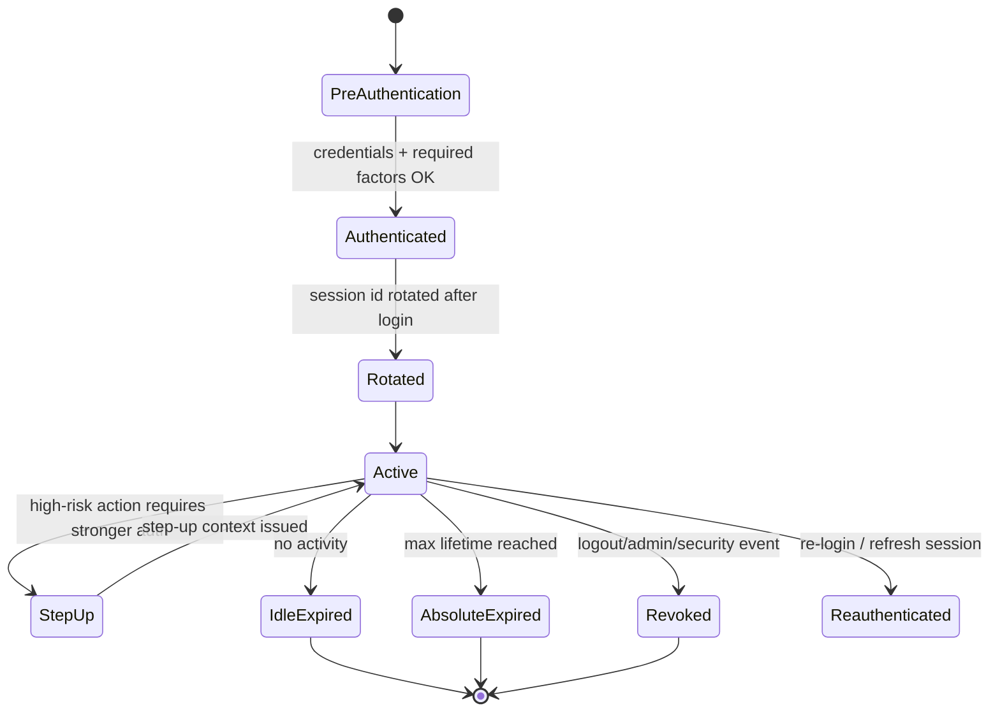
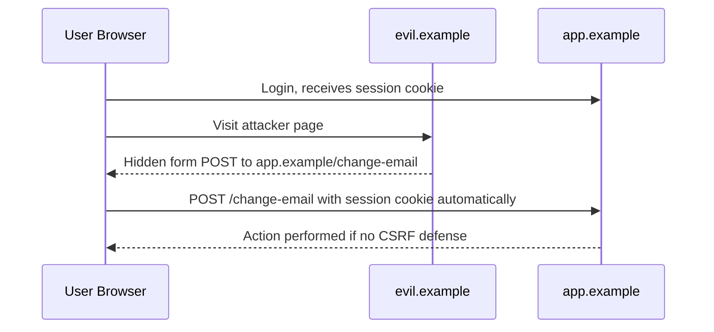
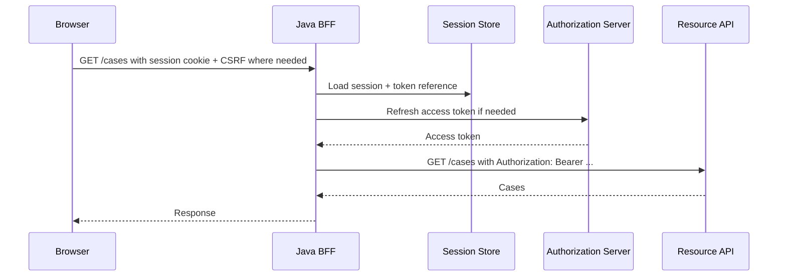

------
title: Learn Java Identity, Authentication & Authorization for Secure Enterprise API Platform - Part 006
description: Session management untuk browser, BFF, SPA, dan API platform: cookie security, CSRF, session fixation, logout, revocation, distributed sessions, token-backed sessions, dan Spring Security implementation.
series: learn-java-identity-authentication-authorization-api-platform
seriesTitle: Learn Java Identity, Authentication & Authorization for Secure Enterprise API Platform
order: 6
partTitle: Session Management for Browser, BFF, SPA, and API Platforms
tags:
- java
- identity
- session-management
- csrf
- cookies
- spring-security
- bff
- api-security
date: 2026-06-28
---

# Part 006 — Session Management for Browser, BFF, SPA, and API Platforms

Authentication membuktikan identity pada satu waktu.

Session management menjawab pertanyaan berikut:

> Setelah user berhasil diautentikasi, bagaimana sistem mempertahankan state kepercayaan itu antar request tanpa membuka celah fixation, hijacking, replay, CSRF, stale privilege, tenant confusion, atau logout yang palsu?

Banyak sistem enterprise gagal bukan karena login-nya lemah, tetapi karena session-nya tidak punya lifecycle yang jelas.

Part ini membahas session management untuk:

- browser-rendered web application,
- Backend-for-Frontend / BFF,
- SPA,
- API resource server,
- enterprise distributed session,
- Spring Security.

---

## 1. Kaufman Objective

Target subskill:

> Kamu mampu mendesain session architecture untuk Java enterprise platform yang aman untuk browser dan API, memahami kapan memakai cookie session, kapan memakai token, bagaimana CSRF bekerja, bagaimana logout/revocation harus dirancang, dan bagaimana menguji session lifecycle secara negatif.

Skill yang harus dikuasai:

| Subskill | Target kemampuan |
|---|---|
| Session mental model | Membedakan authentication event, session, access token, refresh token, remember-device, dan step-up context. |
| Cookie security | Menggunakan `HttpOnly`, `Secure`, `SameSite`, path/domain, expiry, prefix, dan partitioning secara tepat. |
| CSRF model | Tahu kapan CSRF relevan dan kapan tidak. Tidak mencampur CSRF dengan CORS. |
| Session lifecycle | Create, rotate, idle timeout, absolute timeout, revoke, logout, concurrent session, fixation defense. |
| BFF vs SPA | Memilih token storage dan browser boundary yang aman. |
| Distributed session | Redis/Spring Session trade-off, invalidation, consistency, failover. |
| Spring Security | Mengkonfigurasi session, CSRF, logout, fixation protection, dan security context repository. |
| Testing | Menguji fixation, CSRF, stale session, logout, rotation, dan tenant switch. |

---

## 2. Authentication Event vs Session vs Token

Jangan mencampur konsep berikut.

| Konsep | Makna | Lifetime | Pemilik utama |
|---|---|---|---|
| Authentication event | Bukti bahwa subject berhasil diautentikasi pada waktu tertentu. | Historical evidence. | Auth service/audit. |
| Session | Server/client state yang mempertahankan login antar request. | Idle + absolute timeout. | Application/BFF. |
| Access token | Artifact untuk mengakses API resource. | Pendek. | Authorization server/resource server. |
| Refresh token | Artifact untuk memperoleh access token baru. | Lebih panjang, harus dilindungi. | Authorization server/client. |
| Step-up context | Evidence sementara untuk high-risk action. | Sangat pendek/purpose-bound. | App/auth service. |
| Remember-device | Sinyal untuk menurunkan friction, bukan proof penuh. | Terbatas dan revocable. | App/auth service. |

Rule sederhana:

> Session adalah state aplikasi. Token adalah artifact protokol. Authentication event adalah evidence. Jangan jadikan satu object untuk semua.

---

## 3. Session Architecture Choices

Ada tiga desain umum.

### 3.1 Stateful server-side session

Browser menyimpan session id di cookie. Server menyimpan session state.



Kelebihan:

- mudah revoke,
- session state bisa server-side,
- cookie bisa `HttpOnly`,
- cocok untuk BFF/server-rendered app,
- tidak perlu expose access token ke browser JavaScript.

Kekurangan:

- butuh session store,
- horizontal scaling perlu sticky session atau distributed session,
- perlu CSRF protection untuk browser requests,
- store outage dapat memengaruhi login.

### 3.2 Stateless token in browser

Browser menyimpan access token/refresh token, biasanya di memory/local storage/cookie.

Kelebihan:

- scalable secara teknis,
- cocok untuk native/mobile/API clients,
- resource server bisa memvalidasi JWT tanpa session lookup.

Kekurangan untuk browser:

- localStorage rentan XSS token theft,
- cookie token membawa CSRF consideration,
- revocation sulit jika token self-contained,
- refresh token di browser adalah high-value target,
- logout sering hanya client-side illusion.

### 3.3 BFF hybrid

Browser hanya punya secure cookie ke BFF. BFF menyimpan token server-side dan memanggil API downstream.



Kelebihan:

- token tidak tersedia untuk browser JavaScript,
- cocok untuk SPA dengan security requirement tinggi,
- BFF bisa menerapkan CSRF, step-up, tenant context, dan audit,
- downstream API menerima access token dari trusted confidential client.

Kekurangan:

- tambahan layer,
- perlu scaling BFF/session store,
- perlu desain CORS/CSRF/cookie dengan benar,
- BFF bisa menjadi high-value component.

Rekomendasi praktis untuk enterprise browser app:

> Untuk browser-based enterprise app, default yang lebih defensible adalah BFF + HttpOnly Secure SameSite cookie + server-side token/session storage. Jangan expose refresh token ke browser kecuali threat model dan mitigasinya sangat jelas.

---

## 4. Cookie Security Model

Cookie session harus opaque, random, high entropy, dan tidak memuat data sensitif.

### 4.1 Cookie attributes

| Attribute | Fungsi | Rekomendasi |
|---|---|---|
| `HttpOnly` | Mencegah akses dari JavaScript. | Aktifkan untuk session cookie. |
| `Secure` | Cookie hanya dikirim via HTTPS. | Wajib di production. |
| `SameSite` | Mengontrol pengiriman cookie cross-site. | `Lax` atau `Strict`; `None` hanya jika perlu cross-site dan harus `Secure`. |
| `Path` | Scope path cookie. | Sesempit mungkin. |
| `Domain` | Scope domain/subdomain. | Hindari domain luas jika tidak perlu. |
| `Max-Age` / `Expires` | Persistence. | Session cookie atau TTL eksplisit sesuai risk. |
| `__Host-` prefix | Membatasi cookie agar host-only, secure, path `/`, tanpa Domain. | Sangat baik untuk session utama. |

Contoh header:

```http
Set-Cookie: __Host-session=opaqueRandomValue; Path=/; Secure; HttpOnly; SameSite=Lax
```

Untuk cross-site embedding atau third-party context, `SameSite=None; Secure` mungkin diperlukan. Namun itu menaikkan kompleksitas CSRF dan browser privacy behavior.

### 4.2 Cookie value

Jangan simpan ini di cookie:

```json
{
  "userId": "123",
  "roles": ["ADMIN"],
  "tenantId": "acme"
}
```

Lebih baik:

```text
__Host-session=3Ge8gkP9kQjM...opaque random id...
```

Server-side session store:

```java
public record SessionState(
        SessionId sessionId,
        SubjectId subjectId,
        AccountId accountId,
        TenantId tenantId,
        AuthenticationAssuranceLevel aal,
        AuthenticationMethod method,
        Instant authenticatedAt,
        Instant issuedAt,
        Instant lastSeenAt,
        Instant absoluteExpiresAt,
        Instant idleExpiresAt,
        Set<String> flags
) {}
```

---

## 5. Session Lifecycle

Session harus punya lifecycle eksplisit.



### 5.1 Creation

Session creation hanya terjadi setelah authentication final.

For multi-factor login:

- password success menghasilkan pending authentication state,
- MFA success menghasilkan authenticated session,
- pending state punya TTL pendek,
- pending state tidak boleh mengakses resource protected.

### 5.2 Rotation

Session ID harus dirotasi setelah authentication success untuk mencegah session fixation.

Session fixation terjadi ketika attacker membuat/mengetahui session ID lebih dulu, lalu korban login menggunakan session ID itu.

Mitigasi:

- rotate session ID on login,
- invalidate pre-auth session,
- jangan menerima session ID dari URL,
- set cookie secure attributes,
- regenerate CSRF token setelah login.

### 5.3 Idle timeout dan absolute timeout

Gunakan dua timeout:

| Timeout | Makna |
|---|---|
| Idle timeout | Session habis jika tidak ada aktivitas. |
| Absolute timeout | Session habis walaupun aktif terus. |

Contoh:

- normal employee app: idle 30 menit, absolute 8-12 jam,
- admin console: idle 10-15 menit, absolute 4 jam,
- high-risk step-up: 5-15 menit,
- public low-risk portal: lebih longgar sesuai policy.

Jangan hanya memakai idle timeout. Session yang aktif terus bisa hidup terlalu lama.

### 5.4 Revocation

Session harus bisa dicabut karena:

- logout,
- password reset,
- MFA reset,
- account disabled,
- tenant membership revoked,
- suspected compromise,
- admin/security action,
- refresh token compromise,
- device lost.

Revocation harus server-side bila ingin efektif. Self-contained JWT yang masih valid sampai expiry tidak bisa benar-benar dicabut tanpa introspection, denylist, short TTL, atau reference token.

---

## 6. CSRF Mental Model

CSRF terjadi ketika browser otomatis mengirim credential seperti cookie ke server saat user mengunjungi situs attacker.

CSRF bukan tentang attacker membaca response. CSRF tentang attacker membuat browser korban **mengirim request authenticated**.



CSRF relevan ketika:

- authentication memakai cookies atau browser otomatis mengirim credential,
- request memiliki side effect,
- attacker bisa membuat browser mengirim request.

CSRF kurang relevan untuk:

- API yang hanya menerima `Authorization: Bearer` header yang harus diset JavaScript attacker, selama CORS tidak mengizinkan attacker origin,
- non-browser clients,
- same-origin-only private backend.

Namun jangan menyimpulkan “API tidak perlu CSRF” tanpa melihat credential transport-nya.

Jika API menerima session cookie dari browser, CSRF relevan.

---

## 7. CSRF Defenses

### 7.1 Synchronizer token pattern

Server menyimpan CSRF token di session. Form/request harus mengirim token yang cocok.

Cocok untuk server-rendered atau BFF.

### 7.2 Double-submit cookie

Token disimpan di cookie dan dikirim juga di header/body. Server memverifikasi keduanya cocok, sebaiknya signed/bound to session.

Cocok untuk SPA/BFF tertentu.

### 7.3 SameSite cookie

`SameSite=Lax` membantu mengurangi CSRF untuk banyak navigasi cross-site, tetapi bukan pengganti penuh untuk token pada semua sensitive state-changing request.

`SameSite=Strict` lebih ketat tetapi bisa mengganggu UX.

`SameSite=None` diperlukan untuk cross-site use case tertentu, tetapi harus `Secure` dan perlu CSRF defense kuat.

### 7.4 Origin/Referer validation

Untuk state-changing request, validasi `Origin` atau `Referer` dapat menjadi defense tambahan.

Caution:

- jangan jadikan satu-satunya defense jika environment/proxy sering menghapus header,
- handle absence dengan policy jelas,
- allowlist harus ketat.

### 7.5 Custom header

Browser form biasa tidak bisa mengirim custom header tanpa CORS preflight. SPA dapat mengirim `X-CSRF-TOKEN` jika same-origin atau CORS diatur.

---

## 8. CORS Bukan CSRF

CORS mengontrol apakah browser mengizinkan JavaScript dari origin lain membaca response atau mengirim request tertentu dengan permission tertentu.

CSRF mengontrol apakah request authenticated dengan side effect boleh diterima.

Kesalahan umum:

```text
We enabled CORS correctly, so CSRF is handled.
```

Ini salah.

Jika cookie otomatis dikirim, attacker bisa memicu form POST sederhana tanpa perlu membaca response.

Aturan:

- CORS adalah browser read/access control antar origin.
- CSRF adalah request integrity control untuk browser credential otomatis.
- Keduanya berbeda dan bisa sama-sama diperlukan.

---

## 9. Spring Security Session Management

Spring Security menyediakan default yang kuat, tetapi harus disesuaikan dengan arsitektur.

### 9.1 Basic security filter chain untuk browser app

```java
@Configuration
@EnableWebSecurity
class BrowserSecurityConfig {

    @Bean
    SecurityFilterChain browserSecurity(HttpSecurity http) throws Exception {
        http
            .authorizeHttpRequests(authz -> authz
                .requestMatchers("/login", "/assets/**", "/error").permitAll()
                .anyRequest().authenticated()
            )
            .formLogin(form -> form
                .loginPage("/login")
                .permitAll()
            )
            .logout(logout -> logout
                .logoutUrl("/logout")
                .invalidateHttpSession(true)
                .deleteCookies("__Host-session", "JSESSIONID")
            )
            .sessionManagement(session -> session
                .sessionFixation(fixation -> fixation.migrateSession())
                .maximumSessions(3)
            )
            .csrf(csrf -> csrf
                // default enabled for browser app
            );

        return http.build();
    }
}
```

Catatan:

- Spring Security mengaktifkan CSRF protection secara default untuk banyak konfigurasi servlet web.
- Jangan disable CSRF hanya karena request memakai JSON.
- Disable CSRF hanya jika endpoint tidak memakai browser cookie credential atau ada defense lain yang jelas.

### 9.2 Cookie customization in Spring Boot

`application.yml`:

```yaml
server:
  servlet:
    session:
      cookie:
        name: __Host-session
        http-only: true
        secure: true
        same-site: lax
        path: /
      timeout: 30m
```

Untuk `__Host-` prefix:

- cookie harus `Secure`,
- path harus `/`,
- tidak boleh ada `Domain` attribute.

Pastikan reverse proxy mengirim header yang benar agar aplikasi tahu request aslinya HTTPS.

### 9.3 SecurityContextRepository

Spring menyimpan `SecurityContext` dalam session untuk stateful browser app.

Untuk stateless API resource server, gunakan strategi berbeda.

```java
@Configuration
class ApiSecurityConfig {

    @Bean
    SecurityFilterChain apiSecurity(HttpSecurity http) throws Exception {
        http
            .securityMatcher("/api/**")
            .sessionManagement(session -> session
                .sessionCreationPolicy(SessionCreationPolicy.STATELESS)
            )
            .csrf(csrf -> csrf.disable())
            .oauth2ResourceServer(oauth2 -> oauth2.jwt());

        return http.build();
    }
}
```

Disable CSRF di sini masuk akal **jika** API hanya menerima bearer token di `Authorization` header dan bukan cookie otomatis dari browser.

---

## 10. BFF Session Pattern

BFF pattern cocok untuk enterprise SPA.

Browser:

- menyimpan hanya HttpOnly session cookie,
- tidak menyimpan access token di localStorage,
- memanggil BFF same-origin.

BFF:

- menyimpan session state server-side,
- menyimpan access/refresh token server-side,
- menambahkan bearer token saat memanggil API,
- menerapkan CSRF,
- menerapkan step-up dan tenant context,
- menulis audit event.



### 10.1 BFF security invariants

- Browser never sees refresh token.
- Browser JavaScript cannot read session cookie.
- CSRF token required for unsafe methods.
- BFF validates tenant context before downstream call.
- BFF does not blindly forward arbitrary headers.
- BFF logs correlation ID and subject context.
- BFF enforces logout by revoking server-side session and tokens where possible.

### 10.2 BFF anti-pattern

Bad:

```text
SPA stores refresh token in localStorage; BFF only proxies requests.
```

This is not really BFF. It is a proxy plus exposed browser token.

Better:

```text
BFF owns OAuth client and token storage. Browser owns only secure same-site session cookie.
```

---

## 11. SPA Token Storage Trade-Off

If you build pure SPA without BFF, token storage becomes hard.

| Storage | Risk |
|---|---|
| localStorage | Persistent and readable by JavaScript; XSS can steal token. |
| sessionStorage | Still readable by JavaScript; shorter lifetime. |
| memory only | Better against persistent theft, but refresh UX harder. |
| HttpOnly cookie | JS cannot read token, but CSRF matters if cookie authenticates API. |

Pure SPA with browser-held token can be acceptable for some risk profiles, but for high-value enterprise/regulatory platforms, BFF is usually easier to defend.

Key point:

> XSS and CSRF are not interchangeable. localStorage reduces CSRF exposure but increases XSS token theft risk. HttpOnly cookie reduces token theft by JS but requires CSRF controls.

---

## 12. Distributed Sessions

Java enterprise systems are usually horizontally scaled.

Options:

| Option | Pros | Cons |
|---|---|---|
| Sticky session | Simple. | Node failure kills session; poor elasticity; uneven load. |
| Database session | Durable. | Latency, write load, cleanup complexity. |
| Redis/session cache | Fast, common. | Cache outage impact, consistency, eviction risk. |
| Stateless token | No session store. | Revocation/stale state harder. |

Spring Session can externalize HTTP session to Redis/JDBC.

But do not treat distributed session as only infrastructure. It changes security properties:

- revocation latency,
- consistency across nodes,
- session fixation handling,
- session serialization safety,
- failover behavior,
- cleanup semantics,
- session event audit.

### 12.1 Session data minimization

Do not store huge user profile/permissions in session.

Store minimal context:

```java
public record MinimalSessionContext(
        SubjectId subjectId,
        AccountId accountId,
        TenantId tenantId,
        AuthenticationAssuranceLevel aal,
        AuthenticationMethod method,
        Instant authenticatedAt,
        Instant stepUpExpiresAt,
        long authzVersion
) implements Serializable {}
```

`authzVersion` can help detect stale entitlement state.

Example:

- user role changes,
- increment account/tenant authorization version,
- session with old version must refresh authorization context or be revoked.

---

## 13. Logout Semantics

Logout is not one thing.

| Logout type | Meaning |
|---|---|
| Local app logout | Invalidate app session only. |
| BFF logout | Invalidate app session and server-side token references. |
| Authorization server logout | End IdP/AS session if supported. |
| Federated logout | Attempt logout across identity providers/relying parties. |
| Back-channel logout | Server-to-server logout notification. |
| Global revoke | Security action revoking all sessions/tokens. |

User expectation often says “log me out everywhere”. Implementation may only do local logout unless explicitly designed.

### 13.1 Local logout checklist

- invalidate server session,
- delete session cookie,
- rotate CSRF token,
- clear remember-device if requested,
- revoke refresh token if BFF owns one,
- audit logout event,
- redirect safely.

### 13.2 Security logout / revoke all

For password reset or compromise:

- revoke all active sessions for account,
- revoke refresh tokens,
- invalidate remember-device tokens,
- require MFA/passkey re-auth,
- generate audit event,
- notify user/admin.

### 13.3 Logout illusion with JWT

If browser deletes JWT locally, but token remains valid until expiry, server has not logged user out.

Mitigations:

- short access token lifetime,
- refresh token revocation,
- introspection/reference tokens,
- token denylist for emergency,
- event-driven revocation in resource servers,
- BFF server-side token storage.

---

## 14. Remember Me vs Remember Device

“Remember me” is ambiguous.

Possible meanings:

1. keep me logged in longer,
2. remember my username,
3. skip MFA on this device,
4. trust this browser for lower friction,
5. persistent refresh session.

Do not implement without defining meaning.

### 14.1 Safer remember-device design

- Remember-device token is not authentication by itself.
- Token is random, high entropy, HttpOnly/Secure cookie if browser-based.
- Server stores hash and metadata.
- Token has TTL.
- Token is invalidated after password/MFA change.
- Token is bound to account/tenant and coarse device context.
- High-risk action still requires step-up.

```java
public record RememberDeviceToken(
        TokenId id,
        AccountId accountId,
        TenantId tenantId,
        String tokenHash,
        Instant issuedAt,
        Instant expiresAt,
        Instant lastUsedAt,
        boolean revoked,
        String deviceLabel
) {}
```

---

## 15. Tenant Switching and Session Context

Multi-tenant apps often allow a user to belong to multiple tenants.

Bad pattern:

```java
session.setAttribute("tenantId", request.getParameter("tenantId"));
```

Better:

- tenant switch is explicit action,
- verify membership in target tenant,
- update session context server-side,
- clear tenant-scoped caches,
- optionally require step-up for privileged tenant,
- audit tenant switch.

```java
public TenantSwitchResult switchTenant(
        AuthenticatedPrincipal principal,
        TenantId targetTenant,
        SessionId sessionId
) {
    if (!membershipService.isMember(principal.subjectId(), targetTenant)) {
        audit.tenantSwitchDenied(principal.subjectId(), targetTenant);
        return TenantSwitchResult.denied();
    }

    sessionStore.updateTenant(sessionId, targetTenant);
    authorizationCache.evict(sessionId);
    audit.tenantSwitched(principal.subjectId(), targetTenant);

    return TenantSwitchResult.allowed();
}
```

Failure mode:

- session says tenant A,
- token says tenant B,
- request path says tenant C,
- database query uses tenant D.

Mitigation:

> Define exactly one authoritative tenant context per request, validate all other tenant hints against it, and fail closed on mismatch.

---

## 16. Session and Authorization Staleness

Session can outlive authorization state.

Examples:

- user removed from role,
- tenant membership revoked,
- account disabled,
- policy changed,
- high-risk permission removed,
- admin session remains active after demotion.

Mitigation patterns:

### 16.1 Short session lifetime

Simple but can hurt UX.

### 16.2 Authorization version

Store version in session and compare with current account/tenant version.

```java
public boolean isAuthorizationContextFresh(SessionState session) {
    long currentVersion = authorizationVersionService.currentVersion(
            session.accountId(),
            session.tenantId()
    );

    return session.authzVersion() == currentVersion;
}
```

### 16.3 Event-driven session revocation

When role/account changes:

- publish `EntitlementChanged`,
- session service revokes affected sessions,
- resource servers refresh cache,
- audit event links entitlement change to session revocation.

### 16.4 Decision-time authorization

Do not rely entirely on session authorities for object-level authorization.

Object-level authorization must check current resource ownership/tenant/policy at decision time.

---

## 17. API Resource Server Session Policy

Resource servers should usually be stateless with respect to browser sessions.

They validate:

- access token signature/introspection,
- issuer,
- audience,
- expiry,
- scopes/claims,
- tenant context,
- sender constraint if applicable,
- authorization policy.

They should not create `JSESSIONID` accidentally.

Spring config:

```java
@Bean
SecurityFilterChain resourceServer(HttpSecurity http) throws Exception {
    return http
        .securityMatcher("/api/**")
        .sessionManagement(session -> session
            .sessionCreationPolicy(SessionCreationPolicy.STATELESS)
        )
        .csrf(csrf -> csrf.disable())
        .oauth2ResourceServer(oauth2 -> oauth2.jwt(jwt -> jwt
            .jwtAuthenticationConverter(jwtAuthenticationConverter())
        ))
        .authorizeHttpRequests(authz -> authz
            .anyRequest().authenticated()
        )
        .build();
}
```

Important:

- This is for bearer-token API, not browser cookie API.
- If the same API is called directly by browser with cookies, revisit CSRF.
- Avoid mixing browser session endpoints and API token endpoints in one vague security chain.

---

## 18. Security Invariants

Use these invariants in review:

1. **Session ID is opaque, random, and high entropy.**
2. **Session cookie is `HttpOnly`, `Secure`, and has explicit `SameSite`.**
3. **Session ID is rotated after authentication.**
4. **Pre-authentication state cannot access protected resources.**
5. **CSRF protection exists for cookie-authenticated unsafe browser requests.**
6. **Logout invalidates server-side session, not only client UI state.**
7. **Password/MFA reset revokes or downgrades active sessions.**
8. **Session has idle and absolute timeout.**
9. **Step-up context is short-lived and purpose-bound.**
10. **Tenant context is server-authoritative and mismatch fails closed.**
11. **Authorization staleness has a mitigation.**
12. **Browser JavaScript cannot read refresh tokens in high-value apps.**
13. **Resource servers do not accidentally create stateful sessions.**
14. **Session store outage behavior is defined.**
15. **Session events are audit-visible.**

---

## 19. Failure Modes

### 19.1 CSRF after moving from server-rendered UI to JSON API

Cause:

- team disables CSRF because “we use JSON now”,
- browser still sends session cookie,
- attacker can submit form/simple request or exploit content type handling.

Mitigation:

- CSRF decision based on credential transport, not response format,
- require CSRF token for unsafe methods,
- validate content type,
- use SameSite and Origin checks as defense-in-depth.

### 19.2 Logout does not revoke refresh token

Cause:

- app session deleted,
- OAuth refresh token remains valid server-side,
- background process recreates access token.

Mitigation:

- BFF logout revokes refresh token,
- clear token reference from session store,
- audit revocation failure,
- short refresh token rotation window.

### 19.3 Session survives role removal

Cause:

- role copied to session at login,
- no authz version check,
- no revocation event.

Mitigation:

- decision-time authorization,
- authz version,
- event-driven session revocation.

### 19.4 Cookie scoped too broadly

Cause:

```http
Set-Cookie: session=...; Domain=.example.com; Path=/
```

Any compromised subdomain can become relevant to session threat model.

Mitigation:

- host-only cookie,
- `__Host-` prefix,
- separate auth domains carefully,
- subdomain isolation.

### 19.5 Session store eviction logs users out or corrupts state

Cause:

- Redis memory pressure,
- no eviction policy review,
- session data too large.

Mitigation:

- dedicated session store,
- TTL aligned with session policy,
- memory alerts,
- minimal session payload,
- graceful re-auth path.

---

## 20. Anti-Patterns

| Anti-pattern | Problem | Better approach |
|---|---|---|
| Store JWT in localStorage for high-value browser app | XSS steals token. | BFF with HttpOnly cookie. |
| Disable CSRF for all JSON APIs | Cookie-authenticated JSON endpoints may still be vulnerable. | Decide based on credential transport. |
| Session contains roles forever | Authorization staleness. | Store minimal context + decision-time authz/versioning. |
| Logout only clears frontend state | Token/session still valid. | Server-side invalidation and token revocation. |
| One timeout only | Session can live too long. | Idle + absolute timeout. |
| Tenant from request parameter | Tenant escape risk. | Server-authoritative tenant context. |
| Remember-me as full authentication | Long-lived bypass. | Remember-device as friction reducer only. |
| SameSite as only CSRF control for sensitive actions | Browser behavior and edge cases vary. | CSRF token + SameSite + Origin checks. |
| Resource server creates HTTP session | State leakage and scaling surprise. | `SessionCreationPolicy.STATELESS`. |

---

## 21. Testing Strategy

### 21.1 Session fixation test

```java
@Test
void loginRotatesSessionId() throws Exception {
    MvcResult beforeLogin = mvc.perform(get("/login"))
            .andReturn();

    MockHttpSession preAuthSession = (MockHttpSession) beforeLogin.getRequest().getSession(false);
    String oldId = preAuthSession.getId();

    MvcResult afterLogin = mvc.perform(post("/login")
                    .session(preAuthSession)
                    .param("username", "alice@example.com")
                    .param("password", "correct-password"))
            .andExpect(status().is3xxRedirection())
            .andReturn();

    MockHttpSession postAuthSession = (MockHttpSession) afterLogin.getRequest().getSession(false);
    assertThat(postAuthSession.getId()).isNotEqualTo(oldId);
}
```

### 21.2 CSRF test

```java
@Test
void stateChangingRequestRequiresCsrfToken() throws Exception {
    mvc.perform(post("/settings/email")
                    .with(user("alice"))
                    .contentType(MediaType.APPLICATION_FORM_URLENCODED)
                    .param("email", "new@example.com"))
            .andExpect(status().isForbidden());
}

@Test
void stateChangingRequestWithCsrfTokenSucceeds() throws Exception {
    mvc.perform(post("/settings/email")
                    .with(user("alice"))
                    .with(csrf())
                    .param("email", "new@example.com"))
            .andExpect(status().is2xxSuccessful());
}
```

### 21.3 Logout invalidation test

```java
@Test
void logoutInvalidatesSession() throws Exception {
    MockHttpSession session = loginAs("alice");

    mvc.perform(post("/logout")
                    .session(session)
                    .with(csrf()))
            .andExpect(status().is3xxRedirection());

    mvc.perform(get("/cases").session(session))
            .andExpect(status().is3xxRedirection());
}
```

### 21.4 Tenant switch test

```java
@Test
void cannotSwitchToTenantWithoutMembership() {
    AuthenticatedPrincipal principal = principalInTenant("tenant-a");

    TenantSwitchResult result = tenantSessionService.switchTenant(
            principal,
            new TenantId("tenant-b"),
            currentSessionId()
    );

    assertThat(result.allowed()).isFalse();
    verify(audit).tenantSwitchDenied(principal.subjectId(), new TenantId("tenant-b"));
}
```

### 21.5 Authorization staleness test

```java
@Test
void sessionWithStaleAuthorizationVersionMustRefreshOrFail() {
    SessionState session = sessionWithAuthzVersion(10L);
    when(authorizationVersionService.currentVersion(session.accountId(), session.tenantId()))
            .thenReturn(11L);

    assertThat(sessionFreshnessPolicy.isFresh(session)).isFalse();
}
```

---

## 22. Operational Checklist

- [ ] Cookie session uses `HttpOnly`, `Secure`, explicit `SameSite`, and narrow scope.
- [ ] Session ID rotates after login.
- [ ] CSRF protection enabled for browser cookie unsafe requests.
- [ ] CORS allowlist is explicit and does not rely on wildcard credentials.
- [ ] Logout invalidates server-side session.
- [ ] Refresh tokens are revoked or invalidated on logout/security events where applicable.
- [ ] Password/MFA/recovery changes revoke or downgrade sessions.
- [ ] Idle and absolute timeouts are configured by risk class.
- [ ] Session store capacity, TTL, eviction, and failover are monitored.
- [ ] Session payload is minimal and serializable safely.
- [ ] Authorization staleness mitigation exists.
- [ ] Tenant switch is explicit, validated, and audited.
- [ ] Resource server endpoints are stateless unless intentionally stateful.
- [ ] Session audit events exist for create, rotate, step-up, logout, revoke, expire, tenant switch.

---

## 23. Practice Drill

Desain session architecture untuk tiga client berikut:

1. Internal regulator web app dengan React frontend.
2. External company portal embedded under company-specific subdomain.
3. Machine-to-machine API client.

Tentukan:

- session/token mechanism,
- cookie attributes,
- CSRF strategy,
- logout semantics,
- session timeout,
- step-up persistence,
- tenant context handling,
- revocation strategy,
- tests.

Expected direction:

| Client | Recommended design |
|---|---|
| Internal React app | BFF + HttpOnly Secure SameSite cookie + CSRF token + server-side token storage. |
| External company portal | BFF/server-side session, careful domain scoping, tenant-bound session, SameSite strategy based on embedding requirement. |
| M2M client | No browser session. OAuth client credentials/workload identity, stateless resource server, token validation. |

---

## 24. Summary

Session management adalah tempat authentication menjadi pengalaman nyata antar request.

Mental model utama:

> Authentication proves identity. Session carries login state. Token carries protocol authorization. CSRF protects browser credential integrity. Logout/revocation ends trust. Authorization must still be evaluated per action/resource.

Desain terbaik bergantung pada client:

- browser high-value app: BFF + secure cookie + CSRF,
- resource API: stateless bearer/sender-constrained token,
- machine-to-machine: no user session,
- admin/high-risk: shorter lifetime + stronger step-up + aggressive revocation.

Di part berikutnya kita mulai masuk ke OAuth: delegation model, actors, clients, grants, scopes, authorization server, dan resource server.

---

## References

- OWASP Session Management Cheat Sheet: https://cheatsheetseries.owasp.org/cheatsheets/Session_Management_Cheat_Sheet.html
- OWASP Cross-Site Request Forgery Prevention Cheat Sheet: https://cheatsheetseries.owasp.org/cheatsheets/Cross-Site_Request_Forgery_Prevention_Cheat_Sheet.html
- Spring Security CSRF Reference: https://docs.spring.io/spring-security/reference/servlet/exploits/csrf.html
- Spring Security Session Management Reference: https://docs.spring.io/spring-security/reference/servlet/authentication/session-management.html
- MDN Set-Cookie Header: https://developer.mozilla.org/en-US/docs/Web/HTTP/Reference/Headers/Set-Cookie
- MDN Third-Party Cookies and SameSite: https://developer.mozilla.org/en-US/docs/Web/Privacy/Guides/Third-party_cookies
