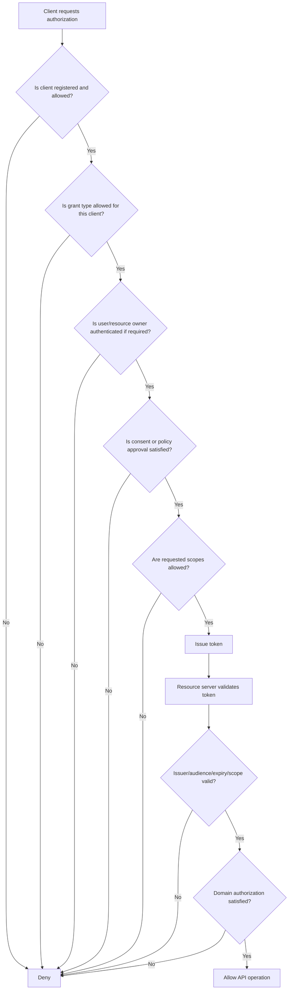
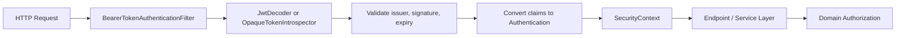

------
title: Learn Java Identity, Authentication & Authorization for Secure Enterprise API Platform - Part 007
description: OAuth 2.x mental model for Java enterprise API platforms: delegation, actors, clients, grants, scopes, resources, tokens, trust boundaries, and failure modes.
series: learn-java-identity-authentication-authorization-api-platform
seriesTitle: Learn Java Identity, Authentication & Authorization for Secure Enterprise API Platform
order: 7
partTitle: OAuth 2.x Mental Model: Delegation, Clients, Grants, Scopes, Resources
tags:
- java
- identity
- authentication
- authorization
- oauth
- api-security
- enterprise-architecture
date: 2026-06-28
---

# Part 007 — OAuth 2.x Mental Model: Delegation, Clients, Grants, Scopes, Resources

## 1. Why This Part Exists

OAuth is often implemented before it is understood.

That is dangerous.

A team can wire Spring Security, configure an identity provider, validate JWTs, and still build a platform with broken authorization semantics. The failure usually does not come from missing framework knowledge. It comes from a wrong mental model.

OAuth is not primarily a login protocol.

OAuth is a delegated authorization framework. It answers this kind of question:

> Can this client obtain limited access to this protected resource, under these conditions, possibly on behalf of this resource owner?

It does not, by itself, answer every question about human identity, session state, role governance, tenant isolation, or business authorization.

Those things can be built around OAuth, and OpenID Connect adds an identity layer for login, but OAuth itself is about controlled access delegation.

This part builds the vocabulary and model that every later part depends on.

By the end, you should be able to look at any OAuth-based system and identify:

- who the human or workload actor is,
- which client is asking for access,
- which authorization server is issuing authority,
- which resource server is enforcing access,
- which resource is being protected,
- what a token means,
- what a scope does and does not mean,
- where authentication stops and authorization begins,
- where enterprise API security often fails.

## 2. Kaufman Framing

Josh Kaufman's learning model asks us to deconstruct a skill into subskills, remove barriers, learn enough to self-correct, and practice deliberately.

For OAuth, the subskills are not just endpoint configuration.

They are:

1. **Actor modeling** — user, client, service, tenant, admin, resource owner.
2. **Trust boundary modeling** — browser, app backend, authorization server, resource server, API gateway, service mesh.
3. **Grant selection** — which flow fits which client and threat model.
4. **Token interpretation** — what claims, scopes, audiences, issuers, and expirations actually mean.
5. **Policy separation** — OAuth scope is not the same thing as business authorization.
6. **Failure diagnosis** — redirect abuse, token replay, confused deputy, excessive scopes, stale claims, wrong audience.
7. **Platform design** — how many issuers, clients, scopes, resource servers, and tenants should exist.

The performance target for this part is simple:

> Given an enterprise API scenario, you can draw the OAuth actors and flows, explain what is delegated, state what each token proves, and identify which authorization decision still has to be made by the application.

## 3. The Core Mental Model

OAuth introduces a separation between four concerns:

| Concern | Example Question | OAuth Concept |
|---|---|---|
| Who owns or controls the resource? | Who owns the account data? | Resource Owner |
| Which software is requesting access? | Which app is asking for a token? | Client |
| Who issues delegated access? | Which authority grants access tokens? | Authorization Server |
| Who protects the API/data? | Which service validates the token? | Resource Server |

The mistake many systems make is to collapse these into one vague word: “user”.

That is not precise enough.

In an enterprise platform, the token request can involve all of these at once:

- a human case officer,
- a browser session,
- a frontend application,
- a backend-for-frontend service,
- an API gateway,
- a case management service,
- a document service,
- an external identity provider,
- a tenant authority,
- a delegated admin role,
- a policy engine.

OAuth gives us a protocol vocabulary for part of that picture. It does not remove the need for domain authorization.

## 4. The OAuth Actors

### 4.1 Resource Owner

The resource owner is the entity capable of granting access to a protected resource.

In consumer examples, this is often a human user:

> Alice grants a calendar app access to read her calendar.

In enterprise systems, the resource owner can be more subtle:

- an employee granting a tool access to their profile,
- an organization granting a SaaS integration access to its tenant data,
- an administrator approving application-wide access,
- a business domain authority granting access through policy,
- a device owner authorizing a device to operate.

Do not assume resource owner always means end user.

In regulated platforms, many resources are not truly “owned” by the human actor. A case record, enforcement action, suspicious transaction report, or license application may be controlled by an agency, department, legal mandate, or workflow state. In that case, OAuth may represent delegated access to an API, but final authorization still depends on business rules.

### 4.2 Client

The client is the software application requesting access.

Examples:

- a web backend,
- a mobile app,
- a single-page app,
- a backend-for-frontend,
- a scheduled batch job,
- a partner integration,
- a CLI tool,
- a machine-to-machine service.

The client is not necessarily the user.

This distinction is critical. When a token says it was issued to `case-portal-bff`, that is a statement about the software client. When it says `sub=alice`, that is a statement about the subject. When it says `scope=case.read`, that is a statement about delegated capability. These are different dimensions.

### 4.3 Authorization Server

The authorization server authenticates relevant parties, evaluates the grant request, and issues tokens.

In real systems this could be:

- Keycloak,
- Okta,
- Microsoft Entra ID,
- Auth0,
- Ping Identity,
- Spring Authorization Server,
- a bank-grade authorization platform,
- an internal identity platform.

The authorization server owns token issuance. It does not automatically own all business authorization.

A strong authorization server can issue a valid token for `case.read`, but the case API must still decide whether this subject can read **this specific case** in **this tenant** at **this workflow state**.

### 4.4 Resource Server

The resource server hosts protected resources and validates access tokens.

In Java, this is often a Spring Boot API configured with Spring Security OAuth2 Resource Server.

A resource server must normally check:

- issuer,
- signature or introspection result,
- expiration,
- audience,
- token type,
- required scope/authority,
- tenant binding,
- domain authorization.

A common production failure is treating token validation as full authorization.

Token validation means:

> This token was issued by a trusted authority and is structurally valid for some purpose.

It does not necessarily mean:

> This caller can perform this exact business action on this exact resource.

## 5. OAuth in One Diagram

```mermaid
autonumber
sequenceDiagram
    participant RO as Resource Owner
    participant C as Client
    participant AS as Authorization Server
    participant RS as Resource Server

    RO->>C: Uses client application
    C->>AS: Requests authorization
    AS->>RO: Authenticates / obtains consent or policy approval
    AS->>C: Returns authorization grant
    C->>AS: Exchanges grant for access token
    AS->>C: Issues access token
    C->>RS: Calls API with access token
    RS->>RS: Validates token and enforces policy
    RS->>C: Returns protected resource
```

This is the conceptual model. Real flows add redirects, PKCE, client authentication, refresh tokens, device codes, browser cookies, gateways, and service-to-service tokens.

But the core stays the same:

- A client does not get arbitrary access.
- Access is granted through an authorization server.
- The resource server must validate and enforce.
- The token is a constrained artifact, not a universal passport.

## 6. OAuth Is Not Login

This is the first serious conceptual trap.

OAuth answers delegated access questions.

OpenID Connect answers login and identity questions on top of OAuth.

A pure OAuth access token is meant for a resource server, not for the client to treat as a user profile. The access token may identify a subject, but the protocol's purpose is API access.

Bad question:

> How do I login users with OAuth access tokens?

Better question:

> Which identity layer authenticates the user, and which OAuth token authorizes access to which API?

In enterprise systems, login usually involves:

- browser session,
- identity provider authentication,
- optional MFA,
- OIDC ID token,
- application session,
- OAuth access token for APIs,
- domain authorization inside APIs.

Do not collapse all of that into “the JWT”.

## 7. Grant Type as a Delegation Shape

A grant type describes how a client obtains authorization.

Think of a grant type as a pattern of trust transfer.

| Grant / Flow | Typical Use | Human Present? | Client Can Keep Secret? | Notes |
|---|---:|---:|---:|---|
| Authorization Code + PKCE | Web, mobile, SPA/BFF | Yes | Public or confidential | Modern default for interactive users. |
| Client Credentials | Machine-to-machine | No | Usually yes | Represents client itself, not a user. |
| Device Authorization | TV/CLI/device with limited input | Yes, out-of-band | Usually public | Good for constrained devices. |
| Refresh Token | Renew access after initial grant | Not always | Depends | Must be protected and rotated where appropriate. |
| Token Exchange | Service delegation / impersonation / downscoping | Depends | Usually confidential | Useful for internal platform propagation. |
| Implicit | Legacy browser flow | Yes | Public | Avoid for modern systems. |
| Resource Owner Password Credentials | Direct password sharing | Yes | Client sees password | Avoid; breaks IdP boundary and MFA/federation patterns. |

The wrong grant type often creates an architectural flaw that cannot be fixed by a small code patch later.

For example:

- using client credentials when you actually need user accountability loses user context,
- using user tokens for batch jobs creates ghost-user behavior,
- using a SPA to hold long-lived refresh tokens increases browser compromise impact,
- using ROPC prevents normal federation, phishing resistance, and step-up flows.

## 8. Access Token

An access token is a credential used by a client to access a protected resource.

It is not automatically:

- a login session,
- a user profile,
- a permission list,
- a domain authorization decision,
- a tenant isolation guarantee,
- an audit record.

It may contain or reference information useful for those concerns, but the system must define that meaning explicitly.

### 8.1 Access Token as Bearer Credential

Most OAuth deployments use bearer tokens.

A bearer token means:

> Whoever possesses the token can use it, unless additional sender-constraining is applied.

This makes token leakage serious.

Bearer token systems must be designed around:

- short access token lifetime,
- TLS everywhere,
- no token logging,
- audience restriction,
- least-privilege scopes,
- secure browser storage strategy,
- refresh token protection,
- incident revocation strategy.

### 8.2 JWT Access Token

A JWT access token is self-contained. The resource server can validate it locally using issuer metadata and signing keys.

Strengths:

- low latency,
- no introspection call per request,
- works well in distributed systems,
- useful for high-volume APIs.

Risks:

- revocation is harder,
- claims can become stale,
- token size can grow,
- every resource server must validate correctly,
- key rotation must be operationally sound,
- wrong audience validation can cause cross-API token reuse.

### 8.3 Opaque Access Token

An opaque token has no useful meaning to the client or resource server without introspection.

Strengths:

- central revocation is easier,
- token contents are not exposed to clients,
- policy can be centralized at introspection time,
- smaller token value.

Risks:

- resource server depends on introspection availability,
- latency can increase,
- caching must be carefully designed,
- introspection response becomes another trust boundary.

### 8.4 Mental Model

JWT is not “more secure” by default.

Opaque token is not “more secure” by default.

They optimize different operational and security trade-offs.

The correct question is:

> Where should the authorization facts live, how quickly must revocation take effect, how much latency can the API tolerate, and how much policy freshness is required?

## 9. Refresh Token

A refresh token is used to obtain new access tokens without repeating the full authorization interaction.

It is more sensitive than an access token in many systems because it may allow long-lived access.

A refresh token should be treated as a high-value credential.

Design questions:

- Who can receive refresh tokens?
- Are refresh tokens rotated?
- Is reuse detected?
- Are they sender-constrained?
- Are they bound to client, tenant, device, or session?
- What happens when user risk changes?
- What happens after password reset, MFA reset, account disablement, or employee termination?

A platform that treats refresh tokens as harmless convenience artifacts is usually one incident away from persistent unauthorized access.

## 10. Scope

Scope is one of the most misunderstood OAuth concepts.

A scope is a string representing a requested and granted access boundary.

Examples:

```text
case.read
case.write
document.read
document.upload
payment.initiate
profile.email
```

A scope should answer:

> What coarse capability did the authorization server grant to this client for this resource server?

A scope should not usually encode every object-level rule.

Bad scope design:

```text
case.123456.read
case.123457.read
case.123458.read
case.123459.read
```

This pushes domain authorization into token issuance and creates scope explosion.

Better model:

```text
scope = case.read
claim tenant_id = regulator-sg
subject = officer-123
resource server checks: can officer-123 read case 123456 in tenant regulator-sg?
```

### 10.1 Scope Is Not Role

Role describes a subject's organizational or application responsibility.

Scope describes delegated access granted to a client.

They may be related, but they are not the same thing.

For example:

```text
role = CASE_SUPERVISOR
scope = case.read case.assign
```

The authorization server may issue scopes based on roles, but the resource server still must evaluate resource-specific rules.

### 10.2 Scope Is Not Permission Matrix

A production authorization model often contains:

- role,
- scope,
- tenant,
- resource ownership,
- workflow state,
- assignment,
- legal basis,
- delegation,
- data classification,
- step-up assurance,
- temporal condition,
- emergency access mode.

Do not force all of that into `scope`.

Scope should stay coarse enough to be stable and understandable, but specific enough to prevent overbroad tokens.

## 11. Audience

Audience identifies the intended recipient of the token.

In enterprise API platforms, audience validation is not optional.

Without audience validation, a token issued for Service A may be replayed to Service B.

Example:

```json
{
  "iss": "https://id.example.gov",
  "sub": "officer-123",
  "aud": "case-api",
  "scope": "case.read"
}
```

The `case-api` resource server should accept this token.

The `payment-api` resource server should not.

A token that says `aud=case-api` is not a generic enterprise API token.

### 11.1 Audience Design Options

| Design | Description | Trade-off |
|---|---|---|
| One audience per API | `case-api`, `document-api`, `payment-api` | Strong boundary; more client config. |
| One audience per API group | `regulatory-platform-api` | Simpler; weaker service isolation. |
| Gateway-only audience | `api-gateway` | Works if gateway exchanges token downstream; dangerous if services trust gateway-intended token directly. |
| Internal token exchange | External token exchanged for service-specific internal token | Strong isolation; more platform complexity. |

For high-value systems, prefer service-specific audience or gateway token exchange patterns.

## 12. Issuer

Issuer identifies who issued the token.

A resource server must only accept tokens from trusted issuers.

In multi-tenant platforms, issuer strategy matters.

Options:

| Issuer Model | Example | Pros | Cons |
|---|---|---|---|
| Single issuer, tenant claim | `https://id.example.com` + `tenant_id` | Simple operations | Tenant isolation depends on claims and app checks. |
| Issuer per tenant | `https://id.example.com/t/{tenant}` | Stronger isolation | More config and key management. |
| External issuers federated | Customer IdPs | Flexible enterprise federation | Complex trust mapping and claim normalization. |
| Broker issuer | Internal IdP normalizes external identities | Consistent tokens | Broker becomes critical security component. |

A resource server that accepts “any token signed by a known key” without validating issuer semantics is unsafe.

## 13. Subject

Subject identifies the authenticated entity represented by the token.

But the shape of `sub` depends on the grant:

| Flow | Subject Meaning |
|---|---|
| Authorization Code | Usually human user subject. |
| Client Credentials | Usually client/service subject. |
| Token Exchange | May represent original subject, actor, or delegated subject. |
| Device Flow | Human subject after out-of-band approval. |

In Java domain models, avoid assuming `sub` always maps to `User.id`.

Better internal representation:

```java
public sealed interface AuthenticatedSubject
        permits HumanSubject, ServiceSubject, DelegatedSubject {
    String subjectId();
    String issuer();
    String tenantId();
}

public record HumanSubject(
        String subjectId,
        String issuer,
        String tenantId,
        String assuranceLevel
) implements AuthenticatedSubject {}

public record ServiceSubject(
        String subjectId,
        String issuer,
        String tenantId,
        String clientId
) implements AuthenticatedSubject {}

public record DelegatedSubject(
        String subjectId,
        String issuer,
        String tenantId,
        String actorClientId,
        String delegationId
) implements AuthenticatedSubject {}
```

This avoids writing business logic that accidentally treats a machine token as a human officer.

## 14. Client Type

OAuth distinguishes between clients that can keep secrets and clients that cannot.

### 14.1 Confidential Client

A confidential client can protect credentials.

Examples:

- server-side web app,
- backend-for-frontend,
- internal service,
- scheduled job,
- partner backend integration.

Confidential clients can use client authentication such as:

- client secret,
- private key JWT,
- mutual TLS,
- platform-managed workload identity.

### 14.2 Public Client

A public client cannot keep a secret.

Examples:

- SPA,
- mobile app,
- desktop app,
- CLI distributed to users.

A client secret embedded in a public client is not a secret. It is extractable.

Public clients rely on flow protections like PKCE and redirect URI validation, not on hidden secrets.

## 15. Client Identity vs User Identity

This is one of the most important enterprise distinctions.

A request can have:

- a user identity,
- a client identity,
- a device identity,
- a tenant identity,
- a workload identity,
- a delegation identity.

For example:

```text
User: officer-123
Client: case-portal-bff
Tenant: regulator-sg
Device: managed-laptop-9ab3
Session: web-session-7788
Scopes: case.read case.comment
AAL: aal2
```

The resource server should not flatten this into:

```text
currentUser = officer-123
```

That loses context required for audit, authorization, incident response, and adaptive controls.

## 16. Consent vs Policy Approval

OAuth examples often talk about consent:

> Alice grants PhotoPrinter access to her photos.

Enterprise systems often do not work like this.

A regulator, bank, hospital, or enterprise platform may use policy approval instead:

- admin consent,
- pre-authorized clients,
- contractual integration approval,
- tenant admin approval,
- dynamic client registration review,
- entitlement governance,
- workflow-based delegation.

The authorization server may skip end-user consent because policy already allows the client.

That does not mean the platform has no authorization. It means authorization moved from a consent screen to governance and policy.

## 17. Protected Resource

A protected resource is not just an endpoint.

It is the thing access is actually about.

Examples:

- `/cases/{caseId}` endpoint,
- the case aggregate behind that endpoint,
- attached documents,
- enforcement decision history,
- investigation notes,
- personally identifiable information,
- cross-tenant analytics data.

Endpoint-level security is necessary but insufficient.

A request to `GET /cases/123` must pass:

1. protocol validation,
2. token validation,
3. scope check,
4. tenant check,
5. object-level authorization,
6. field-level authorization if data is sensitive,
7. audit logging.

## 18. Resource Indicator and API Boundary

In simple OAuth examples, the client asks for a token and later uses it against an API.

In real platforms, the client may need tokens for multiple APIs.

A good design defines token audience/resource boundaries intentionally.

Example:

```text
case-api       -> case.read case.write case.assign
document-api   -> document.read document.upload document.delete
reporting-api  -> report.run report.export
admin-api      -> tenant.admin user.admin entitlement.review
```

Avoid generic mega-scopes like:

```text
api.access
platform.user
full_access
```

They are easy to implement and hard to defend.

## 19. OAuth Decision Chain

A useful way to reason about OAuth is as a chain of decisions.



Notice that domain authorization happens after token validation.

A token can be valid and still insufficient.

## 20. Enterprise Example: Regulatory Case Platform

Suppose we have a case management platform.

Actors:

- Case Officer,
- Supervisor,
- Enforcement Director,
- External Agency Analyst,
- Partner System,
- Batch Reconciliation Job.

APIs:

- Case API,
- Document API,
- Notification API,
- Audit API,
- Reporting API.

Clients:

- Case Portal BFF,
- Public Submission SPA,
- Partner Integration Backend,
- Internal Batch Job,
- Mobile Inspection App.

A single “OAuth integration” is not enough.

Each client should have explicit registration:

```yaml
clients:
  case-portal-bff:
    type: confidential
    grants:
      - authorization_code
      - refresh_token
    scopes:
      - case.read
      - case.write
      - document.read
      - document.upload
    audiences:
      - case-api
      - document-api

  partner-agency-api-client:
    type: confidential
    grants:
      - client_credentials
    scopes:
      - case.external-read
    audiences:
      - case-api

  mobile-inspection-app:
    type: public
    grants:
      - authorization_code
      - refresh_token
    pkce: required
    scopes:
      - inspection.read
      - inspection.submit
    audiences:
      - inspection-api
```

Then the Case API still enforces object-level rules:

```java
public CaseDetails getCase(CaseId caseId, AuthContext auth) {
    CaseRecord record = caseRepository.requireById(caseId);

    authorization.require(
            auth,
            Action.CASE_READ,
            Resource.caseRecord(record.id(), record.tenantId(), record.classification()),
            Context.current()
    );

    return caseMapper.toDetails(record, auth);
}
```

The OAuth token gets the request to the gate.

The domain policy decides whether the gate opens for this resource.

## 21. Spring Security Resource Server Mental Model

At the Java resource server layer, OAuth is usually represented as an authenticated principal.

A simplified Spring Security path:



Do not stop at `SecurityContext`.

`Authentication.isAuthenticated()` means the framework accepted the credential. It does not mean your domain action is allowed.

Example mapping:

```java
public record AuthContext(
        String issuer,
        String subject,
        String clientId,
        String tenantId,
        Set<String> scopes,
        Set<String> roles,
        String audience,
        Instant authenticatedAt,
        String assuranceLevel
) {}
```

This `AuthContext` becomes the boundary object passed into domain authorization.

## 22. Scope Mapping in Spring

Spring commonly maps scopes to authorities with the `SCOPE_` prefix.

Example:

```text
scope: case.read document.upload
```

becomes:

```text
SCOPE_case.read
SCOPE_document.upload
```

Controller-level check:

```java
@PreAuthorize("hasAuthority('SCOPE_case.read')")
@GetMapping("/cases/{caseId}")
public CaseDetails getCase(@PathVariable String caseId) {
    return caseService.getCase(new CaseId(caseId));
}
```

This is useful but incomplete.

A better pattern is layered:

```java
@PreAuthorize("hasAuthority('SCOPE_case.read')")
@GetMapping("/cases/{caseId}")
public CaseDetails getCase(@PathVariable String caseId) {
    return caseService.getCase(new CaseId(caseId), AuthContext.current());
}
```

Then the service checks object-level rules.

## 23. OAuth Boundary Invariants

A secure enterprise OAuth integration should maintain these invariants:

1. **No unknown issuer** — every accepted token must come from an explicitly trusted issuer.
2. **No missing audience check** — every resource server must verify intended audience.
3. **No token-as-session confusion** — access tokens are API credentials, not browser sessions.
4. **No scope-as-domain-auth confusion** — scope gates API capability, not object-specific permission.
5. **No public-client secret assumption** — secrets in SPAs/mobile apps are not secrets.
6. **No cross-tenant token acceptance without tenant validation** — tenant context must be explicit and enforced.
7. **No refresh token casual handling** — refresh tokens are high-value credentials.
8. **No generic super-scope** — avoid `api.access`, `full_access`, and uncontrolled wildcard scopes.
9. **No client/user flattening** — log and enforce both where relevant.
10. **No token logging** — tokens must never appear in application logs, traces, crash reports, or analytics payloads.

## 24. Common Misunderstandings

### 24.1 “We Use OAuth, So Authorization Is Solved”

No.

OAuth gives a framework for delegated API access. Your system still needs domain authorization.

### 24.2 “JWT Means Stateless and Simple”

JWT can reduce server lookups, but it moves correctness burden to every resource server.

Every resource server must validate issuer, signature, expiration, audience, and claims consistently.

### 24.3 “Scope Is the Same as Permission”

Scope is usually coarser than application permission.

For example, `case.read` does not answer whether the user can read case `C-2026-00017`.

### 24.4 “Client Credentials Means a Service Acts as Any User”

No.

Client credentials represents the client itself. If a system needs user delegation, use a flow or token exchange pattern that preserves user context and auditability.

### 24.5 “The API Gateway Already Validated the Token”

Good, but not enough.

Downstream services still need a trustworthy security context. Depending on architecture, this may mean validating tokens again, accepting signed internal headers, using token exchange, or relying on service mesh identity. Blindly trusting headers from the network is fragile.

## 25. Failure Modes

### 25.1 Valid Token, Wrong API

A token issued for `profile-api` is accepted by `payment-api` because audience was not checked.

Impact:

- cross-service token replay,
- privilege confusion,
- weak service boundary.

Prevention:

- mandatory audience validation,
- API-specific token issuance,
- resource indicators or token exchange.

### 25.2 Valid Token, Wrong Tenant

A token contains `tenant_id=A`, but the request path says `/tenants/B/cases/123`.

Impact:

- tenant escape,
- regulatory breach,
- data confidentiality failure.

Prevention:

- tenant context must come from trusted token/session, not only from request path,
- compare route tenant and token tenant,
- enforce tenant predicates in queries.

### 25.3 Valid Token, Wrong Object

A user has `case.read`, but reads another officer's restricted case.

Impact:

- BOLA/IDOR,
- internal data leakage,
- audit breach.

Prevention:

- object-level authorization,
- resource ownership checks,
- assignment/workflow checks,
- negative authorization tests.

### 25.4 Valid Token, Stale Claims

User was removed from a privileged role, but the access token still contains old role claims.

Impact:

- delayed revocation,
- unauthorized privileged action.

Prevention:

- short-lived access tokens,
- introspection for high-risk APIs,
- policy lookup for critical decisions,
- event-driven session/token revocation.

### 25.5 Valid Token, Wrong Actor Semantics

A service token is treated as if it represents a human user.

Impact:

- audit falsehood,
- missing accountability,
- privilege escalation.

Prevention:

- distinguish human, service, and delegated subjects,
- require actor type in auth context,
- deny human-only actions for service subjects.

## 26. Review Checklist

Use this during design review.

### Actors

- [ ] Have we identified resource owner, client, authorization server, and resource server?
- [ ] Do we distinguish user identity from client identity?
- [ ] Do we distinguish human, service, and delegated subjects?
- [ ] Do we model tenant identity explicitly?

### Tokens

- [ ] Is issuer validation explicit?
- [ ] Is audience validation explicit?
- [ ] Are scopes minimal and stable?
- [ ] Are token lifetimes appropriate?
- [ ] Are refresh tokens protected and rotated where needed?
- [ ] Are tokens excluded from logs and traces?

### Authorization

- [ ] Does the API enforce object-level authorization?
- [ ] Are tenant predicates applied at query boundary?
- [ ] Are scopes separated from domain permissions?
- [ ] Are critical decisions based on fresh enough facts?

### Clients

- [ ] Is each client registered with only allowed grant types?
- [ ] Are public clients treated as unable to keep secrets?
- [ ] Are redirect URIs exact and controlled?
- [ ] Are machine clients not confused with user delegation?

### Operations

- [ ] Is key rotation handled?
- [ ] Is issuer metadata cached safely?
- [ ] Is authorization failure observable?
- [ ] Is token compromise response defined?

## 27. Practice Drill

Take this scenario:

> A case officer uses a browser-based case portal to view enforcement cases. The portal calls a BFF. The BFF calls Case API and Document API. The user can only see cases assigned to their unit. Supervisors can see all cases in their unit. External agency users can see only cases explicitly shared with their agency. Documents classified as restricted require step-up authentication.

Draw:

1. OAuth actors.
2. Client registrations.
3. Token audiences.
4. Scopes.
5. Claims needed by APIs.
6. Domain authorization checks.
7. Failure cases.

Expected high-level answer:

```text
Client: case-portal-bff
Grant: authorization_code + PKCE
Audiences: case-api, document-api or token exchange per API
Scopes: case.read, document.read
Claims: sub, tenant_id, unit_id, roles, aal, client_id
Case API check: assignment/unit/share policy
Document API check: case access + document classification + aal requirement
```

The key insight:

> OAuth gives the BFF an access token. It does not decide whether case C-123 belongs to the user's unit or whether document D-9 requires step-up.

## 28. Summary

OAuth is a delegated authorization framework.

A mature Java engineer should not think of it as “JWT login”.

The essential model is:

- resource owner controls or is associated with resource access,
- client requests limited access,
- authorization server issues constrained tokens,
- resource server validates tokens,
- application/domain layer enforces business authorization.

The main production lesson:

> Valid token is not equal to allowed action.

That sentence should shape every API security design review.

## References

- RFC 6749 — The OAuth 2.0 Authorization Framework: https://datatracker.ietf.org/doc/html/rfc6749
- RFC 6750 — The OAuth 2.0 Authorization Framework: Bearer Token Usage: https://datatracker.ietf.org/doc/html/rfc6750
- RFC 7636 — Proof Key for Code Exchange by OAuth Public Clients: https://datatracker.ietf.org/doc/html/rfc7636
- RFC 9700 — Best Current Practice for OAuth 2.0 Security: https://datatracker.ietf.org/doc/html/rfc9700
- OAuth 2.0 for Browser-Based Applications draft: https://datatracker.ietf.org/doc/draft-ietf-oauth-browser-based-apps/
- Spring Security OAuth2 Resource Server Reference: https://docs.spring.io/spring-security/reference/servlet/oauth2/resource-server/index.html
- OWASP API Security Top 10 2023: https://owasp.org/API-Security/editions/2023/en/0x11-t10/
