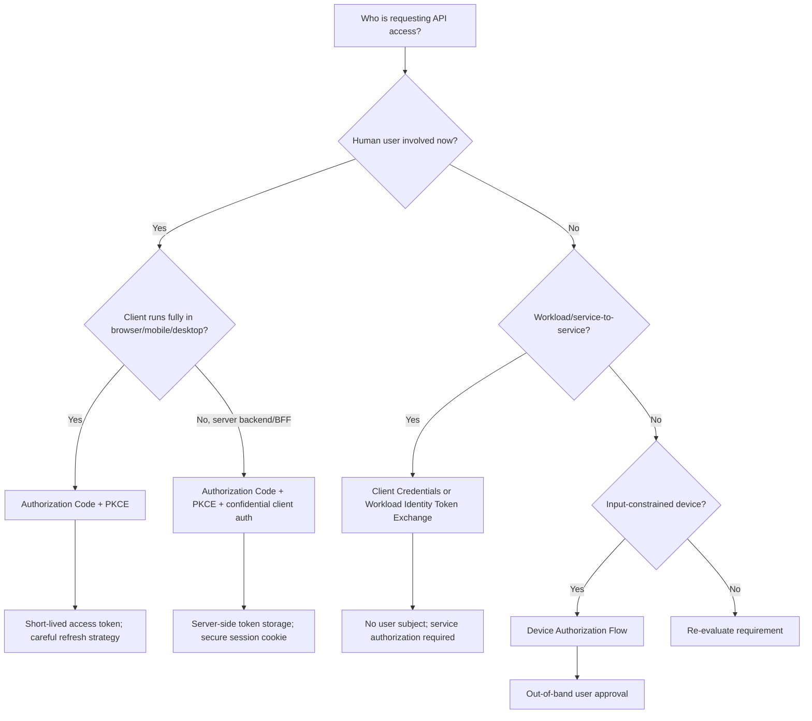
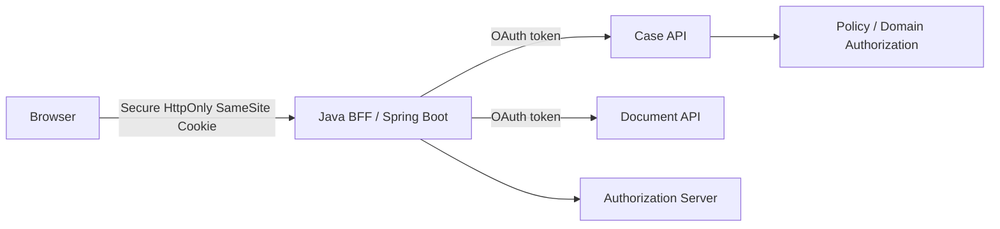
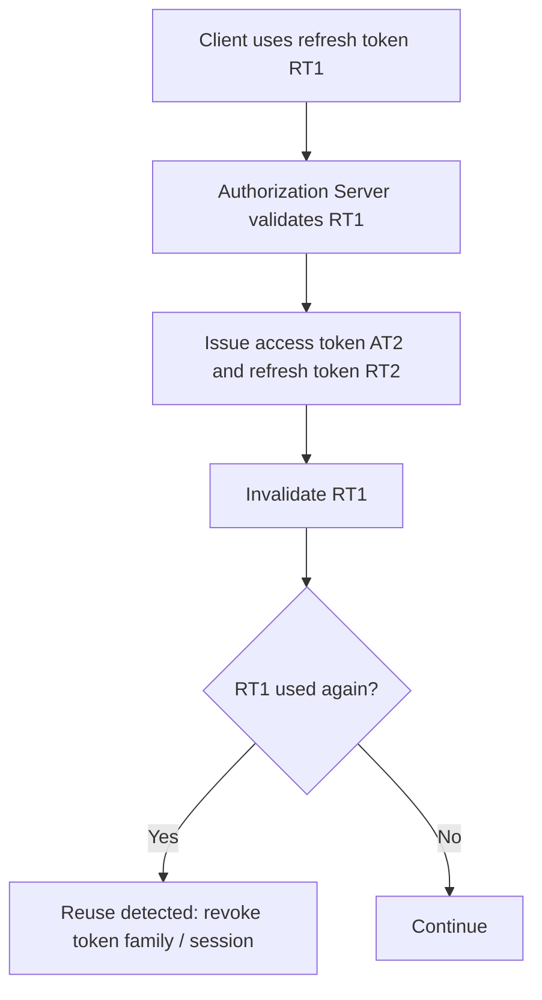

------
title: Learn Java Identity, Authentication & Authorization for Secure Enterprise API Platform - Part 008
description: Secure OAuth 2.x flow selection and implementation patterns for Java enterprise systems: Authorization Code with PKCE, Client Credentials, Device Flow, refresh token rotation, and deprecated flows.
series: learn-java-identity-authentication-authorization-api-platform
seriesTitle: Learn Java Identity, Authentication & Authorization for Secure Enterprise API Platform
order: 8
partTitle: Secure OAuth Flows for Enterprise Platforms
tags:
- java
- identity
- authentication
- authorization
- oauth
- pkce
- spring-security
- api-security
date: 2026-06-28
---

# Part 008 — Secure OAuth Flows for Enterprise Platforms

## 1. Why This Part Exists

Part 007 established the OAuth mental model.

Now we choose secure flows.

This is not a framework configuration exercise. Flow choice is an architectural decision. Once the wrong flow is embedded into clients, mobile apps, partner integrations, browser storage, and operational runbooks, changing it later becomes expensive.

OAuth security failures often start from one of these mistakes:

- using a browser flow that exposes tokens in front-channel redirects,
- using client credentials when user accountability is required,
- letting SPAs store long-lived tokens carelessly,
- allowing broad redirect URI patterns,
- issuing refresh tokens without rotation or reuse detection,
- using the Resource Owner Password Credentials flow because it feels simple,
- assuming PKCE replaces client authentication,
- treating all clients as equally trustworthy.

This part gives a production-grade decision model.

## 2. Kaufman Skill Target

The practical target:

> Given a client type, trust boundary, user interaction model, and API risk level, you can choose the correct OAuth flow, reject unsafe flows, define required controls, and implement the Java/Spring side without weakening the protocol.

The subskills:

1. classify the client,
2. classify the actor,
3. identify whether user presence is required,
4. decide whether the client can keep secrets,
5. choose the grant,
6. apply mandatory flow hardening,
7. define token lifetime and refresh behavior,
8. enforce redirect and audience boundaries,
9. test negative cases,
10. write runbook checks.

## 3. Flow Selection Decision Tree



If you cannot classify the actor and client, do not start implementation.

## 4. Secure Flow Summary

| Scenario | Recommended Flow | Why |
|---|---|---|
| Server-rendered web app | Authorization Code + PKCE | User login/consent with back-channel token exchange. |
| Backend-for-frontend | Authorization Code + PKCE + confidential client auth | Browser holds session cookie; BFF protects tokens. |
| Mobile app | Authorization Code + PKCE | Public client; PKCE protects authorization code interception. |
| SPA | Authorization Code + PKCE, preferably with BFF for high-risk apps | Avoid implicit flow; reduce browser token exposure. |
| Service-to-service | Client Credentials, mTLS/private_key_jwt/workload identity where possible | No user present; client acts as itself. |
| CLI or TV device | Device Authorization Flow | User authorizes via separate browser-capable device. |
| Delegated service call | Token Exchange / on-behalf-of pattern | Preserve actor and downscope token. |
| Legacy password form calling IdP directly | Avoid ROPC | Client should not collect user password. |
| Browser redirect returning access token directly | Avoid implicit | Access token exposed to front channel/browser history/referrer risks. |

## 5. Authorization Code + PKCE

Authorization Code + PKCE is the modern default for interactive OAuth clients.

It separates browser front-channel authorization from back-channel token exchange.

### 5.1 Flow

```mermaid
autonumber
sequenceDiagram
    participant U as User
    participant B as Browser
    participant C as Client
    participant AS as Authorization Server
    participant RS as Resource Server

    U->>B: Opens client app
    C->>C: Generate code_verifier and code_challenge
    C->>B: Redirect to authorization endpoint
    B->>AS: authorization request + code_challenge + state + redirect_uri
    AS->>U: Authenticate / consent / policy approval
    AS->>B: Redirect back with authorization code + state
    B->>C: Sends code to client redirect endpoint
    C->>AS: Token request with code + code_verifier + client auth if confidential
    AS->>AS: Validate code and PKCE binding
    AS->>C: Access token, optional refresh token
    C->>RS: API request with access token
```

### 5.2 Why PKCE Exists

PKCE protects against authorization code interception.

The client creates a high-entropy `code_verifier`, derives a `code_challenge`, sends only the challenge in the authorization request, and later proves possession of the verifier at the token endpoint.

If an attacker steals the authorization code but lacks the verifier, the code exchange fails.

### 5.3 PKCE Is Not Client Authentication

This is important.

PKCE proves that the same client instance that started the authorization request is redeeming the code.

It does not prove that the client is a confidential backend with a protected secret.

For confidential clients, use PKCE **and** client authentication.

For public clients, use PKCE because there is no reliable client secret.

## 6. Authorization Request Controls

A secure authorization request should include strict controls.

Example:

```http
GET /oauth2/authorize?
  response_type=code&
  client_id=case-portal-bff&
  redirect_uri=https%3A%2F%2Fportal.example.gov%2Flogin%2Foauth2%2Fcode%2Fcase&
  scope=openid%20case.read%20document.read&
  state=af0ifjsldkj&
  nonce=n-0S6_WzA2Mj&
  code_challenge=E9Melhoa2OwvFrEMTJguCHaoeK1t8URWbuGJSstw-cM&
  code_challenge_method=S256
Host: id.example.gov
```

| Parameter | Required? | Purpose |
|---|---:|---|
| `response_type=code` | Yes | Use authorization code flow. |
| `client_id` | Yes | Identifies registered client. |
| `redirect_uri` | Yes | Must match registered URI exactly. |
| `scope` | Usually | Requested access boundary. |
| `state` | Yes | CSRF and request correlation. |
| `nonce` | OIDC | ID token replay binding; mostly OIDC-specific. |
| `code_challenge` | Yes for PKCE | Binds code to verifier. |
| `code_challenge_method=S256` | Yes | Avoid plain method except unavoidable legacy. |

### 6.1 Redirect URI Rules

Redirect URI handling is a major security boundary.

Required controls:

- register exact redirect URIs,
- do not allow open wildcards,
- do not allow arbitrary query-based redirect targets,
- use HTTPS for production,
- separate dev/staging/prod clients,
- avoid shared redirect URI for unrelated clients,
- validate redirect URI before user authentication when possible,
- never redirect authorization codes to untrusted domains.

Bad:

```text
https://*.example.com/callback
https://example.com/oauth/callback?next={anything}
http://localhost/* for production client
```

Better:

```text
https://portal.example.gov/login/oauth2/code/case-portal
https://admin.example.gov/login/oauth2/code/admin-console
http://127.0.0.1:49152/callback for local native app with loopback rules only
```

### 6.2 State Rules

`state` protects against CSRF and response mix-up in client handling.

A good `state` value is:

- unpredictable,
- bound to the user's browser session,
- single-use,
- expired quickly,
- validated before code exchange,
- not overloaded with sensitive data.

If you need to preserve return location, store it server-side and reference it with state.

Do not put sensitive return state directly in the URL.

## 7. Token Request Controls

The token request should happen over a back channel.

Example:

```http
POST /oauth2/token HTTP/1.1
Host: id.example.gov
Content-Type: application/x-www-form-urlencoded
Authorization: Basic base64(client_id:client_secret)

grant_type=authorization_code&
code=SplxlOBeZQQYbYS6WxSbIA&
redirect_uri=https%3A%2F%2Fportal.example.gov%2Flogin%2Foauth2%2Fcode%2Fcase&
code_verifier=dBjftJeZ4CVP-mB92K27uhbUJU1p1r_wW1gFWFOEjXk
```

The authorization server must check:

- authorization code exists,
- code is not expired,
- code is single-use,
- code belongs to client,
- redirect URI matches,
- PKCE verifier matches original challenge,
- client authentication is valid if client is confidential,
- requested scopes/audiences were approved.

## 8. Spring Boot: OAuth2 Login + BFF Direction

For browser-facing enterprise apps, a Backend-for-Frontend is often safer than letting a SPA hold tokens directly.

The browser stores only a secure session cookie. The BFF stores tokens server-side or obtains API tokens as needed.

### 8.1 Conceptual Architecture



The browser does not need direct access to the access token.

### 8.2 Spring Security Shape

```java
@Configuration
@EnableWebSecurity
class WebSecurityConfig {

    @Bean
    SecurityFilterChain web(HttpSecurity http) throws Exception {
        return http
                .authorizeHttpRequests(auth -> auth
                        .requestMatchers("/assets/**", "/health").permitAll()
                        .anyRequest().authenticated()
                )
                .oauth2Login(oauth2 -> oauth2
                        .loginPage("/oauth2/authorization/case-portal")
                )
                .oauth2Client(Customizer.withDefaults())
                .csrf(Customizer.withDefaults())
                .sessionManagement(session -> session
                        .sessionFixation(SessionManagementConfigurer.SessionFixationConfigurer::migrateSession)
                )
                .build();
    }
}
```

The BFF then uses an authorized client manager to call APIs.

```java
@Service
class CaseApiClient {

    private final WebClient webClient;

    CaseApiClient(WebClient webClient) {
        this.webClient = webClient;
    }

    Mono<CaseSummary> getCase(String caseId) {
        return webClient.get()
                .uri("https://case-api.internal/cases/{caseId}", caseId)
                .retrieve()
                .bodyToMono(CaseSummary.class);
    }
}
```

The exact Spring configuration depends on whether you use Servlet or Reactive stack, how authorized clients are stored, and whether tokens are exchanged at the gateway or BFF layer.

The important architecture point remains:

> Browser session and API access token are different credentials with different storage and risk properties.

## 9. SPA Without BFF

A pure SPA is a public client.

It cannot keep a client secret.

Modern SPA guidance uses Authorization Code + PKCE instead of implicit flow, but the remaining challenge is token storage in the browser.

Risk factors:

- XSS can steal tokens from JavaScript-accessible storage,
- browser extensions may inspect data,
- refresh tokens in browser increase persistence risk,
- silent renew patterns can become fragile with browser privacy changes,
- CORS misconfiguration can widen impact.

Controls:

- prefer BFF for high-risk enterprise apps,
- avoid localStorage for high-value long-lived tokens,
- use short-lived access tokens,
- use refresh token rotation if refresh tokens are issued,
- apply strict CSP,
- minimize third-party scripts,
- harden dependency supply chain,
- use exact redirect URIs,
- keep scopes narrow,
- consider DPoP/sender-constrained direction where supported.

For regulated internal platforms, SPA + BFF is usually easier to defend than SPA-only token handling.

## 10. Client Credentials Flow

Client Credentials is for machine-to-machine access.

It represents the client itself.

It does not represent a human user.

### 10.1 Flow

```mermaid
autonumber
sequenceDiagram
    participant C as Client Service
    participant AS as Authorization Server
    participant RS as Resource Server

    C->>AS: Token request with client authentication
    AS->>AS: Validate client and allowed scopes
    AS->>C: Access token
    C->>RS: API request with access token
    RS->>RS: Validate token, audience, scope, service policy
    RS->>C: Response
```

### 10.2 Token Request

```http
POST /oauth2/token HTTP/1.1
Host: id.example.gov
Content-Type: application/x-www-form-urlencoded
Authorization: Basic base64(reconciliation-job:secret)

grant_type=client_credentials&scope=case.reconcile
```

### 10.3 Client Authentication Options

| Method | Suitable For | Notes |
|---|---|---|
| Client secret basic | Simple confidential clients | Easy but secret rotation burden. |
| Client secret post | Usually avoid if possible | Secret appears in body; more logging risk. |
| Private key JWT | Enterprise backends | Better rotation and asymmetric proof. |
| Mutual TLS | High-assurance service clients | Strong sender binding; operational certificate complexity. |
| Workload identity / SPIFFE | Internal platform services | Secretless direction; requires platform investment. |

### 10.4 Java Service Client Example

```java
@Configuration
class OAuthClientConfig {

    @Bean
    WebClient serviceWebClient(
            ClientRegistrationRepository registrations,
            OAuth2AuthorizedClientService clientService
    ) {
        OAuth2AuthorizedClientManager manager = authorizedClientManager(registrations, clientService);

        ServletOAuth2AuthorizedClientExchangeFilterFunction oauth =
                new ServletOAuth2AuthorizedClientExchangeFilterFunction(manager);
        oauth.setDefaultClientRegistrationId("reconciliation-job");

        return WebClient.builder()
                .apply(oauth.oauth2Configuration())
                .build();
    }

    private OAuth2AuthorizedClientManager authorizedClientManager(
            ClientRegistrationRepository registrations,
            OAuth2AuthorizedClientService clientService
    ) {
        OAuth2AuthorizedClientProvider provider = OAuth2AuthorizedClientProviderBuilder.builder()
                .clientCredentials()
                .build();

        var manager = new AuthorizedClientServiceOAuth2AuthorizedClientManager(
                registrations,
                clientService
        );
        manager.setAuthorizedClientProvider(provider);
        return manager;
    }
}
```

Design caution:

> Never use client credentials to perform actions that legally or operationally require human accountability unless the action is explicitly a system action and audit reflects that.

## 11. Device Authorization Flow

Device Authorization Flow is useful when the client has limited input capability.

Examples:

- CLI tool,
- smart TV,
- terminal device,
- industrial device,
- kiosk-like tool.

### 11.1 Flow

```mermaid
autonumber
sequenceDiagram
    participant D as Device/CLI
    participant AS as Authorization Server
    participant U as User Browser

    D->>AS: Device authorization request
    AS->>D: device_code, user_code, verification_uri
    D->>U: Show user_code and verification URI
    U->>AS: Opens URI and enters code
    AS->>U: Authenticates user and approves
    D->>AS: Poll token endpoint with device_code
    AS->>D: Access token when approved
```

### 11.2 Controls

- device code must expire,
- user code must be high entropy enough for its lifetime,
- polling interval must be enforced,
- authorization server should rate-limit verification attempts,
- device should not receive token before approval,
- scopes must be limited,
- high-risk actions may require step-up.

Device flow is not a workaround for insecure browser flows. It is for constrained devices.

## 12. Refresh Token Rotation

Refresh tokens are long-lived capability artifacts.

Rotation reduces damage from token theft.

### 12.1 Rotation Model



### 12.2 Reuse Detection

If RT1 is used after RT2 was issued, one of two things happened:

- client retry/race condition,
- token theft.

For high-value systems, treat reuse as compromise until proven otherwise.

Actions:

- revoke token family,
- terminate session,
- require re-authentication,
- notify user or security operations,
- log incident event,
- preserve evidence.

### 12.3 Refresh Token Design Fields

A refresh token record should track:

```text
refresh_token_id
client_id
subject_id
tenant_id
session_id
device_id
issued_at
expires_at
last_used_at
rotated_to_token_id
revoked_at
revocation_reason
risk_state
```

Do not store raw refresh tokens in plaintext. Store a cryptographic hash or equivalent protected representation.

## 13. Token Lifetime Strategy

Token lifetime is a risk-control dial.

| Token Type | Typical Direction | Notes |
|---|---|---|
| Access token | Short-lived | Minutes, not days, for high-risk APIs. |
| Refresh token | Longer-lived but protected | Rotate; bind to client/session/device where possible. |
| Authorization code | Very short-lived | Single-use; seconds to few minutes. |
| Device code | Short-lived | Polling and verification rate limits. |
| Session cookie | Depends on app risk | Idle timeout, absolute timeout, step-up markers. |

Do not choose token lifetimes only for developer convenience.

Choose based on:

- data sensitivity,
- revocation requirement,
- client security posture,
- user friction tolerance,
- assurance level,
- operational monitoring maturity.

## 14. Deprecated or Unsafe Flow Directions

### 14.1 Implicit Flow

Implicit flow returns access tokens directly through the browser front channel.

Modern systems should avoid it.

Problems:

- access token exposure in browser context,
- leakage through history/referrer/logging paths,
- weaker ability to use back-channel client authentication,
- replaced by Authorization Code + PKCE for browser/mobile-style public clients.

Bad:

```text
response_type=token
```

Better:

```text
response_type=code
code_challenge=...
code_challenge_method=S256
```

### 14.2 Resource Owner Password Credentials

ROPC asks the client to collect the user's password and exchange it for tokens.

Avoid it.

Why:

- client sees the user's password,
- phishing boundary is weakened,
- MFA and federation are difficult or broken,
- passwordless/passkey flows are incompatible,
- conditional access and step-up are bypassed or degraded,
- user cannot easily distinguish first-party from malicious clients.

ROPC is usually a sign of a legacy migration or architectural shortcut.

For modern enterprise systems, redirect-based authentication, device flow, or brokered migration is almost always better.

## 15. Flow-by-Client Patterns

### 15.1 Server-Side Web App

Recommended:

```text
authorization_code + PKCE + client authentication
```

Controls:

- secure session cookie,
- server-side token storage,
- CSRF protection,
- exact redirect URI,
- short access token lifetime,
- refresh token rotation,
- logout and revocation strategy.

### 15.2 Backend-for-Frontend

Recommended:

```text
authorization_code + PKCE + confidential client auth
```

Architecture:

- browser talks to BFF with HttpOnly cookie,
- BFF talks to APIs with access tokens,
- token not exposed to browser JavaScript,
- BFF performs CSRF protection,
- APIs perform resource-server validation.

### 15.3 Native Mobile App

Recommended:

```text
authorization_code + PKCE
```

Controls:

- external system browser where appropriate,
- claimed HTTPS redirects or app links where possible,
- avoid embedded web views for authentication,
- secure OS credential storage,
- refresh token rotation,
- device binding/risk checks for high-risk actions.

### 15.4 CLI Tool

Recommended options:

```text
device_authorization
authorization_code + PKCE with loopback redirect
```

Controls:

- avoid asking user for password in CLI,
- store tokens in OS-protected credential storage,
- limit scopes,
- support logout/revoke,
- show clear tenant/account context.

### 15.5 Internal Service

Recommended:

```text
client_credentials
```

or stronger platform direction:

```text
workload identity -> token exchange -> service-specific access token
```

Controls:

- asymmetric client authentication where possible,
- no shared secrets across services,
- audience-specific tokens,
- short token lifetime,
- service-level authorization,
- mTLS or workload identity for high-value internal calls.

### 15.6 Partner Integration

Recommended:

```text
client_credentials with private_key_jwt or mTLS
```

Controls:

- contract-bound scopes,
- explicit tenant binding,
- rate limits,
- IP/network controls if useful but not sufficient,
- partner key rotation process,
- audit and anomaly detection,
- emergency disable switch.

## 16. Scope Request and Granting Strategy

A client may request scopes. The authorization server decides what to grant.

Never assume requested scope equals granted scope.

Example:

```text
requested: case.read case.write case.delete
granted:   case.read case.write
```

Client code must handle reduced scopes gracefully.

Resource server must check granted scopes, not requested scopes.

### 16.1 Scope Design Rules

Good scope names:

```text
case.read
case.write
case.assign
document.read
document.upload
report.export
```

Bad scope names:

```text
admin
everything
api
case
user
full_access
```

A scope should be understandable in audit logs.

## 17. Audience and Resource Selection

When a client calls multiple APIs, do not issue one broad token unless that is an explicit risk decision.

Better options:

1. request API-specific tokens,
2. use resource indicators if supported,
3. exchange an external token for internal service-specific tokens,
4. use gateway-mediated downscoping.

Example:

```text
External login token -> BFF
BFF requests/exchanges token for case-api
BFF requests/exchanges token for document-api
```

This avoids reusing a document token against the case API or vice versa.

## 18. Java Resource Server Flow Enforcement

Even if flow hardening happens at the authorization server, resource servers must enforce token expectations.

Example Spring Security resource server configuration:

```java
@Configuration
@EnableWebSecurity
class ApiSecurityConfig {

    @Bean
    SecurityFilterChain api(HttpSecurity http) throws Exception {
        return http
                .securityMatcher("/api/**")
                .authorizeHttpRequests(auth -> auth
                        .requestMatchers(HttpMethod.GET, "/api/cases/**")
                        .hasAuthority("SCOPE_case.read")
                        .requestMatchers(HttpMethod.POST, "/api/cases/**")
                        .hasAuthority("SCOPE_case.write")
                        .anyRequest().authenticated()
                )
                .oauth2ResourceServer(oauth2 -> oauth2
                        .jwt(jwt -> jwt.jwtAuthenticationConverter(jwtAuthConverter()))
                )
                .build();
    }

    @Bean
    JwtAuthenticationConverter jwtAuthConverter() {
        JwtGrantedAuthoritiesConverter scopes = new JwtGrantedAuthoritiesConverter();
        scopes.setAuthorityPrefix("SCOPE_");
        scopes.setAuthoritiesClaimName("scope");

        JwtAuthenticationConverter converter = new JwtAuthenticationConverter();
        converter.setJwtGrantedAuthoritiesConverter(scopes);
        return converter;
    }
}
```

Add audience validation explicitly when your framework/provider does not do it by default.

```java
@Bean
JwtDecoder jwtDecoder() {
    NimbusJwtDecoder decoder = JwtDecoders.fromIssuerLocation("https://id.example.gov");

    OAuth2TokenValidator<Jwt> issuer = JwtValidators.createDefaultWithIssuer("https://id.example.gov");
    OAuth2TokenValidator<Jwt> audience = token -> {
        if (token.getAudience().contains("case-api")) {
            return OAuth2TokenValidatorResult.success();
        }
        OAuth2Error error = new OAuth2Error(
                "invalid_token",
                "Token audience does not include case-api",
                null
        );
        return OAuth2TokenValidatorResult.failure(error);
    };

    decoder.setJwtValidator(new DelegatingOAuth2TokenValidator<>(issuer, audience));
    return decoder;
}
```

Protocol validation is only the first layer.

The service method must still enforce object-level rules.

```java
public CaseDetails getCase(CaseId caseId, AuthContext auth) {
    CaseRecord caseRecord = caseRepository.requireById(caseId);

    policy.requireAllowed(
            auth,
            "case.read",
            Resource.caseRecord(caseRecord.id(), caseRecord.tenantId(), caseRecord.unitId()),
            RequestContext.now()
    );

    return mapper.toDetails(caseRecord);
}
```

## 19. Security Invariants per Flow

### Authorization Code + PKCE

- [ ] `response_type=code` only.
- [ ] PKCE required.
- [ ] `S256` required unless legacy exception is documented.
- [ ] Authorization code single-use.
- [ ] Authorization code short-lived.
- [ ] Redirect URI exact match.
- [ ] `state` validated.
- [ ] Confidential clients authenticate at token endpoint.
- [ ] Tokens issued only for approved scopes/audiences.

### Client Credentials

- [ ] Client authentication required.
- [ ] No user subject implied.
- [ ] Scopes limited to service use case.
- [ ] Audience restricted.
- [ ] Secret/key rotation defined.
- [ ] Service-level authorization enforced.
- [ ] Audit identifies client as actor.

### Device Flow

- [ ] Device code expires.
- [ ] Polling interval enforced.
- [ ] User code attempts rate-limited.
- [ ] User sees client/device identity before approving.
- [ ] Tokens issued only after successful approval.
- [ ] Scopes minimal.

### Refresh Token

- [ ] Stored securely.
- [ ] Rotated where appropriate.
- [ ] Reuse detected.
- [ ] Bound to client/session/device when possible.
- [ ] Revoked on account disablement or high-risk events.
- [ ] Not logged.

## 20. Enterprise Failure Modes

### 20.1 Wrong Flow for Machine Job

A batch job uses a human user's refresh token.

Impact:

- job breaks when user leaves,
- audit falsely attributes system actions to human,
- excessive standing privilege,
- password reset can disrupt operations.

Correct pattern:

- client credentials for system-owned actions,
- explicit service account/client identity,
- domain policy for service actions,
- audit actor type = service.

### 20.2 Wrong Flow for Human Action

A backend uses client credentials to perform approvals that require a named officer.

Impact:

- no human accountability,
- non-repudiation failure,
- regulatory audit weakness.

Correct pattern:

- authorization code flow for user session,
- preserve subject and assurance level,
- require step-up for high-risk approval,
- audit human subject and client.

### 20.3 Redirect URI Wildcard

Authorization server allows broad redirect patterns.

Impact:

- authorization code theft,
- malicious subdomain capture,
- account compromise path.

Correct pattern:

- exact redirect registration,
- separate clients per environment,
- no arbitrary redirect target.

### 20.4 Refresh Token Reuse Ignored

A rotated refresh token is reused but the platform silently issues another token.

Impact:

- token theft persists,
- attacker and legitimate client both remain active.

Correct pattern:

- detect reuse,
- revoke token family,
- require re-authentication,
- generate security event.

### 20.5 SPA Stores Long-Lived Tokens in Local Storage

An XSS bug exposes refresh tokens.

Impact:

- persistent account compromise,
- replay from attacker infrastructure.

Correct pattern:

- BFF for high-risk apps,
- short-lived access tokens,
- HttpOnly secure cookies for browser session,
- strict CSP and XSS prevention,
- refresh token rotation if browser refresh tokens are unavoidable.

## 21. Testing Strategy

### 21.1 Authorization Code + PKCE Negative Tests

Test that the authorization server rejects:

- reused authorization code,
- expired authorization code,
- wrong `code_verifier`,
- missing `code_verifier`,
- `plain` method if not allowed,
- mismatched `redirect_uri`,
- missing or invalid client authentication for confidential client,
- unregistered redirect URI,
- requested scope not allowed for client.

### 21.2 Resource Server Negative Tests

Test that the API rejects:

- token from wrong issuer,
- token with wrong audience,
- expired token,
- token without required scope,
- token with correct scope but wrong tenant,
- token with correct scope but unauthorized object,
- service token used for human-only endpoint,
- user token used for service-only endpoint.

Example test shape:

```java
@Test
void rejectsTokenWithWrongAudience() throws Exception {
    Jwt jwt = jwt()
            .issuer("https://id.example.gov")
            .audience(List.of("document-api"))
            .subject("officer-123")
            .claim("scope", "case.read")
            .build();

    mockMvc.perform(get("/api/cases/C-100")
                    .with(jwt().jwt(jwt)))
            .andExpect(status().isUnauthorized());
}
```

### 21.3 Refresh Token Tests

Test:

- rotation invalidates old token,
- reuse revokes token family,
- expired token rejected,
- revoked token rejected,
- refresh token bound to correct client,
- refresh token cannot be used by another tenant/client/session.

## 22. Operational Checklist

### Authorization Server

- [ ] Disable implicit flow for new clients.
- [ ] Disable ROPC unless there is a formally approved legacy exception.
- [ ] Require PKCE for authorization code clients.
- [ ] Require exact redirect URI match.
- [ ] Enforce per-client grant allowlist.
- [ ] Enforce per-client scope allowlist.
- [ ] Enforce token lifetime policy by risk tier.
- [ ] Rotate signing keys with overlap and monitoring.
- [ ] Detect refresh token reuse.
- [ ] Emit security events for grants, token issuance, refresh, revocation, failures.

### Client Application

- [ ] Does not log tokens.
- [ ] Stores tokens only in approved storage.
- [ ] Handles reduced scopes.
- [ ] Handles token expiration gracefully.
- [ ] Does not collect user password unless explicitly designed as first-party legacy exception.
- [ ] Uses secure session cookie for BFF/browser apps.
- [ ] Supports logout and token revocation where required.

### Resource Server

- [ ] Validates issuer.
- [ ] Validates audience.
- [ ] Validates expiration.
- [ ] Validates required scope.
- [ ] Enforces tenant boundary.
- [ ] Enforces object-level authorization.
- [ ] Distinguishes human vs service actor.
- [ ] Logs authorization decision outcome without logging token.

## 23. Design Review Questions

Ask these before approving an OAuth flow:

1. What actor does this token represent?
2. What client receives this token?
3. Can the client keep a secret?
4. Is a human present?
5. What API audience is the token for?
6. What scopes are allowed for this client?
7. Where are tokens stored?
8. How long do tokens live?
9. How is refresh handled?
10. How is token compromise detected?
11. How is logout/revocation handled?
12. What domain authorization remains after scope validation?
13. How are tenant boundaries enforced?
14. How are actions audited?
15. Which unsafe flows are explicitly disabled?

## 24. Practice Drill

Scenario:

> You are designing access for three clients: a case portal BFF used by officers, a partner agency backend that pulls shared case summaries nightly, and a CLI tool used by administrators for emergency diagnostics.

Choose flows.

Expected answer:

```text
case portal BFF:
  flow: authorization_code + PKCE + confidential client auth
  browser credential: secure HttpOnly session cookie
  token use: BFF calls case/document APIs
  controls: CSRF, exact redirect URI, refresh rotation, step-up for restricted documents

partner agency backend:
  flow: client_credentials
  client auth: private_key_jwt or mTLS
  scopes: case.external-summary.read
  audience: case-api
  controls: tenant binding, rate limit, partner contract audit, key rotation

admin CLI:
  flow: device_authorization or authorization_code + PKCE loopback
  scopes: diagnostics.read, emergency.action.request
  controls: short token lifetime, step-up, strong audit, no password collection
```

Then identify what OAuth does not solve:

```text
- whether officer can access a specific case
- whether partner agency is allowed to see this case
- whether admin emergency action is justified
- whether tenant boundary is enforced in queries
- whether restricted data requires higher assurance
```

## 25. Summary

Secure OAuth design starts with flow selection.

The safe default for interactive clients is Authorization Code + PKCE. Confidential web/BFF clients should also authenticate at the token endpoint. Machine clients use Client Credentials only when the service itself is the actor. Device Flow exists for input-constrained clients. Refresh tokens require serious lifecycle controls. Implicit and ROPC should not be used for modern enterprise systems except under exceptional, documented legacy constraints.

The most important engineering rule:

> Choose the flow based on actor, client trust, user presence, and API risk — not based on which sample code is shortest.

## References

- RFC 6749 — The OAuth 2.0 Authorization Framework: https://datatracker.ietf.org/doc/html/rfc6749
- RFC 7636 — Proof Key for Code Exchange by OAuth Public Clients: https://datatracker.ietf.org/doc/html/rfc7636
- RFC 8628 — OAuth 2.0 Device Authorization Grant: https://datatracker.ietf.org/doc/html/rfc8628
- RFC 8693 — OAuth 2.0 Token Exchange: https://datatracker.ietf.org/doc/html/rfc8693
- RFC 9700 — Best Current Practice for OAuth 2.0 Security: https://datatracker.ietf.org/doc/html/rfc9700
- OAuth 2.0 for Browser-Based Applications draft: https://datatracker.ietf.org/doc/draft-ietf-oauth-browser-based-apps/
- Spring Security OAuth2 Client Reference: https://docs.spring.io/spring-security/reference/servlet/oauth2/client/index.html
- Spring Security OAuth2 Resource Server Reference: https://docs.spring.io/spring-security/reference/servlet/oauth2/resource-server/index.html
