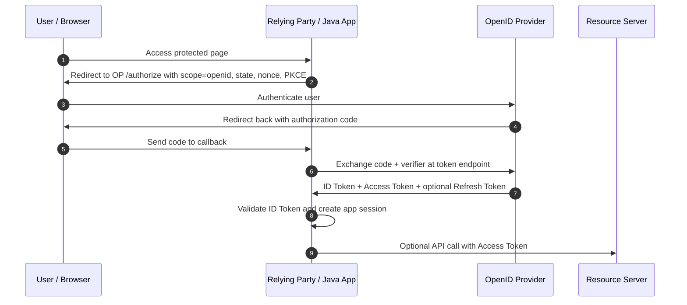
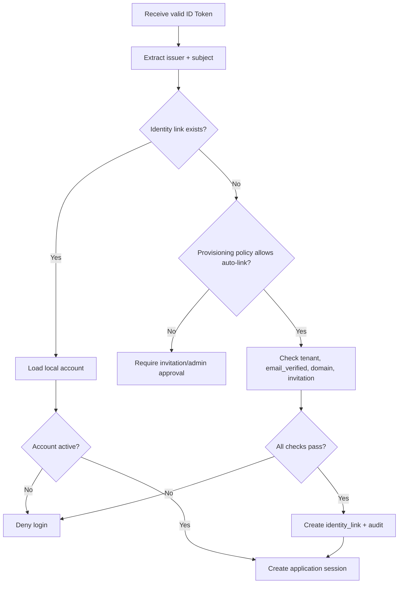
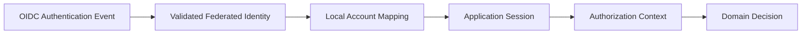
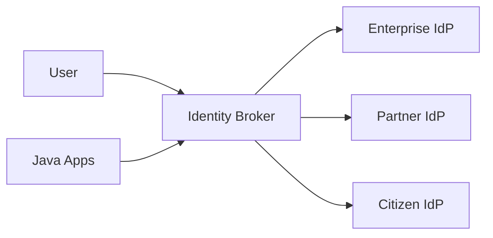

------
title: Learn Java Identity, Authentication & Authorization for Secure Enterprise API Platform - Part 009
description: OpenID Connect sebagai lapisan authentication di atas OAuth 2.x untuk login, federation, SSO, identity brokering, dan klaim identity yang aman di platform Java enterprise.
series: learn-java-identity-authentication-authorization-api-platform
seriesTitle: Learn Java Identity, Authentication & Authorization for Secure Enterprise API Platform
order: 9
partTitle: OpenID Connect Login and Federation
tags:
- java
- identity
- authentication
- authorization
- oauth
- oidc
- federation
- api-security
date: 2026-06-28
---

# Part 009 — OpenID Connect Login and Federation

> Target part ini: kamu bisa menjelaskan, mendesain, mengimplementasikan, dan mereview login berbasis OpenID Connect tanpa mencampuradukkan **OAuth authorization**, **OIDC authentication**, **session aplikasi**, dan **domain authorization**.

Part 007 sudah menegaskan bahwa OAuth adalah framework untuk **delegated authorization**. Part 008 sudah membahas flow OAuth yang aman. Sekarang kita masuk ke OpenID Connect, yaitu lapisan identity di atas OAuth yang menjawab pertanyaan berbeda:

- **OAuth**: client boleh mengakses resource apa?
- **OIDC**: siapa end-user yang berhasil di-authenticate oleh Authorization Server / OpenID Provider?
- **Aplikasi enterprise**: setelah tahu identity tersebut, account lokal mana yang dipakai, tenant mana yang aktif, session apa yang dibuat, dan authorization domain apa yang berlaku?

OpenID Connect sering terlihat sederhana karena library modern bisa melakukan redirect login secara otomatis. Di sistem produksi, masalah sebenarnya bukan “bisa login”, tetapi:

1. apakah login response benar-benar berasal dari issuer yang dipercaya;
2. apakah ID Token divalidasi dengan benar;
3. apakah user eksternal dipetakan ke account lokal secara aman;
4. apakah claim dipercaya sesuai konteksnya;
5. apakah logout, account linking, tenant switching, dan deprovisioning tidak meninggalkan akses liar;
6. apakah audit bisa membuktikan siapa login, lewat provider mana, dengan assurance apa, dan session apa yang terbentuk.

---

## 1. Kaufman Skill Slice

Dalam kerangka Josh Kaufman, skill besar “menguasai OIDC” harus dipecah menjadi unit yang bisa dilatih cepat.

### 1.1 Target performa

Setelah part ini, kamu harus bisa:

- membedakan **Authorization Server**, **OpenID Provider**, **Relying Party**, **Client**, **User Agent**, dan **Resource Server**;
- menjelaskan isi dan fungsi **ID Token**;
- membedakan **ID Token**, **Access Token**, **Refresh Token**, dan **application session**;
- menulis checklist validasi ID Token;
- mendesain login flow untuk web server, BFF, SPA, dan enterprise SSO;
- membuat mapping aman dari federated identity ke local account;
- menjelaskan risiko claim trust, account linking, issuer confusion, email takeover, dan tenant mismatch;
- mengimplementasikan OIDC login di Spring Security tanpa menjadikan claim token sebagai authorization final.

### 1.2 Subskill yang harus dilatih

| Subskill | Latihan minimal | Output yang diharapkan |
|---|---|---|
| Protocol reading | Baca login sequence OIDC | Bisa menjelaskan redirect, code, token, ID Token |
| Token validation | Validasi `iss`, `aud`, `exp`, `iat`, `nonce`, signature | Checklist review implementation |
| Claim modelling | Bedakan identity claim vs entitlement | Tidak memakai `email` sebagai subject stabil |
| Federation mapping | Map `(issuer, subject)` ke local account | Tidak terjadi account takeover |
| Session creation | Ubah OIDC login menjadi app session | Session punya lifecycle sendiri |
| Multi-provider setup | Google/Entra/Keycloak/internal IdP | Issuer isolation benar |
| Logout handling | Local logout vs RP-initiated logout vs back-channel | Tidak overclaim “logout global aman” |

---

## 2. Mental Model: OIDC Bukan Sekadar “OAuth Login”

OIDC menggunakan mekanisme OAuth, tetapi menambahkan semantic layer untuk authentication.



OIDC login menghasilkan **authentication event**. Event itu bisa dipakai aplikasi untuk membuat session lokal. Namun session lokal bukan ID Token. Jika aplikasi menyamakan ID Token dengan session, desain biasanya menjadi rapuh.

### 2.1 Empat benda yang sering tertukar

| Benda | Untuk siapa | Fungsi | Dipakai di mana | Kesalahan umum |
|---|---|---|---|---|
| Authorization Code | Client backend | Bukti sementara untuk ditukar ke token | Callback server-side | Dikirim ke frontend/log |
| ID Token | Client / RP | Bukti authentication end-user | Login processing | Dipakai untuk memanggil API |
| Access Token | Resource Server | Otorisasi akses API | `Authorization: Bearer` | Dipakai sebagai bukti login UI |
| Application Session | Aplikasi | State login lokal | Cookie/session store | Tidak disinkronkan dengan token/account status |

**Invariant penting:** ID Token dikonsumsi oleh client/RP, bukan resource server. Resource server memvalidasi access token, bukan ID token.

---

## 3. Vocabulary OIDC yang Harus Tepat

### 3.1 OpenID Provider (OP)

OpenID Provider adalah Authorization Server yang mendukung OIDC. Ia meng-authenticate user dan menerbitkan ID Token.

Contoh OP:

- Keycloak realm;
- Microsoft Entra ID tenant;
- Okta authorization server;
- Auth0 tenant;
- Spring Authorization Server dengan OIDC enabled;
- internal enterprise identity provider.

### 3.2 Relying Party (RP)

Relying Party adalah aplikasi yang “rely” pada authentication result dari OP. Dalam Spring Security, RP biasanya adalah aplikasi web yang memakai `oauth2Login()`.

RP harus:

- melakukan redirect login;
- menjaga `state` dan `nonce`;
- menukar authorization code;
- memvalidasi ID Token;
- mengambil UserInfo bila perlu;
- memetakan federated identity ke local principal;
- membuat local session;
- menerapkan authorization lokal.

### 3.3 Subject (`sub`)

`sub` adalah identifier user dalam konteks issuer. Nilainya stabil di dalam issuer, tetapi tidak global di seluruh dunia.

Jangan menyimpan user hanya sebagai:

```text
sub = "12345"
```

Simpan sebagai pasangan:

```text
issuer = "https://idp.example.com/realms/regulator"
subject = "12345"
```

atau bentuk normalized:

```text
federated_subject_key = sha256(canonical_issuer + "|" + subject)
```

**Invariant:** `(iss, sub)` adalah identitas federasi. `sub` saja tidak cukup.

### 3.4 Claims

Claim adalah statement dari issuer tentang subject atau authentication event. Contoh:

```json
{
  "iss": "https://idp.example.com/realms/regulator",
  "sub": "248289761001",
  "aud": "case-management-web",
  "exp": 1760000000,
  "iat": 1759999700,
  "auth_time": 1759999600,
  "nonce": "random-nonce-bound-to-login-request",
  "email": "ana@example.gov",
  "email_verified": true,
  "acr": "urn:example:aal2",
  "amr": ["pwd", "otp"]
}
```

Claim bukan fakta absolut. Claim adalah statement yang dipercaya sejauh:

- issuer dipercaya;
- token valid;
- audience tepat;
- claim punya semantics yang disepakati;
- claim freshness sesuai kebutuhan;
- claim tidak bertentangan dengan local policy.

---

## 4. ID Token: Apa yang Harus Dipahami

ID Token adalah JWT yang menyatakan bahwa OP telah meng-authenticate end-user untuk client tertentu.

### 4.1 Claim penting ID Token

| Claim | Makna | Validasi / perhatian |
|---|---|---|
| `iss` | Issuer yang menerbitkan token | Harus exactly match trusted issuer |
| `sub` | Subject identifier | Simpan bersama issuer |
| `aud` | Client yang menjadi audience | Harus berisi client id RP |
| `azp` | Authorized party | Penting bila multi-audience |
| `exp` | Expiration time | Wajib belum expired |
| `iat` | Issued at | Cek clock skew wajar |
| `auth_time` | Waktu user diautentikasi | Penting untuk step-up/max_age |
| `nonce` | Bind response ke login request | Wajib untuk browser-based login |
| `acr` | Authentication context class | Jangan dipakai tanpa kontrak |
| `amr` | Authentication methods references | Bisa bantu audit/step-up |
| `email` | Email user | Bukan stable primary key |
| `email_verified` | Email diverifikasi oleh issuer | Tetap perlu trust policy |

### 4.2 Validasi ID Token minimum

Checklist validasi:

1. signature valid memakai key dari issuer metadata/JWKS;
2. algorithm yang dipakai memang diizinkan;
3. `iss` exactly match konfigurasi issuer;
4. `aud` cocok dengan client id;
5. bila ada `azp`, pastikan sesuai client;
6. `exp` belum lewat;
7. `iat` tidak terlalu jauh dari waktu sekarang;
8. `nonce` cocok dengan nonce yang dibuat saat login;
9. `auth_time` memenuhi `max_age` atau step-up requirement bila ada;
10. token tidak diterima dari channel yang tidak sesuai;
11. claim yang dipakai untuk local mapping sudah masuk policy trust.

### 4.3 Pseudocode validasi

```java
public final class OidcLoginValidator {

    public ValidatedLogin validate(
            Jwt idToken,
            OidcLoginRequestContext request,
            TrustedIssuer issuer,
            ClientRegistration client) {

        requireEqual(idToken.getIssuer().toString(), issuer.issuerUri(), "issuer mismatch");
        requireAudience(idToken.getAudience(), client.getClientId());
        requireNotExpired(idToken.getExpiresAt());
        requireReasonableIssuedAt(idToken.getIssuedAt());
        requireEqual(idToken.getClaimAsString("nonce"), request.nonce(), "nonce mismatch");

        String subject = idToken.getSubject();
        if (subject == null || subject.isBlank()) {
            throw new BadCredentialsException("missing subject");
        }

        return new ValidatedLogin(
                issuer.issuerUri(),
                subject,
                idToken.getClaimAsString("email"),
                idToken.getClaimAsString("acr"),
                idToken.getClaimAsStringList("amr"));
    }
}
```

Pada Spring Security, banyak validasi dasar dilakukan oleh library jika konfigurasi benar. Namun engineer senior tetap harus tahu checklist ini karena celah sering muncul dari extension point, custom decoder, multi-issuer resolver, atau claim mapper yang terlalu percaya diri.

---

## 5. OIDC Discovery dan Metadata

OIDC Discovery memungkinkan RP menemukan endpoint dan key issuer dari metadata.

Biasanya tersedia di:

```text
{issuer}/.well-known/openid-configuration
```

Metadata mencakup:

- issuer;
- authorization endpoint;
- token endpoint;
- userinfo endpoint;
- jwks uri;
- supported scopes;
- supported response types;
- supported signing algorithms;
- logout endpoints bila didukung.

### 5.1 Discovery tidak berarti semua issuer otomatis dipercaya

Anti-pattern:

```text
Terima issuer URL dari request, fetch discovery metadata, lalu percaya token dari issuer itu.
```

Ini berbahaya karena attacker bisa membuat issuer sendiri dan menerbitkan token valid dari perspektif cryptographic signature miliknya sendiri.

Yang benar:

```text
issuer dalam token harus cocok dengan allowlist issuer yang sudah dikonfigurasi.
```

### 5.2 Trusted issuer registry

Untuk enterprise multi-tenant, buat registry eksplisit:

```java
public record TrustedIssuer(
        String tenantId,
        String issuerUri,
        String jwksUri,
        Set<String> allowedClientIds,
        Set<String> allowedSigningAlgorithms,
        boolean emailClaimTrusted,
        boolean groupsClaimTrusted
) {}
```

Resolver-nya tidak boleh menerima issuer liar:

```java
public final class TrustedIssuerRegistry {
    private final Map<String, TrustedIssuer> byIssuer;

    public TrustedIssuer requireTrusted(String issuer) {
        TrustedIssuer trusted = byIssuer.get(canonicalize(issuer));
        if (trusted == null) {
            throw new BadCredentialsException("untrusted issuer");
        }
        return trusted;
    }
}
```

---

## 6. Login Flow untuk Java Web Application

### 6.1 Spring Security OIDC login baseline

Contoh minimal:

```java
@Configuration
@EnableWebSecurity
class WebSecurityConfig {

    @Bean
    SecurityFilterChain web(HttpSecurity http) throws Exception {
        return http
            .authorizeHttpRequests(auth -> auth
                .requestMatchers("/", "/login", "/assets/**").permitAll()
                .requestMatchers("/admin/**").hasAuthority("APP_ADMIN")
                .anyRequest().authenticated())
            .oauth2Login(oauth -> oauth
                .userInfoEndpoint(userInfo -> userInfo
                    .oidcUserService(oidcUserService())))
            .logout(logout -> logout
                .logoutUrl("/logout")
                .deleteCookies("SESSION"))
            .build();
    }

    @Bean
    OAuth2UserService<OidcUserRequest, OidcUser> oidcUserService() {
        OidcUserService delegate = new OidcUserService();
        return request -> {
            OidcUser oidcUser = delegate.loadUser(request);
            return mapToLocalPrincipal(request, oidcUser);
        };
    }
}
```

### 6.2 Jangan langsung pakai groups/roles dari IdP sebagai authorization final

Misalnya ID Token berisi:

```json
{
  "groups": ["case-admin", "supervisor"]
}
```

Itu belum tentu bisa langsung menjadi authority aplikasi. Pertanyaan desain:

- apakah claim `groups` dikontrak dengan issuer?
- apakah group berlaku untuk tenant aktif?
- apakah group masih fresh?
- apakah group merepresentasikan entitlement aplikasi atau hanya directory group?
- apakah group tersebut bisa dibuat oleh admin IdP yang tidak boleh memberi akses aplikasi?

Mapping lebih aman:

```java
public final class EnterpriseOidcAuthorityMapper {

    public Set<GrantedAuthority> map(OidcUser oidcUser, LocalAccount account, TenantContext tenant) {
        Set<GrantedAuthority> result = new HashSet<>();

        // Coarse login authority: user is authenticated.
        result.add(new SimpleGrantedAuthority("AUTHENTICATED_USER"));

        // Application entitlements come from local entitlement store,
        // not blindly from token groups.
        for (Entitlement entitlement : account.entitlementsFor(tenant.tenantId())) {
            result.add(new SimpleGrantedAuthority(entitlement.authorityName()));
        }

        return Set.copyOf(result);
    }
}
```

---

## 7. Federation Mapping: Bagian yang Paling Sering Diremehkan

OIDC login bukan selesai ketika token valid. Setelah token valid, aplikasi harus menjawab:

```text
Federated identity ini cocok dengan local account mana?
```

### 7.1 Model tabel identity link

```sql
create table identity_link (
    id uuid primary key,
    account_id uuid not null,
    issuer varchar(512) not null,
    subject varchar(255) not null,
    provider_type varchar(64) not null,
    created_at timestamp not null,
    last_seen_at timestamp,
    status varchar(32) not null,
    unique (issuer, subject)
);
```

Account lokal:

```sql
create table account (
    id uuid primary key,
    tenant_id uuid not null,
    display_name varchar(255) not null,
    primary_email varchar(320),
    status varchar(32) not null,
    created_at timestamp not null,
    updated_at timestamp not null
);
```

### 7.2 Jangan auto-link berdasarkan email saja

Anti-pattern:

```text
Jika email dari IdP sama dengan email account lokal, langsung login sebagai account itu.
```

Masalahnya:

- email bisa berubah;
- email bisa didaur ulang oleh organisasi;
- beberapa issuer bisa memberi claim email yang sama;
- `email_verified` punya makna berbeda antar provider;
- attacker bisa memilih IdP yang mengeluarkan email tertentu jika issuer tidak dibatasi;
- tenant A dan tenant B bisa punya user dengan email sama di konteks berbeda.

Auto-link boleh dilakukan hanya jika ada policy kuat, misalnya:

- issuer adalah enterprise IdP tenant yang sudah dikontrol organisasi;
- domain email dikelola organisasi;
- `email_verified=true` dipercaya untuk issuer tersebut;
- account lokal sedang dalam state invited/provisioned;
- link dibuat untuk tenant yang sama;
- audit event dibuat;
- ada conflict handling.

### 7.3 Mapping algorithm aman



### 7.4 Java service boundary

```java
public final class FederatedLoginService {

    private final IdentityLinkRepository links;
    private final AccountRepository accounts;
    private final ProvisioningPolicy provisioningPolicy;
    private final AuditSink audit;

    public LoginResult login(ValidatedOidcIdentity identity, LoginContext context) {
        Optional<IdentityLink> existing = links.findByIssuerAndSubject(
                identity.issuer(), identity.subject());

        if (existing.isPresent()) {
            Account account = accounts.requireById(existing.get().accountId());
            requireActive(account);
            audit.record(AuthAuditEvent.federatedLoginSucceeded(account.id(), identity, context));
            return LoginResult.authenticated(account);
        }

        if (!provisioningPolicy.canAutoLink(identity, context)) {
            audit.record(AuthAuditEvent.federatedLoginUnlinked(identity, context));
            return LoginResult.requiresProvisioning();
        }

        Account account = provisioningPolicy.resolveTargetAccount(identity, context)
                .orElseThrow(() -> new AccessDeniedException("no eligible account for federated identity"));

        IdentityLink link = links.create(account.id(), identity.issuer(), identity.subject(), context.providerType());
        audit.record(AuthAuditEvent.identityLinked(account.id(), link.id(), identity, context));
        return LoginResult.authenticated(account);
    }

    private static void requireActive(Account account) {
        if (!account.status().equals(AccountStatus.ACTIVE)) {
            throw new DisabledException("account is not active");
        }
    }
}
```

---

## 8. UserInfo Endpoint: Kapan Dipakai?

UserInfo endpoint memberi claim tambahan tentang user berdasarkan access token yang diterbitkan oleh OP.

Gunakan UserInfo jika:

- ID Token tidak memuat claim profil yang diperlukan;
- claim harus diambil dari endpoint standar;
- provider memang menempatkan profile claim di UserInfo;
- aplikasi butuh data display, bukan authorization final.

Jangan gunakan UserInfo untuk:

- mengganti validasi ID Token;
- mengambil entitlement sensitif tanpa kontrak;
- membuat authorization real-time tanpa mempertimbangkan cache/staleness;
- memanggil endpoint dari resource server downstream secara sembarangan.

### 8.1 UserInfo claim tetap harus dianggap sebagai external input

Walau berasal dari OP, claim tetap harus dinormalisasi:

```java
public record ExternalProfile(
        String displayName,
        String email,
        boolean emailVerified,
        Locale locale
) {
    public ExternalProfile {
        displayName = sanitizeDisplayName(displayName);
        email = normalizeEmail(email);
    }
}
```

---

## 9. Login, Session, dan Authorization: Boundary yang Benar

Setelah OIDC login valid, aplikasi biasanya membuat session lokal.



Jangan lompat dari ID Token langsung ke domain decision.

Salah:

```java
if (oidcUser.getClaimAsStringList("groups").contains("admin")) {
    approveCase(caseId);
}
```

Lebih baik:

```java
AuthorizationDecision decision = authorizationService.canApproveCase(
        currentUser.accountId(),
        currentTenant.id(),
        caseId,
        RequestContext.current());

if (!decision.granted()) {
    throw new AccessDeniedException(decision.reasonCode());
}
```

Aplikasi boleh menyimpan identity claim di session sebagai context, tetapi authorization harus tetap lewat policy/domain service.

---

## 10. Federation Patterns di Enterprise

### 10.1 Single OP untuk semua aplikasi internal

Cocok jika organisasi punya satu IdP enterprise.

```text
Browser -> App A / App B / App C -> Same OP
```

Kelebihan:

- SSO sederhana;
- lifecycle user terpusat;
- policy MFA terpusat;
- audit identity konsisten.

Risiko:

- dependency tinggi pada satu IdP;
- issuer outage berdampak luas;
- claim design menjadi bottleneck organisasi;
- aplikasi bisa terlalu bergantung pada directory group.

### 10.2 Identity brokering

Aplikasi percaya pada broker internal, broker percaya pada external IdP.



Kelebihan:

- aplikasi hanya integrasi dengan satu OP;
- claim normalization dilakukan di broker;
- federation policy lebih terpusat;
- external provider bisa diganti tanpa mengubah semua aplikasi.

Risiko:

- broker menjadi critical trust component;
- mapping claim bisa menyembunyikan assurance asli;
- jika broker menerbitkan ulang token tanpa preserve context, audit melemah.

### 10.3 Per-tenant issuer

Cocok untuk SaaS B2B enterprise.

```text
Tenant A -> issuer A
Tenant B -> issuer B
Tenant C -> issuer C
```

Perhatian:

- resolver issuer harus allowlist;
- tenant resolution tidak boleh hanya dari email domain;
- user yang sama di beberapa tenant harus punya account/entitlement terpisah;
- logout dan deprovisioning berbeda per tenant;
- audit harus mencatat issuer + tenant + local account.

---

## 11. Multi-Tenant OIDC Login

### 11.1 Problem

User membuka:

```text
https://platform.example.com/t/acme/cases
```

Aplikasi harus tahu bahwa login diarahkan ke issuer milik tenant `acme`.

### 11.2 Tenant-aware authorization request resolver

Pseudo-flow:

```text
1. Resolve tenant from host/path/invitation.
2. Load tenant identity configuration.
3. Select client registration for tenant issuer.
4. Build authorization request with state, nonce, PKCE.
5. Store tenant id in protected authorization request state.
6. On callback, verify state and ensure issuer maps to same tenant.
```

### 11.3 Invariant tenant login

| Invariant | Alasan |
|---|---|
| Tenant from callback must match tenant from original login request | Mencegah tenant confusion |
| Issuer must be registered for tenant | Mencegah rogue issuer |
| `(issuer, sub)` link must map to account in same tenant or allowed cross-tenant model | Mencegah tenant escape |
| Entitlements loaded for active tenant only | Mencegah privilege bleed |
| Session must include active tenant explicitly | Menghindari implicit tenant dari user profile |

---

## 12. Logout Semantics

Logout adalah area yang sering overpromised.

Ada beberapa level logout:

| Logout | Makna | Apa yang hilang |
|---|---|---|
| Local logout | Session aplikasi dihapus | Cookie/session app |
| OP logout | Session user di OP diakhiri | SSO session di provider |
| RP-initiated logout | RP meminta OP logout | Tergantung dukungan provider |
| Front-channel logout | Browser memanggil RP logout URL | Rentan reliability browser |
| Back-channel logout | OP mengirim logout token ke RP | Lebih reliable, perlu endpoint |
| Token revocation | Token tertentu direvoke | Tergantung token model |

### 12.1 Local logout baseline

```java
@Bean
SecurityFilterChain web(HttpSecurity http) throws Exception {
    return http
        .logout(logout -> logout
            .logoutUrl("/logout")
            .invalidateHttpSession(true)
            .clearAuthentication(true)
            .deleteCookies("SESSION", "XSRF-TOKEN"))
        .build();
}
```

### 12.2 Jangan klaim logout global jika tidak benar

Jika aplikasi hanya menghapus cookie lokal, user mungkin masih login di OP. Akses berikutnya bisa langsung SSO lagi.

Kalimat yang benar untuk user/admin:

```text
You have been signed out from this application.
```

Bukan:

```text
You have been signed out from all enterprise applications.
```

Kecuali memang OP/session federation mendukung global logout dan sistem mengimplementasikannya.

---

## 13. Account Recovery dalam Sistem Federated

Federated login tidak otomatis menyelesaikan account recovery.

Pertanyaan yang harus dijawab:

- Jika user kehilangan akses ke external IdP, siapa yang boleh re-link account?
- Jika email berubah di IdP, apakah account lokal berubah?
- Jika subject berubah karena migration IdP, bagaimana continuity dijaga?
- Jika employee keluar, apakah deprovisioning dari IdP cukup?
- Jika partner IdP salah mengeluarkan claim, siapa bertanggung jawab?

### 13.1 Subject migration pattern

Saat migration dari issuer lama ke issuer baru:

```sql
create table identity_migration_map (
    old_issuer varchar(512) not null,
    old_subject varchar(255) not null,
    new_issuer varchar(512) not null,
    new_subject varchar(255) not null,
    approved_by uuid not null,
    approved_at timestamp not null,
    reason varchar(1024) not null,
    primary key (old_issuer, old_subject, new_issuer, new_subject)
);
```

Jangan melakukan migration otomatis berbasis email saja untuk privileged account.

---

## 14. Security Invariants

Gunakan daftar ini saat design review.

1. OIDC login request selalu memakai `state`, `nonce`, dan PKCE untuk browser-based flow.
2. ID Token hanya diterima dari token endpoint flow yang diharapkan.
3. `iss` harus exact match trusted issuer.
4. `aud` harus cocok dengan client id.
5. Signature dan algorithm harus divalidasi.
6. `nonce` harus match authorization request.
7. `(iss, sub)` adalah key federated identity; `email` bukan primary key.
8. UserInfo tidak menggantikan ID Token validation.
9. Claim eksternal tidak langsung menjadi domain entitlement tanpa mapping policy.
10. Local account status harus dicek pada setiap login/session refresh signifikan.
11. Tenant context harus eksplisit dan divalidasi terhadap issuer/account.
12. Logout semantics harus jujur dan sesuai implementasi.
13. Semua identity link create/update/delete harus diaudit.
14. Privileged account linking harus membutuhkan approval atau strong proof.
15. OIDC client secret tidak boleh dikirim ke browser.

---

## 15. Failure Modes

### 15.1 Issuer confusion

Aplikasi menerima token dari issuer yang tidak diharapkan karena hanya memvalidasi signature menggunakan JWKS dari metadata yang diambil berdasarkan token.

Mitigasi:

- allowlist issuer;
- bind tenant ke issuer;
- jangan resolve issuer secara dinamis dari token tanpa registry;
- audit rejected issuer.

### 15.2 Email-based account takeover

Attacker login via provider lain dengan email sama, lalu aplikasi auto-link.

Mitigasi:

- link dengan `(iss, sub)`;
- email hanya signal, bukan identity key;
- allowlist provider untuk auto-link;
- invitation-bound linking;
- step-up/admin approval untuk privileged account.

### 15.3 Claim overtrust

Aplikasi percaya `groups`/`roles` dari token tanpa kontrak.

Mitigasi:

- external claim normalization;
- local entitlement store;
- claim trust policy per issuer;
- deny by default untuk unknown role;
- audit mapping decisions.

### 15.4 Logout illusion

User mengira sudah logout global, tapi OP session masih aktif.

Mitigasi:

- bedakan local logout dan OP logout;
- implement RP-initiated logout bila provider mendukung;
- tampilkan pesan yang akurat;
- untuk high-risk action, gunakan re-auth/step-up.

### 15.5 Tenant mismatch

User login lewat issuer tenant A tetapi mengakses tenant B.

Mitigasi:

- tenant-bound authorization request;
- check issuer belongs to tenant;
- check account belongs/has access to tenant;
- no implicit tenant from email domain alone.

---

## 16. Testing Strategy

### 16.1 Token validation tests

Buat negative tests untuk:

- invalid signature;
- wrong issuer;
- wrong audience;
- expired token;
- missing subject;
- wrong nonce;
- missing nonce;
- unsupported algorithm;
- future `iat` beyond skew;
- mismatched `azp`.

### 16.2 Federation mapping tests

Test cases:

| Scenario | Expected |
|---|---|
| Existing `(iss, sub)` link active | Login succeeds |
| Existing link but account disabled | Login denied |
| New identity without invitation | Provisioning required/denied |
| Same email different issuer | No auto takeover |
| Same issuer+sub different tenant | Denied unless explicit cross-tenant model |
| Privileged account auto-link attempt | Requires approval |
| UserInfo email changes | Does not change identity link automatically |

### 16.3 Spring integration test sketch

```java
@Test
void shouldNotAutoLinkDifferentIssuerWithSameEmail() {
    ValidatedOidcIdentity attacker = new ValidatedOidcIdentity(
            "https://untrusted-or-different.example.com",
            "attacker-subject",
            "admin@example.gov",
            true,
            null,
            List.of());

    LoginResult result = loginService.login(attacker, LoginContext.forTenant("regulator"));

    assertThat(result.status()).isEqualTo(LoginStatus.REQUIRES_PROVISIONING);
    assertThat(identityLinks.findByEmail("admin@example.gov"))
            .noneMatch(link -> link.subject().equals("attacker-subject"));
}
```

---

## 17. Operational Checklist

Sebelum production, pastikan:

- issuer registry eksplisit;
- client registrations per environment tidak tertukar;
- redirect URI exact dan tidak wildcard berbahaya;
- `state`, `nonce`, PKCE aktif;
- ID Token validation tidak di-custom secara lemah;
- identity link model memakai `(iss, sub)`;
- account lifecycle/deactivation tersambung;
- tenant binding diuji;
- claim trust policy terdokumentasi;
- local logout dan OP logout semantics jelas;
- audit event untuk login success/failure/linking/logout tersedia;
- incident runbook untuk IdP compromise/provider outage ada.

---

## 18. Practice Drill

### Drill 1 — Jelaskan dalam 3 menit

Jelaskan kepada engineer lain:

```text
Mengapa ID Token tidak boleh dipakai untuk memanggil resource server?
```

Jawaban harus menyebut:

- ID Token audience adalah client/RP;
- access token audience adalah resource server;
- ID Token membuktikan authentication event, bukan API authorization;
- resource server harus memvalidasi access token.

### Drill 2 — Review desain login

Diberikan desain:

```text
User login dengan OIDC. Aplikasi mencari account lokal berdasarkan email. Jika email cocok, user dianggap login.
```

Tulis minimal 5 risiko dan desain ulang mapping-nya memakai `(iss, sub)`.

### Drill 3 — Multi-tenant scenario

Desain flow untuk:

```text
Tenant A memakai Entra ID.
Tenant B memakai Keycloak.
User punya email sama di dua tenant.
```

Pastikan session, account, issuer, dan entitlement tidak bocor antar tenant.

---

## 19. Ringkasan

OpenID Connect memberi cara standar untuk menerima authentication result dari issuer terpercaya. Namun security sistem tidak berhenti di validasi ID Token. Sistem enterprise harus mengubah federated identity menjadi local account, local session, tenant context, dan authorization context secara eksplisit.

Mental model paling penting:

```text
OIDC proves an authentication event from a trusted issuer.
Your application still owns account mapping, session semantics, tenant binding, and authorization decisions.
```

Jika kamu memegang invariant itu, desain OIDC akan lebih mudah direview, diuji, dan dipertanggungjawabkan.

---

## 20. Referensi Utama

- OpenID Foundation — OpenID Connect Core 1.0.
- OpenID Foundation — OpenID Connect Discovery 1.0.
- OpenID Foundation — OpenID Connect RP-Initiated Logout 1.0.
- IETF RFC 6749 — OAuth 2.0 Authorization Framework.
- IETF RFC 7636 — Proof Key for Code Exchange.
- IETF RFC 9700 — OAuth 2.0 Security Best Current Practice.
- Spring Security Reference — OAuth2 Login.
- Spring Security Reference — OAuth2 Client.
