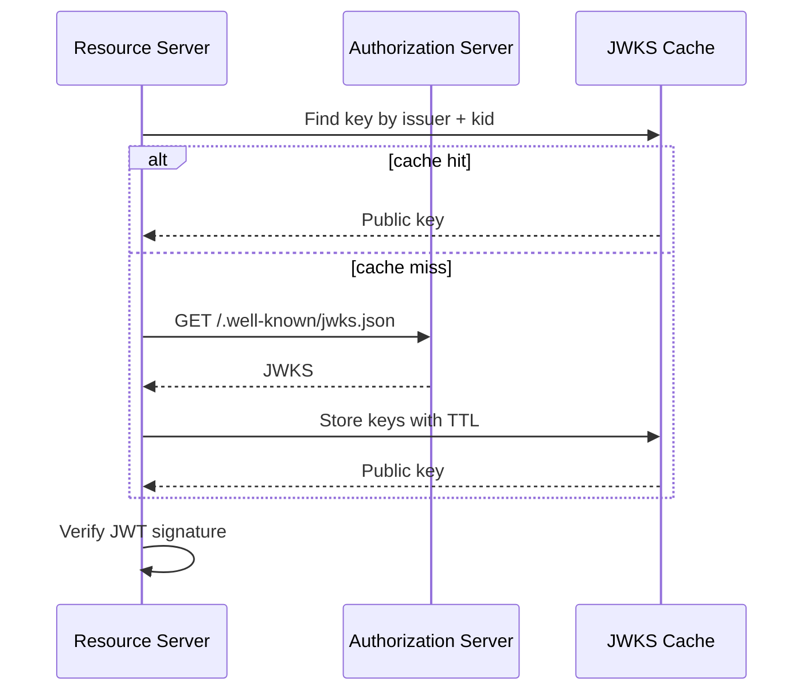
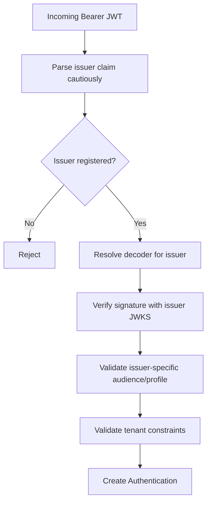
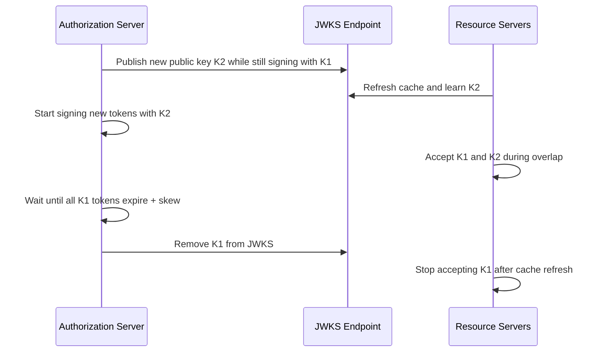

------
title: Learn Java Identity, Authentication & Authorization for Secure Enterprise API Platform - Part 011
description: Deep dive validasi JWT untuk Java resource server: JWS, JWK Set, kid, issuer, audience, typ, expiry, key rotation, algorithm safety, cache strategy, multi-issuer, observability, dan failure-mode testing.
series: learn-java-identity-authentication-authorization-api-platform
seriesTitle: Learn Java Identity, Authentication & Authorization for Secure Enterprise API Platform
order: 11
partTitle: JWT Validation, JWK Sets, Key Rotation, and Algorithm Safety
tags:
- java
- identity
- authentication
- authorization
- oauth
- oidc
- jwt
- jwks
- spring-security
- api-security
date: 2026-06-28
---

# Part 011 — JWT Validation, JWK Sets, Key Rotation, and Algorithm Safety

> Target part ini: kamu mampu mendesain dan mengimplementasikan pipeline validasi JWT yang benar untuk Java resource server. Bukan sekadar `decode(token)`, bukan sekadar “signature valid”, tetapi validasi trust lengkap: issuer, audience, expiry, header safety, key selection, algorithm allowlist, tenant boundary, authority mapping, cache behavior, rotation, observability, dan failure response.

JWT sering terlihat sederhana karena bentuknya compact dan mudah di-decode. Justru di situ bahayanya. Banyak breach authorization tidak terjadi karena signature library rusak, tetapi karena aplikasi:

- hanya decode payload tanpa verifikasi signature;
- menerima token dari issuer yang salah;
- tidak memvalidasi audience;
- menerima algorithm yang tidak dipin;
- menggunakan claim role/scope tanpa konteks tenant;
- gagal saat key rotation;
- memperlakukan JWT sebagai session yang bisa diubah kapan saja;
- tidak punya telemetry untuk membedakan token expired, wrong issuer, wrong audience, dan unknown key.

JWT validation harus dipahami sebagai **trust pipeline**, bukan utility parsing.

---

## 1. Kaufman Skill Slice

### 1.1 Target performa

Setelah part ini, kamu harus bisa:

- membedakan decode, parse, verify, validate, authorize, dan audit;
- menjelaskan struktur JWS JWT dan role JWK/JWKS;
- menyusun checklist validasi JWT untuk enterprise resource server;
- mengimplementasikan `JwtDecoder` Spring Security dengan issuer, audience, type, timestamp, dan custom claim validation;
- mendesain JWKS cache dan key rotation runbook;
- menangani unknown `kid`, stale JWKS, issuer outage, dan emergency key compromise;
- menghindari algorithm confusion dan unsafe trust pada header JWT;
- membangun test suite negatif untuk token validation.

### 1.2 Subskill latihan

| Subskill | Latihan | Output |
|---|---|---|
| JWT inspection | Baca header/payload token sample | Bisa membedakan informasi vs kepercayaan |
| Trust validation | Buat validator issuer/audience/time/type | Token salah ditolak deterministik |
| JWKS handling | Simulasi key rotation | Resource server tetap stabil |
| Algorithm safety | Test `none`, HS/RS confusion, wrong alg | Tidak menerima token unsafe |
| Multi-issuer | Validasi issuer-per-tenant | Tidak terjadi tenant escape |
| Observability | Log reason tanpa token leakage | Bisa investigasi tanpa bocor rahasia |

---

## 2. Mental Model: JWT Validation Bukan Decode

JWT bisa di-decode oleh siapa pun karena header dan payload hanya base64url-encoded. Decode tidak membuktikan apa pun.

```text
Decode    = membaca bytes menjadi JSON
Parse     = memecah header/payload/signature
Verify    = membuktikan signature cocok dengan key yang dipercaya
Validate  = membuktikan claims sesuai security contract
Authorize = memutuskan request spesifik boleh atau tidak
Audit     = merekam keputusan dan konteks secara aman
```

Pipeline yang benar:

```mermaid
flowchart LR
    A[HTTP Request] --> B[Extract Bearer Token]
    B --> C[Parse JWT Structure]
    C --> D[Validate Header Safety]
    D --> E[Select Trusted Key]
    E --> F[Verify Signature]
    F --> G[Validate Issuer]
    G --> H[Validate Audience]
    H --> I[Validate Time Claims]
    I --> J[Validate Token Type]
    J --> K[Validate Tenant / Client Constraints]
    K --> L[Map Claims to Authentication]
    L --> M[Domain Authorization]
    M --> N[Audit Decision]
```



Kesalahan mental model yang harus dihindari:

```java
// Salah: payload bisa dibaca tanpa verifikasi.
DecodedJWT jwt = JWT.decode(rawToken);
String userId = jwt.getSubject();
```

Yang harus terjadi:

```java
// Benar secara arah: gunakan decoder yang memverifikasi signature dan validator claim.
Jwt jwt = jwtDecoder.decode(rawToken);
```

Namun bahkan `jwtDecoder.decode(...)` belum cukup kalau validasi audience, issuer, tenant, type, dan authority mapping tidak didesain.

---

## 3. Struktur JWT yang Relevan untuk Resource Server

JWT access token biasanya berbentuk JWS:

```text
base64url(header).base64url(payload).base64url(signature)
```

### 3.1 Header

Contoh header:

```json
{
  "alg": "RS256",
  "typ": "at+jwt",
  "kid": "2026-06-signing-key-1"
}
```

Header membantu library memilih algoritma dan key. Tetapi header **tidak boleh dipercaya sebagai sumber policy**. Header berada di token yang dikirim attacker. Header hanya input untuk proses validasi yang dibatasi oleh konfigurasi server.

| Header | Fungsi | Risiko |
|---|---|---|
| `alg` | Menunjukkan algoritma signature | Algorithm confusion jika server menerima sembarang alg |
| `kid` | Menunjuk key id di JWKS | Key injection/path traversal jika resolver buruk |
| `typ` | Menyatakan tipe token | Token substitution jika tidak dicek |
| `cty` | Content type nested token | Kompleksitas dan confusion |

### 3.2 Payload

Contoh payload access token:

```json
{
  "iss": "https://id.example.com/realms/internal",
  "sub": "user_8f4b2c",
  "aud": "case-management-api",
  "exp": 1782634800,
  "nbf": 1782631200,
  "iat": 1782631200,
  "jti": "jwt-01j1a9...",
  "client_id": "case-web-bff",
  "scope": "case:read case:update",
  "tenant_id": "tenant_sg_gov",
  "acr": "urn:example:aal2",
  "amr": ["pwd", "otp"]
}
```

Payload berisi claims. Signature hanya membuktikan token tidak diubah dan diterbitkan oleh issuer/key yang dipercaya. Signature **tidak membuktikan** bahwa token relevan untuk API kamu. Itu tugas validasi claim.

### 3.3 Signature

Signature membuktikan integrity dan issuer-key possession. Untuk resource server enterprise, signature validation harus menjawab:

```text
Apakah token ini ditandatangani oleh key yang saat ini dipercaya untuk issuer yang benar, dengan algoritma yang diizinkan, dan claim yang sesuai security contract API ini?
```

---

## 4. Validation Contract

Setiap resource server harus punya validation contract eksplisit. Jangan biarkan framework default menjadi satu-satunya dokumentasi security.

Contoh contract:

```yaml
resourceServer: case-management-api
acceptedIssuers:
  - https://id.example.com/realms/internal
acceptedAlgorithms:
  - RS256
  - ES256
requiredTokenType: at+jwt
requiredAudience:
  - case-management-api
allowedClientTypes:
  - confidential
maxClockSkew: PT60S
requiredClaims:
  - iss
  - sub
  - aud
  - exp
  - iat
  - tenant_id
  - scope
forbiddenClaimsForAuthorization:
  - display_name
  - email_verified
  - department_label
```

Security invariant:

```text
A token is accepted only if every trust condition succeeds. Unknown, missing, malformed, or ambiguous trust context is deny.
```

---

## 5. Claims yang Wajib Dipahami

### 5.1 `iss` — issuer

`iss` menyatakan issuer yang menerbitkan token.

Invariants:

- Resource server harus tahu daftar issuer yang diterima.
- Issuer harus dibandingkan exact match, bukan contains/prefix longgar.
- Issuer menentukan JWKS yang dipercaya.
- Multi-tenant issuer mapping harus deterministik.

Anti-pattern:

```java
// Salah: terlalu longgar.
boolean trusted = jwt.getIssuer().toString().contains("example.com");
```

Benar:

```java
private static final URI EXPECTED_ISSUER = URI.create("https://id.example.com/realms/internal");

boolean trusted = EXPECTED_ISSUER.equals(jwt.getIssuer());
```

### 5.2 `aud` — audience

`aud` menjawab: token ini ditujukan untuk siapa?

Tanpa audience validation, token untuk API A bisa dipakai ke API B.

```text
Token intended for profile-api must not be accepted by payment-api.
```

Audience harus cocok dengan resource server identifier, bukan sekadar client id.

### 5.3 `exp`, `nbf`, `iat` — time claims

- `exp`: token tidak boleh diterima setelah waktu ini.
- `nbf`: token tidak boleh diterima sebelum waktu ini.
- `iat`: kapan token diterbitkan.

Clock skew boleh kecil dan eksplisit. Jangan membuat skew terlalu besar karena memperbesar replay window.

```text
Clock skew is operational tolerance, not a security feature.
```

### 5.4 `sub` — subject

`sub` adalah identifier subject dalam konteks issuer. Jangan asumsikan `sub` global lintas issuer.

```text
Global principal key = issuer + subject
```

Bukan:

```text
subject only
```

Ini penting untuk federation dan multi-issuer.

### 5.5 `client_id` / `azp` — authorized party/client

Untuk token user-delegated, client identity juga penting:

```text
subject = user yang didelegasikan
client = aplikasi yang mendapat delegasi
```

Authorization tertentu mungkin hanya boleh untuk client tertentu walau user punya scope.

### 5.6 `scope` / `scp`

Scope adalah delegation boundary dari OAuth. Scope bukan domain authorization lengkap.

```text
scope case:update berarti client boleh meminta update case.
Domain policy tetap memutuskan apakah user boleh update CASE-123.
```

### 5.7 `jti`

`jti` adalah token identifier. Berguna untuk audit, replay detection, revocation list tertentu, dan correlation. Jangan log seluruh token; log `jti` bila ada.

### 5.8 Tenant claim

Untuk platform multi-tenant, claim seperti `tenant_id`, `org_id`, atau `realm` harus divalidasi terhadap route, host, path, atau resolved tenant context.

```text
Token tenant_id must match request tenant context.
```

Contoh:

```http
GET /tenants/tenant-a/cases/CASE-1
Authorization: Bearer <token with tenant_id=tenant-b>
```

Harus ditolak sebelum query data.

---

## 6. JWK dan JWKS Mental Model

JWK adalah representasi JSON untuk cryptographic key. JWKS adalah set JWK yang diterbitkan issuer.

Contoh JWKS:

```json
{
  "keys": [
    {
      "kty": "RSA",
      "kid": "2026-06-signing-key-1",
      "use": "sig",
      "alg": "RS256",
      "n": "...",
      "e": "AQAB"
    }
  ]
}
```

Resource server menggunakan `kid` dari header JWT untuk mencari public key yang cocok di JWKS issuer.



Key insight:

```text
A key is trusted only in the context of an issuer and allowed algorithm.
```

Jangan membuat global key cache hanya berdasarkan `kid`.

Salah:

```text
kid -> publicKey
```

Benar:

```text
issuer -> kid -> publicKey + allowedAlgorithms + metadata
```

---

## 7. Key Selection Rules

Saat menerima JWT:

1. Parse header secara aman.
2. Ambil `alg` dan `kid`.
3. Pastikan `alg` masuk allowlist untuk issuer/API.
4. Cari key berdasarkan issuer dan `kid` dari JWKS issuer yang dipercaya.
5. Pastikan key type cocok dengan algorithm.
6. Pastikan key usage cocok untuk signature bila metadata tersedia.
7. Verify signature.
8. Baru lanjut claim validation.

### 7.1 Unknown `kid`

Unknown `kid` bisa berarti:

- issuer baru rotate key;
- JWKS cache stale;
- token forged;
- attacker mencoba cache-miss amplification.

Handling yang sehat:

```text
On unknown kid:
  refresh JWKS once with rate limit
  retry key lookup
  if still unknown: reject token
  emit metric unknown_kid
```

Jangan melakukan JWKS fetch tanpa rate limit untuk setiap token unknown `kid`, karena attacker bisa menyebabkan outbound storm ke Authorization Server.

### 7.2 Duplicate `kid`

Dalam satu issuer JWKS, duplicate `kid` adalah ambiguity. Fail closed.

```text
Duplicate key id in trusted JWKS is configuration/security incident.
```

### 7.3 Missing `kid`

Missing `kid` bisa masih diverifikasi jika issuer hanya punya satu key dan library mendukungnya, tetapi untuk enterprise rotation, missing `kid` sebaiknya dianggap buruk. Policy yang direkomendasikan:

```text
Require kid for production JWT access tokens.
```

---

## 8. Algorithm Safety

Algorithm confusion adalah kelas bug ketika server menerima algorithm dari token tanpa pembatasan yang benar.

### 8.1 Jangan pernah menerima `none`

Token dengan `alg: none` tidak punya signature.

```json
{
  "alg": "none",
  "typ": "JWT"
}
```

Harus ditolak.

### 8.2 HS/RS confusion

Jika server salah mengonfigurasi verifier, public key RSA bisa disalahgunakan sebagai HMAC secret dalam skenario tertentu. Prinsipnya:

```text
Never infer algorithm trust from token header alone.
Pin allowed algorithms per issuer and per resource server.
```

### 8.3 Allowlist, bukan blocklist

Benar:

```yaml
acceptedAlgorithms:
  - RS256
  - ES256
```

Salah:

```yaml
rejectedAlgorithms:
  - none
```

Blocklist selalu tertinggal.

### 8.4 Jangan percaya `jku`/`x5u` sembarang

Beberapa header dapat menunjuk URL key/cert. Resource server tidak boleh mengambil key dari URL yang disediakan token attacker kecuali policy eksplisit dan sangat ketat.

```text
Token must not be allowed to choose its own trust anchor.
```

---

## 9. Token Type Validation

Token substitution terjadi saat token yang benar untuk konteks A diterima di konteks B.

Contoh buruk:

- ID Token dipakai sebagai access token API.
- Access token untuk UserInfo diterima oleh payment API.
- Token internal service dipakai di public API.

Mitigasi:

- Validasi `aud`.
- Gunakan `typ`/profile bila tersedia, misalnya `at+jwt` untuk access token.
- Pisahkan issuer/client/token profile untuk use case berbeda.
- Jangan menerima ID Token di resource server.

Contoh validator type:

```java
import org.springframework.security.oauth2.core.*;
import org.springframework.security.oauth2.jwt.Jwt;

public final class JwtTypeValidator implements OAuth2TokenValidator<Jwt> {
    private final String requiredType;

    public JwtTypeValidator(String requiredType) {
        this.requiredType = requiredType;
    }

    @Override
    public OAuth2TokenValidatorResult validate(Jwt jwt) {
        String typ = (String) jwt.getHeaders().get("typ");

        if (requiredType.equals(typ)) {
            return OAuth2TokenValidatorResult.success();
        }

        OAuth2Error error = new OAuth2Error(
            "invalid_token",
            "JWT typ must be " + requiredType,
            null
        );
        return OAuth2TokenValidatorResult.failure(error);
    }
}
```

Catatan: beberapa issuer tidak mengisi `typ` dengan `at+jwt`. Dalam kasus itu, jangan asal gagal tanpa migrasi; buat contract dan rencana rollout.

---

## 10. Audience Validation di Spring Security

Spring Security Resource Server memudahkan validasi issuer/JWKS, tetapi audience sering perlu validator tambahan.

```java
import java.util.List;
import org.springframework.security.oauth2.core.*;
import org.springframework.security.oauth2.jwt.Jwt;

public final class AudienceValidator implements OAuth2TokenValidator<Jwt> {
    private final String requiredAudience;

    public AudienceValidator(String requiredAudience) {
        this.requiredAudience = requiredAudience;
    }

    @Override
    public OAuth2TokenValidatorResult validate(Jwt jwt) {
        List<String> audiences = jwt.getAudience();

        if (audiences != null && audiences.contains(requiredAudience)) {
            return OAuth2TokenValidatorResult.success();
        }

        OAuth2Error error = new OAuth2Error(
            "invalid_token",
            "Token audience does not include " + requiredAudience,
            null
        );
        return OAuth2TokenValidatorResult.failure(error);
    }
}
```

Konfigurasi decoder:

```java
import java.time.Duration;
import org.springframework.context.annotation.Bean;
import org.springframework.context.annotation.Configuration;
import org.springframework.security.oauth2.core.DelegatingOAuth2TokenValidator;
import org.springframework.security.oauth2.core.OAuth2TokenValidator;
import org.springframework.security.oauth2.jwt.*;

@Configuration
class JwtValidationConfig {

    @Bean
    JwtDecoder jwtDecoder() {
        String issuer = "https://id.example.com/realms/internal";
        String jwkSetUri = issuer + "/protocol/openid-connect/certs";

        NimbusJwtDecoder decoder = NimbusJwtDecoder
            .withJwkSetUri(jwkSetUri)
            .jwsAlgorithm(org.springframework.security.oauth2.jose.jws.SignatureAlgorithm.RS256)
            .build();

        OAuth2TokenValidator<Jwt> defaultValidator =
            JwtValidators.createDefaultWithIssuer(issuer);

        OAuth2TokenValidator<Jwt> validator = new DelegatingOAuth2TokenValidator<>(
            defaultValidator,
            new AudienceValidator("case-management-api"),
            new JwtTypeValidator("at+jwt"),
            new TenantClaimShapeValidator()
        );

        decoder.setJwtValidator(validator);
        return decoder;
    }
}
```

Validator tenant shape:

```java
import org.springframework.security.oauth2.core.*;
import org.springframework.security.oauth2.jwt.Jwt;

public final class TenantClaimShapeValidator implements OAuth2TokenValidator<Jwt> {
    @Override
    public OAuth2TokenValidatorResult validate(Jwt jwt) {
        String tenantId = jwt.getClaimAsString("tenant_id");

        if (tenantId != null && tenantId.matches("tenant_[a-z0-9_]{3,64}")) {
            return OAuth2TokenValidatorResult.success();
        }

        return OAuth2TokenValidatorResult.failure(new OAuth2Error(
            "invalid_token",
            "Missing or invalid tenant_id claim",
            null
        ));
    }
}
```

Shape validation tidak menggantikan domain authorization. Ini hanya memastikan token punya konteks minimal yang valid.

---

## 11. Authority Mapping: Claims Bukan Permission Mentah

Spring Security akan mengubah claim menjadi `GrantedAuthority`. Default untuk resource server sering memetakan scope menjadi authority seperti `SCOPE_case:read`.

Mapping harus eksplisit.

```java
import java.util.Collection;
import java.util.stream.Collectors;
import org.springframework.core.convert.converter.Converter;
import org.springframework.security.core.GrantedAuthority;
import org.springframework.security.core.authority.SimpleGrantedAuthority;
import org.springframework.security.oauth2.jwt.Jwt;
import org.springframework.security.oauth2.server.resource.authentication.JwtAuthenticationToken;

public final class EnterpriseJwtAuthenticationConverter
        implements Converter<Jwt, JwtAuthenticationToken> {

    @Override
    public JwtAuthenticationToken convert(Jwt jwt) {
        Collection<GrantedAuthority> authorities = extractScopes(jwt).stream()
            .map(scope -> new SimpleGrantedAuthority("SCOPE_" + scope))
            .collect(Collectors.toSet());

        String principalName = jwt.getIssuer() + "|" + jwt.getSubject();

        return new JwtAuthenticationToken(jwt, authorities, principalName);
    }

    private Collection<String> extractScopes(Jwt jwt) {
        String scope = jwt.getClaimAsString("scope");
        if (scope == null || scope.isBlank()) {
            return java.util.Set.of();
        }
        return java.util.Arrays.stream(scope.split(" "))
            .filter(s -> !s.isBlank())
            .collect(Collectors.toUnmodifiableSet());
    }
}
```

Konfigurasi:

```java
import org.springframework.context.annotation.Bean;
import org.springframework.security.config.annotation.web.builders.HttpSecurity;
import org.springframework.security.web.SecurityFilterChain;

@Bean
SecurityFilterChain apiSecurity(HttpSecurity http) throws Exception {
    http
        .securityMatcher("/api/**")
        .csrf(csrf -> csrf.disable())
        .authorizeHttpRequests(auth -> auth
            .requestMatchers("/api/cases/**").hasAuthority("SCOPE_case:read")
            .anyRequest().authenticated()
        )
        .oauth2ResourceServer(oauth2 -> oauth2
            .jwt(jwt -> jwt.jwtAuthenticationConverter(
                new EnterpriseJwtAuthenticationConverter()
            ))
        );

    return http.build();
}
```

Peringatan:

```text
Authority mapping is not final authorization. It is coarse-grained request gating.
```

Fine-grained authorization tetap harus melihat resource, tenant, action, ownership, case state, dan regulatory constraints.

---

## 12. Multi-Issuer dan Multi-Tenant JWT Validation

Dalam enterprise platform, token mungkin datang dari banyak issuer:

- issuer internal employee;
- issuer external partner;
- issuer per tenant;
- issuer regional;
- issuer migration lama dan baru.

Jangan membuat satu decoder global yang menerima semua token tanpa boundary.

### 12.1 Issuer resolver pattern



Spring Security menyediakan pendekatan resolver untuk multi-issuer. Namun prinsipnya tetap sama:

```text
Issuer from token may be used to select validation configuration only if it exactly matches a pre-registered trusted issuer.
```

### 12.2 Tenant-bound issuer

Model 1: issuer per tenant.

```text
https://id.example.com/tenant-a
https://id.example.com/tenant-b
```

Kelebihan:

- isolation lebih jelas;
- key rotation bisa per tenant;
- compromise dapat dibatasi.

Kekurangan:

- konfigurasi decoder lebih kompleks;
- discovery/cache lebih banyak;
- migration lebih sulit.

### 12.3 Shared issuer dengan tenant claim

Model 2: satu issuer, tenant claim di token.

```json
{
  "iss": "https://id.example.com",
  "tenant_id": "tenant-a"
}
```

Kelebihan:

- operasi lebih sederhana;
- onboarding tenant lebih mudah.

Kekurangan:

- tenant claim harus sangat disiplin;
- authorization/data access harus tenant-aware;
- token dengan tenant salah bisa berbahaya jika resource server tidak validasi.

---

## 13. JWKS Cache Strategy

JWT local validation bergantung pada ketersediaan key cache.

### 13.1 Cache goals

JWKS cache harus menyeimbangkan:

- latency request;
- Authorization Server availability;
- key rotation propagation;
- emergency revocation;
- resilience terhadap unknown `kid` flood.

### 13.2 Strategy yang disarankan

```text
Startup:
  - Option A: eager fetch JWKS for required issuer; fail startup if unavailable for critical API.
  - Option B: lazy fetch on first token; useful for optional issuers.

Runtime:
  - cache JWKS with TTL
  - refresh on unknown kid with rate limit
  - stale-while-revalidate for known non-expired keys only if policy allows
  - never accept token signed by unknown key

Emergency:
  - support forced cache eviction
  - support denylisted key id or issuer if needed
```

### 13.3 Fail-open vs fail-closed

For authentication/token validation:

```text
Default must be fail-closed.
```

Namun ada nuance untuk cached known keys:

| Scenario | Recommended behavior |
|---|---|
| AS down, cached key valid | Continue validating known keys until cache hard TTL |
| AS down, unknown kid | Reject |
| JWKS malformed | Keep previous valid JWKS, alert |
| Duplicate kid in new JWKS | Reject new JWKS, keep old valid JWKS if safe |
| Key marked compromised | Evict and reject affected token immediately |

Fail-open yang berbahaya:

```text
If JWKS unavailable, accept token without signature verification.
```

Itu tidak boleh terjadi.

---

## 14. Key Rotation Runbook

### 14.1 Normal rotation

Runbook normal:



Aturan penting:

```text
Publish before use. Retire after expiry.
```

Jangan mulai signing dengan key baru sebelum public key tersedia dan cache resource server sempat update.

### 14.2 Emergency rotation

Saat private key diduga bocor:

```text
1. Stop signing with compromised key.
2. Publish new key immediately.
3. Force resource server JWKS refresh or cache eviction.
4. Denylist compromised kid if possible.
5. Revoke active sessions/refresh tokens depending blast radius.
6. Reduce token TTL temporarily if needed.
7. Emit incident audit report.
```

Trade-off:

- Menolak token lama bisa memutus user/API traffic.
- Menerima token lama memperpanjang compromise window.

Untuk high-risk API, pilih safety.

### 14.3 Rotation metrics

Minimal metrics:

```text
jwt_validation_success_total{issuer,kid,alg,audience}
jwt_validation_failure_total{reason,issuer,kid,alg}
jwks_fetch_success_total{issuer}
jwks_fetch_failure_total{issuer,reason}
jwks_unknown_kid_total{issuer,kid}
jwks_cache_age_seconds{issuer}
jwks_active_keys{issuer}
```

Jangan memasukkan raw token sebagai label/log.

---

## 15. Spring Security Resource Server Configuration

### 15.1 Minimal config

```yaml
spring:
  security:
    oauth2:
      resourceserver:
        jwt:
          issuer-uri: https://id.example.com/realms/internal
```

Dengan `issuer-uri`, Spring Security dapat melakukan discovery dan mengambil JWKS untuk validasi signature. Tetapi enterprise API biasanya butuh validator tambahan.

### 15.2 Explicit JWK Set URI

```yaml
spring:
  security:
    oauth2:
      resourceserver:
        jwt:
          jwk-set-uri: https://id.example.com/realms/internal/protocol/openid-connect/certs
```

Jika hanya memakai `jwk-set-uri`, pastikan issuer tetap divalidasi di code. Jangan menganggap key URL cukup untuk membuktikan issuer claim.

### 15.3 Recommended enterprise config

```java
@Configuration
class ResourceServerSecurityConfig {

    @Bean
    SecurityFilterChain api(HttpSecurity http) throws Exception {
        http
            .securityMatcher("/api/**")
            .csrf(csrf -> csrf.disable())
            .sessionManagement(session -> session
                .sessionCreationPolicy(
                    org.springframework.security.config.http.SessionCreationPolicy.STATELESS
                )
            )
            .authorizeHttpRequests(auth -> auth
                .requestMatchers("/api/health").permitAll()
                .requestMatchers("/api/cases/**").hasAuthority("SCOPE_case:read")
                .anyRequest().authenticated()
            )
            .oauth2ResourceServer(oauth2 -> oauth2
                .jwt(jwt -> jwt.jwtAuthenticationConverter(
                    new EnterpriseJwtAuthenticationConverter()
                ))
            );

        return http.build();
    }
}
```

### 15.4 Separate actuator chain

Jangan biarkan actuator mengikuti policy API publik secara tidak sengaja.

```java
@Bean
SecurityFilterChain actuatorSecurity(HttpSecurity http) throws Exception {
    http
        .securityMatcher("/actuator/**")
        .authorizeHttpRequests(auth -> auth
            .requestMatchers("/actuator/health", "/actuator/info").permitAll()
            .anyRequest().hasAuthority("SCOPE_platform:operate")
        )
        .oauth2ResourceServer(oauth2 -> oauth2.jwt());

    return http.build();
}
```

Order dan matcher security chains harus diuji.

---

## 16. Token Validation vs Domain Authorization

JWT validation menjawab:

```text
Apakah token ini valid, dipercaya, belum expired, ditujukan untuk API ini, dan bisa direpresentasikan sebagai Authentication?
```

Domain authorization menjawab:

```text
Apakah actor ini, melalui client ini, pada tenant ini, dengan assurance ini, boleh melakukan action ini terhadap resource ini pada state ini?
```

Contoh:

```java
@PreAuthorize("hasAuthority('SCOPE_case:update')")
public CaseDto updateCase(String caseId, UpdateCaseRequest request) {
    CaseRecord record = caseRepository.findById(caseId)
        .orElseThrow(NotFoundException::new);

    authorizationService.assertCanUpdateCase(record);

    return mapper.toDto(caseService.update(record, request));
}
```

Scope gate tidak cukup. `assertCanUpdateCase` harus mengecek:

- tenant match;
- ownership/assignment;
- case state;
- separation of duties;
- assurance level;
- privileged access constraints;
- regulatory restrictions.

---

## 17. Logging dan Privacy

Token validation logs harus berguna tanpa bocor token.

### 17.1 Jangan log raw token

Salah:

```java
log.warn("Invalid token: {}", rawToken);
```

Benar:

```java
log.warn("JWT validation failed: reason={}, issuer={}, kid={}, jti={}",
    reason,
    safeIssuer,
    safeKid,
    safeJti
);
```

### 17.2 Safe fields

Relatif aman untuk audit jika sudah disanitasi:

- issuer;
- audience;
- subject hash, bukan selalu raw subject;
- client id;
- tenant id;
- jti;
- kid;
- failure reason;
- request correlation id.

Hindari:

- raw token;
- email jika tidak diperlukan;
- display name;
- phone;
- address;
- sensitive claim;
- full authorization header.

---

## 18. Testing JWT Validation

Test suite harus lebih banyak negative test daripada happy path.

### 18.1 Test matrix

| Test | Expected |
|---|---|
| Valid token | 200/authorized path continues |
| Expired token | 401 |
| `nbf` in future | 401 |
| Wrong issuer | 401 |
| Wrong audience | 401 |
| Missing audience | 401 |
| Missing tenant | 401 or 403 depending boundary |
| Wrong tenant vs path | 403 |
| Invalid signature | 401 |
| Unknown `kid` | 401 + metric |
| `alg: none` | 401 |
| HS token when RS expected | 401 |
| ID Token sent to API | 401 |
| Scope missing | 403 |
| Scope exists but resource forbidden | 403 |

### 18.2 Unit test validator

```java
import static org.assertj.core.api.Assertions.assertThat;
import java.time.Instant;
import java.util.Map;
import org.junit.jupiter.api.Test;
import org.springframework.security.oauth2.jwt.Jwt;

class AudienceValidatorTest {

    @Test
    void rejectsWrongAudience() {
        Jwt jwt = Jwt.withTokenValue("token")
            .header("alg", "RS256")
            .claim("iss", "https://id.example.com")
            .claim("sub", "user-1")
            .audience(java.util.List.of("other-api"))
            .issuedAt(Instant.now())
            .expiresAt(Instant.now().plusSeconds(300))
            .build();

        var result = new AudienceValidator("case-management-api").validate(jwt);

        assertThat(result.hasErrors()).isTrue();
    }
}
```

### 18.3 MockMvc resource server test

```java
import static org.springframework.security.test.web.servlet.request.SecurityMockMvcRequestPostProcessors.jwt;
import static org.springframework.test.web.servlet.request.MockMvcRequestBuilders.get;
import static org.springframework.test.web.servlet.result.MockMvcResultMatchers.status;

@Test
void rejectsRequestWithoutRequiredScope() throws Exception {
    mockMvc.perform(get("/api/cases/CASE-1")
            .with(jwt().jwt(j -> j
                .issuer("https://id.example.com/realms/internal")
                .subject("user-1")
                .audience(java.util.List.of("case-management-api"))
                .claim("tenant_id", "tenant_a")
            )))
        .andExpect(status().isForbidden());
}

@Test
void allowsRequestWithRequiredScope() throws Exception {
    mockMvc.perform(get("/api/cases/CASE-1")
            .with(jwt().jwt(j -> j
                .issuer("https://id.example.com/realms/internal")
                .subject("user-1")
                .audience(java.util.List.of("case-management-api"))
                .claim("tenant_id", "tenant_a")
                .claim("scope", "case:read")
            ).authorities(new SimpleGrantedAuthority("SCOPE_case:read"))))
        .andExpect(status().isOk());
}
```

Test dengan mock `jwt()` berguna untuk authorization behavior, tetapi tidak menguji cryptographic verification. Untuk itu, buat integration test dengan Authorization Server test double atau signed token fixture.

---

## 19. Failure Modes

### 19.1 Signature valid, audience salah

Token valid secara kriptografis tetapi bukan untuk API ini.

Dampak:

- lateral token reuse;
- confused deputy;
- API B menerima token API A.

Mitigasi:

- wajib audience validation;
- token per resource server;
- test wrong-audience.

### 19.2 Key rotation memutus traffic

Penyebab:

- signing key baru dipakai sebelum dipublish;
- cache TTL terlalu panjang;
- resource server tidak refresh unknown kid;
- duplicate kid.

Mitigasi:

- publish before use;
- overlap window;
- unknown-kid refresh with rate limit;
- staging rotation drill.

### 19.3 Claim bloat

JWT membawa terlalu banyak entitlement atau data pribadi.

Dampak:

- stale authorization;
- token size besar;
- privacy leak;
- entitlement sulit direvoke.

Mitigasi:

- minimal claims;
- domain authorization lookup;
- short-lived token;
- opaque token untuk high-dynamic entitlement.

### 19.4 Subject collision antar issuer

`sub=user123` dari issuer A dianggap sama dengan `sub=user123` dari issuer B.

Mitigasi:

```text
principalKey = issuer + subject
```

### 19.5 Trusting gateway-only validation

Gateway validasi token, service internal percaya header forwarded tanpa proteksi.

Mitigasi:

- signed/internal identity context;
- mTLS/service identity;
- resource server validation di service kritikal;
- header stripping at boundary.

---

## 20. Anti-Patterns

### 20.1 “JWT is stateless, so we do not need server-side checks”

JWT mengurangi kebutuhan lookup untuk validasi token, bukan menghapus kebutuhan authorization data.

### 20.2 “If signature is valid, request is allowed”

Signature valid hanya mengatakan token asli. Ia tidak mengatakan action boleh.

### 20.3 “Use email as principal id”

Email bisa berubah, bisa reused, dan PII. Gunakan stable subject + issuer.

### 20.4 “Put all roles in JWT”

Role besar dan sering berubah menyebabkan stale entitlement. Untuk high-risk decisions, lookup policy/data saat request.

### 20.5 “Accept any issuer from discovery URL”

Discovery harus anchored ke trusted issuer. Jangan biarkan token memilih issuer arbitrer.

### 20.6 “Log bearer token for debugging”

Bearer token adalah credential. Logging token berarti credential exfiltration ke log platform.

---

## 21. Production Checklist

Sebelum resource server menerima JWT production:

- [ ] Issuer allowlist exact match.
- [ ] Audience wajib divalidasi.
- [ ] Algorithm allowlist dipin.
- [ ] `none` dan unexpected algorithm ditolak.
- [ ] Signature diverifikasi dengan issuer-scoped key.
- [ ] `exp`, `nbf`, `iat` divalidasi dengan skew kecil.
- [ ] `typ`/token profile divalidasi bila issuer mendukung.
- [ ] ID Token tidak diterima sebagai access token.
- [ ] Tenant claim divalidasi terhadap request context.
- [ ] Scope mapping eksplisit.
- [ ] Domain authorization terpisah dari JWT validation.
- [ ] JWKS cache punya TTL, refresh, rate limit, dan alert.
- [ ] Key rotation runbook sudah diuji.
- [ ] Token tidak pernah masuk log.
- [ ] Negative tests mencakup wrong issuer, wrong audience, expired, tampered, unknown kid, wrong tenant.
- [ ] Metrics tersedia untuk validation failures.

---

## 22. Practice Drill

Ambil satu API nyata atau imajiner:

```text
PATCH /api/tenants/{tenantId}/cases/{caseId}/status
```

Buat dokumen singkat berisi:

1. Accepted issuer.
2. Required audience.
3. Accepted algorithms.
4. Required token type.
5. Required claims.
6. Scope minimum.
7. Tenant matching rule.
8. Domain authorization rule.
9. Key rotation behavior.
10. Negative test cases.

Target latihan: dalam 45 menit kamu harus bisa menghasilkan validation contract dan test matrix yang bisa dipakai engineer lain.

---

## 23. Ringkasan

JWT validation yang matang bukan soal menambahkan dependency JWT. Ini adalah desain trust pipeline.

Prinsip inti:

- Decode bukan verify.
- Signature valid bukan authorization.
- Issuer dan audience wajib eksplisit.
- Key trust harus issuer-scoped.
- Algorithm harus allowlisted.
- Tenant context harus divalidasi.
- JWKS cache adalah bagian dari availability dan security design.
- Key rotation harus dirunbook-kan.
- Negative tests adalah bukti minimal bahwa pipeline validasi benar.

Di part berikutnya, kita masuk ke model internal Spring Security: bagaimana `SecurityContext`, `Authentication`, filter chain, authentication provider, resource server filter, dan authorization manager bekerja sebagai pipeline request Java enterprise.

---

## References

- RFC 7519 — JSON Web Token (JWT)
- RFC 7517 — JSON Web Key (JWK)
- RFC 8725 — JSON Web Token Best Current Practices
- RFC 9068 — JSON Web Token Profile for OAuth 2.0 Access Tokens
- RFC 9700 — Best Current Practice for OAuth 2.0 Security
- Spring Security Reference — OAuth2 Resource Server JWT
- Spring Security Reference — Servlet Architecture
- OWASP API Security Top 10 2023
