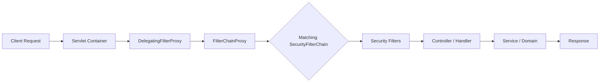
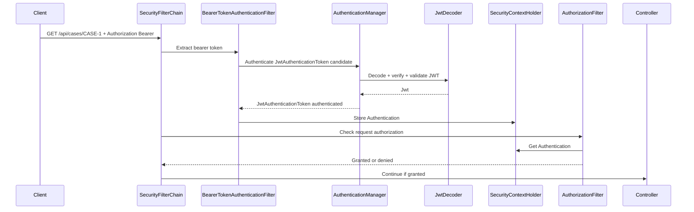
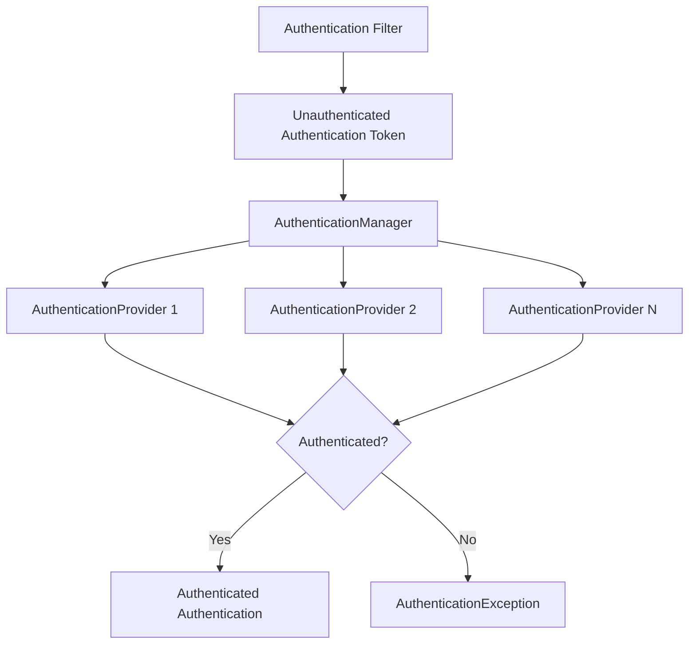
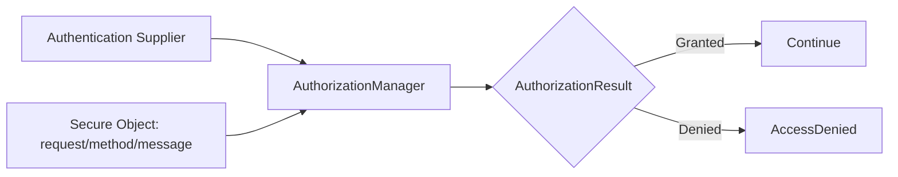

------
title: Learn Java Identity, Authentication & Authorization for Secure Enterprise API Platform - Part 012
description: Deep dive model inti Spring Security untuk aplikasi Java enterprise: SecurityFilterChain, SecurityContext, Authentication, GrantedAuthority, AuthenticationManager, AuthenticationProvider, BearerTokenAuthenticationFilter, ExceptionTranslation, AuthorizationManager, dan testing.
series: learn-java-identity-authentication-authorization-api-platform
seriesTitle: Learn Java Identity, Authentication & Authorization for Secure Enterprise API Platform
order: 12
partTitle: Spring Security Core Model Deep Dive
tags:
- java
- identity
- authentication
- authorization
- spring-security
- api-security
- oauth
- jwt
date: 2026-06-28
---

# Part 012 — Spring Security Core Model Deep Dive

> Target part ini: kamu memahami Spring Security sebagai request security pipeline, bukan sekadar kumpulan annotation dan konfigurasi. Kamu harus bisa membaca alur `SecurityFilterChain`, menjelaskan isi `SecurityContext`, membedakan authentication vs authorization, memetakan JWT/OIDC/session ke `Authentication`, dan mendesain boundary yang aman untuk enterprise API.

Spring Security sering terasa “magical” karena banyak konfigurasi fluent DSL dan auto-configuration. Untuk engineer senior, magic harus dipecah menjadi model sederhana:

```text
HTTP request masuk -> filter chain memproses credential -> Authentication dibuat -> disimpan di SecurityContext -> authorization memutuskan akses -> handler/domain logic berjalan -> context dibersihkan.
```

Jika model ini kabur, bug yang muncul biasanya serius:

- endpoint salah chain sehingga terbuka;
- actuator ikut policy API publik;
- JWT valid tetapi authority mapping salah;
- `ROLE_` dan `SCOPE_` bercampur;
- custom filter memasukkan principal palsu;
- async execution kehilangan security context;
- 401 dan 403 tertukar;
- method security dipercaya sebagai satu-satunya object authorization;
- test memakai mock user yang tidak menyerupai token production.

Part ini membangun pemahaman internal Spring Security untuk fondasi part berikutnya tentang resource server, authorization model, BOLA defense, method security, dan domain policy.

---

## 1. Kaufman Skill Slice

### 1.1 Target performa

Setelah part ini, kamu harus bisa:

- menjelaskan request lifecycle Spring Security servlet stack;
- membedakan `SecurityFilterChain`, `FilterChainProxy`, dan filter individual;
- membaca dan membuat beberapa `SecurityFilterChain` untuk boundary berbeda;
- menjelaskan `SecurityContext`, `Authentication`, `Principal`, `credentials`, `details`, dan `GrantedAuthority`;
- membedakan authentication failure, access denied, dan anonymous access;
- menulis authority mapping untuk JWT dengan sadar;
- mendesain 401/403 behavior untuk API;
- menulis test yang realistis untuk endpoint secured.

### 1.2 Subskill latihan

| Subskill | Latihan | Output |
|---|---|---|
| Filter chain reading | Trace request `/api/cases/1` | Tahu filter mana yang aktif |
| Context modeling | Inspect `Authentication` di controller/service | Bisa melihat principal dan authorities |
| Chain segmentation | Pisah API, BFF, actuator | Boundary tidak bercampur |
| JWT mapping | Ubah scope claim menjadi authority | Tidak salah pakai role |
| Exception semantics | Bedakan 401 vs 403 | Response API konsisten |
| Security tests | MockMvc dengan jwt/user | Test tidak memberi false confidence |

---

## 2. Mental Model Utama

Spring Security servlet stack berjalan sebagai filter pipeline di depan aplikasi.



Poin penting:

```text
Spring Security does not secure your application by wish. It secures requests that match configured filter chains and authorization rules.
```

Kalau request tidak match chain yang benar, policy yang kamu pikir aktif bisa tidak berjalan.

---

## 3. Komponen Besar Spring Security

| Komponen | Fungsi |
|---|---|
| `DelegatingFilterProxy` | Bridge dari servlet container ke Spring bean filter |
| `FilterChainProxy` | Memilih `SecurityFilterChain` yang cocok untuk request |
| `SecurityFilterChain` | Daftar filter security untuk request tertentu |
| Authentication filter | Mengambil credential dan membangun `Authentication` |
| `AuthenticationManager` | Mengorkestrasi proses authentication |
| `AuthenticationProvider` | Melakukan authentication untuk credential tertentu |
| `SecurityContext` | Menyimpan `Authentication` untuk request saat ini |
| `SecurityContextHolder` | Akses holder ke context, biasanya ThreadLocal di servlet stack |
| `AuthorizationManager` | Membuat keputusan authorization |
| Exception filter/handler | Mengubah failure menjadi 401/403/redirect |

---

## 4. Request Lifecycle untuk Bearer JWT API

Untuk stateless API dengan bearer token:



Dalam browser form login, filter dan credential berbeda. Tetapi konsepnya sama: credential masuk, `Authentication` dibuat, context diisi, authorization berjalan.

---

## 5. `Authentication` sebagai Security Object

`Authentication` adalah objek inti yang merepresentasikan hasil authentication.

Secara konseptual:

```java
public interface Authentication extends Principal, Serializable {
    Collection<? extends GrantedAuthority> getAuthorities();
    Object getCredentials();
    Object getDetails();
    Object getPrincipal();
    boolean isAuthenticated();
    void setAuthenticated(boolean isAuthenticated) throws IllegalArgumentException;
}
```

### 5.1 Principal

Principal adalah actor yang sudah dikenali.

Untuk username/password:

```text
principal = UserDetails / username
```

Untuk JWT resource server:

```text
principal = Jwt atau subject-derived name
```

Untuk OIDC login:

```text
principal = OidcUser
```

Enterprise invariant:

```text
Principal identity must be stable, non-ambiguous, and issuer-aware.
```

Jangan memakai display name atau email sebagai canonical principal.

### 5.2 Credentials

Credentials adalah bukti yang dipakai untuk authentication:

- password;
- bearer token;
- client secret;
- certificate;
- assertion.

Setelah authentication sukses, credentials idealnya tidak disimpan lebih lama dari perlu. Banyak implementation menghapus credentials untuk mengurangi leakage.

### 5.3 Authorities

Authorities adalah coarse-grained security labels yang Spring pakai untuk authorization checks.

Contoh:

```text
SCOPE_case:read
SCOPE_case:update
ROLE_ADMIN
PERMISSION_CASE_APPROVE
```

Penting:

```text
GrantedAuthority is not your full domain authorization model.
```

Authorities baik untuk gating kasar. Authorization domain tetap butuh resource context.

### 5.4 Details

`details` biasanya memuat data request tambahan:

- remote address;
- session id;
- client cert metadata;
- authentication details custom.

Jangan menaruh data sensitif besar di details tanpa kontrol audit/logging.

---

## 6. `SecurityContext` dan `SecurityContextHolder`

`SecurityContext` memegang `Authentication` saat ini.

```java
Authentication authentication = SecurityContextHolder
    .getContext()
    .getAuthentication();
```

Di servlet stack, default strategy biasanya ThreadLocal. Artinya context melekat pada thread request.

### 6.1 Gunakan wrapper service, bukan akses acak

Untuk aplikasi enterprise, hindari akses langsung `SecurityContextHolder` menyebar di seluruh codebase.

Buat abstraction:

```java
public interface CurrentActor {
    ActorId actorId();
    TenantId tenantId();
    ClientId clientId();
    Set<String> scopes();
    AssuranceLevel assuranceLevel();
}
```

Implementation:

```java
import org.springframework.security.core.Authentication;
import org.springframework.security.core.context.SecurityContextHolder;
import org.springframework.security.oauth2.jwt.Jwt;
import org.springframework.security.oauth2.server.resource.authentication.JwtAuthenticationToken;
import org.springframework.stereotype.Component;

@Component
public class SpringSecurityCurrentActor implements CurrentActor {

    @Override
    public ActorId actorId() {
        Jwt jwt = currentJwt();
        return new ActorId(jwt.getIssuer() + "|" + jwt.getSubject());
    }

    @Override
    public TenantId tenantId() {
        return new TenantId(currentJwt().getClaimAsString("tenant_id"));
    }

    @Override
    public ClientId clientId() {
        String clientId = currentJwt().getClaimAsString("client_id");
        if (clientId == null) {
            clientId = currentJwt().getClaimAsString("azp");
        }
        return new ClientId(clientId);
    }

    @Override
    public Set<String> scopes() {
        Authentication auth = SecurityContextHolder.getContext().getAuthentication();
        return auth.getAuthorities().stream()
            .map(Object::toString)
            .filter(a -> a.startsWith("SCOPE_"))
            .map(a -> a.substring("SCOPE_".length()))
            .collect(java.util.stream.Collectors.toUnmodifiableSet());
    }

    @Override
    public AssuranceLevel assuranceLevel() {
        String acr = currentJwt().getClaimAsString("acr");
        return AssuranceLevel.fromAcr(acr);
    }

    private Jwt currentJwt() {
        Authentication authentication = SecurityContextHolder.getContext().getAuthentication();
        if (authentication instanceof JwtAuthenticationToken jwtAuth) {
            return jwtAuth.getToken();
        }
        throw new IllegalStateException("Current authentication is not JWT-based");
    }
}
```

Dengan abstraction ini, domain service tidak bergantung pada Spring Security API secara langsung.

### 6.2 Context propagation

Untuk servlet synchronous request, ThreadLocal cukup. Untuk async, scheduled job, messaging, atau reactive pipeline, context propagation harus didesain eksplisit.

Prinsip:

```text
Never assume SecurityContext automatically follows execution across thread, queue, or service boundary.
```

Kalau pekerjaan asynchronous membutuhkan identity, propagasikan identity context yang minimal dan aman, bukan raw bearer token kecuali benar-benar diperlukan.

---

## 7. Authentication Flow dengan `AuthenticationManager`

Spring Security memisahkan request extraction dan actual authentication.



`ProviderManager` adalah implementation umum `AuthenticationManager` yang mendelegasikan ke daftar `AuthenticationProvider`.

### 7.1 AuthenticationProvider

Provider menjawab:

```text
Apakah saya bisa mengautentikasi token jenis ini? Jika ya, sukses/gagal?
```

Contoh custom provider sederhana:

```java
import org.springframework.security.authentication.AuthenticationProvider;
import org.springframework.security.core.Authentication;
import org.springframework.security.core.AuthenticationException;

public final class ApiKeyAuthenticationProvider implements AuthenticationProvider {
    private final ApiKeyVerifier verifier;

    public ApiKeyAuthenticationProvider(ApiKeyVerifier verifier) {
        this.verifier = verifier;
    }

    @Override
    public Authentication authenticate(Authentication authentication)
            throws AuthenticationException {
        ApiKeyAuthenticationToken token = (ApiKeyAuthenticationToken) authentication;

        VerifiedApiClient client = verifier.verify(token.rawApiKey());

        return ApiKeyAuthenticationToken.authenticated(
            client.clientId(),
            client.authorities()
        );
    }

    @Override
    public boolean supports(Class<?> authentication) {
        return ApiKeyAuthenticationToken.class.isAssignableFrom(authentication);
    }
}
```

Custom authentication harus hati-hati. Jangan membuat provider baru hanya karena belum memahami resource server built-in.

---

## 8. Filter Chain Segmentation

Aplikasi enterprise biasanya punya beberapa boundary:

- public API;
- internal API;
- BFF/browser endpoints;
- actuator/ops;
- webhook inbound;
- static/public docs.

Gunakan beberapa `SecurityFilterChain` dengan matcher jelas.

```java
import org.springframework.context.annotation.Bean;
import org.springframework.core.annotation.Order;
import org.springframework.security.config.annotation.web.builders.HttpSecurity;
import org.springframework.security.config.http.SessionCreationPolicy;
import org.springframework.security.web.SecurityFilterChain;

@Configuration
class SecurityChains {

    @Bean
    @Order(1)
    SecurityFilterChain actuator(HttpSecurity http) throws Exception {
        http
            .securityMatcher("/actuator/**")
            .authorizeHttpRequests(auth -> auth
                .requestMatchers("/actuator/health", "/actuator/info").permitAll()
                .anyRequest().hasAuthority("SCOPE_platform:operate")
            )
            .oauth2ResourceServer(oauth2 -> oauth2.jwt());
        return http.build();
    }

    @Bean
    @Order(2)
    SecurityFilterChain api(HttpSecurity http) throws Exception {
        http
            .securityMatcher("/api/**")
            .csrf(csrf -> csrf.disable())
            .sessionManagement(session -> session.sessionCreationPolicy(SessionCreationPolicy.STATELESS))
            .authorizeHttpRequests(auth -> auth
                .requestMatchers("/api/public/**").permitAll()
                .requestMatchers("/api/cases/**").hasAuthority("SCOPE_case:read")
                .anyRequest().authenticated()
            )
            .oauth2ResourceServer(oauth2 -> oauth2.jwt());
        return http.build();
    }

    @Bean
    @Order(3)
    SecurityFilterChain browser(HttpSecurity http) throws Exception {
        http
            .securityMatcher("/app/**", "/login/**", "/logout/**")
            .authorizeHttpRequests(auth -> auth
                .requestMatchers("/login/**").permitAll()
                .anyRequest().authenticated()
            )
            .oauth2Login(oauth2 -> {})
            .csrf(csrf -> {});
        return http.build();
    }
}
```

### 8.1 Chain pitfalls

| Pitfall | Dampak |
|---|---|
| Matcher terlalu luas di order awal | Chain berikutnya tidak pernah dipakai |
| Actuator mengikuti API chain | Ops endpoint bisa terbuka/terkunci salah |
| CSRF disabled untuk browser endpoint | Risiko CSRF |
| Session stateless untuk login browser | Login flow rusak |
| Public matcher terlalu luas | Endpoint sensitif terbuka |

Practice:

```text
For each endpoint family, identify its expected chain and test it.
```

---

## 9. Authorization di Spring Security

Authentication menjawab:

```text
Siapa actor ini dan bukti apa yang sudah diverifikasi?
```

Authorization menjawab:

```text
Apakah actor boleh mengakses secure object ini?
```

Spring Security modern menggunakan `AuthorizationManager` untuk keputusan authorization request/method/message.



### 9.1 Request authorization

```java
.authorizeHttpRequests(auth -> auth
    .requestMatchers(HttpMethod.GET, "/api/cases/**").hasAuthority("SCOPE_case:read")
    .requestMatchers(HttpMethod.PATCH, "/api/cases/**").hasAuthority("SCOPE_case:update")
    .anyRequest().denyAll()
)
```

Gunakan `denyAll` untuk default saat API belum lengkap.

### 9.2 Method authorization

```java
@EnableMethodSecurity
@Configuration
class MethodSecurityConfig {
}
```

Contoh:

```java
@PreAuthorize("hasAuthority('SCOPE_case:update')")
public CaseDto updateCase(String caseId, UpdateCaseRequest request) {
    CaseRecord caseRecord = repository.getRequired(caseId);
    domainAuthorization.assertCanUpdate(caseRecord);
    return service.update(caseRecord, request);
}
```

Method security bagus untuk coarse gate dan service boundary, tetapi object-level decision tetap harus domain-aware.

### 9.3 Custom AuthorizationManager untuk request context

Untuk tenant path check:

```java
import java.util.function.Supplier;
import org.springframework.security.authorization.AuthorizationDecision;
import org.springframework.security.authorization.AuthorizationManager;
import org.springframework.security.core.Authentication;
import org.springframework.security.web.access.intercept.RequestAuthorizationContext;

public final class TenantPathAuthorizationManager
        implements AuthorizationManager<RequestAuthorizationContext> {

    @Override
    public AuthorizationDecision check(
            Supplier<Authentication> authentication,
            RequestAuthorizationContext context) {

        Authentication auth = authentication.get();
        if (!(auth instanceof org.springframework.security.oauth2.server.resource.authentication.JwtAuthenticationToken jwtAuth)) {
            return new AuthorizationDecision(false);
        }

        String tokenTenant = jwtAuth.getToken().getClaimAsString("tenant_id");
        String pathTenant = context.getVariables().get("tenantId");

        return new AuthorizationDecision(tokenTenant != null && tokenTenant.equals(pathTenant));
    }
}
```

Usage:

```java
.requestMatchers("/api/tenants/{tenantId}/**")
.access(new TenantPathAuthorizationManager())
```

Catatan: ini hanya path-vs-token tenant check. Data-layer tenant enforcement tetap wajib.

---

## 10. `ROLE_`, `SCOPE_`, dan Naming Discipline

Spring punya convention `ROLE_` untuk role. OAuth2 resource server lazim memakai `SCOPE_` untuk scope.

### 10.1 Jangan mencampur role dan scope

Buruk:

```text
ROLE_case:read
SCOPE_ADMIN
ROLE_SCOPE_case:update
```

Baik:

```text
SCOPE_case:read
SCOPE_case:update
ROLE_CASE_MANAGER
PERMISSION_CASE_APPROVE
```

### 10.2 Scope bukan role

Scope adalah delegasi client ke resource server.

Role adalah posisi/entitlement actor dalam domain organisasi.

Contoh:

```text
User has role CASE_OFFICER.
Client has scope case:update.
Request still must pass domain policy for CASE-123.
```

### 10.3 Jangan masukkan semua permission detail ke authorities

Kalau `GrantedAuthority` berisi ribuan object id:

```text
CASE_001_READ
CASE_002_READ
CASE_003_READ
...
```

Itu tanda authorization model salah. Object-level authorization sebaiknya dilakukan dengan policy/data lookup.

---

## 11. 401 vs 403 Semantics

Untuk API:

- `401 Unauthorized`: credential tidak ada, invalid, expired, atau gagal authentication.
- `403 Forbidden`: credential valid, tetapi tidak punya izin.

Contoh:

| Scenario | Response |
|---|---|
| Tidak ada bearer token | 401 |
| Token expired | 401 |
| Signature invalid | 401 |
| Wrong audience | 401 |
| Scope kurang | 403 |
| Tenant path tidak cocok | 403 |
| Object bukan milik actor | 403 atau 404 sesuai anti-enumeration policy |

### 11.1 API entry point

```java
import jakarta.servlet.http.HttpServletRequest;
import jakarta.servlet.http.HttpServletResponse;
import org.springframework.security.core.AuthenticationException;
import org.springframework.security.web.AuthenticationEntryPoint;

public final class JsonAuthenticationEntryPoint implements AuthenticationEntryPoint {
    @Override
    public void commence(
            HttpServletRequest request,
            HttpServletResponse response,
            AuthenticationException authException) throws IOException {

        response.setStatus(HttpServletResponse.SC_UNAUTHORIZED);
        response.setContentType("application/json");
        response.getWriter().write("""
            {"error":"unauthorized","message":"Authentication required or invalid"}
            """);
    }
}
```

### 11.2 Access denied handler

```java
import jakarta.servlet.http.HttpServletRequest;
import jakarta.servlet.http.HttpServletResponse;
import org.springframework.security.access.AccessDeniedException;
import org.springframework.security.web.access.AccessDeniedHandler;

public final class JsonAccessDeniedHandler implements AccessDeniedHandler {
    @Override
    public void handle(
            HttpServletRequest request,
            HttpServletResponse response,
            AccessDeniedException accessDeniedException) throws IOException {

        response.setStatus(HttpServletResponse.SC_FORBIDDEN);
        response.setContentType("application/json");
        response.getWriter().write("""
            {"error":"forbidden","message":"Access denied"}
            """);
    }
}
```

Configuration:

```java
.exceptionHandling(ex -> ex
    .authenticationEntryPoint(new JsonAuthenticationEntryPoint())
    .accessDeniedHandler(new JsonAccessDeniedHandler())
)
```

Jangan bocorkan detail seperti “user exists but lacks role X” ke external client.

---

## 12. Anonymous Authentication

Spring Security dapat mengisi anonymous authentication untuk request tanpa login, tergantung konfigurasi.

Ini membantu authorization rule seperti `permitAll` dan `anonymous`, tetapi bisa membingungkan jika code domain hanya mengecek `authentication != null`.

Salah:

```java
Authentication auth = SecurityContextHolder.getContext().getAuthentication();
if (auth != null) {
    // dianggap authenticated
}
```

Benar:

```java
Authentication auth = SecurityContextHolder.getContext().getAuthentication();
if (auth != null && auth.isAuthenticated()
        && !(auth instanceof org.springframework.security.authentication.AnonymousAuthenticationToken)) {
    // authenticated real principal
}
```

Lebih baik: gunakan `CurrentActor` abstraction yang gagal eksplisit jika tidak ada authenticated actor.

---

## 13. Custom Filters: Kapan Perlu dan Kapan Berbahaya

Custom filter diperlukan untuk kasus seperti:

- API key legacy;
- signed webhook;
- mTLS header dari trusted proxy dengan boundary kuat;
- internal identity envelope;
- custom correlation/security audit enrichment.

Namun custom filter juga berbahaya karena bisa melewati built-in security behavior.

### 13.1 Contoh custom API key filter

```java
import jakarta.servlet.FilterChain;
import jakarta.servlet.ServletException;
import jakarta.servlet.http.HttpServletRequest;
import jakarta.servlet.http.HttpServletResponse;
import org.springframework.security.core.context.SecurityContextHolder;
import org.springframework.web.filter.OncePerRequestFilter;

public final class ApiKeyAuthenticationFilter extends OncePerRequestFilter {
    private final ApiKeyAuthenticationManager authenticationManager;

    public ApiKeyAuthenticationFilter(ApiKeyAuthenticationManager authenticationManager) {
        this.authenticationManager = authenticationManager;
    }

    @Override
    protected void doFilterInternal(
            HttpServletRequest request,
            HttpServletResponse response,
            FilterChain filterChain) throws ServletException, IOException {

        String apiKey = request.getHeader("X-API-Key");
        if (apiKey == null || apiKey.isBlank()) {
            filterChain.doFilter(request, response);
            return;
        }

        var candidate = ApiKeyAuthenticationToken.unauthenticated(apiKey);
        var authenticated = authenticationManager.authenticate(candidate);

        var context = SecurityContextHolder.createEmptyContext();
        context.setAuthentication(authenticated);
        SecurityContextHolder.setContext(context);

        filterChain.doFilter(request, response);
    }
}
```

Important:

- Do not authenticate from untrusted forwarded headers.
- Clear context properly; Spring filters normally handle this around request lifecycle.
- Put filter at correct position.
- Ensure failure returns 401, not silent anonymous.

---

## 14. Stateless API Configuration

Untuk bearer-token API:

```java
@Bean
SecurityFilterChain api(HttpSecurity http) throws Exception {
    http
        .securityMatcher("/api/**")
        .csrf(csrf -> csrf.disable())
        .sessionManagement(session -> session.sessionCreationPolicy(SessionCreationPolicy.STATELESS))
        .authorizeHttpRequests(auth -> auth
            .requestMatchers(HttpMethod.GET, "/api/cases/**").hasAuthority("SCOPE_case:read")
            .requestMatchers(HttpMethod.PATCH, "/api/cases/**").hasAuthority("SCOPE_case:update")
            .anyRequest().denyAll()
        )
        .oauth2ResourceServer(oauth2 -> oauth2.jwt())
        .exceptionHandling(ex -> ex
            .authenticationEntryPoint(new JsonAuthenticationEntryPoint())
            .accessDeniedHandler(new JsonAccessDeniedHandler())
        );

    return http.build();
}
```

Catatan:

- CSRF biasanya disabled untuk pure bearer API karena browser cookie session bukan credential utama.
- Untuk BFF/browser endpoints, jangan menyalin config ini mentah-mentah.
- Stateless session tidak berarti authorization stateless.

---

## 15. Testing Spring Security

Testing harus membuktikan:

- endpoint masuk chain yang benar;
- request tanpa credential ditolak;
- credential invalid ditolak;
- scope kurang menghasilkan 403;
- scope cukup belum tentu domain access cukup;
- tenant mismatch ditolak;
- public endpoint benar-benar public;
- default endpoint unknown tidak terbuka.

### 15.1 MockMvc dengan JWT

```java
import static org.springframework.security.test.web.servlet.request.SecurityMockMvcRequestPostProcessors.jwt;
import static org.springframework.test.web.servlet.request.MockMvcRequestBuilders.get;
import static org.springframework.test.web.servlet.result.MockMvcResultMatchers.status;

@Test
void caseReadRequiresScope() throws Exception {
    mockMvc.perform(get("/api/cases/CASE-1")
            .with(jwt().jwt(j -> j
                .subject("user-1")
                .claim("tenant_id", "tenant-a")
                .claim("scope", "profile:read")
            )))
        .andExpect(status().isForbidden());
}

@Test
void caseReadAllowedWithScope() throws Exception {
    mockMvc.perform(get("/api/cases/CASE-1")
            .with(jwt().jwt(j -> j
                .subject("user-1")
                .claim("tenant_id", "tenant-a")
                .claim("scope", "case:read")
            ).authorities(new SimpleGrantedAuthority("SCOPE_case:read"))))
        .andExpect(status().isOk());
}
```

### 15.2 Test unauthenticated

```java
@Test
void apiRejectsUnauthenticatedRequest() throws Exception {
    mockMvc.perform(get("/api/cases/CASE-1"))
        .andExpect(status().isUnauthorized());
}
```

### 15.3 Test default deny

```java
@Test
void unknownApiEndpointIsNotAccidentallyOpen() throws Exception {
    mockMvc.perform(get("/api/experimental/internal-dump")
            .with(jwt().authorities(new SimpleGrantedAuthority("SCOPE_case:read"))))
        .andExpect(status().isForbidden());
}
```

Tergantung routing, endpoint tidak ada bisa 404. Yang penting jangan 200.

### 15.4 Jangan hanya pakai `@WithMockUser`

`@WithMockUser` berguna untuk method security sederhana, tetapi sering tidak menyerupai JWT production.

Masalah:

- tidak ada issuer;
- tidak ada audience;
- tidak ada tenant claim;
- authorities bisa tidak sama dengan mapping production;
- test bisa lulus walau token mapping salah.

Gunakan `jwt()` untuk resource server behavior, dan integration test signed token untuk validator cryptographic.

---

## 16. Failure Modes

### 16.1 Endpoint terbuka karena chain tidak match

Contoh:

```java
.securityMatcher("/api/v1/**")
```

Tetapi endpoint baru:

```text
/api/v2/cases
```

Jika tidak ada fallback chain yang deny, endpoint bisa tidak terlindungi sesuai asumsi.

Mitigasi:

- fallback deny chain;
- endpoint inventory test;
- security matcher review setiap route baru.

### 16.2 Authority prefix salah

Config:

```java
.hasRole("ADMIN")
```

Membutuhkan authority `ROLE_ADMIN`, bukan `ADMIN`.

OAuth scope default:

```text
SCOPE_case:read
```

Mitigasi:

- naming convention tertulis;
- central converter;
- tests untuk mapping.

### 16.3 Method security melewatkan data access

```java
@PreAuthorize("hasAuthority('SCOPE_case:read')")
public CaseDto getCase(String caseId) {
    return repository.findById(caseId);
}
```

Scope cukup, tetapi tidak mengecek ownership/tenant.

Mitigasi:

- domain authorization service;
- repository tenant predicate;
- BOLA tests.

### 16.4 Custom filter mempercayai header dari internet

```http
X-User-Id: admin
X-Tenant-Id: tenant-a
```

Jika filter menerima header ini dari public network, attacker bisa impersonate.

Mitigasi:

- strip inbound identity headers at edge;
- accept only from trusted mTLS proxy;
- sign identity envelope;
- prefer standard bearer validation.

### 16.5 SecurityContext bocor antar request/thread

Jarang jika memakai standard filter lifecycle, tetapi bisa terjadi pada custom ThreadLocal misuse.

Mitigasi:

- jangan set context manual kecuali perlu;
- gunakan standard filters;
- clear context in finally untuk custom code;
- test async path.

---

## 17. Anti-Patterns

### 17.1 “We use Spring Security, so endpoints are secure”

Spring Security hanya mengeksekusi konfigurasi yang kamu tulis. Boundary matcher, chain order, dan default rules tetap tanggung jawab desain.

### 17.2 “Put business permissions in controllers only”

Controller-level authorization mudah terlewat saat service dipanggil dari scheduler, messaging, atau endpoint lain. Domain service harus punya invariant sendiri untuk aksi sensitif.

### 17.3 “Use roles for everything”

Role explosion akan muncul. Gunakan role untuk coarse grouping, scope untuk delegation, policy untuk domain decision.

### 17.4 “Mock user tests prove JWT validation works”

Mock user tidak menguji JWT decoder, issuer, audience, algorithm, JWKS, atau token expiry.

### 17.5 “Disable security in tests”

Jika security dimatikan di test controller, kamu kehilangan regression safety untuk salah konfigurasi endpoint.

---

## 18. Production Checklist

Untuk aplikasi Spring Security enterprise:

- [ ] Ada security chain eksplisit untuk API, browser/BFF, actuator, webhook/internal jika relevan.
- [ ] Chain order diuji.
- [ ] Default rule tidak membuka endpoint baru tanpa sengaja.
- [ ] 401/403 behavior konsisten untuk API.
- [ ] JWT authority converter terpusat.
- [ ] Principal key issuer-aware.
- [ ] `ROLE_` dan `SCOPE_` convention terdokumentasi.
- [ ] Domain service tidak bergantung langsung pada `SecurityContextHolder` di mana-mana.
- [ ] Ada `CurrentActor` abstraction.
- [ ] Object-level authorization tidak hanya di controller.
- [ ] Actuator tidak mengikuti policy public API secara tidak sengaja.
- [ ] Tests mencakup unauthenticated, forbidden, allowed, tenant mismatch, default deny.
- [ ] Custom filters direview security-nya.
- [ ] Tidak ada trust pada forwarded identity header dari public network.

---

## 19. Practice Drill

Buat security design untuk aplikasi berikut:

```text
- /api/cases/**              bearer JWT, stateless
- /api/tenants/{tenantId}/** bearer JWT, tenant path must match claim
- /app/**                    browser OIDC login, session cookie, CSRF enabled
- /actuator/health           public
- /actuator/**               platform operator scope
- /webhooks/payment/**       signed webhook, no user JWT
```

Output yang harus kamu buat:

1. Daftar `SecurityFilterChain` dan order.
2. Matcher setiap chain.
3. Authentication mechanism setiap chain.
4. Authorization rule minimal.
5. 401/403 behavior.
6. Authority naming convention.
7. Test matrix untuk setiap endpoint family.
8. Satu custom `AuthorizationManager` untuk tenant path.

Target latihan: 60 menit. Kalau kamu bisa menjelaskan desain ini ke engineer lain tanpa membuka dokumentasi, mental model Spring Security kamu sudah cukup kuat untuk masuk ke part resource server dan authorization domain yang lebih dalam.

---

## 20. Ringkasan

Spring Security harus dilihat sebagai pipeline:

```text
request -> matching chain -> authentication filter -> AuthenticationManager/Provider -> SecurityContext -> AuthorizationManager -> handler -> cleanup
```

Prinsip inti:

- Security chain matcher adalah boundary pertama.
- `Authentication` adalah representasi actor yang sudah diverifikasi.
- `GrantedAuthority` adalah label coarse-grained, bukan domain policy lengkap.
- `SecurityContextHolder` sebaiknya dibungkus abstraction domain seperti `CurrentActor`.
- 401 berarti authentication gagal; 403 berarti authentication valid tetapi akses ditolak.
- JWT test dengan mock user tidak membuktikan JWT validation.
- Controller/method security harus dilengkapi object-level/domain authorization.

Part berikutnya akan memperdalam Spring Security OAuth2 Resource Server: decoder, introspection, multi-issuer, authority mapping, tenant-aware authentication, dan konfigurasi production-grade.

---

## References

- Spring Security Reference — Servlet Architecture
- Spring Security Reference — Servlet Authentication Architecture
- Spring Security Reference — Authorization Architecture
- Spring Security Reference — Authorize HttpServletRequests
- Spring Security Reference — OAuth2 Resource Server JWT
- Spring Security Reference — Testing Method Security and MockMvc Security
- RFC 6750 — OAuth 2.0 Bearer Token Usage
- RFC 7519 — JSON Web Token (JWT)
