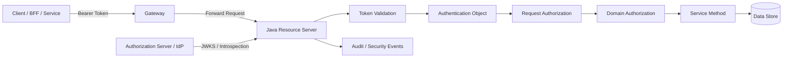
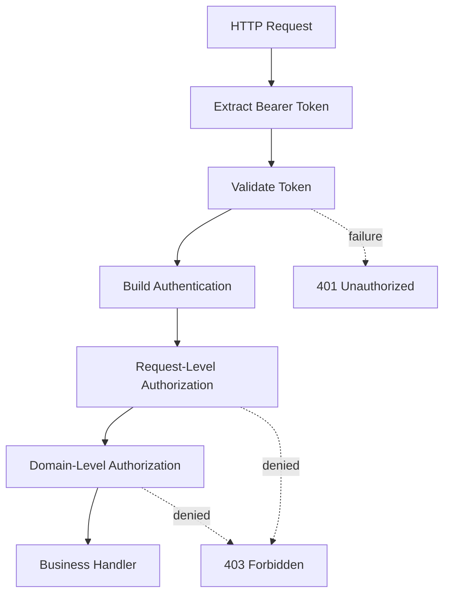
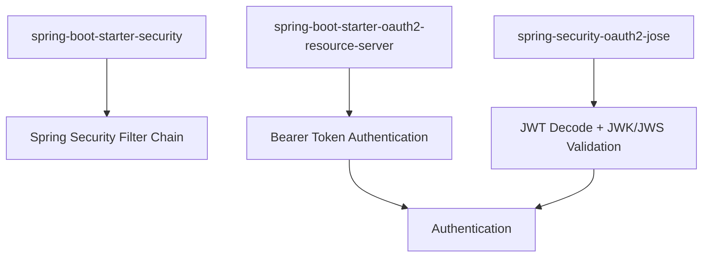
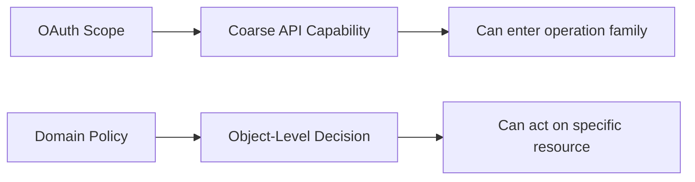
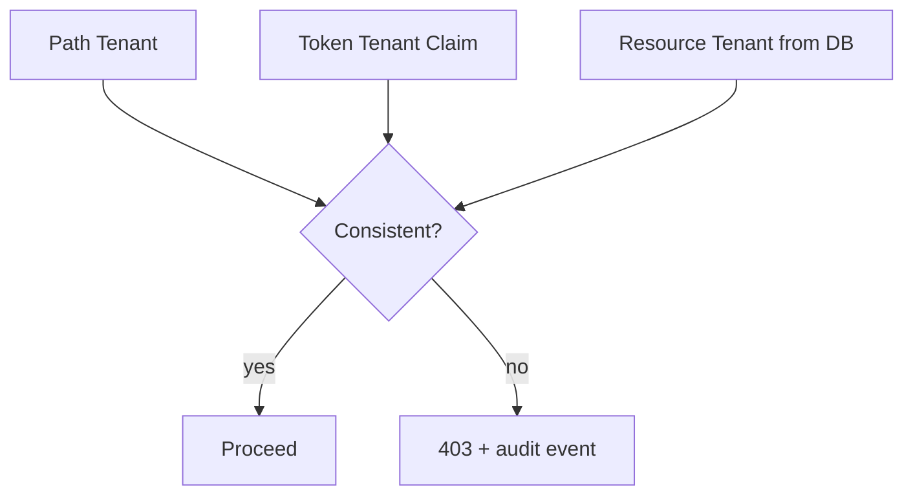
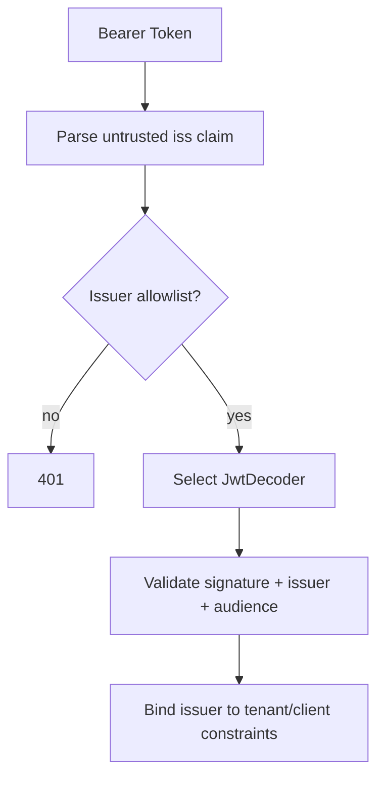

------
title: Learn Java Identity, Authentication & Authorization for Secure Enterprise API Platform - Part 013
description: Production-grade Spring Security OAuth2 Resource Server design for Java enterprise APIs: JWT, opaque token, issuer/audience validation, authorities mapping, multi-issuer routing, error semantics, testing, and operational failure modes.
series: learn-java-identity-authentication-authorization-api-platform
seriesTitle: Learn Java Identity, Authentication & Authorization for Secure Enterprise API Platform
order: 13
partTitle: Spring Security OAuth2 Resource Server
tags:
- java
- spring-security
- oauth2
- resource-server
- jwt
- opaque-token
- api-security
date: 2026-06-28
---

# Part 013 — Spring Security OAuth2 Resource Server

## 1. Problem Framing

A **resource server** is the API service that receives a bearer token and decides whether the request is allowed to enter the protected surface.

In an enterprise Java platform, this sounds simple:

> "Validate the JWT and check a scope."

That sentence hides most production failures.

A production resource server must answer all of these questions correctly for every request:

1. **Who issued this token?**
2. **Was this token intended for this API?**
3. **Is this token still valid?**
4. **Which client obtained it?**
5. **Which subject or workload is represented?**
6. **Which tenant context is asserted?**
7. **Which coarse-grained permissions are encoded?**
8. **Which domain authorization checks must still happen locally?**
9. **How should failure be reported without leaking sensitive information?**
10. **How is the decision logged for audit and incident response?**

Spring Security gives strong building blocks, but the architecture is still your responsibility.

A secure resource server is not just a filter. It is a **trust boundary**.



The resource server must not outsource all security to the gateway. A gateway can reject obviously invalid traffic, but the service that owns the data must enforce the final access boundary.

## 2. Kaufman Subskill Breakdown

For this part, the skill is:

> Build and review a Spring Security OAuth2 Resource Server that safely accepts bearer tokens in an enterprise API platform.

Break it into subskills:

| Subskill | What You Must Be Able to Do |
|---|---|
| Dependency selection | Know which Spring modules are needed for JWT and opaque token validation. |
| Token validation | Validate issuer, signature/introspection, expiry, audience, token type, and required claims. |
| Authority mapping | Convert token claims into safe application authorities without over-trusting arbitrary claims. |
| Endpoint authorization | Define deny-by-default request authorization rules. |
| Domain authorization | Keep object-level and tenant-level checks outside token validation. |
| Multi-issuer handling | Support multiple trusted issuers without accepting tokens from the wrong tenant/provider. |
| Failure semantics | Return correct 401/403 responses and structured errors without sensitive leakage. |
| Testing | Prove valid, invalid, expired, wrong-audience, wrong-issuer, missing-scope, and cross-tenant cases. |
| Operations | Monitor JWKS, introspection latency, error rates, token rejection causes, and policy drift. |

The first 20 hours should not be spent memorizing every Spring class. Spend it on these drills:

1. Configure a JWT resource server.
2. Add explicit audience validation.
3. Map `scope`/`scp` to authorities.
4. Add method-level authorization.
5. Add one negative test for each token invariant.
6. Add one object-level authorization test.
7. Simulate JWKS outage or introspection outage.
8. Review logs for audit usefulness.

## 3. Resource Server Mental Model

A resource server has **two separate jobs**:

1. **Authentication reconstruction** — turn a token into an authenticated principal.
2. **Authorization enforcement** — decide whether the principal may perform a specific action on a resource.

Do not collapse them.



### 3.1 Authentication Reconstruction

This stage proves that the token is trustworthy enough to create an `Authentication` object.

It answers:

- Is the token structurally valid?
- Was it issued by a trusted issuer?
- Is it cryptographically valid or active by introspection?
- Is it expired?
- Is it not before its valid time?
- Is the token intended for this API?
- Is the token type appropriate for this API?

### 3.2 Authorization Enforcement

This stage decides what the request can do.

It answers:

- Is the endpoint protected?
- Does the token carry required coarse permission?
- Is the subject allowed to access this tenant?
- Is the subject allowed to read/update/delete this object?
- Is the action allowed under current case/workflow state?
- Does the request require step-up authentication?
- Are there regulatory constraints like maker-checker or segregation of duties?

Token validation is necessary. It is not sufficient.

## 4. JWT vs Opaque Token in Spring Resource Server

Spring Security supports resource server protection using both JWT and opaque bearer tokens.

| Dimension | JWT Access Token | Opaque / Reference Token |
|---|---|---|
| Validation | Local signature validation using JWKS | Network call to introspection endpoint |
| Revocation | Harder unless short-lived or backed by denylist | Easier because AS can return inactive |
| Latency | Low after JWKS cache warm-up | Higher, depends on AS availability/cache |
| Claim privacy | Claims visible to holder | Claims not visible to holder |
| Operational coupling | Less runtime coupling to AS | More runtime coupling to AS |
| Failure mode | JWKS/cache/key rotation failures | Introspection latency/outage failures |
| Best fit | High-volume APIs, short-lived access tokens | High-risk APIs needing active state/revocation |

The right choice is not ideological.

Use JWT when:

- Access tokens are short-lived.
- Revocation does not need to be immediate.
- API traffic volume is high.
- The token audience is tightly scoped.
- Claims are safe to expose to clients.

Use opaque tokens when:

- Immediate revocation matters.
- Claim exposure is a concern.
- Authorization server can handle introspection reliably.
- You need central active-state control.
- The deployment has mature caching, SLOs, and circuit breaker strategy.

## 5. Minimal Dependencies

For a servlet-based Spring Boot API that validates JWT bearer tokens, include:

```xml
<dependency>
    <groupId>org.springframework.boot</groupId>
    <artifactId>spring-boot-starter-security</artifactId>
</dependency>
<dependency>
    <groupId>org.springframework.boot</groupId>
    <artifactId>spring-boot-starter-oauth2-resource-server</artifactId>
</dependency>
```

For JWT validation, Spring Security also needs JOSE support, typically provided transitively by Boot starter configuration. In explicit dependency setups, ensure the resource server and JOSE modules are present.

The conceptual stack is:



## 6. JWT Resource Server Configuration

### 6.1 Basic Configuration

A minimal YAML configuration:

```yaml
spring:
  security:
    oauth2:
      resourceserver:
        jwt:
          issuer-uri: https://idp.example.com/realms/platform
```

With `issuer-uri`, Spring can use provider metadata to discover the JWKS endpoint. This is convenient, but production systems should still explicitly reason about:

- Which issuers are allowed.
- Which audiences are allowed.
- How startup behaves if the IdP is unavailable.
- How key rotation is monitored.
- Whether multi-tenant issuers are accepted.

### 6.2 Security Filter Chain

```java
package com.example.security;

import org.springframework.context.annotation.Bean;
import org.springframework.context.annotation.Configuration;
import org.springframework.security.config.annotation.method.configuration.EnableMethodSecurity;
import org.springframework.security.config.annotation.web.builders.HttpSecurity;
import org.springframework.security.oauth2.server.resource.authentication.JwtAuthenticationConverter;
import org.springframework.security.web.SecurityFilterChain;

@Configuration
@EnableMethodSecurity
public class ApiSecurityConfig {

    @Bean
    SecurityFilterChain apiSecurity(HttpSecurity http,
                                    JwtAuthenticationConverter jwtAuthenticationConverter) throws Exception {
        return http
                .csrf(csrf -> csrf.disable())
                .authorizeHttpRequests(auth -> auth
                        .requestMatchers("/actuator/health", "/actuator/info").permitAll()
                        .requestMatchers("/actuator/**").hasAuthority("SCOPE_ops:read")
                        .requestMatchers("/api/**").authenticated()
                        .anyRequest().denyAll()
                )
                .oauth2ResourceServer(oauth2 -> oauth2
                        .jwt(jwt -> jwt.jwtAuthenticationConverter(jwtAuthenticationConverter))
                )
                .build();
    }
}
```

Important details:

- `anyRequest().denyAll()` prevents accidental exposure.
- `/actuator/health` can be public, but other actuator endpoints should not be.
- Endpoint-level checks are coarse. Domain checks still belong in service/application logic.
- Disabling CSRF is common for stateless bearer-token APIs, but do not copy this into browser session/BFF endpoints without thought.

## 7. Audience Validation

A common production vulnerability is accepting a valid token that was issued for another API.

Signature validity only proves:

> A trusted issuer signed this token.

It does not prove:

> This token was meant for this service.

The `aud` claim is the resource targeting boundary.

```java
package com.example.security;

import java.util.List;

import org.springframework.beans.factory.annotation.Value;
import org.springframework.context.annotation.Bean;
import org.springframework.context.annotation.Configuration;
import org.springframework.security.oauth2.core.DelegatingOAuth2TokenValidator;
import org.springframework.security.oauth2.core.OAuth2Error;
import org.springframework.security.oauth2.core.OAuth2TokenValidator;
import org.springframework.security.oauth2.core.OAuth2TokenValidatorResult;
import org.springframework.security.oauth2.jwt.Jwt;
import org.springframework.security.oauth2.jwt.JwtDecoder;
import org.springframework.security.oauth2.jwt.JwtDecoders;
import org.springframework.security.oauth2.jwt.JwtValidators;
import org.springframework.security.oauth2.jwt.NimbusJwtDecoder;

@Configuration
public class JwtDecoderConfig {

    @Bean
    JwtDecoder jwtDecoder(
            @Value("${security.oauth2.issuer}") String issuer,
            @Value("${security.oauth2.audience}") String audience) {

        NimbusJwtDecoder decoder = JwtDecoders.fromIssuerLocation(issuer);

        OAuth2TokenValidator<Jwt> issuerValidator = JwtValidators.createDefaultWithIssuer(issuer);
        OAuth2TokenValidator<Jwt> audienceValidator = new AudienceValidator(audience);

        decoder.setJwtValidator(new DelegatingOAuth2TokenValidator<>(
                issuerValidator,
                audienceValidator,
                new TokenTypeValidator("at+jwt")
        ));

        return decoder;
    }

    static final class AudienceValidator implements OAuth2TokenValidator<Jwt> {
        private final String requiredAudience;

        AudienceValidator(String requiredAudience) {
            this.requiredAudience = requiredAudience;
        }

        @Override
        public OAuth2TokenValidatorResult validate(Jwt token) {
            List<String> audiences = token.getAudience();
            if (audiences != null && audiences.contains(requiredAudience)) {
                return OAuth2TokenValidatorResult.success();
            }

            OAuth2Error error = new OAuth2Error(
                    "invalid_token",
                    "Token audience does not include required resource audience",
                    null
            );
            return OAuth2TokenValidatorResult.failure(error);
        }
    }

    static final class TokenTypeValidator implements OAuth2TokenValidator<Jwt> {
        private final String expectedType;

        TokenTypeValidator(String expectedType) {
            this.expectedType = expectedType;
        }

        @Override
        public OAuth2TokenValidatorResult validate(Jwt token) {
            String typ = token.getHeaders().get("typ") instanceof String value ? value : null;
            if (typ == null || expectedType.equals(typ) || "JWT".equals(typ)) {
                return OAuth2TokenValidatorResult.success();
            }

            return OAuth2TokenValidatorResult.failure(new OAuth2Error(
                    "invalid_token",
                    "Unexpected JWT type",
                    null
            ));
        }
    }
}
```

### 7.1 Security Invariant

```text
A resource server must reject a token whose issuer is trusted but whose audience does not include this API/resource identifier.
```

Without this invariant, a token minted for `profile-api` may be replayed against `payment-api` if both APIs trust the same issuer.

## 8. Authority Mapping

Spring Security commonly maps OAuth scopes to authorities prefixed with `SCOPE_`.

Example token claim:

```json
{
  "iss": "https://idp.example.com/realms/platform",
  "sub": "user-123",
  "aud": ["case-api"],
  "scope": "case:read case:write",
  "tenant_id": "tenant-a"
}
```

Spring authorities may become:

```text
SCOPE_case:read
SCOPE_case:write
```

### 8.1 Custom Converter

Some providers use `scp`, `roles`, `realm_access`, `resource_access`, or custom claims. Do not map everything blindly.

```java
package com.example.security;

import java.util.Collection;
import java.util.HashSet;
import java.util.List;
import java.util.Map;
import java.util.Set;
import java.util.stream.Collectors;

import org.springframework.context.annotation.Bean;
import org.springframework.context.annotation.Configuration;
import org.springframework.core.convert.converter.Converter;
import org.springframework.security.core.GrantedAuthority;
import org.springframework.security.core.authority.SimpleGrantedAuthority;
import org.springframework.security.oauth2.jwt.Jwt;
import org.springframework.security.oauth2.server.resource.authentication.JwtAuthenticationConverter;

@Configuration
public class JwtAuthorityMappingConfig {

    @Bean
    JwtAuthenticationConverter jwtAuthenticationConverter() {
        JwtAuthenticationConverter converter = new JwtAuthenticationConverter();
        converter.setPrincipalClaimName("sub");
        converter.setJwtGrantedAuthoritiesConverter(new PlatformAuthorityConverter());
        return converter;
    }

    static final class PlatformAuthorityConverter implements Converter<Jwt, Collection<GrantedAuthority>> {

        private static final Set<String> ALLOWED_SCOPES = Set.of(
                "case:read",
                "case:write",
                "case:approve",
                "tenant:admin",
                "ops:read"
        );

        @Override
        public Collection<GrantedAuthority> convert(Jwt jwt) {
            Set<String> authorities = new HashSet<>();

            for (String scope : scopes(jwt)) {
                if (ALLOWED_SCOPES.contains(scope)) {
                    authorities.add("SCOPE_" + scope);
                }
            }

            return authorities.stream()
                    .map(SimpleGrantedAuthority::new)
                    .collect(Collectors.toUnmodifiableSet());
        }

        private List<String> scopes(Jwt jwt) {
            Object scope = jwt.getClaims().get("scope");
            if (scope instanceof String value) {
                return List.of(value.split(" "));
            }

            Object scp = jwt.getClaims().get("scp");
            if (scp instanceof Collection<?> values) {
                return values.stream()
                        .filter(String.class::isInstance)
                        .map(String.class::cast)
                        .toList();
            }

            return List.of();
        }
    }
}
```

The allowlist is deliberate. It prevents an attacker or misconfigured issuer from injecting arbitrary authorities like:

```text
ROLE_ADMIN
SCOPE_superuser
SCOPE_*
```

### 8.2 Scope Is Not Domain Permission

A scope can say:

```text
case:read
```

It cannot by itself prove:

```text
subject user-123 may read case C-900 inside tenant-a at workflow state UNDER_INVESTIGATION
```

That requires domain authorization.



## 9. Request-Level Authorization

Request-level authorization is useful for coarse routing.

```java
.authorizeHttpRequests(auth -> auth
    .requestMatchers(HttpMethod.GET, "/api/cases/**").hasAuthority("SCOPE_case:read")
    .requestMatchers(HttpMethod.POST, "/api/cases/**").hasAuthority("SCOPE_case:write")
    .requestMatchers(HttpMethod.POST, "/api/cases/*/approval").hasAuthority("SCOPE_case:approve")
    .anyRequest().denyAll()
)
```

This is not enough.

Why?

Because all of these requests may satisfy `SCOPE_case:read`:

```http
GET /api/cases/CASE-1
GET /api/cases/CASE-2
GET /api/cases/OTHER-TENANT-CASE
```

The endpoint rule only knows the path pattern. It does not know object ownership, tenant membership, case assignment, clearance level, or workflow state.

## 10. Method-Level Authorization

Enable method security:

```java
@Configuration
@EnableMethodSecurity
class MethodSecurityConfig {
}
```

Example:

```java
package com.example.caseplatform.application;

import java.util.UUID;

import org.springframework.security.access.prepost.PreAuthorize;
import org.springframework.stereotype.Service;

@Service
public class CaseApplicationService {

    private final CaseRepository caseRepository;
    private final CaseAuthorizationPolicy caseAuthorizationPolicy;

    public CaseApplicationService(CaseRepository caseRepository,
                                  CaseAuthorizationPolicy caseAuthorizationPolicy) {
        this.caseRepository = caseRepository;
        this.caseAuthorizationPolicy = caseAuthorizationPolicy;
    }

    @PreAuthorize("hasAuthority('SCOPE_case:read')")
    public CaseDto getCase(UUID caseId) {
        CaseAggregate aggregate = caseRepository.getRequired(caseId);
        caseAuthorizationPolicy.assertCanRead(aggregate);
        return CaseDto.from(aggregate);
    }
}
```

This pattern separates:

- coarse operation permission: `SCOPE_case:read`
- object/domain permission: `assertCanRead(aggregate)`

The policy can inspect tenant, assignment, role, case state, confidentiality marker, and step-up status.

## 11. Extracting a Platform Principal

Avoid scattering raw JWT parsing across business code.

Create a platform-specific principal view.

```java
package com.example.security;

import java.time.Instant;
import java.util.Optional;
import java.util.Set;

import org.springframework.security.core.Authentication;
import org.springframework.security.core.GrantedAuthority;
import org.springframework.security.oauth2.jwt.Jwt;
import org.springframework.security.oauth2.server.resource.authentication.JwtAuthenticationToken;

public record PlatformPrincipal(
        String subject,
        Optional<String> userId,
        Optional<String> clientId,
        String tenantId,
        Set<String> authorities,
        Optional<String> assuranceLevel,
        Instant authenticatedAt
) {
    public static PlatformPrincipal from(Authentication authentication) {
        if (!(authentication instanceof JwtAuthenticationToken jwtAuth)) {
            throw new IllegalStateException("Expected JWT authentication");
        }

        Jwt jwt = jwtAuth.getToken();

        String subject = jwt.getSubject();
        String tenantId = requiredClaim(jwt, "tenant_id");

        Set<String> authorities = jwtAuth.getAuthorities().stream()
                .map(GrantedAuthority::getAuthority)
                .collect(java.util.stream.Collectors.toUnmodifiableSet());

        return new PlatformPrincipal(
                subject,
                Optional.ofNullable(jwt.getClaimAsString("user_id")),
                Optional.ofNullable(jwt.getClaimAsString("client_id")),
                tenantId,
                authorities,
                Optional.ofNullable(jwt.getClaimAsString("aal")),
                jwt.getIssuedAt()
        );
    }

    private static String requiredClaim(Jwt jwt, String name) {
        String value = jwt.getClaimAsString(name);
        if (value == null || value.isBlank()) {
            throw new IllegalStateException("Missing required claim: " + name);
        }
        return value;
    }
}
```

Then expose it through a small provider:

```java
package com.example.security;

import org.springframework.security.core.context.SecurityContextHolder;
import org.springframework.stereotype.Component;

@Component
public class CurrentPrincipalProvider {

    public PlatformPrincipal current() {
        return PlatformPrincipal.from(
                SecurityContextHolder.getContext().getAuthentication()
        );
    }
}
```

This keeps token vocabulary from leaking everywhere.

## 12. Tenant-Aware Resource Server Design

A multi-tenant platform needs explicit tenant binding.

Dangerous pattern:

```text
Request path says tenant-a.
Token says tenant-b.
Service silently uses path tenant.
```

Secure invariant:

```text
Tenant from request, token, and loaded resource must be consistent, unless the operation is explicitly modeled as cross-tenant administration.
```



Example guard:

```java
package com.example.caseplatform.security;

import org.springframework.stereotype.Component;

@Component
public class TenantGuard {

    private final CurrentPrincipalProvider principalProvider;

    public TenantGuard(CurrentPrincipalProvider principalProvider) {
        this.principalProvider = principalProvider;
    }

    public void assertSameTenant(String resourceTenantId) {
        PlatformPrincipal principal = principalProvider.current();
        if (!principal.tenantId().equals(resourceTenantId)) {
            throw new AccessDeniedException("Cross-tenant access denied");
        }
    }
}
```

Do not rely only on `tenant_id` in token. Also constrain queries and validate loaded resources.

## 13. Multi-Issuer Resource Server

Some platforms accept tokens from multiple issuers:

- issuer per tenant
- internal workforce IdP and customer IdP
- migration from old IdP to new IdP
- regional authorization servers

This is dangerous if issuer routing is loose.

Bad invariant:

```text
If any known JWKS validates the token, accept it.
```

Better invariant:

```text
Resolve issuer deterministically, validate with that issuer's decoder, and bind issuer to expected tenant/client/resource policy.
```



Parsing `iss` before verification is acceptable only for routing to an allowlisted decoder. It must not be treated as trusted business identity until validation succeeds.

## 14. Opaque Token Resource Server

YAML example:

```yaml
spring:
  security:
    oauth2:
      resourceserver:
        opaque-token:
          introspection-uri: https://idp.example.com/oauth2/introspect
          client-id: case-api
          client-secret: ${INTROSPECTION_CLIENT_SECRET}
```

Security chain:

```java
@Bean
SecurityFilterChain opaqueApiSecurity(HttpSecurity http) throws Exception {
    return http
            .authorizeHttpRequests(auth -> auth
                    .requestMatchers("/api/**").authenticated()
                    .anyRequest().denyAll()
            )
            .oauth2ResourceServer(oauth2 -> oauth2.opaqueToken(Customizer.withDefaults()))
            .build();
}
```

Opaque token introspection gives the resource server a way to ask the authorization server whether the token is active and retrieve metadata.

### 14.1 Introspection Failure Modes

| Failure | Risk | Mitigation |
|---|---|---|
| AS latency spike | API latency spike | timeout, caching, bulkhead, SLO alert |
| AS outage | API denies valid users or fails open | fail closed for protected APIs |
| over-caching active response | revoked token remains usable | short cache TTL based on risk tier |
| introspection client secret leak | attacker can introspect tokens | rotate secret, use mTLS/private_key_jwt where available |
| claim mapping drift | wrong authorities | allowlist scopes and contract-test claims |

Fail-open token validation is almost always unacceptable for regulated APIs.

## 15. 401 vs 403 Semantics

Use correct semantics:

| Condition | Response |
|---|---|
| No token | 401 |
| Malformed token | 401 |
| Expired token | 401 |
| Invalid signature | 401 |
| Wrong issuer/audience | 401 |
| Valid token but missing required scope | 403 |
| Valid token and scope but denied object-level access | 403 |
| Valid token but tenant mismatch | 403, usually with security audit event |

Do not leak:

- whether a user exists
- whether a case ID exists in another tenant
- which exact policy branch failed
- whether a hidden object is valid but forbidden

A safe external message:

```json
{
  "error": "access_denied",
  "message": "The request is not allowed."
}
```

A richer internal audit event:

```json
{
  "eventType": "AUTHZ_DENIED",
  "subject": "user-123",
  "clientId": "case-portal",
  "tenantId": "tenant-a",
  "resourceType": "CASE",
  "resourceIdHash": "sha256:...",
  "action": "READ",
  "reasonCode": "TENANT_MISMATCH",
  "correlationId": "01J...",
  "timestamp": "2026-06-28T09:00:00Z"
}
```

## 16. Secure Error Handling

Customize entry point and access denied handler when needed.

```java
@Bean
SecurityFilterChain apiSecurity(HttpSecurity http) throws Exception {
    return http
            .exceptionHandling(exceptions -> exceptions
                    .authenticationEntryPoint((request, response, ex) -> {
                        response.setStatus(401);
                        response.setContentType("application/json");
                        response.getWriter().write("""
                                {"error":"unauthorized","message":"Authentication is required."}
                                """);
                    })
                    .accessDeniedHandler((request, response, ex) -> {
                        response.setStatus(403);
                        response.setContentType("application/json");
                        response.getWriter().write("""
                                {"error":"access_denied","message":"The request is not allowed."}
                                """);
                    })
            )
            .authorizeHttpRequests(auth -> auth
                    .requestMatchers("/api/**").authenticated()
                    .anyRequest().denyAll()
            )
            .oauth2ResourceServer(oauth2 -> oauth2.jwt(Customizer.withDefaults()))
            .build();
}
```

Production systems often use RFC 7807-style problem responses. The important point is consistency and non-disclosure.

## 17. Object-Level Authorization: Where Resource Server Ends

Spring Resource Server can authenticate requests and check authorities.

It cannot automatically know object-level policy.

Example domain policy:

```java
package com.example.caseplatform.authorization;

import org.springframework.stereotype.Component;

@Component
public class CaseAuthorizationPolicy {

    private final CurrentPrincipalProvider principalProvider;

    public CaseAuthorizationPolicy(CurrentPrincipalProvider principalProvider) {
        this.principalProvider = principalProvider;
    }

    public void assertCanRead(CaseAggregate caze) {
        PlatformPrincipal principal = principalProvider.current();

        if (!principal.tenantId().equals(caze.tenantId())) {
            throw new AccessDeniedException("Denied");
        }

        boolean hasReadScope = principal.authorities().contains("SCOPE_case:read");
        boolean assigned = caze.isAssignedTo(principal.subject());
        boolean supervisor = principal.authorities().contains("SCOPE_case:supervise");

        if (!(hasReadScope && (assigned || supervisor))) {
            throw new AccessDeniedException("Denied");
        }
    }
}
```

This policy should be tested independently from HTTP mechanics.

## 18. Testing Resource Server Correctness

### 18.1 Controller Test with Mock JWT

```java
@WebMvcTest(CaseController.class)
@Import({ApiSecurityConfig.class, JwtAuthorityMappingConfig.class})
class CaseControllerSecurityTest {

    @Autowired
    MockMvc mvc;

    @Test
    void rejectsUnauthenticatedRequest() throws Exception {
        mvc.perform(get("/api/cases/11111111-1111-1111-1111-111111111111"))
                .andExpect(status().isUnauthorized());
    }

    @Test
    void requiresReadScope() throws Exception {
        mvc.perform(get("/api/cases/11111111-1111-1111-1111-111111111111")
                        .with(jwt().jwt(jwt -> jwt
                                .subject("user-123")
                                .claim("tenant_id", "tenant-a")
                                .claim("scope", "case:write"))))
                .andExpect(status().isForbidden());
    }

    @Test
    void allowsReadScopeAtRequestBoundary() throws Exception {
        mvc.perform(get("/api/cases/11111111-1111-1111-1111-111111111111")
                        .with(jwt().jwt(jwt -> jwt
                                .subject("user-123")
                                .claim("tenant_id", "tenant-a")
                                .claim("scope", "case:read"))))
                .andExpect(status().isOk());
    }
}
```

### 18.2 JWT Decoder Validation Tests

Test the decoder/pipeline, not only controller mocks.

Cases:

- valid issuer + audience
- valid issuer + wrong audience
- wrong issuer
- expired token
- future `nbf`
- missing subject
- missing tenant claim
- wrong algorithm
- unknown `kid`
- malformed scope claim

### 18.3 Domain Policy Tests

Example matrix:

| Subject | Scope | Token Tenant | Resource Tenant | Assigned | Expected |
|---|---|---|---|---|---|
| user-1 | case:read | tenant-a | tenant-a | yes | allow |
| user-1 | case:read | tenant-a | tenant-a | no | deny |
| user-1 | case:read | tenant-a | tenant-b | yes | deny |
| user-1 | case:write | tenant-a | tenant-a | yes | deny read |
| service-a | case:read | tenant-a | tenant-a | n/a | depends on service policy |

## 19. Observability

Resource server metrics should distinguish:

- missing token
- malformed token
- expired token
- invalid signature
- issuer rejected
- audience rejected
- introspection inactive
- introspection timeout
- missing scope
- object-level denied
- tenant mismatch

Do not log full bearer tokens.

Recommended log fields:

| Field | Why It Matters |
|---|---|
| correlationId | Trace the request across services. |
| issuer | Detect wrong/misconfigured IdP. |
| audience | Detect token replay across APIs. |
| subject hash | Debug without exposing stable raw identifiers. |
| clientId | Identify abusive or broken clients. |
| tenantId | Investigate tenant boundary issues. |
| routeId | Find exposed endpoint patterns. |
| decision | Permit/deny/error. |
| reasonCode | Aggregate failure causes. |
| latencyBucket | Detect introspection/JWKS issues. |

## 20. Production Checklist

### Token Validation

- [ ] Issuer validation is explicit.
- [ ] Audience validation is explicit.
- [ ] Expiry and clock skew are configured intentionally.
- [ ] Token type/header expectations are considered.
- [ ] Algorithms are constrained by trusted decoder configuration.
- [ ] JWKS/key rotation behavior is tested.
- [ ] Multi-issuer routing is allowlisted.
- [ ] Opaque token introspection is fail-closed.

### Authorization

- [ ] `anyRequest().denyAll()` or equivalent deny-by-default exists.
- [ ] Public endpoints are intentionally listed.
- [ ] Actuator endpoints are restricted.
- [ ] Request-level scope checks exist.
- [ ] Domain-level object authorization exists.
- [ ] Tenant consistency is enforced.
- [ ] Cross-tenant admin flows are explicitly modeled.
- [ ] Method-level security is enabled where useful.

### Operations

- [ ] Authentication/authorization failures have structured reason codes.
- [ ] Bearer tokens are never logged.
- [ ] JWKS refresh failures are monitored.
- [ ] Introspection latency/error rate is monitored if opaque tokens are used.
- [ ] Security config has integration tests.
- [ ] Authorization policy has matrix tests.

## 21. Common Anti-Patterns

### 21.1 Trusting Gateway-Only Authentication

Bad:

```text
Gateway validates token, downstream service trusts X-User-Id header.
```

This can be acceptable only with strong internal controls: mTLS, trusted network boundary, header stripping, service identity, and defense-in-depth. But regulated APIs should usually let each resource-owning service validate tokens or validate gateway-issued internal tokens.

### 21.2 Accepting Any Token from the IdP

Bad:

```text
iss valid => request authenticated
```

Missing audience validation enables cross-API token replay.

### 21.3 Putting Roles Directly in Business Logic

Bad:

```java
if (user.hasRole("ADMIN")) approve(caseId);
```

This hides context: tenant, case state, assignment, conflict of interest, required assurance, and maker-checker rules.

### 21.4 Mapping Arbitrary Claims to Authorities

Bad:

```text
roles claim => ROLE_*
```

Only map claims from trusted issuer contracts and allowlisted values.

### 21.5 Treating Scope as Object Authorization

Bad:

```text
SCOPE_case:read means any case can be read.
```

Scope opens a capability family. Object-level policy constrains specific resources.

## 22. Practice Drill

Build a small `case-api` resource server.

Requirements:

1. `GET /api/cases/{id}` requires `case:read`.
2. JWT issuer must be `https://idp.local/realms/platform`.
3. JWT audience must include `case-api`.
4. JWT must include `tenant_id`.
5. Loaded case tenant must equal token tenant.
6. Subject must be assigned to case or have `case:supervise`.
7. Denied object access returns 403.
8. Missing/invalid token returns 401.
9. Tests must include wrong audience and cross-tenant access.
10. Logs must include correlation ID and reason code, not token value.

The goal is not to create a fancy API. The goal is to prove you can build the boundary correctly.

## 23. References

- Spring Security Reference — OAuth2 Resource Server JWT: https://docs.spring.io/spring-security/reference/servlet/oauth2/resource-server/jwt.html
- Spring Security Reference — OAuth2 Resource Server Opaque Token: https://docs.spring.io/spring-security/reference/servlet/oauth2/resource-server/opaque-token.html
- Spring Security Reference — OAuth2 Resource Server: https://docs.spring.io/spring-security/reference/servlet/oauth2/resource-server/index.html
- RFC 7662 — OAuth 2.0 Token Introspection: https://datatracker.ietf.org/doc/html/rfc7662
- RFC 7519 — JSON Web Token: https://datatracker.ietf.org/doc/html/rfc7519
- RFC 9068 — JWT Profile for OAuth 2.0 Access Tokens: https://datatracker.ietf.org/doc/html/rfc9068
- OWASP API Security Top 10 2023 — API1 Broken Object Level Authorization: https://owasp.org/API-Security/editions/2023/en/0xa1-broken-object-level-authorization/
