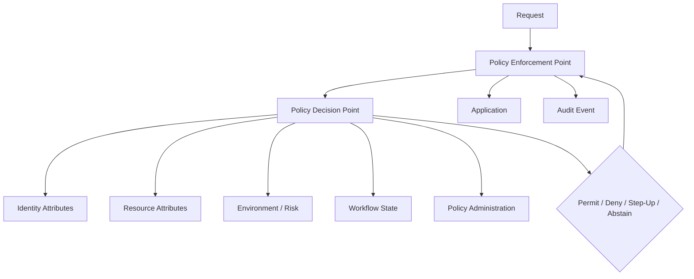
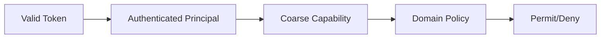
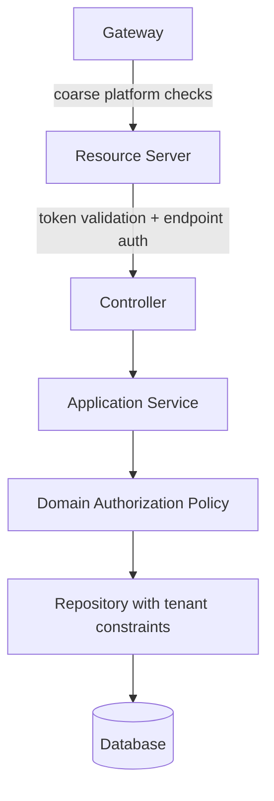
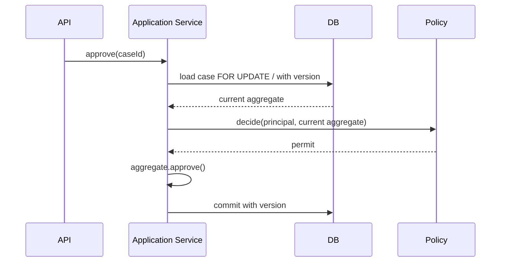
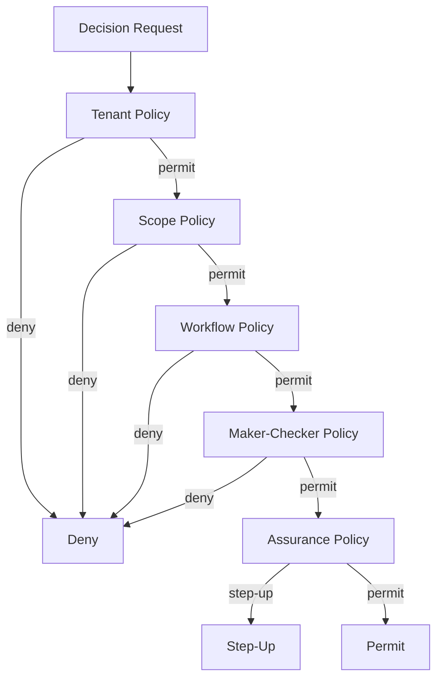

------
title: Learn Java Identity, Authentication & Authorization for Secure Enterprise API Platform - Part 014
description: Authorization mental model for Java enterprise systems: PEP/PDP/PIP/PAP, deny-by-default, decision records, subject-action-resource-context, local versus centralized policy, and enforcement correctness.
series: learn-java-identity-authentication-authorization-api-platform
seriesTitle: Learn Java Identity, Authentication & Authorization for Secure Enterprise API Platform
order: 14
partTitle: Authorization Mental Model: Decision, Enforcement, Context, Policy
tags:
- java
- authorization
- access-control
- policy
- api-security
- spring-security
date: 2026-06-28
---

# Part 014 — Authorization Mental Model: Decision, Enforcement, Context, Policy

## 1. Problem Framing

Most authorization bugs come from a weak mental model.

Teams often reduce authorization to one of these sentences:

```text
Check the user's role.
Check the scope.
Check the permission.
Check if the user owns the record.
```

Each sentence can be correct in a narrow case. None is sufficient as a general architecture.

A production enterprise platform must answer a more precise question:

> Should this subject, acting through this client, under this authentication assurance, from this tenant context, perform this action on this resource at this point in business workflow, according to current policy and regulatory constraints?

That is a different class of problem.

Authorization is not a helper method. It is a **decision system**.



This part builds the mental model needed before comparing RBAC, ABAC, ReBAC, ACL, capability-based access, OPA, Cedar, Spring annotations, or custom policy engines.

## 2. Kaufman Subskill Breakdown

Target skill:

> Design authorization decisions that are explicit, testable, auditable, and enforceable across Java enterprise APIs.

Subskills:

| Subskill | What You Must Be Able to Do |
|---|---|
| Decision modeling | Express authorization as subject-action-resource-context. |
| Enforcement placement | Identify the correct Policy Enforcement Point. |
| Policy separation | Separate policy meaning from framework mechanics. |
| Attribute sourcing | Know where identity, tenant, resource, workflow, and risk attributes come from. |
| Deny-by-default | Avoid accidental permit through missing checks or fallthrough. |
| Decision recording | Produce audit evidence without leaking sensitive data. |
| Failure modeling | Handle missing attributes, stale claims, PDP outage, and inconsistent tenant context. |
| Test design | Build authorization matrices and negative tests. |

Practice goal after this part:

> Given an endpoint like `POST /cases/{id}/approve`, you can write a complete authorization decision contract before writing the controller.

## 3. The Core Authorization Equation

Use this equation:

```text
Decision = f(subject, action, resource, context, policy)
```

Where:

| Element | Meaning | Examples |
|---|---|---|
| Subject | Who/what is acting | user, service, admin, delegated actor, support agent |
| Action | What is being attempted | read, create, update, approve, export, close, assign |
| Resource | What is affected | case, customer, document, payment, investigation, tenant |
| Context | Runtime facts | tenant, time, location, assurance, workflow state, risk, client app |
| Policy | Rules that decide | role policy, ownership rule, SoD rule, clearance rule, legal hold rule |

A vague check:

```java
hasRole("SUPERVISOR")
```

A real decision:

```text
Can subject user-123, acting through client case-portal, approve case CASE-9,
inside tenant-a, when the case is in REVIEW_PENDING,
if user-123 did not create the case, has approval authority for the region,
and authenticated with AAL2 within the last 15 minutes?
```

That is the level of precision needed for high-integrity systems.

## 4. Authentication vs Authorization

Authentication answers:

```text
Who/what is this actor?
```

Authorization answers:

```text
What is this actor allowed to do here and now?
```

A valid token does not imply permission.



Examples:

| Authentication Fact | Authorization Still Needed |
|---|---|
| Token is signed by trusted issuer | Was it issued for this API? |
| Subject is `user-123` | Can this subject access this tenant? |
| Scope includes `case:read` | Can this subject read this specific case? |
| Role is `SUPERVISOR` | Supervisor of which region/unit/case type? |
| MFA was completed | Was assurance recent enough for this action? |

## 5. The Four Policy Components: PEP, PDP, PIP, PAP

### 5.1 PEP — Policy Enforcement Point

The PEP is where access is actually blocked or allowed.

Examples:

- API gateway route rule
- Spring Security filter chain
- method security interceptor
- application service guard
- repository query constraint
- database row-level security
- message consumer guard
- workflow transition guard

A decision without enforcement is documentation.

### 5.2 PDP — Policy Decision Point

The PDP evaluates policy and returns a decision.

Examples:

- Java domain policy class
- Spring `AuthorizationManager`
- OPA service
- Cedar policy engine
- custom entitlement service
- workflow state guard

The PDP should return structured decisions, not just booleans, for high-value systems.

### 5.3 PIP — Policy Information Point

The PIP supplies attributes needed by policy.

Examples:

- current principal provider
- entitlement database
- tenant membership service
- case repository
- risk engine
- device posture service
- HR/workforce identity source
- workflow engine

Most authorization bugs are actually PIP bugs: missing, stale, ambiguous, or untrusted attributes.

### 5.4 PAP — Policy Administration Point

The PAP is where policy is defined, changed, approved, and governed.

Examples:

- admin UI for roles/permissions
- entitlement management system
- policy repository
- IAM governance process
- compliance-approved access matrix
- code-owned policy rules

Changing policy is a production change, even when no code is deployed.

## 6. Enforcement Placement

The same authorization concern may appear at multiple layers.

| Layer | Good For | Not Good For |
|---|---|---|
| Gateway | route exposure, token presence, coarse client policy, rate limits | object ownership, workflow state, case assignment |
| Resource server filter | token validation, coarse endpoint rule | domain-specific resource decisions |
| Controller | request shape and endpoint mapping | deep policy, reusable domain rules |
| Application service | use-case authorization, transaction boundary | low-level DB-only filters by itself |
| Domain policy | business invariant, object transition rule | HTTP token parsing |
| Repository/query | tenant and row-level constraints | explaining business access decisions alone |
| Database RLS | final data isolation guard | full actor/client/workflow context unless carefully propagated |

### 6.1 Recommended Pattern



Use multiple layers, but assign each layer a clear responsibility.

## 7. Deny-by-Default

A deny-by-default system behaves like this:

```text
If the request does not match a known permit rule, deny.
If required attributes are missing, deny.
If the policy engine cannot decide, deny or fail into a safe step-up/retry mode.
If tenant context is ambiguous, deny.
If object existence cannot be safely disclosed, deny with non-enumerating response.
```

Bad pattern:

```java
if (user.isAdmin()) {
    return true;
}
if (user.owns(resource)) {
    return true;
}
return true; // temporary during migration
```

Better pattern:

```java
if (user.isPlatformAdminFor(resource.tenantId())) {
    return Decision.permit("PLATFORM_ADMIN_TENANT_MATCH");
}
if (user.owns(resource) && action.isOwnerAllowed()) {
    return Decision.permit("OWNER_ALLOWED_ACTION");
}
return Decision.deny("NO_MATCHING_PERMIT_RULE");
```

Temporary permit rules become permanent vulnerabilities.

## 8. Model Decisions Explicitly

Avoid this for serious systems:

```java
boolean canApprove(Case caze);
```

Use a structured decision:

```java
package com.example.authorization;

import java.util.Map;

public sealed interface AuthorizationDecisionResult
        permits AuthorizationDecisionResult.Permit,
                AuthorizationDecisionResult.Deny,
                AuthorizationDecisionResult.StepUpRequired {

    String reasonCode();
    Map<String, String> evidence();

    record Permit(String reasonCode, Map<String, String> evidence)
            implements AuthorizationDecisionResult {}

    record Deny(String reasonCode, Map<String, String> evidence)
            implements AuthorizationDecisionResult {}

    record StepUpRequired(String reasonCode,
                          String requiredAssurance,
                          Map<String, String> evidence)
            implements AuthorizationDecisionResult {}
}
```

Why this matters:

- audit needs reason codes
- tests need expected outcomes
- operations need aggregate denial causes
- UI may need step-up rather than generic denial
- incident response needs decision evidence
- compliance review needs traceability

Do not return sensitive internals to the client. Keep decision evidence internal.

## 9. Subject-Action-Resource-Context Contract

Create a request object for decisions.

```java
package com.example.authorization;

import java.time.Instant;
import java.util.Map;

public record AuthorizationRequest(
        SubjectRef subject,
        String clientId,
        ActionRef action,
        ResourceRef resource,
        TenantRef tenant,
        AssuranceRef assurance,
        Map<String, String> environment,
        Instant requestedAt
) {}

public record SubjectRef(String type, String id) {}
public record ActionRef(String name) {}
public record ResourceRef(String type, String id) {}
public record TenantRef(String id) {}
public record AssuranceRef(String level, Instant authenticatedAt) {}
```

Example decision input:

```json
{
  "subject": { "type": "USER", "id": "user-123" },
  "clientId": "case-portal",
  "action": { "name": "CASE_APPROVE" },
  "resource": { "type": "CASE", "id": "CASE-9" },
  "tenant": { "id": "tenant-a" },
  "assurance": { "level": "AAL2", "authenticatedAt": "2026-06-28T08:55:00Z" },
  "environment": {
    "ipRisk": "LOW",
    "channel": "WEB"
  }
}
```

This contract can be tested, logged, reviewed, versioned, and mapped to external policy engines later.

## 10. Action Design

Authorization should use domain actions, not raw HTTP methods.

Bad:

```text
POST /cases/{id}/status
```

Better action vocabulary:

```text
CASE_SUBMIT
CASE_ASSIGN
CASE_APPROVE
CASE_REJECT
CASE_CLOSE
CASE_REOPEN
CASE_EXPORT
CASE_ATTACH_DOCUMENT
CASE_VIEW_CONFIDENTIAL_SECTION
```

Why?

Because one endpoint can represent multiple business actions, and one business action can appear across multiple interfaces.

| HTTP | Endpoint | Domain Action |
|---|---|---|
| GET | `/cases/{id}` | `CASE_READ` |
| PATCH | `/cases/{id}` | `CASE_UPDATE` |
| POST | `/cases/{id}/approval` | `CASE_APPROVE` |
| POST | `/cases/{id}/assignment` | `CASE_ASSIGN` |
| GET | `/cases/{id}/export` | `CASE_EXPORT` |

## 11. Resource Design

Resources are not always database rows.

Examples:

| Resource Type | Example ID | Notes |
|---|---|---|
| `CASE` | `CASE-123` | aggregate root |
| `CASE_DOCUMENT` | `DOC-9` | child resource; may inherit case policy with extra constraints |
| `CUSTOMER` | `CUST-5` | privacy-sensitive subject data |
| `TENANT` | `tenant-a` | administrative boundary |
| `REPORT` | `RPT-7` | derived data; may need source-resource constraints |
| `SEARCH_RESULT_SET` | query hash | authorization must constrain rows returned |
| `WORKFLOW_TRANSITION` | `CASE_APPROVE` | transition itself can be resource-like |

A common failure is authorizing the parent but forgetting child resources:

```text
Can read case metadata, but not confidential attachment.
```

Resource taxonomy should be explicit.

## 12. Context Design

Context is everything that changes the decision but is not the actor/action/resource itself.

Examples:

- tenant context
- client application
- channel: browser, API, batch, support console
- authentication assurance level
- time since authentication
- device posture
- IP or geo risk
- case workflow state
- data classification
- emergency/break-glass mode
- delegation/impersonation state
- legal hold
- conflict-of-interest signal

Context must be sourced carefully.

| Context | Usually Trusted From | Risk |
|---|---|---|
| tenant id | token + route + resource | mismatch or spoofing |
| client id | token claim | over-trusting public client identity |
| assurance | IdP/auth event | stale authentication |
| case state | database/workflow engine | stale loaded aggregate |
| device posture | device service | latency/outage |
| IP risk | gateway/risk engine | header spoofing if not sanitized |

## 13. Missing Attribute Semantics

Every policy should define what happens when an attribute is missing.

Example:

```text
Policy: Case approval requires user region == case region.
Missing user region: deny.
Missing case region: deny and emit data-quality/security event.
Missing both: deny.
```

Do not treat missing attributes as wildcards.

Bad:

```java
if (caseRegion == null || userRegion.equals(caseRegion)) {
    return permit();
}
```

Better:

```java
if (caseRegion == null) {
    return deny("CASE_REGION_MISSING");
}
if (userRegion == null) {
    return deny("USER_REGION_MISSING");
}
if (!userRegion.equals(caseRegion)) {
    return deny("REGION_MISMATCH");
}
return permit("REGION_MATCH");
```

## 14. Local vs Centralized Authorization

Authorization can be implemented locally, centrally, or hybrid.

| Model | Description | Strength | Risk |
|---|---|---|---|
| Local policy classes | Java code inside service | close to domain, easy to test with aggregate | duplicated across services |
| Shared library | common Java authorization module | consistency | version skew, hidden coupling |
| Central PDP | service calls policy engine | central governance | latency, outage, context serialization complexity |
| Sidecar PDP | local agent evaluates policy | lower latency than remote | operational complexity |
| Database RLS | DB enforces row access | strong final guard | can lose business context |
| Hybrid | coarse central + domain local + DB guard | defense-in-depth | needs clear ownership |

### 14.1 Practical Recommendation

For many Java enterprise platforms:

1. Use Spring Security for token validation and coarse request authorization.
2. Use local Java domain policies for aggregate-specific decisions.
3. Use query constraints for tenant and row-level containment.
4. Use central entitlement/policy service for shared grants, roles, and governance.
5. Use audit events consistently across all decisions.

Centralize what must be consistent. Keep domain-specific decisions near the domain model.

## 15. Policy Decision Point as Java Code

Example PDP for case approval:

```java
package com.example.caseplatform.authorization;

import java.time.Duration;
import java.time.Instant;
import java.util.Map;

import org.springframework.stereotype.Component;

@Component
public class CaseApprovalPolicy {

    public AuthorizationDecisionResult decide(CaseApprovalDecisionInput input) {
        if (!input.principal().tenantId().equals(input.caze().tenantId())) {
            return deny("TENANT_MISMATCH");
        }

        if (!input.principal().authorities().contains("SCOPE_case:approve")) {
            return deny("MISSING_CASE_APPROVE_SCOPE");
        }

        if (!input.caze().status().equals(CaseStatus.REVIEW_PENDING)) {
            return deny("CASE_NOT_PENDING_REVIEW");
        }

        if (input.caze().createdBy().equals(input.principal().subject())) {
            return deny("MAKER_CHECKER_VIOLATION");
        }

        if (!input.caze().region().equals(input.principal().region())) {
            return deny("REGION_MISMATCH");
        }

        if (!"AAL2".equals(input.principal().assuranceLevel().orElse(null))) {
            return stepUp("AAL2_REQUIRED", "AAL2");
        }

        Instant authenticatedAt = input.principal().authenticatedAt();
        if (Duration.between(authenticatedAt, input.now()).toMinutes() > 15) {
            return stepUp("RECENT_AUTH_REQUIRED", "AAL2_RECENT");
        }

        return permit("APPROVER_REGION_MATCH_AND_MAKER_CHECKER_OK");
    }

    private AuthorizationDecisionResult deny(String reason) {
        return new AuthorizationDecisionResult.Deny(reason, Map.of());
    }

    private AuthorizationDecisionResult permit(String reason) {
        return new AuthorizationDecisionResult.Permit(reason, Map.of());
    }

    private AuthorizationDecisionResult stepUp(String reason, String requiredAssurance) {
        return new AuthorizationDecisionResult.StepUpRequired(reason, requiredAssurance, Map.of());
    }
}
```

This is explicit, testable, auditable, and readable.

## 16. PEP in Application Service

```java
@Service
public class CaseApprovalApplicationService {

    private final CaseRepository caseRepository;
    private final CurrentPrincipalProvider principalProvider;
    private final CaseApprovalPolicy approvalPolicy;
    private final AuthorizationAuditPublisher auditPublisher;

    @Transactional
    public void approve(UUID caseId, ApprovalCommand command) {
        CaseAggregate caze = caseRepository.getRequiredForUpdate(caseId);
        PlatformPrincipal principal = principalProvider.current();

        AuthorizationDecisionResult decision = approvalPolicy.decide(
                new CaseApprovalDecisionInput(principal, caze, Instant.now())
        );

        auditPublisher.publish(principal, "CASE_APPROVE", caze, decision);

        switch (decision) {
            case AuthorizationDecisionResult.Permit ignored -> caze.approve(command.comment(), principal.subject());
            case AuthorizationDecisionResult.StepUpRequired stepUp -> throw new StepUpRequiredException(stepUp.requiredAssurance());
            case AuthorizationDecisionResult.Deny denied -> throw new AccessDeniedException("Denied");
        }
    }
}
```

The enforcement point is inside the transaction/use-case boundary. That matters because:

- the aggregate is loaded with current state
- TOCTOU risk is reduced
- the state transition and decision are close together
- audit can record the exact decision before mutation

## 17. Avoiding TOCTOU

TOCTOU means time-of-check/time-of-use.

Bad sequence:

```text
1. Load case.
2. Check user can approve.
3. Another transaction changes case state.
4. Approve based on stale state.
```

Mitigations:

- perform decision and mutation in one transaction
- use optimistic locking/version checks
- load aggregate with appropriate lock for critical transitions
- re-check authorization after loading current state
- encode transition invariants inside aggregate



Authorization is only as correct as the state it evaluated.

## 18. Authorization and Query Boundaries

For list/search endpoints, object authorization must shape the query.

Bad:

```java
List<Case> cases = caseRepository.findAll();
return cases.stream()
        .filter(policy::canRead)
        .toList();
```

Problems:

- data loaded into memory before authorization
- pagination becomes wrong
- performance collapses
- side-channel risks increase
- accidental logging/debugging may expose data

Better:

```java
public Page<CaseSummary> searchVisibleCases(CaseSearchQuery query, Pageable pageable) {
    PlatformPrincipal principal = principalProvider.current();
    CaseVisibilityConstraint constraint = visibilityPolicy.constraintFor(principal);
    return caseRepository.search(query, constraint, pageable);
}
```

The constraint is part of authorization.

Example:

```java
public record CaseVisibilityConstraint(
        String tenantId,
        Set<String> allowedRegions,
        boolean includeAssignedOnly,
        String subjectId
) {}
```

## 19. Audit Model for Authorization Decisions

Every significant authorization decision should be auditable.

Not every low-level check needs a separate external audit event, but high-risk actions should produce evidence.

Example event:

```json
{
  "eventType": "AUTHORIZATION_DECISION",
  "decision": "DENY",
  "reasonCode": "MAKER_CHECKER_VIOLATION",
  "subjectIdHash": "sha256:...",
  "clientId": "case-portal",
  "tenantId": "tenant-a",
  "action": "CASE_APPROVE",
  "resourceType": "CASE",
  "resourceIdHash": "sha256:...",
  "policyVersion": "case-approval-policy@2026-06-28",
  "correlationId": "01J...",
  "timestamp": "2026-06-28T09:00:00Z"
}
```

Audit invariant:

```text
The system must be able to explain why a high-risk action was permitted or denied without exposing secrets or full sensitive payloads in logs.
```

## 20. Policy Versioning

Policy changes can alter access without code changes.

Track:

- policy version
- effective date
- approver
- reason for change
- impacted roles/entitlements
- migration behavior
- rollback behavior
- test evidence

For code-owned policies, version can be tied to:

- git commit SHA
- deployment version
- policy class version
- feature flag version

For admin-managed policies, version can be tied to:

- entitlement configuration version
- policy document version
- approval workflow ID

## 21. Step-Up as Authorization Outcome

Not every denial is final.

Some decisions mean:

```text
The subject may perform this action only after stronger or fresher authentication.
```

Examples:

- export personal data
- approve high-value payment
- view sealed case section
- change MFA settings
- create privileged API client
- perform break-glass access

Decision outcomes:

| Outcome | Meaning |
|---|---|
| Permit | Action may proceed. |
| Deny | Action must not proceed. |
| Step-up required | Stronger/fresher auth required before proceeding. |
| Review required | Human approval/workflow required. |
| Not applicable | Policy does not handle this action/resource. Usually deny unless another policy explicitly permits. |

## 22. Delegation and Acting-As

Authorization must distinguish:

- authenticated subject
- effective actor
- delegator
- delegatee
- client application
- support/admin impersonation state

Example:

```text
support-agent-7 acting as customer-123 through support-console for troubleshooting
```

Never collapse this into:

```text
subject = customer-123
```

You lose accountability.

Better decision context:

```json
{
  "authenticatedSubject": "support-agent-7",
  "effectiveSubject": "customer-123",
  "actingMode": "SUPPORT_IMPERSONATION",
  "clientId": "support-console",
  "reasonTicket": "INC-12345"
}
```

Delegation rules should be more restrictive and more heavily audited than ordinary user access.

## 23. Central PDP Failure Modes

If using a remote policy service, define outage behavior.

| Failure | Safe Behavior |
|---|---|
| PDP timeout for read of public metadata | possibly degrade if explicitly classified low-risk |
| PDP timeout for regulated data | deny or retry within strict timeout |
| PDP timeout for privileged mutation | deny |
| missing resource attributes | deny |
| stale entitlement cache | use bounded TTL and emit warning |
| policy parse error | reject new policy; do not deploy broken policy |
| split brain policy version | pin version per request or service release |

For high-risk APIs, fail closed.

## 24. Spring Security AuthorizationManager

Spring Security's modern authorization model uses `AuthorizationManager` in many places. Conceptually, it is a small PDP interface that can be used at request or method boundaries.

Example custom request-level manager:

```java
package com.example.security;

import java.util.function.Supplier;

import org.springframework.security.authorization.AuthorizationDecision;
import org.springframework.security.authorization.AuthorizationManager;
import org.springframework.security.core.Authentication;
import org.springframework.security.web.access.intercept.RequestAuthorizationContext;
import org.springframework.stereotype.Component;

@Component
public class TenantHeaderAuthorizationManager
        implements AuthorizationManager<RequestAuthorizationContext> {

    @Override
    public AuthorizationDecision check(Supplier<Authentication> authentication,
                                       RequestAuthorizationContext context) {
        Authentication auth = authentication.get();
        if (auth == null || !auth.isAuthenticated()) {
            return new AuthorizationDecision(false);
        }

        String tenantFromHeader = context.getRequest().getHeader("X-Tenant-Id");
        if (tenantFromHeader == null || tenantFromHeader.isBlank()) {
            return new AuthorizationDecision(false);
        }

        // In production, compare against a strongly modeled principal, not raw string parsing.
        boolean allowed = auth.getAuthorities().stream()
                .anyMatch(a -> a.getAuthority().equals("TENANT_" + tenantFromHeader));

        return new AuthorizationDecision(allowed);
    }
}
```

This is useful for coarse checks, but domain authorization still belongs in domain/application policy when object state matters.

## 25. Policy Composition

Large systems need multiple policies.

Example for `CASE_APPROVE`:

1. tenant policy
2. scope/capability policy
3. assignment/region policy
4. workflow state policy
5. maker-checker policy
6. assurance policy
7. conflict-of-interest policy

Policy composition must be deterministic.



Composition rules:

- Any mandatory deny wins.
- Step-up may override permit but not override deny.
- Missing attribute denies unless explicitly low-risk.
- Permit requires all mandatory policies to permit.
- Policy order should be documented.

## 26. Testing Authorization

### 26.1 Matrix Tests

Authorization should be tested with matrices, not only happy paths.

| Case | Tenant Match | Scope | Assigned | State | Maker | AAL | Expected |
|---|---|---|---|---|---|---|---|
| 1 | yes | approve | yes | pending | different | AAL2 recent | permit |
| 2 | no | approve | yes | pending | different | AAL2 recent | deny |
| 3 | yes | missing | yes | pending | different | AAL2 recent | deny |
| 4 | yes | approve | no | pending | different | AAL2 recent | deny |
| 5 | yes | approve | yes | closed | different | AAL2 recent | deny |
| 6 | yes | approve | yes | pending | same | AAL2 recent | deny |
| 7 | yes | approve | yes | pending | different | AAL1 | step-up |
| 8 | yes | approve | yes | pending | different | AAL2 stale | step-up |

### 26.2 Property-Style Thinking

Useful invariants:

```text
No subject can access a resource from another tenant unless cross-tenant policy explicitly permits it.
No subject can approve a case they created.
No approval can happen unless case state is REVIEW_PENDING.
No confidential section can be read without clearance and recent assurance.
No list endpoint can return objects outside the visibility constraint.
```

### 26.3 Negative Test First

For every new protected operation, write denial tests before permit tests.

Required denial tests:

- no authentication
- missing scope/capability
- wrong tenant
- wrong object owner/assignment
- wrong workflow state
- stale assurance
- missing required attribute
- delegated/impersonated actor without permission
- support/admin access without reason/ticket

## 27. Authorization Review Checklist

Before shipping an API operation, answer:

- [ ] What is the domain action name?
- [ ] What is the resource type?
- [ ] What subject types may perform it?
- [ ] What client types may initiate it?
- [ ] Which tenant constraints apply?
- [ ] Which scopes/capabilities are required?
- [ ] Which object attributes are required?
- [ ] Which workflow states allow the action?
- [ ] Does it require recent/strong authentication?
- [ ] Does maker-checker or SoD apply?
- [ ] Does delegation/impersonation change behavior?
- [ ] Where is the PEP?
- [ ] Where is the PDP?
- [ ] Which PIPs supply attributes?
- [ ] What happens if attributes are missing?
- [ ] What is logged for permit and deny?
- [ ] Which tests prove denial paths?

## 28. Common Anti-Patterns

### 28.1 Controller-Only Authorization

Controller checks are easy to bypass when the same service method is called from batch jobs, message consumers, admin tools, or future endpoints.

Put domain authorization in the application service or domain policy layer.

### 28.2 Role Explosion

Creating a new role for every edge case leads to ungovernable policy:

```text
CASE_APPROVER_SENIOR_REGION_A_TEMP_CONFIDENTIAL_EXPORT
```

Prefer roles for job function, permissions for capabilities, attributes for context, and domain policy for rules.

### 28.3 Over-Centralizing Domain Policy

A central PDP that knows nothing about aggregate invariants can become a shallow gate that permits invalid transitions.

Workflow/domain rules should stay close to the model or be synchronized through explicit state attributes.

### 28.4 Allowing by Absence

Bad:

```text
No rule matched, so allow.
```

For enterprise APIs, no rule means deny.

### 28.5 Auditing Only Denials

Permits matter too, especially for high-risk actions. A suspicious successful export is often more important than a denied attempt.

### 28.6 Trusting Client-Supplied Resource Attributes

Bad:

```json
{
  "caseId": "CASE-9",
  "tenantId": "tenant-a",
  "ownerId": "user-123"
}
```

The client may send identifiers, but authoritative resource attributes must come from trusted server-side sources.

## 29. Mental Model Summary

Authorization is a decision function:

```text
Decision = f(subject, action, resource, context, policy)
```

A strong authorization design has:

- explicit action vocabulary
- explicit resource taxonomy
- trusted attribute sources
- clear enforcement points
- deterministic policy composition
- deny-by-default behavior
- object-level and tenant-level checks
- structured decision records
- negative tests
- audit evidence

A weak authorization design has:

- scattered role checks
- hidden default permits
- no object-level checks
- no tenant consistency checks
- no decision logging
- no negative tests
- no failure-mode behavior
- ambiguous ownership between gateway, service, and database

## 30. Practice Drill

Take one operation:

```text
POST /api/cases/{caseId}/approval
```

Write the authorization contract before implementation:

1. Domain action name.
2. Resource type.
3. Required token scope.
4. Required tenant relationship.
5. Required workflow state.
6. Required assignment/role/region.
7. Maker-checker rule.
8. Required assurance level and recency.
9. Delegation/impersonation restrictions.
10. PEP location.
11. PDP implementation.
12. PIP sources.
13. Missing attribute behavior.
14. Audit event fields.
15. Matrix tests.

Only after that, write the controller.

## 31. References

- Spring Security Reference — Authorization: https://docs.spring.io/spring-security/reference/servlet/authorization/index.html
- Spring Security Reference — Method Security: https://docs.spring.io/spring-security/reference/servlet/authorization/method-security.html
- OWASP API Security Top 10 2023 — API1 Broken Object Level Authorization: https://owasp.org/API-Security/editions/2023/en/0xa1-broken-object-level-authorization/
- OWASP API Security Top 10 2023: https://owasp.org/API-Security/editions/2023/en/0x11-t10/
- NIST SP 800-63-4 — Digital Identity Guidelines: https://pages.nist.gov/800-63-4/
- RFC 9700 — Best Current Practice for OAuth 2.0 Security: https://datatracker.ietf.org/doc/html/rfc9700
