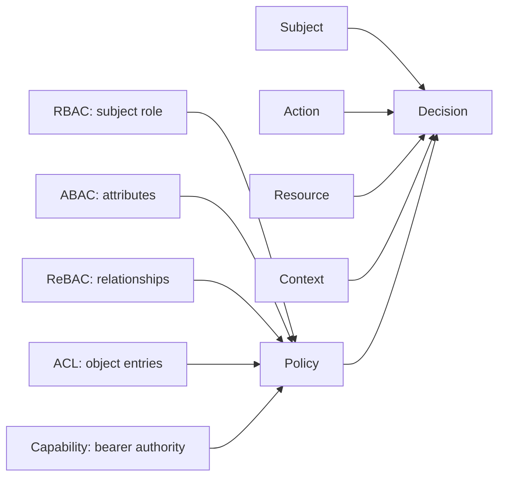
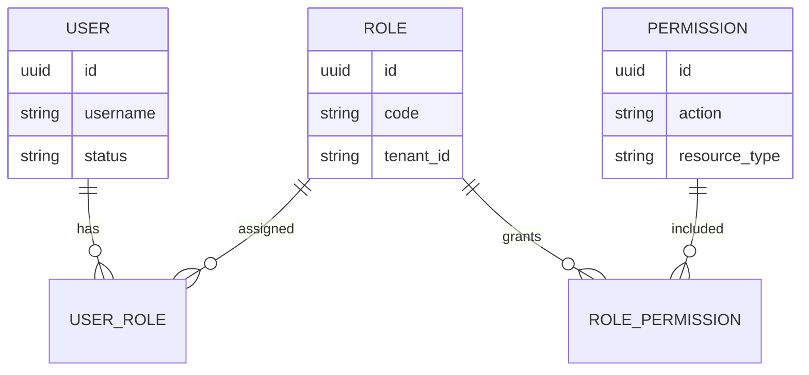
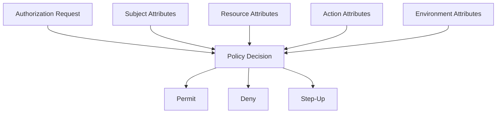
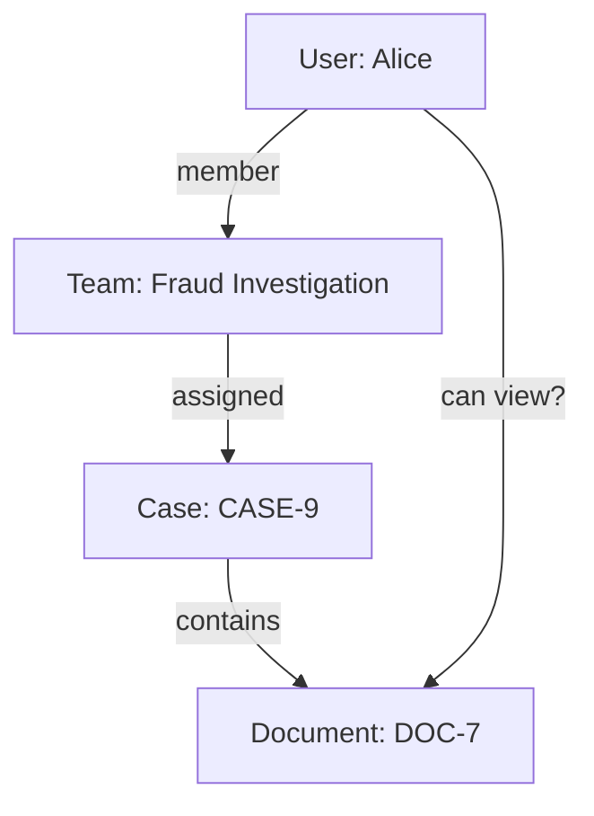
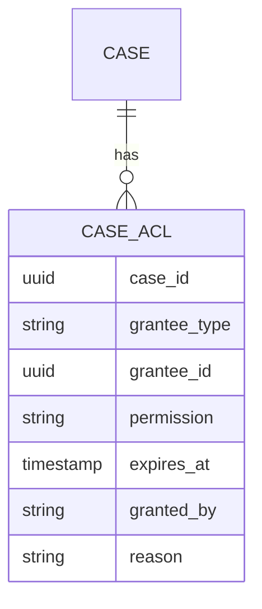
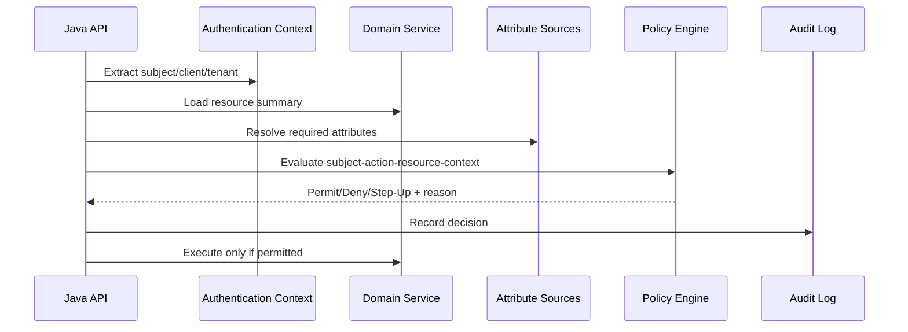

------
title: Learn Java Identity, Authentication & Authorization for Secure Enterprise API Platform - Part 015
description: A production-grade comparison of RBAC, ABAC, ReBAC, ACL, capability, entitlement, and policy-engine models for Java enterprise authorization.
series: learn-java-identity-authentication-authorization-api-platform
seriesTitle: Learn Java Identity, Authentication & Authorization for Secure Enterprise API Platform
order: 15
partTitle: RBAC, ABAC, ReBAC, ACL, Capability, and Policy Models
tags:
- java
- authorization
- rbac
- abac
- rebac
- policy-engine
- api-security
date: 2026-06-28
---

# Part 015 — RBAC, ABAC, ReBAC, ACL, Capability, and Policy Models

## 1. Problem Framing

A weak authorization design usually fails long before the first security incident.

It fails when product asks for:

```text
Managers can approve regional cases, except their own cases, unless delegated by compliance,
but only for high-assurance sessions and only while the case is in REVIEW_PENDING.
```

If the system only has this:

```java
hasRole("MANAGER")
```

then the platform has already lost precision.

The goal of this part is not to memorize acronyms. The goal is to choose the right **authorization model** for the shape of the domain.

Different domains have different permission geometry:

| Domain Shape | Typical Model Fit |
|---|---|
| Stable job functions | RBAC |
| Context-rich risk decisions | ABAC |
| Collaboration and hierarchy | ReBAC |
| Per-object explicit permissions | ACL |
| Delegated limited power | Capability |
| Regulated entitlement lifecycle | Entitlement governance |
| Cross-service consistent policy | Centralized policy engine |

A top engineer does not ask:

> Should we use RBAC or ABAC?

They ask:

> What is the shape of the authorization decision, how often does it change, where are the facts stored, where must it be enforced, and how will we prove it was correct?

## 2. Kaufman Subskill Breakdown

Target skill:

> Select, combine, and implement authorization models that match enterprise domain complexity without creating policy chaos.

Subskills:

| Subskill | What You Must Be Able to Do |
|---|---|
| Model recognition | Identify whether a rule is role-based, attribute-based, relationship-based, object-specific, or delegated. |
| Policy normalization | Express different rules using subject-action-resource-context. |
| Model composition | Combine RBAC, ABAC, ReBAC, and ACL without creating contradictory checks. |
| Enforcement mapping | Decide whether the rule belongs in controller, method, domain service, query layer, gateway, or policy service. |
| Change analysis | Predict what happens when org structures, roles, tenants, or workflows change. |
| Audit design | Record why the decision was made, not only whether it was allowed. |
| Testing | Build authorization matrices and negative tests for each model. |

Practice goal after this part:

> Given a business rule, you can classify its authorization model, define required facts, choose enforcement placement, and write a testable decision contract.

## 3. The Common Decision Shape

Every model in this part is just a different way to compute the same decision:

```text
Decision = f(subject, action, resource, context, policy)
```

The models differ by what part of the equation they emphasize.



This common shape matters because enterprise systems often need model composition.

Example:

```text
A regional supervisor can approve a case if:
- the supervisor has role CASE_SUPERVISOR,                         RBAC
- the case.region equals supervisor.region,                         ABAC
- the supervisor is assigned to the case's operating unit,           ReBAC
- the supervisor is not the creator of the case,                     ABAC / SoD
- the case grants temporary approval delegation to this supervisor,   ACL / capability
- the session assurance is AAL2 or higher,                           contextual ABAC
- the case is in REVIEW_PENDING.                                     domain state policy
```

If the platform has no vocabulary for composition, engineers scatter checks across controllers, repositories, frontend buttons, and SQL clauses. That is how authorization becomes unreviewable.

## 4. RBAC — Role-Based Access Control

RBAC grants permissions through roles.

```text
User -> Role -> Permission
```

Example:

```text
alice -> CASE_SUPERVISOR -> case:approve
bob   -> CASE_VIEWER     -> case:read
```

RBAC works well when access follows **stable organizational responsibility**.

### 4.1 RBAC Mental Model

A role is not a title. A role is a set of authority assignments.

Bad role naming:

```text
JohnRole
Admin2
PowerUser
SpecialAccess
```

Better role naming:

```text
CASE_REVIEWER
CASE_APPROVER
CASE_ASSIGNER
TENANT_SECURITY_ADMIN
AUDIT_EXPORTER
```

A role should answer:

```text
What business responsibility does this represent?
```

not:

```text
Who asked for access?
```

### 4.2 RBAC Data Model

A minimal RBAC model:



The important design choice is that roles usually belong to a scope:

```text
Global role?     SECURITY_ADMIN
Tenant role?     tenant-a:CASE_APPROVER
Org role?        region-east:CASE_SUPERVISOR
Resource role?   case-123:CASE_COLLABORATOR
```

Without scope, RBAC tends to overgrant.

### 4.3 RBAC in Spring Security

A simple role check:

```java
@PreAuthorize("hasRole('CASE_APPROVER')")
public CaseApproval approve(UUID caseId, ApprovalCommand command) {
    return approvalService.approve(caseId, command);
}
```

This is acceptable only if the role alone is sufficient.

For enterprise systems, it rarely is.

Better:

```java
@PreAuthorize("hasAuthority('case:approve')")
public CaseApproval approve(UUID caseId, ApprovalCommand command) {
    return approvalService.approve(caseId, command);
}
```

Why `authority` is often clearer than `role`:

| Concept | Meaning |
|---|---|
| Role | Bundle of responsibilities. |
| Authority/permission | Specific allowed operation. |
| Scope | OAuth token delegation string, not automatically a domain permission. |

A platform can map role to authority at authentication time, but domain authorization should usually speak in permissions/actions.

### 4.4 RBAC Strengths

RBAC is good when:

- Job functions are stable.
- Permissions can be grouped naturally.
- Auditors want role membership reports.
- Access review is human-readable.
- Business owners think in responsibilities.

### 4.5 RBAC Failure Modes

#### Role explosion

```text
CASE_APPROVER_EAST_HIGH_VALUE_TEMPORARY_DELEGATED_NOT_CREATOR_AAL2
```

This is not a role. It is an ABAC policy disguised as a role.

#### God roles

```text
ADMIN
SUPER_ADMIN
POWER_USER
```

A broad role often becomes a compliance bypass.

#### Role-as-business-state

```text
User gets role CASE_OWNER while owning a case.
```

Ownership is a relationship or resource attribute, not a global role.

#### Role-as-tenant-isolation

```java
hasRole("TENANT_A_USER")
```

Tenant isolation should not depend only on role strings. The tenant must be part of resource access and query constraints.

## 5. ABAC — Attribute-Based Access Control

ABAC decides access by evaluating attributes of subject, object/resource, action, and environment/context.

```text
Permit if subject.department == resource.department
and subject.clearance >= resource.classification
and context.assurance >= AAL2
and action == "approve"
```

### 5.1 ABAC Mental Model

ABAC is not "more advanced RBAC". It is a different way to model policy.

RBAC asks:

```text
What role does the subject have?
```

ABAC asks:

```text
What facts are true about the subject, resource, action, and context?
```



### 5.2 ABAC Attribute Categories

| Category | Examples |
|---|---|
| Subject attributes | department, clearance, employment status, assigned region, assurance level |
| Resource attributes | owner, tenant, region, classification, workflow state, legal hold |
| Action attributes | read, approve, export, assign, close, delete |
| Environment attributes | time, IP risk, device posture, session age, fraud score |
| Client attributes | first-party app, partner app, confidential client, delegated client |

### 5.3 ABAC Example

Business rule:

```text
A user may export case evidence if:
- they have evidence export permission,
- they belong to the same tenant as the case,
- their clearance is at least the evidence classification,
- the case is not under legal hold,
- the session is AAL2 or higher,
- the export reason is recorded.
```

Decision contract:

```java
public record AuthorizationRequest(
    Subject subject,
    Action action,
    ResourceRef resource,
    AuthorizationContext context
) {}

public record AuthorizationDecision(
    boolean permitted,
    String reasonCode,
    Map<String, Object> evidence
) {}
```

Policy implementation:

```java
public AuthorizationDecision canExportEvidence(
    Subject subject,
    CaseRecord caseRecord,
    Evidence evidence,
    AuthorizationContext context
) {
    if (!subject.hasAuthority("case:evidence:export")) {
        return deny("MISSING_PERMISSION");
    }
    if (!subject.tenantId().equals(caseRecord.tenantId())) {
        return deny("TENANT_MISMATCH");
    }
    if (subject.clearance().isLowerThan(evidence.classification())) {
        return deny("INSUFFICIENT_CLEARANCE");
    }
    if (caseRecord.legalHold()) {
        return deny("LEGAL_HOLD");
    }
    if (context.authenticationAssurance().isLowerThan(AuthenticationAssurance.AAL2)) {
        return stepUp("AAL2_REQUIRED");
    }
    if (context.exportReason() == null || context.exportReason().isBlank()) {
        return deny("EXPORT_REASON_REQUIRED");
    }
    return permit("EXPORT_ALLOWED");
}
```

Notice that this is not something that fits cleanly into a single role string.

### 5.4 ABAC Strengths

ABAC is good when:

- Decisions depend on dynamic facts.
- Access depends on resource classification.
- Assurance level matters.
- Workflow state matters.
- Risk-based decisions are needed.
- Regulatory constraints require context-specific decisions.

### 5.5 ABAC Failure Modes

#### Attribute trust problem

ABAC is only as strong as the attribute source.

Bad:

```java
String department = request.getHeader("X-User-Department");
```

Better:

```java
String department = authenticatedPrincipal.department();
```

Best for high-integrity decisions:

```java
Department department = identityAttributeService.getVerifiedDepartment(subjectId);
```

#### Stale attributes

If a user's department changes but their JWT still carries the old department for 60 minutes, ABAC decisions can be stale.

Mitigation options:

| Option | Trade-off |
|---|---|
| Short token lifetime | More refresh traffic. |
| Opaque token introspection | Stronger central control, more dependency on AS. |
| Attribute lookup at decision time | Fresher facts, more latency. |
| Versioned entitlements | Can reject stale token/entitlement version. |

#### Policy opacity

ABAC can become impossible to review if rules are hidden inside nested code branches.

Bad:

```java
if (user.a() && !caseRecord.b() || risk.c() && status.d()) {
    return true;
}
```

Better:

```java
return Policy.allOf(
    hasPermission("case:approve"),
    sameTenant(),
    assignedRegion(),
    notCreator(),
    stateIs(REVIEW_PENDING),
    assuranceAtLeast(AAL2)
).evaluate(request);
```

## 6. ReBAC — Relationship-Based Access Control

ReBAC grants access based on relationships between subjects and objects, and relationships between objects.

Example:

```text
alice can view document d1 if alice is a viewer of folder f1 and d1 is inside folder f1.
```

This model is powerful for collaboration, hierarchy, sharing, group membership, and ownership graphs.

### 6.1 ReBAC Mental Model

ReBAC thinks in graph relationships:



The decision is not based on one attribute. It is based on a path through a relationship graph.

```text
user:alice member team:fraud-investigation
team:fraud-investigation assigned case:case-9
case:case-9 contains document:doc-7

Therefore:
user:alice can view document:doc-7
```

### 6.2 ReBAC Example Model

Conceptual authorization model:

```text
type user

type team
  relations
    define member: [user]

type case
  relations
    define owner: [user]
    define investigator: [user, team#member]
    define viewer: [user, team#member]
    define approver: [user]

type document
  relations
    define parent: [case]
    define viewer: viewer from parent
    define editor: investigator from parent
```

This says:

```text
A document inherits viewers from its parent case.
A document inherits editors from case investigators.
```

### 6.3 ReBAC Strengths

ReBAC is good when:

- Objects are shared.
- Access follows hierarchy.
- Group membership matters.
- Parent-child resource relationships matter.
- Users can grant access to other users.
- Access depends on membership through teams, folders, organizations, or projects.

### 6.4 ReBAC Failure Modes

#### Graph explosion

A relationship graph can become huge and difficult to reason about.

Mitigation:

- Keep relationship types small and explicit.
- Avoid using relationships as arbitrary metadata.
- Put lifecycle ownership around relationship creation/deletion.
- Add authorization tests for relationship traversal.

#### Ambiguous inheritance

```text
Can project viewer view all documents?
Can folder editor delete documents?
Can case investigator export evidence?
```

Inherited permissions must be explicit. Do not assume intuitive inheritance.

#### Missing tenant boundary

ReBAC must still enforce tenant isolation.

Bad:

```text
user:alice member team:t1-risk
team:t1-risk viewer case:t2-case-9
```

The relationship writer must be prevented from creating cross-tenant relationships unless explicitly allowed.

## 7. ACL — Access Control List

ACL stores permissions directly on an object.

Example:

```text
case:CASE-9 ACL:
- user:alice -> read
- user:bob   -> read, comment
- group:risk -> read, update
```

### 7.1 ACL Mental Model

ACL answers:

```text
Who has what access to this object?
```

It is object-centric.

RBAC is subject/role-centric:

```text
What can this role do?
```

ACL is resource-centric:

```text
Who can touch this resource?
```

### 7.2 ACL Data Model



ACLs are useful for exceptional sharing and per-object collaboration.

### 7.3 ACL Strengths

ACL is good when:

- Access is object-specific.
- Users can share individual resources.
- Exceptions are common but scoped.
- Access must expire.
- Audit needs to show who granted access to a specific object.

### 7.4 ACL Failure Modes

#### ACL drift

Objects accumulate old grants.

Mitigation:

- Expiry for temporary grants.
- Periodic access review.
- Auto-revoke on workflow transition.
- Revocation on user deactivation.

#### ACL as universal model

ACLs do not scale well as the only authorization model for everything.

Bad:

```text
Every permission for every endpoint is stored as per-object ACL rows.
```

Better:

```text
Use RBAC for baseline responsibilities.
Use ABAC for contextual constraints.
Use ACL for object-specific exceptions.
```

## 8. Capability-Based Authorization

A capability is a transferable proof of authority to perform a specific action.

Examples:

- Password reset link.
- Email verification link.
- One-time document access link.
- Pre-signed object storage URL.
- Delegated approval token.

### 8.1 Capability Mental Model

Capability-based authorization asks:

```text
Does the caller possess a valid unforgeable capability for this operation?
```

It is not primarily about who the user is. It is about possession of a limited authority.

```text
Capability = authority + resource + action + constraints + expiry + integrity protection
```

### 8.2 Capability Example

```java
public record ApprovalCapability(
    UUID caseId,
    UUID delegatedBy,
    UUID delegatedTo,
    Instant expiresAt,
    Set<String> allowedActions,
    String nonce
) {}
```

A capability must be:

| Property | Why It Matters |
|---|---|
| Unforgeable | Caller cannot mint authority. |
| Narrow | Grants only specific action/resource. |
| Expiring | Reduces damage if leaked. |
| Revocable when needed | Required for high-risk workflows. |
| Auditable | Shows why access was allowed. |

### 8.3 Capability Failure Modes

#### Bearer leakage

Anyone who has the capability can use it unless sender-constrained or bound.

Mitigation:

- Short expiry.
- One-time use.
- Bind to authenticated subject.
- Bind to session/client/device when feasible.
- Store nonce and consume atomically.

#### Capability too broad

Bad:

```text
link grants full case access for 30 days
```

Better:

```text
link permits download of document DOC-7 once before 2026-06-30T00:00Z
```

## 9. Entitlements and Permissions

Enterprise platforms often use these terms loosely:

| Term | Practical Meaning |
|---|---|
| Permission | Low-level action on resource type, such as `case:approve`. |
| Role | Bundle of permissions mapped to responsibility. |
| Entitlement | Assigned access right that may need governance, review, expiry, or approval. |
| Scope | OAuth delegation string issued to a client/token. |
| Claim | Statement inside token or identity assertion. |
| Policy | Rule that evaluates whether action is allowed. |

Do not collapse them into one concept.

Bad:

```text
JWT scope = role = permission = entitlement = authorization decision
```

Better:

```text
Scope says what the client/token is allowed to request.
Permission says what the subject may do.
Policy decides whether this specific action on this resource is allowed now.
```

## 10. Policy Engines

A policy engine externalizes or centralizes authorization decision logic.

Common examples include:

| Engine Style | Example Use |
|---|---|
| Library-based policy | Java code, Spring AuthorizationManager, domain policy classes |
| Sidecar/central policy | OPA-style policy evaluation |
| Relationship engine | OpenFGA/Zanzibar-style graph decisions |
| App-integrated DSL | Cedar-style policy language |
| Database-native policy | Row-level security or query predicates |

The decision is not whether policy engines are "good". The decision is whether your authorization complexity needs a dedicated policy runtime.

### 10.1 When a Policy Engine Helps

A policy engine can help when:

- Multiple services must enforce the same policy.
- Policy changes more often than application releases.
- Audit requires centralized policy review.
- Authorization rules are complex and cross-cutting.
- You need consistent decisions across languages/platforms.
- Relationship checks become too complex for local code.

### 10.2 When a Policy Engine Hurts

A policy engine can hurt when:

- The team does not understand the domain policy.
- The policy language becomes a second application.
- Resource attributes still require many service calls.
- Latency and failure handling are not designed.
- Developers think central policy removes the need for app-level enforcement.

### 10.3 Policy Engine Integration Pattern



Important invariant:

> A policy engine decides. The application still enforces.

## 11. Choosing the Right Model

Use this decision table.

| Requirement | Best Starting Model | Notes |
|---|---|---|
| Stable job responsibilities | RBAC | Keep roles business meaningful. |
| Attribute/risk/workflow conditions | ABAC | Avoid stuffing conditions into roles. |
| Object hierarchy and sharing | ReBAC | Model relationships explicitly. |
| Per-object exceptions | ACL | Add expiry and grant audit. |
| Temporary delegated authority | Capability | Narrow, expiring, auditable. |
| Regulatory access review | Entitlements | Track assignment, approval, owner, expiry. |
| Cross-service consistency | Policy engine | Define failure behavior and audit. |
| Query-time data isolation | ABAC + data predicates | Enforce before loading large data sets. |

## 12. Model Composition Patterns

### 12.1 RBAC + ABAC

```text
Role gives baseline permission.
Attributes constrain when it applies.
```

Example:

```text
CASE_APPROVER may approve cases only in their region and only if not creator.
```

```java
boolean allowed = subject.hasAuthority("case:approve")
    && subject.region().equals(caseRecord.region())
    && !subject.id().equals(caseRecord.createdBy())
    && caseRecord.status() == CaseStatus.REVIEW_PENDING;
```

### 12.2 RBAC + ReBAC

```text
Role defines what operation is possible.
Relationship defines where it applies.
```

Example:

```text
A case reviewer can view cases assigned to their team.
```

```text
subject has permission case:read
AND subject is member of team assigned to case
```

### 12.3 ABAC + ACL

```text
Attributes define normal access.
ACL grants explicit exceptions.
```

Example:

```text
Regional case reviewers can read regional cases.
External legal reviewer can read this specific case until Friday.
```

### 12.4 ReBAC + ABAC

```text
Relationship path grants candidate access.
Attributes constrain context.
```

Example:

```text
Team member can view document inherited from assigned case,
but only if document classification is <= user's clearance.
```

## 13. Java Implementation: Policy Object Pattern

Avoid scattering rules across annotations, controllers, SQL, and frontend.

Create policy objects.

```java
public interface DomainPolicy<S, R> {
    AuthorizationDecision evaluate(S subject, R resource, AuthorizationContext context);
}
```

Example:

```java
@Component
public final class CaseApprovalPolicy implements DomainPolicy<Subject, CaseRecord> {

    @Override
    public AuthorizationDecision evaluate(
        Subject subject,
        CaseRecord caseRecord,
        AuthorizationContext context
    ) {
        if (!subject.hasAuthority("case:approve")) {
            return AuthorizationDecision.deny("MISSING_CASE_APPROVE");
        }
        if (!subject.tenantId().equals(caseRecord.tenantId())) {
            return AuthorizationDecision.deny("TENANT_MISMATCH");
        }
        if (!subject.region().equals(caseRecord.region())) {
            return AuthorizationDecision.deny("REGION_MISMATCH");
        }
        if (subject.id().equals(caseRecord.createdBy())) {
            return AuthorizationDecision.deny("CREATOR_CANNOT_APPROVE");
        }
        if (caseRecord.status() != CaseStatus.REVIEW_PENDING) {
            return AuthorizationDecision.deny("INVALID_CASE_STATE");
        }
        if (context.assurance().isLowerThan(AuthenticationAssurance.AAL2)) {
            return AuthorizationDecision.stepUp("AAL2_REQUIRED");
        }
        return AuthorizationDecision.permit("CASE_APPROVAL_ALLOWED");
    }
}
```

Controller:

```java
@PostMapping("/cases/{caseId}/approve")
public ResponseEntity<ApprovalResponse> approve(
    @PathVariable UUID caseId,
    @RequestBody ApprovalCommand command,
    Authentication authentication
) {
    Subject subject = subjectFactory.from(authentication);
    CaseRecord caseRecord = caseQueryService.getRequiredSummary(caseId);

    AuthorizationDecision decision = approvalPolicy.evaluate(
        subject,
        caseRecord,
        AuthorizationContext.current()
    );

    authorizationAudit.record(subject, "case:approve", caseRecord.ref(), decision);

    if (decision.requiresStepUp()) {
        throw new StepUpRequiredException(decision.reasonCode());
    }
    if (!decision.permitted()) {
        throw new AccessDeniedException(decision.reasonCode());
    }

    return ResponseEntity.ok(approvalService.approve(caseId, command));
}
```

This is verbose by design. Security-critical decisions should be visible.

## 14. Java Implementation: Spring Method Security Pattern

For simple guards:

```java
@PreAuthorize("hasAuthority('case:read')")
public CaseDto getCase(UUID caseId) {
    return caseService.getCase(caseId);
}
```

For object-aware guards:

```java
@PreAuthorize("@caseAuthorization.canRead(authentication, #caseId)")
public CaseDto getCase(UUID caseId) {
    return caseService.getCase(caseId);
}
```

Authorization bean:

```java
@Component("caseAuthorization")
public class CaseAuthorization {

    private final CaseQueryService caseQueryService;
    private final CaseReadPolicy caseReadPolicy;

    public boolean canRead(Authentication authentication, UUID caseId) {
        Subject subject = Subject.from(authentication);
        CaseRecord caseRecord = caseQueryService.getRequiredSummary(caseId);
        return caseReadPolicy.evaluate(
            subject,
            caseRecord,
            AuthorizationContext.current()
        ).permitted();
    }
}
```

This pattern is useful, but has trade-offs:

| Benefit | Risk |
|---|---|
| Keeps service method protected. | Hidden DB calls from SpEL expression. |
| Works across controllers. | Harder to return step-up details. |
| Reuses Spring method security. | Easy to create expensive checks. |

For complex decisions, explicit policy evaluation inside the service layer is often easier to audit and test.

## 15. Authorization Decision Record

A decision should produce evidence.

```java
public record AuthorizationDecision(
    DecisionEffect effect,
    String reasonCode,
    Map<String, String> evidence
) {
    public boolean permitted() {
        return effect == DecisionEffect.PERMIT;
    }

    public boolean requiresStepUp() {
        return effect == DecisionEffect.STEP_UP;
    }
}

public enum DecisionEffect {
    PERMIT,
    DENY,
    STEP_UP,
    ABSTAIN
}
```

Example evidence:

```json
{
  "policy": "case-approval-v3",
  "subjectId": "user-123",
  "tenantId": "tenant-a",
  "resourceType": "case",
  "resourceId": "case-9",
  "action": "case:approve",
  "reasonCode": "CREATOR_CANNOT_APPROVE",
  "effect": "DENY"
}
```

Do not log sensitive attributes unnecessarily.

Bad:

```json
{
  "fullJwt": "...",
  "passwordHash": "...",
  "allUserClaims": "..."
}
```

Good:

```json
{
  "issuer": "https://idp.example.com",
  "subjectId": "user-123",
  "clientId": "case-portal",
  "policy": "case-approval-v3",
  "effect": "DENY",
  "reasonCode": "CREATOR_CANNOT_APPROVE"
}
```

## 16. Testing Authorization Models

Authorization tests should include positive and negative cases.

### 16.1 RBAC Matrix

| Subject | Permission | Expected |
|---|---|---|
| reviewer | `case:read` | permit read |
| reviewer | `case:approve` | deny approve |
| approver | `case:approve` | permit if ABAC also passes |
| no role | any | deny |

### 16.2 ABAC Matrix

| Same Tenant | Same Region | Not Creator | State | Assurance | Expected |
|---|---|---|---|---|---|
| yes | yes | yes | REVIEW_PENDING | AAL2 | permit |
| no | yes | yes | REVIEW_PENDING | AAL2 | deny |
| yes | no | yes | REVIEW_PENDING | AAL2 | deny |
| yes | yes | no | REVIEW_PENDING | AAL2 | deny |
| yes | yes | yes | CLOSED | AAL2 | deny |
| yes | yes | yes | REVIEW_PENDING | AAL1 | step-up |

### 16.3 ReBAC Matrix

| Relationship | Expected |
|---|---|
| user direct viewer of case | permit |
| user member of assigned team | permit |
| user member of unrelated team | deny |
| cross-tenant relationship | deny or invalid relationship |
| removed from team | deny after propagation |

### 16.4 ACL Matrix

| ACL Entry | Expired | Expected |
|---|---:|---|
| user read | no | permit |
| user read | yes | deny |
| group read | no | permit for member |
| no ACL | no | deny unless another model permits |

## 17. Anti-Patterns

### 17.1 One Model for Everything

Bad:

```text
All access must be RBAC.
```

or:

```text
All access must be ABAC.
```

Enterprise authorization is usually model composition.

### 17.2 Policy Hidden in UI

Bad:

```text
Hide the Approve button for non-approvers.
```

UI hiding is usability. It is not authorization.

### 17.3 Scope Treated as Domain Permission

Bad:

```java
hasAuthority("SCOPE_cases.write")
```

and then assume the caller can update every case.

Better:

```text
Token scope permits the client to call case write APIs.
Domain policy decides whether this subject can update this specific case.
```

### 17.4 Authorization After Mutation

Bad:

```java
caseRecord.approve();
caseRepository.save(caseRecord);
checkCanApprove(user, caseRecord);
```

Authorization must happen before side effects.

### 17.5 Missing Deny Reason

Bad:

```java
return false;
```

Better:

```java
return deny("TENANT_MISMATCH");
```

Without reason codes, debugging and audit become guesswork.

## 18. Production Checklist

Before choosing an authorization model, answer:

- What is the subject?
- What is the client?
- What is the tenant?
- What is the resource type?
- What is the action?
- Which resource attributes are required?
- Which subject attributes are required?
- Which context attributes are required?
- Is the rule stable or frequently changing?
- Does the rule require inheritance or graph traversal?
- Does access need expiry?
- Does access need approval before assignment?
- Does the decision need audit evidence?
- Can policy be evaluated locally?
- What happens if attribute source is down?
- What happens if policy engine is down?
- How is deny tested?

## 19. Practice Drill

Design authorization for this endpoint:

```http
POST /cases/{caseId}/assign-investigator
```

Requirements:

```text
A case assignment manager can assign an investigator to a case if:
- the manager has case:assign permission,
- the manager belongs to the same tenant,
- the manager is responsible for the case region,
- the case is not closed,
- the investigator belongs to the same tenant,
- the investigator has investigator eligibility,
- the assignment does not violate separation-of-duty rules,
- emergency assignment requires reason and expires in 24 hours.
```

Classify each rule:

| Rule | Model |
|---|---|
| manager has `case:assign` | RBAC / permission |
| same tenant | ABAC / tenant boundary |
| responsible for region | ABAC or ReBAC |
| case not closed | resource state ABAC |
| investigator same tenant | ABAC |
| investigator eligibility | ABAC / entitlement |
| SoD | policy constraint |
| emergency expiry | capability / entitlement lifecycle |

Then write:

```text
Decision = f(subject, action, case, targetInvestigator, context, policy)
```

## 20. Key Takeaways

- RBAC is good for stable responsibilities, but fails when overloaded with context.
- ABAC is good for contextual precision, but depends on trustworthy attributes.
- ReBAC is good for collaboration and hierarchy, but needs graph discipline.
- ACL is good for object-specific exceptions, but can drift.
- Capabilities are good for narrow delegated authority, but bearer leakage matters.
- Entitlements are permissions with lifecycle, governance, approval, and review.
- Policy engines help with consistency, but do not remove enforcement responsibility from applications.
- The real skill is not picking one model; it is composing models without losing auditability.

## 21. References

- NIST SP 800-162, *Guide to Attribute Based Access Control (ABAC) Definition and Considerations*.
- OWASP API Security Top 10 2023, API1: Broken Object Level Authorization.
- Spring Security Reference, Method Security.
- OpenFGA Documentation, Authorization Concepts.
