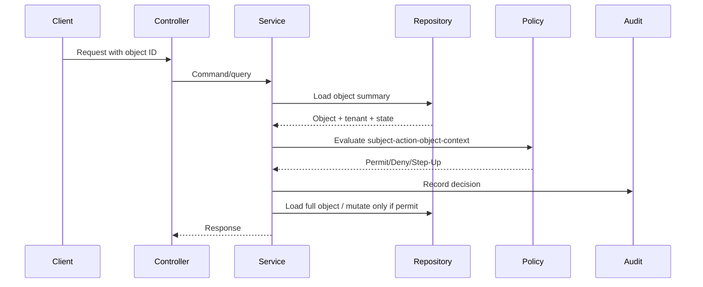
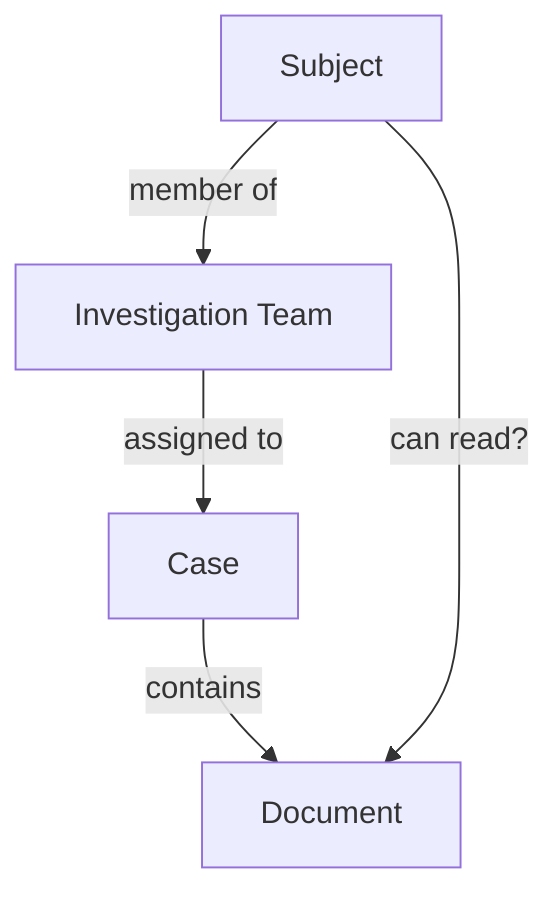
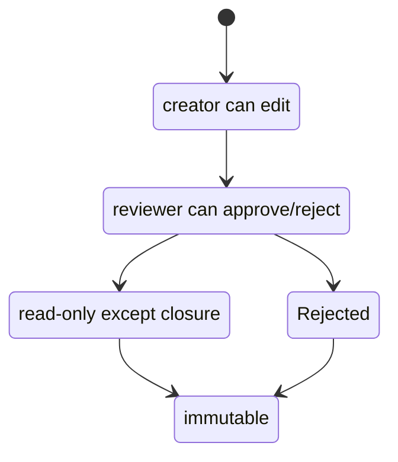

------
title: Learn Java Identity, Authentication & Authorization for Secure Enterprise API Platform - Part 016
description: API object-level authorization and BOLA/IDOR defense patterns for Java enterprise resource servers, including tenant scoping, resource guards, query constraints, and negative testing.
series: learn-java-identity-authentication-authorization-api-platform
seriesTitle: Learn Java Identity, Authentication & Authorization for Secure Enterprise API Platform
order: 16
partTitle: API Object-Level Authorization and BOLA Defense
tags:
- java
- api-security
- authorization
- bola
- idor
- spring-security
- multi-tenancy
date: 2026-06-28
---

# Part 016 — API Object-Level Authorization and BOLA Defense

## 1. Problem Framing

Broken Object Level Authorization is one of the most important API authorization failures because it is deceptively simple.

A user changes an identifier:

```http
GET /cases/1001
GET /cases/1002
```

If the server only checks that the user is authenticated, the API may leak another user's or another tenant's object.

The bug often looks harmless in code:

```java
@GetMapping("/cases/{id}")
public CaseDto getCase(@PathVariable UUID id) {
    return caseService.getCase(id);
}
```

The problem is not the path variable. The problem is the missing object-level decision:

```text
Can this subject read this specific case in this specific tenant and context?
```

This part focuses on API object-level authorization, commonly associated with IDOR/BOLA classes of vulnerability.

## 2. Kaufman Subskill Breakdown

Target skill:

> Build Java APIs where every user-controlled object reference is constrained by subject, tenant, relationship, action, and resource state before data or side effects are exposed.

Subskills:

| Subskill | What You Must Be Able to Do |
|---|---|
| Object reference detection | Identify every path/query/body/header field that points to a resource. |
| Authorization interval mapping | Know where the resource ID enters, where the object is loaded, and where side effects happen. |
| Resource guard design | Implement explicit object-level policy checks. |
| Query constraint design | Prevent unauthorized objects from being loaded or listed. |
| Tenant scoping | Ensure tenant boundary is applied consistently. |
| Action-level checks | Distinguish read, update, approve, export, delete, assign, and transition. |
| Negative testing | Prove another user's ID, another tenant's ID, and stale relationship IDs are denied. |
| Audit design | Record denied and permitted object-level decisions. |

Practice goal after this part:

> Given any API endpoint, you can mark every user-controlled object reference and define the exact object-level authorization check before implementation.

## 3. The BOLA Mental Model

BOLA is not only about numeric IDs.

Identifiers can be:

| Location | Examples |
|---|---|
| Path | `/cases/{caseId}`, `/tenants/{tenantId}/users/{userId}` |
| Query | `?customerId=...`, `?ownerId=...`, `?account=...` |
| Body | `{ "caseId": "...", "targetUserId": "..." }` |
| Header | `X-Tenant-Id`, `X-Act-As-User`, `X-Account-Id` |
| Cursor | pagination cursor encoding object references |
| GraphQL | node/global IDs |
| Event payload | IDs consumed asynchronously |

The attack is not defeated by using UUIDs.

```text
Unpredictable ID != authorization
```

A UUID makes guessing harder. It does not prove the caller is allowed to access the object.

## 4. Object-Level Authorization Equation

For object-level access, use this equation:

```text
Permit if subject can perform action on object under tenant and context.
```

More explicitly:

```text
Decision = f(subject, action, object, tenant, relationship, state, assurance, policy)
```

Example:

```text
Can user-123, through case-portal, read case CASE-9,
where CASE-9 belongs to tenant-a,
when user-123 is a member of the assigned investigation team,
and the case is not sealed,
and the session is fresh enough?
```

This is the missing decision in most BOLA bugs.

## 5. Authorization Interval

Every endpoint has an authorization interval.



The interval starts when a user-controlled object reference enters the system and ends when data is returned or a side effect happens.

If the policy check happens after the full object is loaded, sensitive data may already be exposed to logs, caches, metrics, or exceptions.

For sensitive resources, load a minimal authorization projection first.

```java
public record CaseAuthorizationView(
    UUID id,
    String tenantId,
    UUID ownerId,
    String region,
    CaseStatus status,
    boolean sealed
) {}
```

Then evaluate policy before loading the full object.

## 6. Common Vulnerable Patterns

### 6.1 Authenticated-Only Access

Bad:

```java
@GetMapping("/cases/{id}")
@PreAuthorize("isAuthenticated()")
public CaseDto getCase(@PathVariable UUID id) {
    return caseService.getCase(id);
}
```

This only proves the caller has a session/token.

It does not prove access to `id`.

Better:

```java
@GetMapping("/cases/{id}")
public CaseDto getCase(@PathVariable UUID id, Authentication authentication) {
    Subject subject = subjectFactory.from(authentication);
    return caseApplicationService.getReadableCase(subject, id);
}
```

Service:

```java
public CaseDto getReadableCase(Subject subject, UUID caseId) {
    CaseAuthorizationView view = caseRepository.getAuthorizationView(caseId)
        .orElseThrow(() -> new NotFoundException("case_not_found"));

    AuthorizationDecision decision = caseReadPolicy.evaluate(
        subject,
        view,
        AuthorizationContext.current()
    );

    audit.record(subject, "case:read", ResourceRef.caseRef(caseId), decision);

    if (!decision.permitted()) {
        throw new AccessDeniedException(decision.reasonCode());
    }

    return caseMapper.toDto(caseRepository.getRequired(caseId));
}
```

### 6.2 Role-Only Access

Bad:

```java
@PreAuthorize("hasAuthority('case:read')")
@GetMapping("/cases/{id}")
public CaseDto getCase(@PathVariable UUID id) {
    return caseService.getCase(id);
}
```

This checks operation type but not object ownership, assignment, tenant, classification, or workflow state.

Better:

```text
has case:read permission
AND same tenant
AND assigned relationship OR permitted regional access
AND not sealed OR has sealed-case clearance
```

### 6.3 Query Parameter Trust

Bad:

```java
@GetMapping("/cases")
public List<CaseDto> listCases(@RequestParam String tenantId) {
    return caseRepository.findByTenantId(tenantId);
}
```

The caller controls `tenantId`.

Better:

```java
@GetMapping("/cases")
public List<CaseDto> listCases(Authentication authentication) {
    Subject subject = subjectFactory.from(authentication);
    return caseQueryService.listVisibleCases(subject);
}
```

Repository query must be constrained using authenticated tenant and visibility rules, not arbitrary request parameters.

### 6.4 Body ID Confusion

Bad:

```http
POST /cases/123/comments
Content-Type: application/json

{
  "caseId": "999",
  "message": "..."
}
```

If service uses body `caseId`, attacker can smuggle a different object reference.

Better:

```java
public record AddCommentRequest(String message) {}
```

Use path ID as authoritative and do not duplicate it in body unless there is a strict consistency check.

```java
if (!pathCaseId.equals(body.caseId())) {
    throw new BadRequestException("case_id_mismatch");
}
```

### 6.5 Indirect Object Reference Through Child Resource

Bad:

```http
GET /documents/{documentId}
```

Policy only checks document exists.

Better:

```text
document -> parent case -> tenant -> assignment/relationship -> subject
```

A child object often inherits authorization from a parent aggregate.



### 6.6 Bulk Operations

Bad:

```java
@PostMapping("/cases/bulk-close")
public void closeCases(@RequestBody List<UUID> caseIds) {
    caseService.closeAll(caseIds);
}
```

Bulk endpoints multiply BOLA risk.

Better:

```java
public BulkCloseResult closeCases(Subject subject, List<UUID> caseIds) {
    List<CaseAuthorizationView> views = caseRepository.getAuthorizationViews(caseIds);
    Map<UUID, CaseAuthorizationView> byId = views.stream()
        .collect(Collectors.toMap(CaseAuthorizationView::id, Function.identity()));

    BulkCloseResult result = new BulkCloseResult();

    for (UUID caseId : caseIds) {
        CaseAuthorizationView view = byId.get(caseId);
        if (view == null) {
            result.addDenied(caseId, "NOT_FOUND_OR_NOT_VISIBLE");
            continue;
        }

        AuthorizationDecision decision = caseClosePolicy.evaluate(
            subject,
            view,
            AuthorizationContext.current()
        );

        audit.record(subject, "case:close", ResourceRef.caseRef(caseId), decision);

        if (decision.permitted()) {
            caseRepository.close(caseId);
            result.addClosed(caseId);
        } else {
            result.addDenied(caseId, decision.reasonCode());
        }
    }

    return result;
}
```

Never allow one permitted object to imply all objects are permitted.

## 7. Tenant Scoping as First-Class Object Authorization

Multi-tenant BOLA is severe because it crosses customer boundaries.

Bad mental model:

```text
The API gateway already checked tenant.
```

Better mental model:

```text
Every resource access must prove tenant consistency at the application and data boundary.
```

### 7.1 Tenant Context Sources

| Source | Trust Level | Notes |
|---|---|---|
| Path tenant ID | low by itself | User-controlled; must match authenticated tenant/allowed tenants. |
| Header tenant ID | low by itself | Useful as selection, not proof. |
| Token tenant claim | medium | Must be issuer-validated and may still be stale. |
| Server-side membership lookup | high | Fresher but costs latency. |
| Resource tenant column | authoritative for resource | Must be checked against subject tenant. |

### 7.2 Tenant-Safe Access Pattern

```java
public CaseAuthorizationView getAuthorizationViewForTenant(UUID caseId, String tenantId) {
    return jdbcClient.sql("""
        select id, tenant_id, owner_id, region, status, sealed
        from cases
        where id = :caseId
          and tenant_id = :tenantId
        """)
        .param("caseId", caseId)
        .param("tenantId", tenantId)
        .query(CaseAuthorizationView.class)
        .optional()
        .orElseThrow(() -> new NotFoundException("case_not_found"));
}
```

This query prevents accidentally loading another tenant's object.

Then still run policy for finer rules.

```java
CaseAuthorizationView view = repository.getAuthorizationViewForTenant(
    caseId,
    subject.activeTenantId()
);

AuthorizationDecision decision = caseReadPolicy.evaluate(subject, view, context);
```

### 7.3 404 vs 403

Returning `404 Not Found` for inaccessible resources can reduce enumeration signals.

But the platform still needs internal audit:

```text
External response: 404
Internal audit: DENY TENANT_MISMATCH for case CASE-9
```

Policy:

| Situation | External Response | Internal Event |
|---|---|---|
| Object does not exist | 404 | not_found |
| Object exists but wrong tenant | 404 or 403 by policy | tenant_mismatch_denied |
| Object exists same tenant but no permission | 403 | access_denied |
| Step-up required | 403 or 401 with step-up challenge pattern | step_up_required |

Do not let response hiding remove audit evidence.

## 8. Resource Guard Pattern

A resource guard centralizes object-level decisions.

```java
@Component
public class CaseResourceGuard {

    private final CaseRepository caseRepository;
    private final CaseReadPolicy readPolicy;
    private final CaseUpdatePolicy updatePolicy;
    private final AuthorizationAudit audit;

    public CaseAuthorizationView requireReadable(Subject subject, UUID caseId) {
        CaseAuthorizationView view = caseRepository.getAuthorizationViewForTenant(
            caseId,
            subject.activeTenantId()
        );

        AuthorizationDecision decision = readPolicy.evaluate(
            subject,
            view,
            AuthorizationContext.current()
        );

        audit.record(subject, "case:read", ResourceRef.caseRef(caseId), decision);

        if (!decision.permitted()) {
            throw new AccessDeniedException(decision.reasonCode());
        }

        return view;
    }

    public CaseAuthorizationView requireUpdatable(Subject subject, UUID caseId) {
        CaseAuthorizationView view = caseRepository.getAuthorizationViewForTenant(
            caseId,
            subject.activeTenantId()
        );

        AuthorizationDecision decision = updatePolicy.evaluate(
            subject,
            view,
            AuthorizationContext.current()
        );

        audit.record(subject, "case:update", ResourceRef.caseRef(caseId), decision);

        if (!decision.permitted()) {
            throw new AccessDeniedException(decision.reasonCode());
        }

        return view;
    }
}
```

Usage:

```java
public CaseDto updateCase(Subject subject, UUID caseId, UpdateCaseCommand command) {
    CaseAuthorizationView view = caseGuard.requireUpdatable(subject, caseId);
    CaseRecord updated = caseDomainService.update(view.id(), command);
    return mapper.toDto(updated);
}
```

Benefits:

- Prevents repeated ad-hoc checks.
- Keeps policy near application use cases.
- Makes audit consistent.
- Makes tests easier.

Risks:

- Guard can grow too large.
- Guard can become a dumping ground for domain logic.
- Guard must not load full sensitive object before authorization.

## 9. Query-Time Authorization for Collections

Object-level authorization is not only for `GET /resource/{id}`.

List endpoints are often worse.

Bad:

```java
@GetMapping("/cases")
public Page<CaseDto> list(Pageable pageable) {
    return caseRepository.findAll(pageable).map(mapper::toDto);
}
```

This exposes all cases unless filtered later.

### 9.1 Filter Before Returning

Better:

```java
public Page<CaseSummaryDto> listVisibleCases(Subject subject, Pageable pageable) {
    return caseRepository.findVisibleCases(
        subject.activeTenantId(),
        subject.id(),
        subject.region(),
        subject.authorities(),
        pageable
    ).map(mapper::toSummaryDto);
}
```

SQL-style predicate:

```sql
select c.*
from cases c
left join case_assignments ca on ca.case_id = c.id
where c.tenant_id = :tenantId
  and (
      c.owner_id = :subjectId
      or ca.assignee_id = :subjectId
      or (:canReadRegionalCases = true and c.region = :subjectRegion)
  )
order by c.created_at desc
limit :limit offset :offset
```

Do not load all rows and filter in memory for sensitive resources.

Bad:

```java
return repository.findAll().stream()
    .filter(caseRecord -> policy.canRead(subject, caseRecord))
    .toList();
```

This leaks through memory, logs, timings, and pagination inconsistencies.

### 9.2 Pagination Invariant

Authorization must be applied before pagination.

Bad flow:

```text
select page 1 of all cases -> filter unauthorized -> return 2 results
```

Good flow:

```text
filter visible cases -> paginate visible cases -> return full page
```

Otherwise users see broken pagination and may infer hidden data volume.

## 10. Action-Level Object Authorization

BOLA is not only read access.

Action-level object authorization failures happen when the user can perform a state change on another user's object.

Examples:

```http
POST /cases/{caseId}/approve
POST /payments/{paymentId}/cancel
PUT /users/{userId}/email
DELETE /documents/{documentId}
POST /cases/{caseId}/assign-owner
```

Each action has a different policy.

Bad:

```java
@PreAuthorize("hasAuthority('case:write')")
```

This may be too broad.

Better action model:

```text
case:read
case:update-metadata
case:add-comment
case:assign
case:approve
case:reject
case:close
case:export-evidence
case:delete-draft
```

Then each action gets a policy.

| Action | Additional Object Rule |
|---|---|
| read | visible through ownership/assignment/regional view |
| update | editable state and user has update authority |
| approve | not creator, correct state, AAL2, SoD satisfied |
| export | classification allowed, reason required, audit event mandatory |
| delete | draft only, creator or admin, retention not active |

## 11. State-Dependent Authorization

Authorization often depends on workflow state.



Policy:

```java
public AuthorizationDecision canEdit(Subject subject, CaseAuthorizationView view) {
    if (view.status() == CaseStatus.CLOSED) {
        return deny("CASE_CLOSED");
    }
    if (view.status() == CaseStatus.APPROVED) {
        return deny("CASE_APPROVED_READ_ONLY");
    }
    if (subject.id().equals(view.ownerId())) {
        return permit("OWNER_CAN_EDIT");
    }
    if (subject.hasAuthority("case:supervise") && subject.region().equals(view.region())) {
        return permit("REGIONAL_SUPERVISOR_CAN_EDIT");
    }
    return deny("NO_EDIT_AUTHORITY");
}
```

State is part of authorization, not only validation.

## 12. Parent-Child Authorization

A frequent BOLA bug: endpoint authorizes child resource without checking parent relationship.

Bad:

```http
GET /cases/{caseId}/documents/{documentId}
```

Code checks readable case but loads `documentId` without verifying it belongs to `caseId`.

```java
Case caseRecord = caseGuard.requireReadable(subject, caseId);
Document document = documentRepository.getRequired(documentId);
return mapper.toDto(document);
```

Attacker can provide a readable `caseId` and someone else's `documentId`.

Better:

```java
CaseAuthorizationView caseView = caseGuard.requireReadable(subject, caseId);
Document document = documentRepository.getRequiredByCaseId(documentId, caseView.id());
return mapper.toDto(document);
```

Repository:

```sql
select d.*
from documents d
where d.id = :documentId
  and d.case_id = :caseId
  and d.tenant_id = :tenantId
```

Invariant:

> If the route contains parent and child IDs, verify the child belongs to the authorized parent.

## 13. Indirect Writes and Confused Object References

Consider assignment:

```http
POST /cases/{caseId}/assign

{
  "assigneeId": "user-789"
}
```

There are two object-level checks:

| Object | Required Check |
|---|---|
| `caseId` | Caller can assign this case. |
| `assigneeId` | Target user is assignable inside this tenant/domain. |

Bad:

```java
caseAssignmentService.assign(caseId, command.assigneeId());
```

Better:

```java
public void assign(Subject subject, UUID caseId, AssignCommand command) {
    CaseAuthorizationView caseView = caseGuard.requireAssignable(subject, caseId);

    UserAssignmentView target = userRepository.getAssignmentViewForTenant(
        command.assigneeId(),
        subject.activeTenantId()
    );

    AuthorizationDecision decision = assignmentPolicy.evaluate(
        subject,
        caseView,
        target,
        AuthorizationContext.current()
    );

    audit.record(subject, "case:assign", ResourceRef.caseRef(caseId), decision);

    if (!decision.permitted()) {
        throw new AccessDeniedException(decision.reasonCode());
    }

    assignmentRepository.assign(caseId, target.userId());
}
```

Any endpoint with a target user, target account, target tenant, target group, or target document has multiple object references.

## 14. Asynchronous BOLA

BOLA can happen outside HTTP request handlers.

Example:

```json
{
  "type": "CASE_EXPORT_REQUESTED",
  "requestedBy": "user-123",
  "caseId": "case-999"
}
```

A worker consumes the event and exports the case.

Bad:

```java
public void handle(CaseExportRequested event) {
    exportService.exportCase(event.caseId());
}
```

Better:

```java
public void handle(CaseExportRequested event) {
    Subject subject = subjectSnapshotService.reconstruct(event.requestedBy(), event.tenantId());
    CaseAuthorizationView view = caseRepository.getAuthorizationViewForTenant(
        event.caseId(),
        event.tenantId()
    );

    AuthorizationDecision decision = exportPolicy.evaluate(
        subject,
        view,
        AuthorizationContext.fromEvent(event)
    );

    audit.record(subject, "case:export", ResourceRef.caseRef(event.caseId()), decision);

    if (!decision.permitted()) {
        deadLetter.reject(event, decision.reasonCode());
        return;
    }

    exportService.exportCase(event.caseId());
}
```

Event-driven systems must not assume the producer already performed sufficient authorization.

## 15. Caching and Object Authorization

Caching can reintroduce BOLA.

Bad cache key:

```text
case:{caseId}
```

If cached DTO includes sensitive fields and is reused across users, one user's authorized representation can leak to another user.

Safer keys:

```text
case-summary:{tenantId}:{caseId}:{visibilityProfile}
case-detail:{tenantId}:{caseId}:{subjectId}:{policyVersion}
```

Better still: cache domain objects internally, but apply authorization and field filtering before response.

### 15.1 Field-Level Variation

Two users may both read a case, but see different fields.

| User | Visible Fields |
|---|---|
| case owner | normal case fields |
| investigator | evidence summary |
| supervisor | approval history |
| external reviewer | redacted fields |
| audit user | full audit view |

Object-level authorization answers:

```text
Can read object?
```

Field-level authorization answers:

```text
Which representation is allowed?
```

Do not conflate them.

## 16. Error Handling

Avoid leaking object existence, tenant existence, or relationship details.

Bad:

```json
{
  "error": "Case CASE-999 belongs to tenant-b, but your tenant is tenant-a"
}
```

Better external response:

```json
{
  "error": "not_found"
}
```

Internal audit:

```json
{
  "eventType": "AUTHZ_DENIED",
  "reasonCode": "TENANT_MISMATCH",
  "subjectId": "user-123",
  "resourceType": "case",
  "resourceIdHash": "...",
  "tenantId": "tenant-a"
}
```

For same-tenant insufficient permission, `403` may be appropriate.

## 17. Testing BOLA Defense

BOLA tests must be systematic.

### 17.1 Test Data Layout

Create at least:

```text
tenant-a
  alice owns case-a1
  bob owns case-a2
  cara assigned to case-a1

tenant-b
  dave owns case-b1
```

Then test:

| Actor | Target | Expected |
|---|---|---|
| alice | case-a1 | permit |
| alice | case-a2 | deny unless shared |
| alice | case-b1 | deny/not found |
| bob | case-a1 | deny unless shared |
| cara | case-a1 | permit if assigned |
| cara | case-a2 | deny |
| unauthenticated | any | 401 |

### 17.2 MockMvc Example

```java
@Test
void userCannotReadAnotherUsersCase() throws Exception {
    mockMvc.perform(get("/cases/{id}", bobCaseId)
            .with(jwt().jwt(jwt -> jwt
                .subject("alice")
                .claim("tenant", "tenant-a"))
                .authorities(new SimpleGrantedAuthority("case:read"))))
        .andExpect(status().isForbidden());
}
```

Cross-tenant:

```java
@Test
void userCannotReadCaseFromAnotherTenant() throws Exception {
    mockMvc.perform(get("/cases/{id}", tenantBCaseId)
            .with(jwt().jwt(jwt -> jwt
                .subject("alice")
                .claim("tenant", "tenant-a"))
                .authorities(new SimpleGrantedAuthority("case:read"))))
        .andExpect(status().isNotFound());
}
```

Parent-child mismatch:

```java
@Test
void documentMustBelongToAuthorizedCase() throws Exception {
    mockMvc.perform(get("/cases/{caseId}/documents/{documentId}", readableCaseId, otherCaseDocumentId)
            .with(jwt().jwt(jwt -> jwt
                .subject("alice")
                .claim("tenant", "tenant-a"))
                .authorities(new SimpleGrantedAuthority("case:read"))))
        .andExpect(status().isNotFound());
}
```

### 17.3 Property-Based Negative Idea

Generate random combinations:

```text
subject tenant != resource tenant -> deny
subject not owner and not assigned and not privileged -> deny
case closed and action mutates -> deny
child.parentId != path.parentId -> deny
missing authorization view -> deny/not found
```

The invariant is more important than the specific examples.

## 18. API Review Checklist

For every endpoint, ask:

- What object IDs enter through path?
- What object IDs enter through query parameters?
- What object IDs enter through body?
- What object IDs enter through headers?
- Are there parent-child IDs?
- Is the tenant selected by caller or derived from authenticated context?
- Is the object loaded with tenant constraint?
- Is the policy action-specific?
- Is authorization applied before side effects?
- Is list filtering applied before pagination?
- Are bulk items authorized independently?
- Are target users/groups/accounts authorized too?
- Are event consumers rechecking authorization?
- Are cache keys authorization-safe?
- Are deny cases tested?
- Are denied attempts audited?

## 19. Common Anti-Patterns

### 19.1 "UUIDs Are Enough"

UUIDs reduce guessing. They do not authorize access.

### 19.2 "Gateway Already Checked It"

Gateways can authenticate tokens and enforce coarse scopes. They usually cannot know object-specific domain policy.

### 19.3 "Frontend Hides the Button"

Frontend checks improve UX. They do not protect APIs.

### 19.4 "Repository findById Is Fine"

`findById(id)` is dangerous for tenant-scoped resources unless followed by strict tenant and object policy. Prefer `findByIdAndTenantId` or authorization projections.

### 19.5 "We Check on Read, So Update Is Safe"

Read and update are different actions. Each needs its own policy.

### 19.6 "Admin Can Do Everything"

Even privileged users need tenant, purpose, audit, and sometimes break-glass controls.

## 20. Production Reference Pattern

A defensible endpoint structure:

```java
@RestController
@RequestMapping("/cases")
public class CaseController {

    private final CaseApplicationService service;
    private final SubjectFactory subjectFactory;

    @GetMapping("/{caseId}")
    public CaseDto getCase(@PathVariable UUID caseId, Authentication authentication) {
        Subject subject = subjectFactory.from(authentication);
        return service.getCase(subject, caseId);
    }

    @PostMapping("/{caseId}/approve")
    public ApprovalDto approve(
        @PathVariable UUID caseId,
        @RequestBody ApprovalCommand command,
        Authentication authentication
    ) {
        Subject subject = subjectFactory.from(authentication);
        return service.approve(subject, caseId, command);
    }
}
```

Application service:

```java
@Service
public class CaseApplicationService {

    private final CaseResourceGuard guard;
    private final CaseRepository repository;
    private final CaseApprovalService approvalService;

    public CaseDto getCase(Subject subject, UUID caseId) {
        guard.requireReadable(subject, caseId);
        return repository.getDetailForTenant(caseId, subject.activeTenantId())
            .map(CaseDto::from)
            .orElseThrow(() -> new NotFoundException("case_not_found"));
    }

    public ApprovalDto approve(Subject subject, UUID caseId, ApprovalCommand command) {
        CaseAuthorizationView view = guard.requireApprovable(subject, caseId);
        return approvalService.approve(view.id(), command);
    }
}
```

The pattern is:

```text
Controller extracts subject.
Application service owns use case.
Guard loads authorization projection under tenant constraint.
Policy evaluates object-level decision.
Audit records decision.
Domain mutation happens only after permit.
Repository queries remain tenant constrained.
```

## 21. Practice Drill

Analyze this endpoint:

```http
POST /tenants/{tenantId}/cases/{caseId}/documents/{documentId}/share

{
  "targetUserId": "user-789",
  "permission": "read",
  "expiresAt": "2026-07-01T00:00:00Z"
}
```

Identify all object references:

| Reference | Source | Check Needed |
|---|---|---|
| `tenantId` | path | caller may act in tenant |
| `caseId` | path | caller can share documents in case |
| `documentId` | path | document belongs to case and tenant |
| `targetUserId` | body | target user belongs to tenant and may receive access |
| `permission` | body | caller may grant this permission |
| `expiresAt` | body | expiry within allowed range |

Write the decision:

```text
Can subject grant permission P on document D inside case C and tenant T
to target user U until expiry E under current policy?
```

If you cannot write that sentence, the endpoint is not ready for implementation.

## 22. Key Takeaways

- BOLA is about missing authorization on specific objects, not about ID format.
- Every user-controlled object reference must be treated as untrusted.
- Tenant scoping is object-level authorization, not just routing metadata.
- Role checks are insufficient for object-level access.
- List endpoints need query-time filtering before pagination.
- Bulk endpoints must authorize every item independently.
- Parent-child resource IDs must be bound together in queries.
- Event consumers and background jobs must not blindly trust producer authorization.
- Object-level decisions should produce audit evidence.
- A secure API platform makes object access explicit, testable, and boring.

## 23. References

- OWASP API Security Top 10 2023, API1: Broken Object Level Authorization.
- OWASP Authorization Cheat Sheet.
- Spring Security Reference, Method Security and OAuth2 Resource Server.
- NIST SP 800-162, Attribute Based Access Control.
