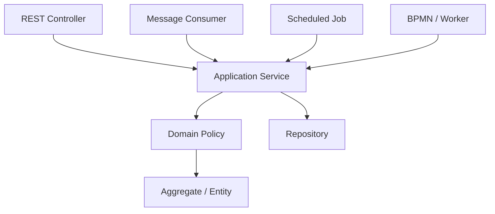
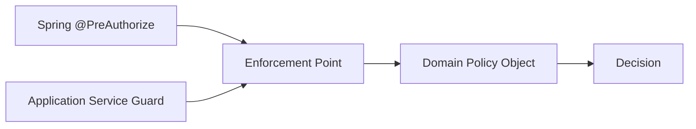
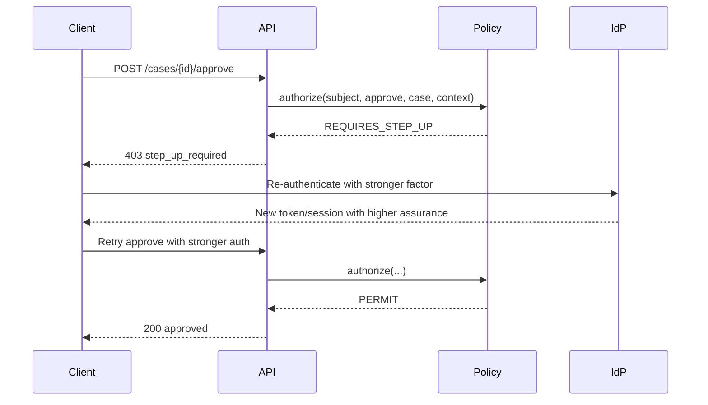

------
title: Learn Java Identity, Authentication & Authorization for Secure Enterprise API Platform - Part 017
description: Method-level and domain-level authorization patterns for Java enterprise applications, including Spring Security method security, policy objects, aggregate guards, step-up decisions, and testable authorization boundaries.
series: learn-java-identity-authentication-authorization-api-platform
seriesTitle: Learn Java Identity, Authentication & Authorization for Secure Enterprise API Platform
order: 17
partTitle: Method-Level and Domain-Level Authorization in Java
tags:
- java
- spring-security
- authorization
- method-security
- domain-driven-design
- api-security
- policy
- enterprise-platform
date: 2026-06-28
---

# Part 017 — Method-Level and Domain-Level Authorization in Java

## 1. Problem Framing

A secure API platform cannot rely only on URL-level checks.

URL checks answer questions like:

```text
Can this request reach /cases/{id}/approve?
```

That is useful, but not sufficient.

The real production authorization question is usually:

```text
Can this subject approve this specific case, in this tenant, in this workflow state, under this risk level, using this delegation context, at this time?
```

That question belongs closer to the business operation than to the HTTP route.

A controller route may be reused by:

- REST endpoints.
- GraphQL resolvers.
- Async workers.
- Scheduled jobs.
- Batch imports.
- BPMN workers.
- Internal admin tools.
- Message consumers.
- CLI maintenance tasks.

If authorization only exists in the controller, any non-controller entry point can bypass it.

A common insecure design looks like this:

```java
@RestController
class CaseController {

    @PreAuthorize("hasRole('CASE_APPROVER')")
    @PostMapping("/cases/{caseId}/approve")
    CaseDto approve(@PathVariable UUID caseId) {
        return caseService.approve(caseId);
    }
}
```

This checks that the caller has a broad role. It does not prove that the caller can approve this specific case.

The service may still approve:

- A case from another tenant.
- A case owned by another business unit.
- A case already closed.
- A case where the caller is the submitter and segregation-of-duties forbids self-approval.
- A case requiring step-up authentication.
- A case being accessed through an expired delegation.

Method-level and domain-level authorization fix this by putting policy checks at the operation boundary.

## 2. Kaufman Subskill Breakdown

Target skill:

> Design Java application services where every business operation has an explicit, testable authorization boundary that combines subject, action, resource, tenant, relationship, state, and context.

Subskills:

| Subskill | What You Must Be Able to Do |
|---|---|
| Boundary selection | Decide whether authorization belongs at route, method, domain, repository, gateway, or external policy layer. |
| Method security | Use Spring method security without hiding important business rules in unreadable annotations. |
| Policy object design | Encode authorization decisions as explicit Java objects/functions that are unit-testable. |
| Resource-aware checks | Authorize against the actual aggregate/resource, not just a global role. |
| State-aware checks | Include workflow state, lifecycle state, risk, and business constraints. |
| Delegation handling | Distinguish direct subject authority from acting-as and delegated authority. |
| Step-up handling | Return “requires stronger authentication” separately from permit/deny. |
| Auditability | Produce enough decision evidence to explain why an operation was permitted or denied. |
| Negative testing | Test unauthorized identity/resource/state combinations, not just the happy path. |

Practice goal after this part:

> Given any service method, you can identify the correct authorization boundary, define the decision inputs, encode the policy, and prove with tests that bypass paths are closed.

## 3. Mental Model: Authorization Is an Operation Guard

A method-level authorization check should guard a business operation, not merely a Java method name.

Bad mental model:

```text
This method requires ROLE_MANAGER.
```

Better mental model:

```text
This operation requires permission to perform ACTION on RESOURCE under CONTEXT.
```

Canonical shape:

```text
Decision = authorize(subject, action, resource, context)
```

Where:

| Input | Meaning |
|---|---|
| Subject | Authenticated actor, including tenant, account, assurance, delegation, and authorities. |
| Action | Business operation: read, update, approve, assign, export, close, reopen, escalate. |
| Resource | Actual aggregate or resource reference. |
| Context | Request risk, channel, time, tenant, workflow stage, purpose, MFA state, device, source system. |

A domain-level guard should be placed where all entry points converge.



Controller-level security is still useful, but it should not be the only enforcement point.

## 4. Layered Authorization Responsibilities

Authorization does not belong to only one layer.

Different layers answer different questions.

| Layer | Responsibility | Example |
|---|---|---|
| API gateway | Coarse request admission, token presence, route class, global rate limits. | “Only authenticated tokens can reach `/api/cases/**`.” |
| Resource server filter | Token validation, issuer/audience checks, authority extraction. | “This token is valid for this API.” |
| Controller | Request shape, route-level coarse guard, input validation. | “Only case users can call this route family.” |
| Application service | Business operation authorization. | “Can this user approve this case?” |
| Domain policy | Domain-specific decision logic. | “A submitter cannot approve their own case.” |
| Repository/data access | Query-time visibility and tenant constraints. | “Only return cases visible to this subject.” |
| Database/RLS | Defense-in-depth for tenant or row-level constraints. | “Tenant ID must match session tenant.” |

The important invariant:

> Security should not depend on a single layer being perfect.

But there is also a practical invariant:

> The application service is usually the best place to enforce business authorization because it has operation intent and can load the relevant resource state.

## 5. Spring Method Security in One Page

Spring Security method security lets us apply authorization around method invocation, commonly with annotations such as:

```java
@PreAuthorize("hasAuthority('case:read')")
@PostAuthorize("returnObject.ownerId == authentication.name")
@PreFilter("filterObject.ownerId == authentication.name")
@PostFilter("filterObject.ownerId == authentication.name")
```

In enterprise systems, prefer `@PreAuthorize` for operation admission and explicit policy beans for domain checks:

```java
@PreAuthorize("@casePolicy.canApprove(authentication, #caseId)")
public CaseDto approve(UUID caseId, ApproveCaseCommand command) {
    return caseApprovalService.approve(caseId, command);
}
```

The annotation should remain readable.

Good:

```java
@PreAuthorize("@casePolicy.canApprove(authentication, #caseId)")
```

Risky:

```java
@PreAuthorize("hasAuthority('CASE_APPROVER') and @tenant.matches(#tenantId) and " +
              "@caseRepo.findById(#id).get().status.name() == 'PENDING_REVIEW' and " +
              "@userService.department(authentication.name) == @caseRepo.findById(#id).get().department")
```

The second version hides business policy in SpEL, duplicates repository calls, creates performance surprises, and is hard to test as domain logic.

## 6. Method Security Is Not a Replacement for Domain Policy

Method security is an enforcement mechanism.

Domain policy is the rule model.

Do not confuse them.



A healthy design lets you call the same policy from:

- `@PreAuthorize`.
- Application service guard.
- Unit tests.
- Integration tests.
- Admin review tooling.
- Policy simulation.
- Audit explanation.

## 7. Example Domain: Regulated Case Approval

We will use a regulated case-management example because it has realistic authorization constraints.

Operation:

```text
Approve an enforcement case.
```

Rules:

1. Caller must be authenticated.
2. Caller must belong to the same tenant as the case.
3. Caller must have approve authority for the case type.
4. Case must be in `PENDING_REVIEW`.
5. Caller must not be the submitter.
6. Caller must be assigned as reviewer or have escalation override.
7. High-risk cases require stronger authentication.
8. Delegated access must include explicit `approve_case` delegated action.
9. The decision must be auditable.

A simple role check cannot express this safely.

## 8. Model the Subject Explicitly

Avoid passing raw Spring `Authentication` deep into domain code.

Create an application-level subject model.

```java
public record AuthenticatedSubject(
        UUID subjectId,
        UUID accountId,
        String username,
        String tenantId,
        Set<String> authorities,
        Set<String> groups,
        AssuranceLevel assuranceLevel,
        Optional<DelegationContext> delegation,
        Optional<String> sessionId
) {
    public boolean hasAuthority(String authority) {
        return authorities.contains(authority);
    }

    public boolean isSameTenant(String resourceTenantId) {
        return tenantId.equals(resourceTenantId);
    }
}
```

Assurance can be modeled explicitly:

```java
public enum AssuranceLevel {
    LOW,
    PHISHING_RESISTANT_MFA,
    HARDWARE_BOUND_HIGH
}
```

Delegation should also be explicit:

```java
public record DelegationContext(
        UUID delegatorSubjectId,
        UUID delegateSubjectId,
        Set<String> delegatedActions,
        Instant expiresAt,
        String reason
) {
    public boolean permits(String action, Clock clock) {
        return delegatedActions.contains(action) && expiresAt.isAfter(clock.instant());
    }
}
```

Why this matters:

- The policy object can be tested without Spring.
- Audit records can include stable subject fields.
- Authentication extraction is separated from authorization decision logic.
- Delegation and assurance do not get hidden as stringly-typed claims.

## 9. Convert Authentication at the Edge

Use an adapter near the application boundary.

```java
@Component
public class SubjectResolver {

    public AuthenticatedSubject from(Authentication authentication) {
        if (authentication == null || !authentication.isAuthenticated()) {
            throw new AuthenticationCredentialsNotFoundException("Authentication required");
        }

        Jwt jwt = (Jwt) authentication.getPrincipal();

        UUID subjectId = UUID.fromString(jwt.getSubject());
        UUID accountId = UUID.fromString(jwt.getClaimAsString("account_id"));
        String tenantId = jwt.getClaimAsString("tenant_id");

        Set<String> authorities = authentication.getAuthorities().stream()
                .map(GrantedAuthority::getAuthority)
                .collect(Collectors.toUnmodifiableSet());

        AssuranceLevel aal = AssuranceLevel.valueOf(
                jwt.getClaimAsString("assurance_level")
        );

        return new AuthenticatedSubject(
                subjectId,
                accountId,
                jwt.getClaimAsString("preferred_username"),
                tenantId,
                authorities,
                Set.of(),
                aal,
                Optional.empty(),
                Optional.ofNullable(jwt.getClaimAsString("sid"))
        );
    }
}
```

Do not let every service parse JWT claims differently.

That causes inconsistent authorization.

## 10. Policy Result: Permit/Deny Is Not Always Enough

Enterprise systems often need more than boolean decisions.

A decision may be:

| Result | Meaning |
|---|---|
| `PERMIT` | Operation may proceed. |
| `DENY` | Operation is forbidden. |
| `REQUIRES_STEP_UP` | Caller may proceed after stronger authentication. |
| `REQUIRES_APPROVAL` | Operation needs additional approval workflow. |
| `NOT_FOUND_OR_NOT_VISIBLE` | Hide resource existence from caller. |

Model this explicitly.

```java
public enum AuthorizationOutcome {
    PERMIT,
    DENY,
    REQUIRES_STEP_UP,
    REQUIRES_APPROVAL,
    NOT_FOUND_OR_NOT_VISIBLE
}
```

```java
public record AuthorizationDecision(
        AuthorizationOutcome outcome,
        String policyName,
        String reasonCode,
        Map<String, Object> evidence
) {
    public boolean permitted() {
        return outcome == AuthorizationOutcome.PERMIT;
    }

    public static AuthorizationDecision permit(String policyName, Map<String, Object> evidence) {
        return new AuthorizationDecision(
                AuthorizationOutcome.PERMIT,
                policyName,
                "PERMITTED",
                evidence
        );
    }

    public static AuthorizationDecision deny(String policyName, String reasonCode, Map<String, Object> evidence) {
        return new AuthorizationDecision(
                AuthorizationOutcome.DENY,
                policyName,
                reasonCode,
                evidence
        );
    }
}
```

Why not only boolean?

Because boolean loses evidence.

For regulated systems, you need to explain:

- Which policy was evaluated.
- Which attributes mattered.
- Why denial happened.
- Whether step-up could satisfy the policy.
- Whether the denial should be exposed or hidden.

## 11. Case Policy Object

A policy object should be boring and explicit.

```java
@Component
public class CaseApprovalPolicy {

    private static final String POLICY = "case-approval-policy-v1";

    private final Clock clock;

    public CaseApprovalPolicy(Clock clock) {
        this.clock = clock;
    }

    public AuthorizationDecision canApprove(
            AuthenticatedSubject subject,
            CaseAggregate caze,
            ApprovalContext context
    ) {
        Map<String, Object> evidence = new LinkedHashMap<>();
        evidence.put("subjectId", subject.subjectId());
        evidence.put("caseId", caze.id());
        evidence.put("subjectTenant", subject.tenantId());
        evidence.put("caseTenant", caze.tenantId());
        evidence.put("caseStatus", caze.status().name());
        evidence.put("caseRisk", caze.riskLevel().name());

        if (!subject.isSameTenant(caze.tenantId())) {
            return AuthorizationDecision.deny(POLICY, "TENANT_MISMATCH", evidence);
        }

        if (!subject.hasAuthority("case:approve:" + caze.caseType())) {
            return AuthorizationDecision.deny(POLICY, "MISSING_CASE_TYPE_AUTHORITY", evidence);
        }

        if (caze.status() != CaseStatus.PENDING_REVIEW) {
            return AuthorizationDecision.deny(POLICY, "INVALID_CASE_STATE", evidence);
        }

        if (caze.submitterSubjectId().equals(subject.subjectId())) {
            return AuthorizationDecision.deny(POLICY, "SELF_APPROVAL_FORBIDDEN", evidence);
        }

        boolean assignedReviewer = caze.reviewerSubjectIds().contains(subject.subjectId());
        boolean escalationOverride = subject.hasAuthority("case:approve:override");

        if (!assignedReviewer && !escalationOverride) {
            return AuthorizationDecision.deny(POLICY, "NOT_ASSIGNED_REVIEWER", evidence);
        }

        if (caze.riskLevel() == RiskLevel.HIGH
                && subject.assuranceLevel() != AssuranceLevel.PHISHING_RESISTANT_MFA
                && subject.assuranceLevel() != AssuranceLevel.HARDWARE_BOUND_HIGH) {
            return new AuthorizationDecision(
                    AuthorizationOutcome.REQUIRES_STEP_UP,
                    POLICY,
                    "HIGH_RISK_CASE_REQUIRES_STRONGER_AUTHENTICATION",
                    evidence
            );
        }

        if (subject.delegation().isPresent()
                && !subject.delegation().orElseThrow().permits("approve_case", clock)) {
            return AuthorizationDecision.deny(POLICY, "DELEGATION_DOES_NOT_PERMIT_APPROVAL", evidence);
        }

        return AuthorizationDecision.permit(POLICY, evidence);
    }
}
```

This object is not tied to HTTP, Spring MVC, or JWT.

That is intentional.

## 12. Application Service as Enforcement Boundary

The application service should enforce the decision before performing side effects.

```java
@Service
public class CaseApprovalService {

    private final CaseRepository caseRepository;
    private final SubjectResolver subjectResolver;
    private final CaseApprovalPolicy policy;
    private final AuthorizationAuditSink auditSink;
    private final Clock clock;

    public CaseApprovalService(
            CaseRepository caseRepository,
            SubjectResolver subjectResolver,
            CaseApprovalPolicy policy,
            AuthorizationAuditSink auditSink,
            Clock clock
    ) {
        this.caseRepository = caseRepository;
        this.subjectResolver = subjectResolver;
        this.policy = policy;
        this.auditSink = auditSink;
        this.clock = clock;
    }

    @Transactional
    public CaseDto approve(UUID caseId, ApproveCaseCommand command, Authentication authentication) {
        AuthenticatedSubject subject = subjectResolver.from(authentication);

        CaseAggregate caze = caseRepository.findByIdForUpdate(caseId)
                .orElseThrow(() -> new ResourceNotFoundException("Case not found"));

        ApprovalContext context = new ApprovalContext(
                command.reason(),
                command.requestId(),
                clock.instant()
        );

        AuthorizationDecision decision = policy.canApprove(subject, caze, context);
        auditSink.record("case.approve", decision);

        if (decision.outcome() == AuthorizationOutcome.REQUIRES_STEP_UP) {
            throw new StepUpRequiredException(decision.reasonCode());
        }

        if (!decision.permitted()) {
            throw new AccessDeniedException(decision.reasonCode());
        }

        caze.approve(subject.subjectId(), command.reason(), clock.instant());
        caseRepository.save(caze);

        return CaseDto.from(caze);
    }
}
```

Notice the order:

1. Resolve subject.
2. Load the resource with the correct consistency semantics.
3. Evaluate policy.
4. Record decision evidence.
5. Enforce decision.
6. Perform side effect.
7. Persist.

Do not audit only successful actions.

Denied decisions are often more important for attack detection.

## 13. Controller-Level Route Guard Still Helps

The controller can keep coarse checks.

```java
@RestController
@RequestMapping("/api/cases")
class CaseController {

    private final CaseApprovalService service;

    @PostMapping("/{caseId}/approve")
    @PreAuthorize("hasAuthority('case:approve')")
    CaseDto approve(
            @PathVariable UUID caseId,
            @Valid @RequestBody ApproveCaseRequest request,
            Authentication authentication
    ) {
        return service.approve(caseId, request.toCommand(), authentication);
    }
}
```

This is acceptable as a coarse gate.

But the service still makes the real decision.

The invariant:

> Controller annotations may reject obvious invalid callers, but service/domain policy must reject unauthorized operations.

## 14. Policy Bean in `@PreAuthorize`

Sometimes you want method security to call a policy bean before the method body.

Example:

```java
@Service
public class CaseQueryService {

    @PreAuthorize("@caseReadPolicy.canReadCaseId(authentication, #caseId)")
    public CaseDto getCase(UUID caseId) {
        return caseRepository.findById(caseId)
                .map(CaseDto::from)
                .orElseThrow(ResourceNotFoundException::new);
    }
}
```

This can work for simple read checks, but be careful.

`canReadCaseId` may need to load the case or check a visibility index.

```java
@Component("caseReadPolicy")
public class CaseReadPolicyAdapter {

    private final SubjectResolver subjectResolver;
    private final CaseVisibilityRepository visibilityRepository;

    public boolean canReadCaseId(Authentication authentication, UUID caseId) {
        AuthenticatedSubject subject = subjectResolver.from(authentication);
        return visibilityRepository.existsVisibleCase(subject.subjectId(), subject.tenantId(), caseId);
    }
}
```

Use this style when:

- The check is cheap and clear.
- The check does not duplicate complex domain logic.
- You do not need a rich decision outcome.
- You can still test it as policy logic.

Avoid it when:

- The check requires many resource attributes.
- The check has side effects.
- The check must return step-up/approval outcomes.
- The method body will load the same object again with different consistency.

## 15. Domain Method Guards

Some invariants belong directly in the aggregate.

Example:

```java
public class CaseAggregate {

    public void approve(UUID approverSubjectId, String reason, Instant approvedAt) {
        if (status != CaseStatus.PENDING_REVIEW) {
            throw new IllegalStateException("Only pending review cases can be approved");
        }

        if (submitterSubjectId.equals(approverSubjectId)) {
            throw new IllegalStateException("Submitter cannot approve own case");
        }

        this.status = CaseStatus.APPROVED;
        this.approvedBy = approverSubjectId;
        this.approvedAt = approvedAt;
        this.approvalReason = reason;
    }
}
```

This is not a substitute for application authorization.

It protects domain invariants.

The difference:

| Rule Type | Belongs In |
|---|---|
| “Only pending cases can be approved.” | Aggregate/domain invariant. |
| “This subject can approve cases of this type.” | Authorization policy. |
| “This tenant can access this case.” | Authorization/data boundary. |
| “High-risk cases require step-up MFA.” | Authorization policy/risk policy. |
| “Approval must store approver and timestamp.” | Domain behavior. |

Good design uses both.

## 16. Avoid Anemic `hasRole` Authorization

This is too weak:

```java
@PreAuthorize("hasRole('ADMIN')")
public void closeCase(UUID caseId) { ... }
```

Why?

Because role names usually do not include:

- Tenant.
- Resource ownership.
- Business unit.
- Case type.
- Workflow state.
- Risk tier.
- Segregation of duties.
- Delegation conditions.
- Expiry.
- Purpose.

Roles are coarse attributes, not complete authorization decisions.

A better method contract:

```java
public void closeCase(CloseCaseCommand command, Authentication authentication) {
    AuthenticatedSubject subject = subjectResolver.from(authentication);
    CaseAggregate caze = caseRepository.findByIdForUpdate(command.caseId())
            .orElseThrow(ResourceNotFoundException::new);

    AuthorizationDecision decision = closePolicy.canClose(subject, caze, command.context());
    authorizationEnforcer.enforce("case.close", decision);

    caze.close(subject.subjectId(), command.reason(), clock.instant());
}
```

The role may still be used inside the policy.

But it is not the policy.

## 17. Permission Naming: Action-Oriented, Not UI-Oriented

Bad permission names:

```text
ROLE_PAGE_CASE_APPROVAL_TAB_USER
ROLE_GREEN_BUTTON_ACCESS
ROLE_ADMIN_V2
```

Better permission names:

```text
case:read
case:update
case:approve
case:approve:override
case:assign-reviewer
case:export
case:reopen
```

Reason:

- Authorization should protect operations, not UI widgets.
- UI changes should not require security model rewrites.
- Backend permissions should stay meaningful for API, batch, and integration paths.

Prefer this structure:

```text
<resource-family>:<action>[:qualifier]
```

Examples:

```text
case:read
case:read:sensitive
case:approve:low-risk
case:approve:high-risk
case:export:bulk
case:override-lock
```

Do not put tenant ID directly into permission strings unless you are deliberately building tenant-scoped entitlements and have lifecycle controls for them.

## 18. Step-Up Authorization Flow

Some operations should not be permanently denied.

They should require stronger authentication.



In Java, distinguish step-up from generic `AccessDeniedException` if the client needs actionable remediation.

```java
public class StepUpRequiredException extends RuntimeException {
    private final String reasonCode;

    public StepUpRequiredException(String reasonCode) {
        super(reasonCode);
        this.reasonCode = reasonCode;
    }

    public String reasonCode() {
        return reasonCode;
    }
}
```

Map it consistently:

```java
@RestControllerAdvice
class SecurityExceptionHandler {

    @ExceptionHandler(StepUpRequiredException.class)
    ResponseEntity<ProblemDetail> stepUp(StepUpRequiredException ex) {
        ProblemDetail problem = ProblemDetail.forStatus(403);
        problem.setTitle("Step-up authentication required");
        problem.setDetail("A stronger authentication level is required for this operation.");
        problem.setProperty("reasonCode", ex.reasonCode());
        problem.setProperty("remediation", "reauthenticate_with_stronger_factor");
        return ResponseEntity.status(403).body(problem);
    }
}
```

Avoid leaking sensitive resource details in the error body.

## 19. Post-Authorization Is Dangerous for Sensitive Data

`@PostAuthorize` evaluates after the method returns.

Example:

```java
@PostAuthorize("returnObject.ownerId == authentication.name")
public CaseDto getCase(UUID caseId) {
    return caseRepository.findById(caseId).map(CaseDto::from).orElseThrow();
}
```

This can prevent the object from being returned to the client.

But it may still:

- Load sensitive data into memory.
- Trigger lazy-loading queries.
- Emit logs.
- Populate caches.
- Trigger entity listeners.
- Leak timing differences.

Use post-authorization only when you understand the side effects.

For sensitive resources, prefer query-time or pre-side-effect authorization.

## 20. `@PostFilter` Is Usually Not a Security Boundary

This is tempting:

```java
@PostFilter("filterObject.ownerId == authentication.name")
public List<CaseDto> listCases() {
    return caseRepository.findAll().stream()
            .map(CaseDto::from)
            .toList();
}
```

Do not use this for real data isolation.

Problems:

- It loads unauthorized data before filtering.
- It breaks pagination.
- It leaks counts and timing.
- It may produce inconsistent sorting.
- It wastes memory and database resources.
- It can expose data through logs or caches.

Use repository-level query constraints instead.

Part 018 focuses on this.

## 21. Method Security and Proxies

Spring method security is usually proxy-based.

That means you must understand invocation paths.

A classic footgun:

```java
@Service
public class CaseService {

    public void publicMethod(UUID id) {
        internalSecureMethod(id); // self-invocation may bypass proxy-based advice
    }

    @PreAuthorize("hasAuthority('case:approve')")
    public void internalSecureMethod(UUID id) {
        // protected only when invoked through Spring proxy
    }
}
```

If security advice is applied through a proxy, direct self-invocation does not cross the proxy boundary.

Safer options:

- Put protected methods on separate beans.
- Enforce critical policy inside the method body.
- Use application service guard objects.
- Avoid relying on proxy mechanics for critical domain authorization.

This is a major reason to keep critical business authorization as explicit code, not only annotations.

## 22. Transaction and TOCTOU Concerns

TOCTOU means time-of-check-to-time-of-use.

Example failure:

1. Policy checks that case is `PENDING_REVIEW`.
2. Another transaction changes case to `CLOSED`.
3. Current transaction approves stale object.

Mitigations:

- Load resource with appropriate locking for state-changing operations.
- Re-check state inside aggregate method.
- Use optimistic locking/version fields.
- Keep check and side effect in the same transaction.
- Avoid making decisions on stale cached resource state.

Example:

```java
@Lock(LockModeType.PESSIMISTIC_WRITE)
@Query("select c from CaseEntity c where c.id = :id")
Optional<CaseEntity> findByIdForUpdate(@Param("id") UUID id);
```

Or with optimistic locking:

```java
@Entity
class CaseEntity {
    @Version
    private long version;
}
```

Authorization and state transition should be consistent enough for the operation risk.

## 23. Domain Events and Async Side Effects

Authorization can be lost when side effects move to async processing.

Example:

```java
caseEventPublisher.publish(new CaseApprovedEvent(caseId, subjectId));
```

The async handler must not assume that because an event exists, every downstream action is authorized.

Risky handler:

```java
@EventListener
public void exportCase(CaseApprovedEvent event) {
    exportService.exportFullCase(event.caseId());
}
```

Better:

- Include initiating subject and decision ID.
- Validate downstream operation class.
- Use service identity with constrained authority.
- Avoid reusing human authority silently.
- Audit async decisions separately.

Example event:

```java
public record CaseApprovedEvent(
        UUID caseId,
        UUID approvedBySubjectId,
        String tenantId,
        String authorizationDecisionId,
        Instant approvedAt
) {}
```

The downstream service should know whether it is acting:

- As the system.
- On behalf of the original user.
- Under a specific delegation.
- Under a workflow policy.

## 24. Method-Level Authorization for Read vs Write

Read and write checks are different.

Read operation:

```text
Can the subject observe this resource or property?
```

Write operation:

```text
Can the subject change this resource in this way?
```

Common mistake:

```java
@PreAuthorize("@casePolicy.canRead(authentication, #caseId)")
public void approve(UUID caseId) { ... }
```

Read permission is not write permission.

Define action-specific policies:

```java
casePolicy.canRead(subject, caze, context)
casePolicy.canUpdate(subject, caze, patch, context)
casePolicy.canApprove(subject, caze, context)
casePolicy.canExport(subject, caze, exportScope, context)
```

Action-specific checks matter because:

- A reviewer may read but not approve.
- A supervisor may assign but not edit evidence.
- An analyst may update draft notes but not close a case.
- A system integration may ingest data but not export PII.

## 25. Field-Level and Property-Level Authorization

Method-level authorization can permit access to a resource while property-level authorization still restricts fields.

Example:

A user can read a case but cannot read:

- Whistleblower identity.
- Medical evidence.
- Enforcement strategy notes.
- Internal risk score.
- Cross-agency intelligence.

Do not solve this with separate DTOs only.

DTOs help, but the policy must define what is visible.

Example:

```java
public record CaseViewPolicy(
        boolean canReadSummary,
        boolean canReadSensitiveEvidence,
        boolean canReadInternalNotes,
        boolean canReadWhistleblowerIdentity
) {}
```

Mapper:

```java
public CaseDto toDto(CaseAggregate caze, CaseViewPolicy viewPolicy) {
    return new CaseDto(
            caze.id(),
            caze.title(),
            caze.status(),
            viewPolicy.canReadSensitiveEvidence() ? caze.sensitiveEvidence() : null,
            viewPolicy.canReadInternalNotes() ? caze.internalNotes() : null,
            viewPolicy.canReadWhistleblowerIdentity() ? caze.whistleblowerName() : null
    );
}
```

This protects against Broken Object Property Level Authorization.

## 26. Custom Annotation: Use Sparingly

Custom annotations can improve readability.

Example:

```java
@Target({ElementType.METHOD})
@Retention(RetentionPolicy.RUNTIME)
@PreAuthorize("hasAuthority('case:approve')")
public @interface RequiresCaseApprovalAuthority {
}
```

This is fine for coarse checks.

But avoid custom annotations that hide resource-specific logic too much.

Bad:

```java
@SecureCaseOperation
public void approve(UUID caseId) { ... }
```

What does it check?

- Read?
- Approve?
- Tenant?
- State?
- Assignment?
- Delegation?
- Step-up?

If annotation semantics are not obvious, they become security theater.

## 27. Central Enforcer Pattern

A central enforcer makes enforcement consistent.

```java
@Component
public class AuthorizationEnforcer {

    private final AuthorizationAuditSink auditSink;

    public AuthorizationEnforcer(AuthorizationAuditSink auditSink) {
        this.auditSink = auditSink;
    }

    public void enforce(String operation, AuthorizationDecision decision) {
        auditSink.record(operation, decision);

        switch (decision.outcome()) {
            case PERMIT -> {
                return;
            }
            case REQUIRES_STEP_UP -> throw new StepUpRequiredException(decision.reasonCode());
            case NOT_FOUND_OR_NOT_VISIBLE -> throw new ResourceNotFoundException("Resource not found");
            case REQUIRES_APPROVAL -> throw new ApprovalRequiredException(decision.reasonCode());
            case DENY -> throw new AccessDeniedException(decision.reasonCode());
        }
    }
}
```

Benefits:

- Consistent 403/404/step-up behavior.
- Consistent audit recording.
- Reduced duplicate error mapping.
- Easier policy outcome evolution.

But do not make the enforcer decide policy.

Policy objects decide.

The enforcer enforces.

## 28. Testing Method and Domain Authorization

You need several test levels.

### 28.1 Policy Unit Tests

Policy tests are fast and should cover the decision matrix.

```java
class CaseApprovalPolicyTest {

    private final CaseApprovalPolicy policy = new CaseApprovalPolicy(Clock.systemUTC());

    @Test
    void deniesSelfApproval() {
        AuthenticatedSubject subject = Fixtures.approver()
                .withSubjectId(UUID.fromString("00000000-0000-0000-0000-000000000001"));

        CaseAggregate caze = Fixtures.pendingCase()
                .withSubmitterSubjectId(subject.subjectId());

        AuthorizationDecision decision = policy.canApprove(
                subject,
                caze,
                Fixtures.approvalContext()
        );

        assertThat(decision.outcome()).isEqualTo(AuthorizationOutcome.DENY);
        assertThat(decision.reasonCode()).isEqualTo("SELF_APPROVAL_FORBIDDEN");
    }
}
```

### 28.2 Service Integration Tests

Test that service enforces policy before side effects.

```java
@Test
void doesNotPersistApprovalWhenPolicyDenies() {
    UUID caseId = givenPendingCaseSubmittedBy(alice);

    assertThatThrownBy(() -> service.approve(caseId, command, authenticationFor(alice)))
            .isInstanceOf(AccessDeniedException.class);

    assertThat(caseRepository.findById(caseId).orElseThrow().status())
            .isEqualTo(CaseStatus.PENDING_REVIEW);
}
```

### 28.3 Spring Method Security Tests

Use Spring Security test support for annotation behavior.

```java
@SpringBootTest
class CaseQueryMethodSecurityTest {

    @Autowired
    CaseQueryService service;

    @Test
    @WithMockUser(authorities = "case:read")
    void allowsUserWithReadAuthority() {
        service.getCase(existingVisibleCaseId());
    }

    @Test
    @WithMockUser(authorities = "case:approve")
    void deniesUserWithoutReadAuthority() {
        assertThatThrownBy(() -> service.getCase(existingVisibleCaseId()))
                .isInstanceOf(AccessDeniedException.class);
    }
}
```

### 28.4 Negative Matrix Tests

For each sensitive operation, test at least:

| Case | Expected |
|---|---|
| Unauthenticated | 401 or authentication exception. |
| Authenticated but missing authority | 403. |
| Correct authority, wrong tenant | 404 or 403 depending on policy. |
| Correct tenant, wrong relationship | 403. |
| Correct relationship, wrong state | 403. |
| Correct everything, insufficient assurance | step-up response. |
| Expired delegation | 403. |
| Self-approval | 403. |
| Service entry point bypassing controller | still denied. |

## 29. Common Failure Modes

| Failure Mode | Why It Happens | Consequence | Mitigation |
|---|---|---|---|
| Controller-only authorization | Security added at HTTP layer only. | Async/batch/internal callers bypass checks. | Enforce in application service/domain policy. |
| Role-only authorization | Role is treated as complete decision. | Resource/state/tenant constraints missed. | Use subject-action-resource-context policy. |
| SpEL policy explosion | Complex rules embedded in annotations. | Hard to test, maintain, audit. | Move business policy to Java policy objects. |
| Post-filter security | Unauthorized data loaded before filtering. | Data leakage through logs/cache/timing/paging. | Use query-time constraints. |
| Self-invocation bypass | Proxy-based method security misunderstood. | Annotation not executed. | Separate beans or explicit enforcement. |
| Inconsistent claim parsing | Each service maps JWT differently. | Different services make different decisions. | Central subject resolver. |
| Step-up collapsed into deny | Policy cannot express remediation. | Poor UX and weak risk adaptation. | Model step-up decision outcome. |
| No denied-decision audit | Only successes logged. | Attack attempts invisible. | Audit permit and deny decisions safely. |
| Domain invariant mistaken as auth | Aggregate checks state but not actor. | Unauthorized users can invoke valid transitions. | Separate domain invariants from authorization. |

## 30. Anti-Patterns

### 30.1 `ROLE_ADMIN` as a Universal Escape Hatch

```java
@PreAuthorize("hasRole('ADMIN')")
```

This encourages privilege concentration.

Better:

- Create operation-specific authorities.
- Require resource-specific checks.
- Use break-glass workflow for emergency access.
- Audit elevated decisions.
- Add expiry and approval for privileged access.

### 30.2 Security Logic in DTO Mapper

```java
if (currentUser.isAdmin()) {
    dto.setSensitiveField(entity.getSensitiveField());
}
```

A mapper is not a good policy boundary.

It can apply a view policy, but it should not decide the policy in isolation.

### 30.3 Entity Loads in Annotations

```java
@PreAuthorize("@repo.findById(#id).get().owner == authentication.name")
```

This couples policy to persistence mechanics and can duplicate queries.

Prefer a policy adapter or service guard.

### 30.4 One Permission for Many Actions

```text
case:manage
```

This often grows into uncontrolled power.

Prefer explicit actions:

```text
case:read
case:update
case:assign
case:approve
case:close
case:export
```

## 31. Production Checklist

Before shipping a sensitive method:

- [ ] The operation action is named explicitly.
- [ ] The service method receives or resolves an authenticated subject.
- [ ] The resource is loaded with tenant and consistency semantics appropriate to the operation.
- [ ] The decision uses subject, action, resource, and context.
- [ ] The policy is implemented outside unreadable SpEL.
- [ ] The service enforces decision before side effects.
- [ ] Denied and permitted decisions are audited with safe evidence.
- [ ] Step-up outcomes are not collapsed into generic denial.
- [ ] Controller annotations are treated as coarse guards only.
- [ ] Async or non-HTTP entry points use the same service/policy.
- [ ] Tests cover wrong tenant, wrong relationship, wrong state, missing authority, expired delegation, and insufficient assurance.
- [ ] Self-invocation/proxy bypass has been considered.
- [ ] Post-filter/post-authorize is not used as the primary protection for sensitive data.

## 32. Practice Drills

### Drill 1 — Locate the Real Boundary

Given this endpoint:

```http
POST /cases/{caseId}/evidence/{evidenceId}/redact
```

List:

1. Subject attributes required.
2. Resource attributes required.
3. Parent-child binding checks.
4. Tenant checks.
5. State checks.
6. Delegation checks.
7. Step-up conditions.
8. Audit evidence.

Expected insight:

> The operation is not “redact evidence endpoint access”; it is “can this subject redact this evidence item belonging to this case under this lifecycle state?”

### Drill 2 — Refactor Role-Only Authorization

Starting code:

```java
@PreAuthorize("hasRole('SUPERVISOR')")
public void assignReviewer(UUID caseId, UUID reviewerId) { ... }
```

Refactor into:

- `AuthenticatedSubject`.
- `CaseAssignmentPolicy`.
- `AuthorizationDecision`.
- Service-level enforcement.
- Negative tests.

### Drill 3 — Detect Proxy Bypass

Find every method in a service class that calls another method in the same class where the called method has `@PreAuthorize`.

Decide whether critical policy can be bypassed.

### Drill 4 — Build a Decision Matrix

For `case:approve`, create a matrix using:

- Tenant match/mismatch.
- Submitter/reviewer/manager.
- Low/high risk.
- AAL low/high.
- Pending/closed state.
- Direct/delegated subject.

Write tests for every denial reason.

## 33. Key Takeaways

Method-level authorization is valuable, but it is not magic.

The strongest design is:

```text
coarse route guard + explicit application service enforcement + domain policy object + data-access constraint
```

Use Spring annotations to enforce simple gates and integrate with the framework.

Use Java policy objects to encode business authorization.

Use the domain model to protect invariants.

Use repository/data boundaries to prevent unauthorized data from being loaded in list/search/export operations.

The top engineering habit:

> Treat every sensitive service method as a security boundary and every authorization decision as a testable domain artifact.

## 34. References

- Spring Security Reference — Method Security: https://docs.spring.io/spring-security/reference/servlet/authorization/method-security.html
- Spring Security Reference — Testing Method Security: https://docs.spring.io/spring-security/reference/servlet/test/method.html
- OWASP Authorization Cheat Sheet: https://cheatsheetseries.owasp.org/cheatsheets/Authorization_Cheat_Sheet.html
- OWASP API Security Top 10 2023 — API1 Broken Object Level Authorization: https://owasp.org/API-Security/editions/2023/en/0xa1-broken-object-level-authorization/
- OWASP API Security Top 10 2023 — API3 Broken Object Property Level Authorization: https://owasp.org/API-Security/editions/2023/en/0xa3-broken-object-property-level-authorization/
