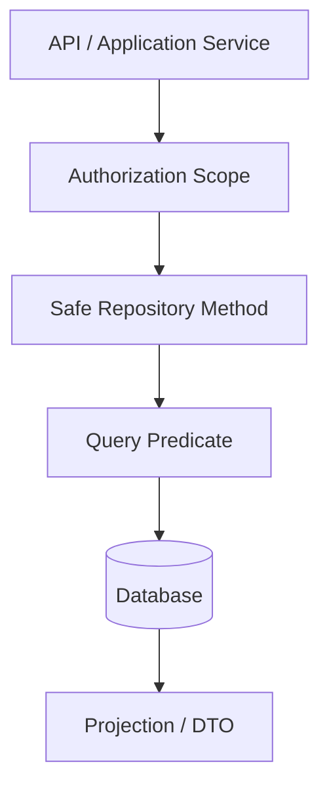

------
title: Learn Java Identity, Authentication & Authorization for Secure Enterprise API Platform - Part 018
description: Authorization at the data access boundary for Java enterprise systems, including query-time constraints, tenant predicates, visibility repositories, row-level security, aggregation leaks, TOCTOU, and test strategies.
series: learn-java-identity-authentication-authorization-api-platform
seriesTitle: Learn Java Identity, Authentication & Authorization for Secure Enterprise API Platform
order: 18
partTitle: Authorization at Data Access Boundary
tags:
- java
- authorization
- data-access
- api-security
- multi-tenancy
- spring-data
- jpa
- sql
- enterprise-platform
date: 2026-06-28
---

# Part 018 — Authorization at Data Access Boundary

## 1. Problem Framing

Method-level authorization protects operations.

But many data leaks happen before or around the operation-level policy check.

Typical risky examples:

```java
List<CaseDto> listCases() {
    return caseRepository.findAll().stream()
            .filter(caze -> policy.canRead(subject, caze).permitted())
            .map(CaseDto::from)
            .toList();
}
```

```java
CaseDto getCase(UUID id) {
    CaseEntity entity = caseRepository.findById(id).orElseThrow();
    if (!entity.getTenantId().equals(currentTenant())) {
        throw new AccessDeniedException("Denied");
    }
    return mapper.toDto(entity);
}
```

The first loads unauthorized data before filtering.

The second checks after loading but may still leak through timing, logs, caches, entity listeners, lazy relations, object graphs, or inconsistent error behavior.

Data-access authorization asks:

```text
Can unauthorized rows, columns, counts, joins, or aggregates be prevented from entering the application result set in the first place?
```

This part focuses on making authorization enforceable at query/data boundaries.

## 2. Kaufman Subskill Breakdown

Target skill:

> Design Java data access boundaries where every query, lookup, list, search, export, count, join, and aggregate is constrained by subject, tenant, relationship, action, and resource visibility before data is materialized.

Subskills:

| Subskill | What You Must Be Able to Do |
|---|---|
| Visibility modeling | Represent what resources a subject may see or act on. |
| Query constraint design | Add tenant, ownership, relationship, state, and entitlement predicates to queries. |
| Repository boundary design | Expose safe repository methods that require an authorization scope. |
| List/search safety | Prevent unauthorized rows from appearing in list, page, search, and export results. |
| Count/aggregation safety | Prevent leaks through totals, facets, statistics, and dashboards. |
| Parent-child binding | Ensure nested resources belong to visible parents. |
| Property-level projection | Restrict fields/columns based on property-level authorization. |
| Consistency reasoning | Avoid stale visibility decisions and TOCTOU bugs. |
| Defense-in-depth | Combine application predicates with database controls when appropriate. |
| Test design | Prove unauthorized rows are not loaded, counted, joined, exported, or cached. |

Practice goal after this part:

> Given any repository query, you can state exactly which authorization predicate must be applied and write a negative test that fails if the predicate is removed.

## 3. Mental Model: Data Access Is an Enforcement Boundary

Do not treat repositories as neutral data plumbing.

In identity-aware systems, repositories are part of the security boundary.



The important invariant:

> A query that returns business data must be scoped by the caller's authorization context unless it is deliberately running under a constrained system identity.

## 4. Why Method-Level Checks Are Not Enough for Lists

Object-level method checks work well for single-resource operations.

Example:

```text
Can Alice read case 123?
```

But list endpoints ask a different question:

```text
Which cases can Alice read?
```

You cannot answer that safely by loading all cases and filtering in memory.

Bad:

```java
public Page<CaseDto> listCases(Pageable pageable) {
    return caseRepository.findAll(pageable)
            .map(CaseDto::from);
}
```

Also bad:

```java
public List<CaseDto> listCases() {
    return caseRepository.findAll().stream()
            .filter(caze -> policy.canRead(subject, caze).permitted())
            .map(CaseDto::from)
            .toList();
}
```

Correct direction:

```java
public Page<CaseSummary> listCases(AuthenticatedSubject subject, CaseSearchFilter filter, Pageable pageable) {
    CaseVisibilityScope scope = visibilityScopeFactory.forCaseRead(subject);
    return caseRepository.searchVisible(scope, filter, pageable);
}
```

The repository query includes the visibility predicate.

## 5. Authorization Scope Object

Instead of passing raw subject fields everywhere, create a query-oriented scope.

```java
public record CaseVisibilityScope(
        UUID subjectId,
        String tenantId,
        Set<String> readableCaseTypes,
        Set<UUID> businessUnitIds,
        boolean canReadEscalatedCases,
        boolean canReadSensitiveCases,
        Optional<DelegationScope> delegation
) {}
```

Factory:

```java
@Component
public class CaseVisibilityScopeFactory {

    public CaseVisibilityScope forCaseRead(AuthenticatedSubject subject) {
        return new CaseVisibilityScope(
                subject.subjectId(),
                subject.tenantId(),
                deriveReadableCaseTypes(subject),
                deriveBusinessUnits(subject),
                subject.hasAuthority("case:read:escalated"),
                subject.hasAuthority("case:read:sensitive"),
                subject.delegation().map(this::toDelegationScope)
        );
    }

    private Set<String> deriveReadableCaseTypes(AuthenticatedSubject subject) {
        return subject.authorities().stream()
                .filter(a -> a.startsWith("case:read:type:"))
                .map(a -> a.substring("case:read:type:".length()))
                .collect(Collectors.toUnmodifiableSet());
    }
}
```

A scope object has three benefits:

1. Repository methods cannot “forget” the subject context.
2. Query tests can construct precise scopes.
3. Audit/logging can record which scope was applied without exposing raw tokens.

## 6. Safe Repository Method Naming

Do not expose generic methods for sensitive data unless their use is tightly controlled.

Risky:

```java
Optional<CaseEntity> findById(UUID id);
List<CaseEntity> findAll();
Page<CaseEntity> search(CaseSearchFilter filter, Pageable pageable);
```

Safer:

```java
Optional<CaseEntity> findVisibleById(CaseVisibilityScope scope, UUID caseId);
Page<CaseSummaryProjection> searchVisible(CaseVisibilityScope scope, CaseSearchFilter filter, Pageable pageable);
boolean existsVisibleCase(CaseVisibilityScope scope, UUID caseId);
long countVisible(CaseVisibilityScope scope, CaseSearchFilter filter);
```

Method names should encode visibility expectations.

Internal unrestricted methods may still exist, but they should be isolated.

```java
interface InternalCaseRepository {
    Optional<CaseEntity> findByIdForSystemMaintenance(UUID id);
}
```

Then restrict usage by package/module and code review rules.

## 7. Query Predicate Anatomy

A secure case visibility query may include:

```text
tenant predicate
AND case type predicate
AND business unit predicate
AND assignment/relationship predicate
AND state predicate
AND sensitivity predicate
AND delegation predicate
```

Example SQL shape:

```sql
select c.id, c.case_number, c.title, c.status, c.risk_level
from cases c
where c.tenant_id = :tenant_id
  and c.case_type in (:readable_case_types)
  and (
        c.business_unit_id in (:business_unit_ids)
        or exists (
            select 1
            from case_assignments a
            where a.case_id = c.id
              and a.subject_id = :subject_id
              and a.assignment_status = 'ACTIVE'
        )
      )
  and (
        c.sensitive = false
        or :can_read_sensitive_cases = true
      )
order by c.updated_at desc
limit :limit offset :offset;
```

The exact predicate is domain-specific.

The invariant is general:

> The predicate must represent the same visibility contract that the domain policy would enforce for each returned row.

## 8. Spring Data JPA Specification Example

A specification can express authorization predicates composably.

```java
public final class CaseSpecifications {

    private CaseSpecifications() {}

    public static Specification<CaseEntity> visibleTo(CaseVisibilityScope scope) {
        return (root, query, cb) -> {
            List<Predicate> predicates = new ArrayList<>();

            predicates.add(cb.equal(root.get("tenantId"), scope.tenantId()));

            if (!scope.readableCaseTypes().isEmpty()) {
                predicates.add(root.get("caseType").in(scope.readableCaseTypes()));
            } else {
                predicates.add(cb.disjunction());
            }

            Predicate inBusinessUnit = root.get("businessUnitId").in(scope.businessUnitIds());

            Subquery<UUID> assignmentSubquery = query.subquery(UUID.class);
            Root<CaseAssignmentEntity> assignment = assignmentSubquery.from(CaseAssignmentEntity.class);
            assignmentSubquery.select(assignment.get("caseId"));
            assignmentSubquery.where(
                    cb.equal(assignment.get("caseId"), root.get("id")),
                    cb.equal(assignment.get("subjectId"), scope.subjectId()),
                    cb.equal(assignment.get("status"), AssignmentStatus.ACTIVE)
            );

            Predicate assigned = cb.exists(assignmentSubquery);
            predicates.add(cb.or(inBusinessUnit, assigned));

            if (!scope.canReadSensitiveCases()) {
                predicates.add(cb.isFalse(root.get("sensitive")));
            }

            return cb.and(predicates.toArray(Predicate[]::new));
        };
    }
}
```

Repository:

```java
public interface CaseJpaRepository
        extends JpaRepository<CaseEntity, UUID>, JpaSpecificationExecutor<CaseEntity> {
}
```

Service:

```java
public Page<CaseSummary> searchVisible(
        CaseVisibilityScope scope,
        CaseSearchFilter filter,
        Pageable pageable
) {
    Specification<CaseEntity> spec = Specification
            .where(CaseSpecifications.visibleTo(scope))
            .and(CaseSpecifications.matchesFilter(filter));

    return caseJpaRepository.findAll(spec, pageable)
            .map(CaseSummary::from);
}
```

Caution:

Specifications are powerful, but they can become unreadable.

For high-risk queries, prefer named query objects and integration tests that assert SQL-level behavior.

## 9. Query Object Pattern

For complex authorization, a dedicated query object is often clearer.

```java
@Repository
public class CaseReadRepository {

    private final NamedParameterJdbcTemplate jdbc;

    public CaseReadRepository(NamedParameterJdbcTemplate jdbc) {
        this.jdbc = jdbc;
    }

    public Optional<CaseSummary> findVisibleById(CaseVisibilityScope scope, UUID caseId) {
        String sql = """
            select c.id, c.case_number, c.title, c.status, c.risk_level
            from cases c
            where c.id = :case_id
              and c.tenant_id = :tenant_id
              and c.case_type in (:case_types)
              and (
                    c.business_unit_id in (:business_unit_ids)
                    or exists (
                        select 1 from case_assignments a
                        where a.case_id = c.id
                          and a.subject_id = :subject_id
                          and a.assignment_status = 'ACTIVE'
                    )
                  )
              and (:can_read_sensitive = true or c.sensitive = false)
            """;

        MapSqlParameterSource params = new MapSqlParameterSource()
                .addValue("case_id", caseId)
                .addValue("tenant_id", scope.tenantId())
                .addValue("case_types", scope.readableCaseTypes())
                .addValue("business_unit_ids", scope.businessUnitIds())
                .addValue("subject_id", scope.subjectId())
                .addValue("can_read_sensitive", scope.canReadSensitiveCases());

        return jdbc.query(sql, params, caseSummaryRowMapper()).stream().findFirst();
    }
}
```

This is more verbose than derived query methods, but it makes the authorization predicate visible.

In regulated systems, readability of security predicates is worth some verbosity.

## 10. Single-Object Lookup Pattern

For a read endpoint:

```http
GET /cases/{caseId}
```

Prefer:

```java
public CaseDto getCase(UUID caseId, Authentication authentication) {
    AuthenticatedSubject subject = subjectResolver.from(authentication);
    CaseVisibilityScope scope = scopeFactory.forCaseRead(subject);

    CaseEntity caze = caseReadRepository.findVisibleById(scope, caseId)
            .orElseThrow(() -> new ResourceNotFoundException("Case not found"));

    CaseViewPolicy viewPolicy = viewPolicyFactory.forSubjectAndCase(subject, caze);
    return caseMapper.toDto(caze, viewPolicy);
}
```

This avoids a separate “load then check” path for read access.

For state-changing operations, you may need to load the aggregate and then evaluate a rich policy.

But even then, the initial load should usually include tenant constraints.

```java
Optional<CaseAggregate> findByTenantAndIdForUpdate(String tenantId, UUID caseId);
```

## 11. Parent-Child Binding

Nested resources are a common authorization bug.

Endpoint:

```http
GET /cases/{caseId}/evidence/{evidenceId}
```

Bad query:

```java
EvidenceEntity evidence = evidenceRepository.findById(evidenceId).orElseThrow();
```

This ignores `caseId`.

An attacker can provide a visible `caseId` and another user's `evidenceId`.

Safer query:

```java
Optional<EvidenceEntity> findVisibleEvidence(
        EvidenceVisibilityScope scope,
        UUID caseId,
        UUID evidenceId
) {
    // predicate must bind evidence to case and case to subject visibility
}
```

SQL shape:

```sql
select e.id, e.file_name, e.classification, e.created_at
from evidence e
join cases c on c.id = e.case_id
where e.id = :evidence_id
  and c.id = :case_id
  and c.tenant_id = :tenant_id
  and exists (
      select 1
      from case_visibility v
      where v.case_id = c.id
        and v.subject_id = :subject_id
  )
  and (
      e.classification <> 'RESTRICTED'
      or :can_read_restricted_evidence = true
  );
```

Invariant:

> Every child resource lookup must bind child ID to parent ID and parent visibility.

## 12. List, Search, and Export Are Different Risk Classes

A user may be allowed to read one case but not bulk export all visible cases.

Separate actions:

```text
case:read
case:search
case:export
case:export:sensitive
```

Search may return metadata only.

Export may contain full data and require stronger controls.

Example:

```java
public ExportJobId exportCases(CaseExportRequest request, Authentication authentication) {
    AuthenticatedSubject subject = subjectResolver.from(authentication);

    if (!subject.hasAuthority("case:export")) {
        throw new AccessDeniedException("Missing case export authority");
    }

    CaseVisibilityScope scope = scopeFactory.forCaseExport(subject, request.exportScope());

    ExportPolicyDecision decision = exportPolicy.canExport(subject, scope, request);
    exportEnforcer.enforce("case.export", decision);

    return exportJobRepository.create(scope, request);
}
```

The export job must persist the scope or a safe snapshot of it.

Do not let async export workers re-run as an unrestricted system user without the original constraints.

## 13. Count and Aggregation Leaks

Authorization applies to counts too.

Bad:

```sql
select count(*) from cases where tenant_id = :tenant_id;
```

If the caller can only see part of the tenant, this leaks case volume.

Safer:

```sql
select count(*)
from cases c
where c.tenant_id = :tenant_id
  and c.case_type in (:case_types)
  and exists (
      select 1 from case_visibility v
      where v.case_id = c.id
        and v.subject_id = :subject_id
  );
```

Aggregation leaks can happen through:

- Total counts.
- Pagination totals.
- Dashboard metrics.
- Facets.
- Search suggestions.
- Autocomplete.
- “Related case” recommendations.
- Export progress counts.
- Error messages.

Invariant:

> If a row is not visible, it must not influence user-visible counts, facets, or summaries unless explicitly allowed by policy.

## 14. Pagination Pitfalls

In-memory filtering breaks pagination.

Example:

```java
Page<CaseEntity> page = caseRepository.findAll(pageable);
List<CaseEntity> visible = page.getContent().stream()
        .filter(c -> policy.canRead(subject, c).permitted())
        .toList();
```

Problems:

- Page size may shrink unpredictably.
- `totalElements` counts unauthorized rows.
- Later pages may leak distribution.
- Sorting occurs before security filtering.
- Users may infer hidden data from gaps.

Correct direction:

```text
where authorization_predicate
order by stable_sort
limit/offset or keyset
```

Apply visibility before pagination.

## 15. Property-Level Projection at Data Boundary

Sometimes a user may see the row but not all columns.

Example:

```text
case summary is visible
sensitive evidence count is not visible
whistleblower identity is not visible
internal enforcement strategy is not visible
```

Options:

1. Fetch full entity and apply view policy in mapper.
2. Use query projection that excludes restricted columns.
3. Split sensitive fields into separate tables with separate access paths.
4. Use column-level security or database views where appropriate.

For high-risk fields, prefer structural separation.

Example:

```sql
select c.id,
       c.case_number,
       c.title,
       c.status,
       c.risk_level,
       case when :can_read_internal_notes = true then c.internal_notes else null end as internal_notes
from cases c
where c.id = :case_id
  and c.tenant_id = :tenant_id
  and exists (... visibility predicate ...);
```

Or use separate repository method:

```java
Optional<CaseInternalNotes> findVisibleInternalNotes(
        CaseVisibilityScope scope,
        UUID caseId
);
```

Do not rely on “frontend will hide it”.

## 16. Caching and Authorization

Caching can bypass data-access authorization if keys are incomplete.

Bad cache key:

```text
case:{caseId}
```

If Alice loads a case and it is cached by ID, Bob may get the same cached object without visibility evaluation.

Safer approaches:

- Cache only immutable public data by resource ID.
- Include tenant and visibility scope in cache key.
- Cache authorization-insensitive projections only.
- Cache policy decisions with short TTL and invalidation triggers.
- Avoid caching full sensitive aggregates in shared caches.

Example key:

```text
case-summary:{tenantId}:{subjectVisibilityHash}:{caseId}
```

Be careful with visibility hash.

It must change when entitlements, assignments, delegations, or tenant membership change.

## 17. Search Index Authorization

Search engines create a second data store.

If Elasticsearch/OpenSearch/Solr contains case data, it must enforce equivalent visibility.

Common failure:

```text
Database query is tenant-scoped.
Search query is only text-scoped.
```

Search document should include authorization filter attributes:

```json
{
  "caseId": "...",
  "tenantId": "tenant-a",
  "caseType": "market-abuse",
  "businessUnitId": "...",
  "assignedSubjectIds": ["..."],
  "sensitive": true,
  "status": "PENDING_REVIEW"
}
```

Search query must include filters:

```json
{
  "query": {
    "bool": {
      "must": [
        { "match": { "text": "insider" } }
      ],
      "filter": [
        { "term": { "tenantId": "tenant-a" } },
        { "terms": { "caseType": ["market-abuse"] } },
        {
          "bool": {
            "should": [
              { "terms": { "businessUnitId": ["bu-1", "bu-2"] } },
              { "term": { "assignedSubjectIds": "subject-123" } }
            ],
            "minimum_should_match": 1
          }
        }
      ]
    }
  }
}
```

Do not treat search as less sensitive because it is “only metadata”.

Metadata can be regulated data.

## 18. Database Row-Level Security

Application-level predicates are usually necessary because they understand business context.

Database row-level security can add defense-in-depth.

Use RLS when:

- Tenant isolation must be strongly enforced.
- Many queries are hand-written.
- Multiple applications access the same database.
- You want a backstop against missing predicates.

Do not assume RLS solves everything.

Limitations:

- Business policy may be too complex for database policy.
- Application context must be passed safely to database session variables.
- Connection pooling can leak session variables if not reset.
- Debugging authorization becomes harder.
- Cross-tenant system jobs need carefully controlled bypass.

A practical pattern:

```text
application policy decides operation
repository query applies visibility predicate
database RLS enforces tenant baseline
```

## 19. Connection Pool Risk with Session Context

If database policies depend on session variables, connection pools can cause dangerous leakage.

Example concept:

```sql
set app.current_tenant = 'tenant-a';
```

If the connection returns to the pool and is reused for tenant B without resetting the variable, tenant B may run under tenant A context.

Mitigations:

- Set tenant context at transaction start.
- Reset context at transaction end.
- Use connection pool hooks where available.
- Use `SET LOCAL` within transaction where database supports it.
- Add integration tests that alternate tenants on the same pool.

Invariant:

> Security context stored in infrastructure must have a clear lifecycle.

## 20. Stale Entitlements and Materialized Visibility

Some systems materialize visibility for performance.

Example table:

```sql
case_visibility(
    case_id,
    subject_id,
    tenant_id,
    can_read,
    can_update,
    can_approve,
    valid_from,
    valid_until,
    source_version
)
```

Benefits:

- Fast queries.
- Simple predicates.
- Easier audit of visibility grants.
- Efficient search index filters.

Risks:

- Stale visibility after role changes.
- Delayed revocation.
- Incorrect recomputation after assignment changes.
- Hard-to-explain policy drift.

Use materialized visibility when:

- The relationship graph is complex.
- List/search performance matters.
- You can define recomputation triggers.
- You can tolerate and bound staleness.
- You have revocation-sensitive paths that bypass cache or force recompute.

For high-risk operations, re-evaluate live policy before side effects even if visibility was materialized.

## 21. Data Access for State-Changing Operations

State-changing operations often need both query constraint and domain policy.

Example:

```java
@Transactional
public void assignReviewer(UUID caseId, UUID reviewerId, Authentication authentication) {
    AuthenticatedSubject subject = subjectResolver.from(authentication);

    CaseMutationScope scope = mutationScopeFactory.forAssignReviewer(subject);

    CaseAggregate caze = caseRepository.findMutableById(scope, caseId)
            .orElseThrow(() -> new ResourceNotFoundException("Case not found"));

    AuthorizationDecision decision = assignmentPolicy.canAssignReviewer(subject, caze, reviewerId);
    enforcer.enforce("case.assign-reviewer", decision);

    caze.assignReviewer(reviewerId, subject.subjectId(), clock.instant());
}
```

`findMutableById` may enforce tenant and broad mutation visibility.

The policy enforces operation-specific rules.

This avoids both extremes:

- Repository does everything and hides business policy in SQL.
- Service loads anything and hopes later checks catch it.

## 22. `exists` Checks Must Be Scoped

Existence checks can leak data.

Bad:

```java
if (!caseRepository.existsById(caseId)) {
    throw new ResourceNotFoundException("Case not found");
}
```

This tells the caller whether an ID exists globally.

Safer:

```java
if (!caseRepository.existsVisibleCase(scope, caseId)) {
    throw new ResourceNotFoundException("Case not found");
}
```

Even better: use the visible lookup directly.

```java
CaseSummary caze = caseRepository.findVisibleById(scope, caseId)
        .orElseThrow(() -> new ResourceNotFoundException("Case not found"));
```

The caller should not be able to distinguish:

- Object does not exist.
- Object exists but is not visible.

Unless policy intentionally exposes that difference.

## 23. Sorting and Facets Can Leak Restricted Attributes

A user may not see a field, but sorting by it can reveal information.

Example:

```http
GET /cases?sort=internalRiskScore,desc
```

If `internalRiskScore` is not visible to the user, sorting by it may leak relative risk ordering.

Facets also leak:

```http
GET /cases/facets?field=whistleblowerCountry
```

Mitigation:

- Maintain allowlist of sortable fields per action/view policy.
- Maintain allowlist of filterable/facet fields per subject and endpoint.
- Reject unauthorized sort/filter/facet fields.
- Apply visibility before aggregation.

Example:

```java
public Sort sanitizeSort(Sort requested, CaseViewPolicy policy) {
    Set<String> allowed = new HashSet<>(List.of("updatedAt", "caseNumber", "status"));

    if (policy.canReadRiskMetadata()) {
        allowed.add("riskLevel");
    }

    for (Sort.Order order : requested) {
        if (!allowed.contains(order.getProperty())) {
            throw new AccessDeniedException("Sort field is not allowed");
        }
    }

    return requested;
}
```

## 24. DTO Projection Is Part of Authorization

A repository method returning entity graphs can accidentally expose too much.

Risky:

```java
Page<CaseEntity> searchVisible(...)
```

Safer for read endpoints:

```java
Page<CaseSummaryProjection> searchVisibleSummaries(...)
```

Projection:

```java
public record CaseSummaryProjection(
        UUID id,
        String caseNumber,
        String title,
        CaseStatus status,
        Instant updatedAt
) {}
```

Use narrow projections for list/search.

Reserve full aggregate loading for operations that need it.

## 25. Repository Contract Tests

Test repositories as security boundaries.

Example setup:

```text
tenant-a case assigned to alice
tenant-a case assigned to bob
tenant-b case assigned to alice
tenant-a sensitive case not readable by alice
tenant-a closed case
tenant-a child evidence under visible case
tenant-a child evidence under invisible case
```

Test:

```java
@Test
void searchVisibleReturnsOnlyAuthorizedRows() {
    CaseVisibilityScope aliceScope = scopeFor(aliceTenantA);

    Page<CaseSummaryProjection> result = repository.searchVisible(
            aliceScope,
            new CaseSearchFilter(),
            PageRequest.of(0, 20)
    );

    assertThat(result.getContent())
            .extracting(CaseSummaryProjection::id)
            .contains(visibleAliceCaseId)
            .doesNotContain(bobCaseId, tenantBCaseId, sensitiveCaseId);
}
```

Count test:

```java
@Test
void countVisibleDoesNotCountInvisibleRows() {
    long count = repository.countVisible(scopeFor(aliceTenantA), new CaseSearchFilter());

    assertThat(count).isEqualTo(1);
}
```

Parent-child binding test:

```java
@Test
void cannotReadEvidenceByMixingVisibleCaseWithInvisibleEvidenceId() {
    Optional<EvidenceSummary> result = evidenceRepository.findVisibleEvidence(
            scopeFor(aliceTenantA),
            visibleCaseId,
            evidenceFromInvisibleCaseId
    );

    assertThat(result).isEmpty();
}
```

## 26. Mutation Tests for Missing Predicates

A powerful testing habit:

> Delete one authorization predicate and prove a test fails.

Predicates to mutate:

- Remove tenant predicate.
- Remove subject assignment predicate.
- Remove business unit predicate.
- Remove sensitivity predicate.
- Remove parent-child join.
- Remove delegation expiry predicate.
- Remove action-specific predicate.

If tests still pass after removing a predicate, your test suite is not proving authorization correctness.

## 27. Observability for Data-Access Authorization

Do not log raw SQL parameters containing sensitive data unnecessarily.

But do record useful security metadata:

```json
{
  "eventType": "authorization.query",
  "operation": "case.search",
  "subjectId": "...",
  "tenantId": "tenant-a",
  "scopeHash": "sha256:...",
  "policyVersion": "case-visibility-v3",
  "resultCount": 20,
  "totalVisible": 135,
  "deniedPredicate": null,
  "requestId": "..."
}
```

For denied single-resource lookups:

```json
{
  "eventType": "authorization.denied_or_not_visible",
  "operation": "case.read",
  "subjectId": "...",
  "tenantId": "tenant-a",
  "resourceType": "case",
  "resourceIdHash": "sha256:...",
  "policyVersion": "case-visibility-v3",
  "reasonCode": "NOT_VISIBLE_OR_NOT_FOUND"
}
```

Hash resource IDs if logs are broadly accessible.

## 28. System Jobs and Service Accounts

Not every data access is from a human user.

System jobs need explicit identity and scope.

Bad:

```java
caseRepository.findAll().forEach(exporter::export);
```

Better:

```java
SystemSubject subject = systemSubjectRegistry.forJob("case-retention-job");
RetentionScope scope = retentionScopeFactory.forSystemJob(subject);
caseRepository.findEligibleForRetention(scope, batchSize)
        .forEach(retentionService::process);
```

System identity should include:

- Job name.
- Purpose.
- Allowed tenant scope.
- Allowed data class.
- Allowed actions.
- Approval/reference ticket if required.
- Audit correlation ID.

Do not use unrestricted repository methods casually because “it is only a batch job”.

Batch jobs are common data breach amplifiers.

## 29. Data-Access Authorization Decision Matrix

For a sensitive repository method, define a matrix.

Example: `searchVisibleCases(scope, filter, pageable)`.

| Scenario | Expected |
|---|---|
| Same tenant, assigned case | returned. |
| Same tenant, same business unit | returned if business unit visibility applies. |
| Same tenant, unassigned different unit | not returned. |
| Different tenant | not returned. |
| Sensitive case without sensitive permission | not returned or redacted, depending on endpoint. |
| Closed case excluded by filter | not returned. |
| Invisible case matching text search | not returned. |
| Invisible case influences total count | must not happen. |
| Invisible case influences facet | must not happen. |
| Child resource belongs to invisible parent | not returned. |
| Sort requested on unauthorized field | rejected. |
| Export requested with read-only scope | rejected. |

## 30. Common Failure Modes

| Failure Mode | Why It Happens | Consequence | Mitigation |
|---|---|---|---|
| Load then filter | Security treated as post-processing. | Unauthorized data materialized and may leak. | Apply predicates in query. |
| Unscoped count | Developers secure rows but not totals. | User infers hidden data volume. | Scope count/facet queries. |
| Parent-child mismatch | Child ID lookup ignores parent ID. | IDOR/BOLA through nested resources. | Bind child to visible parent. |
| Cache by resource ID only | Visibility missing from cache key. | Cross-user data leakage. | Include tenant/scope or cache only safe projections. |
| Search index missing filters | Secondary store not security-aware. | Search leaks metadata/data. | Include auth filter attributes and enforce filters. |
| Generic repository methods | `findAll`/`findById` reused unsafely. | Missing predicates in new paths. | Safe repository contracts and module boundaries. |
| RLS context leak | Connection pool reuses tenant context. | Cross-tenant access. | Transaction-local context and reset tests. |
| Stale materialized visibility | Entitlement changes not propagated. | Revoked users retain access. | Invalidation/recompute and live re-check for high-risk operations. |
| Unrestricted batch jobs | System code bypasses policy. | Massive data exposure. | Service identity and scoped jobs. |
| Unauthorized sort/facet | Hidden fields still affect output. | Inference leaks. | Field allowlists per view/action policy. |

## 31. Anti-Patterns

### 31.1 Repository as a Dumb Pipe

```java
interface CaseRepository extends JpaRepository<CaseEntity, UUID> {}
```

This is fine for simple applications.

In regulated platforms, sensitive repositories need security-aware contracts.

### 31.2 `findAll` in Production APIs

```java
caseRepository.findAll()
```

This should be a red flag in code review for sensitive entities.

Ask:

- Which tenant?
- Which subject?
- Which action?
- Which visibility predicate?
- Which pagination limit?
- Which projection?

### 31.3 Security by DTO Omission Only

Returning a smaller DTO does not fix unauthorized row access.

A user may still learn:

- Resource existence.
- Counts.
- Status.
- Timestamps.
- Relationships.
- Operational patterns.

### 31.4 Admin Query Reused by User Endpoint

Admin dashboards often need broader queries.

Do not reuse them in user endpoints.

Create separate repository methods and scopes.

### 31.5 Policy Drift Between Single Read and Search

Single read says denied.

Search still returns the record.

This is a severe inconsistency.

Build shared visibility predicates or shared visibility indexes.

## 32. Production Checklist

Before shipping a query endpoint:

- [ ] The endpoint action is named: read/search/export/count/facet/autocomplete.
- [ ] The repository method requires an authorization scope.
- [ ] Tenant predicate is present.
- [ ] Subject/relationship predicate is present where needed.
- [ ] Action-specific constraints are present.
- [ ] Sensitivity/property-level constraints are handled.
- [ ] Parent-child resources are bound in the query.
- [ ] Pagination happens after authorization predicates.
- [ ] Counts and facets are scoped.
- [ ] Sort/filter/facet fields are allowlisted.
- [ ] Search index filters match database visibility.
- [ ] Cache keys include visibility or cache only safe projections.
- [ ] System jobs use explicit service identity and scope.
- [ ] Integration tests prove unauthorized rows are not returned or counted.
- [ ] Mutation tests fail when predicates are removed.
- [ ] Logs record scope/policy metadata without leaking sensitive raw data.

## 33. Practice Drills

### Drill 1 — Secure a Search Endpoint

Given:

```http
GET /cases?status=PENDING_REVIEW&sort=updatedAt,desc&page=0&size=20
```

Design:

1. `CaseVisibilityScope`.
2. Repository method signature.
3. SQL/JPA predicate.
4. Count query.
5. Negative tests.
6. Allowed sort fields.
7. Audit event.

### Drill 2 — Fix Parent-Child BOLA

Given:

```java
EvidenceEntity evidence = evidenceRepository.findById(evidenceId).orElseThrow();
```

Refactor into a query that binds:

- Tenant.
- Parent case ID.
- Evidence ID.
- Case visibility.
- Evidence classification permission.

### Drill 3 — Detect Count Leaks

Review every endpoint returning:

- `totalElements`.
- `totalPages`.
- facet counts.
- dashboard counts.
- autocomplete suggestions.

Mark which queries are not visibility-scoped.

### Drill 4 — Cache Key Review

For every cache containing resource data, answer:

1. Is the cached value authorization-sensitive?
2. Does the key include tenant?
3. Does the key include subject/scope where required?
4. What invalidates it after entitlement changes?
5. Could another user receive a cached object they cannot load from DB?

## 34. Key Takeaways

Method-level authorization answers:

```text
Can this subject perform this operation?
```

Data-access authorization answers:

```text
Which rows, columns, counts, joins, and projections may enter the result set?
```

You need both.

For enterprise Java platforms, the safest pattern is:

```text
subject -> authorization scope -> safe repository method -> query predicate -> narrow projection -> audited result
```

Do not rely on in-memory filtering for security.

Do not forget counts, facets, exports, search indexes, caches, and batch jobs.

The top engineering habit:

> Every query that touches sensitive data must make the authorization scope visible in its method signature and provable in its tests.

## 35. References

- OWASP API Security Top 10 2023 — API1 Broken Object Level Authorization: https://owasp.org/API-Security/editions/2023/en/0xa1-broken-object-level-authorization/
- OWASP API Security Top 10 2023 — API3 Broken Object Property Level Authorization: https://owasp.org/API-Security/editions/2023/en/0xa3-broken-object-property-level-authorization/
- OWASP Authorization Cheat Sheet: https://cheatsheetseries.owasp.org/cheatsheets/Authorization_Cheat_Sheet.html
- Spring Security Reference — Method Security: https://docs.spring.io/spring-security/reference/servlet/authorization/method-security.html
- Spring Security Reference — Testing Method Security: https://docs.spring.io/spring-security/reference/servlet/test/method.html
