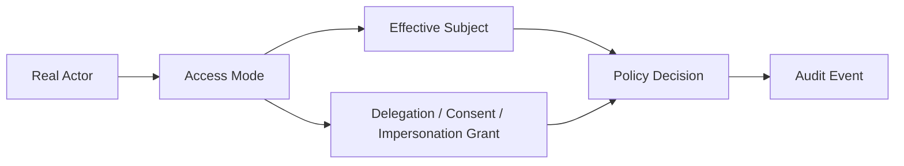
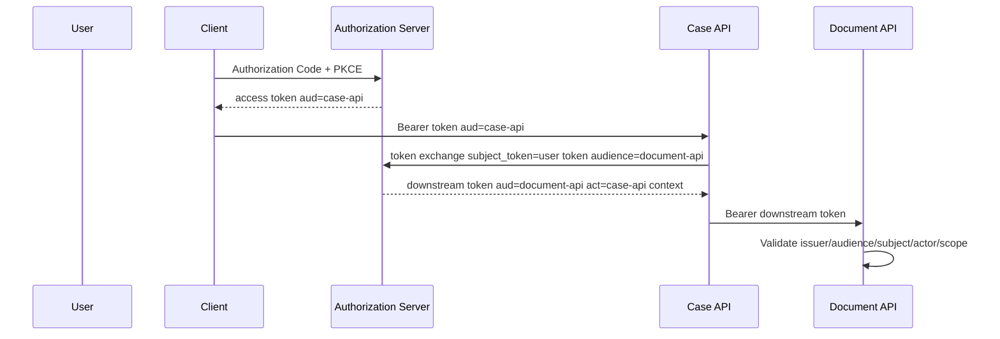
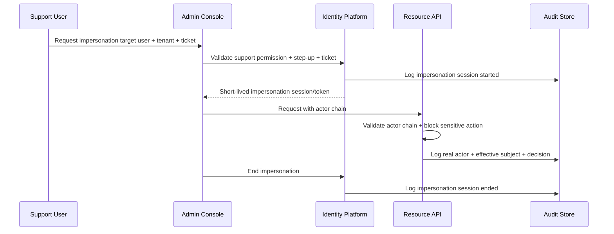

------
title: Learn Java Identity, Authentication & Authorization for Secure Enterprise API Platform - Part 020
description: Delegation, consent, acting-as, on-behalf-of, impersonation, and break-glass access design for secure Java enterprise API platforms, including actor chains, token exchange, policy enforcement, audit evidence, Spring implementation patterns, and failure-mode testing.
series: learn-java-identity-authentication-authorization-api-platform
seriesTitle: Learn Java Identity, Authentication & Authorization for Secure Enterprise API Platform
order: 20
partTitle: Delegation, Consent, Acting-As, On-Behalf-Of, and Impersonation
tags:
- java
- oauth2
- oidc
- authorization
- delegation
- consent
- impersonation
- token-exchange
- audit
- enterprise-platform
date: 2026-06-28
---

# Part 020 — Delegation, Consent, Acting-As, On-Behalf-Of, and Impersonation

## 1. Problem Framing

Enterprise identity systems fail when they treat every non-direct access case as the same thing.

Teams often use one overloaded phrase:

```text
"User A is acting as User B."
```

But this can mean many different things:

- a user consented to an application accessing an API;
- a manager delegated approval rights to another employee;
- a service calls another service on behalf of a user;
- a support engineer views a customer's account for a ticket;
- an administrator impersonates a user to reproduce a bug;
- an emergency operator uses break-glass access;
- a batch job acts as the platform, not as any user.

These flows have different security semantics.

If they are modelled as one generic `impersonate=true` flag, the platform loses:

- non-repudiation;
- least privilege;
- auditability;
- incident accountability;
- regulatory defensibility;
- correct authorization decisions.

This part builds a precise model for delegation and impersonation.

The key question:

```text
Who is the real actor, whose authority is being used, what authority was delegated,
who approved it, for what purpose, for how long, and how is it proven later?
```

## 2. Kaufman Skill Slice

The target performance:

```text
Given any indirect access scenario, you can classify the access mode,
model the actor chain, constrain the authority, enforce policy correctly,
and emit audit evidence that proves who did what under whose authority.
```

Subskills:

| Subskill | What You Must Be Able To Do |
|---|---|
| Classification | Distinguish consent, delegation, acting-as, on-behalf-of, impersonation, sudo, and break-glass. |
| Actor modelling | Represent real actor, effective subject, client, service, approver, and target user. |
| Authority bounding | Ensure delegated access cannot exceed allowed scope, tenant, resource, time, or purpose. |
| Token semantics | Use OAuth scopes, audience, subject, actor context, and token exchange safely. |
| Policy integration | Feed actor chain and access mode into authorization decisions. |
| Audit design | Preserve evidence for user, admin, service, approver, reason, target, and decision. |
| UX/API safety | Make high-risk access visible, explicit, time-bound, and revocable. |
| Testing | Build negative tests for privilege amplification and audit erasure. |

Fluency marker:

```text
You stop asking "can we impersonate?"
and start asking "which actor chain and authority boundary is this flow allowed to create?"
```

## 3. Core Definitions

| Term | Meaning | Example | Audit Requirement |
|---|---|---|---|
| Consent | Resource owner authorizes a client/application to access resources. | User authorizes reporting app to read cases. | User, client, scopes, resources, time, consent version. |
| Delegation | Principal grants another principal limited authority. | Manager delegates approvals during leave. | Delegator, delegate, authority, constraints, expiry. |
| Acting-as | Actor operates with a declared target context but remains visible as actor. | Support staff acts in tenant context for ticket. | Real actor and target context both preserved. |
| On-behalf-of | A service obtains downstream access representing an upstream subject/client context. | API calls document service for current user. | Original subject, calling service, downstream audience. |
| Impersonation | Actor assumes effective identity/permissions of another user. | Support reproduces user's issue. | High-risk; real actor must never be erased. |
| Sudo/elevation | Same actor temporarily obtains elevated privilege after step-up or approval. | Admin confirms MFA to delete tenant integration. | Actor, elevation reason, assurance, expiry. |
| Break-glass | Emergency access outside normal policy path. | Security lead accesses tenant during outage. | Strongest audit, justification, approval/review. |
| Service account | Non-human actor with its own authority. | Nightly reconciler closes expired tasks. | Service identity, job id, tenant, action. |

Do not use these words interchangeably in architecture documents.

## 4. Mental Model: Real Actor vs Effective Authority

Every indirect access flow has at least two dimensions:

```text
real actor       = who initiated or controlled the action
effective authority = whose permission set or delegated grant is being used
```

Sometimes they are the same.

```text
Normal user action:
real actor = user-123
effective authority = user-123's own membership/permissions
```

Sometimes they differ.

```text
Support impersonation:
real actor = support-42
effective authority = customer-user-123
access mode = USER_IMPERSONATION
reason = ticket-789
```

Sometimes authority is not another user's full authority but a bounded grant.

```text
Delegation:
real actor = delegate-user-456
effective authority = approval permission delegated by manager-123
constraints = tenant-a, approvals <= $10,000, expires Friday
```

### Actor Chain

Represent actor chains explicitly.



Never overwrite the real actor.

Bad:

```java
securityContext.setUser(targetUser);
```

Better:

```java
securityContext.setActorChain(new ActorChain(realActor, effectiveSubject, accessMode, grant));
```

## 5. Actor Chain Domain Model

Use explicit domain types.

```java
public record ActorId(String value) {
    public ActorId {
        if (value == null || value.isBlank()) {
            throw new IllegalArgumentException("actor id is required");
        }
    }
}
```

```java
public enum ActorType {
    HUMAN_USER,
    SUPPORT_USER,
    PLATFORM_ADMIN,
    SERVICE_ACCOUNT,
    EXTERNAL_CLIENT,
    SYSTEM_JOB
}
```

```java
public enum AccessMode {
    DIRECT,
    CONSENTED_CLIENT_ACCESS,
    DELEGATED_USER_ACCESS,
    SERVICE_ON_BEHALF_OF_USER,
    SUPPORT_ACTING_AS_TENANT,
    USER_IMPERSONATION,
    SUDO_ELEVATION,
    BREAK_GLASS,
    SYSTEM_JOB
}
```

```java
public record Actor(
        ActorId id,
        ActorType type,
        String displayName,
        String issuer,
        String clientId
) {
}
```

```java
public record EffectiveSubject(
        ActorId subjectId,
        TenantId tenantId,
        Set<String> roles,
        Set<String> entitlements
) {
}
```

```java
public record AuthorityGrant(
        String grantId,
        AccessMode mode,
        ActorId grantedBy,
        ActorId grantedTo,
        TenantId tenantId,
        Set<String> allowedActions,
        Set<String> resourceTypes,
        String reasonCode,
        Instant validFrom,
        Instant validUntil,
        boolean active
) {
    public boolean validAt(Instant now) {
        return active && !now.isBefore(validFrom) && now.isBefore(validUntil);
    }
}
```

```java
public record ActorChain(
        Actor realActor,
        EffectiveSubject effectiveSubject,
        AccessMode accessMode,
        Optional<AuthorityGrant> grant,
        Optional<Actor> originalSubject,
        String correlationId
) {
    public boolean indirect() {
        return accessMode != AccessMode.DIRECT;
    }
}
```

This model makes risky flows inspectable.

## 6. Access Mode Taxonomy

### 6.1 Direct Access

The normal case.

```text
real actor == effective subject
```

Example:

```text
User reads their own tenant-scoped case.
```

Rules:

- normal authentication and authorization;
- no special grant;
- normal audit.

### 6.2 Consented Client Access

A user authorizes an OAuth client to access resources.

Example:

```text
User allows analytics-client to read case summaries from case-api.
```

Authority comes from:

- resource owner consent;
- client registration;
- scopes;
- resource/audience restrictions;
- tenant policy.

Rules:

```text
permit = token valid
      AND client allowed
      AND consent active
      AND scope sufficient
      AND audience/resource correct
      AND tenant/resource authorization passes
```

Consent is not a replacement for domain authorization.

A token with `case:read` does not automatically allow reading every case.

### 6.3 Delegated User Access

A user delegates a subset of authority to another user.

Example:

```text
Manager delegates vacation approval to deputy for tenant-a from Monday to Friday.
```

Rules:

- delegation must be explicit;
- delegator must have authority to delegate;
- delegate must be eligible;
- grant is limited by action/resource/tenant/time;
- delegation cannot exceed delegator's authority;
- delegation must be revocable;
- audit must show delegator and delegate.

### 6.4 Service On-Behalf-Of User

A service calls downstream service while preserving user context.

Example:

```text
case-api calls document-api to fetch attachments for user-123.
```

Risk:

- upstream service forwards broad user token to downstream;
- downstream receives token with wrong audience;
- downstream cannot distinguish client and user;
- service becomes confused deputy.

Better:

- exchange token for downstream audience;
- preserve subject and actor/client context;
- constrain scope;
- use service identity plus user context.

### 6.5 Support Acting as Tenant

Support staff operates in a tenant context, but not as a specific user.

Example:

```text
Support views tenant configuration for ticket-789.
```

Rules:

- real actor is support staff;
- target tenant is explicit;
- reason/ticket required;
- allowed action set is support-specific;
- customer-visible audit may be required;
- cannot perform user-only actions unless separately authorized.

### 6.6 User Impersonation

Support/admin assumes effective identity of a specific user.

This is high risk.

Example:

```text
Support reproduces the exact UI view of user-123.
```

Rules:

- must be exceptional;
- must be time-bound;
- must require reason;
- may require approval or step-up;
- must display visible impersonation indicator;
- must preserve real actor in every audit event;
- must restrict sensitive operations;
- must prohibit changing credentials, MFA, email, bank details, or consent unless explicitly approved.

### 6.7 Sudo / Elevation

Same actor obtains temporary elevated privileges.

Example:

```text
Platform admin performs MFA step-up before rotating tenant signing key.
```

Rules:

- actor stays same;
- assurance requirement increases;
- privilege is time-bound;
- action scope is explicit;
- audit records elevation.

### 6.8 Break-Glass

Emergency access outside normal policy.

Example:

```text
Security lead accesses tenant during active incident to stop data exfiltration.
```

Rules:

- strongest justification requirement;
- dual control where feasible;
- narrow time window;
- automatic notification/review;
- tamper-resistant audit;
- post-incident review mandatory;
- never silent.

## 7. Flow Comparison Matrix

| Flow | Real Actor | Effective Authority | Approval Source | Expiry | Audit Sensitivity | Common Bug |
|---|---|---|---|---|---|---|
| Direct | User/service | Same | Normal policy | Session/token | Normal | Missing domain auth. |
| Consent | User + client | User-authorized client scope | User + tenant policy | Consent/token | Medium | Treating scope as object permission. |
| Delegation | Delegate | Bounded grant from delegator | Delegator/policy | Required | High | Grant exceeds delegator authority. |
| OBO | Upstream service + user | User context for downstream | AS/token exchange | Short | High | Forwarding wrong-audience token. |
| Support acting-as tenant | Support | Support policy in tenant | Ticket/approval | Required | Very high | Appears as customer user. |
| Impersonation | Support/admin | Target user effective view | Approval/reason | Required | Very high | Real actor overwritten. |
| Sudo | Same user | Elevated authority | Step-up/approval | Required | High | Elevation leaks to unrelated actions. |
| Break-glass | Emergency actor | Emergency authority | Emergency policy | Very short | Extreme | No post-review. |

## 8. Consent Is Not Authorization

OAuth scopes represent delegated permission categories.

They are not complete object-level authorization decisions.

```text
scope = what kind of operation the client may request
domain policy = whether this subject/client may perform this action on this object now
```

Example:

```json
{
  "sub": "user-123",
  "client_id": "analytics-client",
  "aud": "case-api",
  "scope": "case:read",
  "tenant_id": "tenant-a"
}
```

This token still must pass:

```text
- client is allowed for tenant-a;
- consent is active;
- user is still active in tenant-a;
- case belongs to tenant-a;
- user can read that case;
- analytics-client is allowed to request that data class;
- purpose and data minimization constraints are met.
```

Consent can be revoked.

Consent can be tenant-policy blocked.

Consent can be insufficient for sensitive fields.

## 9. Delegation Model

Delegation is a domain feature, not just an auth feature.

Example domain requirements:

```text
A case supervisor can delegate "case.approve" to a deputy for 5 business days.
The deputy can approve only cases in the supervisor's unit.
The deputy cannot delegate the authority further.
Approvals over a severity threshold still require supervisor or director approval.
```

Domain model:

```java
public record DelegationGrant(
        String id,
        TenantId tenantId,
        ActorId delegator,
        ActorId delegate,
        Set<String> actions,
        Set<String> resourceScopes,
        boolean canSubdelegate,
        Instant startsAt,
        Instant expiresAt,
        String createdBy,
        Instant createdAt,
        boolean revoked
) {
    public boolean activeAt(Instant now) {
        return !revoked && !now.isBefore(startsAt) && now.isBefore(expiresAt);
    }
}
```

Create delegation command:

```java
@Transactional
public DelegationGrant createDelegation(CreateDelegationCommand command,
                                         TenantAwarePrincipal principal) {
    decisionService.require(principal, "delegation.create", command.tenantId());

    if (!principal.subject().equals(command.delegator().value())) {
        decisionService.require(principal, "delegation.createForOther", command.tenantId());
    }

    membershipService.requireActiveMember(command.tenantId(), command.delegator());
    membershipService.requireActiveMember(command.tenantId(), command.delegate());

    for (String action : command.actions()) {
        if (!policy.canDelegate(command.delegator(), command.tenantId(), action)) {
            throw new AccessDeniedException("Delegator cannot delegate action: " + action);
        }
    }

    DelegationGrant grant = DelegationGrantFactory.create(command);
    repository.save(grant);

    audit.log(AuditEvent.delegationCreated(grant, principal.subject()));
    return grant;
}
```

Delegation authorization check:

```java
public Decision canUseDelegatedAuthority(ActorChain chain,
                                         String action,
                                         ResourceDescriptor resource,
                                         Instant now) {
    AuthorityGrant grant = chain.grant()
            .orElseThrow(() -> new AccessDeniedException("Delegation grant required"));

    if (!grant.validAt(now)) {
        return Decision.deny("grant_expired_or_inactive");
    }

    if (!grant.allowedActions().contains(action)) {
        return Decision.deny("action_not_in_delegation");
    }

    if (!grant.tenantId().equals(resource.tenantId())) {
        return Decision.deny("tenant_mismatch");
    }

    if (!resource.typeIn(grant.resourceTypes())) {
        return Decision.deny("resource_type_not_in_delegation");
    }

    return Decision.permit("delegation_grant_valid");
}
```

## 10. On-Behalf-Of and Token Exchange

Service-to-service calls are a major source of confused deputy bugs.

Bad pattern:

```text
Frontend obtains token for case-api.
case-api forwards same token to document-api.
document-api accepts token even though audience is case-api.
```

This violates audience separation.

Better pattern:

```text
case-api exchanges incoming user token for a downstream token intended for document-api.
```



Token exchange allows an authorization server to issue a new token based on an existing token, commonly to change audience, narrow scope, or represent delegation/impersonation semantics.

### 10.1 OBO Invariants

```text
1. Downstream service validates audience for itself.
2. Downstream token is narrower than or equal to upstream authority.
3. Upstream service identity is preserved.
4. Original subject is preserved when needed.
5. Token lifetime is short.
6. Scopes are minimized for downstream call.
7. The downstream service does not accept arbitrary upstream user tokens.
8. Audit can reconstruct user -> client -> upstream service -> downstream service.
```

### 10.2 Request Model

```java
public record TokenExchangeRequest(
        String subjectToken,
        String requestedAudience,
        Set<String> requestedScopes,
        String actorClientId,
        String reason
) {
}
```

In real systems, use standard OAuth token endpoint parameters where supported:

```text
grant_type=urn:ietf:params:oauth:grant-type:token-exchange
subject_token=...
subject_token_type=urn:ietf:params:oauth:token-type:access_token
audience=document-api
scope=document:read
```

The downstream resource server still validates claims.

## 11. Impersonation Is Not Login

Impersonation should not mean the support user logs in as the customer.

Bad:

```java
Authentication auth = authenticateAs(targetUser);
SecurityContextHolder.getContext().setAuthentication(auth);
```

This destroys the real actor.

Better:

```java
ActorChain chain = new ActorChain(
        supportActor,
        effectiveCustomerSubject,
        AccessMode.USER_IMPERSONATION,
        Optional.of(impersonationGrant),
        Optional.of(customerActor),
        correlationId
);
```

Then all policy decisions receive the chain.

### 11.1 Impersonation Guardrails

```text
- Support user must be authorized for impersonation.
- Target tenant and target user must be explicit.
- Target user must be active unless incident workflow says otherwise.
- Reason/ticket is required.
- Duration is short.
- Sensitive actions are blocked by default.
- Real actor is shown in audit and admin UI.
- Customer-visible audit is considered.
- Impersonation token/session cannot be used outside intended application/channel.
- Impersonation cannot create long-lived credentials or consents.
- Impersonation cannot approve its own access.
```

Sensitive actions to block by default:

- password change;
- MFA reset;
- email/phone change;
- API key creation;
- consent grant;
- export of highly sensitive data;
- deletion;
- financial/regulatory approval;
- privilege assignment;
- break-glass initiation.

## 12. Impersonation Session Flow



## 13. Spring Representation

Spring Security's `Authentication` represents the authenticated principal.

For indirect flows, avoid losing actor chain.

Create a principal that carries actor chain.

```java
public final class ActorChainAuthentication extends AbstractAuthenticationToken {

    private final ActorChain actorChain;
    private final Jwt jwt;

    public ActorChainAuthentication(Jwt jwt,
                                    ActorChain actorChain,
                                    Collection<? extends GrantedAuthority> authorities) {
        super(authorities);
        this.jwt = jwt;
        this.actorChain = actorChain;
        setAuthenticated(true);
    }

    @Override
    public Object getCredentials() {
        return jwt.getTokenValue();
    }

    @Override
    public Object getPrincipal() {
        return actorChain;
    }

    public ActorChain actorChain() {
        return actorChain;
    }
}
```

Converter:

```java
final class ActorChainJwtAuthenticationConverter implements Converter<Jwt, AbstractAuthenticationToken> {

    @Override
    public AbstractAuthenticationToken convert(Jwt jwt) {
        Actor realActor = extractRealActor(jwt);
        EffectiveSubject effectiveSubject = extractEffectiveSubject(jwt);
        AccessMode mode = extractAccessMode(jwt);
        Optional<AuthorityGrant> grant = extractGrant(jwt);
        Optional<Actor> originalSubject = extractOriginalSubject(jwt);

        ActorChain chain = new ActorChain(
                realActor,
                effectiveSubject,
                mode,
                grant,
                originalSubject,
                correlationId()
        );

        Collection<GrantedAuthority> authorities = mapTechnicalAuthorities(jwt, chain);
        return new ActorChainAuthentication(jwt, chain, authorities);
    }
}
```

Do not map impersonation into `ROLE_USER` only.

Policy must see `AccessMode.USER_IMPERSONATION`.

## 14. Policy Decision With Actor Chain

```java
public record AuthorizationRequest(
        ActorChain actorChain,
        String action,
        ResourceDescriptor resource,
        Map<String, Object> context
) {
}
```

```java
public Decision decide(AuthorizationRequest request) {
    ActorChain chain = request.actorChain();

    if (!chain.effectiveSubject().tenantId().equals(request.resource().tenantId())) {
        return Decision.deny("tenant_mismatch");
    }

    if (chain.accessMode() == AccessMode.USER_IMPERSONATION
            && sensitiveActions.contains(request.action())) {
        return Decision.deny("impersonation_sensitive_action_blocked");
    }

    if (chain.accessMode() == AccessMode.DELEGATED_USER_ACCESS) {
        Decision delegation = canUseDelegatedAuthority(
                chain,
                request.action(),
                request.resource(),
                clock.instant()
        );
        if (!delegation.permitted()) {
            return delegation;
        }
    }

    return domainPolicy.decide(request);
}
```

This makes access mode a first-class policy input.

## 15. Method Security Integration

```java
@PreAuthorize("@casePolicy.canApprove(authentication.principal, #tenantId, #caseId)")
public void approveCase(TenantId tenantId, UUID caseId) {
    // domain mutation
}
```

Policy bean:

```java
@Component
public class CasePolicy {

    public boolean canApprove(Object principal, TenantId tenantId, UUID caseId) {
        ActorChain chain = (ActorChain) principal;

        if (chain.accessMode() == AccessMode.USER_IMPERSONATION) {
            return false;
        }

        if (chain.accessMode() == AccessMode.DELEGATED_USER_ACCESS) {
            return delegationPolicy.allows(chain, "case.approve", tenantId, caseId);
        }

        return membershipPolicy.hasEntitlement(chain.effectiveSubject(), tenantId, "case.approve");
    }
}
```

For complex systems, prefer explicit service-level policy calls over large SpEL expressions.

## 16. Audit Model

Audit must answer:

```text
Who initiated the action?
Under whose authority?
Through which client/service?
In which tenant?
For which reason/grant?
What was requested?
What was decided?
What policy allowed/denied it?
```

Audit event:

```java
public record AccessAuditEvent(
        String eventId,
        Instant occurredAt,
        TenantId tenantId,
        String action,
        String resourceType,
        String resourceId,
        String decision,
        String reasonCode,
        AccessMode accessMode,
        Actor realActor,
        EffectiveSubject effectiveSubject,
        Optional<AuthorityGrant> grant,
        Optional<Actor> originalSubject,
        String clientId,
        String sessionId,
        String correlationId,
        String policyId,
        String denialReason
) {
}
```

Example JSON:

```json
{
  "tenantId": "tenant-a",
  "action": "case.read",
  "resourceType": "case",
  "resourceId": "case-999",
  "decision": "PERMIT",
  "accessMode": "USER_IMPERSONATION",
  "realActor": {
    "id": "support-42",
    "type": "SUPPORT_USER"
  },
  "effectiveSubject": {
    "subjectId": "user-123",
    "tenantId": "tenant-a"
  },
  "reasonCode": "ticket-789",
  "policyId": "case-read-v3",
  "correlationId": "corr-abc"
}
```

Bad audit:

```json
{
  "user": "user-123",
  "action": "case.read"
}
```

This hides support actor and access mode.

## 17. Consent Store

Consent must be revocable and queryable.

```java
public record ConsentGrant(
        String consentId,
        TenantId tenantId,
        ActorId resourceOwner,
        String clientId,
        Set<String> scopes,
        Set<String> audiences,
        Set<String> resourceTypes,
        Instant grantedAt,
        Instant expiresAt,
        boolean revoked,
        String policyVersion
) {
    public boolean activeAt(Instant now) {
        return !revoked && now.isBefore(expiresAt);
    }
}
```

Consent checks:

```java
public Decision checkConsent(ConsentGrant consent,
                             String clientId,
                             String audience,
                             String scope,
                             TenantId tenantId,
                             Instant now) {
    if (!consent.activeAt(now)) return Decision.deny("consent_inactive");
    if (!consent.clientId().equals(clientId)) return Decision.deny("client_mismatch");
    if (!consent.tenantId().equals(tenantId)) return Decision.deny("tenant_mismatch");
    if (!consent.audiences().contains(audience)) return Decision.deny("audience_not_consented");
    if (!consent.scopes().contains(scope)) return Decision.deny("scope_not_consented");
    return Decision.permit("consent_valid");
}
```

Consent UI should show:

- application name;
- verified publisher/client;
- tenant;
- requested scopes;
- data classes;
- expiry;
- revocation path;
- policy owner.

## 18. Break-Glass Design

Break-glass must be designed before the incident.

Do not invent it during outage.

### 18.1 Break-Glass Preconditions

```text
- actor is in emergency access group;
- actor passes step-up authentication;
- actor enters reason and incident id;
- optional second approver approves;
- access expires automatically;
- access is narrow to tenant/action/resource class;
- notifications are sent to security/compliance;
- post-access review is required;
- audit is immutable/tamper-evident enough for your risk model.
```

### 18.2 Break-Glass Grant

```java
public record BreakGlassGrant(
        String id,
        ActorId actor,
        TenantId tenantId,
        Set<String> allowedActions,
        String incidentId,
        String justification,
        Optional<ActorId> approvedBy,
        Instant issuedAt,
        Instant expiresAt,
        boolean closed,
        Optional<String> reviewOutcome
) {
}
```

### 18.3 Break-Glass Policy

```java
public Decision decideBreakGlass(ActorChain chain, AuthorizationRequest request) {
    AuthorityGrant grant = chain.grant()
            .orElse(null);

    if (grant == null) {
        return Decision.deny("break_glass_grant_required");
    }

    if (!grant.validAt(clock.instant())) {
        return Decision.deny("break_glass_expired");
    }

    if (!grant.tenantId().equals(request.resource().tenantId())) {
        return Decision.deny("break_glass_tenant_mismatch");
    }

    if (!grant.allowedActions().contains(request.action())) {
        return Decision.deny("break_glass_action_not_allowed");
    }

    audit.highSeverity(AuditEvent.breakGlassUsed(chain, request));
    return Decision.permit("break_glass_valid");
}
```

Break-glass is not a role.

It is a temporary, reason-bound, auditable emergency grant.

## 19. UX and API Safety

High-risk access modes must be visible.

### 19.1 Impersonation Banner

UI should show:

```text
You are impersonating Jane Doe in Tenant A.
Reason: ticket-789.
Session expires in 08:31.
Sensitive actions are disabled.
End impersonation.
```

Do not hide impersonation in a small icon.

### 19.2 API Headers

Internal APIs can expose safe diagnostic headers:

```text
X-Access-Mode: USER_IMPERSONATION
X-Effective-Subject: user-123
```

Do not expose sensitive real actor details to untrusted clients unless required and approved.

### 19.3 Customer Audit View

For enterprise/regulatory platforms, consider customer-visible audit events:

```text
Support user support-42 viewed case-999 under ticket-789 at 2026-06-28T12:00:00Z.
```

This changes support behavior and increases trust.

## 20. Anti-Patterns

### 20.1 Overwriting the Security Context

```java
SecurityContextHolder.getContext().setAuthentication(targetUserAuth);
```

Problem:

- real actor lost;
- audit lies;
- policy cannot distinguish impersonation;
- incident response becomes difficult.

### 20.2 `ROLE_SUPER_ADMIN`

Problem:

- all special access becomes indistinguishable;
- no purpose limitation;
- no expiry;
- weak audit;
- difficult to review.

### 20.3 Delegation Without Expiry

Problem:

- temporary access becomes permanent;
- access review misses it;
- privilege accumulates.

### 20.4 Consent as Blanket Access

Problem:

- scopes are treated as object permissions;
- user consent bypasses tenant policy;
- sensitive object checks are skipped.

### 20.5 Forwarding User Tokens Downstream

Problem:

- audience mismatch;
- confused deputy;
- downstream cannot tell calling service;
- revocation and traceability weaken.

### 20.6 Break-Glass Without Review

Problem:

- emergency access becomes shadow admin channel;
- compliance evidence missing;
- abuse undetected.

## 21. Failure Modes

| Failure Mode | Cause | Consequence | Control |
|---|---|---|---|
| Audit actor erased | Security context overwritten | Cannot prove support action | Actor chain model. |
| Privilege amplification | Delegated grant exceeds delegator rights | Unauthorized approvals | Delegability check. |
| Stale delegation | No expiry/revocation | Persistent hidden access | Expiring grants + review. |
| Scope over-trust | Scope used as object auth | BOLA under consented client | Domain policy after scope check. |
| Confused deputy | Service forwards token | Downstream unauthorized access | Token exchange/audience validation. |
| Silent impersonation | No UI/audit indicator | User/customer trust loss | Visible banner + audit. |
| Break-glass abuse | Permanent emergency role | Shadow admin | Temporary grant + post-review. |
| Tenant mismatch | Grant not tenant-bound | Cross-tenant access | Tenant in grant and policy. |
| Self-approval | Actor approves own access | Control bypass | Separation of duties. |
| Sensitive action allowed | Impersonation treated as normal user | Credential/data compromise | Sensitive action deny list. |

## 22. Testing Strategy

### 22.1 Actor Chain Preservation Test

```java
@Test
void impersonationAuditPreservesRealActor() {
    Actor support = actor("support-42", ActorType.SUPPORT_USER);
    EffectiveSubject customer = effectiveSubject("user-123", "tenant-a");
    AuthorityGrant grant = grant("ticket-789", AccessMode.USER_IMPERSONATION);

    ActorChain chain = new ActorChain(
            support,
            customer,
            AccessMode.USER_IMPERSONATION,
            Optional.of(grant),
            Optional.of(actor("user-123", ActorType.HUMAN_USER)),
            "corr-1"
    );

    service.readCase(chain, new TenantId("tenant-a"), caseId);

    AccessAuditEvent event = audit.lastEvent();
    assertThat(event.realActor().id().value()).isEqualTo("support-42");
    assertThat(event.effectiveSubject().subjectId().value()).isEqualTo("user-123");
    assertThat(event.accessMode()).isEqualTo(AccessMode.USER_IMPERSONATION);
}
```

### 22.2 Sensitive Action Block Test

```java
@Test
void impersonationCannotResetMfa() {
    ActorChain chain = fixtures.impersonationChain("support-42", "user-123", "tenant-a");

    assertThatThrownBy(() -> accountService.resetMfa(chain, new TenantId("tenant-a"), "user-123"))
            .isInstanceOf(AccessDeniedException.class);
}
```

### 22.3 Delegation Cannot Exceed Delegator

```java
@Test
void cannotDelegateActionDelegatorDoesNotHave() {
    CreateDelegationCommand command = new CreateDelegationCommand(
            new TenantId("tenant-a"),
            new ActorId("manager-1"),
            new ActorId("delegate-1"),
            Set.of("case.delete"),
            expiresTomorrow()
    );

    when(policy.canDelegate(new ActorId("manager-1"), new TenantId("tenant-a"), "case.delete"))
            .thenReturn(false);

    assertThatThrownBy(() -> delegationService.createDelegation(command, managerPrincipal()))
            .isInstanceOf(AccessDeniedException.class);
}
```

### 22.4 Consent Revocation Test

```java
@Test
void revokedConsentDeniesClientAccess() {
    ConsentGrant consent = fixtures.revokedConsent("user-123", "analytics-client", "tenant-a");

    Decision decision = consentPolicy.checkConsent(
            consent,
            "analytics-client",
            "case-api",
            "case:read",
            new TenantId("tenant-a"),
            Instant.now()
    );

    assertThat(decision.permitted()).isFalse();
    assertThat(decision.reason()).isEqualTo("consent_inactive");
}
```

### 22.5 Downstream Audience Test

```java
@Test
void downstreamRejectsTokenForWrongAudience() throws Exception {
    Jwt tokenForCaseApi = jwt("user-123", "case-api", "tenant-a", List.of("document:read"));

    mvc.perform(get("/documents/{id}", documentId)
                    .with(jwt().jwt(tokenForCaseApi)))
            .andExpect(status().isUnauthorized());
}
```

### 22.6 Break-Glass Expiry Test

```java
@Test
void expiredBreakGlassGrantDenied() {
    ActorChain chain = fixtures.breakGlassChainExpired("security-1", "tenant-a");

    Decision decision = policy.decide(new AuthorizationRequest(
            chain,
            "case.readSensitive",
            resource("case", caseId, "tenant-a"),
            Map.of("incidentId", "inc-1")
    ));

    assertThat(decision.permitted()).isFalse();
    assertThat(decision.reason()).isEqualTo("break_glass_expired");
}
```

## 23. Operational Controls

### 23.1 Access Review

Review separately:

- active delegations;
- support access grants;
- impersonation sessions;
- break-glass grants;
- service accounts with OBO authority;
- OAuth clients with sensitive consent scopes.

### 23.2 Alerts

Alert on:

```text
- impersonation started;
- impersonation sensitive-action denial;
- break-glass used;
- delegation created for high-risk action;
- delegation used near expiry;
- consent granted to sensitive client;
- token exchange denied due to audience/client mismatch;
- support access without ticket;
- repeated impersonation of same target;
- cross-tenant delegation attempt.
```

### 23.3 Runbook Questions

When investigating an indirect access event, ask:

```text
1. Who was the real actor?
2. What was the access mode?
3. Who was the effective subject?
4. What tenant was targeted?
5. Which grant/consent/ticket/incident authorized it?
6. Was the grant active at the time?
7. Was the action within allowed scope?
8. Was the resource within allowed tenant/resource boundary?
9. Was any sensitive action blocked or allowed?
10. Who reviewed the event afterward?
```

## 24. Design Review Checklist

### Classification

- [ ] Is the flow classified as consent, delegation, OBO, impersonation, sudo, break-glass, or service job?
- [ ] Is the access mode represented in code and audit?
- [ ] Are overloaded terms removed from design docs?

### Actor Chain

- [ ] Is real actor preserved?
- [ ] Is effective subject explicit?
- [ ] Is client/service identity explicit?
- [ ] Is tenant explicit?
- [ ] Is original subject preserved when applicable?

### Authority Boundary

- [ ] Is authority tenant-bound?
- [ ] Is authority action-bound?
- [ ] Is authority resource-bound?
- [ ] Is authority time-bound?
- [ ] Is authority revocable?
- [ ] Can authority exceed delegator's own rights? It should not.

### Policy

- [ ] Does policy receive access mode?
- [ ] Are sensitive actions blocked for impersonation by default?
- [ ] Does OBO validate audience and downstream scope?
- [ ] Does consent still require object-level authorization?
- [ ] Is break-glass separate from normal admin role?

### Audit

- [ ] Does audit record real actor and effective subject?
- [ ] Does audit include grant/consent/ticket/incident id?
- [ ] Does audit include decision and policy reason?
- [ ] Is audit protected from tampering according to risk?
- [ ] Are customer-visible audit requirements considered?

## 25. Practice Drill

Design access control for this scenario:

```text
A regulatory enforcement platform supports multiple agencies.
A case supervisor can delegate approval rights while on leave.
A support engineer may view a tenant's case screen only after a customer ticket is approved.
A document service is called by case-api to fetch attachments on behalf of the current user.
Security leads can use break-glass during active incidents.
Customer agencies require audit evidence for all support access.
```

Deliverables:

1. access mode taxonomy;
2. actor chain model;
3. delegation grant schema;
4. impersonation guardrails;
5. OBO token exchange flow;
6. break-glass lifecycle;
7. policy decision inputs;
8. audit event schema;
9. sensitive action deny list;
10. test matrix.

## 26. Key Takeaways

- Delegation, consent, impersonation, OBO, sudo, and break-glass are different flows.
- Never overwrite the real actor with the effective subject.
- Consent scopes do not replace object-level authorization.
- Delegated authority must be bounded by tenant, action, resource, time, and delegator authority.
- On-behalf-of service calls should preserve user context and validate downstream audience.
- Impersonation should be exceptional, visible, time-bound, and heavily audited.
- Break-glass is a temporary emergency grant, not a permanent role.
- Audit must prove who did what, under whose authority, why, and according to which policy.

## 27. References

- RFC 6749 — The OAuth 2.0 Authorization Framework: https://datatracker.ietf.org/doc/html/rfc6749
- RFC 8693 — OAuth 2.0 Token Exchange: https://datatracker.ietf.org/doc/html/rfc8693
- RFC 8707 — Resource Indicators for OAuth 2.0: https://datatracker.ietf.org/doc/html/rfc8707
- OAuth 2.0 Security Best Current Practice — RFC 9700: https://datatracker.ietf.org/doc/html/rfc9700
- OpenID Connect Core 1.0: https://openid.net/specs/openid-connect-core-1_0.html
- NIST SP 800-63-4 — Digital Identity Guidelines: https://pages.nist.gov/800-63-4/
- NIST SP 800-63C — Federation and Assertions: https://pages.nist.gov/800-63-4/sp800-63c.html
- OWASP Authorization Cheat Sheet: https://cheatsheetseries.owasp.org/cheatsheets/Authorization_Cheat_Sheet.html
- Spring Security OAuth2 Resource Server JWT: https://docs.spring.io/spring-security/reference/servlet/oauth2/resource-server/jwt.html
