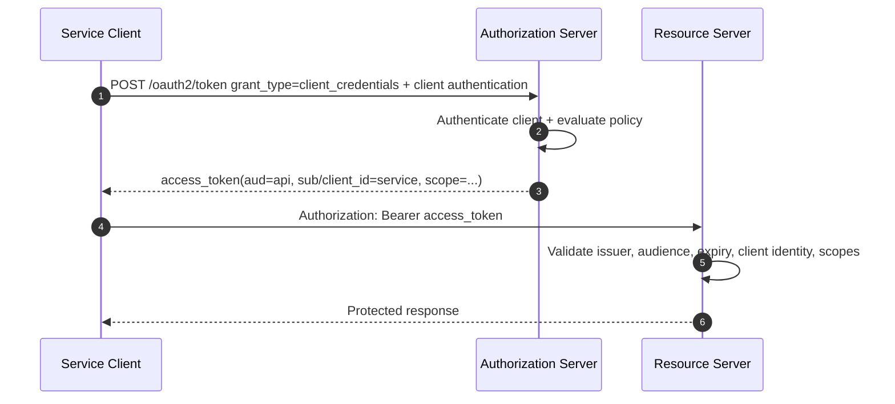
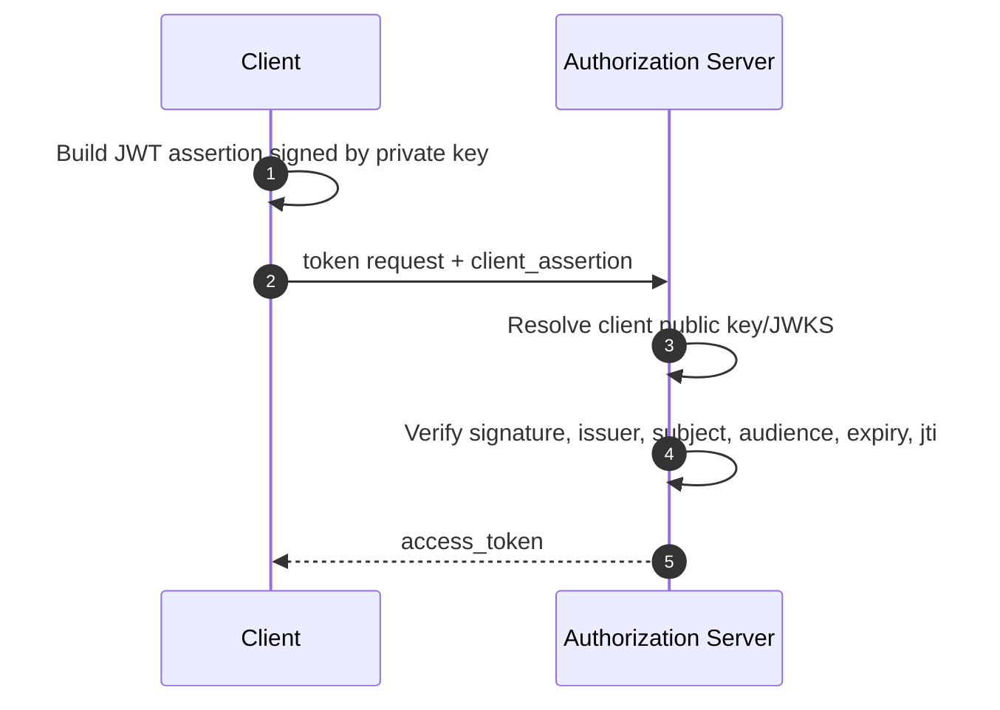
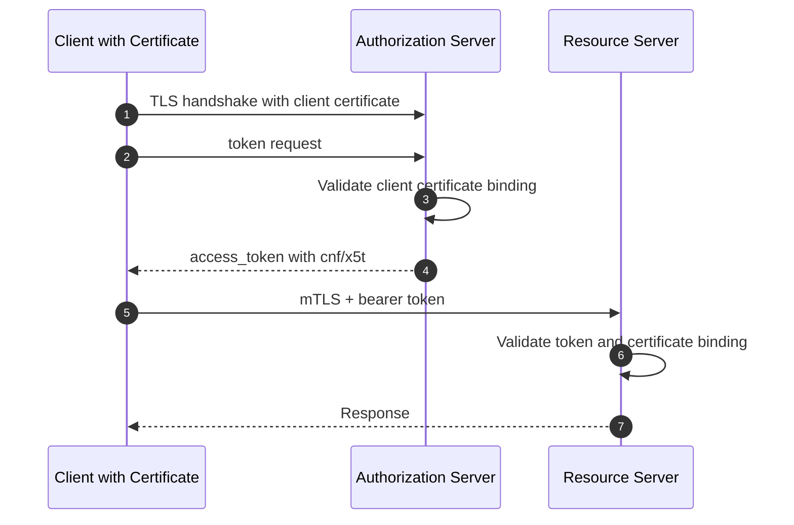
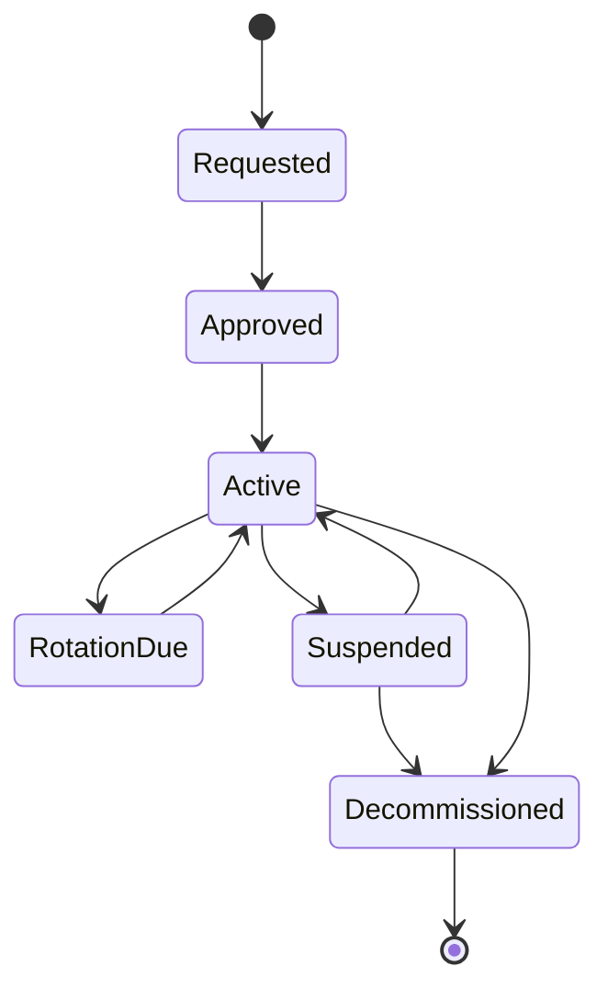
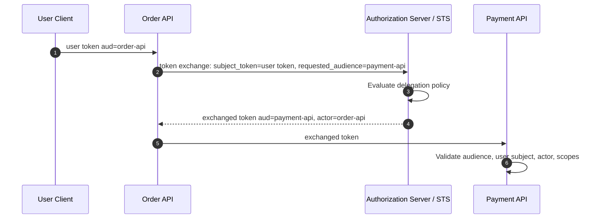
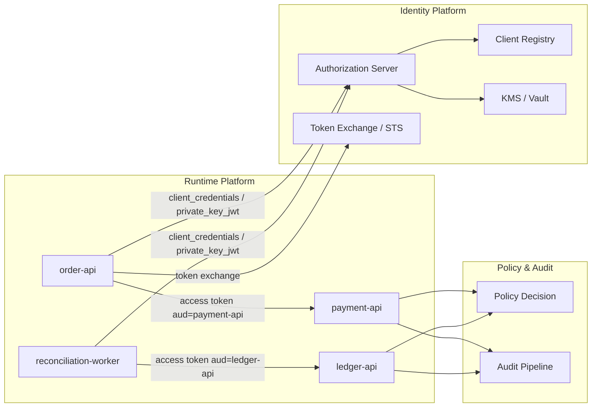

------
title: Learn Java Identity, Authentication & Authorization for Secure Enterprise API Platform - Part 021
description: Machine-to-machine identity, OAuth client credentials, service accounts, private_key_jwt, mTLS, token exchange, secretless patterns, and Java implementation guidance for enterprise service authorization.
series: learn-java-identity-authentication-authorization-api-platform
seriesTitle: Learn Java Identity, Authentication & Authorization for Secure Enterprise API Platform
order: 21
partTitle: Machine-to-Machine Identity and Service Authorization
tags:
- java
- identity
- authentication
- authorization
- oauth
- oidc
- api-security
- mtls
- service-identity
date: 2026-06-28
---

# Part 021 — Machine-to-Machine Identity and Service Authorization

Human identity answers: **who is the person?**

Machine-to-machine identity answers a different question: **which software workload, automation, integration, or platform component is calling, under whose authority, from which trust boundary, and for what allowed operation?**

That difference matters. Many enterprise incidents do not start with a human login bypass. They start with an overpowered service account, a leaked client secret, an internal API that trusts the network, a batch job using an admin token, or a downstream service that cannot distinguish `billing-export-worker` from `support-ui-backend`.

This part builds the model for non-human actors in a Java enterprise API platform.

You should finish this part able to design and review machine identity flows with these questions:

- Is the caller a **client application**, a **runtime workload**, a **scheduled job**, a **CI/CD agent**, a **third-party integration**, or a **platform component**?
- Is the authentication based on a static secret, asymmetric key, certificate, workload attestation, cloud identity, or token exchange?
- Is the access token bound to a specific client, audience, certificate, or key?
- Can the resource server enforce least privilege without trusting only the network or gateway?
- Can operations and auditors reconstruct which machine actor performed which action?

This is not a generic OAuth chapter. It is an engineering handbook for **service identity as a production security boundary**.

---

## 1. Kaufman Framing

Kaufman's method starts by deciding what performance looks like, then decomposing the skill.

For this topic, the target performance is not “knowing client credentials flow”. The target is:

> Given an enterprise platform with internal services, partner APIs, async workers, scheduled jobs, CI/CD automations, and tenant-specific integrations, you can design machine identity so every non-human caller is authenticated, least-privileged, auditable, rotatable, and revocable without relying on implicit network trust.

### Subskills

| Subskill | What You Need to Be Able to Do |
|---|---|
| Actor classification | Distinguish service, workload, job, integration, client app, daemon, and automation identity. |
| Credential selection | Choose secret, private key JWT, mTLS, certificate-bound token, workload identity, or token exchange. |
| Token design | Model issuer, subject, client id, audience, scopes, tenant, purpose, expiry, confirmation key, and actor chain. |
| Authorization | Convert machine identity into resource-specific permissions without using global service roles. |
| Secretless architecture | Reduce long-lived shared secrets using workload/platform-issued identity. |
| Operational lifecycle | Provision, rotate, revoke, decommission, observe, and audit machine credentials. |
| Failure modeling | Detect leaked secrets, confused deputy, over-broad scopes, stale service accounts, and environment spoofing. |

### Fast Learning Loop

Use a small but realistic lab:

```text
order-api  -> payment-api
order-api  -> customer-api
reconciliation-worker -> ledger-api
partner-adapter -> order-api
ci-deploy-agent -> deployment-api
```

For each caller, decide:

1. What is the machine actor?
2. How does it authenticate?
3. What token does it receive?
4. What can it do?
5. What can it never do?
6. How is it rotated or revoked?
7. What audit event proves the action?

---

## 2. Mental Model: Machine Identity Is Not “No User”

A common mistake is treating machine calls as if they have no subject.

They always have a subject. It is just not necessarily a person.

```text
Human call:
  subject = user/account/person
  client  = application acting for that user

Machine call:
  subject = client/service/workload/job/integration
  actor   = sometimes another upstream service or automation context
```

For machine-to-machine calls, the caller usually acts under one of these authority models:

| Model | Meaning | Example |
|---|---|---|
| Own authority | The service acts as itself. | `inventory-sync-worker` updates stock snapshots. |
| Delegated user authority | The service acts for a user. | `report-api` calls `case-api` for Alice's report request. |
| Delegated service authority | One service delegates a constrained operation to another. | `order-api` asks `payment-api` to create a payment authorization. |
| Platform authority | Infrastructure component acts as part of platform control plane. | `gateway` introspects tokens or pushes audit events. |
| Administrative automation | CI/CD or scheduler performs privileged but bounded operations. | `migration-runner` updates schema. |
| Partner authority | External organization or partner system calls your API. | Tax authority integration submits batch filings. |

The worst design collapses all of these into one `SYSTEM` user.

A better design preserves machine identity and authority separately:

```text
principal.subject       = service or client identity
principal.actor_chain   = optional upstream actor/delegation context
principal.tenant        = resolved tenant boundary
principal.audience      = intended API
principal.scopes        = coarse protocol privileges
principal.entitlements  = optional domain permissions
principal.assurance     = authentication strength / key binding / environment
```

---

## 3. Taxonomy of Non-Human Actors

Use explicit categories. Do not allow “service account” to mean everything.

### 3.1 Confidential OAuth Client

A confidential OAuth client can authenticate to the authorization server because it can protect credentials.

Examples:

- Java backend service.
- BFF server.
- Internal integration service.
- Batch worker running in controlled infrastructure.
- Partner backend with registered credentials.

Typical methods:

- `client_secret_basic`.
- `private_key_jwt`.
- `tls_client_auth`.
- `self_signed_tls_client_auth`.

### 3.2 Runtime Workload

A runtime workload is a specific deployed execution unit.

Examples:

- Kubernetes pod.
- VM process.
- ECS task.
- Nomad allocation.
- Serverless function.

It may have a workload identity independent from OAuth client registration.

Example identity:

```text
spiffe://prod.example.com/ns/payments/sa/payment-api
```

### 3.3 Service Account

A service account is an account-like representation for a non-human actor.

It can be useful, but dangerous when it behaves like a long-lived human account.

Good service account properties:

- Owned by a team.
- Bound to a purpose.
- Bound to environment.
- Has expiry or review cycle.
- Uses non-password authentication.
- Has least privilege.
- Produces distinguishable audit events.

Bad service account properties:

- Password login enabled.
- Shared by many systems.
- Has `ADMIN` role.
- No owner.
- No rotation plan.
- No last-used monitoring.
- Used in production and staging.

### 3.4 Scheduled Job

A scheduled job is often more privileged than interactive API calls because it touches many records.

Examples:

- Nightly reconciliation.
- Report generation.
- Data retention purge.
- Expiry processing.
- Regulatory submission batch.

Scheduled jobs need identity because they mutate state and generate audit-relevant events.

### 3.5 CI/CD Automation

CI/CD actors are high risk because they can deploy code, change infrastructure, and mint secrets.

Examples:

- GitHub Actions runner.
- Jenkins agent.
- Deployment orchestrator.
- Schema migration pipeline.
- Release automation bot.

They should not reuse runtime service credentials. Build-time authority and run-time authority are different.

### 3.6 Partner Integration

Partner identity represents an external organization or external system.

Design concerns:

- Organization-level identity.
- Environment separation.
- Credential lifecycle.
- Contractual scope.
- Rate limits.
- Tenant or data partition.
- Legal/audit traceability.

---

## 4. OAuth Client Credentials: The Basic Pattern

The OAuth client credentials grant is the default machine-to-machine OAuth flow.



Core invariant:

> In client credentials, the client itself is the subject of authorization. Do not treat it as a human user and do not infer a user identity from `client_id`.

### Token Example

A JWT access token for service-to-service access might look like this:

```json
{
  "iss": "https://auth.prod.example.com",
  "sub": "client:order-api",
  "client_id": "order-api",
  "aud": "payment-api",
  "scope": "payment.authorization.create payment.authorization.read",
  "tenant": "platform",
  "env": "prod",
  "iat": 1782640000,
  "exp": 1782640300,
  "jti": "7b1a...",
  "azp": "order-api"
}
```

Important points:

- `aud` must identify the intended API.
- `scope` should represent protocol-level permission, not every domain rule.
- `exp` should be short for machine tokens.
- `client_id` must not be accepted without issuer and audience validation.
- `sub` format should be explicit enough to avoid collisions with human subjects.

Bad subject:

```text
sub = "12345"
```

Better subject:

```text
sub = "client:payment-reconciliation-worker"
```

Even better when workload identity is available:

```text
sub = "spiffe://prod.example.com/ns/payments/sa/reconciliation-worker"
```

---

## 5. Client Authentication Methods

Machine identity strength depends heavily on how the client authenticates to the authorization server.

### 5.1 `client_secret_basic`

The client sends a client id and secret using HTTP Basic authentication.

```http
POST /oauth2/token HTTP/1.1
Host: auth.example.com
Authorization: Basic base64(client_id:client_secret)
Content-Type: application/x-www-form-urlencoded

grant_type=client_credentials&scope=ledger.read
```

Good for:

- Internal low-to-medium risk systems.
- Legacy integrations.
- Transitional implementations.

Weaknesses:

- Secret is bearer-like.
- Often copied into config files.
- Rotation causes outages if not engineered.
- Hard to prove which instance used it.
- Easy to accidentally reuse across environments.

Use only with strong secret management and rotation.

### 5.2 `client_secret_post`

The secret is sent in request body.

```http
client_id=order-api&client_secret=...&grant_type=client_credentials
```

Avoid unless required by legacy compatibility. Request bodies are easier to log accidentally than Authorization headers in many systems.

### 5.3 `private_key_jwt`

The client signs a JWT assertion with its private key.



Client assertion conceptual payload:

```json
{
  "iss": "order-api",
  "sub": "order-api",
  "aud": "https://auth.prod.example.com/oauth2/token",
  "jti": "random-one-time-id",
  "iat": 1782640000,
  "exp": 1782640300
}
```

Advantages:

- No shared secret.
- Private key never leaves client environment.
- Public key can be registered via JWKS.
- Supports cleaner rotation using key ids.
- Better fit for high-assurance machine clients.

Risks:

- Private key still needs secure storage.
- JWT assertion replay must be prevented by short expiry and `jti` handling for high-risk systems.
- Key registration and rotation must be operationally mature.

### 5.4 mTLS Client Authentication

In mutual TLS, the client proves possession of a private key corresponding to a client certificate.

Two common OAuth uses:

1. Client authentication to the authorization server.
2. Certificate-bound access token, where token replay without the same certificate fails.



Advantages:

- Strong possession proof.
- Token can be sender-constrained.
- Useful for partner and high-value APIs.

Risks:

- Certificate lifecycle complexity.
- Load balancer termination can hide client cert from application unless propagated safely.
- Bad certificate-to-client mapping can become an authorization bypass.
- Requires careful trust store and revocation design.

### 5.5 Workload Identity Federation

Instead of registering a long-lived secret, a platform-issued workload identity is exchanged for an OAuth token.

Examples:

- Kubernetes service account token exchanged for cloud or platform token.
- SPIFFE SVID used to authenticate a workload.
- Cloud workload identity federation from CI/CD to cloud IAM.
- Internal STS exchanges workload proof for an API token.

This is the direction most mature platforms move toward: **short-lived, automatically issued, environment-bound identity**.

---

## 6. Service Identity vs Network Identity

A service IP address is not a service identity.

A Kubernetes namespace is not a service identity.

An internal DNS name is not a service identity.

A gateway route is not a service identity.

These are network or deployment attributes. They may help verify context, but they are not enough.

Bad pattern:

```java
if (request.getRemoteAddr().startsWith("10.")) {
    allowInternalAdminOperation();
}
```

Better pattern:

```java
AuthorizationDecision decision = policy.authorize(new MachineRequest(
    principal.machineId(),
    principal.audience(),
    "ledger.adjustment.create",
    resource.tenantId(),
    requestContext.environment(),
    principal.authenticationStrength()
));
```

Core invariant:

> Network location may be signal. It must not be the authority.

---

## 7. Java/Spring Resource Server Pattern for Machine Tokens

A resource server must distinguish machine tokens from user tokens.

### 7.1 Principal Model

```java
public enum PrincipalKind {
    USER,
    MACHINE,
    WORKLOAD,
    PARTNER,
    AUTOMATION
}

public record MachinePrincipal(
        String subject,
        String clientId,
        String issuer,
        String audience,
        String tenant,
        String environment,
        Set<String> scopes,
        Set<String> authorities,
        Map<String, Object> claims
) {
    public boolean hasScope(String scope) {
        return scopes.contains(scope);
    }
}
```

Do not leak raw `Jwt` everywhere. Convert it at the boundary.

```java
@Component
public final class MachinePrincipalFactory {

    public MachinePrincipal fromJwt(Jwt jwt) {
        String subject = jwt.getSubject();
        String clientId = jwt.getClaimAsString("client_id");
        String issuer = jwt.getIssuer().toString();
        String audience = String.join(" ", jwt.getAudience());
        String tenant = jwt.getClaimAsString("tenant");
        String environment = jwt.getClaimAsString("env");

        Set<String> scopes = Optional.ofNullable(jwt.getClaimAsString("scope"))
                .stream()
                .flatMap(value -> Arrays.stream(value.split(" ")))
                .filter(Predicate.not(String::isBlank))
                .collect(Collectors.toUnmodifiableSet());

        return new MachinePrincipal(
                subject,
                clientId,
                issuer,
                audience,
                tenant,
                environment,
                scopes,
                Set.of(),
                jwt.getClaims()
        );
    }
}
```

### 7.2 Authority Mapping

Spring maps scopes to authorities like `SCOPE_x` by default in many OAuth resource server configurations. That is fine for coarse checks, but production authorization should not stop there.

```java
@Bean
SecurityFilterChain apiSecurity(HttpSecurity http) throws Exception {
    return http
            .securityMatcher("/api/**")
            .authorizeHttpRequests(auth -> auth
                    .requestMatchers(HttpMethod.POST, "/api/payments/authorizations")
                    .hasAuthority("SCOPE_payment.authorization.create")
                    .anyRequest().authenticated()
            )
            .oauth2ResourceServer(oauth2 -> oauth2.jwt(Customizer.withDefaults()))
            .build();
}
```

This is a good first gate.

But domain-specific checks should live in services or policy components:

```java
@Service
public class PaymentAuthorizationService {

    private final PaymentPolicy policy;
    private final PaymentAuthorizationRepository repository;

    public PaymentAuthorizationService(
            PaymentPolicy policy,
            PaymentAuthorizationRepository repository
    ) {
        this.policy = policy;
        this.repository = repository;
    }

    public PaymentAuthorization create(MachinePrincipal principal, CreatePaymentCommand command) {
        policy.requireCanCreateAuthorization(principal, command.merchantId(), command.amount());
        return repository.save(PaymentAuthorization.create(command));
    }
}
```

### 7.3 Explicit Machine Resolver

```java
@Component
public class CurrentMachineIdentity {

    private final MachinePrincipalFactory factory;

    public CurrentMachineIdentity(MachinePrincipalFactory factory) {
        this.factory = factory;
    }

    public MachinePrincipal requireMachine() {
        Authentication authentication = SecurityContextHolder.getContext().getAuthentication();

        if (!(authentication instanceof JwtAuthenticationToken token)) {
            throw new AccessDeniedException("Expected JWT machine authentication");
        }

        Jwt jwt = token.getToken();
        String clientId = jwt.getClaimAsString("client_id");

        if (clientId == null || clientId.isBlank()) {
            throw new AccessDeniedException("Missing machine client identity");
        }

        return factory.fromJwt(jwt);
    }
}
```

This prevents accidental use of human-user assumptions inside machine-only APIs.

---

## 8. Authorization Pattern for Service Calls

Do not authorize machine calls with generic role names like `SERVICE` or `SYSTEM`.

Bad:

```java
@PreAuthorize("hasRole('SERVICE')")
public LedgerAdjustment createAdjustment(...) { ... }
```

Better:

```java
@PreAuthorize("hasAuthority('SCOPE_ledger.adjustment.create')")
public LedgerAdjustment createAdjustment(...) { ... }
```

Better still:

```java
public LedgerAdjustment createAdjustment(MachinePrincipal principal, CreateAdjustmentCommand command) {
    ledgerPolicy.requireCanCreateAdjustment(
            principal,
            command.ledgerId(),
            command.reasonCode(),
            command.amount()
    );

    return ledgerRepository.save(LedgerAdjustment.create(command));
}
```

Policy example:

```java
@Component
public class LedgerPolicy {

    public void requireCanCreateAdjustment(
            MachinePrincipal principal,
            UUID ledgerId,
            String reasonCode,
            BigDecimal amount
    ) {
        requireScope(principal, "ledger.adjustment.create");
        requireAudience(principal, "ledger-api");
        requireEnvironment(principal, "prod");

        if (amount.abs().compareTo(new BigDecimal("100000.00")) > 0) {
            requireScope(principal, "ledger.adjustment.high_value");
        }

        if (!Set.of("reconciliation", "chargeback", "regulatory-correction").contains(reasonCode)) {
            throw new AccessDeniedException("Unsupported machine adjustment reason");
        }
    }

    private static void requireScope(MachinePrincipal principal, String scope) {
        if (!principal.scopes().contains(scope)) {
            throw new AccessDeniedException("Missing scope: " + scope);
        }
    }

    private static void requireAudience(MachinePrincipal principal, String expectedAudience) {
        if (!principal.audience().contains(expectedAudience)) {
            throw new AccessDeniedException("Invalid audience");
        }
    }

    private static void requireEnvironment(MachinePrincipal principal, String expectedEnvironment) {
        if (!expectedEnvironment.equals(principal.environment())) {
            throw new AccessDeniedException("Invalid environment");
        }
    }
}
```

Core idea:

> Scopes open the door. Domain policy decides whether this specific machine may perform this specific operation on this specific resource under this specific context.

---

## 9. Service Account Lifecycle

Machine identities need lifecycle management just like human identities.

### 9.1 Registration Metadata

Every machine identity should have metadata:

```yaml
clientId: payment-reconciliation-worker
kind: scheduled-job
ownerTeam: payments-platform
environment: prod
purpose: "Nightly reconciliation between payment processor and internal ledger"
allowedAudiences:
  - ledger-api
  - payment-api
allowedScopes:
  - ledger.entry.read
  - ledger.adjustment.create
credentialMethod: private_key_jwt
rotationPolicy: 90d
lastAccessReview: 2026-06-01
breakGlassAllowed: false
dataClassification: restricted
```

### 9.2 Lifecycle States



### 9.3 Provisioning Checklist

Before activating a machine identity:

- Owner team exists.
- Business purpose is documented.
- Environment is fixed.
- Allowed audiences are explicit.
- Allowed scopes are minimal.
- Credential method is approved for risk tier.
- Rotation path is tested.
- Revocation path is tested.
- Audit events identify the machine actor.
- Access review date is scheduled.
- No shared use across teams or environments.

### 9.4 Decommissioning Checklist

Before deleting service code or infrastructure:

- Revoke OAuth client or credentials.
- Remove public keys/JWKS entries no longer needed.
- Disable service account.
- Remove secrets from vault.
- Remove IAM bindings.
- Remove policy rules.
- Stop scheduled jobs.
- Remove partner allowlist or certificate mappings.
- Archive audit metadata.
- Confirm no token issuance in last expected window.

---

## 10. Secret Management Patterns

### 10.1 Bad Secret Storage

Avoid:

- Secrets in Git.
- Secrets in container image layers.
- Shared `.env` files.
- Long-lived secrets in CI variables with broad access.
- Secrets printed in logs.
- Same secret in dev, staging, and prod.
- Manual copy-paste rotation.

### 10.2 Better Secret Storage

Use:

- Vault/KMS/secret manager.
- Runtime injection with least privilege.
- Automatic rotation where possible.
- Separate secrets by environment.
- Short-lived credentials.
- Audit of secret read events.
- Break-glass procedure for emergency rotation.

### 10.3 Best Direction: Secretless or Short-Lived Proof

Preferred trajectory:

```text
static shared secret
  -> asymmetric private key JWT
  -> mTLS / sender-constrained token
  -> platform-issued workload identity
  -> short-lived exchanged token per audience
```

The goal is not to eliminate all secrets instantly. The goal is to remove secrets that are:

- Long-lived.
- Shared.
- Environment-agnostic.
- Hard to rotate.
- Overprivileged.
- Hard to attribute.

---

## 11. Token Exchange for Downstream Calls

A service often receives one token and needs to call another service. Passing the original token downstream may be wrong.

### 11.1 Bad Pattern: Token Forwarding Everywhere

```text
User -> frontend -> order-api -> payment-api -> ledger-api
                 same user access token forwarded everywhere
```

Risks:

- Downstream services receive broader audience than intended.
- Token leaks across trust boundaries.
- Services gain user authority without explicit delegation.
- Audit cannot distinguish frontend call from internal propagation.
- Consent and policy context are unclear.

### 11.2 Better Pattern: Token Exchange



Token exchange is useful when:

- Downstream audience differs.
- Delegation must be explicit.
- Actor chain matters.
- Scopes need narrowing.
- Service-to-service call should be auditable.

Example exchanged token claims:

```json
{
  "iss": "https://auth.prod.example.com",
  "sub": "user:9271",
  "aud": "payment-api",
  "scope": "payment.authorization.create",
  "act": {
    "sub": "client:order-api"
  },
  "tenant": "tenant-a",
  "exp": 1782640300
}
```

For pure machine delegation, the subject may remain the machine:

```json
{
  "sub": "client:reconciliation-worker",
  "aud": "ledger-api",
  "scope": "ledger.adjustment.create",
  "act": {
    "sub": "client:payment-platform"
  }
}
```

---

## 12. Confused Deputy in Machine Identity

The confused deputy problem appears when a privileged service is tricked into using its authority for someone else's goal.

Example:

```text
partner-adapter can call export-api.
export-api can call document-store.
partner-adapter asks export-api for document id X.
export-api uses its broad document-store permission without verifying partner entitlement.
```

The document store sees only `export-api`, which is allowed. The partner receives data it should not receive.

### Defense

- Preserve caller context or actor chain.
- Use token exchange with narrowed audience/scope.
- Check object-level authorization at the service owning the resource.
- Avoid “backend service can read everything” unless truly required.
- Include resource constraints in policy.
- Log both immediate caller and delegated actor.

Policy example:

```java
public void requireDocumentExportAllowed(
        MachinePrincipal exportApi,
        DelegatedContext delegated,
        UUID documentId
) {
    requireScope(exportApi, "document.export.perform");

    if (delegated.partnerId().isPresent()) {
        requirePartnerDocumentGrant(delegated.partnerId().get(), documentId);
    }

    if (delegated.userId().isPresent()) {
        requireUserDocumentAccess(delegated.userId().get(), documentId);
    }
}
```

Core invariant:

> A downstream service must not authorize only the immediate technical caller when the operation is actually being requested on behalf of another actor.

---

## 13. Partner Machine Identity

Partner access is machine identity with contractual and legal consequences.

### 13.1 Partner Registration

```yaml
partnerId: acme-tax-services
legalEntity: "ACME Tax Services Ltd"
environment: production
credentialMethod: tls_client_auth
certificatePolicy: external-ca-approved
allowedAudiences:
  - filings-api
allowedScopes:
  - filing.submit
  - filing.status.read
rateLimit:
  requestsPerMinute: 300
allowedTenants:
  - tenant-a
  - tenant-b
contact:
  security: security@acme.example
  operations: ops@acme.example
```

### 13.2 Partner Token Claims

```json
{
  "iss": "https://auth.prod.example.com",
  "sub": "partner:acme-tax-services",
  "client_id": "partner-acme-prod",
  "aud": "filings-api",
  "scope": "filing.submit filing.status.read",
  "partner_id": "acme-tax-services",
  "tenant_allowlist": ["tenant-a", "tenant-b"],
  "cnf": {
    "x5t#S256": "..."
  },
  "exp": 1782640300
}
```

### 13.3 Partner Controls

- Require dedicated client per partner and environment.
- Use mTLS or private key JWT for high-risk access.
- Use strict audience and scope.
- Do not allow partner-selected tenant without server-side allowlist.
- Rate limit by partner identity, not only IP.
- Monitor abnormal volume and object access pattern.
- Provide revocation path independent of deployment cycle.
- Test certificate/key rollover before expiry.

---

## 14. Machine Identity in Async and Messaging

Machine identity does not disappear in messaging systems.

When a service publishes an event, consumers need to know:

- Who produced it?
- Under what authority?
- Is the payload trusted?
- Is this command/event authorized?
- Can it be replayed?
- Is the tenant boundary preserved?

### 14.1 Command Message Metadata

```json
{
  "messageId": "01J...",
  "type": "LedgerAdjustmentRequested",
  "tenant": "tenant-a",
  "producer": "client:reconciliation-worker",
  "producerIssuer": "https://auth.prod.example.com",
  "authority": {
    "kind": "machine",
    "scopes": ["ledger.adjustment.create"],
    "audience": "ledger-command-consumer"
  },
  "createdAt": "2026-06-28T10:15:30Z",
  "payload": {
    "ledgerId": "...",
    "amount": "42.00",
    "reasonCode": "reconciliation"
  }
}
```

### 14.2 Do Not Trust Message Headers Blindly

If identity metadata is just plain text headers set by arbitrary producers, it is not authentication.

Options:

- Broker-level authentication and ACLs.
- Signed messages for cross-boundary exchange.
- Producer identity from broker connection context.
- Outbox with trusted producer service boundary.
- Token exchange before publishing high-risk commands.
- Consumer-side policy checks using producer identity and tenant.

---

## 15. Observability and Audit

Machine identity audit must answer:

- Which machine actor called?
- Which credential method was used?
- Which issuer issued the token?
- Which audience was targeted?
- Which operation was attempted?
- Which resource was touched?
- Which tenant was affected?
- Was access allowed or denied?
- Which policy rule made the decision?
- Was there delegated user/partner context?

Example audit record:

```json
{
  "eventType": "AUTHORIZATION_DECISION",
  "decision": "DENY",
  "principalKind": "MACHINE",
  "subject": "client:reconciliation-worker",
  "clientId": "reconciliation-worker",
  "issuer": "https://auth.prod.example.com",
  "audience": "ledger-api",
  "tenant": "tenant-a",
  "action": "ledger.adjustment.create",
  "resourceType": "Ledger",
  "resourceId": "ledger-123",
  "reason": "AMOUNT_REQUIRES_HIGH_VALUE_SCOPE",
  "policyVersion": "ledger-policy:v17",
  "correlationId": "0b5a...",
  "occurredAt": "2026-06-28T10:15:30Z"
}
```

Avoid logging:

- Access tokens.
- Client secrets.
- Private key material.
- Full certificates unless needed and redacted.
- Unnecessary personal data from delegated subjects.

---

## 16. Testing Strategy

### 16.1 Token Validation Tests

Test invalid:

- Wrong issuer.
- Wrong audience.
- Expired token.
- Future `nbf`.
- Missing `client_id`.
- Human token used for machine-only endpoint.
- Machine token used for user-only endpoint.
- Wrong environment claim.
- Missing or malformed tenant claim.
- Unsupported algorithm.
- Unknown `kid`.

### 16.2 Authorization Matrix

| Client | API | Action | Resource | Expected |
|---|---|---|---|---|
| `order-api` | `payment-api` | create authorization | own merchant | allow |
| `order-api` | `ledger-api` | create adjustment | any ledger | deny |
| `reconciliation-worker` | `ledger-api` | read entries | allowed ledger | allow |
| `reconciliation-worker` | `ledger-api` | high-value adjustment | high amount | deny unless high-value scope |
| `partner-acme` | `filings-api` | submit filing | tenant-a | allow |
| `partner-acme` | `filings-api` | submit filing | tenant-z | deny |
| `ci-deploy-agent` | `customer-api` | read customer data | any | deny |

### 16.3 Spring Mock JWT Example

```java
@Test
void rejectsMachineTokenWithWrongAudience() throws Exception {
    mockMvc.perform(post("/api/ledger/adjustments")
            .with(jwt().jwt(jwt -> jwt
                    .issuer("https://auth.prod.example.com")
                    .subject("client:reconciliation-worker")
                    .audience(List.of("payment-api"))
                    .claim("client_id", "reconciliation-worker")
                    .claim("scope", "ledger.adjustment.create")
                    .claim("env", "prod")
            )))
            .andExpect(status().isForbidden());
}
```

### 16.4 Rotation Test

A production-grade machine identity system has tests for key/secret rotation:

1. Old key active.
2. New key published.
3. Tokens signed with both keys accepted during overlap.
4. Old key stopped for new issuance.
5. Old tokens expire naturally.
6. Old key removed.
7. Token signed with removed key rejected.

---

## 17. Failure Modes and Anti-Patterns

### 17.1 One Global Service Account

```text
client_id = enterprise-backend
scope = *
```

This destroys attribution and least privilege.

### 17.2 Gateway-Only Machine Auth

Gateway validates token, but internal services trust headers without validating.

Risk:

- Bypassed gateway.
- Misconfigured route.
- Internal SSRF.
- Header spoofing.
- Lateral movement.

### 17.3 Long-Lived Partner Secrets

A partner secret lives for years, shared across environments and teams.

Risk:

- Leak detection is hard.
- Rotation is politically painful.
- Blast radius is huge.
- Offboarding is unreliable.

### 17.4 Treating Client Credentials as User Login

Bad:

```java
String userId = jwt.getSubject(); // but this is client:batch-worker
```

Result:

- Audit records become misleading.
- User-specific policy is bypassed.
- Downstream systems receive fake users.

### 17.5 Scopes as Complete Domain Authorization

Scopes are often too coarse for object-level policy.

```text
scope = invoice.read
```

This does not answer:

- Which tenant?
- Which invoice?
- Which partner relationship?
- Which data classification?
- Which processing purpose?

### 17.6 No Owner for Machine Identity

Every machine identity must have a human/team owner. Otherwise no one rotates, reviews, or decommissions it.

### 17.7 CI/CD Reusing Runtime Credentials

Build/deploy systems should not use the same identity as the deployed application.

Build can change infrastructure. Runtime should serve application traffic. Those are different authorities.

---

## 18. Operational Playbook

### 18.1 New Machine Client Review

Ask:

1. What is the actor?
2. Who owns it?
3. What environment does it run in?
4. What API audience does it need?
5. What exact operations does it perform?
6. Is the caller internal, partner, or platform automation?
7. Is there user or tenant delegation?
8. What credential method is required by risk tier?
9. How is credential rotation tested?
10. How is revocation performed during incident response?
11. What audit event proves its action?

### 18.2 Incident Response for Leaked Machine Credential

Immediate actions:

- Disable client or revoke credential.
- Rotate associated secret/key/certificate.
- Invalidate refresh tokens if used.
- Shorten or revoke active token window if supported.
- Search logs for token issuance and API calls by client id.
- Identify affected tenants/resources/actions.
- Check unusual audience/scope use.
- Re-enable with new credential only after root cause is fixed.

### 18.3 Access Review

Periodic review should include:

- Last used timestamp.
- Issued token volume.
- Used scopes vs granted scopes.
- Used audiences vs allowed audiences.
- Credential age.
- Owner confirmation.
- Open incidents.
- Upcoming certificate/key expiry.
- Unused clients for decommissioning.

---

## 19. Reference Architecture



This architecture separates:

- Client registration.
- Credential verification.
- Token issuance.
- Token exchange.
- Resource server validation.
- Domain authorization.
- Audit evidence.

---

## 20. Practice Drill

Design machine identity for this scenario:

```text
A regulated case-management platform has:
- case-api
- document-api
- notification-api
- nightly-retention-worker
- partner-regulator-gateway
- ci-deploy-runner

The regulator partner can submit evidence for approved tenants.
The retention worker can delete expired draft documents but never final evidence.
The case-api can request document metadata but not raw restricted documents unless a user-request context exists.
```

Produce:

1. Actor taxonomy.
2. OAuth clients/workload identities.
3. Credential method per actor.
4. Token claims per actor.
5. API audience per call.
6. Required scopes.
7. Domain authorization rules.
8. Audit event shape.
9. Failure-mode test matrix.
10. Rotation and revocation plan.

---

## 21. Summary

Machine identity is not a minor variant of user authentication. It is the foundation for secure service-to-service platforms.

Keep these invariants:

- Every non-human actor has explicit identity.
- `SYSTEM` is not an acceptable authorization model.
- Network location is not authority.
- Machine tokens must validate issuer, audience, expiry, and client/workload identity.
- Scopes are not enough for object-level domain authorization.
- Long-lived shared secrets are transitional, not ideal end-state.
- Partner and CI/CD identities are high-risk machine actors.
- Delegation must preserve actor chain.
- Machine access must be owned, reviewed, rotated, revoked, and audited.

The next part extends this into zero-trust workload identity: SPIFFE, SPIRE, SVIDs, mTLS, and how Java services should consume identity that is issued by the runtime platform rather than copied as static secrets.

---

## References

- RFC 6749 — The OAuth 2.0 Authorization Framework.
- RFC 7523 — JSON Web Token Profile for OAuth 2.0 Client Authentication and Authorization Grants.
- RFC 8693 — OAuth 2.0 Token Exchange.
- RFC 8705 — OAuth 2.0 Mutual-TLS Client Authentication and Certificate-Bound Access Tokens.
- RFC 9700 — Best Current Practice for OAuth 2.0 Security.
- Spring Security Reference — OAuth2 Client and Resource Server.
- Spring Authorization Server Reference — Client authentication methods.
- OWASP API Security Top 10 2023.
