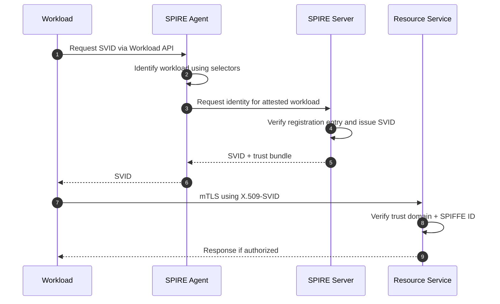
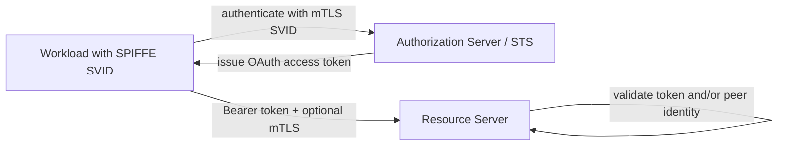
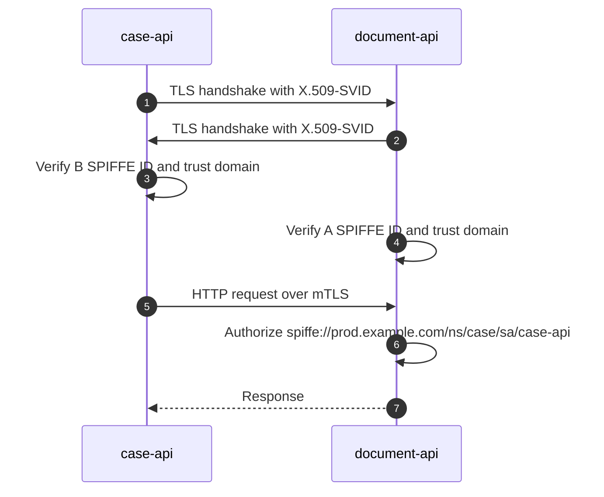
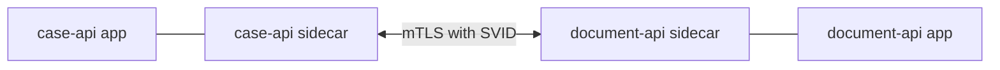
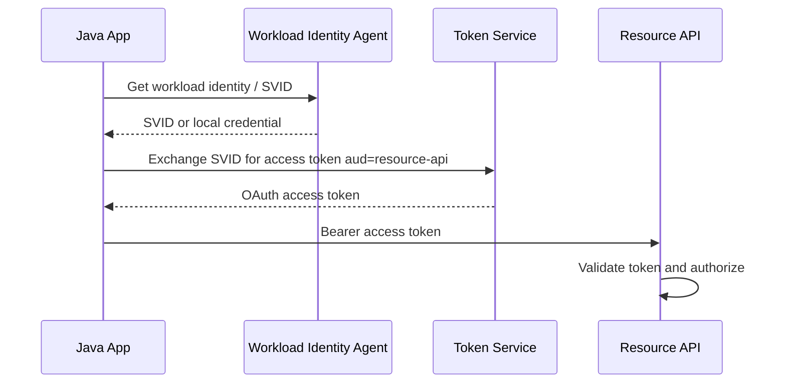
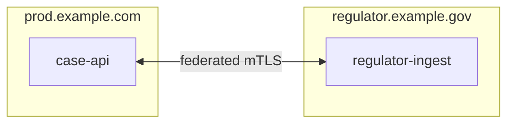
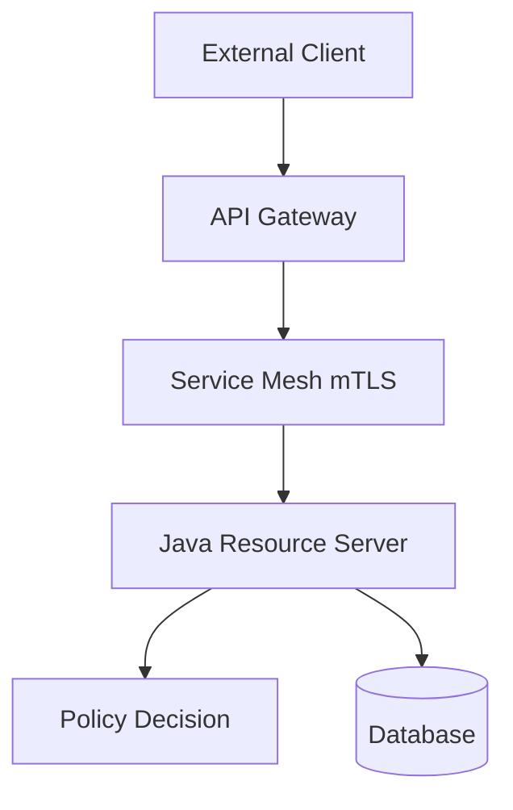
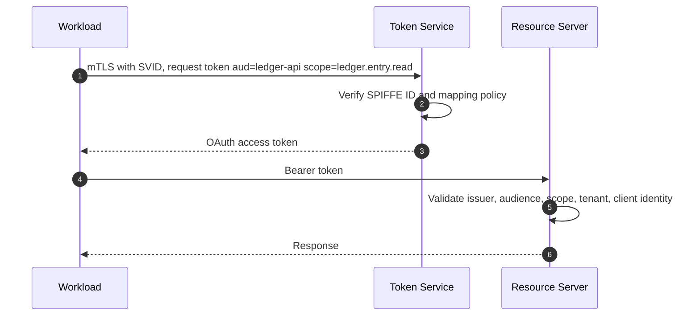
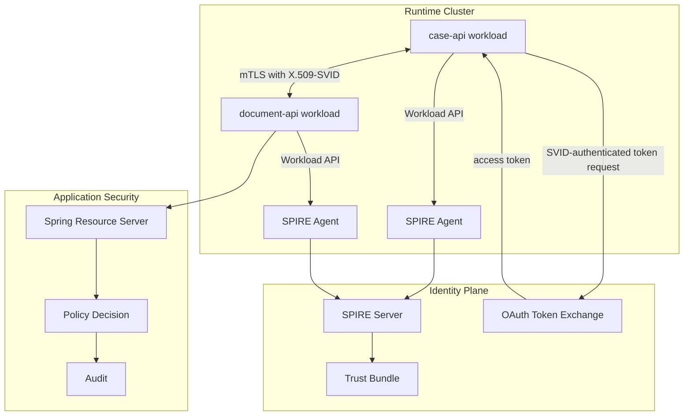

------
title: Learn Java Identity, Authentication & Authorization for Secure Enterprise API Platform - Part 022
description: Zero trust workload identity with SPIFFE, SPIRE, SVIDs, mTLS, trust domains, service mesh integration, Java verification, policy enforcement, and operational failure modes.
series: learn-java-identity-authentication-authorization-api-platform
seriesTitle: Learn Java Identity, Authentication & Authorization for Secure Enterprise API Platform
order: 22
partTitle: Zero Trust, SPIFFE/SPIRE, mTLS, and Workload Identity
tags:
- java
- identity
- authentication
- authorization
- api-security
- zero-trust
- spiffe
- spire
- mtls
- workload-identity
date: 2026-06-28
---

# Part 022 — Zero Trust, SPIFFE/SPIRE, mTLS, and Workload Identity

Part 021 covered machine identity using OAuth clients, service accounts, private key JWT, mTLS, token exchange, and lifecycle management.

This part moves one level deeper: **how does a running workload prove which workload it is without relying on copied secrets?**

In a mature enterprise platform, a service should not be trusted merely because it is inside a VPC, behind a gateway, in a Kubernetes namespace, or deployed by a known team. Internal networks are porous. Sidecars can be misconfigured. Service names can be spoofed. CI/CD systems can be compromised. Tokens can be stolen. Humans can accidentally copy secrets into the wrong environment.

Zero-trust workload identity starts from a stricter premise:

> Every workload must prove its identity cryptographically, continuously, and contextually. Network location is not enough.

SPIFFE and SPIRE are common building blocks for this model.

- **SPIFFE** is a standard identity framework for workloads.
- **SPIRE** is a production-grade implementation that attests nodes/workloads and issues workload identity documents.
- **SVID** is the verifiable identity document a workload uses to prove its identity.
- **SPIFFE ID** is the workload's identity URI.

The goal is not to add fashionable zero-trust vocabulary. The goal is to make Java services capable of enforcing service identity correctly in internal, partner, and platform-to-platform calls.

---

## 1. Kaufman Framing

Target performance:

> You can design a Java service-to-service platform where workloads receive short-lived runtime identity, communicate with mTLS or JWT-SVID, validate peer workload identity, map identities to authorization policy, and operate safely across trust domains, clusters, namespaces, and tenants.

### Subskills

| Subskill | What You Need to Be Able to Do |
|---|---|
| Zero-trust reasoning | Explain why network trust and static secrets are insufficient. |
| Workload identity modeling | Model identity at runtime workload granularity, not only application name. |
| SPIFFE ID design | Create stable, meaningful SPIFFE IDs without embedding unstable deployment details. |
| SVID handling | Understand X.509-SVID, JWT-SVID, lifetime, renewal, and validation. |
| Trust domain design | Define boundaries for environments, organizations, clusters, and platforms. |
| mTLS enforcement | Use peer certificate identity as authenticated workload identity. |
| Java integration | Consume identity via mesh, sidecar, reverse proxy, or application-level TLS. |
| Authorization mapping | Convert workload identity into policy decisions. |
| Operations | Rotate, observe, revoke, debug, and incident-handle workload identity. |

---

## 2. Why Zero Trust for Workloads?

Traditional internal service security often looked like this:

```text
If request comes from internal network -> trust it.
If request comes via gateway -> trust headers.
If service name is internal -> allow.
If pod is in namespace X -> assume team X.
```

This breaks under modern distributed systems:

- Services run across clusters and clouds.
- Internal SSRF can reach internal APIs.
- Compromised workloads can move laterally.
- Secrets are copied into pipelines and config stores.
- Sidecars/gateways may be bypassed by misconfiguration.
- Teams share infrastructure but require isolation.
- Regulatory systems need proof, not assumptions.

Zero-trust workload identity changes the question:

```text
Old question:
  Did this call come from inside?

Better question:
  Which workload cryptographically authenticated?
  Who issued that identity?
  What trust domain is it from?
  Is that workload allowed to perform this action on this resource now?
```

---

## 3. Core SPIFFE Concepts

### 3.1 SPIFFE ID

A SPIFFE ID is a URI representing workload identity.

Example:

```text
spiffe://prod.example.com/ns/payments/sa/payment-api
```

Structure:

```text
spiffe://<trust-domain>/<path>
```

Possible identity scheme:

```text
spiffe://prod.example.com/ns/<namespace>/sa/<service-account>
spiffe://prod.example.com/app/<application>/component/<component>
spiffe://prod.example.com/team/<team>/service/<service>
```

Design rules:

- Use stable logical identity, not pod id.
- Include environment or use separate trust domains per environment.
- Avoid embedding secrets or personal data.
- Avoid paths that change every deployment.
- Do not overload one ID for many unrelated workloads.
- Keep enough structure for policy matching.

Bad:

```text
spiffe://example.com/service
spiffe://example.com/prod/default/pod-7f4d9f6df7-abc12
```

Better:

```text
spiffe://prod.example.com/ns/case-management/sa/case-api
spiffe://prod.example.com/ns/case-management/sa/document-api
spiffe://prod.example.com/ns/platform/sa/audit-writer
```

### 3.2 Trust Domain

A trust domain defines the root of trust for a set of identities.

Examples:

```text
prod.example.com
staging.example.com
partner-a.example.net
regulator.example.gov
```

Trust domain design matters because policy often starts with:

```text
Do I trust identities issued under this domain?
```

Possible strategies:

| Strategy | Example | Good For | Risk |
|---|---|---|---|
| Environment domain | `prod.example.com`, `staging.example.com` | Strong environment separation | More federation configuration |
| Organization domain | `example.com` | Simpler identity space | Risk of prod/staging confusion |
| Platform domain | `k8s-prod.example.com` | Infrastructure-aligned policy | Can leak implementation detail |
| Partner domain | `partner-a.example.net` | Cross-org federation | Requires explicit trust bundle management |

### 3.3 SVID

An SVID is a SPIFFE Verifiable Identity Document.

Common forms:

| SVID Type | What It Is | Common Use |
|---|---|---|
| X.509-SVID | Short-lived X.509 certificate containing SPIFFE ID | mTLS service-to-service authentication |
| JWT-SVID | Signed JWT containing SPIFFE ID | Token-style identity assertion, sometimes easier across HTTP/proxy boundaries |

X.509-SVID is commonly used for mTLS.

JWT-SVID is useful when TLS termination or non-TLS protocols make certificate presentation inconvenient, but it must be validated carefully.

### 3.4 SPIRE

SPIRE issues SVIDs after attesting nodes and workloads.

Conceptual flow:



Key idea:

> The workload does not carry a long-lived static secret. It receives short-lived identity from the runtime identity plane after attestation.

---

## 4. Workload Identity vs OAuth Client Identity

These are related but not identical.

| Concept | Workload Identity | OAuth Client Identity |
|---|---|---|
| Represents | Running software workload | OAuth client registration |
| Example | `spiffe://prod.example.com/ns/payments/sa/payment-api` | `payment-api-client` |
| Issuer | SPIRE/SPIFFE identity plane | Authorization Server |
| Credential | SVID certificate/JWT | Client secret, private key JWT, mTLS, etc. |
| Main use | Authenticate workload to peer/runtime | Obtain OAuth access token |
| Lifetime | Usually short-lived and auto-rotated | Depends on credential/token policy |
| Granularity | Runtime identity | Protocol client identity |

They can be combined:



Pattern:

1. Workload authenticates to token service using SVID.
2. Token service maps SPIFFE ID to OAuth client/policy.
3. Token service issues short-lived audience-specific access token.
4. Resource server validates token.
5. Optionally, resource server also verifies mTLS peer identity.

This is stronger than copying OAuth client secrets into every workload.

---

## 5. mTLS with Workload Identity

mTLS provides two-way TLS authentication:

- Server proves identity to client.
- Client proves identity to server.

With SPIFFE, the certificate contains the workload identity.



### Authentication vs Authorization

mTLS answers:

```text
The peer presented a valid certificate issued by a trusted authority and bound to this SPIFFE ID.
```

It does not answer:

```text
Is this peer allowed to read this document?
```

You still need authorization policy.

---

## 6. Java Integration Patterns

There are multiple ways Java services consume workload identity.

### 6.1 Service Mesh Terminates mTLS

The mesh sidecar handles mTLS. Application receives trusted headers or local metadata.



Advantages:

- Application code stays simpler.
- Standardized TLS and certificate rotation.
- Consistent service-to-service security.

Risks:

- Application may trust spoofable headers.
- Sidecar bypass can break assumptions.
- Policy may be split between mesh and app.
- Debugging identity propagation can be hard.

If using headers, require a hardened boundary:

- Only accept identity headers from localhost/sidecar.
- Strip inbound identity headers at edge.
- Reject requests not coming through trusted proxy path.
- Prefer signed identity metadata when crossing boundaries.
- Test direct-to-app bypass.

### 6.2 Application-Level mTLS

The Java app terminates TLS and reads peer certificate.

Advantages:

- App sees cryptographic identity directly.
- Less trust in proxy headers.
- Clearer authorization integration.

Risks:

- More TLS complexity in application runtime.
- Certificate reload/rotation must be handled.
- Operational config can become inconsistent.

### 6.3 Sidecar Token Exchange

The workload uses local identity to obtain an OAuth access token from an STS.



This integrates well with existing Spring OAuth2 Resource Server architecture.

---

## 7. Reading Peer Certificates in Java

When the Java application terminates TLS, the servlet request may expose peer certificates.

Example concept:

```java
public final class PeerCertificateExtractor {

    private static final String CERT_ATTRIBUTE = "jakarta.servlet.request.X509Certificate";

    public Optional<X509Certificate> extract(HttpServletRequest request) {
        Object value = request.getAttribute(CERT_ATTRIBUTE);
        if (!(value instanceof X509Certificate[] certificates) || certificates.length == 0) {
            return Optional.empty();
        }
        return Optional.of(certificates[0]);
    }
}
```

Extract SPIFFE ID from URI Subject Alternative Name:

```java
public final class SpiffeIdExtractor {

    private static final int URI_SAN_TYPE = 6;

    public Optional<URI> extractSpiffeId(X509Certificate certificate) {
        try {
            Collection<List<?>> altNames = certificate.getSubjectAlternativeNames();
            if (altNames == null) {
                return Optional.empty();
            }

            return altNames.stream()
                    .filter(entry -> entry.size() >= 2)
                    .filter(entry -> Integer.valueOf(URI_SAN_TYPE).equals(entry.get(0)))
                    .map(entry -> String.valueOf(entry.get(1)))
                    .filter(value -> value.startsWith("spiffe://"))
                    .map(URI::create)
                    .findFirst();
        } catch (CertificateParsingException ex) {
            return Optional.empty();
        }
    }
}
```

Convert to principal:

```java
public record WorkloadPrincipal(
        URI spiffeId,
        String trustDomain,
        String namespace,
        String serviceAccount,
        String rawPath
) {}
```

```java
public final class WorkloadPrincipalFactory {

    public WorkloadPrincipal from(URI spiffeId) {
        if (!"spiffe".equalsIgnoreCase(spiffeId.getScheme())) {
            throw new AccessDeniedException("Not a SPIFFE URI");
        }

        String trustDomain = spiffeId.getHost();
        String path = spiffeId.getPath();
        Map<String, String> parts = parsePath(path);

        return new WorkloadPrincipal(
                spiffeId,
                trustDomain,
                parts.get("ns"),
                parts.get("sa"),
                path
        );
    }

    private Map<String, String> parsePath(String path) {
        String[] tokens = path.split("/");
        Map<String, String> result = new HashMap<>();
        for (int i = 1; i + 1 < tokens.length; i += 2) {
            result.put(tokens[i], tokens[i + 1]);
        }
        return Map.copyOf(result);
    }
}
```

Important: parsing is not verification. Certificate chain and trust bundle validation must happen in TLS configuration or explicit certificate validation layer.

---

## 8. Spring Security Authentication Filter for Workload Identity

A simplified custom filter can convert verified peer certificate identity into an `Authentication`.

```java
public final class WorkloadIdentityAuthenticationToken extends AbstractAuthenticationToken {

    private final WorkloadPrincipal principal;

    public WorkloadIdentityAuthenticationToken(
            WorkloadPrincipal principal,
            Collection<? extends GrantedAuthority> authorities
    ) {
        super(authorities);
        this.principal = principal;
        setAuthenticated(true);
    }

    @Override
    public Object getCredentials() {
        return "X509-SVID";
    }

    @Override
    public WorkloadPrincipal getPrincipal() {
        return principal;
    }
}
```

```java
public final class WorkloadIdentityFilter extends OncePerRequestFilter {

    private final PeerCertificateExtractor certificateExtractor;
    private final SpiffeIdExtractor spiffeIdExtractor;
    private final WorkloadPrincipalFactory principalFactory;
    private final WorkloadAuthorityMapper authorityMapper;

    public WorkloadIdentityFilter(
            PeerCertificateExtractor certificateExtractor,
            SpiffeIdExtractor spiffeIdExtractor,
            WorkloadPrincipalFactory principalFactory,
            WorkloadAuthorityMapper authorityMapper
    ) {
        this.certificateExtractor = certificateExtractor;
        this.spiffeIdExtractor = spiffeIdExtractor;
        this.principalFactory = principalFactory;
        this.authorityMapper = authorityMapper;
    }

    @Override
    protected void doFilterInternal(
            HttpServletRequest request,
            HttpServletResponse response,
            FilterChain filterChain
    ) throws ServletException, IOException {

        Optional<X509Certificate> certificate = certificateExtractor.extract(request);
        if (certificate.isEmpty()) {
            filterChain.doFilter(request, response);
            return;
        }

        Optional<URI> spiffeId = spiffeIdExtractor.extractSpiffeId(certificate.get());
        if (spiffeId.isEmpty()) {
            throw new BadCredentialsException("Missing SPIFFE ID");
        }

        WorkloadPrincipal principal = principalFactory.from(spiffeId.get());
        List<GrantedAuthority> authorities = authorityMapper.map(principal);

        Authentication authentication = new WorkloadIdentityAuthenticationToken(principal, authorities);
        SecurityContextHolder.getContext().setAuthentication(authentication);

        filterChain.doFilter(request, response);
    }
}
```

Security configuration concept:

```java
@Bean
SecurityFilterChain workloadApiSecurity(HttpSecurity http, WorkloadIdentityFilter filter) throws Exception {
    return http
            .securityMatcher("/internal/**")
            .addFilterBefore(filter, AnonymousAuthenticationFilter.class)
            .authorizeHttpRequests(auth -> auth
                    .requestMatchers(HttpMethod.POST, "/internal/documents/*/metadata")
                    .hasAuthority("WORKLOAD_document-metadata.write")
                    .anyRequest().authenticated()
            )
            .build();
}
```

This is illustrative. In many systems, the mesh already terminates and verifies mTLS. Then the app should consume identity from a hardened trusted boundary rather than raw certs.

---

## 9. Workload Authorization Policy

Workload authentication gives you identity. Policy decides access.

### 9.1 Policy Shape

```java
public record WorkloadRequest(
        URI spiffeId,
        String trustDomain,
        String namespace,
        String serviceAccount,
        String action,
        String resourceType,
        String resourceTenant,
        Map<String, Object> context
) {}
```

```java
@Component
public class WorkloadPolicy {

    public void requireCanWriteDocumentMetadata(
            WorkloadPrincipal principal,
            DocumentMetadataTarget target
    ) {
        requireTrustDomain(principal, "prod.example.com");
        requireServiceAccount(principal, "case-management", "case-api");

        if (!target.tenantId().equals(target.caseTenantId())) {
            throw new AccessDeniedException("Document tenant mismatch");
        }
    }

    private void requireTrustDomain(WorkloadPrincipal principal, String expected) {
        if (!expected.equals(principal.trustDomain())) {
            throw new AccessDeniedException("Untrusted workload trust domain");
        }
    }

    private void requireServiceAccount(WorkloadPrincipal principal, String namespace, String serviceAccount) {
        if (!namespace.equals(principal.namespace()) || !serviceAccount.equals(principal.serviceAccount())) {
            throw new AccessDeniedException("Workload is not allowed for this operation");
        }
    }
}
```

### 9.2 Policy Table

| Workload SPIFFE ID | Action | Resource | Expected |
|---|---|---|---|
| `spiffe://prod.example.com/ns/case/sa/case-api` | `document.metadata.read` | same tenant | allow |
| `spiffe://prod.example.com/ns/case/sa/case-api` | `document.raw.read` | restricted document | deny unless delegated user context exists |
| `spiffe://prod.example.com/ns/retention/sa/retention-worker` | `document.delete` | expired draft | allow |
| `spiffe://prod.example.com/ns/retention/sa/retention-worker` | `document.delete` | final evidence | deny |
| `spiffe://staging.example.com/ns/case/sa/case-api` | any prod action | prod resource | deny |
| `spiffe://prod.example.com/ns/support/sa/support-tool` | `case.impersonate` | regulated case | deny unless break-glass policy active |

---

## 10. Combining User and Workload Identity

Many requests have both:

- User identity: Alice initiated the operation.
- Workload identity: `case-api` is calling `document-api`.

Do not overwrite one with the other.

```text
subject = user:alice
actor   = workload:spiffe://prod.example.com/ns/case/sa/case-api
aud     = document-api
```

### 10.1 Dual Identity Context

```java
public record RequestAuthorityContext(
        Optional<UserPrincipal> user,
        Optional<WorkloadPrincipal> workload,
        Optional<MachinePrincipal> oauthClient,
        String tenant,
        String correlationId
) {
    public boolean hasUserAndWorkload() {
        return user.isPresent() && workload.isPresent();
    }
}
```

Use cases:

| Scenario | User? | Workload? | Authorization Needs |
|---|---:|---:|---|
| Browser request to BFF | yes | BFF workload | User session + BFF service boundary |
| Service-to-service user delegation | yes | upstream service | User access + service allowed to delegate |
| Scheduled retention job | no | retention worker | Workload-only policy |
| Partner mTLS call | maybe no | partner client/workload | Partner contract + tenant allowlist |
| CI deployment | no | CI runner | Platform admin automation policy |

### 10.2 Do Not Convert Workload Into User

Bad:

```java
UserPrincipal user = new UserPrincipal(workload.spiffeId().toString());
```

This creates fake users and corrupts audit semantics.

Better:

```java
RequestAuthorityContext context = new RequestAuthorityContext(
        Optional.empty(),
        Optional.of(workload),
        Optional.empty(),
        tenant,
        correlationId
);
```

---

## 11. Trust Domains and Federation

A regulated enterprise may have multiple trust domains:

```text
prod.example.com
staging.example.com
gov-partner.example.gov
analytics.example.com
```

A service should not trust all domains automatically.

### 11.1 Trust Bundle

A trust bundle contains public trust anchors for a trust domain.

Policy should specify:

- Which trust domains are accepted.
- Which SPIFFE ID paths are accepted.
- Which actions each domain can perform.
- Whether federation is one-way or mutual.
- How bundles are rotated.
- How trust is removed during incident response.

### 11.2 Cross-Domain Example



Policy:

```yaml
trustedDomains:
  regulator.example.gov:
    allowedIds:
      - spiffe://regulator.example.gov/ns/external/sa/regulator-ingest
    allowedActions:
      - evidence.submission.create
    tenantAllowlist:
      - tenant-a
      - tenant-b
```

Do not accept a foreign trust domain because it has a valid SPIFFE-shaped URI. Trust is a configured relationship.

---

## 12. Workload Identity and API Gateway/Service Mesh Boundaries

A gateway can authenticate external clients. A service mesh can authenticate internal workloads. A Java service still owns domain authorization.



Boundary responsibilities:

| Layer | Good Responsibility | Should Not Be Sole Owner Of |
|---|---|---|
| Gateway | External auth, rate limit, coarse route policy | Object-level domain authorization |
| Mesh | Workload mTLS, service identity, traffic policy | Business authorization |
| Java service | Token validation, principal model, domain policy | Certificate issuance lifecycle |
| PDP | Central policy decision support | All local invariant checks |
| Database | Optional row-level constraints | Full actor/delegation semantics |

The recurring invariant:

> Infrastructure can authenticate and constrain traffic. The resource-owning service must still enforce resource authorization.

---

## 13. JWT-SVID Pattern

JWT-SVID can be useful when a workload needs a signed identity assertion rather than mTLS.

Conceptual claims:

```json
{
  "iss": "https://spire-server.prod.example.com",
  "sub": "spiffe://prod.example.com/ns/case/sa/case-api",
  "aud": ["document-api"],
  "iat": 1782640000,
  "exp": 1782640300
}
```

Validation requirements:

- Verify issuer/trust bundle.
- Verify signature.
- Verify audience.
- Verify expiry.
- Verify SPIFFE ID structure.
- Verify trust domain is allowed.
- Map SPIFFE ID to policy.

Do not treat JWT-SVID as an OAuth access token unless your platform explicitly defines that profile and resource servers validate it accordingly.

---

## 14. Mapping Workload Identity to OAuth Tokens

A common enterprise design uses workload identity as client authentication to obtain OAuth tokens.

### 14.1 Mapping Table

| SPIFFE ID | OAuth Client | Allowed Audiences | Allowed Scopes |
|---|---|---|---|
| `spiffe://prod.example.com/ns/order/sa/order-api` | `order-api` | `payment-api`, `customer-api` | `payment.authorization.create`, `customer.profile.read` |
| `spiffe://prod.example.com/ns/payment/sa/reconciliation-worker` | `reconciliation-worker` | `ledger-api` | `ledger.entry.read`, `ledger.adjustment.create` |
| `spiffe://prod.example.com/ns/platform/sa/audit-writer` | `audit-writer` | `audit-api` | `audit.event.write` |

### 14.2 Flow



Benefits:

- Resource servers keep OAuth resource server model.
- Workloads avoid static OAuth client secrets.
- Token service can centralize mapping and policy.
- Tokens can be audience-specific and short-lived.

Risks:

- Token service becomes critical infrastructure.
- Bad mapping table can overgrant access.
- Workload identity and OAuth identity drift can occur.
- Resource servers may ignore workload-origin claims.

---

## 15. Runtime Identity and Tenant Isolation

Workload identity is not a replacement for tenant authorization.

A workload may be allowed to operate in tenant A but not tenant B.

Examples:

```text
spiffe://prod.example.com/ns/tenant-a/sa/tenant-worker
spiffe://prod.example.com/ns/shared/sa/report-api
```

Two models:

### 15.1 Tenant-Scoped Workload Identity

Each tenant has distinct workload identity.

Pros:

- Strong isolation.
- Simple policy matching.
- Clear audit.

Cons:

- More identities.
- More operational complexity.
- Harder for shared services.

### 15.2 Shared Workload with Tenant Policy

One workload can serve multiple tenants but policy constrains resources.

Pros:

- Operationally simpler.
- Fits shared SaaS architecture.

Cons:

- Requires rigorous tenant predicate enforcement.
- Higher risk of tenant escape if policy is wrong.

Rule:

> A SPIFFE ID can authenticate the workload. It does not prove tenant authorization unless tenant boundary is encoded and enforced by policy.

---

## 16. Certificate and Identity Rotation

SVIDs are usually short-lived and rotated automatically.

This is good, but it changes operational assumptions.

### 16.1 Application Requirements

Java applications must handle:

- Certificate renewal without restart, or infrastructure-level rotation.
- Trust bundle update.
- Clock skew.
- Peer certificate changes.
- Graceful connection draining.
- TLS session reuse implications.
- Observability for identity and certificate expiry.

### 16.2 Failure Modes

| Failure | Symptom | Root Cause |
|---|---|---|
| Expired SVID | mTLS handshake failure | Agent/server unavailable or workload failed to renew |
| Unknown trust domain | 403/handshake failure | Missing trust bundle/federation config |
| Wrong SPIFFE ID | Policy deny | Bad registration entry or wrong service account |
| Staging identity in prod | Deny if policy correct | Environment trust domain confusion |
| Proxy strips cert identity | Missing principal | TLS terminated before app without safe propagation |
| Clock skew | Token/cert not valid yet or expired | Bad node time sync |

---

## 17. Observability

For every workload-authenticated request, capture safe identity metadata:

```json
{
  "eventType": "WORKLOAD_AUTHENTICATED",
  "spiffeId": "spiffe://prod.example.com/ns/case/sa/case-api",
  "trustDomain": "prod.example.com",
  "peerService": "case-api",
  "targetService": "document-api",
  "authenticationMethod": "mtls-x509-svid",
  "authorizationDecision": "ALLOW",
  "action": "document.metadata.read",
  "tenant": "tenant-a",
  "correlationId": "01J...",
  "occurredAt": "2026-06-28T10:15:30Z"
}
```

Metrics:

- mTLS handshake failures by peer identity.
- Authorization denies by SPIFFE ID/action.
- Unknown trust domain attempts.
- Expiring trust bundles/certificates.
- Token exchange failures by SPIFFE ID.
- Direct-to-app requests without workload identity.
- Cross-tenant deny events.

Logs should avoid dumping certificates or tokens. Log identifiers and fingerprints only when needed.

---

## 18. Testing Strategy

### 18.1 Unit Tests

Test SPIFFE ID parsing:

- Valid SPIFFE URI.
- Wrong scheme.
- Missing trust domain.
- Unexpected path format.
- Staging trust domain in prod.
- Case-sensitive path behavior.
- Unknown namespace/service account.

### 18.2 Integration Tests

Test:

- Valid mTLS peer accepted.
- Missing client cert rejected.
- Cert without SPIFFE URI SAN rejected.
- Cert from untrusted trust domain rejected.
- Valid workload but wrong action denied.
- Valid workload but wrong tenant denied.
- Expired certificate rejected.
- Direct-to-app path without sidecar identity rejected.

### 18.3 Authorization Matrix

| SPIFFE ID | Action | Tenant | Resource State | Expected |
|---|---|---|---|---|
| `spiffe://prod.example.com/ns/case/sa/case-api` | metadata read | tenant-a | active document | allow |
| `spiffe://prod.example.com/ns/case/sa/case-api` | raw evidence read | tenant-a | restricted evidence | deny without user context |
| `spiffe://prod.example.com/ns/retention/sa/retention-worker` | delete document | tenant-a | expired draft | allow |
| `spiffe://prod.example.com/ns/retention/sa/retention-worker` | delete document | tenant-a | final evidence | deny |
| `spiffe://staging.example.com/ns/case/sa/case-api` | metadata read | tenant-a | active document | deny |
| `spiffe://prod.example.com/ns/unknown/sa/tool` | any | tenant-a | any | deny |

### 18.4 Chaos Tests

For platform maturity, test identity-plane failure:

- SPIRE agent unavailable.
- SPIRE server unavailable.
- Trust bundle update delayed.
- Certificate renewal failure.
- Clock skew on node.
- Revoked registration entry.
- Partial mesh outage.
- Token exchange service outage.

Decide fail-open vs fail-closed explicitly. For identity and authorization, default should be fail-closed, with carefully designed degraded modes for non-sensitive operations only.

---

## 19. Anti-Patterns

### 19.1 SPIFFE ID as a Role

Bad:

```text
if spiffeId starts with /ns/platform -> admin
```

Identity is not role. Map identity to policy deliberately.

### 19.2 Trusting Any SPIFFE-Looking URI

Bad:

```java
if (uri.startsWith("spiffe://")) allow();
```

A SPIFFE URI is meaningful only if cryptographically verified against a trusted bundle.

### 19.3 Mesh Policy Replaces App Authorization

Mesh can say service A may call service B. It cannot decide whether A may read document X for tenant Y under case status Z.

### 19.4 One Workload ID for a Whole Namespace

If every service in a namespace shares one identity, you lose service-level authorization and incident attribution.

### 19.5 Embedding Deployment Instance IDs in SPIFFE ID

Do not make identities too volatile:

```text
spiffe://prod.example.com/pod/case-api-7f4d9f6df7-abc12
```

This breaks policy stability.

### 19.6 Ignoring User Delegation

A workload identity alone does not prove user authorization. For user-triggered downstream calls, preserve user/delegation context.

### 19.7 Accepting Header Identity Without Boundary Control

If an app trusts `X-SPIFFE-ID` from any inbound request, attackers can spoof workload identity.

---

## 20. Reference Architecture



This architecture separates:

- Runtime attestation.
- SVID issuance.
- Workload mTLS.
- OAuth token exchange.
- Spring resource server validation.
- Domain policy.
- Audit evidence.

---

## 21. Design Review Checklist

Use this checklist when reviewing workload identity design.

### Identity Design

- Are workload identities distinct enough for least privilege?
- Are trust domains separated by environment or risk boundary?
- Are SPIFFE ID paths stable and meaningful?
- Are staging/dev identities denied in prod?
- Is there an owner for every workload identity?

### Authentication

- Does the workload receive short-lived identity dynamically?
- Is mTLS or signed SVID validation actually enforced?
- Are trust bundles managed and rotated?
- Can direct-to-app bypass skip identity checks?
- Are certificate expiry and renewal observable?

### Authorization

- Is workload identity mapped to explicit policy?
- Are tenant and resource checks still enforced in app/domain layer?
- Is user/delegation context preserved when needed?
- Are mesh policies and app policies consistent?
- Are deny decisions audited?

### Operations

- Can a workload identity be revoked quickly?
- Are unused identities discovered?
- Are trust-domain federation relationships reviewed?
- Are registration entries code-reviewed or change-controlled?
- Are incident runbooks tested?

---

## 22. Practice Drill

Design workload identity for this platform:

```text
Services:
- case-api
- document-api
- evidence-ingest-api
- retention-worker
- audit-writer
- regulator-partner-gateway

Requirements:
- case-api can read document metadata.
- case-api cannot read raw restricted evidence unless user delegation exists.
- retention-worker can delete expired draft documents only.
- audit-writer can only append audit events.
- regulator-partner-gateway is in a federated trust domain.
- staging workloads must never call prod APIs.
```

Produce:

1. Trust domain design.
2. SPIFFE ID naming scheme.
3. SVID type per communication path.
4. mTLS boundary design.
5. Token exchange design if OAuth access tokens are still needed.
6. Workload-to-action policy table.
7. User + workload dual identity model.
8. Audit event schema.
9. Failure-mode tests.
10. Incident revocation runbook.

---

## 23. Summary

Zero-trust workload identity makes service-to-service security more explicit and less dependent on fragile assumptions.

Key invariants:

- Internal network location is not identity.
- Workload identity should be cryptographic and short-lived.
- SPIFFE ID identifies workload; it does not automatically authorize action.
- SVID validation must include trust domain, signature/certificate chain, audience where relevant, and expiry.
- Service mesh mTLS is useful but does not replace application domain authorization.
- Header-propagated identity is safe only behind a hardened trusted boundary.
- Workload identity and OAuth client identity can be mapped but should not be confused.
- User identity and workload identity must both be preserved when both matter.
- Trust domain federation is an explicit relationship, not automatic trust.
- Audit must record workload actor, action, resource, tenant, decision, and policy reason.

The next part moves to platform boundary design: what should be enforced by API gateway, resource server, service mesh, policy decision point, and application domain logic.

---

## References

- SPIFFE Concepts — SPIFFE ID, SVID, trust domain.
- SPIRE Concepts — workload attestation and SVID issuance.
- RFC 8705 — OAuth 2.0 Mutual-TLS Client Authentication and Certificate-Bound Access Tokens.
- RFC 8693 — OAuth 2.0 Token Exchange.
- Spring Security Reference — OAuth2 Resource Server and X.509 authentication concepts.
- OWASP API Security Top 10 2023.
- NIST SP 800-207 — Zero Trust Architecture.
