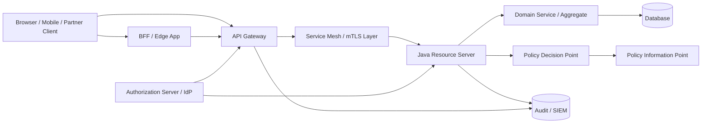
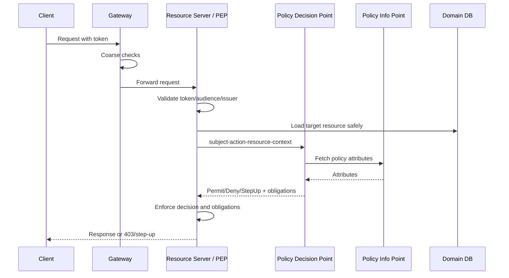
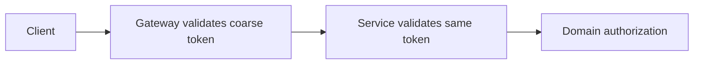
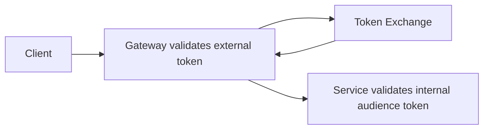
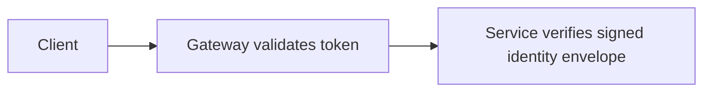
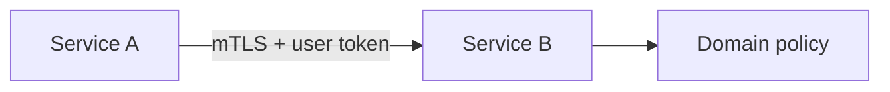
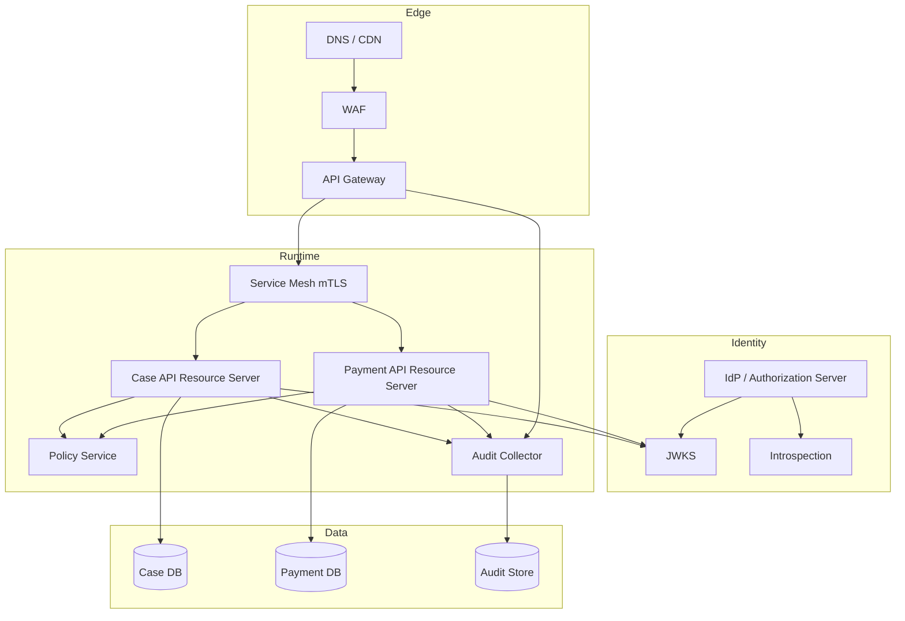

------
title: Learn Java Identity, Authentication & Authorization for Secure Enterprise API Platform - Part 023
description: Memetakan boundary antara API gateway, resource server, service mesh, dan application service agar identity, authentication, authorization, audit, dan policy enforcement tidak ditempatkan di layer yang salah.
series: learn-java-identity-authentication-authorization-api-platform
seriesTitle: Learn Java Identity, Authentication & Authorization for Secure Enterprise API Platform
order: 23
partTitle: API Gateway vs Resource Server vs Service Mesh Responsibilities
tags:
- java
- identity
- authentication
- authorization
- oauth
- oidc
- api-security
- api-gateway
- resource-server
- service-mesh
date: 2026-06-28
---

# Part 023 — API Gateway vs Resource Server vs Service Mesh Responsibilities

> Target skill: kamu mampu menggambar, membela, menguji, dan mengoperasikan boundary security antara **edge gateway**, **OAuth resource server**, **domain service**, **policy service**, dan **service mesh** tanpa membuat asumsi palsu seperti “sudah aman karena lewat gateway”.

Pada platform enterprise, pertanyaan security yang paling sering salah dijawab bukan “pakai JWT atau opaque token?”, melainkan:

> **Layer mana yang berhak mempercayai apa, menolak apa, meneruskan apa, dan membuktikan apa?**

API gateway bisa memblokir request kasar. Resource server bisa memvalidasi bearer token. Service mesh bisa membuktikan workload identity. Domain service bisa memahami object ownership. Policy service bisa mengevaluasi rule lintas sistem. Audit pipeline bisa menyimpan evidence. Tetapi tidak ada satu layer pun yang otomatis menggantikan semua layer lain.

Jika boundary salah, sistem biasanya tampak aman di diagram, tetapi gagal di skenario nyata:

- internal service dipanggil langsung tanpa gateway;
- gateway memvalidasi token tetapi service menerima header identitas palsu;
- service mesh membuktikan workload identity tetapi user authorization tidak dicek;
- resource server menerima token valid untuk audience lain;
- gateway mengecek scope tetapi domain service tidak mengecek object-level access;
- BFF menyembunyikan token dari browser tetapi backend tetap melakukan confused deputy;
- policy engine memberi keputusan benar, tetapi enforcement point berada setelah data bocor.

Materi ini bukan tentang memilih produk gateway tertentu. Ini tentang **placement of trust**.

---

## 1. Kaufman framing

Dalam kerangka Josh Kaufman, skill besar “secure enterprise API platform” harus dipecah menjadi subskill kecil yang bisa dilatih secara sadar.

Untuk part ini, subskill-nya adalah:

1. Membedakan **authentication**, **authorization**, **routing**, **transport security**, **rate limiting**, dan **audit**.
2. Menentukan layer yang menjadi **Policy Enforcement Point** untuk setiap jenis keputusan.
3. Menentukan data identitas apa yang boleh diteruskan antar layer.
4. Mencegah **gateway-only security**.
5. Mencegah **application-only security** yang mengabaikan edge control.
6. Mencegah **mesh-only security** yang hanya membuktikan service, bukan user/action/resource.
7. Merancang fallback ketika gateway, IdP, introspection endpoint, JWKS endpoint, atau policy service gagal.
8. Membuat test yang membuktikan boundary tidak dapat dilewati.

Target performa setelah membaca part ini:

> Kamu bisa mengambil sebuah API platform nyata, menggambar trust boundary-nya, menunjukkan layer mana yang bertanggung jawab atas validasi token, tenant isolation, rate limiting, domain authorization, service-to-service auth, audit, dan membuktikan dengan test negatif bahwa bypass gateway tidak membuka akses.

---

## 2. Mental model utama: gateway bukan aplikasi, mesh bukan authorization, token bukan policy

Ada tiga salah kaprah umum.

### 2.1 “Gateway sudah validasi token, jadi service tidak perlu security”

Ini berbahaya.

Gateway memang bisa melakukan validasi awal. Tetapi resource server tetap harus menjaga dirinya sendiri karena:

- network path bisa berubah;
- internal endpoint bisa terekspos karena misconfiguration;
- service bisa dipanggil dari job, worker, admin tool, integration test, atau partner tunnel;
- gateway policy biasanya tidak tahu object-level authorization;
- gateway tidak selalu punya context domain yang lengkap;
- internal attacker atau compromised workload bisa melewati intended path.

Security invariant:

> **Setiap service yang mengakses protected resource harus menjadi resource server atau berada di belakang enforcement boundary yang setara dan tidak bisa dilewati.**

### 2.2 “Service mesh sudah mTLS, jadi user auth tidak perlu lagi”

mTLS membuktikan workload identity: `payment-service` berbicara dengan `case-service`.

mTLS tidak membuktikan:

- user mana yang memulai request;
- action apa yang diminta;
- resource/object mana yang disentuh;
- apakah user punya entitlement;
- apakah request butuh step-up;
- apakah tenant context valid;
- apakah service downstream boleh bertindak atas user tersebut.

Security invariant:

> **Workload identity menjawab “service apa ini?”, bukan “user ini boleh melakukan aksi ini pada object ini?”.**

### 2.3 “JWT valid berarti request authorized”

JWT valid hanya berarti token memenuhi property cryptographic dan semantic minimum:

- signature valid;
- issuer dipercaya;
- token belum expired;
- audience cocok;
- token type sesuai;
- claim dasar masuk akal.

Authorization masih perlu menjawab:

```text
Can subject S, acting through client C, from tenant T,
perform action A on resource R under context X?
```

Security invariant:

> **Token validation is authentication/trust establishment. Domain authorization is a separate decision.**

---

## 3. Platform map

Diagram berikut menunjukkan boundary umum pada enterprise API platform.



Layer-layer ini punya concern yang berbeda.

| Layer | Pertanyaan utama | Tidak boleh dianggap mampu |
|---|---|---|
| Client | Bagaimana user berinteraksi dan menyimpan credential/token? | Menjaga secret kuat pada browser/public app. |
| BFF | Bagaimana browser mengakses API tanpa expose token? | Menggantikan domain authorization. |
| API Gateway | Apakah request layak masuk platform? | Mengetahui semua rule object-level. |
| Resource Server | Apakah token/request dipercaya untuk API ini? | Menjadi authorization server. |
| Domain Service | Apakah aksi ini valid menurut business invariant? | Memvalidasi seluruh OAuth protocol. |
| Policy Service/PDP | Apakah policy lintas domain mengizinkan aksi? | Menjadi satu-satunya enforcement tanpa PEP lokal. |
| Service Mesh | Apakah workload identity dan transport channel valid? | User authorization. |
| Audit Pipeline | Apakah decision dan evidence terekam? | Mencegah request secara langsung. |
| Authorization Server | Menerbitkan token/claims sesuai grant dan policy IdP. | Mengambil semua keputusan object-level runtime. |

---

## 4. Responsibility matrix

Gunakan matrix ini saat design review.

| Responsibility | Gateway | Resource Server | Domain Service | Mesh | Authorization Server | PDP/Policy Service |
|---|---:|---:|---:|---:|---:|---:|
| TLS termination | Ya | Kadang | Tidak | Ya | Ya | Kadang |
| Request routing | Ya | Tidak | Tidak | Kadang | Tidak | Tidak |
| Coarse API inventory enforcement | Ya | Ya | Tidak | Tidak | Tidak | Tidak |
| Bearer token extraction | Ya/Kadang | Ya | Tidak | Tidak | Tidak | Tidak |
| JWT/opaque token validation | Bisa | Wajib untuk protected API | Tidak | Tidak | Menerbitkan/introspect | Tidak |
| Issuer/audience enforcement | Bisa | Wajib | Tidak | Tidak | Menentukan issuer/audience | Tidak |
| Scope coarse check | Bisa | Ya | Kadang | Tidak | Menyusun scope | Bisa |
| Object-level authorization | Jarang cukup | Membantu | Wajib | Tidak | Jarang | Bisa memutuskan |
| Tenant isolation | Bisa di edge | Wajib | Wajib | Trust domain | Claim/issuer | Bisa |
| Service-to-service auth | Tidak cukup | Ya | Ya | Ya | Token issuance | Bisa |
| Rate limiting | Ya | Kadang | Kadang | Kadang | Token endpoint | Tidak |
| Request schema validation | Ya/Kadang | Ya | Ya | Tidak | Tidak | Tidak |
| Audit trail | Ya untuk edge | Ya untuk security decision | Ya untuk business decision | Ya untuk connection | Ya untuk token events | Ya untuk policy decision |
| Secret/key management | Ya | Ya | Ya | Cert/key | Signing keys | Policy signing/config |

Prinsipnya:

> Edge layer baik untuk **coarse-grained, protocol-level, and platform-level controls**. Domain layer tetap dibutuhkan untuk **resource-specific, stateful, and business-sensitive authorization**.

---

## 5. API gateway responsibilities

API gateway cocok untuk hal-hal yang bersifat platform-wide, stateless relatif terhadap domain, dan murah dievaluasi sebelum request masuk jauh ke sistem.

### 5.1 Yang cocok ditempatkan di gateway

1. **TLS termination** dan certificate policy edge.
2. **Routing** berdasarkan host/path/version.
3. **Authentication pre-check** untuk endpoint protected.
4. **JWT signature/issuer/audience/scopes coarse validation** bila gateway mendukung validasi yang benar.
5. **Deny known bad traffic**: missing token, malformed token, blocked IP range, missing required headers.
6. **Rate limiting dan quota** per client, tenant, API key, partner, route.
7. **Request size limit** dan body limit.
8. **Schema validation** untuk request yang high-risk.
9. **CORS policy** di boundary publik.
10. **API inventory enforcement**: hanya route yang didaftarkan boleh dilalui.
11. **Correlation ID injection** atau normalization.
12. **Edge audit**: who/what attempted to enter.
13. **WAF/bot/basic abuse controls**.
14. **mTLS client authentication** untuk partner edge bila relevan.

### 5.2 Yang tidak boleh hanya ditempatkan di gateway

1. Object ownership check.
2. Tenant-specific domain relationship.
3. Row-level or aggregate-level entitlement.
4. Business state transition authorization.
5. Field-level authorization.
6. Consent/delegation nuance.
7. Break-glass semantics.
8. Authorization yang bergantung pada fresh domain state.
9. Export/list/search scoping yang bergantung pada repository predicate.
10. Decision yang perlu audit business-level.

### 5.3 Gateway header propagation risk

Anti-pattern paling umum:

```http
X-User-Id: 123
X-Tenant-Id: alpha
X-Roles: ADMIN
```

Lalu backend percaya header ini.

Masalahnya:

- header bisa dipalsukan jika service bisa dipanggil langsung;
- gateway bisa salah mapping;
- downstream tidak tahu apakah header berasal dari gateway terpercaya;
- role string kehilangan issuer/audience/client context;
- audit kehilangan token metadata asli;
- tenant header bisa konflik dengan tenant claim.

Lebih aman:

- resource server memvalidasi token sendiri; atau
- gateway menukar external token menjadi internal token yang signed dan audience-bound; atau
- network policy memastikan hanya gateway yang bisa mengakses service dan service tetap memverifikasi mTLS workload identity gateway; atau
- header identity ditandatangani dan diverifikasi, meski ini tetap lebih kompleks daripada resource server validation normal.

Security invariant:

> **Never trust identity headers unless the channel, producer, audience, signature, and bypass prevention are all controlled.**

---

## 6. Resource server responsibilities

Resource server adalah API yang menerima bearer token dan melindungi resource.

Di Java/Spring, ini biasanya Spring Boot service dengan Spring Security OAuth2 Resource Server.

### 6.1 Yang wajib dilakukan resource server

1. Extract bearer token dari lokasi yang diizinkan.
2. Validasi signature atau introspection state.
3. Validasi issuer.
4. Validasi audience untuk API tersebut.
5. Validasi expiry dan clock skew wajar.
6. Validasi token type bila tersedia.
7. Map claim ke principal internal secara aman.
8. Jangan mempercayai claim sebagai data domain final tanpa lookup bila berisiko stale.
9. Lakukan coarse route authorization.
10. Panggil domain/policy guard untuk object-level authorization.
11. Bedakan 401 dan 403.
12. Log security decision tanpa membocorkan token.
13. Terapkan deny-by-default.

### 6.2 Minimal Spring resource server boundary

```java
@Configuration
@EnableMethodSecurity
class ResourceServerSecurityConfig {

    @Bean
    SecurityFilterChain apiSecurity(HttpSecurity http) throws Exception {
        return http
            .securityMatcher("/api/**")
            .csrf(csrf -> csrf.disable())
            .authorizeHttpRequests(auth -> auth
                .requestMatchers("/api/health").permitAll()
                .requestMatchers(HttpMethod.GET, "/api/cases/**")
                    .hasAuthority("SCOPE_cases.read")
                .requestMatchers(HttpMethod.POST, "/api/cases/**")
                    .hasAuthority("SCOPE_cases.write")
                .anyRequest().denyAll()
            )
            .oauth2ResourceServer(oauth2 -> oauth2
                .jwt(jwt -> jwt.jwtAuthenticationConverter(jwtAuthenticationConverter()))
            )
            .build();
    }

    @Bean
    JwtAuthenticationConverter jwtAuthenticationConverter() {
        JwtGrantedAuthoritiesConverter scopes = new JwtGrantedAuthoritiesConverter();
        scopes.setAuthorityPrefix("SCOPE_");
        scopes.setAuthoritiesClaimName("scope");

        JwtAuthenticationConverter converter = new JwtAuthenticationConverter();
        converter.setJwtGrantedAuthoritiesConverter(scopes);
        converter.setPrincipalClaimName("sub");
        return converter;
    }
}
```

Ini belum cukup untuk object-level authorization. Ini baru boundary awal.

### 6.3 Audience validation harus eksplisit

Banyak bug terjadi karena API menerima token yang valid untuk API lain.

```java
@Bean
JwtDecoder jwtDecoder() {
    NimbusJwtDecoder decoder = NimbusJwtDecoder
        .withIssuerLocation("https://idp.example.com")
        .build();

    OAuth2TokenValidator<Jwt> issuer = JwtValidators
        .createDefaultWithIssuer("https://idp.example.com");

    OAuth2TokenValidator<Jwt> audience = jwt -> {
        if (jwt.getAudience().contains("case-api")) {
            return OAuth2TokenValidatorResult.success();
        }
        OAuth2Error error = new OAuth2Error(
            "invalid_token",
            "Token audience does not include case-api",
            null
        );
        return OAuth2TokenValidatorResult.failure(error);
    };

    decoder.setJwtValidator(new DelegatingOAuth2TokenValidator<>(issuer, audience));
    return decoder;
}
```

Security invariant:

> **A token valid somewhere is not a token valid here.**

---

## 7. Domain service responsibilities

Domain service bertanggung jawab atas business invariant dan object-specific security.

Contoh:

```java
@Service
class CaseCommandService {
    private final CaseRepository cases;
    private final CaseAuthorizationPolicy policy;
    private final AuditSink audit;

    @Transactional
    public CaseDecision approveCase(Actor actor, CaseId caseId, ApprovalCommand command) {
        CaseFile file = cases.findByIdForTenant(caseId, actor.tenantId())
            .orElseThrow(NotFoundException::new);

        AuthorizationDecision decision = policy.canApprove(actor, file, command);
        audit.record("case.approve.authorization", decision.toAuditRecord());

        if (!decision.granted()) {
            throw new AccessDeniedException(decision.reasonCode());
        }

        return file.approve(actor, command.reason());
    }
}
```

Mengapa guard berada di service/domain, bukan hanya controller?

Karena use case bisa dipanggil dari:

- REST controller;
- GraphQL resolver;
- async message handler;
- batch job;
- admin console;
- scheduled task;
- workflow engine;
- internal tool;
- integration adapter.

Security invariant:

> **Authorization should protect the use case, not just the HTTP route.**

---

## 8. Service mesh responsibilities

Service mesh kuat untuk workload-to-workload trust.

Yang cocok untuk mesh:

1. mTLS antar workload.
2. Service identity.
3. Traffic policy.
4. L7 routing tertentu.
5. Retry/circuit breaking.
6. Peer authentication.
7. Network segmentation.
8. Telemetry.
9. Certificate rotation.
10. Egress control.

Yang tidak cocok ditaruh hanya di mesh:

1. Object-level authorization.
2. User entitlement.
3. Consent evaluation.
4. Domain state transition policy.
5. Fine-grained field masking.
6. Business audit explanation.

Mesh dapat menjawab:

```text
request came from workload spiffe://prod.example.com/ns/case/sa/case-api
```

Mesh tidak dapat menjawab secara penuh:

```text
user 90210 may approve case CASE-123 because she is assigned investigator,
case status is READY_FOR_APPROVAL, tenant is correct, and approval limit is below threshold
```

---

## 9. Authorization server responsibilities

Authorization server menerbitkan token dan menjalankan protocol OAuth/OIDC.

Tanggung jawabnya:

1. Authenticate user/client sesuai grant.
2. Validate redirect URI/client metadata.
3. Manage consent bila relevan.
4. Issue access token, refresh token, ID token.
5. Publish metadata/discovery.
6. Publish JWK Set.
7. Support token introspection bila opaque token dipakai.
8. Support token revocation bila diperlukan.
9. Enforce token lifetime and client policy.
10. Maintain registered client configuration.
11. Record token issuance and client authentication audit.

Yang tidak ideal dibebankan penuh ke authorization server:

1. Semua object-level authorization seluruh domain.
2. Fresh authorization berdasarkan state yang berubah cepat di tiap service.
3. Query scoping.
4. Field-level response shaping.
5. Use-case invariant enforcement.

Kenapa?

Authorization server biasanya tidak punya domain context yang cukup, dan memaksa semua domain policy masuk ke token akan menghasilkan stale claim, token bloat, dan coupling berbahaya.

Security invariant:

> **Put stable coarse attributes in tokens; evaluate volatile domain-specific policy at the resource/domain boundary.**

---

## 10. Policy service responsibilities

Policy service atau PDP cocok ketika keputusan perlu konsisten lintas service atau policy sering berubah tanpa redeploy semua service.

Contoh keputusan yang cocok dipusatkan:

- role-to-entitlement mapping enterprise;
- cross-domain segregation of duties;
- privileged access condition;
- delegated access rule;
- tenant-specific policy template;
- risk/adaptive authorization;
- global compliance blocklist;
- jurisdiction constraints;
- high-value transaction threshold.

Tetapi PDP tidak bisa bekerja sendirian. Ia butuh PEP lokal.



PEP lokal harus:

- menyusun input keputusan yang benar;
- memastikan resource yang dievaluasi adalah resource yang akan dimutasi;
- menolak jika PDP unreachable untuk protected action;
- menerapkan obligation, bukan mengabaikannya;
- mencatat decision ID untuk audit;
- mencegah TOCTOU.

---

## 11. Common platform topologies

### 11.1 Gateway validates token, service also validates token

Ini sering menjadi baseline paling defensible.



Kelebihan:

- defense in depth;
- service dapat diuji mandiri;
- bypass gateway tetap ditolak;
- audit service punya token metadata asli;
- ownership check tetap dekat domain.

Kekurangan:

- duplicate validation cost;
- JWKS/introspection dependency di banyak service;
- perlu standard library/config platform;
- consistency antar service harus dijaga.

Gunakan ketika:

- API menyimpan/mengubah data sensitif;
- banyak internal call path;
- compliance/audit penting;
- microservice perlu autonomy.

### 11.2 Gateway validates external token, exchanges to internal token



Kelebihan:

- downstream tidak menerima token publik;
- audience internal lebih ketat;
- claim dapat dinormalisasi;
- lifetime internal bisa pendek;
- bisa memasukkan actor/client chain.

Kekurangan:

- token exchange complexity;
- latency;
- failure mode tambahan;
- harus jelas semantic `act`, `sub`, `client_id`, `aud`, `azp`;
- audit harus menghubungkan external dan internal token.

Gunakan ketika:

- enterprise punya banyak external IdP;
- claim perlu dinormalisasi;
- partner API harus disekat dari internal API;
- service mesh + internal audience model dipakai.

### 11.3 Gateway injects signed identity context



Ini bisa dipakai, tetapi harus hati-hati.

Envelope harus:

- signed;
- audience-bound;
- short-lived;
- include issuer/gateway identity;
- include original token hash or reference;
- include tenant and actor chain;
- rejected if unsigned or stale;
- transported only over authenticated channel.

Jika hanya header biasa, itu anti-pattern.

### 11.4 Mesh mTLS + JWT end-user propagation



Kelebihan:

- workload identity dan user identity keduanya tersedia;
- downstream bisa mengecek audience/authorization;
- cocok untuk zero-trust internal service.

Risiko:

- token forwarding bisa menjadi confused deputy;
- token audience mungkin salah;
- long chain propagation memperluas blast radius;
- log/token leak risk;
- perlu token exchange untuk downstream audience yang berbeda.

---

## 12. Direct service access: the test that exposes false security

Pertanyaan design review yang sangat efektif:

> **Apa yang terjadi jika attacker atau compromised internal service memanggil resource server langsung, melewati gateway?**

Jawaban yang aman:

- request tanpa token ditolak 401;
- token dengan issuer salah ditolak 401;
- token audience gateway-only ditolak 401;
- token valid tetapi tanpa scope ditolak 403;
- token valid dan scope benar tetapi object tenant lain ditolak 404/403 sesuai policy;
- identity header palsu diabaikan;
- request dari workload tanpa mTLS identity ditolak oleh network/mesh policy;
- audit mencatat attempt.

Buat test eksplisit:

```java
@SpringBootTest(webEnvironment = SpringBootTest.WebEnvironment.RANDOM_PORT)
class GatewayBypassSecurityTest {

    @Autowired TestRestTemplate rest;

    @Test
    void directCallWithoutBearerTokenIsRejected() {
        ResponseEntity<String> response = rest.getForEntity("/api/cases/CASE-1", String.class);
        assertThat(response.getStatusCode()).isEqualTo(HttpStatus.UNAUTHORIZED);
    }

    @Test
    void forgedIdentityHeadersAreIgnored() {
        HttpHeaders headers = new HttpHeaders();
        headers.add("X-User-Id", "admin");
        headers.add("X-Tenant-Id", "tenant-a");
        headers.add("X-Roles", "SUPER_ADMIN");

        ResponseEntity<String> response = rest.exchange(
            "/api/cases/CASE-1",
            HttpMethod.GET,
            new HttpEntity<>(headers),
            String.class
        );

        assertThat(response.getStatusCode()).isEqualTo(HttpStatus.UNAUTHORIZED);
    }
}
```

---

## 13. Correlation, identity, and audit propagation

Setiap layer boleh menambahkan metadata, tetapi tidak semua metadata punya trust level sama.

| Metadata | Producer | Trust level | Rule |
|---|---|---:|---|
| `X-Correlation-Id` | Client/gateway/service | Low-medium | Boleh diteruskan, sanitasi format. |
| `traceparent` | Client/gateway/service | Medium | Jangan jadikan authorization input. |
| `Authorization` bearer token | Client/BFF/service | High after validation | Jangan log raw token. |
| `X-User-Id` | Gateway | Low unless protected | Jangan percaya tanpa proof. |
| Signed identity envelope | Gateway/AS | Medium-high | Validasi signature/audience/expiry. |
| mTLS peer identity | Mesh/TLS | High for workload | Bukan pengganti user auth. |
| `tenant_id` claim | AS | Medium-high | Cocokkan dengan route/resource. |
| Domain resource owner | DB/domain | High for object decision | Source of truth untuk BOLA defense. |

Audit event yang baik mengandung:

```json
{
  "eventType": "authorization.decision",
  "correlationId": "01J...",
  "requestId": "req-...",
  "issuer": "https://idp.example.com",
  "subject": "user-123",
  "clientId": "case-portal",
  "tenantId": "tenant-a",
  "workload": "spiffe://prod/ns/case/sa/case-api",
  "action": "case.approve",
  "resourceType": "case",
  "resourceIdHash": "sha256:...",
  "decision": "DENY",
  "reasonCode": "CASE_NOT_ASSIGNED",
  "policyVersion": "case-policy-2026.06.28",
  "enforcementPoint": "case-command-service",
  "gatewayRoute": "POST /cases/{id}/approve"
}
```

Hindari:

- raw token;
- full PII tidak perlu;
- password/secret;
- long request body;
- claim yang belum divalidasi;
- event tanpa decision reason.

---

## 14. Failure modes

### 14.1 Gateway allows, service denies

Ini boleh terjadi.

Gateway hanya coarse gate. Service punya domain context.

Contoh:

- gateway melihat `cases.write`;
- service melihat user bukan assignee case;
- service menolak 403.

### 14.2 Gateway denies, service would allow

Ini juga boleh, selama gateway policy memang intentionally stricter.

Contoh:

- route disabled;
- tenant blocked;
- client quota exceeded;
- API version deprecated;
- IP allowlist failed.

### 14.3 Gateway validates wrong audience

Berbahaya.

Misalnya token audience `user-info-api` diterima untuk `case-api`.

Mitigasi:

- resource server juga validate audience;
- gateway route config punya expected audience per route;
- contract test untuk setiap route.

### 14.4 Service trusts forwarded user header

Berbahaya.

Mitigasi:

- reject request with identity headers unless from trusted gateway and signed;
- prefer token validation;
- strip inbound identity headers at gateway before injecting normalized values;
- add direct-call tests.

### 14.5 Policy service unreachable

Default harus sesuai risk.

Untuk protected write/high-risk action:

> fail closed.

Untuk low-risk read yang memakai cached permit:

> mungkin fail with bounded cache, tetapi harus explicit, audited, dan time-limited.

### 14.6 Mesh identity valid, user token stale

mTLS membuktikan service, tetapi token bisa expired atau revoked.

Mitigasi:

- validate token per request;
- token exchange with short-lived downstream token;
- introspection untuk high-risk actions;
- event-based revocation jika perlu.

### 14.7 Gateway logs sensitive token

Mitigasi:

- redact `Authorization` header;
- hash token identifier jika butuh correlation;
- separate security audit from access logs;
- ensure error dumps tidak menyertakan header sensitif.

---

## 15. Anti-patterns

### 15.1 Gateway-only authorization

```text
Gateway checks role=ADMIN; service trusts request.
```

Gagal saat:

- service dipanggil langsung;
- route baru lupa policy;
- object ownership berbeda;
- role terlalu coarse;
- internal attacker punya network access.

### 15.2 JWT decode in gateway, raw claims in headers

```text
Gateway: X-User-Id=user-1, X-Scope=cases.write
Service: if header exists, allow.
```

Ini mengubah cryptographic proof menjadi string biasa.

### 15.3 Resource server performs only `authenticated()`

```java
.anyRequest().authenticated()
```

Untuk API sensitif, ini terlalu lemah. Minimal route-level scope/authority tetap perlu.

### 15.4 Scope as domain permission

`cases.write` bukan berarti user boleh update semua case.

Scope adalah coarse API permission. Domain permission tetap perlu.

### 15.5 Mesh as universal security solution

Mesh membantu transport/workload trust. Ia tidak memahami aggregate state.

### 15.6 Central PDP with no local invariant

Jika service mengirim input salah ke PDP, keputusan bisa benar secara formal tetapi salah secara domain.

Misalnya service mengevaluasi `CASE-123`, lalu memutasi `CASE-456`.

### 15.7 Public endpoint accidentally behind authenticated route only in gateway

Endpoint internal `/admin/reindex` tidak ada auth di service karena “gateway menutup”. Lalu service terekspos oleh port-forward/debug route.

### 15.8 Logging `sub` tanpa issuer

`sub=user-123` tidak global. Selalu log issuer + subject, atau normalized internal actor id dengan provenance.

---

## 16. Design review checklist

Gunakan checklist ini sebelum platform dinyatakan production-ready.

### 16.1 Entry boundary

- [ ] Semua public route terdaftar dan tidak ada wildcard longgar.
- [ ] Gateway memblokir missing/malformed token untuk protected routes.
- [ ] Gateway memvalidasi issuer/audience/scope minimal bila melakukan token validation.
- [ ] Gateway tidak meneruskan identity header dari client tanpa stripping.
- [ ] Rate limit diterapkan per client/tenant/route sesuai risk.
- [ ] Request size limit dan timeout masuk akal.

### 16.2 Resource server

- [ ] Service tetap menolak request langsung tanpa token.
- [ ] Service validate issuer.
- [ ] Service validate audience.
- [ ] Service enforce token expiry.
- [ ] Service map authority secara deterministik.
- [ ] Service tidak percaya `X-User-*` dari client.
- [ ] 401 dan 403 dibedakan.
- [ ] Security errors tidak membocorkan detail sensitif.

### 16.3 Domain authorization

- [ ] Setiap protected use case punya policy guard.
- [ ] List/search/export/count/facet punya query scoping.
- [ ] Mutation load resource dengan tenant predicate.
- [ ] Object-level authorization tidak hanya di controller.
- [ ] Async/message handler memakai security context eksplisit.
- [ ] Step-up action punya enforcement path.

### 16.4 Service-to-service

- [ ] Internal calls punya workload identity atau token audience internal.
- [ ] Token forwarding tidak dilakukan sembarangan.
- [ ] Token exchange dipakai jika downstream audience berbeda.
- [ ] Service account privilege minimal.
- [ ] Internal admin endpoints protected.

### 16.5 Audit

- [ ] Gateway logs edge decision.
- [ ] Resource server logs token validation failures safely.
- [ ] Domain service logs authorization decision.
- [ ] Policy decision includes policy version.
- [ ] Correlation id end-to-end.
- [ ] Raw tokens tidak pernah masuk logs.

### 16.6 Resilience

- [ ] JWKS cache behavior diketahui.
- [ ] Introspection outage behavior explicit.
- [ ] PDP outage behavior explicit.
- [ ] Gateway outage mode tidak bypass auth.
- [ ] Key rotation test tersedia.

---

## 17. Reference architecture boundary



Important placement:

- Gateway handles platform-level entry controls.
- Resource servers validate tokens for themselves.
- Domain services enforce object-level and business authorization.
- Mesh proves workload identity and protects transport.
- Policy service centralizes enterprise policy where beneficial.
- Audit records both edge and domain decisions.

---

## 18. Java implementation pattern: boundary-aware principal

Jangan sebarkan `Jwt` mentah ke seluruh domain.

Buat principal internal yang tetap menyimpan provenance.

```java
public record Actor(
    String issuer,
    String subject,
    String clientId,
    TenantId tenantId,
    Set<String> scopes,
    Set<String> roles,
    Optional<String> actorChain,
    Instant authenticatedAt,
    Map<String, Object> rawClaimsForAuditOnly
) {
    public boolean hasScope(String scope) {
        return scopes.contains(scope);
    }
}
```

Converter:

```java
@Component
class JwtActorMapper {

    Actor toActor(Jwt jwt) {
        String issuer = jwt.getIssuer().toString();
        String subject = jwt.getSubject();
        String clientId = jwt.getClaimAsString("client_id");
        String tenant = jwt.getClaimAsString("tenant_id");

        if (tenant == null || tenant.isBlank()) {
            throw new BadCredentialsException("Missing tenant_id");
        }

        return new Actor(
            issuer,
            subject,
            clientId,
            new TenantId(tenant),
            scopes(jwt),
            roles(jwt),
            Optional.ofNullable(jwt.getClaimAsString("act")),
            jwt.getClaimAsInstant("auth_time"),
            minimalAuditClaims(jwt)
        );
    }

    private Set<String> scopes(Jwt jwt) {
        String scope = jwt.getClaimAsString("scope");
        if (scope == null) return Set.of();
        return Arrays.stream(scope.split(" "))
            .filter(s -> !s.isBlank())
            .collect(Collectors.toUnmodifiableSet());
    }

    private Set<String> roles(Jwt jwt) {
        List<String> roles = jwt.getClaimAsStringList("roles");
        return roles == null ? Set.of() : Set.copyOf(roles);
    }

    private Map<String, Object> minimalAuditClaims(Jwt jwt) {
        return Map.of(
            "iss", jwt.getIssuer().toString(),
            "sub", jwt.getSubject(),
            "aud", jwt.getAudience(),
            "jti", jwt.getId(),
            "exp", jwt.getExpiresAt()
        );
    }
}
```

Controller boundary:

```java
@RestController
@RequestMapping("/api/cases")
class CaseController {
    private final JwtActorMapper actorMapper;
    private final CaseQueryService queries;
    private final CaseCommandService commands;

    @GetMapping("/{id}")
    CaseDto get(@AuthenticationPrincipal Jwt jwt, @PathVariable String id) {
        Actor actor = actorMapper.toActor(jwt);
        return queries.getCase(actor, new CaseId(id));
    }

    @PostMapping("/{id}/approve")
    ResponseEntity<Void> approve(
        @AuthenticationPrincipal Jwt jwt,
        @PathVariable String id,
        @RequestBody ApprovalRequest body
    ) {
        Actor actor = actorMapper.toActor(jwt);
        commands.approveCase(actor, new CaseId(id), body.toCommand());
        return ResponseEntity.noContent().build();
    }
}
```

Service boundary tetap melakukan authorization.

---

## 19. Testing strategy

### 19.1 Route boundary tests

- missing token → 401;
- malformed token → 401;
- wrong issuer → 401;
- wrong audience → 401;
- expired token → 401;
- missing scope → 403;
- valid coarse scope but wrong object → 403 or 404;
- fake identity header → ignored;
- direct service call bypassing gateway → still rejected.

### 19.2 Gateway contract tests

Untuk setiap route:

```yaml
route: POST /api/cases/{id}/approve
required:
  authentication: bearer
  issuer: https://idp.example.com
  audience: case-api
  scopes:
    - cases.write
  rateLimit:
    unit: tenant
    limit: 100/minute
  requestBodyLimit: 256kb
  forwardHeaders:
    allow:
      - traceparent
      - X-Correlation-Id
    strip:
      - X-User-Id
      - X-Roles
      - X-Tenant-Id
```

Test gateway config seperti code, bukan hanya manual dashboard.

### 19.3 Domain authorization tests

```java
@Test
void investigatorCannotApproveCaseAssignedToDifferentTeam() {
    Actor actor = actor("tenant-a", "investigator-1", "cases.write");
    CaseFile file = caseFile("tenant-a", "team-b", READY_FOR_APPROVAL);

    AuthorizationDecision decision = policy.canApprove(actor, file, command());

    assertThat(decision.granted()).isFalse();
    assertThat(decision.reasonCode()).isEqualTo("NOT_ASSIGNED_TEAM");
}
```

### 19.4 Chaos/security resilience tests

- JWKS endpoint unavailable: known cached keys still work within cache policy; unknown key rejected.
- Introspection endpoint unavailable: high-risk request fails closed.
- PDP unavailable: write action fails closed.
- Gateway strips auth header accidentally: service returns 401.
- Gateway forwards fake identity header: service ignores.
- Mesh certificate expired: service-to-service denied.

---

## 20. Practice drill

Ambil satu API endpoint nyata atau fiktif:

```text
POST /tenants/{tenantId}/cases/{caseId}/approve
```

Buat boundary design:

1. Gateway checks apa?
2. Resource server checks apa?
3. Domain service checks apa?
4. Policy service dipakai atau tidak?
5. Mesh identity dipakai untuk apa?
6. Apa yang masuk audit gateway?
7. Apa yang masuk audit domain?
8. Apa yang terjadi jika gateway dilewati?
9. Apa yang terjadi jika tenant path tidak sama dengan tenant claim?
10. Apa negative test minimal?

Jawaban ideal:

- Gateway: route registered, bearer required, issuer/audience/scope coarse, rate limit, body size, strip identity headers.
- Resource server: validate token independently, audience `case-api`, map actor, reject tenant mismatch early.
- Domain: load case by `tenantId + caseId`, verify assignee/role/status/approval limit.
- Policy service: optional for SoD/privileged/threshold policy.
- Mesh: verify caller workload if internal.
- Audit: edge entry + domain decision + policy version.
- Gateway bypass: still 401/403.
- Tenant mismatch: reject, record security event.

---

## 21. Summary

Boundary design adalah inti secure enterprise API platform.

Ingat prinsip-prinsip berikut:

1. Gateway adalah coarse platform enforcement, bukan pengganti domain authorization.
2. Resource server harus menjaga dirinya sendiri.
3. Domain service adalah tempat utama object-level dan business authorization.
4. Mesh membuktikan workload, bukan user permission.
5. Authorization server menerbitkan token, bukan oracle semua domain decision.
6. Policy service membantu konsistensi, tetapi PEP lokal tetap wajib.
7. Header identity biasa tidak boleh dipercaya.
8. Token validation bukan domain authorization.
9. Direct service call test adalah cara cepat menemukan false security.
10. Audit harus merekam decision, bukan hanya request.

Jika kamu sudah bisa menggambar boundary dan membuktikannya dengan negative tests, kamu sudah berpikir seperti platform security engineer, bukan hanya developer yang menempelkan anotasi security.

---

## References

- Spring Security Reference — OAuth2 Resource Server: https://docs.spring.io/spring-security/reference/servlet/oauth2/resource-server/index.html
- Spring Security Reference — Servlet Authorization: https://docs.spring.io/spring-security/reference/servlet/authorization/index.html
- Spring Authorization Server Reference — Configuration Model: https://docs.spring.io/spring-authorization-server/reference/configuration-model.html
- RFC 9700 — Best Current Practice for OAuth 2.0 Security: https://datatracker.ietf.org/doc/html/rfc9700
- OWASP API Security Top 10 2023: https://owasp.org/API-Security/editions/2023/en/0x11-t10/
- OWASP Authorization Cheat Sheet: https://cheatsheetseries.owasp.org/cheatsheets/Authorization_Cheat_Sheet.html
- SPIFFE Concepts: https://spiffe.io/docs/latest/spiffe-about/spiffe-concepts/
