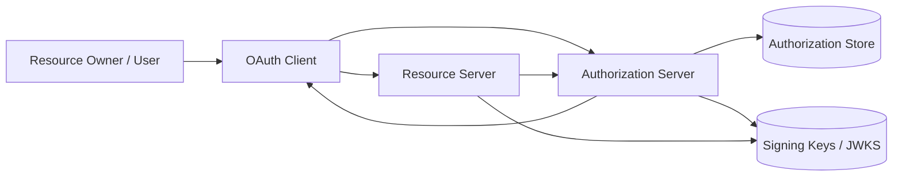
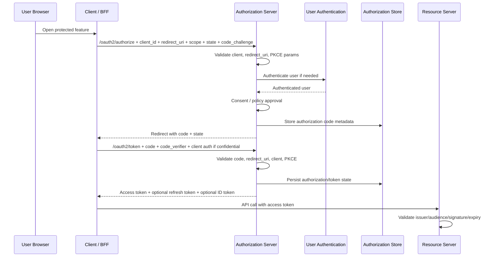
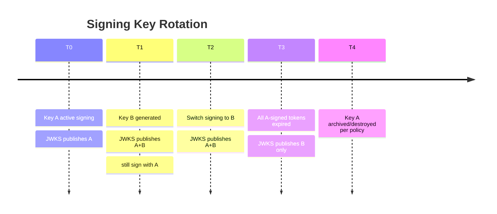
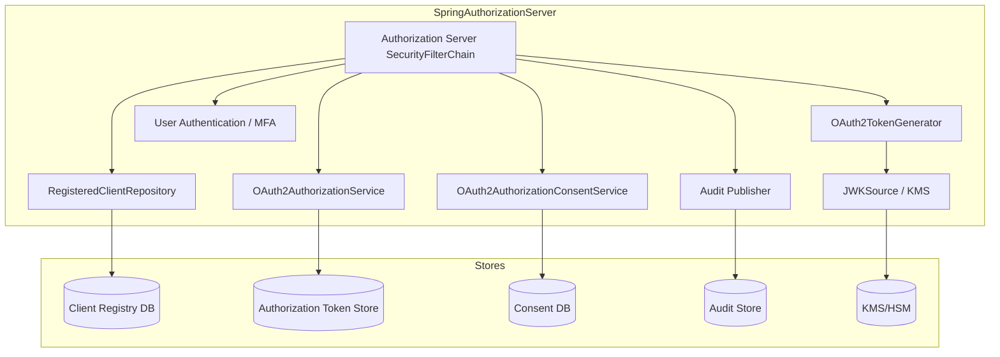

------
title: Learn Java Identity, Authentication & Authorization for Secure Enterprise API Platform - Part 024
description: Arsitektur Spring Authorization Server untuk membangun OAuth2/OIDC authorization server Java-native yang aman, extensible, auditable, dan layak dipakai dalam platform enterprise.
series: learn-java-identity-authentication-authorization-api-platform
seriesTitle: Learn Java Identity, Authentication & Authorization for Secure Enterprise API Platform
order: 24
partTitle: Spring Authorization Server Architecture
tags:
- java
- identity
- authentication
- authorization
- oauth
- oidc
- api-security
- spring-security
- spring-authorization-server
date: 2026-06-28
---

# Part 024 — Spring Authorization Server Architecture

> Target skill: kamu mampu memahami, menilai, dan merancang Spring Authorization Server sebagai authorization server/OIDC provider internal dengan boundary yang jelas: registered client, grant flow, token generation, authorization storage, consent, key management, endpoint security, audit, dan extension points.

Part sebelumnya membahas boundary antara gateway, resource server, service mesh, domain service, PDP, dan authorization server. Sekarang kita masuk ke sisi authorization server.

Spring Authorization Server bukan sekadar library untuk “generate JWT”. Ia adalah framework protocol server untuk OAuth2/OIDC. Artinya ia berada di pusat trust platform:

- client mendaftar di sini;
- redirect URI dan grant dikontrol di sini;
- user consent atau approval bisa disimpan di sini;
- access token, refresh token, ID token diterbitkan di sini;
- JWK Set dipublikasikan di sini;
- introspection dan revocation bisa dilayani di sini;
- resource server membangun trust terhadap issuer ini.

Kesalahan arsitektur authorization server mahal akibatnya. Satu konfigurasi grant/client/key/token yang buruk bisa memperluas akses ke banyak API sekaligus.

---

## 1. Kaufman framing

Subskill yang harus dilatih dalam part ini:

1. Membaca authorization server sebagai **protocol state machine**.
2. Membedakan client registration, user authentication, authorization consent, token issuance, token validation, dan resource authorization.
3. Memahami komponen inti Spring Authorization Server.
4. Merancang registered client repository yang aman.
5. Merancang token model: JWT/opaque, access/refresh/ID token.
6. Mengatur key/JWK lifecycle.
7. Mengaktifkan OIDC secara sadar, bukan default membabi buta.
8. Menambahkan claim custom tanpa membuat token menjadi authorization database.
9. Membangun audit trail issuance/revocation/client auth.
10. Menguji flow dengan negative protocol tests.

Target performa:

> Kamu bisa menjelaskan request `authorization_code + PKCE` dari awal sampai access token diterbitkan, menunjukkan class/bean Spring Authorization Server yang terlibat, lalu menyebutkan minimal 10 security invariants yang harus dijaga sebelum server layak production.

---

## 2. Mental model: authorization server sebagai trust factory

Authorization server tidak hanya “membuat token”. Ia **membuat artefak kepercayaan** yang akan diterima resource server.



Trust factory berarti setiap token harus menjawab:

- siapa issuer-nya;
- untuk audience mana token ini;
- client mana yang mendapatkannya;
- subject mana yang terkait;
- grant apa yang dipakai;
- scope apa yang diberikan;
- kapan expired;
- apakah refresh token ada;
- key mana yang menandatangani;
- policy apa yang berlaku saat token diterbitkan;
- bagaimana token dicabut atau dirotasi.

Jika hal-hal ini tidak eksplisit, downstream service akan membuat asumsi sendiri.

Security invariant:

> **Authorization server harus menerbitkan token yang sempit, terikat audience, berumur pendek, dapat diaudit, dan dapat dipahami resource server tanpa interpretasi liar.**

---

## 3. Apa itu Spring Authorization Server

Spring Authorization Server adalah framework di atas Spring Security untuk membangun OAuth2 Authorization Server dan OpenID Connect Provider. Spring Authorization Server menyediakan endpoint protocol, model registered client, authorization service, consent service, token generator, JWK support, dan extension points.

Catatan versi penting: pada 2026, halaman proyek Spring menyatakan Spring Authorization Server 1.5.x adalah generasi terakhir di bawah proyek tersebut dan fitur baru bergerak ke Spring Security 7.0. Secara arsitektur, konsepnya tetap penting: authorization server adalah bagian dari security platform, bukan utility kecil.

Dalam seri ini, kita fokus ke mental model dan desain production-grade, bukan hanya versi library tertentu.

---

## 4. Endpoint protocol utama

Spring Authorization Server default configuration menyediakan endpoint OAuth2 utama, termasuk:

- authorization endpoint;
- device authorization endpoint;
- device verification endpoint;
- token endpoint;
- token introspection endpoint;
- token revocation endpoint;
- authorization server metadata endpoint;
- JWK Set endpoint jika `JWKSource<SecurityContext>` tersedia.

Jika OIDC diaktifkan, endpoint tambahan dapat mencakup:

- provider configuration endpoint;
- logout endpoint;
- UserInfo endpoint;
- dynamic client registration endpoint, namun ini biasanya disabled by default dan tidak semua deployment membutuhkannya.

Diagram flow authorization code:



---

## 5. Core components

Spring Authorization Server exposes several important components. Jangan hafalkan nama class saja. Pahami boundary-nya.

| Component | Responsibility | Production concern |
|---|---|---|
| `SecurityFilterChain` | Endpoint security untuk authorization server. | Jangan campur sembarangan dengan app login/resource server chain. |
| `RegisteredClientRepository` | Menyimpan metadata OAuth clients. | Jangan in-memory untuk production. Validasi redirect URI/grant/secret. |
| `OAuth2AuthorizationService` | Menyimpan authorization, code, token state. | Persistence, revocation, cleanup, audit. |
| `OAuth2AuthorizationConsentService` | Menyimpan consent user terhadap client/scope. | Consent lifecycle, tenant, audit. |
| `AuthorizationServerSettings` | Issuer dan endpoint settings. | Issuer harus stabil dan sesuai external URL. |
| `OAuth2TokenGenerator` | Menerbitkan token. | Claim design, signing, lifetime, customization. |
| `JWKSource<SecurityContext>` | Menyediakan signing keys/JWKS. | Rotation, key protection, `kid`, cache. |
| `JwtDecoder` | Dibutuhkan untuk beberapa OIDC endpoint. | Harus cocok dengan JWK source. |
| Client authentication configurer | Validasi client secret, private key JWT, mTLS, dll. | Confidential client hardening. |
| Endpoint customizers | Hook untuk authorization/token/introspection/revocation endpoint. | Jangan melemahkan protocol validation. |

---

## 6. Minimal configuration anatomy

Contoh minimal untuk memahami struktur, bukan langsung production-ready.

```java
@Configuration
class AuthorizationServerConfig {

    @Bean
    @Order(1)
    SecurityFilterChain authorizationServerSecurityFilterChain(HttpSecurity http) throws Exception {
        OAuth2AuthorizationServerConfigurer authorizationServerConfigurer =
            OAuth2AuthorizationServerConfigurer.authorizationServer();

        http
            .securityMatcher(authorizationServerConfigurer.getEndpointsMatcher())
            .with(authorizationServerConfigurer, authorizationServer -> authorizationServer
                .oidc(Customizer.withDefaults())
            )
            .authorizeHttpRequests(authorize -> authorize.anyRequest().authenticated())
            .exceptionHandling(exceptions -> exceptions
                .authenticationEntryPoint(new LoginUrlAuthenticationEntryPoint("/login"))
            );

        return http.build();
    }

    @Bean
    @Order(2)
    SecurityFilterChain applicationSecurityFilterChain(HttpSecurity http) throws Exception {
        return http
            .authorizeHttpRequests(authorize -> authorize
                .requestMatchers("/login", "/assets/**").permitAll()
                .anyRequest().authenticated()
            )
            .formLogin(Customizer.withDefaults())
            .build();
    }
}
```

Kenapa ada dua chain?

- Authorization server endpoints punya protocol behavior khusus.
- Application login page/user authentication punya behavior berbeda.
- Resource server endpoints, jika berada di app yang sama, sebaiknya dipisah sangat hati-hati.

Security invariant:

> **Authorization server endpoint chain harus diperlakukan sebagai protocol boundary, bukan controller biasa.**

---

## 7. Registered client design

Registered client adalah kontrak antara authorization server dan client.

Contoh konsep:

```java
@Bean
RegisteredClientRepository registeredClientRepository(PasswordEncoder passwordEncoder) {
    RegisteredClient bffClient = RegisteredClient.withId(UUID.randomUUID().toString())
        .clientId("case-portal-bff")
        .clientSecret(passwordEncoder.encode("replace-with-managed-secret"))
        .clientAuthenticationMethod(ClientAuthenticationMethod.CLIENT_SECRET_BASIC)
        .authorizationGrantType(AuthorizationGrantType.AUTHORIZATION_CODE)
        .authorizationGrantType(AuthorizationGrantType.REFRESH_TOKEN)
        .redirectUri("https://case.example.com/login/oauth2/code/case-portal-bff")
        .postLogoutRedirectUri("https://case.example.com/")
        .scope(OidcScopes.OPENID)
        .scope("cases.read")
        .scope("cases.write")
        .clientSettings(ClientSettings.builder()
            .requireAuthorizationConsent(true)
            .requireProofKey(true)
            .build())
        .tokenSettings(TokenSettings.builder()
            .accessTokenTimeToLive(Duration.ofMinutes(10))
            .refreshTokenTimeToLive(Duration.ofHours(8))
            .reuseRefreshTokens(false)
            .build())
        .build();

    return new InMemoryRegisteredClientRepository(bffClient);
}
```

Untuk production, `InMemoryRegisteredClientRepository` hanya cocok untuk demo atau bootstrap sangat terbatas. Gunakan persistent repository dengan lifecycle control.

### 7.1 Registered client invariant

Untuk setiap client:

- client type jelas: public atau confidential;
- grant type minimal;
- redirect URI exact, bukan wildcard longgar;
- PKCE required untuk authorization code, terutama public client;
- secret disimpan hashed atau di secret manager sesuai model;
- scope minimal;
- token lifetime sesuai risk;
- refresh token rotation aktif untuk client yang mendapat refresh token;
- owner/team diketahui;
- environment dipisahkan;
- client deactivation path tersedia;
- audit client changes.

### 7.2 Client metadata sebagai regulated asset

Perubahan client registration harus diperlakukan seperti perubahan firewall atau IAM policy.

Audit event:

```json
{
  "eventType": "oauth.client.updated",
  "clientId": "case-portal-bff",
  "changedBy": "iam-admin-17",
  "changes": [
    "added scope cases.export",
    "changed access token ttl from 10m to 30m"
  ],
  "approvalTicket": "SEC-18422",
  "environment": "prod",
  "timestamp": "2026-06-28T10:15:30Z"
}
```

---

## 8. Authorization storage model

`OAuth2AuthorizationService` menyimpan state authorization. Ini penting untuk:

- authorization code;
- access token metadata;
- refresh token metadata;
- OIDC ID token metadata;
- consent relation;
- revocation state;
- introspection response;
- cleanup expired token.

Production concern:

1. Gunakan database/persistent store, bukan memory, untuk multi-node.
2. Index berdasarkan token value hash, client, principal, expiry.
3. Jangan simpan raw token sembarangan jika bisa hash/encrypt.
4. Pastikan cleanup expired authorization berjalan.
5. Pastikan revocation state konsisten.
6. Pastikan node cluster melihat state yang sama.
7. Pastikan audit issuance/revocation tidak hilang walau authorization record dihapus.

### 8.1 Token value storage

Jangan perlakukan token seperti data biasa.

Opsi:

- hash token value untuk lookup;
- encrypt token value at rest jika harus disimpan;
- simpan metadata minimal;
- jaga index agar introspection tidak lambat;
- batasi akses DBA/operator;
- redact dalam log.

---

## 9. Consent model

Consent bukan sekadar checkbox.

Consent menjawab:

```text
resource owner menyetujui client C mendapat scope S untuk konteks tertentu
```

Tetapi enterprise sering punya dua jenis approval:

1. **User consent** — user menyetujui client mengakses data/action tertentu.
2. **Administrative policy approval** — organisasi mengizinkan client meminta scope tertentu.

Jangan campur keduanya.

Contoh:

- user boleh consent `profile email` untuk client internal;
- user tidak boleh consent sendiri untuk `payments.approve`; ini perlu policy/admin entitlement;
- partner client tidak boleh mendapatkan scope baru hanya karena user klik approve;
- regulated API bisa memerlukan consent artefact dengan expiry dan purpose.

Consent invariant:

> **Consent cannot grant authority the subject/client does not otherwise have.**

---

## 10. Token generation architecture

Token generation adalah tempat banyak organisasi membuat coupling berbahaya.

Jangan masukkan semua permission ke JWT.

Masukkan claim yang:

- stabil selama token lifetime;
- diperlukan resource server untuk coarse decision;
- tidak terlalu sensitif;
- tidak membuat token terlalu besar;
- punya semantic jelas;
- punya issuer/audience context;
- bisa dipertanggungjawabkan saat audit.

### 10.1 Example customizer

```java
@Bean
OAuth2TokenCustomizer<JwtEncodingContext> tokenCustomizer(EntitlementSnapshotService entitlements) {
    return context -> {
        if (OAuth2TokenType.ACCESS_TOKEN.equals(context.getTokenType())) {
            RegisteredClient client = context.getRegisteredClient();
            Authentication principal = context.getPrincipal();

            String tenantId = resolveTenant(principal, context);
            Set<String> stableEntitlements = entitlements
                .coarseEntitlementsFor(principal.getName(), tenantId, client.getClientId());

            context.getClaims()
                .claim("tenant_id", tenantId)
                .claim("client_id", client.getClientId())
                .claim("entitlements", stableEntitlements)
                .claim("token_use", "access_token");
        }

        if (OidcParameterNames.ID_TOKEN.equals(context.getTokenType().getValue())) {
            context.getClaims()
                .claim("auth_strength", "aal2")
                .claim("identity_provider", "corporate-idp");
        }
    };
}
```

Risiko:

- `entitlements` bisa stale;
- token membesar;
- downstream menyalahgunakan claim sebagai full authorization;
- claim naming tidak standar;
- ID token dan access token tercampur.

Rule:

> **Custom claim is a contract. Version it, document it, test it.**

---

## 11. Access token vs ID token

Jangan campur.

| Token | Audience | Dipakai oleh | Isi utama | Jangan dipakai untuk |
|---|---|---|---|---|
| Access token | Resource server/API | API client ke API | Authorization grant untuk API | Login session browser. |
| ID token | Client/RP | Client untuk login result | Authentication claims end-user | API authorization. |
| Refresh token | Authorization server | Client ke token endpoint | Mendapat access token baru | Resource server. |
| Authorization code | Token endpoint | Client setelah redirect | Temporary code | API call. |

Security invariant:

> **Resource server should not accept ID tokens as API bearer tokens.**

---

## 12. Key management and JWKS

Authorization server signing key adalah root of trust untuk resource server yang menerima JWT.

Minimal key lifecycle:

1. Generate key dengan algorithm yang disetujui.
2. Simpan private key di secure key store/HSM/KMS bila memungkinkan.
3. Publish public key via JWKS.
4. Sertakan `kid` di JWT header.
5. Resource server cache JWKS dengan behavior jelas.
6. Rotasi key terencana.
7. Retain old public key sampai semua token lama expired.
8. Revoke/retire compromised key dengan emergency plan.
9. Audit key creation/activation/deactivation.
10. Jangan reuse signing key antar environment.

Diagram rotation:



Anti-pattern:

- satu static RSA key bertahun-tahun;
- `kid` hilang;
- private key file masuk container image;
- dev/prod key sama;
- emergency rotation belum pernah dites;
- JWKS cache resource server terlalu lama tanpa strategy.

---

## 13. Issuer design

Issuer (`iss`) harus stabil dan cocok dengan URL eksternal yang dilihat client/resource server.

Contoh:

```java
@Bean
AuthorizationServerSettings authorizationServerSettings() {
    return AuthorizationServerSettings.builder()
        .issuer("https://identity.example.com")
        .build();
}
```

Masalah umum:

- app berjalan di internal URL `http://auth-server:9000`, tetapi issuer external `https://identity.example.com`;
- proxy/gateway tidak meneruskan forwarded headers dengan benar;
- environment staging/prod issuer tertukar;
- tenant issuer tidak konsisten;
- resource server validate issuer yang salah.

Security invariant:

> **Issuer is a trust identifier, not merely a deployment URL. Changing issuer is a breaking security change.**

---

## 14. Client authentication

Confidential client harus authenticate ke token endpoint.

Metode umum:

- `client_secret_basic`;
- `client_secret_post` — hindari jika bisa karena secret muncul di body/log lebih mudah;
- `private_key_jwt`;
- mTLS client authentication;
- public client dengan PKCE tanpa client secret.

Production preference:

- BFF/server-side client: `client_secret_basic` atau lebih kuat `private_key_jwt`/mTLS.
- SPA/mobile public client: authorization code + PKCE, tanpa secret palsu.
- Machine-to-machine high assurance: private key JWT atau mTLS.
- Partner integration: mTLS/private key JWT + strict client metadata.

Security invariant:

> **A client secret embedded in a SPA/mobile app is not a secret.**

---

## 15. Grant type governance

Grant type menentukan attack surface.

| Grant | Use case | Notes |
|---|---|---|
| Authorization Code + PKCE | User login/delegated access | Baseline modern untuk browser/mobile/BFF. |
| Client Credentials | Machine-to-machine | Tidak ada user; jangan buat seolah-olah user. |
| Refresh Token | Session continuity | Perlu rotation/revocation/risk policy. |
| Device Authorization | Input-limited device | Perlu polling/rate control. |
| Token Exchange | Downstream delegation/audience change | Perlu actor/audience semantics jelas. |
| Password Grant | Legacy only; avoid | Tidak cocok untuk modern platform. |
| Implicit | Deprecated/avoid | Jangan dipakai untuk platform baru. |

Registered client harus hanya punya grant yang benar-benar dibutuhkan.

---

## 16. OIDC enablement

OIDC diperlukan jika authorization server juga menjadi login/federation provider untuk clients.

Ketika OIDC aktif, kamu harus memikirkan:

- ID token claims;
- nonce validation oleh client;
- UserInfo endpoint;
- subject identifier strategy;
- pairwise vs public subject bila perlu;
- logout semantics;
- account linking;
- upstream IdP federation;
- assurance claim;
- dynamic registration policy.

OIDC anti-pattern:

- memakai ID token sebagai API token;
- memasukkan permission domain lengkap ke ID token;
- subject claim berubah tanpa migration;
- UserInfo endpoint mengembalikan PII berlebihan;
- logout dianggap mencabut semua access token padahal belum tentu.

---

## 17. Multi-tenant authorization server design

Ada beberapa pola.

### 17.1 Single issuer, tenant claim

```text
iss = https://identity.example.com
tenant_id = tenant-a
```

Kelebihan:

- lebih sederhana;
- satu discovery/JWKS;
- client integration lebih mudah.

Risiko:

- tenant isolation bergantung pada claim dan policy;
- client registration harus tenant-aware;
- consent dan user lifecycle harus tenant scoped.

### 17.2 Issuer per tenant

```text
iss = https://identity.example.com/tenant-a
iss = https://identity.example.com/tenant-b
```

Kelebihan:

- trust boundary lebih eksplisit;
- resource server bisa memilih issuer per tenant;
- key/metadata bisa dipisah.

Risiko:

- operational complexity;
- discovery/JWKS lebih banyak;
- client config lebih kompleks;
- tenant onboarding lebih berat.

### 17.3 Separate authorization server per tenant

Kelebihan:

- isolasi kuat;
- cocok untuk regulated tenant besar.

Risiko:

- cost tinggi;
- upgrade/config drift;
- governance sulit.

Decision rule:

> Pilih model issuer berdasarkan isolation requirement, bukan sekadar convenience deployment.

---

## 18. Token lifetime strategy

Token lifetime bukan angka default. Ia bagian dari risk model.

| Token | Typical direction | Risk consideration |
|---|---|---|
| Authorization code | Sangat pendek | Single-use, bound to client/redirect/PKCE. |
| Access token | Pendek | Semakin panjang, semakin lama stale authority bertahan. |
| Refresh token | Lebih panjang | Harus rotation/revocation/risk detection. |
| ID token | Pendek-menengah | Jangan dipakai sebagai session mutlak tanpa context. |
| Device code | Pendek | Polling abuse control. |

Contoh token settings:

```java
.tokenSettings(TokenSettings.builder()
    .authorizationCodeTimeToLive(Duration.ofMinutes(2))
    .accessTokenTimeToLive(Duration.ofMinutes(10))
    .refreshTokenTimeToLive(Duration.ofHours(8))
    .reuseRefreshTokens(false)
    .build())
```

High-risk API mungkin perlu:

- access token 5–10 menit;
- refresh rotation;
- step-up claim for sensitive action;
- introspection for revocation-sensitive flows;
- deny if assurance too old.

---

## 19. Revocation and introspection

Authorization server harus mendukung strategi token lifecycle.

### 19.1 Revocation

Revocation diperlukan untuk:

- logout;
- compromised refresh token;
- client deactivation;
- user deactivation;
- tenant suspension;
- incident response;
- permission emergency removal.

Jika access token JWT stateless dan long-lived, revocation sulit. Karena itu access token sebaiknya pendek atau memakai opaque/introspection untuk high-risk use case.

### 19.2 Introspection

Opaque token membutuhkan introspection oleh resource server. JWT juga bisa didampingi introspection untuk high-risk validation, tetapi menambah latency/dependency.

Introspection response harus minimal dan consistent:

```json
{
  "active": true,
  "iss": "https://identity.example.com",
  "sub": "user-123",
  "client_id": "case-portal-bff",
  "tenant_id": "tenant-a",
  "scope": "cases.read cases.write",
  "aud": "case-api",
  "exp": 1782630000
}
```

Resource server harus memperlakukan `active=false` sebagai deny.

---

## 20. Audit model

Authorization server harus mencatat event berikut:

1. User authentication success/failure.
2. Client authentication success/failure.
3. Authorization request accepted/rejected.
4. Consent granted/denied/revoked.
5. Authorization code issued/redeemed/failed.
6. Access token issued.
7. Refresh token issued/rotated/reused/revoked.
8. ID token issued.
9. Token introspection requested.
10. Token revocation requested.
11. Registered client created/updated/deleted.
12. Key generated/activated/deactivated.
13. OIDC logout event.
14. Suspicious protocol error.

Audit event issuance example:

```json
{
  "eventType": "oauth.token.issued",
  "issuer": "https://identity.example.com",
  "clientId": "case-portal-bff",
  "subject": "user-123",
  "tenantId": "tenant-a",
  "grantType": "authorization_code",
  "scopes": ["cases.read", "cases.write"],
  "audience": ["case-api"],
  "tokenType": "access_token",
  "tokenIdHash": "sha256:...",
  "keyId": "kid-2026-06",
  "expiresAt": "2026-06-28T10:25:00Z",
  "correlationId": "01J..."
}
```

---

## 21. Operational hardening

### 21.1 Endpoint hardening

- Token endpoint rate limited per client.
- Authorization endpoint rate limited per user/session/IP.
- Device endpoint polling controlled.
- Introspection endpoint limited to trusted resource servers.
- Revocation endpoint authenticated.
- JWK Set endpoint cache headers intentional.
- Metadata endpoint reflects correct issuer/external URL.
- Dynamic registration disabled unless governance exists.

### 21.2 Data hardening

- Client secrets hashed.
- Private signing keys protected.
- Refresh tokens encrypted/hashed.
- Token store access restricted.
- Audit append-only or tamper-evident if compliance requires.
- PII in claims minimized.

### 21.3 Deployment hardening

- Separate management/admin interface.
- Health endpoint does not expose secret/config.
- Readiness depends on key store/database availability.
- Backup/restore tested.
- Blue-green deployment preserves token/key compatibility.
- Clock synchronization reliable.

---

## 22. Negative protocol tests

Authorization server harus diuji dengan skenario gagal, bukan hanya happy path.

### 22.1 Authorization code flow

- wrong redirect URI rejected;
- missing PKCE rejected where required;
- wrong code verifier rejected;
- authorization code reuse rejected;
- authorization code expired rejected;
- code issued to client A cannot be redeemed by client B;
- code issued for redirect URI A cannot be redeemed with redirect URI B;
- invalid state handled by client test;
- unauthorized scope rejected;
- disabled client rejected.

### 22.2 Token endpoint

- invalid client secret rejected;
- public client with secret confusion rejected;
- unsupported grant rejected;
- refresh token reuse detected if rotation enabled;
- refresh token from client A rejected by client B;
- deactivated user cannot refresh;
- deactivated tenant cannot refresh;
- wrong mTLS/private key JWT rejected.

### 22.3 JWKS/key tests

- token signed by unknown key rejected by resource server;
- token with wrong algorithm rejected;
- token with missing `kid` handled by policy;
- old key retained until old tokens expire;
- emergency rotation drill passes.

### 22.4 OIDC tests

- ID token nonce required and validated by client;
- UserInfo requires valid access token;
- ID token not accepted as API access token;
- logout does not falsely claim access token revocation unless implemented.

---

## 23. Extension points: where to customize safely

Safe customizations:

- token claims with documented semantic;
- registered client repository backed by database;
- authorization service backed by database;
- consent service with tenant/user/client scope;
- client authentication method hardening;
- audit event publication;
- login UI and MFA integration;
- JWK source backed by KMS/HSM;
- token lifetime per client/risk;
- scope approval policy;
- OIDC UserInfo claim minimization.

Dangerous customizations:

- bypassing redirect URI validation;
- accepting wildcard redirect URI;
- disabling PKCE for public clients;
- issuing broad audience tokens;
- making access tokens long-lived to avoid refresh complexity;
- putting full domain permissions into JWT;
- letting client request arbitrary scopes;
- logging raw token;
- sharing signing keys across environments;
- enabling dynamic registration without approval policy.

---

## 24. Example architecture: internal enterprise IdP extension



Key design decisions:

- client metadata is operationally governed;
- token state is persistent and cleanable;
- signing key is not stored in app config;
- audit is emitted for protocol events;
- consent is separated from entitlement;
- login/MFA is integrated but not confused with OAuth client authentication.

---

## 25. Build vs buy preview

Part berikutnya akan membahas build vs buy lebih mendalam. Untuk sekarang, pahami ini:

Membangun authorization server sendiri dengan Spring Authorization Server masuk akal jika:

- kamu butuh deep Java/Spring integration;
- domain/platform punya custom token/consent/client governance;
- kamu punya tim yang mampu mengoperasikan identity infrastructure;
- compliance menuntut kontrol detail;
- kamu tidak sedang mencoba mengganti seluruh IAM suite besar dengan satu service kecil.

Lebih baik memakai IdP/IAM product jika:

- enterprise login/federation/MFA/lifecycle sudah kompleks;
- kamu butuh SAML, SCIM, adaptive MFA, device posture, risk engine lengkap;
- tim tidak siap menjadi owner protocol security;
- availability/security requirement sangat tinggi;
- regulatory burden lebih aman dipenuhi dengan produk mature.

Security reality:

> Authorization server adalah security-critical infrastructure. Build hanya jika kamu siap mengoperasikannya seperti infrastructure, bukan seperti feature team biasa.

---

## 26. Production readiness checklist

### 26.1 Protocol

- [ ] Authorization code + PKCE digunakan untuk user-facing clients.
- [ ] Implicit/password grant tidak dipakai untuk platform baru.
- [ ] Redirect URI exact.
- [ ] State/nonce responsibility jelas.
- [ ] Unsupported grant ditolak.
- [ ] Client authentication sesuai client type.

### 26.2 Client governance

- [ ] Client owner/team tercatat.
- [ ] Grant/scope/token lifetime direview.
- [ ] Secret/key rotation policy ada.
- [ ] Client change audited.
- [ ] Deactivation path tersedia.

### 26.3 Token

- [ ] Issuer stabil.
- [ ] Audience sempit.
- [ ] Access token pendek.
- [ ] Refresh token rotation aktif bila relevan.
- [ ] Custom claims terdokumentasi.
- [ ] ID token tidak dipakai untuk API.

### 26.4 Keys

- [ ] Private key dilindungi.
- [ ] JWKS publik hanya public key.
- [ ] `kid` dipakai.
- [ ] Rotation runbook diuji.
- [ ] Old keys retained sampai token expired.

### 26.5 Storage

- [ ] Authorization/token state persistent.
- [ ] Expired data cleanup ada.
- [ ] Token values tidak bocor di DB/log.
- [ ] Consent tenant-aware.

### 26.6 Audit/observability

- [ ] Token issuance audited.
- [ ] Client auth failure monitored.
- [ ] Refresh token reuse alerts.
- [ ] Client config change audited.
- [ ] Protocol error rate monitored.
- [ ] Raw token redacted.

---

## 27. Practice drill

Desain registered client untuk tiga client:

1. `case-portal-bff` — browser-facing BFF untuk internal staff.
2. `partner-submission-api` — confidential partner system posting case documents.
3. `case-worker` — internal backend worker processing async tasks.

Untuk masing-masing, tentukan:

- client type;
- grant type;
- authentication method;
- allowed redirect URI jika ada;
- allowed scopes;
- access token lifetime;
- refresh token allowed atau tidak;
- audience;
- audit requirement;
- token claim minimal;
- revocation path.

Jawaban arah:

| Client | Type | Grant | Auth method | Refresh? | Notes |
|---|---|---|---|---|---|
| `case-portal-bff` | Confidential | Auth Code + PKCE | client secret/private key JWT | Yes, rotated | User-facing; OIDC login; short access token. |
| `partner-submission-api` | Confidential | Client Credentials | mTLS/private key JWT | No | No user; partner-specific quota/scope/audience. |
| `case-worker` | Confidential workload | Client Credentials or token exchange | workload identity/private key JWT | Usually no | Internal audience, minimal scope, service audit. |

---

## 28. Summary

Spring Authorization Server adalah tempat kamu membangun atau meng-customize trust factory untuk OAuth2/OIDC.

Hal yang harus melekat:

1. Authorization server bukan sekadar JWT generator.
2. Registered client adalah security contract.
3. Authorization/token/consent state perlu persistence dan lifecycle.
4. Token claim adalah kontrak lintas service.
5. Issuer dan audience adalah trust boundary.
6. Key rotation harus dirancang sejak awal.
7. OIDC login tidak sama dengan API authorization.
8. Consent tidak boleh memberi authority yang subject/client tidak punya.
9. Refresh token lebih berbahaya daripada access token karena memperpanjang akses.
10. Negative protocol tests wajib untuk production readiness.

Jika kamu bisa menjelaskan komponen Spring Authorization Server sebagai state machine OAuth/OIDC yang auditable, kamu sudah jauh di atas level “copy-paste config”.

---

## References

- Spring Authorization Server Project Page: https://spring.io/projects/spring-authorization-server
- Spring Authorization Server Reference — Configuration Model: https://docs.spring.io/spring-authorization-server/reference/configuration-model.html
- Spring Security Reference: https://docs.spring.io/spring-security/reference/
- OAuth 2.0 Security Best Current Practice — RFC 9700: https://datatracker.ietf.org/doc/html/rfc9700
- OAuth 2.0 Authorization Framework — RFC 6749: https://datatracker.ietf.org/doc/html/rfc6749
- OAuth 2.0 Bearer Token Usage — RFC 6750: https://datatracker.ietf.org/doc/html/rfc6750
- OpenID Connect Core 1.0: https://openid.net/specs/openid-connect-core-1_0.html
- OAuth 2.0 Token Revocation — RFC 7009: https://datatracker.ietf.org/doc/html/rfc7009
- OAuth 2.0 Token Introspection — RFC 7662: https://datatracker.ietf.org/doc/html/rfc7662
- PKCE — RFC 7636: https://datatracker.ietf.org/doc/html/rfc7636
