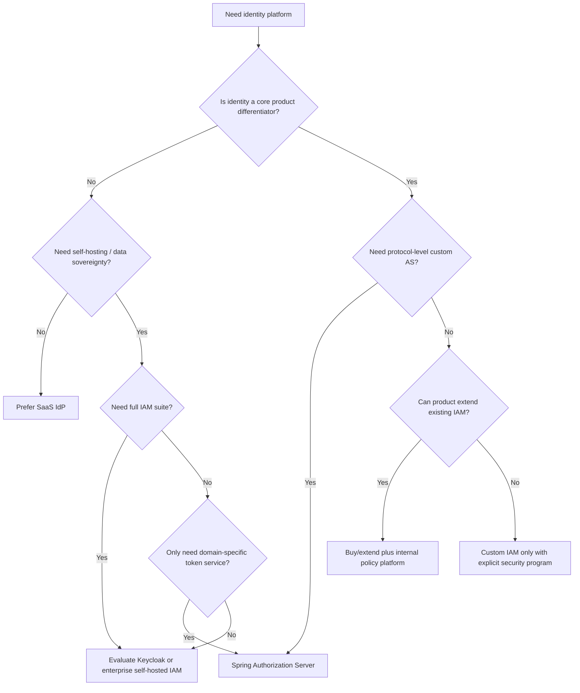
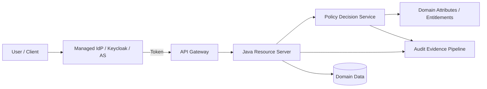
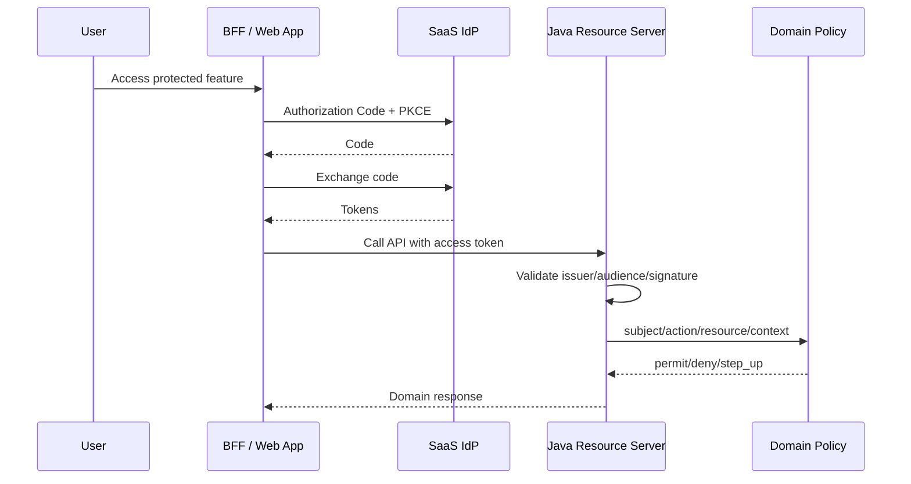
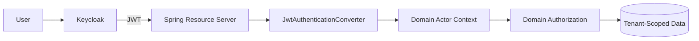
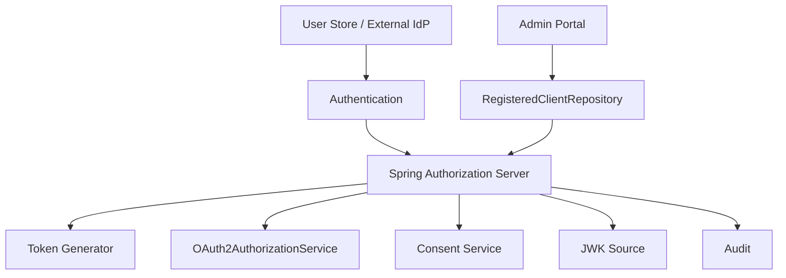

------
title: Learn Java Identity, Authentication & Authorization for Secure Enterprise API Platform - Part 025
description: Decision framework untuk memilih build, buy, extend, atau outsource identity platform dalam enterprise Java API platform.
series: learn-java-identity-authentication-authorization-api-platform
seriesTitle: Learn Java Identity, Authentication & Authorization for Secure Enterprise API Platform
order: 25
partTitle: Build vs Buy: Keycloak, SaaS IdP, Spring Authorization Server, Custom IAM
tags:
- java
- identity
- authentication
- authorization
- oauth
- oidc
- iam
- keycloak
- spring-authorization-server
- api-security
date: 2026-06-28
---

# Part 025 — Build vs Buy: Keycloak, SaaS IdP, Spring Authorization Server, Custom IAM

## 1. Problem Framing

Di part sebelumnya kita sudah membangun fondasi: identity domain model, OAuth/OIDC, token validation, Spring Security resource server, authorization model, multi-tenancy, delegation, workload identity, gateway boundary, dan Spring Authorization Server architecture.

Sekarang pertanyaan strategisnya muncul:

> Apakah enterprise Java platform perlu membangun identity platform sendiri, memakai IdP open-source seperti Keycloak, membeli SaaS IdP, memakai Spring Authorization Server, atau memisahkan antara authentication vendor dan authorization internal?

Jawaban buruk biasanya berupa preferensi teknologi:

- “Pakai Keycloak karena open source.”
- “Pakai Auth0/Okta/Azure AD karena enterprise.”
- “Build sendiri supaya fleksibel.”
- “Pakai Spring Authorization Server karena Java-native.”

Jawaban yang benar harus berbasis **risk ownership**.

Identity platform bukan sekadar login screen. Ia adalah sistem yang mengelola:

- Credential dan authenticator.
- Session dan token lifecycle.
- Federation trust.
- MFA dan recovery.
- Client registration.
- Consent dan delegation.
- Tenant isolation.
- Audit evidence.
- Access governance.
- Authorization decision context.
- Incident response ketika identity compromise terjadi.

Dalam regulated enterprise, IAM bukan fitur pendukung. IAM adalah **control plane** untuk trust.

---

## 2. Kaufman Skill Target

Skill target untuk part ini:

> Dalam 20–30 menit, kamu harus bisa memimpin design review dan menjelaskan pilihan build-vs-buy identity platform secara defensible: apa yang dibeli, apa yang dibangun, apa yang dikustomisasi, apa yang tidak boleh dibangun sendiri, dan risiko operasional apa yang tetap menjadi tanggung jawab tim.

Subskill yang dilatih:

1. Memetakan capability IAM.
2. Membedakan authentication platform, authorization platform, identity governance, dan API security platform.
3. Mengevaluasi Keycloak, SaaS IdP, Spring Authorization Server, dan custom IAM.
4. Menentukan risk ownership.
5. Membuat migration strategy yang tidak merusak login/token/authorization.
6. Menulis architecture decision record.
7. Menghindari anti-pattern “custom IAM because simple”.

---

## 3. Mental Model: Identity Platform Is a Control Plane

Aplikasi biasa menjawab:

> “Apa yang harus dilakukan sistem?”

Identity platform menjawab:

> “Siapa actor-nya, bagaimana kita tahu, seberapa kuat bukti trust-nya, apa yang boleh dilakukan, sampai kapan izin itu valid, dan bagaimana kita membuktikan keputusan itu setelah kejadian?”

Identity platform adalah gabungan dari beberapa plane:

| Plane | Tanggung Jawab | Contoh |
|---|---|---|
| Authentication plane | Membuktikan actor | Password, MFA, passkey, SSO, federation |
| Token plane | Menerbitkan credential runtime | Access token, refresh token, ID token, introspection |
| Client plane | Mengelola aplikasi pemakai IdP | Client registration, secret, redirect URI, grant policy |
| Authorization plane | Menentukan boleh/tidak | RBAC, ABAC, ReBAC, entitlement, policy decision |
| Federation plane | Trust antar organisasi/tenant | OIDC, SAML, identity brokering |
| Governance plane | Mengelola lifecycle akses | Joiner-mover-leaver, access review, SoD |
| Audit plane | Membuktikan kejadian dan keputusan | Login audit, token event, decision log, admin activity |
| Operations plane | Menjaga platform tetap aman | Patching, key rotation, backup, incident response |

Kesalahan arsitektur umum adalah membeli/membangun satu plane lalu menganggap semua plane sudah selesai.

Contoh:

- SaaS IdP menyelesaikan login, tetapi tidak otomatis menyelesaikan object-level authorization.
- Keycloak menyediakan banyak capability, tetapi tenant model dan policy governance tetap perlu didesain.
- Spring Authorization Server membantu membangun authorization server, tetapi bukan full IAM suite.
- Custom JWT issuer bisa menerbitkan token, tetapi belum tentu aman untuk recovery, revocation, federation, compliance, dan incident response.

---

## 4. Capability Map IAM Enterprise

Sebelum memilih produk, buat capability map.

```mermaid
flowchart TD
    A[Enterprise Identity Platform] --> B[Human Identity]
    A --> C[Machine Identity]
    A --> D[Authentication]
    A --> E[Token Service]
    A --> F[Federation]
    A --> G[Authorization]
    A --> H[Governance]
    A --> I[Audit & Evidence]
    A --> J[Operations]

    B --> B1[User profile]
    B --> B2[Account linking]
    B --> B3[Lifecycle]

    C --> C1[Service account]
    C --> C2[Client credentials]
    C --> C3[Workload identity]

    D --> D1[Password]
    D --> D2[MFA]
    D --> D3[Passkey]
    D --> D4[Risk-based auth]
    D --> D5[Recovery]

    E --> E1[Access token]
    E --> E2[Refresh token]
    E --> E3[Introspection]
    E --> E4[Revocation]
    E --> E5[Key rotation]

    F --> F1[OIDC]
    F --> F2[SAML]
    F --> F3[Identity brokering]

    G --> G1[Scope]
    G --> G2[Role]
    G --> G3[Policy]
    G --> G4[Object guard]

    H --> H1[Provisioning]
    H --> H2[Access review]
    H --> H3[Entitlement catalog]

    I --> I1[Login audit]
    I --> I2[Token audit]
    I --> I3[Authorization decision audit]

    J --> J1[Patching]
    J --> J2[HA]
    J --> J3[Backup]
    J --> J4[Incident response]
```



Prinsip penting:

> Jangan memilih platform berdasarkan feature list. Pilih berdasarkan capability ownership.

Capability ownership berarti:

- Siapa yang merancang?
- Siapa yang mengoperasikan?
- Siapa yang patch?
- Siapa yang menangani incident?
- Siapa yang bertanggung jawab di audit?
- Siapa yang memastikan tenant dan policy tidak bocor?

---

## 5. Option Landscape

Kita gunakan empat keluarga opsi utama.

### 5.1 SaaS IdP / Managed IAM

Contoh kategori:

- Enterprise IdP: Microsoft Entra ID, Okta, Ping, ForgeRock/Ping Identity, OneLogin class.
- Developer-friendly IdP: Auth0/Okta CIC, Cognito-like service, Clerk-like service untuk aplikasi tertentu.
- Cloud-native IAM: AWS Cognito, Google Cloud Identity Platform, Azure B2C/External ID class.

Kekuatan:

- Authentication, MFA, SSO, federation biasanya matang.
- Patching dan operational hardening sebagian besar dikelola vendor.
- Compliance artifact biasanya lebih siap.
- Identity threat intel dan anomaly detection lebih matang.
- Enterprise federation lebih mudah.
- SLA dan support tersedia.

Kelemahan:

- Authorization domain internal tetap harus dibangun.
- Custom flow kompleks bisa mahal atau sulit.
- Vendor lock-in tinggi.
- Tenant model vendor belum tentu cocok.
- Claim/token customization bisa menjadi brittle.
- Audit evidence bisa tersebar antara vendor log dan application log.
- Cost dapat naik drastis berdasarkan MAU, tenant, connection, token, atau advanced security feature.

Cocok ketika:

- Tim tidak ingin mengoperasikan login/MFA/recovery sendiri.
- Ada kebutuhan SSO enterprise yang luas.
- Compliance menuntut bukti vendor-managed control.
- Time-to-market penting.
- Identity bukan differentiating capability utama.

Tidak cocok ketika:

- Domain authorization sangat kompleks dan butuh kontrol penuh di PDP internal.
- Ada batas data residency/sovereignty yang tidak cocok.
- Ada kebutuhan protocol extension yang vendor tidak dukung.
- Biaya per user/client/tenant tidak sustainable.

### 5.2 Keycloak / Open-Source IAM Suite

Keycloak adalah IAM suite open-source yang menyediakan OIDC, SAML, user federation, identity brokering, authentication flow, role/client scope, admin console, dan authorization services.

Kekuatan:

- Fitur IAM sangat luas.
- Open-source, self-hosted, extensible.
- Mendukung OIDC/SAML/federation/brokering.
- Cocok untuk internal platform dan regulated deployment yang butuh kontrol infrastructure.
- Bisa dijalankan di Kubernetes dan diintegrasikan dengan Java/Spring resource server.

Kelemahan:

- Self-hosted berarti operational burden nyata.
- Upgrade/migration perlu disiplin.
- Custom SPI dapat menjadi technical debt.
- Realm/tenant design mudah salah.
- Policy model bawaan belum tentu cukup untuk domain authorization kompleks.
- HA, backup, database, cache, key rotation, event log, admin security tetap tanggung jawab tim.

Cocok ketika:

- Perusahaan ingin self-hosted IAM dengan feature lengkap.
- Ada kebutuhan SAML/OIDC federation dan identity brokering.
- Ada platform team yang sanggup mengoperasikan IAM.
- Customization diperlukan, tetapi tidak sampai membangun semua dari nol.

Tidak cocok ketika:

- Tim tidak punya kapasitas operasi identity 24/7.
- Security patch management lemah.
- Semua requirement sebenarnya sederhana dan SaaS cukup.
- Tim berniat mengubah Keycloak terlalu dalam sampai menjadi fork tersembunyi.

### 5.3 Spring Authorization Server / Java-Native Authorization Server

Spring Authorization Server adalah framework untuk membangun OAuth2/OIDC Authorization Server dalam ekosistem Spring.

Ia bukan “IAM product lengkap”. Ia adalah building block untuk authorization server.

Kekuatan:

- Java/Spring-native.
- Sangat fleksibel untuk domain-specific token, client policy, consent, grant extension, custom claim, dan integration.
- Cocok bila tim perlu membuat AS yang sangat dekat dengan domain enterprise.
- Integrasi bagus dengan Spring Security ecosystem.

Kelemahan:

- Banyak capability IAM harus dibangun sendiri.
- Admin UI, user lifecycle, federation management, MFA UX, recovery, governance, dan operations bukan selesai otomatis.
- Butuh pemahaman OAuth/OIDC mendalam.
- Kesalahan desain bisa menghasilkan IdP yang tidak aman.
- Upgrade path perlu dipantau, terutama karena proyek ini bergerak lebih dekat ke Spring Security 7 lineage.

Cocok ketika:

- Kamu butuh authorization server embedded/domain-specific.
- OAuth/OIDC capability adalah bagian dari platform product.
- Tim punya maturity security engineering tinggi.
- Requirement tidak cocok dengan Keycloak/SaaS tetapi masih ingin memakai standar OAuth/OIDC.

Tidak cocok ketika:

- Tujuan hanya “punya login”.
- Tim belum matang di OAuth threat model.
- Tidak ada kapasitas membangun admin UX, lifecycle, recovery, audit, dan operations.
- Perusahaan membutuhkan enterprise IAM suite cepat.

### 5.4 Fully Custom IAM

Maksudnya membangun sendiri:

- User store.
- Password/MFA/recovery.
- OAuth/OIDC endpoints.
- Token issuance.
- Client registration.
- Session lifecycle.
- Federation.
- Authorization.
- Admin UI.
- Audit.

Kekuatan:

- Kontrol penuh.
- Bisa sangat domain-specific.
- Tidak ada vendor lock-in langsung.

Kelemahan:

- Hampir selalu overreach.
- Security risk sangat tinggi.
- Compliance burden berat.
- Protocol correctness sulit.
- Maintenance jangka panjang mahal.
- Banyak edge cases yang tidak terlihat sampai incident.

Cocok hanya ketika:

- Identity adalah core product differentiator.
- Tim security/protocol/operations sangat matang.
- Ada requirement ekstrem yang tidak bisa dipenuhi produk/framework.
- Ada budget multi-year untuk membangun dan mengaudit.

Untuk mayoritas enterprise API platform:

> Jangan membangun full IAM dari nol.

Bangun hanya bagian yang memang domain-specific:

- Authorization policy domain.
- Entitlement catalog.
- Resource-level decision service.
- Audit/evidence pipeline.
- Integration layer.
- Tenant-aware mapping.

---

## 6. Decision Matrix

Gunakan matrix berikut sebagai starting point.

| Kriteria | SaaS IdP | Keycloak | Spring Authorization Server | Custom IAM |
|---|---:|---:|---:|---:|
| Time-to-market | Tinggi | Sedang | Rendah-sedang | Rendah |
| Operational burden | Rendah | Tinggi | Tinggi | Sangat tinggi |
| Authentication maturity | Tinggi | Tinggi-sedang | Tergantung implementasi | Tergantung tim |
| Federation enterprise | Tinggi | Tinggi | Harus dibangun | Harus dibangun |
| Custom OAuth behavior | Sedang | Sedang-tinggi | Tinggi | Tinggi |
| Domain authorization | Perlu app-side | Perlu app-side | Bisa sangat custom | Bisa sangat custom |
| Governance/IAG | Vendor-dependent | Terbatas/perlu ekstensi | Harus dibangun | Harus dibangun |
| Cost predictability | Vendor-dependent | Infra+ops | Engineering+ops | Engineering+ops besar |
| Compliance evidence | Vendor membantu | Tim sendiri | Tim sendiri | Tim sendiri |
| Protocol risk | Rendah-sedang | Sedang | Tinggi bila tim lemah | Sangat tinggi |
| Lock-in | Tinggi | Sedang | Rendah-sedang | Rendah teknologi, tinggi maintenance |

Interpretasi:

- **SaaS IdP** membeli operational maturity.
- **Keycloak** membeli feature breadth dengan operational responsibility internal.
- **Spring Authorization Server** membeli framework flexibility, bukan IAM suite.
- **Custom IAM** membeli kontrol penuh dengan risiko penuh.

---

## 7. Decision Tree



Default recommendation for most enterprise Java platforms:

```text
Use a mature IdP for authentication/federation/token issuance.
Build domain authorization, entitlement governance, tenant mapping, and audit evidence internally.
Avoid custom authentication and custom OAuth protocol implementation unless identity is the product.
```

---

## 8. The Split-Brain Design: Buy Authentication, Build Authorization

A strong architecture often separates:

- Authentication and federation: external/managed IdP.
- Token validation: resource server.
- Domain authorization: internal policy/domain service.
- Entitlement governance: internal platform or IGA integration.
- Audit evidence: internal canonical event model.



This is often better than trying to force all authorization into IdP roles/scopes.

Why?

Because IdP knows identity facts:

- subject
- tenant
- client
- authentication strength
- federation source
- groups/roles at coarse level

But application domain knows resource facts:

- case status
- account owner
- investigation assignment
- data classification
- region
- regulatory hold
- conflict of interest
- time-limited access
- business workflow state

Object-level authorization cannot be solved by static IdP claims alone.

---

## 9. Capability Ownership Checklist

For every capability, assign owner explicitly.

| Capability | Owner | Notes |
|---|---|---|
| Password policy | IdP/security team | Usually buy/use mature IdP |
| MFA enrollment | IdP/security team | Include recovery risk |
| Passkey/WebAuthn | IdP/security team | UX and recovery matter |
| User lifecycle | HR/IAM/platform | Joiner-mover-leaver |
| Client registration | Platform/security | Treat clients as privileged entities |
| Token signing keys | IdP/platform | Rotation, HSM/KMS, emergency revoke |
| Access token claims | IdP + API platform | Avoid claim bloat |
| Scope taxonomy | API platform | Stable resource semantics |
| Domain entitlements | Domain platform | Must align with business rules |
| Object-level checks | Application team | Cannot outsource fully |
| Policy engine | Platform/domain | Central/local hybrid possible |
| Audit schema | Security/platform | Canonical event model |
| SIEM integration | Security operations | Include correlation IDs |
| Incident response | Security/platform | Token compromise runbooks |
| Compliance evidence | GRC/security/platform | Evidence must be retrievable |

If nobody owns a row, the architecture has a hidden risk.

---

## 10. SaaS IdP Architecture Pattern

### 10.1 Baseline Pattern



### 10.2 What SaaS IdP Should Handle

- Authentication UX.
- MFA/passkey support.
- Federation with enterprise directories.
- OIDC/OAuth standards.
- Token issuance.
- Session management.
- IdP audit logs.
- Account recovery controls.
- Bot/anomaly protection if licensed.

### 10.3 What Your Java Platform Still Handles

- Resource server validation.
- Audience/issuer restrictions.
- Claim-to-principal mapping.
- Domain authorization.
- Tenant isolation.
- API audit.
- Entitlement catalog.
- Data-layer authorization.
- Incident correlation.

### 10.4 Common SaaS Mistake

Bad design:

```text
Vendor role claim says "ADMIN".
API allows all admin actions.
```

Better design:

```text
Vendor provides coarse identity and assurance claims.
Java API evaluates domain-specific authorization per resource/action/context.
```

Example:

```java
public Decision canApproveCase(Actor actor, CaseRecord record) {
    if (!actor.hasAuthority("case.approver")) return Decision.deny("missing_capability");
    if (!actor.tenantId().equals(record.tenantId())) return Decision.deny("tenant_mismatch");
    if (record.status() != CaseStatus.PENDING_APPROVAL) return Decision.deny("invalid_status");
    if (record.createdBy().equals(actor.subject())) return Decision.deny("segregation_of_duties");
    if (!actor.assurance().atLeast(AuthenticationLevel.AAL2)) return Decision.stepUp("aal2_required");
    return Decision.permit();
}
```

---

## 11. Keycloak Architecture Pattern

### 11.1 Realm Design

Keycloak realm is a major boundary. Do not treat it as a casual grouping.

Common strategies:

| Strategy | Use Case | Risk |
|---|---|---|
| Realm per environment | dev/test/prod separation | Normal baseline |
| Realm per tenant | Strong tenant isolation | Operational overhead |
| Single realm multi-tenant | Many tenants, shared policy | Tenant escape risk if claim mapping weak |
| Realm per product | Product-specific identity | Cross-product SSO complexity |

For enterprise SaaS platforms, realm-per-tenant sounds attractive but can become operationally expensive. Single realm with tenant-aware claims can scale better, but requires extremely disciplined tenant scoping.

### 11.2 Keycloak with Java Resource Server



Resource server responsibilities remain:

- Validate issuer.
- Validate audience.
- Validate signature.
- Map roles/scopes carefully.
- Check tenant claim.
- Enforce object authorization.

### 11.3 Avoid Keycloak Role Dumping

Bad:

```text
Put every business permission into Keycloak roles.
Let every API trust realm_access.roles directly.
```

Problems:

- Role explosion.
- Domain coupling to IAM admin UI.
- Hard migration.
- Stale token permissions.
- Difficult SoD and resource-specific rules.

Better:

- Use Keycloak for coarse platform roles and authentication/federation.
- Use internal entitlement/policy service for domain-specific authorization.
- Keep token claims small and stable.

Example claim mapping:

```json
{
  "iss": "https://id.example.com/realms/platform",
  "sub": "user-123",
  "aud": "case-api",
  "tenant_id": "tenant-a",
  "scope": "case.read case.write",
  "platform_roles": ["employee", "case_worker"],
  "aal": "aal2"
}
```

Do not encode every resource permission in token:

```json
{
  "permissions": [
    "case:123:read",
    "case:124:read",
    "case:125:approve"
  ]
}
```

That model becomes stale, huge, privacy-sensitive, and hard to revoke.

---

## 12. Spring Authorization Server Architecture Pattern

Spring Authorization Server is a framework, not a turnkey IAM product.

Use it when the authorization server itself is part of your platform domain.

Example cases:

- Internal developer platform issuing tokens to internal services.
- API marketplace with domain-specific client onboarding.
- Regulated platform that requires custom consent and authorization flows.
- Embedded OAuth/OIDC server for a product where external IdP cannot satisfy requirements.

### 12.1 Boundary



### 12.2 What You Must Build Around It

- User/admin UI.
- Client onboarding workflow.
- Client risk classification.
- Secret/key rotation UI.
- Consent UX.
- Federation if needed.
- MFA/recovery if local users exist.
- Audit event pipeline.
- HA persistence.
- Security operations.
- Conformance testing.

### 12.3 Strong Use Case: Domain-Specific Client Policy

Example:

```java
public final class ClientRiskPolicy {
    public ClientSecurityProfile classify(RegisteredClient client) {
        boolean highValueApi = client.getScopes().contains("payment.write")
                || client.getScopes().contains("case.enforcement.modify");

        if (highValueApi) {
            return ClientSecurityProfile.builder()
                    .requirePkce(true)
                    .requirePar(true)
                    .requirePrivateKeyJwt(true)
                    .requireSenderConstrainedToken(true)
                    .maxAccessTokenTtl(Duration.ofMinutes(5))
                    .build();
        }

        return ClientSecurityProfile.standard();
    }
}
```

This kind of policy is hard to force into a generic IdP if your domain has unique risk categories.

---

## 13. Custom IAM: What You May Build vs Must Not Build

### 13.1 Usually Do Not Build

Avoid custom implementation of:

- Password hashing/authenticator lifecycle unless unavoidable.
- MFA protocol handling.
- WebAuthn/passkey internals.
- OAuth/OIDC protocol endpoints from scratch.
- Token signing without mature JOSE libraries.
- Federation protocol from scratch.
- Account recovery logic without security review.
- Session management framework from scratch.

### 13.2 Reasonable to Build

It is often reasonable to build:

- Domain policy engine wrapper.
- Entitlement catalog.
- Tenant-aware principal mapping.
- Access request workflow.
- Approval/SoD rules.
- Audit normalization service.
- Authorization matrix test harness.
- Migration adapter between old identity source and new IdP.

### 13.3 Custom Boundary Rule

```text
Build what expresses your domain.
Buy or reuse what implements security protocols and authenticator lifecycle.
```

---

## 14. Integration Anti-Corruption Layer

Never let raw IdP-specific claims leak everywhere.

Bad:

```java
String userId = jwt.getClaimAsString("https://vendor.example.com/user_id");
List<String> roles = jwt.getClaimAsStringList("realm_access.roles");
```

scattered across controllers/services.

Better:

```java
public record Actor(
        SubjectId subject,
        TenantId tenant,
        ClientId client,
        Set<Authority> authorities,
        Assurance assurance,
        FederationSource federationSource,
        Instant authenticatedAt
) {}
```

Central mapper:

```java
@Component
public final class JwtActorMapper {

    public Actor toActor(Jwt jwt) {
        return new Actor(
                new SubjectId(required(jwt, "sub")),
                new TenantId(required(jwt, "tenant_id")),
                new ClientId(required(jwt, "azp")),
                mapAuthorities(jwt),
                mapAssurance(jwt),
                mapFederation(jwt),
                jwt.getClaimAsInstant("auth_time")
        );
    }

    private static String required(Jwt jwt, String claim) {
        String value = jwt.getClaimAsString(claim);
        if (value == null || value.isBlank()) {
            throw new InvalidIdentityClaimException("Missing claim: " + claim);
        }
        return value;
    }
}
```

Benefits:

- IdP replacement becomes possible.
- Claim changes are localized.
- Tests become cleaner.
- Domain code speaks domain vocabulary.
- Audit schema stays stable.

---

## 15. Migration Strategy

Identity migration is high risk because broken migration can lock out users or silently widen access.

### 15.1 Migration Dimensions

| Dimension | Questions |
|---|---|
| User identity | Are subject IDs stable? Are accounts linked? |
| Credentials | Are passwords migrated, reset, or federated? |
| MFA | Are enrolled factors portable? |
| Sessions | Are existing sessions invalidated? |
| Clients | Are client IDs/secrets rotated? |
| Tokens | Are issuers/audiences changed? |
| Roles | Are claims changed? |
| Authorization | Are entitlements remapped? |
| Audit | Can old and new actor IDs be correlated? |
| Rollback | Can system revert without identity split-brain? |

### 15.2 Subject ID Invariant

The most important migration invariant:

```text
Do not use mutable identifiers as the canonical subject.
```

Bad canonical subject:

- email
- username
- display name
- external directory DN

Better:

- immutable internal subject ID
- stable external subject mapping table

```sql
CREATE TABLE identity_subject_link (
    internal_subject_id UUID NOT NULL,
    provider TEXT NOT NULL,
    provider_issuer TEXT NOT NULL,
    provider_subject TEXT NOT NULL,
    linked_at TIMESTAMP NOT NULL,
    status TEXT NOT NULL,
    PRIMARY KEY (provider, provider_issuer, provider_subject),
    UNIQUE (internal_subject_id, provider)
);
```

### 15.3 Dual-Issuer Resource Server Migration

During migration, resource servers may need to trust old and new issuers temporarily.

Risk:

- Old issuer and new issuer may use different subject format.
- Claim mapping may differ.
- Token lifetime may overlap.
- Tenant mapping may differ.

Mitigation:

```java
public Actor map(Jwt jwt) {
    String issuer = jwt.getIssuer().toString();

    if (issuer.equals("https://old-idp.example.com")) {
        return oldIssuerMapper.toActor(jwt);
    }

    if (issuer.equals("https://new-idp.example.com")) {
        return newIssuerMapper.toActor(jwt);
    }

    throw new BadCredentialsException("Untrusted issuer");
}
```

Migration exit rule:

```text
Temporary dual issuer support must have an explicit removal date and dashboard.
```

---

## 16. Architecture Decision Record Template

Use this ADR format.

```mdx
# ADR: Identity Platform Strategy

## Status
Accepted / Proposed / Superseded

## Context
- Current identity architecture
- Business/regulatory drivers
- Tenant model
- User population
- Machine client population
- API risk level
- Operational constraints

## Decision
We will use <option> for <capability> and build <capability> internally.

## Capability Ownership
| Capability | Owner | Platform |
|---|---|---|
| Authentication | ... | ... |
| Federation | ... | ... |
| Token issuance | ... | ... |
| Domain authorization | ... | ... |
| Audit evidence | ... | ... |

## Alternatives Considered
- SaaS IdP
- Keycloak
- Spring Authorization Server
- Custom IAM

## Decision Drivers
- Security risk
- Regulatory evidence
- Time-to-market
- Operational maturity
- Cost
- Extensibility
- Migration risk

## Consequences
### Positive
...

### Negative
...

### Risks
...

### Mitigations
...

## Exit Criteria / Review Date
...
```

---

## 17. Production Readiness Checklist

Before going production, answer these.

### 17.1 Authentication

- [ ] Is MFA/step-up requirement defined by risk tier?
- [ ] Is account recovery protected against takeover?
- [ ] Are login failures anti-enumeration safe?
- [ ] Are admin users protected by stronger controls?

### 17.2 Token

- [ ] Are issuers explicit?
- [ ] Are audiences explicit?
- [ ] Are signing keys rotated?
- [ ] Is emergency key compromise handled?
- [ ] Are token TTLs risk-based?
- [ ] Are refresh tokens rotated or otherwise protected?

### 17.3 Client

- [ ] Are redirect URIs exact-match?
- [ ] Are public/confidential clients separated?
- [ ] Are client secrets rotated?
- [ ] Are high-risk clients using stronger client authentication?
- [ ] Are unused clients disabled?

### 17.4 Authorization

- [ ] Is object-level authorization enforced in service/domain layer?
- [ ] Are list/search/export/count endpoints scoped?
- [ ] Are admin actions separately authorized?
- [ ] Is SoD represented where needed?
- [ ] Are stale claims handled?

### 17.5 Tenant

- [ ] Is tenant resolved from trusted source?
- [ ] Is tenant claim validated against issuer/client context?
- [ ] Are cache keys tenant-scoped?
- [ ] Are async jobs tenant-scoped?
- [ ] Are audit events tenant-scoped?

### 17.6 Audit

- [ ] Are login events captured?
- [ ] Are token events captured?
- [ ] Are authorization decisions captured for sensitive actions?
- [ ] Are admin changes captured?
- [ ] Can audit correlate subject/client/tenant/request/resource/decision?

### 17.7 Operations

- [ ] Who patches the IdP?
- [ ] Who handles incident response?
- [ ] Is backup/restore tested?
- [ ] Is HA tested?
- [ ] Are conformance/security tests automated?

---

## 18. Failure Modes

### 18.1 Vendor Solves Login, Team Forgets Authorization

Symptom:

- Login works.
- Token valid.
- But users can access other users' objects.

Root cause:

- Confusing authentication with authorization.

Fix:

- Add domain authorization boundary.
- Test BOLA/IDOR cases.
- Never rely on token validity alone.

### 18.2 Keycloak Becomes a Dumping Ground

Symptom:

- Thousands of roles.
- Role names encode business object IDs.
- Token grows huge.
- Every team creates client scopes differently.

Root cause:

- No entitlement governance.

Fix:

- Keep IdP claims coarse.
- Move domain policy to internal authorization platform.
- Define role/scope taxonomy.

### 18.3 Spring Authorization Server Used as Turnkey IAM

Symptom:

- OAuth endpoint exists.
- But no admin lifecycle, no client governance, weak recovery, no audit model.

Root cause:

- Treating framework as product.

Fix:

- Build surrounding IAM capabilities or use Keycloak/SaaS.

### 18.4 Custom IAM Becomes Security Liability

Symptom:

- Password recovery has bypass.
- Redirect validation weak.
- Token revocation inconsistent.
- Federation claim mapping unsafe.

Root cause:

- Underestimating protocol and lifecycle complexity.

Fix:

- Migrate to mature IdP/framework.
- Reduce custom surface.
- External security review.

---

## 19. Practice Drill

You are designing identity for a regulated case management API platform.

Requirements:

- 50 enterprise tenants.
- Each tenant has its own IdP.
- Internal support team can access tenant cases only with approval.
- Machine clients ingest documents.
- Some APIs modify enforcement state and require step-up authentication.
- Audit must show who acted, on whose behalf, under which approval, and why access was allowed.

Task:

1. Choose SaaS IdP, Keycloak, Spring Authorization Server, or hybrid.
2. Decide which capabilities are bought vs built.
3. Define token claims.
4. Define tenant mapping.
5. Define authorization boundary.
6. Define audit schema.
7. Identify top five failure modes.

Expected senior answer:

- Do not build full IAM.
- Use mature IdP/federation layer for human authentication.
- Build internal domain authorization and support-access workflow.
- Use service identity for machine ingestion.
- Keep token claims coarse.
- Enforce object-level authorization in Java services and data access.
- Produce audit events with actor, subject, tenant, client, resource, action, decision, approval reference, and assurance level.

---

## 20. Key Takeaways

1. Identity platform choice is a risk ownership decision, not a framework preference.
2. SaaS IdP buys operational maturity but does not solve domain authorization.
3. Keycloak gives broad IAM capability but requires serious platform operations.
4. Spring Authorization Server is a framework for building an authorization server, not a full IAM suite.
5. Full custom IAM is rarely justified.
6. Buy/reuse authentication and federation when possible.
7. Build domain authorization, entitlement governance, tenant mapping, and audit evidence where they encode your business.
8. Keep token claims stable, minimal, and coarse.
9. Never let vendor-specific claims leak across domain code.
10. Every build-vs-buy decision must name who owns patching, incident response, audit, migration, and correctness.

---

## References

- OAuth 2.0 Security Best Current Practice, RFC 9700.
- OpenID Connect Core 1.0.
- Spring Authorization Server reference documentation.
- Spring Security OAuth2 Resource Server reference documentation.
- Keycloak documentation: Authorization Services, Server Administration, Identity Brokering.
- OWASP API Security Top 10 2023.
- NIST SP 800-63-4 Digital Identity Guidelines.
