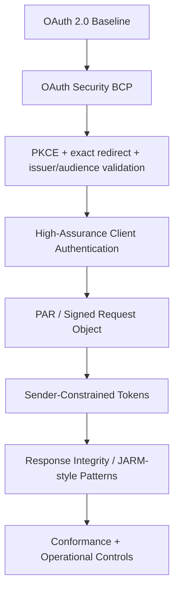
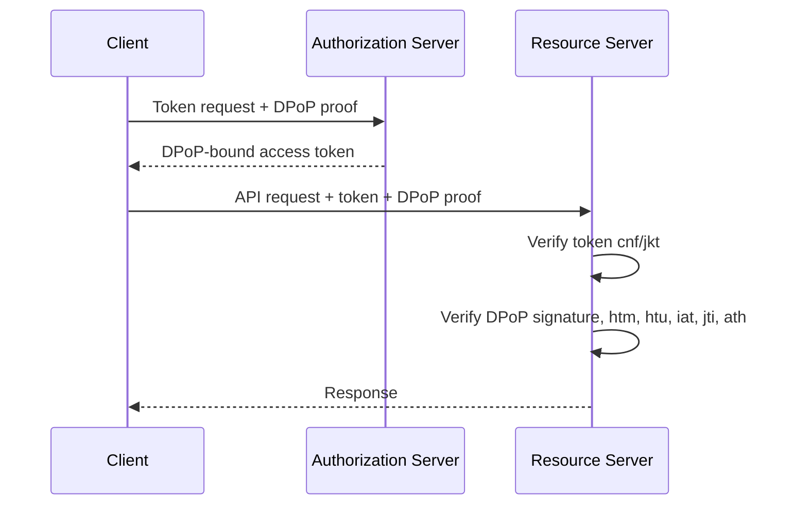
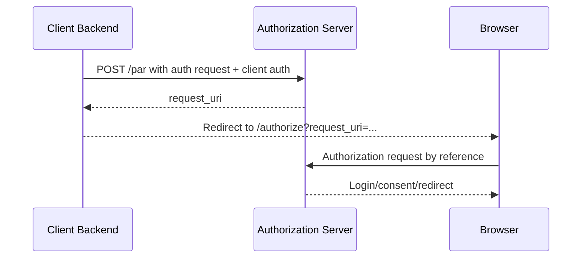
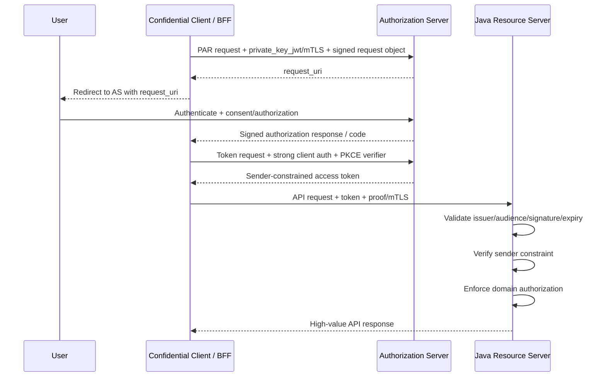
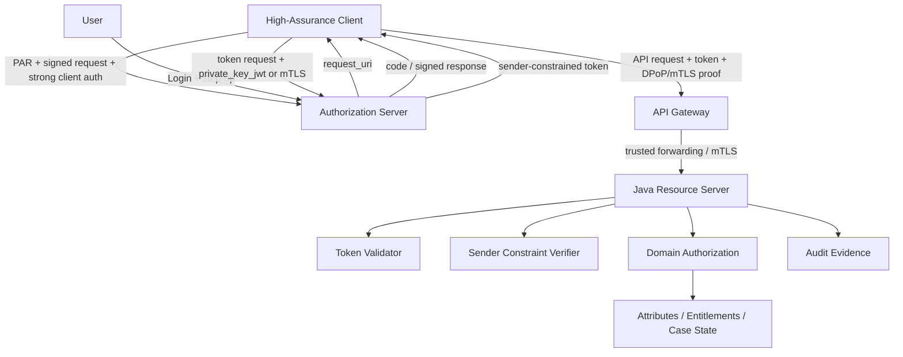

------
title: Learn Java Identity, Authentication & Authorization for Secure Enterprise API Platform - Part 026
description: FAPI-grade high-assurance API security untuk Java enterprise API platform: PAR, JAR/JARM, sender-constrained tokens, DPoP, mTLS, client authentication, dan hardened OAuth profile.
series: learn-java-identity-authentication-authorization-api-platform
seriesTitle: Learn Java Identity, Authentication & Authorization for Secure Enterprise API Platform
order: 26
partTitle: FAPI-Grade High-Assurance API Security
tags:
- java
- identity
- authentication
- authorization
- oauth
- oidc
- fapi
- dpop
- mtls
- api-security
date: 2026-06-28
---

# Part 026 — FAPI-Grade High-Assurance API Security

## 1. Problem Framing

OAuth/OIDC yang “valid” belum tentu cukup untuk API bernilai tinggi.

API biasa mungkin hanya membaca profil pengguna. API high-assurance bisa melakukan:

- Payment initiation.
- Enforcement decision modification.
- Regulatory case escalation.
- Health record disclosure.
- Customer financial data access.
- Privileged administration.
- Cross-tenant data exchange.
- Legal hold or evidence modification.

Untuk API seperti ini, threat model lebih kuat:

- Authorization request tampering.
- Redirect interception.
- Code injection/substitution.
- Token replay.
- Client impersonation.
- Mix-up attack.
- Consent manipulation.
- Request parameter pollution.
- Phishing via malicious client.
- Compromised browser/device/network.
- Stolen bearer token.

FAPI — Financial-grade API — adalah profil keamanan OAuth/OIDC untuk skenario high-security. Walaupun namanya berasal dari financial API/open banking, mental model-nya berguna untuk semua API enterprise bernilai tinggi.

Target part ini bukan menghafal semua detail spesifikasi, tetapi memahami:

> Mekanisme apa yang ditambahkan FAPI-style architecture di atas OAuth dasar, ancaman apa yang dikurangi, dan bagaimana Java API platform harus mendesain resource server, authorization server, client onboarding, token binding, dan testing agar high-assurance.

---

## 2. Kaufman Skill Target

Setelah part ini, kamu harus bisa:

1. Menjelaskan kenapa OAuth Authorization Code + PKCE saja belum selalu cukup.
2. Membedakan baseline OAuth security vs FAPI-grade hardening.
3. Menentukan kapan API membutuhkan PAR, signed request object, JARM, DPoP, mTLS, private_key_jwt, short-lived tokens, atau sender-constrained tokens.
4. Mendesain security profile per API risk tier.
5. Mengimplementasikan resource server checks di Java/Spring.
6. Membuat conformance-style test plan.
7. Menghindari cargo-cult FAPI: memasang fitur tanpa memahami threat yang dikurangi.

---

## 3. Baseline OAuth vs High-Assurance OAuth

Baseline OAuth modern untuk browser/user-facing client:

- Authorization Code Flow.
- PKCE.
- Exact redirect URI validation.
- State parameter.
- Nonce for OIDC.
- TLS.
- Issuer validation.
- Audience validation.
- Short-lived access token.
- Refresh token rotation where applicable.
- Secure client authentication for confidential clients.

High-assurance OAuth adds stronger guarantees around:

- Request integrity.
- Client authentication.
- Token replay resistance.
- Response integrity.
- Authorization server interaction hardening.
- Explicit request registration.
- Non-repudiation or message signing where required.
- Conformance testing.

Think in layers.



---

## 4. FAPI Mental Model

FAPI-style design asks:

1. Can an attacker tamper with the authorization request?
2. Can an attacker trick the client about which AS issued the response?
3. Can an attacker replay a stolen access token?
4. Can an attacker impersonate a client?
5. Can a malicious client obtain broader consent than intended?
6. Can resource server verify token was issued for this API and this client context?
7. Can logs prove the interaction later?

The answer cannot be “we use JWT”.

JWT solves only one part: structured signed claims. High-assurance API security needs end-to-end protocol constraints.

---

## 5. Risk Tiering for API Security Profiles

Do not apply maximum security everywhere by default. It can break UX, increase complexity, and produce fake confidence.

Define risk tiers.

| Tier | Example | Baseline |
|---|---|---|
| Tier 0 — Public | Public catalog, health endpoint | No user token, rate limit, abuse control |
| Tier 1 — Low-risk user API | Profile read, preferences | OAuth/OIDC baseline, PKCE, JWT/opaque validation |
| Tier 2 — Sensitive read | Financial/health/case data read | Strong auth, short token TTL, explicit audience, audit |
| Tier 3 — Sensitive write | Payment, enforcement update, evidence mutation | Step-up auth, strong client auth, replay resistance, decision audit |
| Tier 4 — Ecosystem/high-value API | Open banking, partner API, regulator API | FAPI-style profile, PAR, signed request, sender-constrained token, conformance |

Example Java enum:

```java
public enum ApiRiskTier {
    PUBLIC,
    LOW_USER,
    SENSITIVE_READ,
    SENSITIVE_WRITE,
    HIGH_VALUE_ECOSYSTEM
}
```

Security profile:

```java
public record ApiSecurityProfile(
        ApiRiskTier tier,
        boolean requireStepUp,
        boolean requirePrivateKeyJwt,
        boolean requirePar,
        boolean requireSignedRequestObject,
        boolean requireSenderConstrainedToken,
        Duration accessTokenTtl,
        boolean requireDecisionAudit
) {}
```

Policy example:

```java
public final class SecurityProfileCatalog {

    public ApiSecurityProfile forAction(String action) {
        return switch (action) {
            case "case.read" -> new ApiSecurityProfile(
                    ApiRiskTier.SENSITIVE_READ,
                    false,
                    false,
                    false,
                    false,
                    false,
                    Duration.ofMinutes(10),
                    true
            );
            case "case.enforcement.modify" -> new ApiSecurityProfile(
                    ApiRiskTier.SENSITIVE_WRITE,
                    true,
                    true,
                    true,
                    true,
                    true,
                    Duration.ofMinutes(5),
                    true
            );
            default -> throw new IllegalArgumentException("Unknown action: " + action);
        };
    }
}
```

---

## 6. Mechanism 1: Strong Client Authentication

OAuth client authentication answers:

> Is this really the registered client?

Weak client authentication:

- Shared client secret in frontend/mobile app.
- Long-lived static secret with no rotation.
- Secret copied across environments.
- Basic auth with low entropy secret.

Stronger options:

- `private_key_jwt` client authentication.
- Mutual TLS client authentication.
- Certificate-bound tokens.
- Hardware-backed keys for high-risk clients.

### 6.1 private_key_jwt

Client signs a JWT assertion using its private key. AS validates using registered public key/JWKS.

Benefits:

- No shared symmetric secret.
- Supports key rotation.
- Better for partner/client onboarding.
- Easier to bind client identity to cryptographic proof.

Key claims commonly include:

- `iss`: client_id.
- `sub`: client_id.
- `aud`: token endpoint.
- `jti`: unique assertion ID.
- `exp`: short expiry.
- `iat`: issued time.

Conceptual client assertion:

```json
{
  "iss": "partner-client-123",
  "sub": "partner-client-123",
  "aud": "https://auth.example.com/oauth2/token",
  "jti": "8e9f...",
  "iat": 1782630000,
  "exp": 1782630300
}
```

AS invariant:

```text
Client assertion must be signed by a key registered to that client and must not be replayed.
```

### 6.2 mTLS Client Authentication

With mTLS, the client proves possession of a private key corresponding to a certificate during TLS handshake.

Benefits:

- Strong client authentication.
- Can support certificate-bound access tokens.
- Useful for server-to-server and regulated partner APIs.

Risks:

- Certificate lifecycle is operationally heavy.
- Proxy/load balancer termination can break proof propagation.
- Need strict trust store and certificate mapping.
- Certificate rotation must be tested.

---

## 7. Mechanism 2: Sender-Constrained Tokens

Bearer token model:

```text
Whoever possesses the token can use it.
```

Sender-constrained token model:

```text
Token can only be used by the party that proves possession of a bound key/certificate.
```

This reduces token replay impact.

Two major approaches:

1. mTLS-bound access tokens.
2. DPoP-bound access tokens.

---

## 8. mTLS-Bound Access Tokens

In mTLS-bound token model:

- Client authenticates with certificate.
- AS includes certificate confirmation in token, often via `cnf` claim.
- Resource server verifies incoming TLS client certificate matches token binding.

Conceptual JWT access token:

```json
{
  "iss": "https://auth.example.com",
  "sub": "service-account-123",
  "aud": "case-api",
  "client_id": "partner-client-123",
  "scope": "case.write",
  "cnf": {
    "x5t#S256": "base64url-encoded-cert-thumbprint"
  },
  "exp": 1782630300
}
```

Resource server invariant:

```text
If token contains certificate confirmation, request must arrive with matching validated client certificate.
```

Pseudo-code:

```java
public final class MtlsTokenBindingVerifier {

    public void verify(Jwt jwt, X509Certificate peerCertificate) {
        String expected = jwt.getClaimAsMap("cnf") == null
                ? null
                : (String) jwt.getClaimAsMap("cnf").get("x5t#S256");

        if (expected == null) {
            throw new AccessDeniedException("Token is not certificate-bound");
        }

        String actual = CertificateThumbprints.sha256(peerCertificate);
        if (!MessageDigest.isEqual(expected.getBytes(StandardCharsets.UTF_8),
                                   actual.getBytes(StandardCharsets.UTF_8))) {
            throw new AccessDeniedException("mTLS token binding mismatch");
        }
    }
}
```

Production detail:

If TLS terminates at gateway, the resource server must receive certificate proof through a trusted, integrity-protected channel. Do not trust arbitrary `X-Client-Cert` headers from the internet.

---

## 9. DPoP: Demonstrating Proof-of-Possession

DPoP is an application-layer proof-of-possession mechanism.

High-level flow:

1. Client generates key pair.
2. Client sends DPoP proof JWT with request.
3. AS binds access token to DPoP public key.
4. Client sends DPoP proof to resource server with access token.
5. Resource server verifies proof, method, URL, timestamp, replay, and token hash.



DPoP proof fields include concepts like:

- HTTP method.
- HTTP URI.
- issued-at time.
- unique proof ID.
- access token hash when used at resource server.

Resource server checks:

```text
- DPoP header is present for DPoP-bound token.
- DPoP proof signature validates.
- Public key thumbprint matches token confirmation claim.
- htm matches actual HTTP method.
- htu matches actual target URI after trusted normalization.
- iat is recent.
- jti has not been replayed.
- ath matches access token hash if required.
```

Java implementation note:

Spring Security may not provide full FAPI/DPoP enforcement out of the box for every deployment pattern. Treat DPoP verification as a security component requiring careful library selection, gateway consistency, replay cache, and test coverage.

---

## 10. Mechanism 3: PAR — Pushed Authorization Requests

In baseline OAuth, client redirects browser to authorization endpoint with request parameters:

```text
GET /authorize?client_id=...&scope=...&redirect_uri=...&state=...
```

Problem:

- Request parameters travel through browser.
- Long URLs.
- Tampering risk if client/request integrity is weak.
- Sensitive authorization details may leak in logs/history.

PAR changes the flow:

1. Client sends authorization request directly to AS back-channel.
2. AS returns `request_uri`.
3. Browser redirect carries only reference.
4. AS uses stored pushed request.



Security benefits:

- Authorization request integrity.
- Stronger client authentication before request is accepted.
- Less browser-visible sensitive parameter exposure.
- Better defense against request tampering.

AS invariant:

```text
High-risk clients must use PAR; authorization endpoint rejects raw request parameters for those clients.
```

---

## 11. Mechanism 4: Signed Request Object / JAR

JAR — JWT Secured Authorization Request — packages authorization request parameters as signed JWT.

It gives request integrity:

```json
{
  "iss": "client-123",
  "aud": "https://auth.example.com",
  "response_type": "code",
  "client_id": "client-123",
  "redirect_uri": "https://client.example.com/callback",
  "scope": "case.write",
  "state": "...",
  "nonce": "...",
  "exp": 1782630300
}
```

Security benefits:

- Detects parameter tampering.
- Allows AS to authenticate request object source.
- Supports non-repudiation-style evidence depending on key management.

Common high-assurance pattern:

```text
PAR + signed request object
```

Why both?

- Signed object gives integrity.
- PAR gives back-channel registration and reduces browser exposure.

---

## 12. Mechanism 5: JARM-Style Response Integrity

JARM — JWT Secured Authorization Response Mode — wraps authorization response in signed JWT.

Instead of raw query/form parameters like:

```text
code=...&state=...
```

AS returns a signed response object containing authorization response parameters.

Security benefits:

- Response integrity.
- Issuer authenticity.
- Better protection against response parameter injection/substitution.

Operational caution:

- Client library support may vary.
- Error handling becomes more complex.
- Clock skew and key rotation must be handled.
- Must validate issuer/audience/expiry/signature/state.

---

## 13. Putting It Together: High-Assurance Authorization Flow



Notice there are three separate authorization moments:

1. AS authorizes the OAuth client/request.
2. User or policy grants consent/delegation.
3. Resource server authorizes actual domain action on actual object.

Do not collapse these into one boolean.

---

## 14. Resource Server Requirements for FAPI-Grade APIs

The Java resource server must enforce more than token signature.

Minimum checks:

- TLS required.
- Token issuer trusted.
- Token audience equals this API.
- Token not expired.
- Token not used before valid time.
- Token signature valid.
- Token algorithm allowed.
- Token type/profile acceptable.
- Client ID authorized for this API.
- Scope/permission matches endpoint action.
- Authentication assurance satisfies action risk.
- Sender constraint verified if required.
- Tenant claim validated.
- Object-level authorization enforced.
- Audit event emitted.

Example Spring filter skeleton:

```java
@Component
public final class HighAssuranceTokenFilter extends OncePerRequestFilter {

    private final ApiSecurityProfileResolver profileResolver;
    private final SenderConstraintVerifier senderConstraintVerifier;
    private final AuditSink auditSink;

    public HighAssuranceTokenFilter(
            ApiSecurityProfileResolver profileResolver,
            SenderConstraintVerifier senderConstraintVerifier,
            AuditSink auditSink
    ) {
        this.profileResolver = profileResolver;
        this.senderConstraintVerifier = senderConstraintVerifier;
        this.auditSink = auditSink;
    }

    @Override
    protected void doFilterInternal(
            HttpServletRequest request,
            HttpServletResponse response,
            FilterChain filterChain
    ) throws ServletException, IOException {
        Authentication authentication = SecurityContextHolder.getContext().getAuthentication();

        if (authentication instanceof JwtAuthenticationToken jwtAuth) {
            Jwt jwt = jwtAuth.getToken();
            ApiSecurityProfile profile = profileResolver.resolve(request);

            if (profile.requireSenderConstrainedToken()) {
                senderConstraintVerifier.verify(jwt, request);
            }

            auditSink.recordSecurityProfileCheck(
                    request.getRequestURI(),
                    jwt.getSubject(),
                    jwt.getClaimAsString("client_id"),
                    profile.tier().name()
            );
        }

        filterChain.doFilter(request, response);
    }
}
```

This filter is not a replacement for domain authorization. It enforces transport/token profile checks.

---

## 15. Claim Requirements for High-Assurance Tokens

For high-risk APIs, require stable and explicit claims.

| Claim | Purpose |
|---|---|
| `iss` | Trusted authorization server |
| `sub` | Subject / user / service account |
| `aud` | API audience |
| `exp` | Expiry |
| `iat` | Issued time |
| `nbf` | Not-before, if used |
| `jti` | Token ID for replay/revocation/audit if applicable |
| `client_id` or `azp` | Authorized client |
| `scope` | Coarse delegated capability |
| `tenant_id` | Tenant boundary |
| `auth_time` | Time of user authentication |
| `acr` / assurance claim | Authentication strength |
| `cnf` | Sender constraint confirmation |

Do not rely on ambiguous claims.

Bad:

```json
{
  "role": "admin",
  "org": "abc"
}
```

Better:

```json
{
  "iss": "https://auth.example.com",
  "sub": "user-123",
  "aud": "enforcement-api",
  "client_id": "regulator-portal",
  "tenant_id": "tenant-abc",
  "scope": "case.enforcement.modify",
  "acr": "urn:example:aal2",
  "auth_time": 1782630000,
  "cnf": {
    "jkt": "thumbprint-of-proof-key"
  },
  "exp": 1782630300
}
```

---

## 16. Authorization Server Requirements

For high-assurance clients, AS should enforce client profile.

Example model:

```java
public record ClientSecurityPolicy(
        String clientId,
        boolean requirePkce,
        boolean requirePar,
        boolean requireSignedRequestObject,
        boolean requirePrivateKeyJwt,
        boolean requireMtls,
        boolean issueSenderConstrainedTokens,
        Set<String> allowedRedirectUris,
        Set<String> allowedScopes,
        Duration accessTokenTtl
) {}
```

Validation concept:

```java
public final class AuthorizationRequestPolicyValidator {

    public void validate(ClientSecurityPolicy policy, AuthorizationRequest request) {
        if (policy.requirePar() && !request.isPushed()) {
            throw new OAuth2AuthenticationException("PAR required");
        }
        if (policy.requireSignedRequestObject() && !request.hasValidSignedRequestObject()) {
            throw new OAuth2AuthenticationException("Signed request object required");
        }
        if (!policy.allowedRedirectUris().contains(request.redirectUri())) {
            throw new OAuth2AuthenticationException("Invalid redirect_uri");
        }
        if (!policy.allowedScopes().containsAll(request.scopes())) {
            throw new OAuth2AuthenticationException("Scope not allowed");
        }
    }
}
```

Invariant:

```text
Client security profile must be enforced by AS, not merely documented in onboarding guide.
```

---

## 17. Client Onboarding for High-Assurance API

High-assurance API security starts before runtime.

Client onboarding must capture:

- Client legal identity.
- Software statement or registration evidence if applicable.
- Redirect URIs.
- JWKS URI or public keys.
- Certificate chain/trust anchor if mTLS.
- Allowed scopes.
- Allowed audiences.
- Allowed grant types.
- Risk tier.
- Contact/security owner.
- Rotation plan.
- Incident contact.
- Test certification status.

Database sketch:

```sql
CREATE TABLE api_client_security_profile (
    client_id TEXT PRIMARY KEY,
    risk_tier TEXT NOT NULL,
    require_pkce BOOLEAN NOT NULL,
    require_par BOOLEAN NOT NULL,
    require_signed_request_object BOOLEAN NOT NULL,
    require_private_key_jwt BOOLEAN NOT NULL,
    require_mtls BOOLEAN NOT NULL,
    sender_constrained_tokens BOOLEAN NOT NULL,
    access_token_ttl_seconds INTEGER NOT NULL,
    security_contact_email TEXT NOT NULL,
    status TEXT NOT NULL,
    created_at TIMESTAMP NOT NULL,
    updated_at TIMESTAMP NOT NULL
);
```

---

## 18. Gateway Boundary in High-Assurance APIs

Gateway may handle:

- TLS termination.
- mTLS client certificate verification.
- Rate limiting.
- WAF/bot controls.
- Header normalization.
- Request size limits.
- Routing.

Resource server must still handle:

- Token validation.
- Sender constraint verification if proof must reach service.
- Domain authorization.
- Tenant authorization.
- Audit evidence.

Critical invariant:

```text
If gateway verifies client certificate, downstream proof must be propagated in a trusted way.
```

Bad:

```text
Internet client sends X-Client-Cert header.
Gateway forwards it.
Service trusts it.
```

Better:

- Gateway strips incoming spoofable headers.
- Gateway validates mTLS.
- Gateway injects certificate metadata only after validation.
- Downstream path is mutually authenticated or private/trusted.
- Service checks a signed/internal header or receives peer certificate directly.

---

## 19. Example Spring Security Resource Server Configuration

Baseline JWT resource server:

```java
@Bean
SecurityFilterChain apiSecurity(HttpSecurity http) throws Exception {
    return http
            .csrf(csrf -> csrf.disable())
            .authorizeHttpRequests(auth -> auth
                    .requestMatchers("/actuator/health").permitAll()
                    .requestMatchers(HttpMethod.POST, "/cases/*/enforcement").hasAuthority("SCOPE_case.enforcement.modify")
                    .anyRequest().authenticated()
            )
            .oauth2ResourceServer(oauth2 -> oauth2.jwt(jwt -> jwt
                    .jwtAuthenticationConverter(jwtAuthenticationConverter())
            ))
            .build();
}
```

Audience validator:

```java
public final class AudienceValidator implements OAuth2TokenValidator<Jwt> {
    private final String audience;

    public AudienceValidator(String audience) {
        this.audience = audience;
    }

    @Override
    public OAuth2TokenValidatorResult validate(Jwt token) {
        if (token.getAudience().contains(audience)) {
            return OAuth2TokenValidatorResult.success();
        }
        OAuth2Error error = new OAuth2Error("invalid_token", "Invalid audience", null);
        return OAuth2TokenValidatorResult.failure(error);
    }
}
```

Composite decoder:

```java
@Bean
JwtDecoder jwtDecoder() {
    NimbusJwtDecoder decoder = NimbusJwtDecoder
            .withIssuerLocation("https://auth.example.com")
            .build();

    OAuth2TokenValidator<Jwt> issuer = JwtValidators.createDefaultWithIssuer("https://auth.example.com");
    OAuth2TokenValidator<Jwt> audience = new AudienceValidator("enforcement-api");
    OAuth2TokenValidator<Jwt> validator = new DelegatingOAuth2TokenValidator<>(issuer, audience);

    decoder.setJwtValidator(validator);
    return decoder;
}
```

High-assurance checks then sit after baseline JWT validation:

- DPoP/mTLS binding.
- `acr`/assurance check.
- client profile check.
- tenant check.
- domain authorization.

---

## 20. Domain Authorization Still Matters

Even with FAPI-grade OAuth, this is still unsafe:

```java
@PostMapping("/cases/{caseId}/enforcement")
public void modify(@PathVariable UUID caseId) {
    enforcementService.modify(caseId);
}
```

Why?

- Token may be valid.
- Client may be strong.
- Request may be signed.
- Token may be sender-constrained.

But the actor may still not be allowed to modify **that case**.

Correct model:

```java
@PostMapping("/cases/{caseId}/enforcement")
public ResponseEntity<Void> modify(
        @AuthenticationPrincipal Actor actor,
        @PathVariable CaseId caseId,
        @RequestBody EnforcementChangeRequest request
) {
    CaseRecord record = caseRepository.getRequired(caseId);

    Decision decision = authorizationPolicy.canModifyEnforcement(actor, record, request);
    audit.record(actor, "case.enforcement.modify", caseId, decision);

    if (decision.isStepUpRequired()) {
        throw new StepUpRequiredException(decision.reason());
    }
    if (decision.isDenied()) {
        throw new AccessDeniedException(decision.reason());
    }

    enforcementService.modify(actor, record, request);
    return ResponseEntity.noContent().build();
}
```

FAPI hardens protocol. It does not replace domain policy.

---

## 21. Observability and Audit

For high-assurance APIs, record security-relevant events.

### 21.1 Authorization Request Events

- client_id
- request_uri / PAR reference
- scopes
- redirect_uri
- signed request object validation result
- user subject after authentication
- consent/policy outcome
- error reason if rejected

### 21.2 Token Events

- client_id
- subject
- audience
- scopes
- token type
- sender constraint type
- certificate/key thumbprint reference
- expiry
- grant type

### 21.3 Resource Server Events

- request ID
- subject
- client ID
- tenant ID
- action
- resource type/id
- token issuer
- token audience
- assurance level
- sender constraint verification result
- domain decision
- policy version
- denial reason category

Example audit event:

```json
{
  "event_type": "authorization_decision",
  "request_id": "req-123",
  "subject": "user-123",
  "client_id": "regulator-portal",
  "tenant_id": "tenant-a",
  "action": "case.enforcement.modify",
  "resource_type": "case",
  "resource_id": "case-789",
  "token_issuer": "https://auth.example.com",
  "token_audience": "enforcement-api",
  "assurance": "aal2",
  "sender_constraint": "dpop",
  "sender_constraint_verified": true,
  "decision": "permit",
  "policy_version": "2026-06-28.1"
}
```

---

## 22. Testing Strategy

### 22.1 Token Validation Negative Tests

- Wrong issuer rejected.
- Wrong audience rejected.
- Expired token rejected.
- Token with future `nbf` rejected.
- Token signed with disallowed algorithm rejected.
- Token missing `client_id` rejected for high-risk API.
- Token missing `cnf` rejected when sender constraint required.

### 22.2 Sender Constraint Tests

- DPoP-bound token without proof rejected.
- DPoP proof with wrong method rejected.
- DPoP proof with wrong URI rejected.
- DPoP proof signed by wrong key rejected.
- Replayed DPoP `jti` rejected.
- mTLS-bound token with wrong certificate rejected.
- Gateway header spoofing rejected.

### 22.3 Authorization Request Tests

- High-risk client without PAR rejected.
- High-risk client without signed request object rejected.
- Redirect URI mismatch rejected.
- Unauthorized scope rejected.
- Client using weak authentication rejected.
- Request object with wrong audience rejected.
- Request object replay rejected if policy requires.

### 22.4 Domain Authorization Tests

- Valid FAPI token cannot access another tenant.
- Valid FAPI token cannot modify unassigned resource.
- Valid FAPI token cannot bypass SoD.
- Valid FAPI token cannot use stale approval.
- Valid FAPI token cannot approve wrong workflow state.

### 22.5 Contract Tests

Create a conformance-like suite between:

- Client and AS.
- AS and resource server.
- Gateway and resource server.
- Policy service and domain service.

---

## 23. Anti-Patterns

### 23.1 “We Are FAPI-Compliant Because We Use JWT”

JWT is not FAPI.

FAPI-grade security involves request integrity, client authentication, token replay resistance, response integrity, and conformance testing.

### 23.2 Sender-Constrained Token Not Checked at Resource Server

AS issues `cnf` claim, but API ignores it.

Result:

- Token is effectively bearer.

### 23.3 Gateway Checks Everything, Service Trusts Everything

If service is reachable internally by another path, gateway-only enforcement fails.

### 23.4 Signed Request Object but Weak Client Key Lifecycle

If client keys are never rotated or poorly protected, signed request only moves the weakness.

### 23.5 Long-Lived High-Risk Tokens

High-risk access tokens should be short-lived. Long lifetime increases replay/abuse window.

### 23.6 Scope as Domain Authorization

Scope says delegated capability. It does not say the actor can modify this exact resource.

### 23.7 Optional High-Assurance Controls

If PAR/DPoP/mTLS is “recommended” but not enforced by AS/resource server, high-risk clients will drift.

---

## 24. Failure Modes

### 24.1 PAR Implemented but Authorization Endpoint Still Accepts Raw Requests

Fix:

- Enforce client policy.
- Reject non-PAR requests for high-risk clients.

### 24.2 DPoP Replay Cache Missing

Fix:

- Store recent `jti` per client/key/time window.
- Use TTL cache.
- Monitor replay failures.

### 24.3 URL Normalization Mismatch

DPoP `htu` validation fails or is bypassed because gateway and service disagree about public URL.

Fix:

- Define canonical external URL.
- Normalize behind trusted proxy.
- Test with forwarded headers.

### 24.4 mTLS Terminated Too Early

Resource server cannot verify cert binding.

Fix:

- Propagate certificate proof safely.
- Use service mesh mTLS internally.
- Use signed internal headers or direct TLS where appropriate.

### 24.5 Client Onboarding Bypasses Security Review

Fix:

- High-risk scopes require security profile approval.
- Registration workflow enforces key/cert/redirect requirements.

---

## 25. Reference Architecture



Security invariant chain:

```text
client registered -> request protected -> user authenticated -> token constrained -> API validates -> domain authorizes -> audit records
```

Break any link and assurance drops.

---

## 26. Senior Design Review Questions

Ask these in review:

1. Which APIs are high-assurance and why?
2. Which clients can call them?
3. What client authentication is required?
4. Are authorization requests protected by PAR/signed request object?
5. Are tokens sender-constrained?
6. Where is sender constraint verified?
7. Are tokens short-lived?
8. Is step-up required for sensitive writes?
9. Does domain authorization still check object/resource state?
10. How is tenant isolation enforced?
11. How are client keys/certs rotated?
12. How are replay attempts detected?
13. How are denied decisions audited?
14. Is there conformance testing?
15. What is the incident response if a client key is compromised?

---

## 27. Practice Drill

Design security profile for these endpoints:

| Endpoint | Risk |
|---|---|
| `GET /cases/{id}` | Sensitive read |
| `POST /cases/{id}/notes` | Moderate write |
| `POST /cases/{id}/enforcement-decision` | High-risk write |
| `POST /payments/initiate` | High-risk ecosystem API |
| `GET /public/reference-data` | Public |

For each endpoint define:

- Required token type.
- Client authentication.
- Whether PAR is required.
- Whether signed request object is required.
- Whether sender-constrained token is required.
- Token TTL.
- Step-up requirement.
- Audit requirement.
- Domain authorization rule.

Expected senior answer:

- Public reference data does not require OAuth but needs abuse controls.
- Sensitive read requires strong resource authorization and audit.
- High-risk write requires step-up, short-lived token, strong client profile, sender constraint, and decision audit.
- Payment initiation/high-value ecosystem API requires FAPI-style controls and conformance testing.
- Every endpoint still needs object-level authorization.

---

## 28. Key Takeaways

1. FAPI-style security is for high-assurance OAuth/OIDC scenarios, not only finance.
2. OAuth Code + PKCE is strong baseline, but high-value APIs often need request integrity, client authentication, and replay resistance.
3. PAR protects authorization request submission by moving it to a back-channel.
4. Signed request objects protect authorization request integrity.
5. Sender-constrained tokens reduce stolen token replay risk.
6. DPoP and mTLS solve related but operationally different proof-of-possession problems.
7. Resource server must verify sender constraints; otherwise constrained tokens degrade into bearer tokens.
8. Gateway controls help but do not replace service/domain authorization.
9. FAPI hardens protocol flow; it does not solve BOLA, tenant escape, SoD, or workflow-state authorization.
10. High-assurance architecture must include conformance-style tests and operational runbooks.

---

## References

- OpenID Foundation FAPI 2.0 Security Profile.
- OAuth 2.0 Security Best Current Practice, RFC 9700.
- OAuth 2.0 Mutual-TLS Client Authentication and Certificate-Bound Access Tokens, RFC 8705.
- OAuth 2.0 Demonstrating Proof of Possession, RFC 9449.
- OAuth 2.0 Pushed Authorization Requests, RFC 9126.
- JWT Secured Authorization Request, RFC 9101.
- JWT Secured Authorization Response Mode for OAuth 2.0, OpenID Foundation.
- Spring Security OAuth2 Resource Server documentation.
- OWASP API Security Top 10 2023.
