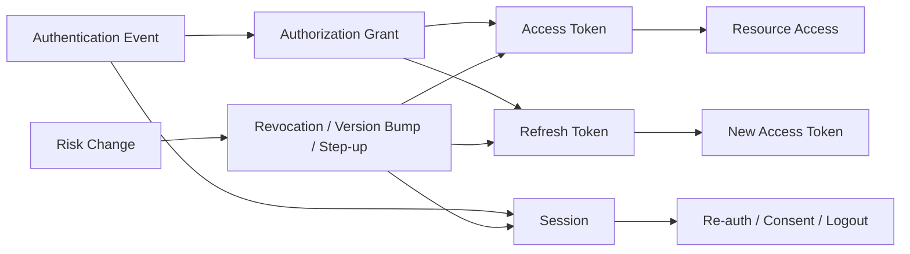
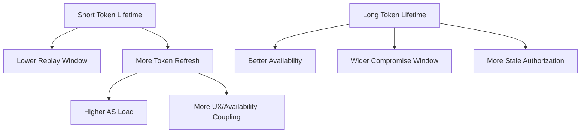
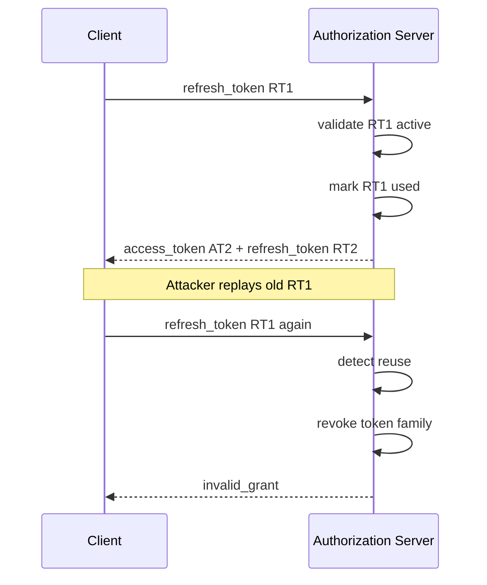
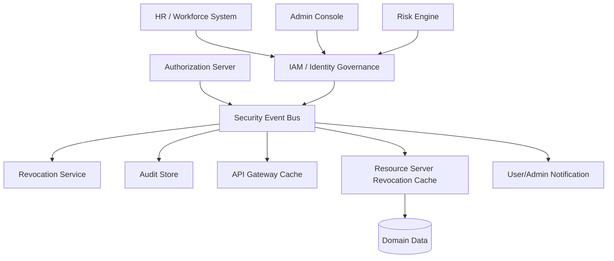
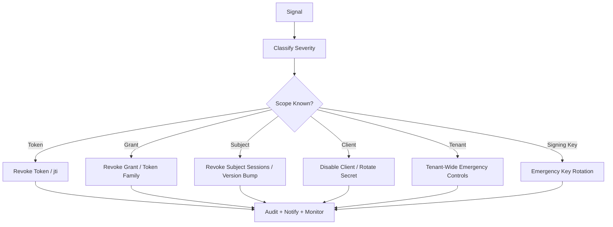

------
title: Learn Java Identity, Authentication & Authorization for Secure Enterprise API Platform - Part 027
description: Token lifecycle engineering untuk secure enterprise API platform: expiry, refresh rotation, revocation, logout, compromise response, session-token consistency, dan operational playbook.
series: learn-java-identity-authentication-authorization-api-platform
seriesTitle: Learn Java Identity, Authentication & Authorization for Secure Enterprise API Platform
order: 27
partTitle: Token Lifecycle: Expiry, Rotation, Revocation, Logout, Compromise Response
tags:
- java
- identity
- authentication
- authorization
- oauth
- oidc
- token-lifecycle
- revocation
- refresh-token
- api-security
date: 2026-06-28
---

# Part 027 — Token Lifecycle: Expiry, Rotation, Revocation, Logout, Compromise Response

## 1. Problem Framing

Token lifecycle adalah tempat banyak sistem identity enterprise gagal secara diam-diam.

Mereka berhasil melakukan login, berhasil menerbitkan access token, berhasil memvalidasi JWT, tetapi gagal menjawab pertanyaan produksi berikut:

- Apa yang terjadi ketika user logout?
- Apa yang terjadi ketika account dinonaktifkan?
- Apa yang terjadi ketika password, authenticator, role, tenant membership, atau device risk berubah?
- Apa yang terjadi ketika refresh token dicuri?
- Apa yang terjadi ketika employee pindah divisi?
- Apa yang terjadi ketika admin mencabut consent?
- Apa yang terjadi ketika API gateway masih menerima token lama?
- Apa yang terjadi ketika JWT valid secara kriptografis tetapi sudah tidak valid secara bisnis?
- Apa yang terjadi ketika authorization server sedang down?
- Apa yang terjadi ketika kita harus melakukan emergency revocation untuk satu tenant?

Token lifecycle bukan fitur tambahan. Ia adalah **control plane for trust over time**.

Access token adalah snapshot sementara dari trust. Refresh token adalah capability untuk mendapatkan trust baru. Session adalah continuity contract antara user/client dan authorization server. Revocation adalah mekanisme untuk menghentikan trust sebelum expiry alami. Compromise response adalah cara platform mengoreksi trust ketika realitas berubah.

Target part ini:

> Kamu mampu mendesain token/session lifecycle yang punya expiry, rotation, revocation, logout, risk response, audit, dan failure behavior yang jelas; bukan hanya “JWT expired 15 menit”.

---

## 2. Kaufman Skill Target

Setelah part ini, kamu harus bisa:

1. Membedakan access token, refresh token, session, authorization grant, consent, dan device binding.
2. Mendesain token lifetime berdasarkan risk tier, bukan angka default.
3. Menentukan kapan memakai short-lived JWT, opaque token, introspection, revocation endpoint, denylist, atau global versioning.
4. Mendesain refresh token rotation dengan replay detection.
5. Menjelaskan kenapa logout browser tidak otomatis mencabut semua API token.
6. Mendesain event-driven revocation untuk user disabled, role changed, tenant removed, credential compromised, dan break-glass.
7. Membuat test matrix untuk token lifecycle correctness.
8. Menulis runbook compromise response yang realistis untuk Java enterprise API platform.

---

## 3. Mental Model: Token Is a Lease, Not a Truth

Token sering diperlakukan seperti kebenaran absolut:

> “Signature valid, berarti boleh.”

Itu salah.

Token lebih tepat dianggap sebagai **lease**: izin sementara yang dikeluarkan oleh authority, berlaku untuk kondisi tertentu, selama belum kedaluwarsa, belum dicabut, belum digantikan, dan masih cocok dengan konteks request.



Token lifecycle harus menjawab empat dimensi:

| Dimensi | Pertanyaan |
|---|---|
| Validity | Apakah token secara teknis valid? |
| Freshness | Apakah token terlalu tua untuk action ini? |
| Continuity | Apakah session/grant asalnya masih hidup? |
| Context | Apakah token masih cocok untuk tenant, device, assurance, risk, dan authorization state saat ini? |

JWT signature hanya menjawab sebagian dari **validity**. Ia tidak otomatis menjawab freshness, continuity, dan context.

---

## 4. Token Types and Lifecycle Semantics

### 4.1 Access Token

Access token digunakan resource server untuk memutuskan apakah request bisa diproses.

Karakteristik:

- Biasanya short-lived.
- Audience-specific.
- Scope/authority-limited.
- Bisa berbentuk JWT atau opaque.
- Seharusnya tidak dipakai sebagai session ID.
- Seharusnya tidak dipakai sebagai proof bahwa user masih aktif tanpa freshness policy.

Access token menjawab:

> “Client ini diberi akses sementara ke resource server ini dengan boundary tertentu.”

Bukan:

> “User ini selalu boleh melakukan semua tindakan sampai token expired.”

### 4.2 Refresh Token

Refresh token digunakan client untuk memperoleh access token baru.

Karakteristik:

- Lebih sensitif daripada access token.
- Harus disimpan dengan proteksi lebih tinggi.
- Umumnya tidak dikirim ke resource server.
- Harus bisa dicabut.
- Untuk public client, harus memakai rotation dan replay detection.

Refresh token menjawab:

> “Client masih punya grant aktif untuk meminta token baru.”

### 4.3 Authorization Grant

Authorization grant adalah hubungan authorization yang lebih abstrak daripada token.

Contoh:

- User memberi consent ke mobile app untuk `read:profile`.
- Internal service diberi izin client credentials untuk memanggil customer API.
- Admin support diberi delegated access sementara ke case tertentu.

Token adalah manifestasi dari grant. Revocation bisa menarget token tunggal atau grant keseluruhan.

### 4.4 Session

Session adalah continuity state antara user dan authorization server atau application.

Browser session, BFF session, IdP session, dan resource server token bukan hal yang sama.

| State | Pemilik | Fungsi |
|---|---|---|
| IdP session | Authorization Server / IdP | Mengingat user sudah login di IdP |
| App/BFF session | Application / BFF | Mengikat browser ke server-side session |
| Access token | Client → Resource Server | Membawa authorization ke API |
| Refresh token | Client → Authorization Server | Meminta access token baru |
| Domain session | Domain application | Workflow continuity seperti case handling |

Kesalahan umum adalah menganggap logout dari app otomatis mematikan semua token dan semua IdP session. Tidak selalu.

---

## 5. Lifetime Design

Tidak ada lifetime universal. Token lifetime adalah keputusan risk engineering.

### 5.1 Lifetime Inputs

Tentukan lifetime berdasarkan:

- Client type: browser, BFF, native mobile, server-to-server, CLI, IoT.
- Data sensitivity.
- Operation criticality.
- Token form: bearer vs sender-constrained.
- Revocation requirement.
- Availability requirement.
- Network trust level.
- Device trust.
- Assurance level.
- User friction tolerance.
- Regulatory expectation.

### 5.2 Example Lifetime Matrix

| Scenario | Access Token | Refresh Token | Revocation Requirement | Notes |
|---|---:|---:|---|---|
| Low-risk internal read API | 15–30 min | None or short | Low | M2M may rely on short lifetime. |
| Browser BFF | Server-side session | Server-held if needed | Medium | Browser should not hold refresh token. |
| SPA public client | 5–10 min | Rotating, bounded | High | Avoid long-lived browser token. |
| Native mobile | 5–15 min | Rotating, device-bound where possible | High | Device loss scenario matters. |
| Admin API | 2–5 min | None or step-up gated | Very high | Require recent auth / elevation. |
| High-value finance API | 1–5 min | Strict rotation / sender constraint | Very high | Consider FAPI-style controls. |
| Batch service | 5–15 min | Usually none | Medium | Prefer client credentials per job identity. |

Do not copy these numbers blindly. Use them as thinking prompts.

### 5.3 The Lifetime Triangle



Short lifetime reduces blast radius but increases dependency on authorization server. Long lifetime improves availability but makes stale/compromised token risk worse.

Top-level rule:

> Use short-lived access tokens plus explicit lifecycle controls for refresh tokens/grants/sessions.

---

## 6. JWT Revocation Problem

JWT is self-contained. That is both the advantage and the problem.

Resource server can validate JWT offline:

- Signature valid.
- Issuer trusted.
- Audience matches.
- Expiry not reached.
- Algorithm acceptable.
- Claims structurally valid.

But offline validation cannot naturally know:

- User was disabled 30 seconds ago.
- Role was removed.
- Tenant membership changed.
- Refresh token was replayed.
- Consent was revoked.
- Device was reported stolen.
- Break-glass session was terminated.
- Authorization grant was revoked.

There are several mitigation patterns.

---

## 7. Revocation Patterns

### 7.1 Short-Lived Access Token

The simplest pattern:

- Access token expires quickly.
- State change takes effect at next token issuance.
- Refresh token/session controls decide whether new token can be issued.

Good for:

- Most normal API access.
- Systems that tolerate a small stale window.
- High availability resource servers.

Weakness:

- Does not give immediate revocation for current access token.
- Stale permission may persist until expiry.

### 7.2 Opaque Token + Introspection

Resource server asks authorization server whether token is active.

Good for:

- Immediate revocation requirement.
- Centralized control.
- Sensitive APIs where AS availability is acceptable.

Weakness:

- Runtime dependency on AS.
- Latency and caching complexity.
- Failure policy must be explicit.

### 7.3 JWT + Denylist

Resource server validates JWT offline but checks `jti` or grant/session ID against denylist.

Good for:

- Emergency revocation.
- Short-lived high-risk tokens.
- Compromise response.

Weakness:

- Stateful distributed cache required.
- Denylist TTL must match token expiry.
- Not scalable if every token goes through large denylist forever.

### 7.4 JWT + Subject/Grant Version

Token contains version claim such as:

- `sub_ver`
- `authz_ver`
- `tenant_ver`
- `session_ver`
- `grant_ver`

Resource server checks current version from fast store/cache.

Good for:

- User disabled.
- Global logout.
- Role/tenant membership change.
- Mass revocation.

Weakness:

- Requires read path or cache.
- Version semantics must be consistent.
- Coarse-grained: may revoke more than necessary.

### 7.5 Event-Driven Revocation

Authorization server, IAM, HR, admin system, or risk engine publishes events:

- `UserDisabled`
- `PasswordChanged`
- `AuthenticatorCompromised`
- `RoleRemoved`
- `TenantMembershipRevoked`
- `ConsentRevoked`
- `DeviceLost`
- `RefreshTokenReplayDetected`

Resource servers/gateways/cache services consume events and update local revocation state.

Good for:

- Enterprise distributed platform.
- Low-latency response without introspecting every request.
- Audit trail.

Weakness:

- Event loss/delay creates risk.
- Need reconciliation.
- Need idempotency and ordering model.

### 7.6 Sender-Constrained Tokens

Token is bound to a key/certificate. Stolen token alone is not enough.

Good for:

- M2M.
- FAPI-grade API.
- High-value clients.

Weakness:

- Operational complexity.
- Key/cert lifecycle.
- Client support.

### 7.7 Risk-Based Step-Up Instead of Full Revocation

For some risk changes, do not revoke all tokens. Require step-up for sensitive action.

Example:

- New device detected.
- User changes bank payout method.
- Admin attempts export.
- Case officer escalates enforcement action.

Resource server denies with `step_up_required` decision, not generic 403.

---

## 8. Revocation Decision Matrix

| Event | Access Token Action | Refresh Token Action | Session Action | Audit Severity |
|---|---|---|---|---|
| User logout current device | Let expire or revoke session-bound token | Revoke device/client refresh token | End app session | Low/Medium |
| Global logout | Revoke/deny all active grants | Revoke all refresh tokens | End all sessions | Medium |
| Password changed voluntarily | Usually preserve or step-up | Often rotate/revoke depending risk | Re-auth high-risk sessions | Medium |
| Password reset due to compromise | Revoke all | Revoke all | End all sessions | High |
| MFA factor removed | Step-up or revoke high-risk | Re-evaluate grants | Re-auth | Medium/High |
| Authenticator compromised | Revoke affected assurance tokens | Revoke grants requiring that factor | End sessions | High |
| User disabled | Deny all immediately | Revoke all | End all | High |
| Role removed | Version bump / deny affected actions | Reissue future tokens with reduced claims | Usually no full logout | Medium |
| Tenant membership removed | Tenant version bump | Revoke tenant grant | End tenant context | High |
| Refresh replay detected | Revoke token family | Revoke token family | End associated session | Critical |
| Client secret compromised | Revoke client grants | Rotate client credentials | N/A | Critical |
| Break-glass ended | Revoke elevated token/session | Revoke elevation grant | End elevation | High |

The important thing is not the table itself. The important thing is that the platform has **predefined behavior**.

---

## 9. RFC 7009 Token Revocation Semantics

OAuth Token Revocation defines a standard endpoint where a client can tell authorization server that a token is no longer needed.

A typical request:

```http
POST /oauth2/revoke HTTP/1.1
Host: auth.example.com
Content-Type: application/x-www-form-urlencoded
Authorization: Basic <client-auth>

token=abc.def.ghi&token_type_hint=refresh_token
```

Important semantics:

- The client authenticates to the revocation endpoint when possible.
- The token may be refresh token or access token.
- Revoking a refresh token may invalidate the related authorization grant and derived tokens depending provider policy.
- The endpoint must not leak whether an unknown token exists in a way that enables enumeration.

Engineering interpretation:

> Token revocation endpoint is useful, but it is not a complete enterprise lifecycle system. You still need event-driven revocation, session management, grant state, and resource-server enforcement.

---

## 10. Refresh Token Rotation

Refresh token rotation means every refresh creates a new refresh token and invalidates the previous one.



### 10.1 Token Family

A token family is the chain of refresh tokens derived from an original grant.

Fields:

| Field | Meaning |
|---|---|
| `family_id` | Common ID for all rotated refresh tokens in a grant chain. |
| `token_id` | Unique ID of one refresh token. |
| `previous_token_id` | Parent token. |
| `status` | Active, used, revoked, reused, expired. |
| `issued_at` | Creation time. |
| `used_at` | Time first used. |
| `client_id` | Bound OAuth client. |
| `subject_id` | User/service subject. |
| `device_id` | Optional device binding. |
| `session_id` | Session that authorized the grant. |
| `tenant_id` | Tenant boundary if relevant. |

### 10.2 Replay Detection Policy

If old refresh token is reused:

- Mark family as compromised.
- Revoke current active token in family.
- Revoke related access tokens if tracked.
- End associated app session if session-bound.
- Emit security event.
- Require re-authentication.
- Consider notifying user/admin.

Do not simply return `invalid_grant` and continue.

### 10.3 Race Conditions

Real clients can send concurrent refresh requests due to network retry, mobile resume, or multiple tabs.

Design options:

1. Strict single-use: second request fails and token family is revoked.
2. Grace window: allow same previous token to be exchanged for same result within a tiny interval.
3. Idempotency key: client provides refresh request identifier.
4. Server-side locking by token hash/family ID.

For high-risk systems, prefer strict with well-designed client behavior. For consumer UX, a very small replay grace may reduce false compromise but must be bounded.

### 10.4 Java Persistence Model

```java
public enum RefreshTokenStatus {
    ACTIVE,
    USED,
    REVOKED,
    REUSED,
    EXPIRED
}

public record RefreshTokenRecord(
    UUID tokenId,
    UUID familyId,
    UUID grantId,
    String tokenHash,
    String clientId,
    String subjectId,
    String tenantId,
    String deviceId,
    RefreshTokenStatus status,
    Instant issuedAt,
    Instant expiresAt,
    Instant usedAt,
    Long version
) {}
```

Never store raw refresh token. Store a strong hash.

### 10.5 Atomic Rotation Pseudocode

```java
@Transactional
public RotatedTokens rotate(String presentedRefreshToken, RefreshContext context) {
    String tokenHash = tokenHasher.hash(presentedRefreshToken);

    RefreshTokenEntity current = repository.findByTokenHashForUpdate(tokenHash)
        .orElseThrow(() -> invalidGrant());

    if (current.isExpired()) {
        current.markExpired(clock.instant());
        throw invalidGrant();
    }

    if (current.status() == USED || current.status() == REUSED) {
        tokenFamilyService.markCompromised(current.familyId(), "refresh_token_reuse");
        audit.securityEvent("refresh_token_reuse", current, context);
        throw invalidGrant();
    }

    if (current.status() != ACTIVE) {
        throw invalidGrant();
    }

    policy.verifyClientBinding(current, context);
    policy.verifyDeviceBinding(current, context);
    policy.verifyTenantBinding(current, context);

    current.markUsed(clock.instant());

    RefreshTokenEntity next = RefreshTokenEntity.issueNextFrom(current, tokenGenerator, clock);
    repository.save(next);

    AccessToken accessToken = accessTokenIssuer.issue(current.grantId(), context);
    audit.securityEvent("refresh_token_rotated", current, context);

    return new RotatedTokens(accessToken.value(), next.rawTokenValueOnce());
}
```

Important details:

- Use pessimistic lock or compare-and-swap.
- Hash token before storage.
- Bind to client.
- Bind to device/session where appropriate.
- Emit audit event.
- Never reveal whether token was valid vs revoked vs unknown to attacker.

---

## 11. Token Hashing

Refresh token is a bearer credential. Database leakage must not expose usable tokens.

Recommended pattern:

- Generate high-entropy random token.
- Store only hash.
- Use server-side pepper/HMAC if appropriate.
- Compare in constant-ish time where possible.
- Rotate on use.
- Limit lookup/indexing strategy carefully.

Example:

```java
public final class RefreshTokenHasher {
    private final Mac prototype;

    public RefreshTokenHasher(SecretKey key) {
        try {
            this.prototype = Mac.getInstance("HmacSHA256");
            this.prototype.init(key);
        } catch (GeneralSecurityException e) {
            throw new IllegalStateException(e);
        }
    }

    public String hash(String token) {
        try {
            Mac mac = (Mac) prototype.clone();
            byte[] digest = mac.doFinal(token.getBytes(StandardCharsets.UTF_8));
            return Base64.getUrlEncoder().withoutPadding().encodeToString(digest);
        } catch (CloneNotSupportedException e) {
            throw new IllegalStateException(e);
        }
    }
}
```

For production, manage key rotation and HSM/KMS boundary if your risk tier requires it.

---

## 12. Logout Semantics

Logout is not one thing.

| Logout Type | Meaning |
|---|---|
| Local app logout | End session in this application. |
| Client logout | Client forgets token/session. |
| Authorization server logout | End IdP session. |
| Global logout | End all sessions/grants for subject. |
| Federated logout | Propagate logout to relying parties/IdPs. |
| Back-channel logout | Server-to-server logout event. |
| Front-channel logout | Browser-mediated logout notification. |
| Token revocation | Invalidate token/grant. |

### 12.1 Browser/BFF Logout

BFF logout should usually:

1. Invalidate server-side session.
2. Clear session cookie.
3. Revoke refresh token if BFF held one.
4. Optionally call IdP logout endpoint.
5. Emit audit event.
6. Avoid leaking whether token/session existed.

```java
@Bean
SecurityFilterChain webSecurity(HttpSecurity http) throws Exception {
    return http
        .logout(logout -> logout
            .logoutUrl("/logout")
            .invalidateHttpSession(true)
            .clearAuthentication(true)
            .deleteCookies("__Host-session")
            .addLogoutHandler(tokenRevokingLogoutHandler())
        )
        .build();
}
```

### 12.2 SPA Logout

SPA logout is harder because browser-held tokens are exposed to browser runtime risk.

Prefer BFF for high-value enterprise apps. If SPA must exist:

- Keep access token short-lived.
- Avoid long-lived refresh token in local storage.
- Use secure authorization code + PKCE.
- Use refresh token rotation if refresh token is issued.
- Clear in-memory token on logout.
- Call revocation endpoint when possible.
- Treat logout as best-effort client-side cleanup unless server revocation happens.

### 12.3 OIDC Logout

OIDC has multiple logout-related specifications/patterns. Do not assume one logout URL gives global correctness.

For enterprise design, define explicitly:

- Does app logout also log out from IdP?
- Does IdP logout notify apps?
- Are API tokens revoked?
- Are refresh token families revoked?
- Are partner sessions affected?
- What happens for offline access?
- What audit event is emitted?

---

## 13. Session-Token Consistency

A common bug:

1. User logs out of browser session.
2. Access token remains valid for API call.
3. Mobile app or hidden tab continues using token.
4. System believes user is logged out but API still accepts request.

This may be acceptable for low-risk short-lived tokens. It is not acceptable for high-risk operations.

### 13.1 Consistency Models

| Model | Meaning | Use Case |
|---|---|---|
| Expiry eventual consistency | Token valid until `exp`. | Low/medium risk. |
| Session-bound token | Resource server checks session/grant active state. | High-risk browser/BFF. |
| Version-bound token | Resource server checks subject/session/grant version. | Enterprise-wide revocation. |
| Introspection-bound token | Resource server checks AS. | Strong central revocation. |
| Step-up freshness | Sensitive actions require recent auth. | Admin/financial actions. |

### 13.2 Freshness Claim

For sensitive operations, add freshness checks:

- `auth_time`
- `acr`
- `amr`
- custom `assurance_level`
- custom `elevated_until`
- custom `step_up_id`

Example guard:

```java
public final class FreshAuthPolicy {
    private final Duration maxAge;
    private final Clock clock;

    public void requireFresh(Jwt jwt, String action) {
        Instant authTime = jwt.getClaimAsInstant("auth_time");
        if (authTime == null) {
            throw new StepUpRequiredException(action, "missing_auth_time");
        }

        Duration age = Duration.between(authTime, clock.instant());
        if (age.compareTo(maxAge) > 0) {
            throw new StepUpRequiredException(action, "auth_too_old");
        }
    }
}
```

---

## 14. Resource Server Enforcement Options

### 14.1 Pure JWT Validation

```java
@Bean
JwtDecoder jwtDecoder() {
    NimbusJwtDecoder decoder = NimbusJwtDecoder
        .withIssuerLocation("https://auth.example.com")
        .build();

    OAuth2TokenValidator<Jwt> validator = new DelegatingOAuth2TokenValidator<>(
        JwtValidators.createDefaultWithIssuer("https://auth.example.com"),
        new AudienceValidator("case-api"),
        new TokenTypeValidator("at+jwt")
    );

    decoder.setJwtValidator(validator);
    return decoder;
}
```

Good baseline, but no immediate revocation unless extra checks exist.

### 14.2 JWT + Revocation Store

```java
public final class RevocationAwareJwtAuthenticationConverter
        implements Converter<Jwt, AbstractAuthenticationToken> {

    private final TokenRevocationStore revocationStore;
    private final Converter<Jwt, Collection<GrantedAuthority>> authorities;

    @Override
    public AbstractAuthenticationToken convert(Jwt jwt) {
        String jti = jwt.getId();
        String grantId = jwt.getClaimAsString("grant_id");
        String subjectId = jwt.getSubject();

        if (revocationStore.isTokenRevoked(jti)
                || revocationStore.isGrantRevoked(grantId)
                || revocationStore.isSubjectRevoked(subjectId)) {
            throw new InvalidBearerTokenException("Token has been revoked");
        }

        return new JwtAuthenticationToken(jwt, authorities.convert(jwt));
    }
}
```

The actual implementation should avoid turning revocation store outage into accidental allow unless explicitly risk-accepted.

### 14.3 Opaque Token Introspection

```java
@Bean
SecurityFilterChain api(HttpSecurity http) throws Exception {
    return http
        .oauth2ResourceServer(oauth2 -> oauth2
            .opaqueToken(opaque -> opaque
                .introspectionUri("https://auth.example.com/oauth2/introspect")
                .introspectionClientCredentials("case-api", "secret")
            )
        )
        .build();
}
```

Introspection gives stronger central state but creates availability dependency.

### 14.4 Hybrid: JWT + Critical Introspection

Pattern:

- Normal endpoints: JWT local validation.
- Sensitive endpoints: JWT validation + grant/session/version check.
- Critical endpoints: introspection or policy service decision.

```java
public void requireActiveGrantForCriticalAction(Jwt jwt) {
    String grantId = jwt.getClaimAsString("grant_id");
    GrantState state = grantStateClient.getGrantState(grantId);

    if (!state.active()) {
        throw new AccessDeniedException("Grant is no longer active");
    }
}
```

---

## 15. Claim Design for Lifecycle

Useful claims:

| Claim | Purpose |
|---|---|
| `jti` | Token identifier for denylist/audit. |
| `sid` | Session identifier. |
| `grant_id` | Authorization grant identifier. |
| `client_id` / `azp` | Authorized party/client. |
| `auth_time` | Authentication freshness. |
| `acr` | Authentication assurance class. |
| `amr` | Authentication methods used. |
| `tenant_id` | Tenant boundary. |
| `sub_ver` | Subject lifecycle version. |
| `authz_ver` | Authorization/entitlement version. |
| `tenant_ver` | Tenant membership version. |
| `device_id` | Device binding. |
| `cnf` | Confirmation key for sender-constrained token. |

Do not put rapidly changing high-cardinality entitlements into long-lived JWT unless you accept staleness.

---

## 16. Event-Driven Lifecycle Architecture



Event design rules:

- Events must be immutable.
- Events must have IDs for idempotency.
- Events must include effective time.
- Events must include subject/client/tenant/grant/session scope.
- Events must include reason code.
- Consumers must tolerate duplicates.
- Consumers must reconcile periodically.
- Failure to process critical revocation event must be visible.

Example event:

```json
{
  "eventId": "01JZ...",
  "type": "identity.subject.disabled",
  "occurredAt": "2026-06-28T10:15:30Z",
  "effectiveAt": "2026-06-28T10:15:30Z",
  "subjectId": "usr_123",
  "tenantId": "tenant_a",
  "reason": "employment_terminated",
  "severity": "high",
  "initiator": {
    "type": "system",
    "id": "hr-sync"
  }
}
```

---

## 17. Compromise Response

### 17.1 Token Compromise Scenarios

| Compromise | Detection Signal |
|---|---|
| Access token stolen | Token used from impossible location/device; DPoP/mTLS mismatch; anomaly. |
| Refresh token stolen | Reuse of rotated refresh token; refresh from unexpected device. |
| Client secret stolen | Spike in client_credentials tokens; new IP/location; introspection anomalies. |
| Signing key compromised | Unknown token signatures become valid; key custody incident. |
| JWKS cache poisoned | Resource server accepts wrong key. |
| User credential compromised | Risk engine, password reset, user report, breached password feed. |
| Admin session compromised | Privileged action anomaly. |

### 17.2 Response Ladder



### 17.3 Runbook Template

```md
# Token Compromise Runbook

## Trigger
- Refresh token replay detected for family `{family_id}`.

## Immediate actions
1. Mark token family compromised.
2. Revoke all active refresh tokens in family.
3. Add active access token `jti` values to revocation store if tracked.
4. End linked session `{sid}`.
5. Require re-authentication for subject `{sub}` on client `{client_id}`.
6. Emit security event.
7. Notify user/security team based on risk tier.

## Validation
- Confirm introspection returns inactive.
- Confirm resource server denies old access token.
- Confirm refresh endpoint returns `invalid_grant`.
- Confirm audit event exists.

## Follow-up
- Investigate source IP/device.
- Check other token families.
- Consider subject-wide revocation.
```

---

## 18. Signing Key Rotation vs Token Revocation

Key rotation and token revocation are different controls.

| Control | Purpose |
|---|---|
| Key rotation | Replace cryptographic signing material. |
| Token revocation | Invalidate specific token/grant/session/subject. |
| JWKS cache expiry | Control how quickly resource servers learn keys. |
| Emergency key removal | Stop accepting tokens signed by compromised key. |

Normal key rotation should overlap:

1. Publish new key in JWKS.
2. Start signing new tokens with new key.
3. Keep old key until old tokens expire.
4. Remove old key after safe window.

Emergency key compromise may require:

- Stop signing with key immediately.
- Remove key or mark key invalid.
- Force resource servers to refresh JWKS.
- Revoke tokens signed with compromised `kid`.
- Re-issue sessions/tokens.
- Investigate whether private key was exposed.

---

## 19. Authorization Staleness

JWT often contains roles/scopes/claims. Claims become stale.

Example:

1. `alice` receives token with `ROLE_CASE_APPROVER`.
2. Admin removes role.
3. Token remains valid for 15 minutes.
4. Alice approves enforcement action during stale window.

Mitigations:

- Shorter token lifetime for privileged actions.
- `authz_ver` check for sensitive methods.
- Policy service lookup at decision time.
- Step-up/elevation token with very short expiry.
- Event-driven revocation of privileged grants.

Design principle:

> The more irreversible or regulated the action, the less you should rely on stale embedded claims alone.

---

## 20. Token Lifecycle for Async Jobs and Events

Async systems create hidden token lifecycle problems.

Bad pattern:

- API receives user request.
- Service stores user access token in job table.
- Job runs 4 hours later using expired/stale user token.

Better patterns:

### 20.1 Snapshot Authorization Decision

For irreversible workflow step:

- Authorize at command acceptance time.
- Store decision evidence.
- Async worker performs already-authorized command.
- Worker uses service identity, not user token.

### 20.2 Delegated Work Grant

For long-running user-delegated work:

- Create explicit work grant.
- Scope to resource/action/time.
- Store grant state.
- Worker exchanges grant for service token.
- Revocation can cancel work.

### 20.3 Re-Authorize at Execution Time

For mutable permission state:

- Job stores intent, not authorization.
- Worker re-evaluates policy before execution.
- If user lost permission, job fails or goes to review.

---

## 21. Spring Authorization Server Notes

Spring Authorization Server gives extension points for token generation, authorization persistence, consent, client registration, and token endpoint behavior. Token lifecycle design usually needs custom services around those extension points.

Possible implementation components:

| Component | Responsibility |
|---|---|
| `OAuth2AuthorizationService` | Persist authorization/grant/token state. |
| `RegisteredClientRepository` | Client metadata and auth method. |
| `OAuth2TokenGenerator` | Add lifecycle claims such as `sid`, `grant_id`, version. |
| Custom revocation service | Revoke grant/session/subject/token family. |
| Security event publisher | Emit lifecycle events. |
| Admin console service | Manual revocation and investigation. |

Do not bury lifecycle semantics inside scattered controllers. Model them explicitly.

---

## 22. Testing Strategy

### 22.1 Unit Tests

- Token expires when `exp` is in the past.
- `nbf` in future is rejected.
- Missing `jti` is rejected for endpoints requiring revocation checks.
- Revoked `jti` is rejected.
- Revoked grant ID is rejected.
- `auth_time` too old triggers step-up.
- `authz_ver` mismatch is rejected.
- Refresh token reuse revokes family.

### 22.2 Integration Tests

- Logout revokes refresh token.
- Global logout denies refresh on all devices.
- User disabled event prevents sensitive API action.
- Role removed event denies privileged action.
- Tenant membership removed event denies tenant API.
- Revocation store outage follows configured fail policy.
- Introspection timeout fails closed for critical endpoint.
- JWKS key rotation works without downtime.

### 22.3 Security Regression Matrix

| Test | Expected Result |
|---|---|
| Use access token after logout | Allowed only if policy accepts expiry window; denied for session-bound endpoints. |
| Use refresh token twice | Second use fails and family revoked. |
| Use token after user disabled | Denied immediately for critical APIs. |
| Use token after tenant removed | Denied for that tenant. |
| Use token with stale role | Denied for privileged action if version/policy check required. |
| Use token during revocation cache outage | Follows documented fail-open/fail-closed policy. |
| Use token signed by removed emergency key | Denied. |

---

## 23. Observability

Token lifecycle needs security observability.

Log events:

- Token issued.
- Refresh token rotated.
- Refresh token reuse detected.
- Token revoked.
- Grant revoked.
- Session ended.
- Subject version bumped.
- Client disabled.
- Introspection failed.
- Revocation cache stale.
- Step-up required.
- Critical API denied due to stale lifecycle.

Log safely:

- Do not log raw token.
- Log token hash prefix or `jti` only.
- Log subject/client/tenant IDs using stable internal IDs.
- Log reason codes.
- Include correlation ID.
- Include policy version.

Example event:

```json
{
  "event": "refresh_token_reuse_detected",
  "severity": "critical",
  "subjectId": "usr_123",
  "clientId": "mobile-app",
  "tenantId": "tenant_a",
  "familyId": "rtf_789",
  "sessionId": "sid_456",
  "occurredAt": "2026-06-28T10:30:00Z",
  "actionTaken": "token_family_revoked"
}
```

---

## 24. Anti-Patterns

### 24.1 “JWT Is Stateless, So We Cannot Revoke”

Wrong. You can choose short expiry, denylist, version checks, introspection, or hybrid design. Statelessness is a trade-off, not a law.

### 24.2 Long-Lived Access Tokens

Long-lived access tokens create wide replay and stale authorization windows.

### 24.3 Refresh Token in Local Storage

For browser apps, this is usually a bad idea. Prefer BFF for high-value systems.

### 24.4 Logout Only Clears Browser Cookie

If refresh tokens or grants remain active, logout is incomplete.

### 24.5 Revocation Without Resource Server Enforcement

Revoking token at authorization server is meaningless if resource servers never check revocation state and token is a long-lived JWT.

### 24.6 No Token Family Reuse Detection

Refresh rotation without reuse detection misses the primary security benefit.

### 24.7 Fail-Open Critical Revocation Check

If admin API ignores revocation cache outage and allows requests, revocation is not a real control.

### 24.8 Claim Staleness Ignored

Embedding roles in JWT is convenient. Treating them as fresh forever is dangerous.

---

## 25. Production Checklist

Use this checklist before approving a token lifecycle design.

### Token Lifetime

- [ ] Access token lifetime defined per client/API risk tier.
- [ ] Refresh token lifetime bounded.
- [ ] Privileged/elevated tokens have shorter lifetime.
- [ ] Offline access explicitly approved.

### Refresh Token

- [ ] Refresh tokens are rotated.
- [ ] Refresh tokens are stored hashed.
- [ ] Reuse detection revokes token family.
- [ ] Concurrent refresh race behavior is defined.
- [ ] Refresh token is bound to client and optionally device/session.

### Revocation

- [ ] RFC 7009-style revocation endpoint or equivalent exists.
- [ ] Admin/system revocation exists.
- [ ] Resource servers enforce revocation where required.
- [ ] JWT revocation strategy is explicit.
- [ ] Opaque/introspection failure mode is explicit.

### Logout

- [ ] Local app logout semantics documented.
- [ ] IdP logout semantics documented.
- [ ] Refresh token revocation on logout defined.
- [ ] Global logout exists for high-risk scenarios.

### State Change

- [ ] User disabled causes effective access denial.
- [ ] Role removed behavior defined.
- [ ] Tenant membership removed behavior defined.
- [ ] Credential compromise response defined.
- [ ] Client compromise response defined.

### Operations

- [ ] Audit events emitted.
- [ ] SIEM alerts configured.
- [ ] Emergency key rotation runbook exists.
- [ ] Token compromise runbook tested.
- [ ] Reconciliation exists for missed lifecycle events.

---

## 26. Practice Drill

Design lifecycle policy for this platform:

- Regulated case management API.
- Users are internal officers.
- Some users can approve enforcement actions.
- Mobile app supports offline read-only case notes.
- Browser app uses BFF.
- Services call each other using client credentials.
- User role can be revoked by HR or IAM.
- Tenant boundary represents regulator agency.

Answer:

1. Access token lifetime per client.
2. Refresh token policy per client.
3. Logout semantics.
4. Revocation event model.
5. Step-up requirements.
6. Resource server enforcement points.
7. Audit events.
8. Negative tests.

Good answer should mention:

- BFF stores tokens server-side.
- Mobile offline read must use bounded offline grant or cached encrypted data with expiry.
- Enforcement approval requires fresh auth and current authorization check.
- Role removal triggers `authz_ver` bump or policy-service denial.
- Tenant removal must deny immediately for tenant-scoped APIs.
- Service tokens are short-lived client credentials, not user tokens.

---

## 27. Key Takeaways

1. Token lifecycle is trust management over time.
2. JWT validation is necessary but not sufficient for revocation-sensitive systems.
3. Access token, refresh token, session, grant, consent, and authorization state must not be collapsed into one concept.
4. Refresh token rotation needs reuse detection and token family revocation.
5. Logout semantics must be explicit.
6. Critical APIs need freshness, revocation, and authorization state checks.
7. Lifecycle events must be auditable, testable, and operationally rehearsed.
8. In enterprise identity engineering, “valid token” is only the start of the decision.

---

## 28. References

- RFC 7009 — OAuth 2.0 Token Revocation: https://datatracker.ietf.org/doc/html/rfc7009
- RFC 7662 — OAuth 2.0 Token Introspection: https://datatracker.ietf.org/doc/html/rfc7662
- RFC 9068 — JSON Web Token Profile for OAuth 2.0 Access Tokens: https://datatracker.ietf.org/doc/html/rfc9068
- RFC 8705 — OAuth 2.0 Mutual-TLS Client Authentication and Certificate-Bound Access Tokens: https://datatracker.ietf.org/doc/html/rfc8705
- RFC 9449 — OAuth 2.0 Demonstrating Proof of Possession: https://datatracker.ietf.org/doc/html/rfc9449
- OpenID Connect Back-Channel Logout: https://openid.net/specs/openid-connect-backchannel-1_0.html
- Spring Security OAuth2 Resource Server: https://docs.spring.io/spring-security/reference/servlet/oauth2/resource-server/index.html
- Spring Authorization Server Reference: https://docs.spring.io/spring-authorization-server/reference/
