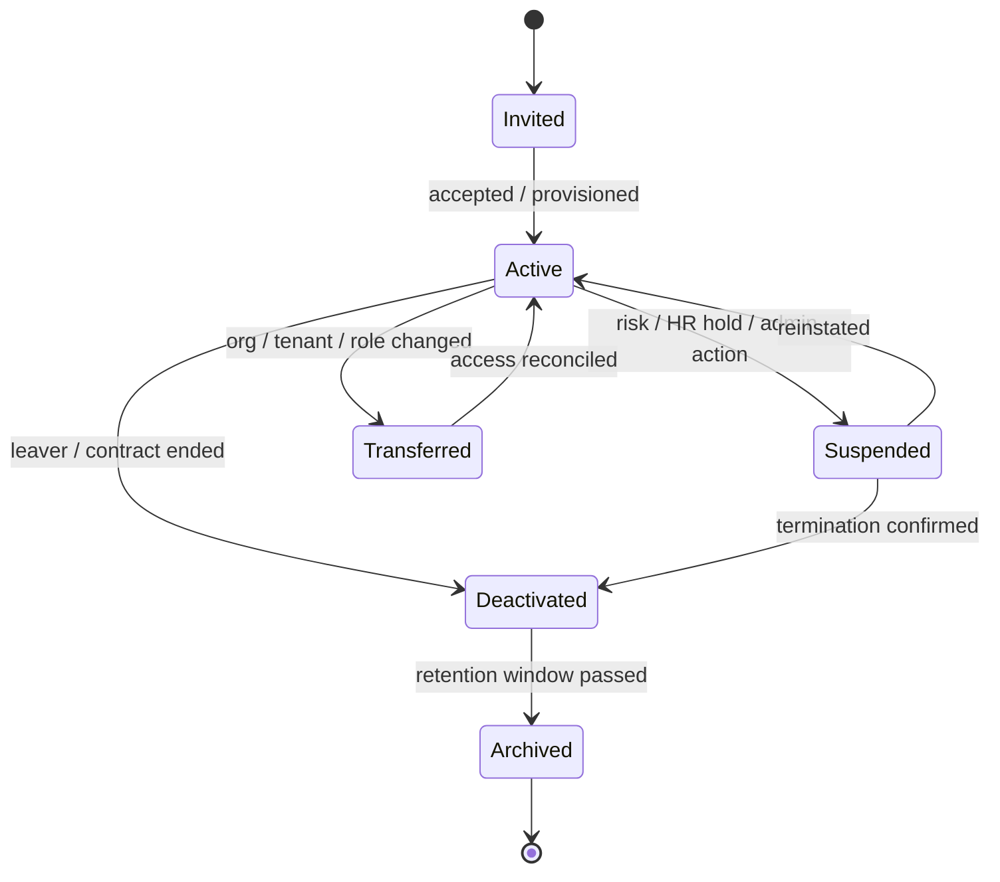
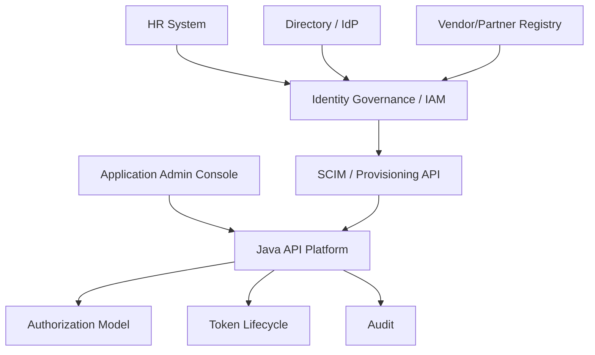
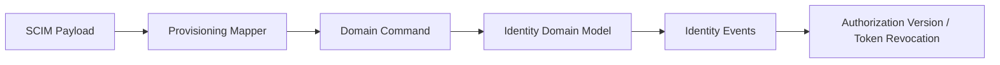
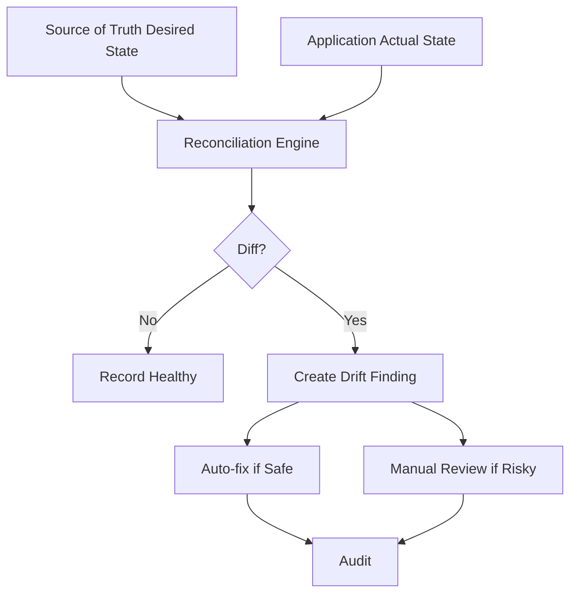
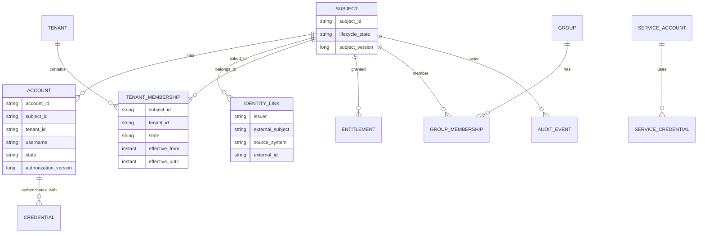

------
title: Learn Java Identity, Authentication & Authorization for Secure Enterprise API Platform - Part 028
description: Identity provisioning dan lifecycle management untuk Java enterprise platform: joiner-mover-leaver, SCIM, account linking, deactivation, entitlement drift, orphaned access, dan provisioning correctness.
series: learn-java-identity-authentication-authorization-api-platform
seriesTitle: Learn Java Identity, Authentication & Authorization for Secure Enterprise API Platform
order: 28
partTitle: Identity Provisioning and Lifecycle Management
tags:
- java
- identity
- provisioning
- lifecycle
- scim
- iam
- iga
- authorization
- api-security
- enterprise-platform
date: 2026-06-28
---

# Part 028 — Identity Provisioning and Lifecycle Management

## 1. Problem Framing

Authentication menjawab:

> “Apakah actor ini bisa membuktikan identity?”

Authorization menjawab:

> “Apakah actor ini boleh melakukan action terhadap resource dalam konteks ini?”

Provisioning menjawab pertanyaan yang lebih mendasar:

> “Bagaimana identity, account, group, role, tenant membership, credential, dan entitlement itu muncul, berubah, dan hilang dari sistem dengan benar?”

Banyak breach enterprise bukan terjadi karena OAuth flow salah, tetapi karena lifecycle identity buruk:

- Employee sudah resign tetapi account masih aktif.
- Contractor pindah project tetapi tenant membership lama belum dicabut.
- User punya dua account yang tidak terhubung, satu masih punya privilege lama.
- Group sync gagal, tetapi authorization tetap memakai cache lama.
- HR record berubah, tetapi API platform tidak menerima event.
- Deprovision hanya disable login, tetapi active refresh token masih bisa dipakai.
- Service account tidak punya owner.
- Admin membuat emergency access tanpa expiry.
- User dihapus fisik sehingga audit trail kehilangan referensi actor.

Provisioning adalah **supply chain of identity**.

Target part ini:

> Kamu mampu mendesain identity lifecycle end-to-end dari joiner-mover-leaver, SCIM/API provisioning, account linking, deactivation, service account ownership, entitlement synchronization, token/session revocation, audit, dan failure recovery.

---

## 2. Kaufman Skill Target

Setelah part ini, kamu harus bisa:

1. Memodelkan lifecycle identity dari source-of-truth sampai resource application.
2. Membedakan person, subject, account, user profile, credential, group, role, entitlement, and tenant membership.
3. Mendesain joiner-mover-leaver flow yang aman.
4. Mendesain SCIM-style provisioning API dan mapping ke domain model Java.
5. Menangani deactivation tanpa merusak audit history.
6. Menghindari orphaned access, entitlement drift, duplicate account, dan stale group membership.
7. Mendesain reconciliation dan idempotency untuk provisioning.
8. Menghubungkan provisioning event dengan token revocation dan authorization freshness.

---

## 3. Mental Model: Identity Lifecycle as State Machine

Identity bukan record statis. Identity adalah state machine.



Lifecycle rules:

- Creation must have source and reason.
- Activation must be explicit.
- Changes must be versioned.
- Deactivation must not destroy audit identity.
- Privilege must have owner and expiry.
- Reconciliation must detect drift.
- Token/session lifecycle must respond to identity lifecycle.

---

## 4. Domain Vocabulary

Do not confuse these concepts.

| Concept | Meaning | Example |
|---|---|---|
| Person | Real-world human or workforce identity. | Alice Tan. |
| Subject | Stable security identifier used in tokens/policies. | `sub=usr_01H...` |
| Account | Login/application account under a system/tenant. | `alice@example.com` in tenant A. |
| Credential | Authenticator binding account/subject. | Passkey, password hash, certificate. |
| Group | Collection from directory/IAM. | `case-reviewers`. |
| Role | Platform/domain permission bundle. | `CASE_APPROVER`. |
| Entitlement | Concrete access grant. | `approve case in agency X`. |
| Tenant membership | Relationship between subject/account and tenant. | Alice belongs to regulator A. |
| Service account | Non-human account for workload/client. | `billing-sync-prod`. |
| Owner | Human/team accountable for account/access. | Platform Team. |

Provisioning systems fail when these are collapsed into one `users` table with boolean flags.

---

## 5. Sources of Truth

Enterprise identity has multiple sources.



Typical sources:

| Source | Owns |
|---|---|
| HR system | Employee status, employment dates, department, manager. |
| Vendor management | Contractor/partner validity. |
| Directory/IdP | Login identity, groups, federation attributes. |
| IAM/IGA | Access request, approvals, entitlement governance. |
| Application | Domain-specific resource ownership and workflow roles. |
| Security/risk engine | Suspension, compromised identity, risk flags. |

Architecture rule:

> A Java application should know which source owns each field. If the app lets admins edit externally-owned fields directly, it creates drift.

---

## 6. Joiner-Mover-Leaver Model

### 6.1 Joiner

Joiner flow creates access.

Minimum steps:

1. Receive trusted person/worker record.
2. Create stable subject ID.
3. Create account or link existing account.
4. Attach tenant membership.
5. Attach baseline roles/entitlements.
6. Configure credential/login requirements.
7. Emit audit event.
8. Notify user/admin.
9. Make access effective at correct time.

Security concerns:

- Premature activation before start date.
- Wrong tenant membership.
- Duplicate account.
- Overbroad default role.
- Missing manager/owner approval.
- Email-based identity collision.

### 6.2 Mover

Mover flow modifies access.

Examples:

- Department changes.
- Tenant assignment changes.
- User becomes supervisor.
- Contractor moves project.
- Case officer assigned to new regulatory domain.

Mover is more dangerous than joiner because old access may remain.

Required behavior:

- Add new required access.
- Remove access no longer justified.
- Re-evaluate SoD constraints.
- Bump authorization version.
- Revoke or refresh tokens where necessary.
- Emit access change audit.

Bad mover flow:

> Only add new roles, never remove old roles.

This causes entitlement accretion.

### 6.3 Leaver

Leaver flow removes access.

Minimum behavior:

1. Mark subject/account deactivated or suspended.
2. Disable login.
3. Revoke refresh tokens and active sessions.
4. Bump subject/authz version.
5. Remove tenant memberships and active entitlements.
6. Disable service accounts owned solely by leaver or transfer ownership.
7. Keep audit identity resolvable.
8. Retain records according to retention policy.
9. Emit security event.

Do not delete the subject row if audit logs reference it.

---

## 7. Provisioning States

A practical account state model:

| State | Login? | Token Refresh? | API Access? | Audit Identity? |
|---|---|---|---|---|
| `PENDING` | No | No | No | Yes |
| `ACTIVE` | Yes | Yes | Yes | Yes |
| `SUSPENDED` | No | No | Usually no | Yes |
| `LOCKED` | No login | Existing sessions maybe policy-dependent | Risk-dependent | Yes |
| `DEACTIVATED` | No | No | No | Yes |
| `ARCHIVED` | No | No | No | Yes/minimal |

Do not use one boolean `enabled` for all lifecycle semantics.

Java model:

```java
public enum AccountLifecycleState {
    PENDING,
    ACTIVE,
    SUSPENDED,
    LOCKED,
    DEACTIVATED,
    ARCHIVED
}

public record IdentityAccount(
    String accountId,
    String subjectId,
    String tenantId,
    String username,
    AccountLifecycleState state,
    Instant effectiveFrom,
    Instant effectiveUntil,
    long lifecycleVersion,
    long authorizationVersion,
    Instant createdAt,
    Instant updatedAt
) {}
```

---

## 8. SCIM Mental Model

SCIM — System for Cross-domain Identity Management — is a standardized HTTP/JSON approach for provisioning users and groups across domains.

SCIM does not solve all identity governance. It gives a protocol/schema shape for:

- Users.
- Groups.
- Attributes.
- Create/read/update/delete-like operations.
- Filtering.
- Patch.
- Service provider configuration.

SCIM is useful when your Java platform must integrate with IdP/IGA systems such as enterprise directories or SaaS identity providers.

### 8.1 SCIM Resources

Common resources:

- `/Users`
- `/Groups`
- `/ServiceProviderConfig`
- `/Schemas`
- `/ResourceTypes`

SCIM user example:

```json
{
  "schemas": ["urn:ietf:params:scim:schemas:core:2.0:User"],
  "userName": "alice.tan@example.com",
  "name": {
    "givenName": "Alice",
    "familyName": "Tan"
  },
  "active": true,
  "emails": [
    {
      "value": "alice.tan@example.com",
      "primary": true,
      "type": "work"
    }
  ],
  "externalId": "hr-12345"
}
```

### 8.2 SCIM Is Not Your Internal Domain Model

Do not let SCIM schema become your entire domain model.

Better pattern:



SCIM is integration boundary. Domain model owns lifecycle semantics.

---

## 9. Provisioning API Design

Even if not using SCIM directly, provisioning APIs should have these properties:

- Idempotent.
- Auditable.
- Versioned.
- Source-aware.
- Explicit lifecycle state.
- Safe partial update semantics.
- Deterministic conflict handling.
- Reconciliation-friendly.
- No raw credential exposure.

### 9.1 Idempotent Upsert

```java
public record ProvisionUserCommand(
    String sourceSystem,
    String externalId,
    String tenantId,
    String username,
    String email,
    boolean active,
    Set<String> groups,
    Map<String, Object> attributes,
    Instant effectiveAt,
    String correlationId
) {}
```

Handler:

```java
@Transactional
public ProvisioningResult provisionUser(ProvisionUserCommand command) {
    SourceIdentityKey key = new SourceIdentityKey(
        command.sourceSystem(),
        command.externalId()
    );

    IdentityLink link = identityLinkRepository.findBySourceKey(key)
        .orElseGet(() -> identityLinkRepository.createLink(key));

    IdentityAccount account = accountRepository.findBySubjectAndTenant(
        link.subjectId(), command.tenantId()
    ).orElseGet(() -> accountFactory.create(link.subjectId(), command.tenantId()));

    AccountLifecycleState nextState = command.active()
        ? AccountLifecycleState.ACTIVE
        : AccountLifecycleState.DEACTIVATED;

    AccountChangeSet changes = account.applyProvisioning(
        command.username(),
        command.email(),
        nextState,
        command.groups(),
        command.effectiveAt()
    );

    accountRepository.save(account);

    if (changes.affectsAuthorization()) {
        authorizationVersionService.bump(account.subjectId(), account.tenantId());
    }

    eventPublisher.publish(IdentityProvisionedEvent.from(command, account, changes));
    audit.recordProvisioning(command, account, changes);

    return ProvisioningResult.from(account, changes);
}
```

Important:

- External ID is more stable than email.
- Email can change.
- Username can change.
- Subject ID should not change casually.
- Provisioning must be repeatable.

---

## 10. Account Linking

Account linking connects external identities to internal subject.

Examples:

- Same employee logs in through corporate IdP and government partner IdP.
- User changes email address.
- Contractor becomes employee.
- User has existing local account before federation migration.

### 10.1 Linking Invariant

> One internal subject should represent one real actor within a defined identity boundary, and every external identity link must be explainable, auditable, and reversible only through controlled process.

### 10.2 Dangerous Linking Signals

Do not auto-link solely by:

- Email address.
- Display name.
- Phone number.
- Unverified claim.
- User-controlled profile field.

Better signals:

- Stable external ID from trusted issuer.
- Verified enterprise ID.
- Admin-approved link.
- Cryptographic/federation trust claim.
- Migration mapping table with approval.

### 10.3 Link Table

```java
public record IdentityLink(
    String linkId,
    String subjectId,
    String issuer,
    String externalSubject,
    String sourceSystem,
    String externalId,
    IdentityLinkStatus status,
    Instant linkedAt,
    String linkedBy,
    String reason
) {}
```

Composite uniqueness:

- `(issuer, externalSubject)` unique.
- `(sourceSystem, externalId)` unique.
- `subjectId` may have many links.

---

## 11. Deactivation vs Deletion

For regulated enterprise systems, deletion is rarely the right default.

### 11.1 Deactivation

Deactivation means:

- Login disabled.
- Refresh tokens revoked.
- Sessions ended.
- Future API access denied.
- Audit identity retained.
- Historical references remain resolvable.

### 11.2 Deletion

Deletion means removing data. It may be required for privacy/data retention, but must be balanced against:

- Audit evidence.
- Legal hold.
- Regulatory retention.
- Case history.
- Non-repudiation limits.

Design pattern:

- Deactivate operational account.
- Pseudonymize personal attributes when retention allows.
- Keep stable subject reference for audit.
- Keep minimal identity snapshot required for legal/regulatory history.

### 11.3 API Behavior for Deactivated Users

- Authentication should fail or require reactivation.
- Refresh should fail.
- Existing access token should be denied for critical APIs through version/revocation.
- Domain records created by user should remain visible with archived actor label.

Bad behavior:

- Deleting user row causes `created_by` foreign key failures.
- Audit logs show `unknown user`.
- Old tokens still work until long expiry.

---

## 12. Entitlement Drift

Entitlement drift means actual access differs from intended access.

Causes:

- Group sync failed.
- Manual admin override.
- Mover flow added new access but did not remove old.
- Role mapping changed without migration.
- External IdP group renamed.
- Application cached entitlements too long.
- SCIM patch partially failed.
- Duplicate account.

### 12.1 Drift Detection

Run reconciliation:



### 12.2 Drift Types

| Drift | Risk |
|---|---|
| Missing access | Availability/productivity issue. |
| Extra access | Security/compliance issue. |
| Wrong tenant | Critical isolation issue. |
| Wrong role | Authorization issue. |
| Duplicate account | Accountability issue. |
| Unowned service account | Privileged access issue. |

Extra access is usually more serious than missing access.

---

## 13. Group-to-Role Mapping

Enterprise systems often map IdP groups to application roles.

Naive mapping:

```text
IdP group "APP_CASE_APPROVER" -> ROLE_CASE_APPROVER
```

Problems:

- Group names change.
- Group membership may be too broad.
- Group sync delay creates stale access.
- Cross-tenant group names collide.
- Group does not encode resource scope.
- Role does not encode context.

Better mapping includes:

- Source system.
- Stable group ID.
- Tenant.
- Role.
- Effective dates.
- Approval source.
- Mapping version.

```java
public record GroupRoleMapping(
    String sourceSystem,
    String externalGroupId,
    String tenantId,
    String roleCode,
    Instant effectiveFrom,
    Instant effectiveUntil,
    long mappingVersion
) {}
```

Rule:

> Groups are input signals. Application roles/entitlements are domain decisions.

---

## 14. Service Account Lifecycle

Service accounts are often more dangerous than human accounts.

Required fields:

| Field | Purpose |
|---|---|
| `serviceAccountId` | Stable identity. |
| `clientId` | OAuth client identity. |
| `ownerTeam` | Accountability. |
| `businessPurpose` | Why account exists. |
| `environment` | prod/stage/dev. |
| `allowedScopes` | Least privilege. |
| `allowedAudiences` | Resource boundaries. |
| `credentialType` | mTLS, private_key_jwt, secret. |
| `credentialExpiry` | Rotation requirement. |
| `reviewBy` | Access review deadline. |
| `status` | Active/suspended/deactivated. |

Service account anti-patterns:

- Shared `system` client across all services.
- No owner.
- No expiry.
- Same secret in dev and prod.
- Scope `*`.
- Human users know service secret.
- Service account survives owning team deletion.

Lifecycle events:

- Owner team changed.
- Credential rotated.
- Scope reduced.
- Service retired.
- Secret compromise.
- Environment boundary violation.

---

## 15. Provisioning and Token Lifecycle Coupling

Provisioning events must affect tokens.

| Provisioning Event | Token/Session Impact |
|---|---|
| Account activated | Allow login/token issuance. |
| Account suspended | End sessions, revoke refresh, deny new token. |
| Account deactivated | Revoke all grants and active sessions. |
| Group membership added | Bump authz version; future tokens include new role if approved. |
| Group membership removed | Bump authz version; deny stale privileged tokens. |
| Tenant membership removed | Revoke tenant grants; deny tenant-scoped access. |
| Service account disabled | Stop client auth; revoke active service grants. |
| Credential rotated | Old credential invalid; token policy depends on risk. |
| Identity link removed | Prevent login via removed external identity. |

Implementation pattern:

```java
@EventListener
public void onIdentityLifecycleChanged(IdentityLifecycleChanged event) {
    switch (event.changeType()) {
        case DEACTIVATED -> {
            tokenRevocationService.revokeSubject(event.subjectId(), event.reason());
            sessionService.endAllSessions(event.subjectId());
        }
        case TENANT_MEMBERSHIP_REMOVED -> {
            tokenRevocationService.revokeTenantGrants(event.subjectId(), event.tenantId());
            authorizationVersionService.bumpTenantVersion(event.subjectId(), event.tenantId());
        }
        case ROLE_REMOVED, GROUP_REMOVED -> {
            authorizationVersionService.bumpAuthorizationVersion(event.subjectId(), event.tenantId());
        }
        default -> audit.record(event);
    }
}
```

---

## 16. Idempotency and Ordering

Provisioning is distributed. Events arrive twice, late, or out of order.

### 16.1 Idempotency Key

Every provisioning operation needs stable idempotency identity:

- Source system.
- External object ID.
- Source event ID.
- Version or timestamp.
- Operation type.

### 16.2 Ordering Problem

Example:

1. `UserActive=true` event version 10 arrives.
2. `UserActive=false` event version 11 arrives.
3. Version 10 is retried late.
4. System accidentally reactivates user.

Avoid by storing source version/watermark:

```java
public boolean shouldApply(SourceObjectVersion incoming, SourceObjectVersion current) {
    return incoming.compareTo(current) > 0;
}
```

If source has no reliable version, use reconciliation and conservative conflict handling.

### 16.3 Patch Semantics

Partial update can be dangerous.

Bad patch:

```json
{ "groups": ["case-approver"] }
```

Does it replace all groups or add one group?

Be explicit:

```json
{
  "operation": "replace",
  "path": "groups",
  "value": ["case-approver"]
}
```

or

```json
{
  "operation": "add",
  "path": "groups",
  "value": ["case-approver"]
}
```

---

## 17. Reconciliation Architecture

Provisioning cannot rely only on real-time events. You need reconciliation.

### 17.1 Reconciliation Modes

| Mode | Use |
|---|---|
| Full sync | Periodic comparison of all records. |
| Incremental sync | Consume changes since watermark. |
| Targeted sync | Recheck one subject/tenant after error. |
| Emergency sync | Validate critical population after outage. |

### 17.2 Reconciliation Result

```java
public record ReconciliationFinding(
    String findingId,
    String subjectId,
    String tenantId,
    String sourceSystem,
    String field,
    Object desiredValue,
    Object actualValue,
    DriftSeverity severity,
    boolean autoFixable,
    Instant detectedAt
) {}
```

### 17.3 Auto-Fix Rules

Auto-fix is safe for:

- Removing extra low-risk group from app state.
- Deactivating account when source says inactive.
- Updating display attributes.

Manual review needed for:

- Granting privileged access.
- Cross-tenant membership change.
- Resolving duplicate accounts.
- Reactivating deactivated account.
- Changing service account owner.

---

## 18. Tenant-Aware Provisioning

Multi-tenant provisioning must treat tenant as security boundary.

Rules:

- Provisioning request must identify tenant explicitly or derive it from trusted source mapping.
- Tenant in request body must not override authenticated provisioning client tenant unless authorized.
- Same external user may have different tenant memberships.
- Role mapping must be tenant-scoped.
- Deactivation may be tenant-local or global; define semantics.

Example:

```java
public void provisionTenantMembership(ProvisionTenantMembershipCommand command) {
    ProvisioningClient client = provisioningClientContext.current();

    if (!client.canManageTenant(command.tenantId())) {
        throw new AccessDeniedException("Provisioning client cannot manage tenant");
    }

    Tenant tenant = tenantRepository.findActive(command.tenantId())
        .orElseThrow(() -> new IllegalArgumentException("Unknown tenant"));

    membershipService.apply(command.subjectId(), tenant.id(), command.roles(), command.effectiveFrom());
}
```

Never let an IdP group from tenant A grant access to tenant B because names match.

---

## 19. Authorization for Provisioning APIs

Provisioning APIs are privileged. Protect them like admin APIs.

Controls:

- mTLS or `private_key_jwt` for provisioning client.
- Dedicated OAuth client per source system.
- Narrow scopes such as `provision:users`, `provision:groups`, `deprovision:users`.
- Tenant-bound client authorization.
- Request signing for high assurance.
- Rate limit and anomaly detection.
- Full audit.
- Dry-run mode for bulk operations.

Do not expose provisioning endpoint as normal user API.

Authorization model:

```text
subject: provisioning client
act: provision user / patch group / deactivate account
resource: tenant/account/group
context: source system, batch id, correlation id, environment
policy: client allowed for source + tenant + operation + risk tier
```

---

## 20. Bulk Provisioning

Bulk sync is dangerous because one bad mapping can grant or remove access for thousands of users.

Production requirements:

- Dry-run diff.
- Approval for high-impact changes.
- Change threshold guardrail.
- Batch ID.
- Rollback plan.
- Partial failure handling.
- Idempotent retry.
- Audit summary and per-record event.
- Rate limit downstream token revocation storm.

Example guardrail:

```java
public void validateBulkChange(BulkProvisioningPlan plan) {
    if (plan.deactivations() > 100 && !plan.hasExplicitApproval()) {
        throw new BulkChangeRejectedException("Too many deactivations without approval");
    }

    if (plan.privilegedGrants() > 0 && !plan.hasPrivilegedAccessApproval()) {
        throw new BulkChangeRejectedException("Privileged grants require approval");
    }
}
```

---

## 21. Failure Modes

### 21.1 Source System Outage

If HR/IAM source is down:

- Do not silently re-enable users.
- Continue using last known state for normal access.
- Fail closed for new privileged grants.
- Alert on sync staleness.
- Run reconciliation after recovery.

### 21.2 Provisioning Event Loss

Mitigation:

- Durable event queue.
- Dead-letter queue.
- Reconciliation.
- Source watermark.
- Alert on consumer lag.

### 21.3 Partial Deprovision

Example:

- Login disabled.
- Refresh tokens not revoked.
- Service account ownership not transferred.
- API access still works through cached token.

Mitigation:

- Lifecycle orchestrator.
- Transactional outbox.
- Compensation tasks.
- Verification probes.

### 21.4 Duplicate Identity

Example:

- Alice has `alice@old.com` and `alice@new.com`.
- Old account has privileged role.
- New account is deprovisioned, old remains.

Mitigation:

- Stable external ID.
- Link approval workflow.
- Duplicate detection.
- Access review.

### 21.5 Group Explosion

Thousands of external groups map into application roles.

Mitigation:

- Normalize into domain roles/entitlements.
- Reject unknown groups.
- Require mapping ownership.
- Periodic mapping review.

---

## 22. Testing Strategy

### 22.1 Unit Tests

- Active user can be provisioned idempotently.
- Deactivated user cannot be reactivated by older event.
- Email change does not create duplicate subject.
- Group removal bumps authorization version.
- Tenant removal revokes tenant grants.
- Duplicate external ID is rejected.
- Unknown group does not grant access.
- Service account without owner is rejected.

### 22.2 Integration Tests

- SCIM create user creates internal subject/account.
- SCIM patch `active=false` deactivates account and revokes tokens.
- Group replacement removes stale roles.
- Reconciliation detects extra role.
- Bulk deactivation threshold requires approval.
- Provisioning client cannot manage unauthorized tenant.
- Replayed old event does not override newer state.

### 22.3 Negative Security Tests

| Test | Expected Result |
|---|---|
| Provision tenant B using tenant A client | Denied. |
| Use email collision to link account | Denied or manual review. |
| Reactivate deactivated user with stale event | Ignored. |
| Remove user from group but use old token | Denied for privileged action if authz version check applies. |
| Send unknown group `superadmin` | Not mapped; audit warning. |
| Deprovision user but use refresh token | Refresh fails. |
| Delete user row referenced by audit | Blocked by retention/audit invariant. |

---

## 23. Observability and Audit

Provisioning events must be audit-grade.

Log:

- Source system.
- External ID.
- Internal subject ID.
- Tenant ID.
- Operation.
- Before/after state.
- Effective time.
- Initiator.
- Approval reference.
- Batch ID.
- Correlation ID.
- Policy/mapping version.
- Token/session action taken.

Example:

```json
{
  "event": "identity.account.deactivated",
  "sourceSystem": "hr",
  "externalId": "E12345",
  "subjectId": "usr_abc",
  "tenantId": "agency-a",
  "previousState": "ACTIVE",
  "newState": "DEACTIVATED",
  "reason": "employment_ended",
  "authorizationVersionBumped": true,
  "refreshTokensRevoked": true,
  "sessionsEnded": true,
  "occurredAt": "2026-06-28T11:00:00Z",
  "correlationId": "corr_789"
}
```

Avoid logging unnecessary personal data. Prefer stable internal IDs and minimal attributes.

---

## 24. Data Model Sketch



---

## 25. Anti-Patterns

### 25.1 Email as Primary Identity

Email changes and can be reassigned. Use stable subject/external ID.

### 25.2 Physical Delete on Leaver

Breaks audit, foreign keys, and historical accountability.

### 25.3 Additive Mover Flow

Only adding access creates privilege accumulation.

### 25.4 Group Name as Security Boundary

Group names are mutable and not globally unique.

### 25.5 Provisioning Without Reconciliation

Event-only integration eventually drifts.

### 25.6 User Deactivated But Tokens Still Active

Lifecycle not coupled to token/session control.

### 25.7 Manual Admin Override Without Ownership

Creates unexplained access that fails audit.

### 25.8 One Shared Service Account

Destroys accountability and blast-radius control.

---

## 26. Production Checklist

### Identity Model

- [ ] Stable subject ID exists.
- [ ] External identity links are modeled explicitly.
- [ ] Email is not primary immutable identity.
- [ ] Account lifecycle state is richer than boolean enabled.
- [ ] Deactivation preserves audit identity.

### Provisioning Flow

- [ ] Joiner, mover, leaver flows are defined.
- [ ] Provisioning operations are idempotent.
- [ ] Source-of-truth ownership per field is documented.
- [ ] Effective dates are supported.
- [ ] Stale events cannot overwrite newer state.

### SCIM / Integration

- [ ] SCIM payload is mapped to domain command, not used as domain model directly.
- [ ] Patch semantics are explicit.
- [ ] Unknown groups do not grant access.
- [ ] Provisioning client is strongly authenticated.
- [ ] Tenant authorization is enforced for provisioning clients.

### Access Lifecycle

- [ ] Mover removes obsolete access.
- [ ] Deactivation revokes refresh tokens and sessions.
- [ ] Role/group changes bump authorization version.
- [ ] Tenant removal revokes tenant grants.
- [ ] Service accounts have owner, purpose, expiry, and review date.

### Operations

- [ ] Reconciliation job exists.
- [ ] Drift findings are classified.
- [ ] Bulk changes have guardrails.
- [ ] Audit events include before/after state.
- [ ] Provisioning failure alerts exist.

---

## 27. Practice Drill

Design provisioning for a regulatory enforcement platform.

Context:

- Users come from government workforce IdP.
- Contractors come from partner IdP.
- Tenant represents agency.
- Some users can approve enforcement actions.
- HR can terminate employees.
- Agency admin can assign case roles.
- Service account performs nightly document sync.

Define:

1. Source of truth per attribute.
2. Subject/account/tenant membership model.
3. Joiner flow.
4. Mover flow.
5. Leaver flow.
6. SCIM or provisioning API contract.
7. Token/session impact for each lifecycle change.
8. Reconciliation strategy.
9. Audit evidence.
10. Negative tests.

A strong answer includes:

- Stable subject ID independent of email.
- Tenant-scoped membership.
- Agency admin cannot override HR employment status.
- Group membership maps to domain role through controlled mapping.
- Deactivation revokes refresh token and bumps subject version.
- Contractor expiry date enforced.
- Service account has owner and credential rotation.
- Reconciliation detects extra privileged roles.

---

## 28. Key Takeaways

1. Provisioning is the supply chain of identity and authorization.
2. Joiner-mover-leaver must be modeled explicitly, not implemented as random user table updates.
3. Deactivation is not deletion; audit identity must survive.
4. SCIM is an integration protocol, not your whole internal domain model.
5. Account linking must not rely only on email.
6. Mover flow must remove obsolete access, not only add new access.
7. Provisioning events must affect token/session lifecycle.
8. Reconciliation is mandatory because distributed identity state drifts.
9. Service accounts need lifecycle, owner, scope, expiry, and review just like human accounts.
10. Identity lifecycle correctness is a security property.

---

## 29. References

- RFC 7642 — SCIM Definitions, Overview, Concepts, and Requirements: https://datatracker.ietf.org/doc/html/rfc7642
- RFC 7643 — SCIM Core Schema: https://datatracker.ietf.org/doc/html/rfc7643
- RFC 7644 — SCIM Protocol: https://datatracker.ietf.org/doc/html/rfc7644
- RFC 7009 — OAuth 2.0 Token Revocation: https://datatracker.ietf.org/doc/html/rfc7009
- NIST SP 800-63-4 Digital Identity Guidelines: https://pages.nist.gov/800-63-4/
- OWASP Authorization Cheat Sheet: https://cheatsheetseries.owasp.org/cheatsheets/Authorization_Cheat_Sheet.html
- OWASP API Security Top 10 2023: https://owasp.org/API-Security/editions/2023/en/0x11-t10/
