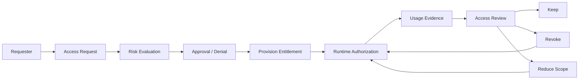
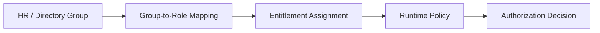
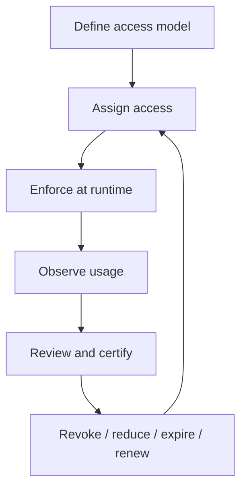
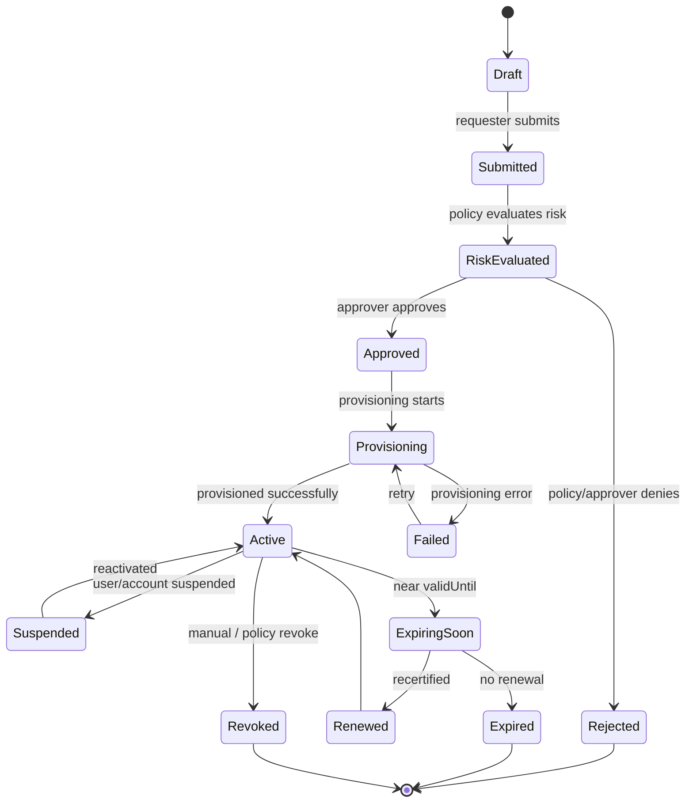
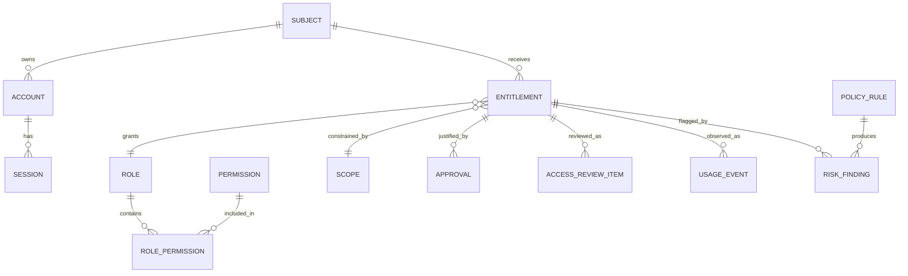
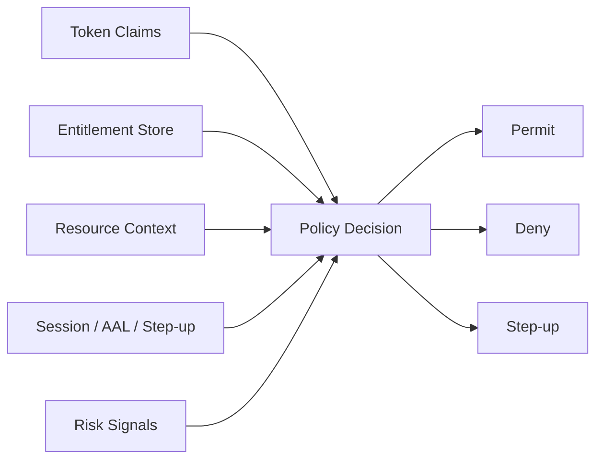
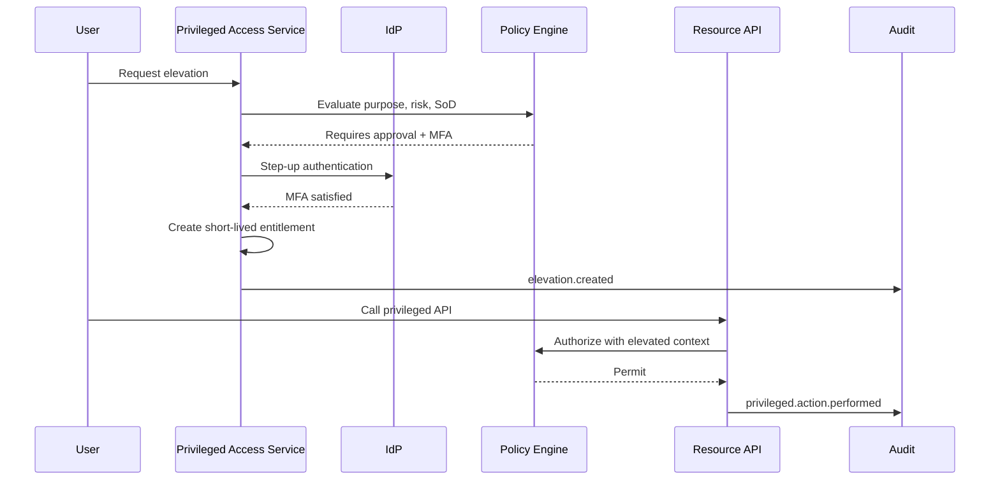
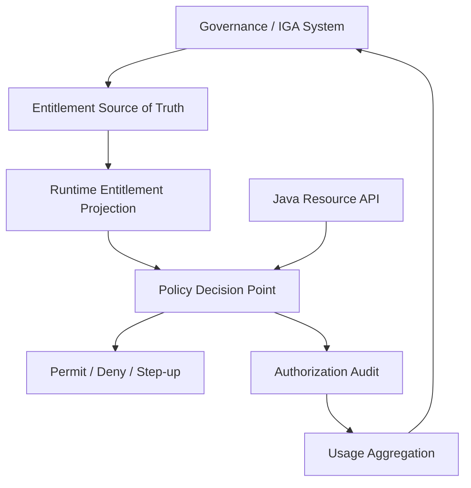

------
title: Learn Java Identity, Authentication & Authorization for Secure Enterprise API Platform - Part 029
description: Entitlement governance dan access review untuk Java enterprise platform: least privilege, SoD, role mining, privileged access, expiry-based access, certification, dan regulatory defensibility.
series: learn-java-identity-authentication-authorization-api-platform
seriesTitle: Learn Java Identity, Authentication & Authorization for Secure Enterprise API Platform
order: 29
partTitle: Entitlement Governance and Access Review
tags:
- java
- identity
- authorization
- entitlement
- governance
- access-review
- least-privilege
- segregation-of-duties
- iam
- iga
- audit
- api-security
- enterprise-platform
date: 2026-06-28
---

# Part 029 — Entitlement Governance and Access Review

## 1. Problem Framing

Authorization runtime menjawab:

> “Boleh atau tidak request ini dilakukan sekarang?”

Provisioning menjawab:

> “Bagaimana identity, account, group, role, dan entitlement masuk/keluar dari sistem?”

Entitlement governance menjawab pertanyaan yang lebih sulit:

> “Apakah hak akses yang dimiliki actor saat ini memang masih benar, minimal, sah, disetujui, terjelaskan, tidak konflik, dan bisa dibuktikan saat audit?”

Di enterprise, masalah access control jarang berhenti di `@PreAuthorize`. Banyak insiden muncul dari lifecycle dan governance:

- User masih punya role lama setelah pindah tim.
- Contractor diberi akses produksi tanpa expiry.
- Support admin bisa impersonate customer tanpa approval.
- Role `SUPER_ADMIN` dipakai sebagai shortcut untuk semua masalah.
- Approval akses hanya formalitas, approver tidak tahu resource yang disetujui.
- Policy runtime aman, tetapi entitlement source-of-truth tidak pernah direview.
- Group dari IdP diberi makna authorization langsung tanpa ownership.
- Service account punya privilege tinggi tetapi tidak punya owner manusia.
- “Temporary access” tidak pernah dicabut.
- Audit menemukan akses berlebih, tetapi engineering tidak bisa menjelaskan kenapa akses itu ada.

Target part ini:

> Kamu mampu mendesain entitlement governance untuk secure enterprise API platform: request, approval, provisioning, runtime enforcement, access review, segregation of duties, privileged access, expiry, evidence, dan continuous correction.

---

## 2. Kaufman Skill Target

Dalam kerangka Kaufman, skill ini dipecah menjadi subskill kecil yang bisa dilatih:

1. Membedakan permission, role, entitlement, group, capability, privilege, dan policy.
2. Mendesain entitlement lifecycle: requested, approved, provisioned, active, suspended, expired, revoked.
3. Mendesain approval yang meaningfully tied ke risk dan resource owner.
4. Membuat model least privilege yang tidak hanya slogan.
5. Mendesain segregation of duties dan toxic combination controls.
6. Mengelola privileged access, break-glass, dan just-in-time elevation.
7. Menghubungkan access review dengan provisioning dan runtime authorization.
8. Membuat evidence model yang dapat dipertanggungjawabkan.
9. Menguji entitlement drift dan authorization regression.
10. Menulis governance rule yang bisa dijalankan di Java platform.

Kriteria performa:

> Kamu bisa melihat daftar role/permission sebuah sistem, lalu mengidentifikasi privilege berlebih, role explosion, hidden SoD conflict, missing owner, missing expiry, stale entitlement, dan gap audit evidence.

---

## 3. Mental Model: Entitlement as Governed Authorization Fact

Jangan perlakukan entitlement sebagai sekadar string di token.

Entitlement adalah **authorization fact yang punya lifecycle, owner, reason, scope, risk, evidence, dan expiry**.



Akses yang baik bukan hanya “bisa dipakai”. Akses yang baik harus punya jawaban untuk pertanyaan berikut:

| Pertanyaan | Harus Bisa Dijawab |
|---|---|
| Siapa yang punya akses? | Subject, account, tenant, workload, actor chain. |
| Akses ke apa? | Resource, resource class, tenant, environment, data sensitivity. |
| Bisa melakukan apa? | Action, operation, command, API capability. |
| Kenapa diberi? | Business justification, request ticket, policy reason. |
| Siapa yang menyetujui? | Approver identity, role, authority, timestamp. |
| Sampai kapan? | Expiry, review date, renewal condition. |
| Apakah konflik? | SoD/toxic combination result. |
| Apakah pernah dipakai? | Usage evidence and last-used timestamp. |
| Apakah masih benar? | Review status and owner attestation. |

---

## 4. Vocabulary: Permission, Role, Entitlement, Privilege

Vocabulary yang buruk menghasilkan platform yang sulit diaudit.

### 4.1 Permission

Permission adalah kemampuan atomik atau semi-atomik:

```text
case:read
case:update
case:approve
case:assign-investigator
case:export-sensitive-data
tenant:user-admin
payment:refund
policy:publish
```

Permission menjawab:

> “Operation apa yang secara prinsip bisa dilakukan?”

Permission sebaiknya:

- Berorientasi action/resource.
- Stabil secara teknis.
- Tidak terlalu granular sampai tidak bisa dikelola.
- Tidak terlalu kasar sampai menjadi `admin:*` untuk semua hal.

### 4.2 Role

Role adalah bundle permission yang mewakili fungsi kerja:

```text
CASE_VIEWER
CASE_INVESTIGATOR
CASE_SUPERVISOR
TENANT_ADMIN
SUPPORT_AGENT
POLICY_PUBLISHER
```

Role menjawab:

> “Paket kemampuan apa yang normal untuk job/function ini?”

Role bukan identity. Role bukan orang. Role bukan jabatan HR persis. Role adalah model akses.

### 4.3 Entitlement

Entitlement adalah assignment yang sudah diberikan kepada subject dalam scope tertentu.

```text
subject: user:123
role: CASE_INVESTIGATOR
scope: tenant:bank-a, region:jakarta
validFrom: 2026-06-01
validUntil: 2026-09-01
reason: assigned to enforcement project PRJ-908
approvedBy: manager:456
```

Entitlement menjawab:

> “Subject ini saat ini punya akses apa, untuk scope mana, berdasarkan approval apa, sampai kapan?”

### 4.4 Privilege

Privilege adalah akses berisiko tinggi.

Contoh:

- Bisa mengubah policy authorization.
- Bisa impersonate customer.
- Bisa export sensitive data.
- Bisa approve enforcement outcome.
- Bisa bypass workflow.
- Bisa create admin account.
- Bisa rotate production secret.
- Bisa disable audit rule.

Privilege perlu governance tambahan: stronger approval, MFA/step-up, session recording, shorter expiry, usage alerting, and review.

### 4.5 Group

Group sering berasal dari IdP/HR/Directory:

```text
ldap:compliance-investigators
azuread:regulatory-platform-prod-admins
okta:case-management-supervisors
```

Group bukan permission. Group adalah input provisioning. Jangan biarkan aplikasi langsung menyimpulkan semua authorization domain dari group eksternal tanpa anti-corruption layer.



---

## 5. Governance Control Loop

Entitlement governance adalah control loop.



Tanpa loop, akses hanya akan bertambah.

Enterprise platform yang matang selalu punya mekanisme koreksi:

- Access request.
- Approval.
- Automated provisioning.
- Runtime enforcement.
- Usage telemetry.
- Periodic certification.
- Drift detection.
- Revocation.
- Exception handling.
- Evidence retention.

---

## 6. Entitlement Lifecycle State Machine



Important invariant:

> Runtime authorization must not treat `Approved` as equivalent to `Active`. Approval is not provisioning. Provisioning is not enforcement. Enforcement still needs current validity and scope.

---

## 7. Reference Domain Model



Minimal fields:

```java
public record Entitlement(
        EntitlementId id,
        SubjectId subjectId,
        RoleId roleId,
        Scope scope,
        EntitlementState state,
        Instant validFrom,
        Instant validUntil,
        String businessJustification,
        RiskTier riskTier,
        OwnerId accessOwner,
        RequestId requestId,
        Instant createdAt,
        Instant updatedAt,
        Version version
) {}

public enum EntitlementState {
    DRAFT,
    SUBMITTED,
    APPROVED,
    PROVISIONING,
    ACTIVE,
    SUSPENDED,
    EXPIRING_SOON,
    RENEWED,
    EXPIRED,
    REVOKED,
    REJECTED,
    FAILED
}
```

`Scope` harus explicit:

```java
public sealed interface Scope permits TenantScope, RegionScope, ProjectScope, ResourceScope, GlobalScope {
    boolean contains(ResourceDescriptor resource);
}

public record TenantScope(TenantId tenantId) implements Scope {
    @Override
    public boolean contains(ResourceDescriptor resource) {
        return tenantId.equals(resource.tenantId());
    }
}

public record ProjectScope(TenantId tenantId, ProjectId projectId) implements Scope {
    @Override
    public boolean contains(ResourceDescriptor resource) {
        return tenantId.equals(resource.tenantId())
                && projectId.equals(resource.projectId());
    }
}
```

Avoid implicit scope:

```text
BAD:  role = CASE_ADMIN
GOOD: role = CASE_ADMIN, scope = tenant:bank-a, region:jakarta, validUntil=2026-09-01
```

---

## 8. Entitlement Is Not the Same as Runtime Decision

Entitlement adalah input. Runtime decision tetap harus mengevaluasi:

- Subject status.
- Account status.
- Session strength.
- Token freshness.
- Entitlement active state.
- Scope.
- Resource classification.
- Action.
- Context.
- Risk signals.
- SoD constraints.
- Emergency/break-glass rules.



Never implement:

```java
if (jwt.getClaimAsStringList("roles").contains("CASE_ADMIN")) {
    allow();
}
```

Better:

```java
AuthorizationDecision decision = authorizationService.decide(
        new AuthorizationRequest(
                principal.subjectId(),
                Action.CASE_APPROVE,
                caseResourceDescriptor,
                RequestContext.from(httpRequest)
        )
);

if (!decision.permitted()) {
    throw new AccessDeniedException(decision.safeReason());
}
```

---

## 9. Least Privilege as Engineering Constraint

Least privilege is not “give fewer roles”. It is a design invariant:

> Subject should have only the minimum access necessary, in the minimum scope, for the minimum duration, with the minimum elevation needed for the task.

Four dimensions:

| Dimension | Question |
|---|---|
| Capability | What action is allowed? |
| Scope | Which tenant/resource/project/environment? |
| Time | From when until when? |
| Condition | Under what session/risk/context condition? |

Example:

```text
Bad entitlement:
  role: PROD_ADMIN
  scope: global
  expiry: none

Better entitlement:
  role: CASE_EXPORTER
  scope: tenant:bank-a / project:enforcement-2026-q2
  expiry: 2026-07-15T00:00:00Z
  condition: MFA within last 10 minutes
  approval: data-owner + security-owner
  monitoring: alert on every export
```

Least privilege should be enforced in data model, not only policy text.

```java
public record EntitlementRequest(
        SubjectId subjectId,
        RoleId requestedRole,
        Scope requestedScope,
        Duration requestedDuration,
        String justification
) {
    public EntitlementRequest {
        Objects.requireNonNull(subjectId);
        Objects.requireNonNull(requestedRole);
        Objects.requireNonNull(requestedScope);
        Objects.requireNonNull(requestedDuration);

        if (requestedDuration.compareTo(Duration.ofDays(180)) > 0) {
            throw new IllegalArgumentException("Access duration exceeds platform default maximum");
        }
    }
}
```

---

## 10. Access Request Design

A good access request captures intent and constraint.

```java
public record AccessRequest(
        RequestId id,
        SubjectId requester,
        SubjectId targetSubject,
        RoleId role,
        Scope scope,
        String businessJustification,
        AccessPurpose purpose,
        Instant requestedFrom,
        Instant requestedUntil,
        List<AttachmentRef> evidence,
        RequestState state
) {}
```

Minimum validation:

- Target subject exists.
- Target account is active or pending onboarding.
- Requested role exists and is requestable.
- Scope exists and requester can request within that scope.
- Duration does not exceed role maximum.
- Justification is non-empty for medium/high risk.
- Toxic combinations are evaluated before approval.
- Required approver chain is calculated deterministically.

### 10.1 Requestable vs Assignable Roles

Not every role should be requestable.

```java
public record RoleDefinition(
        RoleId id,
        String name,
        RoleRiskTier riskTier,
        boolean requestable,
        boolean assignableByAutomation,
        Duration maxDuration,
        Set<Permission> permissions,
        List<ApprovalPolicy> approvalPolicies
) {}
```

Example:

| Role | Requestable | Assignable by Automation | Notes |
|---|---:|---:|---|
| `CASE_VIEWER` | yes | yes | Low risk with manager approval. |
| `CASE_INVESTIGATOR` | yes | yes | Project/tenant scoped. |
| `TENANT_ADMIN` | yes | no | Requires owner + security approval. |
| `BREAK_GLASS_ADMIN` | no | no | Emergency flow only. |
| `POLICY_ENGINE_ADMIN` | restricted | no | Strong SoD control. |

---

## 11. Approval Architecture

Bad approval:

```text
Anyone's manager can approve any access.
```

Better approval:

```text
Approver = resource owner + line manager + security owner depending on risk.
```

Approval should be policy-driven.

```java
public interface ApprovalPolicyResolver {
    ApprovalPlan resolve(AccessRequest request, RiskEvaluation risk);
}

public record ApprovalPlan(
        RequestId requestId,
        List<ApprovalStep> steps,
        boolean parallel,
        RiskTier riskTier
) {}

public record ApprovalStep(
        ApprovalStepId id,
        ApprovalAuthority authority,
        ApprovalMode mode,
        Duration timeout,
        boolean mandatory
) {}
```

Example resolver:

```java
public final class RiskBasedApprovalPolicyResolver implements ApprovalPolicyResolver {

    @Override
    public ApprovalPlan resolve(AccessRequest request, RiskEvaluation risk) {
        List<ApprovalStep> steps = new ArrayList<>();

        steps.add(ApprovalStepFactory.managerApproval(request.targetSubject()));
        steps.add(ApprovalStepFactory.resourceOwnerApproval(request.scope()));

        if (risk.tier().isAtLeast(RiskTier.HIGH)) {
            steps.add(ApprovalStepFactory.securityApproval());
        }

        if (risk.containsPrivilegedPermission()) {
            steps.add(ApprovalStepFactory.privilegedAccessOwnerApproval());
        }

        return new ApprovalPlan(request.id(), List.copyOf(steps), false, risk.tier());
    }
}
```

### Approval Invariants

- Approver must be authorized to approve the specific scope.
- Requester should not approve their own high-risk access.
- Approver conflict must be checked.
- Approval is tied to exact requested role/scope/duration.
- Changing request after approval invalidates approval.
- Approval expiry is separate from entitlement expiry.
- Approval event must be immutable enough for audit.

---

## 12. Segregation of Duties

Segregation of duties prevents toxic combinations.

Classic examples:

| Domain | Toxic Combination |
|---|---|
| Finance | Create vendor + approve payment. |
| Enforcement | Create case + approve final sanction. |
| Platform | Change policy + approve own policy. |
| Identity | Create admin + approve admin access. |
| Audit | Modify records + certify records. |

In regulatory systems, SoD often protects legitimacy:

```text
Investigator should not be sole approver of enforcement outcome.
Policy author should not be sole publisher of same policy.
Support operator should not impersonate and approve customer action.
```

### 12.1 SoD Rule Model

```java
public record SodRule(
        SodRuleId id,
        String name,
        Set<RoleId> forbiddenRoleCombination,
        Set<Permission> forbiddenPermissionCombination,
        SodSeverity severity,
        boolean waivable,
        Duration waiverMaxDuration
) {}

public enum SodSeverity {
    WARNING,
    BLOCKING,
    REQUIRES_EXCEPTION_APPROVAL
}
```

### 12.2 SoD Evaluation

```java
public final class SodEvaluator {

    public List<SodFinding> evaluate(
            SubjectId subjectId,
            Collection<Entitlement> existingEntitlements,
            EntitlementRequest requested
    ) {
        Set<RoleId> roles = existingEntitlements.stream()
                .filter(e -> e.state() == EntitlementState.ACTIVE)
                .map(Entitlement::roleId)
                .collect(Collectors.toCollection(HashSet::new));

        roles.add(requested.requestedRole());

        return rules.stream()
                .filter(rule -> roles.containsAll(rule.forbiddenRoleCombination()))
                .map(rule -> new SodFinding(subjectId, rule.id(), rule.severity(), requested.requestedRole()))
                .toList();
    }

    private final List<SodRule> rules;

    public SodEvaluator(List<SodRule> rules) {
        this.rules = List.copyOf(rules);
    }
}
```

### 12.3 SoD Is Scope-Aware

A toxic combination can be global or scoped.

Example:

```text
User may be CASE_CREATOR in tenant A and CASE_APPROVER in tenant B.
User must not be CASE_CREATOR and CASE_APPROVER for same tenant/project/case type.
```

SoD rule should include scope relation:

```java
public enum ScopeRelation {
    SAME_SCOPE,
    OVERLAPPING_SCOPE,
    ANY_SCOPE
}
```

---

## 13. Role Mining and Role Engineering

Role mining adalah proses menemukan role dari actual access patterns.

But role mining is dangerous if it only copies historical access.

Bad role mining:

> “Most users in group X have permissions A, B, C, D, E, therefore group X should become role with A-E.”

Better role engineering:

1. Start from job/task model.
2. Compare with current entitlement usage.
3. Remove unused or risky permissions.
4. Validate with resource owners.
5. Define scope and expiry defaults.
6. Add SoD constraints.
7. Test with realistic journeys.
8. Deploy with monitoring.

### 13.1 Role Quality Metrics

| Metric | Signal |
|---|---|
| Permission count per role | Too many means role is too broad. |
| Subjects per role | Too few may indicate role explosion. |
| Roles per subject | Too many may indicate poor job-role mapping. |
| Last-used permissions | Unused permissions indicate overprivilege. |
| High-risk permission count | Needs stronger governance. |
| Scope distribution | Global roles should be rare. |
| Expiry coverage | Temporary/high-risk roles should expire. |
| Review failure rate | Indicates poor assignment quality. |

### 13.2 Role Definition Template

```yaml
roleId: CASE_INVESTIGATOR
name: Case Investigator
description: Investigates assigned enforcement cases within a tenant/project scope.
riskTier: MEDIUM
permissions:
  - case:read
  - case:update-investigation-notes
  - case:attach-evidence
  - case:submit-for-review
notIncluded:
  - case:approve-sanction
  - case:export-sensitive-data
scopeRequired: true
allowedScopes:
  - tenant
  - project
defaultDuration: 90d
maxDuration: 180d
approval:
  - line-manager
  - resource-owner
sod:
  incompatibleWith:
    - CASE_FINAL_APPROVER within same project
reviewFrequency: quarterly
owner: compliance-platform-access-owner
```

---

## 14. Entitlement Risk Scoring

Not all access needs same governance.

Risk can be scored from:

- Permission sensitivity.
- Resource sensitivity.
- Scope breadth.
- Duration.
- Environment.
- Actor type.
- Data export capability.
- Administrative capability.
- Impersonation capability.
- Audit modification capability.
- Policy modification capability.
- Public/customer impact.

```java
public record RiskEvaluation(
        RiskTier tier,
        int score,
        List<RiskFactor> factors,
        boolean containsPrivilegedPermission,
        boolean requiresMfa,
        boolean requiresSecurityApproval,
        boolean requiresUsageMonitoring
) {}
```

Example:

```java
public final class EntitlementRiskScorer {

    public RiskEvaluation evaluate(AccessRequest request, RoleDefinition role) {
        int score = 0;
        List<RiskFactor> factors = new ArrayList<>();

        if (role.permissions().contains(Permission.EXPORT_SENSITIVE_DATA)) {
            score += 40;
            factors.add(RiskFactor.SENSITIVE_DATA_EXPORT);
        }

        if (request.scope() instanceof GlobalScope) {
            score += 30;
            factors.add(RiskFactor.GLOBAL_SCOPE);
        }

        if (request.requestedUntil().isAfter(Instant.now().plus(Duration.ofDays(180)))) {
            score += 20;
            factors.add(RiskFactor.LONG_DURATION);
        }

        if (role.permissions().contains(Permission.IMPERSONATE_USER)) {
            score += 50;
            factors.add(RiskFactor.IMPERSONATION);
        }

        RiskTier tier = RiskTier.fromScore(score);
        return new RiskEvaluation(
                tier,
                score,
                List.copyOf(factors),
                role.permissions().stream().anyMatch(Permission::isPrivileged),
                tier.isAtLeast(RiskTier.MEDIUM),
                tier.isAtLeast(RiskTier.HIGH),
                tier.isAtLeast(RiskTier.MEDIUM)
        );
    }
}
```

---

## 15. Expiry-Based Access

Temporary access should expire automatically.

Expiry is one of the most practical least-privilege controls.

Recommended defaults:

| Access Type | Default Expiry | Max Expiry |
|---|---:|---:|
| Low-risk viewer | 180 days | 365 days |
| Case/project contributor | 90 days | 180 days |
| Sensitive data export | 7 days | 30 days |
| Tenant admin | 30 days | 90 days |
| Production admin | 8 hours | 7 days |
| Break-glass admin | 1 hour | 24 hours |
| Service account credential | based on rotation | owner review required |

Do not store `validUntil = null` for privileged access.

Use explicit non-expiring state only for carefully governed base roles:

```java
public enum ExpiryMode {
    FIXED_EXPIRY,
    REVIEW_BASED_RENEWAL,
    INDEFINITE_BASELINE_ACCESS
}
```

Invariant:

> High-risk entitlement must have either fixed expiry or mandatory periodic review. Prefer both.

---

## 16. Privileged Access Management

Privileged access should be separate from ordinary entitlement.

Privileged access properties:

- Short-lived.
- Explicit purpose.
- Strong authentication.
- Just-in-time issuance.
- Session-bound where possible.
- Strong audit.
- Alerting.
- No silent persistence.
- No self-approval.



### 16.1 Just-in-Time Role Activation

Instead of granting permanent `TENANT_ADMIN`, grant eligibility.

```text
eligible role: TENANT_ADMIN
activation duration: 30 minutes
conditions: MFA + ticket + no SoD violation
```

```java
public record EligibleEntitlement(
        SubjectId subjectId,
        RoleId roleId,
        Scope scope,
        Duration maxActivationDuration,
        Set<ActivationCondition> conditions,
        Instant validUntil
) {}

public record ActiveElevation(
        ElevationId id,
        SubjectId subjectId,
        RoleId roleId,
        Scope scope,
        Instant activatedAt,
        Instant expiresAt,
        String purpose,
        RequestId requestId
) {}
```

Runtime authorization should require active elevation for privileged actions.

---

## 17. Break-Glass Access

Break-glass is not admin convenience.

Break-glass is emergency access under exceptional conditions.

Required controls:

- Explicit declaration of emergency.
- Strong MFA.
- Short duration.
- High-signal alert.
- Mandatory post-use review.
- Narrow scope when possible.
- Evidence attachment.
- Immutable audit event.
- Automatic revocation.

```java
public record BreakGlassActivation(
        BreakGlassId id,
        SubjectId subjectId,
        Scope scope,
        String emergencyReason,
        Instant activatedAt,
        Instant expiresAt,
        boolean postIncidentReviewRequired
) {}
```

Policy rule:

```java
if (permission.isBreakGlassOnly() && !context.hasActiveBreakGlass()) {
    return AuthorizationDecision.deny("break_glass_required");
}

if (context.hasActiveBreakGlass() && !context.session().aal().isAtLeast(Aal.AAL2)) {
    return AuthorizationDecision.stepUp("mfa_required_for_break_glass");
}
```

---

## 18. Access Review / Certification

Access review is how entitlement governance corrects drift.

Periodic review asks an owner:

> “Should this subject still have this entitlement in this scope?”

But access review must be actionable. A spreadsheet of 5,000 rows with role names nobody understands is not governance.

### 18.1 Review Campaign Model

```java
public record AccessReviewCampaign(
        ReviewCampaignId id,
        String name,
        ReviewScope scope,
        Instant startsAt,
        Instant dueAt,
        ReviewFrequency frequency,
        ReviewState state,
        List<ReviewerAssignment> reviewers
) {}

public record AccessReviewItem(
        ReviewItemId id,
        ReviewCampaignId campaignId,
        EntitlementId entitlementId,
        SubjectId subjectId,
        RoleId roleId,
        Scope scope,
        RiskTier riskTier,
        Instant lastUsedAt,
        ReviewDecision decision,
        String reviewerComment
) {}

public enum ReviewDecision {
    NOT_REVIEWED,
    CERTIFY,
    REVOKE,
    REDUCE_SCOPE,
    CHANGE_EXPIRY,
    NEEDS_INVESTIGATION
}
```

### 18.2 Review Context

Reviewer needs context:

- Subject name and department.
- Account status.
- Role description in business language.
- Scope.
- Permission summary.
- Risk tier.
- Last used date.
- Original request reason.
- Approver history.
- Conflicts/SoD findings.
- Similar users baseline.
- Suggested decision.

### 18.3 Review Invariants

- Reviewer must be authorized for scope.
- Reviewer should not certify their own high-risk access.
- Non-response should trigger escalation.
- Revoke decision should trigger provisioning change.
- Review result should be audit event.
- Review item should be immutable after campaign close except correction workflow.

---

## 19. Usage-Based Governance

Entitlement without usage is suspicious.

Usage signals:

- Permission last used.
- Role last used.
- API endpoint last used.
- Privileged command last used.
- Data export volume.
- Tenant/resource access distribution.
- Failed authorization attempts.
- Access outside normal hours.
- Access after department/project change.

Usage should inform review, not automatically prove access is correct.

```java
public record EntitlementUsageSummary(
        EntitlementId entitlementId,
        Instant firstUsedAt,
        Instant lastUsedAt,
        long permittedDecisionCount,
        long deniedDecisionCount,
        Set<Action> actionsUsed,
        Set<ResourceType> resourceTypesAccessed
) {}
```

Potential governance rules:

```text
IF high-risk entitlement unused for 30 days THEN require review or revoke.
IF temporary access used outside declared purpose THEN flag.
IF privileged role used for non-privileged task THEN recommend lower role.
IF export permission never used THEN remove from role candidate.
```

---

## 20. Entitlement Drift

Entitlement drift happens when effective access diverges from intended access.

Sources:

- HR transfer not propagated.
- Group sync failed.
- Manual DB patch.
- Role definition changed but assignments not reviewed.
- Token contains stale role claims.
- Cache still holds old entitlement.
- Local application overrides central policy.
- Emergency access not revoked.
- Service account owner left company.
- Tenant merge/split not reflected in scopes.

### 20.1 Drift Detector

```java
public interface EntitlementDriftDetector {
    List<DriftFinding> detect(SubjectId subjectId);
}

public record DriftFinding(
        SubjectId subjectId,
        EntitlementId entitlementId,
        DriftType type,
        RiskTier riskTier,
        String explanation,
        SuggestedCorrection suggestedCorrection
) {}

public enum DriftType {
    ORPHANED_ACCESS,
    EXPIRED_BUT_ACTIVE,
    MISSING_OWNER,
    OWNER_INACTIVE,
    ROLE_DEFINITION_CHANGED,
    GROUP_MAPPING_MISMATCH,
    SERVICE_ACCOUNT_NO_OWNER,
    TENANT_SCOPE_INVALID,
    UNUSED_PRIVILEGE,
    SOD_CONFLICT
}
```

---

## 21. Service Account Governance

Service accounts are often the weakest governance area.

Rules:

- Every service account must have human owner.
- Every service account must have system owner.
- Access must be scoped to environment/tenant/audience.
- Credential rotation must be tracked.
- Unused service accounts must be disabled.
- Privileged service accounts need review.
- Service account must not represent a human user.
- Service account must not bypass authorization.

```java
public record ServiceAccountGovernance(
        ClientId clientId,
        OwnerId technicalOwner,
        OwnerId businessOwner,
        Set<Scope> allowedScopes,
        Set<Audience> allowedAudiences,
        Instant lastUsedAt,
        Instant nextReviewAt,
        CredentialRotationPolicy credentialRotationPolicy,
        RiskTier riskTier
) {}
```

Anti-pattern:

```text
client_id = internal-platform
scopes = *
owner = unknown
credential_age = 700 days
```

---

## 22. Group-to-Role Mapping Governance

IdP groups are often created outside application context. Treat them as external facts.

```java
public record GroupRoleMapping(
        ExternalGroupId externalGroupId,
        RoleId roleId,
        ScopeMappingStrategy scopeMappingStrategy,
        OwnerId mappingOwner,
        Instant validFrom,
        Instant validUntil,
        MappingState state
) {}
```

Controls:

- Mapping must have owner.
- Mapping must have scope rule.
- Mapping must be reviewed.
- Mapping changes must be audited.
- Mapping should not grant global admin by default.
- External group deletion should not silently preserve local entitlement.

---

## 23. Governance Policy Engine

Governance policy is not always runtime authorization. It evaluates assignments and lifecycle.

Examples:

```text
Can this access request be submitted?
Who must approve it?
Can this entitlement be renewed?
Does this access violate SoD?
Should this entitlement be included in quarterly review?
Should this access be auto-revoked?
```

```java
public interface GovernancePolicyEngine {
    RequestEvaluation evaluateRequest(AccessRequest request);
    ApprovalPlan approvalPlan(AccessRequest request);
    RenewalDecision evaluateRenewal(Entitlement entitlement);
    List<SodFinding> evaluateSod(SubjectId subjectId, EntitlementRequest requested);
    ReviewRecommendation recommendReviewDecision(AccessReviewItem item);
}
```

Runtime and governance policy should share vocabulary but may have separate SLAs and storage.

---

## 24. Authorization Integration Pattern

Runtime decision should not fetch everything blindly from governance tables.

Recommended architecture:



Use projection because:

- Governance model is rich and slow-changing.
- Runtime authorization needs low latency.
- Runtime needs deterministic state.
- Review workflows should not block API calls.

Projection must preserve key invariants:

- Entitlement state.
- Effective role/permissions.
- Scope.
- Expiry.
- Version.
- Risk tier.
- Step-up requirements.

---

## 25. Token Claim Strategy for Entitlements

Do not put all entitlements into JWT if they are large, sensitive, or frequently changing.

Token can include coarse claims:

```json
{
  "sub": "user-123",
  "tenant": "tenant-a",
  "entitlement_version": 42,
  "assurance": "aal2",
  "amr": ["pwd", "otp"]
}
```

Resource server can fetch/evaluate current entitlements from projection.

Use JWT role claims only if:

- Roles are small.
- Roles are not sensitive.
- Roles are stable within token lifetime.
- Revocation latency is acceptable.
- Audience and issuer are strictly validated.

For high-risk entitlement, prefer runtime lookup or short-lived token.

---

## 26. Data Model: SQL Sketch

```sql
CREATE TABLE entitlement (
    id                  UUID PRIMARY KEY,
    subject_id          VARCHAR(128) NOT NULL,
    role_id             VARCHAR(128) NOT NULL,
    scope_type          VARCHAR(64) NOT NULL,
    scope_value         JSONB NOT NULL,
    state               VARCHAR(32) NOT NULL,
    risk_tier           VARCHAR(32) NOT NULL,
    valid_from          TIMESTAMPTZ NOT NULL,
    valid_until         TIMESTAMPTZ NOT NULL,
    access_owner_id     VARCHAR(128) NOT NULL,
    request_id          UUID NOT NULL,
    business_reason     TEXT NOT NULL,
    version             BIGINT NOT NULL,
    created_at          TIMESTAMPTZ NOT NULL,
    updated_at          TIMESTAMPTZ NOT NULL
);

CREATE INDEX idx_entitlement_subject_active
    ON entitlement(subject_id, state, valid_until);

CREATE INDEX idx_entitlement_role_scope
    ON entitlement(role_id, scope_type);
```

Access review:

```sql
CREATE TABLE access_review_item (
    id                  UUID PRIMARY KEY,
    campaign_id         UUID NOT NULL,
    entitlement_id      UUID NOT NULL,
    reviewer_subject_id VARCHAR(128) NOT NULL,
    decision            VARCHAR(32) NOT NULL,
    reviewer_comment    TEXT,
    decided_at          TIMESTAMPTZ,
    created_at          TIMESTAMPTZ NOT NULL
);
```

SoD finding:

```sql
CREATE TABLE sod_finding (
    id                  UUID PRIMARY KEY,
    subject_id          VARCHAR(128) NOT NULL,
    rule_id             VARCHAR(128) NOT NULL,
    entitlement_id      UUID,
    severity            VARCHAR(32) NOT NULL,
    state               VARCHAR(32) NOT NULL,
    explanation         TEXT NOT NULL,
    created_at          TIMESTAMPTZ NOT NULL,
    resolved_at         TIMESTAMPTZ
);
```

---

## 27. Java Service Boundary

```java
@Service
public class EntitlementGovernanceService {

    private final EntitlementRepository entitlementRepository;
    private final GovernancePolicyEngine policyEngine;
    private final ApprovalWorkflow approvalWorkflow;
    private final AuditPublisher auditPublisher;

    public SubmitAccessRequestResult submit(AccessRequest request, AuthenticatedActor actor) {
        requireRequesterCanSubmit(request, actor);

        RequestEvaluation evaluation = policyEngine.evaluateRequest(request);
        if (!evaluation.allowedToSubmit()) {
            auditPublisher.publish(GovernanceAuditEvent.requestRejected(request, actor, evaluation));
            return SubmitAccessRequestResult.rejected(evaluation.reasons());
        }

        ApprovalPlan plan = policyEngine.approvalPlan(request);
        approvalWorkflow.start(request, plan);

        auditPublisher.publish(GovernanceAuditEvent.requestSubmitted(request, actor, evaluation, plan));
        return SubmitAccessRequestResult.submitted(request.id(), plan);
    }

    public Entitlement activateApprovedRequest(RequestId requestId, AuthenticatedActor actor) {
        AccessRequest request = approvalWorkflow.requireApproved(requestId);

        Entitlement entitlement = EntitlementFactory.fromApprovedRequest(request);
        entitlementRepository.save(entitlement);

        auditPublisher.publish(GovernanceAuditEvent.entitlementActivated(entitlement, actor));
        return entitlement;
    }

    private void requireRequesterCanSubmit(AccessRequest request, AuthenticatedActor actor) {
        if (!actor.subjectId().equals(request.requester())) {
            throw new AccessDeniedException("requester_mismatch");
        }
    }
}
```

Important:

- Use application service boundary for governance commands.
- Do not let controller mutate entitlement directly.
- Emit audit event in same transaction or via outbox.
- Use optimistic locking for review/approval race.

---

## 28. Review Workflow Implementation

```java
@Service
public class AccessReviewService {

    public void certify(ReviewItemId itemId, ReviewDecisionInput input, AuthenticatedActor reviewer) {
        AccessReviewItem item = reviewRepository.findForUpdate(itemId)
                .orElseThrow(() -> new NotFoundException("review_item_not_found"));

        if (!reviewAuthorization.canReview(reviewer, item)) {
            throw new AccessDeniedException("reviewer_not_authorized");
        }

        if (item.decision() != ReviewDecision.NOT_REVIEWED) {
            throw new ConflictException("review_item_already_decided");
        }

        AccessReviewItem decided = item.withDecision(input.decision(), input.comment(), Instant.now());
        reviewRepository.save(decided);

        if (input.decision() == ReviewDecision.REVOKE) {
            revocationService.revoke(item.entitlementId(), RevocationReason.ACCESS_REVIEW_REVOKED, reviewer);
        }

        auditPublisher.publish(ReviewAuditEvent.itemDecided(decided, reviewer));
    }
}
```

Review authorization is separate:

```java
public boolean canReview(AuthenticatedActor reviewer, AccessReviewItem item) {
    return reviewer.hasPermission(Permission.ACCESS_REVIEW_DECIDE)
            && reviewer.scope().contains(item.scope())
            && !reviewer.subjectId().equals(item.subjectId());
}
```

---

## 29. Multi-Tenant Governance

Multi-tenant entitlement governance needs tenant-specific owners and policies.

Questions:

- Can tenant admin define roles?
- Can tenant admin assign roles to users?
- Can platform admin override tenant access?
- Are tenant roles global definitions or tenant-local definitions?
- Can one subject hold access in multiple tenants?
- Are reviews run per tenant, per platform, or both?

Recommended model:

```text
Platform owns permission vocabulary.
Platform may own built-in role templates.
Tenant owns assignment of tenant-scoped roles.
High-risk tenant role assignment may require platform policy constraints.
Platform support access requires acting-as / support-mode governance.
```

Anti-pattern:

```text
tenant_admin can grant platform_admin
```

---

## 30. Regulatory Defensibility

A regulator or auditor may ask:

- Who had access to sensitive case data on a specific date?
- Why did user X have approval permission?
- Who approved that access?
- Was that access reviewed?
- Was the access used?
- Was MFA required?
- Did the access violate SoD?
- How quickly was access revoked after termination?
- Which service accounts can export data?
- Who owns those service accounts?

Your system should answer from evidence, not tribal memory.

Evidence package for entitlement:

```yaml
entitlementId: ent-123
subject: user-456
role: CASE_FINAL_APPROVER
scope: tenant:bank-a/project:case-modernization
permissions:
  - case:read
  - case:approve-final-decision
riskTier: high
request:
  id: req-789
  justification: assigned as final reviewer for project
approval:
  manager: user-222
  resourceOwner: user-333
  securityOwner: user-444
validity:
  from: 2026-06-01T00:00:00Z
  until: 2026-07-01T00:00:00Z
review:
  campaign: quarterly-2026-q2
  decision: certified
usage:
  lastUsedAt: 2026-06-12T09:20:00Z
sod:
  result: no_conflict
```

---

## 31. Testing Strategy

### 31.1 Unit Tests

Test:

- Risk scoring.
- Approval plan generation.
- SoD evaluation.
- Scope overlap.
- Expiry validation.
- Reviewer authorization.
- Role definition validation.

Example:

```java
@Test
void highRiskGlobalAdminRequiresSecurityApproval() {
    AccessRequest request = requestFor(RoleIds.TENANT_ADMIN, GlobalScope.INSTANCE, Duration.ofDays(90));
    RoleDefinition role = roleWith(Permission.TENANT_ADMIN, Permission.USER_ADMIN);

    RiskEvaluation risk = riskScorer.evaluate(request, role);
    ApprovalPlan plan = resolver.resolve(request, risk);

    assertThat(risk.tier()).isEqualTo(RiskTier.HIGH);
    assertThat(plan.steps())
            .extracting(step -> step.authority().type())
            .contains(ApprovalAuthorityType.SECURITY_OWNER);
}
```

### 31.2 Integration Tests

Test lifecycle:

1. Submit request.
2. Evaluate risk.
3. Create approval steps.
4. Approve.
5. Provision entitlement.
6. Runtime authorization permits.
7. Review revokes.
8. Runtime authorization denies.

### 31.3 Negative Tests

- User approves own high-risk request.
- Reviewer certifies own access.
- Expired entitlement still permits.
- Disabled user still has active access.
- SoD conflict not blocked.
- Group removed but entitlement remains active.
- Tenant admin grants cross-tenant role.
- Break-glass access survives expiry.
- Service account without owner gets privileged role.

---

## 32. Operational Metrics

Track:

| Metric | Why It Matters |
|---|---|
| Active entitlements by risk tier | Exposure. |
| Privileged entitlements without expiry | Critical governance gap. |
| Entitlements without owner | Accountability gap. |
| Entitlements unused for N days | Overprivilege. |
| Review overdue count | Control failure. |
| Revocation SLA after termination | Leaver risk. |
| SoD findings open | Toxic combinations. |
| Break-glass activations | Emergency access trend. |
| Service accounts without recent use | Orphan risk. |
| Global-scope roles count | Blast radius. |

Alert on:

- New global admin entitlement.
- Privileged access without approval.
- Break-glass activation.
- Failed revocation.
- Entitlement manually changed outside workflow.
- Review campaign overdue.
- Service account owner inactive.

---

## 33. Failure Modes

### 33.1 Role Explosion

Symptoms:

- Thousands of roles.
- Roles differ by one permission.
- Users require many roles.
- Nobody understands role names.

Fix:

- Separate role from scope.
- Use attributes for context.
- Define role templates.
- Use permission taxonomy.
- Remove obsolete roles.

### 33.2 God Role

Symptoms:

- `ADMIN`, `SUPER_ADMIN`, `ROOT` used everywhere.
- Tests only check admin/non-admin.
- Emergency fixes use permanent admin.

Fix:

- Decompose into privileged capabilities.
- Require elevation for high-risk commands.
- Add scope and expiry.
- Log every privileged action.

### 33.3 Group Mapping Blindness

Symptoms:

- External group directly becomes runtime authority.
- Application does not know group owner.
- Group membership changes outside governance.

Fix:

- Use mapping layer.
- Own the role vocabulary inside platform.
- Review mappings.
- Project entitlements into runtime store.

### 33.4 Review Theater

Symptoms:

- Reviewers click certify all.
- Role names are incomprehensible.
- No usage or risk context.
- Review decisions do not revoke access.

Fix:

- Provide context.
- Require comment for high-risk certify.
- Auto-suggest revoke unused access.
- Measure reviewer behavior.
- Route to correct owner.

### 33.5 Stale Token Entitlements

Symptoms:

- Role revoked but JWT still works.
- Token lifetime too long.
- Critical role embedded in token.

Fix:

- Short token lifetime.
- Entitlement version check.
- Introspection/reference token for high-risk API.
- Runtime projection lookup.

---

## 34. Anti-Patterns

| Anti-Pattern | Why Dangerous | Better Design |
|---|---|---|
| `role=ADMIN` everywhere | No least privilege. | Capability + scope + expiry. |
| IdP group equals permission | External drift becomes runtime risk. | Group-to-role mapping. |
| No access expiry | Privilege accumulates forever. | Expiry and review. |
| No SoD model | Toxic combinations invisible. | SoD evaluator. |
| Review spreadsheet only | Not enforceable. | Integrated review workflow. |
| Service account no owner | Nobody accountable. | Mandatory owner and review. |
| Approval not tied to exact scope | Approved different access than provisioned. | Immutable request snapshot. |
| Runtime trusts stale JWT roles | Revocation delayed. | Runtime projection/version. |
| Break-glass permanent | Emergency becomes default admin. | JIT, alert, post-review. |
| Certify without evidence | Audit theater. | Decision evidence package. |

---

## 35. Production Checklist

Before production, verify:

- [ ] Permission vocabulary is documented.
- [ ] Roles have owners and risk tiers.
- [ ] Entitlements have scope and expiry.
- [ ] High-risk access requires approval.
- [ ] SoD rules exist for toxic combinations.
- [ ] Privileged access is short-lived.
- [ ] Break-glass has alert and post-review.
- [ ] Access reviews trigger real revocation.
- [ ] Service accounts have owners.
- [ ] Group-to-role mappings have owners.
- [ ] Runtime authorization checks active entitlement state.
- [ ] Token claim strategy handles revocation latency.
- [ ] Drift detection exists.
- [ ] Audit events exist for request/approval/revoke/review.
- [ ] Negative tests cover expired/revoked/conflicting access.

---

## 36. Practice Drill

Design governance for this scenario:

> A regulatory enforcement platform has investigators, supervisors, tenant admins, support agents, and policy publishers. Support agents may temporarily access tenant cases for support. Investigators may edit case notes but must not approve final sanctions. Supervisors may approve sanctions only outside cases they created. Policy publishers can publish workflow rules but cannot approve their own policy changes. Contractors must have expiry. Service accounts export reports nightly.

Deliverables:

1. Role catalog.
2. Permission taxonomy.
3. Entitlement model.
4. Scope model.
5. SoD rules.
6. Approval matrix.
7. Access review campaign design.
8. Break-glass flow.
9. Service account governance.
10. Runtime authorization integration.

Self-check:

- Can you explain why each privileged role exists?
- Can you show who approved each access?
- Can you prove contractor access expires?
- Can you detect toxic combinations?
- Can you revoke access and prove runtime denial?

---

## 37. Key Takeaways

- Entitlement is a governed authorization fact, not just a token claim.
- Least privilege has four dimensions: capability, scope, time, condition.
- Access review must cause actual correction, otherwise it is theater.
- SoD rules protect business legitimacy, not just security posture.
- Privileged access needs JIT, MFA, expiry, audit, and alerting.
- Service account governance is mandatory in enterprise API platforms.
- Runtime authorization should consume governed projections, not unbounded directory groups.
- Auditability must be designed into request, approval, provisioning, runtime, review, and revocation.

---

## 38. References

- NIST SP 800-53 Rev. 5 — Security and Privacy Controls for Information Systems and Organizations.
- NIST SP 800-162 — Guide to Attribute Based Access Control.
- OWASP Authorization Cheat Sheet.
- OWASP API Security Top 10 2023.
- SCIM RFC 7643 and RFC 7644.
- Spring Security Authorization and Method Security documentation.
- OpenID Connect and OAuth 2.0 standards discussed in previous parts.
