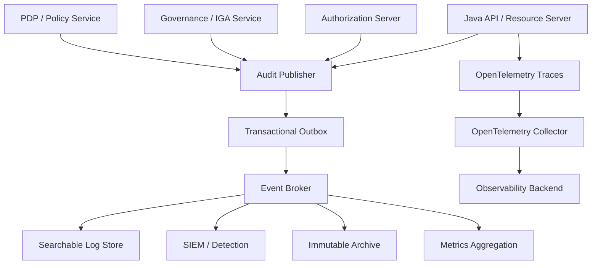
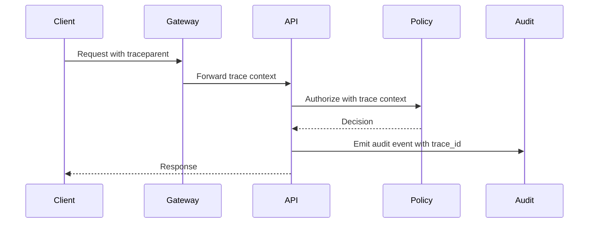

------
title: Learn Java Identity, Authentication & Authorization for Secure Enterprise API Platform - Part 030
description: Audit, evidence, dan security observability untuk Java identity/API platform: structured audit events, authorization decision logs, correlation IDs, privacy-safe telemetry, SIEM integration, and regulatory defensibility.
series: learn-java-identity-authentication-authorization-api-platform
seriesTitle: Learn Java Identity, Authentication & Authorization for Secure Enterprise API Platform
order: 30
partTitle: Audit, Evidence, and Security Observability
tags:
- java
- identity
- authorization
- audit
- observability
- logging
- security-events
- opentelemetry
- siem
- api-security
- enterprise-platform
date: 2026-06-28
---

# Part 030 — Audit, Evidence, and Security Observability

## 1. Problem Framing

Security control yang tidak bisa diamati akan gagal diam-diam.

Identity platform bisa memiliki OAuth, OIDC, JWT validation, MFA, RBAC, ABAC, tenant isolation, dan SoD. Tetapi ketika terjadi incident atau audit, pertanyaan yang muncul adalah:

- Siapa login?
- Login memakai authenticator apa?
- Access token diterbitkan untuk client mana?
- Token dipakai ke API apa?
- Authorization decision apa yang dibuat?
- Policy versi berapa yang menghasilkan keputusan itu?
- Apakah ada step-up?
- Apakah ada impersonation atau delegation?
- Siapa menyetujui entitlement?
- Apakah role sudah direview?
- Apakah request ditolak karena BOLA attempt?
- Apakah ada tenant escape attempt?
- Apakah audit log bisa dipercaya?

Audit, evidence, dan observability menjawab:

> “Apa yang terjadi, oleh siapa, terhadap apa, berdasarkan keputusan apa, dalam konteks apa, dan bagaimana kita membuktikannya?”

Target part ini:

> Kamu mampu mendesain security observability untuk Java identity/API platform: structured audit events, decision evidence, correlation, privacy-safe logging, tamper resistance, alerting, SIEM integration, and incident-ready traces.

---

## 2. Kaufman Skill Target

Setelah part ini, kamu harus bisa:

1. Membedakan operational log, audit event, metric, trace, and evidence record.
2. Mendesain schema audit event untuk authentication, token, authorization, entitlement, delegation, tenant, and admin actions.
3. Menentukan event mana wajib dicatat dan mana tidak.
4. Menyusun correlation model untuk request lintas service.
5. Menulis structured logging di Java tanpa leaking token/PII.
6. Mendesain authorization decision log yang aman dan berguna.
7. Menghubungkan audit event dengan OpenTelemetry trace/log/metric.
8. Mendesain retention, integrity, and access control for audit data.
9. Membuat alert rule untuk identity/API abuse.
10. Menguji audit correctness sebagai bagian dari security testing.

---

## 3. Mental Model: Logs Are Not Evidence by Default

Log biasa adalah catatan teknis.

Audit evidence adalah record yang sengaja didesain untuk membuktikan event security/business-critical.

| Type | Purpose | Example |
|---|---|---|
| Application log | Debugging/operation. | `UserService failed to call directory`. |
| Security audit event | Evidence of security-relevant action. | `authorization.decision.denied`. |
| Metric | Aggregated signal. | `authz_denied_total{reason="scope_mismatch"}`. |
| Trace | Distributed request path. | API Gateway -> Resource API -> Policy Service. |
| Evidence package | Audit-ready bundle. | Request + approval + decision + policy version. |

Important invariant:

> Do not rely on free-text logs for audit. Use structured audit events with stable schema.

---

## 4. Audit Architecture Overview



Design principle:

- Application emits structured audit event.
- Transactional outbox protects event durability for business/security commands.
- Broker distributes to SIEM, archive, and analytics.
- Trace/log correlation allows incident reconstruction.
- Immutable archive protects evidence retention.

---

## 5. Event Taxonomy

A mature identity platform should define event families.

### 5.1 Authentication Events

```text
authn.login.started
authn.login.succeeded
authn.login.failed
authn.mfa.challenge.created
authn.mfa.challenge.succeeded
authn.mfa.challenge.failed
authn.passkey.registered
authn.password.changed
authn.account.locked
authn.account.recovered
authn.session.created
authn.session.terminated
```

### 5.2 Token Events

```text
oauth.authorization.started
oauth.authorization.consent.granted
oauth.authorization.consent.denied
oauth.token.issued
oauth.token.refreshed
oauth.token.revoked
oauth.refresh_token.reuse_detected
oauth.client.authentication.failed
oauth.client.secret.rotated
oauth.jwk.rotated
```

### 5.3 Authorization Events

```text
authz.decision.permitted
authz.decision.denied
authz.decision.step_up_required
authz.policy.changed
authz.policy.published
authz.sod.violation.detected
authz.tenant_scope_mismatch
authz.object_access.denied
```

### 5.4 Entitlement Governance Events

```text
entitlement.request.submitted
entitlement.request.approved
entitlement.request.rejected
entitlement.provisioned
entitlement.revoked
entitlement.expired
access_review.campaign.started
access_review.item.certified
access_review.item.revoked
break_glass.activated
break_glass.expired
break_glass.review.completed
```

### 5.5 Delegation / Impersonation Events

```text
delegation.consent.granted
delegation.consent.revoked
impersonation.started
impersonation.action.performed
impersonation.ended
obo.token_exchanged
support_mode.activated
support_mode.denied
```

### 5.6 Tenant and Admin Events

```text
tenant.created
tenant.disabled
tenant.admin.assigned
tenant.config.changed
tenant.identity_provider.changed
admin.user.created
admin.role.assigned
admin.policy.override.created
```

---

## 6. Audit Event Schema

Audit schema should be explicit and stable.

```java
public record SecurityAuditEvent(
        AuditEventId eventId,
        String eventType,
        Instant occurredAt,
        String sourceService,
        String environment,
        Correlation correlation,
        Actor actor,
        Actor effectiveActor,
        ClientContext client,
        ResourceRef resource,
        ActionRef action,
        DecisionRef decision,
        TenantRef tenant,
        Map<String, String> attributes,
        Sensitivity sensitivity,
        EventOutcome outcome,
        String schemaVersion
) {}
```

Key concepts:

| Field | Meaning |
|---|---|
| `eventId` | Unique ID for deduplication and investigation. |
| `eventType` | Stable taxonomy name. |
| `occurredAt` | Time of event, not ingestion. |
| `sourceService` | Service that observed/emitted event. |
| `correlation` | Request/trace/cause IDs. |
| `actor` | Original actor. |
| `effectiveActor` | Actor being represented, if delegation/impersonation. |
| `client` | OAuth client/application/workload. |
| `resource` | Resource being acted on. |
| `decision` | Authorization/token/authn decision reference. |
| `tenant` | Tenant boundary. |
| `attributes` | Controlled extension fields. |
| `sensitivity` | Classification of event content. |
| `outcome` | Success, failure, deny, error, partial. |

---

## 7. Actor Chain

In enterprise identity, actor is not always simple.

Examples:

```text
Human user directly acts.
Support agent impersonates customer.
Service acts on behalf of human user.
Batch job acts as workload.
Policy automation revokes access.
Break-glass admin performs emergency action.
```

Represent actor chain explicitly.

```java
public record Actor(
        String actorType,
        String subjectId,
        String accountId,
        String displayNameHash,
        String assuranceLevel,
        List<String> authenticationMethods
) {}

public record ActorChain(
        Actor originalActor,
        Actor effectiveActor,
        DelegationRef delegation,
        ImpersonationRef impersonation,
        WorkloadRef workload
) {}
```

Do not overwrite original actor during impersonation.

Bad:

```text
actor = customer-123
```

Better:

```text
originalActor = support-agent-456
effectiveActor = customer-123
impersonationId = imp-789
purpose = customer-support-ticket-555
```

---

## 8. Authorization Decision Evidence

A useful authorization audit event records decision context without leaking secrets.

```java
public record AuthorizationDecisionEvidence(
        DecisionId decisionId,
        SubjectId subjectId,
        Action action,
        ResourceDescriptor resource,
        TenantId tenantId,
        DecisionResult result,
        List<String> matchedPolicies,
        String policyVersion,
        List<String> reasonCodes,
        Instant decidedAt,
        long latencyMillis
) {}
```

Do not log:

- Raw access token.
- Raw refresh token.
- Password.
- Full PII payload.
- Sensitive request body.
- Full JWT unless explicitly redacted and justified.
- Private key material.
- Session cookie.

Log reason codes, not raw internal details.

```text
Good reason code: tenant_scope_mismatch
Bad detail: user tried tenant bank-b but token tenant bank-a and internal SQL predicate was ...
```

---

## 9. Correlation Model

Incident reconstruction needs correlation.

Minimum IDs:

| ID | Purpose |
|---|---|
| `trace_id` | Distributed trace correlation. |
| `span_id` | Specific span. |
| `request_id` | External request/request log correlation. |
| `correlation_id` | Business workflow correlation. |
| `causation_id` | Which event/command caused this event. |
| `decision_id` | Authorization decision. |
| `session_id_hash` | Session correlation without exposing ID. |
| `token_jti_hash` | Token correlation without exposing raw token. |

```java
public record Correlation(
        String traceId,
        String spanId,
        String requestId,
        String correlationId,
        String causationId,
        String decisionId,
        String sessionIdHash,
        String tokenIdHash
) {}
```

### 9.1 MDC in Java

```java
public final class CorrelationFilter extends OncePerRequestFilter {

    @Override
    protected void doFilterInternal(
            HttpServletRequest request,
            HttpServletResponse response,
            FilterChain filterChain
    ) throws ServletException, IOException {
        String requestId = Optional.ofNullable(request.getHeader("X-Request-Id"))
                .filter(this::isValidRequestId)
                .orElse(UUID.randomUUID().toString());

        try (MDC.MDCCloseable ignored = MDC.putCloseable("request_id", requestId)) {
            response.setHeader("X-Request-Id", requestId);
            filterChain.doFilter(request, response);
        }
    }

    private boolean isValidRequestId(String value) {
        return value.length() <= 128 && value.matches("[a-zA-Z0-9._:-]+\\z");
    }
}
```

Do not trust arbitrary correlation IDs blindly. Validate length and character set.

---

## 10. Structured Logging

Use structured JSON logs or equivalent.

Example event:

```json
{
  "schema_version": "security-audit-v1",
  "event_id": "evt-01J0...",
  "event_type": "authz.decision.denied",
  "occurred_at": "2026-06-28T10:15:30Z",
  "source_service": "case-api",
  "environment": "prod",
  "trace_id": "7b3f...",
  "request_id": "req-123",
  "tenant_id": "tenant-a",
  "actor_type": "human",
  "subject_id": "user-123",
  "client_id": "case-web-bff",
  "action": "case.approve",
  "resource_type": "case",
  "resource_id_hash": "sha256:...",
  "decision_id": "dec-789",
  "decision_result": "deny",
  "reason_codes": ["sod_conflict", "case_creator_cannot_approve"],
  "policy_version": "policy-2026.06.15",
  "outcome": "denied"
}
```

Structured logs allow:

- SIEM queries.
- Metrics extraction.
- Alerting.
- Evidence reconstruction.
- Consistent redaction.
- Contract testing.

---

## 11. Audit Publisher Pattern

Do not scatter audit logging everywhere.

Create explicit audit publisher.

```java
public interface AuditPublisher {
    void publish(SecurityAuditEvent event);
}
```

Implementation with outbox:

```java
@Service
public class OutboxAuditPublisher implements AuditPublisher {

    private final AuditOutboxRepository repository;
    private final ObjectMapper objectMapper;

    @Override
    public void publish(SecurityAuditEvent event) {
        try {
            String payload = objectMapper.writeValueAsString(event);
            repository.save(new AuditOutboxRecord(
                    event.eventId().value(),
                    event.eventType(),
                    payload,
                    event.occurredAt(),
                    OutboxState.PENDING
            ));
        } catch (JsonProcessingException ex) {
            throw new AuditSerializationException("Failed to serialize audit event", ex);
        }
    }
}
```

For security-critical commands, prefer transactional outbox:

```java
@Transactional
public void revokeEntitlement(EntitlementId id, AuthenticatedActor actor) {
    Entitlement entitlement = entitlementRepository.findForUpdate(id)
            .orElseThrow();

    Entitlement revoked = entitlement.revoke(actor.subjectId(), Instant.now());
    entitlementRepository.save(revoked);

    auditPublisher.publish(SecurityAuditEvents.entitlementRevoked(revoked, actor));
}
```

If DB transaction commits, audit outbox record commits too.

---

## 12. What Must Be Audited?

Audit these events at minimum.

### Authentication

- Login success/failure.
- MFA success/failure.
- Account lock/unlock.
- Password/passkey change.
- Account recovery.
- Session creation/termination.

### OAuth/OIDC

- Authorization grant approved/denied.
- Token issued/refreshed/revoked.
- Refresh token reuse detected.
- Client authentication failure.
- Redirect URI mismatch.
- Consent changes.
- Key rotation.

### Authorization

- High-risk permit.
- Deny for sensitive action.
- Step-up required/satisfied.
- BOLA/object-level deny.
- Tenant scope mismatch.
- Policy decision error.
- Policy version changed.

### Governance

- Access request submitted/approved/rejected.
- Entitlement provisioned/revoked/expired.
- Access review decision.
- SoD violation.
- Break-glass activation and use.
- Impersonation start/action/end.

### Administration

- Role/permission/policy changes.
- IdP/tenant configuration changes.
- Admin user creation.
- Service account creation/credential rotation.
- Audit configuration changes.

---

## 13. What Should Not Be Logged?

Never log:

- Passwords.
- OTP values.
- Raw bearer tokens.
- Raw refresh tokens.
- Client secrets.
- Private keys.
- Session cookies.
- Full identity documents.
- Full sensitive case data.
- Full request/response body by default.

Sometimes log hashed reference:

```java
public final class TokenFingerprint {
    public static String fingerprint(String token, SecretKey key) {
        // Use keyed hash for correlation. Do not expose raw token.
        byte[] mac = hmacSha256(key, token.getBytes(StandardCharsets.UTF_8));
        return "hmac-sha256:" + Base64.getUrlEncoder().withoutPadding().encodeToString(mac);
    }
}
```

Avoid plain SHA-256 for low-entropy identifiers. Use keyed hashing when logs could be queried by untrusted operators.

---

## 14. Privacy-Safe Audit

Audit data itself becomes sensitive.

Controls:

- Minimize PII.
- Hash or pseudonymize where possible.
- Separate display name from immutable subject ID.
- Classify event sensitivity.
- Limit log access.
- Mask sensitive attributes.
- Define retention by event class.
- Support legal hold where applicable.
- Do not put secrets in attributes map.

Example classification:

```java
public enum Sensitivity {
    PUBLIC_OPERATIONAL,
    INTERNAL_SECURITY,
    CONFIDENTIAL_IDENTITY,
    RESTRICTED_PRIVILEGED,
    REGULATED_PERSONAL_DATA
}
```

---

## 15. Audit Event Validation

Audit events should be validated like API contracts.

```java
public final class AuditEventValidator {

    public void validate(SecurityAuditEvent event) {
        requireNonBlank(event.eventType(), "eventType");
        requireNonNull(event.occurredAt(), "occurredAt");
        requireNonNull(event.eventId(), "eventId");
        requireNonBlank(event.schemaVersion(), "schemaVersion");

        if (event.eventType().startsWith("authz.decision")) {
            requireNonNull(event.actor(), "actor");
            requireNonNull(event.action(), "action");
            requireNonNull(event.resource(), "resource");
            requireNonNull(event.decision(), "decision");
        }

        if (containsRawSecret(event)) {
            throw new InvalidAuditEventException("audit_event_contains_secret_like_value");
        }
    }
}
```

Test serialization:

```java
@Test
void authzDeniedEventContainsRequiredFields() {
    SecurityAuditEvent event = SecurityAuditEvents.authorizationDenied(sampleDecision());

    assertThat(event.eventType()).isEqualTo("authz.decision.denied");
    assertThat(event.decision().reasonCodes()).contains("tenant_scope_mismatch");
    assertThat(event.correlation().traceId()).isNotBlank();
}
```

---

## 16. Authorization Audit Placement

Where should authorization decisions be logged?

| Layer | Audit Use |
|---|---|
| Gateway | Request accepted/rejected at edge; coarse client/token checks. |
| Resource server | Token validation, audience/issuer, endpoint access. |
| Domain service | Object-level and business authorization decisions. |
| Policy service | Matched policy/reason/decision. |
| Data layer | Optional evidence for query-level constraints. |

Best practice:

- Log coarse deny at gateway/resource server.
- Log authoritative domain authorization decision at domain/policy layer.
- Avoid duplicate noisy events for the same decision; correlate with same `decision_id`.

---

## 17. Decision ID Pattern

Generate a `decision_id` per authorization decision.

```java
public final class AuditedAuthorizationService {

    public AuthorizationDecision decide(AuthorizationRequest request) {
        DecisionId decisionId = DecisionId.newId();
        Instant started = Instant.now();

        AuthorizationDecision decision = policyEngine.decide(request.withDecisionId(decisionId));

        auditPublisher.publish(SecurityAuditEvents.authorizationDecision(
                decisionId,
                request,
                decision,
                Duration.between(started, Instant.now())
        ));

        return decision;
    }
}
```

Use `decision_id` in:

- API response headers for internal debugging only if safe.
- Logs.
- Policy service trace.
- Audit event.
- Test assertions.

Do not expose sensitive reason details to external clients.

---

## 18. Metrics for Identity Security

Metrics are not audit evidence, but they provide operational signal.

Examples:

```text
authn_login_success_total{tenant, client}
authn_login_failure_total{tenant, reason}
oauth_token_issued_total{client, grant_type}
oauth_refresh_reuse_detected_total{client}
authz_decision_total{service, action, result, reason}
authz_decision_latency_ms{service, action}
entitlement_active_total{risk_tier, tenant}
break_glass_activation_total{tenant}
impersonation_active_total{tenant}
access_review_overdue_total{tenant}
```

Alert examples:

```text
More than 10 refresh token reuse detections in 5 minutes.
Global admin entitlement created in production.
Break-glass activated outside incident window.
Tenant scope mismatch spikes after deployment.
Authorization policy errors > 0 in production.
Deny rate for one endpoint increases 10x.
Service account token issuance from unusual network.
```

---

## 19. OpenTelemetry Integration

Use OpenTelemetry for correlation across traces, metrics, and logs.

Conceptually:



Add safe attributes to spans:

```java
Span current = Span.current();
current.setAttribute("enduser.id", principal.subjectId().value());
current.setAttribute("app.tenant_id", principal.tenantId().value());
current.setAttribute("authz.action", request.action().value());
current.setAttribute("authz.result", decision.result().name());
```

Be careful:

- Do not put raw tokens into span attributes.
- Do not put sensitive resource payloads into baggage.
- Treat baggage as propagated context, not secret storage.
- Control cardinality for metrics.

---

## 20. SIEM Event Design

SIEM-friendly events need stable fields.

Recommended normalized fields:

```yaml
event.category: authentication | authorization | iam | api | admin
event.type: start | success | failure | denial | change | info
event.action: authz.decision.denied
user.id: user-123
user.effective.id: customer-456
client.id: case-web-bff
service.name: case-api
tenant.id: tenant-a
source.ip: 203.0.113.10
http.request.method: POST
url.path: /cases/{id}/approve
resource.type: case
resource.id_hash: hmac-sha256:...
authz.action: case.approve
authz.result: deny
authz.reason: sod_conflict
policy.version: policy-2026.06.15
trace.id: ...
```

Do not make SIEM parse free-text messages.

---

## 21. Evidence Package Pattern

For high-value actions, create evidence package.

Example: final sanction approval.

```yaml
evidencePackageId: evp-123
action: case.approve_final_sanction
actor:
  subjectId: user-123
  assurance: aal2
  authMethods: [pwd, otp]
resource:
  type: enforcement_case
  idHash: hmac-sha256:...
  tenant: tenant-a
authorization:
  decisionId: dec-456
  result: permit
  policies:
    - case-final-approval-v7
  reasonCodes:
    - supervisor_role_active
    - not_case_creator
    - tenant_scope_match
entitlement:
  id: ent-789
  role: CASE_SUPERVISOR
  scope: tenant-a/project-x
  validUntil: 2026-07-01T00:00:00Z
request:
  traceId: trace-abc
  requestId: req-def
outcome:
  status: succeeded
  committedAt: 2026-06-28T10:20:00Z
```

Evidence package links decision, entitlement, actor, resource, command, and outcome.

---

## 22. Tamper Resistance and Integrity

Audit logs need protection.

Controls:

- Append-only storage where possible.
- Restricted write path.
- Separate duties for application admin vs audit admin.
- Immutable archive/WORM for regulated events.
- Hash chaining or signed batches for high-assurance evidence.
- Clock synchronization.
- Retention policies.
- Deletion approval workflow.
- Monitoring of audit pipeline failure.

Do not let application users modify audit records.

Do not store audit only inside same mutable database table controlled by same admin role unless risk is accepted and documented.

### 22.1 Hash Chain Sketch

```java
public record AuditBatch(
        String batchId,
        String previousBatchHash,
        List<SecurityAuditEvent> events,
        String batchHash,
        Instant closedAt
) {}
```

Hash chain is not a substitute for access control, immutable storage, or backup. It is evidence strengthening.

---

## 23. Time and Clock Correctness

Audit depends on time.

Rules:

- Use UTC for storage.
- Capture `occurredAt` at source.
- Capture `ingestedAt` at pipeline.
- Monitor clock drift.
- Use monotonic time for latency, wall-clock for event time.
- Store timezone only for display, not ordering.

```java
public record EventTime(
        Instant occurredAt,
        Instant observedAt,
        Instant ingestedAt
) {}
```

Do not rely on client-provided timestamp for audit truth.

---

## 24. Failure Handling

What happens if audit publishing fails?

Depends on event criticality.

| Event | Failure Mode |
|---|---|
| Login failed | Log best-effort plus local fallback. |
| Token issued | Should be durable. |
| Entitlement granted | Must be durable with command. |
| Break-glass activated | Must be durable or fail closed. |
| Policy changed | Must be durable. |
| Read-only low-risk API permit | Usually best-effort with metrics. |
| High-risk action permit | Prefer durable evidence. |

For high-risk command:

> If you cannot record evidence, fail closed or enter explicit degraded mode with incident alert.

---

## 25. Transactional Outbox Relay

```java
@Component
public class AuditOutboxRelay {

    @Scheduled(fixedDelayString = "PT5S")
    public void publishPending() {
        List<AuditOutboxRecord> records = repository.findPendingBatch(100);

        for (AuditOutboxRecord record : records) {
            try {
                broker.publish(record.eventType(), record.payload());
                repository.markPublished(record.id(), Instant.now());
            } catch (Exception ex) {
                repository.markFailedAttempt(record.id(), ex.getClass().getSimpleName(), Instant.now());
            }
        }
    }
}
```

Operational controls:

- Alert on outbox backlog.
- Alert on publish failures.
- Use idempotent event IDs.
- Avoid unbounded retry without dead-letter.
- Protect payload from accidental PII leakage.

---

## 26. Query Examples for Investigation

### 26.1 Who accessed a case?

```sql
SELECT occurred_at, subject_id, client_id, action, decision_result, reason_codes
FROM security_audit_event
WHERE tenant_id = 'tenant-a'
  AND resource_type = 'case'
  AND resource_id_hash = :case_id_hash
  AND event_type IN ('authz.decision.permitted', 'authz.decision.denied')
ORDER BY occurred_at;
```

### 26.2 Who used break-glass?

```sql
SELECT occurred_at, subject_id, scope, attributes->>'reason' AS reason
FROM security_audit_event
WHERE event_type = 'break_glass.activated'
  AND occurred_at >= now() - interval '30 days'
ORDER BY occurred_at DESC;
```

### 26.3 Tenant escape attempts

```sql
SELECT subject_id, client_id, count(*) AS attempts
FROM security_audit_event
WHERE event_type = 'authz.tenant_scope_mismatch'
  AND occurred_at >= now() - interval '24 hours'
GROUP BY subject_id, client_id
ORDER BY attempts DESC;
```

---

## 27. Testing Audit Correctness

Audit must be tested.

### 27.1 Unit Test

```java
@Test
void deniedAuthorizationPublishesAuditEvent() {
    AuthorizationRequest request = sampleRequest(Action.CASE_APPROVE);
    when(policyEngine.decide(request)).thenReturn(AuthorizationDecision.deny("sod_conflict"));

    assertThatThrownBy(() -> securedCaseService.approve(caseId, request.actor()))
            .isInstanceOf(AccessDeniedException.class);

    verify(auditPublisher).publish(argThat(event ->
            event.eventType().equals("authz.decision.denied")
                    && event.decision().reasonCodes().contains("sod_conflict")
                    && event.actor().subjectId().equals("user-123")
    ));
}
```

### 27.2 Contract Test

Validate JSON schema for each event type.

```text
Given authz.decision.denied
Then required fields exist:
  event_id
  event_type
  occurred_at
  actor.subject_id
  action
  resource.type
  decision.result
  decision.reason_codes
  trace_id
```

### 27.3 Secret Leakage Test

```java
@Test
void auditEventMustNotContainBearerToken() throws Exception {
    SecurityAuditEvent event = sampleEventWithAttributes(Map.of(
            "authorization_header", "Bearer abc.def.ghi"
    ));

    assertThatThrownBy(() -> validator.validate(event))
            .isInstanceOf(InvalidAuditEventException.class);
}
```

### 27.4 End-to-End Test

Scenario:

1. User requests privileged access.
2. Manager approves.
3. Security approves.
4. Entitlement active.
5. User performs high-risk action.
6. Audit store contains request, approvals, activation, decision, action outcome.
7. Evidence package can be reconstructed.

---

## 28. Detection Rules

### 28.1 Refresh Token Reuse

```text
WHEN oauth.refresh_token.reuse_detected count > 0
THEN create high-priority security alert
AND revoke related grant/session
```

### 28.2 Impossible Tenant Access

```text
WHEN authz.tenant_scope_mismatch occurs repeatedly for same subject/client
THEN alert potential tenant probing or client bug
```

### 28.3 Privileged Access Outside Change Window

```text
WHEN policy.published OR admin.role.assigned outside approved change window
THEN alert platform security owner
```

### 28.4 Break-Glass Use

```text
WHEN break_glass.activated
THEN notify incident channel immediately
AND create post-use review task
```

### 28.5 Service Account Anomaly

```text
WHEN service account token issued from new network/location
OR token issuance volume spikes
THEN alert owner
```

---

## 29. Access Control for Audit Data

Audit logs are sensitive.

Roles:

| Role | Capability |
|---|---|
| Security analyst | Search security events. |
| Auditor | Read evidence packages. |
| Service owner | View events for owned service. |
| Tenant admin | View tenant-scoped audit events. |
| Platform admin | Operate pipeline, not modify evidence. |
| Break-glass auditor | Review emergency events. |

Controls:

- Audit read access is itself audited.
- Tenant filtering must apply to audit queries.
- Sensitive event attributes require additional permission.
- Exporting audit data is privileged action.
- Redaction policies apply to UI and API.

---

## 30. Retention Strategy

Retention depends on regulation, business risk, and privacy.

Example retention categories:

| Event Class | Retention |
|---|---:|
| Debug application logs | 7–30 days |
| Authentication security events | 1–2 years |
| Authorization decisions for sensitive data | 2–7 years |
| Entitlement request/approval/review | 5–7 years |
| Break-glass and privileged admin | 7+ years or legal requirement |
| Token issuance low-risk aggregate | shorter, aggregate long-term |

Do not retain secrets accidentally just because logs are long-retained.

---

## 31. API Design for Audit Search

```http
GET /internal/audit-events?tenantId=tenant-a&subjectId=user-123&from=2026-06-01T00:00:00Z&to=2026-06-30T00:00:00Z
Authorization: Bearer ...
```

Guardrails:

- Require audit-read permission.
- Enforce tenant scope.
- Limit time range.
- Paginate.
- Redact by role.
- Rate-limit.
- Audit the audit query.

Controller sketch:

```java
@GetMapping("/internal/audit-events")
public Page<AuditEventView> search(AuditSearchRequest request, Authentication authentication) {
    AuthenticatedActor actor = actorFactory.from(authentication);

    AuditSearchAuthorizationDecision decision = auditSearchAuthorizer.authorize(actor, request);
    if (!decision.permitted()) {
        throw new AccessDeniedException("audit_search_denied");
    }

    auditPublisher.publish(SecurityAuditEvents.auditSearchPerformed(actor, request));
    return auditSearchService.search(request, decision.visibleFields());
}
```

---

## 32. Failure Modes

### 32.1 Free-Text Audit

Symptoms:

```text
User did thing
Access denied
Policy failed
```

Fix:

- Stable event taxonomy.
- Structured schema.
- Required fields.

### 32.2 Secret Leakage

Symptoms:

- Bearer token in log.
- Authorization header captured.
- Request body logged with credentials.

Fix:

- Central redaction.
- Tests for secret-like patterns.
- Safe logging wrappers.
- Disable full body logging by default.

### 32.3 Audit Lost on Rollback

Symptoms:

- Command succeeds but audit missing.
- Audit event sent before transaction rolls back.

Fix:

- Transactional outbox.
- Event emitted after durable state change.
- Idempotent relay.

### 32.4 No Correlation

Symptoms:

- Cannot connect login, token, API call, policy decision.

Fix:

- Trace ID.
- Request ID.
- Decision ID.
- Token/session fingerprint.
- Actor chain.

### 32.5 Audit Theater

Symptoms:

- Logs exist but cannot answer audit questions.
- Review evidence incomplete.
- Event schema changes without versioning.

Fix:

- Evidence package design.
- Contract tests.
- Audit query drills.

---

## 33. Anti-Patterns

| Anti-Pattern | Why Dangerous | Better Design |
|---|---|---|
| Log raw JWT | Token leakage. | Token fingerprint. |
| Free-text only | Cannot query reliably. | Structured events. |
| No decision reason | Audit cannot explain deny/permit. | Reason codes. |
| No actor chain | Impersonation hides original actor. | Original + effective actor. |
| Log everything | PII/secrets/retention risk. | Data minimization. |
| Audit stored only locally | Lost during incident. | Central pipeline + archive. |
| No audit access control | Logs become data leak. | Tenant/role-filtered access. |
| No event schema version | Consumers break silently. | Versioned event contract. |
| No outbox for critical events | Missing evidence. | Transactional outbox. |
| Metrics only | No evidence. | Audit event + metrics. |

---

## 34. Operational Checklist

Before production:

- [ ] Event taxonomy is documented.
- [ ] Audit event schema is versioned.
- [ ] Authentication/token/authorization/governance/admin events are covered.
- [ ] Raw tokens/secrets are redacted.
- [ ] Correlation IDs are propagated.
- [ ] Actor chain supports delegation/impersonation.
- [ ] Authorization decisions have `decision_id`.
- [ ] Policy version is recorded.
- [ ] Tenant ID is recorded and enforced in audit search.
- [ ] High-risk commands use durable audit/outbox.
- [ ] Audit pipeline backlog is monitored.
- [ ] SIEM rules exist for high-risk events.
- [ ] Audit read/export is itself audited.
- [ ] Retention policy is defined.
- [ ] Secret leakage tests exist.
- [ ] Evidence reconstruction drill has been performed.

---

## 35. Practice Drill

Scenario:

> A support agent activates support mode and accesses a customer case in tenant A. They attempt to approve a case decision but are denied because support mode does not include approval. Later, a supervisor approves the case after MFA. Audit must prove who did what, why the first action was denied, why the second was permitted, and which policy version made the decisions.

Deliverables:

1. Event taxonomy entries.
2. Audit schema instances for each action.
3. Actor chain representation.
4. Correlation strategy.
5. Authorization decision evidence.
6. SIEM alert rule for support-mode misuse.
7. Audit search query to reconstruct timeline.
8. Secret/PII redaction plan.

Self-check:

- Can you reconstruct the timeline without application debug logs?
- Can you prove the support agent did not approve the case?
- Can you show the supervisor satisfied MFA?
- Can you show policy version and reason codes?
- Can tenant B auditor see tenant A data? They must not.

---

## 36. Key Takeaways

- Logs are not evidence by default.
- Security audit must use structured, versioned events.
- Authorization decisions need reason codes, policy version, actor, resource, tenant, and correlation.
- Actor chain is mandatory for delegation, impersonation, and service-to-service calls.
- Audit data is sensitive and needs its own authorization model.
- Durable audit is required for privileged and regulated commands.
- OpenTelemetry helps correlate traces/logs/metrics, but do not put secrets in telemetry.
- Evidence packages make audits and incident investigations faster and more defensible.

---

## 37. References

- NIST SP 800-92 — Guide to Computer Security Log Management.
- NIST SP 800-53 Rev. 5 — Audit and Accountability controls and Access Control controls.
- OWASP Logging Cheat Sheet.
- OWASP Logging Vocabulary Cheat Sheet.
- OWASP Top 10 2021 A09 — Security Logging and Monitoring Failures.
- OpenTelemetry Specification — Logs, traces, metrics, context propagation, baggage.
- Spring Security documentation for authentication, authorization, OAuth2 resource server, and method security.
