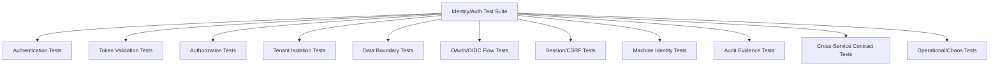
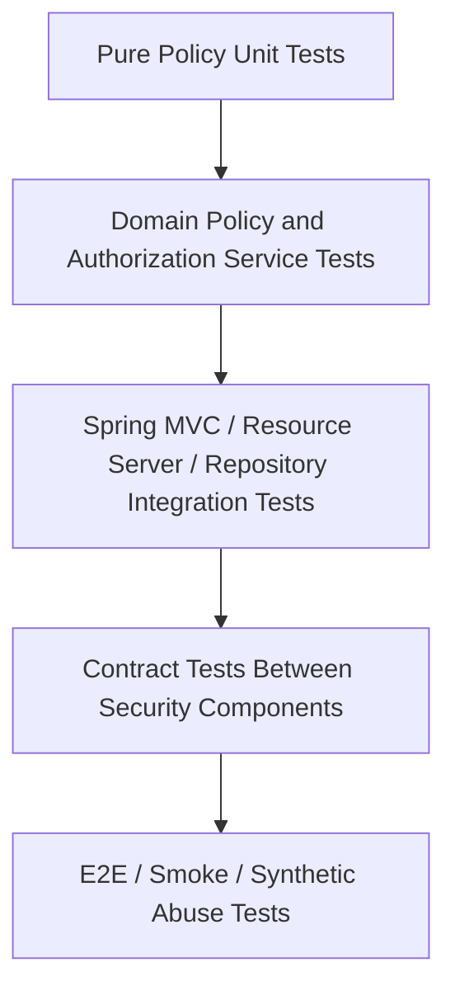
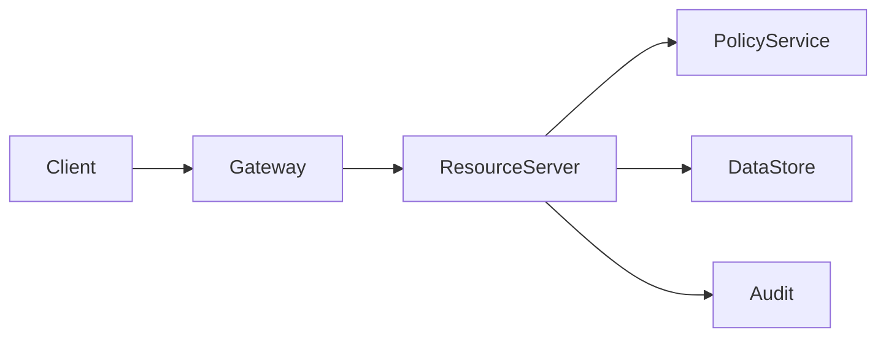

------
title: Learn Java Identity, Authentication & Authorization for Secure Enterprise API Platform - Part 031
description: Testing identity and authorization correctness untuk Java enterprise API platform: authorization matrix, negative testing, BOLA regression, token validation, tenant isolation, Spring Security testing, contract testing, and CI security gates.
series: learn-java-identity-authentication-authorization-api-platform
seriesTitle: Learn Java Identity, Authentication & Authorization for Secure Enterprise API Platform
order: 31
partTitle: Testing Identity and Authorization Correctness
tags:
- java
- identity
- authentication
- authorization
- api-security
- testing
- spring-security
- oauth2
- oidc
- bola
- multi-tenancy
- enterprise-platform
date: 2026-06-28
---

# Part 031 — Testing Identity and Authorization Correctness

## 1. Problem Framing

Identity dan authorization bug jarang terlihat seperti bug biasa.

Bug biasa sering menghasilkan exception, wrong calculation, atau failed workflow. Authorization bug sering menghasilkan sesuatu yang jauh lebih berbahaya:

- request berhasil padahal harus ditolak,
- user melihat object milik user lain,
- tenant A membaca data tenant B,
- service account memakai permission terlalu luas,
- support admin melakukan impersonation tanpa audit,
- token invalid diterima karena validation pipeline longgar,
- role lama tetap aktif karena entitlement stale,
- list/search/export endpoint bocor walau detail endpoint aman,
- test pass karena hanya menguji happy path.

Target part ini:

> Kamu mampu mendesain testing discipline untuk membuktikan correctness identity/auth platform, terutama melalui negative testing, authorization matrix, token validation tests, tenant isolation tests, BOLA regression tests, contract tests, and CI security gates.

Part ini bukan tentang “menambah coverage”. Coverage tinggi tidak berarti authorization benar.

Part ini tentang membuktikan invariant:

> For every protected resource, every action must be denied unless the caller has a valid identity, valid token/session, valid tenant boundary, valid authorization decision, and valid contextual constraints.

---

## 2. Kaufman Skill Target

Setelah part ini, kamu harus bisa:

1. Mengubah policy authorization menjadi executable test matrix.
2. Membedakan authentication test, token validation test, authorization test, tenant isolation test, and audit evidence test.
3. Membuat negative tests untuk BOLA, IDOR, privilege escalation, tenant escape, stale entitlement, and token misuse.
4. Menguji Spring Security resource server dengan mock JWT/opaque token secara aman.
5. Menguji method-level security tanpa bergantung pada controller test saja.
6. Menguji data access predicate agar list/search/export/count tidak bocor.
7. Menguji OAuth/OIDC integration tanpa membuat test suite rapuh.
8. Membuat contract tests antara gateway, resource server, policy service, and authorization server.
9. Mengintegrasikan security regression tests ke CI/CD gate.
10. Membuat test fixture identity yang expressif, aman, and reusable.

---

## 3. Mental Model: Security Tests Try to Falsify Trust

Testing business logic biasanya bertanya:

> “Apakah fitur berjalan untuk user yang benar?”

Testing authorization harus bertanya:

> “Siapa saja yang tidak boleh melakukan ini, dan apakah semuanya benar-benar ditolak?”

Security testing lebih dekat ke falsification daripada demonstration.

| Normal Test | Security-Oriented Test |
|---|---|
| Can owner read case? | Can non-owner read case? |
| Can admin approve? | Can admin approve outside tenant? |
| Can API accept valid token? | Does API reject wrong issuer/audience/expired token? |
| Can search return records? | Can search leak records across tenant or ownership boundary? |
| Can support impersonate? | Is impersonation blocked without explicit reason and audit trail? |

In identity platform, the most valuable tests are usually negative tests.

---

## 4. Testing Taxonomy for Identity/Auth Platform



Do not collapse all of them into “security tests”. Each category catches different failure modes.

---

## 5. Testing Pyramid for Authorization

A useful enterprise authorization test pyramid:



The mistake is putting all authorization tests at the E2E layer.

Better distribution:

| Layer | Best For | Avoid |
|---|---|---|
| Unit policy tests | Fast matrix evaluation. | Mocking away all context. |
| Domain service tests | Ownership, tenant, relationship, state. | Testing only controller annotations. |
| Repository/data tests | Predicate correctness, list/search/export. | Assuming service guard protects all query paths. |
| Spring integration tests | Filter chain, JWT mapping, 401/403, CSRF. | Re-testing every domain policy through HTTP. |
| Contract tests | Gateway/header/token/policy compatibility. | Assuming team conventions are enough. |
| E2E tests | Critical flows and smoke abuse scenarios. | Massive brittle security matrix. |

---

## 6. Core Security Invariants to Test

A secure Java API platform should have executable tests for these invariants.

### 6.1 Authentication Invariants

- Anonymous caller cannot access protected endpoints.
- Disabled user cannot authenticate.
- Locked user cannot authenticate.
- Password reset invalidates risky sessions or requires step-up.
- MFA-required operation rejects single-factor session.
- Account recovery cannot bypass assurance requirement.
- Login failure response does not reveal account existence.

### 6.2 Token Validation Invariants

- Expired token is rejected.
- Token with wrong issuer is rejected.
- Token with wrong audience is rejected.
- Token signed by unknown key is rejected.
- Token with unsupported algorithm is rejected.
- Token with missing required claim is rejected.
- Token with wrong tenant claim is rejected.
- ID Token is not accepted as API access token.
- Access token for API A is not accepted by API B.

### 6.3 Authorization Invariants

- Deny by default.
- Object owner can perform allowed owner actions.
- Non-owner cannot access owner-only object.
- Role does not imply tenant bypass.
- Scope does not imply object-level permission.
- Admin permission is bounded by tenant, purpose, and duty constraints.
- State transition requires state-specific permission.
- Step-up required operation rejects low-assurance session.

### 6.4 Data Boundary Invariants

- List returns only authorized records.
- Search returns only authorized records.
- Export returns only authorized records.
- Count/facet/aggregation does not leak unauthorized records.
- Child resource must be bound to authorized parent.
- Bulk action checks every item, not only request-level permission.

### 6.5 Tenant Isolation Invariants

- Tenant A token cannot access tenant B data.
- Tenant path/header/body mismatch is rejected.
- Cache keys include tenant boundary.
- Background job runs with explicit tenant context.
- Event consumer validates tenant before mutation.
- Search index query is tenant-scoped.

### 6.6 Audit Invariants

- Denied authorization decisions are logged.
- High-risk grants/role changes are logged.
- Impersonation records actor and effective subject.
- Break-glass records reason, approver if applicable, and expiry.
- Security event contains correlation ID and policy version.
- Token value and secrets are never logged.

---

## 7. Authorization Matrix as Executable Specification

Authorization matrix is not just documentation. It should become test input.

Example business domain:

- `Case`
- `Inspection`
- `Evidence`
- `EnforcementAction`
- `Appeal`

Actors:

- case owner,
- assigned inspector,
- supervisor,
- tenant admin,
- cross-tenant platform admin,
- support agent,
- external party,
- machine client.

Actions:

- read,
- update,
- approve,
- assign,
- export,
- close,
- reopen,
- delete.

Context:

- tenant,
- case state,
- assurance level,
- delegation,
- conflict of interest,
- time window,
- break-glass mode.

Represent it as explicit data:

```java
public record AuthorizationScenario(
    String name,
    TestPrincipal principal,
    ResourceFixture resource,
    Action action,
    RequestContext context,
    ExpectedDecision expected
) {}

public enum ExpectedDecision {
    PERMIT,
    DENY,
    STEP_UP_REQUIRED
}
```

Then run parameterized tests:

```java
@ParameterizedTest(name = "{0}")
@MethodSource("caseAuthorizationScenarios")
void caseAuthorizationPolicyMatchesSpecification(AuthorizationScenario scenario) {
    AuthorizationDecision decision = policy.evaluate(
        scenario.principal().toSubject(),
        scenario.action(),
        scenario.resource().toResourceRef(),
        scenario.context()
    );

    assertThat(decision.outcome()).isEqualTo(scenario.expected());
}
```

The matrix becomes a living specification.

---

## 8. Identity Test Fixtures

Poor fixtures produce misleading tests.

Avoid this:

```java
var user = new User("user");
```

It hides tenant, assurance, roles, scopes, relationships, and account state.

Better:

```java
TestPrincipal inspectorA = TestPrincipal.builder()
    .subject("user-inspector-a")
    .accountId("acct-inspector-a")
    .tenantId("tenant-a")
    .roles("INSPECTOR")
    .scopes("case.read", "case.update")
    .assuranceLevel("AAL2")
    .department("field-inspection")
    .attributes(Map.of("region", "west"))
    .build();

CaseFixture tenantACase = CaseFixture.builder()
    .caseId("case-a-001")
    .tenantId("tenant-a")
    .ownerSubject("user-owner-a")
    .assignedInspector("user-inspector-a")
    .state("UNDER_REVIEW")
    .region("west")
    .build();
```

A good identity fixture makes boundary visible.

Minimum useful principal fixture fields:

| Field | Why It Matters |
|---|---|
| subject | Stable identity claim. |
| accountId | Local account binding. |
| tenantId | Isolation boundary. |
| roles | Coarse authority. |
| scopes | OAuth API permission. |
| assuranceLevel | Step-up and high-risk action. |
| clientId | Human vs machine caller. |
| actor | Delegation/impersonation chain. |
| attributes | ABAC policy input. |
| entitlementVersion | Stale access detection. |

---

## 9. Testing Spring Security Resource Server

Spring Security provides testing helpers for authenticated requests. The goal is not to test Spring itself, but to test your configuration and claim mapping.

Example endpoint:

```java
@RestController
@RequestMapping("/api/cases")
class CaseController {

    private final CaseApplicationService cases;

    CaseController(CaseApplicationService cases) {
        this.cases = cases;
    }

    @GetMapping("/{caseId}")
    CaseDto getCase(@PathVariable String caseId) {
        return cases.getCase(caseId);
    }
}
```

Test unauthenticated request:

```java
@Test
void protectedEndpointRejectsAnonymousCaller() throws Exception {
    mvc.perform(get("/api/cases/case-a-001"))
        .andExpect(status().isUnauthorized());
}
```

Test JWT authority mapping:

```java
@Test
void endpointAcceptsJwtWithRequiredScope() throws Exception {
    mvc.perform(get("/api/cases/case-a-001")
            .with(jwt().jwt(jwt -> jwt
                .issuer("https://idp.example.test/tenant-a")
                .audience(List.of("case-api"))
                .subject("user-inspector-a")
                .claim("tenant_id", "tenant-a")
                .claim("scope", "case.read"))))
        .andExpect(status().isOk());
}
```

But do not stop there.

This only proves that HTTP security lets a request through. It does not prove object-level authorization.

---

## 10. Testing JWT Validation Rules

Mock JWT tests are useful for controller behavior, but they can bypass real decoder validation.

You need at least two test categories:

| Test Type | Purpose |
|---|---|
| Mock JWT test | Fast endpoint and authority behavior. |
| Real decoder test | Issuer, audience, signature, algorithm, JWKS, expiry validation. |

Example validator unit test:

```java
@Test
void audienceValidatorRejectsTokenForDifferentApi() {
    Jwt jwt = Jwt.withTokenValue("token")
        .header("alg", "RS256")
        .claim("iss", "https://idp.example.test")
        .claim("sub", "user-123")
        .claim("aud", List.of("billing-api"))
        .issuedAt(Instant.now())
        .expiresAt(Instant.now().plusSeconds(300))
        .build();

    OAuth2TokenValidator<Jwt> validator = new AudienceValidator("case-api");

    OAuth2TokenValidatorResult result = validator.validate(jwt);

    assertThat(result.hasErrors()).isTrue();
}
```

Example custom audience validator:

```java
final class AudienceValidator implements OAuth2TokenValidator<Jwt> {
    private final String requiredAudience;

    AudienceValidator(String requiredAudience) {
        this.requiredAudience = requiredAudience;
    }

    @Override
    public OAuth2TokenValidatorResult validate(Jwt jwt) {
        if (jwt.getAudience().contains(requiredAudience)) {
            return OAuth2TokenValidatorResult.success();
        }
        OAuth2Error error = new OAuth2Error(
            "invalid_token",
            "Required audience is missing",
            null
        );
        return OAuth2TokenValidatorResult.failure(error);
    }
}
```

Critical negative cases:

```text
wrong issuer
wrong audience
expired token
not-before in future
missing subject
missing tenant_id
wrong tenant_id
unsupported algorithm
wrong key
unknown kid
ID token used as access token
access token from staging accepted in prod
```

---

## 11. Testing Method-Level Security

Controller security is not enough. Domain/application service methods must reject unauthorized calls even if invoked internally.

Example:

```java
@Service
class CaseCommandService {

    @PreAuthorize("@caseAuthz.canClose(authentication, #caseId)")
    public void closeCase(String caseId) {
        // state transition
    }
}
```

Test method-level security:

```java
@Test
@WithMockUser(username = "inspector-a", authorities = "SCOPE_case.update")
void closeCaseRejectsInspectorWithoutClosePermission() {
    assertThatThrownBy(() -> service.closeCase("case-a-001"))
        .isInstanceOf(AccessDeniedException.class);
}
```

But annotation tests still have limits.

You also need pure policy tests:

```java
@Test
void closeCaseRequiresSupervisorAndCorrectTenant() {
    var principal = TestPrincipal.supervisor("tenant-a");
    var resource = CaseFixture.openCase("tenant-b");

    var decision = casePolicy.canClose(principal, resource, RequestContext.normal());

    assertThat(decision.isDenied()).isTrue();
    assertThat(decision.reason()).isEqualTo("TENANT_MISMATCH");
}
```

Rule:

> Test annotations lightly. Test policies heavily.

---

## 12. BOLA Regression Tests

BOLA tests must be systematic.

For every endpoint using an object identifier, test at least:

| Scenario | Expected |
|---|---|
| Owner accesses own object. | Permit. |
| Same-tenant non-owner accesses object. | Deny unless role/policy allows. |
| Different-tenant user accesses object. | Deny. |
| Admin from same tenant accesses object. | Permit only if policy allows. |
| Admin from different tenant accesses object. | Deny. |
| Support impersonation without reason. | Deny. |
| Machine client without object entitlement. | Deny. |
| Bulk request includes one unauthorized ID. | Deny whole request or return per-item denial by design. |

Example HTTP test:

```java
@Test
void getCaseRejectsDifferentTenantObjectReference() throws Exception {
    mvc.perform(get("/api/cases/case-b-001")
            .with(jwt().jwt(jwt -> jwt
                .subject("user-a")
                .claim("tenant_id", "tenant-a")
                .claim("scope", "case.read"))))
        .andExpect(status().isForbidden());
}
```

Better: generate scenarios from endpoint metadata.

```java
record ObjectEndpoint(
    String method,
    String pathTemplate,
    String idParameter,
    String action,
    String resourceType
) {}
```

Then maintain a registry:

```java
static Stream<ObjectEndpoint> objectEndpoints() {
    return Stream.of(
        new ObjectEndpoint("GET", "/api/cases/{caseId}", "caseId", "read", "case"),
        new ObjectEndpoint("PATCH", "/api/cases/{caseId}", "caseId", "update", "case"),
        new ObjectEndpoint("POST", "/api/cases/{caseId}/close", "caseId", "close", "case"),
        new ObjectEndpoint("GET", "/api/cases/{caseId}/evidence/{evidenceId}", "evidenceId", "read", "evidence")
    );
}
```

Security mature teams treat BOLA as a regression suite, not a one-time pentest finding.

---

## 13. Testing Parent-Child Binding

A frequent BOLA variant:

```http
GET /tenants/tenant-a/cases/case-a/evidence/evidence-b
```

The request path claims tenant A and case A, but child evidence belongs to case B or tenant B.

Bad implementation:

```java
Evidence evidence = evidenceRepository.findById(evidenceId).orElseThrow();
authorizeCaseAccess(caseId);
return evidence;
```

This authorizes the parent but returns unbound child.

Test:

```java
@Test
void evidenceMustBelongToAuthorizedCase() {
    var principal = TestPrincipal.inspector("tenant-a");
    var caseA = fixtures.caseInTenant("tenant-a");
    var evidenceFromDifferentCase = fixtures.evidenceInCase("tenant-a", "case-other");

    assertThatThrownBy(() -> service.getEvidence(
            principal,
            caseA.id(),
            evidenceFromDifferentCase.id()))
        .isInstanceOf(AccessDeniedException.class);
}
```

Correct repository shape:

```java
Optional<Evidence> findAuthorizedEvidence(
    TenantId tenantId,
    CaseId caseId,
    EvidenceId evidenceId
);
```

The query must bind all dimensions.

---

## 14. Testing List/Search/Export Authorization

Detail endpoint tests are not enough.

Many systems secure:

```http
GET /cases/{caseId}
```

but forget:

```http
GET /cases?status=OPEN
GET /cases/search?q=...
POST /cases/export
GET /cases/count
GET /cases/facets
```

Test invariant:

> Query result set must be subset of resources authorized for the caller.

Example:

```java
@Test
void searchCasesReturnsOnlyAuthorizedTenantAndRegion() {
    fixtures.caseIn("tenant-a", "west", "case-1");
    fixtures.caseIn("tenant-a", "east", "case-2");
    fixtures.caseIn("tenant-b", "west", "case-3");

    var principal = TestPrincipal.inspector("tenant-a")
        .withAttribute("region", "west");

    List<CaseSummary> results = caseSearch.search(
        principal,
        new CaseSearchQuery("status:OPEN")
    );

    assertThat(results)
        .extracting(CaseSummary::caseId)
        .containsExactly("case-1");
}
```

For exports:

```java
@Test
void exportUsesSameAuthorizationPredicateAsSearch() {
    var principal = TestPrincipal.inspector("tenant-a").withAttribute("region", "west");

    var searchIds = caseSearch.search(principal, query).stream()
        .map(CaseSummary::caseId)
        .toList();

    var exportedIds = caseExport.export(principal, query).recordIds();

    assertThat(exportedIds).containsExactlyElementsOf(searchIds);
}
```

The export path must not have a separate weaker predicate.

---

## 15. Testing ABAC and Contextual Authorization

ABAC rules can fail due to missing context, stale attributes, or implicit defaults.

Example policy:

```text
Inspector can update case if:
- same tenant,
- assigned region matches case region,
- case state is not CLOSED,
- assurance >= AAL2,
- no conflict of interest,
- within working assignment window.
```

Test missing context explicitly:

```java
@Test
void missingRegionAttributeDeniesUpdate() {
    var principal = TestPrincipal.inspector("tenant-a")
        .withoutAttribute("region");
    var resource = CaseFixture.inRegion("tenant-a", "west");

    var decision = policy.canUpdate(principal, resource, RequestContext.normal());

    assertThat(decision.isDenied()).isTrue();
    assertThat(decision.reason()).isEqualTo("MISSING_REGION_ATTRIBUTE");
}
```

Test stale context:

```java
@Test
void staleEntitlementVersionRequiresRefresh() {
    var principal = TestPrincipal.inspector("tenant-a")
        .entitlementVersion(10);
    when(entitlements.currentVersion("user-1")).thenReturn(12);

    var decision = policy.canApprove(principal, caseFixture, context);

    assertThat(decision.outcome()).isEqualTo(DecisionOutcome.DENY);
    assertThat(decision.reason()).isEqualTo("STALE_ENTITLEMENT");
}
```

ABAC invariant:

> Missing security context must deny, not default to allow.

---

## 16. Testing Multi-Tenant Isolation

Tenant tests need cross-product cases.

Dimensions:

- token tenant,
- path tenant,
- body tenant,
- object tenant,
- repository tenant predicate,
- cache key tenant,
- event tenant,
- job tenant.

Example mismatch test:

```java
@Test
void pathTenantAndTokenTenantMustMatch() throws Exception {
    mvc.perform(get("/api/tenants/tenant-b/cases/case-b-001")
            .with(jwt().jwt(jwt -> jwt
                .subject("user-a")
                .claim("tenant_id", "tenant-a")
                .claim("scope", "case.read"))))
        .andExpect(status().isForbidden());
}
```

Test cache isolation:

```java
@Test
void cacheKeyIncludesTenantId() {
    var caseId = "case-001";

    var tenantAResult = service.getCase(TestPrincipal.viewer("tenant-a"), caseId);
    var tenantBResult = service.getCase(TestPrincipal.viewer("tenant-b"), caseId);

    assertThat(tenantAResult.tenantId()).isEqualTo("tenant-a");
    assertThat(tenantBResult.tenantId()).isEqualTo("tenant-b");
}
```

This test only works if fixtures deliberately reuse IDs across tenants.

Mature tenant test data should include same object IDs in different tenants to expose cache/query bugs.

---

## 17. Testing Delegation, Acting-As, and Impersonation

Delegation tests must preserve actor chain.

Example scenarios:

| Scenario | Expected |
|---|---|
| User delegates read-only access to assistant. | Assistant can read allowed resources. |
| Assistant attempts action outside delegation. | Deny. |
| Support agent impersonates without ticket. | Deny. |
| Support agent impersonates with valid ticket and reason. | Permit limited action. |
| Impersonated action emits actor/effective subject audit. | Required. |
| Break-glass access after expiry. | Deny. |

Test actor chain:

```java
@Test
void impersonationAuditContainsActorAndEffectiveSubject() {
    var principal = TestPrincipal.supportAgent("tenant-a")
        .actingAs("customer-123")
        .withReason("support-ticket-456");

    service.viewCustomerCase(principal, "case-a-001");

    assertThat(auditSink.lastEvent())
        .extracting("actorSubject", "effectiveSubject", "reasonCode")
        .containsExactly("support-agent-1", "customer-123", "support-ticket-456");
}
```

Never test only permit/deny for impersonation. Test evidence.

---

## 18. Testing Machine-to-Machine Authorization

Machine clients fail differently than humans.

Human model:

```text
subject = user
role = supervisor
tenant = tenant-a
```

Machine model:

```text
client_id = billing-worker
workload = spiffe://prod/ns/billing/sa/worker
tenant = system or delegated tenant
scope = invoice.generate
```

Tests:

```java
@Test
void machineClientCannotUseHumanOnlyEndpoint() throws Exception {
    mvc.perform(post("/api/cases/case-a-001/approve")
            .with(jwt().jwt(jwt -> jwt
                .subject("client:worker-a")
                .claim("client_id", "worker-a")
                .claim("token_use", "access_token")
                .claim("scope", "case.approve")
                .claim("actor_type", "machine"))))
        .andExpect(status().isForbidden());
}
```

Test service account blast radius:

```java
@Test
void workerCanOnlyProcessAssignedTenantPartition() {
    var worker = TestPrincipal.machine("report-worker")
        .withTenantPartition("tenant-a");

    assertThat(policy.canExportTenantReport(worker, "tenant-a").isPermitted()).isTrue();
    assertThat(policy.canExportTenantReport(worker, "tenant-b").isDenied()).isTrue();
}
```

---

## 19. Testing Session and CSRF Boundaries

For browser/BFF apps:

- unsafe methods require CSRF protection,
- session fixation protection works after login,
- logout invalidates server session,
- session cookie has secure attributes,
- SameSite is intentional,
- CORS does not replace CSRF,
- low-assurance session cannot perform high-risk actions.

Example CSRF test:

```java
@Test
@WithMockUser
void postRequiresCsrfToken() throws Exception {
    mvc.perform(post("/ui/cases/case-a-001/comment")
            .contentType(MediaType.APPLICATION_JSON)
            .content("{\"message\":\"hello\"}"))
        .andExpect(status().isForbidden());
}

@Test
@WithMockUser
void postAcceptsValidCsrfToken() throws Exception {
    mvc.perform(post("/ui/cases/case-a-001/comment")
            .with(csrf())
            .contentType(MediaType.APPLICATION_JSON)
            .content("{\"message\":\"hello\"}"))
        .andExpect(status().isOk());
}
```

For bearer-token APIs, CSRF is usually not the same boundary as browser cookie sessions. Test based on actual credential transport.

---

## 20. Testing OAuth/OIDC Flows

You do not need full E2E OIDC browser automation for every build. You need targeted tests.

### 20.1 Authorization Server Contract

Test that issued tokens contain expected claims:

```text
iss
aud
sub
exp
iat
scope / scp
tenant_id
client_id
acr / amr when needed
jti when needed
```

### 20.2 Resource Server Contract

Test that resource server rejects tokens outside contract:

```text
wrong issuer
wrong audience
missing tenant_id
unsupported token type
insufficient scope
wrong client class
```

### 20.3 Client Contract

Test that client requests correct grant/flow:

```text
Authorization Code + PKCE for browser-based clients
Client Credentials for service-to-service
no Resource Owner Password Credentials
refresh token rotation expected where applicable
redirect URI exact match
```

### 20.4 OIDC Login Contract

Test account linking explicitly:

```java
@Test
void federatedLoginDoesNotLinkByEmailAloneWhenIssuerDiffers() {
    var existing = LocalAccount.withEmail("alice@example.com")
        .linkedIdentity("https://idp-a.example", "alice-a");

    var incoming = OidcIdentity.of(
        "https://idp-b.example",
        "alice-b",
        "alice@example.com"
    );

    assertThatThrownBy(() -> linker.linkOrResolve(existing, incoming))
        .isInstanceOf(AccountLinkingException.class);
}
```

Email is not a universal identity key.

---

## 21. Contract Testing Between Gateway, Resource Server, and Policy Service

Security bugs often appear at seams.



Contracts to test:

| Seam | Contract |
|---|---|
| Gateway -> Resource Server | Do not trust identity headers unless signed/internal and overwritten by gateway. |
| Authorization Server -> Resource Server | Token issuer/audience/claims/key contract. |
| Resource Server -> Policy Service | Subject-action-resource-context schema. |
| Resource Server -> Data Store | Tenant and authorization predicates required. |
| Service -> Audit | Required security events emitted with stable schema. |

Example policy service contract:

```json
{
  "subject": {
    "type": "user",
    "id": "user-123",
    "tenantId": "tenant-a",
    "assurance": "AAL2"
  },
  "action": "case.approve",
  "resource": {
    "type": "case",
    "id": "case-a-001",
    "tenantId": "tenant-a"
  },
  "context": {
    "requestId": "req-123",
    "purpose": "enforcement-review"
  }
}
```

Contract tests should assert schema, required fields, enum compatibility, and deny behavior for unknown actions.

---

## 22. Testing Audit Evidence Correctness

Audit tests need to verify more than “event emitted”.

Required checks:

- event type,
- actor subject,
- effective subject,
- client ID,
- tenant ID,
- resource type and ID,
- action,
- decision,
- reason code,
- policy version,
- correlation ID,
- timestamp,
- no secrets/token value,
- outcome consistency with HTTP response or domain result.

Example:

```java
@Test
void deniedAuthorizationEmitsSafeAuditEvent() throws Exception {
    mvc.perform(get("/api/cases/case-b-001")
            .with(jwt().jwt(jwt -> jwt
                .subject("user-a")
                .claim("tenant_id", "tenant-a")
                .claim("scope", "case.read"))))
        .andExpect(status().isForbidden());

    SecurityAuditEvent event = auditSink.lastEvent();

    assertThat(event.type()).isEqualTo("authorization.decision");
    assertThat(event.decision()).isEqualTo("DENY");
    assertThat(event.reasonCode()).isEqualTo("TENANT_MISMATCH");
    assertThat(event.actor().subject()).isEqualTo("user-a");
    assertThat(event.resource().id()).isEqualTo("case-b-001");
    assertThat(event.tokenValue()).isNull();
}
```

Audit correctness is part of authorization correctness.

---

## 23. Property-Based and Mutation-Style Authorization Tests

For complex authorization, handcrafted examples are not enough.

Property-based thinking:

> Generate many combinations and assert invariant always holds.

Example invariant:

```text
For any principal P and resource R:
if P.tenantId != R.tenantId, then decision must never be PERMIT,
unless P has explicit cross-tenant platform authority and action is in allowed cross-tenant action list.
```

Pseudo-test:

```java
@Property
void differentTenantIsDeniedUnlessExplicitPlatformAuthority(
    @ForAll("principals") TestPrincipal principal,
    @ForAll("resources") ResourceFixture resource
) {
    assumeThat(principal.tenantId()).isNotEqualTo(resource.tenantId());
    assumeThat(principal.hasAuthority("PLATFORM_CROSS_TENANT")).isFalse();

    var decision = policy.evaluate(
        principal.toSubject(),
        Action.READ,
        resource.toResourceRef(),
        RequestContext.normal()
    );

    assertThat(decision.isDenied()).isTrue();
}
```

Mutation-style authorization tests deliberately remove one condition and ensure tests fail.

Examples:

- remove tenant predicate,
- remove owner predicate,
- ignore case state,
- default missing attribute to allow,
- accept wrong audience,
- ignore actor chain,
- skip audit on deny.

If tests still pass, your suite is weak.

---

## 24. Security Regression Suite from Incidents

Every auth incident should produce permanent regression tests.

Incident:

> User could update evidence belonging to a case they could not access by changing `evidenceId`.

Regression tests:

1. evidence must belong to case,
2. evidence tenant must match caller tenant,
3. parent case access alone is insufficient,
4. audit event emitted on denied attempt,
5. export/search path uses same evidence predicate.

Rule:

> Never close an authorization incident with only a code fix. Close it with a regression family.

---

## 25. CI/CD Security Gates

Recommended gates:

| Gate | Purpose |
|---|---|
| Unit policy matrix | Fast feedback. |
| Spring security integration tests | Filter chain, JWT mapping, CSRF, method security. |
| Repository authorization tests | Query predicate correctness. |
| Contract tests | Auth server/resource server/gateway compatibility. |
| Static checks | Dangerous config, dependency vulnerabilities, banned flows. |
| Dynamic API tests | BOLA, auth bypass, tenant mismatch. |
| Audit schema tests | Required event fields and no secret leakage. |
| Migration tests | Backward compatibility of token/claim/policy version. |

Do not allow these to be optional nightly-only tests:

- wrong audience accepted,
- tenant mismatch accepted,
- BOLA detail endpoint,
- BOLA list/search endpoint,
- missing audit on high-risk action,
- disabled user still accepted,
- stale role still allowed.

These are release blockers.

---

## 26. Test Data Design for Security

Security test fixtures should be adversarial.

Create at least:

```text
tenant-a
  user owner-a
  user inspector-a
  user supervisor-a
  case case-shared-id
  case case-a-owned

tenant-b
  user owner-b
  user inspector-b
  user supervisor-b
  case case-shared-id
  case case-b-owned
```

Why duplicate `case-shared-id`?

To catch cache, URL, and query bugs that assume IDs are globally unique when they are only tenant-scoped.

Also include:

- disabled user,
- locked user,
- user with expired entitlement,
- user with role but wrong region,
- user with scope but no object permission,
- support agent without ticket,
- support agent with expired ticket,
- service account with broad scope but wrong tenant partition,
- token with old key,
- token with wrong audience,
- event from wrong tenant.

---

## 27. Observability in Tests

Security tests should assert observability behavior.

For denied request:

- response is correct,
- audit event is correct,
- metric increments,
- trace has security attributes where safe,
- no sensitive data leaked.

Example metric expectation:

```text
authz_decisions_total{outcome="deny",reason="tenant_mismatch",api="case-api"} +1
```

This matters because production detection depends on event quality.

---

## 28. Local Developer Feedback Loop

Kaufman principle: remove barriers to practice.

Create a local command:

```bash
./gradlew testAuthz
```

Target runtime:

- pure policy tests: seconds,
- method/resource server tests: under a few minutes,
- contract tests: CI or pre-merge,
- E2E security tests: pre-release or nightly plus critical smoke on every merge.

Example Gradle grouping:

```kotlin
tasks.register<Test>("testAuthz") {
    useJUnitPlatform {
        includeTags("authz", "identity", "tenant")
    }
}

tasks.register<Test>("testSecurityContracts") {
    useJUnitPlatform {
        includeTags("security-contract")
    }
}
```

Developers should be able to run the auth suite without remembering complex flags.

---

## 29. Common Anti-Patterns

### 29.1 Testing Only Happy Path

```text
admin can access endpoint -> pass
```

This proves almost nothing.

Better:

```text
admin same tenant can access
admin different tenant cannot access
admin without purpose cannot access
admin with stale entitlement cannot access
admin action emits audit
```

### 29.2 Mocking Authorization Away

Bad:

```java
when(policy.canRead(any(), any())).thenReturn(PERMIT);
```

This converts security tests into controller serialization tests.

### 29.3 Only Testing Roles

`ROLE_ADMIN` tests miss tenant, resource, state, delegation, SoD, and assurance.

### 29.4 No List/Search Tests

A secure detail endpoint with insecure search endpoint is still a breach.

### 29.5 Treating Gateway Tests as App Tests

Gateway can reject missing token. Application still needs resource-specific authorization.

### 29.6 Test Fixtures Without Tenant

If tenant is absent from fixture names and builders, tenant bugs will be invisible.

### 29.7 Audit Not Tested

If audit is not tested, incident response will discover missing fields after it is too late.

---

## 30. Practice Drill

Build a security test suite for this endpoint family:

```http
GET    /api/cases/{caseId}
PATCH  /api/cases/{caseId}
POST   /api/cases/{caseId}/approve
GET    /api/cases/{caseId}/evidence/{evidenceId}
GET    /api/cases/search
POST   /api/cases/export
```

Actors:

- owner,
- assigned inspector,
- supervisor,
- tenant admin,
- support agent,
- external party,
- machine report worker.

Constraints:

- tenant isolation,
- region ABAC,
- case state,
- AAL2 for approve,
- support requires ticket and audit,
- export requires explicit entitlement,
- evidence must belong to case.

Deliverables:

1. authorization matrix,
2. policy unit tests,
3. Spring MVC tests,
4. repository predicate tests,
5. BOLA regression tests,
6. audit event tests,
7. CI gate definition.

---

## 31. Production Readiness Checklist

Before calling an identity/API platform “tested”, verify:

- [ ] Every protected endpoint has negative tests.
- [ ] Every object ID endpoint has BOLA tests.
- [ ] Every list/search/export endpoint has result-set authorization tests.
- [ ] Tenant mismatch is tested across token/path/body/object/cache/event.
- [ ] Token validation rejects wrong issuer/audience/expiry/key/algorithm.
- [ ] ID Token is not accepted as API access token.
- [ ] Method-level security is tested for critical commands.
- [ ] Domain policy tests cover role, scope, object, tenant, state, context.
- [ ] Data access predicates are tested directly.
- [ ] Delegation/impersonation tests assert actor chain and audit evidence.
- [ ] Machine identity tests are separate from human identity tests.
- [ ] CSRF/session tests exist for browser-cookie flows.
- [ ] Contract tests exist for gateway/resource server/policy service/token issuer.
- [ ] Audit event schema is tested.
- [ ] Tests fail when tenant or owner predicates are removed.
- [ ] Security tests run in CI as release gates.

---

## 32. Key Takeaways

Identity/auth testing is not about proving that authorized users can use the system.

It is about proving that unauthorized combinations are denied across identity, token, tenant, object, action, context, and time.

The strongest engineering habit:

> Convert every security invariant into executable tests, then keep those tests close to the layer where the invariant is enforced.

For Java enterprise API platforms, top-tier authorization testing means:

- policy matrix is executable,
- BOLA tests are systematic,
- data predicates are verified,
- tenant isolation is adversarially tested,
- token validation is tested with negative cases,
- audit evidence is tested as part of correctness,
- incidents become permanent regression families.

That is how authorization moves from “we think it is secure” to “we can demonstrate the system denies the wrong actor in the wrong context for the wrong resource.”

---

## 33. References

- Spring Security Reference — Testing
- Spring Security Reference — OAuth2 Resource Server
- Spring Security Reference — Method Security
- OWASP API Security Top 10 2023 — API1 Broken Object Level Authorization
- OWASP Authorization Cheat Sheet
- OWASP Authentication Cheat Sheet
- OWASP Session Management Cheat Sheet
- OWASP CSRF Prevention Cheat Sheet
- NIST SP 800-63-4 — Digital Identity Guidelines
- OpenTelemetry Java Documentation
