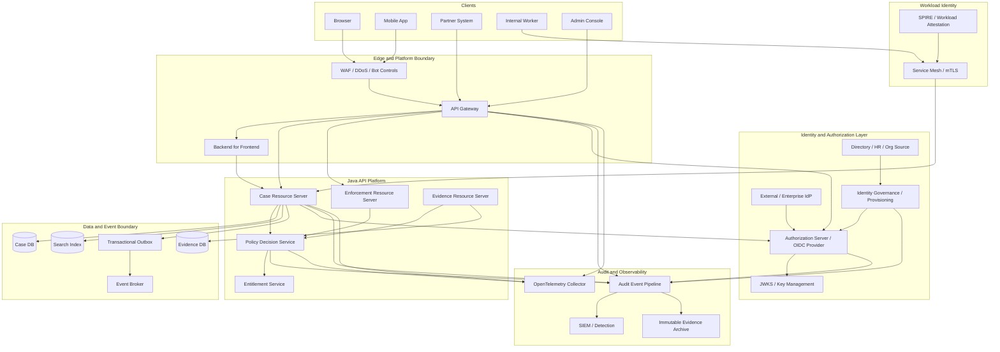
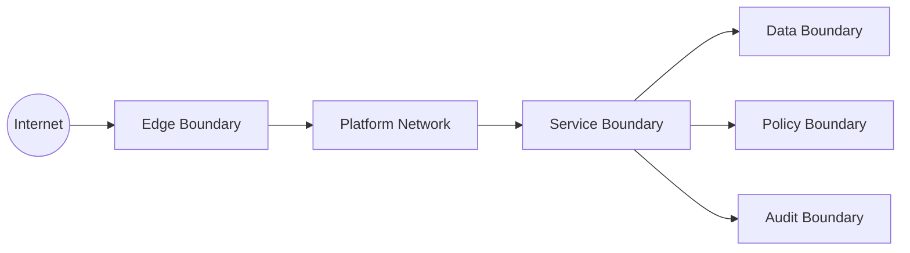
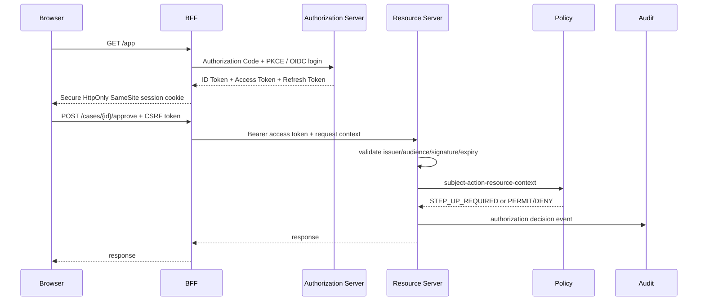
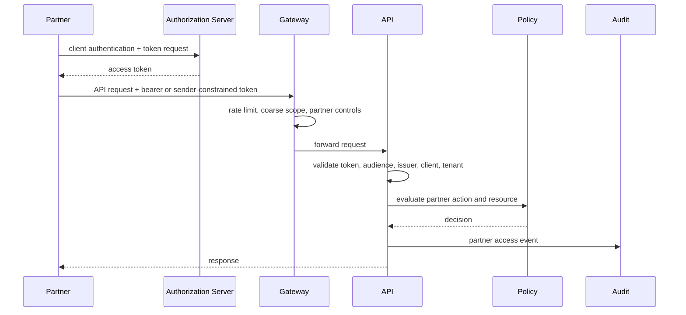
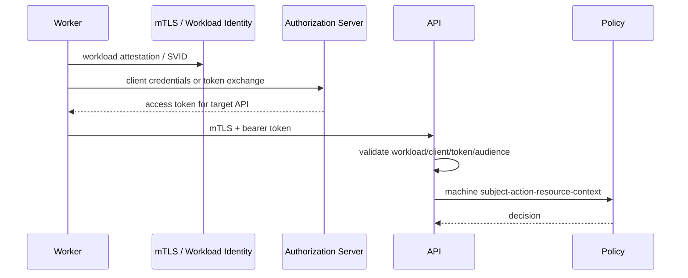
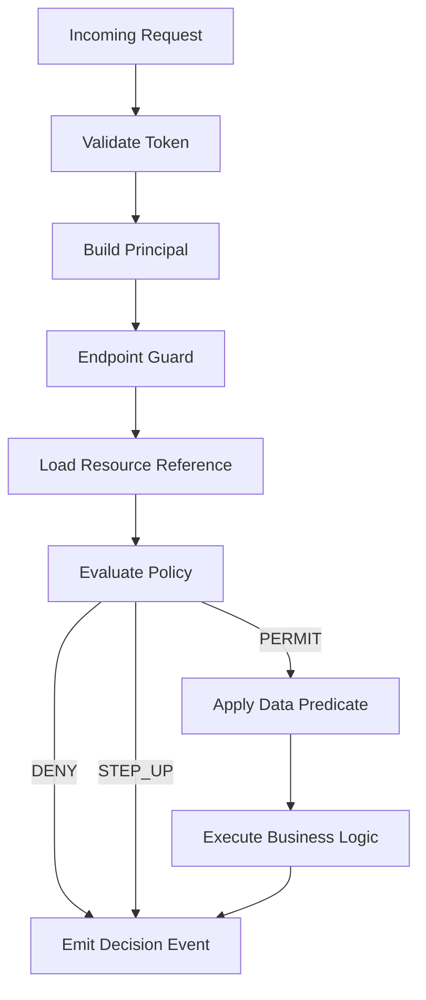
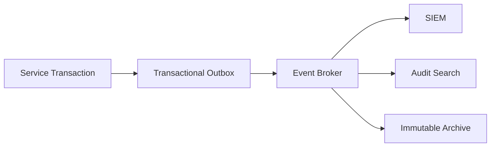
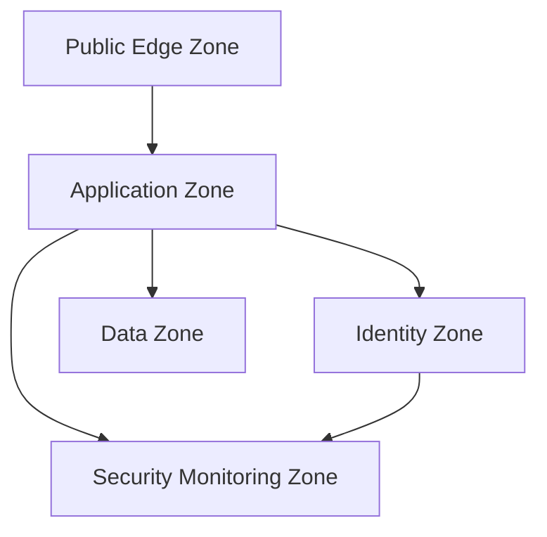
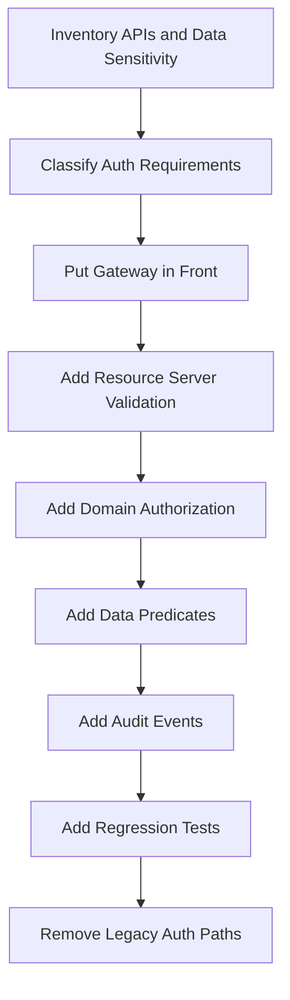

------
title: Learn Java Identity, Authentication & Authorization for Secure Enterprise API Platform - Part 032
description: Secure enterprise API platform reference architecture untuk Java systems: IdP, authorization server, API gateway, resource servers, policy service, tenant isolation, audit pipeline, service identity, observability, and operational controls.
series: learn-java-identity-authentication-authorization-api-platform
seriesTitle: Learn Java Identity, Authentication & Authorization for Secure Enterprise API Platform
order: 32
partTitle: Secure Enterprise API Platform Reference Architecture
tags:
- java
- identity
- authentication
- authorization
- api-security
- architecture
- oauth2
- oidc
- spring-security
- api-gateway
- multi-tenancy
- audit
- enterprise-platform
date: 2026-06-28
---

# Part 032 — Secure Enterprise API Platform Reference Architecture

## 1. Problem Framing

Setelah membahas identity model, authentication, OAuth, OIDC, JWT, Spring Security, authorization model, tenant isolation, delegation, machine identity, FAPI, token lifecycle, provisioning, entitlement governance, audit, dan testing, sekarang kita perlu merangkai semuanya menjadi satu arsitektur.

Masalah di enterprise bukan hanya “bagaimana memvalidasi token”.

Masalah nyata:

- banyak channel: browser, mobile, partner, internal service, batch worker,
- banyak identity type: user, client, workload, support agent, delegated actor,
- banyak resource server,
- banyak tenant,
- banyak policy source,
- banyak integration pattern,
- banyak audit and regulatory obligations,
- banyak legacy service yang belum identity-aware,
- banyak tim yang ingin “cukup taruh auth di gateway”.

Target part ini:

> Kamu mampu mendesain secure enterprise API platform reference architecture berbasis Java/Spring: identity provider, authorization server, API gateway, resource servers, policy enforcement, tenant isolation, workload identity, audit evidence, observability, testing, and operational controls.

---

## 2. Kaufman Skill Target

Setelah part ini, kamu harus bisa:

1. Menggambar logical architecture identity-aware API platform.
2. Memisahkan responsibility IdP, authorization server, gateway, resource server, policy service, service mesh, and audit pipeline.
3. Mendesain request flow browser, SPA/BFF, mobile, partner, service-to-service, and async worker.
4. Menentukan token model and trust boundary.
5. Menentukan authorization enforcement points.
6. Mendesain tenant isolation end-to-end.
7. Mendesain audit and observability pipeline.
8. Menyusun deployment and operational model.
9. Mengidentifikasi failure modes platform-level.
10. Menggunakan reference architecture sebagai review checklist.

---

## 3. Architecture Principle

Prinsip utama:

> Identity must be verified at platform boundary, but authorization must be enforced at the resource/domain boundary.

Gateway boleh melakukan coarse control.

Resource server tetap wajib melakukan token validation, audience validation, tenant validation, and domain authorization.

Policy service boleh membantu decision.

Domain service tetap bertanggung jawab atas invariant object-level.

Audit pipeline harus menerima evidence dari semua titik penting.

---

## 4. Reference Architecture Overview



This architecture is intentionally layered. Every layer has a limited job.

---

## 5. Component Responsibilities

## 5.1 Identity Provider

The Identity Provider authenticates human users or federates external identity.

Responsibilities:

- primary authentication,
- MFA/passkey support,
- account recovery,
- federation with enterprise identity,
- identity proofing integration if needed,
- user lifecycle source or broker,
- OIDC identity claims.

Not responsible for:

- object-level authorization inside APIs,
- tenant-specific case ownership,
- domain-specific state transition rules,
- business audit completeness.

## 5.2 Authorization Server / OIDC Provider

The Authorization Server issues OAuth/OIDC tokens.

Responsibilities:

- OAuth grant handling,
- OIDC login and ID Token,
- access token issuing,
- refresh token lifecycle,
- client registration,
- key publication through JWKS,
- consent or policy approval where applicable,
- token revocation/introspection,
- token exchange if supported,
- high-risk flow constraints.

Not responsible for:

- every resource-specific decision,
- query-time authorization,
- data-layer tenant predicate,
- final business action approval.

## 5.3 API Gateway

The API Gateway is an edge enforcement point.

Responsibilities:

- TLS termination at edge,
- routing,
- coarse authentication check,
- rate limiting,
- coarse scope/path guard,
- request size limit,
- API key or partner identification where needed,
- header normalization,
- correlation ID propagation,
- edge audit event,
- WAF/bot integration.

Not responsible for:

- sole authentication trust,
- final object-level authorization,
- domain state transition authorization,
- tenant data predicate.

Important rule:

> Resource servers must not blindly trust identity headers from clients or gateway unless the channel and header contract are cryptographically or operationally constrained.

## 5.4 BFF

Backend-for-Frontend protects browser UX from token exposure.

Responsibilities:

- manage browser session,
- hold tokens server-side,
- perform token refresh,
- protect CSRF boundary,
- call APIs with backend credentials/user token,
- aggregate UI-specific responses,
- enforce UI-specific coarse constraints.

Not responsible for:

- replacing resource-server authorization,
- bypassing domain service policy,
- storing over-privileged refresh tokens without lifecycle control.

## 5.5 Resource Server

Resource Server is where API resources are protected.

Responsibilities:

- validate token issuer/audience/signature/expiry,
- map claims into principal,
- enforce endpoint-level authorization,
- enforce domain/object-level authorization,
- enforce tenant boundary,
- call policy service when needed,
- apply data access predicates,
- emit authorization audit events,
- return correct 401/403 semantics.

This is the core Java/Spring Security responsibility.

## 5.6 Policy Decision Service

Policy service centralizes reusable authorization logic when local-only policy becomes fragmented.

Responsibilities:

- evaluate subject-action-resource-context,
- manage policy version,
- return structured decision,
- support explainable denial reason,
- consume entitlements/relationships/attributes,
- emit decision audit.

Not responsible for:

- fetching unbounded domain data for every request,
- replacing all domain invariants,
- returning permit when context is incomplete.

## 5.7 Entitlement Service / IGA

Entitlement layer manages access grants over time.

Responsibilities:

- role/permission assignment,
- access request workflow,
- approval,
- expiry,
- access review,
- SoD checks,
- privileged access management,
- entitlement versioning,
- provisioning/deprovisioning.

Resource server still evaluates whether entitlement applies to specific resource/action/context.

## 5.8 Audit and Observability Pipeline

Responsibilities:

- structured audit event ingestion,
- durable event publishing,
- SIEM detection,
- immutable evidence archive,
- trace/log/metric correlation,
- privacy-safe retention,
- incident reconstruction.

Audit is not an afterthought. It is a platform capability.

---

## 6. Trust Boundaries



Key boundaries:

| Boundary | Threat | Control |
|---|---|---|
| Internet -> Edge | unauthenticated traffic, bots, abuse | WAF, TLS, rate limit, gateway auth. |
| Edge -> API | spoofed headers, token misuse | token validation at resource server. |
| API -> Policy | context tampering, schema drift | signed/internal channel, contract tests. |
| API -> Data | tenant/object leakage | query predicates, row-level constraints. |
| Service -> Service | workload spoofing | mTLS, SPIFFE, client credentials. |
| API -> Audit | lost evidence | outbox, durable broker, schema validation. |
| Admin -> Platform | privilege abuse | step-up, SoD, approval, audit. |

---

## 7. Request Flow: Browser with BFF



Browser security decisions:

- tokens are not stored in browser local storage,
- session cookie is `HttpOnly`, `Secure`, and intentional `SameSite`,
- CSRF enabled for unsafe methods,
- BFF refreshes tokens server-side,
- resource server still enforces domain authorization.

---

## 8. Request Flow: SPA Without BFF

A pure SPA may use Authorization Code + PKCE, but risk is higher because tokens exist in browser context.

Controls:

- short-lived access token,
- refresh token rotation if allowed,
- no implicit flow,
- no password grant,
- strict redirect URI,
- strict CORS,
- strong CSP,
- no token in URL fragment leakage,
- API resource server validates token independently.

For sensitive enterprise/regulatory systems, BFF is often preferable.

---

## 9. Request Flow: Partner API



Partner-specific controls:

- contract-specific client registration,
- least-privilege scopes,
- sender-constrained token for high-value APIs,
- strict audience,
- partner-specific rate limits,
- replay detection where needed,
- explicit data-sharing agreement mapped to policy.

---

## 10. Request Flow: Service-to-Service



Controls:

- no shared global `SYSTEM` user,
- every machine caller has identity,
- token audience is target API,
- workload identity is bound to runtime where possible,
- service account permissions are scoped by tenant/partition/action,
- CI/CD identity is separate from runtime identity.

---

## 11. Authorization Flow Inside Resource Server



Do not execute business mutation before authorization decision.

Do not load broad datasets before tenant predicates.

Do not rely only on endpoint guard.

---

## 12. Java Resource Server Skeleton

```java
@Configuration
@EnableMethodSecurity
class SecurityConfiguration {

    @Bean
    SecurityFilterChain apiSecurity(HttpSecurity http) throws Exception {
        return http
            .securityMatcher("/api/**")
            .csrf(csrf -> csrf.disable())
            .authorizeHttpRequests(auth -> auth
                .requestMatchers(HttpMethod.GET, "/api/cases/**")
                    .hasAuthority("SCOPE_case.read")
                .requestMatchers(HttpMethod.POST, "/api/cases/**")
                    .hasAuthority("SCOPE_case.write")
                .anyRequest().authenticated())
            .oauth2ResourceServer(oauth2 -> oauth2
                .jwt(jwt -> jwt.jwtAuthenticationConverter(jwtAuthenticationConverter())))
            .build();
    }

    @Bean
    Converter<Jwt, AbstractAuthenticationToken> jwtAuthenticationConverter() {
        return jwt -> {
            var principal = IdentityPrincipal.from(jwt);
            var authorities = AuthorityMapper.from(jwt);
            return new IdentityAuthenticationToken(principal, authorities, jwt);
        };
    }
}
```

Endpoint scope is coarse. Domain service remains authoritative.

```java
@Service
class CaseApplicationService {

    private final CaseRepository cases;
    private final CaseAuthorizationPolicy policy;
    private final AuditPublisher audit;

    CaseDto getCase(IdentityPrincipal principal, CaseId caseId) {
        CaseResourceRef ref = cases.findResourceRef(caseId)
            .orElseThrow(NotFoundException::new);

        AuthorizationDecision decision = policy.canRead(principal, ref, RequestContext.current());
        audit.authorizationDecision(decision);

        if (!decision.isPermitted()) {
            throw new AccessDeniedException(decision.reasonCode());
        }

        return cases.findAuthorizedCase(principal.tenantId(), caseId)
            .map(CaseDto::from)
            .orElseThrow(NotFoundException::new);
    }
}
```

Notice three layers:

1. token and coarse scope,
2. object/domain decision,
3. authorized data query.

---

## 13. Tenant Isolation Architecture

Tenant must be represented consistently.

```mermaid
flowchart TD
    TokenClaim[tenant_id claim]
    Path[/tenants/{tenantId}]
    Domain[Domain Resource tenantId]
    DB[Database tenant predicate]
    Cache[Cache key]
    Event[Event envelope]
    Audit[Audit event]

    TokenClaim --> TenantContext[Tenant Context]
    Path --> TenantContext
    TenantContext --> Domain
    TenantContext --> DB
    TenantContext --> Cache
    TenantContext --> Event
    TenantContext --> Audit
```

Tenant rules:

- token tenant must match requested tenant unless explicit cross-tenant authority,
- object tenant must match effective tenant,
- queries must include tenant predicate,
- cache keys must include tenant,
- event envelopes must include tenant,
- audit events must include tenant,
- background jobs must set explicit tenant context,
- support/admin flows must be tenant-scoped unless platform-level.

Example tenant context:

```java
public record TenantContext(
    String effectiveTenantId,
    String tokenTenantId,
    String requestedTenantId,
    boolean crossTenantMode
) {
    public void requireSameTenant() {
        if (!crossTenantMode && !Objects.equals(tokenTenantId, requestedTenantId)) {
            throw new AccessDeniedException("TENANT_MISMATCH");
        }
    }
}
```

---

## 14. Policy Architecture Options

| Model | Use When | Risk |
|---|---|---|
| Local code policy | Domain-specific rules near service. | Duplication across services. |
| Shared Java policy library | Same domain rules reused by several services. | Version skew. |
| Central policy service | Many services need consistent decisioning. | Availability/latency coupling. |
| External policy engine | Policy managed by specialized team/tool. | Context mismatch, complexity. |
| Database RLS | Strong row-level isolation. | Hard to encode business context fully. |

Recommended default:

- local policy for domain invariants,
- central entitlement/relationship source,
- central policy service for cross-domain/platform rules,
- repository predicate for data boundary,
- audit all high-risk decisions.

---

## 15. Data Architecture

Data boundary is where many authorization systems fail.

Required patterns:

- tenant-aware primary queries,
- resource ownership/assignment tables,
- entitlement snapshots or relationship lookup,
- query predicates generated from policy context,
- separate path for authorized search/export,
- outbox for domain/security events,
- encryption/key boundary if required,
- data retention aligned with audit obligations.

Example repository contract:

```java
interface CaseRepository {
    Optional<CaseResourceRef> findResourceRef(CaseId caseId);

    Optional<Case> findAuthorizedCase(
        TenantId tenantId,
        CaseId caseId
    );

    Page<CaseSummary> searchAuthorizedCases(
        AuthorizedCasePredicate predicate,
        Pageable pageable
    );
}
```

Avoid generic `findById` in application services that handle protected resources.

---

## 16. Audit Architecture

Audit must capture security decisions across the platform.

Events:

| Event | Source |
|---|---|
| authentication.success/failure | IdP/Auth Server/BFF |
| token.issued/revoked/refreshed | Authorization Server |
| authorization.decision | Resource Server / Policy Service |
| entitlement.granted/revoked | IGA/Entitlement Service |
| impersonation.started/ended | Admin/Support Platform |
| breakglass.used | Privileged Access Service |
| tenant.access.denied | Resource Server |
| policy.changed | Policy Admin |
| client.registered/rotated | Authorization Server |

Recommended flow:



Rule:

> Security-critical business actions should commit domain state and audit event atomically through outbox or equivalent durability mechanism.

---

## 17. Observability Architecture

Use OpenTelemetry for traces, metrics, and logs, but do not confuse observability with audit.

Trace attributes can include safe metadata:

```text
enduser.id.hash
client.id
tenant.id
security.decision
security.reason_code
resource.type
action
```

Avoid:

```text
access_token
refresh_token
password
raw ID token
full PII payload
secret headers
```

Security metrics:

```text
authentication_failures_total
token_validation_failures_total
authz_decisions_total{outcome,reason}
tenant_mismatch_total
impersonation_sessions_active
breakglass_usage_total
refresh_token_reuse_detected_total
```

---

## 18. Deployment Architecture

A production deployment should separate concerns:



Key deployment rules:

- Authorization Server has restricted admin surface.
- JWKS endpoint is highly available and cacheable.
- Resource servers should survive temporary JWKS cache refresh issues within safe limits.
- Introspection dependency has timeout and fail-closed behavior for protected APIs.
- Policy service has explicit availability strategy.
- Audit pipeline failure has defined behavior for high-risk actions.
- Admin APIs require step-up and network/identity restrictions.

---

## 19. High Availability and Failure Behavior

Security architecture must define failure mode.

| Dependency Fails | Recommended Behavior |
|---|---|
| JWKS refresh fails | Use valid cached keys until TTL; fail closed for unknown key. |
| Authorization Server down | Existing valid tokens may continue; new login/token fails. |
| Introspection down | Fail closed for opaque-token protected APIs unless explicit degraded mode. |
| Policy service down | Fail closed for high-risk actions; optional cached deny/permit only if formally designed. |
| Entitlement service down | Use bounded cache with versioning; fail closed for privileged actions. |
| Audit pipeline down | Use local outbox/backpressure; block high-risk actions if evidence cannot be recorded. |
| SIEM down | Continue durable audit archive; alert ops. |
| Search index down | Do not bypass DB authorization predicates. |

No implicit fail-open.

---

## 20. Security Control Plane vs Data Plane

Control plane:

- client registration,
- policy changes,
- role/entitlement changes,
- key rotation,
- tenant onboarding,
- admin/support access,
- audit access.

Data plane:

- API requests,
- token validation,
- resource access,
- domain mutations,
- service-to-service calls,
- events and jobs.

Control plane needs stronger protections:

- MFA/step-up,
- privileged access workflow,
- approval,
- SoD,
- admin audit,
- change review,
- blast radius analysis,
- emergency rollback.

A weak control plane can compromise every resource server.

---

## 21. Secure API Platform ADRs

Every enterprise platform should record architecture decisions.

Recommended ADR list:

1. Identity provider strategy.
2. Authorization server strategy.
3. Token format: JWT vs opaque vs hybrid.
4. Audience model.
5. Tenant isolation model.
6. Browser security model: BFF vs SPA.
7. Mobile auth model.
8. Partner API auth model.
9. Service-to-service identity model.
10. Policy enforcement architecture.
11. Entitlement governance model.
12. Audit event architecture.
13. Token lifecycle and revocation model.
14. Key rotation model.
15. Break-glass and impersonation model.
16. Testing and CI security gate model.
17. Legacy API migration model.

Example ADR skeleton:

```mdx
# ADR: Token Model for Enterprise APIs

## Context
We operate multiple Java resource servers across regulated tenant data.

## Decision
Use JWT access tokens for low-latency internal APIs with strict issuer/audience validation, and opaque/reference tokens for high-risk externally exposed APIs requiring near-real-time revocation.

## Consequences
- Resource servers must validate issuer/audience/expiry/signature.
- JWKS rotation and cache behavior must be tested.
- Opaque token APIs depend on introspection availability.
- Token claims must remain stable and minimal.

## Invariants
- ID Token is never accepted by APIs.
- Token audience must match resource server.
- Tenant claim must be validated against resource path/object.
```

---

## 22. Legacy API Migration Pattern

Most enterprises have legacy APIs without proper identity boundary.

Migration sequence:



Avoid “big bang IAM migration”.

Recommended order:

1. inventory endpoints,
2. classify resource sensitivity,
3. define audience and scopes,
4. add gateway coarse protection,
5. add resource server token validation,
6. add object-level authorization,
7. add tenant/data predicates,
8. add audit,
9. add tests,
10. remove legacy bypass.

---

## 23. Platform Security Invariants

These invariants should appear in architecture review:

- Every protected API validates token locally or through trusted introspection.
- Every token has issuer, audience, expiry, subject/client identity, and tenant context where applicable.
- ID Token is never accepted as API access token.
- Gateway is not the only authorization enforcement point.
- Every object ID access has object-level authorization.
- Every list/search/export path has result-set authorization.
- Tenant context is validated across token, path, object, query, cache, event, and audit.
- Machine identity is not represented by generic `SYSTEM` user.
- Delegation/impersonation preserves actor chain.
- Break-glass is time-bound, justified, and audited.
- Entitlements have lifecycle, expiry, review, and revocation path.
- High-risk actions require appropriate assurance and audit evidence.
- Audit event emission is durable for regulated actions.
- Security tests are release gates.

---

## 24. Anti-Patterns at Architecture Level

### 24.1 Gateway-Only Security

Gateway validates token and forwards `X-User-Id`.

Resource server trusts it.

Risk:

- internal bypass,
- spoofed headers,
- no audience validation,
- no object authorization,
- no domain evidence.

Better:

- gateway does coarse checks,
- resource server validates token or trusted internal assertion,
- domain service enforces policy.

### 24.2 Role-Centric Platform

Everything is `ROLE_ADMIN`, `ROLE_USER`, `ROLE_MANAGER`.

Risk:

- role explosion,
- tenant escape,
- no object boundary,
- impossible audit reasoning.

Better:

- role + scope + entitlement + relationship + context.

### 24.3 Token as Authorization Database

Huge token contains all roles, permissions, tenant memberships, and relationships.

Risk:

- stale authorization,
- token bloat,
- revocation difficulty,
- privacy leakage,
- claim compatibility freeze.

Better:

- token carries stable identity and coarse authority,
- resource server/policy service resolves dynamic authorization.

### 24.4 Shared Service Account

All jobs use `system`.

Risk:

- no accountability,
- huge blast radius,
- impossible least privilege.

Better:

- per-workload identity,
- per-client scopes,
- partitioned authorization,
- audit client/workload.

### 24.5 Audit as Free-Text Logs

Risk:

- missing actor,
- missing tenant,
- missing decision reason,
- impossible evidence reconstruction.

Better:

- structured audit events with schema and durability.

---

## 25. Architecture Review Checklist

Use this checklist in design review.

### Identity

- [ ] Are subject, account, client, workload, and actor chain clearly modeled?
- [ ] Is federated identity linked by issuer + subject, not email alone?
- [ ] Are human and machine identities distinct?
- [ ] Is tenant identity explicit?

### Authentication

- [ ] Are authentication flows appropriate for browser/mobile/partner/service?
- [ ] Are deprecated OAuth flows avoided?
- [ ] Is step-up required for high-risk actions?
- [ ] Is recovery path protected as strongly as login?

### Token

- [ ] Is token format chosen intentionally?
- [ ] Is audience model explicit?
- [ ] Is issuer validation explicit?
- [ ] Is key rotation tested?
- [ ] Is revocation model clear?

### Authorization

- [ ] Is authorization enforced beyond gateway?
- [ ] Are object-level checks defined?
- [ ] Are list/search/export predicates defined?
- [ ] Are roles/scopes/attributes/relationships composed intentionally?
- [ ] Is deny-by-default guaranteed?

### Tenant

- [ ] Is tenant resolution deterministic?
- [ ] Is tenant mismatch rejected?
- [ ] Are cache/event/job/search boundaries tenant-aware?
- [ ] Are support/admin tenant boundaries explicit?

### Audit

- [ ] Are security events structured?
- [ ] Is audit durable?
- [ ] Are actor/effective subject/client/tenant/resource/action/decision recorded?
- [ ] Are secrets excluded?
- [ ] Is evidence searchable and retained?

### Operations

- [ ] Are failure modes fail-closed where required?
- [ ] Are runbooks defined?
- [ ] Is key rotation rehearsed?
- [ ] Is incident response tied to token/session revocation?
- [ ] Are CI security gates mandatory?

---

## 26. Practice Drill

Design a secure API platform for a regulated enforcement system.

Requirements:

- internal staff portal,
- external party portal,
- partner API,
- mobile inspector app,
- batch notification worker,
- multi-tenant regulator setup,
- support impersonation,
- privileged break-glass,
- case/evidence/enforcement action resources,
- audit evidence for every decision,
- high-risk approve/close actions require AAL2.

Deliverables:

1. architecture diagram,
2. identity model,
3. token model,
4. client/flow matrix,
5. authorization model,
6. tenant isolation model,
7. audit event schema,
8. failure mode table,
9. testing strategy,
10. rollout plan.

Evaluation questions:

- Can tenant A ever read tenant B data?
- Can gateway bypass lead to accepted API call?
- Can support agent act without actor-chain audit?
- Can stale role approve high-risk action?
- Can token for one API be used at another API?
- Can export leak data that detail endpoint protects?
- Can machine worker perform human-only action?
- Can audit reconstruct a denied decision?

---

## 27. Key Takeaways

A secure enterprise API platform is not one product or one framework.

It is a set of coordinated boundaries:

- identity boundary,
- token boundary,
- gateway boundary,
- resource server boundary,
- domain authorization boundary,
- data boundary,
- tenant boundary,
- workload identity boundary,
- audit boundary,
- operational control boundary.

The architecture is mature when:

- trust is explicit,
- enforcement points are deliberate,
- authorization is close to resources,
- tenant isolation is end-to-end,
- audit is durable and structured,
- tests prove negative cases,
- operational failures have safe behavior.

The most important rule:

> Do not centralize trust so much that local services stop defending their resources.

Use the platform to standardize identity and evidence. Use resource/domain services to protect actual business objects.

---

## 28. References

- NIST SP 800-63-4 — Digital Identity Guidelines
- OAuth 2.0 Security Best Current Practice — RFC 9700
- OAuth 2.0 Mutual-TLS Client Authentication and Certificate-Bound Access Tokens — RFC 8705
- OAuth 2.0 Token Exchange — RFC 8693
- OpenID Connect Core 1.0
- FAPI 2.0 Security Profile
- OWASP API Security Top 10 2023
- OWASP Authorization Cheat Sheet
- Spring Security Reference — OAuth2 Resource Server
- Spring Authorization Server Reference
- SPIFFE/SPIRE Documentation
- OpenTelemetry Java Documentation
