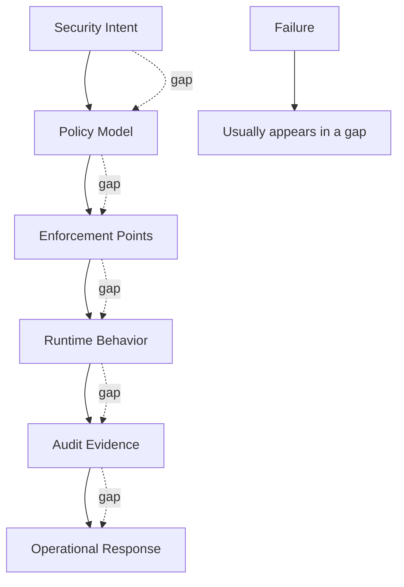
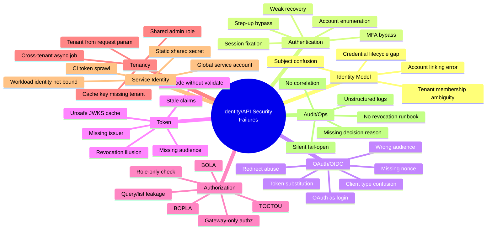
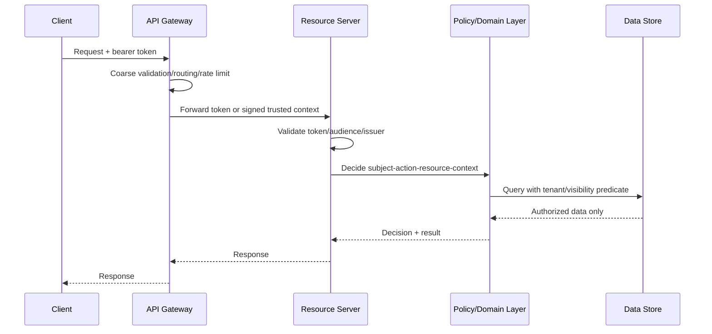

------
title: Learn Java Identity, Authentication & Authorization for Secure Enterprise API Platform - Part 033
description: Failure modes and anti-patterns dalam identity, authentication, authorization, OAuth/OIDC, token, tenant isolation, service identity, audit, dan secure enterprise API platform.
series: learn-java-identity-authentication-authorization-api-platform
seriesTitle: Learn Java Identity, Authentication & Authorization for Secure Enterprise API Platform
order: 33
partTitle: Failure Modes and Anti-Patterns
tags:
- java
- identity
- authentication
- authorization
- api-security
- failure-modes
- anti-patterns
- oauth2
- oidc
- spring-security
- multi-tenancy
- audit
- enterprise-platform
date: 2026-06-28
---

# Part 033 — Failure Modes and Anti-Patterns

## 1. Problem Framing

Security architecture jarang gagal karena satu bug kecil saja.

Di enterprise API platform, failure biasanya muncul dari kombinasi:

- mental model identity yang salah,
- boundary enforcement yang tidak konsisten,
- token dianggap sebagai sumber kebenaran permanen,
- gateway dianggap cukup untuk semua authorization,
- role dipakai untuk menjawab semua pertanyaan access control,
- tenant dianggap hanya filter UI,
- audit dianggap logging biasa,
- service-to-service traffic dianggap otomatis trusted,
- test hanya happy path,
- dan operasional incident response tidak pernah dilatih.

Part ini adalah katalog failure modes dan anti-patterns. Tujuannya bukan menakut-nakuti, tetapi membentuk kemampuan engineering yang lebih penting daripada hafal konfigurasi: **mampu mendeteksi desain yang tampak benar tetapi sebenarnya rapuh**.

Dalam konteks Kaufman, ini adalah tahap mempercepat feedback loop. Kita sudah membangun banyak subskill; sekarang kita latih kemampuan membaca desain dan langsung melihat titik patahnya.

> Engineer top-tier tidak hanya bisa membuat flow OAuth berjalan. Ia bisa mengatakan: “flow ini berhasil di demo, tetapi gagal saat token stale, tenant berpindah, role berubah, session dicabut, support agent impersonate user, atau service async mengeksekusi job setelah entitlement dicabut.”

---

## 2. Learning Objective

Setelah part ini, kamu harus bisa:

1. Mengidentifikasi anti-pattern identity/auth dalam desain API sebelum masuk production.
2. Menjelaskan failure mode dengan format: trigger, violated invariant, blast radius, detection, mitigation.
3. Membedakan authentication failure, token validation failure, authorization failure, tenancy failure, audit failure, dan operational failure.
4. Membuat negative test dari setiap anti-pattern.
5. Mendesain review checklist untuk Pull Request, architecture review, dan security review.
6. Memilih remediation yang proporsional, bukan hanya “tambahkan role check”.

---

## 3. Core Mental Model: Security Fails at the Gap Between Intent and Enforcement

Policy intention sering benar:

> “User hanya boleh melihat case milik tenant-nya.”

Tetapi enforcement reality sering berbeda:

- endpoint detail memeriksa ownership,
- endpoint list hanya filter berdasarkan query param,
- endpoint export tidak memeriksa tenant,
- endpoint async job memakai service account global,
- cache key tidak memasukkan tenant,
- audit log hanya mencatat `userId`, bukan `tenantId` dan decision reason,
- test hanya memeriksa positive path.

Maka rule utama:

> Identity/security failure hampir selalu terjadi di antara “yang kita maksud” dan “yang benar-benar ditegakkan pada setiap boundary”.



A secure platform mempersempit gap ini dengan:

- model domain yang jelas,
- enforcement point eksplisit,
- deny-by-default,
- structured decision,
- authorization at query/data boundary,
- tenant isolation invariant,
- auditable decision record,
- negative tests,
- operational runbook.

---

## 4. Failure Mode Template

Gunakan format ini saat review desain atau incident.

```mdx
### Failure Mode: <name>

**Trigger**
Kapan failure muncul.

**Violated invariant**
Security invariant mana yang dilanggar.

**Why it looked correct**
Kenapa engineer bisa merasa desainnya aman.

**Actual exploit path**
Bagaimana attacker/user tidak sah mengeksploitasi celah.

**Blast radius**
Data/tenant/action apa yang terdampak.

**Detection**
Log, metric, alert, test, atau review signal apa yang bisa mendeteksi.

**Mitigation**
Perubahan desain/kode/operasi yang menutup celah.

**Regression test**
Test minimal agar bug tidak kembali.
```

Format ini memaksa kita tidak berhenti pada label umum seperti “auth bug”. Kita harus tahu invariant mana yang rusak.

---

## 5. Security Invariants yang Harus Selalu Diingat

Part ini berulang kali merujuk pada invariant berikut.

| Invariant | Meaning |
|---|---|
| Identity is not account | Subject, account, tenant membership, credential, and session are separate concepts. |
| Authentication is not authorization | Login valid tidak berarti boleh mengakses object/action tertentu. |
| Token validation is not domain authorization | JWT valid hanya membuktikan token diterbitkan trusted issuer dan belum expired. |
| Gateway enforcement is not enough | Gateway tidak punya semua domain context. Resource server tetap harus enforce. |
| Tenant is a security boundary | Tenant bukan label UI. Tenant harus ada di identity, query, cache, audit, event, job, dan policy. |
| Scopes are not object permissions | Scope biasanya coarse-grained delegation, bukan ownership/resource-level rule. |
| Roles are not sufficient for high-risk decisions | Role perlu dikombinasikan dengan resource, context, assurance, tenant, and relationship. |
| Audit log is part of security system | Tanpa evidence, keputusan authorization sulit dibuktikan. |
| Deny-by-default | Absence of policy, context, tenant, or resource binding must deny. |
| Async must preserve security context intentionally | Async job tidak boleh menjadi escape hatch dari authorization. |

---

## 6. Taxonomy of Failure Modes



---

## 7. Identity Model Anti-Patterns

### 7.1 Anti-Pattern: `userId` Means Everything

**Symptom**

Database schema, logs, claims, code, and API all use `userId` without distinguishing:

- natural person,
- account,
- tenant membership,
- principal,
- session,
- credential,
- federated subject,
- support actor,
- service account.

```java
record CurrentUser(String userId, String role) {}
```

**Why it fails**

`userId` becomes overloaded. Eventually a support agent, external IdP user, machine client, and end-user all get forced into the same primitive.

**Common production bug**

A user has two tenant memberships. API receives `userId = 123`. Query filters by `owner_user_id = 123` but not `tenant_id`. Result leaks object from another tenant where the same person has a membership.

**Better model**

```java
record SubjectId(String value) {}
record AccountId(String value) {}
record TenantId(String value) {}
record PrincipalId(String value) {}
record SessionId(String value) {}

record TenantMembership(
    SubjectId subjectId,
    AccountId accountId,
    TenantId tenantId,
    Set<String> entitlementIds,
    boolean active
) {}
```

**Invariant**

> A request principal must say who the actor is, under which tenant/account context, with what assurance, via which client/session, and with what delegation chain if any.

---

### 7.2 Anti-Pattern: Email as Stable Identity Key

**Symptom**

```sql
select * from users where email = ?
```

Email is used as:

- login identifier,
- primary key,
- federation linking key,
- audit identity,
- ownership reference.

**Why it fails**

Email can change. Email can be recycled. Different IdPs can assert the same email under different trust contracts. Some IdPs do not guarantee verified email unless claim semantics are explicit.

**Failure path**

1. User leaves company.
2. Email is reassigned.
3. New employee logs in through IdP.
4. App links by email.
5. New employee inherits old access.

**Mitigation**

Use stable issuer-subject pair.

```java
record FederatedSubject(
    URI issuer,
    String subject
) {}
```

Account linking should be explicit and auditable:

```java
record AccountLink(
    AccountId localAccountId,
    URI externalIssuer,
    String externalSubject,
    Instant linkedAt,
    PrincipalId linkedBy,
    LinkAssurance assurance
) {}
```

---

### 7.3 Anti-Pattern: Soft-Deleted User Still Owns Active Access

**Symptom**

User deactivation disables login, but existing sessions/tokens/jobs remain valid.

**Why it fails**

Identity lifecycle and token lifecycle are not connected.

**Correct invariant**

> Deactivation must invalidate or cause rejection of sessions, refresh tokens, high-risk grants, pending approvals, active delegated access, and service-account credentials owned by that identity.

**Practical design**

Maintain a security version or disabled timestamp.

```java
record PrincipalState(
    AccountId accountId,
    boolean active,
    long securityVersion,
    Instant disabledAt
) {}
```

Token contains `ver`. Resource server or introspection layer rejects token if token version is older than current account version.

---

## 8. Authentication Anti-Patterns

### 8.1 Anti-Pattern: Account Recovery Weaker Than Login

**Symptom**

Login requires MFA, but account recovery requires only email link or support ticket.

**Why it fails**

Attackers attack the weakest lifecycle path.

**High-risk flows**

- password reset,
- MFA reset,
- passkey reset,
- email change,
- phone number change,
- account unlock,
- device trust reset,
- privileged role activation.

**Better rule**

> Recovery must be risk-tiered and at least as carefully controlled as the credential it can replace.

For high assurance:

- require step-up,
- delay sensitive changes,
- notify old and new channels,
- revoke active sessions,
- mark account risk state,
- require re-authentication before privileged action.

---

### 8.2 Anti-Pattern: MFA Checked Only at Login

**Symptom**

MFA is satisfied once during login. Every future action trusts session until expiry.

**Failure path**

1. User logs in with MFA.
2. Session lasts 12 hours.
3. User attempts high-risk action at hour 11.
4. API allows it because session has `mfa=true`.

**Better model**

Track authentication instant and method.

```java
record AuthenticationAssurance(
    String aal,
    Instant authenticatedAt,
    Set<String> methods,
    boolean phishingResistant
) {
    boolean isFreshFor(Duration maxAge, Clock clock) {
        return authenticatedAt.plus(maxAge).isAfter(clock.instant());
    }
}
```

Policy can return `STEP_UP_REQUIRED`, not just allow/deny.

```java
enum DecisionEffect {
    ALLOW,
    DENY,
    STEP_UP_REQUIRED
}
```

---

### 8.3 Anti-Pattern: Fail-Open Authentication Filter

**Symptom**

Custom filter catches token parsing exceptions and continues.

```java
try {
    Authentication auth = parseToken(request);
    SecurityContextHolder.getContext().setAuthentication(auth);
} catch (Exception ex) {
    log.warn("Invalid token", ex);
}
chain.doFilter(request, response);
```

**Why it fails**

Downstream endpoint might be accidentally public or protected by weak role checks.

**Safer pattern**

Invalid credentials should produce authentication failure and clear context.

```java
try {
    Authentication auth = parseAndValidate(request);
    SecurityContextHolder.getContext().setAuthentication(auth);
    chain.doFilter(request, response);
} catch (AuthenticationException ex) {
    SecurityContextHolder.clearContext();
    authenticationEntryPoint.commence(request, response, ex);
}
```

**Invariant**

> Invalid presented credential must never degrade to anonymous access unless the endpoint is intentionally anonymous and tested as such.

---

## 9. OAuth/OIDC Anti-Patterns

### 9.1 Anti-Pattern: OAuth Used as Login Without OIDC Semantics

**Symptom**

Application receives OAuth access token and treats it as proof of user login.

**Why it fails**

OAuth access token is for resource access delegation. It is not necessarily an authentication statement for the client.

**Failure path**

- token minted for API A is presented to app B,
- app B extracts `sub`,
- app B logs user in,
- no nonce, no ID token validation, no audience check for the client.

**Mitigation**

Use OpenID Connect for login. Validate ID Token semantics:

- issuer,
- audience/client id,
- nonce,
- expiration,
- auth time where needed,
- subject,
- authorized party if applicable,
- signature and key.

Resource server should validate access token for API access, not session login.

---

### 9.2 Anti-Pattern: Accepting Any Token from Trusted Issuer

**Symptom**

Resource server validates signature and issuer only.

```java
NimbusJwtDecoder.withIssuerLocation(issuer).build();
```

No audience validation.

**Why it fails**

A token minted for another API could be accepted.

**Correct invariant**

> A resource server must reject tokens not intended for that resource server.

**Spring validator sketch**

```java
@Bean
JwtDecoder jwtDecoder() {
    NimbusJwtDecoder decoder = JwtDecoders.fromIssuerLocation(issuer);

    OAuth2TokenValidator<Jwt> withIssuer = JwtValidators.createDefaultWithIssuer(issuer);
    OAuth2TokenValidator<Jwt> withAudience = jwt -> {
        List<String> aud = jwt.getAudience();
        if (aud.contains("case-api")) {
            return OAuth2TokenValidatorResult.success();
        }
        return OAuth2TokenValidatorResult.failure(
            new OAuth2Error("invalid_token", "Missing required audience", null)
        );
    };

    decoder.setJwtValidator(new DelegatingOAuth2TokenValidator<>(withIssuer, withAudience));
    return decoder;
}
```

---

### 9.3 Anti-Pattern: Scope Explosion as Authorization Model

**Symptom**

Scopes become object permissions.

```text
case:123:read
case:123:update
case:124:read
case:tenant-a:case:approve
```

**Why it fails**

Scopes are usually too static and coarse for domain authorization. Object-level access changes faster than token lifetime.

**Better split**

Use scopes for coarse API capability:

```text
case.read
case.write
case.approve
```

Use domain authorization for object/action/context:

```java
policy.decide(subject, Action.APPROVE, caseResource, context)
```

---

### 9.4 Anti-Pattern: Public Client Treated as Confidential Client

**Symptom**

SPA/mobile app is issued client secret and backend trusts it.

**Why it fails**

Public clients cannot keep secrets. A secret embedded in distributed app is not secret.

**Better patterns**

- browser app: Authorization Code + PKCE,
- high-security browser app: BFF pattern,
- mobile: Authorization Code + PKCE + platform secure storage,
- server-side web app: confidential client,
- machine-to-machine: confidential client with strong client authentication.

---

### 9.5 Anti-Pattern: Refresh Token Without Rotation or Reuse Detection

**Symptom**

Long-lived refresh token can be used repeatedly until expiry.

**Failure path**

1. Refresh token leaks.
2. Legitimate client and attacker both refresh.
3. System does not detect reuse.
4. Attacker maintains access for long period.

**Mitigation**

- rotate refresh token,
- detect reuse of old token,
- revoke token family on reuse,
- bind refresh token to client/device where possible,
- log high-severity event.

---

## 10. JWT and Token Anti-Patterns

### 10.1 Anti-Pattern: Decode Is Treated as Validate

**Symptom**

```java
String[] parts = token.split("\\.");
String payload = new String(Base64.getUrlDecoder().decode(parts[1]));
Map<String, Object> claims = objectMapper.readValue(payload, Map.class);
```

**Why it fails**

This reads claims without validating issuer, signature, algorithm, expiry, audience, key, or token type.

**Invariant**

> Claims are untrusted until the token passes complete validation.

---

### 10.2 Anti-Pattern: Trusting `alg` From Token Without Policy

**Symptom**

Validation library is configured loosely; token algorithm determines validation behavior.

**Risk**

Algorithm confusion, downgrade, or accepting algorithms not intended by issuer/resource server policy.

**Mitigation**

- configure allowed algorithms explicitly,
- require expected token type where applicable,
- reject `none`,
- maintain issuer-specific key and algorithm policy,
- test invalid alg and wrong key family.

---

### 10.3 Anti-Pattern: JWKS Cache Without Rotation Failure Plan

**Symptom**

Resource server caches JWKS indefinitely.

**Failure modes**

- new key not loaded during planned rotation,
- compromised key remains accepted too long,
- JWKS endpoint outage causes fail-open behavior,
- unknown `kid` creates request storm to IdP.

**Better strategy**

- bounded cache TTL,
- refresh on unknown `kid` with rate limiting,
- fail closed for invalid signature,
- pre-publish keys before use,
- emergency denylist/issuer disable switch,
- monitor `unknown_kid`, `jwks_fetch_failure`, and `invalid_signature`.

---

### 10.4 Anti-Pattern: JWT Contains Mutable Authorization State

**Symptom**

Token contains roles, tenant access, department, approval limits, and privileged entitlements with long expiry.

**Why it fails**

Authorization state changes faster than token expiry.

**Example**

- user loses approver role,
- access token valid for 8 hours,
- API trusts token claim,
- user approves transaction after removal.

**Mitigation options**

| Option | Use When | Trade-off |
|---|---|---|
| Short token lifetime | Low latency, manageable UX | More refresh traffic |
| Opaque token introspection | Need near-real-time revocation | Dependency on AS availability/cache |
| Security version claim | Account-level revocation needed | Requires state lookup/cache |
| Policy lookup at resource server | High-risk decisions | More latency/complexity |
| Step-up with fresh decision | Privileged action | UX cost |

---

## 11. Authorization Anti-Patterns

### 11.1 Anti-Pattern: Role Check Equals Authorization

**Symptom**

```java
@PreAuthorize("hasRole('CASE_MANAGER')")
public CaseDto getCase(String caseId) { ... }
```

**Why it fails**

Role tells what kind of actor the subject is, not whether they can access this specific object.

**Better**

```java
@PreAuthorize("@casePolicy.canRead(authentication, #caseId)")
public CaseDto getCase(String caseId) { ... }
```

Policy checks:

- tenant,
- object existence under tenant,
- assignment/ownership,
- status,
- delegation,
- assurance,
- risk flags.

---

### 11.2 Anti-Pattern: Controller-Only Authorization

**Symptom**

Controller checks authorization, service assumes caller is safe.

```java
@GetMapping("/cases/{id}")
public CaseDto get(@PathVariable String id) {
    policy.assertCanRead(id);
    return caseService.get(id);
}
```

**Why it fails**

The service is later reused by:

- scheduled job,
- message listener,
- GraphQL resolver,
- admin endpoint,
- export endpoint,
- internal API.

**Better invariant**

> Application service or domain service must be a stable authorization boundary for protected operations.

```java
public CaseDto getCase(CurrentPrincipal principal, CaseId id) {
    CaseEntity entity = repository.findById(id)
        .orElseThrow(NotFoundException::new);
    decisionEnforcer.assertAllowed(
        casePolicy.decide(principal, Action.READ, entity)
    );
    return mapper.toDto(entity);
}
```

For list/query operations, authorization should be pushed into predicate.

---

### 11.3 Anti-Pattern: “Find Then Check” for Sensitive Objects

**Symptom**

```java
CaseEntity c = repository.findById(caseId).orElseThrow(NotFoundException::new);
policy.assertCanRead(principal, c);
```

This is sometimes acceptable inside trusted boundary, but dangerous when existence itself is sensitive.

**Leak**

- 404 means object does not exist,
- 403 means object exists but not yours.

**Better for externally supplied IDs**

```java
repository.findVisibleCase(principal.tenantId(), principal.subjectId(), caseId)
    .orElseThrow(NotFoundException::new);
```

Use `404` for both absent and unauthorized when existence is sensitive.

---

### 11.4 Anti-Pattern: List Endpoint Has Weaker Authorization Than Detail Endpoint

**Symptom**

`GET /cases/{id}` checks ownership. `GET /cases?status=OPEN` returns all tenant cases or all assigned group cases without per-row predicate.

**Why it happens**

Engineers optimize list queries separately and forget that list is also object access.

**Mitigation**

Define repository methods by visibility contract:

```java
interface CaseQueryRepository {
    Page<CaseSummary> searchVisibleCases(
        PrincipalAccessContext ctx,
        CaseSearchCriteria criteria,
        Pageable pageable
    );
}
```

No generic `search(criteria)` for protected domain objects.

---

### 11.5 Anti-Pattern: Bulk Operation Authorizes Container Only

**Symptom**

```http
POST /cases/bulk-close
{
  "caseIds": ["C1", "C2", "C3"]
}
```

Code checks user has `case.close` scope but not per-object authority.

**Mitigation**

Bulk operation must either:

1. prefilter to allowed IDs and report partial result safely, or
2. fail the entire operation if any ID is unauthorized.

Decision must be explicit.

```java
BulkDecision decision = casePolicy.decideBulkClose(principal, caseIds);
if (!decision.allAllowed()) {
    throw new AccessDeniedException("Bulk close denied");
}
```

---

## 12. BOLA and Object-Level Failure Modes

### 12.1 Direct Object Reference BOLA

**Pattern**

```http
GET /api/cases/C-1000
GET /api/cases/C-1001
```

Attacker changes ID.

**Broken code**

```java
@GetMapping("/cases/{id}")
CaseDto get(@PathVariable String id) {
    return repository.findById(id)
        .map(mapper::toDto)
        .orElseThrow(NotFoundException::new);
}
```

**Fixed shape**

```java
@GetMapping("/cases/{id}")
CaseDto get(@AuthenticationPrincipal PlatformPrincipal p, @PathVariable String id) {
    return caseApplication.getVisibleCase(p, new CaseId(id));
}
```

```java
public CaseDto getVisibleCase(PlatformPrincipal p, CaseId id) {
    return repository.findVisibleById(p.tenantId(), p.subjectId(), id)
        .map(mapper::toDto)
        .orElseThrow(NotFoundException::new);
}
```

---

### 12.2 Indirect Object Reference BOLA

**Pattern**

```http
POST /api/cases/C-1000/comments
{
  "documentId": "D-9999"
}
```

Endpoint authorizes case but not referenced document.

**Invariant**

> Every user-controlled object reference in path, query, header, and body needs authorization/binding.

**Review question**

For every request DTO:

- which fields are object references?
- are they owned by same tenant?
- must they belong to parent object?
- can caller act on each reference?
- can reference be stale/deleted/archived?

---

### 12.3 Action-Level Object BOLA

**Pattern**

User can read object but should not perform state-changing action.

```http
POST /api/cases/C-1000/approve
```

**Broken assumption**

“If user can see the case, they can approve it.”

**Better action-specific decision**

```java
casePolicy.assertAllowed(principal, Action.APPROVE, caseEntity);
```

Policy includes:

- role/entitlement,
- assignment,
- segregation of duties,
- case status,
- approval limit,
- step-up freshness,
- acting-as restrictions.

---

## 13. Multi-Tenancy Anti-Patterns

### 13.1 Anti-Pattern: Tenant Comes from Request Parameter

**Symptom**

```http
GET /cases?tenantId=t-123
```

API trusts requested tenant.

**Why it fails**

Attacker changes tenant ID.

**Better model**

Tenant context is derived from trusted principal/session/token plus route/domain binding, not blindly from user input.

```java
TenantId tenantId = principal.activeTenantId();
```

When route contains tenant slug:

```http
GET /tenants/acme/cases
```

System must verify principal membership in `acme` and bind it to tenant context.

---

### 13.2 Anti-Pattern: Cache Key Missing Tenant

**Symptom**

```java
@Cacheable("caseSummary")
CaseSummary getSummary(String caseId) { ... }
```

**Failure**

Same case ID or lookup key collides across tenants.

**Better**

```java
@Cacheable(value = "caseSummary", key = "#tenantId.value + ':' + #caseId.value")
CaseSummary getSummary(TenantId tenantId, CaseId caseId) { ... }
```

For authorization-sensitive cache, include policy-relevant dimensions or cache only domain object and re-authorize per request.

---

### 13.3 Anti-Pattern: Cross-Tenant Admin Role

**Symptom**

```text
ROLE_ADMIN
```

No tenant dimension.

**Risk**

Admin in tenant A becomes admin everywhere.

**Better**

```java
record TenantRole(TenantId tenantId, String role) {}
```

And policy always checks role in active tenant context.

---

### 13.4 Anti-Pattern: Async Job Drops Tenant Context

**Symptom**

```java
jobQueue.enqueue(new RecalculateRiskJob(caseId));
```

Worker loads case by ID without tenant.

**Better**

```java
record RecalculateRiskJob(
    TenantId tenantId,
    CaseId caseId,
    PrincipalId requestedBy,
    String authorizationDecisionId,
    Instant requestedAt
) {}
```

Worker should verify:

- tenant exists,
- case belongs to tenant,
- job is still allowed or was authorized at submission depending on semantics,
- requester has not been disabled if action is user-authorized,
- decision/audit chain is preserved.

---

## 14. API Gateway and Mesh Anti-Patterns

### 14.1 Anti-Pattern: Gateway-Only Authorization

**Symptom**

Gateway validates token and checks scope. Backend trusts headers.

```http
X-User-Id: 123
X-Tenant-Id: t-1
X-Roles: ADMIN
```

**Failure path**

- internal network bypass,
- misconfigured route,
- compromised service,
- test/staging gateway disabled,
- header spoofing,
- backend endpoint exposed directly.

**Better architecture**



Gateway can enforce coarse policy. Resource server/domain layer must enforce object-level policy.

---

### 14.2 Anti-Pattern: Service Mesh Treated as Authorization System

**Symptom**

Because mTLS exists, services trust all calls.

**Why it fails**

mTLS authenticates workload identity. It does not automatically answer whether workload may perform specific domain action on specific object for specific actor.

**Better split**

- mesh: workload authentication, transport encryption, service-to-service allowlist,
- app: token validation, actor propagation, domain authorization,
- policy: central or local decision logic,
- audit: action evidence.

---

## 15. Service Identity Anti-Patterns

### 15.1 Anti-Pattern: One Global `SYSTEM` Account

**Symptom**

All jobs, integrations, and internal services act as `SYSTEM`.

**Why it fails**

No accountability, impossible least privilege, impossible blast-radius reduction.

**Better**

Use purpose-bound service principals.

```text
svc-case-exporter-prod
svc-risk-score-worker-prod
svc-notification-sender-prod
svc-partner-acme-ingestion-prod
```

Each has:

- owner,
- environment,
- allowed audiences,
- allowed scopes/entitlements,
- credential lifecycle,
- rotation policy,
- audit identity,
- decommission path.

---

### 15.2 Anti-Pattern: Shared Client Secret Across Environments

**Symptom**

Dev/staging/prod use same OAuth client secret.

**Risk**

Lower environment compromise becomes production compromise.

**Mitigation**

- separate client registrations,
- separate issuer/tenant/project,
- environment-specific credentials,
- private key JWT or mTLS for high-value clients,
- automated rotation,
- secret scanning,
- no human-readable shared secrets in repo.

---

### 15.3 Anti-Pattern: CI/CD Token Has Permanent Admin

**Symptom**

Deployment pipeline token can modify all clients, secrets, keys, roles, and policies.

**Mitigation**

- split deployment privileges,
- require approval for security-sensitive changes,
- short-lived workload identity,
- environment-bound claims,
- immutable audit,
- policy-as-code review.

---

## 16. Audit and Observability Anti-Patterns

### 16.1 Anti-Pattern: Logs Without Decisions

**Symptom**

```text
User 123 called POST /cases/C-1/approve
```

This is insufficient.

**Needed evidence**

```json
{
  "eventType": "AUTHZ_DECISION",
  "decisionId": "dec_01J...",
  "effect": "ALLOW",
  "subjectId": "sub_123",
  "tenantId": "tenant_acme",
  "actorChain": ["user:sub_123"],
  "action": "case.approve",
  "resourceType": "case",
  "resourceId": "case_C1",
  "policyVersion": "case-policy@2026-06-28",
  "reasons": ["TENANT_MATCH", "ASSIGNED_REVIEWER", "AAL2_FRESH"],
  "correlationId": "trace-...",
  "occurredAt": "2026-06-28T09:15:00Z"
}
```

**Invariant**

> For high-risk operations, you should be able to explain why access was allowed, not just that the endpoint was called.

---

### 16.2 Anti-Pattern: Logging Secrets and Tokens

**Symptom**

Request logging captures Authorization header, cookies, client secret, refresh token, ID token, or PII-rich claims.

**Mitigation**

- redact `Authorization`, `Cookie`, `Set-Cookie`, `client_secret`, `refresh_token`, `id_token`, `assertion`, `code`, `password`, `otp`, `recovery_code`,
- log token hash/fingerprint only where needed,
- avoid logging full claim set,
- enforce logging tests,
- configure gateway and app logging consistently.

---

### 16.3 Anti-Pattern: Audit Is Stored but Not Queryable

**Symptom**

Audit events exist in blob logs but cannot answer regulator/security questions.

**Questions audit must answer**

- Who accessed this case?
- Why were they allowed?
- Which tenant context?
- Was this direct user access, delegated access, or support impersonation?
- Which policy version allowed it?
- Were there denied attempts before success?
- Was MFA fresh?
- Which service/workload executed the operation?
- Was data exported?

Design audit schema from these questions backward.

---

## 17. Operational Anti-Patterns

### 17.1 Anti-Pattern: No Emergency Issuer Disable

**Symptom**

If issuer key is compromised or tenant IdP misbehaves, resource servers cannot reject tokens quickly.

**Mitigation**

- issuer allowlist with runtime disable switch,
- tenant disable switch,
- client disable switch,
- token family revocation,
- JWKS cache purge,
- policy emergency deny,
- tested incident runbook.

---

### 17.2 Anti-Pattern: Revocation Exists Only on Paper

**Symptom**

System has logout button but access tokens remain valid for long time and APIs do not consult revocation state.

**Mitigation choices**

- short access token lifetime,
- introspection for high-risk API,
- token version check,
- denylist for emergency compromise,
- session-to-token linkage,
- risk-state lookup for privileged actions.

---

### 17.3 Anti-Pattern: Security Config Is Not Tested as Product Code

**Symptom**

`SecurityFilterChain`, `@PreAuthorize`, claim mapping, and CORS/CSRF settings are not covered by tests.

**Better**

Treat security configuration as behavior.

Test:

- unauthenticated returns 401,
- authenticated without scope returns 403,
- valid token wrong audience returns 401,
- valid token wrong tenant returns 404/403 as designed,
- role without object access denied,
- high-risk action without fresh MFA returns step-up,
- disabled account denied,
- support impersonation creates actor chain audit.

---

## 18. Java/Spring-Specific Anti-Patterns

### 18.1 Anti-Pattern: `permitAll` Drift

**Symptom**

Temporary public paths remain public.

```java
.authorizeHttpRequests(auth -> auth
    .requestMatchers("/**").permitAll()
)
```

or overly broad matcher:

```java
.requestMatchers("/api/**").permitAll()
```

**Mitigation**

- deny-by-default,
- least-specific matchers last,
- security tests enumerate protected routes,
- no wildcard permit without explicit ADR,
- build-time route/security diff where possible.

---

### 18.2 Anti-Pattern: Method Security Self-Invocation

**Symptom**

Method with `@PreAuthorize` is called from same class, bypassing proxy-based interception.

```java
@Service
class CaseService {
    public void closeCase(String id) {
        approveCase(id); // self-invocation may bypass proxy interception
    }

    @PreAuthorize("@casePolicy.canApprove(authentication, #id)")
    public void approveCase(String id) { ... }
}
```

**Mitigation**

- put protected method on separate bean,
- enforce in explicit policy/enforcer inside method,
- write tests that call all entry paths,
- prefer domain/application service guard for critical actions.

---

### 18.3 Anti-Pattern: Mapping All Scopes to `ROLE_*`

**Symptom**

```java
scope: case.read -> ROLE_CASE_READ
```

**Why it fails**

Role and scope have different semantics.

**Better**

Keep authority namespaces explicit.

```text
SCOPE_case.read
ROLE_CASE_MANAGER
ENTITLEMENT_case.approve
TENANT_ROLE_tenantA:reviewer
```

Then policy can reason correctly.

---

### 18.4 Anti-Pattern: SecurityContext Used Deep Inside Domain Model

**Symptom**

Entity/domain object reads `SecurityContextHolder` directly.

```java
class Case {
    void approve() {
        Authentication auth = SecurityContextHolder.getContext().getAuthentication();
        ...
    }
}
```

**Why it fails**

Domain model becomes tied to web/thread context, hard to test, broken in async, unclear actor chain.

**Better**

Pass explicit actor/access context into application service and domain method where needed.

```java
caseAggregate.approve(ApprovalCommand command, ActorContext actorContext);
```

---

## 19. Failure Mode Matrix

| Failure | Trigger | Violated Invariant | Detection | Mitigation |
|---|---|---|---|---|
| Token accepted for wrong API | Missing audience validation | Token validation requires audience | Negative JWT tests, invalid audience metrics | Add audience validator |
| Cross-tenant data leak | Query missing tenant predicate | Tenant is security boundary | Tenant mutation tests | Tenant-bound repository contract |
| User keeps removed role | Long-lived JWT roles | Token claims can be stale | Role removal test | Short TTL, introspection, policy lookup |
| Support impersonation untraceable | Actor chain missing | Delegation must be auditable | Audit schema review | Actor chain in principal and audit |
| Gateway bypass | Backend trusts gateway headers | Resource server must enforce | Direct-backend tests | Backend token validation, network policy |
| Bulk operation closes foreign object | Container-level check only | Each object reference must be authorized | Bulk negative tests | Per-object bulk decision |
| Recovery bypasses MFA | Weak account recovery | Recovery is high-risk auth | Recovery flow threat model | Step-up, delay, notification, revocation |
| Shared service secret leaked | Static global secret | Workload identity is scoped | Secret scanning, unusual client metrics | Env-bound clients, mTLS/private_key_jwt |
| Audit insufficient | Only request log exists | Decision must be explainable | Audit query drill | Structured decision event |
| JWKS rotation outage | Cache stale or fail-open | Invalid token must fail closed | Rotation drill | TTL, pre-publish, alerting |

---

## 20. Architecture Review Checklist

Use this checklist before approving identity/auth design.

### Identity Model

- [ ] Subject, account, tenant membership, session, credential, client, workload are distinct.
- [ ] External IdP identity uses issuer + subject, not email alone.
- [ ] Account linking is explicit and auditable.
- [ ] Disabled/deleted identity affects token/session/grant lifecycle.

### Authentication

- [ ] High-risk flows require step-up or fresh authentication.
- [ ] Recovery is not weaker than normal login.
- [ ] Enumeration resistance is designed.
- [ ] Session fixation and CSRF are handled where browser sessions exist.

### OAuth/OIDC

- [ ] OAuth is not used as login without OIDC.
- [ ] Authorization Code + PKCE is used for interactive clients.
- [ ] Public clients are not treated as confidential.
- [ ] Redirect URI and client type are locked down.
- [ ] ID Token and access token semantics are separate.

### Token Validation

- [ ] Issuer, audience, expiry, signature, algorithm, and key are validated.
- [ ] JWKS rotation behavior is tested.
- [ ] Wrong audience token is rejected.
- [ ] Stale claim risk is addressed.

### Authorization

- [ ] Domain authorization is not only role check.
- [ ] Object-level authorization exists for every object reference.
- [ ] List/search/export/count endpoints use visibility predicates.
- [ ] Bulk operations authorize every target object.
- [ ] Policy has deny-by-default semantics.

### Tenancy

- [ ] Tenant context is derived from trusted identity/session, not raw request param.
- [ ] Tenant is part of query/data/cache/event/job/audit boundary.
- [ ] Cross-tenant admin is explicitly modeled.
- [ ] Tenant escape tests exist.

### Service Identity

- [ ] No global `SYSTEM` identity for all services.
- [ ] Service credentials are environment-bound and rotated.
- [ ] Workload identity/mTLS/private_key_jwt is considered for high-risk M2M.
- [ ] CI/CD identities are least-privileged.

### Audit/Ops

- [ ] Authorization decision evidence is structured.
- [ ] Actor chain is logged for delegation/impersonation.
- [ ] Secrets/tokens are redacted.
- [ ] Emergency revoke/disable runbooks are tested.

---

## 21. Pull Request Review Heuristics

When reviewing a PR touching identity/auth, scan for these signals.

### Red Flags in Code

```java
findById(id)
```

Ask: where is tenant/visibility predicate?

```java
hasRole("ADMIN")
```

Ask: admin for which tenant, which resource, which action?

```java
request.getParameter("tenantId")
```

Ask: is this trusted or just user input?

```java
SecurityContextHolder.getContext()
```

Ask: is this web-only, async-safe, testable?

```java
@Cacheable("...")
```

Ask: does cache key include tenant and policy-relevant context?

```java
catch (Exception e) { log.warn(...); }
```

Ask: does auth fail closed?

```java
.authorizeHttpRequests(... permitAll())
```

Ask: is this intentionally public and tested?

---

## 22. Negative Test Generator

For every endpoint, derive tests from this matrix.

| Dimension | Mutation |
|---|---|
| Authentication | no token, malformed token, expired token, wrong issuer, wrong audience |
| Subject | disabled user, deleted account, unverified account, locked account |
| Tenant | wrong tenant, inactive tenant, tenant omitted, tenant in route mismatched with token |
| Object | ID from another user, ID from another tenant, archived object, deleted object |
| Action | read allowed but update denied, update allowed but approve denied |
| Role | missing role, wrong tenant role, stale removed role |
| Assurance | MFA missing, MFA stale, weak authenticator for high-risk action |
| Delegation | delegated actor lacks permission, impersonation not allowed, actor chain missing |
| Service | wrong client, wrong workload, wrong environment, missing mTLS/private key auth |
| Audit | denied action must create audit event where required, allowed action has decision reason |

Example naming convention:

```text
shouldRejectTokenWithWrongAudience
shouldHideCaseFromAnotherTenant
shouldDenyApproveWhenUserCanOnlyRead
shouldRequireStepUpForHighRiskAction
shouldRejectBulkOperationWhenOneCaseUnauthorized
shouldWriteActorChainAuditForSupportImpersonation
```

---

## 23. Remediation Strategy

Do not fix every auth bug with the same tool.

| Symptom | Weak Fix | Stronger Fix |
|---|---|---|
| BOLA on detail endpoint | Add role check | Tenant/visibility-bound repository + policy test |
| Wrong audience accepted | Add manual claim if statement everywhere | Central JWT decoder validator |
| Role stale in token | Lower token TTL only | Combine TTL + policy lookup for high-risk action |
| Tenant leak in list | Filter in memory after query | Query-time predicate contract |
| Gateway bypass | Block direct URL manually | Backend token validation + network boundary + tests |
| Support impersonation risk | Add `isSupport=true` | Actor chain + reason + time-bound session + audit |
| Weak service credential | Rotate secret manually | Workload identity/private_key_jwt/mTLS + lifecycle owner |
| Missing audit reason | Add log string | Structured decision event with policy version |

---

## 24. Practice Drill

### Drill 1 — Find the Hidden BOLA

Review this code:

```java
@RestController
class CaseDocumentController {
    private final CaseRepository caseRepository;
    private final DocumentRepository documentRepository;

    @PostMapping("/cases/{caseId}/documents/{documentId}/attach")
    @PreAuthorize("hasAuthority('SCOPE_case.write')")
    void attach(@PathVariable String caseId, @PathVariable String documentId) {
        CaseEntity c = caseRepository.findById(caseId).orElseThrow();
        Document d = documentRepository.findById(documentId).orElseThrow();
        c.attach(d);
        caseRepository.save(c);
    }
}
```

Find at least six issues.

Expected findings:

1. Scope is not object authorization.
2. Case is loaded without tenant/visibility predicate.
3. Document is loaded without tenant/visibility predicate.
4. No binding check that document belongs to same tenant/case-eligible context.
5. No domain policy for attach action.
6. Existence leak likely via different errors.
7. No audit decision.
8. No transaction/policy TOCTOU consideration.
9. No status check, e.g. closed case should not allow attach.
10. No negative tests implied.

---

### Drill 2 — Rewrite the Policy Boundary

Improved shape:

```java
@PostMapping("/cases/{caseId}/documents/{documentId}/attach")
void attach(
    @AuthenticationPrincipal PlatformPrincipal principal,
    @PathVariable String caseId,
    @PathVariable String documentId
) {
    commandService.attachDocument(
        principal,
        new CaseId(caseId),
        new DocumentId(documentId)
    );
}
```

```java
@Transactional
public void attachDocument(PlatformPrincipal principal, CaseId caseId, DocumentId documentId) {
    CaseEntity c = caseRepository.findVisibleForUpdate(
        principal.tenantId(), principal.subjectId(), caseId
    ).orElseThrow(NotFoundException::new);

    Document d = documentRepository.findVisibleDocument(
        principal.tenantId(), principal.subjectId(), documentId
    ).orElseThrow(NotFoundException::new);

    Decision decision = casePolicy.decideAttachDocument(principal, c, d);
    enforcer.assertAllowed(decision);

    c.attach(d);
    audit.record(decision, "case.document.attach");
}
```

---

## 25. Senior Engineer Review Questions

Ask these during design review:

1. What exactly is the subject?
2. Is this user, account, client, workload, or delegated actor?
3. Which tenant context is active and how was it established?
4. Which object references come from user input?
5. Is every object reference authorized or bound to an already-authorized parent?
6. Does list/search/export enforce the same visibility rule as detail?
7. What happens if role changes immediately after token issuance?
8. What happens if account is disabled but access token is still valid?
9. What happens if JWKS endpoint is unavailable during key rotation?
10. What happens if gateway is bypassed?
11. What happens if async job runs tomorrow after user access is revoked?
12. What evidence proves the decision was correct?
13. Can support impersonation be distinguished from real user action?
14. Can a tenant admin affect another tenant?
15. Can a service account do more than its purpose requires?
16. Are denial cases tested as first-class behavior?

---

## 26. Common “Looks Secure” Traps

### Trap A: “We Use UUIDs, So IDOR Is Hard”

UUIDs reduce guessability. They do not replace authorization.

If user obtains ID through logs, browser history, shared link, referrer, email, export, or compromised client, object-level authorization still matters.

---

### Trap B: “Internal API Does Not Need Auth”

Internal does not mean trusted.

Internal APIs are reachable by:

- compromised service,
- SSRF,
- misconfigured network,
- developer tooling,
- test environment,
- batch workers,
- lateral movement after breach.

Use workload identity and service authorization.

---

### Trap C: “Admin Can Do Everything”

In regulated systems, even admin actions need boundaries:

- tenant boundary,
- segregation of duties,
- reason code,
- approval,
- step-up,
- break-glass window,
- audit trail,
- data minimization.

---

### Trap D: “We Have Audit Logs, So It Is Fine”

Audit does not prevent unauthorized access. Audit without decision reason may not prove correctness. Audit containing secrets creates a new breach surface.

---

### Trap E: “The IdP Handles Security”

The IdP authenticates and issues tokens. Your API still owns:

- audience validation,
- domain authorization,
- tenant isolation,
- object-level enforcement,
- service identity,
- audit semantics,
- data minimization,
- incident response.

---

## 27. Operational Readiness Checklist

Before production, verify:

- [ ] invalid token cannot reach protected handler,
- [ ] wrong audience rejected,
- [ ] wrong issuer rejected,
- [ ] tenant mismatch denied or hidden,
- [ ] stale role removal handled within acceptable window,
- [ ] account disable revokes or rejects critical access,
- [ ] support impersonation is time-bound and audited,
- [ ] machine clients have owner and expiry/rotation,
- [ ] JWKS rotation drill passed,
- [ ] emergency issuer/client disable tested,
- [ ] audit query can answer who/what/why/when,
- [ ] logs redact tokens/secrets,
- [ ] high-risk denial paths tested,
- [ ] gateway bypass test exists,
- [ ] cache key review completed,
- [ ] async job identity propagation reviewed.

---

## 28. Kaufman Deliberate Practice

### 20-Minute Exercise

Take one endpoint from your current system and write:

```text
Endpoint:
Actor:
Tenant context:
Object references:
Action:
Required assurance:
Required policy:
Where enforced:
How query is constrained:
Audit evidence:
Negative tests:
Failure modes:
```

Then mutate it:

- wrong tenant,
- wrong object owner,
- stale role,
- disabled user,
- expired token,
- wrong audience,
- support impersonation,
- async retry,
- bulk action.

If you cannot say exactly where each mutation is rejected, the design is not yet crisp.

---

## 29. Key Takeaways

1. Most identity/auth failures are not because the team had no security mechanism; they happen because mechanisms are applied at the wrong boundary.
2. Authentication, token validation, authorization, tenant isolation, and audit are separate responsibilities.
3. Gateway checks are valuable but insufficient for domain authorization.
4. Role checks are rarely enough for object/action/context decisions.
5. Tenant must be treated as a security boundary across query, cache, event, job, and audit layers.
6. JWT claims can be stale; mutable authorization state needs lifecycle strategy.
7. Async and service-to-service flows need explicit actor/workload identity.
8. Audit must capture decision evidence, not only request logs.
9. Negative tests are the fastest way to expose weak assumptions.
10. A senior engineer should review identity/auth designs by asking where the system fails, not only where it works.

---

## 30. References

- NIST SP 800-63-4 — Digital Identity Guidelines: https://pages.nist.gov/800-63-4/
- RFC 9700 — Best Current Practice for OAuth 2.0 Security: https://datatracker.ietf.org/doc/rfc9700/
- OWASP API Security Top 10 2023 — API1 Broken Object Level Authorization: https://owasp.org/API-Security/editions/2023/en/0xa1-broken-object-level-authorization/
- OWASP Authorization Cheat Sheet: https://cheatsheetseries.owasp.org/cheatsheets/Authorization_Cheat_Sheet.html
- OWASP Logging Cheat Sheet: https://cheatsheetseries.owasp.org/cheatsheets/Logging_Cheat_Sheet.html
- Spring Security Reference — OAuth2 Resource Server: https://docs.spring.io/spring-security/reference/servlet/oauth2/resource-server/index.html
- Spring Security Reference — Method Security: https://docs.spring.io/spring-security/reference/servlet/authorization/method-security.html
