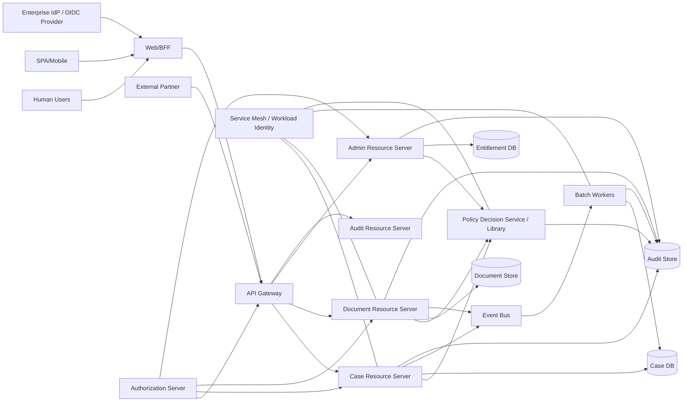
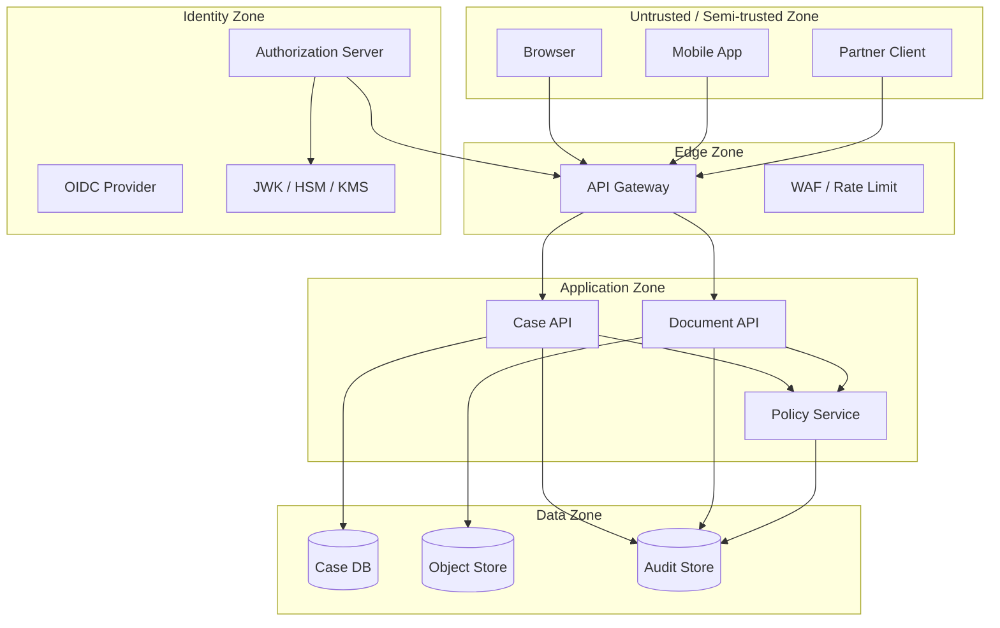
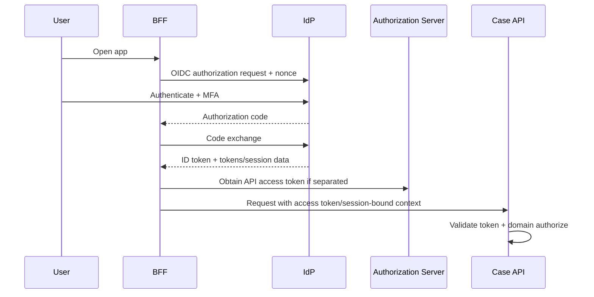
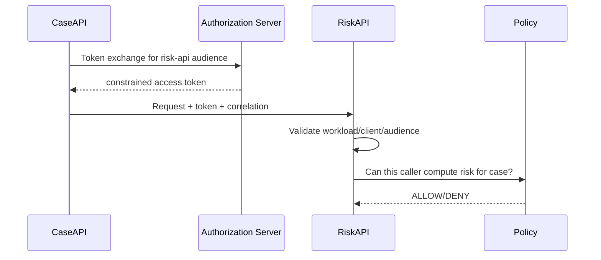
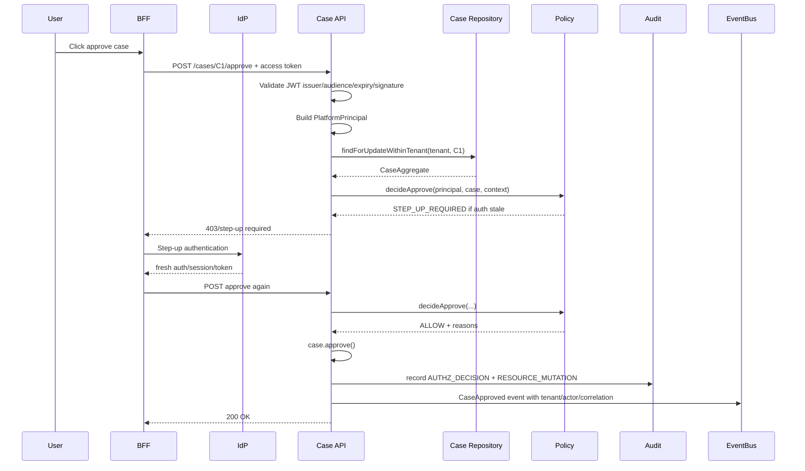

------
title: Learn Java Identity, Authentication & Authorization for Secure Enterprise API Platform - Part 034
description: Capstone design review untuk regulated enterprise API platform: requirements, threat model, identity flows, authorization model, tenant isolation, audit, Java/Spring implementation boundaries, testing, rollout, dan review checklist.
series: learn-java-identity-authentication-authorization-api-platform
seriesTitle: Learn Java Identity, Authentication & Authorization for Secure Enterprise API Platform
order: 34
partTitle: Capstone Design Review of a Regulated Enterprise API Platform
tags:
- java
- identity
- authentication
- authorization
- api-security
- capstone
- architecture-review
- oauth2
- oidc
- spring-security
- multi-tenancy
- audit
- enterprise-platform
date: 2026-06-28
---

# Part 034 — Capstone: Design Review of a Regulated Enterprise API Platform

## 1. Problem Framing

Kita sudah membahas hampir seluruh bagian penting identity/auth platform:

- identity domain model,
- threat model,
- assurance,
- authentication,
- session,
- OAuth/OIDC,
- token validation,
- Spring Security,
- RBAC/ABAC/ReBAC,
- BOLA defense,
- data-boundary authorization,
- multi-tenancy,
- delegation/impersonation,
- machine/workload identity,
- gateway/resource-server/service mesh boundary,
- authorization server,
- build-vs-buy,
- FAPI-grade API,
- token lifecycle,
- provisioning,
- entitlement governance,
- audit,
- testing,
- reference architecture,
- failure modes.

Part ini menggabungkan semuanya dalam satu **capstone design review**.

Targetnya bukan membuat template dokumen. Targetnya adalah melatih kemampuan engineering judgement:

> Diberikan sebuah platform API enterprise yang menangani data sensitif, banyak tenant, human user, machine client, support impersonation, async jobs, dan regulatory audit, mampukah kita menilai apakah identity/auth architecture-nya aman, konsisten, testable, dan defensible?

---

## 2. Scenario: Regulated Case Management API Platform

Bayangkan kita membangun platform bernama **RegulaCase**.

RegulaCase adalah secure enterprise API platform untuk enforcement/case management di lingkungan regulated.

### Business Capabilities

Platform menyediakan:

- case intake,
- case assignment,
- document upload,
- evidence review,
- case decision,
- enforcement action,
- supervisory approval,
- external partner submission,
- regulator audit query,
- notification,
- reporting/export,
- support/admin operations.

### Actors

| Actor | Description |
|---|---|
| Case Officer | Human user who manages assigned cases. |
| Supervisor | Approves high-risk decisions. |
| Tenant Admin | Manages users and entitlements within one tenant. |
| Platform Admin | Operates platform but should not read tenant data by default. |
| Support Agent | Can impersonate with reason and time-bound approval. |
| External Partner | Submits cases/documents through partner API. |
| Batch Worker | Runs risk scoring and export jobs. |
| Notification Service | Sends email/SMS/webhook notifications. |
| Audit Officer | Reviews access and decision evidence. |
| CI/CD Pipeline | Deploys configuration and policy artifacts. |

### Tenancy Model

- Multiple regulated organizations use the same platform.
- Each tenant has isolated users, cases, documents, entitlements, audit views, and configuration.
- Some platform-wide services operate across tenants but must do so with explicit service identity and policy.
- Support access is exceptional, time-bound, reason-coded, and audited.

### Security Requirement Summary

1. Every API call must have a verified actor or verified workload.
2. Tenant context must be derived from trusted identity/session and route binding.
3. Object-level authorization must be enforced for every case/document/action.
4. High-risk actions require fresh MFA/step-up.
5. Service-to-service calls must use strong workload identity.
6. Audit must explain who did what, on whose behalf, in which tenant, why allowed/denied, and by which policy version.
7. Authorization must be testable and regression-protected.
8. Emergency revocation and tenant/client disable must be operationally possible.

---

## 3. Kaufman Skill Integration

This capstone maps Kaufman’s acquisition model into architecture review.

| Kaufman Principle | Capstone Application |
|---|---|
| Deconstruct the skill | Break platform security into identity, authn, token, authz, tenant, service identity, audit, ops. |
| Learn enough to self-correct | Use invariants and failure modes to detect weak designs. |
| Remove practice barriers | Use repeatable templates, diagrams, decision records, test matrices. |
| Practice deliberately | Review concrete API flows and mutate them. |
| Fast feedback | Convert every design assumption into negative test or audit query. |

The goal is not perfection. The goal is controlled, explainable, reviewable security behavior.

---

## 4. Architecture Context Diagram



### Boundary Interpretation

| Boundary | Main Responsibility | Must Not Be Assumed |
|---|---|---|
| IdP | Authenticate user, issue identity assertions | Domain authorization |
| Authorization Server | Issue access/refresh tokens, client auth, consent/grants | Object-level access decision |
| API Gateway | Routing, coarse auth, rate limiting, request normalization | Complete authorization |
| Resource Server | Token validation, domain authorization entry | Identity proofing |
| Policy Layer | Subject-action-resource-context decision | Authentication ceremony |
| Data Layer | Tenant/object visibility predicates | Business policy ownership alone |
| Mesh | Workload authentication and transport security | End-user authorization |
| Audit Pipeline | Evidence capture and investigation | Prevention by itself |

---

## 5. Trust Boundaries



### Review Questions

For each arrow:

1. Who authenticates whom?
2. What credential is presented?
3. What is the intended audience?
4. What identity context is propagated?
5. What authorization decision is made at this boundary?
6. Is the boundary fail-closed?
7. What audit event proves the decision?

---

## 6. Identity Model for RegulaCase

### Core Types

```java
public record SubjectId(String value) {}
public record AccountId(String value) {}
public record TenantId(String value) {}
public record PrincipalId(String value) {}
public record ClientId(String value) {}
public record WorkloadId(String value) {}
public record SessionId(String value) {}
public record CaseId(String value) {}
public record DocumentId(String value) {}
```

### Principal Model

```java
public sealed interface PlatformPrincipal permits HumanPrincipal, ServicePrincipal {
    PrincipalId principalId();
    TenantId activeTenantId();
    Set<String> authorities();
    AuthenticationAssurance assurance();
    ActorChain actorChain();
}

public record HumanPrincipal(
    PrincipalId principalId,
    SubjectId subjectId,
    AccountId accountId,
    TenantId activeTenantId,
    SessionId sessionId,
    Set<String> authorities,
    AuthenticationAssurance assurance,
    ActorChain actorChain
) implements PlatformPrincipal {}

public record ServicePrincipal(
    PrincipalId principalId,
    ClientId clientId,
    WorkloadId workloadId,
    TenantId activeTenantId,
    Set<String> authorities,
    AuthenticationAssurance assurance,
    ActorChain actorChain
) implements PlatformPrincipal {}
```

### Actor Chain

```java
public record ActorChain(List<Actor> actors) {
    public Actor effectiveActor() {
        return actors.get(actors.size() - 1);
    }

    public Actor originalActor() {
        return actors.get(0);
    }
}

public record Actor(
    String type,
    String id,
    Optional<String> reasonCode,
    Optional<Instant> startedAt
) {}
```

Examples:

```json
{
  "actorChain": [
    { "type": "user", "id": "officer-123" }
  ]
}
```

```json
{
  "actorChain": [
    { "type": "support-agent", "id": "support-55", "reasonCode": "TICKET-9001" },
    { "type": "user", "id": "officer-123" }
  ]
}
```

### Design Review Decision

- Do not use email as primary identity.
- Use issuer + subject for federated identity linking.
- Use tenant membership as separate entity.
- Use actor chain for delegation/impersonation.
- Keep service principal separate from human principal.

---

## 7. Authentication Architecture

### Human Login

For browser-based staff users:

- BFF uses OIDC Authorization Code flow.
- Session is server-side or protected cookie-backed with server validation.
- MFA is required for baseline staff login.
- High-risk actions require step-up if authentication is stale.
- Account recovery is risk-tiered.
- Login event and session event are audited.



### Partner API Authentication

For external partners:

- OAuth client credentials.
- Strong client authentication: mTLS or private key JWT for high-value partners.
- Partner identity maps to tenant or partner organization.
- Partner scopes are coarse; domain policy still checks submission contract.

### Service Authentication

For internal services:

- workload identity through mesh/SPIFFE or equivalent,
- OAuth token exchange where end-user context must be propagated,
- service-specific clients,
- no global shared secret.

---

## 8. Token Strategy

### Token Types

| Token | Consumer | Recommended Use |
|---|---|---|
| ID Token | BFF/client | Login/authentication statement. Not for API authorization. |
| Access Token | Resource server | API access. Validate issuer/audience/expiry/signature. |
| Refresh Token | BFF/confidential client | Session continuity. Rotate and detect reuse. |
| Opaque Token | High-risk API | Introspection and near-real-time revocation. |
| JWT Access Token | High-scale API | Local validation, short lifetime, careful claims. |
| Token Exchange Token | Downstream service | Audience-specific, constrained delegation. |

### Required Claims for Access Token

```json
{
  "iss": "https://auth.regulacase.example",
  "sub": "subject-123",
  "aud": "case-api",
  "exp": 1782627600,
  "iat": 1782627000,
  "jti": "tok-...",
  "client_id": "bff-web",
  "tenant_id": "tenant-acme",
  "scope": "case.read case.write",
  "acr": "urn:regulacase:aal2",
  "auth_time": 1782626900,
  "ver": 17
}
```

### Token Validation Invariants

Resource server must validate:

- issuer,
- signature,
- allowed algorithm,
- expiration and not-before,
- audience,
- token type/profile,
- tenant claim shape,
- client if endpoint is client-specific,
- security version if required,
- `jti`/revocation for high-risk flows if required.

### Spring Resource Server Sketch

```java
@Configuration
@EnableMethodSecurity
class SecurityConfiguration {

    @Bean
    SecurityFilterChain apiSecurity(HttpSecurity http) throws Exception {
        http
            .csrf(csrf -> csrf.disable())
            .authorizeHttpRequests(auth -> auth
                .requestMatchers("/actuator/health").permitAll()
                .requestMatchers("/api/**").authenticated()
                .anyRequest().denyAll()
            )
            .oauth2ResourceServer(oauth -> oauth
                .jwt(jwt -> jwt
                    .jwtAuthenticationConverter(platformJwtAuthenticationConverter())
                )
            );
        return http.build();
    }

    @Bean
    JwtDecoder jwtDecoder() {
        NimbusJwtDecoder decoder = JwtDecoders.fromIssuerLocation("https://auth.regulacase.example");
        OAuth2TokenValidator<Jwt> validator = new DelegatingOAuth2TokenValidator<>(
            JwtValidators.createDefaultWithIssuer("https://auth.regulacase.example"),
            new AudienceValidator("case-api"),
            new RequiredClaimValidator("tenant_id")
        );
        decoder.setJwtValidator(validator);
        return decoder;
    }
}
```

---

## 9. Authorization Model

### Decision Shape

```java
public record AuthorizationRequest(
    PlatformPrincipal principal,
    Action action,
    ResourceRef resource,
    AuthorizationContext context
) {}

public record AuthorizationDecision(
    String decisionId,
    DecisionEffect effect,
    List<String> reasons,
    String policyVersion,
    Optional<StepUpRequirement> stepUpRequirement
) {}

public enum DecisionEffect {
    ALLOW,
    DENY,
    STEP_UP_REQUIRED
}
```

### Policy Rule Example

Action: approve enforcement decision.

Required:

- principal authenticated,
- active tenant matches case tenant,
- principal has `case.approve` entitlement in tenant,
- principal is not the original submitter if segregation of duties applies,
- case status is `PENDING_APPROVAL`,
- amount/risk score within approval limit,
- AAL2 or stronger,
- authentication age under 10 minutes,
- no active risk hold on account,
- if delegated/impersonated, action is permitted under delegation contract,
- decision is audited.

```java
public AuthorizationDecision decideApprove(
    PlatformPrincipal principal,
    CaseAggregate c,
    Clock clock
) {
    DecisionBuilder b = DecisionBuilder.start("case-policy@2026-06-28");

    b.require(c.tenantId().equals(principal.activeTenantId()), "TENANT_MATCH");
    b.require(principal.authorities().contains("ENTITLEMENT_case.approve"), "HAS_APPROVE_ENTITLEMENT");
    b.require(c.status() == CaseStatus.PENDING_APPROVAL, "CASE_PENDING_APPROVAL");
    b.require(!c.submittedBy().equals(principal.principalId()), "SEGREGATION_OF_DUTIES");

    if (!principal.assurance().isFreshFor(Duration.ofMinutes(10), clock)) {
        return b.stepUp("AAL2_FRESH_10M");
    }

    return b.toDecision();
}
```

### Enforcement Invariant

> Every protected command must have exactly one obvious authorization decision point, and every data retrieval must use a visibility contract.

---

## 10. Data Access Boundary

### Repository Contract

Do not expose generic repository methods for protected reads.

```java
interface CaseRepository {
    Optional<CaseAggregate> findVisibleById(
        TenantId tenantId,
        PrincipalId principalId,
        CaseId caseId
    );

    Optional<CaseAggregate> findForUpdateWithinTenant(
        TenantId tenantId,
        CaseId caseId
    );

    Page<CaseSummary> searchVisibleCases(
        PrincipalAccessContext ctx,
        CaseSearchCriteria criteria,
        Pageable pageable
    );
}
```

### Query Predicate Example

```sql
select c.*
from cases c
join case_assignments a on a.case_id = c.id
where c.tenant_id = :tenantId
  and a.principal_id = :principalId
  and c.deleted_at is null
  and (:status is null or c.status = :status)
order by c.updated_at desc
limit :limit offset :offset
```

### Review Rule

For every protected resource type, define:

```text
Resource type:
Visibility predicate:
Mutable action predicate:
Tenant predicate:
Ownership/assignment relationship:
Delegation behavior:
Admin override behavior:
Existence disclosure rule:
Audit event:
```

---

## 11. API Endpoint Review

### Case Detail

```http
GET /api/cases/{caseId}
```

Required controls:

- authenticated principal,
- token audience `case-api`,
- tenant context established,
- `caseId` loaded through visibility predicate,
- hidden existence for unauthorized case,
- audit read event if case is sensitive.

### Case Search

```http
GET /api/cases?status=PENDING_APPROVAL
```

Required controls:

- no broad tenant scan,
- visibility predicate in query,
- filter criteria sanitized,
- pagination bounded,
- count/facet results must respect same predicate,
- export uses stricter approval if needed.

### Case Approval

```http
POST /api/cases/{caseId}/approve
```

Required controls:

- action-specific authorization,
- fresh MFA/step-up,
- SoD check,
- tenant match,
- state check,
- idempotency key,
- audit decision,
- event emitted with actor chain.

### Document Attach

```http
POST /api/cases/{caseId}/documents/{documentId}/attach
```

Required controls:

- case visible and mutable,
- document visible,
- document tenant matches case tenant,
- document classification allowed for case type,
- malware scan status accepted,
- audit event.

### Support Impersonation Start

```http
POST /api/support/impersonations
```

Required controls:

- support agent entitlement,
- reason/ticket required,
- target tenant scoped,
- duration limit,
- approval if high-risk,
- notification if required,
- actor chain created,
- prohibited actions list enforced.

---

## 12. Multi-Tenancy Design Review

### Tenant Context Establishment

Sources:

1. OIDC/OAuth claim for active tenant,
2. BFF session active tenant,
3. route slug bound to known tenant,
4. partner client registration mapped to tenant,
5. service principal tenant scope.

Never trust tenant from raw request parameter without verifying membership/binding.

```java
public TenantContext resolve(HttpServletRequest request, PlatformPrincipal principal) {
    TenantSlug slug = TenantSlug.fromPath(request.getRequestURI());
    TenantId routeTenant = tenantDirectory.resolve(slug);

    if (!principalCanAccessTenant(principal, routeTenant)) {
        throw new AccessDeniedException("Invalid tenant context");
    }

    return new TenantContext(routeTenant, TenantSource.ROUTE_BOUND_TO_PRINCIPAL);
}
```

### Tenant Isolation Checklist

- [ ] token/session contains active tenant or tenant selection is server-side,
- [ ] every query includes tenant predicate,
- [ ] cache key includes tenant,
- [ ] object storage path includes tenant or equivalent isolation,
- [ ] events include tenant,
- [ ] async jobs include tenant,
- [ ] audit events include tenant,
- [ ] admin roles are tenant-scoped,
- [ ] support access has tenant-bound reason,
- [ ] tests mutate tenant IDs.

---

## 13. Delegation and Impersonation Design

### Allowed Patterns

| Pattern | Use Case | Required Evidence |
|---|---|---|
| Consent delegation | User authorizes client access | consent record, scopes, resource, expiry |
| Acting-as | Support/admin performs action as user | actor chain, reason, duration, policy |
| On-behalf-of | Service calls downstream for user | subject token, audience, token exchange record |
| Break-glass | Emergency privileged access | approval/reason, time box, alert, review |

### Actor Chain Propagation

When support agent impersonates a case officer:

```json
{
  "effectiveSubject": "officer-123",
  "actorChain": [
    {
      "type": "support-agent",
      "id": "support-55",
      "reason": "TICKET-9001",
      "startedAt": "2026-06-28T09:00:00Z"
    },
    {
      "type": "user",
      "id": "officer-123"
    }
  ]
}
```

Policy must be able to deny certain actions under impersonation:

```java
if (principal.actorChain().containsType("support-agent") && action.isFinancialApproval()) {
    return deny("IMPERSONATION_CANNOT_APPROVE");
}
```

---

## 14. Service-to-Service Design

### Internal Calls

For synchronous service-to-service:

- mTLS/workload identity authenticates caller workload,
- access token audience targets downstream API,
- end-user context is propagated only when needed,
- downstream API re-authorizes action based on caller and actor context.



### Async Jobs

Job payload must include:

- tenant,
- resource IDs,
- requested by,
- actor chain,
- decision ID or policy snapshot where appropriate,
- requested time,
- idempotency key,
- reason/action.

```java
public record ExportCasesJob(
    TenantId tenantId,
    PrincipalId requestedBy,
    ActorChain actorChain,
    String decisionId,
    CaseExportCriteria criteria,
    Instant requestedAt,
    String idempotencyKey
) {}
```

Worker must not silently run as global admin.

---

## 15. Audit Architecture

### Audit Event Types

| Event | Purpose |
|---|---|
| AUTHENTICATION_SUCCESS | Login evidence. |
| AUTHENTICATION_FAILURE | Attack/issue detection. |
| SESSION_CREATED | Session lifecycle. |
| STEP_UP_REQUIRED | High-risk action control. |
| STEP_UP_SUCCESS | Fresh assurance evidence. |
| AUTHZ_DECISION | Allow/deny/step-up decision. |
| RESOURCE_READ | Sensitive read event. |
| RESOURCE_MUTATION | State-changing operation. |
| IMPERSONATION_STARTED | Support/admin exceptional access. |
| IMPERSONATION_ENDED | End of exceptional access. |
| TOKEN_REVOKED | Compromise/logout/lifecycle. |
| ENTITLEMENT_CHANGED | Governance traceability. |
| POLICY_CHANGED | Policy version traceability. |
| EXPORT_CREATED | Data exfiltration-sensitive operation. |

### Decision Event Schema

```java
public record AuthorizationDecisionEvent(
    String eventId,
    String decisionId,
    Instant occurredAt,
    TenantId tenantId,
    PrincipalId principalId,
    ActorChain actorChain,
    String action,
    String resourceType,
    String resourceId,
    String effect,
    List<String> reasons,
    String policyVersion,
    String correlationId,
    String clientId,
    String workloadId
) {}
```

### Audit Review Questions

For any sensitive case, audit must answer:

1. Who read it?
2. Who changed it?
3. Why were they allowed?
4. Was access direct, delegated, support impersonated, or machine-initiated?
5. Which tenant context was active?
6. Which policy version was used?
7. Was MFA fresh?
8. Which downstream services processed it?
9. Was it exported?
10. Were there denied attempts before access?

---

## 16. Package and Module Structure

A possible Java/Spring service structure:

```text
com.regulacase.caseapi
  config
    SecurityConfiguration.java
    JwtDecoderConfiguration.java
    MethodSecurityConfiguration.java
  identity
    PlatformPrincipal.java
    HumanPrincipal.java
    ServicePrincipal.java
    ActorChain.java
    PrincipalAuthenticationConverter.java
  tenancy
    TenantContext.java
    TenantResolver.java
    TenantAccessVerifier.java
  authorization
    Action.java
    ResourceRef.java
    AuthorizationRequest.java
    AuthorizationDecision.java
    DecisionEnforcer.java
    CasePolicy.java
    PolicyReason.java
  caseapp
    CaseApplicationService.java
    CaseCommandService.java
    CaseQueryService.java
  casedomain
    CaseAggregate.java
    CaseStatus.java
    CaseAssignment.java
  persistence
    CaseRepository.java
    JpaCaseRepository.java
    CaseVisibilitySpecification.java
  audit
    AuditEvent.java
    AuthorizationDecisionEvent.java
    AuditPublisher.java
  integration
    RiskClient.java
    TokenExchangeClient.java
  jobs
    ExportCasesJob.java
    ExportCasesWorker.java
```

### Rule

Security-sensitive concepts get first-class types. Avoid stringly typed identity/auth code.

---

## 17. Example End-to-End Flow: Approve Case



### Design Notes

- Step-up is not generic 403 only; client needs actionable requirement.
- Approval uses state lock/transaction to avoid TOCTOU.
- Case event includes tenant and actor chain.
- Audit is recorded inside same transactional boundary or through reliable outbox.

---

## 18. Threat Model Walkthrough

### Threat: Cross-Tenant Case Read

**Attack**

User from tenant A calls:

```http
GET /api/cases/TENANT_B_CASE_ID
```

**Controls**

- token tenant claim checked,
- repository visibility predicate includes tenant,
- unauthorized existence hidden,
- audit denied attempt if suspicious,
- test mutates case IDs across tenants.

### Threat: Stale Approver Role

**Attack**

User has JWT minted before approver role removal.

**Controls**

- short access token lifetime,
- approval policy checks live entitlement for high-risk action,
- account/entitlement security version,
- entitlement-change event revokes grants where needed,
- test removes role after token issuance.

### Threat: Gateway Bypass

**Attack**

Internal caller reaches case API directly.

**Controls**

- resource server validates token itself,
- network policy blocks unapproved source,
- service mesh authenticates workload,
- tests call app without gateway headers.

### Threat: Support Agent Abuse

**Attack**

Support agent impersonates officer and approves enforcement action.

**Controls**

- impersonation policy forbids approval,
- actor chain required,
- reason/ticket required,
- time-bound session,
- alert/audit review.

### Threat: Partner Client Credential Leak

**Attack**

Attacker uses leaked partner secret.

**Controls**

- mTLS or private key JWT,
- client disable switch,
- environment-bound client,
- anomaly detection by IP/cert/thumbprint,
- token audience/scope constraints,
- revocation runbook.

---

## 19. Testing Strategy

### Unit Tests

- policy decision for each action,
- step-up requirement,
- SoD logic,
- actor chain constraints,
- tenant role resolution,
- audit event builder.

### Integration Tests

- token validation with valid/invalid JWT,
- wrong audience rejected,
- wrong issuer rejected,
- expired token rejected,
- missing tenant claim rejected,
- method security denial,
- repository visibility predicate.

### API Security Tests

- BOLA detail endpoint,
- BOLA list/search/export,
- indirect object reference,
- bulk operation partial unauthorized,
- cross-tenant mutation,
- disabled account with active token,
- stale entitlement,
- support impersonation prohibited action.

### Contract Tests

- IdP issuer metadata,
- JWKS rotation,
- introspection response shape,
- token exchange shape,
- partner client token claims,
- audit event schema.

### Operational Drills

- disable tenant,
- disable client,
- revoke token family,
- rotate signing key,
- JWKS outage,
- policy rollback,
- audit query for incident,
- compromised service account.

---

## 20. Example Test Cases

```java
@Test
void shouldRejectTokenWithWrongAudience() throws Exception {
    mockMvc.perform(get("/api/cases/C1")
            .with(jwt().jwt(jwt -> jwt
                .issuer("https://auth.regulacase.example")
                .audience(List.of("other-api"))
                .claim("tenant_id", "tenant-a")
            )))
        .andExpect(status().isUnauthorized());
}
```

```java
@Test
void shouldHideCaseFromAnotherTenant() throws Exception {
    CaseId tenantBCase = fixtures.caseInTenant("tenant-b");

    mockMvc.perform(get("/api/cases/{id}", tenantBCase.value())
            .with(jwtForTenant("tenant-a", "officer-1", "SCOPE_case.read")))
        .andExpect(status().isNotFound());
}
```

```java
@Test
void shouldRequireStepUpForStaleApprovalAuthentication() {
    PlatformPrincipal p = fixtures.principalWithAuthTime(Instant.now().minus(Duration.ofHours(2)));
    CaseAggregate c = fixtures.pendingCaseAssignedTo(p);

    AuthorizationDecision d = casePolicy.decideApprove(p, c, Clock.systemUTC());

    assertThat(d.effect()).isEqualTo(DecisionEffect.STEP_UP_REQUIRED);
}
```

```java
@Test
void shouldDenyApprovalDuringSupportImpersonation() {
    PlatformPrincipal p = fixtures.supportImpersonatingOfficer();
    CaseAggregate c = fixtures.pendingCase();

    AuthorizationDecision d = casePolicy.decideApprove(p, c, Clock.systemUTC());

    assertThat(d.effect()).isEqualTo(DecisionEffect.DENY);
    assertThat(d.reasons()).contains("IMPERSONATION_CANNOT_APPROVE");
}
```

---

## 21. Rollout Strategy

### Phase 1 — Inventory and Observability

- inventory endpoints,
- inventory clients/service accounts,
- inventory roles/entitlements,
- add correlation IDs,
- add audit event schema,
- detect gateway-only assumptions,
- classify sensitive APIs.

### Phase 2 — Token Validation Hardening

- enforce issuer and audience,
- standardize JWT decoder,
- add wrong-audience tests,
- implement JWKS rotation monitoring,
- remove custom decode-only logic.

### Phase 3 — Tenant Boundary Hardening

- introduce `TenantContext`,
- update repository contracts,
- add tenant-scoped cache keys,
- add cross-tenant tests,
- review async jobs and events.

### Phase 4 — Authorization Policy Extraction

- replace scattered role checks with policy objects,
- introduce decision record,
- define action/resource matrix,
- implement method/domain enforcement,
- write negative tests.

### Phase 5 — Lifecycle and Governance

- connect deactivation to token/session revocation,
- add entitlement expiry,
- add access review reports,
- remove global service accounts,
- rotate credentials.

### Phase 6 — High-Assurance Flows

- step-up for high-risk actions,
- support impersonation controls,
- partner mTLS/private key JWT,
- token exchange for downstream calls,
- audit query drills.

### Phase 7 — Operational Readiness

- emergency disable runbooks,
- key rotation drill,
- client compromise drill,
- tenant isolation incident drill,
- dashboard and alerts.

---

## 22. Architecture Decision Records

### ADR-001: Use OIDC for Human Login, OAuth Access Tokens for APIs

**Decision**

Human login uses OIDC Authorization Code flow. APIs accept OAuth access tokens only.

**Reason**

Avoid treating access token as login assertion. Keep ID token and access token semantics separate.

**Consequences**

BFF validates OIDC login. Resource servers validate access tokens and enforce domain authorization.

---

### ADR-002: Enforce Authorization in Resource Server/Domain Layer, Not Gateway Only

**Decision**

Gateway performs coarse checks. Resource server/domain services perform object-level decisions.

**Reason**

Gateway lacks domain object context. BOLA prevention requires object-level data and policy.

**Consequences**

Each service must include policy/enforcement tests. Gateway still valuable for traffic control and coarse rejection.

---

### ADR-003: Tenant is a First-Class Security Boundary

**Decision**

Tenant appears in principal, data predicates, cache keys, jobs, events, and audit.

**Reason**

Tenant escape is catastrophic. Tenant cannot be only a UI filter.

**Consequences**

All repository contracts require tenant context. Cross-tenant mutation tests are mandatory.

---

### ADR-004: Use Policy Objects for Domain Authorization

**Decision**

Authorization logic is expressed through explicit policy objects returning structured decisions.

**Reason**

Scattered `hasRole` checks cannot express resource/action/context/assurance/delegation logic safely.

**Consequences**

Policy tests become primary security regression suite. Decisions become auditable.

---

### ADR-005: Structured Authorization Decision Audit

**Decision**

High-risk allow/deny/step-up decisions emit structured audit events with reasons and policy version.

**Reason**

Regulatory defensibility requires explainable decisions, not only access logs.

**Consequences**

Audit schema is part of API security contract. Logs must redact secrets and PII appropriately.

---

## 23. Review Findings Example

Assume initial design says:

> “Gateway validates JWT and checks roles. Backend trusts `X-User-Id`, `X-Tenant-Id`, and `X-Roles`. Case API uses `findById`. Audit logs request path and user ID.”

### Findings

| Severity | Finding | Reason |
|---|---|---|
| Critical | Gateway-only authorization | Backend can be bypassed or called by compromised internal service. |
| Critical | `findById` without tenant/visibility | BOLA and tenant escape. |
| High | Trusting identity headers | Header spoofing unless signed and still insufficient. |
| High | Role-only authorization | No object/action/context decision. |
| High | Audit lacks decision reason | Cannot prove why access was allowed. |
| Medium | No stale entitlement strategy | Removed role may persist in token. |
| Medium | No support actor chain | Impersonation indistinguishable from user action. |
| Medium | No JWKS rotation drill | Key rotation may break or fail open. |

### Required Remediation

1. Resource server validates tokens.
2. Tenant-bound principal model.
3. Repository visibility contracts.
4. Policy object for case actions.
5. Structured authorization decision audit.
6. Cross-tenant and BOLA negative tests.
7. Actor chain for support flows.
8. Token lifecycle and key rotation runbooks.

---

## 24. Capstone Deliverable Template

Use this as your final design review artifact.

```mdx
# Identity/Auth Design Review: <System Name>

## 1. System Scope
- APIs:
- Tenants:
- Actor types:
- Data sensitivity:
- High-risk actions:

## 2. Identity Model
- Subject:
- Account:
- Tenant membership:
- Client:
- Workload:
- Session:
- Actor chain:

## 3. Authentication
- Human login:
- MFA/step-up:
- Recovery:
- Partner auth:
- Service auth:

## 4. Token Strategy
- Token types:
- Issuers:
- Audiences:
- Claim contract:
- Revocation:
- Rotation:

## 5. Authorization Model
- Policy model:
- Actions:
- Resources:
- Context:
- Deny-by-default behavior:
- Step-up behavior:

## 6. Tenant Isolation
- Tenant resolution:
- Data predicates:
- Cache keys:
- Events/jobs:
- Admin boundary:

## 7. API Boundary
- Gateway responsibilities:
- Resource server responsibilities:
- Mesh responsibilities:
- BFF responsibilities:

## 8. Audit and Evidence
- Decision events:
- Actor chain:
- Correlation:
- Retention:
- Query examples:

## 9. Testing
- Token tests:
- BOLA tests:
- Tenant tests:
- Method/domain tests:
- Data boundary tests:
- Audit tests:
- Operational drills:

## 10. Risks and Decisions
- Known residual risks:
- ADRs:
- Rollout plan:
- Open questions:
```

---

## 25. Grading Rubric

Use this to grade architecture maturity.

| Level | Description |
|---|---|
| 1 — Demo Secure | Login works, token exists, some endpoints protected. Many implicit assumptions. |
| 2 — Mechanism Secure | OAuth/OIDC/Spring Security configured, but object/tenant/data boundaries inconsistent. |
| 3 — Boundary Secure | Resource server, method/domain, and data access boundaries enforce policy consistently. |
| 4 — Lifecycle Secure | Token/session/provisioning/entitlement/service identity lifecycle handled. |
| 5 — Defensible Platform | Decisions are auditable, tests cover negative cases, runbooks exist, governance works. |

RegulaCase target should be Level 5 for high-risk operations and at least Level 4 platform-wide.

---

## 26. Common Trade-Offs

### JWT vs Opaque Token

JWT gives local validation and scale. Opaque token gives stronger central control/revocation. For high-risk actions, use short-lived JWT plus live policy check or opaque/introspection.

### Gateway Policy vs Domain Policy

Gateway is good for coarse rejection. Domain policy is required for object/action/context decisions.

### Central Policy Service vs Local Library

Central service improves consistency and governance. Local library reduces latency and availability coupling. Hybrid is common: policy-as-code distributed to services, with central governance and audit.

### Tenant-per-Issuer vs Shared Issuer

Tenant-per-issuer improves isolation and trust customization. Shared issuer reduces operational burden but needs stricter tenant claim and membership checks.

### Build vs Buy IAM

Buy for commodity identity. Build only for domain-specific authorization, decision evidence, and platform integration where product IAM cannot express requirements.

---

## 27. Final Capstone Exercise

Design review this flow:

```http
POST /api/tenants/{tenantSlug}/cases/{caseId}/approve
Authorization: Bearer <access-token>
Idempotency-Key: abc-123
```

Request body:

```json
{
  "decision": "APPROVE",
  "comment": "Meets enforcement threshold",
  "attachments": ["doc-1", "doc-2"]
}
```

Answer:

1. How is `tenantSlug` bound to principal?
2. Is token audience correct?
3. Is the case loaded with tenant predicate?
4. Are attachments authorized and bound to the case/tenant?
5. Is approval action different from read access?
6. Does SoD apply?
7. Is MFA fresh enough?
8. What if user role was removed five minutes ago?
9. What if support agent is impersonating?
10. What audit event is emitted?
11. What is the idempotency behavior?
12. What event is published downstream?
13. What tests prove this cannot approve another tenant’s case?
14. What operational control revokes access during compromise?

If your design answers these clearly, you are operating beyond template-level security.

---

## 28. Key Takeaways

1. A secure enterprise API platform is not “Spring Security + JWT”. It is a set of consistent identity, token, authorization, tenant, audit, lifecycle, and operational boundaries.
2. The most important design skill is mapping every request from actor to token to principal to tenant to resource to policy to data predicate to audit evidence.
3. Gateway, resource server, policy layer, data layer, mesh, and audit pipeline each have different responsibilities.
4. Object-level authorization and tenant isolation must be enforced at the data boundary, not only controller annotations.
5. Delegation and impersonation require actor chain and policy restrictions, not just a boolean flag.
6. Service identity must be least-privileged and purpose-bound.
7. Audit should explain decisions, not merely record traffic.
8. Negative tests and operational drills are the proof that architecture works under failure.
9. Capstone-level review is about making assumptions explicit and converting them into invariants, tests, and runbooks.
10. The final part will turn the whole series into an operational playbook and final engineering handbook.

---

## 29. References

- NIST SP 800-63-4 — Digital Identity Guidelines: https://pages.nist.gov/800-63-4/
- RFC 9700 — Best Current Practice for OAuth 2.0 Security: https://datatracker.ietf.org/doc/rfc9700/
- OWASP API Security Top 10 2023: https://owasp.org/API-Security/editions/2023/en/0x00-header/
- OWASP API1:2023 Broken Object Level Authorization: https://owasp.org/API-Security/editions/2023/en/0xa1-broken-object-level-authorization/
- Spring Security Reference — OAuth2 Resource Server: https://docs.spring.io/spring-security/reference/servlet/oauth2/resource-server/index.html
- Spring Security Reference — Method Security: https://docs.spring.io/spring-security/reference/servlet/authorization/method-security.html
- OpenTelemetry Java Documentation: https://opentelemetry.io/docs/languages/java/
