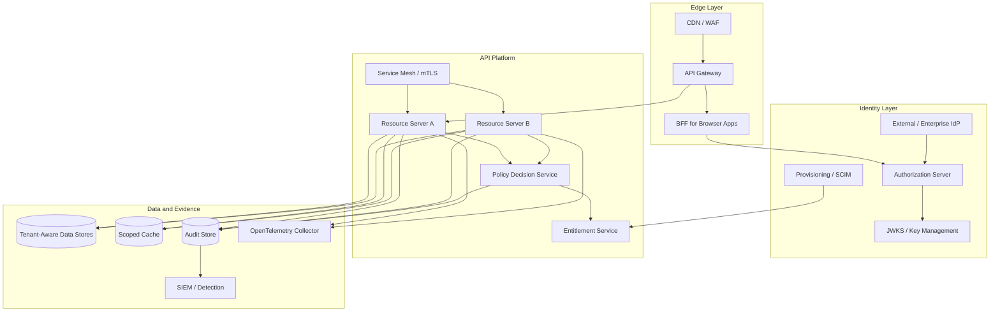
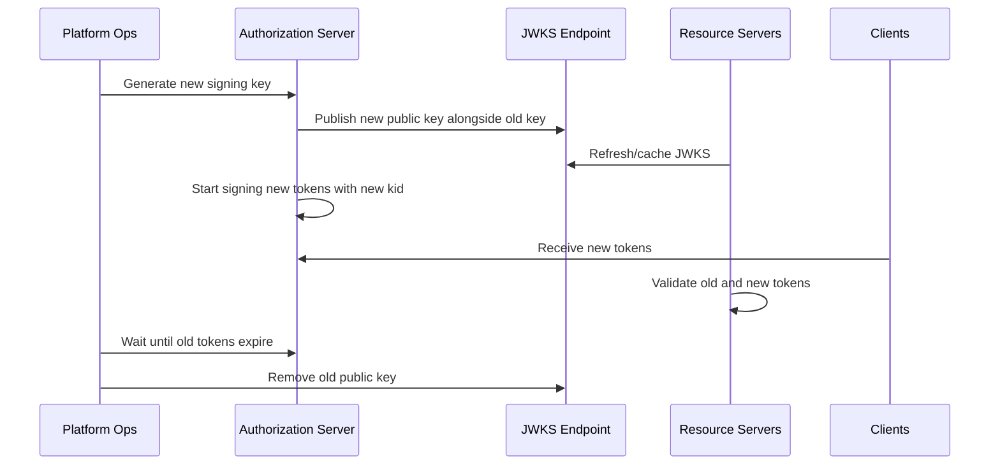

------
title: Learn Java Identity, Authentication & Authorization for Secure Enterprise API Platform - Part 035
description: Operational playbook, readiness review, runbooks, migration strategy, incident response, control evidence, and final synthesis for Java identity, authentication, authorization, and secure enterprise API platform engineering.
series: learn-java-identity-authentication-authorization-api-platform
seriesTitle: Learn Java Identity, Authentication & Authorization for Secure Enterprise API Platform
order: 35
partTitle: Operational Playbook and Final Engineering Handbook
tags:
- java
- identity
- authentication
- authorization
- oauth
- oidc
- api-security
- spring-security
- platform-engineering
- operational-readiness
date: 2026-06-28
---

# Part 035 — Operational Playbook and Final Engineering Handbook

This is the final part of the series.

The previous parts built the architecture: identity model, threat model, authentication, session management, OAuth/OIDC, token validation, Spring Security, resource server boundaries, authorization models, object-level authorization, multi-tenancy, delegation, service identity, FAPI-grade controls, token lifecycle, provisioning, entitlement governance, audit, testing, and reference architecture.

This part converts all of that into an operational handbook.

The goal is not merely to know identity/security concepts. The goal is to run a secure enterprise API platform where authentication, authorization, tenant isolation, auditability, and incident response remain correct under production pressure.

By the end, we want a practical answer to this question:

> When this platform is deployed, operated, attacked, misconfigured, partially down, migrated, audited, or changed by multiple teams, what keeps identity and authorization correct?

---

## 1. Kaufman Framing: The Last 20% That Separates Production Engineers

In Josh Kaufman's learning model, we deconstruct a skill, learn enough to self-correct, remove barriers to practice, and practice deliberately.

For identity/auth engineering, the last high-value skill is not implementing another login form or copying another Spring Security configuration.

The high-value skill is operational judgment.

A top engineer can answer:

- What breaks when the issuer rotates keys?
- What happens when the authorization server is slow?
- What if the gateway validates the token but the service forgets object-level authorization?
- What if a user is deactivated but still has a valid JWT?
- What if a support engineer impersonates a customer?
- What if a tenant migration duplicates subject IDs?
- What if a policy deploy accidentally grants cross-tenant read access?
- What evidence proves why access was allowed or denied?

The operational playbook is the bridge between architecture and trust.

---

## 2. The Final Mental Model

A secure enterprise API platform is a chain of decisions.

```mermaid
flowchart LR
    Actor[Actor\nHuman / Client / Workload] --> AuthN[Authentication\nWho are you?]
    AuthN --> Assurance[Assurance\nHow strongly do we know?]
    Assurance --> Token[Token / Session\nPortable security context]
    Token --> Resource[Resource Server\nValidate trust boundary]
    Resource --> Policy[Authorization\nCan this actor do this action?]
    Policy --> Data[Data Boundary\nOnly authorized rows/objects]
    Data --> Audit[Audit Evidence\nWhy was it allowed/denied?]
    Audit --> Ops[Operations\nDetect, respond, review]
```



The platform fails when one link silently assumes another link did the work.

The core invariant is:

> Every protected business action must have a verified subject, verified issuer, verified audience, verified tenant boundary, explicit authorization decision, data-level constraint, and audit evidence.

That invariant is more important than any specific framework, product, gateway, or token format.

---

## 3. Production Security Invariants

These invariants should be written into architecture review, code review, CI/CD gates, and incident postmortems.

### 3.1 Identity Invariants

1. A platform subject is stable, non-recycled, and not equal to an email address.
2. A user account can have multiple credentials and authenticators.
3. Authentication proves control of an authenticator, not business authorization.
4. Account recovery is an authentication flow and must be threat-modeled like login.
5. Federation must preserve issuer and subject identity; do not collapse all external identities into email.
6. Step-up authentication must be tied to the protected action, not merely to page navigation.

### 3.2 Token Invariants

1. A JWT must never be trusted because it is syntactically valid.
2. A token must be validated against issuer, audience, expiry, algorithm, signature, tenant, and token type.
3. A token's claims are security inputs, not the entire authorization decision.
4. Stale claims must not be used for high-risk authorization without re-evaluation.
5. Refresh tokens are high-value credentials and require rotation, replay detection, and revocation semantics.
6. Token introspection failures must be fail-closed unless an explicitly approved degraded mode exists.

### 3.3 Authorization Invariants

1. Authorization is evaluated as `subject + action + resource + context + policy`.
2. Role membership is not equivalent to object access.
3. Every object access path must enforce object-level authorization.
4. List/search/export/count/facet endpoints require authorization at query/data boundary.
5. Domain services must not trust controller-level checks as the only enforcement point.
6. Deny-by-default is a platform behavior, not a slogan.

### 3.4 Tenant Invariants

1. Tenant ID must not be accepted from the client without binding it to authenticated identity.
2. Cache keys must include tenant/security scope when values are tenant- or actor-sensitive.
3. Async jobs must carry explicit tenant and actor context.
4. Events must not leak cross-tenant data through shared topics or weak consumers.
5. Admin support flows must preserve actor chain and reason.
6. Tenant deletion/suspension must revoke or block active access paths.

### 3.5 Audit Invariants

1. Authentication events must be auditable.
2. Authorization decisions must record enough evidence to explain allow/deny.
3. Impersonation, delegation, break-glass, and privilege elevation must be first-class audit events.
4. Audit logs must not expose unnecessary secrets, tokens, passwords, or sensitive payloads.
5. Audit events must be correlated across gateway, resource server, policy service, and data mutation.
6. Audit failure must be visible; silent audit pipeline failure is a security incident.

---

## 4. Platform Readiness Review

Before production launch or major identity/security change, run this review.

### 4.1 Identity Readiness

| Question | Good Answer | Risk Signal |
|---|---|---|
| What is the stable subject identifier? | Non-recycled internal subject ID. | Email/username used as permanent ID. |
| Can identities be linked across IdPs? | Explicit account-linking policy. | Auto-linking by email. |
| How is account recovery secured? | Recovery is risk-tiered and audited. | Recovery bypasses MFA. |
| How are deactivated users blocked? | Session/token lifecycle integrated with deactivation. | Only UI login is blocked. |
| How is assurance represented? | Authentication context or assurance level available. | All logins treated equally. |

### 4.2 OAuth/OIDC Readiness

| Question | Good Answer | Risk Signal |
|---|---|---|
| Which flows are allowed? | Authorization Code + PKCE, Client Credentials, Device Flow only where justified. | Password grant, implicit flow, broad exceptions. |
| Are redirect URIs strictly registered? | Exact match, no wildcards except formally reviewed cases. | Dynamic/open redirects. |
| Are access tokens audience-bound? | Each API validates its audience. | Generic token usable everywhere. |
| Are refresh tokens rotated? | Rotation + replay detection. | Long-lived bearer refresh tokens. |
| Is OIDC separated from OAuth resource access? | ID token for login; access token for APIs. | ID token accepted by APIs. |

### 4.3 Resource Server Readiness

| Question | Good Answer | Risk Signal |
|---|---|---|
| Does every service validate issuer and audience? | Yes, locally or through trusted introspection. | Gateway-only validation. |
| Are 401 and 403 semantics correct? | Invalid/missing authentication = 401; denied authorization = 403. | Everything returns 200/404/500 inconsistently. |
| Is authority mapping explicit? | Claims mapped through controlled converter. | Raw token claims become roles directly. |
| Are multi-issuer cases controlled? | Issuer allowlist + tenant binding. | Dynamic trust of unknown issuers. |
| Are negative token tests automated? | Invalid issuer/audience/alg/expiry tested. | Only happy-path token tests. |

### 4.4 Authorization Readiness

| Question | Good Answer | Risk Signal |
|---|---|---|
| Is there a policy model? | RBAC/ABAC/ReBAC/ACL chosen per domain need. | Ad hoc `if role == admin` everywhere. |
| Are object-level checks enforced? | Every object read/write has ownership/relationship/tenant check. | Controller path checks only. |
| Are list/search/export constrained? | Query predicates include tenant and authorization scope. | Fetch all then filter in memory. |
| Can decisions be explained? | Decision record includes subject, action, resource, policy, result. | Logs only say `403`. |
| Are authorization tests matrix-driven? | Subject/action/resource/context combinations tested. | One admin test and one user test. |

### 4.5 Operational Readiness

| Question | Good Answer | Risk Signal |
|---|---|---|
| Is key rotation rehearsed? | Rotation runbook tested in staging. | No one knows JWKS cache behavior. |
| Is token compromise response defined? | Revoke, rotate, audit, detect reuse, notify. | “Wait until tokens expire.” |
| Can policy deploys be rolled back? | Versioned policy + canary + rollback. | Policy changes are database edits. |
| Is audit pipeline monitored? | Lag/drop/error alerting. | Audit is best-effort logging. |
| Are break-glass flows tested? | Controlled, time-bound, heavily audited. | Shared admin credentials. |

---

## 5. Reference Operational Architecture



The architecture is operationally healthy when each box has an owner, each boundary has a contract, and each security decision leaves evidence.

---

## 6. Control Catalog

Use this as a compact engineering checklist.

### 6.1 Authentication Controls

| Control | Purpose | Evidence |
|---|---|---|
| MFA/passkey for high-risk users | Reduce credential theft impact. | Authenticator enrollment and challenge logs. |
| Step-up for sensitive action | Match assurance to transaction risk. | Step-up decision event linked to business action. |
| Anti-enumeration login response | Prevent account discovery. | Uniform error behavior tests. |
| Account recovery hardening | Prevent recovery takeover. | Recovery event trail and risk review. |
| Session fixation defense | Prevent attacker-chosen session reuse. | Session ID rotation after login. |

### 6.2 Token Controls

| Control | Purpose | Evidence |
|---|---|---|
| Issuer allowlist | Prevent rogue token authority. | Config and negative tests. |
| Audience validation | Prevent token replay across APIs. | Resource server validation tests. |
| Algorithm allowlist | Prevent alg confusion. | Decoder configuration and tests. |
| JWKS cache and rotation plan | Avoid outage during key change. | Rotation rehearsal record. |
| Revocation/introspection where needed | Handle compromise and deactivation. | Revocation event and enforcement test. |

### 6.3 Authorization Controls

| Control | Purpose | Evidence |
|---|---|---|
| Deny-by-default | Avoid accidental exposure. | Test for missing policy. |
| Object-level authorization | Prevent BOLA/IDOR. | Per-endpoint negative tests. |
| Query-time authorization | Prevent list/search/export leaks. | SQL/predicate tests. |
| Policy versioning | Make access changes reviewable. | Policy version in audit event. |
| SoD checks | Prevent toxic combinations. | Access approval and review evidence. |

### 6.4 Tenant Controls

| Control | Purpose | Evidence |
|---|---|---|
| Tenant-bound subject | Prevent cross-tenant identity confusion. | Subject/tenant mapping record. |
| Tenant-scoped cache keys | Prevent cache leakage. | Cache contract tests. |
| Tenant-aware event payload | Prevent async cross-tenant access. | Event schema validation. |
| Tenant deactivation enforcement | Stop access when tenant is suspended. | Deactivation test and audit trail. |
| Support access boundary | Control cross-tenant support operations. | Actor-chain audit events. |

### 6.5 Audit Controls

| Control | Purpose | Evidence |
|---|---|---|
| Structured decision events | Explain access. | Searchable decision records. |
| Correlation IDs | Reconstruct request path. | Trace ID across gateway/service/policy. |
| Tamper resistance | Preserve evidence integrity. | Append-only/WORM or integrity controls. |
| Privacy-safe logging | Avoid sensitive data exposure. | Redaction tests. |
| Audit pipeline monitoring | Detect evidence loss. | Lag/drop/error alerts. |

---

## 7. Runbook: Authorization Server Outage

### Symptoms

- Login fails.
- Token refresh fails.
- Token introspection fails.
- Resource servers return elevated 401/503.
- Client credential flows fail for internal jobs.

### Immediate Questions

1. Is the outage affecting login only, token refresh only, introspection only, or JWKS discovery?
2. Are existing JWT access tokens still verifiable locally?
3. Are opaque tokens dependent on live introspection?
4. Is failure mode fail-closed or degraded-read-only?
5. Which critical operations depend on new token issuance?

### Response Steps

1. Declare identity-platform incident severity.
2. Freeze identity/config/policy deployments.
3. Check authorization server health, database, key store, cache, and network path.
4. Check JWKS endpoint and resource-server cache behavior.
5. Disable non-essential batch jobs that may retry aggressively.
6. If approved, enable pre-defined degraded mode for low-risk read-only flows.
7. Keep high-risk write/admin flows fail-closed.
8. Communicate expected user impact.
9. Preserve logs for postmortem.

### Do Not

- Do not bypass token validation in resource servers.
- Do not accept unsigned/debug tokens.
- Do not temporarily trust arbitrary issuers.
- Do not extend token lifetime manually without approval and audit.
- Do not convert fail-closed to fail-open under pressure.

### Postmortem Evidence

- Timeline of login/token/introspection failures.
- Affected clients and APIs.
- Token validation error distribution.
- Any degraded-mode activation record.
- Any authorization bypass requests and whether they were rejected.
- Corrective actions for capacity, dependency, rollback, and tests.

---

## 8. Runbook: Signing Key Rotation

Key rotation is not merely a cryptographic operation. It is a distributed trust transition.

### Safe Rotation Sequence



### Pre-Rotation Checklist

- New key generated in approved key management system.
- JWKS publishes both old and new keys before use.
- `kid` is unique and deterministic enough for lookup.
- Resource servers tolerate multiple keys.
- JWKS cache TTL is known.
- Token lifetime is known.
- Rollback path is documented.
- Staging rotation has been tested.

### Failure Modes

| Failure | Impact | Prevention |
|---|---|---|
| New token signed before JWKS publish | Resource servers reject valid tokens. | Publish first, sign later. |
| Old key removed too early | Existing tokens fail. | Wait until max token lifetime + cache window. |
| Same `kid` reused | Wrong key selection. | Unique key IDs. |
| Resource server pins one key | Rotation outage. | JWKS-aware decoder tests. |
| Algorithm change untested | Validation failure or security risk. | Algorithm allowlist and staging tests. |

---

## 9. Runbook: Token Compromise

### Trigger Examples

- Access token leaked to logs.
- Refresh token found in browser storage.
- Service account secret committed to Git.
- Partner reports token theft.
- Suspicious token reuse from impossible locations.

### Triage

1. Identify token type: access, refresh, ID token, client assertion, API key, session cookie.
2. Identify subject, client, issuer, audience, tenant, scopes, expiry.
3. Determine if token is bearer or sender-constrained.
4. Determine if refresh token exists and can mint new access tokens.
5. Determine exposure path: logs, browser, repository, vendor, malware, network.

### Containment

- Revoke refresh token or grant.
- Invalidate session if human user is involved.
- Rotate client secret/private key if client credential is involved.
- Add temporary deny rule for affected token family if necessary.
- Rotate signing key only if the signing key itself is compromised.
- Increase monitoring for affected subject/client/tenant.

### Recovery

- Re-enroll compromised credentials if needed.
- Reissue client credentials with least privilege.
- Purge leaked tokens from logs if possible.
- Review scopes and token lifetime.
- Add regression test for the leakage path.

### Evidence

- Compromised artifact identifier.
- Revocation timestamp.
- Affected subjects/clients/tenants.
- Access attempts before and after revocation.
- Confirmation that refresh path is closed.

---

## 10. Runbook: BOLA / IDOR Incident

Broken Object Level Authorization is one of the most damaging API failures because authentication can be fully working while authorization is wrong.

### Example Signal

- User A can read `/cases/{caseId}` belonging to User B.
- Tenant A can export objects from Tenant B.
- A regular user can approve another user's workflow item.
- Sequential IDs reveal resources outside the actor's scope.

### Immediate Containment

1. Disable or restrict the affected endpoint if impact is severe.
2. Add temporary deny policy or feature flag for high-risk action.
3. Preserve request logs, audit logs, and data access logs.
4. Identify endpoint family, action type, resource type, and tenant impact.
5. Search for similar access patterns across list/read/write/export endpoints.

### Root Cause Classification

| Category | Diagnostic Question |
|---|---|
| Missing object guard | Was object ownership/relationship checked? |
| Wrong tenant binding | Was tenant derived from token or request parameter? |
| Query predicate missing | Did list/export query constrain by authorization scope? |
| Parent-child mismatch | Could child object ID bypass parent authorization? |
| Cache leak | Was cached data keyed only by object ID? |
| Async leak | Did job/event execute without actor/tenant context? |

### Fix Pattern

```java
public CaseRecord getCase(SecurityPrincipal actor, CaseId caseId) {
    CaseRecord record = caseRepository.findById(caseId)
        .orElseThrow(NotFoundException::new);

    AuthorizationDecision decision = casePolicy.canView(actor, record);

    audit.record(AuthzAuditEvent.from(actor, "case.view", record.ref(), decision));

    if (decision.isDenied()) {
        throw new AccessDeniedException(decision.reasonCode());
    }

    return record;
}
```

For list/search/export, prefer query-time constraint:

```java
public Page<CaseRecord> searchCases(SecurityPrincipal actor, CaseSearchCriteria criteria, Pageable pageable) {
    CaseScope scope = casePolicy.visibleScope(actor);
    return caseRepository.search(criteria.withTenant(actor.tenantId()).withScope(scope), pageable);
}
```

### Regression Tests

- Same role, different owner.
- Same role, different tenant.
- Child ID under unauthorized parent.
- Export endpoint.
- Bulk endpoint with mixed authorized/unauthorized IDs.
- Cache hit after authorized user accesses object.
- Async job triggered by unauthorized actor.

---

## 11. Runbook: Bad Authorization Policy Deployment

### Symptoms

- Sudden increase in 403.
- Sudden decrease in 403.
- Admin-only action visible to normal users.
- Tenant-specific access breaks globally.
- Support impersonation starts bypassing approval.

### Response

1. Freeze policy changes.
2. Roll back to previous policy version.
3. Compare decision diffs between old and new policy.
4. Re-run authorization matrix tests.
5. Query audit logs for decisions made under bad policy version.
6. Identify affected business actions.
7. Notify affected product/compliance owners if access was over-granted.

### Preventive Controls

- Policy-as-code review.
- Dry-run mode.
- Canary policy evaluation.
- Decision diff report.
- Mandatory negative tests.
- Versioned decision logging.

---

## 12. Runbook: Tenant Isolation Failure

### Trigger Examples

- Cross-tenant data returned in search.
- Cache returns another tenant's object.
- Admin operation modifies wrong tenant.
- Event consumer writes tenant A data using tenant B context.
- Shared issuer claim mapping misclassifies tenant.

### Immediate Actions

1. Disable affected endpoint/job/consumer.
2. Preserve request IDs, tenant IDs, subject IDs, and data object IDs.
3. Identify whether read leak, write corruption, or both occurred.
4. Add temporary tenant deny filters if possible.
5. Stop batch jobs that process affected tenants.
6. Start data impact analysis.

### Investigation Matrix

| Boundary | Check |
|---|---|
| Token | Is tenant claim trusted and bound to issuer? |
| Gateway | Is tenant header injected or client-controlled? |
| Service | Is tenant resolved from authenticated context? |
| Repository | Is tenant predicate mandatory? |
| Cache | Is tenant part of cache key? |
| Event | Is tenant in event envelope and validated by consumer? |
| Job | Is tenant context explicitly set and cleared? |

### Recovery

- Patch boundary.
- Add tenant isolation tests.
- Rebuild affected cache/search indexes.
- Repair corrupted records.
- Notify compliance/legal stakeholders when required.
- Add monitoring for cross-tenant anomalies.

---

## 13. Runbook: SCIM / Provisioning Failure

### Symptoms

- New employees cannot access systems.
- Deactivated users retain access.
- Moved users keep old role.
- Group mapping changed unexpectedly.
- Provisioning retries create duplicate accounts.

### Response

1. Identify provisioning source and event type: create, update, deactivate, group membership.
2. Check idempotency keys and external IDs.
3. Pause destructive sync if mapping is wrong.
4. Run reconciliation in dry-run mode.
5. Compare IdP state, entitlement store, application account state, and active sessions.
6. Revoke access for deactivated/misprovisioned subjects.
7. Replay corrected events if safe.

### Invariant

Provisioning changes must eventually converge to intended access state, but high-risk removal must converge quickly.

### Tests

- Duplicate create event.
- Out-of-order group update.
- Deactivate before group removal.
- Rehire with same email but different subject.
- Mover loses old access before gaining incompatible new access.

---

## 14. Runbook: Service Identity Expiry or Compromise

### Symptoms

- Internal service-to-service calls fail with 401.
- mTLS handshake fails.
- Client credential token issuance fails.
- Batch job cannot call downstream API.
- Unknown service account accesses unexpected API.

### Response

1. Identify service principal or workload identity.
2. Determine if this is expiry, revocation, rotation failure, or compromise.
3. Validate certificate/SVID/client assertion status.
4. Check trust domain, audience, and downstream policy.
5. Rotate compromised credential.
6. Restore using approved secretless/workload identity path.
7. Avoid emergency shared secrets.

### Preventive Controls

- Short-lived workload credentials.
- Automated rotation.
- Service ownership registry.
- Least-privilege scopes/audiences.
- Alert before credential expiry.
- No global `SYSTEM` principal.

---

## 15. Runbook: Audit Pipeline Failure

Audit failures are not merely observability failures. They can break regulatory defensibility.

### Symptoms

- Audit ingestion lag rises.
- SIEM receives no authorization events.
- Trace ID missing from security event.
- Decision events lack subject/action/resource.
- Logging pipeline drops events under load.

### Response

1. Determine whether application-generated events exist locally.
2. Determine if loss is at app, collector, transport, sink, or SIEM.
3. Preserve local buffers if available.
4. Alert compliance/security owner if evidence gap exceeds threshold.
5. Switch to degraded mode only if explicitly approved.
6. Avoid logging tokens or payloads as a shortcut.

### Design Rule

High-risk security decisions should fail visible when audit evidence cannot be generated or delivered within an approved tolerance.

---

## 16. Java/Spring Operational Patterns

### 16.1 Security Principal Contract

Avoid passing raw `Authentication` everywhere. Convert it into a domain-aware principal at the application boundary.

```java
public record SecurityPrincipal(
    String subjectId,
    String tenantId,
    String issuer,
    String clientId,
    Set<String> authorities,
    Set<String> scopes,
    Optional<String> actorSubjectId,
    Optional<String> assuranceLevel
) {
    public boolean isActingAsAnotherSubject() {
        return actorSubjectId.isPresent() && !actorSubjectId.get().equals(subjectId);
    }
}
```

### 16.2 Authorization Decision Record

```java
public record AuthorizationDecisionRecord(
    String decisionId,
    Instant decidedAt,
    String subjectId,
    String tenantId,
    String actorSubjectId,
    String action,
    String resourceType,
    String resourceId,
    String policyId,
    String policyVersion,
    boolean allowed,
    String reasonCode,
    Map<String, String> evidence
) {}
```

The decision record is not just for logs. It is a platform primitive.

It supports:

- troubleshooting;
- audit review;
- regression testing;
- policy diffing;
- incident reconstruction;
- compliance evidence.

### 16.3 Deny-by-Default Policy Result

```java
public interface AuthorizationPolicy<R> {
    AuthorizationDecision evaluate(SecurityPrincipal principal, String action, R resource);
}

public record AuthorizationDecision(boolean allowed, String reasonCode) {
    public static AuthorizationDecision allow(String reasonCode) {
        return new AuthorizationDecision(true, reasonCode);
    }

    public static AuthorizationDecision deny(String reasonCode) {
        return new AuthorizationDecision(false, reasonCode);
    }
}
```

### 16.4 Safe Filter Principle

Custom security filters are dangerous if they fail open.

```java
public final class TenantBindingFilter extends OncePerRequestFilter {

    @Override
    protected void doFilterInternal(
        HttpServletRequest request,
        HttpServletResponse response,
        FilterChain filterChain
    ) throws ServletException, IOException {
        Authentication authentication = SecurityContextHolder.getContext().getAuthentication();

        if (authentication == null || !authentication.isAuthenticated()) {
            response.sendError(HttpServletResponse.SC_UNAUTHORIZED);
            return;
        }

        SecurityPrincipal principal = SecurityPrincipalMapper.from(authentication);
        String requestedTenant = request.getHeader("X-Tenant-Id");

        if (requestedTenant != null && !requestedTenant.equals(principal.tenantId())) {
            response.sendError(HttpServletResponse.SC_FORBIDDEN);
            return;
        }

        TenantContext.set(principal.tenantId());
        try {
            filterChain.doFilter(request, response);
        } finally {
            TenantContext.clear();
        }
    }
}
```

Important: this filter does not replace object-level authorization. It only prevents tenant context confusion.

---

## 17. CI/CD Security Gates

### 17.1 Pull Request Checklist

For every PR touching identity, auth, tenant, entitlement, gateway, or API resource access:

- Does this change introduce a new protected action?
- Is there an authorization decision for it?
- Is object-level access tested?
- Are list/search/export/count endpoints scoped?
- Are tenant predicates applied at query boundary?
- Are audit events emitted with decision evidence?
- Are 401/403 semantics preserved?
- Are token claims used safely?
- Does the change affect impersonation/delegation?
- Does it require policy/version migration?

### 17.2 Required Automated Test Suites

| Suite | Purpose |
|---|---|
| Token validation tests | Reject invalid issuer, audience, expiry, signature, algorithm. |
| Authorization matrix tests | Validate subject/action/resource/context combinations. |
| BOLA regression tests | Prevent cross-object and cross-tenant access. |
| Tenant isolation tests | Validate cache/query/event/job boundaries. |
| Policy diff tests | Compare old vs new policy behavior. |
| Audit contract tests | Ensure decision evidence is complete. |
| OAuth/OIDC contract tests | Validate flow and token assumptions. |
| Provisioning lifecycle tests | Validate joiner/mover/leaver correctness. |

### 17.3 Deployment Gates

A release should be blocked if:

- New endpoint lacks authorization test.
- Endpoint accepts object ID without resource guard.
- Repository query lacks tenant predicate where required.
- Token decoder does not validate issuer/audience.
- Policy change has no decision diff.
- Audit event schema changes without consumer compatibility.
- Admin/support action lacks actor-chain audit.

---

## 18. Metrics and Alerts

### 18.1 Authentication Metrics

- Login success/failure rate by client and tenant.
- MFA challenge rate and failure rate.
- Account lockout rate.
- Password reset/recovery rate.
- Step-up challenge rate.
- Suspicious login anomaly count.

### 18.2 Token Metrics

- Token issuance rate.
- Token refresh failure rate.
- Revocation count.
- Introspection latency/error rate.
- JWT validation failure reason distribution.
- JWKS fetch/cache error rate.

### 18.3 Authorization Metrics

- Authorization allow/deny rate by action/resource.
- Deny reason distribution.
- Policy evaluation latency.
- Policy version adoption.
- BOLA negative test coverage.
- Object-level authorization failure signals.

### 18.4 Tenant Metrics

- Cross-tenant denial count.
- Tenant context mismatch count.
- Cache key tenant-miss anomaly.
- Event tenant mismatch count.
- Suspended tenant access attempts.

### 18.5 Audit Metrics

- Audit event emission rate.
- Audit ingestion lag.
- Audit drop/error count.
- Missing correlation ID count.
- Missing decision evidence count.
- SIEM delivery latency.

---

## 19. Migration Playbook

Most enterprise systems do not start clean. They migrate from legacy sessions, API keys, custom roles, hard-coded permissions, and inconsistent tenant handling.

### 19.1 Migration Principles

1. Do not migrate identity and authorization blindly at the same time without shadow evaluation.
2. Introduce stable subject ID before changing authorization rules.
3. Preserve old identity references through mapping tables.
4. Run old and new policy in parallel before enforcing new policy.
5. Log decision diffs.
6. Keep rollback path for token validation and policy enforcement.
7. Avoid changing user-facing access semantics without business approval.

### 19.2 Legacy Session to OIDC/BFF

Steps:

1. Inventory session consumers.
2. Define internal subject model.
3. Add OIDC login behind feature flag.
4. Map OIDC identity to internal subject.
5. Preserve CSRF and SameSite protections.
6. Move browser token handling to BFF where possible.
7. Add logout/session revocation semantics.
8. Shadow audit login events.
9. Roll out by tenant/client.

### 19.3 API Key to OAuth Client Credentials

Steps:

1. Inventory API keys and owners.
2. Map each key to a client/service principal.
3. Define audience and scope per API.
4. Issue OAuth client credential configuration.
5. Add resource server validation.
6. Run API key and OAuth in parallel temporarily.
7. Monitor usage.
8. Revoke stale API keys.
9. Remove API key authentication path.

### 19.4 Hard-Coded Roles to Policy Model

Steps:

1. Inventory protected actions.
2. Map roles to actual business capabilities.
3. Identify object-level rules currently hidden in code.
4. Define action/resource taxonomy.
5. Implement policy object or policy service.
6. Add decision record.
7. Shadow-evaluate new policy.
8. Compare old/new decisions.
9. Enforce new policy gradually.
10. Remove hard-coded checks.

### 19.5 Single-Tenant to Multi-Tenant

Steps:

1. Introduce tenant ID in domain model.
2. Bind subject to tenant membership.
3. Add tenant predicate to repository queries.
4. Add tenant to cache keys.
5. Add tenant to event envelope.
6. Add tenant-aware audit.
7. Add cross-tenant negative tests.
8. Migrate data with integrity checks.
9. Enable tenant isolation enforcement.

---

## 20. Engineering Decision Records

Identity/security architecture must be explainable. Use ADRs for decisions that affect trust.

### 20.1 ADR Template

```md
# ADR: <Decision Title>

## Status
Accepted / Proposed / Deprecated

## Context
What problem are we solving? What threat or operational constraint matters?

## Decision
What are we choosing?

## Alternatives Considered
What did we reject and why?

## Security Invariants
Which rules must always hold?

## Operational Impact
How does this affect deployment, monitoring, runbooks, and incident response?

## Migration Plan
How do we safely move from current state to target state?

## Audit Evidence
What evidence proves the decision is enforced?

## Review Date
When should this decision be revisited?
```

### 20.2 ADRs This Platform Should Have

- Subject identifier strategy.
- IdP/federation strategy.
- OAuth/OIDC allowed flows.
- Token format and lifetime strategy.
- Refresh token strategy.
- Resource server validation rules.
- Authorization model selection.
- Tenant isolation strategy.
- Delegation/impersonation strategy.
- Service identity strategy.
- Audit evidence model.
- Build-vs-buy IAM decision.
- Break-glass access policy.
- Provisioning lifecycle strategy.

---

## 21. Review Questions for Senior Engineers

Use these questions in design reviews and interviews.

### 21.1 Identity

- What is the difference between subject, principal, account, and credential?
- Why is email a bad permanent subject ID?
- How does account recovery affect authentication assurance?
- How do you safely link accounts across federated identity providers?

### 21.2 OAuth/OIDC

- Why is OAuth not a login protocol?
- When should an API reject an ID token?
- What does audience validation prevent?
- Why is Authorization Code + PKCE preferred for public clients?
- What changes when using opaque tokens instead of JWTs?

### 21.3 Authorization

- Why is RBAC insufficient for object-level authorization?
- How do you prevent BOLA in list/search/export endpoints?
- What belongs in token claims and what belongs in policy evaluation?
- How do you test authorization correctness systematically?

### 21.4 Operations

- How do you rotate signing keys without outage?
- What happens when introspection is down?
- How do you revoke access after user deactivation?
- How do you prove why access was granted six months ago?
- How do you respond to accidental over-grant caused by policy deployment?

---

## 22. Final Practice Drills

### Drill 1: Token Validation Failure Matrix

Create tests for an API that reject tokens with:

- wrong issuer;
- wrong audience;
- expired `exp`;
- future `nbf` beyond allowed skew;
- unsupported algorithm;
- unknown `kid`;
- missing tenant claim;
- tenant claim not bound to subject membership;
- ID token used as access token;
- access token for another API.

### Drill 2: BOLA Test Matrix

For one resource type, test:

- owner reads own object;
- owner updates own object;
- peer in same tenant reads object without relationship;
- peer in same tenant updates object;
- user from another tenant reads object;
- admin from another tenant reads object;
- list endpoint;
- export endpoint;
- bulk update endpoint;
- cached object after another actor loads it.

### Drill 3: Delegation Design

Design an admin support flow that includes:

- original actor;
- effective subject;
- reason code;
- approval requirement;
- time bound;
- allowed action subset;
- audit event;
- user-visible notification if required;
- break-glass exception path.

### Drill 4: Key Rotation Rehearsal

In staging:

1. Publish new JWK.
2. Wait for resource-server cache refresh.
3. Start signing with new key.
4. Verify old tokens and new tokens work.
5. Wait for old tokens to expire.
6. Remove old key.
7. Verify old tokens fail after expiry.
8. Document observed cache behavior.

### Drill 5: Policy Diff

Given old and new policy versions, generate a matrix:

| Subject | Action | Resource | Context | Old Decision | New Decision | Expected? |
|---|---|---|---|---|---|---|

Any unexpected allow is a release blocker.

---

## 23. Final Synthesis

The most important lesson of this series is that identity and authorization are not framework configuration problems.

They are distributed correctness problems.

A secure enterprise API platform needs:

1. a stable identity domain model;
2. explicit trust boundaries;
3. authentication with appropriate assurance;
4. OAuth/OIDC used for the right purpose;
5. token validation as a rigorous trust pipeline;
6. resource servers that do not outsource all security to the gateway;
7. authorization based on subject, action, resource, context, and policy;
8. object-level and data-boundary enforcement;
9. tenant isolation across request, data, cache, event, and job boundaries;
10. safe delegation, impersonation, and break-glass flows;
11. machine/workload identity for service-to-service calls;
12. lifecycle controls for tokens, sessions, credentials, and entitlements;
13. audit evidence that explains security decisions;
14. automated tests that attack the system's assumptions;
15. operational runbooks for failure, compromise, rotation, and migration.

The engineer who internalizes this does not ask only:

> How do I secure this endpoint?

They ask:

> What identity is acting, under what assurance, through which client, for which tenant, against which resource, under which policy, with what evidence, and what happens when any dependency fails?

That question is the practical mental model of a top-tier identity and authorization engineer.

---

## 24. Recommended Final Checklist

Before calling an identity/API platform production-ready, confirm:

- [ ] Stable subject model exists.
- [ ] OAuth/OIDC flows are explicitly allowed/denied.
- [ ] JWT/opaque token strategy is documented.
- [ ] Issuer/audience validation is automated.
- [ ] Resource servers enforce local validation.
- [ ] Object-level authorization exists for every resource type.
- [ ] List/search/export are query-constrained.
- [ ] Tenant context is derived from authenticated identity, not raw client input.
- [ ] Cache keys include tenant/security scope.
- [ ] Async jobs/events carry explicit actor/tenant context.
- [ ] Delegation/impersonation preserves actor chain.
- [ ] Service identities are owned, rotated, and least-privileged.
- [ ] Provisioning lifecycle handles joiner/mover/leaver.
- [ ] Entitlements have ownership, approval, expiry, and review.
- [ ] Audit records include decision evidence.
- [ ] Security events are correlated with traces.
- [ ] Negative tests cover invalid tokens, BOLA, tenant escape, and policy errors.
- [ ] Key rotation runbook is tested.
- [ ] Token compromise runbook is tested.
- [ ] Authorization policy rollback is tested.
- [ ] Break-glass access is controlled and auditable.

---

## 25. Series Completion

This is **Part 035**, the final planned part of the series:

`learn-java-identity-authentication-authorization-api-platform`

The series is now complete.

The finished body of knowledge covers identity, authentication, authorization, OAuth/OIDC, token design, Java/Spring implementation, API platform boundaries, tenant isolation, machine identity, FAPI-grade controls, governance, audit, testing, reference architecture, failure modes, capstone review, and operational playbooks.

---

## 26. References for Continued Study

Use these as the standards and documentation backbone for future deepening:

- NIST SP 800-63-4 Digital Identity Guidelines.
- NIST SP 800-63A/B/C for identity proofing, authenticators, and federation.
- RFC 6749 — OAuth 2.0 Authorization Framework.
- RFC 6750 — Bearer Token Usage.
- RFC 7009 — OAuth Token Revocation.
- RFC 7517 — JSON Web Key.
- RFC 7519 — JSON Web Token.
- RFC 7523 — JWT Bearer Profile for OAuth.
- RFC 7636 — PKCE.
- RFC 7662 — Token Introspection.
- RFC 8628 — Device Authorization Grant.
- RFC 8693 — Token Exchange.
- RFC 8705 — OAuth mTLS Client Authentication and Certificate-Bound Tokens.
- RFC 9068 — JWT Profile for OAuth 2.0 Access Tokens.
- RFC 9700 — Best Current Practice for OAuth 2.0 Security.
- OpenID Connect Core 1.0.
- OpenID FAPI 2.0 Security Profile.
- OWASP API Security Top 10 2023.
- OWASP ASVS.
- OWASP Authorization, Authentication, Session Management, Logging, and CSRF Cheat Sheets.
- Spring Security Reference Documentation.
- Spring Authorization Server / Spring Security Authorization Server documentation.
- SPIFFE and SPIRE documentation.
- OpenTelemetry Java documentation.
