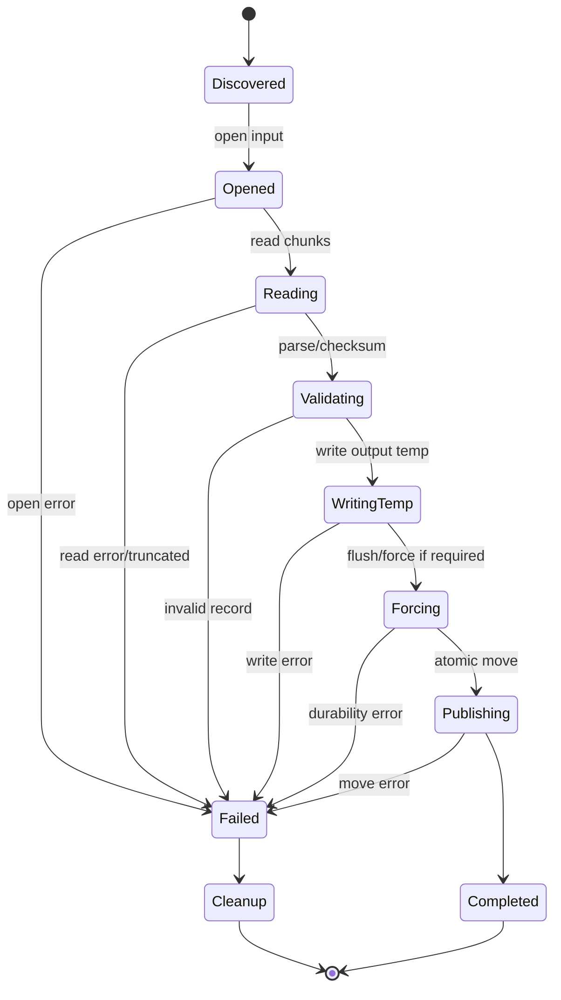

------
title: Learn Java IO, Modern IO, Streams, Buffers, Resources, Serialization & Data Boundaries - Part 001
description: Skill map, scope, practice strategy, and production-grade learning path for mastering Java IO using Josh Kaufman's rapid skill acquisition framework.
series: learn-java-io-modern-io-resource-boundaries
seriesTitle: Learn Java IO, Modern IO, Streams, Buffers, Resources, Serialization & Data Boundaries
order: 1
partTitle: Kaufman Skill Map
tags:
  - java
  - io
  - nio
  - streams
  - buffers
  - resources
  - serialization
  - kaufman
  - series
date: 2026-06-30
---

# Part 001 — Kaufman Skill Map for Java IO Mastery

## 1. Tujuan Part Ini

Part ini adalah peta kendali untuk seluruh seri. Kita belum masuk terlalu dalam ke API satu per satu. Kita akan menetapkan:

1. apa sebenarnya yang dimaksud dengan “menguasai Java IO”;
2. sub-skill apa saja yang harus dikuasai;
3. bagaimana menerapkan framework *The First 20 Hours* dari Josh Kaufman;
4. apa saja invariants yang harus selalu dicek saat menulis IO code;
5. bagaimana membedakan engineer yang sekadar tahu API dari engineer yang mampu merancang boundary IO yang aman, cepat, dan bisa dipertanggungjawabkan.

Targetnya bukan hafal semua class di `java.io` dan `java.nio`. Targetnya adalah mampu menjawab pertanyaan seperti ini dengan percaya diri:

> “Data dari sistem eksternal masuk melalui file/stream/socket/process/archive/resource. Bagaimana kita membaca, memvalidasi, mentransfer, menyimpan, memulihkan, menguji, dan men-debug boundary tersebut tanpa leak, corrupt, deadlock, silent truncation, encoding bug, atau durability illusion?”

Itulah inti seri ini.

---

## 2. Skill Akhir yang Ingin Dicapai

Kita akan mendefinisikan target performa secara eksplisit. Dalam konteks Kaufman, skill harus didefinisikan sebagai kemampuan konkret, bukan topik abstrak.

Setelah menyelesaikan seri ini, kamu seharusnya mampu:

1. memilih primitive IO yang tepat: `Path`, `Files`, `InputStream`, `OutputStream`, `Reader`, `Writer`, `ByteBuffer`, `Channel`, `MappedByteBuffer`, `MemorySegment`, atau callback-based boundary;
2. mendesain API boundary yang jelas soal ownership, close responsibility, replayability, encoding, framing, dan partial failure;
3. membaca dan menulis data besar tanpa membebani heap secara tidak perlu;
4. membedakan byte stream, character stream, record stream, message stream, dan object graph serialization;
5. menulis file update yang aman terhadap crash menggunakan temporary file, flush/force, dan atomic move saat tersedia;
6. memahami konsekuensi OS/filesystem terhadap Java code: page cache, file descriptor, symbolic link, permission, atomicity, visibility, durability, network filesystem;
7. mengelola resource lifecycle dengan disiplin: ownership, close ordering, suppressed exception, leak prevention, cancellation;
8. menggunakan NIO buffer dan channel secara benar: `position`, `limit`, `capacity`, `flip`, `compact`, direct buffer, scatter/gather, transfer;
9. menangani serialization boundary dengan sadar risiko: versioning, compatibility, filtering, object graph hazards;
10. menguji IO code dengan deterministic temporary resources, fake streams, fault injection, partial read/write, dan crash-simulation mindset;
11. mendiagnosis performa IO: syscall, buffering, page cache, allocation, native memory, GC, throughput vs latency;
12. membangun ingestion/transfer pipeline production-grade yang bisa di-retry, di-resume, diobservasi, dan dibatalkan dengan aman.

Kalimat paling pendeknya:

> Menguasai Java IO berarti mampu mengendalikan perpindahan data melintasi boundary yang lambat, stateful, partial, dan gagal dengan cara yang benar.

---

## 3. Mengapa IO Sulit Padahal API-nya Terlihat Sederhana

Banyak API IO terlihat mudah:

```java
String content = Files.readString(path);
Files.writeString(path, content);
```

Atau:

```java
try (InputStream in = Files.newInputStream(path)) {
    return in.readAllBytes();
}
```

Untuk file kecil, trusted, lokal, dan non-critical, ini valid. Tetapi production system sering tidak seperti itu.

IO menjadi sulit karena beberapa hal berikut.

| Dimensi | Kenyataan Production | Bug yang Sering Muncul |
|---|---|---|
| Size | Data bisa jauh lebih besar dari asumsi | OOM, GC pressure, stuck processing |
| Time | Source/sink bisa lambat atau berhenti | thread starvation, timeout, backpressure collapse |
| Partiality | Read/write bisa parsial | truncation, corrupted output, incomplete transfer |
| Encoding | Bytes belum tentu valid text | mojibake, replacement char, data loss |
| Boundary | Stream tidak selalu punya message boundary | salah parsing, over-read, under-read |
| Resource | File descriptor/socket/native memory terbatas | leak, “too many open files” |
| Filesystem | Atomicity dan durability bergantung provider/OS | lost update, crash corruption |
| Concurrency | File bisa berubah saat dibaca | race condition, TOCTOU, inconsistent snapshot |
| Trust | Input bisa berasal dari pihak eksternal | zip-slip, deserialization hazard, resource bomb |
| Diagnostics | IO lambat sering terlihat seperti CPU idle | salah tuning, salah bottleneck |

Engineer yang kuat di IO tidak hanya tahu “cara membaca file”. Ia tahu bahwa IO selalu membawa hidden contract.

---

## 4. Framework Kaufman untuk Seri Ini

Josh Kaufman mengusulkan cara belajar skill dengan cepat melalui prinsip seperti:

1. deconstruct the skill;
2. learn enough to self-correct;
3. remove barriers to practice;
4. practice deliberately for at least 20 hours.

Kita adaptasikan ke Java IO.

```mermaid
flowchart TD
    A[Target Skill: Production-Grade Java IO] --> B[Deconstruct]
    B --> B1[Byte/Char/Record Mental Model]
    B --> B2[Resource Lifecycle]
    B --> B3[Filesystem Semantics]
    B --> B4[Buffers and Channels]
    B --> B5[Serialization Boundary]
    B --> B6[Testing and Diagnostics]

    A --> C[Learn Enough to Self-Correct]
    C --> C1[Know Contracts]
    C --> C2[Recognize Failure Modes]
    C --> C3[Use Invariants]
    C --> C4[Inspect Symptoms]

    A --> D[Remove Practice Barriers]
    D --> D1[Small Labs]
    D --> D2[Reusable Test Harness]
    D --> D3[Fault Injection Helpers]
    D --> D4[Temp Files and Fake Streams]

    A --> E[Deliberate Practice]
    E --> E1[Build File Copier]
    E --> E2[Build Safe Replace Writer]
    E --> E3[Build Framed Stream Parser]
    E --> E4[Build Ingestion Pipeline]
```



Kita tidak akan belajar dengan urutan “semua class A-Z”. Itu buruk untuk skill acquisition. Kita belajar berdasarkan risiko dan leverage.

---

## 5. Deconstruct the Skill: Java IO Bukan Satu Skill

Java IO adalah bundle dari banyak sub-skill. Jika semua dicampur, belajar menjadi kabur. Maka kita pecah.

### 5.1 Sub-Skill 1 — Byte Flow

Ini pondasi paling bawah.

Kamu harus paham:

1. byte adalah unit fisik data IO;
2. stream tidak selalu menyampaikan semua byte sekaligus;
3. EOF bukan error normal, tetapi unexpected EOF bisa error;
4. read/write bisa blocking;
5. transfer besar harus chunked.

Contoh pertanyaan self-check:

> Kalau `InputStream.read(byte[])` mengembalikan 173 padahal buffer 8192, apakah itu error?

Jawaban: tidak. Itu normal. Caller harus loop sampai EOF atau sampai jumlah byte yang diperlukan terpenuhi.

### 5.2 Sub-Skill 2 — Text Boundary

Text bukan byte. Text adalah hasil decoding byte menggunakan charset.

Kamu harus paham:

1. UTF-8, UTF-16, ISO-8859-1, dan default charset;
2. malformed input;
3. replacement policy vs strict decoding;
4. newline format: `\n`, `\r\n`, `\r`;
5. BOM;
6. read-ahead behavior pada decoder.

Pertanyaan self-check:

> Apakah `new FileReader(path.toFile())` selalu aman untuk file UTF-8?

Jawaban: jangan asumsikan. Di Java modern default charset memang lebih konsisten daripada era lama, tetapi API boundary yang serius tetap harus menyebut charset secara eksplisit.

### 5.3 Sub-Skill 3 — Resource Lifecycle

IO resource biasanya memegang sesuatu di luar heap: file descriptor, socket descriptor, native buffer, memory mapping, process pipe, directory handle.

Kamu harus paham:

1. siapa pemilik resource;
2. siapa yang wajib menutup;
3. kapan close harus terjadi;
4. apa efek close terhadap wrapper/decorator;
5. bagaimana suppressed exception bekerja;
6. bagaimana resource leak muncul walaupun object Java akhirnya di-GC.

Pertanyaan self-check:

> Jika method menerima `InputStream`, apakah method itu boleh menutup stream tersebut?

Jawaban: tergantung contract. Default yang aman: jangan menutup resource yang tidak kamu buka, kecuali API menyatakan ownership berpindah.

### 5.4 Sub-Skill 4 — Filesystem Semantics

Filesystem bukan Map<String, byte[]> sederhana.

Kamu harus paham:

1. path bisa relative, absolute, normalized, real path;
2. symbolic link bisa mengubah target operasi;
3. metadata bisa berubah saat operasi berjalan;
4. permission model berbeda antar OS;
5. atomic move bergantung filesystem/provider;
6. visibility antar process tidak selalu instant;
7. durability bukan sama dengan “write method sudah return”.

Pertanyaan self-check:

> Setelah `Files.write(path, bytes)` return, apakah data pasti selamat dari power loss?

Jawaban: tidak otomatis. Untuk durability, kamu perlu memahami flush, fsync/force, opsi `SYNC`/`DSYNC`, filesystem, storage, dan rename discipline.

### 5.5 Sub-Skill 5 — Buffering

Buffer adalah trade-off.

Kamu harus paham:

1. buffer mengurangi syscall overhead;
2. buffer menambah memory footprint;
3. buffer bisa menunda visibility output;
4. terlalu kecil buruk, terlalu besar belum tentu lebih baik;
5. double-buffering bisa sia-sia;
6. flush bukan durability.

Pertanyaan self-check:

> Apakah semua `OutputStream` perlu dibungkus `BufferedOutputStream`?

Jawaban: tidak selalu. Beberapa stream sudah buffered atau target-nya bukan bottleneck. Pahami source/sink dan access pattern.

### 5.6 Sub-Skill 6 — NIO Buffer and Channel

NIO memperkenalkan model explicit buffer.

Kamu harus paham:

1. `ByteBuffer` punya `position`, `limit`, `capacity`;
2. mode write-to-buffer dan read-from-buffer harus dipisah dengan `flip`;
3. `compact` dipakai saat partial consumption;
4. channel bisa positional, scattering, gathering, selectable, asynchronous;
5. direct buffer menggunakan native memory dan punya lifecycle berbeda dari heap array biasa.

Pertanyaan self-check:

> Mengapa `buffer.flip()` sering hilang di bug NIO pemula?

Jawaban: karena developer menganggap buffer seperti array. Padahal buffer punya state machine eksplisit.

### 5.7 Sub-Skill 7 — Boundary Framing

Stream hanya rangkaian data. Ia tidak selalu tahu “pesan” dimulai dan berakhir di mana.

Kamu harus paham:

1. delimiter framing;
2. length-prefix framing;
3. fixed-width record;
4. self-describing format;
5. streaming parser;
6. partial message;
7. over-read dan under-read.

Pertanyaan self-check:

> Jika socket menerima `read()` 1024 bytes, apakah itu berarti satu message lengkap?

Jawaban: tidak. Stream transport tidak menjamin message boundary kecuali protocol di atasnya mendefinisikan boundary.

### 5.8 Sub-Skill 8 — Serialization Boundary

Serialization bukan hanya “object jadi bytes”.

Kamu harus paham:

1. object graph traversal;
2. identity/reference handling;
3. class descriptor;
4. versioning;
5. `serialVersionUID`;
6. compatibility rules;
7. trusted vs untrusted data;
8. filtering;
9. long-lived data migration.

Pertanyaan self-check:

> Apakah aman menerima Java serialized object dari client eksternal?

Jawaban: secara umum jangan. Jika terpaksa, boundary harus sangat dibatasi, difilter, dan diperlakukan sebagai data tidak tepercaya.

### 5.9 Sub-Skill 9 — Process IO

External process punya stdin/stdout/stderr. Kalau salah ditangani, process bisa deadlock karena pipe penuh.

Kamu harus paham:

1. pipe buffer finite;
2. stdout dan stderr harus dikuras;
3. process bisa menghasilkan output besar;
4. redirect bisa lebih aman daripada capture in-memory;
5. timeout dan cancellation perlu membunuh process tree jika perlu.

Pertanyaan self-check:

> Mengapa `process.waitFor()` bisa hang walau program child sebenarnya hanya menulis log?

Jawaban: karena child bisa blocked menulis stdout/stderr ketika parent tidak menguras pipe.

### 5.10 Sub-Skill 10 — Testing and Diagnostics

IO bug sering tidak muncul di happy path.

Kamu harus paham:

1. temporary directory testing;
2. fake stream yang return partial read;
3. stream yang throw setelah N bytes;
4. permission failure;
5. corrupted/truncated file;
6. large file simulation;
7. checksum verification;
8. benchmarking IO tanpa tertipu page cache.

Pertanyaan self-check:

> Apakah test yang hanya memakai `ByteArrayInputStream` cukup untuk membuktikan file ingestion aman?

Jawaban: tidak. Itu hanya membuktikan parsing happy path in-memory. Belum membuktikan filesystem, partial transfer, permission, cleanup, durability, atau cancellation.

---

## 6. Peta Seri 32 Part

Seri ini dibangun seperti progression skill, bukan katalog class.


Part 001 sampai 012 membangun correctness. Part 013 sampai 023 membangun modern IO machinery. Part 024 sampai 032 membangun production boundary engineering.

---

## 7. The 20-Hour Practice Plan

Kaufman tidak berarti kamu akan menjadi world-class dalam 20 jam. Maksudnya: kamu bisa mencapai level kompetensi praktis jika skill dipecah, hambatan dikurangi, dan latihan dilakukan sengaja.

Untuk Java IO, 20 jam pertama harus diarahkan ke *usable production intuition*.

### 7.1 Hour 0–2 — Build the IO Map

Tujuan:

1. memahami byte vs char vs record;
2. memahami resource ownership;
3. memahami partial read/write;
4. memahami kapan API simple cukup dan kapan berbahaya.

Latihan:

1. baca file kecil dengan `Files.readString`;
2. baca file besar secara streaming;
3. bandingkan memory behavior secara kasar;
4. tulis catatan: kapan memakai high-level API, kapan tidak.

Output:

```text
Decision note: File size, trust level, encoding, retry needs, durability needs, and ownership decide the IO primitive.
```

### 7.2 Hour 3–5 — Classic Stream Correctness

Tujuan:

1. menguasai loop `read` yang benar;
2. memahami EOF;
3. memahami wrapper stream;
4. memahami close propagation.

Latihan:

1. implementasi copy stream manual;
2. injeksi stream yang hanya return 1–3 byte per read;
3. pastikan code tetap benar;
4. uji stream yang throw di tengah transfer.

Output:

```java
static long copy(InputStream in, OutputStream out) throws IOException {
    byte[] buffer = new byte[8192];
    long total = 0;
    int n;
    while ((n = in.read(buffer)) != -1) {
        out.write(buffer, 0, n);
        total += n;
    }
    return total;
}
```

Yang dipelajari bukan syntax-nya, tetapi invariant-nya:

1. jangan asumsikan buffer selalu penuh;
2. jangan abaikan return value;
3. jangan load semua data tanpa alasan;
4. jangan close resource yang bukan milikmu tanpa contract.

### 7.3 Hour 6–8 — Text and Binary Boundary

Tujuan:

1. selalu menyebut charset;
2. memahami malformed input;
3. memahami delimiter vs length-prefix;
4. memahami endian dan primitive binary layout.

Latihan:

1. baca file UTF-8 strict;
2. baca file dengan byte invalid;
3. buat parser length-prefixed frame sederhana;
4. uji truncated frame.

Output:

```text
Text is bytes plus charset plus error policy. Records are bytes plus framing contract.
```

### 7.4 Hour 9–11 — Modern Files API

Tujuan:

1. menguasai `Path`, `Files`, dan `FileSystem`;
2. memahami symbolic link;
3. memahami temp file;
4. memahami atomic create/move/delete.

Latihan:

1. tulis file ke temp path;
2. validasi content;
3. pindahkan ke final path dengan atomic move jika tersedia;
4. handle fallback jika atomic move tidak tersedia.

Output:

```text
Never update important files by blindly overwriting the final target first.
```

### 7.5 Hour 12–14 — NIO Buffer and Channel

Tujuan:

1. memahami state machine `ByteBuffer`;
2. membaca file memakai `FileChannel`;
3. menguasai `flip`, `clear`, `compact`;
4. memahami positional read/write.

Latihan:

1. implementasi small file scanner dengan `FileChannel`;
2. sengaja hilangkan `flip`, lihat bug-nya;
3. buat diagram state buffer;
4. uji partial record across buffer boundary.

Output:

```text
ByteBuffer is not an array. It is a mutable cursor object with explicit mode transitions.
```

### 7.6 Hour 15–17 — Transfer, Compression, Process Boundary

Tujuan:

1. memahami transfer besar;
2. memahami compression stream chaining;
3. memahami archive traversal risk;
4. memahami process stdout/stderr deadlock.

Latihan:

1. copy file besar chunked;
2. gzip stream tanpa load full file;
3. extract zip dengan path validation;
4. jalankan process yang menulis stdout/stderr besar dan drain keduanya.

Output:

```text
Every boundary has a pressure point: memory, descriptor, pipe, disk, CPU, or trust.
```

### 7.7 Hour 18–20 — Capstone Mini Project

Bangun mini ingestion pipeline:

1. menerima file dari staging directory;
2. membaca metadata;
3. validasi size dan extension;
4. streaming checksum;
5. parse record boundary;
6. tulis hasil ke output temp file;
7. atomic move ke final;
8. simpan manifest;
9. cleanup resource;
10. uji partial failure.

Output minimal:

```text
Input file -> staging -> validated stream -> processed output temp -> forced write -> atomic publish -> manifest
```

Diagram:


---

## 8. Lima Pertanyaan Wajib untuk Semua IO Boundary

Setiap kali kamu melihat atau menulis IO code, tanyakan lima hal ini.

### 8.1 Siapa Pemilik Resource?

Contoh:

```java
void process(InputStream input) throws IOException {
    try (input) { // dangerous unless ownership transfer is documented
        // process
    }
}
```

Masalahnya bukan syntax. Masalahnya contract.

Jika caller masih membutuhkan `input`, method ini merusak caller. Jika method memang dimaksudkan mengambil ownership, documentasikan dengan jelas.

Contract yang lebih jelas:

```java
/**
 * Consumes and closes the given input stream.
 */
void consumeAndClose(InputStream input) throws IOException {
    try (input) {
        // process
    }
}
```

Atau:

```java
/**
 * Reads from the given input stream but does not close it.
 */
void readWithoutClosing(InputStream input) throws IOException {
    // process only
}
```

### 8.2 Apa Unit Data-nya?

Unit data bisa berbeda-beda:

| Unit | Contoh | API Cocok |
|---|---|---|
| Byte | image, compressed payload | `InputStream`, `ByteBuffer`, `Channel` |
| Character | text config | `Reader`, `Files.readString` |
| Line | CSV-ish line file | `BufferedReader`, `Files.lines` |
| Record | length-prefixed binary message | custom parser over stream/channel |
| Object graph | Java serialization | `ObjectInputStream` |
| File tree | archive/extract/copy directory | `Files.walk`, visitor API |

Bug sering muncul ketika unit mental tidak cocok dengan API.

Contoh: memakai line-based reader untuk format yang sebenarnya binary. Atau menganggap `read(byte[])` menghasilkan satu record utuh.

### 8.3 Apakah Operasi Bisa Partial?

Jawaban default: ya.

1. read bisa return kurang dari buffer length;
2. write ke channel bisa menulis sebagian;
3. transfer bisa berhenti di tengah;
4. file copy bisa menghasilkan target parsial;
5. process output bisa terpotong karena timeout;
6. archive extraction bisa berhenti setelah beberapa entry.

IO yang benar punya recovery atau cleanup strategy.

### 8.4 Bagaimana EOF, Error, Timeout, dan Cancellation Disinyalkan?

Boundary harus membedakan:

| Signal | Makna |
|---|---|
| EOF normal | stream selesai sesuai protocol |
| Unexpected EOF | data terpotong |
| IOException | source/sink gagal |
| Timeout | progress tidak cukup cepat |
| Cancellation | caller membatalkan |
| Closed resource | lifecycle sudah berakhir |

Semua ini tidak boleh diperlakukan sama.

### 8.5 Apa Guarantee Setelah Failure?

Setelah failure, state harus jelas.

Pertanyaan:

1. apakah output file final mungkin parsial?
2. apakah temp file tertinggal?
3. apakah input sudah dikonsumsi sebagian dan tidak bisa diulang?
4. apakah checksum masih valid?
5. apakah operation idempotent untuk retry?
6. apakah caller tahu berapa byte/record yang berhasil?

Production code harus punya jawaban.

---

## 9. IO Invariants untuk Engineer Senior

Invariant adalah aturan yang harus selalu benar. Ini lebih penting dari hafalan API.

### 9.1 Resource Invariants

1. Resource yang dibuka harus ditutup.
2. Resource yang tidak kamu buka tidak boleh kamu tutup kecuali contract mengatakan ownership berpindah.
3. Wrapper stream biasanya menutup underlying stream saat wrapper ditutup.
4. Close bisa throw exception.
5. Exception saat close tidak boleh menghapus failure utama tanpa disadari.
6. Native memory dan file descriptor harus dipikirkan seperti resource terbatas.

### 9.2 Stream Invariants

1. Stream adalah data sequence, bukan message sequence.
2. `read` tidak wajib memenuhi buffer.
3. EOF bukan byte; EOF adalah signal.
4. `available()` bukan ukuran total stream.
5. `skip(n)` tidak selalu melewati tepat `n` byte.
6. `flush()` bukan jaminan data tahan crash.

### 9.3 Text Invariants

1. Bytes harus didecode memakai charset.
2. Charset harus eksplisit di boundary serius.
3. Decoder bisa membaca byte lebih banyak daripada karakter yang diminta.
4. Newline bukan universal.
5. File text bisa memiliki BOM.
6. Invalid byte sequence harus punya policy: fail, replace, atau ignore.

### 9.4 File Invariants

1. Path string bukan file identity yang stabil.
2. File bisa berubah antara check dan use.
3. Symbolic link bisa mengarahkan operasi ke target lain.
4. Atomicity bergantung operation, filesystem, dan provider.
5. Visibility bukan durability.
6. Delete/move behavior berbeda antar OS ketika file masih terbuka.

### 9.5 Buffer Invariants

1. `capacity` adalah ukuran storage.
2. `position` adalah cursor.
3. `limit` adalah batas operasi saat ini.
4. `flip` mengubah buffer dari writing mode ke reading mode.
5. `clear` tidak menghapus data, hanya reset cursor.
6. Direct buffer bukan heap array dan bukan gratis.

### 9.6 Transfer Invariants

1. Transfer bisa partial.
2. Large transfer harus bounded memory.
3. Destination parsial harus dibersihkan atau diberi status eksplisit.
4. Retry butuh idempotency atau resume token.
5. Checksum harus dihitung terhadap bytes aktual yang diterima/ditulis.
6. Compression/encryption/framing mengubah boundary dan error model.

---

## 10. Decision Matrix: Primitive Mana yang Dipilih?

| Kebutuhan | Primitive Awal | Catatan |
|---|---|---|
| Baca file text kecil | `Files.readString(path, charset)` | jelas, sederhana, tidak untuk file besar |
| Tulis file text kecil | `Files.writeString(path, text, charset)` | hati-hati overwrite dan durability |
| Baca file besar | `BufferedInputStream` atau `Files.newInputStream` | proses chunked |
| Baca line-by-line | `BufferedReader` / `Files.newBufferedReader` | explicit charset |
| Copy stream umum | `InputStream.transferTo` atau manual copy | perhatikan ownership dan close |
| Random access file | `FileChannel` | positional read/write |
| Binary protocol | `ByteBuffer` + framing parser | define endian dan frame length |
| Non-blocking network | `SocketChannel` + `Selector` | readiness is not completion |
| Large file transfer | `FileChannel.transferTo/transferFrom` | perhatikan limitations dan fallback |
| Huge file random scan | memory mapping | perhatikan unmap/lifecycle/page fault |
| File tree traversal | `Files.walkFileTree` | cleanup stream dan symlink policy |
| Classpath config | `ClassLoader.getResourceAsStream` | bukan `File` biasa saat packaged dalam JAR |
| External process | `ProcessBuilder` + drain stdout/stderr | hindari pipe deadlock |
| Object graph persistence | hindari native serialization untuk long-term external boundary | gunakan hanya untuk controlled internal cases |

Matrix ini bukan dogma. Ini starting point.

---

## 11. Anti-Goals Seri Ini

Agar belajar efisien, kita sengaja tidak mengulang materi yang sudah ada di seri lain.

### 11.1 Tidak Mengulang JSON/XML Mapping

Jackson, MapStruct, JAXB, Bean Validation, dan XML processing tidak akan diulang. Seri ini hanya menyentuh data boundary di level stream, encoding, framing, dan serialization lifecycle.

### 11.2 Tidak Mengulang Concurrency Umum

Thread, lock, executor, reactive programming, dan memory model tidak dibahas ulang. Kita hanya membahas concurrency ketika berdampak langsung pada IO: blocking, cancellation, selector, async channel, pipe draining, resource close race.

### 11.3 Tidak Mengulang Security Umum

Cryptography, TLS, secret handling, authn/authz, dan platform hardening tidak diulang. Kita hanya membahas IO-specific hazard seperti zip-slip, deserialization filter, path traversal, trusted/untrusted stream, dan resource bomb.

### 11.4 Tidak Mengulang Observability Umum

Logging, metrics, tracing, dan SLO tidak diulang. Kita hanya memakai diagnostics untuk IO: bytes transferred, duration, throughput, retry, partial failure, file descriptor pressure, native memory.

### 11.5 Tidak Mengulang Persistence/JDBC

Database IO tidak menjadi fokus. Namun mental model boundary, durability, partial failure, dan batching akan relevan untuk database engineer juga.

---

## 12. Cara Membaca Seri Ini

Jangan membaca seri ini seperti dokumentasi API. Baca seperti training lapangan.

Untuk setiap part:

1. baca mental model;
2. catat invariants;
3. jalankan snippet kecil;
4. buat test yang mematahkan asumsi;
5. ubah snippet menjadi utility kecil;
6. tulis failure note: “apa yang bisa salah?”;
7. ulangi dengan data lebih besar atau kondisi lebih buruk.

Template catatan per part:

```md
## Part N Practice Notes

### New Concept

### Contract I Must Remember

### Failure Mode

### Small Experiment

### Production Rule

### Question I Still Have
```

---

## 13. Practice Harness yang Disarankan

Gunakan project kecil, bukan enterprise skeleton penuh.

Struktur:

```text
java-io-lab/
  pom.xml or build.gradle
  src/main/java/lab/io/
  src/test/java/lab/io/
  src/test/resources/
  data/
    input/
    output/
    tmp/
```

Dependencies minimal:

1. JUnit 5;
2. AssertJ atau assertion bawaan;
3. Jimfs opsional untuk fake filesystem pada bagian testing;
4. JMH opsional untuk performance part.

Hindari framework besar di awal. Tujuan seri ini adalah menguasai IO contract, bukan membuat aplikasi Spring.

---

## 14. Lab Pertama: Stream Copy yang Bisa Dipercaya

Walaupun detail classic stream akan dibahas di Part 003, lab awal ini berguna untuk menguji mindset.

### 14.1 Implementasi Minimal

```java
package lab.io;

import java.io.IOException;
import java.io.InputStream;
import java.io.OutputStream;

public final class StreamCopies {
    private StreamCopies() {
    }

    public static long copy(InputStream input, OutputStream output) throws IOException {
        byte[] buffer = new byte[8192];
        long total = 0L;

        while (true) {
            int read = input.read(buffer);
            if (read == -1) {
                return total;
            }
            output.write(buffer, 0, read);
            total += read;
        }
    }
}
```

### 14.2 Pertanyaan yang Harus Kamu Jawab

1. Siapa yang menutup `input` dan `output`?
2. Apakah method ini safe untuk stream sangat besar?
3. Apa yang terjadi jika `output.write` gagal di tengah?
4. Apakah `output` perlu di-flush?
5. Apakah `total` bisa overflow?
6. Apakah method ini tahu data sudah durable?
7. Apakah method ini bisa dibatalkan?
8. Apakah method ini cocok untuk network stream?

Jawaban terbaik bukan selalu “ya” atau “tidak”. Jawaban terbaik adalah contract yang jelas.

Contoh contract:

```java
/**
 * Copies all bytes from input to output without closing either stream.
 *
 * This method is streaming and does not retain the full payload in memory.
 * It returns after EOF from input or throws IOException if either stream fails.
 * It does not guarantee durability of the output sink.
 */
public static long copy(InputStream input, OutputStream output) throws IOException
```

Ini gaya berpikir yang akan kita bawa sepanjang seri.

---

## 15. IO Design Review Checklist

Gunakan checklist ini setiap kali review PR yang menyentuh IO.

### 15.1 Boundary Checklist

- [ ] Apakah input trusted atau untrusted?
- [ ] Apakah size maksimum dibatasi?
- [ ] Apakah charset eksplisit?
- [ ] Apakah framing jelas?
- [ ] Apakah EOF normal dibedakan dari unexpected EOF?
- [ ] Apakah partial read/write ditangani?
- [ ] Apakah resource ownership didokumentasikan?
- [ ] Apakah close terjadi di semua path?
- [ ] Apakah output parsial bisa tertinggal?
- [ ] Apakah retry aman?
- [ ] Apakah durability benar-benar dibutuhkan?
- [ ] Apakah path traversal/symlink policy jelas?
- [ ] Apakah test mencakup failure path?

### 15.2 Performance Checklist

- [ ] Apakah data besar diproses streaming?
- [ ] Apakah buffer size masuk akal?
- [ ] Apakah ada `readAllBytes`/`readString` pada boundary tidak terbatas?
- [ ] Apakah ada double buffering yang tidak perlu?
- [ ] Apakah native memory/direct buffer terkontrol?
- [ ] Apakah process stdout/stderr dikuras?
- [ ] Apakah measurement mempertimbangkan page cache?

### 15.3 Correctness Checklist

- [ ] Apakah operasi file publish atomic?
- [ ] Apakah temp file dibersihkan?
- [ ] Apakah metadata/checksum dihitung setelah bytes final tersedia?
- [ ] Apakah file bisa berubah saat diproses?
- [ ] Apakah symbolic link harus diikuti atau ditolak?
- [ ] Apakah permission error diperlakukan sebagai expected operational failure?
- [ ] Apakah exception message cukup untuk investigasi?

---

## 16. Mental Model: IO sebagai Boundary State Machine

IO operation jarang benar-benar satu langkah. Hampir selalu state machine.

Contoh file ingestion:



Pertanyaan penting:

1. state mana yang persistent?
2. state mana yang bisa diulang?
3. state mana yang meninggalkan artifact?
4. state mana yang butuh cleanup?
5. state mana yang aman untuk retry?

IO engineering yang matang biasanya terlihat seperti lifecycle/state design, bukan sekadar utility function.

---

## 17. Common Misleading Simplicities

### 17.1 “File Itu Selalu Ada atau Tidak Ada”

Tidak sesederhana itu.

File bisa:

1. ada saat dicek, hilang saat dibuka;
2. permission berubah;
3. path adalah symlink;
4. file sedang ditulis proses lain;
5. file berada di network filesystem;
6. metadata cache stale;
7. path terlalu panjang pada platform tertentu;
8. nama mengandung karakter yang valid di OS tertentu tapi tidak di OS lain.

### 17.2 “Stream Itu Seperti Array”

Stream bukan array.

Array:

1. size diketahui;
2. random access;
3. berada di memory;
4. bisa dibaca ulang;
5. tidak blocking.

Stream:

1. size bisa tidak diketahui;
2. sequential;
3. source bisa lambat;
4. bisa hanya sekali baca;
5. bisa blocking;
6. bisa gagal di tengah.

### 17.3 “Flush Berarti Aman”

Flush biasanya berarti data didorong dari buffer Java/wrapper ke layer bawah. Itu belum tentu berarti data sudah persistent ke physical storage.

Durability membutuhkan pembahasan terpisah di Part 012.

### 17.4 “NIO Selalu Lebih Cepat”

NIO adalah model, bukan magic. NIO memberi kontrol: buffer eksplisit, channel, selector, memory mapping. Untuk banyak kasus sederhana, classic stream yang dibuffer dengan baik sudah cukup dan lebih mudah benar.

### 17.5 “Serialization Itu Format Data”

Java native serialization lebih tepat dipikirkan sebagai object graph protocol dengan coupling kuat ke class Java. Untuk external long-term data boundary, ini sering bukan pilihan ideal.

---

## 18. Top 1% IO Engineer: Apa yang Dilihat Berbeda?

Engineer biasa melihat:

```java
Files.copy(source, target);
```

Engineer kuat bertanya:

1. Apakah `source` trusted?
2. Apakah `target` boleh overwrite?
3. Apakah copy harus atomic?
4. Apakah target parsial boleh terlihat?
5. Apakah source dan target di filesystem yang sama?
6. Apakah symlink diikuti?
7. Apakah permission dipertahankan?
8. Apakah metadata perlu disalin?
9. Apakah checksum perlu diverifikasi?
10. Apa yang terjadi jika disk penuh di tengah?
11. Apa yang terjadi jika JVM mati setelah 80% copy?
12. Apakah perlu fsync directory setelah rename?
13. Apakah operasi ini retryable?
14. Apakah path ini berasal dari user input?
15. Apakah ada size limit?

Itulah perbedaan utamanya: bukan API berbeda, melainkan model risiko berbeda.

---

## 19. Vocabulary yang Harus Kamu Kuasai

| Istilah | Arti Praktis |
|---|---|
| Source | Tempat data dibaca |
| Sink | Tempat data ditulis |
| Stream | Sequence data, biasanya sequential |
| Buffer | Area sementara untuk mengurangi overhead dan mengatur flow |
| Channel | Koneksi IO NIO yang bekerja dengan buffer |
| Descriptor | Handle OS untuk file/socket/pipe |
| EOF | Signal bahwa input selesai |
| Framing | Aturan pembagian stream menjadi message/record |
| Charset | Mapping bytes ke characters dan sebaliknya |
| Decoder | Komponen yang menerjemahkan bytes ke chars |
| Atomicity | Operasi terlihat terjadi seluruhnya atau tidak sama sekali |
| Durability | Data bertahan setelah crash/power loss |
| Visibility | Perubahan terlihat oleh reader lain |
| Idempotency | Aman diulang tanpa efek ganda yang salah |
| Replayability | Input bisa dibaca ulang |
| Seekability | Bisa random access ke posisi tertentu |
| Backpressure | Mekanisme mencegah producer mengalahkan consumer |
| Partial failure | Failure setelah sebagian efek terjadi |
| TOCTOU | Time-of-check to time-of-use race |
| Mmap | File region dipetakan ke memory address space |
| Direct buffer | Buffer off-heap untuk potensi native IO lebih efisien |

---

## 20. Exit Criteria Part 001

Kamu dianggap selesai dengan Part 001 jika bisa menjawab tanpa melihat catatan:

1. Mengapa IO bukan sekadar baca/tulis file?
2. Apa lima pertanyaan wajib untuk semua IO boundary?
3. Apa bedanya byte, char, record, dan object graph?
4. Mengapa resource ownership harus menjadi bagian dari API contract?
5. Mengapa partial read/write adalah asumsi default?
6. Mengapa flush bukan durability?
7. Mengapa `ByteBuffer` bukan array biasa?
8. Mengapa `Files.readAllBytes` tidak cocok untuk boundary tidak terbatas?
9. Apa output dari 20-hour practice plan?
10. Apa risiko terbesar jika IO code tidak punya failure model?

---

## 21. Rangkuman

Java IO mastery adalah skill boundary engineering. Fokus utamanya bukan menghafal class, tetapi mengendalikan aliran data yang:

1. bisa besar;
2. bisa lambat;
3. bisa parsial;
4. bisa gagal di tengah;
5. bisa berasal dari sumber tidak tepercaya;
6. bisa bergantung pada filesystem/OS;
7. bisa memegang resource di luar heap;
8. bisa meninggalkan state parsial setelah failure.

Framework Kaufman membantu kita belajar cepat dengan cara yang tepat: pecah skill, pelajari cukup untuk self-correct, hilangkan hambatan latihan, lalu praktik sengaja.

Part berikutnya masuk ke fondasi paling penting: **IO Mental Model: Bytes, Characters, Records, and Boundaries**.

---

## 22. Referensi

- Oracle Java SE 25 API — `java.io` package summary: https://docs.oracle.com/en/java/javase/25/docs/api/java.base/java/io/package-summary.html
- Oracle Java SE 25 API — `java.nio` package summary: https://docs.oracle.com/en/java/javase/25/docs/api/java.base/java/nio/package-summary.html
- Oracle Java SE 25 API — `java.nio.file` package summary: https://docs.oracle.com/en/java/javase/25/docs/api/java.base/java/nio/file/package-summary.html
- Oracle Java SE 25 API — `java.nio.channels` package summary: https://docs.oracle.com/en/java/javase/25/docs/api/java.base/java/nio/channels/package-summary.html
- Josh Kaufman — The First 20 Hours: https://joshkaufman.net/books/the-first-20-hours/
