------
title: Learn Java IO, Modern IO, Streams, Buffers, Resources, Serialization & Data Boundaries - Part 002
description: A deep mental model of IO as bytes, characters, records, streams, and boundary contracts in Java systems.
series: learn-java-io-modern-io-resource-boundaries
seriesTitle: Learn Java IO, Modern IO, Streams, Buffers, Resources, Serialization & Data Boundaries
order: 2
partTitle: IO Mental Model: Bytes, Characters, Records, Boundaries
tags:
  - java
  - io
  - streams
  - encoding
  - framing
  - boundary
  - mental-model
  - series
date: 2026-06-30
---

# Part 002 — IO Mental Model: Bytes, Characters, Records, Boundaries

## 1. Tujuan Part Ini

Part ini membangun fondasi mental untuk seluruh Java IO.

Kita akan menjawab:

1. apa sebenarnya IO dari sudut pandang sistem;
2. mengapa byte, character, record, message, dan object tidak boleh dicampur;
3. mengapa stream bukan array;
4. mengapa `read()` yang mengembalikan sebagian data bukan bug;
5. bagaimana encoding dan framing membentuk boundary contract;
6. bagaimana merancang IO boundary yang tidak ambigu.

Kalau Part 001 adalah peta skill, Part 002 adalah model fisika-nya.

Tanpa mental model ini, API Java IO akan terlihat seperti koleksi class. Dengan mental model ini, API Java IO menjadi alat untuk mengontrol data yang bergerak melintasi boundary.

---

## 2. Definisi Praktis IO

Dalam sistem software, IO adalah perpindahan data antara program dan sesuatu di luar CPU/register/memory lokal program.

Contoh source/sink IO:

1. file lokal;
2. directory;
3. socket;
4. pipe process;
5. console;
6. classpath resource;
7. memory-mapped file;
8. archive entry;
9. cloud object stream;
10. HTTP request/response body;
11. serial device;
12. external command stdout/stderr.

Secara mental:

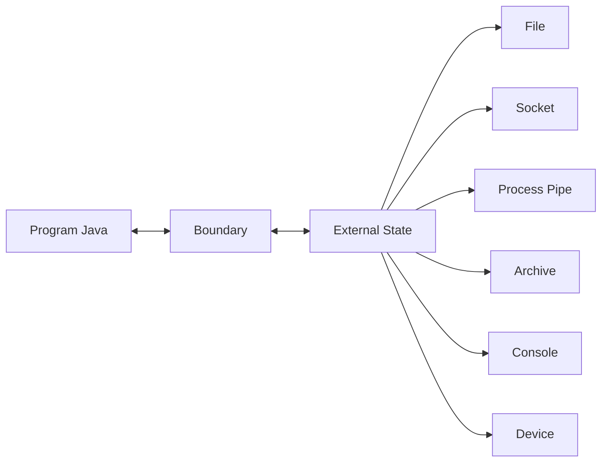

Boundary adalah tempat ketidakpastian masuk.

Di dalam program, operasi object biasa relatif deterministik. Di boundary IO:

1. data bisa tidak lengkap;
2. data bisa datang lambat;
3. source bisa hilang;
4. permission bisa ditolak;
5. encoding bisa salah;
6. disk bisa penuh;
7. network bisa putus;
8. proses lain bisa mengubah file;
9. resource bisa leak;
10. operasi bisa meninggalkan state parsial.

Maka prinsip utama:

> IO code yang baik adalah code yang memperlakukan boundary sebagai tempat failure normal, bukan kejadian luar biasa yang mustahil.

---

## 3. Tiga Level Data: Byte, Character, Record

Sebagian besar bug IO berasal dari mencampur tiga level ini.

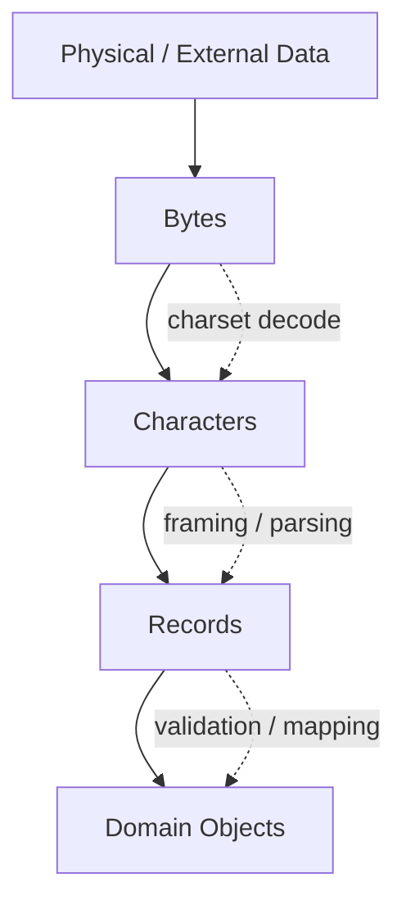

### 3.1 Bytes

Byte adalah unit paling dasar untuk IO.

File, socket, compressed data, encrypted payload, image, video, dan serialized object pada akhirnya adalah byte sequence.

Java API utama:

1. `InputStream`;
2. `OutputStream`;
3. `byte[]`;
4. `ByteBuffer`;
5. `ReadableByteChannel`;
6. `WritableByteChannel`;
7. `FileChannel`.

Byte tidak tahu apakah dirinya text, gambar, CSV, JSON, ZIP, protobuf, atau serialized object. Makna diberikan oleh layer di atasnya.

### 3.2 Characters

Character adalah hasil interpretasi byte menggunakan charset.

Contoh:

```text
Bytes:      48 65 6C 6C 6F
Charset:   UTF-8
Text:      Hello
```

Java API utama:

1. `Reader`;
2. `Writer`;
3. `InputStreamReader`;
4. `OutputStreamWriter`;
5. `BufferedReader`;
6. `Charset`;
7. `CharsetDecoder`;
8. `CharsetEncoder`.

Character boundary selalu membutuhkan charset. Tanpa charset, “text” tidak lengkap sebagai contract.

### 3.3 Records

Record adalah unit logis data.

Contoh record:

1. satu line di file log;
2. satu row CSV;
3. satu frame length-prefixed;
4. satu archive entry;
5. satu object serialized;
6. satu message di protocol custom;
7. satu event di append-only file.

Record tidak otomatis ada di stream. Record perlu framing.

Contoh framing:

| Framing | Contoh | Kelebihan | Risiko |
|---|---|---|---|
| Delimiter | newline, comma, null byte | sederhana | delimiter bisa muncul di data |
| Length-prefix | 4-byte length + payload | robust untuk binary | length bisa corrupt/malicious |
| Fixed-width | setiap record 128 bytes | random access mudah | rigid, padding, versioning susah |
| Self-describing | JSON object, CBOR, protobuf | evolvable | parser lebih kompleks |
| External index | data file + index file | cepat untuk lookup | konsistensi dua file |

---

## 4. Stream Bukan Array

Ini mental model paling penting.

Array:

```text
Known size, random access, in memory, reusable
```

Stream:

```text
Unknown size, sequential, possibly blocking, maybe one-shot, can fail mid-flow
```

Perbandingan:

| Aspek | Array | Stream |
|---|---|---|
| Size | diketahui | bisa tidak diketahui |
| Access | random | sequential |
| Location | memory | external/source dependent |
| Re-read | mudah | sering tidak bisa |
| Failure | jarang di tengah access | umum di tengah transfer |
| Latency | lokal | bergantung source/sink |
| Partial result | tidak umum | normal |
| Close needed | tidak | sering ya |

Kesalahan umum:

```java
byte[] data = input.readAllBytes();
```

Ini mengubah stream menjadi array. Kadang valid, kadang berbahaya.

Valid jika:

1. size kecil;
2. size dibatasi;
3. source trusted;
4. memory cukup;
5. latency tidak penting;
6. data memang perlu utuh di memory.

Berbahaya jika:

1. input tidak terbatas;
2. file bisa besar;
3. request body dari user;
4. archive entry tidak dibatasi;
5. stream berasal dari network;
6. banyak request paralel;
7. process output tidak terkontrol.

Rule praktis:

> Jangan materialize stream menjadi array/string kecuali kamu tahu batas ukurannya dan memang butuh seluruh data sekaligus.

---

## 5. InputStream Contract secara Mental

`InputStream` merepresentasikan source byte sequential.

Model konseptual:

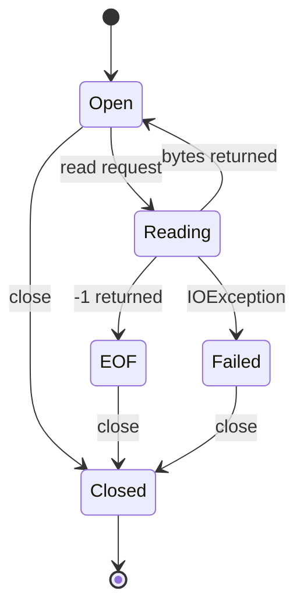

### 5.1 `read()` Single Byte

Konsep:

```java
int b = input.read();
```

Return value:

1. `0..255` berarti satu byte berhasil dibaca;
2. `-1` berarti EOF;
3. `IOException` berarti failure.

Kenapa return type `int`, bukan `byte`? Karena perlu representasi `-1` untuk EOF tanpa bentrok dengan nilai byte valid.

### 5.2 `read(byte[])`

Konsep:

```java
byte[] buffer = new byte[8192];
int n = input.read(buffer);
```

Return value:

1. `n > 0`: jumlah byte aktual yang dibaca;
2. `n == -1`: EOF;
3. `n` tidak wajib sama dengan `buffer.length`;
4. method bisa block sampai data tersedia, EOF, atau error.

Bug klasik:

```java
byte[] buffer = new byte[8192];
input.read(buffer);
output.write(buffer); // wrong
```

Masalah:

1. return value diabaikan;
2. buffer mungkin hanya terisi sebagian;
3. sisa buffer bisa berisi data lama atau zero;
4. output bisa corrupt.

Benar:

```java
byte[] buffer = new byte[8192];
int n;
while ((n = input.read(buffer)) != -1) {
    output.write(buffer, 0, n);
}
```

Invariant:

> Jumlah byte valid dalam buffer adalah return value dari `read`, bukan ukuran buffer.

---

## 6. OutputStream Contract secara Mental

`OutputStream` merepresentasikan sink byte sequential.

Model konseptual:

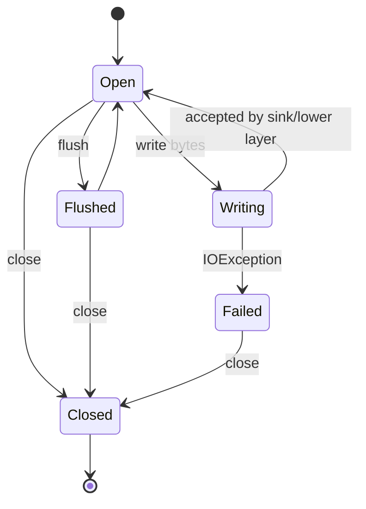

### 6.1 `write(int)`

Menulis satu byte lower 8 bits dari integer.

### 6.2 `write(byte[], off, len)`

Menulis `len` byte dari array mulai offset `off`.

Correctness penting:

```java
output.write(buffer, 0, n);
```

Jangan:

```java
output.write(buffer);
```

kecuali seluruh buffer memang berisi data valid.

### 6.3 `flush()`

`flush()` mendorong buffered data ke layer bawah. Tetapi artinya bergantung implementasi.

Contoh:

1. `BufferedOutputStream.flush()` mendorong buffer ke underlying stream;
2. `OutputStreamWriter.flush()` mengeluarkan encoded bytes yang tertahan;
3. socket flush tidak berarti peer sudah memproses data;
4. file flush tidak selalu berarti data durable di storage fisik.

Rule:

> Flush adalah visibility/progress signal ke layer bawah, bukan universal durability guarantee.

### 6.4 `close()`

`close()` biasanya:

1. flushes pending data;
2. releases resource;
3. membuat operasi berikutnya invalid;
4. bisa menutup underlying stream jika wrapper.

Karena `close()` bisa throw, try-with-resources penting.

---

## 7. Reader/Writer: Character Boundary

`Reader` dan `Writer` bukan versi “lebih modern” dari stream. Mereka berada di level data berbeda.

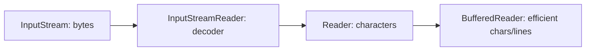

### 7.1 InputStreamReader sebagai Bridge

`InputStreamReader` menjembatani byte stream ke character stream menggunakan charset.

Contoh:

```java
try (Reader reader = new InputStreamReader(input, StandardCharsets.UTF_8)) {
    // read characters
}
```

Poin penting:

1. bytes dibaca dari underlying `InputStream`;
2. bytes didecode menjadi characters;
3. decoder bisa read-ahead;
4. jumlah byte yang dibaca tidak sama dengan jumlah char yang dikembalikan;
5. invalid byte sequence harus punya policy.

### 7.2 OutputStreamWriter sebagai Bridge

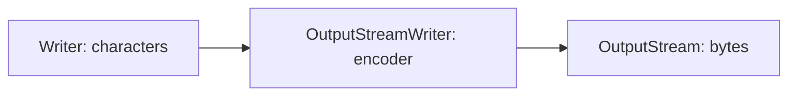

Contoh:

```java
try (Writer writer = new OutputStreamWriter(output, StandardCharsets.UTF_8)) {
    writer.write("hello");
}
```

Poin penting:

1. characters di-encode menjadi bytes;
2. encoder bisa buffer state;
3. `flush()`/`close()` penting untuk mengeluarkan pending bytes;
4. tidak semua character representable di semua charset.

---

## 8. Charset adalah Bagian dari Contract

Text boundary tanpa charset adalah contract yang belum lengkap.

Buruk:

```java
String s = Files.readString(path); // charset implicit
```

Lebih jelas:

```java
String s = Files.readString(path, StandardCharsets.UTF_8);
```

Untuk boundary internal yang sangat controlled, default mungkin cukup. Untuk data eksternal, config, import/export, file exchange, audit file, atau long-lived data, charset harus eksplisit.

### 8.1 Charset Bugs

| Bug | Penyebab | Gejala |
|---|---|---|
| Mojibake | bytes didecode dengan charset salah | karakter aneh |
| Silent replacement | invalid bytes diganti `�` | data loss diam-diam |
| Truncated char | multibyte char terpotong | malformed input |
| BOM surprise | BOM dianggap karakter biasa | header field aneh |
| Newline mismatch | CRLF vs LF | parser line salah |
| Platform default drift | default berbeda antar runtime lama/platform | hasil beda antar environment |

### 8.2 Strict Decoding

Untuk data regulasi, finansial, audit, dan enforcement lifecycle, silent replacement sering tidak bisa diterima. Lebih baik fail fast.

Contoh strict decoder:

```java
CharsetDecoder decoder = StandardCharsets.UTF_8
    .newDecoder()
    .onMalformedInput(CodingErrorAction.REPORT)
    .onUnmappableCharacter(CodingErrorAction.REPORT);

try (Reader reader = new InputStreamReader(input, decoder)) {
    // read text strictly
}
```

Ini akan melempar error jika input tidak valid sesuai charset.

---

## 9. Record Boundary: Framing

Stream tidak membawa record boundary secara otomatis.

Contoh stream byte:

```text
48656c6c6f576f726c64
```

Apakah itu:

1. satu string `HelloWorld`?
2. dua string `Hello` dan `World`?
3. lima field masing-masing 2 byte?
4. compressed payload?
5. encrypted payload?

Tidak bisa diketahui tanpa framing contract.

### 9.1 Delimiter Framing

Contoh newline-delimited records:

```text
record-1\n
record-2\n
record-3\n
```

Kelebihan:

1. mudah dibaca manusia;
2. mudah diproses line-by-line;
3. cocok untuk log sederhana.

Risiko:

1. delimiter bisa muncul di data;
2. escaping perlu jelas;
3. newline beda platform;
4. record terakhir mungkin tanpa newline;
5. line bisa sangat panjang.

### 9.2 Length-Prefix Framing

Contoh:

```text
[4-byte length][payload bytes]
```

Kelebihan:

1. cocok untuk binary;
2. payload boleh mengandung delimiter apapun;
3. parser tahu jumlah byte yang harus dibaca.

Risiko:

1. length corrupt;
2. length malicious sangat besar;
3. endian harus jelas;
4. unexpected EOF harus dideteksi;
5. versioning butuh strategi.

Pseudo parser mental:

```java
int length = readIntExactly(input);
if (length < 0 || length > maxFrameSize) {
    throw new IOException("Invalid frame length: " + length);
}
byte[] payload = readExactly(input, length);
```

Invariant:

> Length dari input eksternal tidak boleh dipercaya tanpa batas maksimum.

### 9.3 Fixed-Width Framing

Contoh:

```text
000001JOHN      20260630
000002ALICE     20260701
```

Kelebihan:

1. offset predictable;
2. parsing cepat;
3. cocok untuk legacy mainframe/interchange format tertentu.

Risiko:

1. trimming/padding rules harus jelas;
2. charset penting;
3. field evolution sulit;
4. multibyte charset bisa merusak asumsi width jika width dihitung bytes vs characters.

### 9.4 Self-Describing Framing

Contoh:

1. JSON object per line;
2. CBOR;
3. protobuf message dengan schema;
4. Avro object container file;
5. ZIP entry metadata.

Kelebihan:

1. lebih evolvable;
2. metadata ikut data;
3. parser bisa validasi struktur.

Risiko:

1. parser kompleks;
2. dependency format;
3. size bomb;
4. schema compatibility.

---

## 10. EOF: Normal vs Unexpected

EOF adalah signal bahwa source selesai. Tetapi maknanya bergantung framing.

### 10.1 EOF Normal

Contoh copy stream:

```java
while ((n = input.read(buffer)) != -1) {
    output.write(buffer, 0, n);
}
```

EOF normal berarti semua bytes yang tersedia sudah dibaca.

### 10.2 Unexpected EOF

Contoh length-prefixed frame:

```text
length = 1024
payload bytes received = 700
EOF
```

Ini bukan EOF normal. Ini data truncated.

Maka helper `readExactly` harus melempar exception jika EOF datang sebelum jumlah byte yang dibutuhkan.

```java
static void readExactly(InputStream in, byte[] target, int off, int len) throws IOException {
    int remaining = len;
    int position = off;

    while (remaining > 0) {
        int n = in.read(target, position, remaining);
        if (n == -1) {
            throw new EOFException("Expected " + remaining + " more bytes");
        }
        position += n;
        remaining -= n;
    }
}
```

Rule:

> EOF hanya normal jika protocol mengatakan “data boleh selesai di sini”.

---

## 11. Partial Read and Partial Write

### 11.1 Partial Read

Partial read adalah normal.

Alasan:

1. kernel hanya punya sebagian data saat ini;
2. network packet boundary berbeda dari application boundary;
3. stream implementation memilih return lebih cepat;
4. buffer internal habis;
5. decoder hanya bisa menghasilkan sebagian char;
6. non-blocking channel memang bisa return 0.

Maka code harus loop berdasarkan contract.

### 11.2 Partial Write

Di classic `OutputStream`, `write(byte[], off, len)` umumnya mencoba menulis semua atau throw. Tetapi di NIO `WritableByteChannel.write(ByteBuffer)` bisa menulis sebagian dan return jumlah byte yang ditulis.

Mental model NIO:

```java
while (buffer.hasRemaining()) {
    channel.write(buffer);
}
```

Tetapi untuk non-blocking channel, loop seperti ini bisa spin jika `write` return 0. Nanti dibahas di selector/non-blocking part.

Rule:

> API yang berbeda punya partial semantics berbeda. Jangan bawa asumsi `OutputStream` secara buta ke `Channel`.

---

## 12. Boundary Dimensions

Setiap boundary perlu dideskripsikan dalam beberapa dimensi.

| Dimensi | Pertanyaan | Contoh Jawaban |
|---|---|---|
| Ownership | siapa menutup resource? | callee consumes and closes |
| Unit | byte, char, line, record? | newline-delimited UTF-8 records |
| Encoding | charset apa? | UTF-8 strict |
| Framing | record dibatasi bagaimana? | 4-byte big-endian length prefix |
| Size | batas maksimum? | max 16 MiB per frame |
| Blocking | operasi bisa block? | yes, caller thread blocks |
| Timeout | bagaimana timeout? | caller controls via socket timeout |
| Seekability | bisa random access? | no, stream-only |
| Replayability | bisa dibaca ulang? | no, one-shot input |
| Idempotency | aman retry? | yes after staging manifest |
| Durability | perlu tahan crash? | final publish requires force + atomic move |
| Trust | input trusted? | no, external upload |
| Error model | exception apa? | IOException for transport, InvalidRecordException for parse |
| Cleanup | artifact parsial? | temp files deleted on failure |

Boundary yang tidak menyatakan dimensi ini akan menyebarkan asumsi tersembunyi.

---

## 13. API Design: Contoh Contract yang Jelas

### 13.1 Buruk: Contract Tersembunyi

```java
Report parse(InputStream input) throws IOException;
```

Yang tidak jelas:

1. apakah input ditutup?
2. charset apa?
3. format apa?
4. max size berapa?
5. apakah stream harus support mark/reset?
6. apakah method membaca sampai EOF?
7. apakah parser boleh read-ahead?
8. error parsing dilempar sebagai apa?

### 13.2 Lebih Baik: Contract Terdokumentasi

```java
/**
 * Parses one UTF-8 report document from the given input stream.
 *
 * Contract:
 * - The input stream is consumed but not closed.
 * - The stream is decoded as UTF-8 using strict malformed-input handling.
 * - The document must be at most maxBytes bytes before decoding.
 * - The parser reads until EOF.
 * - Syntax errors are reported as ReportParseException.
 * - Transport/read failures are reported as IOException.
 */
Report parseReport(InputStream input, long maxBytes) throws IOException, ReportParseException;
```

Bahkan lebih baik jika kamu butuh ownership jelas:

```java
/**
 * Opens, parses, and closes the report file.
 */
Report parseReportFile(Path path, long maxBytes) throws IOException, ReportParseException;
```

Perhatikan bedanya:

1. `InputStream` API cocok jika caller mengontrol source;
2. `Path` API cocok jika method harus mengontrol open/close dan filesystem behavior;
3. `Supplier<InputStream>` cocok jika method butuh retry/replay;
4. `byte[]` cocok jika data memang sudah bounded in-memory.

---

## 14. Bounded vs Unbounded Input

Salah satu prinsip terpenting:

> Semua input eksternal harus dianggap unbounded sampai dibatasi secara eksplisit.

Buruk:

```java
byte[] body = requestBody.readAllBytes();
```

Lebih aman:

```java
static byte[] readAtMost(InputStream input, int maxBytes) throws IOException {
    ByteArrayOutputStream output = new ByteArrayOutputStream(Math.min(maxBytes, 8192));
    byte[] buffer = new byte[8192];
    int total = 0;

    while (true) {
        int remainingLimit = maxBytes - total;
        if (remainingLimit <= 0) {
            if (input.read() != -1) {
                throw new IOException("Input exceeds limit of " + maxBytes + " bytes");
            }
            return output.toByteArray();
        }

        int n = input.read(buffer, 0, Math.min(buffer.length, remainingLimit));
        if (n == -1) {
            return output.toByteArray();
        }
        output.write(buffer, 0, n);
        total += n;
    }
}
```

Catatan:

1. helper ini masih materialize ke memory;
2. ia hanya aman karena ada `maxBytes`;
3. untuk data besar, lebih baik streaming ke file/temp processor;
4. batas harus berasal dari requirement, bukan angka asal.

---

## 15. Replayability dan Seekability

### 15.1 Replayability

Replayability berarti input bisa dibaca ulang dari awal.

| Source | Replayable? | Catatan |
|---|---|---|
| `byte[]` | ya | selama array tersedia |
| local file `Path` | biasanya ya | jika file tidak berubah |
| `InputStream` dari socket | tidak | one-shot |
| HTTP request body | biasanya tidak | bergantung framework buffering |
| process stdout | tidak | one-shot pipe |
| `Supplier<InputStream>` | bisa | jika supplier membuka stream baru |
| memory-mapped file | ya/random | selama mapping valid |

Jika operasi butuh retry, jangan menerima `InputStream` mentah tanpa strategi.

Contoh API:

```java
interface ReplayablePayload {
    InputStream openStream() throws IOException;
    long size() throws IOException;
}
```

### 15.2 Seekability

Seekability berarti bisa membaca posisi tertentu.

API terkait:

1. `RandomAccessFile`;
2. `FileChannel.position(long)`;
3. `FileChannel.read(ByteBuffer dst, long position)`;
4. `SeekableByteChannel`;
5. `MappedByteBuffer`.

Seekability berguna untuk:

1. index file;
2. resume transfer;
3. partial verification;
4. parallel chunk reading;
5. binary file parser;
6. log segment scanning.

Tetapi seekability tidak tersedia di semua source. Socket stream, pipe, compressed stream, dan many HTTP bodies umumnya sequential.

---

## 16. Idempotency dan Retry dalam IO

IO sering gagal setelah sebagian efek terjadi. Maka retry harus dirancang.

### 16.1 Non-Idempotent Write

```text
append record -> failure -> retry append same record -> duplicate
```

### 16.2 Idempotent Publish Pattern

```text
write temp -> verify -> atomic move to final name
```

Jika failure terjadi sebelum publish, final file belum berubah. Jika failure terjadi setelah publish, final file terlihat sebagai satu artifact lengkap.

Diagram:

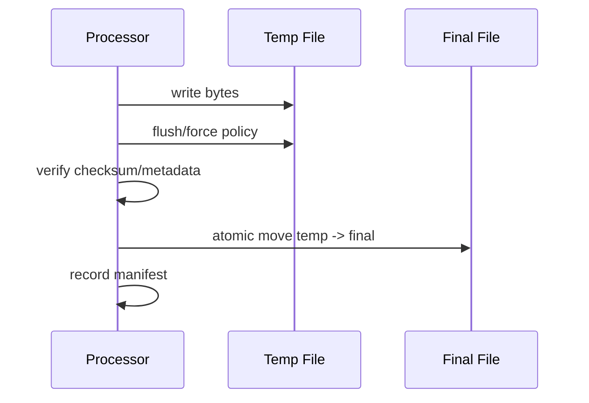

Part detail akan dibahas di file operation dan durability sections. Untuk sekarang, pahami prinsipnya:

> Retry aman jika setiap attempt memiliki staging state dan publish point yang jelas.

---

## 17. Blocking Model

IO bisa blocking, non-blocking, asynchronous, atau memory-mapped.

| Model | Mental Model | Java API |
|---|---|---|
| Blocking stream | thread menunggu progress | `InputStream`, `OutputStream`, `Reader`, `Writer` |
| Blocking channel | thread menunggu channel operation | `FileChannel`, blocking `SocketChannel` |
| Non-blocking readiness | selector memberi hint siap | `Selector`, `SelectableChannel` |
| Async completion | operasi selesai nanti | `AsynchronousFileChannel`, `CompletionHandler`, `Future` |
| Memory mapped | page fault saat memory access | `MappedByteBuffer`, `MemorySegment` mapped file |

Blocking bukan otomatis buruk. Blocking sederhana dan benar untuk banyak workload. Yang buruk adalah blocking tanpa batas pada thread yang salah, tanpa timeout, tanpa cancellation, atau tanpa backpressure.

---

## 18. Source/Sink Pressure

IO pipeline memiliki pressure point.

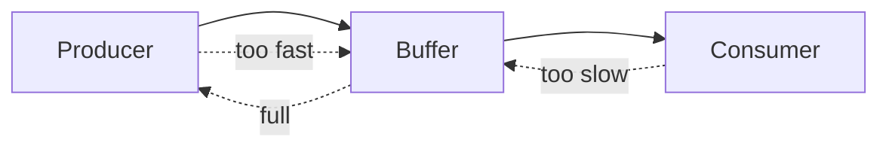

Jika producer lebih cepat dari consumer:

1. memory buffer membesar;
2. disk temp membesar;
3. queue menumpuk;
4. latency naik;
5. process/thread blocked;
6. request timeout;
7. system collapse.

Backpressure adalah cara memberi sinyal bahwa consumer tidak mampu menerima lebih cepat.

Di IO sederhana, backpressure bisa berupa blocking write. Di pipeline kompleks, bisa berupa bounded queue, rate limit, flow control, atau cancellation.

Rule:

> Jangan membuat unbounded buffering untuk menyembunyikan consumer lambat. Itu hanya memindahkan failure ke memory/disk.

---

## 19. Layering: Dari Bytes ke Domain

Boundary yang sehat memisahkan layer.

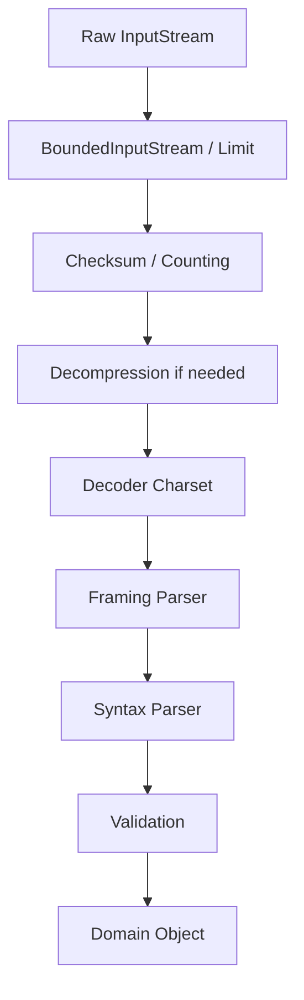

Tidak semua pipeline butuh semua layer. Tetapi urutan layer penting.

Contoh salah:

```text
parse domain object dulu, baru cek size
```

Ini terlambat. Size bomb sudah bisa menghabiskan resource.

Contoh lebih baik:

```text
limit bytes -> decode strict -> parse records -> validate domain
```

---

## 20. Error Taxonomy

IO error sebaiknya dipisahkan secara mental.

| Kategori | Contoh | Biasanya Dilempar Sebagai |
|---|---|---|
| Transport/source failure | read gagal, disk error | `IOException` |
| Sink failure | disk penuh, broken pipe | `IOException` |
| Lifecycle failure | resource closed | `IOException`, `ClosedChannelException` |
| Encoding failure | malformed UTF-8 | `CharacterCodingException`, wrapped exception |
| Framing failure | invalid length, unexpected EOF | `IOException` atau custom protocol exception |
| Syntax failure | CSV/JSON/domain syntax salah | custom parse exception |
| Validation failure | field invalid | validation/domain exception |
| Policy failure | size limit exceeded | custom limit exception / `IOException` |
| Security/trust failure | path traversal, disallowed class | security/policy exception |

Menggabungkan semuanya menjadi `RuntimeException("failed")` membuat operasi sulit di-debug dan sulit di-retry.

Rule:

> Error model adalah bagian dari boundary contract.

---

## 21. Small Code Pattern: Counting and Limiting Stream

Kadang kamu perlu menghitung bytes yang dibaca tanpa mengubah parser.

Contoh wrapper sederhana:

```java
final class CountingInputStream extends FilterInputStream {
    private long count;

    CountingInputStream(InputStream in) {
        super(in);
    }

    @Override
    public int read() throws IOException {
        int b = super.read();
        if (b != -1) {
            count++;
        }
        return b;
    }

    @Override
    public int read(byte[] b, int off, int len) throws IOException {
        int n = super.read(b, off, len);
        if (n > 0) {
            count += n;
        }
        return n;
    }

    long count() {
        return count;
    }
}
```

Limiting stream:

```java
final class LimitedInputStream extends FilterInputStream {
    private long remaining;

    LimitedInputStream(InputStream in, long limit) {
        super(in);
        if (limit < 0) {
            throw new IllegalArgumentException("limit must be >= 0");
        }
        this.remaining = limit;
    }

    @Override
    public int read() throws IOException {
        if (remaining == 0) {
            return -1;
        }
        int b = super.read();
        if (b != -1) {
            remaining--;
        }
        return b;
    }

    @Override
    public int read(byte[] b, int off, int len) throws IOException {
        if (remaining == 0) {
            return -1;
        }
        int allowed = (int) Math.min(len, remaining);
        int n = super.read(b, off, allowed);
        if (n > 0) {
            remaining -= n;
        }
        return n;
    }
}
```

Catatan penting:

1. wrapper seperti ini berguna untuk latihan;
2. production library sering sudah punya helper sejenis;
3. semantics “return EOF after limit” berbeda dari “throw if input exceeds limit”;
4. pilih behavior berdasarkan boundary contract.

---

## 22. Common Anti-Patterns

### 22.1 Ignore Return Value

```java
input.read(buffer);
process(buffer);
```

Bug: jumlah byte valid tidak diketahui.

### 22.2 Materialize Unknown Input

```java
String payload = new String(input.readAllBytes(), UTF_8);
```

Bug: input bisa unbounded.

### 22.3 Implicit Charset

```java
new InputStreamReader(input);
```

Bug: contract encoding tidak eksplisit.

### 22.4 Treat EOF as Always Success

```text
read header
read body until EOF
```

Bug: EOF di tengah body mungkin data truncated.

### 22.5 Close Someone Else's Stream

```java
void parse(InputStream in) {
    try (in) {
        // ...
    }
}
```

Bug: ownership tidak jelas.

### 22.6 Assume One Read Equals One Message

```java
int n = socketInput.read(buffer);
handleMessage(buffer, n);
```

Bug: stream transport tidak menjamin message boundary.

### 22.7 Use `available()` as Total Size

```java
byte[] data = new byte[input.available()];
input.read(data);
```

Bug: `available()` bukan total length.

### 22.8 Unbounded Line Reading

```java
String line = reader.readLine();
```

Bug: line bisa sangat panjang; `readLine` tidak otomatis enforce max line length.

### 22.9 Parse Before Limit

```java
var object = parser.parse(input);
checkSizeAfterwards(object);
```

Bug: resource sudah habis sebelum policy dicek.

### 22.10 Mix Bytes and Characters Incorrectly

```java
int byteLength = text.length();
```

Bug: `String.length()` menghitung UTF-16 code units, bukan UTF-8 byte length.

---

## 23. Practice: Build a Boundary Description

Ambil sebuah file import hipotetis:

```text
regulatory-case-events-2026-06-30.ndjson.gz
```

Tulis boundary contract.

Contoh jawaban:

```md
## Boundary Contract

Source:
- Local filesystem path in staging directory.

Trust:
- External partner upload; untrusted until validated.

Encoding:
- UTF-8 strict after gzip decompression.

Compression:
- GZIP single stream.

Framing:
- Newline-delimited JSON, one event per line.

Size limits:
- Compressed file max 512 MiB.
- Decompressed bytes max 4 GiB.
- Single line max 1 MiB.

Ownership:
- Ingestion service opens and closes all streams.

Replayability:
- File path is replayable while staging file remains immutable.

Durability:
- Output manifest is written temp + atomic move.

Partial failure:
- Failed ingestion leaves input untouched and output temp cleaned.

Error model:
- IOException: filesystem/compression failure.
- EncodingException: malformed UTF-8.
- RecordParseException: invalid JSON line.
- PolicyViolationException: size or line limit exceeded.
```

Latihan ini lebih penting dari menulis code. Code yang benar muncul dari contract yang benar.

---

## 24. Practice: Identify the Unit

Untuk setiap case, tentukan unit data yang benar.

| Case | Unit Salah | Unit Benar |
|---|---|---|
| Upload PDF | `String` | byte stream/file |
| CSV import | byte only | text + row records |
| Binary protocol | line | framed bytes |
| Log tailing | full file | line/event stream |
| ZIP extraction | file bytes only | archive entries + paths + bytes |
| Java object cache | JSON string | object serialization or explicit schema |
| Process command output | one string | stdout/stderr byte or line streams |
| Fixed-width bank file | Java char count | byte/char width per spec |

Pertanyaan review:

1. Apakah unit data sesuai dengan format?
2. Apakah boundary kehilangan informasi penting?
3. Apakah parser bisa mendeteksi truncation?
4. Apakah ada maximum unit size?

---

## 25. Practice: Failure Mode Walkthrough

Ambil pipeline sederhana:

```text
read input file -> parse records -> write output file
```

Sekarang pecah menjadi failure points:

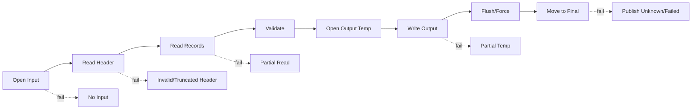

Untuk setiap edge, jawab:

1. exception apa yang terlihat?
2. artifact apa yang tertinggal?
3. apakah retry aman?
4. apakah caller bisa membedakan failure?
5. apakah ada data loss?
6. apakah ada corruption yang silent?

---

## 26. Design Heuristics

### 26.1 Terima `Path` Jika Method Membutuhkan File Semantics

Gunakan `Path` jika method perlu:

1. membuka stream sendiri;
2. membaca metadata;
3. mengontrol symlink;
4. membuat temp file;
5. atomic move;
6. file locking;
7. durability policy.

### 26.2 Terima `InputStream` Jika Method Hanya Membaca Bytes

Gunakan `InputStream` jika method tidak peduli source asalnya.

Tetapi documentasikan:

1. apakah stream ditutup;
2. apakah dibaca sampai EOF;
3. apakah blocking;
4. apakah size dibatasi;
5. format/encoding/framing.

### 26.3 Terima `Reader` Jika Boundary Sudah Text

Gunakan `Reader` jika decoding sudah tanggung jawab caller atau layer sebelumnya.

Tetapi hati-hati: dengan menerima `Reader`, method tidak tahu byte length asli. Jika kamu perlu enforce byte limit, lakukan sebelum decoding.

### 26.4 Terima `ByteBuffer` Jika Ingin NIO-Level Control

Gunakan `ByteBuffer` jika:

1. parsing binary protocol;
2. menggunakan channel;
3. perlu zero-copy-ish workflow;
4. perlu direct buffer;
5. perlu stateful incremental parser.

### 26.5 Terima `Supplier<InputStream>` Jika Butuh Replay

Contoh:

```java
Report importWithRetry(Supplier<InputStream> streamSupplier) throws IOException
```

Ini memungkinkan method membuka stream baru untuk retry. Tetapi supplier harus punya contract: setiap pemanggilan menghasilkan stream baru dari payload yang sama.

---

## 27. “Small Enough” Bukan Alasan Tanpa Batas

Banyak bug production dimulai dari kalimat:

> “File-nya kecil kok.”

Pertanyaannya:

1. kecil menurut siapa?
2. ada enforce limit?
3. apa yang terjadi jika partner salah kirim?
4. apa yang terjadi jika file corrupt dan parser tidak menemukan delimiter?
5. berapa concurrency maksimum?
6. apakah memory cukup saat 100 request paralel?

Jika benar kecil, tulis batasnya.

Contoh:

```java
private static final int MAX_CONFIG_BYTES = 256 * 1024;
```

Boundary yang “kecil” tapi tidak punya limit sebenarnya adalah boundary tidak terbatas.

---

## 28. IO Mental Model Summary Diagram

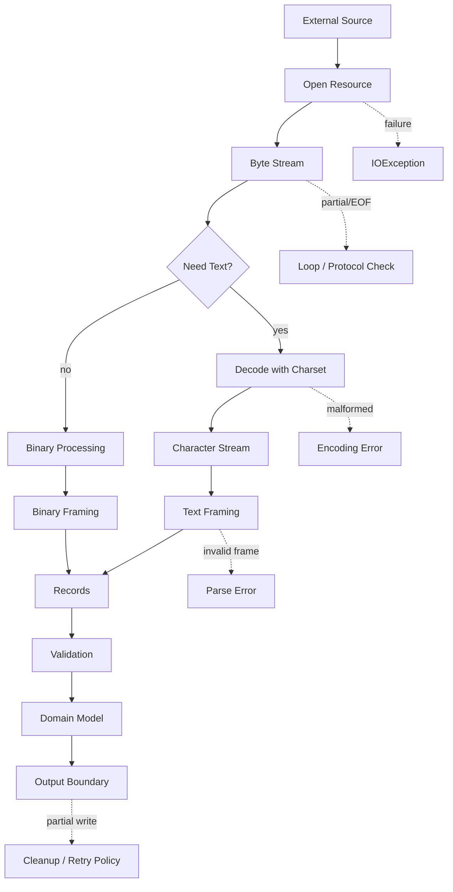

---

## 29. Exit Criteria Part 002

Kamu dianggap selesai dengan Part 002 jika bisa menjawab:

1. Mengapa stream bukan array?
2. Apa bedanya byte, character, record, dan domain object?
3. Mengapa charset adalah bagian dari boundary contract?
4. Apa bedanya EOF normal dan unexpected EOF?
5. Mengapa `read(byte[])` harus dicek return value-nya?
6. Mengapa one read tidak sama dengan one message?
7. Kapan `readAllBytes` valid dan kapan berbahaya?
8. Apa itu framing?
9. Apa saja dimensi boundary contract?
10. Mengapa retry IO butuh idempotency atau staging state?

---

## 30. Rangkuman

IO adalah tentang data yang bergerak melewati boundary yang tidak sepenuhnya kita kontrol.

Mental model utama:

1. semua IO berawal dari bytes;
2. text adalah bytes + charset + error policy;
3. record adalah stream + framing contract;
4. object/domain model adalah hasil parsing dan validasi;
5. stream bisa partial, blocking, one-shot, dan gagal di tengah;
6. EOF hanya normal jika protocol mengizinkan selesai di titik itu;
7. resource ownership harus eksplisit;
8. input eksternal harus dibatasi;
9. retry butuh idempotency;
10. boundary contract lebih penting daripada API convenience.

Part berikutnya akan masuk ke API klasik: **`InputStream`, `OutputStream`, `Reader`, `Writer`, dan contract dasar `java.io`**.

---

## 31. Referensi

- Oracle Java SE 25 API — `java.io` package summary: https://docs.oracle.com/en/java/javase/25/docs/api/java.base/java/io/package-summary.html
- Oracle Java SE 25 API — `InputStreamReader`: https://docs.oracle.com/en/java/javase/25/docs/api/java.base/java/io/InputStreamReader.html
- Oracle Java SE 25 API — `java.nio` package summary: https://docs.oracle.com/en/java/javase/25/docs/api/java.base/java/nio/package-summary.html
- Oracle Java SE 25 API — `java.nio.channels` package summary: https://docs.oracle.com/en/java/javase/25/docs/api/java.base/java/nio/channels/package-summary.html
- Oracle Java SE 25 API — `java.nio.file` package summary: https://docs.oracle.com/en/java/javase/25/docs/api/java.base/java/nio/file/package-summary.html
