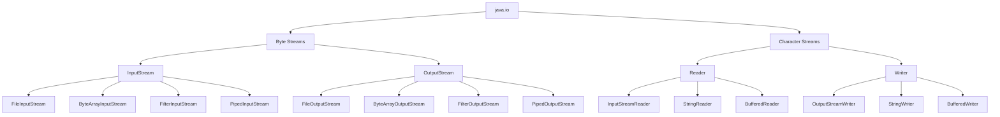
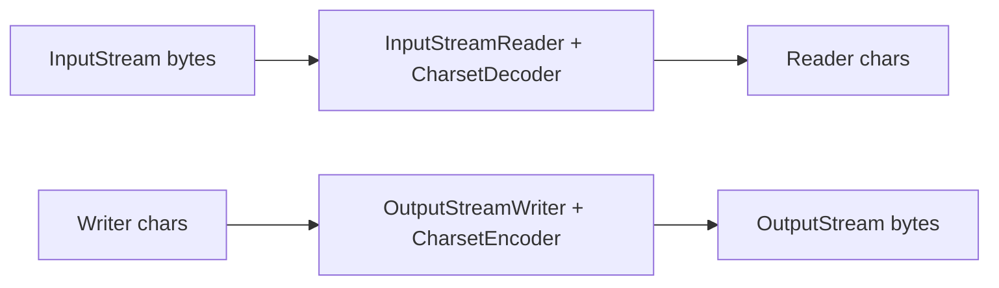

------
title: Learn Java IO, Modern IO, Streams, Buffers, Resources, Serialization & Data Boundaries - Part 003
description: Classic java.io stream contracts: InputStream, OutputStream, Reader, Writer, EOF, partial reads, blocking behavior, byte-vs-character boundaries, and production-safe read/write loops.
series: learn-java-io-modern-io-resource-boundaries
seriesTitle: Learn Java IO, Modern IO, Streams, Buffers, Resources, Serialization & Data Boundaries
order: 3
partTitle: Classic java.io: InputStream, OutputStream, Reader, Writer
tags:
  - java
  - io
  - streams
  - inputstream
  - outputstream
  - reader
  - writer
  - boundary-engineering
  - series
date: 2026-06-30
---

# Part 003 — Classic `java.io`: InputStream, OutputStream, Reader, Writer

Classic `java.io` is not obsolete. It is still the lingua franca of Java data boundaries: HTTP request bodies, servlet uploads, object storage SDKs, process pipes, archive APIs, compression streams, resource loading, classpath assets, database BLOB/CLOB access, message payload adapters, and countless framework extension points.

A top engineer does not treat `InputStream` as “a thing to read bytes from.” They treat it as a **one-way, stateful, potentially blocking, failure-prone boundary object** whose contract must be preserved even when wrapped by higher-level abstractions.

This part focuses on the four classic abstractions:

- `InputStream`: byte source
- `OutputStream`: byte sink
- `Reader`: character source
- `Writer`: character sink

We will not yet go deep into decorators such as `BufferedInputStream`, `DataInputStream`, `PrintWriter`, or `PushbackInputStream`. Those come in Part 005. Here, we focus on the base contracts that every decorator, bridge, adapter, and framework boundary inherits.

---

## 1. Kaufman Skill Decomposition

Josh Kaufman's approach starts by breaking a skill into smaller sub-skills, then practicing the highest-leverage sub-skills first. For classic Java IO, the highest-leverage sub-skills are not “memorize the class hierarchy.” They are:

1. Understand the **byte stream contract**.
2. Understand the **character stream contract**.
3. Write correct **read loops**.
4. Write correct **write/flush/close flows**.
5. Separate **data interpretation** from **data transport**.
6. Detect and avoid **partial-read assumptions**.
7. Make EOF, blocking, and exception behavior explicit.
8. Design APIs that do not accidentally transfer resource ownership.

The practice target for this part:

> Given any `InputStream`, `OutputStream`, `Reader`, or `Writer`, you should be able to state: who owns it, whether it is reusable, whether it blocks, how EOF is represented, whether partial reads are possible, how errors propagate, and when it must be closed or flushed.

---

## 2. The Classic IO Hierarchy

At a high level:



The key separation:

| Abstraction | Unit | Direction | Typical Meaning |
|---|---:|---|---|
| `InputStream` | byte | read | consume raw binary data |
| `OutputStream` | byte | write | produce raw binary data |
| `Reader` | char | read | consume decoded text |
| `Writer` | char | write | produce text to be encoded or stored |

This is the first invariant:

> Bytes are transport. Characters are interpretation.

A byte stream does not know whether bytes represent UTF-8 text, compressed data, encrypted payload, JPEG, ZIP, Protobuf, or arbitrary binary. A reader/writer exists only after a charset boundary has been chosen.

---

## 3. `InputStream`: The Byte Source Contract

`InputStream` is an abstract class representing an ordered source of bytes. The core operations are:

```java
int read() throws IOException;
int read(byte[] b) throws IOException;
int read(byte[] b, int off, int len) throws IOException;
byte[] readAllBytes() throws IOException;
byte[] readNBytes(int len) throws IOException;
int readNBytes(byte[] b, int off, int len) throws IOException;
long transferTo(OutputStream out) throws IOException;
void close() throws IOException;
```

The single most important detail:

```java
int value = input.read();
```

returns:

- `0..255` for a byte value
- `-1` for EOF

It returns `int`, not `byte`, because Java `byte` is signed and cannot represent all byte values plus the EOF sentinel.

### 3.1 EOF Is Not an Error

EOF means the stream is exhausted. It is a normal terminal condition.

```java
int b;
while ((b = in.read()) != -1) {
    process((byte) b);
}
```

But a single-byte loop is usually inefficient because it may trigger too many calls through the abstraction stack. Use buffered array reads unless byte-by-byte semantics are truly required.

### 3.2 `read(byte[])` Can Return Fewer Bytes Than Requested

This is the classic production bug.

Wrong:

```java
byte[] header = new byte[16];
in.read(header); // BUG: may read fewer than 16 bytes
parseHeader(header);
```

Correct:

```java
byte[] header = in.readNBytes(16);
if (header.length != 16) {
    throw new EOFException("Expected 16-byte header, got " + header.length);
}
parseHeader(header);
```

Or, for Java versions before `readNBytes` is available, implement a loop:

```java
static void readFully(InputStream in, byte[] buffer, int offset, int length) throws IOException {
    int remaining = length;
    int pos = offset;

    while (remaining > 0) {
        int n = in.read(buffer, pos, remaining);
        if (n == -1) {
            throw new EOFException("Unexpected EOF after " + (length - remaining) + " bytes");
        }
        pos += n;
        remaining -= n;
    }
}
```

The invariant:

> `read(byte[], off, len)` means “read up to `len` bytes,” not “read exactly `len` bytes.”

### 3.3 `read()` May Block

An `InputStream` can be backed by:

- file
- socket
- process pipe
- in-memory byte array
- compressed stream
- encrypted stream
- HTTP response body
- cloud object stream
- custom framework body

Some sources are immediately available. Others may block until data arrives, EOF occurs, or an error is raised. The `InputStream` abstraction does not guarantee non-blocking behavior.

That means this code can hang indefinitely depending on the stream source:

```java
byte[] body = in.readAllBytes();
```

It is safe for small bounded streams. It is dangerous for unbounded or remote streams.

### 3.4 `available()` Is Not Length

A common bug:

```java
byte[] data = new byte[in.available()];
in.read(data);
```

Do not use `available()` to determine total stream length. It only estimates how many bytes can be read without blocking. For many streams, it may return `0` even when more data will arrive later.

Correct mental model:

| Need | Better Approach |
|---|---|
| Read all small bounded data | `readAllBytes()` with explicit size guard |
| Read exact N bytes | `readNBytes(n)` or loop |
| Stream large data | chunked loop |
| Know file size | `Files.size(path)` for regular files |
| Know protocol payload size | parse protocol length/header |

### 3.5 `skip(n)` Is Not Guaranteed to Skip All `n`

`skip(long n)` attempts to skip bytes, but may skip fewer. Like read, it needs a loop if exact skipping matters.

```java
static void skipFully(InputStream in, long bytes) throws IOException {
    long remaining = bytes;
    while (remaining > 0) {
        long skipped = in.skip(remaining);
        if (skipped > 0) {
            remaining -= skipped;
            continue;
        }

        if (in.read() == -1) {
            throw new EOFException("Unexpected EOF while skipping");
        }
        remaining--;
    }
}
```

### 3.6 `readAllBytes()` Is Convenient, Not Universally Safe

`readAllBytes()` is correct only when the stream is bounded and small enough for memory.

Good use cases:

- loading small test fixtures
- reading known-small config files
- consuming an in-memory test stream
- reading a small classpath resource

Dangerous use cases:

- user uploads without size limit
- HTTP bodies from untrusted clients
- object storage blobs of unknown size
- process output that can grow indefinitely
- ZIP entries without validated uncompressed size

Production-safe wrapper:

```java
static byte[] readAllBytesWithLimit(InputStream in, int maxBytes) throws IOException {
    ByteArrayOutputStream out = new ByteArrayOutputStream(Math.min(maxBytes, 8192));
    byte[] buffer = new byte[8192];
    int total = 0;

    while (true) {
        int n = in.read(buffer);
        if (n == -1) {
            return out.toByteArray();
        }

        total += n;
        if (total > maxBytes) {
            throw new IOException("Input exceeds limit of " + maxBytes + " bytes");
        }

        out.write(buffer, 0, n);
    }
}
```

### 3.7 `nullInputStream()`

Modern Java provides `InputStream.nullInputStream()`, a stream that behaves like an empty stream. This is useful for tests, default values, and no-body cases.

```java
InputStream empty = InputStream.nullInputStream();
```

Use it instead of custom empty stream implementations.

---

## 4. `OutputStream`: The Byte Sink Contract

`OutputStream` is an abstract destination of bytes. Core operations:

```java
void write(int b) throws IOException;
void write(byte[] b) throws IOException;
void write(byte[] b, int off, int len) throws IOException;
void flush() throws IOException;
void close() throws IOException;
```

### 4.1 `write(int)` Writes One Byte

Even though the parameter is `int`, only the low eight bits are written.

```java
out.write(0x41); // writes byte value 65, ASCII 'A'
```

Like `InputStream.read()`, this shape avoids signed-byte confusion.

### 4.2 `write(byte[])` Writes the Entire Array or Throws

Unlike `InputStream.read(byte[])`, `OutputStream.write(byte[])` is expected to write the full byte array, unless an exception occurs. But this does not mean the bytes are durable, visible to a peer, or physically persisted.

Important distinction:

| Operation | Meaning |
|---|---|
| `write` | pass bytes into the stream abstraction |
| `flush` | push buffered bytes toward underlying destination |
| `close` | finish stream and release resource |
| `force/fsync` | request durable persistence at filesystem/storage layer |

`OutputStream` itself does not expose `fsync`. Durability appears later through `FileChannel.force` and filesystem-safe update patterns.

### 4.3 `flush()` Is a Boundary Signal, Not a Durability Guarantee

`flush()` asks buffered layers to push bytes downstream.

It matters for:

- `BufferedOutputStream`
- `OutputStreamWriter`
- `PrintWriter`
- network protocols
- process input
- HTTP response bodies

But `flush()` alone does not mean:

- data reached disk platter/SSD flash
- remote peer processed the message
- transaction committed
- object storage upload completed

The invariant:

> Flush is visibility pressure. Close is lifecycle completion. Fsync is durability pressure.

### 4.4 `close()` Usually Flushes First

Most output streams flush pending data during close. But you should not rely on close as your only semantic boundary if a protocol requires explicit flush before waiting for response.

Example: process stdin.

```java
try (OutputStream stdin = process.getOutputStream()) {
    stdin.write(payload);
    stdin.flush();
}
```

The close signals EOF to the child process. The flush pushes buffered bytes before EOF.

### 4.5 `nullOutputStream()`

Modern Java provides `OutputStream.nullOutputStream()`, a sink that discards all bytes. Useful for benchmarks, tests, counting wrappers, and dry-run paths.

```java
OutputStream sink = OutputStream.nullOutputStream();
```

---

## 5. Correct Copy Loops

At some point, all IO comes down to this:

```java
static long copy(InputStream in, OutputStream out) throws IOException {
    byte[] buffer = new byte[8192];
    long total = 0;

    while (true) {
        int n = in.read(buffer);
        if (n == -1) {
            return total;
        }
        out.write(buffer, 0, n);
        total += n;
    }
}
```

This loop encodes several important facts:

1. It handles partial reads.
2. It stops on EOF.
3. It writes only the bytes actually read.
4. It does not assume all input fits in memory.
5. It returns byte count for auditing and validation.
6. It does not close streams it did not open.

### 5.1 Ownership-Aware Copy

A copy method should usually **not close** streams passed into it.

```java
static long copyButDoNotClose(InputStream in, OutputStream out) throws IOException {
    return in.transferTo(out);
}
```

Whoever opens a resource should normally close it.

```java
try (InputStream in = Files.newInputStream(source);
     OutputStream out = Files.newOutputStream(target)) {
    in.transferTo(out);
}
```

This separation is critical when streams are part of a larger lifecycle, for example servlet request bodies or framework-managed response streams.

### 5.2 `transferTo()`

`InputStream.transferTo(OutputStream)` copies all bytes from an input stream to an output stream. It is concise and less error-prone than hand-written loops.

```java
long bytes = in.transferTo(out);
```

Use it when:

- you want full stream transfer
- stream size is not necessarily known
- you do not need per-chunk validation/transformation
- you trust both stream abstractions

Avoid it when:

- you need a strict byte limit
- you need progress callbacks
- you need cancellation checks
- you need per-chunk hashing or validation
- you need protocol-level framing

A guarded variant:

```java
static long transferToWithLimit(InputStream in, OutputStream out, long maxBytes) throws IOException {
    byte[] buffer = new byte[8192];
    long total = 0;

    while (true) {
        int n = in.read(buffer);
        if (n == -1) {
            return total;
        }
        total += n;
        if (total > maxBytes) {
            throw new IOException("Transfer exceeds limit: " + maxBytes + " bytes");
        }
        out.write(buffer, 0, n);
    }
}
```

---

## 6. `Reader`: The Character Source Contract

`Reader` is like `InputStream`, but its unit is `char`, not byte.

Core operations:

```java
int read() throws IOException;
int read(char[] cbuf) throws IOException;
int read(char[] cbuf, int off, int len) throws IOException;
long transferTo(Writer out) throws IOException;
void close() throws IOException;
```

### 6.1 A Java `char` Is Not Always a Complete User-Visible Character

Java `char` is a UTF-16 code unit. Some Unicode code points require surrogate pairs. So `Reader` gives you decoded UTF-16 code units, not necessarily full grapheme clusters.

For many business formats, line-oriented text processing is sufficient. For Unicode-heavy processing, be careful with assumptions such as:

```java
int count = string.length(); // code units, not user-perceived characters
```

This belongs more deeply to text/charset handling in Part 007, but it matters here because `Reader` is already after the decoding boundary.

### 6.2 `Reader.read(char[])` Can Also Return Fewer Characters

Same principle as byte streams:

```java
char[] header = new char[10];
int n = reader.read(header);
// n may be less than 10
```

If your protocol requires exact character count, loop or use a higher-level abstraction with clear semantics.

### 6.3 `BufferedReader.readLine()` Removes Line Terminators

`BufferedReader.readLine()` returns a line without the line termination characters. That is useful for semantic line processing, but lossy if exact original bytes/text must be preserved.

```java
try (BufferedReader reader = Files.newBufferedReader(path, StandardCharsets.UTF_8)) {
    String line;
    while ((line = reader.readLine()) != null) {
        processLine(line);
    }
}
```

Use this for logical text lines, not binary-safe parsing.

---

## 7. `Writer`: The Character Sink Contract

`Writer` is the text counterpart to `OutputStream`.

Core operations:

```java
void write(int c) throws IOException;
void write(char[] cbuf) throws IOException;
void write(char[] cbuf, int off, int len) throws IOException;
void write(String str) throws IOException;
void flush() throws IOException;
void close() throws IOException;
```

### 7.1 Writer Does Not Mean File

A `Writer` may write to:

- memory (`StringWriter`)
- file (`FileWriter`, usually avoid default charset)
- network response
- compressed stream through a bridge
- templating engine output
- logging adapter
- custom DSL output

### 7.2 Charset Appears at the Bridge

`Writer` itself writes characters. Encoding happens when a writer is connected to bytes:

```java
try (Writer writer = new OutputStreamWriter(out, StandardCharsets.UTF_8)) {
    writer.write("hello");
}
```

Do not use default charset accidentally at system boundaries.

Prefer:

```java
Files.newBufferedWriter(path, StandardCharsets.UTF_8)
```

over:

```java
new FileWriter(file)
```

unless the default charset is explicitly part of the requirement.

### 7.3 Flush Matters for Encoders

`OutputStreamWriter` may buffer bytes internally as part of character encoding. `flush()` ensures encoded bytes are pushed to the underlying byte stream.

```java
writer.write("message\n");
writer.flush();
```

For streaming text protocols, flush can be a protocol-level boundary.

---

## 8. Byte-Character Bridges

The two bridge classes:

```java
Reader reader = new InputStreamReader(inputStream, StandardCharsets.UTF_8);
Writer writer = new OutputStreamWriter(outputStream, StandardCharsets.UTF_8);
```

They encode/decode between byte streams and character streams.



This bridge is a **semantic boundary**. Once bytes are decoded into chars, some byte-level facts are gone:

- exact original byte sequence
- BOM presence
- invalid byte details if replacement policy is used
- original newline bytes if normalized later
- binary-safe offsets

And once chars are encoded into bytes, output depends on:

- charset
- encoder error policy
- newline policy
- writer buffering

For deterministic systems, always pass the charset explicitly.

---

## 9. File Streams vs `Files` API

Classic file classes still exist:

```java
InputStream in = new FileInputStream("data.bin");
OutputStream out = new FileOutputStream("out.bin");
Reader reader = new FileReader("data.txt", StandardCharsets.UTF_8);
Writer writer = new FileWriter("out.txt", StandardCharsets.UTF_8);
```

Modern code often prefers `java.nio.file.Files`:

```java
try (InputStream in = Files.newInputStream(path);
     OutputStream out = Files.newOutputStream(target)) {
    in.transferTo(out);
}
```

Why prefer `Files`?

- works naturally with `Path`
- integrates with file attributes and options
- aligns with NIO filesystem providers
- clearer options for creation/truncation/append behavior
- better transition to advanced filesystem operations

But the returned objects are still often stream abstractions. The classic contract still matters.

---

## 10. Common Concrete Stream Types

### 10.1 `ByteArrayInputStream`

An in-memory byte source.

```java
byte[] payload = "hello".getBytes(StandardCharsets.UTF_8);
try (InputStream in = new ByteArrayInputStream(payload)) {
    byte[] copy = in.readAllBytes();
}
```

Useful for:

- tests
- adapters
- retryable small payloads
- converting byte arrays to stream-based APIs

Caution:

- not good for large payloads
- may hide streaming bugs in tests because it does not block like network/process streams

### 10.2 `ByteArrayOutputStream`

An in-memory byte sink.

```java
ByteArrayOutputStream out = new ByteArrayOutputStream();
out.write("hello".getBytes(StandardCharsets.UTF_8));
byte[] result = out.toByteArray();
```

Useful for:

- tests
- small serialization outputs
- adapters from stream API to byte array API

Caution:

- grows in memory
- can become a hidden memory bomb if used with unbounded inputs

### 10.3 `StringReader` and `StringWriter`

In-memory character source/sink.

```java
try (Reader reader = new StringReader("a\nb\n")) {
    reader.transferTo(new StringWriter());
}
```

Useful for parsers, templating tests, and small text transformations.

### 10.4 `PipedInputStream` and `PipedOutputStream`

Piped streams connect producer and consumer threads.

They are easy to misuse. If producer and consumer scheduling is wrong, they can deadlock. For most modern application-level designs, bounded queues, reactive streams, or explicit async pipelines are clearer. Use piped streams only when integrating with APIs that demand `InputStream`/`OutputStream` and you fully control both sides.

---

## 11. Failure Model

Every IO method that touches an external boundary may fail.

Typical failures:

| Failure | Example |
|---|---|
| EOF | peer closes connection, file shorter than expected |
| permission denied | cannot open or write file |
| not found | path missing |
| disk full | write fails mid-stream |
| broken pipe | peer closes while writing |
| timeout | wrapper or underlying system reports timeout |
| malformed data | decoder cannot decode bytes |
| interrupted thread | blocking operation may react depending on source |
| close failure | buffered data cannot be flushed during close |

A robust IO design separates:

1. **Open failure**: resource could not be acquired.
2. **Read/write failure**: transfer failed during use.
3. **Close failure**: cleanup or final flush failed.
4. **Semantic failure**: bytes were transferred but invalid for the format.

Example:

```java
try (InputStream in = Files.newInputStream(path)) {
    Header header = readHeader(in);
    Body body = readBody(in, header.length());
    validate(body);
} catch (NoSuchFileException e) {
    throw new ImportException("Input file does not exist: " + path, e);
} catch (EOFException e) {
    throw new ImportException("Input file ended before complete record was read", e);
} catch (MalformedInputException e) {
    throw new ImportException("Input file is not valid UTF-8", e);
} catch (IOException e) {
    throw new ImportException("Could not read input file: " + path, e);
}
```

Do not collapse all IO exceptions into “failed.” The recovery and diagnosis differ.

---

## 12. Production Read Patterns

### 12.1 Read Exact Header, Stream Body

Many binary protocols have a fixed header and variable body.

```java
record MessageHeader(int version, int type, int length) {}

static MessageHeader readHeader(InputStream in) throws IOException {
    byte[] header = in.readNBytes(12);
    if (header.length != 12) {
        throw new EOFException("Expected 12-byte header");
    }

    ByteBuffer buffer = ByteBuffer.wrap(header).order(ByteOrder.BIG_ENDIAN);
    int version = buffer.getInt();
    int type = buffer.getInt();
    int length = buffer.getInt();

    if (length < 0 || length > 10_000_000) {
        throw new IOException("Invalid message length: " + length);
    }

    return new MessageHeader(version, type, length);
}
```

Then stream the body with a limit:

```java
static void copyExactly(InputStream in, OutputStream out, long bytes) throws IOException {
    byte[] buffer = new byte[8192];
    long remaining = bytes;

    while (remaining > 0) {
        int max = (int) Math.min(buffer.length, remaining);
        int n = in.read(buffer, 0, max);
        if (n == -1) {
            throw new EOFException("Body ended with " + remaining + " bytes remaining");
        }
        out.write(buffer, 0, n);
        remaining -= n;
    }
}
```

### 12.2 Read Text with Explicit Charset

```java
static List<String> readLines(Path path) throws IOException {
    try (BufferedReader reader = Files.newBufferedReader(path, StandardCharsets.UTF_8)) {
        List<String> lines = new ArrayList<>();
        String line;
        while ((line = reader.readLine()) != null) {
            lines.add(line);
        }
        return lines;
    }
}
```

For huge files, do not return a list.

```java
static void processLines(Path path, Consumer<String> consumer) throws IOException {
    try (BufferedReader reader = Files.newBufferedReader(path, StandardCharsets.UTF_8)) {
        String line;
        while ((line = reader.readLine()) != null) {
            consumer.accept(line);
        }
    }
}
```

### 12.3 Read Small Bounded Resource

```java
static String readClasspathTextResource(Class<?> anchor, String name) throws IOException {
    try (InputStream in = anchor.getResourceAsStream(name)) {
        if (in == null) {
            throw new FileNotFoundException("Resource not found: " + name);
        }
        byte[] bytes = readAllBytesWithLimit(in, 1_000_000);
        return new String(bytes, StandardCharsets.UTF_8);
    }
}
```

---

## 13. API Design: Should You Accept `InputStream`?

Accepting `InputStream` is flexible but dangerous because it implies a live resource boundary.

Ask these questions:

| Question | Why It Matters |
|---|---|
| Who closes it? | resource ownership |
| Is it consumed once? | replayability |
| Can it block? | thread model |
| Is its size bounded? | memory safety |
| Is it binary or text? | charset boundary |
| Does caller expect it to remain open? | lifecycle bug |
| Does method read all or partial? | contract clarity |

Bad API:

```java
void importData(InputStream input);
```

Better:

```java
void importData(InputStream input) throws IOException;
```

Even better:

```java
/**
 * Reads the complete import payload from {@code input} but does not close it.
 * The payload must be UTF-8 encoded and no larger than {@code maxBytes}.
 */
ImportResult importData(InputStream input, long maxBytes) throws IOException;
```

Or, if the method should own the resource:

```java
ImportResult importData(Path inputFile) throws IOException;
```

Or, if the method needs replayability:

```java
ImportResult importData(Supplier<? extends InputStream> inputSupplier) throws IOException;
```

But even that supplier contract must state whether each call returns a new stream and who closes it.

---

## 14. Anti-Patterns

### 14.1 Assuming One `read` Gets Everything

```java
int n = in.read(buffer);
parse(buffer); // BUG: buffer may contain stale bytes after n
```

Use `n`.

```java
int n = in.read(buffer);
if (n != -1) {
    parse(buffer, 0, n);
}
```

### 14.2 Mixing Text and Binary on the Same Boundary Without Framing

```java
writer.write("LEN=10\n");
out.write(binaryPayload); // dangerous if writer has buffered data
```

If you mix layers, flush at the boundary and document the framing. Better: define one protocol abstraction.

### 14.3 Closing a Stream You Do Not Own

```java
void writeResponse(OutputStream response, byte[] body) throws IOException {
    try (response) { // often wrong for framework-managed streams
        response.write(body);
    }
}
```

Better:

```java
void writeResponse(OutputStream response, byte[] body) throws IOException {
    response.write(body);
    response.flush();
}
```

Only close if your contract says you own it.

### 14.4 Using Default Charset at External Boundaries

```java
new InputStreamReader(in); // default charset
new OutputStreamWriter(out); // default charset
```

Prefer:

```java
new InputStreamReader(in, StandardCharsets.UTF_8);
new OutputStreamWriter(out, StandardCharsets.UTF_8);
```

### 14.5 Turning All Streams Into Byte Arrays

```java
byte[] data = in.readAllBytes();
```

Fine for small bounded data. Dangerous as a default architecture.

---

## 15. Diagnostic Heuristics

When debugging IO code, ask:

1. Is the stream actually being consumed?
2. Is the stream being consumed more than once?
3. Is the code assuming full read?
4. Is EOF expected or exceptional here?
5. Is the stream closed too early?
6. Is the stream never closed?
7. Is data stuck in a buffer because flush was missing?
8. Is binary data being passed through a text layer?
9. Is the charset explicit?
10. Is the payload bounded?
11. Is `available()` being misused?
12. Is a framework-managed stream being closed by application code?
13. Is the code blocking on a remote/process stream?
14. Is close failure hiding the original failure?
15. Is the exception message diagnostic enough to act on?

---

## 16. Deliberate Practice

### Exercise 1 — Fix the Partial Read Bug

Given:

```java
byte[] header = new byte[32];
in.read(header);
return Header.parse(header);
```

Rewrite it so:

- exact 32 bytes are required
- EOF becomes `EOFException`
- no stale bytes are parsed
- the stream is not closed

### Exercise 2 — Bounded Copy

Implement:

```java
long copy(InputStream in, OutputStream out, long maxBytes) throws IOException
```

Requirements:

- does not close either stream
- throws if input exceeds `maxBytes`
- writes only bytes read
- returns bytes copied
- uses a reusable buffer

### Exercise 3 — Text Boundary

Implement:

```java
void writeUtf8Lines(OutputStream out, List<String> lines) throws IOException
```

Requirements:

- explicit UTF-8
- newline is `\n`
- does not close `out`
- flushes writer at the end

### Exercise 4 — Ownership Contract

Document this method precisely:

```java
ImportResult importPayload(InputStream payload) throws IOException
```

Your documentation must answer:

- does it close the stream?
- does it read the whole stream?
- what charset or format is expected?
- what is the maximum size?
- what exceptions are meaningful?

---

## 17. Production Checklist

Before approving classic IO code, verify:

- [ ] `read(byte[])` return value is checked.
- [ ] exact reads use `readNBytes` or a loop.
- [ ] EOF semantics are explicit.
- [ ] `available()` is not used as total length.
- [ ] `readAllBytes()` is guarded or used only for small bounded data.
- [ ] charsets are explicit at byte/text boundaries.
- [ ] binary and text layers are not mixed accidentally.
- [ ] streams are closed only by their owner.
- [ ] output is flushed when protocol visibility requires it.
- [ ] exceptions preserve useful context.
- [ ] large data is streamed instead of materialized.
- [ ] tests include partial-read behavior, not only `ByteArrayInputStream` happy path.

---

## 18. Key Takeaways

1. `InputStream` and `Reader` reads are often partial.
2. EOF is a normal terminal signal, not automatically an error.
3. `OutputStream.write` transfers bytes into the stream abstraction, not necessarily to durable storage.
4. `flush`, `close`, and durability are different concepts.
5. `Reader`/`Writer` exist after a charset decision.
6. Do not use default charset at external boundaries.
7. `readAllBytes()` is only safe for bounded inputs.
8. Ownership must be explicit: opening and closing responsibilities are part of the API contract.
9. Most production IO bugs are contract bugs, not syntax bugs.

---

## References

- Oracle Java SE 25 API — `java.io` package summary: https://docs.oracle.com/en/java/javase/25/docs/api/java.base/java/io/package-summary.html
- Oracle Java SE 25 API — `InputStream`: https://docs.oracle.com/en/java/javase/25/docs/api/java.base/java/io/InputStream.html
- Oracle Java SE 25 API — `OutputStream`: https://docs.oracle.com/en/java/javase/25/docs/api/java.base/java/io/OutputStream.html
- Oracle Java SE 25 API — `Reader`: https://docs.oracle.com/en/java/javase/25/docs/api/java.base/java/io/Reader.html
- Oracle Java SE 25 API — `Writer`: https://docs.oracle.com/en/java/javase/25/docs/api/java.base/java/io/Writer.html
- Oracle Java SE 25 API — `InputStreamReader`: https://docs.oracle.com/en/java/javase/25/docs/api/java.base/java/io/InputStreamReader.html
- Oracle Java SE 25 API — `OutputStreamWriter`: https://docs.oracle.com/en/java/javase/25/docs/api/java.base/java/io/OutputStreamWriter.html
