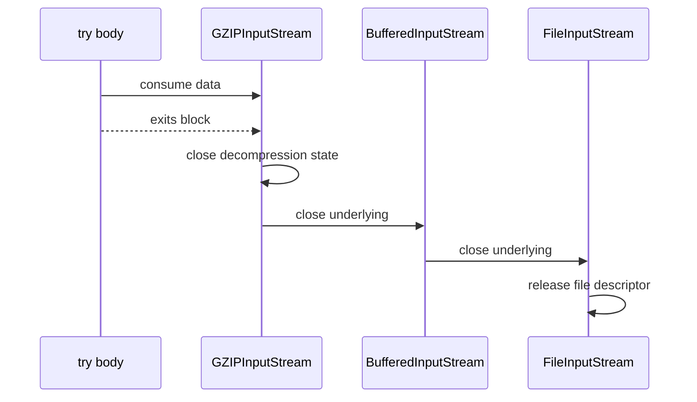

------
title: Learn Java IO, Modern IO, Streams, Buffers, Resources, Serialization & Data Boundaries - Part 004
description: Resource lifecycle engineering with AutoCloseable, Closeable, try-with-resources, ownership contracts, suppressed exceptions, close ordering, leak prevention, and production-safe cleanup patterns.
series: learn-java-io-modern-io-resource-boundaries
seriesTitle: Learn Java IO, Modern IO, Streams, Buffers, Resources, Serialization & Data Boundaries
order: 4
partTitle: Resource Lifecycle: Closeable, AutoCloseable, Ownership
tags:
  - java
  - io
  - resource-management
  - closeable
  - autocloseable
  - try-with-resources
  - lifecycle
  - boundary-engineering
  - series
date: 2026-06-30
---

# Part 004 — Resource Lifecycle: Closeable, AutoCloseable, Ownership

IO is not just data movement. IO is **resource ownership**.

A stream may represent a file descriptor, socket, pipe, native buffer, compressed stream state, encryption state, filesystem lock, remote response body, cloud object handle, or framework-managed request/response body. The JVM can reclaim Java objects through garbage collection, but garbage collection is not a reliable resource lifecycle strategy for external resources.

This part teaches the lifecycle layer underneath all Java IO:

- `AutoCloseable`
- `Closeable`
- try-with-resources
- close ordering
- suppressed exceptions
- resource ownership
- leak prevention
- framework-managed resources
- safe adapter patterns

The goal is to make resource boundaries explicit enough that code review can answer: **who owns this resource, when does it close, what happens if close fails, and can cleanup hide the real failure?**

---

## 1. Why Resource Lifecycle Is a Separate Skill

Many engineers learn IO as a method-call problem:

```java
InputStream in = Files.newInputStream(path);
byte[] data = in.readAllBytes();
in.close();
```

Production IO is not that simple.

Real systems fail because:

- a stream is not closed on exceptional path
- a response stream is closed too early
- a buffered writer is not flushed
- a close failure hides a write failure
- a wrapper closes an underlying resource unexpectedly
- ownership is transferred without documentation
- a resource escapes its lifecycle scope
- many small leaks become descriptor exhaustion
- cleanup happens in `finalize`/GC assumptions instead of explicit close
- a method consumes a stream that the caller expected to reuse

Resource lifecycle is the **control plane** of IO.

---

## 2. `AutoCloseable` vs `Closeable`

### 2.1 `AutoCloseable`

`AutoCloseable` is the general interface for resources usable in try-with-resources.

```java
public interface AutoCloseable {
    void close() throws Exception;
}
```

It is not IO-specific. It can represent:

- database connections
- locks
- scopes
- spans
- temporary resources
- memory arenas
- client handles
- IO streams

Important: `AutoCloseable.close()` may throw `Exception`, not only `IOException`.

### 2.2 `Closeable`

`Closeable` is an IO-oriented sub-interface:

```java
public interface Closeable extends AutoCloseable {
    void close() throws IOException;
}
```

It narrows the exception type to `IOException`. Many classic IO types implement `Closeable`:

- `InputStream`
- `OutputStream`
- `Reader`
- `Writer`
- `RandomAccessFile`
- many channel types through related APIs

The design implication:

| Interface | Close Exception | Typical Use |
|---|---|---|
| `AutoCloseable` | `Exception` | general resource scopes |
| `Closeable` | `IOException` | IO resources |

### 2.3 Idempotency Difference

`Closeable` specifies that closing an already closed stream has no effect. `AutoCloseable` is more general; implementations are not necessarily idempotent unless documented.

Therefore:

- for `Closeable`, repeated close should be safe
- for arbitrary `AutoCloseable`, do not assume repeated close is harmless unless contract says so

When you implement your own closeable type, make close idempotent whenever possible.

---

## 3. The Core Ownership Rule

The basic rule:

> The code that acquires a resource is usually responsible for closing it.

Example:

```java
try (InputStream in = Files.newInputStream(path)) {
    importData(in);
}
```

Here, the caller opens `in`, so the caller closes it. `importData` should not close it unless its contract explicitly says so.

### 3.1 Ownership States

A resource parameter can have one of several ownership contracts:

| Contract | Meaning |
|---|---|
| Borrowed | callee may use but must not close |
| Consumed | callee reads/writes until done but may not close |
| Owned | callee must close |
| Transferred | ownership moves from caller to callee |
| Framework-managed | neither application helper nor business method should close directly unless framework says so |
| Escaped | resource is stored or returned; lifecycle outlives current method |

Most bugs happen because code does not distinguish borrowed from owned.

### 3.2 Borrowed Stream

```java
/**
 * Writes the report to {@code out}. Does not close {@code out}.
 * Flushes before returning so callers can observe the completed report.
 */
void writeReport(OutputStream out, Report report) throws IOException {
    out.write(render(report));
    out.flush();
}
```

### 3.3 Owned Resource

```java
/**
 * Opens, writes, and closes the target file.
 */
void writeReport(Path target, Report report) throws IOException {
    try (OutputStream out = Files.newOutputStream(target)) {
        writeReport(out, report);
    }
}
```

This overload pattern is excellent:

- `Path` overload owns the file lifecycle
- `OutputStream` overload borrows the stream
- behavior is explicit and testable

### 3.4 Transferred Ownership

Sometimes ownership is transferred:

```java
final class PayloadBody implements AutoCloseable {
    private final InputStream input;

    PayloadBody(InputStream input) {
        this.input = Objects.requireNonNull(input);
    }

    @Override
    public void close() throws IOException {
        input.close();
    }
}
```

This constructor should document that the object takes ownership of the stream. Without documentation, callers may be surprised when the wrapper closes the stream.

---

## 4. Try-With-Resources

Try-with-resources ensures resources are closed automatically when leaving the block.

```java
try (InputStream in = Files.newInputStream(source);
     OutputStream out = Files.newOutputStream(target)) {
    in.transferTo(out);
}
```

This compiles conceptually into a structure that closes resources even when the body throws.

### 4.1 Close Order Is Reverse Declaration Order

Resources are closed in reverse order.

```java
try (InputStream file = Files.newInputStream(path);
     InputStream buffered = new BufferedInputStream(file);
     InputStream gzip = new GZIPInputStream(buffered)) {
    consume(gzip);
}
```

Close order:

1. `gzip.close()`
2. `buffered.close()`
3. `file.close()`

This is correct because outer wrappers often need to finish their own state before closing the underlying resource.



### 4.2 Declare the Outermost Resource Only When Appropriate

Because closing an outer stream usually closes the inner stream, this is often enough:

```java
try (InputStream in = new GZIPInputStream(
        new BufferedInputStream(Files.newInputStream(path)))) {
    consume(in);
}
```

But there is a subtle problem: if constructing `GZIPInputStream` fails after opening the file stream, the inner stream may leak unless construction is carefully nested or declared separately.

Safer construction for multiple resources:

```java
try (InputStream file = Files.newInputStream(path);
     InputStream buffered = new BufferedInputStream(file);
     InputStream gzip = new GZIPInputStream(buffered)) {
    consume(gzip);
}
```

This ensures already-created resources are closed if a later resource constructor fails.

---

## 5. Suppressed Exceptions

Try-with-resources has a critical feature: suppressed exceptions.

Suppose the body throws, then close also throws.

```java
try (OutputStream out = failingCloseStream()) {
    out.write(data); // throws IOException A
} // close throws IOException B
```

Java preserves the body exception as the primary exception and attaches close exceptions as suppressed.

```java
catch (IOException e) {
    Throwable[] suppressed = e.getSuppressed();
}
```

This matters because old `finally` code often hid the real failure.

Bad pre-try-with-resources pattern:

```java
InputStream in = null;
try {
    in = Files.newInputStream(path);
    process(in); // throws A
} finally {
    if (in != null) {
        in.close(); // throws B and hides A
    }
}
```

Try-with-resources is usually better:

```java
try (InputStream in = Files.newInputStream(path)) {
    process(in);
}
```

### 5.1 Logging Suppressed Exceptions

Many logging frameworks include suppressed exceptions automatically when logging the throwable. But when converting exceptions, preserve the original as cause.

```java
try (InputStream in = Files.newInputStream(path)) {
    process(in);
} catch (IOException e) {
    throw new ImportException("Failed to import from " + path, e);
}
```

Do not discard `e`, or suppressed close failures disappear too.

Bad:

```java
catch (IOException e) {
    throw new ImportException("Failed to import"); // loses cause and suppressed exceptions
}
```

---

## 6. Close Failure Semantics

Closing can fail.

Examples:

- buffered output cannot flush
- network socket fails while sending final bytes
- compressed stream cannot finish trailer
- filesystem reports writeback error
- remote body close fails
- archive stream cannot finish central directory

For input streams, close failure is usually less semantically important than read failure. For output streams, close failure may mean data was not fully written.

### 6.1 Output Close Can Be Semantically Significant

Example with compressed output:

```java
try (GZIPOutputStream gzip = new GZIPOutputStream(Files.newOutputStream(path))) {
    gzip.write(payload);
}
```

The GZIP trailer is completed during finish/close. If close fails, the file may be corrupt.

Therefore, never ignore close failures for output boundaries that must produce valid data.

### 6.2 `flush()` Before `close()`?

Usually close calls flush. But explicit flush can be meaningful when:

- protocol requires data visible before close
- you need to observe write failure before continuing
- stream remains open after writer wrapper is flushed
- you are not the owner and must not close

Borrowed output pattern:

```java
void writeMessage(OutputStream out, Message message) throws IOException {
    out.write(encode(message));
    out.flush();
}
```

Owned output pattern:

```java
try (OutputStream out = Files.newOutputStream(path)) {
    writeMessage(out, message);
}
```

---

## 7. Resource Leaks

A resource leak happens when an external resource remains open longer than intended.

Common symptoms:

- `Too many open files`
- Windows file cannot be deleted because it is still open
- connection pool exhaustion
- process hangs waiting for pipe EOF
- test suite fails only when run together
- file descriptors grow over time
- native memory grows even when heap seems stable

### 7.1 Leak Pattern: Return Stream From Inside Try

Wrong:

```java
InputStream openConfig() throws IOException {
    try (InputStream in = Files.newInputStream(configPath)) {
        return in; // returns closed stream
    }
}
```

Correct if returning ownership:

```java
/**
 * Opens the config stream. Caller owns and must close the returned stream.
 */
InputStream openConfig() throws IOException {
    return Files.newInputStream(configPath);
}
```

Better if the method can own lifecycle:

```java
Config loadConfig() throws IOException {
    try (InputStream in = Files.newInputStream(configPath)) {
        return parseConfig(in);
    }
}
```

### 7.2 Leak Pattern: Stream Escapes Through Lazy API

```java
Stream<String> lines = Files.lines(path);
return lines.filter(...); // caller may forget to close
```

`Files.lines` returns a `Stream<String>` that must be closed because it holds an open file. This is easy to miss because Java streams look like in-memory collections.

Safe use:

```java
try (Stream<String> lines = Files.lines(path, StandardCharsets.UTF_8)) {
    return lines
        .filter(line -> !line.isBlank())
        .count();
}
```

If returning a lazy stream, document ownership strongly or avoid returning it.

### 7.3 Leak Pattern: Exception Between Open and Close

Wrong:

```java
InputStream in = Files.newInputStream(path);
validateHeader(in); // may throw
in.close();
```

Correct:

```java
try (InputStream in = Files.newInputStream(path)) {
    validateHeader(in);
}
```

### 7.4 Leak Pattern: Constructor Acquires Multiple Resources

Wrong:

```java
class TwoFiles implements Closeable {
    private final InputStream a;
    private final InputStream b;

    TwoFiles(Path p1, Path p2) throws IOException {
        this.a = Files.newInputStream(p1);
        this.b = Files.newInputStream(p2); // if this fails, a leaks
    }

    public void close() throws IOException {
        a.close();
        b.close();
    }
}
```

Safer:

```java
class TwoFiles implements Closeable {
    private final InputStream a;
    private final InputStream b;

    TwoFiles(Path p1, Path p2) throws IOException {
        InputStream first = null;
        InputStream second = null;
        try {
            first = Files.newInputStream(p1);
            second = Files.newInputStream(p2);
            this.a = first;
            this.b = second;
        } catch (Throwable t) {
            closeQuietly(second, t);
            closeQuietly(first, t);
            throw t;
        }
    }

    @Override
    public void close() throws IOException {
        IOException failure = null;
        try {
            b.close();
        } catch (IOException e) {
            failure = e;
        }
        try {
            a.close();
        } catch (IOException e) {
            if (failure != null) {
                failure.addSuppressed(e);
            } else {
                failure = e;
            }
        }
        if (failure != null) {
            throw failure;
        }
    }

    private static void closeQuietly(Closeable c, Throwable primary) {
        if (c == null) {
            return;
        }
        try {
            c.close();
        } catch (Throwable closeFailure) {
            primary.addSuppressed(closeFailure);
        }
    }
}
```

In practice, prefer factory methods and try-with-resources composition where possible.

---

## 8. Implementing `Closeable` Correctly

A custom closeable should follow these principles:

1. Close is idempotent if possible.
2. Close releases resources even if some release step fails.
3. Close preserves suppressed exceptions when multiple failures occur.
4. Close marks the object closed.
5. Public operations fail predictably after close.
6. Ownership of nested resources is clear.

Example:

```java
final class ManagedPayload implements Closeable {
    private final InputStream input;
    private boolean closed;

    ManagedPayload(InputStream input) {
        this.input = Objects.requireNonNull(input, "input");
    }

    byte[] readSomeBytes(int max) throws IOException {
        ensureOpen();
        return input.readNBytes(max);
    }

    private void ensureOpen() throws IOException {
        if (closed) {
            throw new IOException("ManagedPayload is closed");
        }
    }

    @Override
    public void close() throws IOException {
        if (closed) {
            return;
        }
        closed = true;
        input.close();
    }
}
```

### 8.1 Mark Closed Before or After Closing?

For `Closeable`, it is often better to mark closed before releasing resources so repeated calls do not retry a failed close forever. But this decision has semantics.

```java
@Override
public void close() throws IOException {
    if (closed) {
        return;
    }
    closed = true;
    input.close();
}
```

If `input.close()` fails, this object is still considered closed from the wrapper's perspective. That usually matches resource cleanup best-effort semantics.

---

## 9. Framework-Managed Resources

Frameworks often pass streams that the framework owns:

- servlet request input stream
- servlet response output stream
- JAX-RS entity stream
- Spring resource body
- Netty adapters
- cloud SDK response streams
- test framework temporary resources

The mistake is closing too aggressively.

Example helper:

```java
void writeJson(OutputStream out, Object value) throws IOException {
    try (Writer writer = new OutputStreamWriter(out, StandardCharsets.UTF_8)) {
        writer.write(toJson(value));
    }
}
```

This closes `out`. If `out` is framework-managed response output, that may terminate the response earlier than intended.

Borrowed-resource version:

```java
void writeJson(OutputStream out, Object value) throws IOException {
    Writer writer = new OutputStreamWriter(out, StandardCharsets.UTF_8);
    writer.write(toJson(value));
    writer.flush();
}
```

But note: `OutputStreamWriter` itself has buffering/encoder state. If you do not close it, you must flush it. For some encodings, close can finalize encoder state. For UTF-8 normal text, flush is typically sufficient for complete characters written, but if the writer abstraction may hold state, be deliberate.

A safer API is sometimes:

```java
void writeJson(Writer writer, Object value) throws IOException {
    writer.write(toJson(value));
    writer.flush();
}
```

Let the caller decide how the writer is constructed and closed.

---

## 10. Resource Ownership in API Design

### 10.1 Path-Based API Owns Lifecycle

```java
Report parseReport(Path path) throws IOException {
    try (InputStream in = Files.newInputStream(path)) {
        return parseReport(in);
    }
}
```

Good for application services because lifecycle is contained.

### 10.2 Stream-Based API Borrows Lifecycle

```java
/**
 * Parses a report from the current position of {@code in}.
 * Does not close {@code in}.
 */
Report parseReport(InputStream in) throws IOException {
    return decoder.decode(in);
}
```

Good for tests and integration with frameworks.

### 10.3 Supplier-Based API Can Own Multiple Attempts

```java
Report parseWithRetry(Supplier<? extends InputStream> supplier) throws IOException {
    IOException last = null;

    for (int attempt = 1; attempt <= 3; attempt++) {
        try (InputStream in = supplier.get()) {
            return parseReport(in);
        } catch (IOException e) {
            last = e;
        }
    }

    throw last;
}
```

This requires a strong contract:

> The supplier must return a fresh stream for every invocation. The caller transfers ownership of each returned stream to this method.

### 10.4 Callback-Based API Owns Lifecycle Without Exposing Resource

```java
<T> T withInput(Path path, IOFunction<InputStream, T> callback) throws IOException {
    try (InputStream in = Files.newInputStream(path)) {
        return callback.apply(in);
    }
}

@FunctionalInterface
interface IOFunction<T, R> {
    R apply(T value) throws IOException;
}
```

This prevents stream escape while still giving caller flexible processing.

---

## 11. Close Propagation in Decorator Chains

Most Java IO decorators close the wrapped stream when they are closed.

```java
try (OutputStream out = new BufferedOutputStream(Files.newOutputStream(path))) {
    out.write(data);
}
```

Closing `BufferedOutputStream` flushes its buffer and closes the underlying file stream.

### 11.1 Non-Closing Wrappers

Sometimes you need a wrapper that does not close the underlying stream.

Example: writing text to a borrowed response output stream.

```java
final class NonClosingOutputStream extends FilterOutputStream {
    NonClosingOutputStream(OutputStream out) {
        super(out);
    }

    @Override
    public void close() throws IOException {
        flush();
    }
}
```

Then:

```java
void writeText(OutputStream borrowedOut, String text) throws IOException {
    try (Writer writer = new OutputStreamWriter(
            new NonClosingOutputStream(borrowedOut), StandardCharsets.UTF_8)) {
        writer.write(text);
    }
}
```

Now closing the writer flushes encoder state but does not close the underlying borrowed stream.

This pattern should be used sparingly and documented clearly.

---

## 12. `finalize`, Cleaners, and Why They Are Not Lifecycle Strategy

Do not depend on garbage collection to close IO resources.

Reasons:

- GC timing is nondeterministic.
- file descriptors may be exhausted before GC runs.
- finalization has been deprecated for removal.
- cleanup failure cannot be handled meaningfully by business logic.
- resource ownership becomes invisible.

For application-level IO, use explicit lifecycle:

- try-with-resources
- framework lifecycle hooks
- container-managed scopes
- explicit `close`
- structured callback APIs

---

## 13. Testing Resource Lifecycle

Resource lifecycle should be tested with fake closeables.

### 13.1 Verify Close Happens

```java
final class RecordingInputStream extends ByteArrayInputStream {
    boolean closed;

    RecordingInputStream(byte[] data) {
        super(data);
    }

    @Override
    public void close() throws IOException {
        closed = true;
        super.close();
    }
}
```

Test:

```java
@Test
void parserDoesNotCloseBorrowedStream() throws Exception {
    RecordingInputStream in = new RecordingInputStream("abc".getBytes(UTF_8));

    parser.parse(in);

    assertFalse(in.closed);
}
```

### 13.2 Verify Suppressed Exceptions

```java
final class FailingCloseInputStream extends InputStream {
    @Override
    public int read() throws IOException {
        throw new IOException("read failed");
    }

    @Override
    public void close() throws IOException {
        throw new IOException("close failed");
    }
}
```

Test:

```java
@Test
void closeFailureIsSuppressedWhenBodyFails() {
    IOException ex = assertThrows(IOException.class, () -> {
        try (InputStream in = new FailingCloseInputStream()) {
            in.read();
        }
    });

    assertEquals("read failed", ex.getMessage());
    assertEquals(1, ex.getSuppressed().length);
    assertEquals("close failed", ex.getSuppressed()[0].getMessage());
}
```

### 13.3 Verify Close Order

```java
final class RecordingCloseable implements AutoCloseable {
    private final String name;
    private final List<String> events;

    RecordingCloseable(String name, List<String> events) {
        this.name = name;
        this.events = events;
    }

    @Override
    public void close() {
        events.add(name);
    }
}
```

Test:

```java
@Test
void resourcesCloseInReverseOrder() throws Exception {
    List<String> events = new ArrayList<>();

    try (RecordingCloseable a = new RecordingCloseable("a", events);
         RecordingCloseable b = new RecordingCloseable("b", events);
         RecordingCloseable c = new RecordingCloseable("c", events)) {
        // no-op
    }

    assertEquals(List.of("c", "b", "a"), events);
}
```

---

## 14. Operational Failure Modes

### 14.1 Too Many Open Files

Cause:

- unclosed file streams
- unclosed directory streams
- unclosed socket streams
- lazy file streams returned without close
- exception path leaks

Mitigation:

- use try-with-resources
- avoid returning lazy streams
- test close behavior
- track file descriptor count in diagnostics
- review any method returning `Stream`, `InputStream`, `Reader`, `DirectoryStream`, or `Response`

### 14.2 Windows File Lock Surprise

On Windows, open file handles often prevent deletion or renaming. Tests that pass on Linux can fail on Windows if files are not closed.

Mitigation:

- close streams before delete/move assertions
- use try-with-resources around `Files.walk`, `Files.list`, and `Files.lines`
- avoid holding memory-mapped files longer than necessary

### 14.3 Truncated Output File

Cause:

- write failed but exception ignored
- close failed but exception ignored
- buffered stream not closed/flushed
- crash during write without safe replace pattern

Mitigation:

- do not ignore close errors
- write to temp file then atomic move when possible
- use `FileChannel.force` where durability matters
- validate output size/hash

### 14.4 Hung Process

Cause:

- parent does not close child stdin
- parent does not drain child stdout/stderr
- child waits for EOF
- pipe buffer fills

Mitigation:

- close process stdin after writing
- consume stdout/stderr concurrently or redirect
- apply timeouts
- avoid unbounded in-memory capture

Process IO is covered deeply in Part 029.

---

## 15. Production Patterns

### 15.1 Own-and-Borrow Pair

Expose both APIs:

```java
public Report readReport(Path path) throws IOException {
    try (InputStream in = Files.newInputStream(path)) {
        return readReport(in);
    }
}

/** Does not close {@code in}. */
public Report readReport(InputStream in) throws IOException {
    return reportDecoder.decode(in);
}
```

This is one of the cleanest designs for libraries and internal platforms.

### 15.2 Callback Resource Scope

```java
public <T> T withReportInput(Path path, IOFunction<InputStream, T> action) throws IOException {
    try (InputStream in = Files.newInputStream(path)) {
        return action.apply(in);
    }
}
```

Use when you want to prevent callers from forgetting close.

### 15.3 Non-Closing Adapter

Use when integrating with borrowed framework-managed streams.

```java
public static OutputStream nonClosing(OutputStream out) {
    return new FilterOutputStream(out) {
        @Override
        public void close() throws IOException {
            flush();
        }
    };
}
```

### 15.4 Composite Close with Suppressed Exceptions

For multiple resources managed manually:

```java
static void closeAll(Closeable... resources) throws IOException {
    IOException failure = null;

    for (int i = resources.length - 1; i >= 0; i--) {
        Closeable resource = resources[i];
        if (resource == null) {
            continue;
        }
        try {
            resource.close();
        } catch (IOException e) {
            if (failure == null) {
                failure = e;
            } else {
                failure.addSuppressed(e);
            }
        }
    }

    if (failure != null) {
        throw failure;
    }
}
```

Prefer try-with-resources, but know how to preserve failures when manual lifecycle is unavoidable.

---

## 16. API Documentation Templates

### 16.1 Borrowed InputStream

```java
/**
 * Reads a payload from {@code input} starting at its current position.
 *
 * <p>This method does not close {@code input}. The caller remains responsible
 * for closing it. The method may read until EOF. The payload must be UTF-8
 * encoded and no larger than {@code maxBytes}.</p>
 *
 * @throws EOFException if the stream ends before a complete record is read
 * @throws IOException if the payload cannot be read or decoded
 */
Payload readPayload(InputStream input, long maxBytes) throws IOException
```

### 16.2 Owned Path

```java
/**
 * Opens {@code path}, reads a complete payload, and closes the file before returning.
 */
Payload readPayload(Path path) throws IOException
```

### 16.3 Transferred Ownership

```java
/**
 * Creates a payload body that takes ownership of {@code input}.
 * Closing the returned body closes {@code input}.
 */
PayloadBody bodyFrom(InputStream input)
```

### 16.4 Writer Borrowing

```java
/**
 * Writes the report to {@code writer}. Does not close the writer.
 * Flushes the writer before returning.
 */
void writeReport(Writer writer, Report report) throws IOException
```

---

## 17. Deliberate Practice

### Exercise 1 — Identify Ownership

For each method, classify ownership as borrowed, owned, transferred, or ambiguous.

```java
void parse(InputStream in) throws IOException
Report parse(Path path) throws IOException
PayloadBody createBody(InputStream in)
void write(OutputStream out, Report report) throws IOException
Stream<String> lines(Path path) throws IOException
```

Then rewrite ambiguous methods with documentation or safer signatures.

### Exercise 2 — Fix the Leak

Given:

```java
long countNonBlank(Path path) throws IOException {
    return Files.lines(path)
        .filter(line -> !line.isBlank())
        .count();
}
```

Rewrite it so the file is closed.

### Exercise 3 — Preserve Suppressed Exceptions

Write a method that closes three `Closeable` resources in reverse order and preserves all close exceptions using suppressed exceptions.

### Exercise 4 — Non-Closing Writer

Implement:

```java
void writeUtf8(OutputStream borrowed, String text) throws IOException
```

Requirements:

- must not close `borrowed`
- must ensure text is encoded/flushed
- must use UTF-8
- must be safe with framework-managed streams

### Exercise 5 — Constructor Safety

Create a class that owns two streams. Ensure if the second stream fails to open, the first stream is closed and any close failure is suppressed onto the original failure.

---

## 18. Review Checklist

For every IO resource in a code review, ask:

- [ ] Who opens this resource?
- [ ] Who closes it?
- [ ] Is ownership documented?
- [ ] Is the resource borrowed, owned, transferred, or framework-managed?
- [ ] Does try-with-resources cover all exceptional paths?
- [ ] Are decorators closed in the correct order?
- [ ] Can constructor failure leak earlier resources?
- [ ] Are suppressed exceptions preserved?
- [ ] Is close failure meaningful for output correctness?
- [ ] Is a lazy stream returned to callers?
- [ ] Is a framework-managed stream accidentally closed?
- [ ] Is flush required if close is not allowed?
- [ ] Is close idempotent for custom closeables?
- [ ] Are tests verifying close and non-close contracts?

---

## 19. Key Takeaways

1. Resource lifecycle is part of IO correctness, not cleanup decoration.
2. `AutoCloseable` is general; `Closeable` is IO-oriented and narrows close failure to `IOException`.
3. Try-with-resources closes resources in reverse declaration order.
4. Suppressed exceptions preserve close failures without hiding the primary failure.
5. The code that opens a resource usually closes it.
6. Stream parameters should normally be borrowed unless documented otherwise.
7. Path-based APIs are useful because they can own lifecycle internally.
8. Returning lazy IO-backed streams transfers close responsibility to the caller and is risky.
9. Closing framework-managed streams can be a bug.
10. For output resources, close failure may mean data corruption or incomplete output.

---

## References

- Oracle Java SE 25 API — `AutoCloseable`: https://docs.oracle.com/en/java/javase/25/docs/api/java.base/java/lang/AutoCloseable.html
- Oracle Java SE 25 API — `Closeable`: https://docs.oracle.com/en/java/javase/25/docs/api/java.base/java/io/Closeable.html
- Oracle Java Tutorials — The try-with-resources Statement: https://docs.oracle.com/javase/tutorial/essential/exceptions/tryResourceClose.html
- Oracle Java SE 25 API — `InputStream`: https://docs.oracle.com/en/java/javase/25/docs/api/java.base/java/io/InputStream.html
- Oracle Java SE 25 API — `OutputStream`: https://docs.oracle.com/en/java/javase/25/docs/api/java.base/java/io/OutputStream.html
- Oracle Java SE 25 API — `Files.lines`: https://docs.oracle.com/en/java/javase/25/docs/api/java.base/java/nio/file/Files.html
