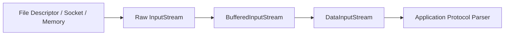
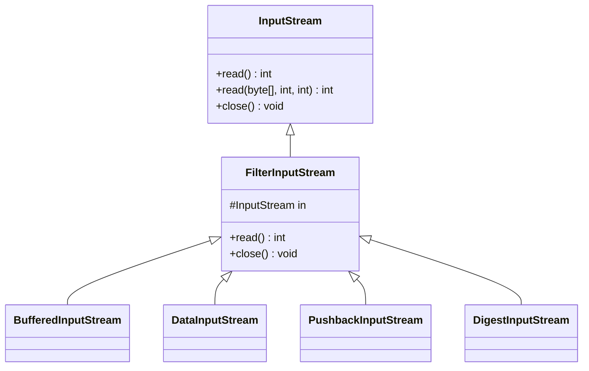
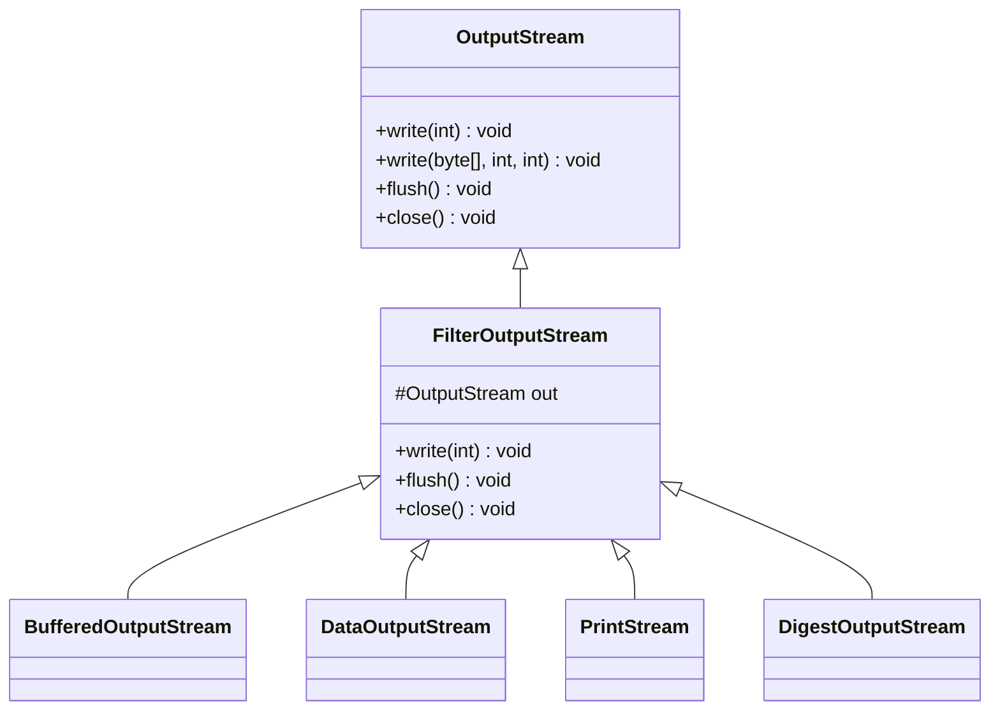
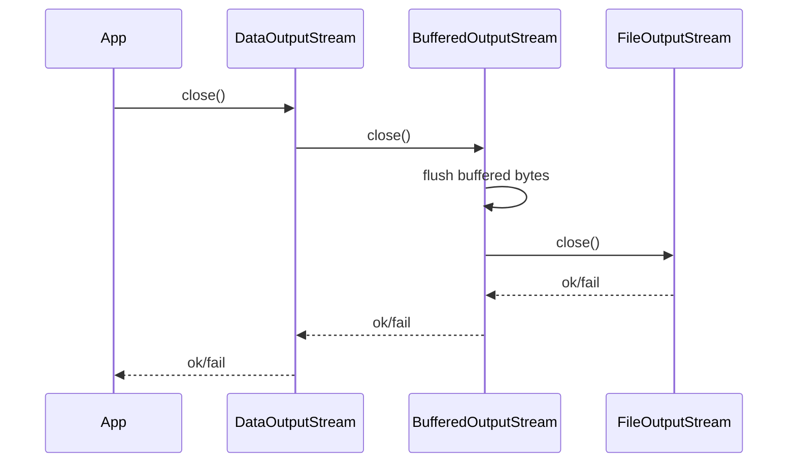
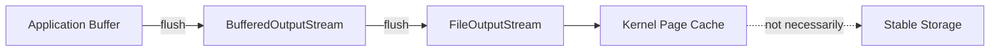

------
title: Learn Java IO, Modern IO, Streams, Buffers, Resources, Serialization & Data Boundaries - Part 005
description: Decorator stream patterns in classic Java IO: filter streams, buffered streams, data streams, print streams, pushback streams, sequence streams, custom wrappers, ordering rules, close propagation, and production failure modes.
series: learn-java-io-modern-io-resource-boundaries
seriesTitle: Learn Java IO, Modern IO, Streams, Buffers, Resources, Serialization & Data Boundaries
order: 5
partTitle: Decorator Stream Patterns
tags:
  - java
  - io
  - streams
  - decorator-pattern
  - filters
  - resources
  - series
date: 2026-06-30
---

# Part 005 — Decorator Stream Patterns

Classic Java IO is not just a set of classes. It is a compositional model.

The core idea is simple:

> A raw byte or character source is usually too primitive for application logic. We wrap it with layers that add buffering, decoding, framing, counting, validation, compression, encryption, parsing, or presentation behavior.

This is the reason Java IO has many classes that look repetitive at first:

```java
InputStream raw = Files.newInputStream(path);
InputStream buffered = new BufferedInputStream(raw);
DataInputStream data = new DataInputStream(buffered);
```

This chain is not accidental ceremony. It encodes a boundary pipeline.



A top-tier engineer does not memorize all wrappers. They understand:

1. which layer owns the resource,
2. which layer transforms bytes,
3. which layer changes buffering behavior,
4. which layer exposes semantic operations,
5. which layer must be closed or flushed,
6. which layer hides errors,
7. which layer is safe to expose across an API boundary.

---

## 1. Kaufman Framing: What Skill Are We Acquiring?

In the Kaufman model, we deconstruct the skill into small decisions that can be practiced independently.

For decorator streams, the real skill is not “know `BufferedInputStream`”. The real skill is:

> Given an IO boundary, construct a stream pipeline whose ordering, buffering, close behavior, error handling, and semantic contract are correct.

### The Sub-Skills

| Sub-skill | What you must be able to decide |
|---|---|
| Source/sink recognition | Is the data coming from file, socket, memory, process, archive, classpath, or custom provider? |
| Byte-vs-character boundary | Is this binary data, encoded text, or structured records? |
| Wrapper ordering | Which transformations must happen first? |
| Buffer placement | Where should buffering be inserted, and where is it redundant? |
| Semantic layer | Should the API expose bytes, chars, lines, primitive values, records, or domain objects? |
| Close ownership | Who closes the chain? Is the stream borrowed or owned? |
| Flush/finish correctness | Does the outer wrapper need to write trailers, checksums, or buffered bytes? |
| Failure visibility | Does the wrapper throw, swallow, defer, or expose errors through side channels? |

### The Practice Loop

For every stream chain you write, ask:

```text
What is the raw resource?
What is the byte/char boundary?
What is the semantic boundary?
Where is the buffer?
What happens on EOF?
What happens on partial read/write?
What happens on close?
What happens if the consumer stops early?
```

That checklist prevents most production IO bugs.

---

## 2. The Decorator Model in Java IO

The classic Java IO design is heavily based on wrapping.

A source stream provides primitive operations:

```java
int read()
int read(byte[] b, int off, int len)
void close()
```

A decorator stream holds another stream and delegates to it while adding behavior.

A simplified version looks like this:

```java
final class CountingInputStream extends FilterInputStream {
    private long count;

    CountingInputStream(InputStream in) {
        super(Objects.requireNonNull(in));
    }

    @Override
    public int read() throws IOException {
        int value = super.read();
        if (value != -1) {
            count++;
        }
        return value;
    }

    @Override
    public int read(byte[] b, int off, int len) throws IOException {
        int n = super.read(b, off, len);
        if (n > 0) {
            count += n;
        }
        return n;
    }

    long count() {
        return count;
    }
}
```

The wrapper does not own storage, a file path, or a socket. It owns behavior around another stream.

### Class Relationship



The same conceptual shape exists for output streams:



---

## 3. Stream Chains Are Boundary Pipelines

A stream chain should be read from raw resource to application semantics.

Example: reading compressed binary records from a file.

```java
try (InputStream raw = Files.newInputStream(path);
     InputStream buffered = new BufferedInputStream(raw);
     InputStream gzip = new GZIPInputStream(buffered);
     DataInputStream data = new DataInputStream(gzip)) {

    int version = data.readUnsignedShort();
    long recordCount = data.readLong();

    for (long i = 0; i < recordCount; i++) {
        int length = data.readInt();
        byte[] payload = data.readNBytes(length);
        process(payload);
    }
}
```

The chain means:

```text
file bytes
  -> buffered file bytes
  -> decompressed bytes
  -> primitive binary reads
  -> application records
```

Ordering matters. This is correct:

```java
new DataInputStream(new GZIPInputStream(new BufferedInputStream(raw)))
```

This is nonsensical for the same file format:

```java
new GZIPInputStream(new DataInputStream(new BufferedInputStream(raw)))
```

`DataInputStream` does not make compressed bytes magically structured before decompression. The protocol order must match the physical encoding order.

---

## 4. Layer Taxonomy

It helps to classify IO classes by responsibility.

| Layer Type | Examples | Responsibility |
|---|---|---|
| Raw source/sink | `FileInputStream`, `FileOutputStream`, `ByteArrayInputStream`, `ByteArrayOutputStream`, socket streams | Connect to actual bytes |
| Buffering decorator | `BufferedInputStream`, `BufferedOutputStream`, `BufferedReader`, `BufferedWriter` | Reduce call overhead, batch reads/writes |
| Semantic decorator | `DataInputStream`, `DataOutputStream`, `ObjectInputStream`, `ObjectOutputStream` | Interpret or emit structured values |
| Text bridge | `InputStreamReader`, `OutputStreamWriter` | Convert bytes to characters using a charset |
| Text convenience | `BufferedReader`, `PrintWriter` | Lines, formatted text, character buffering |
| Lookahead decorator | `PushbackInputStream`, `PushbackReader` | Allow parser to unread a small amount |
| Concatenation | `SequenceInputStream` | Treat multiple input streams as one stream |
| Error-swallowing presentation | `PrintStream`, `PrintWriter` | Convenient printing with deferred error reporting |
| Transformation decorator | `GZIPInputStream`, `ZipInputStream`, `CipherInputStream`, `DigestInputStream` | Transform, inspect, compress, verify, or encode data |

This taxonomy is more useful than memorizing inheritance trees.

---

## 5. Pattern: Buffering Wrapper

### Problem

Calling the underlying resource for every byte or small array can be expensive.

### Pattern

Wrap the raw stream near the resource boundary.

```java
try (InputStream in = new BufferedInputStream(Files.newInputStream(path))) {
    byte[] header = in.readNBytes(16);
    // parse header
}
```

For output:

```java
try (OutputStream out = new BufferedOutputStream(Files.newOutputStream(path))) {
    for (Record record : records) {
        out.write(encode(record));
    }
}
```

### Why Near the Resource Boundary?

Buffering is most useful when it reduces expensive calls to the underlying source or sink. Placing it near the raw stream usually gives the best effect.

Common shape:

```java
new DataInputStream(new BufferedInputStream(Files.newInputStream(path)))
```

Not usually useful:

```java
new BufferedInputStream(new ByteArrayInputStream(bytes))
```

A `ByteArrayInputStream` is already memory-backed. Adding `BufferedInputStream` usually adds complexity without reducing expensive IO.

### Rule

> Buffer at expensive boundaries, not blindly at every layer.

---

## 6. Pattern: Semantic Binary Wrapper

`DataInputStream` and `DataOutputStream` read and write Java primitive values in a portable binary form.

Example:

```java
record UserRecord(int id, long createdAtEpochMillis, boolean active) {}

static void writeUser(OutputStream output, UserRecord user) throws IOException {
    DataOutputStream out = new DataOutputStream(output);
    out.writeInt(user.id());
    out.writeLong(user.createdAtEpochMillis());
    out.writeBoolean(user.active());
}

static UserRecord readUser(InputStream input) throws IOException {
    DataInputStream in = new DataInputStream(input);
    return new UserRecord(
            in.readInt(),
            in.readLong(),
            in.readBoolean()
    );
}
```

This is not a complete file format. It lacks:

1. magic bytes,
2. version,
3. record length,
4. checksum,
5. schema evolution strategy,
6. EOF policy,
7. corruption recovery policy.

A production binary format should generally look more like this:

```text
magic bytes
format version
header length
header payload
record length
record payload
record length
record payload
...
trailer/checksum
```

`DataInputStream` is useful for primitives. It is not a file format by itself.

---

## 7. Pattern: Text Bridge Wrapper

Text is not bytes. Text is bytes plus an encoding.

The byte-to-character boundary belongs at exactly one place.

```java
try (Reader reader = Files.newBufferedReader(path, StandardCharsets.UTF_8)) {
    char[] chars = new char[4096];
    while (true) {
        int n = reader.read(chars);
        if (n == -1) {
            break;
        }
        consume(chars, 0, n);
    }
}
```

Equivalent explicit chain:

```java
try (InputStream raw = Files.newInputStream(path);
     Reader decoded = new InputStreamReader(raw, StandardCharsets.UTF_8);
     BufferedReader reader = new BufferedReader(decoded)) {

    String line;
    while ((line = reader.readLine()) != null) {
        process(line);
    }
}
```

The chain means:

```text
file bytes -> UTF-8 decoded chars -> buffered character reader -> lines
```

### Anti-Pattern: Decode Too Early or Too Often

Bad:

```java
String text = new String(bytes); // platform default charset; avoid
```

Better:

```java
String text = new String(bytes, StandardCharsets.UTF_8);
```

But for large data, avoid materializing all text:

```java
try (BufferedReader reader = Files.newBufferedReader(path, StandardCharsets.UTF_8)) {
    reader.lines().forEach(this::processLine);
}
```

Even here, be careful: `reader.lines()` is lazy and depends on the reader remaining open. Do not return the stream after closing the reader.

---

## 8. Pattern: Lookahead Wrapper

Parsers often need to read one byte or character to decide what to do next, then push it back.

`PushbackInputStream` supports this pattern.

```java
try (PushbackInputStream in = new PushbackInputStream(
        new BufferedInputStream(Files.newInputStream(path)),
        8
)) {
    int first = in.read();
    if (first == '#') {
        skipComment(in);
    } else if (first != -1) {
        in.unread(first);
        parseRecord(in);
    }
}
```

Use cases:

1. protocol sniffing,
2. optional header detection,
3. simple tokenizers,
4. BOM detection,
5. lightweight parsers.

### Boundary Warning

Pushback is local lookahead. It is not a general rewind mechanism.

If you need arbitrary rewind:

1. use a seekable file/channel,
2. use a bounded memory buffer,
3. spool to disk,
4. redesign the protocol.

---

## 9. Pattern: Sequence Wrapper

`SequenceInputStream` concatenates multiple input streams.

```java
try (InputStream first = Files.newInputStream(headerPath);
     InputStream second = Files.newInputStream(bodyPath);
     InputStream combined = new SequenceInputStream(first, second)) {

    combined.transferTo(output);
}
```

This is useful when a consumer expects a single stream, but your data is split into several sequential segments.

### Critical Limitations

`SequenceInputStream` is not:

1. a merge operation,
2. a framing protocol,
3. a multiplexing mechanism,
4. a safe replacement for structured archive handling,
5. a way to preserve source boundaries unless the protocol carries lengths.

The consumer sees one continuous byte sequence. If the boundaries matter, encode them explicitly.

---

## 10. Pattern: Counting, Limiting, and Guard Wrappers

The JDK does not provide every production wrapper you need. You will often create small wrappers to enforce boundaries.

### Limiting Input

A common production need is to prevent a parser from reading more than the allowed payload size.

```java
final class LimitedInputStream extends FilterInputStream {
    private long remaining;

    LimitedInputStream(InputStream in, long limit) {
        super(Objects.requireNonNull(in));
        if (limit < 0) {
            throw new IllegalArgumentException("limit must be >= 0");
        }
        this.remaining = limit;
    }

    @Override
    public int read() throws IOException {
        if (remaining == 0) {
            return -1;
        }
        int value = super.read();
        if (value != -1) {
            remaining--;
        }
        return value;
    }

    @Override
    public int read(byte[] b, int off, int len) throws IOException {
        Objects.checkFromIndexSize(off, len, b.length);
        if (remaining == 0) {
            return -1;
        }
        int allowed = (int) Math.min(len, remaining);
        int n = super.read(b, off, allowed);
        if (n > 0) {
            remaining -= n;
        }
        return n;
    }
}
```

Usage:

```java
try (InputStream payload = new LimitedInputStream(raw, maxPayloadBytes)) {
    parse(payload);
}
```

This wrapper creates a local EOF after `limit` bytes. That is useful for nested formats where each section has a declared length.

### Guardrail

A limited stream should not close the underlying stream if the underlying stream must continue after the section. In such cases, either:

1. do not close the wrapper, or
2. implement a wrapper whose `close()` drains or detaches instead of closing, or
3. expose a method that reads exactly the section bytes and returns control to the outer parser.

This is where ownership semantics matter.

---

## 11. Pattern: Tee Output

Sometimes you need to write to two destinations: for example, store a payload and compute a side log or mirror.

The JDK has no general-purpose `TeeOutputStream`, but it is easy to implement.

```java
final class TeeOutputStream extends OutputStream {
    private final OutputStream left;
    private final OutputStream right;

    TeeOutputStream(OutputStream left, OutputStream right) {
        this.left = Objects.requireNonNull(left);
        this.right = Objects.requireNonNull(right);
    }

    @Override
    public void write(int b) throws IOException {
        left.write(b);
        right.write(b);
    }

    @Override
    public void write(byte[] b, int off, int len) throws IOException {
        left.write(b, off, len);
        right.write(b, off, len);
    }

    @Override
    public void flush() throws IOException {
        IOException failure = null;
        try {
            left.flush();
        } catch (IOException e) {
            failure = e;
        }
        try {
            right.flush();
        } catch (IOException e) {
            if (failure != null) {
                failure.addSuppressed(e);
            } else {
                failure = e;
            }
        }
        if (failure != null) {
            throw failure;
        }
    }

    @Override
    public void close() throws IOException {
        IOException failure = null;
        try {
            left.close();
        } catch (IOException e) {
            failure = e;
        }
        try {
            right.close();
        } catch (IOException e) {
            if (failure != null) {
                failure.addSuppressed(e);
            } else {
                failure = e;
            }
        }
        if (failure != null) {
            throw failure;
        }
    }
}
```

The important part is not teeing. The important part is error handling on close.

If one sink fails during close, you still need to attempt closing the other sink.

---

## 12. Pattern: Print Streams for Human-Oriented Output

`PrintStream` and `PrintWriter` are convenient, but dangerous in protocol code.

Example:

```java
try (PrintWriter writer = new PrintWriter(
        Files.newBufferedWriter(path, StandardCharsets.UTF_8)
)) {
    writer.println("id,name,status");
    writer.printf(Locale.ROOT, "%d,%s,%s%n", id, name, status);

    if (writer.checkError()) {
        throw new IOException("failed to write report");
    }
}
```

### Why Dangerous?

`PrintWriter` and `PrintStream` generally do not throw `IOException` from normal write methods. They record error state. You need `checkError()` if the write result matters.

This design is acceptable for simple console-style output. It is usually a poor fit for:

1. financial files,
2. regulatory exports,
3. protocol writers,
4. audit logs,
5. transactional batch output,
6. anything where write failure must abort the operation.

For production data files, prefer explicit `Writer` or `OutputStream` operations that propagate `IOException`.

---

## 13. Close Propagation: Close the Outermost Layer

Given this chain:

```java
try (DataOutputStream out = new DataOutputStream(
        new BufferedOutputStream(
                Files.newOutputStream(path)))) {
    out.writeInt(42);
}
```

The outer `DataOutputStream` closes its wrapped stream, which closes the `BufferedOutputStream`, which flushes and closes the underlying file stream.



### Best Practice

Declare only the outermost stream in try-with-resources when ownership is unambiguous.

```java
try (DataOutputStream out = new DataOutputStream(
        new BufferedOutputStream(Files.newOutputStream(path)))) {
    out.writeLong(123L);
}
```

This is usually cleaner than declaring every intermediate layer.

However, declaring intermediate layers can be useful when:

1. you need direct access to a layer,
2. resources are constructed before the final wrapper,
3. wrapper constructors can throw and you need precise cleanup,
4. different layers have independent ownership.

---

## 14. Wrapper Constructor Failure

A subtle resource leak can happen when a raw resource is opened, then a wrapper constructor fails before try-with-resources owns it.

Risky shape:

```java
InputStream raw = Files.newInputStream(path);
InputStream gzip = new GZIPInputStream(raw); // may throw
try (InputStream in = gzip) {
    // use in
}
```

If `new GZIPInputStream(raw)` throws because the file is not a valid GZIP stream, `raw` is not closed unless you handle it.

Safer:

```java
try (InputStream raw = Files.newInputStream(path);
     InputStream buffered = new BufferedInputStream(raw);
     InputStream gzip = new GZIPInputStream(buffered)) {
    gzip.transferTo(OutputStream.nullOutputStream());
}
```

Now each successfully constructed resource is registered for cleanup.

### Trade-Off

This makes the resource list longer. For risky wrappers such as compression, encryption, archive, or object stream constructors, explicit resource registration can be worth it.

---

## 15. Ordering Rules for Common Chains

### Reading UTF-8 Text From a File

```java
try (BufferedReader reader = Files.newBufferedReader(path, StandardCharsets.UTF_8)) {
    // lines/chars
}
```

Explicit chain:

```java
new BufferedReader(new InputStreamReader(Files.newInputStream(path), StandardCharsets.UTF_8))
```

### Writing UTF-8 Text

```java
try (BufferedWriter writer = Files.newBufferedWriter(path, StandardCharsets.UTF_8)) {
    writer.write("hello");
    writer.newLine();
}
```

### Reading Compressed Text

```java
try (InputStream raw = Files.newInputStream(path);
     InputStream buffered = new BufferedInputStream(raw);
     InputStream gzip = new GZIPInputStream(buffered);
     Reader decoder = new InputStreamReader(gzip, StandardCharsets.UTF_8);
     BufferedReader reader = new BufferedReader(decoder)) {

    reader.lines().forEach(this::processLine);
}
```

Pipeline:

```text
file bytes -> buffered bytes -> decompressed bytes -> UTF-8 chars -> lines
```

### Writing Compressed Text

```java
try (OutputStream raw = Files.newOutputStream(path);
     OutputStream buffered = new BufferedOutputStream(raw);
     OutputStream gzip = new GZIPOutputStream(buffered);
     Writer encoder = new OutputStreamWriter(gzip, StandardCharsets.UTF_8);
     BufferedWriter writer = new BufferedWriter(encoder)) {

    writer.write("record-1");
    writer.newLine();
}
```

Pipeline:

```text
chars -> UTF-8 bytes -> compressed bytes -> buffered file bytes -> file
```

The output order is the reverse conceptual path of reading.

### Binary File With Header and Records

```java
try (DataOutputStream out = new DataOutputStream(
        new BufferedOutputStream(Files.newOutputStream(path)))) {

    out.writeInt(0x4A494F31); // JIO1
    out.writeShort(1);        // version

    for (Payload payload : payloads) {
        byte[] encoded = payload.encode();
        out.writeInt(encoded.length);
        out.write(encoded);
    }
}
```

---

## 16. Mark/Reset and Wrapper Semantics

`BufferedInputStream` can add `mark`/`reset` support even when the underlying stream does not support it, as long as the read-ahead limit is respected.

```java
try (BufferedInputStream in = new BufferedInputStream(Files.newInputStream(path))) {
    if (in.markSupported()) {
        in.mark(1024);
        byte[] probe = in.readNBytes(16);
        inspect(probe);
        in.reset();
    }
}
```

### Invariant

> `mark/reset` is a bounded lookback contract, not a promise of infinite rewind.

If you read beyond the mark limit, `reset()` may fail.

### Production Advice

Use `mark/reset` for small local probes. Do not use it to implement large rollback semantics.

For large rollback, prefer:

1. `SeekableByteChannel`,
2. `FileChannel.position(...)`,
3. bounded spool files,
4. explicit protocol framing.

---

## 17. `available()` Is Not File Size

Many engineers misuse `available()`.

Bad:

```java
byte[] bytes = new byte[in.available()];
in.read(bytes);
```

Problems:

1. `available()` is not total stream length.
2. It may return zero even when future data can arrive.
3. `read(bytes)` is not guaranteed to fill the array.
4. It breaks for sockets, pipes, compressed streams, and many custom streams.

Better for bounded files:

```java
byte[] bytes = Files.readAllBytes(path);
```

Better for streams:

```java
byte[] buffer = new byte[8192];
while (true) {
    int n = in.read(buffer);
    if (n == -1) {
        break;
    }
    process(buffer, 0, n);
}
```

Better for declared-length protocol sections:

```java
byte[] payload = in.readNBytes(length);
if (payload.length != length) {
    throw new EOFException("truncated payload");
}
```

---

## 18. Partial Reads and Wrapper Correctness

A wrapper must respect the `InputStream` contract. The hardest part is partial reads.

Wrong custom wrapper:

```java
@Override
public int read(byte[] b, int off, int len) throws IOException {
    int n = in.read(b, off, len);
    count += len; // wrong
    return n;
}
```

Correct:

```java
@Override
public int read(byte[] b, int off, int len) throws IOException {
    int n = in.read(b, off, len);
    if (n > 0) {
        count += n;
    }
    return n;
}
```

Why?

1. `read` may return fewer bytes than requested.
2. `read` may return `-1` for EOF.
3. Some streams may return `0` for zero-length reads.
4. You must count actual bytes transferred, not requested bytes.

---

## 19. Partial Writes and Wrapper Correctness

`OutputStream.write(byte[], off, len)` is specified to write all requested bytes or throw, but lower-level abstractions such as channels may perform partial writes.

When adapting a `WritableByteChannel` to stream-like behavior, you must loop.

```java
static void writeFully(WritableByteChannel channel, ByteBuffer buffer) throws IOException {
    while (buffer.hasRemaining()) {
        int n = channel.write(buffer);
        if (n == 0) {
            Thread.onSpinWait();
        }
    }
}
```

For non-blocking channels, this simple spin loop is wrong. You need selector-driven readiness and backpressure. That appears later in the NIO selector part.

The point here is the mental model:

> Stream output usually hides partial writes. Channel output exposes them.

---

## 20. Flush Semantics

`flush()` pushes buffered data to the next layer. It does not necessarily make data durable.

Example:

```java
try (BufferedOutputStream out = new BufferedOutputStream(Files.newOutputStream(path))) {
    out.write(payload);
    out.flush();
}
```

This ensures the `BufferedOutputStream` passes its bytes to the underlying stream. It does not guarantee the filesystem has persisted the bytes to stable storage.

Durability is a separate concern covered in the crash consistency part.

### Flush Chain



### Practical Rules

1. Use `flush()` when a downstream consumer needs data before close.
2. Avoid flushing after every small write unless latency demands it.
3. Closing an output stream usually flushes first, but explicit `flush()` can make failure timing clearer.
4. Do not confuse flush with durable commit.

---

## 21. `finish()` vs `close()` in Transforming Streams

Some output wrappers write trailers or final blocks.

Examples:

1. `GZIPOutputStream` writes compression trailer/checksum.
2. `ZipOutputStream` writes entry metadata and central directory.
3. `CipherOutputStream` may need final block handling.
4. `ObjectOutputStream` has stream protocol state.

For these streams, merely flushing is not enough.

```java
ByteArrayOutputStream bytes = new ByteArrayOutputStream();
try (GZIPOutputStream gzip = new GZIPOutputStream(bytes)) {
    gzip.write(payload);
}
byte[] compressed = bytes.toByteArray();
```

Do not read `bytes.toByteArray()` before the `GZIPOutputStream` is closed or finished. The compressed data may be incomplete.

If you need to keep the underlying stream open, use `finish()` where the API provides it.

```java
GZIPOutputStream gzip = new GZIPOutputStream(out);
gzip.write(payload);
gzip.finish(); // completes gzip stream without necessarily closing 'out'
```

### Boundary Rule

> `flush()` is for buffered bytes. `finish()` is for format completion. `close()` is for resource lifecycle.

They are related but not equivalent.

---

## 22. The Outermost Type Is the API Contract

This method exposes a byte stream:

```java
void importPayload(InputStream input) throws IOException
```

This method exposes text:

```java
void importCsv(Reader reader) throws IOException
```

This method exposes a file boundary:

```java
void importFile(Path path) throws IOException
```

This method exposes a repeatable byte source:

```java
void importPayload(Supplier<? extends InputStream> source) throws IOException
```

Each API has different semantics.

| API shape | Consumer can assume | Consumer cannot assume |
|---|---|---|
| `InputStream` | one-pass bytes | seek, replay, length, charset |
| `Reader` | one-pass chars | original bytes, encoding, byte offsets |
| `Path` | filesystem object | stable contents unless controlled |
| `byte[]` | in-memory complete payload | streaming scalability |
| `Supplier<InputStream>` | replayable if documented | same content unless guaranteed |
| `SeekableByteChannel` | position-based access | text decoding semantics |

The outermost abstraction is not cosmetic. It is the contract.

---

## 23. Good and Bad Pipeline Examples

### Good: Bounded Upload Processing

```java
void processUpload(InputStream upload, long declaredLength, long maxBytes) throws IOException {
    if (declaredLength < 0 || declaredLength > maxBytes) {
        throw new IOException("invalid upload length: " + declaredLength);
    }

    try (InputStream limited = new LimitedInputStream(upload, declaredLength);
         InputStream buffered = new BufferedInputStream(limited)) {
        parseUpload(buffered);
    }
}
```

This makes the boundary explicit.

### Bad: Unbounded Materialization

```java
void processUpload(InputStream upload) throws IOException {
    byte[] all = upload.readAllBytes();
    parseUpload(new ByteArrayInputStream(all));
}
```

This is only acceptable when the input is already bounded and small by contract.

### Good: Explicit Charset

```java
try (BufferedReader reader = new BufferedReader(
        new InputStreamReader(upload, StandardCharsets.UTF_8))) {
    parseCsv(reader);
}
```

### Bad: Platform Default Charset

```java
try (BufferedReader reader = new BufferedReader(new InputStreamReader(upload))) {
    parseCsv(reader);
}
```

This can produce different behavior across machines and deployments.

---

## 24. Production Failure Modes

| Failure Mode | Cause | Symptom | Prevention |
|---|---|---|---|
| Incomplete compressed output | Read underlying bytes before close/finish | Consumer says file corrupt | Close/finish transform wrapper before reading underlying bytes |
| Silent print failure | `PrintWriter`/`PrintStream` hides write exception | Missing/truncated report | Use `checkError()` or avoid print wrappers for critical data |
| Wrong decoding | Default charset | Data differs by environment | Always specify charset |
| Wrapper constructor leak | Raw stream opened before failing wrapper | File descriptor leak | Register raw stream in try-with-resources |
| Wrong wrapper order | Transform after semantic parser | Corrupt parse | Match physical encoding order |
| Over-buffering | Buffer memory-backed stream or multiple layers | Extra memory/copying | Buffer only expensive boundaries |
| Accidental close | Helper closes borrowed stream | Caller cannot continue | Document ownership; use non-closing wrapper if needed |
| Misused `available()` | Treated as total size | Truncated reads | Loop until EOF or use known length |
| Lost source boundaries | Concatenation without framing | Cannot split records later | Encode lengths or metadata |

---

## 25. Design Checklist

Before you commit IO wrapper code, answer these:

1. Is the data binary, text, records, or objects?
2. Where exactly does byte-to-char decoding happen?
3. Are all charsets explicit?
4. Is buffering placed near expensive boundaries?
5. Does wrapper order match the physical data format?
6. Does the outermost type express the correct API contract?
7. Who owns and closes the stream?
8. Can wrapper construction fail after raw resource acquisition?
9. Does any wrapper need `finish()` before the underlying bytes are used?
10. Does any wrapper hide errors behind `checkError()`?
11. Is the input bounded before materialization?
12. Are partial reads handled correctly?
13. Are protocol boundaries encoded explicitly?
14. Is `available()` avoided as a size indicator?
15. Is close failure visible to the caller?

---

## 26. Practice Exercises

### Exercise 1 — Fix the Chain

Given:

```java
InputStream in = new DataInputStream(
        new BufferedInputStream(
                new GZIPInputStream(Files.newInputStream(path))));
```

Question:

Is this good? If not, what would you change?

Answer:

The declared type loses the fact that this is a `DataInputStream`. The buffering is also inside gzip, which may not be ideal because the raw compressed file reads are not buffered before decompression.

Better:

```java
try (InputStream raw = Files.newInputStream(path);
     InputStream buffered = new BufferedInputStream(raw);
     InputStream gzip = new GZIPInputStream(buffered);
     DataInputStream in = new DataInputStream(gzip)) {
    // read structured binary values
}
```

### Exercise 2 — Detect Silent Print Failure

Write a method that writes CSV using `PrintWriter`, but throws an exception if writing failed.

```java
static void writeCsv(Path path, List<String[]> rows) throws IOException {
    try (PrintWriter writer = new PrintWriter(
            Files.newBufferedWriter(path, StandardCharsets.UTF_8))) {

        for (String[] row : rows) {
            writer.println(String.join(",", row));
        }

        if (writer.checkError()) {
            throw new IOException("CSV write failed: " + path);
        }
    }
}
```

Production note: this still does not escape CSV values correctly. The exercise is about stream error behavior, not CSV correctness.

### Exercise 3 — Implement a Counting Output Stream

```java
final class CountingOutputStream extends FilterOutputStream {
    private long count;

    CountingOutputStream(OutputStream out) {
        super(Objects.requireNonNull(out));
    }

    @Override
    public void write(int b) throws IOException {
        out.write(b);
        count++;
    }

    @Override
    public void write(byte[] b, int off, int len) throws IOException {
        Objects.checkFromIndexSize(off, len, b.length);
        out.write(b, off, len);
        count += len;
    }

    long count() {
        return count;
    }
}
```

Discussion:

For `OutputStream`, if `write(byte[], off, len)` returns normally, the requested bytes have been accepted by the stream. So `count += len` is correct here.

### Exercise 4 — Design a Stream API

Choose the API type for each case:

| Use Case | Preferred API |
|---|---|
| Import a one-pass HTTP body | `InputStream` |
| Parse a UTF-8 text config | `Reader` or `Path` with explicit charset |
| Read a large file with random access | `SeekableByteChannel` or `FileChannel` |
| Retry parsing from the beginning | `Path`, `byte[]`, or `Supplier<InputStream>` |
| Process untrusted upload with size limit | `InputStream` plus explicit declared/max length |
| Generate a report file | `Path` or `OutputStream`, depending on ownership |

---

## 27. Mini Capstone: Safe Length-Prefixed Reader

This example combines buffering, data semantics, boundary enforcement, and partial-read correctness.

```java
final class LengthPrefixedPayloadReader implements Closeable {
    private final DataInputStream in;
    private final int maxPayloadBytes;

    LengthPrefixedPayloadReader(InputStream source, int maxPayloadBytes) {
        if (maxPayloadBytes <= 0) {
            throw new IllegalArgumentException("maxPayloadBytes must be positive");
        }
        this.in = new DataInputStream(new BufferedInputStream(source));
        this.maxPayloadBytes = maxPayloadBytes;
    }

    Optional<byte[]> readNext() throws IOException {
        final int length;
        try {
            length = in.readInt();
        } catch (EOFException eof) {
            return Optional.empty();
        }

        if (length < 0 || length > maxPayloadBytes) {
            throw new IOException("invalid payload length: " + length);
        }

        byte[] payload = in.readNBytes(length);
        if (payload.length != length) {
            throw new EOFException("truncated payload: expected " + length + ", got " + payload.length);
        }
        return Optional.of(payload);
    }

    @Override
    public void close() throws IOException {
        in.close();
    }
}
```

Key points:

1. The stream is buffered once.
2. `DataInputStream` provides primitive length reads.
3. The declared length is validated before allocation.
4. EOF before a new length means normal end of stream.
5. EOF inside a payload means truncation/corruption.
6. The wrapper owns and closes the chain.

---

## 28. Summary

Decorator streams are Java IO's core composition mechanism.

The expert-level view is not “wrap everything in `BufferedInputStream`”. The expert-level view is:

> Build a pipeline that matches the physical data representation, adds exactly the necessary semantics, exposes the correct API boundary, and preserves lifecycle/error correctness.

The key invariants are:

1. wrapper order must match data encoding order,
2. byte/char conversion must happen exactly once and with explicit charset,
3. buffering belongs near expensive boundaries,
4. close the owner of the outermost layer,
5. `flush`, `finish`, and `close` are distinct operations,
6. print wrappers may hide IO failures,
7. `available()` is not length,
8. partial reads must be handled,
9. boundaries must be explicit if they matter,
10. API parameter type is a semantic contract.

---

## References

- Oracle Java SE 25 API — `java.io` Package Summary: https://docs.oracle.com/en/java/javase/25/docs/api/java.base/java/io/package-summary.html
- Oracle Java SE 25 API — `FilterInputStream`: https://docs.oracle.com/en/java/javase/25/docs/api/java.base/java/io/FilterInputStream.html
- Oracle Java SE 25 API — `PrintWriter`: https://docs.oracle.com/en/java/javase/25/docs/api/java.base/java/io/PrintWriter.html
- Oracle Java SE 25 API — `Files`: https://docs.oracle.com/en/java/javase/25/docs/api/java.base/java/nio/file/Files.html
- Oracle Java SE 25 API — `InputStream`: https://docs.oracle.com/en/java/javase/25/docs/api/java.base/java/io/InputStream.html
