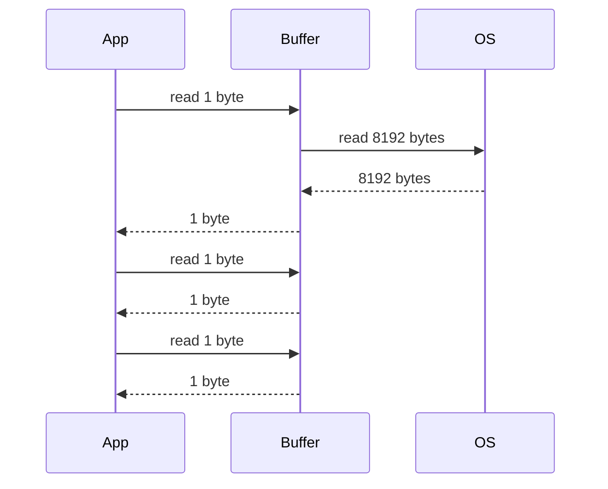
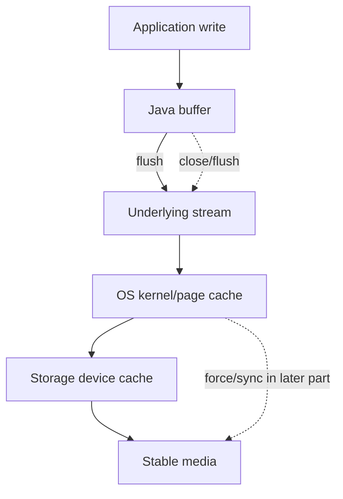
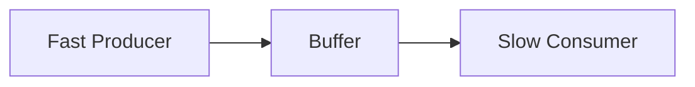

------
title: Learn Java IO, Modern IO, Streams, Buffers, Resources, Serialization & Data Boundaries - Part 006
description: Deep dive into buffering in Java IO: why buffers exist, how they affect syscall frequency, latency, throughput, flush behavior, memory pressure, buffer sizing, read/write loops, and production tuning.
series: learn-java-io-modern-io-resource-boundaries
seriesTitle: Learn Java IO, Modern IO, Streams, Buffers, Resources, Serialization & Data Boundaries
order: 6
partTitle: Buffering Deep Dive
tags:
  - java
  - io
  - buffering
  - performance
  - streams
  - resources
  - series
date: 2026-06-30
---

# Part 006 — Buffering Deep Dive

Buffering is one of the most misunderstood parts of IO engineering.

Many engineers learn a simplistic rule:

> Always use `BufferedInputStream` and `BufferedOutputStream`.

That rule is incomplete.

A better rule is:

> Use buffering to reduce expensive boundary crossings, smooth data flow, and control memory/latency trade-offs. Do not add buffers blindly.

Buffering can improve throughput dramatically. It can also increase latency, duplicate memory, hide backpressure, delay errors, and create false confidence about durability.

This part builds the mental model needed to reason about buffering in production systems.

---

## 1. Kaufman Framing: The Skill to Acquire

The practical skill is:

> Given an IO workload, decide where buffering is needed, how large it should be, when it should flush, and what correctness assumptions it does or does not provide.

### Sub-Skills

| Sub-skill | Practical question |
|---|---|
| Boundary recognition | Which call crosses an expensive boundary: JVM/native, kernel, disk, network, process, compression, parser? |
| Workload classification | Is this latency-sensitive, throughput-sensitive, memory-sensitive, or durability-sensitive? |
| Buffer placement | Should buffering happen at stream, channel, application, protocol, or framework level? |
| Buffer sizing | What size is reasonable given record size, concurrency, memory budget, and IO medium? |
| Flush policy | When does downstream visibility matter? |
| Durability separation | Does the code need visibility, completion, or stable storage? |
| Backpressure awareness | Can the producer outpace the consumer? |
| Failure timing | When will write errors surface: write, flush, finish, or close? |

### Learning Target

After this part, you should be able to review IO code and say:

1. this buffer is useful,
2. this buffer is redundant,
3. this buffer is too large for the concurrency model,
4. this flush policy destroys throughput,
5. this flush is not a durable commit,
6. this code hides partial-read semantics,
7. this memory allocation will fail under load.

---

## 2. Why Buffers Exist

An IO operation often crosses several boundaries:


Each boundary crossing has overhead.

If you read one byte at a time from a file without buffering, you may trigger many small operations through the stack.

Bad:

```java
try (InputStream in = Files.newInputStream(path)) {
    long count = 0;
    while (in.read() != -1) {
        count++;
    }
}
```

Better:

```java
try (InputStream in = new BufferedInputStream(Files.newInputStream(path))) {
    long count = 0;
    while (in.read() != -1) {
        count++;
    }
}
```

Even better when you do not need byte-by-byte semantics:

```java
try (InputStream in = Files.newInputStream(path)) {
    byte[] buffer = new byte[64 * 1024];
    long count = 0;
    while (true) {
        int n = in.read(buffer);
        if (n == -1) {
            break;
        }
        count += n;
    }
}
```

The last version uses an application buffer and avoids byte-by-byte calls entirely.

---

## 3. Buffering Is Batching

Buffering is a batching strategy.

For input:

```text
expensive read from source -> fill buffer -> cheap reads from memory
```

For output:

```text
cheap writes to memory -> buffer fills -> expensive write to sink
```



The app asked for small reads. The buffer converted them into fewer large reads.

This is why buffering helps when the application API requires small operations.

It helps less when the application already performs large reads.

---

## 4. Buffer Layers in Real Systems

There is rarely just one buffer.

```mermaid
flowchart TD
    A[Application Object Buffer]
    B[byte[] / char[] Loop Buffer]
    C[BufferedInputStream / BufferedReader]
    D[ByteBuffer]
    E[JVM / Native Copy Boundary]
    F[Kernel Page Cache]
    G[Disk Controller / Device Cache]
    H[Network Socket Buffer]

    A --> B --> C --> D --> E --> F --> G
    F --> H
```

Typical buffer layers:

1. application-level collections,
2. parser buffers,
3. `byte[]` loop buffers,
4. `BufferedInputStream` / `BufferedOutputStream`,
5. `BufferedReader` / `BufferedWriter`,
6. `ByteBuffer`,
7. compression library buffers,
8. TLS/cipher buffers,
9. servlet or HTTP framework buffers,
10. OS page cache,
11. socket send/receive buffers,
12. database or message broker client buffers.

### Consequence

Adding another buffer is not automatically good. You need to know what boundary it reduces.

If data is already in a `byte[]`, this is usually unnecessary:

```java
InputStream in = new BufferedInputStream(new ByteArrayInputStream(bytes));
```

If data comes from a file and the consumer reads small chunks, this is useful:

```java
InputStream in = new BufferedInputStream(Files.newInputStream(path));
```

---

## 5. Input Buffer Internals: Conceptual Model

A buffered input stream can be modeled as:

```java
final class ConceptualBufferedInput {
    private final InputStream source;
    private final byte[] buffer;
    private int position;
    private int limit;

    int read() throws IOException {
        if (position == limit) {
            limit = source.read(buffer);
            position = 0;
            if (limit == -1) {
                return -1;
            }
        }
        return buffer[position++] & 0xff;
    }
}
```

This is not the real JDK implementation. It is the mental model.

Important state:

| State | Meaning |
|---|---|
| `buffer` | memory region holding prefetched bytes |
| `position` | next byte to return to caller |
| `limit` | number of valid bytes in buffer |
| empty buffer | need to refill from source |
| EOF | source returned `-1` |

### Why This Matters

When a buffered stream has read ahead, the underlying raw stream position may be ahead of the application's logical position.

Example:

```java
BufferedInputStream buffered = new BufferedInputStream(raw, 8192);
int first = buffered.read();
```

The application consumed one byte. The underlying raw stream may have consumed thousands.

This matters when:

1. mixing buffered and unbuffered reads,
2. handing the raw stream to another component,
3. using protocols with strict boundary ownership,
4. attempting to reposition or inspect underlying state.

### Rule

> Once a stream is wrapped with a buffered reader, do not also read from the underlying raw stream.

---

## 6. Output Buffer Internals: Conceptual Model

A buffered output stream can be modeled as:

```java
final class ConceptualBufferedOutput {
    private final OutputStream sink;
    private final byte[] buffer;
    private int count;

    void write(byte[] bytes, int off, int len) throws IOException {
        if (len >= buffer.length) {
            flush();
            sink.write(bytes, off, len);
            return;
        }

        if (len > buffer.length - count) {
            flush();
        }

        System.arraycopy(bytes, off, buffer, count, len);
        count += len;
    }

    void flush() throws IOException {
        if (count > 0) {
            sink.write(buffer, 0, count);
            count = 0;
        }
        sink.flush();
    }
}
```

Again, this is conceptual.

### Why This Matters

Until a buffer is flushed or closed, the underlying sink may not receive bytes.

That is fine for file generation. It may be wrong for interactive protocols.

Example where flush matters:

```java
writer.write("READY\n");
writer.flush(); // peer should see READY now
```

Example where flush is harmful:

```java
for (Record record : records) {
    writer.write(encode(record));
    writer.flush(); // throughput killer
}
```

---

## 7. Buffering and `read(byte[])`

The best performance improvement is often not adding a `BufferedInputStream`. It is avoiding byte-by-byte reads.

Bad:

```java
int value;
while ((value = in.read()) != -1) {
    digest.update((byte) value);
}
```

Better:

```java
byte[] buffer = new byte[64 * 1024];
while (true) {
    int n = in.read(buffer);
    if (n == -1) {
        break;
    }
    digest.update(buffer, 0, n);
}
```

With a loop buffer, the application explicitly works in batches.

### Correct Read Loop

```java
static long copy(InputStream in, OutputStream out) throws IOException {
    byte[] buffer = new byte[64 * 1024];
    long total = 0;

    while (true) {
        int n = in.read(buffer);
        if (n == -1) {
            break;
        }
        out.write(buffer, 0, n);
        total += n;
    }

    return total;
}
```

### Common Bug

```java
int n = in.read(buffer);
out.write(buffer); // wrong: writes entire buffer, including stale bytes
```

Correct:

```java
out.write(buffer, 0, n);
```

The length returned by `read` is part of the data boundary.

---

## 8. Buffer Size Is a Trade-Off

A buffer has three main effects:

1. fewer calls across expensive boundaries,
2. more memory per active operation,
3. potentially more latency before data is visible downstream.

### Tiny Buffers

```java
byte[] buffer = new byte[16];
```

Pros:

1. low memory,
2. low batching delay.

Cons:

1. high call overhead,
2. poor throughput,
3. inefficient disk/network access patterns.

### Huge Buffers

```java
byte[] buffer = new byte[64 * 1024 * 1024];
```

Pros:

1. fewer application-level calls,
2. sometimes helpful for very large sequential workloads.

Cons:

1. high memory per operation,
2. GC pressure for heap arrays,
3. bad under high concurrency,
4. worse cache locality,
5. may not improve throughput after a point.

### Reasonable Starting Points

These are engineering starting points, not universal laws:

| Workload | Initial buffer size to try |
|---|---:|
| General file copy | 64 KiB |
| Small text parsing | 8 KiB to 32 KiB |
| Large sequential binary files | 64 KiB to 1 MiB |
| High-concurrency request handling | 8 KiB to 64 KiB, bounded by memory budget |
| Socket protocols | Depends on message size, latency, and framework buffers |
| Compression pipelines | Match compressor behavior and benchmark |

Always validate with realistic workload measurements.

---

## 9. Buffer Size and Concurrency Budget

Buffer size must be multiplied by concurrency.

```text
memory = buffer_size * active_operations * buffers_per_operation
```

Example:

```text
buffer_size = 1 MiB
active_uploads = 2,000
buffers_per_upload = 2
memory = 1 MiB * 2,000 * 2 = 4,000 MiB
```

That is roughly 4 GiB just for IO buffers.

A buffer size that is reasonable for a CLI batch job can be disastrous in a server.

### Budgeting Table

| Buffer per operation | 100 concurrent ops | 1,000 concurrent ops | 10,000 concurrent ops |
|---:|---:|---:|---:|
| 8 KiB | ~0.8 MiB | ~7.8 MiB | ~78 MiB |
| 64 KiB | ~6.25 MiB | ~62.5 MiB | ~625 MiB |
| 1 MiB | ~100 MiB | ~1 GiB | ~10 GiB |
| 8 MiB | ~800 MiB | ~8 GiB | ~80 GiB |

This is why production IO design must include concurrency assumptions.

---

## 10. Heap Buffers vs Direct Buffers

Classic stream buffers are usually heap arrays:

```java
byte[] buffer = new byte[64 * 1024];
```

NIO can use `ByteBuffer.allocate(...)` or `ByteBuffer.allocateDirect(...)`.

```java
ByteBuffer heap = ByteBuffer.allocate(64 * 1024);
ByteBuffer direct = ByteBuffer.allocateDirect(64 * 1024);
```

This part focuses on stream buffering. Direct buffers get a dedicated deep dive later.

For now, remember:

| Buffer Type | Typical Use | Risk |
|---|---|---|
| Heap `byte[]` | Classic stream loops, parsers, moderate buffers | GC pressure when many/large allocations |
| Heap `ByteBuffer` | NIO APIs with easy array access | May require copy to native for some IO |
| Direct `ByteBuffer` | Native IO, channels, high-throughput networking/file IO | Native memory pressure, allocation cost, lifecycle visibility |

### Rule

Do not jump to direct buffers until you understand the IO path and have measurements.

---

## 11. Buffering Text: `BufferedReader` and `BufferedWriter`

Character buffering is separate from byte buffering.

This chain has both byte-to-char decoding and character buffering:

```java
try (BufferedReader reader = new BufferedReader(
        new InputStreamReader(Files.newInputStream(path), StandardCharsets.UTF_8))) {

    String line;
    while ((line = reader.readLine()) != null) {
        process(line);
    }
}
```

`BufferedReader` buffers characters. `InputStreamReader` decodes bytes into characters.

### Important: `readLine()` Removes Line Terminators

`readLine()` returns a line without the line termination characters.

That is convenient for many text files. It is wrong if the exact original bytes or line endings matter.

For example, do not use `readLine()` when:

1. preserving exact file content,
2. computing a byte-level signature,
3. parsing a protocol where CRLF is semantic,
4. preserving platform-specific line endings,
5. reporting byte offsets.

Use byte-level or character-level parsing instead.

---

## 12. Double Buffering

Double buffering means adding multiple buffers around the same boundary.

Example:

```java
InputStream in = new BufferedInputStream(
        new BufferedInputStream(Files.newInputStream(path)));
```

This is useless in most cases.

A subtler version:

```java
BufferedReader reader = new BufferedReader(
        Files.newBufferedReader(path, StandardCharsets.UTF_8));
```

`Files.newBufferedReader(...)` already returns a `BufferedReader`. Wrapping it again adds little value.

### But Not All Multiple Buffers Are Bad

This can be valid:

```java
try (InputStream raw = Files.newInputStream(path);
     InputStream fileBuffer = new BufferedInputStream(raw);
     InputStream gzip = new GZIPInputStream(fileBuffer);
     Reader decoder = new InputStreamReader(gzip, StandardCharsets.UTF_8);
     BufferedReader charBuffer = new BufferedReader(decoder)) {
    // process lines
}
```

Here the byte buffer and character buffer serve different layers.

### Diagnostic Question

For each buffer, ask:

```text
What expensive operation does this buffer reduce?
```

If you cannot answer, the buffer may be redundant.

---

## 13. Flush Is Visibility, Not Durability

`flush()` means “push buffered data to the next layer”.

It does not mean:

1. the peer processed the data,
2. the file is durable on disk,
3. the transaction committed,
4. the OS page cache has been forced to stable storage,
5. a compressed/archive format is complete.

Example:

```java
try (BufferedWriter writer = Files.newBufferedWriter(path, StandardCharsets.UTF_8)) {
    writer.write("hello");
    writer.flush();
}
```

This flushes Java-level buffered characters through the underlying writer/stream. It does not guarantee crash-safe persistence.

### Visibility Levels



Durability requires stronger APIs and careful file update protocols. That comes later in the crash consistency part.

---

## 14. Flush Frequency

Flushing too often can destroy throughput.

Bad batch writer:

```java
for (String line : lines) {
    writer.write(line);
    writer.newLine();
    writer.flush();
}
```

Better:

```java
for (String line : lines) {
    writer.write(line);
    writer.newLine();
}
writer.flush();
```

Best for file generation:

```java
try (BufferedWriter writer = Files.newBufferedWriter(path, StandardCharsets.UTF_8)) {
    for (String line : lines) {
        writer.write(line);
        writer.newLine();
    }
}
```

Close will flush the writer.

### When Frequent Flush Is Correct

Flush after a message when the peer is waiting for it.

```java
writer.write("AUTH OK\r\n");
writer.flush();
```

Flush policies are protocol decisions, not performance decoration.

| Use Case | Flush Policy |
|---|---|
| File batch output | At close, maybe at coarse checkpoints |
| Interactive protocol | After complete outbound message |
| CLI progress output | After user-visible update if needed |
| Logging | Framework-dependent; often asynchronous/batched |
| Compression output | `finish()` or close for format completion |
| Audit export | Flush may be useful, but durability still requires stronger commit protocol |

---

## 15. Buffering and Error Timing

With buffered output, errors may appear later than the logical write.

```java
writer.write("record-1"); // may only write to Java buffer
writer.write("record-2"); // may only write to Java buffer
writer.close();            // actual sink write may fail here
```

Therefore, close failure matters.

Bad:

```java
try {
    writeFile(path, records);
} catch (IOException e) {
    log.warn("write failed", e);
}
// continue as if file is valid
```

Better:

```java
try {
    writeFile(path, records);
    publish(path);
} catch (IOException e) {
    Files.deleteIfExists(path);
    throw e;
}
```

A write operation is not complete until close succeeds, especially for buffered or transforming wrappers.

---

## 16. Buffering and Backpressure

Buffers can hide downstream slowness temporarily.



This can be good:

1. absorbs small bursts,
2. reduces call overhead,
3. improves throughput.

It can be bad:

1. allows memory growth,
2. delays detection of slow consumers,
3. causes large latency spikes when buffers fill,
4. hides overload until it is severe.

Classic streams do not provide a full backpressure protocol. They block or throw. Frameworks build richer models above them.

For synchronous Java IO:

> A bounded buffer plus blocking writes is the simplest backpressure mechanism.

For async/reactive systems:

> Buffering must be coordinated with demand signals, cancellation, and bounded queues.

This series covers IO-level buffering here; reactive backpressure belongs to the concurrency/reactive series, but we will revisit boundary design in the streaming pipeline part.

---

## 17. Bounded Materialization

`ByteArrayOutputStream` is a buffer that grows in memory.

Good for small bounded data:

```java
ByteArrayOutputStream out = new ByteArrayOutputStream();
out.write(header);
out.write(payload);
byte[] message = out.toByteArray();
```

Dangerous for unbounded data:

```java
ByteArrayOutputStream out = new ByteArrayOutputStream();
input.transferTo(out); // unbounded memory growth
```

Better with an explicit limit:

```java
static byte[] readBounded(InputStream in, int maxBytes) throws IOException {
    ByteArrayOutputStream out = new ByteArrayOutputStream(Math.min(maxBytes, 8192));
    byte[] buffer = new byte[8192];
    int total = 0;

    while (true) {
        int n = in.read(buffer);
        if (n == -1) {
            return out.toByteArray();
        }
        total += n;
        if (total > maxBytes) {
            throw new IOException("input exceeds limit: " + maxBytes);
        }
        out.write(buffer, 0, n);
    }
}
```

### Important

Limit before allocation when a protocol declares a length.

Bad:

```java
int length = in.readInt();
byte[] payload = new byte[length]; // can OOM or negative-size fail
```

Better:

```java
int length = in.readInt();
if (length < 0 || length > maxPayloadBytes) {
    throw new IOException("invalid payload length: " + length);
}
byte[] payload = in.readNBytes(length);
if (payload.length != length) {
    throw new EOFException("truncated payload");
}
```

---

## 18. Buffer Reuse

Allocating new buffers repeatedly can create avoidable GC pressure.

Bad:

```java
for (Path file : files) {
    try (InputStream in = Files.newInputStream(file)) {
        byte[] buffer = new byte[64 * 1024];
        while (in.read(buffer) != -1) {
            // process
        }
    }
}
```

The allocation may be acceptable. Do not over-optimize prematurely.

For hot loops or high-throughput services, reuse can help:

```java
byte[] buffer = new byte[64 * 1024];
for (Path file : files) {
    try (InputStream in = Files.newInputStream(file)) {
        while (true) {
            int n = in.read(buffer);
            if (n == -1) {
                break;
            }
            process(buffer, 0, n);
        }
    }
}
```

### But Beware of Reuse Bugs

If `process` stores the buffer reference, the next read overwrites it.

Bad:

```java
chunks.add(buffer); // stores mutable reused buffer; wrong
```

Correct:

```java
chunks.add(Arrays.copyOf(buffer, n));
```

or process synchronously before the next read.

### Rule

> Reuse buffers only when ownership and lifetime are clear.

---

## 19. Buffer Pools

Buffer pools can reduce allocation overhead, but they introduce complexity.

Potential benefits:

1. fewer large allocations,
2. reduced GC pressure,
3. stable memory footprint,
4. faster hot path under load.

Risks:

1. leaks when buffers are not returned,
2. data retention across requests,
3. accidental sharing between threads,
4. pool contention,
5. memory hoarding,
6. harder debugging.

A minimal pool contract must define:

1. maximum pool size,
2. buffer size classes,
3. borrow/return ownership,
4. behavior when exhausted,
5. clearing policy,
6. thread-safety model,
7. metrics.

For most application code, local buffers are simpler and safer.

Use pools only when measurements justify them.

---

## 20. Buffering and Character Encoding

Do not split multibyte characters manually unless you understand decoder state.

Bad:

```java
byte[] buffer = new byte[3];
while (in.read(buffer) != -1) {
    String s = new String(buffer, StandardCharsets.UTF_8); // wrong for arbitrary chunks
    process(s);
}
```

UTF-8 characters can span chunk boundaries.

Correct:

```java
try (Reader reader = new InputStreamReader(in, StandardCharsets.UTF_8)) {
    char[] chars = new char[4096];
    while (true) {
        int n = reader.read(chars);
        if (n == -1) {
            break;
        }
        process(chars, 0, n);
    }
}
```

The decoder maintains state across byte chunks.

This is why byte buffering and character buffering are not interchangeable.

---

## 21. Buffering and Line Processing

Line-by-line processing is convenient but can hide memory risks.

```java
try (BufferedReader reader = Files.newBufferedReader(path, StandardCharsets.UTF_8)) {
    String line;
    while ((line = reader.readLine()) != null) {
        process(line);
    }
}
```

This is good when lines are bounded.

It is risky when a malicious or malformed input can contain a single huge line.

Possible mitigations:

1. enforce maximum line length with a custom reader,
2. parse by chunks instead of lines,
3. validate input size before parsing,
4. use streaming parsers with configured limits,
5. reject files without line delimiters after a threshold.

### Custom Bounded Line Reader Concept

```java
static String readLineBounded(Reader reader, int maxChars) throws IOException {
    StringBuilder line = new StringBuilder();
    while (true) {
        int c = reader.read();
        if (c == -1) {
            return line.isEmpty() ? null : line.toString();
        }
        if (c == '\n') {
            return line.toString();
        }
        if (c != '\r') {
            line.append((char) c);
        }
        if (line.length() > maxChars) {
            throw new IOException("line too long: " + maxChars);
        }
    }
}
```

This is simple and not the fastest approach, but it shows the boundary principle.

---

## 22. `transferTo` and Buffering

`InputStream.transferTo(OutputStream)` copies all bytes from input to output.

```java
try (InputStream in = Files.newInputStream(source);
     OutputStream out = Files.newOutputStream(target)) {
    in.transferTo(out);
}
```

It is convenient and usually good for simple copying.

But know the contract implications:

1. it copies until EOF,
2. it is not bounded by default,
3. it may block for a long time,
4. it does not validate expected length,
5. it does not provide progress by itself,
6. it does not imply atomic replace,
7. it does not imply durable commit.

For production file ingestion, you often need a controlled loop:

```java
static long copyBounded(InputStream in, OutputStream out, long maxBytes) throws IOException {
    byte[] buffer = new byte[64 * 1024];
    long total = 0;

    while (true) {
        int n = in.read(buffer);
        if (n == -1) {
            return total;
        }
        total += n;
        if (total > maxBytes) {
            throw new IOException("input exceeds limit: " + maxBytes);
        }
        out.write(buffer, 0, n);
    }
}
```

---

## 23. Buffering and Compression

Compression libraries already buffer internally to some degree. Adding outer buffers can still be useful, but placement matters.

Reading compressed file:

```java
try (InputStream raw = Files.newInputStream(path);
     InputStream fileBuffer = new BufferedInputStream(raw);
     InputStream gzip = new GZIPInputStream(fileBuffer)) {
    consume(gzip);
}
```

This buffers reads from the file before decompression.

Writing compressed file:

```java
try (OutputStream raw = Files.newOutputStream(path);
     OutputStream fileBuffer = new BufferedOutputStream(raw);
     OutputStream gzip = new GZIPOutputStream(fileBuffer)) {
    produce(gzip);
}
```

This buffers compressed bytes before writing to the file.

### Important

For compressed output, `close()` or `finish()` is required to complete the format. `flush()` is not enough to guarantee a valid compressed file.

---

## 24. Buffering and Sockets

Sockets are latency-sensitive and backpressure-sensitive.

Over-buffering can delay messages.

Example:

```java
writer.write("PING\n");
// missing flush: peer may never see it promptly
```

Correct for request/response protocol:

```java
writer.write("PING\n");
writer.flush();
```

But flushing every field is wrong:

```java
writer.write("USER ");
writer.flush();
writer.write(username);
writer.flush();
writer.write("\n");
writer.flush();
```

Better:

```java
writer.write("USER ");
writer.write(username);
writer.write("\n");
writer.flush();
```

### Protocol Rule

> Flush at message boundaries, not arbitrary write boundaries.

---

## 25. Buffering and Files

File writes are usually throughput-oriented.

Good shape:

```java
try (BufferedOutputStream out = new BufferedOutputStream(Files.newOutputStream(path))) {
    for (Record record : records) {
        out.write(encode(record));
    }
}
```

For critical file replacement, buffering is not enough. You need:

1. write to temp file,
2. close successfully,
3. force data if durability matters,
4. atomic move where supported,
5. possibly force parent directory metadata.

That is covered in later parts.

Here, keep the separation clear:

| Concern | Buffering solves? |
|---|---|
| Too many small writes | Yes |
| Data visible before close | Only with flush |
| Compressed format complete | No, need finish/close |
| Crash-safe persistence | No |
| Atomic replace | No |
| File descriptor leak | No |
| Partial logical output | No, needs protocol/checkpointing |

---

## 26. Buffering and Temporary Files

Temporary files are often better than memory buffers for large or untrusted data.

Bad for large untrusted input:

```java
byte[] payload = input.readAllBytes();
```

Better:

```java
Path temp = Files.createTempFile("upload-", ".bin");
try {
    try (OutputStream out = new BufferedOutputStream(Files.newOutputStream(temp))) {
        copyBounded(input, out, maxUploadBytes);
    }
    processTempFile(temp);
} finally {
    Files.deleteIfExists(temp);
}
```

This shifts buffering from heap memory to filesystem-backed storage.

Trade-offs:

1. lower heap risk,
2. uses disk space,
3. requires cleanup,
4. slower than memory for small payloads,
5. enables retry/seek/replay if needed.

---

## 27. Measuring Buffering

Do not benchmark IO with unrealistic microbenchmarks.

Common mistakes:

1. measuring only page cache hits,
2. using tiny test files,
3. ignoring warmup,
4. ignoring GC logs,
5. ignoring concurrent workloads,
6. testing on developer laptop only,
7. comparing different semantics,
8. not validating output correctness,
9. measuring compression and IO together without separation,
10. ignoring close/flush time.

### Better Measurement Plan

For file copy or parsing:

1. use realistic file sizes,
2. test cold-ish and warm page-cache scenarios separately if possible,
3. measure total time including close,
4. measure CPU, allocation, GC, and memory,
5. test expected concurrency,
6. test slow storage or network filesystem if production uses it,
7. validate checksums or record counts,
8. compare several buffer sizes: 8 KiB, 64 KiB, 256 KiB, 1 MiB.

### Simple Timing Harness

This is not a replacement for JMH, but it is useful for operational experiments.

```java
static long timeMillis(IORunnable action) throws IOException {
    long start = System.nanoTime();
    action.run();
    return TimeUnit.NANOSECONDS.toMillis(System.nanoTime() - start);
}

@FunctionalInterface
interface IORunnable {
    void run() throws IOException;
}
```

Use this for coarse IO experiments, not CPU micro-optimizations.

---

## 28. Buffering Anti-Patterns

### Anti-Pattern 1 — Byte-by-Byte File Processing

```java
while (in.read() != -1) {
    // work
}
```

Use an array buffer unless byte-by-byte semantics are required.

### Anti-Pattern 2 — Flush Every Record

```java
for (Record record : records) {
    writer.write(record.toString());
    writer.flush();
}
```

Flush at meaningful boundaries.

### Anti-Pattern 3 — Unbounded Memory Buffer

```java
ByteArrayOutputStream out = new ByteArrayOutputStream();
in.transferTo(out);
```

Use limits or temp files.

### Anti-Pattern 4 — Double Wrapping Without Purpose

```java
new BufferedInputStream(new BufferedInputStream(raw))
```

Know what each buffer reduces.

### Anti-Pattern 5 — Mixing Raw and Buffered Reads

```java
BufferedInputStream buffered = new BufferedInputStream(raw);
int a = buffered.read();
int b = raw.read(); // wrong: raw position may be ahead
```

After wrapping, use the wrapper.

### Anti-Pattern 6 — Assuming Flush Means Durable

```java
writer.flush();
markJobComplete(); // wrong if durability matters
```

Flush is not a commit protocol.

### Anti-Pattern 7 — Ignoring Close Failure

```java
out.write(data);
// close failure ignored by framework/helper
```

Close can surface delayed write failures.

### Anti-Pattern 8 — Buffer Per Item

```java
for (Record record : records) {
    byte[] buffer = new byte[64 * 1024];
    encode(record, buffer);
}
```

Use a reusable buffer or streaming encoder when appropriate.

---

## 29. Review Checklist

Use this checklist during code review.

### Input

1. Does the code read in batches where possible?
2. Does it handle `read` returning fewer bytes than requested?
3. Does it distinguish EOF before a record from EOF inside a record?
4. Is input size bounded before materialization?
5. Is charset decoding handled by `Reader`/decoder rather than chunk-by-chunk `String` conversion?
6. Is `available()` avoided as a size signal?
7. Are raw and buffered streams not mixed?
8. Are line lengths bounded if the input is untrusted?

### Output

1. Are small writes batched?
2. Is flush frequency justified by protocol or UX?
3. Is close failure visible?
4. Are transforming streams finished/closed before bytes are consumed?
5. Is `PrintWriter`/`PrintStream` avoided for critical data or checked with `checkError()`?
6. Is durability not confused with flush?
7. Is memory budget calculated under concurrency?

### Performance

1. Is buffer size reasonable for workload?
2. Is there redundant buffering?
3. Are buffers allocated per request/item unnecessarily?
4. Is benchmarking realistic?
5. Are compression/encoding costs separated from raw IO costs?

---

## 30. Mini Capstone: Bounded Buffered Copy With Progress

This example shows a practical production-style copy primitive.

```java
final class CopyResult {
    private final long bytesCopied;

    CopyResult(long bytesCopied) {
        this.bytesCopied = bytesCopied;
    }

    long bytesCopied() {
        return bytesCopied;
    }
}

@FunctionalInterface
interface ProgressListener {
    void onBytesCopied(long totalBytesCopied);
}

static CopyResult copyBounded(
        InputStream input,
        OutputStream output,
        long maxBytes,
        int bufferSize,
        ProgressListener progress
) throws IOException {
    if (maxBytes < 0) {
        throw new IllegalArgumentException("maxBytes must be >= 0");
    }
    if (bufferSize <= 0) {
        throw new IllegalArgumentException("bufferSize must be > 0");
    }

    byte[] buffer = new byte[bufferSize];
    long total = 0;

    while (true) {
        int n = input.read(buffer);
        if (n == -1) {
            output.flush();
            return new CopyResult(total);
        }

        total += n;
        if (total > maxBytes) {
            throw new IOException("copy exceeds limit: " + maxBytes);
        }

        output.write(buffer, 0, n);

        if (progress != null) {
            progress.onBytesCopied(total);
        }
    }
}
```

### What This Example Gets Right

1. It reads in batches.
2. It writes only bytes actually read.
3. It enforces a maximum size.
4. It validates buffer size.
5. It exposes progress without materializing all data.
6. It flushes at the end for downstream visibility.
7. It leaves close ownership to the caller.

### What It Does Not Solve

1. atomic file replacement,
2. crash-safe durability,
3. checksums,
4. resumability,
5. cancellation,
6. async backpressure,
7. compression finalization.

Those are separate concerns.

---

## 31. Summary

Buffering is not a magic performance switch. It is a batching mechanism with correctness consequences.

The key invariants are:

1. buffer expensive boundaries,
2. avoid byte-by-byte operations unless semantically required,
3. use array/chunk loops for bulk transfer,
4. do not mix raw and buffered reads,
5. size buffers according to concurrency and memory budget,
6. distinguish byte buffers from character buffers,
7. flush at semantic boundaries, not habitually,
8. do not confuse flush with durability,
9. treat close as part of write completion,
10. bound memory materialization,
11. measure with realistic workloads,
12. avoid redundant buffering unless layers serve different purposes.

A production engineer should be able to defend every buffer in the codebase:

```text
This buffer exists because ___.
It is placed here because ___.
It is this size because ___.
It flushes when ___ because ___.
It is safe under concurrency because ___.
```

If that sentence cannot be completed, the buffer design is probably accidental.

---

## References

- Oracle Java SE 25 API — `java.io` Package Summary: https://docs.oracle.com/en/java/javase/25/docs/api/java.base/java/io/package-summary.html
- Oracle Java SE 25 API — `BufferedInputStream`: https://docs.oracle.com/en/java/javase/25/docs/api/java.base/java/io/BufferedInputStream.html
- Oracle Java SE 25 API — `BufferedOutputStream`: https://docs.oracle.com/en/java/javase/25/docs/api/java.base/java/io/BufferedOutputStream.html
- Oracle Java SE 25 API — `BufferedReader`: https://docs.oracle.com/en/java/javase/25/docs/api/java.base/java/io/BufferedReader.html
- Oracle Java SE 25 API — `BufferedWriter`: https://docs.oracle.com/en/java/javase/25/docs/api/java.base/java/io/BufferedWriter.html
- Oracle Java SE 25 API — `InputStream.transferTo`: https://docs.oracle.com/en/java/javase/25/docs/api/java.base/java/io/InputStream.html#transferTo(java.io.OutputStream)
- Oracle Java SE 25 API — `Files`: https://docs.oracle.com/en/java/javase/25/docs/api/java.base/java/nio/file/Files.html
