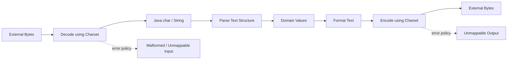
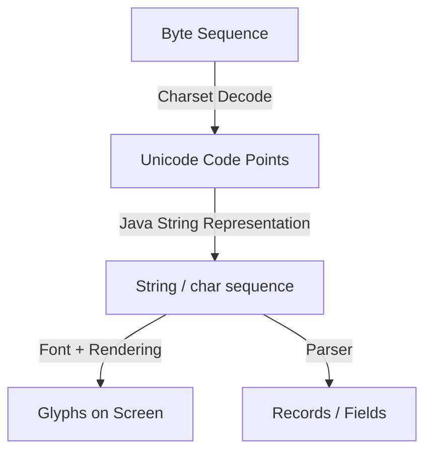
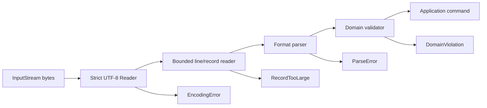
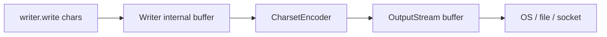

------
title: Learn Java IO, Modern IO, Streams, Buffers, Resources, Serialization & Data Boundaries - Part 007
description: Text IO deep dive for Java engineers: charset boundaries, Unicode, BOM, newline normalization, strict decoding, malformed input, and safe text transfer design.
series: learn-java-io-modern-io-resource-boundaries
seriesTitle: Learn Java IO, Modern IO, Streams, Buffers, Resources, Serialization & Data Boundaries
order: 7
partTitle: Text IO: Charset, Unicode, BOM, Newline, Encoding Boundaries
tags:
  - java
  - io
  - text-io
  - charset
  - unicode
  - utf-8
  - encoding
  - streams
  - series
date: 2026-06-30
---

# Part 007 — Text IO: Charset, Unicode, BOM, Newline, Encoding Boundaries

> Target skill: mampu mendesain, membaca, menulis, menguji, dan mereview text IO Java secara eksplisit, aman, portable, dan tahan terhadap korupsi data lintas platform, bahasa, encoding, file, network, dan pipeline.

Text IO terlihat sederhana karena API-nya familiar: `Reader`, `Writer`, `String`, `Files.readString`, `Files.lines`, `BufferedReader`, `PrintWriter`. Namun di production, banyak bug data boundary muncul bukan karena developer tidak tahu cara membaca file, tetapi karena mereka tidak membedakan **byte**, **character**, **glyph**, **line**, **record**, dan **domain value**.

Materi ini bukan mengulang basic string atau basic stream. Fokus kita adalah kemampuan top-tier engineer: melihat text sebagai **boundary conversion problem**.



Core invariant:

> **Text IO is never just IO. Text IO is byte IO plus charset policy plus structural parsing plus lifecycle management.**

---

## 1. Kaufman Deconstruction: Sub-skill yang Harus Dikuasai

Mengikuti pendekatan Josh Kaufman, kita tidak belajar text IO sebagai topik besar yang abstrak. Kita pecah menjadi skill kecil yang bisa dilatih dan dikoreksi.

| Sub-skill | Mengapa penting | Failure jika lemah |
|---|---|---|
| Membedakan byte vs char vs code point | Java IO memiliki byte stream dan character stream terpisah | Data multilingual rusak, emoji hilang, length salah |
| Memilih charset eksplisit | Boundary eksternal butuh encoding contract | File bekerja di laptop, rusak di server |
| Mengatur decoder error policy | Data corrupt harus terdeteksi atau diganti secara sadar | Silent replacement menghasilkan data legal tapi salah |
| Menangani newline lintas platform | Windows, Unix, legacy systems berbeda | Record count salah, checksum mismatch |
| Memahami BOM | Beberapa file UTF memakai byte order mark | Header field mengandung karakter tersembunyi |
| Streaming text dengan bounded memory | File/log/export bisa sangat besar | OOM karena `readString()`/`readAllLines()` |
| Testing non-ASCII dan malformed bytes | Test ASCII-only memberi rasa aman palsu | Bug baru muncul saat data real masuk |

Latihan 20 jam untuk bagian ini bukan “hafal API”, tetapi membuat banyak boundary kecil: strict UTF-8 reader, lossy reader, newline normalizer, BOM skipper, malformed input detector, streaming line processor, dan round-trip test.

---

## 2. Mental Model: Byte, Character, Code Point, Glyph

Dalam diskusi sehari-hari, orang sering menyebut semuanya “karakter”. Untuk engineering, itu terlalu kasar.



### 2.1 Byte

Byte adalah unit eksternal: file, network socket, process pipe, object storage, database BLOB, message payload.

Contoh byte UTF-8:

```text
48 65 6c 6c 6f
```

Itu bisa berarti `Hello` jika didecode sebagai UTF-8, ASCII, atau ISO-8859-1. Namun byte yang sama dapat menghasilkan arti berbeda pada charset berbeda.

### 2.2 Character dan Code Point

Unicode merepresentasikan abstract character sebagai **code point**. Contoh:

```text
A       U+0041
é       U+00E9
中      U+4E2D
🙂      U+1F642
```

Di Java, `String` secara konseptual adalah sequence of Unicode characters, tetapi API historis seperti `char` adalah 16-bit code unit. Artinya, beberapa karakter Unicode modern seperti emoji membutuhkan **surrogate pair**, bukan satu `char`.

```java
String s = "🙂";

System.out.println(s.length());          // 2, jumlah UTF-16 code units
System.out.println(s.codePointCount(0, s.length())); // 1, jumlah code points
```

Inilah alasan bug seperti ini sering terjadi:

```java
// Buruk untuk data Unicode modern
for (int i = 0; i < s.length(); i++) {
    char c = s.charAt(i);
    // bisa memotong surrogate pair
}
```

Lebih aman untuk operasi Unicode-aware:

```java
s.codePoints().forEach(cp -> {
    System.out.println(Integer.toHexString(cp));
});
```

### 2.3 Glyph

Glyph adalah bentuk visual setelah font/rendering. Satu glyph bisa berasal dari beberapa code point, misalnya huruf plus combining mark. Jadi jangan menyamakan:

- jumlah byte,
- jumlah `char`,
- jumlah code point,
- jumlah glyph,
- jumlah user-perceived character.

Untuk IO boundary, yang paling penting adalah:

> Jangan gunakan `String.length()` sebagai ukuran byte transfer, ukuran payload eksternal, atau batas protokol.

---

## 3. Java Text IO Boundary

Java membedakan byte IO dan character IO.

| Layer | API | Unit utama | Cocok untuk |
|---|---|---|---|
| Byte IO | `InputStream`, `OutputStream`, `ReadableByteChannel`, `ByteBuffer` | byte | file binary, network, compressed data, protocol frame |
| Character IO | `Reader`, `Writer`, `CharBuffer` | char/code unit | decoded text |
| Text utility | `Files.readString`, `Files.newBufferedReader`, `BufferedReader.lines` | `String`/line | text file sederhana sampai menengah |

Bridge utamanya:

```java
InputStream  -> InputStreamReader  -> Reader
OutputStream -> OutputStreamWriter -> Writer
```

Contoh explicit UTF-8:

```java
try (Reader reader = new InputStreamReader(inputStream, StandardCharsets.UTF_8)) {
    // consume text
}
```

Contoh tulis explicit UTF-8:

```java
try (Writer writer = new OutputStreamWriter(outputStream, StandardCharsets.UTF_8)) {
    writer.write("Halo, dunia 🌍\n");
}
```

Rule:

> Setiap kali byte berubah menjadi text atau text berubah menjadi byte, charset harus menjadi bagian dari contract.

---

## 4. Default Charset: Convenient, tetapi Berbahaya untuk Boundary

Beberapa API memungkinkan penggunaan charset default. Ini nyaman untuk script lokal, tetapi berisiko untuk sistem enterprise.

Contoh yang sebaiknya dihindari untuk boundary persistent atau interoperable:

```java
new FileReader(path.toFile());
new FileWriter(path.toFile());
new InputStreamReader(inputStream); // tanpa charset eksplisit
```

Lebih baik:

```java
Files.newBufferedReader(path, StandardCharsets.UTF_8);
Files.newBufferedWriter(path, StandardCharsets.UTF_8);
new InputStreamReader(inputStream, StandardCharsets.UTF_8);
new OutputStreamWriter(outputStream, StandardCharsets.UTF_8);
```

Kenapa?

- Default charset bisa berbeda antar runtime, container, OS, atau konfigurasi.
- File yang ditulis hari ini bisa dibaca tahun depan oleh runtime berbeda.
- Data exchange antar service harus berbasis contract, bukan environment.

Prinsip review:

```text
Apakah text boundary ini internal sementara, atau persistent/interoperable?
Jika persistent/interoperable, charset harus eksplisit.
```

---

## 5. UTF-8 sebagai Default Contract Modern

Untuk sebagian besar sistem modern, UTF-8 adalah pilihan default yang benar. Java menyediakan `StandardCharsets.UTF_8`, sehingga kita tidak perlu string literal seperti `"UTF-8"`.

```java
byte[] bytes = text.getBytes(StandardCharsets.UTF_8);
String decoded = new String(bytes, StandardCharsets.UTF_8);
```

Namun, memilih UTF-8 saja belum cukup. Kita tetap harus menentukan error policy:

- Apakah malformed byte harus menggagalkan proses?
- Apakah karakter tak bisa direpresentasikan boleh diganti?
- Apakah replacement character `�` boleh masuk ke data domain?
- Apakah lossiness harus dicatat sebagai error bisnis?

Untuk data financial, regulatory, audit, legal, atau identity, silent replacement hampir selalu buruk.

---

## 6. Decode Error: Malformed vs Unmappable

Saat decode byte menjadi char, ada dua jenis error penting.

| Error | Terjadi saat | Contoh |
|---|---|---|
| Malformed input | Byte sequence tidak valid untuk charset | byte invalid UTF-8 |
| Unmappable character | Byte valid tetapi tidak punya mapping | tergantung charset legacy |

Default behavior beberapa API bisa mengganti input buruk dengan replacement character. Itu mungkin sesuai untuk tampilan UI, tetapi tidak untuk ingestion data authoritative.

Untuk strict decoding, gunakan `CharsetDecoder`.

```java
import java.io.*;
import java.nio.charset.*;

public final class StrictTextReaders {
    private StrictTextReaders() {}

    public static Reader utf8(InputStream in) {
        CharsetDecoder decoder = StandardCharsets.UTF_8
                .newDecoder()
                .onMalformedInput(CodingErrorAction.REPORT)
                .onUnmappableCharacter(CodingErrorAction.REPORT);

        return new InputStreamReader(in, decoder);
    }
}
```

Pemakaian:

```java
try (Reader reader = StrictTextReaders.utf8(inputStream)) {
    // Decode error akan muncul sebagai IOException saat read
}
```

Production rule:

> Untuk ingestion data yang menjadi sumber kebenaran, gunakan strict decoder dan gagal cepat pada malformed input.

---

## 7. Encode Error: Saat Text Tidak Bisa Ditulis ke Charset Target

Encoding error terjadi saat `String` ingin ditulis ke charset yang tidak mampu merepresentasikan karakter tersebut.

Contoh: menulis `"Rp 10.000 🙂"` ke US-ASCII.

Strict encoder:

```java
import java.io.*;
import java.nio.charset.*;

public final class StrictTextWriters {
    private StrictTextWriters() {}

    public static Writer writer(OutputStream out, Charset charset) {
        CharsetEncoder encoder = charset
                .newEncoder()
                .onMalformedInput(CodingErrorAction.REPORT)
                .onUnmappableCharacter(CodingErrorAction.REPORT);

        return new OutputStreamWriter(out, encoder);
    }
}
```

Pemakaian:

```java
try (Writer writer = StrictTextWriters.writer(outputStream, StandardCharsets.US_ASCII)) {
    writer.write("hello");     // ok
    writer.write("🙂");        // gagal karena tidak bisa direpresentasikan
}
```

Rule:

> Jika output dikonsumsi sistem legacy dengan charset terbatas, encoding failure adalah compatibility issue, bukan sekadar IO exception.

---

## 8. BOM: Byte Order Mark dan Karakter Tersembunyi

BOM adalah sequence byte khusus di awal file yang bisa menandai encoding atau byte order. Paling sering ditemui:

| Encoding | BOM bytes |
|---|---|
| UTF-8 | `EF BB BF` |
| UTF-16 BE | `FE FF` |
| UTF-16 LE | `FF FE` |
| UTF-32 BE | `00 00 FE FF` |
| UTF-32 LE | `FF FE 00 00` |

Masalah umum: file CSV UTF-8 dengan BOM. Setelah dibaca sebagai UTF-8 biasa, field pertama bisa menjadi:

```text
\uFEFFid
```

Bukan:

```text
id
```

Contoh bug:

```java
String header = line.split(",")[0];

if (header.equals("id")) {
    // false jika header sebenarnya "\uFEFFid"
}
```

Minimal BOM stripping untuk UTF-8 text file:

```java
public static String stripUtf8Bom(String s) {
    if (!s.isEmpty() && s.charAt(0) == '\uFEFF') {
        return s.substring(1);
    }
    return s;
}
```

Untuk byte-level detection yang lebih eksplisit:

```java
import java.io.*;

public final class BomAwareInput {
    private BomAwareInput() {}

    public static InputStream skipUtf8Bom(InputStream in) throws IOException {
        PushbackInputStream pushback = new PushbackInputStream(in, 3);
        byte[] bom = new byte[3];
        int read = pushback.read(bom);

        if (read == 3) {
            boolean utf8Bom = (bom[0] & 0xFF) == 0xEF
                    && (bom[1] & 0xFF) == 0xBB
                    && (bom[2] & 0xFF) == 0xBF;
            if (!utf8Bom) {
                pushback.unread(bom, 0, read);
            }
        } else if (read > 0) {
            pushback.unread(bom, 0, read);
        }

        return pushback;
    }
}
```

Important nuance:

- BOM handling adalah boundary policy.
- Jangan sembarang strip `\uFEFF` di tengah text; bisa jadi data valid.
- Tentukan apakah input contract mengizinkan BOM.
- Jika mengizinkan, tangani hanya di awal stream/file.

---

## 9. Newline: `\n`, `\r\n`, `\r`, dan Record Boundary

Line ending bukan hal estetika. Untuk text file, newline sering menjadi record separator.

| Sequence | Umum di |
|---|---|
| `\n` | Unix/Linux/macOS modern |
| `\r\n` | Windows, banyak protokol text |
| `\r` | legacy Mac / sistem lama |

Java `BufferedReader.readLine()` membaca satu baris tanpa menyertakan line terminator. Ia mengenali beberapa terminator umum.

```java
try (BufferedReader reader = Files.newBufferedReader(path, StandardCharsets.UTF_8)) {
    String line;
    while ((line = reader.readLine()) != null) {
        process(line); // line terminator sudah hilang
    }
}
```

Ini cocok untuk banyak parser line-oriented, tetapi tidak cocok jika:

- line ending harus dipertahankan byte-for-byte,
- checksum file bergantung pada line ending,
- format membedakan `\n` dan `\r\n`,
- record boleh mengandung newline quoted/multiline.

Untuk output, hindari mencampur `System.lineSeparator()` dengan format yang membutuhkan newline eksplisit.

```java
// Bagus untuk human-readable local report
writer.write(System.lineSeparator());

// Bagus untuk protocol/file contract yang menetapkan LF
writer.write("\n");

// Bagus untuk protocol yang menetapkan CRLF
writer.write("\r\n");
```

Rule:

> Newline bukan default environment. Newline adalah bagian dari file/protocol contract.

---

## 10. Reader/Writer vs String Materialization

Ada dua style utama membaca text.

### 10.1 Materialize seluruh text

```java
String content = Files.readString(path, StandardCharsets.UTF_8);
```

Cocok untuk:

- file kecil,
- config lokal kecil,
- test fixtures,
- template kecil,
- input dengan ukuran sudah dibatasi.

Tidak cocok untuk:

- log besar,
- upload user,
- export/report besar,
- stream network,
- file dari sumber tidak terpercaya.

### 10.2 Streaming

```java
try (BufferedReader reader = Files.newBufferedReader(path, StandardCharsets.UTF_8)) {
    String line;
    while ((line = reader.readLine()) != null) {
        process(line);
    }
}
```

Cocok untuk:

- file besar,
- bounded memory,
- ingestion pipeline,
- processing per line/record,
- early termination.

Namun streaming bukan berarti selalu aman. Jika satu line bisa sangat panjang, `readLine()` tetap bisa mengalokasikan memory besar.

Untuk input tidak terpercaya, berikan batas panjang line.

```java
public static String readLineBounded(Reader reader, int maxChars) throws IOException {
    StringBuilder sb = new StringBuilder(Math.min(maxChars, 1024));
    int ch;

    while ((ch = reader.read()) != -1) {
        if (ch == '\n') {
            break;
        }
        if (ch == '\r') {
            reader.mark(1);
            int next = reader.read();
            if (next != '\n' && next != -1) {
                reader.reset();
            }
            break;
        }
        if (sb.length() >= maxChars) {
            throw new IOException("Line exceeds max length: " + maxChars);
        }
        sb.append((char) ch);
    }

    if (ch == -1 && sb.isEmpty()) {
        return null;
    }
    return sb.toString();
}
```

Catatan: method di atas membutuhkan `Reader` yang mendukung `mark/reset` untuk cabang CR. Alternatif production bisa memakai wrapper `BufferedReader` atau state machine tanpa `reset`.

---

## 11. `Files.lines()` dan Resource Lifecycle

`Files.lines(path, charset)` mengembalikan `Stream<String>`. Ini terlihat modern, tetapi tetap membawa resource file yang harus ditutup.

```java
try (Stream<String> lines = Files.lines(path, StandardCharsets.UTF_8)) {
    lines.filter(line -> !line.isBlank())
         .forEach(this::process);
}
```

Anti-pattern:

```java
// Buruk: Stream membawa file descriptor tetapi tidak ditutup eksplisit
Files.lines(path, StandardCharsets.UTF_8)
     .forEach(this::process);
```

Rule:

> Jika Java Stream berasal dari IO, perlakukan sebagai resource, bukan hanya collection pipeline.

---

## 12. Charset Boundary dan Parsing Boundary Harus Dipisah

Jangan mencampur decoding bytes dan parsing domain dalam satu blob kode tanpa boundary eksplisit.

Buruk:

```java
byte[] bytes = input.readAllBytes();
String[] parts = new String(bytes).split(",");
Order order = new Order(parts[0], new BigDecimal(parts[1]));
```

Masalah:

- charset default,
- materialization tanpa batas,
- parser naïve,
- tidak ada error classification,
- tidak ada line/record context,
- tidak ada observability point untuk corrupt input.

Lebih baik:

```java
try (Reader reader = StrictTextReaders.utf8(input)) {
    TextRecordSource records = TextRecordSource.lineOriented(reader, 16 * 1024);

    for (TextRecord record : records) {
        ParsedOrder parsed = orderParser.parse(record.text());
        sink.accept(parsed);
    }
}
```

Mental model:



Ini memberi error taxonomy yang lebih baik:

| Failure | Layer | Contoh response |
|---|---|---|
| Malformed UTF-8 | Decode boundary | reject file as invalid encoding |
| Line too long | Record boundary | reject or quarantine |
| Invalid field count | Format parser | row-level error |
| Invalid date range | Domain validation | business validation error |

---

## 13. Multi-byte Character dan Chunk Boundary

UTF-8 character bisa terdiri dari 1 sampai 4 byte. Saat membaca byte chunk manual, satu karakter bisa terbelah antar chunk.

Contoh `🙂` dalam UTF-8 adalah 4 byte. Jika buffer size 3, byte terakhir masuk chunk berikutnya.

Buruk:

```java
byte[] buffer = new byte[3];
int n;
while ((n = in.read(buffer)) != -1) {
    String s = new String(buffer, 0, n, StandardCharsets.UTF_8);
    process(s); // bisa rusak jika multi-byte char terpotong
}
```

Kenapa buruk? Karena setiap chunk didecode seolah-olah lengkap.

Lebih aman: gunakan `Reader` atau `CharsetDecoder` yang mempertahankan state antar chunk.

```java
try (Reader reader = new InputStreamReader(in, StandardCharsets.UTF_8)) {
    char[] buffer = new char[4096];
    int n;
    while ((n = reader.read(buffer)) != -1) {
        processChars(buffer, 0, n);
    }
}
```

Rule:

> Jangan decode byte chunks secara independen kecuali kamu mengelola decoder state sendiri.

---

## 14. Manual Decoder State dengan `CharsetDecoder`

Kadang kita butuh decode manual, misalnya pada channel/buffer pipeline. Gunakan `CharsetDecoder`, bukan `new String()` per chunk.

```java
import java.nio.*;
import java.nio.charset.*;

public final class IncrementalUtf8Decoder {
    private final CharsetDecoder decoder = StandardCharsets.UTF_8.newDecoder()
            .onMalformedInput(CodingErrorAction.REPORT)
            .onUnmappableCharacter(CodingErrorAction.REPORT);

    private final ByteBuffer byteBuffer = ByteBuffer.allocate(8192);
    private final CharBuffer charBuffer = CharBuffer.allocate(8192);

    public void accept(byte[] bytes, int offset, int length, Appendable out) throws IOException {
        if (length > byteBuffer.remaining()) {
            flushBytes(out, false);
            if (length > byteBuffer.remaining()) {
                throw new IOException("Input chunk too large for decoder buffer");
            }
        }

        byteBuffer.put(bytes, offset, length);
        flushBytes(out, false);
    }

    public void finish(Appendable out) throws IOException {
        flushBytes(out, true);
        flushChars(out, decoder.flush(charBuffer));
    }

    private void flushBytes(Appendable out, boolean endOfInput) throws IOException {
        byteBuffer.flip();
        CoderResult result;
        do {
            result = decoder.decode(byteBuffer, charBuffer, endOfInput);
            flushChars(out, result);
        } while (result.isOverflow());
        byteBuffer.compact();
    }

    private void flushChars(Appendable out, CoderResult result) throws IOException {
        charBuffer.flip();
        out.append(charBuffer);
        charBuffer.clear();

        if (result.isError()) {
            result.throwException();
        }
    }
}
```

Ini bukan API yang harus selalu dibuat sendiri. Untuk sebagian besar kasus, `Reader` cukup. Tetapi memahami pola ini membantu saat nanti masuk NIO buffers/channels.

---

## 15. Writing Text: Flush, Close, dan Partial Visibility

`Writer.write()` menulis character ke writer abstraction. Character itu belum tentu langsung menjadi byte di destination.

Ada beberapa layer:



`flush()` meminta buffered data didorong ke layer bawah. `close()` biasanya melakukan flush lalu menutup resource. Namun `flush()` bukan durability guarantee untuk file. Durability akan dibahas di Part 012.

Contoh safe text write untuk file kecil-menengah:

```java
Path path = Path.of("report.txt");

try (BufferedWriter writer = Files.newBufferedWriter(path, StandardCharsets.UTF_8)) {
    writer.write("id,name,status");
    writer.newLine();
    writer.write("1,Ayu,ACTIVE");
    writer.newLine();
}
```

Kalau file adalah artifact penting, jangan langsung overwrite final path. Gunakan temp file + atomic move. Detail atomicity nanti di Part 011 dan crash consistency di Part 012.

---

## 16. Text Output Contract: Jangan Gunakan `PrintWriter` Sembarangan

`PrintWriter` nyaman karena punya `print`, `println`, dan formatting. Namun ada perangkap besar: beberapa error IO tidak dilempar langsung sebagai checked exception, melainkan disimpan dan harus dicek dengan `checkError()`.

Untuk output yang harus reliable, lebih baik gunakan `BufferedWriter` atau `OutputStreamWriter` yang melempar `IOException`.

Buruk untuk artifact penting:

```java
try (PrintWriter writer = new PrintWriter(Files.newBufferedWriter(path, StandardCharsets.UTF_8))) {
    writer.println("important report");
    // error bisa tidak terlihat jika tidak checkError
}
```

Lebih eksplisit:

```java
try (BufferedWriter writer = Files.newBufferedWriter(path, StandardCharsets.UTF_8)) {
    writer.write("important report");
    writer.newLine();
}
```

Gunakan `PrintWriter` untuk:

- debugging sederhana,
- human-facing quick output,
- API yang memang mengharuskannya,
- output yang error handling-nya tidak kritis.

Hindari untuk:

- financial/audit file,
- regulatory exports,
- ingestion acknowledgment,
- system integration artifact.

---

## 17. Locale Bukan Charset, tetapi Sering Bertemu di Text IO

Charset menentukan bagaimana byte menjadi character. Locale menentukan formatting budaya: angka, tanggal, mata uang, case conversion.

Contoh bug:

```java
String value = String.format("%,.2f", amount);
```

Output bisa berbeda tergantung default locale.

Lebih eksplisit:

```java
String value = String.format(Locale.ROOT, "%.2f", amount);
```

Rule:

> Text boundary contract biasanya butuh dua keputusan eksplisit: charset dan locale/format.

Untuk machine-readable file, gunakan format stabil:

- `Locale.ROOT` untuk formatting teknis,
- ISO-8601 untuk tanggal/waktu,
- decimal separator eksplisit,
- no localized month names kecuali memang human-facing.

---

## 18. Normalization: Karakter Sama Secara Visual, Byte Berbeda

Unicode punya isu normalization. Contoh `é` bisa direpresentasikan sebagai:

- single code point `U+00E9`, atau
- `e` + combining acute accent.

Secara visual mirip, tetapi byte dan length berbeda.

```java
import java.text.Normalizer;

String normalized = Normalizer.normalize(input, Normalizer.Form.NFC);
```

Kapan perlu?

- identity matching,
- search index,
- deduplication,
- filenames lintas platform,
- canonicalization sebelum compare.

Kapan tidak boleh sembarang?

- digital signature,
- exact audit artifact,
- legal text preservation,
- byte-for-byte replay.

Rule:

> Normalization adalah transformasi data. Jangan dilakukan diam-diam pada boundary authoritative tanpa contract.

---

## 19. Filenames Juga Text Boundary

Path terlihat seperti string, tetapi filesystem memiliki aturan berbeda:

- case-sensitive vs case-insensitive,
- Unicode normalization berbeda,
- reserved characters,
- separator berbeda,
- maximum path length,
- hidden character.

Jangan gunakan filename sebagai domain identifier tanpa canonicalization policy.

Buruk:

```java
Path target = uploadDir.resolve(userProvidedFileName);
```

Lebih aman akan dibahas detail di filesystem part, tetapi minimal:

```java
Path target = uploadDir.resolve(userProvidedFileName).normalize();

if (!target.startsWith(uploadDir)) {
    throw new SecurityException("Path traversal attempt");
}
```

Text IO lesson-nya:

> String yang berasal dari luar bukan sekadar string; ia membawa encoding, normalization, dan platform semantics.

---

## 20. Practical Pattern: Strict UTF-8 Line Reader dengan Batas Ukuran

Berikut pola yang sering berguna untuk ingestion file line-oriented.

```java
import java.io.*;
import java.nio.charset.*;
import java.nio.file.*;

public final class StrictUtf8Lines {
    private StrictUtf8Lines() {}

    public static void read(
            Path path,
            int maxLineChars,
            LineConsumer consumer
    ) throws IOException {
        CharsetDecoder decoder = StandardCharsets.UTF_8.newDecoder()
                .onMalformedInput(CodingErrorAction.REPORT)
                .onUnmappableCharacter(CodingErrorAction.REPORT);

        try (Reader reader = new BufferedReader(new InputStreamReader(Files.newInputStream(path), decoder))) {
            long lineNumber = 0;
            String line;
            while ((line = readBoundedLine(reader, maxLineChars)) != null) {
                lineNumber++;
                if (lineNumber == 1) {
                    line = stripUtf8Bom(line);
                }
                consumer.accept(lineNumber, line);
            }
        }
    }

    private static String readBoundedLine(Reader reader, int maxChars) throws IOException {
        StringBuilder sb = new StringBuilder(Math.min(maxChars, 1024));
        int ch;
        boolean sawAny = false;

        while ((ch = reader.read()) != -1) {
            sawAny = true;

            if (ch == '\n') {
                break;
            }

            if (ch == '\r') {
                break; // treat CR as terminator; robust CRLF handling can keep state if needed
            }

            if (sb.length() >= maxChars) {
                throw new IOException("Line exceeds " + maxChars + " chars");
            }
            sb.append((char) ch);
        }

        if (!sawAny && sb.isEmpty()) {
            return null;
        }
        return sb.toString();
    }

    private static String stripUtf8Bom(String line) {
        return !line.isEmpty() && line.charAt(0) == '\uFEFF'
                ? line.substring(1)
                : line;
    }

    @FunctionalInterface
    public interface LineConsumer {
        void accept(long lineNumber, String line) throws IOException;
    }
}
```

Design notes:

- Charset eksplisit.
- Error policy strict.
- Line number tersedia untuk diagnostics.
- Batas line mencegah unbounded memory.
- BOM hanya di-handle pada awal file.
- Parser domain sengaja dipisah dari reader.

---

## 21. Practical Pattern: Stable Text Writer

Untuk export sederhana dengan contract UTF-8 + LF:

```java
import java.io.*;
import java.nio.charset.*;
import java.nio.file.*;
import java.util.*;

public final class StableTextExport {
    private StableTextExport() {}

    public static void writeUsers(Path path, List<UserRow> rows) throws IOException {
        try (BufferedWriter writer = Files.newBufferedWriter(path, StandardCharsets.UTF_8)) {
            writer.write("id,name,status");
            writer.write("\n");

            for (UserRow row : rows) {
                writer.write(escape(row.id()));
                writer.write(',');
                writer.write(escape(row.name()));
                writer.write(',');
                writer.write(escape(row.status()));
                writer.write("\n");
            }
        }
    }

    private static String escape(String value) {
        // Minimal example. Real CSV needs a full CSV writer.
        if (value.indexOf(',') >= 0 || value.indexOf('"') >= 0 || value.indexOf('\n') >= 0) {
            return '"' + value.replace("\"", "\"\"") + '"';
        }
        return value;
    }

    public record UserRow(String id, String name, String status) {}
}
```

Catatan penting: contoh escape di atas cukup untuk menunjukkan boundary thinking, bukan pengganti CSV library matang untuk format CSV kompleks. Top 1% engineer tidak menulis parser CSV production dari nol kecuali ada alasan kuat.

---

## 22. Testing Text IO: Jangan ASCII-only

Test seperti ini terlalu lemah:

```java
String input = "hello";
```

Gunakan test set yang memaksa boundary:

```java
List<String> samples = List.of(
        "ASCII",
        "Café",
        "東京",
        "مرحبا",
        "emoji 🙂",
        "combining e\u0301",
        "line1\nline2",
        "comma,value",
        "quote \" value",
        "leading bom \uFEFF?"
);
```

Round-trip test:

```java
for (String sample : samples) {
    byte[] bytes = sample.getBytes(StandardCharsets.UTF_8);
    String decoded = new String(bytes, StandardCharsets.UTF_8);
    assertEquals(sample, decoded);
}
```

Malformed UTF-8 test:

```java
byte[] invalidUtf8 = {(byte) 0xC3, 0x28};

CharsetDecoder decoder = StandardCharsets.UTF_8.newDecoder()
        .onMalformedInput(CodingErrorAction.REPORT)
        .onUnmappableCharacter(CodingErrorAction.REPORT);

assertThrows(CharacterCodingException.class, () -> decoder.decode(ByteBuffer.wrap(invalidUtf8)));
```

Boundary cases:

- empty file,
- file with only BOM,
- file without trailing newline,
- file with very long line,
- mixed newline styles,
- invalid UTF-8 in middle of stream,
- multi-byte character crossing buffer boundary,
- first header with BOM,
- non-ASCII filename.

---

## 23. Review Checklist untuk Text IO

Gunakan checklist ini saat code review.

### Charset

- [ ] Apakah charset eksplisit di semua external boundary?
- [ ] Apakah `StandardCharsets.UTF_8` digunakan daripada string literal?
- [ ] Apakah default charset hanya dipakai untuk local/human convenience?

### Error policy

- [ ] Apakah malformed input harus reject atau replace?
- [ ] Apakah replacement character boleh masuk domain?
- [ ] Apakah encoding output ke legacy charset bisa gagal secara eksplisit?

### Memory

- [ ] Apakah file/input size bounded sebelum materialization?
- [ ] Apakah `readString()`/`readAllLines()` aman untuk ukuran input?
- [ ] Apakah line length dibatasi untuk untrusted input?

### Structure

- [ ] Apakah newline contract eksplisit?
- [ ] Apakah parser format dipisah dari decoder?
- [ ] Apakah BOM ditangani hanya jika contract mengizinkan?

### Lifecycle

- [ ] Apakah `Files.lines()` ditutup dengan try-with-resources?
- [ ] Apakah writer yang reliable melempar `IOException`?
- [ ] Apakah `flush()` tidak disalahartikan sebagai durability guarantee?

### Unicode

- [ ] Apakah code menghindari asumsi `String.length() == jumlah karakter manusia`?
- [ ] Apakah normalization diperlukan dan dinyatakan sebagai contract?
- [ ] Apakah test mencakup non-ASCII dan malformed bytes?

---

## 24. Anti-patterns

### Anti-pattern 1 — `new String(bytes)`

```java
String s = new String(bytes);
```

Masalah: charset default.

Perbaikan:

```java
String s = new String(bytes, StandardCharsets.UTF_8);
```

### Anti-pattern 2 — Decode per byte chunk

```java
String part = new String(buffer, 0, n, StandardCharsets.UTF_8);
```

Masalah: multi-byte char bisa terbelah.

Perbaikan: gunakan `Reader` atau `CharsetDecoder` stateful.

### Anti-pattern 3 — `readAllLines()` pada upload user

```java
List<String> lines = Files.readAllLines(uploadPath, StandardCharsets.UTF_8);
```

Masalah: unbounded memory.

Perbaikan: streaming + batas ukuran.

### Anti-pattern 4 — Menulis machine file dengan locale default

```java
writer.write(String.format("%,.2f", amount));
```

Masalah: output berbeda antar locale.

Perbaikan:

```java
writer.write(String.format(Locale.ROOT, "%.2f", amount));
```

### Anti-pattern 5 — `PrintWriter` untuk output penting

Masalah: error handling bisa tersembunyi.

Perbaikan: gunakan `BufferedWriter`/`OutputStreamWriter` dan tangani `IOException`.

---

## 25. Deliberate Practice

Latihan berikut menargetkan skill yang bisa langsung kamu pakai di sistem production.

### Exercise 1 — Strict UTF-8 file validator

Buat CLI kecil:

```text
java ValidateUtf8 file.txt
```

Requirement:

- membaca streaming,
- strict UTF-8,
- report line number,
- reject line lebih dari 16 KiB,
- detect BOM,
- exit code berbeda untuk invalid encoding vs IO error.

### Exercise 2 — Newline normalizer

Buat utility:

```text
normalize-newlines input.txt output.txt --target LF
```

Requirement:

- charset eksplisit,
- preserve content selain newline,
- bounded memory,
- tidak merusak Unicode,
- test CRLF, LF, CR.

### Exercise 3 — CSV-ish exporter with explicit contract

Buat export text:

- UTF-8,
- LF newline,
- `Locale.ROOT`,
- no default charset,
- no default locale,
- stable column order,
- test dengan nama non-ASCII.

### Exercise 4 — Malformed byte test harness

Buat test yang inject invalid UTF-8 pada:

- awal file,
- tengah field,
- akhir buffer,
- setelah multi-byte prefix tidak lengkap.

Pastikan strict decoder gagal.

---

## 26. Key Takeaways

1. Text IO adalah conversion boundary, bukan hanya stream reading.
2. Charset harus eksplisit pada semua boundary persistent/interoperable.
3. UTF-8 adalah default modern yang baik, tetapi error policy tetap harus eksplisit.
4. Jangan decode byte chunks secara independen tanpa decoder state.
5. Newline dan BOM adalah bagian dari contract, bukan detail kecil.
6. `String.length()` bukan ukuran byte dan bukan jumlah user-perceived characters.
7. Untuk ingestion authoritative, silent replacement hampir selalu salah.
8. Streaming text tetap butuh batas ukuran record/line.
9. `Files.lines()` harus ditutup karena membawa resource IO.
10. Test text IO harus mencakup non-ASCII, malformed bytes, newline variants, BOM, dan long lines.

---

## 27. Referensi

- Java SE 25 API — `java.io` package: https://docs.oracle.com/en/java/javase/25/docs/api/java.base/java/io/package-summary.html
- Java SE 25 API — `InputStreamReader`: https://docs.oracle.com/en/java/javase/25/docs/api/java.base/java/io/InputStreamReader.html
- Java SE 25 API — `java.nio.charset`: https://docs.oracle.com/en/java/javase/25/docs/api/java.base/java/nio/charset/package-summary.html
- Java SE 25 API — `CharsetDecoder`: https://docs.oracle.com/en/java/javase/25/docs/api/java.base/java/nio/charset/CharsetDecoder.html
- Java SE 25 API — `CharsetEncoder`: https://docs.oracle.com/en/java/javase/25/docs/api/java.base/java/nio/charset/CharsetEncoder.html
- Java SE 25 API — `Files`: https://docs.oracle.com/en/java/javase/25/docs/api/java.base/java/nio/file/Files.html
